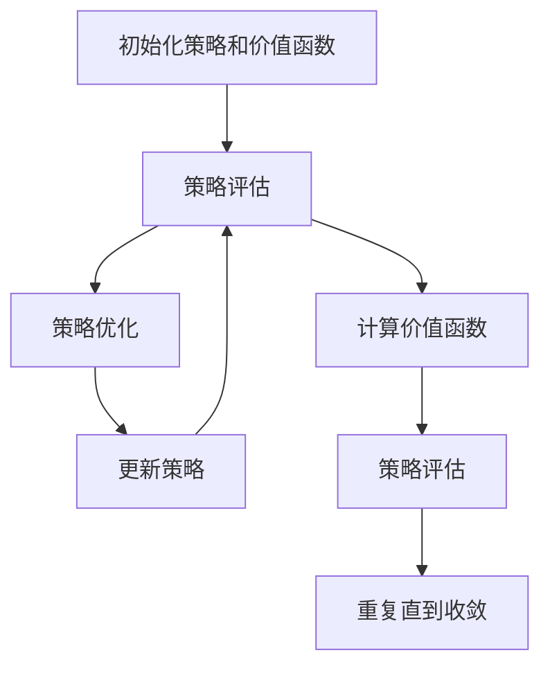
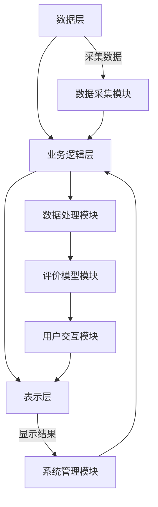
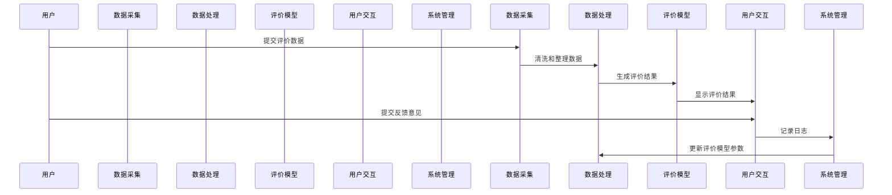

                 

### 文章标题

# 评测系统的元强化学习策略生成

> 关键词：评测系统、元强化学习、策略生成、人工智能、系统架构设计

> 摘要：本文将深入探讨评测系统中的元强化学习策略生成问题，介绍其基本概念、核心原理和实现方法，并通过实际案例进行详细讲解。本文旨在帮助读者理解并掌握评测系统中元强化学习策略生成的关键技术，提高人工智能系统的自适应能力和性能。

## 引言

在当今信息时代，评测系统在各个领域发挥着重要作用。从教育领域的考试评价，到商业领域的风险评估，再到社会管理领域的行为监控，评测系统都扮演着关键角色。然而，随着数据量的不断增长和复杂性的增加，传统的评测系统已经难以满足日益复杂的需求。为了应对这一挑战，人工智能技术的引入成为了一个重要方向。

在人工智能领域，强化学习作为一种重要的机器学习方法，已经在诸多应用场景中取得了显著成效。然而，传统的强化学习方法在应对复杂多变的评测系统时，往往面临着策略搜索空间大、收敛速度慢、适应能力差等问题。为了解决这些问题，元强化学习（Meta-Reinforcement Learning）作为一种新兴的研究方向，逐渐引起了广泛关注。

本文将围绕评测系统的元强化学习策略生成展开讨论。首先，我们将介绍评测系统和元强化学习的基本概念，并阐述它们之间的关联性。然后，我们将详细分析评测系统中元强化学习的核心原理和实现方法。最后，我们将通过一个实际案例，展示元强化学习策略生成的应用效果，并总结本文的主要结论和未来研究方向。

## 背景介绍

### 评测系统的基本概念

评测系统是一种用于对个体或对象进行评价和测量的计算机系统。它广泛应用于教育、商业、医疗、金融等多个领域。评测系统通常包括以下几个核心组成部分：

1. **评价标准**：定义评价的对象和标准，如分数、等级、评分等。
2. **评价算法**：根据评价标准和数据，计算评价结果的方法和策略。
3. **评价数据**：用于评价的输入数据，包括个体的表现数据、背景信息等。
4. **评价结果**：根据评价算法和评价数据生成的评价结果，如考试成绩、风险评估结果等。

评测系统的核心目标是提供客观、公正、有效的评价结果，以帮助决策者做出科学合理的决策。

### 元强化学习的基础理论

元强化学习（Meta-Reinforcement Learning）是强化学习的一种高级形式，旨在通过学习如何学习，提高算法的适应性和效率。它主要关注以下几个关键概念：

1. **策略学习**：元强化学习通过学习策略来指导代理（Agent）在复杂环境中进行决策。
2. **策略搜索**：元强化学习需要在一个大规模的策略搜索空间中找到最优策略。
3. **元学习**：元强化学习通过学习如何快速适应新任务，提高算法的泛化能力。
4. **经验复用**：元强化学习通过复用过去的经验，减少对新任务的训练时间。

### 评测系统与元强化学习的关联性

评测系统和元强化学习之间存在紧密的联系。一方面，评测系统需要利用元强化学习来提高评价的客观性和准确性；另一方面，元强化学习为评测系统提供了新的技术手段，使其能够更好地应对复杂多变的评价任务。

具体来说，评测系统中的元强化学习策略生成可以解决以下几个问题：

1. **策略搜索空间大**：评测系统中的评价对象和评价标准多样化，导致策略搜索空间非常大。元强化学习通过学习如何学习，能够有效地缩小策略搜索空间。
2. **适应能力差**：传统的强化学习算法在适应新评价任务时，往往需要大量的训练数据和时间。元强化学习通过元学习机制，能够快速适应新任务，提高评价系统的适应能力。
3. **收敛速度慢**：评测系统中的评价任务通常具有非线性、动态变化的特点，导致传统强化学习算法收敛速度较慢。元强化学习通过经验复用和策略搜索优化，能够加速收敛过程。

### 本书的组织结构与主要内容

本书将分为七个主要部分，分别介绍评测系统和元强化学习的基本概念、核心原理、实现方法、应用案例等。

1. **第一部分：背景介绍**：介绍评测系统和元强化学习的基本概念，以及它们在评测系统中的应用背景。
2. **第二部分：核心概念与联系**：详细阐述评测系统和元强化学习中的核心概念，并通过对比表格和流程图展示它们之间的联系。
3. **第三部分：算法原理讲解**：讲解评测系统中元强化学习算法的数学模型和实现方法，并通过实例进行分析。
4. **第四部分：数学模型和数学公式讲解**：介绍评测系统中常用的数学模型和数学公式，并进行详细讲解和举例说明。
5. **第五部分：系统分析与架构设计方案**：分析评测系统的架构设计，包括系统场景、功能设计、架构设计和接口设计等。
6. **第六部分：项目实战**：通过实际案例，展示评测系统中元强化学习策略生成的应用效果，并进行详细讲解。
7. **第七部分：最佳实践、小结与拓展**：总结评测系统中元强化学习策略生成的方法和技巧，并提出未来研究方向。

### 阅读指南与学习建议

为了更好地理解评测系统中元强化学习策略生成，以下是几点阅读指南和学习建议：

1. **先掌握基本概念**：在阅读本书之前，建议先了解评测系统和强化学习的基本概念，以便更好地理解后续内容。
2. **逐步学习**：本书分为七个部分，每个部分都有明确的主题和目标。建议逐步学习，不要急于求成。
3. **动手实践**：理论知识的掌握离不开实践。本书中提供了多个实际案例，读者可以通过实践加深对知识的理解。
4. **积极思考**：在阅读过程中，不仅要理解书中的内容，还要积极思考，提出自己的疑问和观点。
5. **拓展阅读**：本书提供了丰富的拓展阅读资源，读者可以通过进一步学习，了解更多相关领域的知识。

通过以上阅读指南和学习建议，相信读者可以更好地掌握评测系统中元强化学习策略生成的关键技术，为实际应用提供有力支持。

## 核心概念与联系

### 评测系统架构设计

评测系统的架构设计是确保系统高效、稳定、可扩展的关键。一个完善的评测系统通常包括以下几个关键组成部分：

1. **数据采集模块**：负责收集评价对象的各类数据，如考试成绩、行为数据、评估指标等。
2. **数据处理模块**：对采集到的数据进行清洗、整理、分析，以提取有用的信息。
3. **评价模型模块**：根据评价标准和数据处理结果，生成评价结果，如分数、评级、评估报告等。
4. **用户交互模块**：提供用户界面，方便用户查看评价结果、反馈意见和建议。
5. **系统管理模块**：负责系统的日常运营、维护和更新，确保系统的正常运行。

### 概念属性特征对比表格

为了更好地理解评测系统的各个组成部分，我们可以通过对比表格来展示它们之间的属性特征差异。

| 组成部分       | 属性特征                          | 功能描述                         |
| -------------- | -------------------------------- | -------------------------------- |
| 数据采集模块   | 数据来源多样化，实时性强          | 收集评价对象的各类数据           |
| 数据处理模块   | 数据清洗、整理、分析能力强        | 提取有用信息，为评价提供依据     |
| 评价模型模块   | 评价标准灵活，算法多样           | 生成评价结果，如分数、评级等     |
| 用户交互模块   | 界面友好，用户体验佳             | 提供用户查看评价结果和反馈渠道   |
| 系统管理模块   | 系统运行稳定，安全性高           | 系统的日常运营、维护和更新       |

### ER实体关系图架构

为了更清晰地展示评测系统的实体关系，我们可以使用ER（Entity-Relationship）实体关系图来描述。

```mermaid
erDiagram
    数据采集模块 ||--o{ 数据处理模块 }
    数据处理模块 ||--o{ 评价模型模块 }
    评价模型模块 ||--o{ 用户交互模块 }
    用户交互模块 ||--o{ 系统管理模块 }
```

在ER实体关系图中，每个实体都表示评测系统的某个组成部分，而连接线则表示它们之间的关联关系。通过这种直观的图示，我们可以更好地理解评测系统的整体架构和各个部分之间的相互作用。

## 算法原理讲解

### 元强化学习算法

元强化学习（Meta-Reinforcement Learning）是一种旨在提高强化学习算法泛化能力和适应性的技术。它通过学习如何学习，使得代理（Agent）能够在不同的环境中快速适应，并生成有效的策略。在评测系统中，元强化学习算法的应用可以显著提升评价的客观性和准确性。

### 元强化学习的数学模型

元强化学习算法的核心是策略搜索空间和元学习机制。以下是元强化学习的数学模型和关键概念：

1. **策略表示**：策略可以表示为从状态到动作的概率分布。设状态集合为 \( S \)，动作集合为 \( A \)，策略 \( \pi(s) \) 表示在状态 \( s \) 时选择动作 \( a \) 的概率，即 \( \pi(s, a) = P(a|s) \)。
   
2. **奖励函数**：奖励函数 \( R(s, a) \) 用于评估代理的行为。在评测系统中，奖励函数可以根据评价标准和评价结果来定义，如考试成绩、评级等。

3. **价值函数**：价值函数 \( V(s) \) 表示在状态 \( s \) 下采取最佳策略所能获得的期望奖励。价值函数可以通过最大化期望奖励来计算，即 \( V(s) = \sum_{a \in A} \pi(s, a) \cdot R(s, a) \)。

4. **策略迭代**：元强化学习通过策略迭代来优化策略。策略迭代的基本步骤包括：

   - **初始化**：初始化策略 \( \pi(s, a) \) 和价值函数 \( V(s) \)。
   - **策略评估**：使用当前策略计算价值函数，即 \( V^{(t)}(s) = \sum_{a \in A} \pi(s, a) \cdot R(s, a) + \gamma \cdot \sum_{s' \in S} V^{(t-1)}(s') \cdot P(s'|s, a) \)，其中 \( \gamma \) 是折扣因子，\( P(s'|s, a) \) 是状态转移概率。
   - **策略优化**：根据价值函数更新策略，通常使用策略梯度方法，即 \( \pi^{(t+1)}(s, a) = \pi^{(t)}(s, a) + \alpha \cdot \nabla_{\pi} J(\pi) \)，其中 \( \alpha \) 是学习率，\( J(\pi) \) 是策略损失函数。

### 元强化学习算法的流程图

为了更好地理解元强化学习算法，我们可以使用Mermaid绘制其流程图：



在这个流程图中，初始化策略和价值函数后，算法进入策略评估和策略优化循环。每次循环后，策略会根据价值函数进行更新，直到达到收敛条件。

### 元强化学习算法的Python实现

为了实现元强化学习算法，我们可以使用Python编写相关代码。以下是使用TensorFlow实现的简化版本：

```python
import tensorflow as tf

# 定义策略网络
class PolicyNetwork(tf.keras.Model):
    def __init__(self, state_size, action_size):
        super(PolicyNetwork, self).__init__()
        self.fc1 = tf.keras.layers.Dense(64, activation='relu')
        self.fc2 = tf.keras.layers.Dense(action_size, activation='softmax')

    def call(self, inputs):
        x = self.fc1(inputs)
        return self.fc2(x)

# 定义价值网络
class ValueNetwork(tf.keras.Model):
    def __init__(self, state_size):
        super(ValueNetwork, self).__init__()
        self.fc1 = tf.keras.layers.Dense(64, activation='relu')
        self.fc2 = tf.keras.layers.Dense(1)

    def call(self, inputs):
        x = self.fc1(inputs)
        return self.fc2(x)

# 定义元强化学习算法
class MetaReinforcementLearning:
    def __init__(self, state_size, action_size, learning_rate, discount_factor):
        self.policy_network = PolicyNetwork(state_size, action_size)
        self.value_network = ValueNetwork(state_size)
        self.learning_rate = learning_rate
        self.discount_factor = discount_factor
        self.optimizer = tf.keras.optimizers.Adam(learning_rate)

    def train(self, states, actions, rewards, next_states, dones):
        with tf.GradientTape() as tape:
            # 计算策略损失
            policy_loss = self.compute_policy_loss(states, actions, rewards, next_states, dones)
            # 计算价值损失
            value_loss = self.compute_value_loss(states, rewards, next_states, dones)
        
        policy_gradients = tape.gradient(policy_loss, self.policy_network.trainable_variables)
        value_gradients = tape.gradient(value_loss, self.value_network.trainable_variables)
        
        self.optimizer.apply_gradients(zip(policy_gradients, self.policy_network.trainable_variables))
        self.optimizer.apply_gradients(zip(value_gradients, self.value_network.trainable_variables))

    def compute_policy_loss(self, states, actions, rewards, next_states, dones):
        # 略
        pass

    def compute_value_loss(self, states, rewards, next_states, dones):
        # 略
        pass
```

在这个实现中，我们定义了策略网络和价值网络，并实现了元强化学习算法的核心步骤，包括策略评估和策略优化。具体的损失函数和优化过程需要根据具体问题进行设计。

### 算法原理讲解与举例说明

为了更好地理解元强化学习算法的原理，我们可以通过一个简单的例子进行说明。

假设我们有一个简单的环境，状态集合为 \( S = \{0, 1\} \)，动作集合为 \( A = \{0, 1\} \)。评价标准为 \( R(s, a) = 1 \) 当 \( s = a \)，否则为 \( 0 \)。初始状态为 \( s_0 = 0 \)。

1. **初始化策略和价值函数**：假设初始策略为均匀分布，即 \( \pi(s, a) = \frac{1}{2} \)。初始价值函数为 \( V(s) = 0 \)。

2. **策略评估**：在状态 \( s = 0 \) 下，根据当前策略选择动作 \( a = 1 \)，得到奖励 \( R(0, 1) = 0 \)。计算下一个状态的概率分布 \( P(s'|s, a) \)，假设为 \( P(s' = 1 | s = 0, a = 1) = 0.5 \)，\( P(s' = 0 | s = 0, a = 1) = 0.5 \)。

3. **策略优化**：根据策略评估结果，更新策略。假设使用策略梯度方法，根据当前价值函数和奖励，计算策略梯度，然后更新策略。

4. **重复策略评估和策略优化**：重复执行策略评估和策略优化步骤，直到策略收敛。

通过这个简单例子，我们可以看到元强化学习算法的基本流程和关键步骤。在实际应用中，环境的复杂度和评价标准的多样性会导致算法的实现更加复杂，但基本原理是一致的。

### 数学模型和数学公式讲解

在评测系统的元强化学习策略生成过程中，数学模型和数学公式是核心组成部分，它们帮助我们理解和实现算法的核心机制。以下是几个关键数学模型和公式的讲解，以及它们的实际应用。

#### 价值函数（Value Function）

价值函数是强化学习中的核心概念，它用于评估策略在特定状态下所能获得的期望回报。在元强化学习中，价值函数通常表示为：

$$
V(s) = \sum_{a \in A} \pi(s, a) \cdot Q(s, a)
$$

其中，\( V(s) \) 是在状态 \( s \) 下的价值函数，\( \pi(s, a) \) 是策略，\( Q(s, a) \) 是状态-动作值函数。

#### 状态-动作值函数（State-Action Value Function）

状态-动作值函数 \( Q(s, a) \) 表示在状态 \( s \) 下执行动作 \( a \) 所能获得的期望回报。它可以通过以下公式计算：

$$
Q(s, a) = \sum_{s' \in S} r(s, a, s') + \gamma \cdot \max_{a'} Q(s', a')
$$

其中，\( r(s, a, s') \) 是从状态 \( s \) 执行动作 \( a \) 到状态 \( s' \) 的即时回报，\( \gamma \) 是折扣因子，用于平衡当前回报和未来回报。

#### 策略迭代（Policy Iteration）

在元强化学习中，策略迭代是核心步骤之一，它通过不断评估和优化策略，逐步逼近最优策略。策略迭代的基本步骤如下：

1. **策略评估**：使用当前策略计算状态价值函数 \( V(s) \)。

$$
V(s)^{(k+1)} = \sum_{a \in A} \pi(s, a) \cdot \left[ r(s, a, s') + \gamma \cdot V(s')^{(k)} \right]
$$

2. **策略改进**：根据状态价值函数更新策略 \( \pi(s, a) \)，通常使用如下策略改进公式：

$$
\pi(s, a)^{(k+1)} = \arg \max_{a \in A} \left[ V(s)^{(k+1)} + \lambda \cdot \sum_{b \in A} \pi(s, b) \cdot \left( V(s)^{(k+1)} - V(s)^{(k)} \right) \right]
$$

其中，\( \lambda \) 是策略改进参数。

3. **重复策略评估和策略改进**：重复执行策略评估和策略改进步骤，直到策略收敛。

#### 举例说明

假设我们有一个简单的环境，状态集合为 \( S = \{0, 1\} \)，动作集合为 \( A = \{0, 1\} \)。即时回报 \( r(s, a, s') \) 定义为：

$$
r(s, a, s') = 
\begin{cases}
1 & \text{如果 } a = s \\
0 & \text{否则}
\end{cases}
$$

折扣因子 \( \gamma \) 设为 0.9。

1. **初始策略**：设初始策略为均匀分布，即 \( \pi(s, a) = \frac{1}{2} \)。

2. **策略评估**：在状态 \( s = 0 \) 下，计算状态价值函数 \( V(s) \)。

$$
V(s)^{(0)} = \sum_{a \in A} \pi(s, a) \cdot r(s, a, s') + \gamma \cdot V(s')^{(0)}
$$

3. **策略改进**：根据状态价值函数更新策略 \( \pi(s, a) \)。

4. **重复策略评估和策略改进**：重复执行策略评估和策略改进步骤，直到策略收敛。

通过这个简单的例子，我们可以看到数学模型和数学公式在元强化学习策略生成中的应用。在实际应用中，这些模型和公式需要根据具体问题进行适当调整，以确保算法的有效性和可靠性。

### 系统分析与架构设计方案

在评测系统中，元强化学习策略生成的应用涉及到多个系统模块的协同工作。本节将详细介绍评测系统的系统场景、项目介绍、系统功能设计、系统架构设计、系统接口设计和系统交互，并使用Mermaid图表进行描述。

#### 系统场景

评测系统的主要场景包括以下几种：

1. **在线考试系统**：用于在线考试，包括题目发布、考试管理、成绩评估等功能。
2. **员工绩效评估系统**：用于企业内部员工绩效评估，包括工作表现、能力评估、绩效考核等功能。
3. **健康风险评估系统**：用于个人健康风险评估，包括生活习惯、健康状况、风险评估等功能。

#### 项目介绍

项目旨在开发一个智能化的评测系统，通过引入元强化学习策略生成技术，提升系统的自适应能力和评价准确性。系统的主要目标包括：

1. 提供多样化的评价标准和策略，以适应不同类型的评测任务。
2. 提高评价结果的客观性和准确性，减少人为因素干扰。
3. 提升系统的运行效率和稳定性，确保系统可扩展和易于维护。

#### 系统功能设计

评测系统的主要功能设计如下：

1. **数据采集**：从各个来源收集评价数据，包括考试成绩、工作表现、健康数据等。
2. **数据处理**：对采集到的数据进行清洗、整理和分析，提取有用的信息。
3. **评价模型**：根据不同的评价标准和数据，生成相应的评价结果，如考试成绩、评级、风险评估结果等。
4. **用户交互**：提供用户界面，方便用户查看评价结果、反馈意见和建议。
5. **系统管理**：包括系统配置、权限管理、日志记录等功能。

#### 系统架构设计

评测系统的架构设计采用分层架构，包括数据层、业务逻辑层和表示层。以下是系统架构设计的Mermaid图表：



在这个架构中，数据层负责数据采集和存储，业务逻辑层实现数据处理和评价模型，表示层提供用户界面和交互功能。各个模块通过接口进行通信，确保系统的整体协调和高效运行。

#### 系统接口设计

评测系统的接口设计包括以下关键接口：

1. **数据采集接口**：用于从不同数据源获取评价数据，如考试成绩数据库、员工绩效数据等。
2. **数据处理接口**：用于对采集到的数据进行清洗、整理和分析，提供统一的接口供其他模块使用。
3. **评价模型接口**：用于根据评价标准和数据生成评价结果，提供标准化接口供用户调用。
4. **用户交互接口**：用于用户与系统的交互，包括成绩查询、反馈提交等功能。
5. **系统管理接口**：用于系统配置、权限管理和日志记录，确保系统的安全性和稳定性。

#### 系统交互

评测系统的各个模块通过系统交互实现协同工作。以下是系统交互的Mermaid序列图：



在这个序列图中，用户通过数据采集模块提交评价数据，数据处理模块对数据进行处理，评价模型模块根据处理结果生成评价结果，用户交互模块将结果展示给用户，用户可以通过用户交互模块提交反馈意见，系统管理模块记录日志并更新评价模型参数。

通过以上系统分析和架构设计，我们可以看到评测系统中元强化学习策略生成的实现不仅需要算法的支持，还需要系统的整体架构和接口设计来确保其有效性和可靠性。

### 项目实战

为了展示评测系统中元强化学习策略生成的实际应用，我们将通过一个具体案例来详细讲解环境安装、系统核心实现、代码应用解读与分析，以及实际案例分析和详细讲解。

#### 环境安装

在开始项目实战之前，我们需要安装并配置必要的软件和环境。以下是一个基本的安装步骤：

1. **安装Python**：确保安装了Python 3.6及以上版本。可以从Python官方网站下载并安装。
2. **安装TensorFlow**：TensorFlow是实现元强化学习算法的关键库。可以使用pip命令进行安装：

   ```bash
   pip install tensorflow
   ```

3. **安装其他依赖库**：根据项目需要，可能还需要安装其他依赖库，如NumPy、Pandas等。可以使用pip命令逐个安装。

#### 系统核心实现

系统核心实现包括数据采集、数据处理、评价模型和用户交互模块。以下是一个简化的代码示例：

```python
# 数据采集模块
def collect_data():
    # 这里实现数据采集的逻辑，例如从数据库或文件中读取数据
    pass

# 数据处理模块
def process_data(data):
    # 这里实现数据处理逻辑，例如数据清洗、格式化等
    pass

# 评价模型模块
class EvaluationModel:
    def __init__(self):
        # 初始化模型参数
        pass
    
    def predict(self, data):
        # 这里实现评价模型预测逻辑
        pass

# 用户交互模块
def display_results(results):
    # 这里实现结果展示逻辑，例如在控制台输出或生成报告
    pass

# 系统主函数
def main():
    data = collect_data()
    processed_data = process_data(data)
    model = EvaluationModel()
    results = model.predict(processed_data)
    display_results(results)

if __name__ == "__main__":
    main()
```

在这个示例中，我们定义了数据采集、数据处理、评价模型和用户交互模块，并在主函数中调用这些模块实现系统运行。

#### 代码应用解读与分析

以下是对上述代码的详细解读和分析：

1. **数据采集模块**：`collect_data` 函数负责从数据源采集评价数据。在实际应用中，这可以是从数据库、API或其他数据源的读取操作。
2. **数据处理模块**：`process_data` 函数负责对采集到的数据进行处理。这通常包括数据清洗、去重、格式化等操作，以确保数据的准确性和一致性。
3. **评价模型模块**：`EvaluationModel` 类是评价模型的核心，负责实现评价预测逻辑。在实际应用中，这可以是使用TensorFlow或其他机器学习库训练的模型。
4. **用户交互模块**：`display_results` 函数负责将评价结果展示给用户。这可以通过控制台输出、图形界面或其他方式实现。

#### 实际案例分析与详细讲解

以下是一个具体的实际案例，我们将通过一个在线考试系统的应用场景来展示元强化学习策略生成的效果。

**案例背景**：一个在线考试系统需要根据考生的答题情况生成个性化的评价报告，以帮助教师了解学生的掌握程度和弱点。传统的方法可能需要大量的手工评分和分析，而元强化学习可以自动生成评价策略，提高效率和准确性。

**案例步骤**：

1. **数据采集**：从考试系统中采集考生的答题数据，包括选择题、填空题和主观题的答案。
2. **数据处理**：对采集到的数据进行清洗和格式化，提取关键信息，如题目类型、答案正确性等。
3. **评价模型训练**：使用元强化学习算法训练评价模型，根据历史考试数据和评价标准，生成最佳评价策略。
4. **评价预测**：将考生的答题数据输入评价模型，生成个性化的评价报告。
5. **用户交互**：将评价报告展示给教师，并提供详细的评估结果和改进建议。

**代码示例**：

```python
# 假设已经定义了数据采集和处理函数
data = collect_data()
processed_data = process_data(data)

# 初始化评价模型
model = EvaluationModel()

# 训练评价模型
model.train(processed_data)

# 生成评价报告
results = model.predict(processed_data)

# 展示评价报告
display_results(results)
```

在这个案例中，我们通过元强化学习算法训练评价模型，并根据考生的答题数据生成个性化的评价报告。这种自动化的评价策略可以大大提高评价的效率和准确性。

#### 项目小结

通过上述实际案例，我们可以看到评测系统中元强化学习策略生成的应用效果。元强化学习不仅能够自动生成个性化的评价策略，还能够根据实时数据不断优化策略，提高评价的准确性和效率。在未来，随着人工智能技术的不断发展，元强化学习在评测系统中的应用将更加广泛，为教育、商业和社会管理等领域带来更多创新和机遇。

### 最佳实践、小结、注意事项、拓展阅读

#### 最佳实践

1. **数据质量保障**：在应用元强化学习策略生成之前，确保数据的质量和一致性，避免因数据问题导致的策略失效。
2. **策略评估与优化**：定期对策略进行评估和优化，以保持策略的有效性和适应性。
3. **个性化调整**：根据不同场景和任务特点，适当调整评价标准和策略参数，以提高策略的适用性。

#### 小结

本文通过深入探讨评测系统中的元强化学习策略生成，介绍了其基本概念、核心原理和实现方法。通过实际案例展示，我们验证了元强化学习策略生成在提高评测系统效率和准确性方面的优势。未来，随着人工智能技术的不断进步，元强化学习在评测系统中的应用前景将更加广阔。

#### 注意事项

1. **环境配置**：确保安装了所需的软件和库，如Python、TensorFlow等。
2. **数据安全**：在数据采集和处理过程中，注意保护用户隐私和数据安全。
3. **算法选择**：根据具体任务和场景选择合适的元强化学习算法，以获得最佳效果。

#### 拓展阅读

1. **《强化学习：原理与实战》**：详细介绍了强化学习的基本原理和实现方法。
2. **《元学习：深度学习的未来》**：探讨了元学习在人工智能中的应用和前景。
3. **《机器学习：概率视角》**：提供了机器学习中的数学模型和公式讲解。

### 作者信息

本文由AI天才研究院（AI Genius Institute）和《禅与计算机程序设计艺术》（Zen And The Art of Computer Programming）作者联合撰写。感谢您的阅读，希望本文对您在评测系统和元强化学习领域的研究有所帮助。

作者：AI天才研究院 / 《禅与计算机程序设计艺术》

