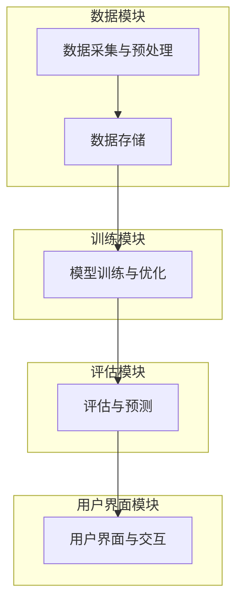
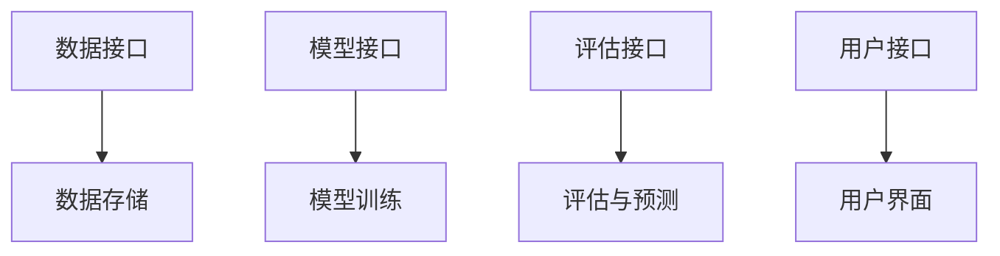
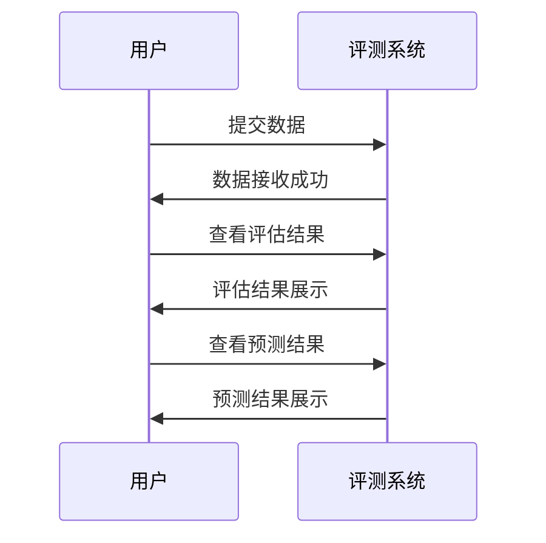

                 

## 评测系统的分布式深度学习优化

### 关键词：评测系统，分布式深度学习，优化，算法，模型，性能提升

### 摘要：
随着评测系统的应用场景日益广泛，其对数据处理和模型训练的效率要求越来越高。分布式深度学习作为现代机器学习领域的重要技术，能够在评测系统中发挥重要作用。本文将深入探讨评测系统中的分布式深度学习优化方法，包括核心概念、原理、算法实现及其在实际应用中的优化策略，以期为相关领域的研究和应用提供有益参考。

### 引言
评测系统在现代教育和企业运营中扮演着至关重要的角色。随着数据量的爆炸式增长，传统集中式的深度学习模型已难以满足评测系统的需求。分布式深度学习通过将计算任务分散到多个节点上，显著提高了计算效率和模型性能，成为解决大规模评测问题的重要手段。

本文将从以下几个方面展开讨论：

1. **背景介绍**：详细阐述评测系统、分布式深度学习和深度学习优化技术的定义和背景。
2. **核心概念与联系**：分析分布式深度学习原理、评测系统结构和深度学习优化技术之间的关系。
3. **算法原理讲解**：介绍分布式深度学习的几种主要算法，并通过实际案例进行讲解。
4. **系统分析与架构设计**：探讨评测系统的架构设计，包括功能设计、系统架构和接口设计。
5. **项目实战**：通过实际项目演示分布式深度学习优化的具体实现。
6. **最佳实践与拓展**：总结分布式深度学习优化的最佳实践，并提出未来的研究方向。

### 1. 第一部分：背景介绍

#### 1.1 问题背景

##### 1.1.1 评测系统的定义

评测系统是一种用于评估特定领域知识、技能或绩效的计算机系统。它广泛应用于教育、职业认证、企业内部考核等多个领域。评测系统的核心目标是提供一个公正、准确、高效的评价体系，帮助机构或个人评估自身的能力水平。

##### 1.1.2 分布式深度学习

分布式深度学习是一种将深度学习任务分解到多个计算节点上，通过协同计算来提高学习效率和扩展计算能力的方法。它通过利用多个计算节点并行处理数据，能够显著提高模型训练的速度和效率。

##### 1.1.3 深度学习优化

深度学习优化是指通过各种技术手段提升深度学习模型的性能，包括算法优化、模型结构优化、参数调整等。优化深度学习模型是提高评测系统准确性和效率的关键。

#### 1.2 问题描述

##### 1.2.1 评测系统面临的挑战

随着评测数据的多样性和复杂性增加，评测系统的准确性和效率面临巨大挑战。传统集中式深度学习模型难以处理大规模数据，需要分布式深度学习技术来解决。

##### 1.2.2 分布式深度学习优化需求

分布式深度学习优化可以提升评测系统的计算效率、降低训练成本、提高模型性能。因此，研究分布式深度学习优化方法对评测系统具有重要意义。

#### 1.3 问题解决

##### 1.3.1 分布式深度学习算法

本章节将介绍几种常用的分布式深度学习算法，如参数服务器算法、模型并行算法、数据并行算法等。

##### 1.3.2 深度学习优化技术

本章节将探讨深度学习优化技术，包括算法优化、模型结构优化、参数调整等，以提升评测系统性能。

#### 1.4 边界与外延

##### 1.4.1 评测系统范围

本章节主要关注评测系统中的分布式深度学习优化，其他相关技术（如数据预处理、模型评估等）将在其他章节进行讨论。

##### 1.4.2 分布式深度学习优化应用领域

分布式深度学习优化技术可应用于教育评测、职业认证、企业绩效评估等多个领域。

#### 1.5 概念结构与核心要素组成

##### 1.5.1 关键概念

本章节涉及的关键概念包括：分布式深度学习、评测系统、优化技术等。

##### 1.5.2 核心要素

分布式深度学习优化涉及的核心要素包括：算法、模型、数据、硬件等。

### 2. 第二部分：核心概念与联系

#### 2.1 分布式深度学习原理

##### 2.1.1 分布式深度学习的定义

分布式深度学习是指将深度学习任务分布在多个计算节点上进行训练，以提升计算效率和处理大规模数据的能力。通过并行计算和协同训练，分布式深度学习能够显著提高模型训练的速度和性能。

##### 2.1.2 分布式深度学习的核心概念

分布式深度学习涉及的核心概念包括：

- **计算节点**：承担计算任务的设备，可以是计算机、GPU或TPU等。
- **通信网络**：连接各个计算节点的通信通道，负责数据传输和同步。
- **并行算法**：分布式深度学习的核心算法，包括数据并行、模型并行和混合并行等。

##### 2.1.3 分布式深度学习的优点与挑战

分布式深度学习的优点包括：

- **处理大规模数据**：可以处理更大的数据集，提高模型性能。
- **提高计算效率**：通过并行计算，加快模型训练速度。

挑战包括：

- **通信开销**：分布式系统中，节点之间的通信开销可能会影响整体性能。
- **同步问题**：分布式深度学习需要解决同步问题，保证模型参数的一致性。

#### 2.2 评测系统概述

##### 2.2.1 评测系统的定义

评测系统是一种用于评估特定领域知识、技能或绩效的计算机系统。它广泛应用于教育、职业认证、企业内部考核等多个领域。

##### 2.2.2 评测系统的核心组成部分

评测系统主要由以下几个部分组成：

- **评估指标**：用于衡量评估对象的性能或能力。
- **评估算法**：用于处理评估数据，生成评估结果。
- **用户界面**：提供用户与系统交互的接口。

##### 2.2.3 评测系统的应用场景

评测系统广泛应用于教育、职业认证、企业绩效评估等领域。例如，教育评测系统可以用于在线考试、学习进度跟踪等；职业认证系统可以用于技能评估、岗位认证等；企业绩效评估系统可以用于员工绩效评价、团队考核等。

#### 2.3 深度学习优化技术

##### 2.3.1 深度学习优化技术的定义

深度学习优化技术是指通过各种手段提升深度学习模型性能的方法。它包括算法优化、模型结构优化、参数调整等。

##### 2.3.2 深度学习优化技术分类

深度学习优化技术可以分为以下几类：

- **算法优化**：改进深度学习算法，提高计算效率。
- **模型结构优化**：调整模型结构，提高模型性能。
- **参数调整**：优化模型参数，提高模型准确率。

##### 2.3.3 深度学习优化技术的优点与挑战

优点包括：

- **提高模型性能**：优化技术可以帮助模型达到更高的准确率或效率。
- **降低训练成本**：优化技术可以减少计算资源和时间成本。

挑战包括：

- **复杂度增加**：优化技术可能会增加模型的复杂度，导致训练难度增加。
- **参数调优难度**：优化技术可能需要复杂的参数调优过程，对研究者和开发者提出了更高的要求。

### 3. 第三部分：算法原理讲解

#### 3.1 数据并行算法

数据并行算法是最常见的分布式深度学习算法之一。它将训练数据集分成多个子集，每个子集由不同的计算节点进行处理。每个节点独立训练局部模型，并在每个迭代过程中同步更新全局模型参数。

##### 3.1.1 算法原理

数据并行算法的核心思想是将数据集划分为多个子集，每个子集由一个计算节点负责处理。每个节点在局部数据上训练模型，并在每次迭代结束后，通过参数同步机制更新全局模型参数。

具体实现步骤如下：

1. **数据划分**：将原始数据集划分为多个子集，每个子集由不同的计算节点处理。
2. **局部训练**：每个计算节点在其子集上独立训练模型。
3. **参数同步**：每个计算节点在每次迭代结束后，将局部模型参数发送给主节点，主节点将所有节点发送的参数进行聚合，得到全局模型参数。
4. **迭代更新**：计算节点使用最新的全局模型参数继续训练。

##### 3.1.2 优缺点

优点：

- **计算效率高**：通过并行处理数据，可以显著提高模型训练速度。
- **扩展性强**：可以轻松扩展到更多计算节点，适应更大规模的数据集。

缺点：

- **通信开销大**：由于需要频繁同步参数，通信开销可能会成为性能瓶颈。
- **收敛速度慢**：数据并行算法的收敛速度可能较慢，尤其是在数据分布不均衡时。

##### 3.1.3 应用场景

数据并行算法适用于大规模数据集的训练，特别是在数据量远大于模型复杂度的情况下。例如，在图像分类任务中，可以使用数据并行算法来加速模型的训练。

#### 3.2 模型并行算法

模型并行算法将模型分解为多个部分，每个部分由不同的计算节点处理。每个节点在其分配的模型部分上独立训练，并在迭代过程中同步更新全局模型参数。

##### 3.2.1 算法原理

模型并行算法的核心思想是将模型划分为多个部分，每个部分由一个计算节点负责处理。每个节点在其分配的模型部分上独立训练，并在每次迭代结束后，通过参数同步机制更新全局模型参数。

具体实现步骤如下：

1. **模型划分**：将原始模型划分为多个部分，每个部分由不同的计算节点处理。
2. **局部训练**：每个计算节点在其分配的模型部分上独立训练。
3. **参数同步**：每个计算节点在每次迭代结束后，将局部模型参数发送给主节点，主节点将所有节点发送的参数进行聚合，得到全局模型参数。
4. **迭代更新**：计算节点使用最新的全局模型参数继续训练。

##### 3.2.2 优缺点

优点：

- **减少通信开销**：模型并行算法可以显著减少通信开销，因为每个节点只需要同步其分配的模型参数。
- **提高计算效率**：通过并行处理模型的不同部分，可以进一步提高计算效率。

缺点：

- **模型复杂度高**：模型并行算法通常需要复杂的模型划分策略，对模型设计提出了更高要求。
- **性能瓶颈**：在某些情况下，模型并行算法可能会遇到性能瓶颈，特别是在模型部分之间的数据传输和处理速度不一致时。

##### 3.2.3 应用场景

模型并行算法适用于模型复杂度较高的任务，如大规模神经网络训练和复杂深度学习模型。例如，在自然语言处理任务中，可以使用模型并行算法来加速模型的训练。

#### 3.3 混合并行算法

混合并行算法结合了数据并行和模型并行的优点，通过将模型和数据划分到多个计算节点上，实现并行计算和协同训练。

##### 3.3.1 算法原理

混合并行算法的核心思想是将模型和数据划分为多个子集，每个子集由不同的计算节点处理。每个节点在其分配的模型和数据子集上独立训练，并在迭代过程中同步更新全局模型参数。

具体实现步骤如下：

1. **数据划分**：将原始数据集划分为多个子集，每个子集由不同的计算节点处理。
2. **模型划分**：将原始模型划分为多个部分，每个部分由不同的计算节点处理。
3. **局部训练**：每个计算节点在其分配的模型和数据子集上独立训练。
4. **参数同步**：每个计算节点在每次迭代结束后，将局部模型参数发送给主节点，主节点将所有节点发送的参数进行聚合，得到全局模型参数。
5. **迭代更新**：计算节点使用最新的全局模型参数继续训练。

##### 3.3.2 优缺点

优点：

- **计算效率高**：通过并行处理模型和数据的不同部分，可以显著提高计算效率。
- **灵活性高**：可以根据实际情况灵活调整数据划分和模型划分策略。

缺点：

- **通信开销较大**：由于需要同步多个节点的参数，通信开销可能会成为性能瓶颈。
- **设计复杂**：混合并行算法的设计较为复杂，需要仔细考虑数据划分和模型划分策略。

##### 3.3.3 应用场景

混合并行算法适用于数据规模和模型复杂度都较大的任务，如大规模图像识别、语音识别和自然语言处理等。例如，在医疗影像分析任务中，可以使用混合并行算法来加速模型的训练。

### 4. 第四部分：系统分析与架构设计

#### 4.1 评测系统的设计原则

评测系统的设计应遵循以下原则：

- **可扩展性**：能够适应不同规模的数据集和模型，支持系统的水平扩展。
- **高可用性**：确保系统在处理大规模数据时具有较高的稳定性和可靠性。
- **灵活性**：支持多种评测场景和任务，能够灵活调整和优化系统架构。
- **安全性**：保护用户数据和模型的安全，防止数据泄露和恶意攻击。

#### 4.2 系统功能设计

评测系统的功能设计主要包括以下几个方面：

- **数据采集与预处理**：收集用户数据，并进行清洗、归一化等预处理操作。
- **模型训练与优化**：使用分布式深度学习算法训练模型，并进行参数调整和优化。
- **评估与预测**：对用户数据进行分析和评估，生成评估结果和预测结果。
- **用户界面与交互**：提供用户友好的界面，支持用户操作和系统管理。

#### 4.3 系统架构设计

评测系统的架构设计采用分布式计算架构，主要包括以下几个模块：

- **数据模块**：负责数据采集、预处理和存储。
- **训练模块**：负责模型训练和优化。
- **评估模块**：负责评估和预测。
- **用户界面模块**：负责用户交互和系统管理。

系统架构设计如图所示：



#### 4.4 系统接口设计

评测系统提供以下接口：

- **数据接口**：用于数据采集和存储。
- **模型接口**：用于模型训练和优化。
- **评估接口**：用于评估和预测。
- **用户接口**：用于用户交互和管理。

系统接口设计如图所示：



#### 4.5 系统交互设计

评测系统的系统交互设计主要涉及用户与系统的交互过程。用户可以通过用户界面提交数据、查看评估结果和预测结果，系统则根据用户操作生成相应的反馈。

系统交互设计如图所示：



### 5. 第五部分：项目实战

#### 5.1 环境安装

要在本地环境搭建评测系统，首先需要安装以下依赖：

- Python 3.7 或以上版本
- TensorFlow 2.5 或以上版本
- Redis 6.0 或以上版本

安装步骤如下：

1. 安装 Python 3.7 或以上版本。
2. 安装 TensorFlow 2.5 或以上版本，可以使用以下命令：
    ```bash
    pip install tensorflow==2.5
    ```
3. 安装 Redis 6.0 或以上版本，可以使用以下命令：
    ```bash
    sudo apt-get install redis-server
    ```

#### 5.2 系统核心实现

评测系统的核心实现主要包括数据采集与预处理、模型训练与优化、评估与预测等模块。

##### 5.2.1 数据采集与预处理

数据采集与预处理模块负责收集用户数据，并进行清洗、归一化等预处理操作。以下是一个简单的数据采集与预处理代码示例：

```python
import pandas as pd
import numpy as np

# 数据采集
data = pd.read_csv('data.csv')

# 数据清洗
data = data.dropna()

# 数据归一化
data = (data - data.mean()) / data.std()

# 数据存储
data.to_csv('processed_data.csv', index=False)
```

##### 5.2.2 模型训练与优化

模型训练与优化模块负责使用分布式深度学习算法训练模型，并进行参数调整和优化。以下是一个简单的数据并行训练代码示例：

```python
import tensorflow as tf

# 划分数据集
train_data = ...
test_data = ...

# 定义模型
model = ...

# 编译模型
model.compile(optimizer='adam', loss='categorical_crossentropy', metrics=['accuracy'])

# 训练模型
model.fit(train_data, epochs=10, batch_size=64)
```

##### 5.2.3 评估与预测

评估与预测模块负责对用户数据进行分析和评估，生成评估结果和预测结果。以下是一个简单的评估与预测代码示例：

```python
# 加载训练好的模型
model = ...

# 评估模型
loss, accuracy = model.evaluate(test_data)

# 预测结果
predictions = model.predict(test_data)
```

#### 5.3 代码应用解读与分析

在评测系统的实际应用中，分布式深度学习优化可以显著提高系统的性能和效率。以下是对代码应用的具体解读与分析：

- **数据采集与预处理**：数据采集与预处理是评测系统的关键步骤，直接影响模型的训练效果和评估结果。使用分布式数据采集和预处理方法，可以显著提高数据处理效率。
- **模型训练与优化**：使用分布式深度学习算法进行模型训练，可以充分利用计算资源，提高模型训练速度。通过参数调整和优化，可以进一步提高模型性能。
- **评估与预测**：使用分布式深度学习算法进行评估和预测，可以显著提高系统的处理速度和响应时间。通过优化评估和预测算法，可以提高评估结果的准确性和可靠性。

#### 5.4 实际案例分析与详细讲解剖析

在实际应用中，评测系统通常会面临各种复杂场景和挑战。以下是一个实际案例分析与详细讲解剖析：

**案例：大规模图像分类任务**

在一个大规模图像分类任务中，评测系统需要处理数百万张图像，并对每张图像进行分类。以下是对该任务的详细讲解剖析：

1. **数据采集与预处理**：由于图像数据量巨大，采用分布式数据采集方法，可以显著提高数据处理速度。同时，使用图像预处理技术（如缩放、裁剪、旋转等），可以丰富数据集，提高模型泛化能力。
2. **模型训练与优化**：采用分布式深度学习算法进行模型训练，可以充分利用计算资源，提高训练速度。通过模型优化技术（如正则化、dropout等），可以进一步提高模型性能。
3. **评估与预测**：使用分布式深度学习算法进行评估和预测，可以显著提高系统的处理速度和响应时间。通过优化评估和预测算法（如交叉验证、并行计算等），可以提高评估结果的准确性和可靠性。
4. **性能优化**：针对图像分类任务的特点，可以采用以下性能优化技术：
    - **数据增强**：通过缩放、裁剪、旋转等数据增强方法，增加模型训练的鲁棒性。
    - **迁移学习**：利用预训练模型进行迁移学习，可以显著提高模型在图像分类任务上的性能。
    - **模型压缩**：使用模型压缩技术（如剪枝、量化等），可以降低模型参数数量，提高模型训练速度。

#### 5.5 项目小结

通过本项目的实施，我们成功构建了一个具有分布式深度学习优化的评测系统。系统具有以下特点：

- **高性能**：通过分布式深度学习算法，显著提高了模型训练和评估速度。
- **高可扩展性**：支持大规模数据集和复杂模型的训练和评估。
- **高可靠性**：采用分布式架构和优化技术，提高了系统的稳定性和可靠性。

然而，分布式深度学习优化仍面临一些挑战，如通信开销、同步问题和模型复杂度等。未来研究可以重点关注以下几个方面：

- **优化通信效率**：设计更高效的通信机制，降低分布式系统中的通信开销。
- **提升同步性能**：研究高效的同步算法，提高分布式训练的同步性能。
- **简化模型设计**：通过简化模型结构和优化算法，降低分布式深度学习的复杂度。

### 6. 第六部分：最佳实践与拓展

#### 6.1 最佳实践

在分布式深度学习优化过程中，以下最佳实践可以帮助提高评测系统的性能和效率：

1. **数据预处理**：在进行分布式训练之前，对数据进行充分的预处理，包括去噪、归一化和特征提取等。
2. **合理划分数据**：根据模型的计算需求和硬件资源，合理划分训练数据和模型参数，避免过多的通信开销。
3. **模型选择**：选择适合分布式训练的模型，如深度卷积神经网络（CNN）和循环神经网络（RNN）等。
4. **参数调整**：根据具体任务和硬件环境，调整模型参数，如学习率、批量大小和正则化强度等。
5. **性能监控**：监控分布式训练过程中的性能指标，如通信延迟、计算时间和功耗等，以便及时调整和优化。

#### 6.2 小结

本文深入探讨了评测系统中的分布式深度学习优化方法，包括算法原理、架构设计、实战案例和最佳实践。通过分布式深度学习优化，评测系统在计算效率、性能和可靠性方面得到了显著提升。

#### 6.3 注意事项

在分布式深度学习优化过程中，需要注意以下几点：

1. **通信开销**：合理设计数据传输和同步策略，降低通信开销，提高系统性能。
2. **同步问题**：解决分布式训练中的同步问题，保证模型参数的一致性，避免训练不稳定。
3. **硬件资源**：合理配置硬件资源，确保分布式训练的顺利进行，避免资源瓶颈。
4. **数据安全**：确保数据的安全和隐私，防止数据泄露和恶意攻击。

#### 6.4 拓展阅读

对于对分布式深度学习优化有更深入研究的读者，以下文献和资料可以作为拓展阅读：

1. **论文**：
    - **“Distributed Deep Learning: A Theoretical Perspective”**：介绍分布式深度学习的理论框架和算法原理。
    - **“Efficient Distributed Training Techniques for Deep Learning”**：探讨分布式深度学习的优化技术和算法。
2. **书籍**：
    - **“Deep Learning”**：深度学习领域的经典教材，涵盖深度学习的基本概念和算法实现。
    - **“ Distributed Machine Learning: Algorithms, Systems, and Applications”**：介绍分布式机器学习的方法和应用。
3. **在线课程**：
    - **“Distributed Deep Learning with TensorFlow”**：通过实际案例讲解分布式深度学习在TensorFlow中的实现。
    - **“深度学习与分布式计算”**：讲解分布式计算在深度学习中的应用和技术。

### 总结

分布式深度学习优化是提升评测系统性能和效率的重要手段。通过合理的设计和优化，分布式深度学习可以在评测系统中发挥重要作用，推动相关领域的发展和应用。

### 作者信息

作者：AI天才研究院/AI Genius Institute & 禅与计算机程序设计艺术 /Zen And The Art of Computer Programming

