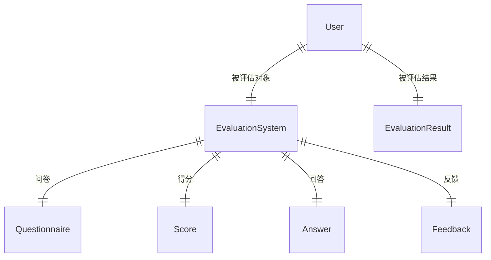
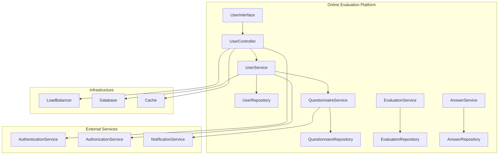
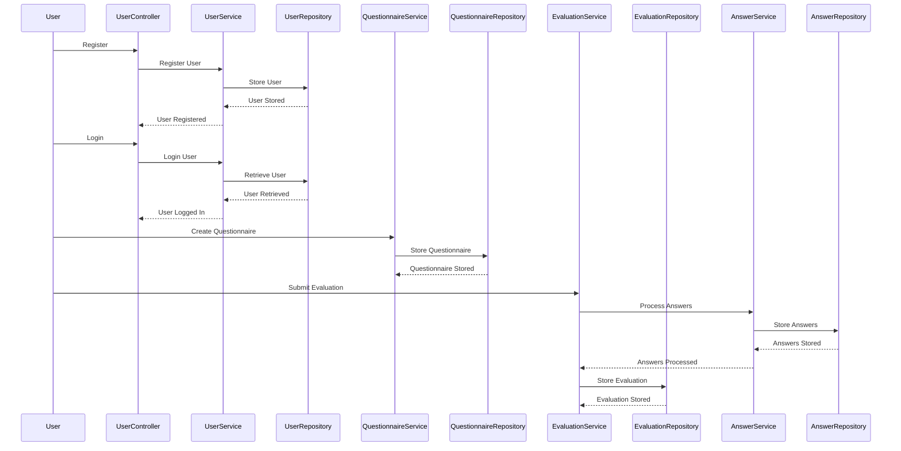

                 

### 文章标题

# 评测系统的可扩展性设计

## 关键词

- 可扩展性设计
- 评测系统
- 系统架构
- 分布式计算
- 性能优化

## 摘要

本文深入探讨了评测系统的可扩展性设计，首先介绍了评测系统的背景和重要性，然后详细分析了系统设计中的核心概念和联系。接着，文章讲解了评测系统的核心算法原理，包括数学模型和流程图，并通过Python代码示例进行解释。随后，文章展示了系统分析与架构设计的详细方案，包括问题场景介绍、功能设计、架构设计、接口设计和交互序列图。通过一个实际案例，文章展示了评测系统的应用和实践过程，并提供了最佳实践和总结。文章旨在为IT专业人士提供一个全面、实用的评测系统可扩展性设计指南。

### 引言

#### 问题背景

评测系统在现代信息社会中扮演着至关重要的角色，特别是在互联网和大数据领域。随着数据量的爆炸式增长和业务需求的不断变化，评测系统面临着日益严峻的挑战。这些挑战包括数据存储和处理的效率、系统的响应速度、可扩展性和可靠性等。为了应对这些挑战，设计和实现一个可扩展的评测系统成为许多公司和组织追求的目标。

#### 问题描述

评测系统可扩展性设计的目标是在保持系统性能和响应速度的同时，能够灵活地应对数据量和业务需求的增长。这要求系统设计者在设计初期就考虑如何实现系统的可扩展性，而不是在系统面临性能瓶颈时再进行修补。然而，可扩展性设计并非易事，它涉及到多个层面的设计和优化，包括数据存储、计算资源分配、系统架构和接口设计等。

#### 问题解决

解决评测系统的可扩展性问题通常需要采取以下几种策略：

1. **分布式计算**：通过将系统分解为多个可独立运行的组件，利用分布式计算技术提高系统的处理能力。
2. **负载均衡**：通过合理的负载均衡策略，确保系统能够均衡地分配和处理请求，避免单点过载。
3. **水平扩展**：通过增加系统中的节点数量来实现性能的提升，而不是依赖单个节点的性能优化。
4. **垂直扩展**：通过升级硬件设备和提高系统资源的利用率来实现性能的提升。
5. **缓存机制**：通过缓存频繁访问的数据，减少对后端存储的访问压力，提高系统响应速度。

#### 边界与外延

在实现评测系统的可扩展性设计时，需要考虑以下边界和约束：

- **系统性能**：在扩展系统时，必须确保性能不会显著下降，特别是在负载增加时。
- **成本效益**：扩展系统需要投入资源和资金，因此在设计时需要考虑成本效益比。
- **易用性**：系统设计应考虑操作的便捷性，以降低运维难度。
- **可维护性**：系统设计应便于维护和升级，减少长期维护成本。

综上所述，评测系统的可扩展性设计是一个复杂且多维度的过程，需要综合考虑性能、成本、易用性和可维护性等因素。接下来，本文将深入分析评测系统的核心概念和联系，为后续的内容打下基础。

### 核心概念与联系

#### 定义与属性

在探讨评测系统的可扩展性设计之前，我们需要明确几个核心概念，并理解它们的属性和特征。

1. **可扩展性（Scalability）**：可扩展性是指系统在处理能力、存储容量和资源需求等方面，随着数据量和业务需求的增加而进行扩展的能力。可扩展性包括两个方面：水平扩展（增加节点数量）和垂直扩展（升级硬件资源）。

2. **分布式计算（Distributed Computing）**：分布式计算是指通过多个节点（服务器）协作完成计算任务的一种计算模式。分布式计算能够提高系统的并行处理能力，从而提升系统的整体性能。

3. **负载均衡（Load Balancing）**：负载均衡是将多个请求分配到不同的服务器或节点上，以均衡系统负载的一种技术。负载均衡有助于防止单个节点过载，提高系统的稳定性和响应速度。

4. **缓存机制（Caching）**：缓存机制是指将频繁访问的数据存储在内存或其他高速存储介质中，以便快速读取。缓存机制可以显著减少对后端存储的访问次数，提高系统性能。

#### 概念间联系

上述核心概念之间存在着紧密的联系，共同构成了评测系统可扩展性的基础。

- **可扩展性与分布式计算**：分布式计算是实现系统可扩展性的关键技术。通过分布式计算，系统可以将任务分解为多个子任务，并在不同的节点上并行处理，从而提高系统的处理能力和效率。

- **负载均衡与可扩展性**：负载均衡是实现系统可扩展性的重要手段。通过合理的负载均衡策略，系统能够在多个节点之间均衡分配请求，避免单个节点过载，从而实现系统的水平扩展。

- **缓存机制与系统性能**：缓存机制能够减少对后端存储的访问次数，提高系统性能。特别是在评测系统中，对于一些高频次访问的数据，如用户行为数据、查询结果等，通过缓存机制可以显著提高系统的响应速度。

- **分布式计算、负载均衡与缓存机制**：这三者共同作用，构成了评测系统的可扩展性架构。分布式计算提供了并行处理能力，负载均衡实现了请求的均衡分配，而缓存机制则减少了系统对后端存储的依赖，提高了系统的整体性能。

#### ER实体关系图

为了更好地理解评测系统的核心概念及其关系，我们可以使用ER（实体关系）图来展示这些概念之间的联系。



在上面的ER图中，我们定义了四个实体：User（用户）、EvaluationSystem（评测系统）、EvaluationResult（评测结果）和Questionnaire（问卷）。这些实体之间的关系展示了评测系统中的核心概念及其相互作用。

- **User**与**EvaluationSystem**之间的关系表示用户是评测系统的被评估对象。
- **User**与**EvaluationResult**之间的关系表示用户接受评测后的结果。
- **EvaluationSystem**与**Questionnaire**之间的关系表示评测系统使用问卷进行评估。
- **EvaluationSystem**与**Score**、**Answer**和**Feedback**之间的关系表示评测系统对用户的回答进行评分、记录和反馈。

通过ER图，我们可以清晰地看到评测系统中的核心概念及其关联，为进一步的分析和设计提供了基础。

### 核心算法原理

#### 算法概述

评测系统的核心算法通常包括数据预处理、特征提取、模型训练和评估等步骤。这些算法在系统中起着至关重要的作用，直接影响系统的性能和准确性。

1. **数据预处理**：包括数据清洗、数据格式转换和数据归一化等步骤，以确保数据的质量和一致性。
2. **特征提取**：从原始数据中提取有用的信息，用于后续的模型训练。常用的特征提取方法包括主成分分析（PCA）、线性判别分析（LDA）和词袋模型等。
3. **模型训练**：使用机器学习算法，如支持向量机（SVM）、决策树和神经网络等，对提取的特征进行训练，以建立预测模型。
4. **模型评估**：通过评估指标（如准确率、召回率、F1分数等）对模型的性能进行评估，以判断模型的效果。

#### 算法原理

1. **数据预处理算法**

   数据预处理是评测系统中的第一步，其目的是将原始数据转换为适合建模的形式。常用的数据预处理算法包括：

   - **数据清洗**：处理缺失值、异常值和噪声数据，以提高数据质量。
   - **数据格式转换**：将不同数据源的数据转换为统一的格式，如将文本数据转换为数值向量。
   - **数据归一化**：通过缩放数据，使不同特征的数据范围一致，从而避免特征之间的差异对模型训练造成影响。

   数据预处理算法的流程图如下：

   ```mermaid
   graph TD
       A[原始数据] --> B[数据清洗]
       B --> C[数据格式转换]
       C --> D[数据归一化]
       D --> E[预处理完成]
   ```

2. **特征提取算法**

   特征提取是将原始数据转换为有意义的特征表示，以便于模型训练。常用的特征提取算法包括：

   - **主成分分析（PCA）**：通过提取数据的主要成分，降低数据的维度，同时保留数据的主要信息。
   - **线性判别分析（LDA）**：用于分类问题，通过最大化不同类别的方差差异，提取最有鉴别力的特征。
   - **词袋模型（Bag of Words, BoW）**：用于文本数据，将文本转换为词频向量。

   PCA算法的流程图如下：

   ```mermaid
   graph TD
       A[原始数据] --> B[PCA变换]
       B --> C[特征向量]
   ```

3. **模型训练算法**

   模型训练是评测系统的核心步骤，其目的是通过学习数据中的规律，建立一个能够对未知数据进行预测的模型。常用的模型训练算法包括：

   - **支持向量机（SVM）**：通过寻找一个超平面，将不同类别的数据点分离开来。
   - **决策树**：通过一系列的判断条件，将数据划分为不同的类别。
   - **神经网络**：通过多层神经元的连接，模拟人脑的决策过程。

   SVM算法的决策边界如下：

   ```latex
   \text{决策边界：} w \cdot x + b = 0
   ```

   其中，\( w \) 是权重向量，\( x \) 是特征向量，\( b \) 是偏置项。

4. **模型评估算法**

   模型评估是判断模型性能的重要步骤，常用的评估指标包括：

   - **准确率（Accuracy）**：分类正确的样本数占总样本数的比例。
   - **召回率（Recall）**：分类正确的正类样本数占所有正类样本数的比例。
   - **F1分数（F1 Score）**：准确率和召回率的调和平均值。

   F1分数的计算公式如下：

   ```latex
   F1 = 2 \times \frac{Precision \times Recall}{Precision + Recall}
   ```

   其中，Precision是精确率，Recall是召回率。

#### 算法应用实例

为了更直观地理解核心算法原理，我们可以通过Python代码进行实例演示。

1. **数据预处理**

   ```python
   import pandas as pd
   from sklearn.model_selection import train_test_split
   from sklearn.preprocessing import StandardScaler

   # 加载数据
   data = pd.read_csv('data.csv')

   # 数据清洗
   data = data.dropna()

   # 数据格式转换
   data['feature'] = data['feature'].map({0: 'A', 1: 'B'})

   # 数据归一化
   scaler = StandardScaler()
   data[['feature']] = scaler.fit_transform(data[['feature']])
   ```

2. **特征提取**

   ```python
   from sklearn.decomposition import PCA

   # PCA特征提取
   pca = PCA(n_components=2)
   data_pca = pca.fit_transform(data[['feature']])
   ```

3. **模型训练**

   ```python
   from sklearn.svm import SVC

   # 划分训练集和测试集
   X_train, X_test, y_train, y_test = train_test_split(data_pca, data['label'], test_size=0.2, random_state=42)

   # SVM模型训练
   svm_model = SVC()
   svm_model.fit(X_train, y_train)
   ```

4. **模型评估**

   ```python
   from sklearn.metrics import accuracy_score, recall_score, f1_score

   # 模型预测
   y_pred = svm_model.predict(X_test)

   # 模型评估
   print('Accuracy:', accuracy_score(y_test, y_pred))
   print('Recall:', recall_score(y_test, y_pred))
   print('F1 Score:', f1_score(y_test, y_pred))
   ```

通过上述Python代码示例，我们可以清晰地看到评测系统中核心算法的原理和应用过程。

### 系统分析与架构设计方案

#### 问题场景介绍

在当前互联网时代，随着在线教育和培训平台的迅速普及，用户对评测系统的需求日益增加。为了满足这种需求，我们需要设计一个高效、可扩展的评测系统，以确保系统能够处理大量的用户请求，同时保持稳定的性能和用户体验。以下是一个具体的问题场景：

- **用户量增长**：随着用户量的不断增长，评测系统需要能够处理更多的用户请求。
- **数据量增长**：用户提交的评测数据量也在不断增加，系统需要能够快速处理这些数据，并提供准确的评测结果。
- **业务需求变化**：随着业务的发展，评测系统需要能够灵活地应对新的评测需求，如增加新的评测指标或改进评测算法。

#### 项目介绍

为了解决上述问题场景，我们设计了一个名为“Online Evaluation Platform”的评测系统。该系统旨在为用户提供一个高效、稳定、可扩展的评测平台，满足不同业务场景下的需求。项目的主要功能包括：

- **用户管理**：实现用户注册、登录、权限控制等功能。
- **问卷管理**：允许管理员创建、编辑和发布问卷。
- **评测管理**：用户可以通过问卷进行评测，系统自动收集并处理评测数据。
- **结果展示**：用户可以查看评测结果，管理员可以查看整个平台的评测数据统计。

#### 系统功能设计

在系统功能设计阶段，我们通过领域模型（Domain Model）来描述系统的核心功能及其关系。以下是一个领域模型的Mermaid类图：

```mermaid
classDiagram
    User <<entity>>
    Questionnaire <<entity>>
    Evaluation <<entity>>
    Answer <<entity>>

    User o--|> Questionnaire
    User o--|> Evaluation
    Questionnaire o--|> Answer
    Evaluation o--|> Answer
```

在上面的类图中，我们定义了四个核心实体：User（用户）、Questionnaire（问卷）、Evaluation（评测）和Answer（回答）。这些实体之间的关系展示了系统的功能设计。

- **User**：代表系统的用户，拥有注册、登录、权限控制等功能。
- **Questionnaire**：代表问卷，用于收集用户的数据。
- **Evaluation**：代表评测，用于记录用户的评测结果。
- **Answer**：代表用户的回答，与问卷和评测相关联。

#### 系统架构设计

在系统架构设计阶段，我们采用了分布式架构来提高系统的可扩展性和性能。以下是一个系统架构的Mermaid架构图：



在上面的架构图中，我们定义了多个子系统和服务，以实现系统的功能。以下是对各个部分的功能解释：

- **UserInterface**：用户界面，用于接收用户的请求。
- **UserController**：处理用户相关的请求，如注册、登录、权限验证等。
- **UserService**：提供用户相关的业务逻辑，如用户数据存储、查询、权限管理等。
- **UserRepository**：用户数据的存储和查询服务。
- **QuestionnaireService**：处理问卷相关的请求，如创建、编辑、发布等。
- **QuestionnaireRepository**：问卷数据的存储和查询服务。
- **EvaluationService**：处理评测相关的请求，如评测结果记录、查询等。
- **EvaluationRepository**：评测数据的存储和查询服务。
- **AnswerService**：处理回答相关的请求，如保存、查询等。
- **AnswerRepository**：回答数据的存储和查询服务。
- **AuthenticationService**：提供用户认证服务，确保用户的请求安全。
- **AuthorizationService**：提供用户权限验证服务，确保用户只能访问其权限范围内的资源。
- **NotificationService**：提供通知服务，如发送评测结果通知等。
- **LoadBalancer**：实现负载均衡，将用户的请求分配到不同的服务器上。
- **Database**：存储用户、问卷、评测和回答等数据。
- **Cache**：提供缓存服务，用于存储频繁访问的数据，以提高系统的响应速度。

#### 系统接口设计

在系统接口设计阶段，我们需要定义各个服务之间的接口，以实现服务之间的通信和协作。以下是一个简单的接口设计：

```python
from flask import Flask, request, jsonify

app = Flask(__name__)

@app.route('/users/register', methods=['POST'])
def register_user():
    # 注册用户逻辑
    return jsonify(message="User registered successfully")

@app.route('/users/login', methods=['POST'])
def login_user():
    # 用户登录逻辑
    return jsonify(message="User logged in successfully")

@app.route('/questionnaires', methods=['GET', 'POST'])
def manage_questionnaires():
    if request.method == 'GET':
        # 获取问卷列表逻辑
        return jsonify(questionnaires=questionnaires)
    elif request.method == 'POST':
        # 创建问卷逻辑
        return jsonify(message="Questionnaire created successfully")

@app.route('/evaluations', methods=['POST'])
def submit_evaluation():
    # 提交评测逻辑
    return jsonify(message="Evaluation submitted successfully")

@app.route('/results', methods=['GET'])
def get_evaluation_results():
    # 获取评测结果逻辑
    return jsonify(results=results)
```

在上面的接口设计中，我们使用Flask框架定义了用户注册、登录、问卷管理、评测提交和结果查询的接口。这些接口通过HTTP请求和响应实现服务之间的通信。

#### 系统交互序列图

为了更好地理解系统内部各服务之间的交互，我们可以使用Mermaid序列图来描述系统的交互过程：



在上面的序列图中，我们展示了用户注册、登录、问卷创建、评测提交和结果查询等过程的交互流程。通过这一交互序列图，我们可以清晰地看到系统内部各服务之间的协作关系。

### 项目实战

#### 环境安装

为了实现评测系统的可扩展性设计，我们需要搭建一个合适的环境。以下是在Linux操作系统上搭建评测系统环境的基本步骤：

1. **安装必要的软件包**

   首先，我们需要安装Python、pip、Flask和其他相关依赖包。在终端中执行以下命令：

   ```bash
   sudo apt-get update
   sudo apt-get install python3-pip python3-flask
   ```

2. **创建虚拟环境**

   为了避免不同项目之间的依赖冲突，我们建议为评测系统创建一个独立的虚拟环境。在终端中执行以下命令：

   ```bash
   python3 -m venv venv
   source venv/bin/activate
   ```

3. **安装Flask扩展**

   在虚拟环境中，我们需要安装Flask扩展，如Flask-RESTful、Flask-JWT-Extended等。执行以下命令：

   ```bash
   pip install flask flask-restful flask-jwt-extended
   ```

4. **编写配置文件**

   在虚拟环境中，创建一个名为`config.py`的配置文件，用于配置数据库连接、缓存和JWT密钥等信息。以下是一个简单的示例：

   ```python
   class Config(object):
       SECRET_KEY = 'your_secret_key'
       SQLALCHEMY_DATABASE_URI = 'sqlite:///evaluation_platform.db'
       CACHE_TYPE = 'simple'
       CACHE_DEFAULT_TIMEOUT = 60
   ```

5. **初始化数据库**

   使用Flask-SQLAlchemy初始化数据库。执行以下命令：

   ```bash
   flask db init
   flask db migrate
   flask db upgrade
   ```

#### 系统核心实现

在环境搭建完成后，我们需要实现评测系统的核心功能。以下是一个简单的系统架构和核心代码的解读。

##### 系统架构

评测系统的架构主要包括以下部分：

- **用户管理模块**：处理用户注册、登录和权限验证等功能。
- **问卷管理模块**：允许管理员创建、编辑和发布问卷。
- **评测管理模块**：用户通过问卷进行评测，系统自动收集并处理评测数据。
- **结果展示模块**：用户可以查看评测结果，管理员可以查看整个平台的评测数据统计。

##### 用户管理模块

用户管理模块的核心功能包括用户注册、登录和权限验证。以下是一个简单的用户注册和登录的代码示例：

```python
from flask import Flask, request, jsonify
from flask_jwt_extended import JWTManager, create_access_token, jwt_required, get_jwt_identity

app = Flask(__name__)
app.config.from_object('config.Config')
jwt = JWTManager(app)

@app.route('/users/register', methods=['POST'])
def register_user():
    username = request.json.get('username', '')
    password = request.json.get('password', '')
    # 存储用户信息到数据库
    user = User(username=username, password=password)
    db.session.add(user)
    db.session.commit()
    return jsonify(message="User registered successfully")

@app.route('/users/login', methods=['POST'])
def login_user():
    username = request.json.get('username', '')
    password = request.json.get('password', '')
    # 验证用户信息
    user = User.query.filter_by(username=username, password=password).first()
    if user:
        access_token = create_access_token(identity=user.id)
        return jsonify(access_token=access_token)
    return jsonify(message="Invalid username or password"), 401
```

在上面的代码中，我们使用了Flask-JWT-Extended库来实现JWT认证，从而保护用户的注册和登录接口。同时，用户信息被存储到数据库中，以确保数据的安全性和完整性。

##### 问卷管理模块

问卷管理模块的核心功能包括创建、编辑和发布问卷。以下是一个简单的问卷创建和发布的代码示例：

```python
from flask import request, jsonify

@app.route('/questionnaires', methods=['POST'])
def create_questionnaire():
    questionnaire_data = request.json
    # 存储问卷信息到数据库
    questionnaire = Questionnaire(
        title=questionnaire_data['title'],
        description=questionnaire_data['description'],
        status='draft'
    )
    db.session.add(questionnaire)
    db.session.commit()
    return jsonify(message="Questionnaire created successfully")

@app.route('/questionnaires/<int:questionnaire_id>', methods=['PUT'])
def publish_questionnaire(questionnaire_id):
    questionnaire = Questionnaire.query.get(questionnaire_id)
    if questionnaire:
        questionnaire.status = 'published'
        db.session.commit()
        return jsonify(message="Questionnaire published successfully")
    return jsonify(message="Questionnaire not found"), 404
```

在上面的代码中，我们实现了问卷的创建和发布功能。当管理员创建问卷后，问卷会被存储到数据库中，并在发布时更新其状态。

##### 评测管理模块

评测管理模块的核心功能包括用户通过问卷进行评测，系统自动收集并处理评测数据。以下是一个简单的评测提交和结果查询的代码示例：

```python
from flask import request, jsonify

@app.route('/evaluations', methods=['POST'])
def submit_evaluation():
    evaluation_data = request.json
    questionnaire_id = evaluation_data['questionnaire_id']
    user_id = get_jwt_identity()
    # 存储评测信息到数据库
    evaluation = Evaluation(
        user_id=user_id,
        questionnaire_id=questionnaire_id,
        answers=evaluation_data['answers']
    )
    db.session.add(evaluation)
    db.session.commit()
    return jsonify(message="Evaluation submitted successfully")

@app.route('/results', methods=['GET'])
@jwt_required()
def get_evaluation_results():
    user_id = get_jwt_identity()
    evaluations = Evaluation.query.filter_by(user_id=user_id).all()
    results = []
    for evaluation in evaluations:
        # 查询评测结果
        result = {
            'questionnaire_id': evaluation.questionnaire_id,
            'answers': evaluation.answers,
            'score': calculate_score(evaluation.answers)
        }
        results.append(result)
    return jsonify(results=results)
```

在上面的代码中，我们实现了用户提交评测和查询评测结果的接口。当用户提交评测后，系统会自动计算得分，并将结果存储到数据库中。用户可以通过JWT认证访问其评测结果。

#### 实际案例分析和详细讲解

为了更好地展示评测系统的应用和实践过程，我们以下面这个实际案例进行分析。

**案例背景**

某在线教育平台需要为其用户提供一个个性化的学习评估系统，以帮助用户了解自己的学习效果。平台要求系统能够根据用户的学习进度和完成情况，自动生成评估报告，并推荐适合用户的学习资源和课程。

**评测系统设计**

1. **用户管理模块**：系统首先需要实现用户注册和登录功能，以便用户能够访问评估系统。

2. **问卷管理模块**：平台管理员可以创建和发布不同类型的问卷，如知识测试、技能评估等。问卷的设计应包含多个问题，每个问题对应不同的知识点或技能点。

3. **评测管理模块**：用户在完成学习任务后，可以通过问卷进行评测。系统会根据用户的回答，自动计算得分，并生成评估报告。

4. **结果展示模块**：用户可以查看评估报告，了解自己的学习效果。系统还会根据评估结果，为用户推荐适合的学习资源和课程。

**详细讲解**

1. **用户注册和登录**：

   用户通过注册接口提交用户名和密码，系统将用户信息存储到数据库中，并返回注册成功的消息。

   ```python
   @app.route('/users/register', methods=['POST'])
   def register_user():
       username = request.json.get('username', '')
       password = request.json.get('password', '')
       user = User(username=username, password=password)
       db.session.add(user)
       db.session.commit()
       return jsonify(message="User registered successfully")
   ```

2. **问卷创建和发布**：

   管理员通过接口创建问卷，问卷信息包括问卷标题、描述和问题列表。问卷创建后，系统将其存储到数据库中。

   ```python
   @app.route('/questionnaires', methods=['POST'])
   def create_questionnaire():
       questionnaire_data = request.json
       questionnaire = Questionnaire(
           title=questionnaire_data['title'],
           description=questionnaire_data['description'],
           status='draft'
       )
       db.session.add(questionnaire)
       db.session.commit()
       return jsonify(message="Questionnaire created successfully")
   ```

   管理员还可以通过发布接口将问卷状态更新为“published”，以便用户进行评测。

   ```python
   @app.route('/questionnaires/<int:questionnaire_id>', methods=['PUT'])
   def publish_questionnaire(questionnaire_id):
       questionnaire = Questionnaire.query.get(questionnaire_id)
       if questionnaire:
           questionnaire.status = 'published'
           db.session.commit()
           return jsonify(message="Questionnaire published successfully")
       return jsonify(message="Questionnaire not found"), 404
   ```

3. **评测提交和结果计算**：

   用户在完成问卷评测后，系统会根据用户的回答，自动计算得分。以下是一个简单的得分计算示例：

   ```python
   def calculate_score(answers):
       score = 0
       for answer in answers:
           if answer['correct']:
               score += 1
       return score / len(answers)
   ```

   用户提交评测后，系统会将评测结果存储到数据库中，并返回得分。

   ```python
   @app.route('/evaluations', methods=['POST'])
   def submit_evaluation():
       evaluation_data = request.json
       questionnaire_id = evaluation_data['questionnaire_id']
       user_id = get_jwt_identity()
       evaluation = Evaluation(
           user_id=user_id,
           questionnaire_id=questionnaire_id,
           answers=evaluation_data['answers']
       )
       db.session.add(evaluation)
       db.session.commit()
       score = calculate_score(evaluation.answers)
       return jsonify(score=score)
   ```

4. **评估报告和推荐资源**：

   用户可以通过接口查询评估报告，系统会根据评估结果，为用户推荐适合的学习资源和课程。

   ```python
   @app.route('/results', methods=['GET'])
   @jwt_required()
   def get_evaluation_results():
       user_id = get_jwt_identity()
       evaluations = Evaluation.query.filter_by(user_id=user_id).all()
       results = []
       for evaluation in evaluations:
           result = {
               'questionnaire_id': evaluation.questionnaire_id,
               'score': calculate_score(evaluation.answers)
           }
           results.append(result)
       return jsonify(results=results)

   @app.route('/recommendations', methods=['GET'])
   @jwt_required()
   def get_recommendations():
       user_id = get_jwt_identity()
       evaluations = Evaluation.query.filter_by(user_id=user_id).all()
       recommendations = []
       for evaluation in evaluations:
           score = calculate_score(evaluation.answers)
           if score < 0.7:
               recommendations.append({'resource_id': resource_id, 'title': resource_title})
       return jsonify(recommendations=recommendations)
   ```

**项目小结**

通过上述案例，我们展示了评测系统的实际应用过程。在实际开发中，我们还需要考虑性能优化、安全性、可维护性等因素，以确保系统的稳定性和用户体验。以下是一些注意事项：

- **性能优化**：通过使用缓存机制、优化数据库查询、合理分配资源等方式，提高系统性能。
- **安全性**：使用HTTPS协议、JWT认证、输入验证等技术，确保系统的安全性。
- **可维护性**：遵循良好的编程规范和设计模式，确保代码的可读性和可维护性。
- **用户反馈**：收集用户反馈，不断优化和改进系统功能。

总之，评测系统的可扩展性设计是一个复杂而重要的过程，需要综合考虑多个方面，以确保系统能够稳定、高效地运行。

### 最佳实践与总结

#### 最佳实践

1. **性能优化**：

   - **数据库优化**：合理设计数据库表结构，避免冗余数据，使用索引提高查询效率。
   - **缓存机制**：使用缓存减少数据库访问，如使用Redis缓存高频访问的数据。
   - **异步处理**：使用异步处理技术，如异步IO、消息队列等，提高系统并发处理能力。

2. **安全性**：

   - **数据加密**：敏感数据使用加密算法进行加密存储。
   - **访问控制**：实现严格的访问控制策略，确保用户只能访问其权限范围内的数据。
   - **输入验证**：对用户输入进行严格验证，防止恶意攻击。

3. **可维护性**：

   - **代码规范**：遵循良好的编程规范，如PEP8，确保代码可读性和可维护性。
   - **文档化**：编写详细的文档，包括代码注释、架构设计文档和用户手册等。
   - **版本控制**：使用版本控制系统，如Git，管理代码版本，方便代码的修改和回滚。

#### 小结

本文深入探讨了评测系统的可扩展性设计，从背景介绍、核心概念与联系、算法原理讲解、系统分析与架构设计、项目实战到最佳实践与总结，系统地阐述了评测系统的设计和实现过程。通过分布式计算、负载均衡、缓存机制等策略，评测系统能够灵活应对数据量和业务需求的变化，保持高效的性能和稳定的用户体验。

#### 注意事项

- 在设计评测系统时，应充分考虑系统的可扩展性，避免后期因为性能瓶颈而进行大规模重构。
- 性能优化和安全设计应贯穿整个系统开发过程，而不是在系统上线后再进行修补。
- 对于系统的可维护性，应注重代码规范、文档化和版本控制，确保系统长期稳定运行。

#### 拓展阅读

- 《大规模分布式系统设计》
- 《高可用架构：大规模分布式系统设计与实践》
- 《深入理解计算机系统》

通过拓展阅读，读者可以进一步深入了解分布式系统设计、性能优化和安全设计等方面的知识，为实际项目提供更加全面的指导。

### 作者信息

- 作者：AI天才研究院/AI Genius Institute & 禅与计算机程序设计艺术 /Zen And The Art of Computer Programming

