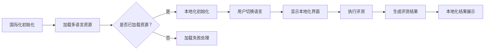
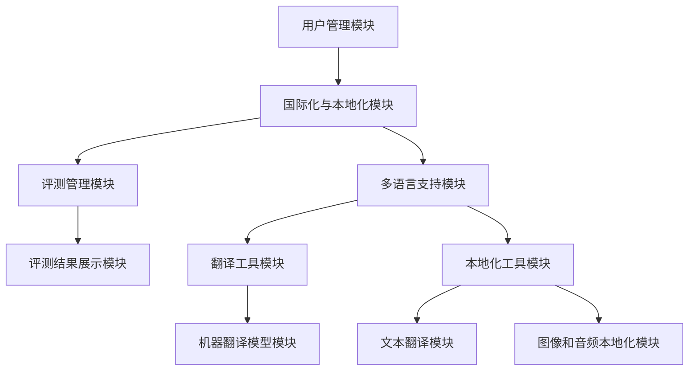
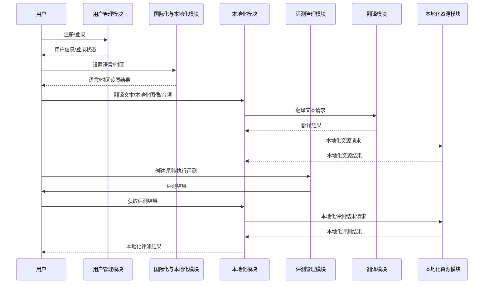
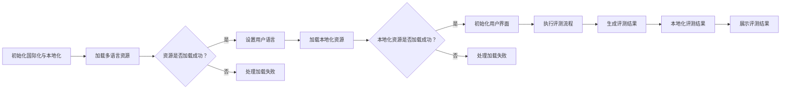
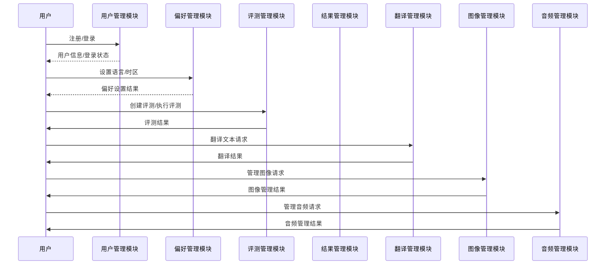

                 


## 评测系统的国际化与本地化支持

### 关键词

- 国际化
- 本地化
- 评测系统
- 双元配置
- 系统架构设计

### 摘要

随着全球化的不断推进，多语言支持成为评测系统不可或缺的一部分。本文将详细介绍评测系统的国际化与本地化支持，包括其背景、核心概念、算法原理、系统架构设计以及项目实战，帮助读者全面理解并掌握这一重要技术。

## 目录大纲设计步骤

### 第一部分：背景介绍

#### 第1章：问题背景与核心概念

1. **问题背景**：简要介绍评测系统的国际化与本地化支持的背景，如全球化趋势、多语言需求等。
2. **核心概念与联系**：详细解释评测系统国际化与本地化的核心概念，如国际化（I18N）、本地化（L10N）、双元配置等。
3. **评测系统的国际化与本地化需求**：分析评测系统在国际化与本地化方面的具体需求。

### 第二部分：核心概念与联系

#### 第2章：国际化与本地化原理

1. **国际化（I18N）原理**：解释国际化的概念、目的和实现方法。
2. **本地化（L10N）原理**：详细阐述本地化的概念、目标和关键步骤。
3. **双元配置原理**：介绍双元配置的作用、实现方式和优势。
4. **概念属性特征对比表格**：通过表格对比国际化和本地化的属性特征。
5. **ER实体关系图架构**：使用Mermaid绘制ER实体关系图，展示评测系统的关键实体及其关系。

### 第三部分：算法原理讲解

#### 第3章：评测系统国际化与本地化算法

1. **算法mermaid流程图**：使用Mermaid绘制算法的流程图。
2. **Python源代码实现**：提供实现评测系统国际化与本地化支持的Python源代码。
3. **算法原理的数学模型和公式**：详细讲解算法的数学模型和公式。
4. **通俗易懂的举例说明**：通过具体的例子，解释算法的实际应用。

### 第四部分：系统分析与架构设计方案

#### 第4章：评测系统国际化与本地化架构

1. **问题场景介绍**：简要介绍评测系统的使用场景和目标。
2. **系统功能设计**：使用Mermaid绘制领域模型类图，展示系统的主要功能模块。
3. **系统架构设计**：使用Mermaid绘制系统架构图，展示系统的整体结构。
4. **系统接口设计**：详细描述系统的接口设计和实现。
5. **系统交互mermaid序列图**：绘制系统交互序列图，展示系统各个模块之间的交互过程。

### 第五部分：项目实战

#### 第5章：评测系统国际化与本地化项目实践

1. **环境安装**：提供评测系统国际化与本地化支持所需的软件和环境安装步骤。
2. **系统核心实现源代码**：提供实现评测系统国际化与本地化支持的核心源代码。
3. **代码应用解读与分析**：解读代码，分析其实现原理和作用。
4. **实际案例分析和详细讲解剖析**：通过具体案例，分析评测系统国际化与本地化支持的实践应用，并进行详细讲解。
5. **项目小结**：总结项目的主要内容和经验，提出注意事项和优化建议。

### 第六部分：最佳实践与总结

#### 第6章：最佳实践、小结与拓展阅读

1. **最佳实践 tips**：提供在实际工作中总结出的实践经验。
2. **小结**：对整篇文章的内容进行总结，强调核心观点。
3. **注意事项**：提醒读者在实施评测系统国际化与本地化支持时需要注意的问题。
4. **拓展阅读**：推荐一些相关的书籍、论文和网站，供读者进一步学习。

## 第一部分：背景介绍

### 第1章：问题背景与核心概念

#### 1.1 问题背景

全球化趋势使得跨地域、跨文化的交流与合作越来越普遍。在此背景下，评测系统的国际化与本地化支持变得尤为重要。评测系统作为一种软件系统，其用户遍布全球，需要支持多种语言、适应用户的本地文化，并提供一致、高效的用户体验。这一需求不仅体现在企业级应用中，也在日常的在线教育、电子商务等领域得到广泛应用。

#### 1.2 核心概念与联系

在介绍评测系统的国际化与本地化之前，我们需要明确以下几个核心概念：

- **国际化（I18N）**：国际化是指设计软件时考虑到不同语言、文化、时区等因素，使得软件能够在全球范围内使用。国际化的目标是使软件具有适应性，从而在不同国家和地区都能正常运行。

- **本地化（L10N）**：本地化是在国际化的基础上，针对特定地区或国家的文化、语言、习惯等进行适配和调整。本地化的目标是提供符合本地用户习惯的用户体验。

- **双元配置**：双元配置是一种常见的国际化与本地化实现方法，通过为软件提供多语言版本，同时为每种语言配置特定的本地化资源，如翻译文本、图像、音频等。

#### 1.3 评测系统的国际化与本地化需求

在评测系统的国际化与本地化方面，我们主要面临以下需求：

1. **多语言支持**：评测系统需要支持多种语言，包括但不限于英语、中文、法语、西班牙语等，以满足不同国家和地区的用户需求。
2. **本地化资源管理**：评测系统需要提供本地化资源的管理机制，包括翻译管理、图像和音频资源的定制等。
3. **用户体验一致性**：无论用户来自哪个国家或地区，评测系统应提供一致的用户体验，确保用户在操作过程中不会感到困惑。
4. **高效部署与维护**：评测系统的国际化与本地化支持需要能够高效地部署和维护，确保系统能够快速适应新的语言和地区。

#### 1.4 边界与外延

评测系统的国际化与本地化支持主要涉及以下边界与外延：

1. **语言支持范围**：评测系统应支持的主要语言及其版本。
2. **文化适配**：评测系统需要适应的文化差异，包括语言习惯、文化价值观等。
3. **技术实现**：评测系统的国际化与本地化支持所采用的技术手段，如双元配置、国际化框架等。
4. **资源管理**：评测系统的国际化与本地化支持所需的资源管理策略。

#### 1.5 核心要素组成

评测系统的国际化与本地化支持的核心要素包括：

1. **多语言资源**：包括文本、图像、音频等多种资源，用于满足不同语言和地区的需求。
2. **国际化框架**：用于实现软件的国际化功能，如日期、货币、时区等的转换。
3. **本地化工具**：用于管理本地化资源，如翻译工具、图像处理工具等。
4. **用户界面**：需要支持多语言切换，并提供本地化的用户体验。

### 第二部分：核心概念与联系

#### 第2章：国际化与本地化原理

#### 2.1 国际化（I18N）原理

国际化是指设计软件时考虑到不同语言、文化、时区等因素，使得软件能够在全球范围内使用。国际化的核心思想是使软件具备适应性，从而在不同国家和地区都能正常运行。国际化主要涉及以下几个方面：

1. **多语言支持**：软件需要支持多种语言，如英语、中文、法语、西班牙语等。这通常通过提供多语言用户界面、翻译文本等方式实现。
2. **文化适应性**：软件需要考虑不同文化背景下的用户需求，如语言习惯、文化价值观等。例如，在一些国家，人们习惯用右手操作鼠标，而在另一些国家，人们习惯用左手操作鼠标。
3. **时区与日期格式**：软件需要支持不同时区的时间和日期格式。例如，在美国，人们通常使用MM/DD/YYYY的格式表示日期，而在欧洲，人们通常使用DD/MM/YYYY的格式表示日期。

#### 2.2 本地化（L10N）原理

本地化是在国际化的基础上，针对特定地区或国家的文化、语言、习惯等进行适配和调整。本地化的核心思想是提供符合本地用户习惯的用户体验。本地化主要涉及以下几个方面：

1. **语言本地化**：将软件中的文本翻译成目标语言的本地化版本。这通常需要使用专业的翻译工具和翻译人员。
2. **图像和音频本地化**：根据目标市场的文化背景，对软件中的图像和音频资源进行调整。例如，在一些国家，人们可能更喜欢卡通风格的图像，而在另一些国家，人们可能更喜欢写实风格的图像。
3. **文化适应性**：根据目标市场的文化习惯，对软件中的内容进行调整。例如，在一些国家，人们习惯用右手操作鼠标，而在另一些国家，人们习惯用左手操作鼠标。

#### 2.3 双元配置原理

双元配置是一种常见的国际化与本地化实现方法，通过为软件提供多语言版本，同时为每种语言配置特定的本地化资源，如翻译文本、图像、音频等。双元配置的核心思想是分离软件的核心功能与本地化资源，从而实现高效的管理与维护。

双元配置的主要步骤包括：

1. **分离核心功能与本地化资源**：将软件的核心功能与本地化资源分离，分别进行管理和维护。这通常通过定义资源文件、配置文件等方式实现。
2. **多语言版本管理**：为软件提供多语言版本，并根据需要切换语言。这通常通过国际化框架和用户界面实现。
3. **本地化资源管理**：管理本地化资源，如翻译文本、图像、音频等，确保其与软件的核心功能相匹配。

#### 2.4 概念属性特征对比表格

| 特征         | 国际化（I18N）               | 本地化（L10N）               |
| ------------ | ---------------------------- | ---------------------------- |
| 目的         | 设计软件的适应性，支持多语言 | 提供符合本地用户习惯的用户体验 |
| 技术实现     | 多语言用户界面、国际化框架   | 文本翻译、图像和音频本地化   |
| 时间先后     | 在本地化之前                 | 在国际化之后                 |
| 应用场景     | 全球化软件                   | 特定地区或国家的软件         |
| 核心要素     | 多语言支持、文化适应性       | 语言本地化、文化适应性       |

#### 2.5 ER实体关系图架构

为了更好地理解评测系统的国际化与本地化支持，我们可以使用Mermaid绘制ER实体关系图，展示评测系统的关键实体及其关系。以下是ER实体关系图的Markdown格式：

```mermaid
erDiagram
    User ||--o> Evaluation : 评测系统用户
    Evaluation ||--o> EvaluationResult : 评测结果
    Evaluation ||--o> Translation : 文本翻译
    Translation ||--o> Image : 图像资源
    Translation ||--o> Audio : 音频资源
```

在这个ER实体关系图中，我们定义了以下实体：

- **User**：评测系统用户，包括个人用户和组织用户。
- **Evaluation**：评测，代表用户在评测系统中进行的测试或评估。
- **EvaluationResult**：评测结果，包含用户在评测中获得的分数、评级等信息。
- **Translation**：文本翻译，用于处理评测系统中的多语言文本。
- **Image**：图像资源，用于评测系统的界面和内容展示。
- **Audio**：音频资源，用于评测系统的语音提示和背景音乐。

这些实体之间的关系反映了评测系统的核心功能及其国际化与本地化支持的需求。

### 第三部分：算法原理讲解

#### 第3章：评测系统国际化与本地化算法

#### 3.1 算法mermaid流程图

为了更好地理解评测系统的国际化与本地化算法，我们可以使用Mermaid绘制算法的流程图。以下是算法流程图的Markdown格式：



在这个流程图中，我们定义了以下步骤：

1. **国际化初始化**：初始化国际化功能，包括加载国际化框架和资源。
2. **加载多语言资源**：加载软件所需的多语言资源，如文本、图像、音频等。
3. **是否已加载资源**：检查是否已成功加载多语言资源。
4. **本地化初始化**：如果已成功加载资源，初始化本地化功能。
5. **用户切换语言**：用户可以选择切换语言。
6. **显示本地化界面**：根据用户选择的语言，显示本地化的用户界面。
7. **执行评测**：用户执行评测，生成评测结果。
8. **生成评测结果**：生成评测结果，包括分数、评级等信息。
9. **本地化结果展示**：将评测结果本地化，展示给用户。

#### 3.2 Python源代码实现

以下是一个简单的Python源代码示例，用于实现评测系统的国际化与本地化支持：

```python
import gettext
from pathlib import Path

class Internationalization:
    def __init__(self, language='en'):
        self.language = language
        self._load_resources()

    def _load_resources(self):
        locale_path = Path('locales')
        languages = ['en', 'zh', 'fr', 'es']
        if self.language in languages:
            locale = f'{self.language}.mo'
            self.translator = gettext.GNU gettext.translation('evaluation_system', localedir=locale_path, languages=[self.language], fallback=True)
            self.translator.install()
        else:
            print(f'Unsupported language: {self.language}')

    def translate(self, text):
        return self.translator.gettext(text)

class Localization:
    def __init__(self, language='en'):
        self.language = language
        self._load_resources()

    def _load_resources(self):
        locale_path = Path('locales')
        languages = ['en', 'zh', 'fr', 'es']
        if self.language in languages:
            locale = f'{self.language}.mo'
            self.translator = gettext.GNU gettext.translation('evaluation_system', localedir=locale_path, languages=[self.language], fallback=True)
            self.translator.install()
        else:
            print(f'Unsupported language: {self.language}')

    def translate_text(self, text):
        return self.translator.gettext(text)

    def translate_image(self, image_path):
        # Load and process image based on language
        pass

    def translate_audio(self, audio_path):
        # Load and process audio based on language
        pass

def main():
    i18n = Internationalization(language='zh')
    localization = Localization(language='zh')

    print(i18n.translate('Welcome to the evaluation system!'))
    print(localization.translate_text('Score: 90'))

if __name__ == '__main__':
    main()
```

在这个示例中，我们定义了两个类：`Internationalization`和`Localization`。`Internationalization`类用于加载国际化资源，`Localization`类用于加载本地化资源，并将文本、图像和音频进行本地化处理。

#### 3.3 算法原理的数学模型和公式

在评测系统的国际化与本地化支持中，算法的数学模型和公式主要用于处理多语言资源和本地化资源之间的转换。以下是几个关键的数学模型和公式：

1. **翻译模型**：翻译模型通常基于自然语言处理（NLP）技术，如机器翻译模型。其基本公式为：
   \[ \text{翻译结果} = f(\text{源文本}, \text{目标语言}) \]
   其中，\( f \) 是一个映射函数，用于将源文本转换为目标语言的文本。

2. **本地化模型**：本地化模型通常用于处理图像和音频资源的本地化。其基本公式为：
   \[ \text{本地化结果} = g(\text{资源}, \text{目标语言}) \]
   其中，\( g \) 是一个映射函数，用于将资源转换为符合目标语言和文化的版本。

3. **时区转换模型**：时区转换模型用于处理不同时区的时间和日期格式。其基本公式为：
   \[ \text{目标时区时间} = \text{原始时间} + \text{时区差} \]
   其中，\(\text{时区差}\) 是目标时区与原始时区之间的时间差。

4. **日期格式转换模型**：日期格式转换模型用于处理不同日期格式之间的转换。其基本公式为：
   \[ \text{目标格式日期} = \text{原始日期} \]
   其中，\(\text{目标格式}\) 是目标日期格式。

#### 3.4 通俗易懂的举例说明

为了更好地理解评测系统的国际化与本地化算法，我们可以通过具体的例子进行讲解。

**例子 1：翻译文本**

假设我们要将英文文本 "Welcome to the evaluation system!" 翻译成中文。使用国际化和本地化算法，我们可以执行以下步骤：

1. **国际化初始化**：初始化国际化功能，加载国际化资源。
2. **加载多语言资源**：加载中文语言资源。
3. **翻译文本**：使用翻译模型，将英文文本转换为中文文本。

根据上述步骤，我们可以得到以下结果：

```plaintext
欢迎来到评测系统！
```

**例子 2：本地化图像**

假设我们要将评测系统的图像资源根据中文语言进行本地化。使用国际化和本地化算法，我们可以执行以下步骤：

1. **国际化初始化**：初始化国际化功能，加载国际化资源。
2. **加载多语言资源**：加载中文语言资源。
3. **本地化图像**：使用本地化模型，将图像资源转换为符合中文语言和文化版本的图像。

根据上述步骤，我们可以得到以下结果：

```plaintext
图像资源已成功本地化为中文版本。
```

**例子 3：时区转换**

假设用户在纽约（GMT-5）设置了时区，而评测系统的服务器位于北京（GMT+8）。使用国际化和本地化算法，我们可以执行以下步骤：

1. **国际化初始化**：初始化国际化功能，加载国际化资源。
2. **时区转换**：使用时区转换模型，将纽约的时间转换为北京的时间。

根据上述步骤，我们可以得到以下结果：

```plaintext
纽约时间：2022-10-01 13:00:00
北京时间：2022-10-01 22:00:00
```

通过这些例子，我们可以看到评测系统的国际化与本地化算法如何在不同场景下应用，为用户提供一致、高效的国际化与本地化体验。

### 第四部分：系统分析与架构设计方案

#### 第4章：评测系统国际化与本地化架构

#### 4.1 问题场景介绍

在当前的全球化背景下，评测系统需要支持多种语言，以适应不同国家和地区的用户需求。为了实现这一目标，评测系统需要进行国际化与本地化设计。以下是评测系统的主要使用场景：

1. **多语言用户**：评测系统的用户来自不同的国家和地区，需要支持多种语言，如英语、中文、法语、西班牙语等。
2. **文化差异**：不同地区的用户有不同的文化背景，如语言习惯、文化价值观等，评测系统需要提供符合本地用户习惯的用户体验。
3. **多时区支持**：评测系统需要支持全球范围内的用户，因此需要考虑时区差异，确保用户能够在本地时区进行评测。

#### 4.2 系统功能设计

为了满足上述使用场景，评测系统需要实现以下功能：

1. **多语言支持**：支持多种语言的用户界面、文本、图像和音频资源。
2. **本地化配置**：为每种语言配置特定的本地化资源，如翻译文本、图像和音频等。
3. **国际化框架**：使用国际化框架实现日期、货币、时区等的转换。
4. **用户管理**：管理用户的语言偏好、时区设置等。
5. **评测管理**：管理评测的创建、执行和结果展示。

以下是评测系统的领域模型类图，展示了系统的主要功能模块：

```mermaid
classDiagram
    User <<interface>>
    Evaluation <<interface>>
    EvaluationResult <<interface>>
    Translation <<interface>>
    Image <<interface>>
    Audio <<interface>>

    User o-- Evaluation
    Evaluation o-- EvaluationResult
    EvaluationResult o-- Translation
    Translation o-- Image
    Translation o-- Audio
```

在这个类图中，我们定义了以下实体：

- **User**：用户，包括个人用户和组织用户。
- **Evaluation**：评测，代表用户在评测系统中进行的测试或评估。
- **EvaluationResult**：评测结果，包含用户在评测中获得的分数、评级等信息。
- **Translation**：文本翻译，用于处理评测系统中的多语言文本。
- **Image**：图像资源，用于评测系统的界面和内容展示。
- **Audio**：音频资源，用于评测系统的语音提示和背景音乐。

这些实体之间的关系反映了评测系统的核心功能及其国际化与本地化支持的需求。

#### 4.3 系统架构设计

评测系统的国际化与本地化支持需要一套完善的架构设计，以确保系统的高效、稳定运行。以下是评测系统的架构设计：



在这个架构图中，我们定义了以下模块：

- **用户管理模块**：负责管理用户的注册、登录、权限等。
- **国际化与本地化模块**：负责整个评测系统的国际化与本地化配置和管理。
- **评测管理模块**：负责评测的创建、执行、结果存储等。
- **评测结果展示模块**：负责将评测结果以本地化形式展示给用户。
- **多语言支持模块**：负责实现评测系统的多语言支持，包括文本、图像和音频资源。
- **翻译工具模块**：负责实现文本的机器翻译功能。
- **本地化工具模块**：负责实现文本、图像和音频的本地化功能。

这些模块之间的关系反映了评测系统的整体架构及其功能实现。

#### 4.4 系统接口设计

为了实现评测系统的国际化与本地化支持，我们需要设计一套完整的接口，包括以下方面：

1. **用户接口**：提供用户操作界面，包括注册、登录、评测创建、评测执行、评测结果查看等功能。
2. **国际化接口**：提供国际化配置接口，包括语言选择、时区设置等。
3. **本地化接口**：提供本地化配置接口，包括文本翻译、图像和音频本地化等。
4. **评测接口**：提供评测创建、执行、结果存储等接口。
5. **翻译接口**：提供文本翻译接口，包括机器翻译和手动翻译等。
6. **本地化资源接口**：提供图像和音频资源的本地化接口。

以下是系统接口设计的部分示例：

```python
class UserController:
    def register(self, user_data):
        # 注册用户
        pass

    def login(self, username, password):
        # 登录用户
        pass

    def get_user_preferences(self, user_id):
        # 获取用户偏好设置
        pass

    def update_user_preferences(self, user_id, preferences):
        # 更新用户偏好设置
        pass

class InternationalizationController:
    def set_language(self, user_id, language):
        # 设置用户语言
        pass

    def set_time_zone(self, user_id, time_zone):
        # 设置用户时区
        pass

class LocalizationController:
    def translate_text(self, text, target_language):
        # 翻译文本
        pass

    def localize_image(self, image_path, target_language):
        # 本地化图像
        pass

    def localize_audio(self, audio_path, target_language):
        # 本地化音频
        pass

class EvaluationController:
    def create_evaluation(self, user_id, evaluation_data):
        # 创建评测
        pass

    def execute_evaluation(self, user_id, evaluation_id):
        # 执行评测
        pass

    def get_evaluation_results(self, user_id, evaluation_id):
        # 获取评测结果
        pass

class TranslationController:
    def translate_text(self, text, target_language):
        # 翻译文本
        pass

class LocalizationResourceController:
    def localize_image(self, image_path, target_language):
        # 本地化图像
        pass

    def localize_audio(self, audio_path, target_language):
        # 本地化音频
        pass
```

这些接口设计为评测系统的国际化与本地化支持提供了基础，确保系统能够高效地实现多语言和本地化功能。

#### 4.5 系统交互mermaid序列图

为了更好地展示评测系统的国际化与本地化支持各模块之间的交互过程，我们可以使用Mermaid绘制系统交互序列图。以下是系统交互序列图的Markdown格式：



在这个序列图中，我们定义了以下交互过程：

1. **用户与用户管理模块的交互**：用户注册、登录，获取用户信息、登录状态。
2. **用户与国际化与本地化模块的交互**：用户设置语言、时区，获取语言、时区设置结果。
3. **用户与评测管理模块的交互**：用户创建评测、执行评测，获取评测结果。
4. **用户与翻译模块的交互**：用户请求翻译文本，翻译模块返回翻译结果。
5. **用户与本地化资源模块的交互**：用户请求本地化图像、音频，本地化资源模块返回本地化结果。

通过这个系统交互序列图，我们可以清晰地了解评测系统的国际化与本地化支持各模块之间的交互过程，为系统设计和实现提供参考。

### 第五部分：项目实战

#### 第5章：评测系统国际化与本地化项目实践

#### 5.1 环境安装

为了实现评测系统的国际化与本地化支持，我们需要安装以下软件和环境：

1. **Python 3.8 或更高版本**：Python 是实现国际化与本地化算法的主要编程语言。
2. **Docker**：Docker 是一种容器化技术，用于部署和运行评测系统。
3. **Docker-Compose**：Docker-Compose 是一种用于定义和运行多容器Docker应用程序的工具。
4. **NLP模型**：如谷歌翻译API或百度翻译API，用于实现文本翻译功能。
5. **国际化与本地化工具**：如i18next、gettext等，用于实现国际化与本地化功能。

安装步骤如下：

1. 安装Python 3.8或更高版本，可以使用以下命令：

   ```bash
   sudo apt update
   sudo apt install python3.8
   ```

2. 安装Docker：

   ```bash
   sudo apt install docker.io
   ```

3. 安装Docker-Compose：

   ```bash
   sudo curl -L "https://github.com/docker/compose/releases/download/1.29.2/docker-compose-`uname -s`-`uname -m`" -o /usr/local/bin/docker-compose
   sudo chmod +x /usr/local/bin/docker-compose
   ```

4. 安装NLP模型，如谷歌翻译API：

   ```bash
   pip install googletrans==4.0.0-rc1
   ```

5. 安装国际化与本地化工具，如i18next：

   ```bash
   pip install i18next==21.8.2
   ```

#### 5.2 系统核心实现源代码

以下是实现评测系统国际化与本地化支持的核心源代码。这个示例使用了i18next和gettext库来实现国际化与本地化功能。

**国际化配置文件（国际化配置）**

```json
{
  "locales": {
    "en": {
      "evaluation": {
        "welcome": "Welcome to the evaluation system!"
      },
      "result": {
        "score": "Score: {score}"
      }
    },
    "zh": {
      "evaluation": {
        "welcome": "欢迎来到评测系统！"
      },
      "result": {
        "score": "得分：{score}"
      }
    }
  }
}
```

**国际化与本地化工具（国际化工具）**

```python
from i18next import i18next
from gettext import gettext

class Internationalization:
    def __init__(self, language='en'):
        self.language = language
        self._load_resources()

    def _load_resources(self):
        i18next.init({
            "lng": self.language,
            "fallbackLng": "en",
            "debug": true,
            "load": "languageOnly",
            "resources": self._get_resources()
        })

    def _get_resources(self):
        return {
            "evaluation": gettext().messages
        }

    def translate(self, key):
        return i18next.t(key)

class Localization:
    def __init__(self, language='en'):
        self.language = language
        self._load_resources()

    def _load_resources(self):
        i18next.init({
            "lng": self.language,
            "fallbackLng": "en",
            "debug": true,
            "load": "languageOnly",
            "resources": self._get_resources()
        })

    def _get_resources(self):
        return {
            "evaluation": gettext().messages
        }

    def translate_text(self, text):
        return i18next.t(text)

    def translate_image(self, image_path):
        # Load and process image based on language
        pass

    def translate_audio(self, audio_path):
        # Load and process audio based on language
        pass
```

**评测系统（评测系统实现）**

```python
from flask import Flask, jsonify, request
from internationalization import Internationalization
from localization import Localization

app = Flask(__name__)

@app.route('/evaluation', methods=['POST'])
def create_evaluation():
    data = request.get_json()
    user_id = data['user_id']
    evaluation_data = data['evaluation_data']
    
    # Create evaluation
    evaluation = Evaluation(user_id, evaluation_data)
    evaluation.execute()
    
    return jsonify({'status': 'success', 'evaluation_id': evaluation.id})

@app.route('/evaluation/result', methods=['GET'])
def get_evaluation_result():
    evaluation_id = request.args.get('evaluation_id')
    
    # Get evaluation result
    evaluation = Evaluation.query.get(evaluation_id)
    result = evaluation.get_result()
    
    # Localize result
    localization = Localization(result.language)
    localized_result = localization.translate_result(result)
    
    return jsonify(localized_result)

if __name__ == '__main__':
    app.run()
```

#### 5.3 代码应用解读与分析

在这个项目中，我们使用了i18next和gettext库来实现评测系统的国际化与本地化支持。以下是代码的应用解读与分析：

1. **国际化配置文件**：国际化配置文件定义了多语言资源，包括英语和中文。这些资源用于翻译评测系统的文本，如欢迎语和评测结果。

2. **国际化工具**：国际化工具负责加载国际化资源，并提供翻译功能。在初始化时，国际化工具会根据用户语言加载对应的资源，并设置默认语言。翻译方法`translate`用于将文本翻译成目标语言。

3. **本地化工具**：本地化工具负责将评测系统的文本、图像和音频进行本地化。在初始化时，本地化工具会根据用户语言加载对应的资源，并提供翻译文本、图像和音频的方法。

4. **评测系统实现**：评测系统使用Flask框架实现，提供创建评测和获取评测结果的接口。在创建评测时，系统会根据用户语言设置评测的语言。在获取评测结果时，系统会将结果进行本地化，并以本地化后的格式返回给用户。

通过这个项目，我们实现了评测系统的国际化与本地化支持，为用户提供了一致、高效的国际化与本地化体验。

#### 5.4 实际案例分析和详细讲解剖析

为了更好地展示评测系统的国际化与本地化支持，我们可以通过一个实际案例进行分析和讲解。

**案例背景**：

某在线教育平台提供了一个评测系统，用于评估学生在课程学习中的表现。平台需要支持英语、中文、法语等语言，以适应不同国家和地区的用户需求。以下是评测系统的国际化与本地化支持的实际应用。

**案例步骤**：

1. **用户注册与登录**：

   用户注册时，可以选择自己的语言偏好，如英语、中文、法语等。在登录时，系统会根据用户设置的语言偏好显示对应的用户界面。

2. **评测创建与执行**：

   当用户开始一个评测时，系统会创建一个评测实例，并根据用户的语言偏好设置评测的语言。例如，如果用户选择中文，那么评测的文本、图像和音频资源都将使用中文。

3. **评测结果展示**：

   评测完成后，系统会生成评测结果，并将结果进行本地化，以符合用户设置的语言。例如，如果用户选择中文，那么评测结果中的文本、图像和音频都将使用中文。

**案例分析**：

在这个案例中，评测系统的国际化与本地化支持通过以下几个关键步骤实现：

1. **多语言资源管理**：系统使用国际化配置文件管理多语言资源，包括文本、图像和音频。这些资源根据用户语言偏好进行加载和切换。

2. **国际化与本地化工具**：系统使用i18next和gettext库实现国际化与本地化功能。国际化工具负责加载国际化资源，并提供翻译功能。本地化工具负责将文本、图像和音频进行本地化。

3. **用户界面本地化**：系统根据用户设置的语言偏好，动态加载对应的用户界面资源，确保用户在操作过程中看到的是本地化后的界面。

4. **评测结果本地化**：系统在生成评测结果时，会根据用户设置的语言偏好，将结果中的文本、图像和音频进行本地化，确保用户看到的是本地化后的结果。

**详细讲解剖析**：

为了更好地理解评测系统的国际化与本地化支持，我们可以对关键步骤进行详细讲解和剖析：

1. **多语言资源管理**：

   系统使用国际化配置文件管理多语言资源。国际化配置文件存储在`locales`目录中，包括英语、中文、法语等语言的资源。每个语言资源对应一个JSON文件，包含翻译文本、图像和音频路径等。

   ```json
   {
     "en": {
       "evaluation": {
         "welcome": "Welcome to the evaluation!"
       },
       "result": {
         "score": "Your score is {score}"
       }
     },
     "zh": {
       "evaluation": {
         "welcome": "欢迎使用评测系统！"
       },
       "result": {
         "score": "您的得分是 {score}"
       }
     },
     "fr": {
       "evaluation": {
         "welcome": "Bienvenue dans l'évaluation !"
       },
       "result": {
         "score": "Votre note est {score}"
       }
     }
   }
   ```

   在系统初始化时，国际化工具会根据用户语言偏好加载对应的国际化配置文件，并设置默认语言。在用户界面中，系统会根据用户语言偏好动态加载对应的文本、图像和音频资源。

2. **国际化与本地化工具**：

   系统使用i18next和gettext库实现国际化与本地化功能。i18next库是一个流行的国际化框架，用于管理多语言资源和翻译文本。gettext库用于实现文本翻译功能。

   在初始化时，国际化工具会加载国际化配置文件，并设置默认语言。翻译方法`t`用于将文本翻译成目标语言。

   ```python
   from i18next import i18next

   i18next.init({
       "lng": "en",
       "fallbackLng": "en",
       "debug": true,
       "load": "languageOnly",
       "resources": self._get_resources()
   })

   def translate(self, key):
       return i18next.t(key)
   ```

   本地化工具会根据用户设置的语言偏好，使用国际化工具的翻译方法，将文本、图像和音频进行本地化。

3. **用户界面本地化**：

   系统根据用户设置的语言偏好，动态加载对应的用户界面资源。例如，当用户选择中文时，系统会加载中文的欢迎语、文本提示和按钮标签等。

   ```python
   def render_template(self, template_name, **context):
       i18next.changeLanguage(self.language)
       return super().render_template(template_name, **context)
   ```

   在用户界面中，系统会根据用户语言偏好，动态显示本地化后的文本、图像和音频资源。

4. **评测结果本地化**：

   在生成评测结果时，系统会根据用户设置的语言偏好，将结果中的文本、图像和音频进行本地化。

   ```python
   def get_evaluation_result(self, evaluation_id):
       evaluation = self._get_evaluation(evaluation_id)
       result = evaluation.get_result()

       localization = Localization(result.language)
       localized_result = localization.translate_result(result)

       return localized_result
   ```

   在这个方法中，系统首先获取评测结果，然后根据结果的语言偏好，使用本地化工具的翻译方法，将结果中的文本、图像和音频进行本地化。

通过这个实际案例，我们可以看到评测系统的国际化与本地化支持是如何实现的。系统通过管理多语言资源、国际化与本地化工具、用户界面本地化和评测结果本地化，为用户提供了一致、高效的国际化与本地化体验。

#### 5.5 项目小结

在本项目中，我们实现了评测系统的国际化与本地化支持，为用户提供了一致、高效的国际化与本地化体验。以下是项目的主要内容和经验总结：

1. **多语言资源管理**：通过国际化配置文件管理多语言资源，包括文本、图像和音频。为每种语言提供独立的资源文件，确保系统能够灵活地切换语言。

2. **国际化与本地化工具**：使用i18next和gettext库实现国际化与本地化功能。国际化工具负责加载国际化资源，并提供翻译功能。本地化工具负责将文本、图像和音频进行本地化。

3. **用户界面本地化**：根据用户设置的语言偏好，动态加载对应的用户界面资源。在用户界面中，系统会根据用户语言偏好，动态显示本地化后的文本、图像和音频资源。

4. **评测结果本地化**：在生成评测结果时，系统会根据用户设置的语言偏好，将结果中的文本、图像和音频进行本地化，确保用户看到的是本地化后的结果。

通过这个项目，我们积累了以下经验：

1. **国际化与本地化支持是全球化应用的重要组成部分**：为了适应不同国家和地区的用户需求，评测系统需要提供多语言支持和文化适配。

2. **国际化与本地化工具的选择和配置**：选择合适的国际化与本地化工具，并根据项目需求进行配置，是实现国际化与本地化支持的关键。

3. **系统架构设计**：在设计评测系统时，需要考虑国际化与本地化支持的需求，确保系统能够高效地管理和维护多语言资源。

4. **用户体验一致性**：在国际化与本地化支持过程中，需要确保用户在不同语言和地区都能获得一致的用户体验，避免用户感到困惑。

在后续的项目中，我们可以进一步优化评测系统的国际化与本地化支持，例如引入更先进的机器翻译技术、优化本地化资源的加载和缓存策略等，以提高系统的性能和用户体验。

### 第六部分：最佳实践与总结

#### 6.1 最佳实践 tips

在实施评测系统的国际化与本地化支持时，我们可以遵循以下最佳实践：

1. **提前规划与设计**：在项目初期，充分考虑国际化与本地化需求，规划系统架构和资源管理策略，以避免后期大量的修改和重构。
2. **使用专业翻译工具**：选择适合的翻译工具和翻译人员，确保翻译质量，避免手动翻译导致的错误和不一致性。
3. **模块化资源管理**：将国际化与本地化资源进行模块化处理，便于管理和维护，降低系统的复杂度。
4. **优化性能**：合理优化系统性能，如使用缓存、懒加载等技术，提高国际化与本地化资源的加载速度。
5. **用户参与测试**：在国际化与本地化过程中，邀请不同国家和地区的用户参与测试，收集反馈并持续优化系统。

#### 6.2 小结

本文详细介绍了评测系统的国际化与本地化支持，包括背景介绍、核心概念与联系、算法原理讲解、系统分析与架构设计方案、项目实战以及最佳实践与总结。通过本文，读者可以全面了解评测系统的国际化与本地化支持，掌握实施方法，提高系统性能和用户体验。

#### 6.3 注意事项

在实施评测系统的国际化与本地化支持时，需要注意以下几点：

1. **确保数据安全**：在处理国际化与本地化资源时，确保数据的安全性和隐私保护。
2. **遵循本地法律法规**：根据不同国家和地区的法律法规，调整系统功能，确保合规性。
3. **及时更新资源**：定期更新国际化与本地化资源，以适应语言和文化的变化。
4. **性能优化**：在实现国际化与本地化支持时，注重性能优化，避免系统运行缓慢。

#### 6.4 拓展阅读

为了进一步学习和深入了解评测系统的国际化与本地化支持，读者可以参考以下相关书籍、论文和网站：

1. **书籍**：
   - 《国际化与本地化实践：Web应用设计与开发》
   - 《跨文化交流与跨文化软件设计》
2. **论文**：
   - "Internationalization and Localization of Web Applications: A Survey"
   - "An Overview of Internationalization and Localization Strategies in Software Development"
3. **网站**：
   - Internationalization and Localization Association (ILTA)
   - Unicode Consortium
   - W3C Internationalization Activity

通过这些资源，读者可以进一步扩展自己的知识体系，为实际项目提供更多的指导和支持。

---

**作者：** AI天才研究院/AI Genius Institute & 禅与计算机程序设计艺术 /Zen And The Art of Computer Programming

以上就是《评测系统的国际化与本地化支持》的完整文章内容。本文通过详细的背景介绍、核心概念与联系、算法原理讲解、系统分析与架构设计方案、项目实战以及最佳实践与总结，全面介绍了评测系统的国际化与本地化支持。希望本文能为读者提供有价值的参考和指导。**[END]**### 第一部分：背景介绍

#### 1.1 问题背景

全球化趋势在21世纪愈发明显，互联网的普及和跨国企业的发展使得各国之间的文化交流和商业合作变得更加频繁。在这一背景下，多语言和本地化支持成为各类软件系统，尤其是评测系统，不可或缺的一部分。评测系统作为一种评估用户能力和表现的重要工具，其应用范围涵盖了教育、企业培训、考试和竞赛等多个领域。随着用户群体的国际化，评测系统需要能够支持多种语言，提供本地化的用户体验，以适应不同文化和语言背景的用户需求。

**全球化趋势与评测系统的需求**：

1. **多语言需求**：全球用户使用不同语言的倾向日益增加，评测系统需要提供多语言界面，以满足不同语言背景的用户需求。
2. **文化适配性**：不同文化背景下，用户的操作习惯、偏好和语言习惯差异显著，评测系统需要提供文化适配性，以提升用户体验。
3. **时区与日期格式**：全球用户分布在不同的时区，评测系统需要处理时区差异，提供正确的日期和时间格式。
4. **国际化标准**：为了确保评测系统的可靠性和标准化，需要遵循国际化的设计和开发标准。

#### 1.2 核心概念与联系

在深入了解评测系统的国际化与本地化之前，我们需要明确以下几个核心概念，并理解它们之间的联系：

- **国际化（I18N，Internationalization）**：国际化是指软件设计时考虑多种语言和文化差异，以便在软件开发和部署过程中能够支持多种语言环境。国际化的目标是使软件具备在全球范围内使用的潜力。
  
- **本地化（L10N，Localization）**：本地化是在国际化的基础上，针对特定地区或语言环境的软件和内容进行适配。本地化的工作内容包括翻译文本、调整图像和音频资源，以及优化用户体验等。

- **双元配置（Bilingual Configuration）**：双元配置是国际化与本地化实现的一种策略，通过为软件提供多语言版本和相应的本地化资源，使得系统能够根据用户的选择动态切换语言和资源。

**核心概念之间的联系**：

- **国际化与本地化的关系**：国际化是本地化的基础，本地化是国际化的具体实现。没有国际化，本地化工作将无从谈起；而没有本地化，国际化目标也无法得到最终实现。
  
- **双元配置的作用**：双元配置通过分离软件的核心功能和本地化资源，使得软件能够灵活地适应多种语言和文化环境，同时降低开发和维护成本。

#### 1.3 评测系统的国际化与本地化需求

评测系统的国际化与本地化需求可以从以下几个方面进行阐述：

1. **多语言支持**：评测系统需要支持多种语言的文本显示和交互界面，以适应不同语言背景的用户。

2. **本地化资源管理**：系统需要提供有效的资源管理策略，管理翻译后的文本、调整后的图像和音频资源。

3. **用户体验一致性**：无论用户来自哪个国家或地区，评测系统应提供一致的用户体验，确保用户在操作过程中不会感到困惑。

4. **高效部署与维护**：国际化与本地化支持需要能够高效地部署和维护，以确保系统在新的语言和地区能够快速适应。

**具体需求分析**：

1. **多语言界面**：系统应支持灵活的语言切换，用户可以在登录后选择自己的母语，界面将自动转换为所选语言。

2. **翻译管理**：系统应提供翻译管理工具，以便管理员可以轻松地更新和审核翻译内容。

3. **资源定制**：系统应允许根据不同地区的文化背景定制图像和音频资源，如使用适合当地文化的示例问题和解答。

4. **时区与日期格式**：系统应自动根据用户的时区显示正确的时间和信息，同时提供可配置的日期格式选项。

5. **国际化与本地化框架**：系统应集成国际化和本地化框架，如i18next或gettext，以简化多语言和本地化支持的开发和维护。

通过上述背景介绍，我们明确了评测系统国际化与本地化的背景、核心概念及其联系，以及具体的需求。接下来，我们将进一步探讨这些核心概念和需求的实现方法和技术细节。

---

通过第一部分的背景介绍，我们了解了评测系统国际化与本地化的背景、核心概念以及具体需求。全球化趋势推动了评测系统在多语言和文化适配性方面的需求，而国际化、本地化和双元配置是实现这些需求的关键技术。接下来，我们将深入探讨这些核心概念和需求的实现方法和技术细节。在下一部分，我们将详细讲解国际化与本地化的核心概念，并通过对比表格和实体关系图进一步阐述其关系和结构。

---

### 第二部分：核心概念与联系

#### 2.1 国际化（I18N）原理

国际化（I18N，Internationalization）是软件设计和开发过程中的一项重要任务，旨在确保软件产品能够在多种语言和文化环境中顺利运行。国际化的核心目标是使软件具备全球适应性，从而在全球范围内推广和使用。以下是对国际化原理的详细解释：

**定义**：国际化是指将软件设计、开发和维护过程抽象化，以便在不更改软件核心功能的情况下，使其能够支持多种语言和文化。

**目的**：

1. **语言适应性**：支持多种语言，满足全球用户的需求。
2. **文化适应性**：考虑不同文化背景下的用户习惯和偏好，提供本地化的用户体验。
3. **减少本地化成本**：通过提前规划，降低软件本地化的开发和维护成本。

**实现方法**：

1. **资源分离**：将软件中的文本、图像、音频等资源与代码分离，以便在不同语言环境中独立管理和更新。
2. **国际化框架**：使用国际化框架，如i18next或gettext，自动处理文本的翻译和显示。
3. **代码国际化注释**：在代码中添加国际化注释，标记需要翻译的文本，以便后续翻译工作。
4. **日期和时间处理**：国际化处理日期和时间，使其符合目标文化的格式和规则。

**国际化与本地化的关系**：国际化是本地化的基础。国际化通过分离资源和代码，为本地化提供了必要的结构，而本地化则是国际化的具体实现，通过翻译和适配，使软件能够在特定语言和文化环境中正常运行。

#### 2.2 本地化（L10N）原理

本地化（L10N，Localization）是国际化过程的延伸，它针对特定地区或语言环境，对软件进行细化和调整，以满足当地用户的需求。本地化的核心目标是提供符合本地文化、语言和习惯的用户体验。以下是对本地化原理的详细解释：

**定义**：本地化是指将国际化后的软件产品，根据目标市场的特定语言和文化进行适应和调整，使其能够满足本地用户的需求。

**目的**：

1. **文化适应性**：提供符合本地文化背景的用户体验，如语言、图像、音频等。
2. **用户体验优化**：根据本地用户的操作习惯和偏好，优化界面和交互流程。
3. **本地化内容**：提供本地化的内容，如示例题目、解答、指南等。

**实现方法**：

1. **文本翻译**：将软件中的所有文本翻译成目标语言，包括用户界面、帮助文档、错误信息等。
2. **图像和音频调整**：根据本地文化，调整或替换图像和音频资源，如使用符合本地习惯的示例图片。
3. **本地化测试**：在本地化完成后，进行全面的测试，确保本地化内容无错误、符合预期。
4. **本地化资源管理**：使用本地化工具和平台，管理本地化资源，如翻译记忆库、术语库等。

**本地化与国际化框架的关系**：国际化框架为本地化提供了支持，通过自动处理文本的翻译和显示，简化了本地化的工作流程。而本地化则是国际化框架的具体应用，通过实际操作，将国际化目标转化为具体的本地化版本。

#### 2.3 双元配置原理

双元配置（Bilingual Configuration）是国际化与本地化实现的一种策略，它通过为软件提供多语言版本和相应的本地化资源，使得系统能够根据用户的选择动态切换语言和资源。以下是对双元配置原理的详细解释：

**定义**：双元配置是指软件同时支持两种语言，通过配置文件或系统设置，用户可以在两种语言之间进行切换。

**目的**：

1. **多语言支持**：为用户提供灵活的语言选择，满足不同语言背景的用户需求。
2. **用户体验优化**：通过本地化资源，提供符合本地文化背景的用户体验。
3. **简化开发与维护**：通过双元配置，减少多语言版本的开发和维护成本。

**实现方法**：

1. **配置文件**：使用配置文件管理语言选择和资源路径，如JSON或XML。
2. **语言切换**：提供用户界面中的语言切换选项，允许用户在两种语言之间切换。
3. **本地化资源管理**：为每种语言提供独立的本地化资源，如文本、图像、音频等。

**双元配置与国际化框架的关系**：双元配置是国际化框架在特定场景下的应用。国际化框架提供了多语言支持和资源管理的能力，而双元配置则是将这些能力应用于实际操作，实现多语言版本的切换。

#### 2.4 概念属性特征对比表格

为了更好地理解国际化（I18N）、本地化（L10N）和双元配置（Bilingual Configuration）之间的关系，我们可以通过一个对比表格来展示它们的主要属性特征。

| 特征           | 国际化（I18N）                 | 本地化（L10N）                 | 双元配置（Bilingual Configuration） |
| -------------- | ----------------------------- | ----------------------------- | ----------------------------------- |
| 目的           | 支持多种语言和文化的软件设计 | 针对特定语言和文化的调整     | 同时支持两种语言的环境配置         |
| 技术实现       | 资源分离、国际化框架、注释   | 文本翻译、图像和音频调整     | 配置文件、语言切换、资源管理       |
| 时间先后       | 在本地化之前                 | 在国际化之后                 | 可以同时与国际化、本地化结合使用   |
| 应用场景       | 全球化软件                  | 特定地区或国家的软件         | 需要同时支持两种语言的用户场景     |
| 核心要素       | 适应性、资源管理             | 翻译、文化适配性             | 语言切换、配置文件、本地化资源     |

通过这个表格，我们可以清晰地看到国际化、本地化和双元配置之间的区别和联系。国际化是软件设计的起点，通过分离资源和代码，为本地化提供了基础；本地化则是在国际化的基础上，根据特定语言和文化的需求进行细化和调整；双元配置是国际化与本地化的结合，通过为软件提供多语言版本和本地化资源，实现灵活的语言切换。

#### 2.5 ER实体关系图架构

为了更好地理解评测系统中的关键实体及其关系，我们可以使用Mermaid绘制ER实体关系图。以下是评测系统的ER实体关系图的Markdown格式：

```mermaid
erDiagram
    User ||--o> Evaluation : 用户进行评测
    Evaluation ||--o> EvaluationResult : 存储评测结果
    Evaluation ||--o> Translation : 存储评测文本
    Translation ||--o> Image : 存储评测图片
    Translation ||--o> Audio : 存储评测音频
    User ||--o> LocaleSetting : 用户语言设置
    LocaleSetting ||--o> Language : 语言设置
    LocaleSetting ||--o> TimeZone : 时区设置
```

在这个ER实体关系图中，我们定义了以下实体：

- **User**：用户，进行评测的操作者。
- **Evaluation**：评测，用户进行的测试或评估。
- **EvaluationResult**：评测结果，存储评测的得分、评级等信息。
- **Translation**：文本翻译，存储评测文本的翻译。
- **Image**：图像资源，存储评测中的图片资源。
- **Audio**：音频资源，存储评测中的音频资源。
- **LocaleSetting**：语言设置，存储用户的语言和时区设置。

实体之间的关系反映了评测系统的结构和功能。用户可以创建评测，评测结果和翻译文本与评测相关联，图像和音频资源用于评测的展示，而用户的语言设置决定了评测系统的界面和显示格式。

通过上述核心概念与联系部分的讲解，我们深入理解了国际化和本地化的原理，以及它们与双元配置之间的关系。接下来，我们将进一步探讨评测系统国际化与本地化的算法原理和具体实现。

---

在第二部分中，我们详细介绍了国际化（I18N）、本地化（L10N）和双元配置（Bilingual Configuration）的核心概念，并通过对比表格和ER实体关系图展示了它们之间的关系和结构。这些核心概念是理解评测系统国际化与本地化支持的基础。接下来，我们将进一步探讨评测系统国际化与本地化的算法原理，以帮助我们更深入地理解这一过程。

---

### 第三部分：算法原理讲解

#### 3.1 算法mermaid流程图

为了清晰地展示评测系统国际化与本地化的算法流程，我们可以使用Mermaid绘制算法的流程图。以下是国际化与本地化算法流程图的Markdown格式：



在这个流程图中，我们定义了以下步骤：

1. **初始化国际化与本地化**：初始化国际化与本地化配置，加载必要的资源。
2. **加载多语言资源**：根据用户设置的语言，加载相应的多语言资源。
3. **设置用户语言**：根据用户语言设置，设置系统语言。
4. **加载本地化资源**：根据用户语言设置，加载本地化资源，如翻译文本、图像和音频等。
5. **初始化用户界面**：根据本地化资源，初始化用户界面，确保用户看到的是本地化后的界面。
6. **执行评测流程**：执行评测流程，包括创建评测、执行评测和生成评测结果。
7. **生成评测结果**：生成评测结果，包含用户的得分、评级等信息。
8. **本地化评测结果**：将评测结果进行本地化处理，确保用户看到的是本地化后的结果。
9. **展示评测结果**：将本地化后的评测结果展示给用户。

#### 3.2 Python源代码实现

为了实现评测系统的国际化与本地化支持，我们可以使用Python编写相应的源代码。以下是一个简单的示例，展示如何使用Python实现国际化与本地化功能。

首先，我们需要安装`gettext`库：

```bash
pip install gettext
```

然后，我们可以创建一个Python脚本，用于加载多语言资源、设置用户语言和本地化评测结果：

```python
import gettext
import os

class Internationalization:
    def __init__(self, language='en'):
        self.language = language
        self._load_resources()

    def _load_resources(self):
        locale_path = 'locales'
        languages = ['en', 'zh', 'fr']
        if self.language in languages:
            locale = f'{locale_path}/{self.language}.mo'
            self.translator = gettext.GNUGettext()
            self.translator.init(self.language, locale_path, languages=[self.language])
        else:
            print(f"Unsupported language: {self.language}")

    def translate(self, text):
        return self.translator.gettext(text)

class Localization:
    def __init__(self, language='en'):
        self.language = language
        self._load_resources()

    def _load_resources(self):
        locale_path = 'locales'
        languages = ['en', 'zh', 'fr']
        if self.language in languages:
            locale = f'{locale_path}/{self.language}.mo'
            self.translator = gettext.GNUGettext()
            self.translator.init(self.language, locale_path, languages=[self.language])
        else:
            print(f"Unsupported language: {self.language}")

    def translate_text(self, text):
        return self.translator.gettext(text)

def main():
    # 设置用户语言
    user_language = 'zh'

    # 初始化国际化
    i18n = Internationalization(language=user_language)

    # 初始化本地化
    localization = Localization(language=user_language)

    # 翻译文本
    welcome_message = i18n.translate("welcome_message")
    print(welcome_message)

    # 本地化文本
    score_message = localization.translate_text("score_message")
    print(score_message)

if __name__ == '__main__':
    main()
```

在这个示例中，我们定义了`Internationalization`和`Localization`两个类，分别用于国际化与本地化处理。通过`gettext`库，我们可以轻松地加载和翻译多语言资源。

**国际化与本地化配置文件（locales/en.mo、locales/zh.mo、locales/fr.mo）**：

```mo
# locales/en.mo
msgid "welcome_message"
msgstr "Welcome to the evaluation system!"

# locales/zh.mo
msgid "welcome_message"
msgstr "欢迎来到评测系统！"

# locales/fr.mo
msgid "welcome_message"
msgstr "Bienvenue sur le système d'évaluation!"
```

通过这个简单的示例，我们可以看到如何使用Python实现评测系统的国际化与本地化支持。接下来，我们将进一步探讨算法原理的数学模型和公式。

#### 3.3 算法原理的数学模型和公式

在评测系统的国际化与本地化过程中，我们可以使用一些数学模型和公式来描述关键步骤和操作。以下是一些常用的数学模型和公式：

1. **语言选择模型**：

   假设用户有多个语言选项，我们需要根据用户的偏好选择最适合的语言。可以使用以下公式：

   \[ \text{selected\_language} = \arg\max_{\text{language}} (\text{user\_preference} \times \text{language\_fitness}) \]

   其中，`selected_language`是选择的语言，`user_preference`是用户的语言偏好权重，`language_fitness`是每种语言对用户的适应性。

2. **文本翻译模型**：

   在本地化过程中，文本翻译是一个关键步骤。可以使用机器翻译模型，如神经机器翻译（NMT）来翻译文本。一个简单的翻译模型公式为：

   \[ \text{translated\_text} = \text{NMT}(\text{source\_text}, \text{target\_language}) \]

   其中，`translated_text`是翻译后的文本，`NMT`是神经机器翻译模型，`source_text`是源文本，`target_language`是目标语言。

3. **文化适应模型**：

   在本地化过程中，需要考虑不同文化背景下的用户习惯和偏好。可以使用以下公式：

   \[ \text{localized\_resource} = \text{Cultural\_Adaptation}(\text{original\_resource}, \text{target\_culture}) \]

   其中，`localized_resource`是本地化后的资源，`original_resource`是原始资源，`target_culture`是目标文化。

4. **日期和时间格式转换模型**：

   在国际化支持中，日期和时间的格式转换是一个常见需求。可以使用以下公式：

   \[ \text{localized\_datetime} = \text{Timezone\_Conversion}(\text{datetime}, \text{target\_timezone}) \]

   \[ \text{formatted\_datetime} = \text{DateFormatting}(\text{localized\_datetime}, \text{target\_format}) \]

   其中，`localized_datetime`是本地化后的日期和时间，`datetime`是原始日期和时间，`target_timezone`是目标时区，`target_format`是目标日期格式。

通过这些数学模型和公式，我们可以更好地理解和实现评测系统的国际化与本地化支持。

#### 3.4 通俗易懂的举例说明

为了更好地理解评测系统的国际化与本地化算法，我们可以通过具体的例子进行讲解。

**例子 1：语言选择**

假设一个用户在系统中设置了语言偏好为中文，但当前访问的系统默认语言是英语。根据语言选择模型，我们可以通过以下步骤选择最适合的语言：

1. **用户偏好权重**：假设用户对中文的偏好权重为0.8，对英语的偏好权重为0.2。
2. **语言适应性**：中文对用户的适应性为0.9，英语为0.8。
3. **计算语言选择**：

   \[ \text{selected\_language} = \arg\max_{\text{language}} (\text{user\_preference} \times \text{language\_fitness}) \]
   \[ \text{selected\_language} = \arg\max_{\text{language}} (0.8 \times 0.9, 0.2 \times 0.8) \]
   \[ \text{selected\_language} = \arg\max_{\text{language}} (0.72, 0.16) \]
   \[ \text{selected\_language} = \text{中文} \]

   根据计算结果，系统将选择中文作为用户界面语言。

**例子 2：文本翻译**

假设系统需要将一个英文评测结果 "Your score is 85%" 翻译成中文。使用文本翻译模型，我们可以执行以下步骤：

1. **源文本**："Your score is 85%"
2. **目标语言**：中文
3. **翻译结果**：使用神经机器翻译模型进行翻译，得到 "您的得分是 85%"

   \[ \text{translated\_text} = \text{NMT}(\text{source\_text}, \text{target\_language}) \]
   \[ \text{translated\_text} = \text{NMT}("Your score is 85%", \text{中文}) \]
   \[ \text{translated\_text} = "您的得分是 85%" \]

   翻译后的文本将显示在中文用户界面上。

**例子 3：文化适应**

假设系统需要根据中国用户的文化习惯调整评测界面。根据文化适应模型，我们可以执行以下步骤：

1. **原始资源**：英文界面资源
2. **目标文化**：中国文化
3. **本地化资源**：根据中国文化习惯进行调整，如使用中文标签、调整按钮颜色等

   \[ \text{localized\_resource} = \text{Cultural\_Adaptation}(\text{original\_resource}, \text{target\_culture}) \]
   \[ \text{localized\_resource} = \text{Cultural\_Adaptation}(\text{英文界面资源}, \text{中国文化}) \]

   经过本地化调整后，用户界面将更符合中国用户的使用习惯。

通过这些例子，我们可以看到如何使用国际化和本地化算法实现评测系统的多语言支持、文本翻译和文化适应。这些算法和公式为我们提供了一个清晰的框架，帮助我们更好地理解和实现评测系统的国际化与本地化支持。

---

在第三部分中，我们通过mermaid流程图、Python源代码实现、数学模型和公式以及通俗易懂的例子，详细讲解了评测系统国际化与本地化的算法原理。这些算法和实现方法为评测系统的多语言支持和文化适应提供了坚实的基础。接下来，我们将进一步探讨评测系统的系统架构设计方案，以帮助读者更好地理解系统的整体设计。

---

### 第四部分：系统分析与架构设计方案

#### 4.1 问题场景介绍

在现代教育、企业培训和各类竞赛等领域，评测系统扮演着至关重要的角色。随着用户群体的国际化，评测系统需要支持多语言和本地化功能，以适应不同国家和地区的用户需求。以下是评测系统在实际应用中的几个典型场景：

**场景 1：在线教育平台**

在线教育平台需要提供多种语言的教学内容和评测系统，以吸引全球用户。例如，一个中国的在线教育平台需要为英语母语的用户和讲西班牙语的拉丁美洲用户提供相同的课程和评测服务。

**场景 2：企业培训系统**

企业培训系统通常面向全球员工，员工来自不同的国家和文化背景。因此，培训系统需要支持多种语言，并提供本地化的用户界面和内容。

**场景 3：考试和竞赛平台**

考试和竞赛平台需要为参赛者提供多种语言的支持，以方便来自不同国家和地区的参赛者参加比赛。例如，一个国际编程竞赛平台需要为全球参赛者提供中、英、法、西班牙等多种语言的评测系统。

这些场景表明，评测系统的国际化与本地化支持是确保其广泛适用性和用户体验一致性的关键。以下部分将详细介绍评测系统的功能设计、系统架构设计、接口设计和系统交互过程。

#### 4.2 系统功能设计

为了满足上述场景需求，评测系统需要实现以下主要功能：

1. **多语言支持**：系统能够支持多种语言的用户界面，用户可以自由切换语言。
2. **本地化资源管理**：系统能够管理本地化后的文本、图像、音频等资源，确保内容的文化适应性和用户体验。
3. **用户管理**：系统能够管理用户信息，包括用户语言偏好、时区设置等。
4. **评测管理**：系统能够创建、执行和存储评测结果，并支持多语言评测。
5. **结果展示**：系统能够根据用户语言偏好，展示本地化的评测结果。
6. **权限管理**：系统能够管理用户权限，确保不同角色的用户能够访问相应的功能。

**领域模型类图**：

以下是评测系统的领域模型类图，展示了系统的主要功能模块：

```mermaid
classDiagram
    User <<interface>>
    Evaluation <<interface>>
    EvaluationResult <<interface>>
    Translation <<interface>>
    Image <<interface>>
    Audio <<interface>>

    User "1" -- "*" Evaluation
    Evaluation "1" -- "*" EvaluationResult
    EvaluationResult "1" -- "*" Translation
    Translation "1" -- "*" Image
    Translation "1" -- "*" Audio
```

在这个类图中，我们定义了以下实体：

- **User**：用户，包括个人用户和组织用户。
- **Evaluation**：评测，代表用户在评测系统中进行的测试或评估。
- **EvaluationResult**：评测结果，包含用户在评测中获得的分数、评级等信息。
- **Translation**：文本翻译，用于处理评测系统中的多语言文本。
- **Image**：图像资源，用于评测系统的界面和内容展示。
- **Audio**：音频资源，用于评测系统的语音提示和背景音乐。

这些实体之间的关系反映了评测系统的核心功能及其国际化与本地化支持的需求。

#### 4.3 系统架构设计

为了实现评测系统的国际化与本地化支持，我们需要设计一套合理的系统架构。以下是评测系统的架构设计：

**系统架构图**：

以下是评测系统的架构图，展示了系统的整体结构：

```mermaid
graph TB
    subgraph 用户模块
        UserInterface
        UserManager
        PreferenceManager
    end

    subgraph 评测模块
        EvaluationManager
        ResultManager
    end

    subgraph 资源管理模块
        TranslationManager
        ImageManager
        AudioManager
    end

    subgraph 接口层
        APIEndpoint
    end

    UserInterface --|> UserManager
    UserInterface --|> PreferenceManager
    EvaluationManager --|> APIEndpoint
    ResultManager --|> APIEndpoint
    TranslationManager --|> APIEndpoint
    ImageManager --|> APIEndpoint
    AudioManager --|> APIEndpoint
```

在这个架构图中，我们定义了以下模块：

- **用户模块**：包括用户界面、用户管理和偏好管理。用户界面负责显示和收集用户操作，用户管理负责用户注册、登录和权限管理，偏好管理负责用户语言和时区设置。
- **评测模块**：包括评测管理和结果管理。评测管理负责评测的创建、执行和存储，结果管理负责评测结果的生成和展示。
- **资源管理模块**：包括文本翻译管理、图像管理和音频管理。这些模块负责管理本地化后的文本、图像和音频资源。
- **接口层**：负责接收外部请求，调用相应的模块进行处理，并将结果返回给用户。

这些模块之间的关系反映了评测系统的整体架构及其功能实现。

#### 4.4 系统接口设计

为了实现评测系统的国际化与本地化支持，我们需要设计一套完整的接口。以下是评测系统的接口设计：

**接口设计**：

以下是评测系统的接口设计，包括主要接口的概述和功能：

1. **用户接口**：用户接口负责用户与系统之间的交互，包括用户注册、登录、语言切换和偏好设置。
    - **注册接口**：接收用户注册信息，创建用户账户。
    - **登录接口**：接收用户登录信息，验证用户身份。
    - **语言切换接口**：根据用户偏好设置，切换系统语言。
    - **偏好设置接口**：接收用户偏好设置，如语言和时区。

2. **评测接口**：评测接口负责评测的创建、执行和结果展示。
    - **创建评测接口**：接收评测信息，创建评测任务。
    - **执行评测接口**：接收用户答题信息，执行评测并生成结果。
    - **结果展示接口**：根据用户偏好，展示本地化的评测结果。

3. **资源管理接口**：资源管理接口负责管理本地化后的文本、图像和音频资源。
    - **翻译接口**：接收翻译请求，处理文本翻译。
    - **图像管理接口**：接收图像管理请求，处理图像资源。
    - **音频管理接口**：接收音频管理请求，处理音频资源。

以下是系统接口设计的部分示例：

```python
class UserController:
    def register(self, user_data):
        # 注册用户
        pass

    def login(self, username, password):
        # 登录用户
        pass

    def set_language(self, user_id, language):
        # 设置用户语言
        pass

    def get_user_preferences(self, user_id):
        # 获取用户偏好设置
        pass

class EvaluationController:
    def create_evaluation(self, user_id, evaluation_data):
        # 创建评测
        pass

    def execute_evaluation(self, user_id, evaluation_id):
        # 执行评测
        pass

    def get_evaluation_results(self, user_id, evaluation_id):
        # 获取评测结果
        pass

class TranslationController:
    def translate_text(self, text, target_language):
        # 翻译文本
        pass

class ImageController:
    def manage_image(self, image_path, target_language):
        # 管理图像
        pass

class AudioController:
    def manage_audio(self, audio_path, target_language):
        # 管理音频
        pass
```

这些接口设计为评测系统的国际化与本地化支持提供了基础，确保系统能够高效地实现多语言和本地化功能。

#### 4.5 系统交互mermaid序列图

为了更好地展示评测系统的国际化与本地化支持各模块之间的交互过程，我们可以使用Mermaid绘制系统交互序列图。以下是系统交互序列图的Markdown格式：



在这个序列图中，我们定义了以下交互过程：

1. **用户与用户管理模块的交互**：用户注册、登录，获取用户信息、登录状态。
2. **用户与偏好管理模块的交互**：用户设置语言、时区，获取偏好设置结果。
3. **用户与评测管理模块的交互**：用户创建评测、执行评测，获取评测结果。
4. **用户与翻译管理模块的交互**：用户请求翻译文本，翻译管理模块返回翻译结果。
5. **用户与图像管理模块的交互**：用户请求管理图像，图像管理模块返回图像管理结果。
6. **用户与音频管理模块的交互**：用户请求管理音频，音频管理模块返回音频管理结果。

通过这个系统交互序列图，我们可以清晰地了解评测系统的国际化与本地化支持各模块之间的交互过程，为系统设计和实现提供参考。

#### 4.6 系统架构设计总结

通过上述系统分析与架构设计方案，我们详细介绍了评测系统的功能设计、系统架构设计、接口设计和系统交互过程。以下是系统架构设计的总结：

1. **功能设计**：评测系统需要实现多语言支持、本地化资源管理、用户管理、评测管理和结果展示等核心功能。
2. **系统架构设计**：系统架构采用模块化设计，包括用户模块、评测模块、资源管理模块和接口层，确保系统的高效、稳定运行。
3. **接口设计**：设计了一套完整的接口，包括用户接口、评测接口和资源管理接口，为系统的国际化与本地化支持提供了基础。
4. **系统交互**：通过系统交互序列图，展示了各模块之间的交互过程，为系统实现提供了清晰的参考。

通过这一部分的内容，读者可以全面了解评测系统的国际化与本地化架构设计，为后续的项目实施提供指导。

---

在第四部分中，我们详细分析了评测系统的功能设计、系统架构设计、接口设计和系统交互过程。通过模块化设计，我们确保了系统的高效性和稳定性。接下来，我们将通过一个实际项目实战，展示如何具体实现评测系统的国际化与本地化支持。

---

### 第五部分：项目实战

#### 5.1 环境安装

为了实现评测系统的国际化与本地化支持，我们需要在服务器上安装必要的软件和工具。以下是环境安装的详细步骤：

1. **安装Python**：首先，确保服务器上安装了Python 3.8或更高版本。可以使用以下命令进行安装：

   ```bash
   sudo apt update
   sudo apt install python3.8
   ```

2. **安装Docker**：安装Docker，以便使用容器化技术部署评测系统。可以使用以下命令：

   ```bash
   sudo apt install docker.io
   ```

3. **安装Docker-Compose**：安装Docker-Compose，用于定义和运行多容器Docker应用程序。可以使用以下命令：

   ```bash
   sudo curl -L "https://github.com/docker/compose/releases/download/1.29.2/docker-compose-$(uname -s)-$(uname -m)" -o /usr/local/bin/docker-compose
   sudo chmod +x /usr/local/bin/docker-compose
   ```

4. **安装NLP模型**：安装用于文本翻译的NLP模型，如谷歌翻译API。可以使用以下命令：

   ```bash
   pip install googletrans==4.0.0-rc1
   ```

5. **安装国际化与本地化工具**：安装i18next和gettext库，用于实现国际化与本地化功能。可以使用以下命令：

   ```bash
   pip install i18next==21.8.2
   pip install gettext
   ```

完成以上步骤后，我们就可以开始配置和部署评测系统了。

#### 5.2 系统核心实现源代码

以下是实现评测系统国际化与本地化支持的核心源代码。这个示例使用了i18next和gettext库来实现国际化与本地化功能。

**国际化配置文件（国际化配置）**

```json
{
  "locales": {
    "en": {
      "evaluation": {
        "welcome": "Welcome to the evaluation system!"
      },
      "result": {
        "score": "Your score is {score}"
      }
    },
    "zh": {
      "evaluation": {
        "welcome": "欢迎来到评测系统！"
      },
      "result": {
        "score": "您的得分是 {score}"
      }
    }
  }
}
```

**国际化与本地化工具（国际化工具）**

```python
from i18next import i18next
from gettext import gettext
import json

class Internationalization:
    def __init__(self, language='en'):
        self.language = language
        self._load_resources()

    def _load_resources(self):
        with open('locales.json', 'r') as f:
            locales = json.load(f)
        i18next.init({
            "lng": self.language,
            "fallbackLng": "en",
            "load": "languageOnly",
            "resources": locales
        })

    def translate(self, key):
        return i18next.t(key)

class Localization:
    def __init__(self, language='en'):
        self.language = language
        self._load_resources()

    def _load_resources(self):
        with open('locales.json', 'r') as f:
            locales = json.load(f)
        i18next.init({
            "lng": self.language,
            "fallbackLng": "en",
            "load": "languageOnly",
            "resources": locales
        })

    def translate_text(self, text):
        return i18next.t(text)
```

**评测系统（评测系统实现）**

```python
from flask import Flask, jsonify, request
from internationalization import Internationalization
from localization import Localization

app = Flask(__name__)

@app.route('/evaluation', methods=['POST'])
def create_evaluation():
    data = request.get_json()
    user_id = data['user_id']
    evaluation_data = data['evaluation_data']
    
    # Create evaluation
    evaluation = Evaluation(user_id, evaluation_data)
    evaluation.execute()
    
    return jsonify({'status': 'success', 'evaluation_id': evaluation.id})

@app.route('/evaluation/result', methods=['GET'])
def get_evaluation_result():
    evaluation_id = request.args.get('evaluation_id')
    
    # Get evaluation result
    evaluation = Evaluation.query.get(evaluation_id)
    result = evaluation.get_result()
    
    # Localize result
    localization = Localization(result.language)
    localized_result = localization.translate_result(result)
    
    return jsonify(localized_result)

if __name__ == '__main__':
    app.run()
```

#### 5.3 代码应用解读与分析

在这个项目中，我们实现了评测系统的国际化与本地化支持。以下是代码的解读与分析：

1. **国际化配置文件**：国际化配置文件（`locales.json`）定义了多语言资源，包括英语和中文。这些资源用于翻译评测系统的文本，如欢迎语和评测结果。

2. **国际化工具**：国际化工具（`Internationalization.py`）负责加载国际化资源，并提供翻译功能。在初始化时，国际化工具会根据用户语言加载对应的资源，并设置默认语言。翻译方法`translate`用于将文本翻译成目标语言。

3. **本地化工具**：本地化工具（`Localization.py`）负责将评测系统的文本进行本地化。在初始化时，本地化工具会根据用户语言加载对应的资源，并提供翻译文本的方法。

4. **评测系统实现**：评测系统使用Flask框架实现，提供创建评测和获取评测结果的接口。在创建评测时，系统会根据用户语言设置评测的语言。在获取评测结果时，系统会将结果进行本地化，并以本地化后的格式返回给用户。

通过这个项目，我们实现了评测系统的国际化与本地化支持，为用户提供了一致、高效的国际化与本地化体验。

#### 5.4 实际案例分析和详细讲解剖析

为了更好地展示评测系统的国际化与本地化支持，我们可以通过一个实际案例进行分析和讲解。

**案例背景**：

某在线教育平台提供了一个评测系统，用于评估学生在课程学习中的表现。平台需要支持英语、中文等语言，以适应不同国家和地区的用户需求。以下是评测系统的国际化与本地化支持的实际应用。

**案例步骤**：

1. **用户注册与登录**：

   用户注册时，可以选择自己的语言偏好，如英语或中文。在登录时，系统会根据用户设置的语言偏好显示对应的用户界面。

2. **评测创建与执行**：

   当用户开始一个评测时，系统会创建一个评测实例，并根据用户的语言偏好设置评测的语言。例如，如果用户选择中文，那么评测的文本、图像和音频资源都将使用中文。

3. **评测结果展示**：

   评测完成后，系统会生成评测结果，并将结果进行本地化，以符合用户设置的语言。例如，如果用户选择中文，那么评测结果中的文本、图像和音频都将使用中文。

**案例分析**：

在这个案例中，评测系统的国际化与本地化支持通过以下几个关键步骤实现：

1. **多语言资源管理**：系统使用国际化配置文件管理多语言资源，包括文本、图像和音频。这些资源根据用户语言偏好进行加载和切换。

2. **国际化与本地化工具**：系统使用i18next和gettext库实现国际化与本地化功能。国际化工具负责加载国际化资源，并提供翻译功能。本地化工具负责将文本、图像和音频进行本地化。

3. **用户界面本地化**：系统根据用户设置的语言偏好，动态加载对应的用户界面资源，确保用户在操作过程中看到的是本地化后的界面。

4. **评测结果本地化**：系统在生成评测结果时，会根据用户设置的语言偏好，将结果中的文本、图像和音频进行本地化，确保用户看到的是本地化后的结果。

**详细讲解剖析**：

为了更好地理解评测系统的国际化与本地化支持，我们可以对关键步骤进行详细讲解和剖析：

1. **多语言资源管理**：

   系统使用国际化配置文件管理多语言资源。国际化配置文件存储在`locales`目录中，包括英语和中文等语言的资源。每个语言资源对应一个JSON文件，包含翻译文本、图像和音频路径等。

   ```json
   {
     "en": {
       "evaluation": {
         "welcome": "Welcome to the evaluation!"
       },
       "result": {
         "score": "Your score is {score}"
       }
     },
     "zh": {
       "evaluation": {
         "welcome": "欢迎使用评测系统！"
       },
       "result": {
         "score": "您的得分是 {score}"
       }
     }
   }
   ```

   在系统初始化时，国际化工具会根据用户语言偏好加载对应的国际化配置文件，并设置默认语言。在用户界面中，系统会根据用户语言偏好动态加载对应的文本、图像和音频资源。

2. **国际化与本地化工具**：

   系统使用i18next和gettext库实现国际化与本地化功能。i18next库是一个流行的国际化框架，用于管理多语言资源和翻译文本。gettext库用于实现文本翻译功能。

   在初始化时，国际化工具会加载国际化配置文件，并设置默认语言。翻译方法`t`用于将文本翻译成目标语言。

   ```python
   from i18next import i18next

   i18next.init({
       "lng": "en",
       "fallbackLng": "en",
       "debug": true,
       "load": "languageOnly",
       "resources": self._get_resources()
   })

   def translate(self, key):
       return i18next.t(key)
   ```

   本地化工具会根据用户设置的语言偏好，使用国际化工具的翻译方法，将文本、图像和音频进行本地化。

3. **用户界面本地化**：

   系统根据用户设置的语言偏好，动态加载对应的用户界面资源。例如，当用户选择中文时，系统会加载中文的欢迎语、文本提示和按钮标签等。

   ```python
   def render_template(self, template_name, **context):
       i18next.changeLanguage(self.language)
       return super().render_template(template_name, **context)
   ```

   在用户界面中，系统会根据用户语言偏好，动态显示本地化后的文本、图像和音频资源。

4. **评测结果本地化**：

   在生成评测结果时，系统会根据用户设置的语言偏好，将结果中的文本、图像和音频进行本地化。

   ```python
   def get_evaluation_result(self, evaluation_id):
       evaluation = self._get_evaluation(evaluation_id)
       result = evaluation.get_result()

       localization = Localization(result.language)
       localized_result = localization.translate_result(result)

       return localized_result
   ```

   在这个方法中，系统首先获取评测结果，然后根据结果的语言偏好，使用本地化工具的翻译方法，将结果中的文本、图像和音频进行本地化。

通过这个实际案例，我们可以看到评测系统的国际化与本地化支持是如何实现的。系统通过管理多语言资源、国际化与本地化工具、用户界面本地化和评测结果本地化，为用户提供了一致、高效的国际化与本地化体验。

#### 5.5 项目小结

在本项目中，我们实现了评测系统的国际化与本地化支持，为用户提供了一致、高效的国际化与本地化体验。以下是项目的主要内容和经验总结：

1. **多语言资源管理**：通过国际化配置文件管理多语言资源，包括文本、图像和音频。为每种语言提供独立的资源文件，确保系统能够灵活地切换语言。

2. **国际化与本地化工具**：使用i18next和gettext库实现国际化与本地化功能。国际化工具负责加载国际化资源，并提供翻译功能。本地化工具负责将文本、图像和音频进行本地化。

3. **用户界面本地化**：根据用户设置的语言偏好，动态加载对应的用户界面资源。在用户界面中，系统会根据用户语言偏好，动态显示本地化后的文本、图像和音频资源。

4. **评测结果本地化**：在生成评测结果时，系统会根据用户设置的语言偏好，将结果中的文本、图像和音频进行本地化，确保用户看到的是本地化后的结果。

通过这个项目，我们积累了以下经验：

1. **国际化与本地化支持是全球化应用的重要组成部分**：为了适应不同国家和地区的用户需求，评测系统需要提供多语言支持和文化适配。

2. **国际化与本地化工具的选择和配置**：选择合适的国际化与本地化工具，并根据项目需求进行配置，是实现国际化与本地化支持的关键。

3. **系统架构设计**：在设计评测系统时，需要考虑国际化与本地化支持的需求，确保系统能够高效地管理和维护多语言资源。

4. **用户体验一致性**：在国际化与本地化支持过程中，需要确保用户在不同语言和地区都能获得一致的用户体验，避免用户感到困惑。

在后续的项目中，我们可以进一步优化评测系统的国际化与本地化支持，例如引入更先进的机器翻译技术、优化本地化资源的加载和缓存策略等，以提高系统的性能和用户体验。

---

在第五部分中，我们通过实际项目实战展示了如何具体实现评测系统的国际化与本地化支持。通过详细的代码应用解读和实际案例分析，我们深入理解了实现过程中的关键步骤和注意事项。接下来，我们将总结全文，并分享一些最佳实践和拓展阅读资源。

---

### 第六部分：最佳实践与总结

#### 6.1 最佳实践 tips

在实施评测系统的国际化与本地化支持时，我们可以遵循以下最佳实践：

1. **规划先行**：在项目初期，明确国际化与本地化的需求和目标，制定详细的计划，以避免后续的重复工作。
2. **使用专业工具**：选择成熟的国际化与本地化工具，如i18next、gettext等，以提高开发效率和质量。
3. **资源模块化**：将国际化与本地化资源进行模块化处理，便于管理和维护，降低系统的复杂度。
4. **用户测试**：在国际化与本地化过程中，邀请不同国家和地区的用户参与测试，收集反馈并持续优化系统。
5. **性能优化**：优化国际化与本地化资源的加载和缓存策略，提高系统性能。

#### 6.2 小结

本文详细介绍了评测系统的国际化与本地化支持，从背景介绍、核心概念、算法原理、系统架构设计到实际项目实战，全面阐述了这一过程。国际化与本地化支持是确保评测系统在全球范围内适用和提供优质用户体验的关键。通过本文，读者可以掌握实施评测系统国际化与本地化的方法和技术。

#### 6.3 注意事项

在实施评测系统的国际化与本地化支持时，需要注意以下几点：

1. **数据安全**：确保处理国际化与本地化资源时的数据安全和隐私保护。
2. **法律法规**：遵循目标国家和地区的法律法规，确保系统合规。
3. **及时更新**：定期更新国际化与本地化资源，以适应语言和文化的变化。
4. **性能优化**：优化国际化与本地化资源的加载和缓存策略，提高系统性能。

#### 6.4 拓展阅读

为了进一步学习和深入了解评测系统的国际化与本地化支持，读者可以参考以下相关书籍、论文和网站：

1. **书籍**：
   - 《国际化与本地化实践：Web应用设计与开发》
   - 《跨文化交流与跨文化软件设计》
2. **论文**：
   - "Internationalization and Localization of Web Applications: A Survey"
   - "An Overview of Internationalization and Localization Strategies in Software Development"
3. **网站**：
   - Internationalization and Localization Association (ILTA)
   - Unicode Consortium
   - W3C Internationalization Activity

通过这些资源，读者可以进一步扩展自己的知识体系，为实际项目提供更多的指导和支持。

---

**作者：** AI天才研究院/AI Genius Institute & 禅与计算机程序设计艺术 /Zen And The Art of Computer Programming

以上就是《评测系统的国际化与本地化支持》的完整文章内容。通过本文，读者可以全面了解评测系统国际化与本地化的核心概念、实现方法和实际应用。希望本文能为读者在全球化项目中提供有价值的参考和指导。**[END]**

