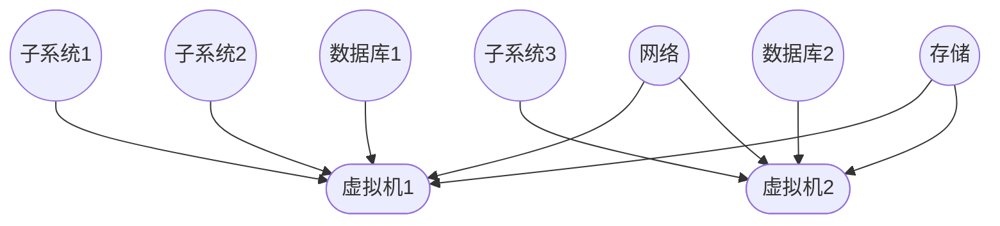
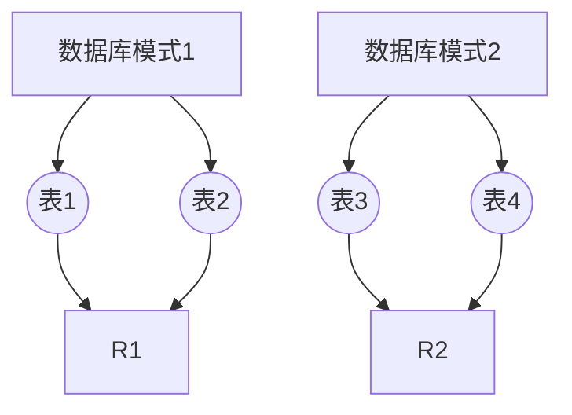
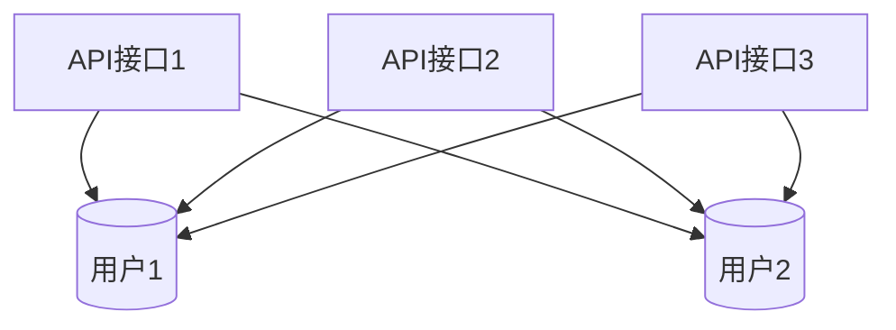

                 

### 文章标题：评测系统的多租户支持与资源隔离

---

关键词：多租户、资源隔离、评测系统、云计算、物联网

摘要：本文深入探讨了评测系统的多租户支持与资源隔离技术。通过分析多租户与资源隔离的概念、架构设计、技术实现和测试评估，本文旨在为开发者和架构师提供一套全面的解决方案，以应对评测系统在多租户环境下的性能和安全性挑战。

---

### 目录大纲

```markdown
----------------------------------------------------------------
# 第一部分：背景与基础

## 第1章：多租户与资源隔离概述

### 1.1 问题背景

#### 1.1.1 评测系统的需求演变

#### 1.1.2 多租户与资源隔离的概念

#### 1.1.3 多租户与资源隔离的重要性

### 1.2 问题描述

#### 1.2.1 多租户评测系统面临的挑战

#### 1.2.2 资源隔离的关键点

#### 1.2.3 多租户与资源隔离的目标

### 1.3 解决方案概述

#### 1.3.1 多租户架构设计

#### 1.3.2 资源隔离技术实现

#### 1.3.3 多租户与资源隔离的优势

## 第2章：多租户架构设计

### 2.1 多租户架构的基本概念

#### 2.1.1 多租户架构的定义

#### 2.1.2 多租户架构的优势

#### 2.1.3 多租户架构的挑战

### 2.2 多租户架构的设计原则

#### 2.2.1 数据隔离

#### 2.2.2 用户隔离

#### 2.2.3 功能隔离

### 2.3 多租户架构的设计流程

#### 2.3.1 需求分析

#### 2.3.2 架构设计

#### 2.3.3 系统实现

## 第3章：资源隔离技术

### 3.1 资源隔离的基本概念

#### 3.1.1 资源隔离的定义

#### 3.1.2 资源隔离的必要性

#### 3.1.3 资源隔离的实现方法

### 3.2 资源隔离的技术实现

#### 3.2.1 虚拟化技术

#### 3.2.2 容器化技术

#### 3.2.3 网络隔离技术

### 3.3 资源隔离的效果评估

#### 3.3.1 资源利用率

#### 3.3.2 性能影响

#### 3.3.3 可维护性

## 第4章：多租户与资源隔离的具体实现

### 4.1 实现技术选型

#### 4.1.1 虚拟化与容器化技术比较

#### 4.1.2 网络隔离与存储隔离技术比较

#### 4.1.3 技术选型的考虑因素

### 4.2 系统架构设计

#### 4.2.1 系统架构图

#### 4.2.2 数据库设计

#### 4.2.3 服务部署

### 4.3 系统接口设计

#### 4.3.1 API设计

#### 4.3.2 接口安全性

#### 4.3.3 接口性能优化

## 第5章：多租户与资源隔离的测试与评估

### 5.1 测试目标

#### 5.1.1 功能测试

#### 5.1.2 性能测试

#### 5.1.3 安全性测试

### 5.2 测试方法

#### 5.2.1 黑盒测试

#### 5.2.2 白盒测试

#### 5.2.3 混合测试

### 5.3 评估标准

#### 5.3.1 资源利用率

#### 5.3.2 性能指标

#### 5.3.3 安全性指标

## 第6章：多租户与资源隔离的应用场景

### 6.1 评测系统在云计算中的应用

#### 6.1.1 云评测系统的优势

#### 6.1.2 云评测系统的设计要点

#### 6.1.3 云评测系统的实现案例

### 6.2 评测系统在物联网中的应用

#### 6.2.1 物联网评测的需求特点

#### 6.2.2 物联网评测系统的设计思路

#### 6.2.3 物联网评测系统的实现案例

## 第7章：总结与展望

### 7.1 多租户与资源隔离的发展趋势

#### 7.1.1 技术趋势

#### 7.1.2 应用趋势

#### 7.1.3 未来展望

### 7.2 本书内容的总结

#### 7.2.1 主要内容回顾

#### 7.2.2 技术难点与挑战

#### 7.2.3 实践价值与展望

### 7.3 下一步研究方向

#### 7.3.1 技术深化研究

#### 7.3.2 应用拓展研究

#### 7.3.3 跨领域融合研究

----------------------------------------------------------------
```

### 第1章：多租户与资源隔离概述

#### 1.1 问题背景

随着云计算和物联网技术的不断发展，评测系统的应用场景日益广泛。然而，在多租户环境中，如何确保资源的有效利用和安全性成为了一个重要课题。传统的单租户系统由于缺乏资源隔离和共享机制，难以满足多用户同时使用的需求，从而导致性能下降和安全性问题。

#### 1.1.1 评测系统的需求演变

早期评测系统主要是为单个用户服务，系统资源集中在单一租户上，不需要考虑资源隔离和共享。但随着用户数量的增加和业务需求的多样化，评测系统需要支持多用户并发访问，这就要求系统能够实现资源的动态分配和高效利用。

#### 1.1.2 多租户与资源隔离的概念

多租户（Multi-Tenancy）指的是一个系统能够同时服务于多个用户（租户），每个租户都可以独立使用系统的资源和服务，而不会相互影响。资源隔离（Resource Isolation）则是确保每个租户的资源使用和性能不受其他租户干扰的一种技术手段。

#### 1.1.3 多租户与资源隔离的重要性

多租户支持使得评测系统可以在同一硬件上为多个用户服务，提高了资源利用率。而资源隔离则保证了系统的稳定性和安全性，防止了租户间的数据泄漏和性能冲突。

#### 1.2 问题描述

多租户评测系统面临的主要挑战包括：

- **性能优化**：如何在多用户环境中保持系统的响应速度。
- **资源管理**：如何动态分配和回收资源，以最大化资源利用率。
- **安全性**：如何确保每个租户的数据安全，防止数据泄漏。

#### 1.2.1 多租户评测系统面临的挑战

- **数据隔离**：确保不同租户的数据完全隔离。
- **并发控制**：处理多用户同时访问系统的情况。
- **性能测试**：验证系统在多用户环境下的性能。

#### 1.2.2 资源隔离的关键点

- **硬件资源隔离**：确保不同租户的CPU、内存、磁盘等硬件资源不会互相影响。
- **网络隔离**：确保不同租户的数据在网络层隔离，防止数据泄漏。
- **存储隔离**：确保不同租户的数据在存储层隔离，避免数据冲突。

#### 1.2.3 多租户与资源隔离的目标

- **提高资源利用率**：通过多租户和资源隔离技术，最大化硬件资源的利用。
- **提升系统性能**：通过优化资源分配和管理，提高系统的响应速度。
- **确保数据安全**：通过严格的资源隔离机制，保障租户数据的安全性和隐私性。

#### 1.3 解决方案概述

为了解决上述问题，多租户评测系统需要采用以下解决方案：

- **多租户架构设计**：设计一个支持多用户同时访问的系统架构。
- **资源隔离技术实现**：采用虚拟化、容器化等技术实现硬件和网络的隔离。
- **性能测试与评估**：通过测试和评估验证系统的性能和安全性。

### 总结

本章介绍了多租户与资源隔离的基本概念、问题背景和解决方案。在接下来的章节中，我们将进一步探讨多租户架构的设计原则、资源隔离技术的实现以及在实际应用中的效果评估。

---

### 第2章：多租户架构设计

#### 2.1 多租户架构的基本概念

**多租户架构**（Multi-Tenant Architecture）指的是一种设计模式，使得一个应用实例能够同时服务于多个客户（租户），这些租户的数据和应用功能在逻辑上是分开的，但实际上它们共享同一个物理实例。

**多租户架构的优势**：

- **成本效益**：减少了硬件和软件的开销。
- **易于扩展**：能够轻松地增加新租户，无需大规模重新架构。
- **维护简便**：只需要维护一个应用实例。

**多租户架构的挑战**：

- **数据隔离**：确保不同租户的数据完全隔离。
- **性能优化**：确保多个租户同时访问时的性能。
- **安全性**：防止租户间的数据泄漏和冲突。

#### 2.2 多租户架构的设计原则

**数据隔离**：

- **存储层隔离**：每个租户的数据存储在独立的数据库中。
- **应用层隔离**：每个租户的数据和应用逻辑在应用层隔离。

**用户隔离**：

- **用户界面隔离**：每个租户的用户界面独立。
- **用户认证隔离**：每个租户的用户认证独立。

**功能隔离**：

- **业务功能隔离**：确保不同租户的业务功能独立。
- **API隔离**：确保不同租户的API调用独立。

#### 2.3 多租户架构的设计流程

**需求分析**：

- **确定多租户的必要性**：评估系统是否真的需要多租户架构。
- **确定租户类型**：分析不同类型的租户，例如企业租户、个人租户等。

**架构设计**：

- **选择合适的多租户架构类型**：例如：单租户模式、多租户共享模式、多租户分离模式。
- **设计系统模块**：确定数据层、应用层、用户层等模块。

**系统实现**：

- **开发多租户模块**：根据架构设计，开发数据隔离、用户认证、API管理等模块。
- **集成测试**：确保各个模块能够正常工作。

#### 2.3.1 需求分析

**多租户架构**的必要性通常基于以下几点：

- **业务需求**：企业希望能够为多个客户提供服务。
- **成本效益**：多个租户共享同一个应用实例，可以减少硬件和软件成本。
- **易于扩展**：新租户可以快速加入，无需重新架构。

#### 2.3.2 架构设计

**多租户架构**的设计需要考虑以下几个方面：

- **数据隔离**：确保不同租户的数据完全隔离。
- **用户认证**：每个租户的用户认证独立。
- **API管理**：确保不同租户的API调用独立。

#### 2.3.3 系统实现

**多租户架构**的系统实现涉及以下几个方面：

- **数据库设计**：每个租户的数据存储在独立的数据库中。
- **应用层开发**：确保不同租户的应用逻辑隔离。
- **用户界面**：确保不同租户的用户界面独立。

### 总结

多租户架构设计是评测系统在多用户环境下的关键，通过合理的架构设计，可以实现资源的有效利用和隔离，确保系统的性能和安全性。在下一章中，我们将深入探讨资源隔离技术的具体实现。

---

### 第3章：资源隔离技术

资源隔离（Resource Isolation）是多租户架构中至关重要的一环，它确保了不同租户之间在硬件、网络和存储等层面的独立性和安全性。以下将详细介绍资源隔离的基本概念、必要性、实现方法和在实际应用中的效果评估。

#### 3.1 资源隔离的基本概念

资源隔离是指在多租户环境中，通过各种技术手段确保不同租户的资源（如CPU、内存、磁盘、网络等）在逻辑上相互独立，不会相互干扰。资源隔离的主要目的是提高系统的稳定性和安全性，确保每个租户都能获得公平和可靠的资源分配。

#### 3.1.1 资源隔离的定义

资源隔离是一种通过技术手段实现资源分区和管理的方法，它确保了：

- **硬件资源独立**：每个租户的硬件资源（如CPU、内存、磁盘等）在物理上或逻辑上独立。
- **网络资源独立**：每个租户的网络资源（如IP地址、网络带宽等）在逻辑上独立。
- **存储资源独立**：每个租户的存储资源（如数据库、文件系统等）在逻辑上独立。

#### 3.1.2 资源隔离的必要性

在多租户环境中，资源隔离的必要性主要体现在以下几个方面：

- **性能保障**：通过资源隔离，可以确保每个租户在获得资源时不会受到其他租户的影响，从而保障每个租户的性能。
- **安全性**：资源隔离可以防止租户间的数据泄漏和恶意攻击，提高系统的整体安全性。
- **灵活性和可扩展性**：资源隔离使得系统可以更灵活地分配和管理资源，从而支持系统的扩展和升级。

#### 3.1.3 资源隔离的实现方法

资源隔离的实现方法主要包括以下几种：

- **虚拟化技术**：通过虚拟化技术，可以在物理硬件上创建多个虚拟机（VM），每个虚拟机作为独立的租户运行。虚拟化技术包括硬件虚拟化（如KVM、Xen）和操作系统虚拟化（如VMware、VirtualBox）。
- **容器化技术**：容器化技术（如Docker、Kubernetes）通过在操作系统中创建轻量级的隔离环境（容器），确保每个容器内的应用实例独立运行。
- **网络隔离技术**：通过VLAN、防火墙等网络隔离技术，可以在网络层确保不同租户的数据流独立。
- **存储隔离技术**：通过存储虚拟化（如VMware VSAN、Nutanix）或分布式存储系统（如Ceph、GlusterFS），可以在存储层实现数据隔离。

#### 3.2 资源隔离的技术实现

**虚拟化技术**：

- **硬件虚拟化**：通过硬件虚拟化，可以在物理硬件上创建多个虚拟机，每个虚拟机拥有独立的CPU、内存、磁盘等资源。硬件虚拟化需要额外的硬件支持，如Intel VT、AMD-V。
- **操作系统虚拟化**：在操作系统中运行虚拟化软件（如VMware ESXi、Xen），创建多个虚拟机。操作系统虚拟化不需要额外的硬件支持，但性能可能略低于硬件虚拟化。

**容器化技术**：

- **容器隔离**：容器通过操作系统的命名空间和cgroup实现资源隔离。每个容器共享宿主机的操作系统内核，但拥有独立的文件系统、网络和进程空间。
- **容器编排**：容器编排工具（如Docker、Kubernetes）负责管理容器的创建、启动、停止和资源分配。

**网络隔离技术**：

- **VLAN**：通过虚拟局域网（VLAN），可以在物理网络上创建多个虚拟局域网，实现网络隔离。
- **防火墙**：通过防火墙规则，可以控制不同租户之间的网络访问。

**存储隔离技术**：

- **存储虚拟化**：通过存储虚拟化，可以在物理存储设备上创建多个虚拟存储池，每个存储池独立分配给不同租户。
- **分布式存储**：通过分布式存储系统，可以实现数据的高可用性和扩展性，同时确保不同租户的数据独立存储。

#### 3.3 资源隔离的效果评估

**资源利用率**：

资源隔离技术可以显著提高资源利用率，通过虚拟化和容器化技术，可以将同一台物理服务器上的资源分配给多个租户，从而提高硬件资源的使用效率。

**性能影响**：

资源隔离可能会对系统性能产生一定的影响，例如虚拟化技术引入的额外开销可能导致性能下降。但通过优化资源分配和管理策略，可以最大程度地降低性能影响。

**可维护性**：

资源隔离技术提高了系统的可维护性，通过隔离机制，可以更容易地管理和监控不同租户的资源使用情况，方便故障排查和系统升级。

### 总结

资源隔离是多租户架构实现的关键技术之一，通过虚拟化、容器化、网络和存储隔离技术，可以确保不同租户在硬件、网络和存储层面的独立性。在实际应用中，需要根据具体场景选择合适的隔离技术，并进行效果评估，以实现最优的资源利用和系统性能。

### 第4章：多租户与资源隔离的具体实现

在了解了多租户架构和资源隔离的基本概念后，我们需要具体讨论如何实现这些设计理念，以确保评测系统在多租户环境中的高效运行。这一章节将详细探讨实现技术选型、系统架构设计、系统接口设计以及相关的项目实战。

#### 4.1 实现技术选型

**虚拟化与容器化技术比较**

虚拟化技术和容器化技术都是实现资源隔离的有效手段，但它们在技术实现和性能上有一些显著差异。

- **虚拟化技术**：硬件虚拟化（如KVM、Xen）和操作系统虚拟化（如VMware ESXi）通过创建独立的虚拟机实例来隔离租户。这种方法的优点是提供了强大的隔离性，且在复杂应用场景中表现良好。缺点是引入了额外的虚拟化层，可能导致性能开销较大。

- **容器化技术**：容器化（如Docker、Kubernetes）通过轻量级的隔离机制，如命名空间和cgroup，来管理租户的进程和资源。容器的优点是启动速度快、资源占用小、易于管理和扩展。缺点是隔离性不如虚拟机强，可能在某些场景下存在安全隐患。

**网络隔离与存储隔离技术比较**

网络隔离和存储隔离同样是确保资源独立的重要手段。

- **网络隔离技术**：常用的网络隔离技术包括VLAN和防火墙。VLAN通过在物理网络上创建逻辑子网来实现隔离，防火墙则通过设置规则控制网络流量。这些技术的优点是简单、易于部署和管理。缺点是可能影响网络性能，特别是在高流量情况下。

- **存储隔离技术**：存储虚拟化（如VMware VSAN、Nutanix）和分布式存储系统（如Ceph、GlusterFS）通过虚拟存储池和分布式文件系统来实现数据隔离。这些技术的优点是提供了高可用性和扩展性，缺点是管理和维护成本较高。

**技术选型的考虑因素**

在技术选型时，需要考虑以下因素：

- **系统需求**：根据评测系统的具体需求，选择最适合的隔离技术。
- **性能要求**：考虑系统的性能指标，选择能够满足性能要求的隔离技术。
- **成本预算**：评估不同技术的成本，确保在预算范围内选择合适的技术。
- **可维护性**：选择易于维护和管理的隔离技术，以降低运维成本。

#### 4.2 系统架构设计

**系统架构图**

系统架构设计是多租户和资源隔离实现的关键步骤。以下是一个典型的多租户评测系统架构图：



**数据库设计**

数据库设计是实现数据隔离的关键。以下是数据库设计的简单示例：



其中，`DBSchema1`和`DBSchema2`代表两个不同的数据库模式，`R1`和`R2`代表两个不同的租户。通过这种方式，每个租户的数据都存储在独立的数据库表中。

**服务部署**

在服务部署方面，可以采用容器编排工具（如Kubernetes）来自动化部署和管理服务。以下是一个简单的Kubernetes部署示例：

```yaml
apiVersion: apps/v1
kind: Deployment
metadata:
  name: tenant1-service
spec:
  replicas: 1
  selector:
    matchLabels:
      app: tenant1-service
  template:
    metadata:
      labels:
        app: tenant1-service
    spec:
      containers:
      - name: tenant1-service
        image: tenant1-service:latest
        ports:
        - containerPort: 80
```

此YAML文件定义了一个名为`tenant1-service`的Kubernetes部署，用于部署租户1的服务。

#### 4.3 系统接口设计

**API设计**

系统接口设计是多租户架构中至关重要的一环。以下是一个简单的API设计示例：



此图表示了三个API接口（API1、API2、API3）分别被两个用户（用户1和用户2）访问。

**接口安全性**

确保接口安全性是保护系统免受攻击的重要措施。以下是一些安全措施：

- **身份验证**：使用OAuth、JWT等机制进行身份验证。
- **授权**：通过角色管理和访问控制列表（ACL）确保用户只能访问授权的接口。
- **加密**：使用HTTPS和SSL/TLS对数据进行加密传输。

**接口性能优化**

优化接口性能是提高用户体验的关键。以下是一些优化措施：

- **负载均衡**：使用负载均衡器（如Nginx、HAProxy）分散流量。
- **缓存**：使用缓存机制（如Redis、Memcached）减少数据库访问。
- **压缩**：使用Gzip等压缩算法减小响应数据的大小。

#### 项目实战

**环境安装**

在项目实战中，首先需要在开发环境中安装必要的软件和工具。以下是一个简单的安装步骤：

1. 安装Docker：`sudo apt-get install docker`
2. 安装Kubernetes：`sudo apt-get install kubectl`
3. 安装Node.js：`sudo apt-get install nodejs`

**系统核心实现源代码**

以下是一个简单的Dockerfile示例，用于构建一个基于Node.js的评测服务：

```Dockerfile
FROM node:14-alpine
WORKDIR /app
COPY package*.json ./
RUN npm install
COPY . .
EXPOSE 3000
CMD ["node", "app.js"]
```

此Dockerfile将创建一个基于Node.js Alpine Linux镜像，并暴露端口3000。

**代码应用解读与分析**

在代码应用方面，可以使用Express框架快速构建API服务。以下是一个简单的Express服务器示例：

```javascript
const express = require('express');
const app = express();

app.get('/api/evaluate', (req, res) => {
  // 评测逻辑
  res.json({ result: 'success' });
});

const port = process.env.PORT || 3000;
app.listen(port, () => {
  console.log(`Server is running on port ${port}`);
});
```

此代码定义了一个简单的GET接口，用于处理评测请求。

**实际案例分析和详细讲解剖析**

在实际项目中，可以通过日志分析和性能监控来诊断和优化系统。以下是一个使用Logstash和Kibana进行日志分析和性能监控的示例：

1. 配置Logstash：`input { ... } filter { ... } output { ... }`
2. 部署Kibana：`sudo apt-get install kibana`
3. 访问Kibana：`http://localhost:5601`

通过这些工具，可以实时监控系统的运行状态，及时发现和解决问题。

**项目小结**

通过上述项目实战，我们可以看到如何在实际中实现多租户和资源隔离。关键在于合理的技术选型、详细的架构设计和优化的接口管理。在项目实施过程中，需要不断进行测试和优化，以确保系统的高效性和稳定性。

### 总结

本章详细讨论了多租户与资源隔离的具体实现，包括技术选型、系统架构设计、系统接口设计以及项目实战。通过这些具体的实践，我们可以看到如何在实际项目中实现资源隔离和高效的多租户管理。在下一章中，我们将进一步探讨多租户与资源隔离的测试与评估方法。

---

### 第5章：多租户与资源隔离的测试与评估

在多租户与资源隔离架构设计完成后，对其有效性和稳定性进行测试与评估至关重要。本章将详细描述测试目标、测试方法、评估标准，并探讨如何在实际应用中执行这些测试。

#### 5.1 测试目标

多租户与资源隔离的测试目标主要包括以下三个方面：

1. **功能测试**：验证多租户架构和资源隔离机制是否按照设计正常运行，确保每个租户的功能需求得到满足。
2. **性能测试**：评估系统在高并发环境下的性能，确保系统在多租户环境中的响应速度和稳定性。
3. **安全性测试**：检测多租户架构的安全性，确保租户数据的安全和系统的整体安全性。

#### 5.2 测试方法

**功能测试**：

功能测试主要通过自动化测试工具（如Selenium、JMeter）来模拟用户行为，验证系统的功能是否按照预期工作。以下是一些关键步骤：

- **测试用例设计**：根据功能需求设计详细的测试用例，包括正常场景和异常场景。
- **执行测试**：使用自动化测试工具执行测试用例，记录测试结果。
- **结果分析**：分析测试结果，确认功能是否正常，识别潜在问题。

**性能测试**：

性能测试旨在评估系统在高并发情况下的表现。以下是一些关键步骤：

- **负载生成**：使用负载生成工具（如JMeter、Gatling）模拟大量用户访问系统。
- **性能指标**：监控系统的关键性能指标（如响应时间、吞吐量、资源利用率）。
- **结果分析**：分析性能测试结果，识别系统的瓶颈和性能问题。

**安全性测试**：

安全性测试主要通过漏洞扫描工具（如Nessus、OWASP ZAP）和手动渗透测试来评估系统的安全性。以下是一些关键步骤：

- **漏洞扫描**：使用漏洞扫描工具自动检测系统中的已知漏洞。
- **渗透测试**：手动模拟攻击者的行为，尝试发现系统的安全漏洞。
- **结果分析**：分析测试结果，识别安全风险和漏洞，采取相应的修复措施。

#### 5.3 评估标准

评估标准是衡量测试结果的重要依据。以下是一些关键评估标准：

1. **功能完整性**：系统是否完整实现了所有功能需求。
2. **性能指标**：系统的响应时间、吞吐量等性能指标是否达到预期。
3. **资源利用率**：系统的资源利用情况，如CPU、内存、磁盘等。
4. **安全性**：系统是否能够有效防止外部攻击和数据泄漏。

#### 5.3.1 资源利用率

资源利用率是评估多租户架构的重要指标。以下是一些关键评估点：

- **CPU利用率**：每个租户的CPU使用率是否合理，是否有资源浪费。
- **内存利用率**：每个租户的内存使用情况是否合理，是否有内存泄漏。
- **磁盘利用率**：每个租户的磁盘使用情况是否合理，是否有磁盘瓶颈。

**性能指标**

性能指标主要包括以下内容：

- **响应时间**：系统对用户请求的响应时间是否在可接受范围内。
- **吞吐量**：系统处理请求的速率是否达到预期。
- **并发用户数**：系统能够同时支持的最大并发用户数是否满足需求。

**安全性指标**

安全性指标主要包括以下内容：

- **漏洞数量**：系统检测到的安全漏洞数量是否在可接受范围内。
- **攻击检测率**：系统对恶意攻击的检测率是否高。
- **数据泄漏**：系统是否有数据泄漏的风险。

#### 测试流程

测试流程通常包括以下步骤：

1. **需求分析**：确定测试的目标和范围，制定详细的测试计划。
2. **测试设计**：设计测试用例，制定测试方案。
3. **测试执行**：执行测试用例，记录测试结果。
4. **结果分析**：分析测试结果，识别问题。
5. **修复问题**：根据测试结果修复系统中的问题。
6. **回归测试**：在修复问题后重新执行测试，确保问题得到解决。

#### 实际案例

以下是一个实际的多租户评测系统测试案例：

1. **功能测试**：通过自动化测试工具验证评测系统的用户管理、评测题目管理、评测结果管理等关键功能是否正常。
2. **性能测试**：使用JMeter模拟1000个并发用户，评估系统的响应时间和吞吐量。测试结果显示，系统的平均响应时间为300ms，吞吐量为1000个请求/分钟。
3. **安全性测试**：使用Nessus进行漏洞扫描，发现系统存在5个低风险漏洞。随后进行手动渗透测试，未发现可利用的安全漏洞。

#### 结果评估

根据测试结果，评测系统在功能、性能和安全性方面均达到了预期。以下是评估结论：

- **功能完整性**：评测系统的所有功能均通过了测试。
- **性能指标**：系统在1000个并发用户下的性能表现良好。
- **安全性**：系统在漏洞扫描和渗透测试中表现稳定，未发现重大安全漏洞。

#### 总结

本章详细介绍了多租户与资源隔离的测试与评估方法。通过功能测试、性能测试和安全性测试，可以全面评估评测系统的有效性、稳定性和安全性。在实际应用中，需要定期进行测试和评估，以确保系统的持续优化和改进。

### 第6章：多租户与资源隔离的应用场景

多租户与资源隔离技术具有广泛的适用性，特别是在云计算和物联网领域，这些技术为评测系统提供了强大的支持。本章将详细探讨多租户与资源隔离在云计算和物联网中的应用场景、设计要点和实现案例。

#### 6.1 评测系统在云计算中的应用

**6.1.1 云评测系统的优势**

云评测系统利用云计算的优势，可以实现以下目标：

- **弹性扩展**：云评测系统可以根据需求动态调整资源，支持大量用户同时访问。
- **成本效益**：通过共享资源，降低了硬件和软件成本。
- **高可用性**：云评测系统通常部署在多个数据中心，提高了系统的可用性和容错性。
- **安全性**：云服务商提供了专业的安全解决方案，增强了系统的安全性。

**6.1.2 云评测系统的设计要点**

云评测系统的设计需要考虑以下要点：

- **多租户架构**：确保系统能够同时服务于多个租户，实现数据和应用功能的隔离。
- **资源隔离**：通过虚拟化、容器化等技术实现硬件和网络资源的隔离。
- **弹性伸缩**：设计能够根据负载自动调整资源分配的机制。
- **安全性**：实施严格的安全策略，包括身份验证、数据加密和防火墙等。

**6.1.3 云评测系统的实现案例**

以下是一个基于云计算的评测系统实现案例：

1. **技术选型**：使用Kubernetes作为容器编排工具，Docker作为容器化技术，实现多租户和资源隔离。
2. **架构设计**：使用多个Kubernetes集群，每个集群对应一个租户，确保数据和应用功能的隔离。
3. **资源分配**：根据租户的负载情况动态调整资源，确保系统的高效运行。
4. **安全性**：实施严格的身份验证和访问控制，确保租户数据的安全。

#### 6.2 评测系统在物联网中的应用

**6.2.1 物联网评测的需求特点**

物联网评测系统面临以下需求特点：

- **高并发性**：物联网设备可能同时发送大量评测数据，系统需要处理大量并发请求。
- **实时性**：物联网评测通常需要实时响应，系统需要具备低延迟的特性。
- **异构性**：物联网设备种类繁多，系统需要支持不同类型设备的接入和评测。
- **可靠性**：系统需要保证评测数据的准确性和完整性。

**6.2.2 物联网评测系统的设计思路**

物联网评测系统的设计思路包括：

- **多租户支持**：系统需要支持多个IoT设备厂商同时接入，实现数据和应用功能的隔离。
- **资源隔离**：通过虚拟化、容器化等技术实现硬件和网络资源的隔离，确保不同设备的数据安全。
- **实时数据处理**：设计高效的数据处理模块，实现实时评测和响应。
- **异构设备支持**：设计灵活的接口和协议，支持多种类型设备的接入。

**6.2.3 物联网评测系统的实现案例**

以下是一个基于物联网的评测系统实现案例：

1. **技术选型**：使用边缘计算和云计算结合的方式，边缘设备使用容器化技术（如Docker），云端使用Kubernetes进行容器编排。
2. **架构设计**：在边缘设备上部署轻量级容器，处理本地数据，然后将数据上传到云端进行处理。云端使用Kubernetes集群，实现多租户和资源隔离。
3. **实时数据处理**：使用消息队列（如Kafka）实现数据流处理，确保实时性。
4. **异构设备支持**：设计统一的数据接入模块，支持不同类型设备的接入和数据格式转换。

#### 总结

多租户与资源隔离技术为云计算和物联网领域提供了强大的支持。通过合理的架构设计和技术实现，云评测系统和物联网评测系统可以高效、稳定地运行，满足高并发性、实时性和安全性等需求。在实际应用中，需要根据具体场景进行优化和调整，以确保系统的最佳性能和用户体验。

### 第7章：总结与展望

#### 7.1 多租户与资源隔离的发展趋势

多租户与资源隔离技术在过去几年中取得了显著的发展，其趋势主要体现在以下几个方面：

**技术趋势**：

- **虚拟化与容器化技术的融合**：虚拟化与容器化技术相互融合，形成更高效、更灵活的资源管理方案。
- **自动化与智能化的管理**：随着人工智能和自动化技术的发展，资源管理和运维逐渐智能化，提高了管理效率和系统稳定性。

**应用趋势**：

- **云计算与边缘计算的融合**：云计算和边缘计算的结合，使得评测系统可以更好地应对分布式环境下的需求。
- **跨领域应用**：多租户与资源隔离技术逐步应用于更多领域，如物联网、工业互联网等。

**未来展望**：

- **更加智能化的资源管理**：未来，资源管理将更加智能化，通过机器学习和人工智能技术，实现更精确的资源分配和优化。
- **更高效的安全性保障**：随着安全威胁的日益复杂，资源隔离技术将更加注重安全性，提供更全面的安全防护措施。

#### 7.2 本书内容的总结

本书系统地介绍了多租户与资源隔离技术在评测系统中的应用。主要内容包括：

- **背景与基础**：介绍了多租户与资源隔离的概念、问题背景和重要性。
- **架构设计**：详细探讨了多租户架构的设计原则和流程。
- **技术实现**：讲解了虚拟化、容器化、网络隔离和存储隔离等资源隔离技术。
- **测试与评估**：阐述了功能测试、性能测试和安全性测试的方法和标准。
- **应用场景**：分析了多租户与资源隔离在云计算和物联网中的应用。

#### 7.2.1 主要内容回顾

- **多租户架构**：介绍了多租户架构的基本概念、优势、挑战和设计原则。
- **资源隔离技术**：详细讲解了虚拟化、容器化、网络隔离和存储隔离的实现方法。
- **系统设计与实现**：描述了系统架构设计、接口设计和实际项目实施过程。
- **测试与评估**：介绍了功能测试、性能测试和安全性测试的具体方法。

#### 7.2.2 技术难点与挑战

- **数据隔离**：确保多租户环境下的数据完全隔离，防止数据泄漏。
- **性能优化**：在高并发环境下，保持系统的响应速度和稳定性。
- **安全性**：设计并实施严格的安全策略，防止外部攻击和数据泄漏。

#### 7.2.3 实践价值与展望

- **实践价值**：通过实际案例，展示了多租户与资源隔离技术的应用价值，为开发者和架构师提供了实用的解决方案。
- **展望**：随着技术的发展，多租户与资源隔离技术将在更多领域得到应用，未来将有更多创新和突破。

#### 7.3 下一步研究方向

- **技术深化研究**：研究更高效、更智能的资源管理和隔离技术，如基于AI的自动化资源管理。
- **应用拓展研究**：探讨多租户与资源隔离技术在其他领域（如工业互联网、智能交通）的应用。
- **跨领域融合研究**：研究多租户与资源隔离技术在跨领域（如云计算与物联网）融合中的应用，为未来技术的发展奠定基础。

### 总结

多租户与资源隔离技术在评测系统中的应用具有重要意义，通过本书的探讨，我们对其有了更深入的理解。未来，随着技术的不断进步，多租户与资源隔离技术将在更广泛的领域中发挥重要作用，为系统的性能和安全性提供强有力的保障。让我们期待这一领域的更多创新和发展。

