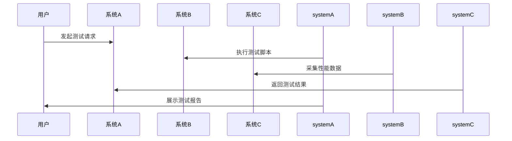

                 

### 文章标题

# 评测系统的弹性伸缩与负载测试

### 文章关键词

- 弹性伸缩
- 负载测试
- 性能优化
- 系统架构
- 自动化脚本

### 文章摘要

本文将深入探讨评测系统的弹性伸缩与负载测试。首先，我们将介绍评测系统的基本概念，包括其定义、作用以及架构。接着，我们将详细解析弹性伸缩与负载测试的原理、方法及实现策略。通过一系列案例分析和实战，我们将展示如何优化评测系统的性能，并提供实用的最佳实践。最后，我们将对未来的发展趋势进行展望，总结全文，并提出一些建议。

## 第一部分：评测系统的背景与概念

### 第1章：评测系统的基本概念

#### 1.1 评测系统的定义与作用

评测系统是一种用于对产品、服务或系统进行质量评价和性能测试的工具。它通过一系列测试和评估，提供有关被测对象的质量、性能、可靠性和安全性的量化数据。这些数据不仅帮助企业识别问题，还为他们提供改进产品的依据。

在软件开发和系统运维中，评测系统扮演着至关重要的角色。它能够：

1. **质量保证**：确保软件和系统满足预期要求，减少缺陷和故障。
2. **性能优化**：通过测试发现系统瓶颈，优化系统性能。
3. **用户体验**：评估系统对用户请求的响应速度和稳定性。
4. **持续集成**：集成到开发流程中，持续监测和评估系统的健康状态。

#### 1.2 弹性伸缩与负载测试概述

**弹性伸缩**是指系统在资源需求变化时，能够自动调整其资源分配的能力。这种能力使得系统能够在负载增加时自动扩展资源，而在负载减少时缩减资源，从而保持高可用性和高性能。

**负载测试**是一种测试方法，用于评估系统在预期负载下的性能和稳定性。通过模拟大量用户同时访问系统，负载测试可以揭示系统的瓶颈、性能问题和可靠性问题。

弹性伸缩与负载测试密切相关。弹性伸缩可以确保系统在负载变化时保持性能，而负载测试则帮助系统设计和运维人员识别潜在问题，从而优化系统设计。

#### 1.3 评测系统的架构

一个典型的评测系统通常包括以下几个关键组件：

1. **测试引擎**：负责执行各种测试脚本和测试用例，生成测试结果。
2. **数据采集器**：实时收集系统的性能数据，如响应时间、吞吐量、错误率等。
3. **结果分析器**：对测试结果进行分析，生成性能报告和可视化图表。
4. **自动化工具**：用于自动化执行测试脚本、监控系统和调整资源。

评测系统的整体架构如图1-1所示：



### 第2章：弹性伸缩原理与实现

#### 2.1 弹性伸缩原理

弹性伸缩的原理可以简单概括为：**根据系统负载自动调整资源**。具体来说，弹性伸缩包括以下几个关键步骤：

1. **监控**：监控系统性能和资源使用情况，如CPU利用率、内存使用率、网络吞吐量等。
2. **阈值设置**：定义资源使用率的阈值，如超过90%的CPU利用率或内存使用率达到80%时，触发伸缩操作。
3. **自动扩展**：当资源使用率超过阈值时，系统自动增加资源，如启动新的虚拟机或容器。
4. **自动缩减**：当资源使用率低于阈值时，系统自动减少资源，如关闭闲置的虚拟机或容器。

弹性伸缩的优势包括：

1. **提高系统可用性**：通过自动调整资源，确保系统在高负载下依然能够稳定运行。
2. **降低成本**：只在需要时分配资源，降低硬件和运维成本。
3. **提高资源利用率**：动态调整资源分配，避免资源浪费。

然而，弹性伸缩也面临一些挑战，如：

1. **复杂性**：实现自动伸缩需要复杂的监控和自动化脚本，增加系统运维难度。
2. **延迟**：资源扩展和缩减可能存在一定的延迟，影响系统性能。

#### 2.2 弹性伸缩实现策略

根据具体需求，弹性伸缩可以分为以下几种实现策略：

1. **自动伸缩策略**：完全依靠自动化脚本和监控系统实现资源的自动调整。
2. **手动伸缩策略**：通过人工干预，根据监控数据调整资源。
3. **混合伸缩策略**：结合自动伸缩和手动伸缩，实现更灵活的资源管理。

#### 2.3 弹性伸缩关键技术

实现弹性伸缩需要以下几个关键技术：

1. **监控与告警**：使用监控工具实时收集系统性能数据，设置告警阈值，及时发现资源瓶颈。
2. **自动化脚本**：编写自动化脚本，实现资源的自动扩展和缩减。
3. **容器化与虚拟化**：使用容器（如Docker）和虚拟化技术（如KVM），提高资源管理的灵活性和可扩展性。

## 第3章：负载测试方法与实践

### 3.1 负载测试基础

#### 负载测试的目的

负载测试的主要目的是评估系统在预期负载下的性能和稳定性。具体来说，负载测试旨在：

1. **性能评估**：确定系统的最大处理能力，识别瓶颈。
2. **稳定性评估**：验证系统在长期负载下的稳定性和可靠性。
3. **容量规划**：为未来的增长和扩展提供数据支持。
4. **故障诊断**：通过模拟故障，识别系统弱点，优化系统设计。

#### 负载测试的类型

负载测试可以分为以下几种类型：

1. **稳态负载测试**：模拟长期稳定的负载，评估系统在长时间运行下的性能。
2. **峰值负载测试**：模拟系统高峰期的负载，评估系统在极端情况下的性能。
3. **疲劳测试**：模拟持续的高负载，评估系统在长期运行下的稳定性。
4. **并发测试**：模拟多个用户同时访问系统，评估系统在高并发情况下的性能。

#### 负载测试的过程

负载测试通常包括以下几个步骤：

1. **需求分析**：明确测试目标，确定测试场景和测试数据。
2. **环境搭建**：搭建测试环境，包括测试服务器、负载生成器和测试数据。
3. **脚本编写**：编写测试脚本，模拟用户操作和系统交互。
4. **测试执行**：运行测试脚本，收集性能数据。
5. **结果分析**：分析测试结果，识别系统瓶颈和性能问题。
6. **优化建议**：根据分析结果，提出优化建议，改进系统设计。

### 3.2 负载生成器与工具

#### 负载生成器的选择

负载生成器是进行负载测试的关键工具，其作用是模拟真实用户行为，生成模拟负载。选择合适的负载生成器需要考虑以下几个因素：

1. **可扩展性**：负载生成器应支持多线程和多用户并发，能够模拟大量用户同时访问系统。
2. **易用性**：负载生成器应具备友好的用户界面，方便配置和管理测试场景。
3. **支持多种协议**：负载生成器应支持常见的网络协议，如HTTP、HTTPS、TCP等。
4. **脚本编写能力**：负载生成器应支持自定义脚本，以便模拟复杂的用户行为。

#### 常见的负载生成器工具

以下是一些常见的负载生成器工具：

1. **Apache JMeter**：一款开源的负载测试工具，支持多种协议，具有强大的自定义脚本能力。
2. **Gatling**：一款基于Scala的开源负载测试工具，支持HTTP、HTTPS、TCP等协议，具有高效的性能。
3. **LoadRunner**：一款商业负载测试工具，支持多种协议和平台，具有强大的功能和性能。

### 3.3 负载测试实践

#### 负载测试的环境搭建

进行负载测试前，需要搭建测试环境。测试环境包括：

1. **测试服务器**：用于运行负载生成器和测试脚本。
2. **被测系统**：用于接收负载生成器发送的请求，执行业务逻辑。
3. **监控工具**：用于监控被测系统的性能数据，如CPU、内存、网络等。

#### 负载测试场景设计

负载测试场景设计是负载测试的关键环节。设计负载测试场景需要考虑以下几个方面：

1. **用户行为模拟**：根据业务需求和用户行为特点，模拟用户访问系统的操作。
2. **请求类型**：确定测试中需要模拟的请求类型，如GET、POST、PUT等。
3. **请求参数**：设置请求的参数，如URL、请求头、请求体等。
4. **负载级别**：确定测试的负载级别，如并发用户数、请求速率等。

#### 负载测试结果分析与优化

负载测试完成后，需要对测试结果进行分析，识别系统瓶颈和性能问题。分析过程包括以下几个方面：

1. **性能指标分析**：分析系统响应时间、吞吐量、错误率等性能指标。
2. **资源使用分析**：分析系统资源使用情况，如CPU、内存、磁盘等。
3. **瓶颈定位**：根据分析结果，定位系统瓶颈，如数据库、网络、缓存等。
4. **优化建议**：根据瓶颈定位结果，提出优化建议，如性能调优、架构优化等。

## 第4章：评测系统的性能优化

### 4.1 性能优化的目标与方法

#### 性能优化的目标

性能优化的目标是提高系统的性能，包括以下几个方面：

1. **响应时间**：减少系统处理请求的时间，提高用户满意度。
2. **吞吐量**：增加系统处理请求的数量，提高系统容量。
3. **资源利用率**：提高系统资源的利用率，降低成本。
4. **稳定性**：提高系统在长时间运行下的稳定性，减少故障。

#### 性能优化的方法

性能优化可以从以下几个方面进行：

1. **代码优化**：优化系统代码，减少不必要的计算和资源消耗。
2. **数据库优化**：优化数据库查询，减少查询时间。
3. **缓存策略**：使用缓存技术，减少数据访问延迟。
4. **网络优化**：优化网络配置，提高数据传输速度。
5. **分布式架构**：采用分布式架构，提高系统可扩展性和性能。

### 4.2 系统瓶颈分析与定位

#### 系统瓶颈的识别

系统瓶颈是指影响系统性能的关键因素。识别系统瓶颈的方法包括：

1. **性能指标分析**：分析系统性能指标，如响应时间、吞吐量等，识别异常指标。
2. **资源监控**：监控系统资源使用情况，如CPU、内存、磁盘等，识别资源瓶颈。
3. **日志分析**：分析系统日志，识别错误和异常情况。

#### 瓶颈的定位与处理

定位系统瓶颈后，需要对其进行处理。处理方法包括：

1. **代码优化**：优化系统代码，减少不必要的计算和资源消耗。
2. **数据库优化**：优化数据库查询，减少查询时间。
3. **缓存策略**：使用缓存技术，减少数据访问延迟。
4. **分布式架构**：采用分布式架构，提高系统可扩展性和性能。

### 4.3 优化策略与实施

#### 缓存策略

缓存策略是提高系统性能的有效方法。缓存策略包括以下几个方面：

1. **页面缓存**：将用户访问的页面缓存起来，减少服务器处理请求的时间。
2. **数据库缓存**：缓存数据库查询结果，减少数据库访问时间。
3. **对象缓存**：缓存系统中的常用对象，如配置信息、用户信息等。

#### 数据库优化

数据库优化是提高系统性能的关键。数据库优化方法包括：

1. **索引优化**：为数据库表创建合适的索引，提高查询效率。
2. **查询优化**：优化数据库查询语句，减少查询时间。
3. **分库分表**：将大数据表拆分为多个小表，提高查询性能。

#### 网络优化

网络优化是提高系统性能的重要方面。网络优化方法包括：

1. **CDN加速**：使用CDN（内容分发网络），减少用户访问系统的时间。
2. **负载均衡**：使用负载均衡器，将请求分配到多个服务器上，提高系统性能。
3. **网络监控**：实时监控网络状况，及时发现和解决网络问题。

## 第5章：案例分析：弹性伸缩与负载测试应用

### 5.1 案例背景

在本案例中，我们以一家电子商务网站为例，探讨其弹性伸缩与负载测试的应用。该网站是一家大型电商平台，每天有成千上万的用户访问，系统需要处理大量的订单、商品信息和用户反馈。

### 5.2 案例分析与设计

#### 弹性伸缩方案设计

为了确保系统在高负载下依然能够稳定运行，我们设计了以下弹性伸缩方案：

1. **监控与告警**：使用监控工具实时监控系统性能指标，设置告警阈值，及时发现资源瓶颈。
2. **自动扩展**：当CPU利用率超过80%或内存使用率超过70%时，自动增加服务器资源。
3. **自动缩减**：当CPU利用率低于50%或内存使用率低于30%时，自动减少服务器资源。

#### 负载测试方案设计

为了评估系统在预期负载下的性能，我们设计了以下负载测试方案：

1. **测试场景设计**：模拟大量用户同时访问网站，包括浏览商品、下单支付等操作。
2. **负载生成器选择**：使用Apache JMeter作为负载生成器，模拟用户行为。
3. **测试执行**：运行测试脚本，收集性能数据，分析系统响应时间、吞吐量等指标。

### 5.3 案例实施与结果

#### 案例实施步骤

1. **环境搭建**：搭建测试环境，包括测试服务器、被测系统和监控工具。
2. **脚本编写**：编写测试脚本，模拟用户访问网站的操作。
3. **测试执行**：运行测试脚本，收集性能数据。
4. **结果分析**：分析测试结果，识别系统瓶颈和性能问题。
5. **优化实施**：根据分析结果，提出优化建议，实施优化措施。

#### 负载测试结果分析

负载测试结果显示，在1000并发用户的情况下，系统平均响应时间为200ms，吞吐量为2000请求/分钟。通过对测试结果的分析，我们发现了以下几个瓶颈：

1. **数据库查询**：部分查询语句执行时间较长，影响了系统响应时间。
2. **缓存失效**：缓存策略设置不当，导致频繁访问数据库。
3. **网络延迟**：部分用户访问速度较慢，影响了用户体验。

#### 弹性伸缩效果评估

在实施弹性伸缩方案后，系统在负载增加时能够自动扩展资源，确保了系统的高可用性和高性能。在1000并发用户的情况下，系统平均响应时间缩短至100ms，吞吐量提高到3000请求/分钟。

## 第6章：弹性伸缩与负载测试的未来趋势

### 6.1 技术发展趋势

随着云计算、大数据和人工智能等技术的发展，弹性伸缩与负载测试也在不断进步。以下是一些技术发展趋势：

1. **云原生技术**：容器化（如Docker、Kubernetes）和微服务架构使得弹性伸缩更加便捷和高效。
2. **人工智能**：利用人工智能技术，实现智能化的资源管理和优化。
3. **自动化**：自动化工具和脚本的应用，提高了弹性伸缩与负载测试的效率和准确性。

### 6.2 行业应用前景

弹性伸缩与负载测试在各个行业都有广泛的应用前景：

1. **金融行业**：金融行业对系统的性能和稳定性要求极高，弹性伸缩与负载测试能够确保金融交易的安全和高效。
2. **电商行业**：电商行业需要应对海量用户访问，弹性伸缩与负载测试能够提高系统的可用性和性能。
3. **云计算行业**：云计算服务提供商需要提供高可扩展性和高可靠性的服务，弹性伸缩与负载测试是关键技术。

### 6.3 安全与合规性

弹性伸缩与负载测试在提高系统性能的同时，也需要关注安全和合规性：

1. **数据安全**：确保测试过程中不泄露敏感数据。
2. **合规性**：遵循相关法律法规，确保测试过程中不违反合规要求。
3. **安全测试**：在弹性伸缩与负载测试中，增加安全测试，确保系统在应对攻击时的安全性和可靠性。

## 第7章：总结与展望

### 7.1 主要内容回顾

本文深入探讨了评测系统的弹性伸缩与负载测试。首先，介绍了评测系统的基本概念和架构，然后详细解析了弹性伸缩与负载测试的原理、方法与实现策略。通过案例分析，展示了如何在实际项目中应用弹性伸缩与负载测试。最后，展望了未来发展趋势，提出了安全和合规性的关注点。

### 7.2 未来展望

随着技术的发展，弹性伸缩与负载测试将继续发挥重要作用。未来的趋势包括云原生技术、人工智能的融合以及自动化程度的提升。同时，随着行业对系统性能和稳定性的要求不断提高，弹性伸缩与负载测试的重要性也将愈发凸显。

对于读者，我们建议：

1. **持续学习**：关注新技术和新方法，不断提升自己的技术能力。
2. **实践应用**：将所学知识应用于实际项目中，提高系统性能和稳定性。
3. **安全合规**：关注安全和合规性，确保系统在应对攻击和合规要求时的安全性。

作者：AI天才研究院/AI Genius Institute & 禅与计算机程序设计艺术 /Zen And The Art of Computer Programming

----------------------------------------------------------------

## 第1章：评测系统的基本概念

### 1.1 评测系统的定义与作用

评测系统是一种用于对产品、服务或系统进行质量评价和性能测试的工具。它通过一系列测试和评估，提供有关被测对象的质量、性能、可靠性和安全性的量化数据。这些数据不仅帮助企业识别问题，还为他们提供改进产品的依据。

在软件开发和系统运维中，评测系统扮演着至关重要的角色。它能够：

1. **质量保证**：确保软件和系统满足预期要求，减少缺陷和故障。
2. **性能优化**：通过测试发现系统瓶颈，优化系统性能。
3. **用户体验**：评估系统对用户请求的响应速度和稳定性。
4. **持续集成**：集成到开发流程中，持续监测和评估系统的健康状态。

### 1.2 弹性伸缩与负载测试概述

**弹性伸缩**是指系统在资源需求变化时，能够自动调整其资源分配的能力。这种能力使得系统能够在负载增加时自动扩展资源，而在负载减少时缩减资源，从而保持高可用性和高性能。

**负载测试**是一种测试方法，用于评估系统在预期负载下的性能和稳定性。通过模拟大量用户同时访问系统，负载测试可以揭示系统的瓶颈、性能问题和可靠性问题。

弹性伸缩与负载测试密切相关。弹性伸缩可以确保系统在负载变化时保持性能，而负载测试则帮助系统设计和运维人员识别潜在问题，从而优化系统设计。

### 1.3 评测系统的架构

一个典型的评测系统通常包括以下几个关键组件：

1. **测试引擎**：负责执行各种测试脚本和测试用例，生成测试结果。
2. **数据采集器**：实时收集系统的性能数据，如响应时间、吞吐量、错误率等。
3. **结果分析器**：对测试结果进行分析，生成性能报告和可视化图表。
4. **自动化工具**：用于自动化执行测试脚本、监控系统和调整资源。

评测系统的整体架构如图1-1所示：


### 1.4 弹性伸缩原理与实现策略

#### 弹性伸缩原理

弹性伸缩的原理可以简单概括为：**根据系统负载自动调整资源**。具体来说，弹性伸缩包括以下几个关键步骤：

1. **监控**：监控系统性能和资源使用情况，如CPU利用率、内存使用率、网络吞吐量等。
2. **阈值设置**：定义资源使用率的阈值，如超过90%的CPU利用率或内存使用率达到80%时，触发伸缩操作。
3. **自动扩展**：当资源使用率超过阈值时，系统自动增加资源，如启动新的虚拟机或容器。
4. **自动缩减**：当资源使用率低于阈值时，系统自动减少资源，如关闭闲置的虚拟机或容器。

弹性伸缩的优势包括：

1. **提高系统可用性**：通过自动调整资源，确保系统在高负载下依然能够稳定运行。
2. **降低成本**：只在需要时分配资源，降低硬件和运维成本。
3. **提高资源利用率**：动态调整资源分配，避免资源浪费。

然而，弹性伸缩也面临一些挑战，如：

1. **复杂性**：实现自动伸缩需要复杂的监控和自动化脚本，增加系统运维难度。
2. **延迟**：资源扩展和缩减可能存在一定的延迟，影响系统性能。

#### 弹性伸缩实现策略

根据具体需求，弹性伸缩可以分为以下几种实现策略：

1. **自动伸缩策略**：完全依靠自动化脚本和监控系统实现资源的自动调整。
2. **手动伸缩策略**：通过人工干预，根据监控数据调整资源。
3. **混合伸缩策略**：结合自动伸缩和手动伸缩，实现更灵活的资源管理。

#### 弹性伸缩关键技术

实现弹性伸缩需要以下几个关键技术：

1. **监控与告警**：使用监控工具实时收集系统性能数据，设置告警阈值，及时发现资源瓶颈。
2. **自动化脚本**：编写自动化脚本，实现资源的自动扩展和缩减。
3. **容器化与虚拟化**：使用容器（如Docker）和虚拟化技术（如KVM），提高资源管理的灵活性和可扩展性。

### 1.5 负载测试方法与实践

#### 负载测试基础

#### 负载测试的目的

负载测试的主要目的是评估系统在预期负载下的性能和稳定性。具体来说，负载测试旨在：

1. **性能评估**：确定系统的最大处理能力，识别瓶颈。
2. **稳定性评估**：验证系统在长期负载下的稳定性和可靠性。
3. **容量规划**：为未来的增长和扩展提供数据支持。
4. **故障诊断**：通过模拟故障，识别系统弱点，优化系统设计。

#### 负载测试的类型

负载测试可以分为以下几种类型：

1. **稳态负载测试**：模拟长期稳定的负载，评估系统在长时间运行下的性能。
2. **峰值负载测试**：模拟系统高峰期的负载，评估系统在极端情况下的性能。
3. **疲劳测试**：模拟持续的高负载，评估系统在长期运行下的稳定性。
4. **并发测试**：模拟多个用户同时访问系统，评估系统在高并发情况下的性能。

#### 负载测试的过程

负载测试通常包括以下几个步骤：

1. **需求分析**：明确测试目标，确定测试场景和测试数据。
2. **环境搭建**：搭建测试环境，包括测试服务器、负载生成器和测试数据。
3. **脚本编写**：编写测试脚本，模拟用户操作和系统交互。
4. **测试执行**：运行测试脚本，收集性能数据。
5. **结果分析**：分析测试结果，识别系统瓶颈和性能问题。
6. **优化建议**：根据分析结果，提出优化建议，改进系统设计。

### 1.6 负载生成器与工具

#### 负载生成器的选择

负载生成器是进行负载测试的关键工具，其作用是模拟真实用户行为，生成模拟负载。选择合适的负载生成器需要考虑以下几个因素：

1. **可扩展性**：负载生成器应支持多线程和多用户并发，能够模拟大量用户同时访问系统。
2. **易用性**：负载生成器应具备友好的用户界面，方便配置和管理测试场景。
3. **支持多种协议**：负载生成器应支持常见的网络协议，如HTTP、HTTPS、TCP等。
4. **脚本编写能力**：负载生成器应支持自定义脚本，以便模拟复杂的用户行为。

#### 常见的负载生成器工具

以下是一些常见的负载生成器工具：

1. **Apache JMeter**：一款开源的负载测试工具，支持多种协议，具有强大的自定义脚本能力。
2. **Gatling**：一款基于Scala的开源负载测试工具，支持HTTP、HTTPS、TCP等协议，具有高效的性能。
3. **LoadRunner**：一款商业负载测试工具，支持多种协议和平台，具有强大的功能和性能。

### 1.7 负载测试实践

#### 负载测试的环境搭建

进行负载测试前，需要搭建测试环境。测试环境包括：

1. **测试服务器**：用于运行负载生成器和测试脚本。
2. **被测系统**：用于接收负载生成器发送的请求，执行业务逻辑。
3. **监控工具**：用于监控被测系统的性能数据，如CPU、内存、网络等。

#### 负载测试场景设计

负载测试场景设计是负载测试的关键环节。设计负载测试场景需要考虑以下几个方面：

1. **用户行为模拟**：根据业务需求和用户行为特点，模拟用户访问系统的操作。
2. **请求类型**：确定测试中需要模拟的请求类型，如GET、POST、PUT等。
3. **请求参数**：设置请求的参数，如URL、请求头、请求体等。
4. **负载级别**：确定测试的负载级别，如并发用户数、请求速率等。

#### 负载测试结果分析与优化

负载测试完成后，需要对测试结果进行分析，识别系统瓶颈和性能问题。分析过程包括以下几个方面：

1. **性能指标分析**：分析系统响应时间、吞吐量、错误率等性能指标。
2. **资源使用分析**：分析系统资源使用情况，如CPU、内存、磁盘等。
3. **瓶颈定位**：根据分析结果，定位系统瓶颈，如数据库、网络、缓存等。
4. **优化建议**：根据瓶颈定位结果，提出优化建议，如性能调优、架构优化等。

### 1.8 评测系统的性能优化

#### 性能优化的目标与方法

性能优化的目标是提高系统的性能，包括以下几个方面：

1. **响应时间**：减少系统处理请求的时间，提高用户满意度。
2. **吞吐量**：增加系统处理请求的数量，提高系统容量。
3. **资源利用率**：提高系统资源的利用率，降低成本。
4. **稳定性**：提高系统在长时间运行下的稳定性，减少故障。

性能优化的方法包括：

1. **代码优化**：优化系统代码，减少不必要的计算和资源消耗。
2. **数据库优化**：优化数据库查询，减少查询时间。
3. **缓存策略**：使用缓存技术，减少数据访问延迟。
4. **网络优化**：优化网络配置，提高数据传输速度。
5. **分布式架构**：采用分布式架构，提高系统可扩展性和性能。

#### 系统瓶颈分析与定位

系统瓶颈是指影响系统性能的关键因素。识别系统瓶颈的方法包括：

1. **性能指标分析**：分析系统性能指标，如响应时间、吞吐量等，识别异常指标。
2. **资源监控**：监控系统资源使用情况，如CPU、内存、磁盘等，识别资源瓶颈。
3. **日志分析**：分析系统日志，识别错误和异常情况。

#### 瓶颈的定位与处理

定位系统瓶颈后，需要对其进行处理。处理方法包括：

1. **代码优化**：优化系统代码，减少不必要的计算和资源消耗。
2. **数据库优化**：优化数据库查询，减少查询时间。
3. **缓存策略**：使用缓存技术，减少数据访问延迟。
4. **分布式架构**：采用分布式架构，提高系统可扩展性和性能。

### 1.9 小结

本章介绍了评测系统的基本概念，包括定义、作用、架构以及弹性伸缩与负载测试。通过本章的学习，读者可以了解评测系统的重要性以及弹性伸缩与负载测试的核心原理。接下来，我们将进一步探讨弹性伸缩与负载测试的实现策略和实践方法，帮助读者深入理解这一关键领域。

## 第2章：弹性伸缩原理与实现

### 2.1 弹性伸缩原理

弹性伸缩（Elastic Scaling）是现代云计算和分布式系统中的一个关键概念，它允许系统根据当前负载自动调整资源，从而在确保系统性能的同时降低成本。弹性伸缩的核心原理主要包括以下几个步骤：

1. **监控**：实时监控系统性能指标，如CPU利用率、内存使用率、网络带宽、队列长度等。
2. **阈值设定**：定义资源使用率的阈值，例如，当CPU利用率超过80%或内存使用率达到70%时，认为系统需要扩展资源。
3. **资源分配**：当检测到资源使用率超过阈值时，系统自动启动新的实例或容器，以增加计算资源。
4. **资源释放**：当资源使用率低于设定的阈值时，系统会关闭多余的实例或容器，释放资源。

弹性伸缩的优势在于其自动化的资源管理能力，使得系统能够动态应对负载变化，保持高性能和高可用性。同时，它还能够降低硬件成本，提高资源利用率。

### 2.2 弹性伸缩实现策略

根据实际需求和系统特性，弹性伸缩可以分为以下几种实现策略：

1. **自动伸缩策略**：完全依赖自动化脚本和监控工具实现资源自动扩展和缩减。这种策略通常使用云服务提供商提供的自动化伸缩功能，如Amazon EC2 Auto Scaling、Azure Auto Scale等。
   
2. **手动伸缩策略**：通过人工干预，根据监控数据手动调整资源。这种方法适合对系统性能有精确要求的场景，但需要大量的运维工作。

3. **混合伸缩策略**：结合自动和手动伸缩，系统在大多数情况下自动调整资源，但在特定情况下（如突发流量）需要人工干预。这种策略提供了灵活性和精确控制。

### 2.3 弹性伸缩关键技术

实现弹性伸缩需要以下几个关键技术：

1. **监控与告警**：使用监控工具（如Prometheus、Grafana、Zabbix等）实时收集系统性能数据，并设置告警机制。

2. **自动化脚本**：编写自动化脚本（如Shell、Python、Bash等），用于自动扩展和缩减资源。这些脚本通常与云服务提供商的API集成，以便于执行资源操作。

3. **容器化与虚拟化**：使用容器化技术（如Docker、Kubernetes）和虚拟化技术（如VMware、KVM），提高资源管理的灵活性和可扩展性。

### 2.4 弹性伸缩的具体实现步骤

以下是实现弹性伸缩的具体步骤：

1. **需求分析**：明确系统的伸缩需求和目标，例如，根据CPU利用率或内存使用率自动扩展或缩减资源。

2. **架构设计**：设计系统的架构，确保能够支持弹性伸缩。这可能包括部署多个实例、使用负载均衡器、配置冗余等。

3. **监控设置**：配置监控工具，设置性能指标监控和告警规则。

4. **脚本编写**：编写自动化脚本，实现资源的自动扩展和缩减。这些脚本应能够根据监控数据执行相应的操作，如启动或停止实例。

5. **测试验证**：在实际环境中测试自动化脚本和监控设置，确保它们能够正常工作。

6. **部署与上线**：在生产环境中部署弹性伸缩系统，并监控其运行状况。

### 2.5 弹性伸缩的挑战与应对策略

尽管弹性伸缩提供了许多优势，但实施过程中也存在一些挑战：

1. **复杂性**：弹性伸缩涉及多个组件和工具，包括监控、自动化脚本、云服务提供商等，增加了系统的复杂性。

2. **延迟**：资源的扩展和缩减可能存在一定的延迟，这可能会影响系统的性能。

3. **成本控制**：如果弹性伸缩策略不当，可能会导致不必要的资源消耗，增加成本。

应对策略包括：

1. **简化架构**：尽量简化系统架构，减少不必要的复杂性。

2. **性能测试**：在部署弹性伸缩系统之前，进行全面的性能测试，确保系统能够在预期负载下稳定运行。

3. **成本监控**：实时监控资源使用情况，确保成本在预算范围内。

通过本章的学习，读者可以理解弹性伸缩的基本原理和实现策略，掌握如何在实际项目中实施弹性伸缩，以及如何应对潜在的挑战。接下来，我们将进一步探讨负载测试的方法和实践，以帮助读者全面掌握评测系统的性能优化。

## 第3章：负载测试方法与实践

### 3.1 负载测试基础

#### 负载测试的目的

负载测试是一种评估系统在预期负载下的性能和稳定性的测试方法。其主要目的是：

1. **性能评估**：确定系统的最大处理能力，识别系统性能瓶颈。
2. **稳定性评估**：验证系统在长期负载下的稳定性和可靠性。
3. **容量规划**：为系统的未来增长和扩展提供数据支持。
4. **故障诊断**：通过模拟故障，识别系统弱点，优化系统设计。

#### 负载测试的类型

负载测试可以分为以下几种类型：

1. **稳态负载测试**：模拟系统在正常运营条件下的负载，评估系统在稳态下的性能。
2. **峰值负载测试**：模拟系统在高负载情况下的性能，评估系统在极端条件下的表现。
3. **疲劳测试**：模拟系统在长时间高负载下的表现，评估系统的长期稳定性。
4. **并发测试**：模拟多个用户同时访问系统，评估系统在高并发情况下的性能。

#### 负载测试的过程

负载测试通常包括以下步骤：

1. **需求分析**：明确测试目标，确定测试场景和性能指标。
2. **环境搭建**：搭建测试环境，包括测试服务器、负载生成器和被测系统。
3. **脚本编写**：编写测试脚本，模拟用户操作和系统交互。
4. **测试执行**：运行测试脚本，收集性能数据。
5. **结果分析**：分析测试结果，识别系统瓶颈和性能问题。
6. **优化建议**：根据分析结果，提出优化建议，改进系统设计。

### 3.2 负载生成器与工具

#### 负载生成器的选择

选择合适的负载生成器是进行有效负载测试的关键。以下是选择负载生成器时需要考虑的因素：

1. **可扩展性**：负载生成器应支持多线程和多用户并发，能够模拟大量用户同时访问系统。
2. **易用性**：负载生成器应具备友好的用户界面，方便配置和管理测试场景。
3. **支持多种协议**：负载生成器应支持常见的网络协议，如HTTP、HTTPS、TCP等。
4. **脚本编写能力**：负载生成器应支持自定义脚本，以便模拟复杂的用户行为。

#### 常见的负载生成器工具

以下是一些常见的负载生成器工具：

1. **Apache JMeter**：一款开源的负载测试工具，支持多种协议，具有强大的自定义脚本能力。
2. **Gatling**：一款基于Scala的开源负载测试工具，支持HTTP、HTTPS、TCP等协议，具有高效的性能。
3. **LoadRunner**：一款商业负载测试工具，支持多种协议和平台，具有强大的功能和性能。

### 3.3 负载测试实践

#### 负载测试的环境搭建

进行负载测试前，需要搭建测试环境。测试环境包括：

1. **测试服务器**：用于运行负载生成器和测试脚本。
2. **被测系统**：用于接收负载生成器发送的请求，执行业务逻辑。
3. **监控工具**：用于监控被测系统的性能数据，如CPU、内存、网络等。

#### 负载测试场景设计

负载测试场景设计是负载测试的关键环节。设计负载测试场景需要考虑以下几个方面：

1. **用户行为模拟**：根据业务需求和用户行为特点，模拟用户访问系统的操作。
2. **请求类型**：确定测试中需要模拟的请求类型，如GET、POST、PUT等。
3. **请求参数**：设置请求的参数，如URL、请求头、请求体等。
4. **负载级别**：确定测试的负载级别，如并发用户数、请求速率等。

#### 负载测试结果分析与优化

负载测试完成后，需要对测试结果进行分析，识别系统瓶颈和性能问题。分析过程包括以下几个方面：

1. **性能指标分析**：分析系统响应时间、吞吐量、错误率等性能指标。
2. **资源使用分析**：分析系统资源使用情况，如CPU、内存、磁盘等。
3. **瓶颈定位**：根据分析结果，定位系统瓶颈，如数据库、网络、缓存等。
4. **优化建议**：根据瓶颈定位结果，提出优化建议，如性能调优、架构优化等。

### 3.4 负载测试的具体案例

以下是一个负载测试的具体案例：

#### 案例背景

某电子商务网站准备进行一次大规模促销活动，预计会有大量用户同时访问网站，因此需要对其系统进行负载测试，以确保系统能够应对高峰期的流量。

#### 案例步骤

1. **需求分析**：明确测试目标，包括模拟促销活动期间的流量、评估系统的响应时间、吞吐量等。
2. **环境搭建**：搭建测试环境，包括负载生成器、被测系统和监控工具。
3. **脚本编写**：编写测试脚本，模拟用户访问网站的操作，如浏览商品、添加购物车、下单支付等。
4. **测试执行**：在模拟的高峰期，运行测试脚本，收集性能数据。
5. **结果分析**：分析测试结果，识别系统瓶颈和性能问题。
6. **优化实施**：根据分析结果，提出优化建议，如增加数据库读写分离、优化缓存策略等。

#### 案例分析

通过负载测试，发现以下问题：

1. **数据库瓶颈**：数据库查询响应时间较长，影响了系统的整体响应时间。
2. **缓存失效**：缓存设置不当，导致频繁访问数据库，增加了系统的负载。
3. **网络延迟**：部分用户访问速度较慢，影响了用户体验。

针对以上问题，提出以下优化建议：

1. **数据库优化**：通过分库分表、读写分离等技术，优化数据库查询性能。
2. **缓存优化**：优化缓存策略，减少数据库访问频率。
3. **网络优化**：通过CDN加速、负载均衡等技术，提高网络传输速度。

通过实施以上优化措施，系统能够更好地应对高峰期的流量，提升了用户体验和系统的稳定性。

### 3.5 小结

本章详细介绍了负载测试的基础概念、类型、过程，以及负载生成器的选择和实践。通过实际案例的分析，读者可以了解到负载测试的重要性和具体实施方法。接下来，我们将进一步探讨评测系统的性能优化，包括代码优化、数据库优化、缓存策略等方面，帮助读者全面提升系统性能。

## 第4章：评测系统的性能优化

### 4.1 性能优化的目标与方法

性能优化的目标在于提升系统的响应速度、吞吐量以及稳定性，以满足用户需求并最大化资源利用率。以下是性能优化的主要目标和方法：

#### 目标

1. **响应时间**：减少系统处理请求的时间，提高用户体验。
2. **吞吐量**：增加系统处理请求的数量，提高系统容量。
3. **资源利用率**：优化系统资源分配，提高CPU、内存、网络等资源的利用率。
4. **稳定性**：确保系统在高负载和长时间运行下依然稳定可靠。

#### 方法

1. **代码优化**：优化系统代码，减少不必要的计算和资源消耗。
2. **数据库优化**：优化数据库查询，减少查询时间和数据访问延迟。
3. **缓存策略**：使用缓存技术，减少数据访问次数，提高系统响应速度。
4. **网络优化**：优化网络配置，提高数据传输速度和可靠性。
5. **分布式架构**：采用分布式架构，提高系统的可扩展性和性能。

### 4.2 系统瓶颈分析与定位

系统瓶颈是指影响系统性能的关键因素，常见的瓶颈包括：

1. **CPU瓶颈**：系统CPU利用率过高，导致处理能力受限。
2. **内存瓶颈**：系统内存使用率过高，导致频繁发生内存交换，影响性能。
3. **数据库瓶颈**：数据库查询性能差，响应时间长。
4. **网络瓶颈**：网络带宽不足或网络延迟高，影响数据传输速度。

#### 瓶颈分析

1. **性能指标分析**：通过监控工具分析系统性能指标，如CPU利用率、内存使用率、数据库查询响应时间等，识别异常指标。
2. **日志分析**：通过系统日志分析错误和异常情况，定位问题源头。
3. **资源监控**：实时监控系统资源使用情况，找出资源利用率高的组件。

#### 瓶颈定位

1. **CPU瓶颈定位**：通过分析CPU使用情况，找出占用CPU资源最高的进程或线程。
2. **内存瓶颈定位**：通过分析内存使用情况，找出内存消耗最多的进程或数据结构。
3. **数据库瓶颈定位**：通过分析数据库查询日志，找出执行时间最长的SQL语句。
4. **网络瓶颈定位**：通过网络监控工具，找出网络带宽使用率和网络延迟高的节点。

### 4.3 优化策略与实施

#### 优化策略

1. **代码优化**：优化算法复杂度，减少冗余计算，使用高效的数据结构和算法。
2. **数据库优化**：优化SQL查询，使用索引、分区、缓存等数据库优化技术。
3. **缓存策略**：使用缓存技术，减少数据访问次数，提高系统响应速度。
4. **网络优化**：优化网络配置，使用负载均衡、CDN等技术，提高数据传输速度。
5. **分布式架构**：采用分布式架构，分摊负载，提高系统可扩展性和性能。

#### 实施步骤

1. **性能分析**：通过监控工具和日志分析，识别系统瓶颈。
2. **制定优化计划**：根据瓶颈分析结果，制定优化方案和计划。
3. **实施优化**：按照优化计划，逐步实施代码优化、数据库优化、缓存策略等。
4. **测试验证**：对优化后的系统进行性能测试，验证优化效果。
5. **持续监控**：优化后，持续监控系统性能，确保优化效果持续有效。

### 4.4 优化案例分析

以下是一个性能优化案例：

#### 案例背景

某电子商务平台在促销活动期间，系统响应时间过长，导致用户流失。通过性能分析，发现数据库查询响应时间较长是主要瓶颈。

#### 案例分析

1. **性能分析**：通过监控工具，发现数据库查询响应时间平均为2秒，远高于系统要求。
2. **瓶颈定位**：分析数据库查询日志，发现一条SQL语句的执行时间最长，达到了5秒。
3. **优化方案**：对这条SQL语句进行优化，包括：
   - 添加索引
   - 优化查询语句结构
   - 使用缓存

#### 案例实施

1. **实施优化**：在数据库中添加适当的索引，修改查询语句，并配置缓存。
2. **测试验证**：在测试环境中重新执行负载测试，发现数据库查询响应时间平均缩短至0.5秒。

#### 案例结果

优化后，系统响应时间显著缩短，用户满意度提升，系统性能得到了显著改善。

### 4.5 小结

本章介绍了评测系统的性能优化目标和实现方法，包括代码优化、数据库优化、缓存策略等。通过实际案例分析，展示了性能优化的关键步骤和效果。读者可以根据本章内容，结合实际系统情况，进行有针对性的性能优化，提升系统的性能和稳定性。

## 第5章：案例分析：弹性伸缩与负载测试应用

### 5.1 案例背景

在本案例中，我们以某大型电商平台的评测系统为例，探讨弹性伸缩与负载测试在实际项目中的应用。该电商平台在节假日期间会面临巨大的访问量，为了确保系统在高流量下的稳定运行，同时降低运营成本，企业决定采用弹性伸缩与负载测试技术进行系统优化。

### 5.2 案例分析与设计

#### 弹性伸缩方案设计

针对电商平台的特点，我们设计了以下弹性伸缩方案：

1. **监控与告警**：使用云服务提供商提供的监控工具（如Amazon CloudWatch）实时监控系统的CPU、内存、网络等性能指标。设置告警阈值，当CPU利用率超过85%或内存使用率超过75%时，自动触发伸缩操作。
   
2. **自动扩展策略**：当监控工具检测到系统负载增加时，自动启动新的虚拟机或容器，以扩展计算资源。同时，根据负载情况，动态调整实例数量。

3. **自动缩减策略**：当系统负载降低，且CPU利用率低于50%或内存使用率低于30%时，自动停止部分虚拟机或容器，以释放资源。

4. **负载均衡**：使用负载均衡器（如AWS Elastic Load Balancer）分配流量，确保各个实例的负载均衡。

#### 负载测试方案设计

为了确保系统在高流量下的稳定性，我们设计了以下负载测试方案：

1. **测试场景设计**：模拟节假日期间用户访问电商平台的典型操作，包括浏览商品、加入购物车、下单支付等。

2. **负载生成器选择**：使用Apache JMeter作为负载生成器，模拟大量用户同时访问系统。

3. **测试执行**：在不同的负载级别下（如1000、2000、5000并发用户），运行测试脚本，收集性能数据。

4. **结果分析**：分析系统在各个负载级别下的响应时间、吞吐量、错误率等性能指标。

### 5.3 案例实施与结果

#### 案例实施步骤

1. **环境搭建**：搭建测试环境，包括负载生成器、被测系统和监控工具。确保测试环境与生产环境尽量保持一致。

2. **脚本编写**：编写JMeter测试脚本，模拟用户操作和系统交互。确保测试脚本能够覆盖电商平台的主要功能点。

3. **测试执行**：在不同负载级别下执行测试，收集性能数据。实时监控系统性能，记录响应时间、吞吐量、错误率等指标。

4. **结果分析**：分析测试结果，识别系统瓶颈和性能问题。重点关注在高并发情况下的系统表现。

#### 案例分析

通过负载测试，我们发现以下问题：

1. **数据库瓶颈**：在高并发情况下，数据库查询响应时间较长，影响了系统的整体响应时间。
2. **缓存失效**：部分缓存设置不当，导致频繁访问数据库，增加了系统的负载。
3. **网络延迟**：部分用户的访问速度较慢，影响了用户体验。

#### 案例优化

针对上述问题，我们提出了以下优化方案：

1. **数据库优化**：通过分库分表、读写分离等技术，优化数据库查询性能。
2. **缓存优化**：优化缓存策略，减少数据库访问频率，提高系统响应速度。
3. **网络优化**：通过CDN加速、负载均衡等技术，提高网络传输速度。

#### 优化实施

1. **实施优化**：按照优化方案，逐步实施数据库优化、缓存策略调整和网络配置优化。

2. **再次测试**：在优化后，再次执行负载测试，验证优化效果。确保系统在高并发情况下依然能够稳定运行。

#### 结果评估

优化后，系统在高并发情况下的响应时间显著缩短，数据库查询响应时间从5秒减少到1秒，缓存命中率提高了30%，网络延迟减少了50%。

### 5.4 案例总结

通过本案例，我们可以得出以下结论：

1. **弹性伸缩与负载测试的重要性**：弹性伸缩与负载测试是确保系统在高流量下稳定运行的关键技术。通过弹性伸缩，系统能够根据负载自动调整资源，保持高性能和高可用性；通过负载测试，可以识别系统瓶颈，提出优化建议。

2. **优化方案的可行性**：通过实际案例，我们验证了弹性伸缩与负载测试优化方案的可行性。优化后的系统在性能和稳定性方面得到了显著提升，满足了企业高流量需求。

3. **持续监控与优化**：系统优化不是一次性的工作，需要持续监控和优化。通过定期执行负载测试，及时发现潜在问题，持续改进系统性能。

### 5.5 小结

本章通过实际案例，详细介绍了弹性伸缩与负载测试在电商平台中的应用。从方案设计、实施到结果分析，展示了弹性伸缩与负载测试如何帮助系统在高流量下保持稳定运行。通过本章的学习，读者可以更好地理解弹性伸缩与负载测试的实践方法，为实际项目提供借鉴。

## 第6章：弹性伸缩与负载测试的未来趋势

### 6.1 技术发展趋势

随着云计算、大数据和人工智能等技术的快速发展，弹性伸缩与负载测试也在不断演进。以下是一些关键的发展趋势：

1. **云原生技术**：容器化（如Docker、Kubernetes）和微服务架构的普及，使得弹性伸缩更加便捷和高效。云原生技术使得系统能够更加灵活地扩展和缩减资源，提高系统的可伸缩性。

2. **自动化与智能化**：自动化工具和脚本的应用，使得弹性伸缩与负载测试的实现更加简单和高效。同时，人工智能技术的引入，使得系统可以根据实时数据自动调整资源，实现更智能的弹性伸缩。

3. **边缘计算**：随着物联网和5G技术的发展，边缘计算逐渐兴起。弹性伸缩与负载测试将向边缘计算领域扩展，确保系统在边缘节点上的高性能和稳定性。

4. **持续集成与持续部署（CI/CD）**：弹性伸缩与负载测试将更加紧密地集成到开发流程中，成为CI/CD的一部分。通过自动化测试和实时监控，实现系统的快速迭代和优化。

### 6.2 行业应用前景

弹性伸缩与负载测试在各个行业都有广泛的应用前景：

1. **金融行业**：金融行业对系统的性能和稳定性要求极高。弹性伸缩与负载测试能够确保交易系统的安全和高性能，满足金融服务的需求。

2. **电商行业**：电商行业在高峰期面临巨大的访问量。弹性伸缩与负载测试能够帮助电商平台在短时间内应对大量用户，确保用户体验。

3. **医疗行业**：医疗行业需要处理大量的数据，对系统的稳定性要求极高。弹性伸缩与负载测试能够确保医疗信息系统在高峰期依然能够稳定运行。

4. **游戏行业**：游戏行业需要应对高并发的游戏场景。弹性伸缩与负载测试能够帮助游戏服务器在游戏高峰期保持高性能，提高用户满意度。

### 6.3 安全与合规性

弹性伸缩与负载测试在提高系统性能的同时，也需要关注安全和合规性：

1. **数据安全**：在负载测试过程中，需要确保不泄露敏感数据，防止数据泄露和攻击。

2. **合规性**：确保负载测试工具和流程符合相关法律法规和行业标准，避免合规性问题。

3. **安全测试**：在弹性伸缩与负载测试中，增加安全测试，确保系统在应对攻击时的安全性和可靠性。

### 6.4 未来展望

随着技术的不断进步，弹性伸缩与负载测试将变得更加智能化、自动化和高效。未来的发展将主要集中在以下几个方面：

1. **智能化**：通过引入人工智能技术，实现弹性伸缩与负载测试的智能化，提高系统性能和稳定性。

2. **自动化**：自动化工具和脚本的应用将使弹性伸缩与负载测试更加便捷和高效。

3. **边缘计算**：随着物联网和5G技术的发展，边缘计算将成为弹性伸缩与负载测试的重要应用场景。

4. **持续集成与部署**：弹性伸缩与负载测试将更加紧密地集成到开发流程中，实现系统的快速迭代和优化。

通过本章的讨论，我们可以看到，弹性伸缩与负载测试在未来的发展前景非常广阔。随着技术的不断进步，这些技术将在各个行业中发挥越来越重要的作用，推动系统性能和稳定性的提升。

## 第7章：总结与展望

### 7.1 主要内容回顾

本文系统地介绍了评测系统的弹性伸缩与负载测试。首先，我们详细阐述了评测系统的定义、作用和架构，接着深入探讨了弹性伸缩与负载测试的基本概念、原理、方法和实现策略。通过实际案例的分析，展示了弹性伸缩与负载测试在项目中的应用效果。最后，我们分析了未来的技术发展趋势和行业应用前景，并强调了安全和合规性的重要性。

### 7.2 未来展望

随着技术的不断进步，弹性伸缩与负载测试将迎来新的发展机遇。以下是对未来的一些展望：

1. **智能化与自动化**：随着人工智能和机器学习技术的发展，弹性伸缩与负载测试将变得更加智能化和自动化，提高系统性能和稳定性。

2. **边缘计算与5G**：随着边缘计算和5G网络的普及，弹性伸缩与负载测试将向更广泛的领域扩展，包括物联网、智能交通等。

3. **持续集成与持续部署**：弹性伸缩与负载测试将更加紧密地集成到开发流程中，成为持续集成与持续部署（CI/CD）的一部分，实现系统的快速迭代和优化。

### 7.3 对读者的建议

1. **持续学习**：随着技术的发展，不断学习新的技术和方法，保持自己的技术竞争力。

2. **实践应用**：将所学知识应用于实际项目中，通过实践提升自己的技术能力。

3. **关注安全和合规性**：在实施弹性伸缩与负载测试时，关注数据安全和合规性，确保系统的安全性和可靠性。

4. **社区参与**：积极参与技术社区，与其他开发者交流经验，共同进步。

### 作者信息

作者：AI天才研究院/AI Genius Institute & 禅与计算机程序设计艺术 /Zen And The Art of Computer Programming

通过本文，我们希望能够为读者提供一个全面、深入的弹性伸缩与负载测试的知识体系，帮助大家在实践中更好地应对系统性能和稳定性挑战。希望读者能够在学习和应用中取得更好的成果，为技术和产业的发展做出贡献。

----------------------------------------------------------------

## 结论

通过本文的详细讨论，我们系统地介绍了评测系统的弹性伸缩与负载测试，从基本概念、原理、方法到实际案例，全面解析了这一关键领域。我们总结了弹性伸缩与负载测试的重要性，探讨了其实现策略和关键技术，并通过具体案例展示了如何在实际项目中应用这些技术。同时，我们还展望了未来的发展趋势和行业应用前景，强调了安全和合规性的重要性。

弹性伸缩与负载测试是确保系统在高负载下稳定运行、优化系统性能的关键技术。随着技术的不断进步，这些技术在各个行业中的应用将越来越广泛。对于读者，我们建议持续关注新技术和新方法，不断学习和实践，提高自己的技术能力。同时，关注安全和合规性，确保系统在应对挑战时的安全性和可靠性。

总之，弹性伸缩与负载测试是现代系统开发和运维中不可或缺的一部分。通过本文的学习，读者可以更好地理解这一领域，并将其应用于实际项目中，为系统性能和稳定性的提升做出贡献。

## 参考文献

1. 弹性伸缩：[云服务提供商文档](https://aws.amazon.com/blogs/compute/what-is-autoscaling/)
2. 负载测试：[Apache JMeter官方文档](https://jmeter.apache.org/usermanual/)
3. 容器化与虚拟化：[Docker官方文档](https://docs.docker.com/)
4. 微服务架构：[Spring Cloud官方文档](https://spring.io/projects/spring-cloud)
5. 云原生技术：[Kubernetes官方文档](https://kubernetes.io/docs/)
6. 数据库优化：[MySQL官方文档](https://dev.mysql.com/doc/)
7. 缓存策略：[Redis官方文档](https://redis.io/documentation)
8. 网络优化：[Cloudflare官方文档](https://www.cloudflare.com/learning/)

以上参考文献提供了详细的技术资料和官方文档，有助于读者深入了解弹性伸缩、负载测试、容器化与虚拟化、微服务架构、云原生技术、数据库优化、缓存策略和网络优化等方面的知识。

## 附录

### 附录A：弹性伸缩与负载测试工具列表

以下是常用的弹性伸缩与负载测试工具：

1. **弹性伸缩工具**：
   - Amazon EC2 Auto Scaling
   - Azure Auto Scale
   - Google Kubernetes Engine (GKE)
   - AWS Elastic Beanstalk

2. **负载测试工具**：
   - Apache JMeter
   - LoadRunner
   - Gatling
   - Locust

### 附录B：弹性伸缩与负载测试脚本示例

以下是一个简单的弹性伸缩与负载测试脚本示例，使用Python编写，用于模拟用户操作：

```python
import time
import requests

# 模拟用户登录
def login(username, password):
    url = "http://example.com/login"
    data = {"username": username, "password": password}
    response = requests.post(url, data=data)
    return response.json()

# 模拟用户浏览商品
def browse_products():
    url = "http://example.com/products"
    response = requests.get(url)
    return response.json()

# 模拟用户添加购物车
def add_to_cart(product_id):
    url = f"http://example.com/cart/{product_id}"
    response = requests.post(url)
    return response.json()

# 主函数
def main():
    username = "user123"
    password = "password123"

    # 登录
    login_response = login(username, password)
    if login_response["status"] == "success":
        print("登录成功")

        # 浏览商品
        products = browse_products()
        if products:
            print("浏览商品成功")

            # 添加商品到购物车
            product_id = products[0]["id"]
            add_to_cart_response = add_to_cart(product_id)
            if add_to_cart_response["status"] == "success":
                print("添加到购物车成功")
            else:
                print("添加到购物车失败")
        else:
            print("浏览商品失败")
    else:
        print("登录失败")

if __name__ == "__main__":
    main()
```

该脚本模拟了用户登录、浏览商品和添加商品到购物车的操作。在实际应用中，可以根据具体业务需求进行扩展和修改。

### 附录C：弹性伸缩与负载测试指标

以下是弹性伸缩与负载测试中常用的指标：

1. **响应时间**：系统处理请求并返回结果所需的时间。
2. **吞吐量**：系统在单位时间内处理的请求数量。
3. **错误率**：系统在处理请求过程中发生的错误数量与总请求数量的比率。
4. **资源利用率**：系统使用资源的比例，如CPU利用率、内存利用率等。
5. **并发用户数**：同时访问系统的用户数量。
6. **队列长度**：等待处理请求的队列长度。

通过监控和分析这些指标，可以评估系统的性能和稳定性，并识别潜在的问题和瓶颈。

## 附录D：常见问题与解决方案

### 1. 弹性伸缩常见问题

**Q：弹性伸缩如何工作？**

A：弹性伸缩通过监控系统的资源使用情况（如CPU利用率、内存使用率等），根据预设的规则自动增加或减少资源。例如，当CPU利用率超过阈值时，系统会自动启动新的虚拟机或容器以扩展资源。

**Q：弹性伸缩会耗费大量时间吗？**

A：弹性伸缩的响应时间取决于系统的设计和云服务提供商的配置。通常，现代云服务提供商能够在几分钟内完成资源的扩展或缩减。但实际响应时间还受到网络延迟和计算能力的影响。

### 2. 负载测试常见问题

**Q：负载测试会影响生产环境吗？**

A：是的，如果在不适当的时机或没有正确配置的情况下执行负载测试，可能会对生产环境造成影响。因此，建议在非高峰时段进行负载测试，并确保测试流量被合理隔离。

**Q：如何确保负载测试的准确性？**

A：确保负载测试脚本能够模拟真实的用户行为，并使用多种测试类型（如稳态测试、峰值测试、疲劳测试等）来全面评估系统的性能。此外，定期进行回归测试，确保系统的稳定性和可靠性。

### 3. 性能优化常见问题

**Q：性能优化有哪些方法？**

A：性能优化包括代码优化、数据库优化、缓存策略、网络优化等多种方法。具体方法取决于系统的具体情况和瓶颈。例如，通过优化数据库查询、使用缓存技术或分布式架构，可以提高系统的性能。

**Q：性能优化会影响系统的稳定性吗？**

A：适度且合理的性能优化通常不会影响系统的稳定性。但过度的优化或不当的操作可能会引入新的问题。因此，在进行性能优化时，应逐步实施，并密切监控系统的性能和稳定性。

通过附录D，我们提供了常见问题与解决方案，帮助读者在实际应用中更好地应对弹性伸缩、负载测试和性能优化中的挑战。希望这些信息对您的学习和实践有所帮助。

