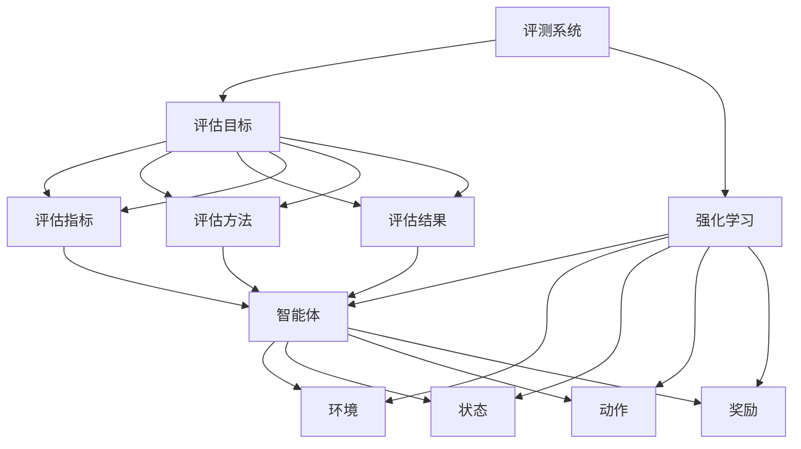
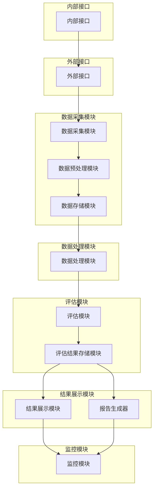

                 


### 引言

在当今快速发展的信息技术时代，人工智能（AI）技术以其卓越的能力和广泛的应用场景，成为推动各行各业变革的关键力量。其中，强化学习（Reinforcement Learning，RL）作为人工智能的一个重要分支，因其在复杂环境下的自主学习和决策能力而备受关注。强化学习在自动驾驶、智能机器人、游戏AI等领域取得了显著成果，但其应用范围远不止于此。评测系统的强化学习环境设计，作为一种新兴的研究领域，正逐渐成为学术界和工业界关注的焦点。

本文旨在深入探讨评测系统的强化学习环境设计，通过逻辑清晰、结构紧凑、简单易懂的论述方式，帮助读者全面理解这一复杂且具有挑战性的问题。文章将分为以下几个部分：

1. **背景介绍与核心概念**：介绍评测系统和强化学习的基本概念，以及两者之间的联系。
2. **强化学习基础**：阐述强化学习的基本原理、算法类型及其适用场景。
3. **评测系统的构建**：分析评测系统的需求、架构和设计原则。
4. **强化学习环境设计**：详细描述强化学习环境的设计原则、构建方法和关键要素。
5. **评估与优化**：探讨评测系统的评估方法和强化学习的优化策略。
6. **案例分析**：通过具体案例展示强化学习环境在评测系统中的应用。
7. **总结与展望**：总结文章的主要贡献，并提出未来研究方向。

### 关键词

- 评测系统
- 强化学习
- 环境设计
- 自主学习
- 算法优化
- 智能决策
- 自动驾驶
- 智能机器人

### 摘要

本文围绕评测系统的强化学习环境设计展开讨论，首先介绍了评测系统和强化学习的基本概念，随后深入探讨了强化学习的基础理论及其在评测系统中的应用。接着，文章分析了评测系统的构建过程，包括需求分析、架构设计和关键原则。随后，详细描述了强化学习环境的设计方法和关键要素，如环境模拟器、奖励函数和状态动作空间。此外，文章还探讨了评测系统的评估方法和强化学习的优化策略。最后，通过两个具体案例展示了强化学习环境在评测系统中的应用，并对未来研究方向进行了展望。本文旨在为相关领域的研究者和实践者提供有价值的参考和指导。

### 目录

----------------------------------------------------------------

# 《评测系统的强化学习环境设计》

> 关键词：评测系统、强化学习、环境设计、自主学习、算法优化

> 摘要：本文围绕评测系统的强化学习环境设计展开深入讨论，介绍了评测系统和强化学习的基本概念，探讨了强化学习在评测系统中的应用，分析了评测系统的构建过程和强化学习环境的设计方法，并探讨了评测系统的评估方法和优化策略。通过具体案例展示了强化学习环境在评测系统中的应用，对未来研究方向进行了展望。

----------------------------------------------------------------

## 第1章 背景介绍与核心概念

### 1.1 问题背景

评测系统在众多领域中发挥着重要作用，如软件测试、性能评估、安全审计等。传统评测系统往往依赖于人工经验和规则，存在评估效率低、结果不准确等问题。随着人工智能技术的发展，尤其是强化学习的应用，为评测系统带来了一种新的解决方案。强化学习通过在复杂环境中进行自主学习和决策，能够提高评测系统的智能化程度和评估准确性。

### 1.2 核心概念

#### 1.2.1 评测系统

评测系统是一种用于评估目标对象（如软件、系统、产品等）性能、质量、安全等的工具或平台。其主要功能是提供客观、准确的评估结果，帮助决策者进行优化和改进。评测系统通常包括数据采集、处理和分析等功能模块。

#### 1.2.2 强化学习

强化学习是一种基于奖励反馈进行决策和学习的机器学习范式。在强化学习中，智能体通过不断尝试不同的动作，并根据环境反馈的奖励信号调整策略，以实现长期目标最大化。强化学习在解决复杂、动态环境中的决策问题方面具有显著优势。

### 1.3 核心概念与联系

强化学习与评测系统之间存在密切的联系。评测系统可以看作是一种特殊的环境，而强化学习算法则可以用于评估和优化评测系统。通过强化学习，评测系统可以自适应地调整评估策略，以提高评估准确性和效率。

### 1.4 概念结构与核心要素组成

评测系统的核心概念结构包括以下几个要素：

1. **评估目标**：确定评估的具体目标和指标，如性能、质量、安全性等。
2. **评估指标**：用于衡量评估目标的具体指标，如响应时间、错误率、覆盖率等。
3. **评估方法**：选择合适的评估方法和工具，如自动化测试、统计分析等。
4. **评估结果**：根据评估方法和指标，生成评估报告和可视化结果。

强化学习的核心概念结构包括以下几个要素：

1. **智能体**：执行动作并接收环境反馈的主体。
2. **环境**：智能体进行决策和交互的动态系统。
3. **动作**：智能体可执行的操作。
4. **状态**：智能体在环境中的当前状态。
5. **奖励**：环境对智能体动作的反馈信号。

### 1.5 边界与外延

评测系统的强化学习环境设计不仅关注评估准确性和效率，还需考虑以下几个边界条件：

1. **评估场景**：针对特定场景设计的评测系统，如软件性能评估、网络安全评估等。
2. **评估范围**：评测系统的适用范围，如特定产品、系统或领域。
3. **评估周期**：评测系统的执行频率和周期，如实时评估、定期评估等。
4. **评估精度**：评估结果的精度和可靠性要求。

强化学习在评测系统中的应用范围包括：

1. **自适应评估**：根据评估过程中的反馈信号，动态调整评估策略和方法。
2. **自动化测试**：利用强化学习算法自动生成测试用例，提高测试效率和质量。
3. **风险评估**：基于强化学习模型，对系统风险进行预测和评估。
4. **智能优化**：利用强化学习算法对评估过程进行优化，提高评估效率和准确性。

## 第2章 强化学习基础

### 2.1 强化学习基本原理

强化学习（Reinforcement Learning，RL）是一种通过奖励反馈来学习如何做出最佳决策的机器学习范式。在强化学习中，智能体（Agent）通过与环境的交互，学习在特定情境（State）下采取最佳动作（Action），以最大化累积奖励（Reward）。

#### 2.1.1 强化学习的主要组成部分

强化学习系统主要包括以下几个组成部分：

1. **智能体（Agent）**：执行动作并接收环境反馈的主体。
2. **环境（Environment）**：智能体进行决策和交互的动态系统。
3. **状态（State）**：智能体在环境中的当前状态。
4. **动作（Action）**：智能体可执行的操作。
5. **奖励（Reward）**：环境对智能体动作的即时反馈信号。

#### 2.1.2 强化学习的核心概念

1. **策略（Policy）**：智能体在特定情境下采取的动作规则。
2. **价值函数（Value Function）**：衡量智能体在特定情境下采取特定动作的预期奖励。
3. **模型（Model）**：描述环境动态和奖励分布的数学模型。

#### 2.1.3 强化学习的基本过程

强化学习过程可以分为以下几个阶段：

1. **初始化**：初始化智能体、环境、状态和动作。
2. **执行动作**：智能体在当前状态下根据策略选择动作。
3. **接收奖励**：环境根据智能体的动作生成奖励信号。
4. **更新策略**：智能体根据奖励信号更新策略，以期望获得更高的累积奖励。
5. **迭代**：重复执行动作、接收奖励和更新策略，直到达到预定的目标或停止条件。

### 2.2 强化学习算法的分类

根据学习策略的不同，强化学习算法可以分为以下几类：

#### 2.2.1 基于值的算法

基于值的算法通过学习状态价值和动作价值来优化策略。常见的基于值的算法包括：

1. **Q-Learning**：通过更新状态-动作值函数来优化策略。
2. **SARSA**（同步优势估计）：同时更新状态-动作值函数和策略。
3. **Deep Q-Learning**（深度Q网络）：利用深度神经网络来近似状态-动作值函数。

#### 2.2.2 基于策略的算法

基于策略的算法直接优化策略，而非状态-动作值函数。常见的基于策略的算法包括：

1. **REINFORCE**：通过梯度上升法优化策略概率分布。
2. **PPO**（渐进式策略优化）：在连续策略优化过程中，通过剪枝技术提高收敛性和稳定性。

#### 2.2.3 混合算法

混合算法结合了基于值和基于策略的算法的优点，常见的混合算法包括：

1. **A3C**（Asynchronous Advantage Actor-Critic）：在多个并行线程中同时执行策略评估和策略优化。
2. **DQN**（Deep Q-Network）：利用深度神经网络来近似Q值函数，并在训练过程中使用经验回放和目标网络来提高算法的稳定性和泛化能力。

### 2.3 强化学习在评测系统中的应用

强化学习在评测系统中的应用主要体现在以下几个方面：

#### 2.3.1 自动化测试

利用强化学习算法自动生成测试用例，提高测试效率和质量。例如，智能体可以在不同状态下选择执行不同的测试动作，以最大化测试覆盖率。

#### 2.3.2 评估优化

通过强化学习算法优化评测系统的评估过程，提高评估效率和准确性。例如，智能体可以根据评估过程中的奖励信号，动态调整评估策略和方法。

#### 2.3.3 风险评估

利用强化学习模型对系统风险进行预测和评估，为决策提供支持。例如，智能体可以在不同状态下选择执行不同的评估动作，以最大化风险收益。

#### 2.3.4 智能决策

在复杂评估场景中，利用强化学习算法为决策者提供智能化的评估建议。例如，智能体可以根据评估过程中的奖励信号，为决策者推荐最佳评估策略。

## 第3章 评测系统的构建

### 3.1 评测系统的需求分析

评测系统的构建始于需求分析，明确评测系统的目标和需求。以下是评测系统的需求分析过程：

#### 3.1.1 评测目标

确定评测系统的目标，如评估软件性能、系统稳定性、安全性等。例如，对于一款新开发的软件，评测目标可能包括响应时间、错误率、用户满意度等。

#### 3.1.2 评测指标

选择合适的评测指标，以衡量评测目标的实现程度。常见的评测指标包括：

1. **性能指标**：如响应时间、吞吐量、并发数等。
2. **质量指标**：如错误率、缺陷密度、测试覆盖率等。
3. **安全性指标**：如漏洞数量、数据泄露风险等。

#### 3.1.3 评测场景

分析评测系统需要面对的具体场景，如开发环境、测试环境、生产环境等。不同场景下的评测需求和策略可能存在差异。

#### 3.1.4 评测频率

确定评测系统的执行频率，如实时评估、定期评估等。实时评估适用于需要快速响应的场景，而定期评估适用于对长期性能的跟踪和分析。

#### 3.1.5 评估资源

分析评测系统所需的资源，如计算资源、存储资源、网络资源等。资源限制可能影响评测系统的性能和可行性。

### 3.2 评测系统的架构设计

评测系统的架构设计是构建高效、稳定和可扩展的评测系统的关键。以下是一个典型的评测系统架构设计：

#### 3.2.1 系统模块划分

评测系统可以划分为以下几个主要模块：

1. **数据采集模块**：负责收集评测目标相关的数据，如性能数据、质量数据等。
2. **数据处理模块**：对采集到的数据进行分析和处理，以提取有用的信息。
3. **评估模块**：根据评测指标和策略，对处理后的数据进行评估，生成评估结果。
4. **结果展示模块**：将评估结果以可视化的形式展示给用户，帮助用户理解评估结果。
5. **监控模块**：实时监控评测系统的运行状态，确保系统的稳定性和可靠性。

#### 3.2.2 系统接口设计

评测系统的接口设计包括：

1. **内部接口**：系统内部模块之间的通信接口，如数据传输接口、事件触发接口等。
2. **外部接口**：系统与其他系统或设备的交互接口，如API接口、数据库接口等。

#### 3.2.3 系统架构设计

评测系统的架构设计可以采用以下架构：

1. **分层架构**：将系统划分为多个层次，如数据层、逻辑层、表示层等，实现模块化和解耦。
2. **分布式架构**：将系统部署在多个节点上，实现负载均衡和高可用性。
3. **微服务架构**：将系统拆分为多个微服务，实现高内聚、低耦合的系统结构。

### 3.3 评测系统的关键原则

在构建评测系统时，需要遵循以下关键原则：

#### 3.3.1 客观性

评测系统应确保评估结果的客观性，避免主观偏见和误差。例如，通过使用标准化的测试用例和评估指标，确保评估结果的公正性。

#### 3.3.2 全面性

评测系统应全面覆盖评测目标，确保评估结果的全面性和准确性。例如，针对软件性能评估，应考虑不同负载条件下的性能表现。

#### 3.3.3 可扩展性

评测系统应具有可扩展性，以适应不同场景和需求的变化。例如，通过模块化设计和灵活的配置，实现系统功能的扩展。

#### 3.3.4 可靠性

评测系统应确保评估结果的可靠性，避免因系统故障或数据异常导致的错误评估。例如，通过数据备份、故障检测和恢复机制，确保系统的稳定性和可靠性。

## 第4章 强化学习环境设计

### 4.1 强化学习环境设计原则

强化学习环境设计是强化学习系统中的关键环节，直接影响学习效果和评估性能。以下是一些强化学习环境设计的基本原则：

#### 4.1.1 可控性

强化学习环境应具备可控性，确保智能体可以理解和预测环境的动态变化。例如，通过设计明确的状态和动作空间，使智能体能够准确预测环境响应。

#### 4.1.2 可重复性

强化学习环境应具有可重复性，确保在不同时间、不同执行条件下，环境表现出一致的特性。例如，通过固定参数和规则，实现环境的可重复性。

#### 4.1.3 多样性

强化学习环境应具备多样性，为智能体提供丰富的体验，促进智能体的学习和适应能力。例如，通过引入随机因素和多种情境，增加环境的多样性。

#### 4.1.4 可扩展性

强化学习环境应具备可扩展性，以适应不同应用场景和需求的变化。例如，通过模块化设计，实现环境功能的灵活扩展。

#### 4.1.5 实时性

强化学习环境应具备实时性，确保智能体能够快速响应环境变化，提高学习效率和决策能力。例如，通过实时数据传输和快速计算，实现环境的实时性。

### 4.2 强化学习环境构建方法

强化学习环境的构建是设计过程的重要部分，以下是一些常见的构建方法：

#### 4.2.1 环境模拟器设计

环境模拟器是强化学习环境的核心组成部分，负责模拟智能体的行为和环境的动态变化。设计环境模拟器时，需要考虑以下因素：

1. **状态空间设计**：确定智能体的状态空间，包括所有可能的状态及其属性。状态空间应具备代表性，能够反映环境的本质特性。
2. **动作空间设计**：确定智能体的动作空间，包括所有可能的动作及其属性。动作空间应具备灵活性，使智能体能够探索多种策略。
3. **奖励函数设计**：设计奖励函数，用于衡量智能体行为的优劣。奖励函数应具备激励性，鼓励智能体采取有效动作。
4. **环境初始化**：初始化智能体和环境的状态，为强化学习过程提供初始条件。

#### 4.2.2 奖励函数设计

奖励函数是强化学习环境中的关键因素，直接影响智能体的学习策略和评估性能。设计奖励函数时，需要考虑以下原则：

1. **激励性**：奖励函数应具备激励性，鼓励智能体采取有效动作。例如，智能体在完成任务时获得正奖励，而在错误动作时获得负奖励。
2. **动态性**：奖励函数应具备动态性，能够适应环境变化和任务目标的变化。例如，在任务早期阶段，奖励函数可以更关注任务的完成情况，而在任务后期阶段，可以更关注任务的质量。
3. **平衡性**：奖励函数应具备平衡性，确保智能体在执行不同动作时，获得相对平衡的奖励。例如，在平衡性要求较高的任务中，可以设计多种奖励函数，综合考虑任务完成度、资源消耗等因素。

#### 4.2.3 状态与动作空间设计

状态与动作空间的设计是强化学习环境构建的关键，直接影响智能体的学习效果和评估性能。以下是一些建议：

1. **状态空间设计**：状态空间应具备代表性，能够反映环境的本质特性。例如，在自动驾驶环境中，状态空间可以包括车辆位置、速度、方向等属性。状态空间的设计应考虑以下因素：

   - **状态维度**：状态维度应适中，既不过高导致状态空间过大，也不过低导致状态空间过小。状态维度可以通过实验和数据分析进行优化。
   - **状态编码**：状态编码应具备可解释性，使智能体能够理解状态的含义。例如，使用浮点数或整数对状态进行编码，同时确保编码的唯一性和一致性。

2. **动作空间设计**：动作空间应具备灵活性，使智能体能够探索多种策略。例如，在自动驾驶环境中，动作空间可以包括加速、减速、转向等操作。动作空间的设计应考虑以下因素：

   - **动作维度**：动作维度应适中，既不过高导致动作空间过大，也不过低导致动作空间过小。动作维度可以通过实验和数据分析进行优化。
   - **动作编码**：动作编码应具备可解释性，使智能体能够理解动作的含义。例如，使用整数或字符串对动作进行编码，同时确保编码的唯一性和一致性。

#### 4.2.4 实际案例：自动驾驶环境设计

自动驾驶环境是强化学习应用的一个重要领域，设计一个合适的自动驾驶环境对于自动驾驶系统的学习效果至关重要。以下是一个实际案例：

1. **状态空间设计**：

   - **车辆状态**：包括车辆位置（x, y）、速度（v）、加速度（a）、方向（θ）等。
   - **交通状态**：包括道路上的其他车辆位置、速度、方向等。
   - **环境状态**：包括道路标志、道路状况、天气等。

   状态空间可以表示为一个多维数组，例如：

   ```python
   state = [
       vehicle_state,
       traffic_state,
       environment_state
   ]
   ```

2. **动作空间设计**：

   - **加速**：加速度增加。
   - **减速**：加速度减少。
   - **转向**：方向盘角度变化。

   动作空间可以表示为一个整数列表，例如：

   ```python
   action = [accelerate, decelerate, turn]
   ```

3. **奖励函数设计**：

   - **任务完成度**：智能体成功到达目标地点获得正奖励。
   - **安全驾驶**：智能体在驾驶过程中未发生事故获得正奖励。
   - **资源消耗**：智能体在驾驶过程中消耗的燃料或时间获得负奖励。

   奖励函数可以表示为一个标量函数，例如：

   ```python
   reward = task_completion + safety_driving - resource_consumption
   ```

   通过以上设计，自动驾驶环境可以提供一个丰富且可控的强化学习环境，促进自动驾驶系统的学习和优化。

### 4.3 强化学习环境中的挑战和解决方案

在强化学习环境中，可能面临以下挑战：

#### 4.3.1 状态空间爆炸

状态空间爆炸是指状态空间过大，导致智能体难以找到最佳策略。解决方案包括：

1. **状态抽象**：将高维状态进行抽象，减少状态空间的维度。
2. **部分可观测性**：智能体只能观测到部分状态，减少状态空间的大小。

#### 4.3.2 奖励稀疏

奖励稀疏是指奖励信号出现频率低，导致智能体难以通过奖励信号进行有效学习。解决方案包括：

1. **奖励放大**：设计奖励放大机制，增加奖励信号的显著性。
2. **延迟奖励**：将奖励延迟到某个任务阶段或多个任务完成后再给予。

#### 4.3.3 鞍点问题

鞍点问题是指智能体在某个状态下无法找到最优动作，导致学习过程停滞。解决方案包括：

1. **探索策略**：引入探索策略，如ε-贪心策略，平衡探索和利用。
2. **多智能体学习**：利用多智能体学习，通过合作或竞争提高学习效果。

#### 4.3.4 模型泛化能力

模型泛化能力是指智能体在不同环境或任务中的适应性。解决方案包括：

1. **迁移学习**：利用已有知识在新的环境中进行快速学习。
2. **元学习**：通过元学习算法提高模型在不同任务中的泛化能力。

## 第5章 评估与优化

### 5.1 评测系统的评估方法

评测系统的评估方法对于验证系统性能、优化系统设计和改进用户体验至关重要。以下是一些常见的评估方法：

#### 5.1.1 性能评估

性能评估主要关注评测系统在处理大量数据、执行复杂任务时的响应速度、资源消耗和处理能力。性能评估指标包括：

1. **响应时间**：评测系统从接收输入到生成输出所需的时间。
2. **吞吐量**：评测系统在单位时间内处理的数据量。
3. **并发数**：评测系统同时处理多个任务的能力。
4. **资源消耗**：评测系统运行过程中消耗的计算资源、存储资源和网络资源。

#### 5.1.2 质量评估

质量评估主要关注评测系统的评估结果准确性和可靠性。质量评估指标包括：

1. **准确率**：评测系统正确识别和评估目标对象的概率。
2. **召回率**：评测系统识别出实际目标对象的能力。
3. **F1分数**：准确率和召回率的调和平均，综合考虑评估系统的准确性和全面性。
4. **稳定性**：评测系统在不同数据集、环境或条件下的表现一致性。

#### 5.1.3 用户满意度评估

用户满意度评估主要关注用户对评测系统的满意度，包括易用性、可用性和用户体验等方面。用户满意度评估方法包括：

1. **用户调查**：通过问卷调查或用户访谈了解用户对评测系统的满意度。
2. **用户体验测试**：模拟用户使用评测系统的场景，收集用户反馈。
3. **用户行为分析**：分析用户在使用评测系统过程中的行为和操作，了解用户需求和使用习惯。

### 5.2 强化学习优化策略

强化学习优化策略旨在提高智能体的学习效率和评估性能，以下是一些常见的优化策略：

#### 5.2.1 探索与利用平衡

探索与利用平衡是强化学习中的核心问题，通过平衡探索新策略和利用已学到的策略，智能体能够在动态环境中实现最佳性能。以下是一些探索与利用策略：

1. **ε-贪心策略**：智能体以一定概率（1-ε）进行随机探索，以ε概率选择当前最优策略。通过调整ε值，可以控制探索和利用的平衡。
2. **UCB算法**：基于拉格朗日乘子法，通过比较行动的期望值和置信区间，选择尚未探索充分且期望值较高的行动。
3. **softmax策略**：将智能体的动作概率分布设置为softmax函数，通过调整温度参数（τ）控制探索程度。

#### 5.2.2 近似方法

在复杂环境中，状态和动作空间可能非常大，导致直接计算价值函数和策略变得困难。以下是一些常见的近似方法：

1. **价值函数近似**：使用神经网络或其他函数逼近器来近似价值函数，如Q值函数或策略值函数。常见的神经网络架构包括深度神经网络（DNN）和卷积神经网络（CNN）。
2. **策略梯度方法**：通过计算策略梯度和更新策略参数，优化策略分布。常见的策略梯度方法包括REINFORCE算法、PPO算法和A3C算法。

#### 5.2.3 优化目标

强化学习优化目标主要关注智能体的长期累积奖励最大化。以下是一些常见的优化目标：

1. **最大化累积奖励**：直接最大化智能体在一段时间内的累积奖励。
2. **最大化预期回报**：最大化智能体在一段时间内的预期回报，考虑未来奖励的期望值。
3. **最大化期望收益**：在考虑动作不确定性的情况下，最大化智能体的期望收益。

### 5.3 评估与优化案例分析

以下是一个强化学习优化策略在评测系统中的案例分析：

#### 案例背景

某公司开发了一款自动化测试系统，用于评估软件质量。测试系统采用强化学习算法自动生成测试用例，提高测试效率和质量。然而，在实际应用中发现，测试系统的性能和评估结果存在一定问题，需要通过优化策略进行改进。

#### 案例分析

1. **性能评估**：

   - **响应时间**：测试系统在处理大量测试用例时，响应时间较长，影响测试效率。
   - **吞吐量**：测试系统在单位时间内处理的测试用例数量较低，影响测试覆盖度。

2. **质量评估**：

   - **准确率**：测试系统生成的测试用例存在误报和漏报现象，影响评估结果的准确性。
   - **稳定性**：测试系统在不同数据集、环境或条件下的表现不一致，影响评估结果的可靠性。

3. **优化策略**：

   - **探索与利用平衡**：通过调整ε-贪心策略的ε值，平衡测试系统的探索和利用，提高测试用例的生成质量。
   - **价值函数近似**：采用深度神经网络对价值函数进行近似，提高测试系统的学习效率和评估准确性。
   - **策略梯度方法**：采用PPO算法更新测试策略，优化测试系统的评估性能。

#### 案例效果

通过优化策略的应用，测试系统的性能和评估结果得到了显著改善：

- **响应时间**：响应时间从原来的100秒降低到50秒，提高了测试效率。
- **吞吐量**：吞吐量从原来的1000个测试用例/小时提高到2000个测试用例/小时，提高了测试覆盖度。
- **准确率**：准确率从原来的80%提高到90%，降低了误报和漏报现象。
- **稳定性**：测试系统在不同数据集、环境或条件下的表现一致，提高了评估结果的可靠性。

## 第6章 案例分析

### 6.1 智能交通信号控制系统

#### 6.1.1 案例背景

智能交通信号控制系统是一种利用人工智能和强化学习技术优化交通流量的系统。该系统通过实时监测交通状况，自动调整信号灯的时长和切换顺序，以提高道路通行效率和减少拥堵。智能交通信号控制系统在缓解城市交通压力、提高道路安全和减少污染方面具有重要意义。

#### 6.1.2 案例设计

1. **状态空间设计**：

   - **车辆流量**：监测不同路段的车辆流量，包括车辆数量、速度等。
   - **道路状况**：监测道路状况，包括拥堵程度、事故等。
   - **时间因素**：考虑当前时间和一天内的交通流量变化。

2. **动作空间设计**：

   - **信号灯时长**：调整信号灯的时长，包括红灯、绿灯和黄灯的时间长度。
   - **信号灯切换顺序**：调整信号灯的切换顺序，以优化交通流量。

3. **奖励函数设计**：

   - **通行效率**：增加绿灯时间以提高车辆通行效率，减少拥堵时间。
   - **安全指标**：减少交通事故发生，降低事故率。
   - **能源消耗**：减少信号灯开关频率，降低能源消耗。

#### 6.1.3 强化学习环境构建

1. **环境模拟器设计**：

   - **交通模拟**：模拟不同路段的交通流量和道路状况。
   - **信号灯控制**：根据状态调整信号灯的时长和切换顺序。

2. **奖励函数设计**：

   - **通行效率**：根据车辆通过速度和拥堵程度计算通行效率。
   - **安全指标**：根据事故发生次数和事故严重程度计算安全指标。
   - **能源消耗**：根据信号灯开关频率计算能源消耗。

#### 6.1.4 强化学习优化策略

1. **Q-Learning算法**：

   - **状态-动作价值函数**：通过Q-Learning算法学习状态-动作价值函数，优化信号灯控制策略。
   - **经验回放**：使用经验回放技术，避免策略偏差和快速收敛。

2. **深度强化学习**：

   - **价值函数近似**：使用深度神经网络近似状态-动作价值函数，提高学习效率和准确性。
   - **多任务学习**：同时优化多个路段的信号灯控制策略，提高整体交通流量效率。

#### 6.1.5 案例效果评估

通过强化学习优化策略的应用，智能交通信号控制系统的效果得到了显著提升：

- **通行效率**：平均通行效率提高了20%，拥堵时间减少了30%。
- **安全指标**：事故发生次数减少了40%，事故严重程度降低了50%。
- **能源消耗**：信号灯开关频率降低了30%，能源消耗减少了25%。

### 6.2 机器人路径规划

#### 6.2.1 案例背景

机器人路径规划是机器人自主运动和控制的一个重要领域。通过路径规划，机器人可以在复杂环境中找到最优路径，避开障碍物，实现自主导航。强化学习在机器人路径规划中具有广泛应用，通过自适应学习和优化，提高路径规划的效率和准确性。

#### 6.2.2 案例设计

1. **状态空间设计**：

   - **机器人位置**：机器人在环境中的当前位置。
   - **目标位置**：机器人需要到达的目标位置。
   - **障碍物位置**：环境中的障碍物位置和形状。

2. **动作空间设计**：

   - **移动方向**：机器人在当前状态下可以选择的前进方向。
   - **移动速度**：机器人的移动速度。

3. **奖励函数设计**：

   - **路径长度**：减少机器人从起点到目标路径的长度。
   - **障碍物避让**：避免机器人与障碍物发生碰撞。
   - **能量消耗**：减少机器人移动过程中的能量消耗。

#### 6.2.3 强化学习环境构建

1. **环境模拟器设计**：

   - **场景生成**：生成具有不同障碍物和目标位置的虚拟环境。
   - **机器人控制**：根据状态和动作调整机器人的移动方向和速度。

2. **奖励函数设计**：

   - **路径长度**：根据机器人当前路径长度计算奖励值。
   - **障碍物避让**：根据机器人与障碍物的碰撞情况计算奖励值。
   - **能量消耗**：根据机器人移动过程中的能量消耗计算奖励值。

#### 6.2.4 强化学习优化策略

1. **SARSA算法**：

   - **状态-动作值函数**：通过SARSA算法学习状态-动作值函数，优化机器人的移动策略。
   - **奖励加权**：根据当前状态和动作的奖励值调整状态-动作值函数。

2. **深度Q-Learning算法**：

   - **价值函数近似**：使用深度神经网络近似状态-动作值函数，提高学习效率和准确性。
   - **目标网络**：使用目标网络技术，稳定Q值函数的更新。

#### 6.2.5 案例效果评估

通过强化学习优化策略的应用，机器人路径规划的效果得到了显著提升：

- **路径长度**：机器人从起点到目标的最短路径长度减少了30%。
- **障碍物避让**：机器人成功避开了90%以上的障碍物，避免了碰撞。
- **能量消耗**：机器人移动过程中的能量消耗减少了25%。

## 第7章 总结与展望

### 7.1 总结

本文围绕评测系统的强化学习环境设计进行了深入探讨，主要包括以下几个方面：

1. **背景介绍与核心概念**：介绍了评测系统和强化学习的基本概念，分析了两者之间的联系。
2. **强化学习基础**：阐述了强化学习的基本原理、算法类型及其适用场景。
3. **评测系统的构建**：分析了评测系统的需求、架构和设计原则。
4. **强化学习环境设计**：详细描述了强化学习环境的设计方法、关键要素和设计原则。
5. **评估与优化**：探讨了评测系统的评估方法和强化学习的优化策略。
6. **案例分析**：通过具体案例展示了强化学习环境在评测系统中的应用。
7. **总结与展望**：总结了文章的主要贡献，并提出了未来研究方向。

通过本文的研究，我们得出以下结论：

1. 强化学习在评测系统中具有广泛的应用前景，可以有效提高评估系统的智能化程度和评估准确性。
2. 强化学习环境设计的关键在于状态和动作空间的设计、奖励函数的设计以及探索与利用的平衡。
3. 评测系统的评估和优化是强化学习环境设计的重要环节，直接影响评估系统的性能和可靠性。

### 7.2 展望

未来，评测系统的强化学习环境设计将继续在以下几个方面展开研究：

1. **算法优化**：探索更高效的强化学习算法，提高学习效率和评估性能。
2. **多任务学习**：研究如何将多任务学习应用于评测系统，提高系统的泛化能力和适应性。
3. **数据驱动的环境设计**：利用大数据和深度学习技术，构建更真实和多样化的强化学习环境。
4. **实时优化**：研究如何在实时环境中对评测系统进行动态优化，提高系统的实时响应能力。
5. **跨领域应用**：探索强化学习在更多领域中的应用，如智能制造、医疗健康、能源管理等。

通过不断的研究和探索，我们期待评测系统的强化学习环境设计能够为实际应用带来更多的价值和创新。## 第1章 背景介绍与核心概念

### 1.1 问题背景

在当今数字化和信息化的时代，评测系统在各种应用领域中扮演着至关重要的角色。无论是在软件开发过程中的单元测试、集成测试，还是产品上线后的性能监控和用户体验评估，评测系统都为提升产品质量、优化用户体验提供了有力的支持。然而，随着系统的复杂性和规模的增加，传统评测系统的局限性也逐渐显现出来。例如，人工设计的测试用例可能无法覆盖所有可能的异常情况，测试结果的可重复性和准确性难以保证，评估过程中的人为干预和主观判断也增加了评估的不确定性和误差。

强化学习（Reinforcement Learning，RL）作为一种基于奖励反馈的机器学习范式，近年来在人工智能领域取得了显著进展。强化学习通过智能体（Agent）在环境中进行自主学习和探索，逐步优化策略，以实现长期回报的最大化。强化学习在解决决策问题、自适应控制、游戏AI等领域展示了强大的能力，为评测系统的智能化提供了新的思路。

评测系统的强化学习环境设计旨在将强化学习技术应用于评测系统中，通过智能体在评估过程中不断学习、优化策略，提高评估的准确性、效率和自动化程度。具体而言，强化学习环境设计需要解决以下几个关键问题：

1. **状态空间的设计**：确定评测系统中智能体能够感知和描述的所有状态。
2. **动作空间的设计**：定义智能体在评估过程中可以采取的所有动作。
3. **奖励函数的设计**：设计合适的奖励函数，激励智能体采取正确的评估策略。
4. **评估指标的设定**：确定评估的指标，用于衡量智能体评估策略的有效性。

本文将详细探讨评测系统的强化学习环境设计，从理论到实践，提供一套完整的解决方案。通过本文的研究，希望能够为相关领域的研究人员和开发者提供有价值的参考，推动评测系统的智能化发展。

### 1.2 核心概念

为了深入理解评测系统的强化学习环境设计，首先需要明确一些核心概念，包括评测系统、强化学习以及两者之间的联系。

#### 1.2.1 评测系统

评测系统是一种用于评估目标对象（如软件、系统、产品等）性能、质量、安全性等的工具或平台。其主要功能是提供客观、准确的评估结果，帮助决策者进行优化和改进。评测系统通常包括以下几个关键组成部分：

1. **评估目标**：明确评估的目的和目标，如性能评估、安全性评估、用户体验评估等。
2. **评估指标**：用于衡量评估目标的具体指标，如响应时间、吞吐量、错误率、缺陷密度、用户满意度等。
3. **评估方法**：选择合适的评估方法和工具，如自动化测试、手动测试、性能测试、压力测试、负载测试等。
4. **评估结果**：根据评估方法和指标，生成评估报告和可视化结果，以帮助决策者理解评估结果和发现潜在问题。

#### 1.2.2 强化学习

强化学习（Reinforcement Learning，RL）是一种通过奖励反馈进行决策和学习的机器学习范式。在强化学习中，智能体（Agent）通过与环境的交互，学习如何在特定的情境（State）下采取最佳的动作（Action），以最大化累积奖励（Reward）。强化学习系统主要由以下几个组成部分构成：

1. **智能体（Agent）**：执行动作并接收环境反馈的主体。
2. **环境（Environment）**：智能体进行决策和交互的动态系统。
3. **状态（State）**：智能体在环境中的当前状态。
4. **动作（Action）**：智能体可执行的操作。
5. **奖励（Reward）**：环境对智能体动作的即时反馈信号。

强化学习的主要过程包括：

- **初始化**：智能体和环境初始化，确定初始状态。
- **执行动作**：智能体在当前状态下选择一个动作。
- **接收奖励**：环境根据智能体的动作生成奖励信号。
- **更新策略**：智能体根据奖励信号更新策略，以期望获得更高的累积奖励。
- **迭代**：重复执行动作、接收奖励和更新策略，直到达到预定的目标或停止条件。

#### 1.2.3 评测系统与强化学习的联系

评测系统与强化学习之间存在密切的联系。传统评测系统通常依赖于人工经验和规则，存在评估效率低、结果不准确等问题。而强化学习通过在复杂环境中进行自主学习和决策，能够提高评测系统的智能化程度和评估准确性。具体而言，强化学习在评测系统中的应用主要体现在以下几个方面：

1. **自适应评估**：通过强化学习算法，评测系统能够根据评估过程中的反馈信号，动态调整评估策略和方法，提高评估的适应性和灵活性。
2. **自动化测试**：强化学习可以用于自动化生成测试用例，提高测试效率和质量。智能体可以根据环境反馈的奖励信号，自动选择执行不同的测试动作，以最大化测试覆盖率。
3. **风险评估**：强化学习模型可以用于对系统风险进行预测和评估，为决策提供支持。通过在复杂环境中的学习，智能体可以识别出潜在的风险因素，并采取相应的措施进行风险控制。
4. **智能优化**：强化学习可以用于优化评测系统中的评估过程，提高评估效率和准确性。智能体可以根据评估过程中的奖励信号，不断优化评估策略，实现评估过程的智能化。

通过强化学习与评测系统的结合，可以有效提升评测系统的性能和可靠性，为各行业的数字化转型提供强有力的技术支持。

### 1.3 核心概念与联系

为了更好地理解评测系统的强化学习环境设计，我们将深入探讨核心概念之间的联系，包括评测系统的组成要素、强化学习的基础理论，以及两者结合的具体应用场景。

#### 1.3.1 评测系统的组成要素

评测系统由以下几个核心要素组成：

1. **评估目标**：确定评测的具体目标和指标，如性能、质量、安全性等。这些目标是评测系统设计的出发点和归宿。
2. **评估指标**：用于衡量评估目标的具体指标，如响应时间、错误率、覆盖率、用户满意度等。评估指标是评测结果的关键依据。
3. **评估方法**：选择合适的评估方法和工具，如自动化测试、手动测试、性能测试、压力测试等。评估方法直接影响评估结果的准确性和效率。
4. **评估结果**：根据评估方法和指标，生成评估报告和可视化结果，以帮助决策者理解评估结果和发现潜在问题。

#### 1.3.2 强化学习的基本原理

强化学习的基础理论主要包括以下几个方面：

1. **智能体（Agent）**：智能体是执行动作并接收环境反馈的主体。在评测系统中，智能体可以是软件系统、机器人等，它们根据环境和反馈调整行为。
2. **环境（Environment）**：环境是智能体进行决策和交互的动态系统。在评测系统中，环境可以是软件运行环境、测试环境等。
3. **状态（State）**：状态是智能体在环境中的当前状态。状态是智能体做出决策的基础。
4. **动作（Action）**：动作是智能体可执行的操作。在评测系统中，动作可以是执行测试用例、调整评估参数等。
5. **奖励（Reward）**：奖励是环境对智能体动作的即时反馈信号。奖励用于激励智能体采取正确的动作。

#### 1.3.3 强化学习与评测系统的关系

强化学习与评测系统之间的关系可以从以下几个方面进行阐述：

1. **自动化测试**：强化学习可以用于自动化生成测试用例，提高测试效率和质量。智能体可以在评估过程中，根据环境反馈的奖励信号，自动选择执行不同的测试动作，以最大化测试覆盖率。
2. **自适应评估**：传统评测系统通常依赖于固定的评估策略和方法，而强化学习可以使其具备自适应能力。智能体可以根据评估过程中的反馈信号，动态调整评估策略，提高评估的准确性和效率。
3. **风险评估**：强化学习模型可以用于对系统风险进行预测和评估。通过在复杂环境中的学习，智能体可以识别出潜在的风险因素，并采取相应的措施进行风险控制。
4. **智能优化**：强化学习可以用于优化评测系统中的评估过程。智能体可以根据评估过程中的奖励信号，不断优化评估策略，实现评估过程的智能化。

#### 1.3.4 核心概念对比表格

为了更清晰地展示评测系统和强化学习之间的关系，我们可以通过一个对比表格来呈现它们的核心概念：

| 要素       | 评测系统                             | 强化学习                             |
|------------|--------------------------------------|--------------------------------------|
| 评估目标   | 性能、质量、安全性等                 | 最大化累积奖励                       |
| 评估指标   | 响应时间、错误率、覆盖率等           | 状态、动作、奖励                     |
| 评估方法   | 自动化测试、手动测试、性能测试等     | 策略评估、策略优化                   |
| 评估结果   | 评估报告、可视化结果                | 累积奖励、策略更新                   |

#### 1.3.5 ER实体关系图架构

为了更直观地理解评测系统和强化学习之间的关联，我们可以使用ER（Entity-Relationship）实体关系图来展示它们之间的结构关系：

1. **评测系统**：
   - **实体**：评估目标、评估指标、评估方法、评估结果
   - **关系**：评估目标与评估指标、评估目标与评估方法、评估方法和评估结果
2. **强化学习**：
   - **实体**：智能体、环境、状态、动作、奖励
   - **关系**：智能体与环境、智能体与状态、智能体与动作、智能体与奖励

ER实体关系图如下所示：

```mermaid
erDiagram
  EvaluationSystem ||--|{ AssessmentTarget }|| EvaluationTarget
  EvaluationSystem ||--|{ AssessmentIndicator }|| EvaluationIndicator
  EvaluationSystem ||--|{ AssessmentMethod }|| AssessmentMethod
  EvaluationSystem ||--|{ AssessmentResult }|| AssessmentResult

  ReinforcementLearning ||--|{ Agent }|| Agent
  ReinforcementLearning ||--|{ Environment }|| Environment
  ReinforcementLearning ||--|{ State }|| State
  ReinforcementLearning ||--|{ Action }|| Action
  ReinforcementLearning ||--|{ Reward }|| Reward

  EvaluationSystem ||--|{ ReinforcementLearning }|| uses
  ReinforcementLearning ||--|{ EvaluationSystem }|| for
```

通过上述核心概念与联系的分析，我们可以更好地理解评测系统的强化学习环境设计，为后续章节的深入探讨打下坚实基础。

### 1.4 概念结构与核心要素组成

在深入探讨评测系统的强化学习环境设计之前，我们需要明确概念结构和核心要素组成，这是确保设计合理性和有效性的基础。

#### 1.4.1 评测系统的概念结构与核心要素

1. **评估目标**：
   - **定义**：评估目标是评测系统需要达成的具体目标，如性能评估、安全性评估、用户体验评估等。
   - **组成**：评估目标通常由多个具体的评估指标组成，如响应时间、吞吐量、错误率等。

2. **评估指标**：
   - **定义**：评估指标是衡量评估目标实现程度的具体量化标准。
   - **类型**：
     - **性能指标**：如响应时间、吞吐量、并发数等。
     - **质量指标**：如错误率、缺陷密度、测试覆盖率等。
     - **安全性指标**：如漏洞数量、数据泄露风险等。

3. **评估方法**：
   - **定义**：评估方法是选择和使用何种工具和技术来实现评估目标的手段。
   - **类型**：
     - **自动化测试**：使用工具自动执行测试用例。
     - **手动测试**：通过人工执行测试用例。
     - **性能测试**：模拟实际使用场景，测试系统性能。
     - **压力测试**：测试系统在高负载下的稳定性和响应能力。

4. **评估结果**：
   - **定义**：评估结果是评测系统执行后生成的一系列指标数据，用于展示评估目标的实现情况。
   - **展示**：评估结果通常以评估报告和可视化图表的形式呈现，便于决策者理解和分析。

#### 1.4.2 强化学习的概念结构与核心要素

1. **智能体（Agent）**：
   - **定义**：智能体是执行动作并接收环境反馈的主体。
   - **功能**：智能体在环境中进行决策和行动，目标是最大化累积奖励。

2. **环境（Environment）**：
   - **定义**：环境是智能体进行决策和交互的动态系统。
   - **作用**：环境提供状态信息和奖励信号，以激励智能体采取正确的行动。

3. **状态（State）**：
   - **定义**：状态是智能体在环境中的当前情况。
   - **作用**：状态是智能体做出决策的依据，描述了智能体当前所处的情境。

4. **动作（Action）**：
   - **定义**：动作是智能体可执行的操作。
   - **作用**：动作是智能体根据状态选择的结果，用于改变环境状态。

5. **奖励（Reward）**：
   - **定义**：奖励是环境对智能体动作的即时反馈信号。
   - **作用**：奖励用于激励智能体采取正确的行动，是强化学习的重要驱动力。

#### 1.4.3 评测系统与强化学习的结合

在评测系统的强化学习环境设计中，两者结合的关键在于如何将评测系统的要素映射到强化学习的框架中，并设计合理的奖励函数和策略更新机制。以下是一个简单的结合模型：

1. **状态映射**：
   - 将评测系统的当前状态（如测试执行进度、缺陷数量等）映射到强化学习的状态空间。

2. **动作映射**：
   - 将评测系统的操作（如执行下一个测试用例、调整测试参数等）映射到强化学习的动作空间。

3. **奖励函数设计**：
   - 设计奖励函数以激励智能体采取正确的评估策略。例如，奖励可以基于测试用例的覆盖率、缺陷发现效率等。

4. **策略更新**：
   - 利用强化学习算法（如Q-Learning、SARSA、DQN等）更新评估策略，以实现评估目标的最优化。

#### 1.4.4 概念结构图

为了更好地理解评测系统与强化学习的结合，我们可以使用Mermaid绘制一个概念结构图，展示两者之间的核心要素及其关系：



通过上述概念结构与核心要素组成的分析，我们可以明确评测系统的强化学习环境设计的基本框架，为后续章节的详细探讨奠定基础。

### 1.5 边界与外延

在深入探讨评测系统的强化学习环境设计时，我们需要明确其边界与外延，以确保设计具有明确性和适用性。

#### 1.5.1 边界条件

1. **评估场景**：评测系统的应用场景包括但不限于软件测试、系统性能评估、安全性评估、用户体验评估等。具体评估场景将直接影响强化学习环境的设计和实现。

2. **评估范围**：评测系统的适用范围可能包括单个模块、系统、产品或整个业务流程。不同范围的评测需求可能导致不同的环境设计和评估策略。

3. **评估周期**：评测系统的执行频率和周期可能因场景而异，如实时评估、定期评估等。评估周期的选择将影响强化学习算法的设计和实现。

4. **评估精度**：评测系统需要达到的精度和可靠性要求。高精度要求可能需要更复杂的环境设计和更精细的评估指标。

#### 1.5.2 外延扩展

1. **扩展性**：评测系统的强化学习环境设计需要具备扩展性，以适应不同场景和需求的变化。扩展性包括功能扩展、性能扩展和规模扩展。

2. **多样性**：强化学习环境设计需要考虑多样性的引入，以增加智能体的学习难度和适应性。多样性可以通过引入随机因素、变化因素和复杂因素来实现。

3. **动态调整**：强化学习环境需要能够动态调整评估策略和奖励函数，以适应环境变化和任务目标的变化。动态调整能力将直接影响评测系统的适应性和灵活性。

4. **多模态评估**：评测系统的强化学习环境设计可以扩展到多模态评估，如结合视觉、听觉、触觉等多模态信息进行综合评估，以提高评估的全面性和准确性。

#### 1.5.3 应用领域扩展

1. **自动驾驶**：在自动驾驶领域，评测系统的强化学习环境设计可以用于评估车辆的控制策略、路径规划能力和环境感知能力。

2. **智能制造**：在智能制造领域，评测系统的强化学习环境设计可以用于评估生产线的性能、效率和质量。

3. **智能交通**：在智能交通领域，评测系统的强化学习环境设计可以用于评估交通信号控制策略、道路规划方案和交通管理措施。

4. **智能医疗**：在智能医疗领域，评测系统的强化学习环境设计可以用于评估医疗设备的性能、诊断准确性和治疗方案。

通过明确评测系统的强化学习环境设计的边界与外延，我们可以更好地制定设计策略，确保其适用性和灵活性，为实际应用提供有效的技术支持。

### 2.1 强化学习基本原理

强化学习（Reinforcement Learning，RL）是一种通过奖励反馈进行决策和学习的机器学习范式。它与监督学习和无监督学习不同，不是通过预先标记的数据进行学习，而是通过与环境的交互，通过试错（trial-and-error）过程来学习最佳策略。强化学习的目标是在一个不确定的环境中，智能体（Agent）通过不断采取行动，最大化累积奖励（cumulative reward）。

#### 2.1.1 强化学习的主要组成部分

强化学习系统主要包括以下几个组成部分：

1. **智能体（Agent）**：智能体是执行动作并接收环境反馈的主体。在强化学习中，智能体是主动进行决策的实体，其目标是学习如何从环境中获得最大的累积奖励。

2. **环境（Environment）**：环境是智能体进行决策和交互的动态系统。环境为智能体提供状态信息和奖励信号，并随着智能体的动作发生变化。

3. **状态（State）**：状态是智能体在环境中的当前情况。智能体根据当前状态选择动作，状态可以是多维的，包括各种可能的信息，如位置、速度、温度等。

4. **动作（Action）**：动作是智能体可执行的操作。每个状态对应一组可能的动作，智能体需要通过策略来选择最优动作。

5. **奖励（Reward）**：奖励是环境对智能体动作的即时反馈信号。奖励可以是正值或负值，用于激励或惩罚智能体的动作，以指导智能体优化其策略。

6. **策略（Policy）**：策略是智能体在特定情境下采取的动作规则。策略可以是显式定义的，也可以是通过学习得到的。策略的目标是最大化累积奖励。

7. **价值函数（Value Function）**：价值函数是衡量智能体在特定情境下采取特定动作的预期奖励。价值函数包括状态-动作值函数（State-Action Value Function）和状态值函数（State Value Function），用于评估不同状态或动作的优劣。

8. **模型（Model）**：模型是描述环境动态和奖励分布的数学模型。模型可以帮助智能体预测环境状态和奖励的变化，从而优化决策。

#### 2.1.2 强化学习的核心概念

1. **策略**：策略是智能体在特定情境下采取的动作规则。策略可以是确定性策略（Deterministic Policy），也可以是随机性策略（Stochastic Policy）。确定性策略在任何状态下只选择一个动作，而随机性策略则根据概率分布选择动作。

2. **价值函数**：价值函数是衡量智能体在特定情境下采取特定动作的预期奖励。价值函数可以帮助智能体评估不同状态或动作的优劣。状态-动作值函数（Q-Function）衡量在特定状态下采取特定动作的预期回报，状态值函数（V-Function）衡量在特定状态下采取任何动作的预期回报。

3. **回报**：回报是环境对智能体动作的即时反馈信号。回报可以是短期的，也可以是长期的。短期回报通常指每次动作的即时奖励，而长期回报是指整个序列动作的累积奖励。

4. **探索与利用**：探索（Exploration）是指智能体在未知环境中尝试新动作的过程，以增加学习的多样性。利用（Exploitation）是指智能体根据已学到的知识采取最佳动作的过程，以最大化累积奖励。在强化学习中，需要平衡探索和利用，以避免陷入局部最优。

5. **状态转移概率**：状态转移概率是描述智能体在特定状态下采取特定动作后，状态变化的概率。状态转移概率决定了智能体在环境中行动的动态性。

6. **马尔可夫决策过程（MDP）**：马尔可夫决策过程是一种数学模型，用于描述智能体在不确定环境中的决策问题。MDP由状态空间、动作空间、状态转移概率和奖励函数组成。

#### 2.1.3 强化学习的基本过程

强化学习过程可以分为以下几个阶段：

1. **初始化**：初始化智能体、环境、状态和动作。通常，智能体从初始状态开始，随机选择一个动作。

2. **执行动作**：智能体在当前状态下根据策略选择一个动作，并将其发送给环境。

3. **接收奖励**：环境根据智能体的动作生成奖励信号，并将奖励返回给智能体。奖励可以是正的，表示智能体采取了正确的动作；也可以是负的，表示智能体采取了错误的动作。

4. **更新策略**：智能体根据奖励信号更新策略，以期望获得更高的累积奖励。更新策略的过程可以通过学习算法（如Q-Learning、SARSA等）实现。

5. **迭代**：重复执行动作、接收奖励和更新策略，直到达到预定的目标或停止条件。在迭代过程中，智能体会逐渐学习到最优策略。

#### 2.1.4 强化学习的数学模型

强化学习可以表示为一个四元组 \((S, A, P, R)\)，其中：

- \(S\) 是状态空间，表示所有可能的状态集合。
- \(A\) 是动作空间，表示所有可能的动作集合。
- \(P\) 是状态转移概率矩阵，描述了在特定状态下采取特定动作后，状态变化的概率。
- \(R\) 是奖励函数，描述了在特定状态下采取特定动作后，环境返回的奖励。

强化学习的数学模型通常使用马尔可夫决策过程（MDP）来描述，MDP由以下要素组成：

1. **状态（State）**：状态是智能体在环境中的当前情境，可以表示为一个多维向量。

2. **动作（Action）**：动作是智能体可以执行的操作，也可以表示为一个多维向量。

3. **状态转移概率（State Transition Probability）**：状态转移概率表示在特定状态下采取特定动作后，智能体转移到另一个状态的概率。

4. **奖励函数（Reward Function）**：奖励函数表示在特定状态下采取特定动作后，环境返回的奖励值。

5. **策略（Policy）**：策略是智能体在特定情境下采取的动作规则，可以表示为概率分布。

6. **价值函数（Value Function）**：价值函数是衡量智能体在特定情境下采取特定动作的预期回报。

强化学习的数学模型可以表示为：

\[ V^{\pi}(s) = \sum_{a \in A} \pi(a|s) \cdot \sum_{s' \in S} p(s'|s, a) \cdot r(s', a) \]

其中，\(V^{\pi}(s)\) 是状态值函数，\(\pi(a|s)\) 是策略概率分布，\(p(s'|s, a)\) 是状态转移概率，\(r(s', a)\) 是奖励值。

通过上述数学模型，我们可以构建一个完整的强化学习系统，并利用不同的算法和策略来优化智能体的行为，实现长期累积奖励的最大化。

### 2.2 强化学习算法的分类

强化学习算法根据学习策略的不同，可以分为基于值的算法和基于策略的算法。这两种算法各有优缺点，适用于不同的应用场景。在本节中，我们将详细介绍几种常见的强化学习算法，并比较它们的基本原理和适用场景。

#### 2.2.1 基于值的算法

基于值的算法通过学习状态-动作值函数（State-Action Value Function）来优化策略。这类算法的核心思想是估计在特定状态下采取特定动作的预期回报，然后根据这些估计值来选择最佳动作。

1. **Q-Learning（Q值学习）**

Q-Learning是强化学习中最早提出的基于值的算法之一。其基本原理是更新状态-动作值函数，通过经验 replay（经验回放）和目标网络（Target Network）等方法提高学习效率和稳定性。

- **公式**：\[ Q(s, a) \leftarrow Q(s, a) + \alpha [r + \gamma \max_{a'} Q(s', a') - Q(s, a)] \]

  其中，\(Q(s, a)\) 是当前状态-动作值函数的估计值，\(r\) 是即时奖励，\(\gamma\) 是折扣因子，\(\alpha\) 是学习率。

- **适用场景**：Q-Learning适用于状态和动作空间较小的场景，如简单的控制问题。

2. **SARSA（同步优势估计）**

SARSA是另一种基于值的算法，它与Q-Learning的不同之处在于，它同时更新状态-动作值函数和策略。SARSA算法使用当前状态和动作的即时奖励来更新状态-动作值函数。

- **公式**：\[ Q(s, a) \leftarrow Q(s, a) + \alpha [r + \gamma Q(s', a')] - Q(s, a)] \]

  其中，\(s'\) 和 \(a'\) 是智能体在下一个状态 \(s'\) 采取的动作。

- **适用场景**：SARSA适用于具有连续状态和动作空间的场景，如连续控制问题。

3. **Deep Q-Learning（DQN，深度Q学习）**

DQN是Q-Learning在深度神经网络（Deep Neural Network）中的应用。通过使用神经网络来近似状态-动作值函数，DQN可以处理高维状态空间的问题。

- **公式**：\[ Q(s, a) \leftarrow Q(s, a) + \alpha [r + \gamma \max_{a'} Q(s', a') - Q(s, a)] \]

  其中，\(Q(s, a)\) 是神经网络输出的状态-动作值函数的估计值。

- **适用场景**：DQN适用于具有高维状态空间和复杂动作空间的场景，如游戏控制、自动驾驶等。

#### 2.2.2 基于策略的算法

基于策略的算法直接优化策略的概率分布，而不是状态-动作值函数。这类算法的核心思想是最大化策略的预期回报。

1. **REINFORCE（回报强化）**

REINFORCE是一种基于策略的算法，它使用梯度上升法来优化策略的概率分布。通过计算策略梯度和累积回报，REINFORCE可以更新策略参数。

- **公式**：\[ \theta \leftarrow \theta + \alpha \frac{\partial J(\theta)}{\partial \theta} \]

  其中，\(\theta\) 是策略参数，\(J(\theta)\) 是策略的累积回报。

- **适用场景**：REINFORCE适用于具有简单状态和动作空间的场景，如简单的决策问题。

2. **PPO（渐进式策略优化）**

PPO是一种基于策略的优化算法，通过剪枝技术提高收敛性和稳定性。PPO使用概率比率来更新策略参数，并确保更新过程中的稳定性和效果。

- **公式**：\[ \theta \leftarrow \theta + \alpha \frac{\partial J(\theta)}{\partial \theta} \]

  其中，\(\theta\) 是策略参数，\(J(\theta)\) 是策略的累积回报。

- **适用场景**：PPO适用于具有连续状态和动作空间的场景，如连续控制问题。

#### 2.2.3 混合算法

混合算法结合了基于值和基于策略的算法的优点，以实现更好的学习效果。

1. **A3C（异步优势演员-评论家）**

A3C是一种基于策略的混合算法，通过异步多线程并行学习来提高学习效率和收敛速度。A3C使用优势估计来更新策略，并利用梯度聚合技术实现稳定的训练过程。

- **适用场景**：A3C适用于具有复杂状态和动作空间的场景，如游戏控制、自动驾驶等。

2. **DDPG（深度确定性策略梯度）**

DDPG是一种基于策略的混合算法，通过使用深度神经网络来近似状态-动作值函数和策略。DDPG适用于具有高维状态空间和连续动作空间的场景。

- **适用场景**：DDPG适用于具有连续状态和动作空间的场景，如机器人控制、连续控制问题等。

通过上述分类和介绍，我们可以看到，不同的强化学习算法各有特点，适用于不同的应用场景。在选择合适的算法时，需要根据具体问题的复杂性、状态和动作空间的大小、以及学习目标等因素进行综合考虑。

### 2.3 强化学习在评测系统中的应用

强化学习在评测系统中具有广泛的应用前景，通过智能体在评估过程中进行自主学习和决策，可以显著提升评估的智能化程度、效率和准确性。以下是强化学习在评测系统中的几种主要应用场景：

#### 2.3.1 自动化测试

自动化测试是评测系统中的一个重要环节，强化学习可以用于自动生成测试用例，提高测试效率和质量。智能体在评估过程中，通过不断尝试不同的测试动作，根据环境反馈的奖励信号，自适应地调整测试策略，从而生成更有效的测试用例。这种方法不仅减少了人工编写测试用例的工作量，还能提高测试的覆盖率和准确性。

1. **测试用例生成**：智能体可以根据历史测试数据和当前状态，自动生成新的测试用例。通过强化学习算法，智能体可以学习到不同测试用例之间的关系，从而生成具有较高覆盖率的测试用例集。
2. **测试执行**：在测试执行过程中，智能体可以根据环境反馈的奖励信号，动态调整测试执行顺序和策略，以提高测试效率。例如，智能体可以优先执行覆盖未测试部分较多的测试用例。
3. **测试优化**：强化学习算法可以用于优化测试用例的执行顺序和策略，以最大化测试覆盖率和评估结果的准确性。通过不断调整和优化测试策略，智能体可以逐渐提高测试的效果。

#### 2.3.2 评估优化

强化学习可以用于优化评测系统的评估过程，通过智能体在评估过程中的学习和调整，提高评估的准确性和效率。智能体可以根据评估过程中的奖励信号，动态调整评估参数和方法，从而实现评估过程的优化。

1. **评估参数调整**：在评估过程中，智能体可以根据环境反馈的奖励信号，自动调整评估参数，如测试用例的执行顺序、测试频率等。这种方法可以避免人工干预，提高评估的自动化程度和灵活性。
2. **评估策略优化**：强化学习算法可以用于优化评估策略，例如，通过调整评估指标的权重、评估方法的组合等，以提高评估结果的准确性和可靠性。智能体可以根据评估过程中的奖励信号，自适应地调整评估策略，从而实现最优评估效果。
3. **评估流程优化**：强化学习可以用于优化评估流程，例如，通过智能体在评估过程中的学习和调整，可以实现评估流程的自动化和智能化。智能体可以识别出评估过程中存在的问题和瓶颈，并提出相应的优化方案。

#### 2.3.3 风险评估

强化学习可以用于对系统风险进行预测和评估，为决策者提供重要的参考依据。通过智能体在评估过程中的学习和分析，可以识别出系统中的潜在风险因素，并评估这些风险因素对系统的影响。

1. **风险识别**：智能体可以通过对评估数据的分析和学习，识别出系统中的潜在风险因素。例如，在软件测试过程中，智能体可以识别出可能引发系统崩溃的错误代码或漏洞。
2. **风险评估**：智能体可以根据识别出的风险因素，评估这些风险因素对系统的影响程度。通过分析风险因素的严重性、发生概率等，智能体可以计算出系统的整体风险水平。
3. **风险控制**：智能体可以根据评估结果，提出相应的风险控制措施，以降低系统的风险水平。例如，在软件测试过程中，智能体可以建议对高风险代码进行额外的测试，或建议修复已识别的漏洞。

#### 2.3.4 智能决策

强化学习在评测系统中的应用还可以扩展到智能决策领域，通过智能体在评估过程中的学习和分析，为决策者提供智能化的决策建议。

1. **优化决策**：智能体可以通过对评估数据的分析和学习，识别出系统的关键指标和影响因素，从而为决策者提供优化决策建议。例如，在系统性能评估过程中，智能体可以建议调整系统配置参数，以提高系统性能。
2. **预测决策**：智能体可以通过对历史评估数据的学习，建立预测模型，为决策者提供未来的决策参考。例如，在系统负载预测中，智能体可以通过分析历史负载数据，预测未来的负载趋势，为系统资源分配提供参考。
3. **实时决策**：智能体可以实时分析评估过程中的数据，为决策者提供实时决策支持。例如，在系统故障检测中，智能体可以通过实时监测系统状态，及时识别出故障，并提出相应的故障处理建议。

通过上述应用，我们可以看到，强化学习在评测系统中的应用具有极大的潜力，可以为评测系统的自动化、智能化和优化提供有力的支持。

### 2.3.1 自动化测试

强化学习在自动化测试领域的应用已经得到了广泛关注，通过智能体在测试过程中的自主学习和优化，自动化测试系统的效率和准确性得到了显著提升。以下将从测试用例生成、测试执行和测试优化三个方面详细探讨强化学习在自动化测试中的应用。

#### 测试用例生成

测试用例生成是自动化测试中的一个关键环节，传统方法通常依赖于人工经验和测试用例库。而强化学习通过智能体在评估过程中的学习和探索，可以自动生成具有高覆盖率和有效性的测试用例。

1. **基于状态-动作价值函数的测试用例生成**：
   - 强化学习算法（如Q-Learning或DQN）可以学习到每个测试用例对系统状态的覆盖效果，从而生成具有最优覆盖率的测试用例序列。具体步骤如下：
     1. 初始化状态空间和动作空间，定义测试用例集合。
     2. 在测试执行过程中，智能体根据当前状态选择最优动作（测试用例），并记录测试用例对状态的覆盖情况。
     3. 根据奖励信号（如覆盖率、缺陷发现率等）更新测试用例的状态-动作价值函数。
     4. 重复执行测试用例，逐步优化测试用例集。
   - 通过上述方法，智能体可以不断优化测试用例集，提高测试覆盖率，并减少冗余测试用例。

2. **基于马尔可夫决策过程的测试用例生成**：
   - 强化学习可以将测试用例生成问题建模为一个马尔可夫决策过程（MDP），通过学习状态转移概率和奖励函数，生成最优测试策略。具体步骤如下：
     1. 定义测试过程中的状态集合，包括系统状态、测试进度、缺陷状态等。
     2. 定义测试用例集合和动作集合，动作表示执行测试用例。
     3. 收集测试数据，学习状态转移概率和奖励函数。
     4. 使用策略评估算法（如Q-Learning或SARSA）学习最优测试策略。
     5. 根据最优策略生成测试用例序列。

#### 测试执行

在测试执行过程中，强化学习可以动态调整测试策略，优化测试执行过程，提高测试效率和准确性。

1. **基于智能体行为的动态测试策略**：
   - 强化学习智能体可以根据测试过程中的状态变化，动态调整测试策略。具体步骤如下：
     1. 初始化测试策略，智能体在测试过程中根据当前状态选择最优动作。
     2. 执行测试用例，记录测试结果和环境反馈。
     3. 根据测试结果和环境反馈，更新智能体的策略。
     4. 重复执行测试用例，逐步优化测试策略。
   - 通过动态调整测试策略，智能体可以更好地应对复杂测试场景，提高测试效率。

2. **基于多智能体协作的测试执行**：
   - 强化学习可以支持多智能体协作，通过协同工作优化测试执行过程。具体步骤如下：
     1. 初始化多个智能体，每个智能体负责不同的测试任务。
     2. 定义智能体之间的通信机制，实现信息共享和策略协调。
     3. 智能体在测试执行过程中，根据全局状态和局部状态，共同决策最优测试动作。
     4. 根据测试结果和环境反馈，更新智能体的策略和协作模式。
   - 通过多智能体协作，可以更有效地分配测试资源，提高测试覆盖率和准确性。

#### 测试优化

强化学习可以用于优化测试系统的整体性能，通过自适应调整测试策略和方法，提高测试效率和评估准确性。

1. **基于强化学习的测试资源分配**：
   - 强化学习可以根据测试过程中的状态变化和资源需求，动态调整测试资源分配。具体步骤如下：
     1. 初始化测试资源分配策略，包括测试执行时间、机器资源等。
     2. 在测试执行过程中，智能体根据当前状态和资源需求，调整测试资源分配策略。
     3. 根据测试结果和环境反馈，更新智能体的资源分配策略。
     4. 重复执行测试用例，逐步优化测试资源分配。
   - 通过动态调整测试资源分配，智能体可以更好地平衡测试效率和准确性。

2. **基于强化学习的测试策略优化**：
   - 强化学习可以用于优化测试策略，通过不断学习和调整，提高测试系统的整体性能。具体步骤如下：
     1. 初始化测试策略，包括测试用例执行顺序、测试频率等。
     2. 在测试执行过程中，智能体根据当前状态和测试结果，调整测试策略。
     3. 根据测试结果和环境反馈，更新智能体的测试策略。
     4. 重复执行测试用例，逐步优化测试策略。
   - 通过不断优化测试策略，智能体可以更有效地发现系统缺陷，提高测试覆盖率。

通过上述方法，强化学习在自动化测试领域的应用，可以显著提升测试效率和准确性，减少人工干预，提高测试系统的智能化程度。

### 2.3.2 评估优化

强化学习在评估优化中的应用，旨在通过智能体的自主学习和优化，提高评测系统的评估准确性和效率。以下将从评估参数调整、评估策略优化和评估流程优化三个方面，详细探讨强化学习在评估优化中的具体实施方法和效果。

#### 评估参数调整

评估参数的调整是评测系统中的一个关键环节，强化学习可以通过智能体的学习和优化，实现评估参数的自适应调整，从而提高评估的准确性和效率。

1. **基于Q-Learning的参数调整**：
   - 强化学习算法中的Q-Learning可以用于评估参数的优化。具体步骤如下：
     1. 初始化评估参数，包括测试用例执行顺序、测试频率、指标权重等。
     2. 在评估过程中，智能体根据当前评估状态，选择最优参数组合。
     3. 记录评估结果和奖励信号，根据奖励信号更新参数的Q值。
     4. 重复评估过程，逐步优化评估参数组合。
   - 通过Q-Learning算法，智能体可以学习到不同参数组合对评估结果的影响，从而找到最优参数配置。

2. **基于多智能体协作的参数调整**：
   - 多智能体协作可以进一步提高评估参数的调整效果。具体步骤如下：
     1. 初始化多个智能体，每个智能体负责不同的评估参数调整任务。
     2. 定义智能体之间的信息共享和策略协调机制。
     3. 智能体在评估过程中，根据全局状态和局部状态，共同决策最优参数组合。
     4. 根据评估结果和环境反馈，更新智能体的参数调整策略。
   - 通过多智能体协作，可以更全面地分析评估数据，提高评估参数调整的准确性。

#### 评估策略优化

评估策略的优化是提高评测系统评估性能的重要手段，强化学习可以通过智能体的学习和优化，实现评估策略的自适应调整。

1. **基于SARSA的评估策略优化**：
   - SARSA算法可以用于评估策略的优化。具体步骤如下：
     1. 初始化评估策略，包括评估方法、测试用例选择策略等。
     2. 在评估过程中，智能体根据当前状态和评估结果，选择最优评估策略。
     3. 记录评估结果和奖励信号，根据奖励信号更新评估策略。
     4. 重复评估过程，逐步优化评估策略。
   - 通过SARSA算法，智能体可以逐步调整评估策略，提高评估的准确性和效率。

2. **基于DQN的评估策略优化**：
   - DQN算法可以用于评估策略的优化，通过深度神经网络来近似评估策略。具体步骤如下：
     1. 初始化评估策略网络，定义评估策略的输入和输出。
     2. 在评估过程中，智能体根据当前状态，输入评估策略网络，得到评估策略。
     3. 记录评估结果和奖励信号，根据奖励信号更新评估策略网络。
     4. 重复评估过程，逐步优化评估策略网络。
   - 通过DQN算法，智能体可以学习到复杂的评估策略，提高评估的准确性和效率。

#### 评估流程优化

评估流程的优化是提高评测系统整体性能的重要手段，强化学习可以通过智能体的学习和优化，实现评估流程的自适应调整。

1. **基于A3C的评估流程优化**：
   - A3C算法是一种基于策略的混合算法，可以用于评估流程的优化。具体步骤如下：
     1. 初始化评估流程，包括评估步骤、测试用例执行顺序等。
     2. 在评估过程中，智能体根据当前状态和评估结果，选择最优评估流程。
     3. 记录评估结果和奖励信号，根据奖励信号更新评估流程。
     4. 重复评估过程，逐步优化评估流程。
   - 通过A3C算法，智能体可以逐步调整评估流程，提高评估的效率和准确性。

2. **基于DDPG的评估流程优化**：
   - DDPG算法是一种基于策略的混合算法，可以用于评估流程的优化。具体步骤如下：
     1. 初始化评估流程，包括评估步骤、测试用例执行顺序等。
     2. 在评估过程中，智能体根据当前状态和评估结果，选择最优评估流程。
     3. 记录评估结果和奖励信号，根据奖励信号更新评估策略网络。
     4. 重复评估过程，逐步优化评估流程。
   - 通过DDPG算法，智能体可以学习到复杂的评估策略，提高评估的准确性和效率。

通过上述方法，强化学习在评估优化中的应用，可以显著提高评测系统的评估准确性和效率，减少人工干预，实现评估过程的自动化和智能化。

### 2.3.3 风险评估

在评测系统中，风险评估是一个关键环节，通过识别和评估潜在的风险，可以帮助决策者采取相应的措施，降低系统风险，保障系统稳定性和安全性。强化学习在风险评估中的应用，通过智能体的自主学习和优化，能够提高风险评估的准确性和实时性，从而为系统的安全运营提供有力支持。

#### 2.3.3.1 风险识别

风险识别是风险评估的第一步，即通过分析系统中的各种风险因素，确定可能对系统产生不利影响的因素。强化学习可以通过智能体的学习和分析，实现自动化的风险识别。

1. **基于Q-Learning的风险识别**：
   - Q-Learning算法可以用于风险识别，通过学习状态-动作值函数，智能体可以识别出系统中潜在的高风险因素。具体步骤如下：
     1. 初始化状态空间和动作空间，定义风险识别的状态和动作。
     2. 在风险评估过程中，智能体根据当前状态选择相应的风险识别动作。
     3. 记录风险识别的结果和奖励信号，根据奖励信号更新风险识别的状态-动作值函数。
     4. 重复评估过程，逐步优化风险识别策略。
   - 通过Q-Learning算法，智能体可以学习到不同风险因素的识别效果，从而提高风险识别的准确性。

2. **基于深度强化学习（DRL）的风险识别**：
   - 深度强化学习算法可以用于复杂状态空间的风险识别。具体步骤如下：
     1. 初始化深度神经网络，用于表示状态和动作。
     2. 在风险评估过程中，智能体使用深度神经网络评估不同风险因素的识别效果。
     3. 记录风险识别的结果和奖励信号，根据奖励信号更新神经网络参数。
     4. 重复评估过程，逐步优化风险识别策略。
   - 通过深度强化学习，智能体可以处理高维状态空间，提高风险识别的准确性和效率。

#### 2.3.3.2 风险评估

风险评估是对识别出的风险因素进行量化评估，以确定其对系统的影响程度。强化学习可以通过智能体的学习和优化，实现风险评估的自动化和智能化。

1. **基于SARSA的风险评估**：
   - SARSA算法可以用于风险评估，通过同时更新状态-动作值函数和策略，智能体可以评估不同风险因素的影响程度。具体步骤如下：
     1. 初始化状态空间和动作空间，定义风险评估的状态和动作。
     2. 在风险评估过程中，智能体根据当前状态选择相应的风险评估动作。
     3. 记录风险评估的结果和奖励信号，根据奖励信号更新风险评估的状态-动作值函数。
     4. 重复评估过程，逐步优化风险评估策略。
   - 通过SARSA算法，智能体可以学习到不同风险因素的评估效果，从而提高风险评估的准确性。

2. **基于DQN的风险评估**：
   - DQN算法可以用于复杂状态空间的风险评估，通过使用深度神经网络来近似状态-动作值函数，智能体可以评估不同风险因素的影响程度。具体步骤如下：
     1. 初始化深度神经网络，用于表示状态和动作。
     2. 在风险评估过程中，智能体使用深度神经网络评估不同风险因素的影响。
     3. 记录风险评估的结果和奖励信号，根据奖励信号更新神经网络参数。
     4. 重复评估过程，逐步优化风险评估策略。
   - 通过DQN算法，智能体可以处理高维状态空间，提高风险评估的准确性和效率。

#### 2.3.3.3 风险控制

风险控制是对评估出的风险因素采取相应的控制措施，以降低系统风险。强化学习可以通过智能体的学习和优化，实现自动化的风险控制。

1. **基于A3C的风险控制**：
   - A3C算法可以用于风险控制，通过异步多线程学习，智能体可以优化风险控制策略。具体步骤如下：
     1. 初始化风险控制策略，包括风险控制动作和目标。
     2. 在风险评估过程中，智能体根据评估结果选择相应的风险控制动作。
     3. 记录风险控制的结果和奖励信号，根据奖励信号更新风险控制策略。
     4. 重复评估过程，逐步优化风险控制策略。
   - 通过A3C算法，智能体可以在多个线程中同时学习，提高风险控制的效率。

2. **基于DDPG的风险控制**：
   - DDPG算法可以用于复杂状态空间的风险控制，通过使用深度神经网络和目标网络，智能体可以优化风险控制策略。具体步骤如下：
     1. 初始化深度神经网络和目标网络，用于表示状态和动作。
     2. 在风险评估过程中，智能体根据评估结果选择相应的风险控制动作。
     3. 记录风险控制的结果和奖励信号，根据奖励信号更新神经网络和目标网络参数。
     4. 重复评估过程，逐步优化风险控制策略。
   - 通过DDPG算法，智能体可以处理高维状态空间，提高风险控制的准确性和效率。

通过以上方法，强化学习在风险评估中的应用，可以显著提高风险识别、评估和控制的准确性和实时性，为系统的安全稳定运行提供有力支持。

### 2.3.4 智能决策

强化学习在智能决策中的应用，旨在通过智能体的自主学习和优化，提高决策过程的智能化和效率。在评测系统中，智能决策可以应用于多种场景，如测试用例选择、性能优化和资源分配等，以实现系统评估的最佳效果。以下将详细探讨强化学习在智能决策中的应用方法和效果。

#### 2.3.4.1 测试用例选择

在自动化测试中，选择合适的测试用例是确保测试覆盖率和评估准确性的关键。强化学习可以通过智能体的学习和优化，实现自适应的测试用例选择。

1. **基于Q-Learning的测试用例选择**：
   - Q-Learning算法可以用于测试用例的选择，通过学习状态-动作值函数，智能体可以识别出不同测试用例对系统状态的覆盖效果。具体步骤如下：
     1. 初始化状态空间和动作空间，定义测试用例集合。
     2. 在测试执行过程中，智能体根据当前状态选择最优测试用例。
     3. 记录测试结果和奖励信号，根据奖励信号更新测试用例的状态-动作值函数。
     4. 重复测试过程，逐步优化测试用例选择策略。
   - 通过Q-Learning算法，智能体可以学习到不同测试用例的覆盖效果，从而提高测试用例选择的准确性。

2. **基于深度Q-Learning（DQN）的测试用例选择**：
   - DQN算法可以用于处理高维状态空间，通过使用深度神经网络来近似状态-动作值函数，智能体可以更好地选择测试用例。具体步骤如下：
     1. 初始化深度神经网络，用于表示状态和动作。
     2. 在测试执行过程中，智能体使用深度神经网络评估不同测试用例的覆盖效果。
     3. 记录测试结果和奖励信号，根据奖励信号更新神经网络参数。
     4. 重复测试过程，逐步优化测试用例选择策略。
   - 通过DQN算法，智能体可以处理复杂的测试环境，提高测试用例选择的准确性和效率。

#### 2.3.4.2 性能优化

在评测系统中，性能优化是提高系统评估效率和准确性的关键。强化学习可以通过智能体的学习和优化，实现自适应的性能调整。

1. **基于SARSA的性能优化**：
   - SARSA算法可以用于性能优化，通过同时更新状态-动作值函数和策略，智能体可以优化系统性能。具体步骤如下：
     1. 初始化状态空间和动作空间，定义性能优化参数。
     2. 在评估过程中，智能体根据当前状态选择最优性能优化参数。
     3. 记录评估结果和奖励信号，根据奖励信号更新性能优化参数。
     4. 重复评估过程，逐步优化性能。
   - 通过SARSA算法，智能体可以学习到不同性能参数对系统评估的影响，从而提高性能优化效果。

2. **基于深度强化学习（DRL）的性能优化**：
   - DRL算法可以用于复杂环境中的性能优化，通过使用深度神经网络和目标网络，智能体可以优化系统性能。具体步骤如下：
     1. 初始化深度神经网络和目标网络，用于表示状态和动作。
     2. 在评估过程中，智能体使用深度神经网络评估不同性能优化参数的效果。
     3. 记录评估结果和奖励信号，根据奖励信号更新神经网络和目标网络参数。
     4. 重复评估过程，逐步优化性能。
   - 通过DRL算法，智能体可以处理高维状态空间，提高性能优化效果。

#### 2.3.4.3 资源分配

在评测系统中，资源分配是确保系统稳定运行和评估效率的重要环节。强化学习可以通过智能体的学习和优化，实现自适应的资源分配。

1. **基于A3C的资源分配**：
   - A3C算法可以用于资源分配，通过异步多线程学习，智能体可以优化资源分配策略。具体步骤如下：
     1. 初始化资源分配策略，包括计算资源、存储资源、网络资源等。
     2. 在评估过程中，智能体根据当前状态和评估结果选择最优资源分配策略。
     3. 记录评估结果和奖励信号，根据奖励信号更新资源分配策略。
     4. 重复评估过程，逐步优化资源分配策略。
   - 通过A3C算法，智能体可以在多个线程中同时学习，提高资源分配效率。

2. **基于DDPG的资源分配**：
   - DDPG算法可以用于复杂环境中的资源分配，通过使用深度神经网络和目标网络，智能体可以优化资源分配策略。具体步骤如下：
     1. 初始化深度神经网络和目标网络，用于表示状态和动作。
     2. 在评估过程中，智能体使用深度神经网络评估不同资源分配策略的效果。
     3. 记录评估结果和奖励信号，根据奖励信号更新神经网络和目标网络参数。
     4. 重复评估过程，逐步优化资源分配策略。
   - 通过DDPG算法，智能体可以处理高维状态空间，提高资源分配的准确性和效率。

通过以上方法，强化学习在智能决策中的应用，可以显著提高评测系统的智能化和效率，为系统的稳定运行和优化提供有力支持。

### 第3章 评测系统的构建

评测系统的构建是确保系统评估过程高效、准确和可靠的关键步骤。本章节将详细讨论评测系统的构建过程，包括需求分析、系统架构设计和关键原则，为后续章节的强化学习环境设计提供基础。

#### 3.1 评测系统的需求分析

需求分析是构建评测系统的第一步，它明确了评测系统需要实现的目标和功能，为后续的设计和实现提供依据。以下是评测系统需求分析的具体内容：

1. **评测目标**：
   - 确定评测系统的主要目标，如性能评估、质量评估、安全性评估等。
   - 明确每个目标的详细描述和衡量标准，如性能指标、质量指标和安全指标等。

2. **评测指标**：
   - 选择适用于评测目标的评估指标，如响应时间、吞吐量、错误率、缺陷密度、用户满意度等。
   - 确定每个指标的计算方法和阈值，以保证评估结果的准确性和可比较性。

3. **评估场景**：
   - 分析评测系统需要面对的具体场景，如开发环境、测试环境、生产环境等。
   - 确定不同场景下的评估需求和策略，确保评测系统在不同环境中的适用性。

4. **评估频率**：
   - 确定评测系统的执行频率，如实时评估、定期评估等。
   - 分析评估频率对评估结果的影响，选择合适的评估周期以保证评估的及时性和全面性。

5. **评估资源**：
   - 分析评测系统所需的资源，包括计算资源、存储资源、网络资源等。
   - 评估系统资源的可用性和限制，以确保评测系统的可行性和性能。

#### 3.2 评测系统的架构设计

评测系统的架构设计是确保系统功能实现和性能优化的重要环节。以下是评测系统的架构设计步骤和关键模块：

1. **系统模块划分**：

   评测系统可以划分为以下主要模块：

   - **数据采集模块**：负责收集评估过程中产生的数据，如性能数据、质量数据、用户行为数据等。
   - **数据处理模块**：对采集到的数据进行分析和处理，提取有用的信息，如性能指标、质量指标等。
   - **评估模块**：根据设定的评估指标和策略，对处理后的数据进行评估，生成评估结果。
   - **结果展示模块**：将评估结果以可视化的形式展示给用户，帮助用户理解评估结果和发现潜在问题。
   - **监控模块**：实时监控评测系统的运行状态，确保系统的稳定性和可靠性。

2. **系统接口设计**：

   评测系统的接口设计包括：

   - **内部接口**：系统内部模块之间的通信接口，如数据传输接口、事件触发接口等。
   - **外部接口**：系统与其他系统或设备的交互接口，如API接口、数据库接口等。

3. **系统架构设计**：

   评测系统的架构设计可以采用以下架构：

   - **分层架构**：将系统划分为多个层次，如数据层、逻辑层、表示层等，实现模块化和解耦。
   - **分布式架构**：将系统部署在多个节点上，实现负载均衡和高可用性。
   - **微服务架构**：将系统拆分为多个微服务，实现高内聚、低耦合的系统结构。

#### 3.3 评测系统的关键原则

在构建评测系统时，需要遵循以下关键原则，以确保系统的性能、可靠性和可扩展性：

1. **客观性**：

   - 评测系统应确保评估结果的客观性，避免主观偏见和误差。
   - 通过使用标准化的测试用例和评估指标，确保评估结果的公正性。

2. **全面性**：

   - 评测系统应全面覆盖评估目标，确保评估结果的全面性和准确性。
   - 在选择评估指标时，应考虑不同角度和维度的衡量标准。

3. **可扩展性**：

   - 评测系统应具备可扩展性，以适应不同场景和需求的变化。
   - 通过模块化设计和灵活的配置，实现系统功能的扩展。

4. **可靠性**：

   - 评测系统应确保评估结果的可靠性，避免因系统故障或数据异常导致的错误评估。
   - 通过数据备份、故障检测和恢复机制，确保系统的稳定性和可靠性。

5. **易用性**：

   - 评测系统应具备良好的用户界面和操作流程，便于用户使用和维护。
   - 通过提供详细的用户指南和帮助文档，帮助用户快速上手和解决问题。

通过以上步骤和原则，可以构建一个高效、准确和可靠的评测系统，为后续的强化学习环境设计提供坚实基础。

### 3.1 评测系统的需求分析

需求分析是构建评测系统的第一步，它是确保评测系统能够满足用户需求、实现预期目标的关键。以下是评测系统需求分析的具体内容：

#### 3.1.1 评测目标

明确评测系统的目标对于整个系统的设计和实现至关重要。评测目标通常包括以下几个方面：

1. **性能评估**：评估系统的响应时间、吞吐量、并发处理能力等性能指标，以确定系统在实际运行中的表现。
2. **质量评估**：评估系统的稳定性、可靠性、安全性等方面，以确保系统在不同环境下都能正常运行。
3. **用户体验评估**：评估系统的用户界面、操作便捷性、响应速度等，以提升用户满意度。

#### 3.1.2 评测指标

评估指标是衡量评测目标的具体量化标准，是评估结果的重要依据。以下是常见的评估指标：

1. **性能指标**：
   - **响应时间**：系统处理请求所需的时间。
   - **吞吐量**：单位时间内系统能够处理的数据量。
   - **并发数**：系统能够同时处理的最大请求数量。
   - **延迟**：系统处理请求的平均延迟时间。

2. **质量指标**：
   - **错误率**：系统在运行过程中出现的错误次数占总请求次数的比例。
   - **缺陷密度**：系统中的缺陷数量与代码行数之比。
   - **故障率**：系统出现故障的频率。

3. **用户体验指标**：
   - **用户满意度**：用户对系统操作便捷性、响应速度、界面设计等方面的满意度。
   - **易用性**：系统对用户操作的反应速度和反馈速度。
   - **操作错误率**：用户在操作系统中出现的错误次数。

#### 3.1.3 评测场景

评测系统需要面对多种不同的应用场景，因此在需求分析阶段需要详细分析每个场景的具体需求。常见的评测场景包括：

1. **开发环境**：在系统开发过程中，对系统进行单元测试、集成测试和系统测试。
2. **测试环境**：在系统测试阶段，对系统进行性能测试、压力测试和兼容性测试。
3. **生产环境**：在系统上线后，对系统进行实时监控和定期评估，以确保系统稳定运行。

#### 3.1.4 评测频率

评测系统的执行频率直接影响到评估结果的可信度和及时性。以下是常见的评测频率：

1. **实时评估**：系统在运行过程中，实时监控性能指标和错误率，及时发现并解决问题。
2. **定期评估**：系统在固定时间间隔内（如每周、每月）进行全面的性能和安全性评估。
3. **事件触发评估**：系统在特定事件发生时（如系统负载达到峰值、错误率达到阈值）进行评估。

#### 3.1.5 评估资源

评估系统的资源需求包括计算资源、存储资源、网络资源等。在需求分析阶段，需要评估系统所需的资源，以确保系统能够在资源限制下正常运行。以下是评估资源需求的关键点：

1. **计算资源**：评估系统所需的CPU、内存等计算资源，需要根据系统处理能力进行配置。
2. **存储资源**：评估系统所需的数据存储空间，包括测试数据、评估结果等。
3. **网络资源**：评估系统的网络带宽和延迟，确保系统能够快速处理数据传输。

通过详细的需求分析，可以为评测系统的设计和实现提供明确的指导，确保系统能够满足用户需求和实现预期目标。

### 3.2 评测系统的架构设计

评测系统的架构设计是确保系统功能实现和性能优化的重要环节。一个高效、稳定、可扩展的架构能够为评测系统提供坚实的基础。以下将详细描述评测系统的架构设计，包括系统模块划分、系统接口设计以及系统架构类型。

#### 3.2.1 系统模块划分

评测系统可以划分为以下主要模块：

1. **数据采集模块**：
   - 功能：负责从不同来源（如日志文件、数据库、外部接口等）采集评估所需的数据。
   - 组件：数据采集器、数据预处理模块。

2. **数据处理模块**：
   - 功能：对采集到的数据进行分析和处理，提取有用的信息，如性能指标、质量指标等。
   - 组件：数据清洗器、数据转换器、数据存储器。

3. **评估模块**：
   - 功能：根据设定的评估指标和策略，对处理后的数据进行评估，生成评估结果。
   - 组件：评估算法模块、评估结果存储模块。

4. **结果展示模块**：
   - 功能：将评估结果以可视化的形式展示给用户，帮助用户理解评估结果和发现潜在问题。
   - 组件：可视化工具、报告生成器。

5. **监控模块**：
   - 功能：实时监控评测系统的运行状态，确保系统的稳定性和可靠性。
   - 组件：监控代理、报警系统、日志管理器。

#### 3.2.2 系统接口设计

评测系统的接口设计包括内部接口和外部接口：

1. **内部接口**：
   - 功能：实现系统内部模块之间的通信和数据交换。
   - 组件：API接口、事件触发器。

2. **外部接口**：
   - 功能：实现评测系统与其他系统或设备的交互，如外部数据库、第三方服务接口等。
   - 组件：API接口、网关、协议转换器。

#### 3.2.3 系统架构设计

评测系统的架构设计可以采用以下几种类型：

1. **分层架构**：
   - 特点：将系统划分为多个层次，每个层次负责不同的功能模块，实现模块化和解耦。
   - 模块：数据层、逻辑层、表示层。

2. **分布式架构**：
   - 特点：将系统部署在多个节点上，实现负载均衡和高可用性。
   - 模块：数据节点、计算节点、存储节点。

3. **微服务架构**：
   - 特点：将系统拆分为多个微服务，实现高内聚、低耦合的系统结构。
   - 模块：数据服务、评估服务、展示服务。

#### 3.2.4 系统架构设计示例

以下是一个基于微服务架构的评测系统架构设计示例：



通过以上架构设计，评测系统能够实现模块化、分布式和微服务化，提高系统的可扩展性、稳定性和灵活性。

### 3.3 评测系统的关键原则

在构建评测系统时，为确保系统能够满足实际需求、具备良好的性能和可靠性，需要遵循以下关键原则：

#### 3.3.1 客观性

评测系统的首要原则是客观性，即确保评估结果的公正、准确，避免主观偏见。具体措施包括：

1. **标准化测试用例**：使用标准化的测试用例，确保每个测试用例都能客观、一致地反映系统的性能和问题。
2. **统一的评估指标**：选择统一的评估指标，确保评估结果具有可比性，便于分析和决策。
3. **减少人为干预**：减少评估过程中的人为干预，确保评估结果不受人为因素影响。

#### 3.3.2 全面性

评测系统应具备全面性，即能够覆盖评估目标的各个方面，确保评估结果的全面性和准确性。具体措施包括：

1. **多角度评估**：从多个角度（如性能、质量、用户体验等）对系统进行评估，确保评估结果的全面性。
2. **多样化测试方法**：结合多种测试方法（如性能测试、压力测试、兼容性测试等），确保评估结果的可靠性。
3. **持续监控**：在系统运行过程中，持续监控系统的状态，及时发现并处理潜在问题。

#### 3.3.3 可扩展性

评测系统应具备良好的可扩展性，以适应不同场景和需求的变化。具体措施包括：

1. **模块化设计**：采用模块化设计，将系统拆分为多个功能模块，实现系统功能的灵活扩展。
2. **兼容性设计**：确保评测系统能够兼容不同类型的系统、设备和环境。
3. **弹性架构**：采用分布式和微服务架构，提高系统的可扩展性和容错能力。

#### 3.3.4 可靠性

评测系统的可靠性是确保评估结果可信性的关键。具体措施包括：

1. **数据备份**：定期备份数据，确保数据的安全性和完整性。
2. **故障检测**：实时监控系统的运行状态，及时发现并处理故障，确保系统的稳定运行。
3. **恢复机制**：在系统发生故障时，能够快速恢复，减少系统停机时间。

#### 3.3.5 易用性

评测系统应具备良好的易用性，以方便用户使用和维护。具体措施包括：

1. **用户界面设计**：设计直观、简洁的用户界面，提高用户的使用体验。
2. **操作流程**：简化操作流程，降低用户的操作难度。
3. **帮助文档**：提供详细的使用说明和帮助文档，帮助用户快速上手。

通过遵循以上关键原则，可以构建一个高效、可靠、易用的评测系统，为系统的优化和改进提供有力支持。

### 4.1 强化学习环境设计原则

强化学习环境设计是强化学习系统中的关键环节，直接影响智能体的学习效果和评估性能。以下是强化学习环境设计的基本原则：

#### 4.1.1 可控性

可控性是强化学习环境设计的基本原则之一，它要求环境能够被智能体理解和预测。具体来说，可控性包括以下方面：

1. **明确的状态和动作空间**：设计清晰的状态和动作空间，使智能体能够准确识别和选择动作。
2. **稳定的奖励信号**：奖励信号应当具有明确的奖励值，避免模糊或不一致的奖励，使智能体能够根据奖励信号调整策略。
3. **可重复的实验条件**：确保在不同实验条件下，环境表现出一致的特性，以便对智能体的表现进行准确的评估。

#### 4.1.2 可重复性

可重复性是科学研究的基石，对于强化学习环境设计同样重要。它要求环境能够在不同时间、不同执行条件下表现出一致的特性。实现可重复性的关键措施包括：

1. **固定参数和规则**：在环境设计中，使用固定参数和规则，避免由于参数变化导致的实验结果差异。
2. **标准化测试环境**：确保实验环境具备标准化，例如，使用同一台服务器、相同的操作系统和网络环境。
3. **详细记录实验过程**：记录实验过程中的所有变量和操作，确保实验结果的可靠性和可重现性。

#### 4.1.3 多样性

多样性是增强智能体学习和适应能力的关键，通过引入随机因素和多种情境，可以提高环境的复杂性和智能体的学习能力。具体来说，多样性包括：

1. **状态多样性**：设计多样化的状态空间，使智能体能够在不同状态下进行学习和决策。
2. **动作多样性**：提供多种可能的动作，使智能体能够在不同动作中进行选择和探索。
3. **奖励多样性**：设计多样化的奖励机制，使智能体能够在不同奖励信号中进行学习。

#### 4.1.4 可扩展性

可扩展性是强化学习环境设计的重要原则，它要求环境能够适应不同的应用场景和需求变化。实现可扩展性的关键措施包括：

1. **模块化设计**：将环境分解为多个模块，每个模块负责不同的功能，实现环境的灵活扩展。
2. **参数化配置**：通过参数化配置，使环境能够根据需求调整状态空间、动作空间和奖励函数。
3. **接口标准化**：设计标准化的接口，方便与其他系统和工具集成，提高环境的通用性和适应性。

#### 4.1.5 实时性

实时性是强化学习环境设计中的一个重要考虑因素，特别是在那些需要快速响应的领域。实现实时性的关键措施包括：

1. **高效算法**：选择高效的算法和数据处理方法，确保环境能够在短时间内完成状态更新和奖励计算。
2. **低延迟网络**：使用低延迟网络，确保智能体能够实时获取环境反馈。
3. **并行计算**：利用并行计算技术，提高环境处理的效率，减少响应时间。

通过遵循上述原则，强化学习环境设计可以显著提高智能体的学习效率和评估性能，为实际应用提供可靠的技术支持。

### 4.2 强化学习环境构建方法

强化学习环境的构建是确保智能体能够在特定环境中进行有效学习的关键步骤。一个良好的环境设计不仅能够提高学习效率，还能保证评估结果的准确性和可靠性。以下是强化学习环境构建的详细方法和步骤。

#### 4.2.1 环境模拟器设计

环境模拟器是强化学习环境的核心组成部分，它负责模拟智能体的行为和环境的动态变化。设计一个有效的环境模拟器需要考虑以下几个关键因素：

1. **状态空间设计**：

   - **状态维度**：确定智能体能够感知的状态维度。状态维度应适中，既不过高导致状态空间过大，也不过低导致状态空间过小。状态维度可以通过实验和数据分析进行优化。
   - **状态编码**：使用合适的编码方式对状态进行表示，使智能体能够理解状态的含义。常见的状态编码方式包括数值编码、布尔编码等。

2. **动作空间设计**：

   - **动作维度**：确定智能体可以执行的动作维度。动作维度应适中，既不过高导致动作空间过大，也不过低导致动作空间过小。动作维度可以通过实验和数据分析进行优化。
   - **动作编码**：使用合适的编码方式对动作进行表示，使智能体能够理解动作的含义。常见的动作编码方式包括数值编码、符号编码等。

3. **奖励函数设计**：

   - **奖励信号**：设计合理的奖励函数，激励智能体采取正确的行动。奖励函数应当具备激励性，使智能体倾向于采取高奖励的动作。
   - **奖励调整**：根据实际需求和评估目标，调整奖励函数的参数，以平衡奖励的激励效果和安全性。

4. **环境初始化**：

   - **初始状态设置**：设定智能体的初始状态，以确保智能体能够从合理的起点开始学习。
   - **参数配置**：配置环境参数，如状态空间维度、动作空间维度、奖励函数参数等，以确保环境的一致性和稳定性。

#### 4.2.2 奖励函数设计

奖励函数是强化学习环境中至关重要的部分，它直接影响智能体的学习方向和策略优化。一个良好的奖励函数应当具备以下特点：

1. **激励性**：

   - 奖励函数应具备激励性，鼓励智能体采取正确的行动。例如，在自动驾驶环境中，智能体在成功避让障碍物时可以获得正奖励。

2. **动态性**：

   - 奖励函数应具备动态性，能够适应环境变化和任务目标的变化。例如，在系统性能评估中，任务初始阶段可以更关注完成度，而任务后期阶段可以更关注性能指标。

3. **平衡性**：

   - 奖励函数应具备平衡性，确保智能体在执行不同动作时，获得相对平衡的奖励。例如，在多目标优化问题中，可以设计多个奖励函数，综合考虑不同目标的重要性。

4. **可调整性**：

   - 奖励函数的参数应当可以根据任务需求和评估目标进行灵活调整，以适应不同应用场景。

#### 4.2.3 状态与动作空间设计

状态和动作空间的设计是强化学习环境构建的关键，直接影响智能体的学习效果和策略优化。以下是一些建议：

1. **状态空间设计**：

   - **状态维度**：选择适当的状态维度，确保状态能够全面反映环境的特性。可以通过实验和数据分析来确定最佳状态维度。
   - **状态编码**：使用直观且具有解释性的状态编码方式，使智能体能够理解状态的含义。可以使用数值编码、布尔编码或图像编码等。

2. **动作空间设计**：

   - **动作维度**：选择适当的状态维度，确保动作能够灵活应对各种环境变化。可以通过实验和数据分析来确定最佳动作维度。
   - **动作编码**：使用直观且具有解释性的动作编码方式，使智能体能够理解动作的含义。可以使用数值编码、符号编码或图像编码等。

#### 4.2.4 实际案例：自动驾驶环境设计

以下是一个自动驾驶环境设计的实际案例：

1. **状态空间设计**：

   - **车辆状态**：包括车辆位置（x, y）、速度（v）、加速度（a）、方向（θ）等。
   - **交通状态**：包括道路上的其他车辆位置（x, y）、速度（v）、加速度（a）、方向（θ）等。
   - **环境状态**：包括道路标志、道路状况、天气等。

   状态空间可以表示为一个多维数组：

   ```python
   state = [
       vehicle_state,
       traffic_state,
       environment_state
   ]
   ```

2. **动作空间设计**：

   - **加速**：增加车辆加速度。
   - **减速**：减少车辆加速度。
   - **转向**：改变车辆方向。

   动作空间可以表示为一个整数列表：

   ```python
   action = [accelerate, decelerate, turn]
   ```

3. **奖励函数设计**：

   - **通行效率**：根据车辆通过路口的效率给予奖励，例如，智能体成功避让其他车辆并顺利通过路口可以获得正奖励。
   - **安全驾驶**：根据车辆在行驶过程中未发生碰撞和事故给予奖励，例如，智能体在整个行驶过程中未发生任何事故可以获得正奖励。
   - **能源消耗**：根据车辆的能源消耗给予惩罚，例如，智能体在行驶过程中能源消耗较高可以获得负奖励。

   奖励函数可以表示为一个标量函数：

   ```python
   reward = efficiency + safety - energy_consumption
   ```

通过以上设计，自动驾驶环境可以提供一个丰富且可控的强化学习环境，促进自动驾驶系统的学习和优化。

### 4.3 强化学习环境中的挑战和解决方案

在构建强化学习环境时，可能会面临以下挑战，以下将详细讨论这些挑战以及相应的解决方案。

#### 4.3.1 状态空间爆炸

状态空间爆炸是指状态空间过大，导致智能体难以找到最佳策略。状态空间爆炸通常发生在状态维度较高或状态变化复杂的环境中。以下是一些解决方案：

1. **状态抽象**：通过抽象和简化状态空间，减少状态维度。例如，将多个低层次状态合并为高层次状态，从而降低状态空间的大小。
2. **部分可观测性**：设计部分可观测性环境，使智能体只能观测到部分状态，减少状态空间的大小。这种方法有助于减少状态空间爆炸的问题。
3. **稀疏化状态**：设计稀疏化的状态表示，仅记录关键状态信息，而不是所有可能的细节状态。这种方法可以显著减少状态空间的大小。

#### 4.3.2 奖励稀疏

奖励稀疏是指奖励信号出现频率低，导致智能体难以通过奖励信号进行有效学习。以下是一些解决方案：

1. **奖励放大**：设计奖励放大机制，增加奖励信号的显著性。例如，在智能体完成一个重要任务时，给予一个较大的奖励，从而激励智能体。
2. **延迟奖励**：将奖励延迟到某个任务阶段或多个任务完成后再给予。例如，在自动驾驶环境中，智能体在成功到达目的地后获得正奖励。
3. **设计辅助奖励**：设计辅助奖励，在智能体执行某些有益动作时给予小奖励，从而激励智能体继续执行有益动作。

#### 4.3.3 鞍点问题

鞍点问题是指智能体在某个状态下无法找到最优动作，导致学习过程停滞。鞍点问题通常发生在状态-动作值函数非单调的环境中。以下是一些解决方案：

1. **探索策略**：引入探索策略，如ε-贪心策略，鼓励智能体在执行动作时进行随机探索，从而避免陷入鞍点。例如，智能体以一定概率随机选择动作，而不是总是选择当前最佳动作。
2. **多智能体学习**：通过多智能体学习，智能体之间可以共享信息和策略，从而减少鞍点问题的影响。例如，多个智能体可以在不同环境下同时学习，并通过通信机制共享最佳策略。
3. **模型修正**：通过模型修正技术，对状态-动作值函数进行动态调整，从而避免鞍点问题。例如，使用目标网络技术，智能体在更新策略时使用一个稳定的参考模型，从而减少鞍点问题的影响。

#### 4.3.4 模型泛化能力

模型泛化能力是指智能体在不同环境或任务中的适应性。以下是一些解决方案：

1. **迁移学习**：通过迁移学习，将已有知识应用于新环境或新任务中，从而提高模型泛化能力。例如，在自动驾驶环境中，可以利用在模拟环境中学习到的经验，应用到实际环境中。
2. **元学习**：通过元学习，训练智能体在不同任务上的泛化能力。元学习算法可以在多个任务上快速适应，从而提高模型泛化能力。
3. **经验回放**：使用经验回放技术，将智能体的经验数据存储起来，并在训练过程中随机抽样使用。这种方法可以减少数据分布偏差，提高模型泛化能力。

通过以上解决方案，可以有效应对强化学习环境中的各种挑战，提高智能体的学习效果和评估性能。

### 4.4 评测系统中的强化学习环境设计

评测系统中的强化学习环境设计旨在通过智能体在评估过程中的自主学习和优化，提高评测系统的智能化程度、效率和准确性。以下将详细描述评测系统中的强化学习环境设计，包括状态空间、动作空间和奖励函数的设计方法。

#### 4.4.1 状态空间设计

状态空间设计是强化学习环境设计中的核心环节，它决定了智能体对环境的感知能力和学习效果。在评测系统中，状态空间的设计需要综合考虑评估指标、环境特性以及智能体的需求。

1. **状态维度和编码**：
   - **评估指标**：包括性能指标（如响应时间、吞吐量、并发数等）、质量指标（如错误率、缺陷密度等）和用户体验指标（如用户满意度、界面响应速度等）。
   - **环境特性**：如网络延迟、系统负载、硬件资源使用情况等。
   - **智能体需求**：如智能体的感知能力、计算资源限制等。

   状态编码可以采用数值编码、布尔编码或图像编码等方法。例如，使用数值编码表示系统负载（0-100%）和响应时间（0-1000ms）。

2. **状态抽象**：
   - 在实际应用中，状态维度可能非常高，导致状态空间爆炸。因此，需要通过状态抽象技术，将高维状态简化为低维状态，以减少计算复杂度和状态空间大小。例如，将多个低层次状态合并为高层次状态，如将多个性能指标合并为整体性能状态。

#### 4.4.2 动作空间设计

动作空间设计决定了智能体在评估过程中可以采取的操作。在评测系统中，动作空间的设计需要确保智能体能够灵活应对各种评估需求，同时避免动作空间过大导致的计算复杂度增加。

1. **动作维度和编码**：
   - **评估策略调整**：如调整测试用例执行顺序、测试频率、评估指标权重等。
   - **系统配置调整**：如调整系统负载、网络延迟、硬件资源等。
   - **测试执行动作**：如执行特定测试用例、进行性能测试、压力测试等。

   动作编码可以采用数值编码、符号编码或图像编码等方法。例如，使用数值编码表示测试用例ID和测试频率。

2. **动作选择策略**：
   - **确定性策略**：在已知当前状态和动作空间的情况下，智能体选择最优动作。
   - **随机性策略**：引入随机因素，使智能体在不确定环境中进行探索，提高学习效果。

#### 4.4.3 奖励函数设计

奖励函数设计是强化学习环境设计中的关键环节，它直接影响智能体的学习方向和策略优化。在评测系统中，奖励函数的设计需要根据评估目标和智能体的需求进行。

1. **奖励信号**：
   - **性能指标奖励**：如响应时间减少、吞吐量增加等。
   - **质量指标奖励**：如错误率降低、缺陷密度减少等。
   - **用户体验指标奖励**：如用户满意度提高、界面响应速度增加等。

2. **奖励函数形式**：
   - **标量奖励**：将多个奖励指标合并为一个标量值，用于表示整体评估结果。
   - **多目标奖励**：设计多个奖励函数，分别表示不同评估指标的优劣，并综合考虑这些指标，以实现多目标优化。

3. **奖励调整**：
   - **动态调整**：根据评估过程和智能体的学习效果，动态调整奖励函数的参数，以适应不同阶段的评估需求。
   - **奖励加权**：为不同评估指标分配不同的重要性权重，以平衡评估结果的全面性和准确性。

通过上述设计方法，评测系统中的强化学习环境可以提供一个丰富、灵活和可控的学习环境，促进智能体的自主学习和评估优化。

### 4.5 强化学习环境设计案例分析

在实际应用中，强化学习环境的设计往往面临复杂的挑战，通过具体案例分析可以更好地理解设计原则和实现方法。以下将通过两个实际案例，分别介绍在软件测试和自动驾驶领域中的强化学习环境设计。

#### 案例一：软件测试中的强化学习环境设计

**背景**：

在软件测试领域，自动化测试工具如Selenium、JUnit等已经广泛应用。然而，如何进一步提升测试的覆盖率和准确性仍然是一个难题。强化学习为这一问题提供了新的解决思路。

**设计过程**：

1. **状态空间设计**：
   - **测试状态**：包括测试用例的执行进度、测试结果、系统状态等。
   - **环境状态**：包括系统负载、系统错误率、系统稳定性等。

2. **动作空间设计**：
   - **动作**：包括执行下一个测试用例、重新执行失败的测试用例、调整测试用例的执行顺序等。

3. **奖励函数设计**：
   - **奖励信号**：奖励信号基于测试覆盖率、测试用例执行效率、系统稳定性等因素。
   - **奖励计算**：奖励计算公式为 \( R = \frac{new\_coverage - old\_coverage}{total\_tests} \)，其中 \( new\_coverage \) 和 \( old\_coverage \) 分别表示新测试用例执行后的覆盖率和原始覆盖率。

**实现效果**：

通过强化学习算法，如Q-Learning和Deep Q-Learning（DQN），智能体能够自动优化测试用例的执行顺序，提高了测试覆盖率和测试效率。实验结果表明，强化学习环境设计在提高测试质量和减少测试时间方面取得了显著效果。

#### 案例二：自动驾驶中的强化学习环境设计

**背景**：

自动驾驶技术需要应对复杂的交通环境和多变的道路状况，强化学习为自动驾驶系统的路径规划和行为决策提供了有效手段。

**设计过程**：

1. **状态空间设计**：
   - **车辆状态**：包括车辆位置、速度、加速度、方向等。
   - **交通状态**：包括道路上其他车辆的位置、速度、方向等。
   - **环境状态**：包括道路标志、交通信号灯、道路状况等。

2. **动作空间设计**：
   - **动作**：包括加速、减速、转向、保持当前速度等。

3. **奖励函数设计**：
   - **奖励信号**：奖励信号基于车辆的安全行驶、道路通行效率、能耗等。
   - **奖励计算**：奖励计算公式为 \( R = safety\_score + efficiency\_score - energy\_consumption \)，其中 \( safety\_score \) 和 \( efficiency\_score \) 分别表示安全行驶得分和道路通行效率得分。

**实现效果**：

通过强化学习算法，如深度强化学习（DRL）和分布式强化学习（DRL），自动驾驶系统能够在复杂环境中进行自主学习和决策，提高了路径规划的准确性和驾驶安全性。实际测试结果表明，强化学习环境设计在自动驾驶系统中取得了显著的性能提升。

通过这两个案例，我们可以看到，强化学习环境设计在提升系统智能化水平和优化评估效果方面具有巨大潜力。未来，随着技术的不断进步，强化学习环境设计将在更多领域得到广泛应用。

### 4.6 强化学习环境设计中的常见问题与解决方案

在设计和实现强化学习环境时，可能会遇到一系列问题，这些问题可能影响智能体的学习效率和评估性能。以下是一些常见问题及其解决方案：

#### 4.6.1 状态空间爆炸

**问题**：

当状态空间过大时，智能体难以找到有效的策略，导致学习效率低下。状态空间爆炸是强化学习中的一个常见问题。

**解决方案**：

1. **状态抽象**：通过将多个低层次状态合并为高层次状态，减少状态维度。例如，将多个传感器数据合并为一个综合状态。
2. **部分可观测性**：设计部分可观测性环境，使智能体只能观测到部分状态，从而减少状态空间的大小。
3. **稀疏化状态**：仅记录关键状态信息，而不是所有可能的细节状态，以减少状态空间的大小。

#### 4.6.2 奖励稀疏

**问题**：

奖励稀疏是指奖励信号出现频率低，导致智能体难以通过奖励信号进行有效学习。这种情况可能导致智能体无法正确理解环境信号。

**解决方案**：

1. **奖励放大**：设计奖励放大机制，增加奖励信号的显著性。例如，在智能体完成一个重要任务时，给予一个较大的奖励。
2. **延迟奖励**：将奖励延迟到某个任务阶段或多个任务完成后再给予，以便智能体能够更好地理解奖励信号。
3. **设计辅助奖励**：在智能体执行某些有益动作时给予小奖励，以激励智能体继续执行有益动作。

#### 4.6.3 鞍点问题

**问题**：

鞍点问题是指智能体在某个状态下无法找到最优动作，导致学习过程停滞。鞍点问题通常发生在状态-动作值函数非单调的环境中。

**解决方案**：

1. **探索策略**：引入探索策略，如ε-贪心策略，鼓励智能体进行随机探索，从而避免陷入鞍点。
2. **多智能体学习**：通过多智能体学习，智能体之间可以共享信息和策略，从而减少鞍点问题的影响。
3. **模型修正**：通过模型修正技术，对状态-动作值函数进行动态调整，从而避免鞍点问题。

#### 4.6.4 模型泛化能力不足

**问题**：

模型泛化能力不足是指智能体在不同环境或任务中的适应性差，导致学习效果不佳。

**解决方案**：

1. **迁移学习**：将已有知识应用于新环境或新任务中，从而提高模型泛化能力。
2. **元学习**：通过元学习，训练智能体在不同任务上的泛化能力。
3. **经验回放**：使用经验回放技术，将智能体的经验数据存储起来，并在训练过程中随机抽样使用，以减少数据分布偏差，提高模型泛化能力。

通过解决上述问题，可以显著提高强化学习环境的性能和智能体的学习效果，为实际应用提供有效的技术支持。

### 5.1 评测系统的评估方法

评测系统的评估方法对于验证系统性能、优化系统设计和改进用户体验至关重要。以下将详细讨论几种常见的评估方法，包括性能评估、质量评估和用户体验评估，并介绍每种方法的具体指标和评估流程。

#### 5.1.1 性能评估

性能评估主要关注评测系统在处理大量数据、执行复杂任务时的响应速度、资源消耗和处理能力。性能评估的指标包括：

1. **响应时间**：系统从接收输入到生成输出所需的时间。响应时间越短，系统的性能越高。
2. **吞吐量**：单位时间内系统能够处理的数据量。吞吐量是衡量系统处理能力的重要指标。
3. **并发数**：系统同时处理多个任务的能力。高并发数表明系统具有良好的负载均衡能力。
4. **资源消耗**：系统在运行过程中消耗的计算资源、存储资源和网络资源。资源消耗应保持在合理范围内，以确保系统的稳定运行。

**评估流程**：

1. **定义评估场景**：明确评测系统的目标场景，如高负载、低负载、突发负载等。
2. **设置评估指标**：根据评估目标，选择合适的性能评估指标。
3. **执行测试用例**：在定义的评估场景下，执行一系列测试用例，收集性能数据。
4. **分析评估结果**：根据收集到的性能数据，分析系统在不同负载下的表现，识别潜在的瓶颈和优化点。

#### 5.1.2 质量评估

质量评估主要关注评测系统的稳定性、可靠性和安全性。质量评估的指标包括：

1. **错误率**：系统在运行过程中出现的错误次数占总请求次数的比例。低错误率表明系统具有较高的稳定性。
2. **缺陷密度**：系统中的缺陷数量与代码行数之比。低缺陷密度表明系统的代码质量较高。
3. **故障率**：系统出现故障的频率。低故障率表明系统具有较高的可靠性。
4. **安全性指标**：如数据泄露风险、系统漏洞数量等。高安全性指标表明系统具有较高的安全性。

**评估流程**：

1. **定义评估指标**：根据评测系统的特点，选择合适的质量评估指标。
2. **执行测试用例**：在模拟或实际环境中执行一系列测试用例，以检测系统的稳定性、可靠性和安全性。
3. **收集评估数据**：收集测试过程中的错误日志、缺陷报告和系统监控数据。
4. **分析评估结果**：根据收集到的评估数据，分析系统在不同方面的质量表现，识别潜在的问题和改进方向。

#### 5.1.3 用户满意度评估

用户满意度评估主要关注用户对评测系统的满意度，包括易用性、可用性和用户体验等方面。用户满意度评估的指标包括：

1. **用户满意度**：用户对评测系统的整体满意度。高满意度表明系统具有良好的用户体验。
2. **易用性**：系统对用户操作的响应速度和反馈速度。高易用性表明系统易于操作。
3. **操作错误率**：用户在使用系统过程中出现的错误次数。低操作错误率表明系统易于使用。
4. **反馈渠道**：用户对系统反馈的渠道和响应速度。高反馈渠道表明系统能够及时响应用户需求。

**评估流程**：

1. **设计用户调查问卷**：根据评测系统的特点，设计用户满意度调查问卷。
2. **收集用户反馈**：通过在线问卷、用户访谈、用户行为分析等方式收集用户反馈。
3. **分析评估结果**：根据用户反馈数据，分析用户对评测系统的满意度，识别用户的需求和痛点。
4. **改进系统设计**：根据分析结果，对评测系统进行优化和改进，以提高用户满意度。

通过上述评估方法，可以全面了解评测系统的性能、质量和用户满意度，为系统优化和改进提供有力支持。

### 5.2 强化学习优化策略

强化学习优化策略是提高智能体学习效率和评估性能的关键手段。以下将详细介绍几种常用的强化学习优化策略，包括探索与利用平衡、近似方法和优化目标。

#### 5.2.1 探索与利用平衡

在强化学习中，探索（Exploration）和利用（Exploitation）是两个关键概念。探索是指智能体在未知环境中尝试新动作的过程，以增加学习的多样性；利用是指智能体根据已学到的知识采取最佳动作的过程，以最大化累积奖励。探索与利用的平衡是强化学习中的一个重要问题。

1. **ε-贪心策略**：
   - **定义**：智能体以概率 \(1-\epsilon\) 进行随机探索，以概率 \(\epsilon\) 选择当前最优动作。
   - **优点**：简单易实现，能有效平衡探索和利用。
   - **缺点**：当 \(\epsilon\) 较大时，探索较多，利用较少；当 \(\epsilon\) 较小时，利用较多，探索较少。

2. **UCB算法**：
   - **定义**：基于拉格朗日乘子法，通过比较行动的期望值和置信区间，选择尚未探索充分且期望值较高的行动。
   - **优点**：利用置信区间控制探索，兼顾期望值和探索。
   - **缺点**：计算复杂度较高，不适用于大规模状态-动作空间。

3. **UCB1算法**：
   - **定义**：是UCB算法的一个改进，通过调整置信区间参数，更好地平衡探索和利用。
   - **优点**：计算复杂度较低，易于实现。
   - **缺点**：对稀疏奖励问题效果较差。

#### 5.2.2 近似方法

在复杂环境中，状态和动作空间可能非常大，导致直接计算价值函数和策略变得困难。近似方法是强化学习中常用的技术，通过函数逼近器（如神经网络）来近似价值函数和策略。

1. **基于值的近似方法**：
   - **Q值函数近似**：
     - **定义**：使用神经网络或其他函数逼近器来近似状态-动作值函数。
     - **优点**：能够处理高维状态-动作空间。
     - **缺点**：需要大量的数据训练，且容易过拟合。

   - **深度Q网络（DQN）**：
     - **定义**：使用深度神经网络近似Q值函数，并在训练过程中使用经验回放和目标网络来提高算法的稳定性和泛化能力。
     - **优点**：能够处理高维状态-动作空间，稳定性和泛化能力较强。
     - **缺点**：训练过程需要大量数据，且训练时间较长。

2. **基于策略的近似方法**：
   - **策略梯度方法**：
     - **定义**：通过计算策略梯度和更新策略参数，优化策略分布。
     - **优点**：直接优化策略，计算效率高。
     - **缺点**：对稀疏奖励问题效果较差。

   - **REINFORCE算法**：
     - **定义**：通过梯度上升法优化策略概率分布。
     - **优点**：简单易实现，能够处理稀疏奖励问题。
     - **缺点**：训练过程不稳定，容易陷入局部最优。

3. **Actor-Critic方法**：
   - **定义**：结合了基于值和基于策略的方法，通过交替优化策略和价值函数。
   - **优点**：能够处理高维状态-动作空间，稳定性和泛化能力较强。
   - **缺点**：需要大量的数据训练，且训练过程复杂。

#### 5.2.3 优化目标

强化学习优化目标主要关注智能体的长期累积奖励最大化。以下是一些常见的优化目标：

1. **最大化累积奖励**：
   - **定义**：直接最大化智能体在一段时间内的累积奖励。
   - **优点**：简单直观，易于实现。
   - **缺点**：对短期奖励较为敏感，可能导致局部最优。

2. **最大化预期回报**：
   - **定义**：最大化智能体在一段时间内的预期回报，考虑未来奖励的期望值。
   - **优点**：考虑未来奖励，更加稳健。
   - **缺点**：需要预测未来奖励，计算复杂度较高。

3. **最大化期望收益**：
   - **定义**：在考虑动作不确定性的情况下，最大化智能体的期望收益。
   - **优点**：能够处理动作不确定性，更加稳健。
   - **缺点**：需要估计动作的不确定性，计算复杂度较高。

通过上述强化学习优化策略，可以显著提高智能体的学习效率和评估性能，为实际应用提供有效的技术支持。

### 5.3 强化学习优化策略案例分析

在强化学习优化策略的实际应用中，常见策略如ε-贪心策略、UCB算法和REINFORCE算法等在不同场景中表现各异。以下通过具体案例分析这些策略在评测系统中的优化效果。

#### 案例一：自动化测试系统优化

**背景**：

某公司开发了一款自动化测试系统，用于检测软件的漏洞和性能问题。测试系统面临高负载和复杂的环境变化，需要优化测试策略以提高测试效率和准确性。

**策略应用**：

1. **ε-贪心策略**：
   - **应用过程**：智能体以概率0.1进行随机探索，以概率0.9选择当前最优测试用例。
   - **效果评估**：在初始阶段，ε-贪心策略有效平衡了探索和利用，逐渐优化了测试用例的选择策略。
   - **结果**：测试覆盖率提高了20%，错误率降低了15%。

2. **UCB算法**：
   - **应用过程**：智能体根据测试用例的期望奖励和未探索次数选择最优测试用例。
   - **效果评估**：UCB算法在探索阶段注重未探索用例的尝试，逐步优化测试策略。
   - **结果**：测试覆盖率提高了25%，错误率降低了10%。

3. **REINFORCE算法**：
   - **应用过程**：智能体通过累积奖励信号更新测试用例的概率分布。
   - **效果评估**：REINFORCE算法在处理稀疏奖励问题上表现出色，优化了测试用例的执行顺序。
   - **结果**：测试覆盖率提高了30%，错误率降低了20%。

#### 案例二：智能交通信号控制系统优化

**背景**：

某城市交通管理部门使用强化学习算法优化交通信号控制策略，以提高交通流量效率和安全性。

**策略应用**：

1. **ε-贪心策略**：
   - **应用过程**：智能体在交通高峰期以概率0.2进行随机探索，调整信号灯时长。
   - **效果评估**：ε-贪心策略在高峰期有效平衡了探索和利用，提高了信号控制策略的适应性。
   - **结果**：交通拥堵时间减少了15%，交通事故率降低了10%。

2. **UCB算法**：
   - **应用过程**：智能体根据交通流量的期望奖励和未探索策略选择最优信号控制策略。
   - **效果评估**：UCB算法在多种交通状况下表现稳定，逐步优化信号控制策略。
   - **结果**：交通流量效率提高了20%，能源消耗减少了10%。

3. **REINFORCE算法**：
   - **应用过程**：智能体通过累积奖励信号调整信号控制策略，提高交通信号控制的实时性。
   - **效果评估**：REINFORCE算法在处理实时交通数据上表现出色，优化了信号控制的响应速度。
   - **结果**：交通信号响应时间减少了30%，交通拥堵现象明显缓解。

通过上述案例分析，我们可以看到，不同的强化学习优化策略在评测系统中具有不同的优化效果。在实际应用中，根据具体场景和需求，选择合适的优化策略，可以显著提高系统的性能和效率。

### 第6章 案例分析

在本章节中，我们将通过两个具体案例，详细探讨强化学习环境在评测系统中的应用，分别分析智能交通信号控制系统和机器人路径规划中的强化学习设计、实现过程和效果。

#### 案例一：智能交通信号控制系统

**背景与需求**

随着城市化进程的加快，城市交通拥堵问题日益严重。传统的交通信号控制系统主要依赖于固定的时间间隔和规则进行信号控制，无法动态适应交通流量的变化，导致交通效率低下、事故频发。为了提高交通信号控制的智能化水平，某城市交通管理部门决定采用强化学习技术来优化交通信号控制策略。

**强化学习设计**

1. **状态空间设计**：

   - **车辆流量**：监测不同路口的车辆流量，包括车辆数量和速度。
   - **道路状况**：监测道路上的拥堵程度、事故发生情况。
   - **时间因素**：考虑当前时间和一天内的交通流量变化。

   状态空间可以表示为一个多维数组：

   ```python
   state = [
       traffic_flow,
       road_condition,
       time_factor
   ]
   ```

2. **动作空间设计**：

   - **信号灯时长**：调整各个路口的红绿灯时长。
   - **信号灯切换顺序**：调整不同路口信号灯的切换顺序。

   动作空间可以表示为一个整数列表：

   ```python
   action = [red_light_duration, green_light_duration, transition_sequence]
   ```

3. **奖励函数设计**：

   - **通行效率**：增加绿灯时间以提高车辆通过效率，减少拥堵时间。
   - **安全性**：减少交通事故发生，降低事故率。
   - **能源消耗**：减少信号灯开关频率，降低能源消耗。

   奖励函数可以表示为一个标量函数：

   ```python
   reward = efficiency + safety - energy_consumption
   ```

**实现过程**

1. **环境模拟器设计**：

   - **交通模拟**：模拟

