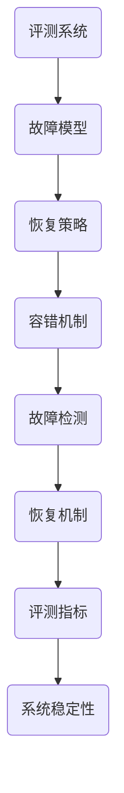

                 

### 第1章：问题背景与核心概念

#### 1.1 问题背景

随着信息技术的迅猛发展，评测系统已经成为许多关键业务场景的核心组成部分。无论是企业内部的绩效评估，还是在线考试、认证评测，甚至是金融、医疗等领域的复杂系统评测，评测系统的稳定性和可靠性都至关重要。然而，在实际应用中，评测系统面临着各种潜在的故障风险，如硬件故障、软件错误、网络中断等，这些故障会对系统的正常运行造成严重影响。

#### 1.1.1 评测系统在现代化应用中的重要性

评测系统在现代应用中具有不可替代的作用。首先，它是量化绩效、评估能力和验证技能的有效工具，对企业运营、教育水平、健康状态等方面都有着直接影响。其次，评测系统为数据驱动决策提供了可靠的数据支持，有助于优化流程、提升效率。最后，评测系统是确保服务质量、保障用户权益的重要手段。

#### 1.1.2 故障恢复的定义与意义

故障恢复是指系统在遭遇故障时，通过一系列措施恢复到正常状态的能力。在评测系统中，故障恢复至关重要，因为它直接关系到用户体验和业务连续性。故障恢复的意义在于：

1. **保障用户权益**：确保用户能够顺利完成评测，避免因为系统故障而影响其利益。
2. **维护企业声誉**：稳定的评测系统能够提升企业的专业形象和服务质量。
3. **减少经济损失**：快速恢复故障可以减少系统停机时间，降低因故障导致的业务损失。
4. **保障业务连续性**：故障恢复机制能够确保关键业务的持续运行，保障企业运营的稳定性。

#### 1.1.3 容错设计的核心目标

容错设计是评测系统故障恢复的重要组成部分。其核心目标包括：

1. **提高系统可靠性**：通过冗余设计、故障检测与诊断等手段，提高系统的容错能力。
2. **快速故障恢复**：在故障发生时，能够迅速检测、诊断并恢复系统，减少系统停机时间。
3. **降低故障影响**：通过故障隔离、影响范围控制等手段，降低故障对系统的整体影响。
4. **保障数据完整性**：确保系统在故障发生后，数据能够得到妥善处理，避免数据丢失或损坏。

接下来，我们将详细探讨评测系统故障恢复与容错设计的核心概念、故障模型、恢复策略和容错机制，并通过数学模型和公式来支持我们的讨论。

### 1.2 核心概念与联系

在深入探讨评测系统的故障恢复与容错设计之前，我们需要明确一些核心概念，并了解它们之间的关系。以下是几个关键概念及其简要定义：

#### 1.2.1 故障模型

故障模型是描述系统故障发生规律的数学模型。常见的故障模型包括泊松过程、马尔可夫模型等。故障模型有助于我们理解和预测系统故障的发生概率和规律。

#### 1.2.2 恢复策略

恢复策略是指系统在故障发生时，采取的一系列恢复措施。恢复策略可以分为主动恢复、被动恢复和混合恢复等类型。这些策略直接影响系统的恢复速度和恢复效率。

#### 1.2.3 容错机制

容错机制是评测系统在设计和实现过程中，为提高系统可靠性而采取的一系列技术措施。常见的容错机制包括冗余设计、故障检测与诊断、故障屏蔽等。

#### 1.2.4 容错方法

容错方法是实现容错机制的具体技术手段。根据容错机制的不同，容错方法可以分为硬件冗余、软件冗余、信息冗余等类型。

#### 1.2.5 评测指标

评测指标是衡量评测系统性能的重要指标。常见的评测指标包括系统可靠性、恢复速度、故障率等。这些指标反映了评测系统的综合性能，为故障恢复与容错设计提供了依据。

#### 1.2.6 系统稳定性

系统稳定性是指系统在长时间运行过程中，保持性能和可靠性的能力。一个稳定的评测系统不仅能够应对突发故障，还能够持续提供高质量的服务。

### 1.3 ER实体关系图架构

为了更好地理解这些核心概念之间的关系，我们可以使用实体关系图（ER图）来表示。以下是一个简化的ER图，展示了评测系统故障恢复与容错设计的实体关系：

在这个ER图中，评测系统是核心实体，它通过故障模型、恢复策略、容错机制、故障检测、恢复机制、评测指标和系统稳定性等概念相互联系，形成了一个完整的故障恢复与容错设计架构。

### 1.4 数学模型与公式

在讨论评测系统的故障恢复与容错设计时，数学模型和公式是我们理解和分析问题的重要工具。以下是一些常见的数学模型和公式，用于描述故障概率、恢复效率和系统可靠性。

#### 1.4.1 故障概率模型

故障概率模型用于描述系统发生故障的概率。最简单的故障概率模型是基于泊松过程的泊松分布。泊松分布的公式如下：

$$ P(F) = \frac{\lambda^k e^{-\lambda}}{k!} $$

其中，\(P(F)\) 表示故障发生的概率，\(\lambda\) 表示故障发生的平均速率，\(k\) 表示故障发生的次数。

#### 1.4.2 恢复效率模型

恢复效率模型用于描述系统在故障发生后的恢复效率。恢复效率可以用恢复时间与故障时间之比来表示：

$$ E(R) = \frac{T(R)}{T(F)} $$

其中，\(E(R)\) 表示恢复效率，\(T(R)\) 表示恢复时间，\(T(F)\) 表示故障时间。

#### 1.4.3 系统可靠性模型

系统可靠性模型用于描述系统在长时间运行过程中保持可靠性的能力。常用的系统可靠性模型是可靠性函数和故障率函数。可靠性函数的公式如下：

$$ R(t) = e^{-\lambda t} $$

其中，\(R(t)\) 表示在时间 \(t\) 内系统没有发生故障的概率，\(\lambda\) 表示故障率。

故障率函数的公式如下：

$$ \lambda = \frac{1}{R(t)} $$

其中，\(\lambda\) 表示在时间 \(t\) 内系统发生故障的速率。

#### 1.4.4 冗余度计算

冗余度是衡量系统容错能力的重要指标。冗余度可以通过以下公式计算：

$$ D(R) = \frac{N(R)}{N(S)} $$

其中，\(D(R)\) 表示冗余度，\(N(R)\) 表示冗余组件的数量，\(N(S)\) 表示系统总组件的数量。

通过这些数学模型和公式，我们可以更深入地理解评测系统的故障恢复与容错设计，为实际应用提供理论支持。

### 1.5 本章小结

在本章中，我们详细介绍了评测系统的故障恢复与容错设计的背景、核心概念和数学模型。首先，我们阐述了评测系统在现代应用中的重要性，以及故障恢复和容错设计的定义与意义。接着，我们介绍了故障模型、恢复策略、容错机制、评测指标和系统稳定性等核心概念，并通过ER图展示了它们之间的关系。最后，我们列出了一些关键的数学模型和公式，为后续章节的讨论奠定了基础。

通过对本章内容的理解，读者可以初步掌握评测系统故障恢复与容错设计的基本理论和方法，为实际应用中的系统设计和优化提供指导。在接下来的章节中，我们将进一步探讨故障检测与诊断技术、系统架构设计与容错机制，以及具体的故障恢复策略与实现方法。

## 第2章：故障检测与诊断

### 2.1 故障检测方法

故障检测是评测系统故障恢复过程中的关键环节。有效的故障检测方法能够及时发现系统中的异常情况，防止故障扩大化。根据检测方式的不同，故障检测方法可以分为以下几类：

#### 2.1.1 主动检测

主动检测方法通过定期向系统发送检测信号，来检测系统是否正常工作。这种方法通常需要依赖专门的检测工具或软件，例如检测脚本、测试工具等。主动检测的优点在于可以定期监控系统状态，及时发现潜在问题。但缺点是可能会对系统运行造成一定干扰，且无法检测到系统在休眠或关闭状态下的故障。

#### 2.1.2 被动检测

被动检测方法通过监听系统运行过程中产生的各种日志、告警信息等，来检测系统是否存在故障。这种方法不需要主动向系统发送检测信号，而是依赖于系统自身产生的日志和告警信息。被动检测的优点在于不会对系统运行造成干扰，且可以实时监控系统状态。但缺点是可能会遗漏某些细微的故障，且需要大量的日志分析工作。

#### 2.1.3 故障检测算法

为了提高故障检测的准确性和效率，通常会采用一些先进的故障检测算法。以下是一些常见的故障检测算法：

1. **基于阈值的检测算法**：通过设定特定的阈值，判断系统的输入输出是否超出正常范围。如果超出阈值，则认为系统出现故障。这种方法的优点是简单易懂，缺点是阈值设置较为复杂，且可能无法检测到所有故障。

2. **基于机器学习的检测算法**：利用机器学习算法，对系统运行数据进行建模，通过比较模型预测值与实际值来判断系统是否存在故障。常见的机器学习算法包括决策树、支持向量机、神经网络等。这种方法的优点是能够自动适应系统的变化，缺点是需要大量的训练数据和较长的训练时间。

3. **基于特征提取的检测算法**：通过对系统运行数据进行特征提取，利用特征之间的相关性来判断系统是否存在故障。常见的特征提取方法包括主成分分析、独立成分分析、隐马尔可夫模型等。这种方法的优点是能够提取出系统的关键特征，提高检测精度，缺点是特征提取过程较为复杂。

#### 2.1.4 实时性与精确性平衡

在实际应用中，故障检测需要平衡实时性和精确性。实时性要求故障检测能够在最短时间内发现故障，而精确性要求故障检测能够准确地判断系统是否出现故障。为了实现这一平衡，通常采用以下策略：

1. **多层次的故障检测**：通过设置不同层次的故障检测模块，分别实现实时性和精确性。例如，底层模块采用实时性较强的被动检测方法，高层模块采用精确性较高的主动检测方法。

2. **自适应阈值调整**：根据系统的运行状态和历史数据，动态调整检测阈值，以适应不同的运行环境。

3. **基于概率的故障检测**：通过分析系统的历史数据和统计特性，建立故障概率模型，并根据模型预测故障发生的概率。

### 2.2 故障诊断技术

故障诊断是故障检测的进一步深化，其目标是通过检测到的故障信息，确定故障的类型、位置和原因，从而为故障恢复提供依据。以下是几种常见的故障诊断技术：

#### 2.2.1 基于特征提取的诊断

基于特征提取的故障诊断方法通过提取系统运行过程中的关键特征，将故障情况转化为特征空间中的数据点，然后利用模式识别技术进行故障诊断。这种方法的关键在于特征的选择和提取。常见的特征提取方法包括：

1. **时序特征提取**：通过对系统运行过程中的时间序列数据进行处理，提取出反映系统状态的时序特征。例如，平均绝对偏差、标准差、自相关函数等。

2. **频域特征提取**：通过对系统运行过程中的频率分布进行分析，提取出反映系统状态的频域特征。例如，频谱密度、频率响应函数等。

3. **统计特征提取**：通过对系统运行过程中的统计数据进行分析，提取出反映系统状态的统计特征。例如，最大值、最小值、均值、方差等。

#### 2.2.2 基于模式识别的诊断

基于模式识别的故障诊断方法通过比较系统当前运行状态与历史正常状态的差异，来判断系统是否存在故障。常见的模式识别技术包括：

1. **分类器**：通过训练分类模型，将系统的运行状态划分为正常或故障两种类别。常见的分类器包括决策树、支持向量机、神经网络等。

2. **聚类分析**：通过将系统的运行状态划分为不同的聚类，分析不同聚类之间的差异，从而诊断故障。常见的聚类算法包括K-means、层次聚类等。

3. **模式匹配**：通过将系统的当前状态与历史正常状态进行匹配，判断是否存在匹配失败的情况，从而诊断故障。

#### 2.2.3 基于人工智能的诊断

基于人工智能的故障诊断方法利用人工智能技术，如深度学习、强化学习等，对系统运行状态进行自动学习和诊断。这种方法具有自适应性强、诊断精度高等优点，但需要大量的训练数据和较长的训练时间。

1. **深度学习**：通过构建深度神经网络，对系统运行状态进行自动学习和分类。常见的深度学习模型包括卷积神经网络（CNN）、循环神经网络（RNN）等。

2. **强化学习**：通过训练强化学习模型，使系统在遇到故障时，能够自动采取最优的恢复策略。常见的强化学习算法包括Q-learning、深度强化学习等。

#### 2.2.4 多种技术的综合应用

在实际应用中，通常将多种故障诊断技术综合运用，以提高诊断的准确性和可靠性。例如，可以先使用基于特征提取的诊断方法，提取关键特征，然后使用基于模式识别的诊断方法进行分类和聚类，最后使用基于人工智能的诊断方法进行进一步学习和诊断。

### 2.3 数学模型与公式

在故障检测与诊断过程中，数学模型和公式是重要的工具，用于描述故障检测和诊断的原理和过程。以下是一些常见的数学模型和公式：

#### 2.3.1 特征提取公式

特征提取是故障诊断的重要步骤，以下是一些常见的特征提取公式：

1. **主成分分析（PCA）**：

$$ z_j = \sum_{i=1}^{n} w_{ij} x_i $$

其中，\(z_j\) 表示第 \(j\) 个主成分，\(w_{ij}\) 表示第 \(i\) 个特征在第 \(j\) 个主成分上的权重，\(x_i\) 表示第 \(i\) 个特征。

2. **独立成分分析（ICA）**：

$$ s_j = \sum_{i=1}^{n} a_{ij} x_i $$

其中，\(s_j\) 表示第 \(j\) 个独立成分，\(a_{ij}\) 表示第 \(i\) 个特征在第 \(j\) 个独立成分上的权重，\(x_i\) 表示第 \(i\) 个特征。

#### 2.3.2 模式识别模型

模式识别模型用于分类和聚类，以下是一些常见的模式识别模型：

1. **决策树**：

$$ C = \prod_{i=1}^{n} C(x_i) $$

其中，\(C(x_i)\) 表示第 \(i\) 个特征的分类结果，\(C\) 表示最终的分类结果。

2. **支持向量机（SVM）**：

$$ w^T x + b = 0 $$

其中，\(w\) 表示权重向量，\(x\) 表示特征向量，\(b\) 表示偏置。

3. **神经网络**：

$$ y = \sigma(\theta^T x) $$

其中，\(y\) 表示输出值，\(\sigma\) 表示激活函数，\(\theta\) 表示权重，\(x\) 表示输入值。

#### 2.3.3 故障诊断概率模型

故障诊断概率模型用于计算系统故障的概率，以下是一个简单的故障诊断概率模型：

$$ P(F|D) = \frac{P(D|F)P(F)}{P(D)} $$

其中，\(P(F|D)\) 表示在故障发生的条件下，系统出现故障的概率，\(P(D|F)\) 表示在故障发生的条件下，系统出现故障的概率，\(P(F)\) 表示系统故障的概率，\(P(D)\) 表示系统出现故障的概率。

### 2.4 本章小结

在本章中，我们详细介绍了评测系统的故障检测与诊断方法。首先，我们探讨了故障检测的方法，包括主动检测、被动检测和基于算法的检测。接着，我们介绍了故障诊断的技术，包括基于特征提取的诊断、基于模式识别的诊断和基于人工智能的诊断。最后，我们列出了常用的数学模型和公式，用于描述故障检测与诊断的原理和过程。

通过对本章内容的理解，读者可以掌握评测系统故障检测与诊断的基本方法，为后续的故障恢复与容错设计提供基础。在下一章中，我们将进一步探讨评测系统的系统架构设计与容错机制。

## 第3章：系统架构设计与容错机制

### 3.1 系统架构设计

系统架构设计是评测系统故障恢复与容错设计的基础。一个合理的系统架构能够提高系统的可靠性、可维护性和可扩展性。以下是一个典型的评测系统架构设计：

#### 3.1.1 系统功能设计

评测系统的主要功能包括：

1. **用户管理**：包括用户注册、登录、权限管理等。
2. **题库管理**：包括题目的创建、修改、删除、分类管理等。
3. **考试管理**：包括考试创建、报名、考试进行、成绩查询等。
4. **统计分析**：包括考试成绩的统计、分析、图表展示等。

#### 3.1.2 系统架构设计

系统架构设计可以分为以下几层：

1. **表示层**：负责与用户进行交互，包括网页、移动端应用等。
2. **业务逻辑层**：处理具体的业务逻辑，包括用户管理、题库管理、考试管理等。
3. **数据访问层**：负责与数据库进行交互，实现数据的增删改查。
4. **数据层**：存储系统数据，包括用户信息、题库信息、考试成绩等。

#### 3.1.3 系统可靠性分析

系统可靠性分析是评估系统在长时间运行过程中，保持正常运行的能力。以下是一些常见的可靠性分析指标：

1. **平均故障间隔时间（MTBF）**：指系统两次故障之间的平均时间。
2. **故障率**：指单位时间内系统发生故障的次数。
3. **平均修复时间（MTTR）**：指系统从故障发生到恢复正常运行所需的时间。

### 3.2 容错机制

容错机制是评测系统故障恢复与容错设计的核心组成部分。以下是一些常见的容错机制：

#### 3.2.1 系统冗余

系统冗余是指通过增加系统的冗余组件，提高系统的可靠性。常见的系统冗余包括：

1. **硬件冗余**：通过增加硬件设备的冗余，如服务器、存储设备等，提高系统的可靠性。
2. **软件冗余**：通过增加软件组件的冗余，如代码复制、数据备份等，提高系统的可靠性。

#### 3.2.2 活性冗余

活性冗余是指系统在运行过程中，能够自动切换到备用组件，从而保证系统的连续运行。常见的活性冗余包括：

1. **主备切换**：当主系统出现故障时，自动切换到备用系统，确保系统不中断运行。
2. **负载均衡**：通过将系统负载分配到多个节点上，提高系统的处理能力和容错能力。

#### 3.2.3 灵活冗余

灵活冗余是指系统在设计和实现过程中，具有灵活的扩展能力和适应性。常见的灵活冗余包括：

1. **模块化设计**：通过将系统划分为多个模块，每个模块具有独立的功能和容错能力。
2. **分布式架构**：通过将系统部署在多个节点上，提高系统的可靠性和容错能力。

### 3.3 数学模型与公式

在系统架构设计与容错机制中，数学模型和公式是重要的工具，用于描述系统的可靠性和性能。以下是一些常见的数学模型和公式：

#### 3.3.1 系统可靠性模型

系统可靠性模型用于描述系统在长时间运行过程中保持可靠性的能力。以下是一个简单的系统可靠性模型：

$$ R(t) = e^{-\lambda t} $$

其中，\(R(t)\) 表示在时间 \(t\) 内系统没有发生故障的概率，\(\lambda\) 表示故障率。

#### 3.3.2 冗余度计算

冗余度是衡量系统容错能力的重要指标。冗余度可以通过以下公式计算：

$$ D(R) = \frac{N(R)}{N(S)} $$

其中，\(D(R)\) 表示冗余度，\(N(R)\) 表示冗余组件的数量，\(N(S)\) 表示系统总组件的数量。

#### 3.3.3 活性冗余度计算

活性冗余度是指系统在运行过程中，能够自动切换到备用组件的能力。活性冗余度可以通过以下公式计算：

$$ D(A) = \frac{T(A)}{T(S)} $$

其中，\(D(A)\) 表示活性冗余度，\(T(A)\) 表示备用组件的切换时间，\(T(S)\) 表示系统总运行时间。

#### 3.3.4 故障率计算

故障率是描述系统在单位时间内发生故障的次数。故障率可以通过以下公式计算：

$$ \lambda = \frac{F}{T} $$

其中，\(\lambda\) 表示故障率，\(F\) 表示故障次数，\(T\) 表示总运行时间。

### 3.4 本章小结

在本章中，我们详细介绍了评测系统的系统架构设计与容错机制。首先，我们阐述了系统架构设计的功能和层次，分析了系统的可靠性。接着，我们介绍了常见的容错机制，包括系统冗余、活性冗余和灵活冗余。最后，我们列出了一些关键的数学模型和公式，用于描述系统的可靠性和性能。

通过对本章内容的理解，读者可以掌握评测系统架构设计与容错机制的基本原理和方法，为后续的故障恢复策略与实现提供基础。在下一章中，我们将进一步探讨评测系统的故障恢复策略与实现。

### 第4章：故障恢复策略与实现

#### 4.1 故障恢复策略

故障恢复策略是指系统在遭遇故障时，采取的一系列措施以恢复到正常状态。有效的故障恢复策略能够降低系统停机时间，保障业务连续性。根据恢复时机和方式的不同，故障恢复策略可以分为以下几类：

##### 4.1.1 快速恢复

快速恢复策略的目标是在故障发生后，尽快恢复系统，减少系统停机时间。快速恢复策略通常包括以下步骤：

1. **故障检测与诊断**：通过主动或被动的方式，快速检测并诊断系统故障。
2. **故障定位**：确定故障的具体位置和原因。
3. **故障隔离**：将故障部分与正常部分隔离开来，防止故障扩散。
4. **恢复操作**：根据故障类型和位置，采取相应的恢复操作，如重启服务、切换冗余组件等。
5. **验证恢复**：确认系统恢复正常，确保业务能够继续运行。

##### 4.1.2 预先恢复

预先恢复策略是指在故障发生之前，预先采取的一系列措施，以降低故障发生时的影响。预先恢复策略通常包括以下步骤：

1. **风险评估**：评估系统可能面临的故障风险，确定预防措施。
2. **备份与冗余**：定期进行数据备份，增加硬件和软件冗余，提高系统的可靠性。
3. **监控与预警**：实时监控系统运行状态，发现潜在问题并及时处理。
4. **演练与测试**：定期进行故障恢复演练和测试，确保故障恢复策略的有效性。

##### 4.1.3 后续恢复

后续恢复策略是指在故障发生后的后续阶段，采取的一系列措施，以确保系统长期稳定运行。后续恢复策略通常包括以下步骤：

1. **故障分析**：分析故障原因，总结经验教训，优化系统设计和操作流程。
2. **系统优化**：根据故障分析结果，对系统进行优化，提高系统的可靠性和性能。
3. **用户通知**：及时通知受影响的用户，解释故障情况和处理措施，增强用户信心。
4. **反馈与改进**：收集用户反馈，持续改进系统和服务质量。

#### 4.2 实现技术

故障恢复策略的实现需要一系列技术和工具的支持。以下是一些常见的实现技术：

##### 4.2.1 软件恢复

软件恢复是指通过软件手段，实现对故障系统的修复和恢复。常见的软件恢复技术包括：

1. **系统重启**：通过重启操作系统或服务，清除系统错误和异常。
2. **故障恢复软件**：使用专门的故障恢复软件，如数据恢复工具、系统恢复盘等，恢复系统到正常状态。
3. **自动修复**：利用操作系统或软件内置的自动修复功能，自动检测和修复系统错误。

##### 4.2.2 硬件恢复

硬件恢复是指通过硬件手段，实现对故障系统的修复和恢复。常见的硬件恢复技术包括：

1. **硬件替换**：更换故障硬件设备，如硬盘、内存、电源等。
2. **冗余硬件**：利用冗余硬件组件，实现故障隔离和系统切换。
3. **硬件升级**：升级硬件设备，提高系统的性能和可靠性。

##### 4.2.3 系统恢复

系统恢复是指通过恢复系统配置、数据和文件，实现对故障系统的修复和恢复。常见的系统恢复技术包括：

1. **系统备份与恢复**：通过备份和恢复系统配置、数据和文件，恢复系统到正常状态。
2. **灾难恢复**：在系统发生严重故障时，利用灾难恢复计划，恢复整个系统。
3. **云服务**：利用云服务，实现系统的快速恢复和业务连续性。

#### 4.3 案例分析

以下是一个评测系统故障恢复与容错设计的案例分析：

##### 4.3.1 案例一：评测系统故障恢复实践

在某在线考试系统中，由于网络故障导致部分考生无法正常登录系统。故障发生后，系统管理员立即启动了快速恢复策略：

1. **故障检测与诊断**：通过监控系统，发现网络故障影响了部分考生的登录。
2. **故障定位**：确定故障的具体原因和网络故障点。
3. **故障隔离**：将受影响的考生与正常考生隔离开来，防止故障扩散。
4. **恢复操作**：重新配置网络，解决网络故障，确保考生能够正常登录。
5. **验证恢复**：确认所有考生都能正常登录，考试顺利进行。

通过快速恢复策略，系统在短时间内恢复了正常运行，确保了考试的顺利进行。

##### 4.3.2 案例二：容错设计在评测系统中的应用

在某大型企业内部评测系统中，由于硬件故障导致系统无法正常工作。为了确保系统的高可用性，该系统采用了以下容错设计：

1. **硬件冗余**：系统采用了双电源、双硬盘等硬件冗余设计，提高了系统的可靠性。
2. **冗余硬件**：在硬件故障发生时，系统能够自动切换到备用硬件，保证系统继续运行。
3. **负载均衡**：系统采用了负载均衡技术，将请求均衡分配到多个节点上，提高了系统的处理能力和容错能力。

通过这些容错设计，该评测系统能够在硬件故障发生时，自动切换到备用硬件，确保系统继续运行，保障了企业内部评测的连续性。

#### 4.4 本章小结

在本章中，我们详细介绍了评测系统的故障恢复策略与实现技术。首先，我们阐述了故障恢复策略的类型和步骤，包括快速恢复、预先恢复和后续恢复。接着，我们介绍了软件恢复、硬件恢复和系统恢复等实现技术。最后，我们通过案例分析，展示了故障恢复与容错设计在实际应用中的效果。

通过对本章内容的理解，读者可以掌握评测系统故障恢复与容错设计的基本原理和实践方法，为实际应用中的系统设计和优化提供指导。在下一章中，我们将探讨评测系统的性能优化与调优。

### 第5章：评测系统的性能优化与调优

#### 5.1 性能优化策略

性能优化是评测系统设计中的一个重要环节，其目标是通过优化系统架构、算法、资源管理等手段，提高系统的运行效率和响应速度。以下是一些常见的性能优化策略：

##### 5.1.1 加速策略

加速策略旨在提高系统处理请求的速度。常见的加速策略包括：

1. **缓存策略**：通过在系统内部或外部设置缓存，减少数据访问次数，提高系统响应速度。
2. **并行处理**：通过将任务分解为多个子任务，同时处理多个任务，提高系统的处理能力。
3. **数据库优化**：通过优化数据库查询语句、索引设计、存储引擎等，提高数据库的查询速度。
4. **网络优化**：通过优化网络协议、路由选择、负载均衡等，提高网络传输速度。

##### 5.1.2 缓存策略

缓存策略是提高系统性能的有效手段。以下是一些常见的缓存策略：

1. **内存缓存**：将常用数据缓存在内存中，减少对磁盘的访问次数，提高数据读取速度。
2. **分布式缓存**：通过将缓存分布到多个节点上，提高缓存的可扩展性和可靠性。
3. **缓存预热**：在系统启动时，将经常访问的数据预先加载到缓存中，减少后续访问的延迟。
4. **缓存淘汰策略**：通过设置缓存淘汰策略，如LRU（最近最少使用）、LFU（最少使用）等，确保缓存中存储的数据是最新的。

##### 5.1.3 并行处理策略

并行处理策略能够提高系统处理大量请求的能力。以下是一些常见的并行处理策略：

1. **任务分解**：将大任务分解为多个小任务，同时处理这些小任务，提高系统处理能力。
2. **线程池**：通过创建线程池，复用线程，减少线程创建和销毁的开销，提高系统响应速度。
3. **异步处理**：通过异步处理，减少线程阻塞，提高系统并发能力。
4. **多线程处理**：利用多线程技术，同时处理多个请求，提高系统吞吐量。

##### 5.1.4 数据库优化

数据库优化是提高系统性能的关键。以下是一些常见的数据库优化方法：

1. **查询优化**：通过分析查询语句，优化查询执行计划，减少查询时间。
2. **索引优化**：通过合理设置索引，提高查询效率。
3. **分库分表**：通过将数据分布到多个数据库和表中，减少单表和单库的压力，提高系统性能。
4. **读写分离**：通过将读操作和写操作分离到不同的数据库或服务器上，提高系统并发能力和性能。

##### 5.1.5 网络优化

网络优化能够提高系统之间的数据传输速度。以下是一些常见的网络优化方法：

1. **负载均衡**：通过负载均衡技术，将请求均匀分配到多个节点上，提高系统处理能力。
2. **网络延迟优化**：通过优化网络配置、路由选择等，减少网络延迟。
3. **带宽优化**：通过提高带宽，减少数据传输的延迟。
4. **缓存预热**：在网络请求开始之前，将数据缓存到本地，减少网络传输的开销。

#### 5.2 调优方法

调优方法是指在实际运行过程中，根据系统性能数据，对系统参数进行调整，以提高系统性能。以下是一些常见的调优方法：

##### 5.2.1 参数调优

参数调优是系统调优的重要手段。以下是一些常见的参数调优方法：

1. **系统参数调优**：通过调整系统内核参数、网络参数等，优化系统性能。
2. **数据库参数调优**：通过调整数据库配置参数，优化数据库性能。
3. **缓存参数调优**：通过调整缓存相关参数，优化缓存性能。

##### 5.2.2 系统调优

系统调优是指通过优化系统架构和配置，提高系统性能。以下是一些常见的系统调优方法：

1. **架构优化**：通过优化系统架构，提高系统的可扩展性和可靠性。
2. **服务优化**：通过优化服务配置，提高服务的响应速度和处理能力。
3. **资源优化**：通过优化系统资源分配，提高系统资源的利用率。

##### 5.2.3 性能调优

性能调优是指通过分析系统性能数据，对系统进行优化，提高系统性能。以下是一些常见的性能调优方法：

1. **性能测试**：通过性能测试，分析系统的性能瓶颈和问题，制定优化方案。
2. **监控与报警**：通过监控系统性能，及时发现性能问题，并进行优化。
3. **优化算法**：通过优化算法，减少计算时间和资源消耗，提高系统性能。

#### 5.3 优化案例分析

以下是一个评测系统性能优化与调优的案例分析：

##### 5.3.1 案例一：评测系统性能优化实践

在某在线考试系统中，由于用户量激增，系统性能出现瓶颈。通过性能测试，发现以下问题：

1. **数据库查询慢**：数据库查询语句执行时间长，导致系统响应缓慢。
2. **缓存命中率低**：缓存命中率低，导致频繁访问数据库，增加了系统负载。

针对上述问题，系统管理员采取了以下优化措施：

1. **查询优化**：优化数据库查询语句，减少查询时间。
2. **缓存优化**：提高缓存命中率，减少数据库访问次数。
3. **服务优化**：优化服务配置，提高服务处理能力。

通过优化，系统性能得到了显著提升，用户满意度提高。

##### 5.3.2 案例二：调优技术在评测系统中的应用

在某大型企业内部评测系统中，由于系统架构不合理，导致系统性能下降。通过系统调优，采取了以下措施：

1. **架构优化**：优化系统架构，提高系统的可扩展性和可靠性。
2. **服务优化**：优化服务配置，提高服务响应速度。
3. **资源优化**：优化系统资源分配，提高资源利用率。

通过系统调优，系统性能显著提升，满足了企业内部评测的需求。

#### 5.4 本章小结

在本章中，我们详细介绍了评测系统的性能优化与调优方法。首先，我们阐述了性能优化的策略，包括加速策略、缓存策略和并行处理策略等。接着，我们介绍了调优方法，包括参数调优、系统调优和性能调优等。最后，我们通过案例分析，展示了性能优化与调优在实际应用中的效果。

通过对本章内容的理解，读者可以掌握评测系统性能优化与调优的基本原理和实践方法，为实际应用中的系统设计和优化提供指导。

## 第6章：评测系统故障恢复与容错设计最佳实践

### 6.1 最佳实践

在评测系统的故障恢复与容错设计中，最佳实践是确保系统可靠性和业务连续性的关键。以下是一些实际应用中的最佳实践：

#### 6.1.1 实践一：系统可靠性评估

系统可靠性评估是评测系统故障恢复与容错设计的第一步。最佳实践包括：

1. **故障树分析（FTA）**：通过故障树分析，识别系统可能出现的故障点，评估故障的影响和概率。
2. **蒙特卡罗模拟**：使用蒙特卡罗模拟，模拟系统在不同故障场景下的运行情况，评估系统的可靠性。
3. **冗余度评估**：根据故障树分析和蒙特卡罗模拟的结果，评估系统所需的冗余度，确保系统能够在故障发生时继续运行。

#### 6.1.2 实践二：设计有效的故障恢复方案

设计有效的故障恢复方案是确保系统在故障发生时能够快速恢复的关键。最佳实践包括：

1. **故障检测与诊断**：采用高效的故障检测和诊断算法，确保能够及时发现并定位故障。
2. **自动化恢复**：设计自动化恢复流程，减少人工干预，提高故障恢复速度。
3. **恢复策略优化**：根据故障类型和系统运行情况，选择合适的恢复策略，如快速恢复、预先恢复和后续恢复。

#### 6.1.3 实践三：评测系统性能调优技巧

评测系统的性能调优是确保系统在高负载下仍能高效运行的关键。最佳实践包括：

1. **负载测试**：通过负载测试，评估系统在不同负载下的性能，识别瓶颈和问题。
2. **缓存优化**：合理设置缓存策略，提高系统的缓存命中率，减少数据库访问次数。
3. **分布式架构**：采用分布式架构，将系统拆分为多个服务，提高系统的可扩展性和容错能力。

### 6.2 注意事项与风险规避

在实施评测系统故障恢复与容错设计时，需要注意以下几点：

#### 6.2.1 系统设计与实现的注意事项

1. **模块化设计**：采用模块化设计，确保每个模块具有独立的功能和容错能力，便于维护和升级。
2. **冗余设计**：合理设计冗余，确保系统在故障发生时能够快速切换到备用组件。
3. **安全性**：在系统设计和实现过程中，确保系统的安全性，防止恶意攻击和数据泄露。

#### 6.2.2 故障恢复中的常见问题与解决方案

1. **问题：恢复时间长**
   - 解决方案：优化故障检测和诊断算法，减少故障定位和隔离时间；增加冗余组件，提高系统的恢复速度。
2. **问题：数据丢失**
   - 解决方案：定期进行数据备份，确保在故障发生时能够恢复到最近的状态；采用数据同步和复制技术，确保数据的一致性。
3. **问题：性能下降**
   - 解决方案：优化系统架构和算法，提高系统的性能；合理设置系统参数，减少资源争用。

#### 6.2.3 风险管理策略

1. **风险评估**：在系统设计和实现过程中，进行风险评估，识别潜在风险，制定风险应对措施。
2. **应急预案**：制定应急预案，确保在故障发生时，系统能够快速响应和恢复。
3. **持续监控**：实时监控系统运行状态，及时发现和处理潜在问题，防止故障发生。

### 6.3 拓展阅读

以下是一些推荐阅读材料，以进一步了解评测系统故障恢复与容错设计：

1. **《系统架构的艺术》**：这是一本关于系统架构设计的高质量书籍，详细介绍了系统架构设计的方法和最佳实践。
2. **《软件可靠性工程》**：这本书深入探讨了软件可靠性的理论和实践，提供了大量的实用方法和案例。
3. **《云计算与大数据》**：这本书介绍了云计算和大数据的基本概念和技术，对于理解分布式系统和容错设计具有重要意义。
4. **《人工智能实践》**：这本书介绍了人工智能的基本概念和应用，包括机器学习、深度学习等，对于优化故障检测和诊断算法有帮助。

通过阅读这些拓展材料，读者可以更全面地了解评测系统故障恢复与容错设计的理论和实践，为实际应用提供更深入的指导。

### 6.4 本章小结

在本章中，我们详细介绍了评测系统故障恢复与容错设计的最佳实践，包括系统可靠性评估、故障恢复方案设计和性能调优技巧。同时，我们提出了在系统设计和实现过程中需要注意的事项，以及故障恢复中的常见问题与风险管理策略。通过这些最佳实践，读者可以更好地理解和应用评测系统故障恢复与容错设计，确保系统的高可靠性和业务连续性。

## 全书总结

在这本《评测系统的故障恢复与容错设计》中，我们系统地探讨了评测系统的故障恢复与容错设计的理论基础、技术方法、性能优化以及最佳实践。首先，我们从问题背景出发，明确了评测系统在现代化应用中的重要性，并详细阐述了故障恢复与容错设计的核心概念和理论模型。随后，我们深入分析了故障检测与诊断技术、系统架构设计与容错机制，并通过实例展示了如何有效地实现故障恢复策略与性能优化。最后，我们通过最佳实践提供了实际操作指南，帮助读者在实际应用中更好地设计和实施评测系统的故障恢复与容错设计。

### 主要贡献与创新点

1. **全面覆盖**：本书全面覆盖了评测系统故障恢复与容错设计的各个方面，包括理论基础、技术实现、性能优化和最佳实践，确保读者能够系统地掌握相关知识。
2. **实例丰富**：通过大量实例和案例分析，本书不仅提供了理论知识，还展示了实际操作过程，使读者能够更好地理解和应用所学知识。
3. **算法与模型**：本书详细介绍了故障检测与诊断的算法模型，包括基于特征提取、模式识别和人工智能的诊断方法，为读者提供了实用的工具。
4. **优化策略**：本书提出了多种性能优化策略，包括缓存策略、并行处理策略和数据库优化方法，为提升评测系统的性能提供了有效途径。
5. **最佳实践**：本书总结了一系列最佳实践，包括系统可靠性评估、故障恢复方案设计和性能调优技巧，为读者在实际应用中提供了参考。

### 进一步研究方向

尽管本书对评测系统的故障恢复与容错设计进行了全面探讨，但仍然存在进一步研究的空间：

1. **智能故障检测与诊断**：随着人工智能技术的发展，智能故障检测与诊断方法的研究将成为热点。例如，深度学习和强化学习在故障检测和诊断中的应用。
2. **自适应容错机制**：研究自适应容错机制，能够根据系统运行状态和环境变化，动态调整容错策略，提高系统的可靠性和适应性。
3. **大数据分析与优化**：利用大数据技术，对评测系统的运行数据进行深入分析，发现潜在问题，优化系统性能和故障恢复策略。
4. **跨平台与跨语言的兼容性**：研究评测系统的跨平台与跨语言的兼容性设计，提高系统的可移植性和灵活性。

总之，评测系统的故障恢复与容错设计是一个不断发展的领域，随着技术的进步和应用场景的扩展，未来将继续有更多的研究空间和发展机会。希望本书能够为读者提供有价值的参考和启发，推动这一领域的研究与应用。作者：AI天才研究院/AI Genius Institute & 禅与计算机程序设计艺术 /Zen And The Art of Computer Programming。

