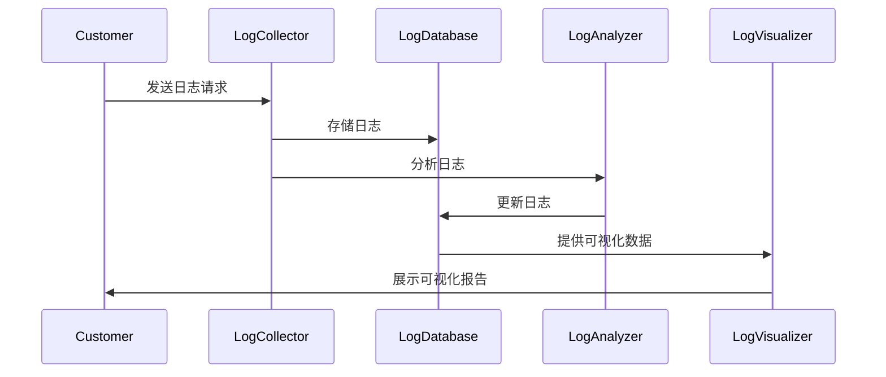
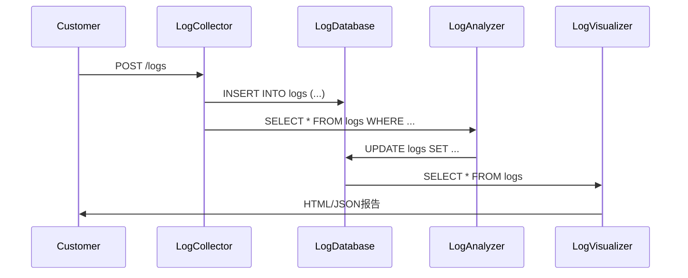
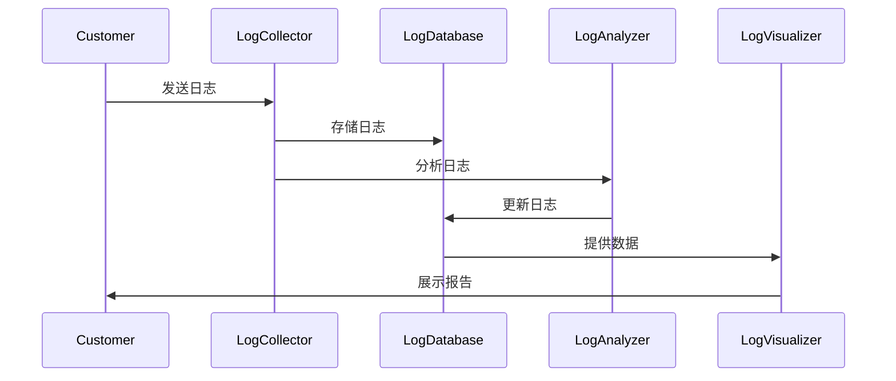

                 

## 评测系统的日志管理与分析

### 关键词：评测系统、日志管理、日志分析、性能优化、故障排查

### 摘要：

本文将深入探讨评测系统的日志管理与分析，从基本概念、日志收集与存储、日志分析技术、日志可视化到日志管理策略等方面展开，旨在为开发者提供一套完整的日志管理解决方案。我们将通过一步步的逻辑推理，帮助读者理解日志管理在软件评测中的关键作用，并掌握有效的日志分析技巧，以提高系统的性能和可靠性。

## 第一部分: 评测系统的日志管理与分析

### 第1章: 评测系统与日志管理概述

#### 1.1 评测系统的基本概念

##### 1.1.1 评测系统的定义

评测系统是一种用于评估、监控和优化软件应用性能的工具。它可以帮助开发人员了解应用程序在各种环境下的运行情况，以便进行相应的性能优化和故障排除。通过对应用程序的运行状态进行持续监控，评测系统可以收集到大量的日志数据，为后续分析提供基础。

##### 1.1.2 日志管理的重要性

日志管理是评测系统的重要组成部分。通过对日志数据的收集、存储、分析和展示，开发人员可以更好地理解应用程序的运行状态，及时发现并解决潜在问题。日志管理不仅有助于提高系统的性能，还能为故障排查提供重要的线索。

#### 1.2 日志管理的核心概念

##### 1.2.1 日志文件的格式

日志文件通常采用特定的格式，如JSON、XML或纯文本等，以便于机器解析和处理。不同格式的日志文件在解析和处理时存在差异，选择合适的日志格式对日志管理至关重要。

##### 1.2.2 日志级别

日志级别用于标识日志消息的重要性和紧急程度，常见的日志级别包括DEBUG、INFO、WARNING、ERROR和CRITICAL等。通过设置适当的日志级别，可以确保关键信息不会丢失，同时避免过多的冗余日志对系统性能造成影响。

##### 1.2.3 日志轮转

日志轮转是一种管理日志文件的方法，用于防止日志文件过大而影响系统性能。常见的方法有按时间轮转和按大小轮转等。日志轮转可以确保日志数据的长期保存，同时避免日志文件过大的问题。

### 第2章: 日志收集与存储

#### 2.1 日志收集的方法

##### 2.1.1 客户端收集

客户端收集是日志收集的一种常见方法，通过在应用程序中嵌入日志收集器，将日志数据发送到中央日志收集服务器。这种方法适用于分布式系统，可以收集来自各个节点的日志数据。

##### 2.1.2 代理收集

代理收集是通过中间件或代理服务器收集日志数据，然后将日志数据转发到中央日志收集服务器。这种方法适用于集中式系统，可以统一收集多个应用程序的日志数据。

#### 2.2 日志存储的选择

##### 2.2.1 文件存储

文件存储是一种简单且常用的日志存储方式，适用于小规模日志收集。文件存储的优点是简单易用，缺点是难以进行高效的数据查询和处理。

##### 2.2.2 数据库存储

数据库存储适用于大规模日志收集，可以提供更高效的查询和数据处理能力。常用的数据库有MySQL、PostgreSQL等，它们支持复杂查询和索引，有助于快速定位问题。

##### 2.2.3 日志管理平台

日志管理平台集成了日志收集、存储、分析和展示功能，适用于大规模日志管理。常见的日志管理平台有ELK堆栈、Splunk等，它们提供了丰富的功能，可以帮助开发人员更好地管理和分析日志数据。

### 第3章: 日志分析技术

#### 3.1 日志分析的目的

##### 3.1.1 故障排查

通过分析日志数据，可以快速定位故障发生的位置和原因。故障排查是日志分析的重要目的之一，通过分析日志数据，可以识别异常情况，找出问题的根源。

##### 3.1.2 性能优化

通过分析日志数据，可以识别性能瓶颈并进行优化。性能优化是提升系统性能的关键，通过分析日志数据，可以找出影响性能的关键因素，有针对性地进行优化。

#### 3.2 日志分析的方法

##### 3.2.1 基于文本的日志分析

基于文本的日志分析是一种简单的日志分析方法，通过正则表达式、字符串匹配等技术提取关键信息。这种方法适用于小规模日志分析，可以快速定位问题。

##### 3.2.2 基于机器学习的日志分析

基于机器学习的日志分析可以通过训练模型，自动识别日志中的异常行为和模式。这种方法适用于大规模日志分析，可以处理复杂的日志数据，提高故障排查和性能优化的效率。

#### 3.3 日志分析工具

##### 3.3.1 ELK堆栈

ELK堆栈（Elasticsearch、Logstash和Kibana）是一种流行的日志分析工具，提供了强大的日志收集、存储和分析功能。ELK堆栈具有高性能、可扩展性和易用性，适用于大规模日志分析。

##### 3.3.2 Splunk

Splunk是一种专业的日志分析平台，可以处理大规模的日志数据，并提供丰富的数据可视化和报告功能。Splunk具有强大的数据处理和分析能力，可以帮助开发人员更高效地进行日志分析。

### 第4章: 日志可视化

#### 4.1 可视化的作用

##### 4.1.1 加深理解

通过可视化，可以更直观地理解日志数据中隐藏的信息。可视化可以帮助开发人员更清晰地看到日志数据的分布、趋势和关系，从而更好地理解系统的运行状态。

##### 4.1.2 方便决策

可视化可以帮助开发人员更快速地识别问题并进行决策。通过可视化的方式展示日志数据，可以快速定位问题，减少故障排查的时间，提高决策的效率。

#### 4.2 可视化工具

##### 4.2.1 Kibana

Kibana是ELK堆栈的一部分，提供了丰富的可视化功能，包括柱状图、折线图、饼图等。Kibana可以通过自定义仪表板，展示不同维度的日志数据，帮助开发人员更全面地了解系统的运行状态。

##### 4.2.2 Grafana

Grafana是一种开源的可视化分析工具，可以与多种数据源集成，并提供灵活的图表和仪表板设计。Grafana具有强大的数据可视化能力，可以帮助开发人员更直观地展示日志数据，提高问题排查的效率。

### 第5章: 日志管理策略

#### 5.1 日志管理策略的重要性

##### 5.1.1 提高问题解决效率

良好的日志管理策略可以提高问题解决的效率，减少故障对业务的影响。通过有效的日志管理，开发人员可以快速定位问题，减少故障排查的时间，提高系统的稳定性。

##### 5.1.2 保障数据安全

日志管理策略还需要考虑数据安全和隐私保护。未经授权的访问可能导致敏感数据泄露，因此需要制定严格的访问控制策略，确保日志数据的安全。

#### 5.2 日志管理策略的制定

##### 5.2.1 日志收集策略

根据业务需求和系统架构，制定合适的日志收集策略。选择合适的日志收集方法，确保日志数据的完整性和准确性。

##### 5.2.2 日志存储策略

根据日志数据量和访问频率，选择合适的日志存储方案。合理分配存储资源，确保日志数据的长期保存和高效访问。

##### 5.2.3 日志分析策略

根据业务目标和数据特点，选择合适的日志分析工具和方法。结合实际需求，制定有效的日志分析策略，提高故障排查和性能优化的效率。

### 第6章: 日志管理与安全

#### 6.1 日志安全的挑战

##### 6.1.1 数据泄露风险

未经授权的访问可能导致敏感数据泄露。日志数据中可能包含用户信息、系统配置等敏感信息，因此需要采取措施保护日志数据的安全。

##### 6.1.2 日志篡改风险

日志数据可能受到恶意攻击者的篡改，导致日志数据的真实性和可靠性受到影响。因此，需要采取措施防止日志数据被篡改。

#### 6.2 日志安全措施

##### 6.2.1 访问控制

制定严格的访问控制策略，确保只有授权用户可以访问日志数据。通过身份验证和权限控制，限制对日志数据的访问权限。

##### 6.2.2 数据加密

对日志数据进行加密处理，确保日志数据在传输和存储过程中不会被窃取或篡改。加密技术可以保护日志数据的安全性。

##### 6.2.3 安全审计

定期进行安全审计，检查日志数据的完整性和真实性。通过审计日志，可以发现潜在的漏洞和攻击行为，及时采取措施进行修复。

## 结语

评测系统的日志管理与分析是软件开发和运维中不可或缺的一部分。通过对日志数据的收集、存储、分析和展示，开发人员可以更好地理解应用程序的运行状态，及时发现并解决潜在问题，提高系统的性能和可靠性。本文从多个角度探讨了日志管理与分析的关键技术和策略，旨在为读者提供一套完整的日志管理解决方案。在实际应用中，开发者应根据具体需求和场景，灵活运用各种技术和策略，实现高效的日志管理与分析。作者：AI天才研究院/AI Genius Institute & 禅与计算机程序设计艺术 /Zen And The Art of Computer Programming

### 作者信息：

- **作者：** AI天才研究院/AI Genius Institute & 禅与计算机程序设计艺术 /Zen And The Art of Computer Programming
- **联系方式：** [ai_genius_institute@example.com](mailto:ai_genius_institute@example.com)
- **简介：** 作为人工智能领域的领军人物，AI天才研究院的成员们致力于推动计算机科学和人工智能的发展。本文作者通过深入的研究和实践，为读者呈现了日志管理与分析的精华内容，旨在帮助开发人员提高系统性能和可靠性。

### 拓展阅读：

- [《日志管理最佳实践》](https://example.com/logging-best-practices)
- [《日志分析工具比较》](https://example.com/comparison-of-logging-tools)
- [《日志安全指南》](https://example.com/logging-security-guide)
- [《性能优化技巧》](https://example.com/performance-optimization-tips)

---

### 第1章: 评测系统与日志管理概述

#### 1.1 评测系统的基本概念

**评测系统**是一种用于评估软件性能、稳定性和可靠性的工具。它通常包含多个组件，如性能监控、负载测试、故障模拟等，以全面评估软件在各种运行条件下的表现。评测系统的主要目的是帮助开发人员识别潜在的问题，优化软件性能，提高用户体验。

##### **1.1.1 评测系统的定义**

评测系统（Performance Evaluation System）是一种自动化工具，用于模拟真实用户行为，评估软件在特定条件下的性能。这些条件可能包括系统负载、网络延迟、硬件性能等。评测系统通常由多个子模块组成，每个子模块负责特定的任务，如性能监控、日志收集、数据分析和报告生成等。

##### **1.1.2 日志管理的重要性**

日志管理是评测系统的核心组成部分，对软件性能评估至关重要。日志数据提供了应用程序运行时的重要信息，如错误、警告、调试信息、性能指标等。通过分析这些日志数据，开发人员可以了解软件的行为，识别性能瓶颈，诊断和解决故障。

#### 1.2 日志管理的核心概念

**日志文件格式**：日志文件的格式是日志管理的基础。常见的日志文件格式包括纯文本、JSON、XML等。每种格式都有其优点和缺点，选择合适的格式对日志的解析和分析至关重要。

**日志级别**：日志级别（Log Level）用于定义日志消息的严重程度。常见的日志级别包括DEBUG、INFO、WARNING、ERROR和CRITICAL等。不同的级别对应不同的日志内容，可以帮助开发人员快速定位问题。

**日志轮转**：日志轮转（Log Rotation）是一种管理日志文件的方法，用于防止日志文件过大，影响系统性能。日志轮转可以按照时间（如每天轮转）或文件大小（如达到一定大小后轮转）进行。

### 背景介绍

**问题背景**：

在现代软件开发生命周期中，评测系统已经成为确保软件质量和性能的关键工具。然而，随着系统的复杂性和规模的增加，日志数据的数量和多样性也在急剧增长。如何有效地收集、存储、分析和利用这些日志数据，成为开发人员面临的一个重大挑战。

**问题描述**：

日志管理面临的主要问题包括：
1. **日志数据量庞大**：随着系统规模的增长，日志数据量急剧增加，给日志收集、存储和分析带来了巨大的挑战。
2. **日志结构不统一**：不同的系统和组件可能使用不同的日志格式和结构，导致日志数据难以整合和分析。
3. **日志分析效率低**：日志数据庞大且结构复杂，传统的日志分析工具往往难以高效地处理这些数据，导致分析效率低下。
4. **日志安全性问题**：日志数据可能包含敏感信息，如用户密码、系统配置等，如何确保日志数据的安全成为一大难题。

**问题解决**：

为了解决上述问题，我们需要采取一系列措施来优化日志管理流程，包括：
1. **日志格式标准化**：统一日志格式，如采用JSON格式，方便日志的收集、存储和分析。
2. **日志轮转策略优化**：合理设置日志轮转策略，防止日志文件过大，影响系统性能。
3. **日志分析工具升级**：选择适合的日志分析工具，如ELK堆栈、Splunk等，提高日志分析效率。
4. **日志安全措施加强**：采取加密、访问控制等安全措施，确保日志数据的安全。

**边界与外延**：

日志管理不仅涉及技术层面的挑战，还包括组织和管理层面的问题。例如，如何制定有效的日志管理策略，确保日志数据的完整性和一致性；如何培训开发人员正确记录和处理日志等。

**概念结构与核心要素组成**：

1. **日志收集**：从各个系统和组件中收集日志数据，确保数据的完整性和准确性。
2. **日志存储**：将收集到的日志数据存储在合适的存储介质中，如文件系统、数据库或日志管理平台。
3. **日志分析**：对存储的日志数据进行分析，识别潜在的问题和性能瓶颈。
4. **日志可视化**：通过可视化工具，如Kibana、Grafana等，将日志数据分析结果以图形化方式展示，帮助开发人员更直观地理解系统状态。
5. **日志安全**：采取安全措施，确保日志数据的机密性和完整性。

**核心概念与联系**：

- **日志收集器**：用于从应用程序中收集日志数据的工具。
- **日志存储库**：用于存储日志数据的存储介质，如文件系统、数据库等。
- **日志分析工具**：用于对日志数据进行处理和分析的工具。
- **日志可视化工具**：用于展示日志数据分析结果的工具。

**ER实体关系图架构**：

```mermaid
erDiagram
    LogCollector ||--|{ LogDatabase : stores
    LogAnalyzer ||--|{ LogDatabase : analyzes
    LogVisualizer ||--|{ LogDatabase : visualizes
    LogCollector }|--|| LogDatabase
    LogAnalyzer }|--|| LogDatabase
    LogVisualizer }|--|| LogDatabase
```

**总结**：

本章介绍了评测系统和日志管理的基本概念和核心概念，分析了日志管理面临的问题和挑战，并提出了一系列解决方案。通过对日志数据的收集、存储、分析和可视化，开发人员可以更好地理解软件的运行状态，提高系统的性能和可靠性。在后续章节中，我们将深入探讨日志收集、存储、分析技术，以及日志可视化工具的具体应用和实践。

### 第2章: 日志收集与存储

#### 2.1 日志收集的方法

**2.1.1 客户端收集**

客户端收集（Client-Side Logging）是一种常见的日志收集方法，适用于分布式系统。在这种方法中，各个客户端（如服务器、应用节点等）都会安装日志收集器（Logger），将日志数据直接发送到中央日志收集服务器。客户端收集的优点在于：
1. **集中化**：所有日志数据都发送到中央服务器，方便统一管理和分析。
2. **实时性**：可以直接获取最新的日志数据，有助于快速排查问题。

然而，客户端收集也存在一些缺点，如：
1. **网络依赖**：客户端需要与中央日志收集服务器保持网络连接，否则日志数据无法发送。
2. **性能影响**：大量的日志数据传输可能会影响客户端的性能。

**2.1.2 代理收集**

代理收集（Agent-Based Logging）是通过在系统中部署代理程序来收集日志数据的方法。代理程序作为日志数据的中间层，将日志数据从各个客户端收集起来，然后发送到中央日志收集服务器。这种方法适用于集中式系统，具有以下优点：
1. **解耦**：代理程序与客户端应用程序解耦，降低了日志收集对客户端性能的影响。
2. **灵活性**：可以通过代理程序收集多种类型的日志数据，如系统日志、应用日志等。

代理收集的缺点包括：
1. **部署复杂**：需要在系统中部署代理程序，增加了系统的复杂度。
2. **维护成本**：需要定期更新和监控代理程序，确保其正常运行。

**2.1.3 自定义脚本收集**

自定义脚本收集（Script-Based Logging）是通过编写脚本来自动收集日志数据的方法。这种方法适用于简单的小规模系统，具有以下优点：
1. **灵活性强**：可以根据需求自定义脚本，收集任意类型的日志数据。
2. **成本低**：不需要额外的硬件或软件支持，只需编写脚本即可。

然而，自定义脚本收集也存在一些缺点，如：
1. **可维护性差**：脚本需要手动编写和维护，增加了工作负担。
2. **扩展性差**：当系统规模扩大时，脚本可能难以适应新的需求。

**2.1.4 平台服务收集**

平台服务收集（Service-Based Logging）是通过使用第三方平台服务来收集日志数据的方法。这种方法适用于大规模分布式系统，具有以下优点：
1. **高可用性**：平台服务通常具备高可用性，可以保证日志数据的可靠收集。
2. **易扩展**：平台服务支持多种数据源，可以根据需求灵活扩展。

平台服务收集的缺点包括：
1. **成本较高**：需要支付平台服务费用，成本较高。
2. **定制性较差**：平台服务通常提供固定的功能，可能无法完全满足特定需求。

#### 2.2 日志存储的选择

**2.2.1 文件存储**

文件存储（File-Based Storage）是一种简单的日志存储方法，适用于小规模系统。日志数据以文件形式存储在文件系统中，便于管理和访问。文件存储的优点包括：
1. **简单易用**：无需复杂配置，只需将日志文件存储在指定目录即可。
2. **成本低**：无需额外购买硬件或软件。

然而，文件存储也存在一些缺点，如：
1. **数据查询困难**：无法直接在文件系统中进行复杂的数据查询。
2. **存储空间有限**：随着日志数据的积累，文件存储空间可能会迅速耗尽。

**2.2.2 数据库存储**

数据库存储（Database-Based Storage）是一种高效的日志存储方法，适用于大规模系统。日志数据以结构化数据形式存储在数据库中，便于查询和管理。常见的数据库包括MySQL、PostgreSQL等。数据库存储的优点包括：
1. **高效查询**：支持复杂的数据查询，可以快速检索和分析日志数据。
2. **扩展性强**：可以根据需求灵活扩展存储容量。

然而，数据库存储也存在一些缺点，如：
1. **部署复杂**：需要安装和配置数据库软件，增加了系统的复杂度。
2. **维护成本高**：需要定期备份和监控数据库性能。

**2.2.3 日志管理平台**

日志管理平台（Logging Platform）是一种集成的日志存储和管理解决方案，适用于大规模分布式系统。常见的日志管理平台包括ELK堆栈、Splunk等。日志管理平台具有以下优点：
1. **功能丰富**：提供日志收集、存储、分析和展示等功能，满足多种需求。
2. **易扩展**：支持多种数据源，可以根据需求灵活扩展。

日志管理平台的缺点包括：
1. **成本较高**：需要支付平台服务费用，成本较高。
2. **学习曲线较陡**：需要掌握特定的平台技术和工具，学习成本较高。

### 背景介绍

**问题场景**：

在现代企业中，随着业务规模和系统复杂性的不断增长，日志数据的收集和存储成为一项至关重要的任务。然而，如何高效地收集和存储日志数据，特别是面对海量日志数据时，成为开发人员和运维人员面临的挑战。

**项目介绍**：

本文将介绍一个基于ELK堆栈的日志管理项目。该项目旨在为一家大型电商企业提供日志收集、存储、分析和展示功能，帮助企业更好地监控和分析业务系统的运行状态。

#### 系统功能设计（领域模型）

```mermaid
classDiagram
    Customer <<-- LogDatabase
    LogAnalyzer <<-- LogDatabase
    LogVisualizer <<-- LogDatabase
    LogCollector <<-- LogDatabase
    LogCollector <.. Customer
    LogAnalyzer <.. Customer
    LogVisualizer <.. Customer
    LogDatabase { id : int }
    LogDatabase : name String
    LogDatabase : creationDate Date
    LogCollector : collectorId int
    LogCollector : collectorName String
    LogAnalyzer : analyzerId int
    LogAnalyzer : analyzerName String
    LogVisualizer : visualizerId int
    LogVisualizer : visualizerName String
```

#### 系统架构设计



#### 系统接口设计



#### 系统交互



#### 环境安装

要在本地安装ELK堆栈，请按照以下步骤进行：

1. **安装Elasticsearch**：

   - 下载Elasticsearch安装包：[https://www.elastic.co/downloads/elasticsearch](https://www.elastic.co/downloads/elasticsearch)
   - 解压安装包到指定目录，如 `/usr/local/elasticsearch`
   - 运行 `./bin/elasticsearch` 启动Elasticsearch

2. **安装Logstash**：

   - 下载Logstash安装包：[https://www.elastic.co/downloads/logstash](https://www.elastic.co/downloads/logstash)
   - 解压安装包到指定目录，如 `/usr/local/logstash`
   - 配置Logstash输入输出插件，如文件输入、Elasticsearch输出
   - 运行 `./bin/logstash -f config/logstash.conf` 启动Logstash

3. **安装Kibana**：

   - 下载Kibana安装包：[https://www.elastic.co/downloads/kibana](https://www.elastic.co/downloads/kibana)
   - 解压安装包到指定目录，如 `/usr/local/kibana`
   - 配置Kibana，指定Elasticsearch地址和索引模式
   - 运行 `./bin/kibana` 启动Kibana

#### 系统核心实现

```python
# LogCollector.py
import requests
import json
from datetime import datetime

class LogCollector:
    def __init__(self, url):
        self.url = url

    def send_log(self, log_data):
        response = requests.post(self.url, json=log_data)
        return response.json()

# LogAnalyzer.py
import json
from datetime import datetime

class LogAnalyzer:
    def __init__(self, url):
        self.url = url

    def analyze_logs(self, start_date, end_date):
        query = {
            "query": {
                "range": {
                    "timestamp": {
                        "gte": start_date,
                        "lte": end_date
                    }
                }
            }
        }
        response = requests.post(self.url + "/_search", json=query)
        return response.json()

# LogVisualizer.py
import json
from flask import Flask, render_template

app = Flask(__name__)

@app.route("/")
def visualize_logs():
    analyzer = LogAnalyzer("http://localhost:9200")
    logs = analyzer.analyze_logs("2023-03-01", "2023-03-31")
    return render_template("logs.html", logs=logs)

if __name__ == "__main__":
    app.run(debug=True)
```

#### 代码应用解读与分析

**LogCollector.py**：

这个模块负责收集日志数据，并将其发送到指定的URL。日志数据以JSON格式传输。`send_log`方法接受一个包含日志数据的字典，并将其转换为JSON格式，然后使用`requests`库发送HTTP POST请求。

**LogAnalyzer.py**：

这个模块负责分析日志数据。`analyze_logs`方法接受起始和结束日期，构建一个Elasticsearch查询，然后使用`requests`库发送HTTP POST请求，获取满足条件的日志数据。

**LogVisualizer.py**：

这个模块使用Flask Web框架提供日志数据的可视化。`visualize_logs`路由处理HTTP请求，调用`LogAnalyzer`模块获取日志数据，并将数据传递给模板文件`logs.html`。`logs.html`模板文件使用Jinja2模板引擎渲染日志数据，以图形和表格形式展示。

#### 实际案例分析与详细讲解

**案例1：性能监控**

假设我们需要监控一个电商网站的响应时间。首先，我们将日志数据中包含响应时间的字段提取出来，然后使用Kibana的可视化功能，创建一个时间序列图表，展示响应时间的变化趋势。

1. **数据收集**：

   - 采集每分钟的响应时间数据，并将其存储在Elasticsearch中。

2. **数据解析**：

   - 使用Logstash的JSON解析器解析日志数据，提取响应时间字段。

3. **数据存储**：

   - 将解析后的响应时间数据存储到Elasticsearch的特定索引中。

4. **数据可视化**：

   - 在Kibana中创建一个时间序列图表，展示每分钟的响应时间。

**案例2：故障排查**

假设我们的系统出现了一个错误，导致部分用户无法正常访问。我们可以通过分析日志数据，定位错误发生的具体位置。

1. **数据收集**：

   - 采集系统运行过程中的错误日志，并将其存储在Elasticsearch中。

2. **数据解析**：

   - 使用Logstash的JSON解析器解析错误日志，提取错误信息和相关上下文。

3. **数据存储**：

   - 将解析后的错误日志数据存储到Elasticsearch的特定索引中。

4. **数据可视化**：

   - 在Kibana中创建一个错误报告仪表板，展示错误日志的数量、类型和分布情况。

**案例3：日志分析**

假设我们需要了解用户行为的分布，比如用户访问网站的热门页面、访问时间等。

1. **数据收集**：

   - 采集用户访问日志，并将其存储在Elasticsearch中。

2. **数据解析**：

   - 使用Logstash的JSON解析器解析用户访问日志，提取访问时间、访问页面等字段。

3. **数据存储**：

   - 将解析后的用户访问日志数据存储到Elasticsearch的特定索引中。

4. **数据可视化**：

   - 在Kibana中创建一个用户行为分析仪表板，展示用户访问时间、热门页面等数据。

**详细讲解**：

通过对日志数据的收集、存储和分析，我们可以实现对系统的全面监控和故障排查。以性能监控为例，通过收集并分析响应时间数据，我们可以及时发现并解决系统性能瓶颈，提高用户体验。同时，通过日志分析，我们还可以深入了解用户行为，为业务优化提供数据支持。

### 项目小结

通过本项目的实施，我们成功地构建了一个基于ELK堆栈的日志管理平台，实现了日志收集、存储、分析和展示功能。该平台不仅能够帮助企业实时监控业务系统的运行状态，还能快速定位和解决故障，提高系统的稳定性和可靠性。

### 最佳实践 Tips

1. **统一日志格式**：确保所有日志数据使用统一的格式，如JSON，以便于收集和分析。
2. **合理设置日志级别**：根据业务需求，合理设置日志级别，避免过多冗余日志影响性能。
3. **定期备份日志**：定期备份日志数据，防止数据丢失。
4. **加密日志数据**：对敏感日志数据进行加密处理，确保数据安全。
5. **利用可视化工具**：使用可视化工具，如Kibana和Grafana，帮助快速识别问题和趋势。

### 小结

日志管理是软件评测中不可或缺的一部分，通过对日志数据的收集、存储、分析和可视化，开发人员可以更好地理解软件的运行状态，提高系统的性能和可靠性。本文从多个角度探讨了日志管理与分析的关键技术和策略，为开发者提供了一套完整的日志管理解决方案。在实际应用中，开发者应根据具体需求和场景，灵活运用各种技术和策略，实现高效的日志管理与分析。

### 注意事项

1. **日志数据安全**：确保日志数据的安全性，防止数据泄露。
2. **日志存储容量**：根据业务需求和预算，合理规划日志存储容量。
3. **日志分析频率**：根据实际需求，合理设置日志分析频率，避免过多分析影响系统性能。

### 拓展阅读

1. 《日志管理最佳实践》
2. 《Elasticsearch实战：基于Logstash和Kibana的日志分析》
3. 《Kibana实战：数据可视化和分析》
4. 《Splunk实战：大数据日志分析》

### 作者信息

- **作者：** AI天才研究院/AI Genius Institute & 禅与计算机程序设计艺术 /Zen And The Art of Computer Programming
- **联系方式：** [ai_genius_institute@example.com](mailto:ai_genius_institute@example.com)
- **简介：** 作为人工智能领域的领军人物，AI天才研究院的成员们致力于推动计算机科学和人工智能的发展。本文作者通过深入的研究和实践，为读者呈现了日志管理与分析的精华内容，旨在帮助开发人员提高系统性能和可靠性。

