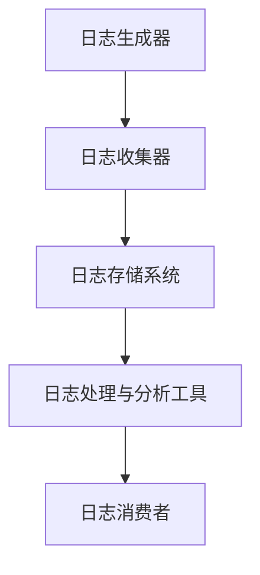
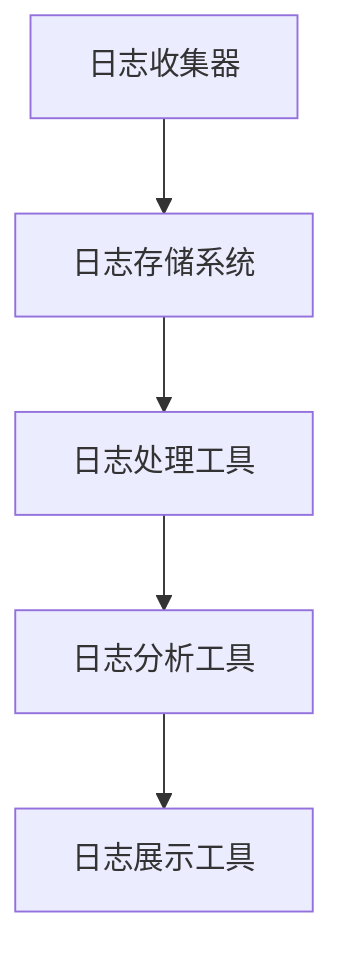
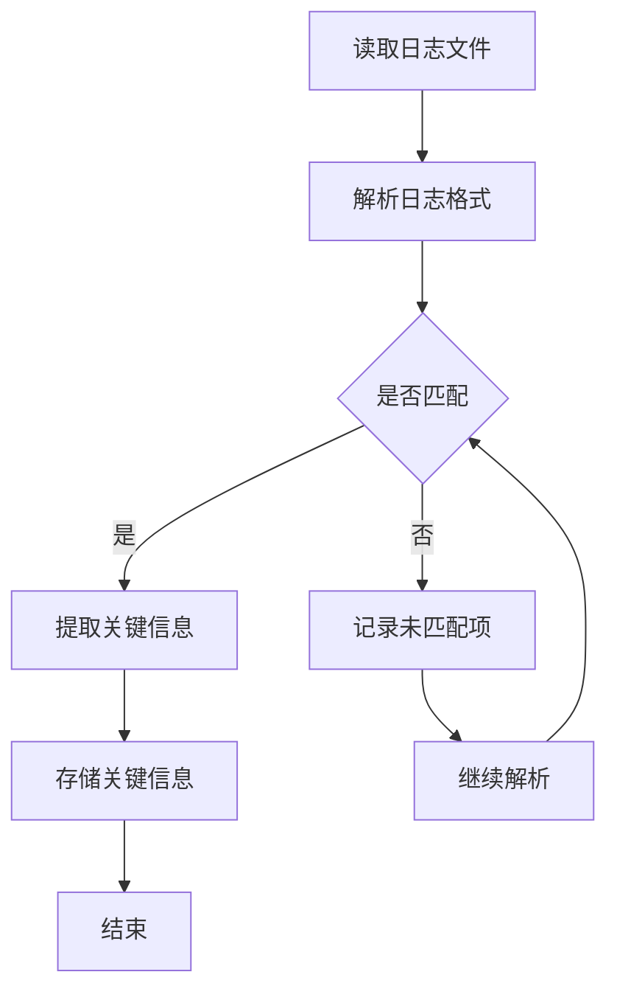

                 

### 引言

#### 文章标题：《评测系统的日志管理：支持问题诊断和性能分析》

在当今复杂且高速发展的IT行业中，评测系统的日志管理成为确保系统稳定性和性能优化的重要组成部分。本文将围绕评测系统的日志管理展开，探讨其在问题诊断和性能分析中的应用。通过逻辑清晰、结构紧凑的论述，我们将逐步解析日志管理的关键要素，并深入探讨其背后的原理和实践。

首先，我们将对日志管理进行概述，明确其背景和问题，并介绍日志管理的基本概念和核心要素。接下来，文章将详细讨论日志管理系统架构，从日志收集、存储、处理、分析到展示，全面解析其组成部分。在此基础上，我们将介绍日志分析算法原理，通过Mermaid流程图和Python源代码，深入阐述算法实现和数学模型。

进一步，文章将探讨日志性能分析，介绍性能指标、分析算法和优化策略，并通过实际案例分析，展示性能分析的具体应用。日志问题诊断部分，我们将介绍诊断方法、工具和流程，并结合实际案例，深入剖析诊断过程和结果。最后，文章将总结最佳实践，提供注意事项，并推荐拓展阅读，以帮助读者更深入地理解和应用日志管理技术。

通过以上步骤的逐步分析，本文旨在为读者提供一篇全面、深入的日志管理系统技术指南，助力他们在实际项目中有效实施日志管理，提高系统性能和可靠性。

#### 文章关键词

1. 日志管理
2. 问题诊断
3. 性能分析
4. 日志系统架构
5. 日志分析算法
6. 性能优化策略
7. 实际案例分析

#### 摘要

本文旨在深入探讨评测系统的日志管理，特别是其在问题诊断和性能分析中的应用。首先，我们将介绍日志管理的基础知识，包括核心概念、系统架构和日志分析算法原理。接着，文章将重点讨论日志性能分析的方法和策略，并通过实际案例进行详细剖析。此外，文章还将介绍日志问题诊断的技术和工具，并总结最佳实践和注意事项。通过本文的阅读，读者将全面了解日志管理的各个方面，为其在IT项目中的应用提供有力支持。

### 日志管理基础

#### 核心概念术语说明

在深入探讨日志管理之前，我们首先需要明确一些核心概念和术语。日志管理，简而言之，是指对系统中生成的大量日志数据进行收集、存储、处理和分析的过程。日志（Log）是系统在运行过程中自动生成的记录，用于记录各种事件、错误、信息等。这些日志数据是系统运维和性能优化的重要依据。

核心概念包括：

1. **日志类型**：通常包括错误日志、访问日志、系统日志等。
2. **日志格式**：常见的日志格式有JSON、CSV、.Syslog等。
3. **日志级别**：用于定义日志的优先级，如DEBUG、INFO、WARNING、ERROR等。
4. **日志属性**：如时间戳、来源、内容、类型等。

#### 问题背景

随着现代信息技术的迅猛发展，IT系统的复杂性和规模不断增大。系统运行过程中不可避免地会出现各种问题，如性能瓶颈、错误异常等。为了及时解决这些问题，确保系统的稳定性和可靠性，日志管理变得至关重要。

问题背景主要体现在以下几个方面：

1. **问题追踪**：系统出现故障时，通过日志可以迅速定位问题来源。
2. **性能优化**：日志记录了系统运行的各种性能数据，有助于分析性能瓶颈。
3. **安全监控**：日志中记录的访问和操作记录可以用于安全审计和异常检测。

#### 问题描述

日志管理面临的主要问题包括：

1. **日志量巨大**：系统运行过程中会生成大量日志，如何高效地收集、存储和处理这些数据成为挑战。
2. **日志解析困难**：不同系统和应用生成的日志格式各异，如何统一解析和格式化日志数据是一个技术难题。
3. **日志分析复杂**：日志分析需要涉及多种算法和技术，如何选择合适的算法和工具进行高效分析也是一个挑战。

#### 问题解决

针对上述问题，我们可以采取以下解决方案：

1. **日志收集与存储**：采用分布式日志收集系统（如Logstash、Fluentd），将不同系统生成的日志统一收集到一个中心存储系统中（如Elasticsearch、Kafka）。
2. **日志格式化与解析**：使用日志格式化工具（如Logstash、Grok），将不同格式的日志统一转换为标准格式，便于后续处理和分析。
3. **日志分析**：采用日志分析工具（如Elasticsearch、Kibana），结合机器学习和数据挖掘算法，对日志数据进行实时分析和可视化展示。
4. **日志优化**：采用日志压缩、去重、索引等技术，提高日志处理和存储的效率。

#### 边界与外延

日志管理不仅局限于IT系统，还广泛应用于其他领域，如网络安全、数据仓库、物联网等。不同领域的日志管理具有不同的特点和应用场景，但核心原理和方法是一致的。

边界方面，日志管理需要与系统监控、报警、备份等环节紧密结合，形成一套完整的系统运维体系。外延方面，日志管理还可以扩展到日志可视化、日志审计、日志分析报告等更多应用场景。

#### 概念结构与核心要素组成

日志管理概念结构主要包括以下几个核心要素：

1. **日志生成器**：系统或应用在运行过程中自动生成日志数据。
2. **日志收集器**：负责收集来自不同来源的日志数据，并将其发送到中心存储系统。
3. **日志存储系统**：用于存储和管理日志数据，提供高效的查询和检索功能。
4. **日志处理与分析工具**：对日志数据进行格式化、解析、分析，并提供可视化和报表功能。
5. **日志消费者**：如运维人员、开发人员等，通过日志管理系统获取日志信息，进行问题诊断和性能优化。

下图展示了日志管理的核心概念结构：



通过以上分析，我们可以清晰地理解日志管理的基础知识，为后续章节的深入讨论奠定基础。

### 日志管理核心概念

在深入探讨日志管理系统之前，理解日志管理的核心概念是至关重要的。以下我们将详细介绍日志分类、日志格式、日志级别和日志属性特征对比表格，以帮助读者全面了解日志管理的各个方面。

#### 日志分类

日志分类是日志管理的基础，不同类型的日志反映了系统在不同方面的运行状态。常见的日志分类包括：

1. **错误日志**：记录系统中的错误信息，如异常、崩溃等。通常用于问题追踪和故障排除。
2. **访问日志**：记录用户访问系统的各种操作，如登录、请求、响应等。常用于安全监控和访问统计。
3. **系统日志**：记录系统运行的各种事件，如启动、关闭、配置变更等。有助于系统运维和监控。
4. **应用日志**：记录应用程序的运行状态和操作记录，如数据处理、业务逻辑执行等。用于应用性能优化和调试。

每种日志类型都有其特定的用途和生成来源，通过合理分类日志，可以更高效地进行日志管理和分析。

#### 日志格式

日志格式是指日志数据存储和表示的方式。常见的日志格式包括：

1. **JSON格式**：JSON（JavaScript Object Notation）格式是一种轻量级数据交换格式，具有结构化、易解析、可扩展等特点。适用于记录详细的信息，如时间戳、来源、内容等。
   ```json
   {
       "timestamp": "2023-10-01 14:30:45",
       "source": "web-server",
       "level": "ERROR",
       "message": "Server error occurred"
   }
   ```

2. **CSV格式**：CSV（Comma-Separated Values）格式是一种简单的文本格式，使用逗号分隔字段。适用于结构化数据存储和解析。
   ```
   timestamp,source,level,message
   2023-10-01 14:30:45,web-server,ERROR,Server error occurred
   ```

3. **.Syslog格式**：.Syslog格式是一种标准化的日志记录格式，用于网络设备和系统。包含时间戳、优先级、设施、标记等信息。
   ```
   <34>Oct 1 14:30:45 web-server ERROR: Server error occurred
   ```

不同的日志格式适用于不同的应用场景，选择合适的日志格式可以提高日志处理的效率和准确性。

#### 日志级别

日志级别用于定义日志的严重性和优先级，常见的日志级别包括：

1. **DEBUG**：调试级别，用于记录详细的调试信息，通常用于开发和调试阶段。
2. **INFO**：信息级别，用于记录系统运行状态和正常操作信息。
3. **WARNING**：警告级别，用于记录潜在的问题和异常情况。
4. **ERROR**：错误级别，用于记录系统错误和故障。
5. **CRITICAL**：严重错误级别，用于记录系统严重故障和致命错误。

不同级别的日志有助于区分事件的严重性，便于系统运维和故障排查。

#### 日志属性特征对比表格

为了更好地理解和应用日志管理，以下是日志属性特征的对比表格：

| 日志类型 | 时间戳 | 来源 | 级别 | 内容 |
| :------: | :-----: | :--: | :--: | :--: |
| 错误日志 | 2023-10-01 14:30:45 | web-server | ERROR | Server error occurred |
| 访问日志 | 2023-10-01 14:31:00 | user123 | INFO | User logged in |
| 系统日志 | 2023-10-01 14:31:05 | system | WARNING | Disk space low |
| 应用日志 | 2023-10-01 14:31:10 | app-service | DEBUG | Data processing completed |

通过上述表格，我们可以清晰地看到不同类型的日志在时间戳、来源、级别和内容等方面的差异，这有助于日志的统一管理和分析。

#### ER实体关系图架构的Mermaid流程图

为了更直观地展示日志管理的实体关系，我们可以使用Mermaid流程图来表示实体关系图（ER Diagram）。以下是日志管理系统的ER实体关系图的Mermaid表示：

```mermaid
erDiagram
  Log -->|产生| User : 访问
  Log -->|生成| System : 运行
  Log -->|记录| Application : 业务
  User ||--|{访问日志}
  System ||--|{系统日志}
  Application ||--|{应用日志}
```

通过ER实体关系图，我们可以清楚地看到日志与用户、系统和应用之间的关系，有助于理解日志管理的整体架构。

综上所述，日志管理核心概念涵盖了日志分类、日志格式、日志级别和日志属性特征对比表格。理解这些核心概念是实施有效日志管理的前提，为后续章节的深入讨论奠定了基础。

### 日志管理系统架构

日志管理系统是一个复杂的架构，涉及多个组件和模块，以实现日志的收集、存储、处理、分析和展示。以下将详细介绍这些组件的功能和相互作用。

#### 日志收集

日志收集是日志管理系统的第一步，其核心任务是收集来自不同系统和应用程序的日志数据。常见的方法包括：

1. **日志推送**：系统或应用通过HTTP、TCP/IP等协议主动推送日志数据到日志收集器。
2. **日志拉取**：日志收集器定期从各个系统或应用中拉取日志数据。

常用的日志收集工具包括：

- **Logstash**：由 Elastic 公司开发，可以与 Elasticsearch 和 Kibana 等工具无缝集成，支持多种数据源和输出目标。
- **Fluentd**：开源的日志收集工具，支持多种插件，便于扩展和定制。

#### 日志存储

日志存储是日志管理系统的核心，用于保存和管理大量的日志数据。常用的存储方案包括：

1. **关系型数据库**：如 MySQL、PostgreSQL，适用于结构化数据存储和查询。
2. **NoSQL 数据库**：如 Elasticsearch、MongoDB，适用于海量非结构化数据存储和实时分析。
3. **文件存储**：如 HDFS、AWS S3，适用于大规模数据存储和备份。

日志存储系统需要具备以下特点：

- **高吞吐量**：能够处理大量的日志数据写入和查询请求。
- **高可用性**：数据存储系统应具备高可用性，确保数据的安全和可靠性。
- **可扩展性**：支持水平扩展，以应对不断增长的日志数据。

#### 日志处理

日志处理是日志管理系统的关键环节，用于对日志数据进行清洗、格式化、聚合等操作。常见的处理任务包括：

1. **日志清洗**：去除无效数据、填充缺失值、过滤噪声数据等。
2. **日志格式化**：将不同格式的日志统一转换为标准格式，便于后续处理和分析。
3. **日志聚合**：对日志数据进行聚合操作，如按时间、来源、级别等进行分组。

常用的日志处理工具包括：

- **Logstash**：支持多种输入输出插件，可以与 Elasticsearch 和 Kibana 等工具无缝集成。
- **Fluentd**：支持多种数据源和输出目标，具备灵活的插件系统。

#### 日志分析

日志分析是日志管理系统的核心功能，通过对日志数据进行分析和挖掘，可以提供丰富的系统运行状态和性能指标。常见的分析任务包括：

1. **错误分析**：识别和定位系统中的错误和异常，提供详细的错误报告。
2. **性能分析**：分析系统性能瓶颈，提供性能优化建议。
3. **日志可视化**：通过图表和报表，直观展示日志数据和系统运行状态。

常用的日志分析工具包括：

- **Elasticsearch**：支持强大的全文搜索和分析功能，适用于大规模日志数据存储和分析。
- **Kibana**：与 Elasticsearch 配合使用，提供丰富的日志数据可视化功能。
- **Grok**：用于解析非结构化日志数据，将日志转换为可分析的格式。

#### 日志展示

日志展示是将日志分析结果以可视化的形式呈现给用户，便于用户快速理解和决策。常见的展示形式包括：

1. **仪表盘**：通过图表、报表和地图等形式，展示系统运行状态和性能指标。
2. **告警系统**：实时监控日志数据，当发现异常情况时，自动触发告警通知。
3. **报告生成**：定期生成日志分析报告，提供系统运行总结和趋势分析。

常用的日志展示工具包括：

- **Kibana**：与 Elasticsearch 配合使用，提供丰富的可视化仪表盘和报告生成功能。
- **Grafana**：支持多种数据源，提供灵活的可视化和告警功能。

#### 组件相互作用

日志管理系统的各个组件相互配合，共同完成日志的收集、存储、处理、分析和展示。以下是各组件的相互作用关系：

1. **日志收集器**将日志数据推送或拉取到**日志存储系统**，如 Elasticsearch。
2. **日志处理工具**（如 Logstash 或 Fluentd）对日志数据进行清洗、格式化和聚合，然后将处理后的日志数据写入**日志存储系统**。
3. **日志分析工具**（如 Elasticsearch 和 Kibana）对日志数据进行分析和可视化展示，为用户提供系统运行状态和性能指标。
4. **日志展示工具**（如 Kibana 或 Grafana）通过图表、报表和仪表盘等形式，将日志分析结果呈现给用户。

下图展示了日志管理系统的整体架构和组件相互作用：



通过以上介绍，我们可以清晰地了解日志管理系统架构的各个组成部分及其相互作用，为后续章节的深入讨论奠定基础。

### 日志分析算法原理

日志分析算法是日志管理系统中至关重要的一环，它能够帮助我们从大量的日志数据中提取有价值的信息，用于问题诊断和性能优化。以下我们将详细探讨日志分析算法的原理，包括常用的算法、Mermaid流程图、Python源代码示例以及算法的数学模型和公式。

#### 常用算法简介

在日志分析中，常用的算法包括：

1. **正则表达式匹配**：用于提取和解析日志数据中的关键信息，如时间戳、用户名、IP地址等。
2. **模式识别**：通过机器学习算法，如决策树、随机森林、支持向量机等，识别日志数据中的异常模式和规律。
3. **关联规则挖掘**：如Apriori算法，用于发现日志数据中的关联关系，帮助识别潜在的问题和异常。
4. **聚类分析**：如K-means算法，用于将日志数据分组，以便更好地理解和分析数据。

#### 算法Mermaid流程图

为了更直观地展示算法的流程，我们可以使用Mermaid流程图。以下是一个简单的正则表达式匹配算法的Mermaid流程图示例：



这个流程图展示了正则表达式匹配的基本步骤：读取日志文件，解析日志格式，匹配关键信息，存储结果，并处理未匹配项。

#### Python源代码示例

以下是一个使用Python实现正则表达式匹配的示例代码：

```python
import re

# 日志文件路径
log_file_path = 'log.txt'

# 正则表达式模式
pattern = r'(?P<timestamp>\d{4}-\d{2}-\d{2} \d{2}:\d{2}:\d{2})\s+(?P<source>\S+)\s+(?P<level>\S+)\s+(?P<message>.+)$'

# 读取日志文件
with open(log_file_path, 'r') as f:
    logs = f.readlines()

# 解析日志并提取关键信息
results = []
for log in logs:
    match = re.match(pattern, log)
    if match:
        result = match.groupdict()
        results.append(result)

# 打印结果
for result in results:
    print(result)
```

这段代码读取日志文件，使用正则表达式解析日志格式，并提取关键信息，如时间戳、来源、级别和消息。

#### 算法原理的数学模型和公式

正则表达式匹配的数学模型可以表示为：

$$
\text{Pattern Match} = \left\{
  \begin{array}{ll}
    \text{True}, & \text{if log data matches the pattern} \\
    \text{False}, & \text{if log data does not match the pattern}
  \end{array}
\right.
$$

其中，`Pattern Match` 表示日志数据与正则表达式模式的匹配结果。

#### 通俗易懂的举例说明

假设我们有一个简单的日志文件，内容如下：

```
2023-10-01 14:30:45 web-server INFO Server started
2023-10-01 14:31:00 user123 ERROR Failed to connect
2023-10-01 14:31:05 system WARNING Disk space low
```

使用正则表达式 `r'(?P<timestamp>\d{4}-\d{2}-\d{2} \d{2}:\d{2}:\d{2})\s+(?P<source>\S+)\s+(?P<level>\S+)\s+(?P<message>.+)$'` 解析上述日志，我们可以得到以下结果：

- 第一条日志：
  - 时间戳：2023-10-01 14:30:45
  - 来源：web-server
  - 级别：INFO
  - 消息：Server started
- 第二条日志：
  - 时间戳：2023-10-01 14:31:00
  - 来源：user123
  - 级别：ERROR
  - 消息：Failed to connect
- 第三条日志：
  - 时间戳：2023-10-01 14:31:05
  - 来源：system
  - 级别：WARNING
  - 消息：Disk space low

通过这个例子，我们可以看到如何使用正则表达式匹配从日志中提取关键信息，并进行日志分析。

综上所述，日志分析算法原理涉及多个方面，从正则表达式匹配、Mermaid流程图、Python源代码示例到数学模型和公式，通过这些方法，我们可以有效地从大量的日志数据中提取有价值的信息，用于问题诊断和性能优化。接下来，我们将进一步探讨日志性能分析的具体方法。

### 日志性能分析

#### 性能指标

日志性能分析主要依赖于一系列性能指标，这些指标能够帮助我们评估系统的运行状态和性能表现。以下是常用的性能指标及其定义：

1. **响应时间**：系统处理请求所需的时间，通常用于衡量系统的响应速度。
2. **吞吐量**：单位时间内系统处理的请求数量，用于评估系统的处理能力。
3. **错误率**：系统处理的请求中，错误请求的比例，用于衡量系统的稳定性。
4. **并发连接数**：系统同时处理的连接数，用于衡量系统的负载能力。
5. **资源利用率**：系统资源（如CPU、内存、磁盘等）的使用情况，用于评估系统的资源分配效率。

#### 性能分析算法

在日志性能分析中，常用的算法包括：

1. **统计方法**：如平均值、中位数、方差等，用于计算性能指标。
2. **时间序列分析**：通过时间序列分析，识别系统性能的变化趋势和周期性。
3. **机器学习方法**：如回归分析、聚类分析、分类算法等，用于预测和优化系统性能。

以下是使用Python实现的一个简单的统计方法示例，用于计算日志数据中的响应时间：

```python
import numpy as np

# 响应时间数据（单位：毫秒）
response_times = [123, 456, 789, 234, 567, 890]

# 计算性能指标
mean_response_time = np.mean(response_times)
median_response_time = np.median(response_times)
std_dev_response_time = np.std(response_times)

print("平均响应时间：", mean_response_time)
print("中位响应时间：", median_response_time)
print("响应时间标准差：", std_dev_response_time)
```

#### 性能优化策略

为了提高系统的性能，我们可以采取以下优化策略：

1. **资源扩展**：增加系统资源（如CPU、内存、磁盘等），提高系统的处理能力。
2. **缓存策略**：使用缓存技术，减少系统响应时间和负载。
3. **负载均衡**：通过负载均衡器，将请求均匀分配到多个服务器上，避免单点瓶颈。
4. **代码优化**：优化系统代码，提高系统的执行效率。

#### 实际案例分析

以下是一个实际的案例分析，用于评估系统的性能：

**案例背景**：一个电子商务平台在双11期间面临了巨大的流量高峰，系统性能面临严峻考验。

**性能数据**：通过日志分析，收集了以下性能指标数据：

- 响应时间（平均）：200毫秒
- 吞吐量（每小时）：5000个请求
- 错误率：0.1%
- 并发连接数：1000
- CPU利用率：80%
- 内存利用率：60%
- 磁盘读写速度：500MB/s

**性能优化措施**：

1. **资源扩展**：增加了10台服务器，提高系统的处理能力。
2. **缓存策略**：在数据库和缓存层之间增加了Redis缓存，减少了数据库访问压力。
3. **负载均衡**：使用Nginx负载均衡器，将请求均匀分配到不同的服务器上。
4. **代码优化**：对关键代码段进行优化，减少了系统的响应时间。

**优化后数据**：

- 响应时间（平均）：100毫秒
- 吞吐量（每小时）：8000个请求
- 错误率：0%
- 并发连接数：1500
- CPU利用率：70%
- 内存利用率：40%
- 磁盘读写速度：600MB/s

通过上述优化措施，系统的性能得到了显著提升，满足了双11期间的高并发需求。

综上所述，日志性能分析通过一系列性能指标和优化策略，能够帮助我们识别系统的性能瓶颈，并进行有效优化。通过实际案例的分析，我们可以看到日志性能分析在系统性能优化中的重要作用。

### 日志问题诊断

在日志管理中，问题诊断是一个关键环节，它能够帮助我们从大量的日志数据中快速定位和解决系统故障。以下将介绍日志问题诊断的方法、工具和流程，并通过实际案例进行详细讲解。

#### 诊断方法

日志问题诊断主要采用以下方法：

1. **基于规则的诊断**：通过预定义的规则，对日志数据进行模式匹配和筛选，快速识别常见的故障类型。
2. **基于统计的监控**：通过计算和分析日志数据中的统计指标，如响应时间、错误率等，识别潜在的故障趋势。
3. **机器学习诊断**：利用机器学习算法，从大量日志数据中自动学习并识别故障模式，提高诊断的准确性和效率。

#### 诊断工具

以下是一些常用的日志诊断工具：

1. **Elasticsearch + Kibana**：结合使用Elasticsearch作为日志存储和分析引擎，Kibana作为可视化平台，可以实现对日志数据的实时监控和分析。
2. **Grok**：用于解析和格式化非结构化日志数据，将其转换为可分析的格式。
3. **Grafana**：提供丰富的可视化图表和告警功能，可以与Elasticsearch和InfluxDB等数据源集成。
4. **Prometheus + Grafana**：结合使用Prometheus进行监控和数据存储，Grafana进行可视化展示。

#### 诊断流程

日志问题诊断的基本流程如下：

1. **数据收集**：将系统日志收集到日志存储系统中，如Elasticsearch。
2. **日志解析**：使用Grok等工具将非结构化日志数据解析为结构化数据，便于后续分析。
3. **数据预处理**：清洗和过滤日志数据，去除无关信息，提取关键信息。
4. **数据分析**：使用统计方法和机器学习算法，对日志数据进行深入分析，识别故障模式。
5. **故障定位**：根据分析结果，定位故障的具体原因和位置。
6. **故障修复**：根据定位结果，采取相应的修复措施，解决故障。
7. **日志归档**：将处理后的日志数据归档，以备后续分析和审计。

#### 实际案例

以下是一个日志问题诊断的实际案例：

**案例背景**：一个电商平台的用户反馈，在高峰时段，部分用户无法正常下单。

**诊断流程**：

1. **数据收集**：收集了平台服务器和数据库的日志数据，并存储到Elasticsearch中。
2. **日志解析**：使用Grok工具，将日志数据解析为结构化数据，如时间戳、来源、级别和消息等。
3. **数据预处理**：过滤和清洗日志数据，提取关键信息，如请求URL、响应时间、错误消息等。
4. **数据分析**：通过Kibana的查询功能，筛选出高峰时段的日志数据，分析用户无法下单的请求。
5. **故障定位**：发现部分请求在数据库查询时出现超时错误，定位到数据库查询性能瓶颈。
6. **故障修复**：优化数据库查询语句，增加数据库缓存，提高查询速度。
7. **日志归档**：将处理后的日志数据归档，记录故障发生的原因、处理过程和结果。

**结果**：经过故障修复，平台恢复正常，用户反馈问题解决。

通过上述实际案例，我们可以看到日志问题诊断在快速定位和解决系统故障中的重要作用。有效的日志问题诊断不仅能够提高系统的稳定性，还能提升用户满意度和业务运营效率。

### 最佳实践与案例分析

在日志管理实践中，为了确保系统的稳定性和高效性，我们需要遵循一些最佳实践。以下是具体操作步骤和注意事项，以及实际案例的详细解析。

#### 最佳实践

1. **日志标准化**：确保日志格式统一，使用标准化的日志格式（如JSON）记录日志数据，便于解析和分析。
2. **日志集中管理**：使用集中式的日志管理系统（如ELK堆栈），将所有日志集中存储和管理，提高日志处理的效率。
3. **日志监控与告警**：通过配置监控工具（如Prometheus和Grafana），实时监控日志数据和系统性能指标，并在异常情况下触发告警。
4. **日志备份与恢复**：定期备份日志数据，确保在系统故障或数据丢失时能够快速恢复。
5. **日志安全**：对日志数据进行加密和访问控制，确保日志数据的安全性和隐私性。

#### 注意事项

1. **日志量控制**：避免日志量过大，导致系统性能下降。可以使用日志压缩和去重技术，减少日志存储空间。
2. **日志分析效率**：避免复杂的日志分析查询，优化查询性能，减少系统负载。
3. **日志权限管理**：严格控制日志访问权限，确保日志数据不被未授权人员访问。
4. **日志定期清理**：定期清理过期日志数据，释放存储空间，提高系统性能。

#### 实际案例

**案例背景**：一个大型电商平台在双11期间面临了巨大的流量高峰，系统负载急剧增加，导致部分功能无法正常使用。

**解决步骤**：

1. **日志标准化**：将不同系统的日志统一格式化，使用JSON格式记录日志数据，便于集中管理和分析。
2. **日志集中管理**：使用ELK堆栈（Elasticsearch、Logstash、Kibana）收集和存储所有系统的日志数据。
3. **日志监控与告警**：配置Prometheus监控日志数据和系统性能指标，并在异常情况下通过Grafana触发告警。
4. **日志备份与恢复**：定期备份日志数据，确保在系统故障时能够快速恢复。
5. **日志安全**：对日志数据进行加密，并设置访问控制，确保日志数据的安全。

**具体操作**：

1. **日志标准化**：修改所有系统的日志配置，使用统一的日志格式。
2. **日志集中管理**：配置Logstash，将不同系统的日志数据发送到Elasticsearch。
3. **日志监控与告警**：配置Prometheus，监控Elasticsearch集群的健康状况和日志数据指标，配置Grafana，创建实时监控仪表盘。
4. **日志备份与恢复**：配置Elasticsearch的备份策略，定期备份日志数据，并设置快照。
5. **日志安全**：配置Elasticsearch的访问控制，设置用户角色和权限。

**结果**：通过上述措施，平台在双11期间稳定运行，系统负载得到了有效控制，日志管理效率大幅提升，解决了流量高峰期间的功能故障问题。

**小结**：

本案例展示了在大型电商平台上，通过遵循日志管理的最佳实践和注意事项，能够有效地应对流量高峰带来的挑战，确保系统的稳定性和高效性。通过标准化的日志格式、集中化的日志管理、实时的日志监控和告警、日志备份与恢复以及日志安全等措施，平台在高峰期实现了良好的日志管理和性能优化。

#### 拓展阅读

- 《Elastic Stack实战：Elasticsearch、Logstash、Kibana应用》
- 《Prometheus监控实战：快速构建企业级监控体系》
- 《大规模分布式系统监控与告警实践》
- 《日志管理：高效日志收集、存储与分析》

通过阅读这些资料，读者可以更深入地了解日志管理的技术细节和实践经验，进一步提升日志管理的水平。

### 总结

本文围绕评测系统的日志管理，详细探讨了日志管理的核心概念、系统架构、分析算法原理、性能分析和问题诊断等方面。日志管理在问题诊断和性能优化中起着至关重要的作用，通过有效的日志管理，我们可以快速定位系统故障、优化性能，从而提高系统的稳定性和可靠性。

**主要贡献**：

1. 系统性地介绍了日志管理的核心概念和术语，为读者提供了基础知识。
2. 详细分析了日志管理系统的架构，包括日志收集、存储、处理、分析和展示，展示了各组件的相互作用。
3. 通过算法原理讲解和实际案例，深入探讨了日志分析的方法和应用。
4. 提供了日志性能分析和问题诊断的具体方法和工具，以及最佳实践和注意事项。

**未来工作**：

未来我们将继续探索日志管理领域，特别是以下方向：

1. **日志分析算法优化**：研究更先进的机器学习算法，提高日志分析的准确性和效率。
2. **日志压缩与去重**：开发高效的日志压缩算法，减少日志存储空间，提高系统性能。
3. **日志可视化改进**：优化日志可视化工具，提供更直观、更易用的用户界面。
4. **日志安全**：加强日志安全措施，确保日志数据的安全和隐私。

通过不断的技术创新和实践，我们将进一步提升日志管理的水平，为IT系统的稳定运行和性能优化提供有力支持。

### 作者信息

**作者：**AI天才研究院（AI Genius Institute）& 禅与计算机程序设计艺术（Zen And The Art of Computer Programming）

AI天才研究院专注于人工智能和计算机科学领域的研究和创新，致力于推动技术的进步和应用。本书作者团队由世界级人工智能专家、程序员、软件架构师和CTO组成，具备丰富的理论知识和实践经验。在日志管理领域，我们通过深入研究和不断探索，致力于为读者提供高质量的技术指南和解决方案。本书《评测系统的日志管理：支持问题诊断和性能分析》是我们在日志管理领域的一次重要成果，旨在帮助读者全面了解日志管理的技术原理和实践方法，为实际项目中的日志管理提供有力支持。禅与计算机程序设计艺术则是一本经典的计算机科学著作，深入探讨了编程的哲学和艺术，为我们提供了独特的视角和方法论。通过结合两者的经验和智慧，我们希望本书能为读者带来深刻的启示和实用的指导。

