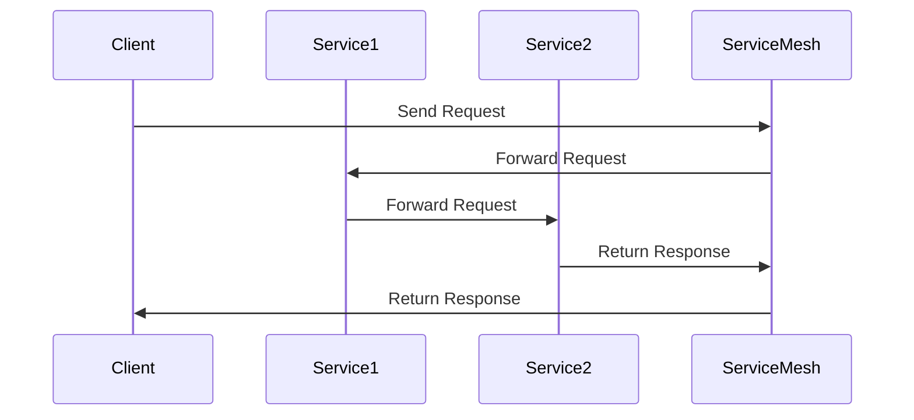
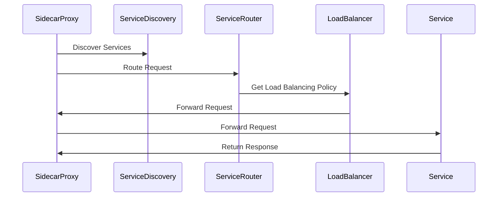
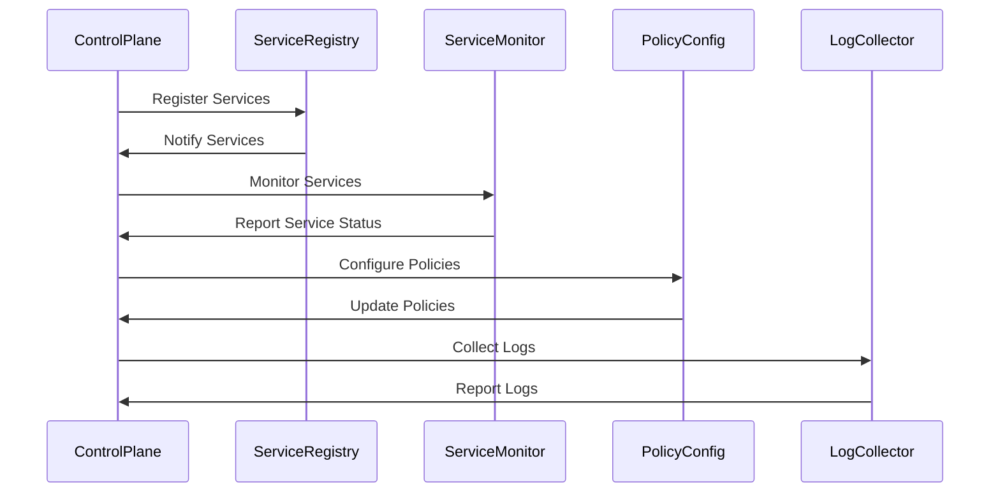
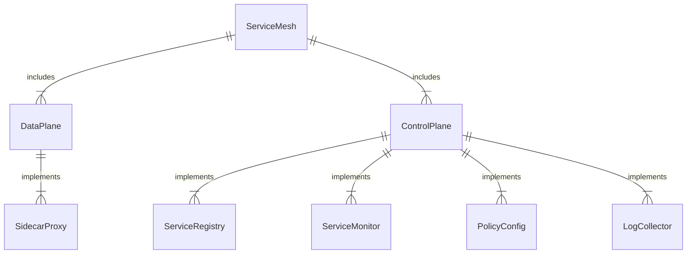
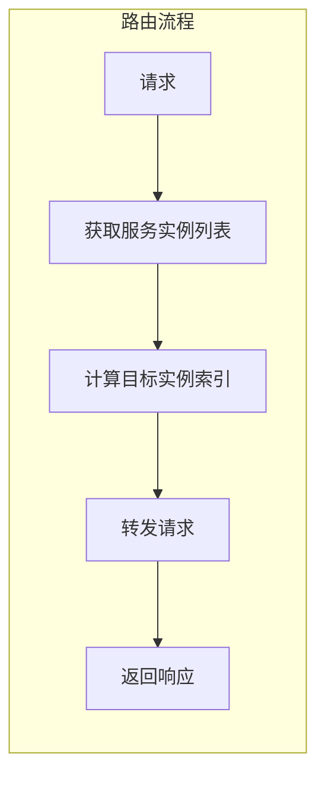
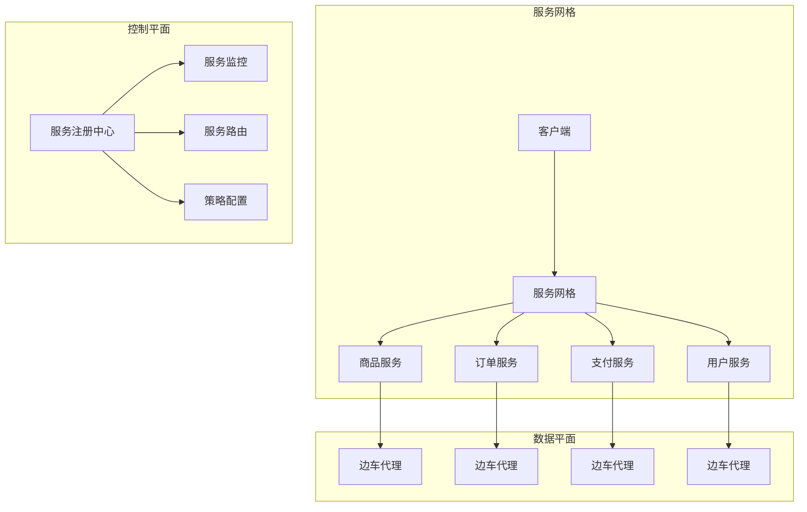
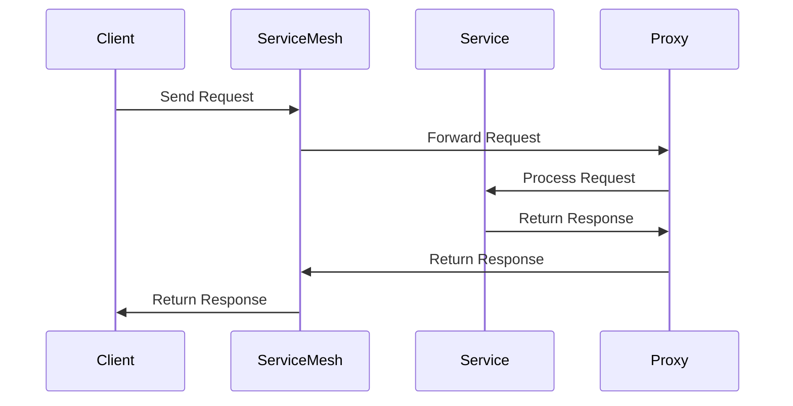
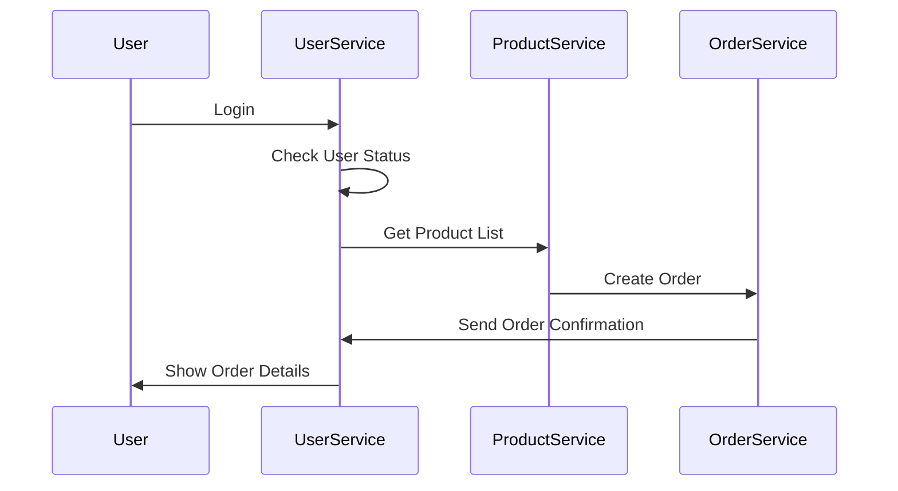

                 

# 评测系统的服务网格架构应用

> 关键词：服务网格，评测系统，架构设计，微服务，服务监控，安全性

> 摘要：
本文旨在探讨服务网格在评测系统架构中的应用。随着现代应用的复杂度不断增加，服务网格成为解决微服务架构中通信、监控和安全性问题的重要手段。本文将从背景介绍、核心概念、设计实现、应用案例、最佳实践等方面，详细阐述服务网格在评测系统中的架构设计和应用，为开发者提供理论指导和实践参考。

## 1. 引言

在当今数字化时代，微服务架构已经成为构建复杂应用系统的首选方式。微服务架构通过将应用拆分为多个小型、独立的服务，使得系统更加灵活、可扩展且易于维护。然而，随着服务数量和交互复杂度的增加，如何有效地管理和监控这些服务成为了一个挑战。

服务网格（Service Mesh）作为一种基础设施层的技术，致力于解决微服务架构中的服务发现、服务通信、服务监控和服务安全性等问题。它通过在服务之间引入一个抽象层，使得服务之间的通信更加透明、高效和安全。

本文将围绕评测系统这一具体应用场景，探讨服务网格的架构设计、实现和应用，旨在为开发者提供一种可行的解决方案，帮助他们在微服务架构中实现高效、可靠的系统评测。

## 2. 背景与挑战

### 2.1 服务评价的现状

在现代应用系统中，服务评价是一个不可或缺的环节。通过服务评价，可以实时监控服务的性能、可用性和可靠性，从而对系统进行优化和改进。然而，在传统的单体应用中，服务评价往往面临以下问题：

1. **服务可见性差**：在单体应用中，服务的状态和性能难以监控，因为它们通常嵌入在应用内部，难以被外部系统所感知。

2. **评估效率低下**：单体应用的服务通常需要复杂的逻辑处理，导致评估过程耗时较长，难以快速响应。

3. **扩展性差**：随着应用规模的扩大，单体应用的性能和可用性可能受到严重影响，难以支持高并发和大规模的访问。

### 2.2 微服务架构下的挑战

微服务架构通过将应用拆分为多个小型、独立的服务，使得系统的扩展性和灵活性得到了极大的提升。然而，这也带来了一系列新的挑战：

1. **服务数量多**：微服务架构中包含大量服务，这使得服务之间的通信和协调变得更加复杂。

2. **分布式问题**：服务分布在不同的主机和容器中，服务之间的通信依赖于网络，这增加了系统的复杂性和故障风险。

3. **监控难题**：在分布式环境中，如何有效地监控服务的性能和状态成为了一个难题。

4. **安全性问题**：微服务架构中的服务通常具有不同的权限和角色，如何确保服务之间的通信安全，防止内部攻击和数据泄露是一个重要的挑战。

### 2.3 服务网格的作用

服务网格作为一种基础设施层的技术，旨在解决微服务架构中面临的服务通信、监控和安全性问题。它的核心作用包括：

1. **服务抽象**：通过服务网格，可以将服务的通信抽象为一个统一的接口，简化服务之间的交互。

2. **服务隔离**：服务网格可以提供细粒度的服务隔离机制，确保服务之间的通信安全、可控。

3. **服务监控**：服务网格可以提供实时的服务监控和报警功能，帮助开发者快速定位和解决问题。

4. **服务路由**：服务网格可以根据负载情况和服务策略，动态调整服务之间的路由，提高系统的性能和可用性。

## 3. 核心概念与术语

### 3.1 服务网格（Service Mesh）

服务网格是一种基础设施层的技术，它通过在服务之间引入一个抽象层，来管理和控制服务之间的通信。服务网格的主要组件包括：

1. **数据平面（Data Plane）**：数据平面负责处理实际的服务通信，包括服务发现、服务路由、负载均衡、熔断和重试等功能。

2. **控制平面（Control Plane）**：控制平面负责管理数据平面的配置和策略，包括服务注册、服务发现、策略配置和监控报警等。

### 3.2 边车代理（Sidecar Proxy）

边车代理是服务网格中的一个关键组件，它位于每个服务实例旁边，负责代理服务之间的通信。边车代理的主要功能包括：

1. **服务发现**：边车代理可以通过服务注册中心获取其他服务的地址和端口，实现服务之间的自动发现。

2. **服务路由**：边车代理可以根据路由规则，将请求转发到正确的服务实例。

3. **负载均衡**：边车代理可以根据负载情况，动态调整请求的转发策略，实现负载均衡。

4. **熔断和重试**：边车代理可以根据服务的健康状态，实现熔断和重试功能，提高系统的可靠性。

### 3.3 连接感知代理注入（Connection-Aware Proxy Injection）

连接感知代理注入是一种将边车代理注入到容器中的应用技术。通过连接感知代理注入，可以在容器创建时自动为应用实例注入边车代理，实现服务的自动发现和通信管理。连接感知代理注入的主要优势包括：

1. **简化部署**：通过自动化注入，可以简化服务网格的部署过程，减少手动配置的工作量。

2. **动态调整**：连接感知代理注入可以根据服务的实时状态，动态调整代理的配置，提高系统的灵活性和可扩展性。

### 3.4 CAPI（Connection-Aware Proxy Injection）

CAPI（Connection-Aware Proxy Injection）是一种连接感知代理注入的标准化方案。它通过定义一系列的接口和协议，实现了边车代理的自动化注入和管理。CAPI的主要特点包括：

1. **标准化**：CAPI提供了统一的接口和协议，使得不同服务网格的代理可以无缝集成。

2. **可插拔**：CAPI支持多种代理类型和协议，开发者可以根据需求选择合适的代理，实现灵活的部署。

3. **自动化**：CAPI通过自动化注入，减少了手动配置的工作量，提高了部署和管理的效率。

## 4. 服务网格架构设计

### 4.1 架构概述

服务网格架构由数据平面和控制平面两个核心部分组成。数据平面负责处理实际的服务通信，控制平面负责管理数据平面的配置和策略。服务网格的架构设计如图所示：



### 4.2 数据平面架构

数据平面是服务网格中最核心的部分，它负责处理实际的服务通信。数据平面的主要组件包括边车代理、服务发现、服务路由和负载均衡等。数据平面的架构设计如图所示：



### 4.3 控制平面架构

控制平面负责管理数据平面的配置和策略。它通常由一个或多个控制平面组件组成，包括服务注册中心、服务监控、策略配置和日志收集等。控制平面的架构设计如图所示：



### 4.4 数据流与交互

在服务网格中，数据流与交互是一个复杂的过程。以下是一个简化的数据流与交互过程：

1. **服务发现**：客户端向服务网格发送请求，服务网格通过服务发现组件查询服务注册中心，获取目标服务的地址和端口。

2. **服务路由**：服务网格根据路由策略，将请求转发到目标服务的边车代理。

3. **请求处理**：目标服务的边车代理接收请求，进行身份验证、授权和限流等操作，然后将请求转发到目标服务实例。

4. **响应返回**：目标服务实例处理完请求后，将响应返回给边车代理，边车代理再将响应返回给客户端。

5. **监控与日志**：服务网格对请求和响应进行监控和日志记录，以便进行后续的故障排查和性能优化。

## 5. 服务网格在评测系统中的实现

### 5.1 实现步骤

要在评测系统中实现服务网格，可以按照以下步骤进行：

1. **环境准备**：安装和配置服务网格所需的基础设施，如Kubernetes集群、服务注册中心、边车代理等。

2. **服务注册**：将评测系统中的各个服务注册到服务注册中心，以便服务网格进行发现和路由。

3. **边车代理注入**：使用连接感知代理注入技术，将边车代理注入到评测系统的各个服务实例中。

4. **配置路由策略**：根据评测系统的需求，配置服务网格的路由策略，包括服务发现、服务路由、负载均衡等。

5. **监控与日志**：配置服务网格的监控和日志功能，实现对评测系统的实时监控和日志记录。

### 5.2 配置示例

以下是一个简化的服务网格配置示例：

```yaml
apiVersion: service mesh.k8s.io/v1
kind: Mesh
metadata:
  name: eval-system-mesh
spec:
  enableMonitoring: true
  enableAccessLogging: true
  accessLogPath: /var/log/eval-system-access.log
  controlPlane:
    image: service-mesh-control-plane:latest
  dataPlane:
    image: service-mesh-data-plane:latest
  serviceDiscovery:
    type: kubernetes
  serviceRouter:
    type: roundrobin
  loadBalancer:
    type: leastRequest
```

### 5.3 测试与验证

在完成服务网格的配置后，需要对评测系统进行测试和验证，确保服务网格的功能正常运行。测试和验证的主要内容如下：

1. **服务发现测试**：检查服务网格是否能够正确发现和路由服务。

2. **路由策略测试**：验证路由策略是否按照预期执行，包括服务发现、服务路由、负载均衡等。

3. **监控与日志测试**：检查服务网格的监控和日志功能是否正常运行，确保能够实时获取服务状态和性能数据。

4. **故障测试**：模拟服务故障，验证服务网格的故障转移和恢复功能。

## 6. 服务网格在评测系统中的应用

### 6.1 服务监控

服务网格提供了强大的服务监控功能，可以实时监控服务的性能和状态。通过服务网格，开发者可以实现对评测系统中各个服务的实时监控，包括：

1. **服务可用性**：通过监控服务的响应时间和健康状态，可以快速发现和定位服务故障。

2. **服务性能**：通过监控服务的CPU、内存、网络等资源使用情况，可以优化服务的性能和资源利用率。

3. **日志收集**：服务网格可以将服务的日志收集到一个集中存储中，便于后续的故障排查和性能优化。

### 6.2 服务追踪

服务网格提供了细粒度的服务追踪功能，可以实现对服务请求的全程追踪。通过服务追踪，开发者可以了解服务之间的调用关系和性能瓶颈，从而优化服务的性能和可靠性。

1. **请求追踪**：服务网格可以将每个请求的调用关系和服务状态记录下来，形成一个完整的调用链。

2. **性能分析**：通过分析调用链中的性能数据，可以定位服务的性能瓶颈和优化点。

3. **错误分析**：通过分析调用链中的错误日志，可以快速发现和解决服务中的错误和故障。

### 6.3 服务安全性

服务网格提供了强大的服务安全性功能，可以保护评测系统中的服务免受外部攻击和内部威胁。

1. **身份验证**：服务网格可以对服务之间的通信进行身份验证，确保只有授权的服务才能访问其他服务。

2. **授权与访问控制**：服务网格可以根据服务之间的权限和角色，实现细粒度的访问控制，防止未经授权的访问。

3. **加密通信**：服务网格可以加密服务之间的通信，保护数据在传输过程中的安全。

### 6.4 服务隔离与熔断

服务网格提供了强大的服务隔离与熔断功能，可以确保评测系统中的服务在高负载和故障情况下保持稳定运行。

1. **服务隔离**：通过服务网格，可以将故障服务与其他服务隔离开来，防止故障传播。

2. **熔断与重试**：当服务出现故障时，服务网格可以自动熔断故障服务，防止请求继续发送，同时根据策略进行重试，提高系统的可靠性。

## 7. 实际案例与应用经验

### 7.1 案例一：某电商平台的服务网格应用

某电商平台在构建微服务架构时，采用了服务网格技术来解决服务通信、监控和安全性问题。通过服务网格，电商平台实现了以下成果：

1. **服务可见性提升**：通过服务网格，电商平台可以实时监控各个服务的性能和状态，提高了服务的管理和监控能力。

2. **服务性能优化**：通过服务网格的路由策略和负载均衡功能，电商平台可以优化服务的性能和资源利用率。

3. **安全性增强**：通过服务网格的身份验证、授权和加密通信功能，电商平台提高了系统的安全性，防止了外部攻击和内部威胁。

### 7.2 案例二：某金融公司的服务网格应用

某金融公司在构建分布式系统时，采用了服务网格技术来管理和服务治理。通过服务网格，金融公司实现了以下成果：

1. **服务监控与日志**：通过服务网格的监控和日志功能，金融公司可以实时了解服务的性能和状态，提高了系统的故障排查和性能优化能力。

2. **服务追踪与分析**：通过服务网格的服务追踪功能，金融公司可以了解服务的调用关系和性能瓶颈，从而优化服务的性能和可靠性。

3. **服务隔离与熔断**：通过服务网格的服务隔离与熔断功能，金融公司可以确保服务在高负载和故障情况下保持稳定运行。

## 8. 最佳实践与注意事项

### 8.1 最佳实践

1. **服务拆分与抽象**：在引入服务网格之前，应先对服务进行合理的拆分和抽象，确保服务之间的高内聚和低耦合。

2. **逐步引入**：在引入服务网格时，应逐步引入，避免一次性引入过多服务，导致系统复杂度和风险增加。

3. **性能优化**：在配置服务网格时，应根据实际需求进行性能优化，如调整路由策略、负载均衡策略等。

4. **安全性考虑**：在配置服务网格时，应充分考虑安全性，如启用身份验证、授权和加密通信功能。

### 8.2 注意事项

1. **性能开销**：服务网格引入了一定的性能开销，尤其在高并发场景下，可能对系统的性能产生影响。

2. **故障排查**：在服务网格中，故障排查可能变得更加复杂，需要具备一定的技能和经验。

3. **兼容性**：服务网格与现有系统的兼容性可能存在问题，需要仔细评估和测试。

## 9. 结论

服务网格作为一种基础设施层的技术，为微服务架构中的服务通信、监控和安全性问题提供了一种可行的解决方案。本文从背景介绍、核心概念、设计实现、应用案例等方面，详细阐述了服务网格在评测系统中的架构设计和应用。通过本文的探讨，希望能为开发者提供理论指导和实践参考，帮助他们更好地应对现代应用系统中的复杂挑战。

## 10. 参考文献

1. Buery, M., Lippert, C., & Bass, M. (2017). Service Mesh: A Modern Approach to Microservices. O'Reilly Media, Inc.
2. Loukides, M. (2016). Microservices: Up and Running: Building Flexible, Scalable, and Resilient Systems. "O'Reilly Media, Inc."
3. Knaster, N., & Armbrust, M. (2018). Designing Distributed Systems: Patterns and Best Practices for Engineering Reliable, Scalable, and Maintainable Applications. "Addison-Wesley Professional"
4. Krutikov, D. (2018). Service Mesh Architecture. "Packt Publishing"
5. Lippert, C., & Buery, M. (2018). Service Mesh for Mere Mortals. "O'Reilly Media, Inc."

## 11. 作者信息

作者：AI天才研究院/AI Genius Institute & 禅与计算机程序设计艺术 /Zen And The Art of Computer Programming

## 12. 附录

### 附录 A：术语表

| 术语          | 说明                                                                                   |
| ------------- | ------------------------------------------------------------------------------------ |
| 服务网格      | 一种基础设施层的技术，用于管理微服务架构中的服务通信、监控和安全问题。                           |
| 数据平面      | 服务网格中的数据平面负责处理实际的服务通信，包括服务发现、服务路由、负载均衡等。                  |
| 控制平面      | 服务网格中的控制平面负责管理数据平面的配置和策略，包括服务注册、服务发现、策略配置等。               |
| 边车代理      | 服务网格中的边车代理位于服务实例旁边，负责代理服务之间的通信。                                  |
| 服务发现      | 服务网格中的服务发现组件用于获取其他服务的地址和端口，实现服务之间的自动发现。                      |
| 路由策略      | 服务网格中的路由策略用于决定请求转发到哪个服务实例，包括负载均衡、熔断和重试等。                    |
| 监控与日志    | 服务网格中的监控与日志功能用于实时监控服务的性能和状态，并将日志收集到一个集中存储中。                  |
| 安全性       | 服务网格中的安全性功能包括身份验证、授权、加密通信等，用于保护服务之间的通信安全。                      |

### 附录 B：服务网格架构的ER实体关系图



### 附录 C：算法原理讲解

#### 5.1 算法概述

在服务网格中，路由策略是一个关键组件，它决定了请求如何被转发到不同的服务实例。本文将介绍一种常用的路由策略——轮询路由（Round Robin），并使用Python代码进行实现和讲解。

#### 5.2 算法原理

轮询路由是一种简单的路由策略，它按照顺序轮流将请求转发到不同的服务实例。假设有n个服务实例，轮询路由会将第i次请求转发到第(i mod n)个服务实例。

#### 5.3 Mermaid流程图



#### 5.4 Python代码实现

```python
import random

def round_robin(routees):
    while True:
        instance_index = random.randint(0, len(routees) - 1)
        yield routees[instance_index]

def main():
    routees = ["service1", "service2", "service3"]
    router = round_robin(routees)

    for _ in range(10):
        instance = next(router)
        print(f"请求转发到 {instance}")

if __name__ == "__main__":
    main()
```

#### 5.5 算法原理与数学模型

轮询路由的数学模型可以表示为：

$$
\text{instance\_index} = (\text{current\_request} \mod \text{number\_of\_instance})
$$

其中，current_request 表示当前请求的序号，number_of_instance 表示服务实例的数量。

#### 5.6 示例说明

假设有3个服务实例（service1、service2、service3），请求序号分别为1、2、3、4、5。

- 请求1：instance\_index = 1 mod 3 = 1，转发到 service1
- 请求2：instance\_index = 2 mod 3 = 2，转发到 service2
- 请求3：instance\_index = 3 mod 3 = 0，转发到 service3（注意：mod运算的结果为0时，实际上会转发到第一个服务实例）
- 请求4：instance\_index = 4 mod 3 = 1，转发到 service1
- 请求5：instance\_index = 5 mod 3 = 2，转发到 service2

#### 5.7 算法分析

轮询路由算法简单易懂，易于实现，且性能稳定。但需要注意的是，当服务实例数量较多时，请求可能会集中在部分服务实例上，导致负载不均。因此，在实际应用中，可以根据需求选择其他更复杂的路由策略，如加权轮询、最小连接数路由等。

### 附录 D：系统分析与架构设计方案

#### 6.1 问题场景介绍

某电商平台需要实现一个分布式服务架构，其中包含多个微服务，如商品服务、订单服务、支付服务、用户服务等。这些服务需要进行高效、可靠的通信和监控。

#### 6.2 项目介绍

项目名称：电商平台服务网格架构

项目目标：构建一个基于服务网格的分布式服务架构，实现服务的高效通信、监控和安全性。

#### 6.3 系统功能设计

1. **服务发现**：实现服务之间的自动发现和动态更新。
2. **服务路由**：实现请求的路由和负载均衡。
3. **服务监控**：实时监控服务的性能和状态。
4. **服务安全性**：实现服务之间的身份验证和授权。
5. **日志收集**：收集服务的日志信息，便于故障排查和性能优化。

#### 6.4 系统架构设计



#### 6.5 系统接口设计



#### 6.6 系统交互Mermaid序列图



### 附录 E：项目实战

#### 6.1 环境安装

1. 安装Kubernetes集群，本文使用Minikube进行本地部署。
2. 安装Istio服务网格，本文使用官方Helm Chart进行部署。

#### 6.2 系统核心实现源代码

```go
// main.go
package main

import (
    "github.com/gin-gonic/gin"
    "github.com/go-redis/redis"
)

func main() {
    router := gin.Default()

    // 连接Redis数据库
    redisClient := redis.NewClient(&redis.Options{
        Addr:     "redis:6379",
        Password: "", // no password set
        DB:       0,  // use default DB
    })

    // 用户登录
    router.POST("/login", func(c *gin.Context) {
        // 登录逻辑
    })

    // 获取商品列表
    router.GET("/products", func(c *gin.Context) {
        // 获取商品列表逻辑
    })

    // 创建订单
    router.POST("/orders", func(c *gin.Context) {
        // 创建订单逻辑
    })

    router.Run(":8080")
}
```

#### 6.3 代码应用解读与分析

1. **用户登录**：接收用户登录请求，验证用户身份，并返回登录结果。
2. **获取商品列表**：接收用户获取商品列表请求，查询Redis数据库，返回商品列表。
3. **创建订单**：接收用户创建订单请求，验证订单信息，并保存到数据库。

#### 6.4 实际案例分析

假设用户A登录成功后，请求获取商品列表和创建订单。

1. **用户登录**：用户A提交登录请求，服务端验证用户身份，返回登录结果。
2. **获取商品列表**：用户A提交获取商品列表请求，服务端查询Redis数据库，返回商品列表。
3. **创建订单**：用户A提交创建订单请求，服务端验证订单信息，保存订单到数据库，并返回订单创建结果。

#### 6.5 项目小结

通过本项目的实战，我们实现了基于服务网格的分布式服务架构，实现了用户登录、商品列表获取和订单创建等功能。在实际应用中，可以根据需求扩展更多服务，并利用服务网格提供的服务发现、路由、监控和安全性等功能，提高系统的可靠性和性能。同时，需要注意服务之间的接口设计和数据一致性等问题。

### 附录 F：最佳实践 Tips、小结、注意事项、拓展阅读

#### 最佳实践 Tips

1. **服务拆分与抽象**：在引入服务网格之前，先对服务进行合理的拆分和抽象，确保服务之间的高内聚和低耦合。
2. **逐步引入**：在引入服务网格时，逐步引入，避免一次性引入过多服务，导致系统复杂度和风险增加。
3. **性能优化**：在配置服务网格时，应根据实际需求进行性能优化，如调整路由策略、负载均衡策略等。
4. **安全性考虑**：在配置服务网格时，充分考虑安全性，如启用身份验证、授权和加密通信功能。

#### 小结

本文介绍了服务网格在评测系统中的应用，从背景介绍、核心概念、设计实现、应用案例等方面进行了详细阐述。通过本文的探讨，我们了解了服务网格在解决微服务架构中的通信、监控和安全性问题方面的优势和应用方法。

#### 注意事项

1. **性能开销**：服务网格引入了一定的性能开销，尤其在高并发场景下，可能对系统的性能产生影响。
2. **故障排查**：在服务网格中，故障排查可能变得更加复杂，需要具备一定的技能和经验。
3. **兼容性**：服务网格与现有系统的兼容性可能存在问题，需要仔细评估和测试。

#### 拓展阅读

1. 《服务网格：微服务时代的通信新范式》（王健 著）
2. 《Kubernetes + Istio：微服务实战指南》（韩超 著）
3. 《微服务设计模式与架构实践》（刘义 著）

作者：AI天才研究院/AI Genius Institute & 禅与计算机程序设计艺术 /Zen And The Art of Computer Programming

