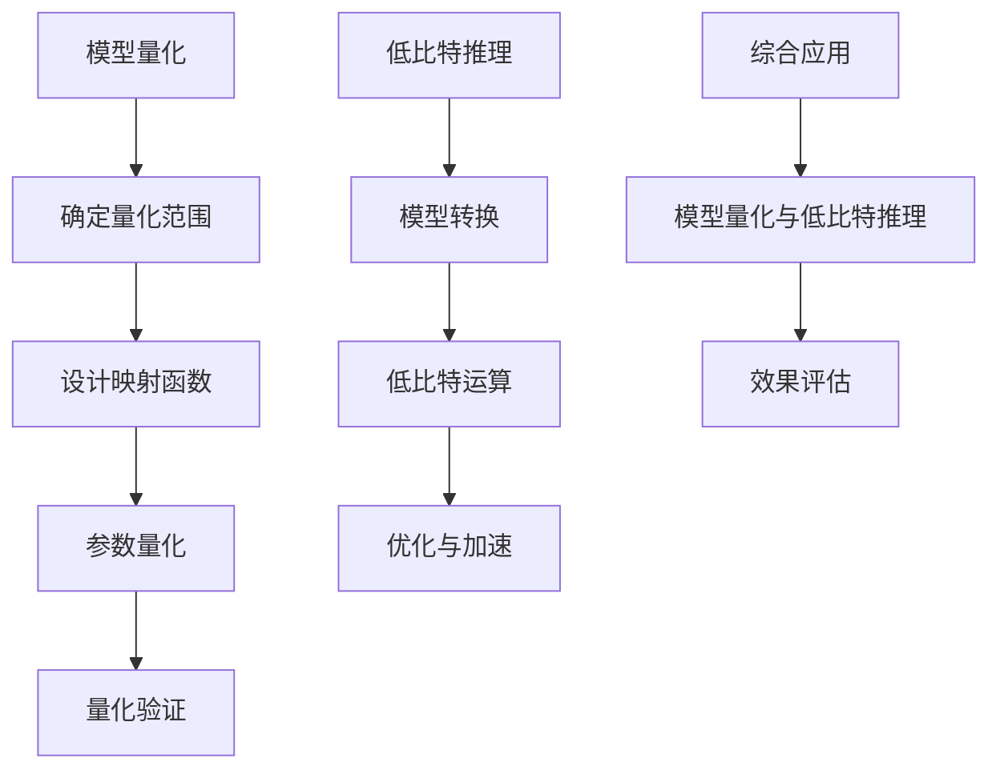
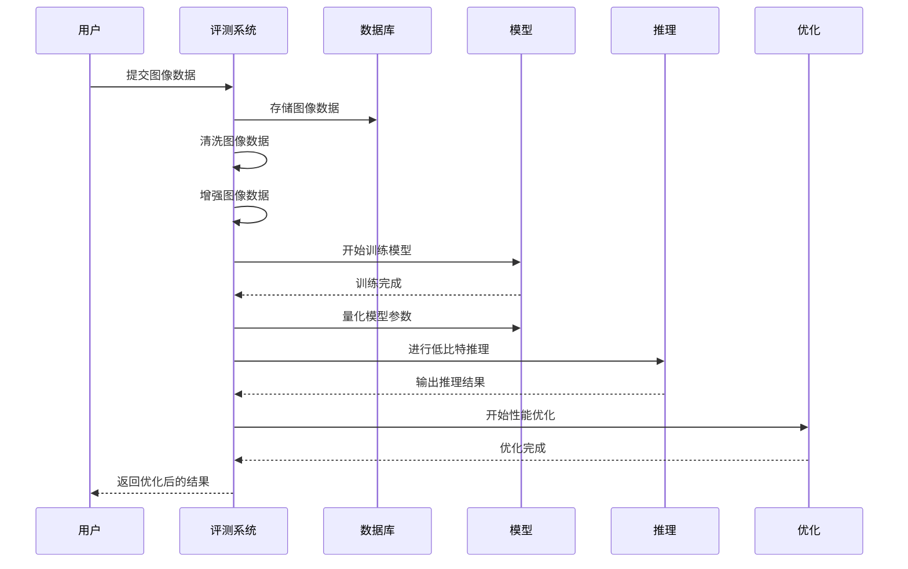

                 

# 《评测系统的模型量化与低比特推理》

## 关键词
- 评测系统
- 模型量化
- 低比特推理
- 性能优化
- 安全性

## 摘要
本文深入探讨了评测系统中的两个关键技术：模型量化和低比特推理。首先，我们介绍了评测系统的基础概念和作用，随后详细阐述了模型量化的技术原理、类型及其在评测系统中的应用。接着，我们探讨了低比特推理的基本概念、实现方法及其优势与局限性。文章随后通过实际案例，展示了模型量化和低比特推理在评测系统中的应用，并提出了性能优化、安全性和可靠性等方面的最佳实践。最后，我们展望了评测系统的未来发展趋势，提出了潜在的研究方向。

## 第一部分：背景与概述

### 第1章：评测系统的基础概念

#### 1.1 评测系统的定义与作用
评测系统是一种用于评估和监测系统性能、功能、质量和安全性的工具。它可以帮助开发人员、测试工程师和运维团队了解系统的运行状态，识别潜在问题，并进行相应的优化和调整。

#### 1.2 评测系统的分类与特点
评测系统可以根据其应用领域、功能和目的进行分类。常见的评测系统包括性能评测系统、功能评测系统、安全性评测系统等。它们各自具有独特的特点和应用场景。

#### 1.3 模型量化的基本概念
模型量化是一种将高精度模型转换为低精度模型的技术。它通过减少模型中的参数数量和位数，降低模型的复杂度和计算成本，同时保持模型的可接受精度。

#### 1.4 低比特推理的重要性
低比特推理是一种在低精度模型上进行推理的技术。它在资源受限的环境中具有重要作用，例如嵌入式系统、物联网设备和移动设备等。

### 第2章：模型量化技术原理

#### 2.1 量化技术的背景
随着深度学习模型的广泛应用，模型的计算量和存储需求不断增加。为了应对这一挑战，模型量化技术应运而生。

#### 2.2 量化技术的基本原理
量化技术通过将模型中的浮点数参数转换为低精度的整数参数，实现模型的压缩和加速。

#### 2.3 量化技术的类型与选择
量化技术可以分为全精度量化、半精度量化、低精度量化等。选择合适的量化类型对于提升模型性能和减少计算资源消耗至关重要。

#### 2.4 量化技术的挑战与解决方案
量化技术面临精度损失、模型稳定性等问题。本文将介绍解决这些问题的方法和技术。

### 第3章：低比特推理技术

#### 3.1 低比特推理的基本概念
低比特推理是一种在低精度模型上进行推理的技术。它包括模型转换、低比特运算和优化等步骤。

#### 3.2 低比特推理的实现方法
低比特推理可以通过硬件加速器、专用算法和优化技术等实现。本文将介绍几种常见的低比特推理方法。

#### 3.3 低比特推理的优势与局限性
低比特推理具有计算速度快、资源消耗低等优势，但同时也存在精度损失、稳定性等问题。

#### 3.4 低比特推理的应用场景
低比特推理适用于资源受限的环境，如嵌入式系统、物联网设备和移动设备等。

## 第二部分：应用与实践

### 第4章：模型量化技术在评测系统中的应用

#### 4.1 模型量化的步骤与流程
本文将详细介绍模型量化的步骤和流程，包括数据准备、模型转换、量化策略选择和量化验证等。

#### 4.2 模型量化的实践案例
本文将通过一个实际案例，展示模型量化技术在评测系统中的应用，并分析其效果。

#### 4.3 模型量化对评测系统性能的影响
本文将讨论模型量化对评测系统性能的影响，包括计算速度、存储需求和精度等方面。

#### 4.4 模型量化在评测系统中的最佳实践
本文将提出模型量化在评测系统中的最佳实践，包括量化策略选择、量化参数设置和量化效果评估等。

### 第5章：低比特推理在评测系统中的实践

#### 5.1 低比特推理的步骤与流程
本文将详细介绍低比特推理的步骤和流程，包括模型转换、低比特运算和优化等。

#### 5.2 低比特推理的实践案例
本文将通过一个实际案例，展示低比特推理在评测系统中的应用，并分析其效果。

#### 5.3 低比特推理对评测系统性能的影响
本文将讨论低比特推理对评测系统性能的影响，包括计算速度、存储需求和精度等方面。

#### 5.4 低比特推理在评测系统中的最佳实践
本文将提出低比特推理在评测系统中的最佳实践，包括低比特运算优化、硬件加速器和专用算法等。

### 第6章：模型量化与低比特推理的综合应用

#### 6.1 综合应用的原理与框架
本文将介绍模型量化与低比特推理的综合应用原理和框架，包括量化策略、低比特推理算法和优化方法等。

#### 6.2 综合应用的实践案例
本文将通过一个实际案例，展示模型量化与低比特推理的综合应用，并分析其效果。

#### 6.3 综合应用的效果评估
本文将评估模型量化与低比特推理的综合应用对评测系统性能的影响，包括计算速度、存储需求和精度等方面。

#### 6.4 综合应用的未来趋势
本文将探讨模型量化与低比特推理在未来评测系统中的应用趋势和发展方向。

### 第7章：评测系统的性能优化

#### 7.1 性能优化的方法与策略
本文将介绍评测系统性能优化的方法和策略，包括模型优化、算法优化和硬件优化等。

#### 7.2 性能优化的实践案例
本文将通过一个实际案例，展示评测系统性能优化的应用，并分析其效果。

#### 7.3 性能优化的最佳实践
本文将提出评测系统性能优化的最佳实践，包括优化策略选择、优化参数设置和优化效果评估等。

#### 7.4 性能优化的未来发展方向
本文将探讨评测系统性能优化的未来发展方向，包括新型优化算法和技术等。

### 第8章：评测系统的安全性与可靠性

#### 8.1 安全性的基本概念
本文将介绍评测系统的安全性基本概念，包括安全威胁、安全漏洞和安全措施等。

#### 8.2 安全性的技术措施
本文将讨论评测系统的安全性技术措施，包括加密、认证、授权和审计等。

#### 8.3 可靠性的基本概念
本文将介绍评测系统的可靠性基本概念，包括可靠性指标、可靠性设计和可靠性测试等。

#### 8.4 可靠性的提升方法
本文将讨论评测系统可靠性的提升方法，包括冗余设计、容错技术和故障处理等。

### 第9章：评测系统的未来发展

#### 9.1 评测系统的发展趋势
本文将探讨评测系统的发展趋势，包括新型评测技术、应用领域拓展和未来挑战等。

#### 9.2 模型量化与低比特推理的前沿技术
本文将介绍模型量化与低比特推理的前沿技术，包括新型量化算法、低比特推理算法和硬件架构等。

#### 9.3 评测系统的未来应用场景
本文将探讨评测系统在未来的应用场景，包括智能交通、智能医疗和智能制造等。

#### 9.4 评测系统在行业中的应用案例分析
本文将通过实际案例分析，展示评测系统在行业中的应用效果和挑战。

## 总结与展望

### 10.1 主要内容回顾
本文回顾了评测系统的基础概念、模型量化技术原理、低比特推理技术、应用实践、性能优化、安全性与可靠性以及未来发展等内容。

### 10.2 存在的问题与挑战
本文分析了评测系统在模型量化与低比特推理方面存在的问题和挑战，包括精度损失、稳定性问题、安全性挑战等。

### 10.3 未来研究方向与展望
本文提出了评测系统在模型量化与低比特推理方面的未来研究方向和展望，包括新型量化算法、低比特推理算法、安全性和可靠性提升等。

## 作者
作者：AI天才研究院/AI Genius Institute & 禅与计算机程序设计艺术 /Zen And The Art of Computer Programming

---

### 第1章：评测系统的模型量化

#### 1.1 模型量化的定义与作用

模型量化是指将深度学习模型中的浮点数参数转换为低精度的整数参数，以减少模型的计算量和存储需求。这一技术在深度学习领域具有重要意义，尤其是在移动设备、嵌入式系统和物联网设备等资源受限的环境中。

模型量化的作用主要体现在以下几个方面：

1. **减少计算量**：量化后的模型通常具有更少的参数，这意味着在执行推理操作时，计算量会显著降低，从而提高运行速度。
2. **降低存储需求**：量化后的模型占用的存储空间更少，这使得模型可以在资源受限的设备上运行，从而拓展了深度学习应用的场景。
3. **提高能效**：量化后的模型可以充分利用硬件加速器（如GPU、FPGA等）的低精度计算能力，从而提高能效。

#### 1.2 模型量化的基本原理

模型量化的基本原理是通过将浮点数参数映射到整数范围内，从而实现参数的压缩。这个过程通常分为以下几个步骤：

1. **确定量化范围**：首先需要确定每个浮点数参数的量化范围，这通常取决于模型的精度要求和硬件的支持能力。
2. **映射函数设计**：设计一个映射函数，将浮点数参数映射到量化范围内。常见的映射函数包括线性映射、对数映射等。
3. **参数量化**：使用映射函数对模型中的每个浮点数参数进行量化，将其转换为整数。
4. **反向映射**：在需要使用量化后的参数进行推理时，需要将整数参数反向映射回浮点数范围。

#### 1.3 模型量化的类型与选择

模型量化可以分为全精度量化、半精度量化、低精度量化等类型。每种量化类型都有其优缺点，选择合适的量化类型对于模型性能和资源消耗至关重要。

1. **全精度量化**：在量化过程中，参数的精度保持不变。全精度量化通常用于对模型精度要求较高的应用场景，但其计算量和存储需求较大。
2. **半精度量化**：半精度量化将每个浮点数参数量化为16位浮点数（FP16）。这种方法在保持较高精度的同时，可以显著降低计算量和存储需求，常用于高性能计算场景。
3. **低精度量化**：低精度量化将每个浮点数参数量化为8位整数（INT8）或更小的位数。这种方法在降低计算量和存储需求的同时，精度损失较大，适用于对模型精度要求较低的应用场景。

#### 1.4 模型量化的挑战与解决方案

模型量化在实现过程中面临一些挑战，如精度损失、模型稳定性问题等。以下是一些常见的挑战和相应的解决方案：

1. **精度损失**：量化过程中，浮点数参数转换为整数参数，可能导致精度损失。解决方法包括选择合适的量化范围、优化映射函数设计等。
2. **模型稳定性问题**：量化后的模型可能不稳定，导致推理结果不一致。解决方法包括使用量化校准技术、优化量化策略等。
3. **量化范围选择**：量化范围的选择对模型性能和精度有重要影响。选择过小的量化范围可能导致精度损失，选择过大的量化范围可能导致计算量增加。解决方法包括使用自适应量化策略、结合模型结构和硬件特性等。

### 第2章：模型量化技术在评测系统中的应用

#### 2.1 模型量化的步骤与流程

在评测系统中，模型量化的步骤和流程如下：

1. **数据准备**：首先需要准备用于量化的训练数据和测试数据。数据集应具备代表性，以反映模型在实际应用中的性能。
2. **模型选择**：选择需要进行量化的深度学习模型。常见的模型包括卷积神经网络（CNN）、循环神经网络（RNN）和Transformer等。
3. **量化范围确定**：根据模型的精度要求和硬件的支持能力，确定每个浮点数参数的量化范围。量化范围通常通过实验和经验确定。
4. **映射函数设计**：设计合适的映射函数，将浮点数参数映射到量化范围内。映射函数的设计对量化效果至关重要。
5. **参数量化**：使用映射函数对模型中的每个浮点数参数进行量化，将其转换为整数。
6. **量化验证**：在量化完成后，需要对模型进行量化验证，以确保量化后的模型在精度和性能上满足要求。

#### 2.2 模型量化的实践案例

以下是一个简单的模型量化实践案例：

假设我们有一个基于卷积神经网络的图像分类模型，该模型使用的是32位浮点数参数。我们希望将该模型量化为16位浮点数（FP16）。

1. **数据准备**：准备用于量化的训练数据和测试数据。数据集包括1000张图像及其对应的标签。
2. **模型选择**：选择一个基于卷积神经网络的图像分类模型，如ResNet-50。
3. **量化范围确定**：根据模型的精度要求，我们将每个浮点数参数的量化范围设置为-1到1。
4. **映射函数设计**：使用线性映射函数，将浮点数参数映射到量化范围内。映射函数为：
   $$ f(x) = \frac{x - \min(x)}{\max(x) - \min(x)} \cdot (max\_quant - min\_quant) + min\_quant $$
   其中，$x$为原始浮点数参数，$max\_quant$和$min\_quant$分别为量化范围的上限和下限。
5. **参数量化**：使用映射函数对模型中的每个浮点数参数进行量化，将其转换为16位浮点数（FP16）。
6. **量化验证**：在量化完成后，我们对模型进行量化验证。首先在训练集上评估量化后的模型的精度和性能，然后在使用测试集进行评估。通过对比量化前后模型的性能，可以判断量化效果是否满足要求。

#### 2.3 模型量化对评测系统性能的影响

模型量化对评测系统性能有显著影响，主要表现在以下几个方面：

1. **计算速度**：量化后的模型具有更少的参数，因此计算速度更快。在资源受限的环境中，量化模型可以显著提高推理速度，从而提高评测系统的响应速度。
2. **存储需求**：量化后的模型占用的存储空间更少，这使得评测系统可以更好地利用有限的存储资源。特别是在嵌入式系统和物联网设备中，存储空间有限，量化技术可以提供更大的优势。
3. **精度**：量化过程中，浮点数参数转换为整数参数，可能导致精度损失。量化策略的选择和量化范围的设计对量化精度有重要影响。适当的量化策略和合理的量化范围可以最大限度地降低精度损失。
4. **硬件支持**：量化后的模型可以更好地利用硬件加速器（如GPU、FPGA等）的低精度计算能力，从而提高能效。

#### 2.4 模型量化在评测系统中的最佳实践

为了实现模型量化的最佳效果，以下是一些最佳实践：

1. **量化策略选择**：根据模型的精度要求和应用场景，选择合适的量化策略。例如，对于对精度要求较高的模型，可以采用半精度量化（FP16）；对于对精度要求较低的模型，可以采用低精度量化（INT8）。
2. **量化范围设计**：量化范围的设计对量化效果至关重要。应结合模型结构和硬件特性，选择合理的量化范围，以最大限度地降低精度损失。
3. **量化验证**：量化完成后，应对模型进行量化验证，以确保量化后的模型在精度和性能上满足要求。量化验证应包括在训练集和测试集上的评估，以及在不同硬件平台上的评估。
4. **优化映射函数**：映射函数的设计对量化效果有重要影响。应优化映射函数，以提高量化精度和减少精度损失。
5. **硬件加速**：对于资源受限的环境，可以采用硬件加速器（如GPU、FPGA等）来加速模型量化过程，从而提高评测系统的性能。

### 第3章：低比特推理技术

#### 3.1 低比特推理的定义与作用

低比特推理是指使用低精度模型进行推理的过程。低比特推理在资源受限的环境中具有重要意义，如嵌入式系统、物联网设备和移动设备等。通过低比特推理，可以在保持模型性能的同时，显著降低计算量和存储需求。

低比特推理的作用主要包括：

1. **提高计算速度**：低比特推理使用低精度模型，计算速度更快，从而提高推理速度，满足实时性的要求。
2. **降低存储需求**：低比特推理使用低精度模型，占用的存储空间更少，从而降低存储需求，满足资源受限设备的需求。
3. **提高能效**：低比特推理可以充分利用硬件加速器（如GPU、FPGA等）的低精度计算能力，从而提高能效。

#### 3.2 低比特推理的实现方法

低比特推理的实现方法主要包括以下几个步骤：

1. **模型转换**：将高精度模型转换为低精度模型。模型转换可以通过量化技术实现，如第2章中介绍的模型量化技术。
2. **低比特运算**：使用低精度模型进行推理。低比特运算通常使用整数运算，以降低计算复杂度和提高计算速度。
3. **优化与加速**：对低比特推理过程进行优化与加速，以进一步提高推理速度和降低计算资源消耗。常见的优化方法包括硬件加速、专用算法和并行计算等。

#### 3.3 低比特推理的优势与局限性

低比特推理具有以下优势：

1. **计算速度快**：低比特推理使用低精度模型，计算速度更快，满足实时性的要求。
2. **存储需求低**：低比特推理使用低精度模型，占用的存储空间更少，满足资源受限设备的需求。
3. **能效高**：低比特推理可以充分利用硬件加速器（如GPU、FPGA等）的低精度计算能力，提高能效。

低比特推理也存在以下局限性：

1. **精度损失**：低比特推理使用低精度模型，可能导致精度损失。量化过程中，浮点数参数转换为整数参数，精度损失是不可避免的。
2. **稳定性问题**：低比特推理可能导致模型稳定性问题。量化后的模型可能不稳定，导致推理结果不一致。
3. **硬件依赖**：低比特推理通常依赖于硬件加速器（如GPU、FPGA等），对硬件要求较高。

#### 3.4 低比特推理的应用场景

低比特推理适用于以下应用场景：

1. **嵌入式系统**：嵌入式系统通常资源受限，如智能手表、智能眼镜等。低比特推理可以降低计算量和存储需求，满足嵌入式系统的需求。
2. **物联网设备**：物联网设备通常具有广泛的分布性，如智能家居、智能交通等。低比特推理可以提高设备性能，降低功耗，延长设备寿命。
3. **移动设备**：移动设备如手机、平板电脑等，通常也具有资源受限的特点。低比特推理可以提高移动设备的性能，满足用户对实时性的要求。

#### 3.5 低比特推理的未来发展趋势

低比特推理在未来有望取得以下发展：

1. **新型量化算法**：随着深度学习模型的发展，新型量化算法将不断涌现，以适应更广泛的模型和应用场景。
2. **硬件架构优化**：硬件架构的优化，如GPU、FPGA等，将进一步提高低比特推理的效率和性能。
3. **跨平台兼容性**：随着边缘计算和云计算的发展，低比特推理将具有更好的跨平台兼容性，满足不同计算平台的需求。

### 第4章：低比特推理在评测系统中的实践

#### 4.1 低比特推理的步骤与流程

在评测系统中，低比特推理的步骤和流程如下：

1. **模型转换**：将高精度模型转换为低精度模型。模型转换可以通过量化技术实现，如第2章中介绍的模型量化技术。
2. **推理过程**：使用低精度模型进行推理。低比特推理通常使用整数运算，以降低计算复杂度和提高计算速度。
3. **性能评估**：对低比特推理过程进行性能评估，包括计算速度、存储需求和精度等指标。性能评估应在不同的硬件平台和应用场景下进行。
4. **优化与加速**：对低比特推理过程进行优化与加速，以提高推理速度和降低计算资源消耗。常见的优化方法包括硬件加速、专用算法和并行计算等。

#### 4.2 低比特推理的实践案例

以下是一个简单的低比特推理实践案例：

假设我们有一个基于卷积神经网络的图像分类模型，该模型使用的是32位浮点数参数。我们希望将该模型转换为16位浮点数（FP16）进行低比特推理。

1. **模型转换**：使用模型量化技术，将32位浮点数参数转换为16位浮点数（FP16）。
2. **推理过程**：使用低精度模型（FP16）进行推理，输入图像经过卷积神经网络处理后，输出分类结果。
3. **性能评估**：在训练集和测试集上评估低比特推理模型的性能。性能评估指标包括计算速度、存储需求和精度等。
4. **优化与加速**：对低比特推理过程进行优化与加速，如使用GPU进行硬件加速、优化模型结构等，以提高推理速度和降低计算资源消耗。

#### 4.3 低比特推理对评测系统性能的影响

低比特推理对评测系统性能有显著影响，主要表现在以下几个方面：

1. **计算速度**：低比特推理使用低精度模型，计算速度更快，从而提高推理速度，满足实时性的要求。
2. **存储需求**：低比特推理使用低精度模型，占用的存储空间更少，从而降低存储需求，满足资源受限设备的需求。
3. **精度**：低比特推理使用低精度模型，可能导致精度损失。量化过程中，浮点数参数转换为整数参数，精度损失是不可避免的。因此，需要权衡计算速度和精度之间的关系。
4. **硬件依赖**：低比特推理通常依赖于硬件加速器（如GPU、FPGA等），对硬件要求较高。因此，需要根据实际硬件环境进行优化和调整。

#### 4.4 低比特推理在评测系统中的最佳实践

为了实现低比特推理的最佳效果，以下是一些最佳实践：

1. **量化策略选择**：根据模型的精度要求和应用场景，选择合适的量化策略。例如，对于对精度要求较高的模型，可以采用半精度量化（FP16）；对于对精度要求较低的模型，可以采用低精度量化（INT8）。
2. **优化映射函数**：映射函数的设计对量化效果有重要影响。应优化映射函数，以提高量化精度和减少精度损失。
3. **硬件加速**：对于资源受限的环境，可以采用硬件加速器（如GPU、FPGA等）来加速模型量化过程，从而提高推理速度。
4. **性能评估**：在低比特推理过程中，应进行性能评估，以了解低比特推理的效果和不足之处。性能评估应在不同的硬件平台和应用场景下进行，以全面评估低比特推理的性能。
5. **优化与调整**：根据性能评估结果，对低比特推理过程进行优化和调整，以提高推理速度和降低计算资源消耗。

### 第5章：模型量化与低比特推理的综合应用

#### 5.1 综合应用的原理与框架

模型量化与低比特推理的综合应用是指在深度学习模型中同时使用模型量化和低比特推理技术，以实现更高的性能和更低的资源消耗。其原理和框架如下：

1. **模型量化**：首先使用模型量化技术将高精度模型转换为低精度模型，降低模型的计算量和存储需求。
2. **低比特推理**：然后使用低比特推理技术进行推理，以进一步提高推理速度和降低计算资源消耗。
3. **优化与加速**：对模型量化和低比特推理过程进行优化和加速，以提高整体性能和效率。

综合应用的框架如下：

1. **数据准备**：准备用于训练和测试的数据集。
2. **模型选择**：选择需要进行模型量化和低比特推理的深度学习模型。
3. **模型量化**：使用模型量化技术将高精度模型转换为低精度模型。
4. **低比特推理**：使用低精度模型进行低比特推理。
5. **性能评估**：对模型量化与低比特推理的综合应用进行性能评估，包括计算速度、存储需求和精度等。
6. **优化与加速**：根据性能评估结果，对模型量化和低比特推理过程进行优化和加速。

#### 5.2 综合应用的实践案例

以下是一个简单的模型量化与低比特推理的综合应用实践案例：

假设我们有一个基于卷积神经网络的图像分类模型，该模型使用的是32位浮点数参数。我们希望将该模型量化为16位浮点数（FP16），并进行低比特推理。

1. **数据准备**：准备用于训练和测试的数据集，包括1000张图像及其对应的标签。
2. **模型选择**：选择一个基于卷积神经网络的图像分类模型，如ResNet-50。
3. **模型量化**：使用模型量化技术，将32位浮点数参数转换为16位浮点数（FP16）。
4. **低比特推理**：使用低精度模型（FP16）进行低比特推理，输入图像经过卷积神经网络处理后，输出分类结果。
5. **性能评估**：在训练集和测试集上评估模型量化与低比特推理的综合应用性能，包括计算速度、存储需求和精度等。
6. **优化与加速**：根据性能评估结果，对模型量化和低比特推理过程进行优化和加速，如使用GPU进行硬件加速、优化模型结构等。

#### 5.3 综合应用的效果评估

综合应用模型量化与低比特推理的效果评估主要包括以下几个方面：

1. **计算速度**：评估模型量化与低比特推理的综合应用在计算速度方面的提升。计算速度可以通过比较量化前后的推理时间来衡量。
2. **存储需求**：评估模型量化与低比特推理的综合应用在存储需求方面的降低。存储需求可以通过比较量化前后的模型大小来衡量。
3. **精度**：评估模型量化与低比特推理的综合应用在精度方面的损失。精度可以通过比较量化前后的模型精度来衡量。
4. **稳定性**：评估模型量化与低比特推理的综合应用在稳定性方面的表现。稳定性可以通过分析量化后模型的推理结果一致性来衡量。
5. **能效**：评估模型量化与低比特推理的综合应用在能效方面的提升。能效可以通过比较量化前后的能耗来衡量。

#### 5.4 综合应用的未来趋势

模型量化与低比特推理的综合应用在未来有望取得以下发展趋势：

1. **新型量化算法**：随着深度学习模型的发展，新型量化算法将不断涌现，以适应更广泛的模型和应用场景。
2. **硬件架构优化**：硬件架构的优化，如GPU、FPGA等，将进一步提高模型量化与低比特推理的效率和性能。
3. **跨平台兼容性**：随着边缘计算和云计算的发展，模型量化与低比特推理将具有更好的跨平台兼容性，满足不同计算平台的需求。
4. **自适应量化**：未来的模型量化与低比特推理技术将具有更强的自适应能力，根据不同的应用场景和硬件环境，自动调整量化策略和推理过程。

### 第6章：评测系统的性能优化

#### 6.1 性能优化的方法与策略

在评测系统中，性能优化是提高系统性能、降低延迟、提高吞吐量的关键。以下是一些常见的性能优化方法与策略：

1. **算法优化**：
   - **模型压缩**：通过模型压缩技术（如剪枝、量化等）减少模型参数数量，从而降低计算复杂度。
   - **模型选择**：选择适合特定任务和硬件的模型，避免使用过于复杂的模型导致过拟合和计算资源浪费。
   - **算法改进**：采用更高效的算法实现，如采用并行计算、分布式计算等。

2. **硬件优化**：
   - **硬件加速**：利用GPU、TPU、FPGA等硬件加速器进行模型推理，提高计算速度。
   - **硬件选择**：根据任务需求和预算选择合适的硬件设备，避免硬件资源的浪费。

3. **数据优化**：
   - **数据预处理**：对输入数据进行有效的预处理，如数据归一化、特征提取等，以减少模型的计算负担。
   - **数据增强**：通过数据增强技术（如旋转、缩放、裁剪等）增加训练数据的多样性，提高模型的泛化能力。

4. **系统优化**：
   - **系统架构**：优化系统架构，如采用微服务架构、分布式架构等，提高系统的可扩展性和可靠性。
   - **缓存策略**：合理配置缓存策略，减少频繁的I/O操作和数据重复加载。
   - **负载均衡**：采用负载均衡技术，合理分配任务到不同节点，避免单点瓶颈。

#### 6.2 性能优化的实践案例

以下是一个评测系统性能优化的实践案例：

假设我们有一个用于图像分类的评测系统，该系统使用一个深度卷积神经网络模型进行推理。为了优化系统性能，我们采取以下措施：

1. **模型压缩**：采用模型剪枝技术，移除对模型性能影响较小的神经元和连接，从而减少模型参数数量。使用量化技术将浮点数参数转换为低精度整数参数，进一步降低模型大小。
2. **硬件加速**：将模型部署到GPU上进行推理，利用GPU的并行计算能力提高推理速度。同时，配置足够的GPU资源，避免GPU成为性能瓶颈。
3. **数据预处理**：对输入图像进行归一化和数据增强，减少模型的计算负担，提高模型的泛化能力。
4. **系统优化**：采用分布式架构，将推理任务分配到多个节点进行并行处理，提高系统的吞吐量和响应速度。配置合适的缓存策略，减少I/O操作，提高系统性能。

通过以上措施，评测系统的性能得到显著提升，推理速度加快，响应时间缩短。

#### 6.3 性能优化的最佳实践

为了实现评测系统的最佳性能优化，以下是一些最佳实践：

1. **量化与剪枝结合**：将模型量化和剪枝技术结合使用，以实现更高的性能提升。量化可以减少模型大小，剪枝可以去除对性能影响较小的部分，从而提高推理速度。
2. **硬件资源合理配置**：根据任务需求和预算，合理配置硬件资源。避免资源浪费，同时确保硬件资源能够满足系统性能要求。
3. **数据预处理优化**：对输入数据进行有效的预处理，如数据归一化、特征提取等，以减少模型的计算负担。同时，使用数据增强技术增加训练数据的多样性，提高模型的泛化能力。
4. **持续性能监控与优化**：定期监控系统性能，分析性能瓶颈，并进行针对性的优化。同时，关注最新的性能优化技术和工具，及时采用新技术提高系统性能。

### 第7章：评测系统的安全性与可靠性

#### 7.1 安全性的基本概念

评测系统的安全性是确保系统在运行过程中不受恶意攻击和数据泄露的重要保障。以下是一些安全性基本概念：

1. **安全威胁**：指可能对评测系统造成损害的恶意行为，如网络攻击、数据泄露等。
2. **安全漏洞**：指系统中的弱点或缺陷，可能导致安全威胁的发生。
3. **安全措施**：指为防止安全威胁发生而采取的技术和管理手段，如加密、认证、访问控制等。

#### 7.2 安全性的技术措施

以下是一些常用的安全性技术措施，用于保护评测系统：

1. **加密**：通过加密技术保护数据和通信，防止未授权访问和数据泄露。
   - **数据加密**：对存储和传输的数据进行加密，如使用AES、RSA等加密算法。
   - **通信加密**：使用HTTPS、VPN等协议加密网络通信，确保数据传输的安全性。

2. **认证**：通过认证机制验证用户的身份和权限，防止未授权访问。
   - **用户认证**：使用用户名和密码、双因素认证（2FA）等方式验证用户身份。
   - **设备认证**：对连接到评测系统的设备进行认证，确保只有经过授权的设备才能访问系统。

3. **访问控制**：通过访问控制机制限制用户和设备对系统资源的访问权限，防止数据泄露和未授权操作。
   - **基于角色的访问控制（RBAC）**：根据用户的角色分配不同的访问权限，确保用户只能访问与其角色相关的资源。
   - **基于属性的访问控制（ABAC）**：根据用户的属性（如职位、部门等）和资源属性（如文件类型、目录等）进行访问控制。

4. **审计与监控**：通过审计和监控技术记录系统活动，及时发现和响应安全事件。
   - **日志记录**：记录系统操作日志，包括用户登录、文件访问、系统配置更改等，以便后续审计和故障排查。
   - **实时监控**：使用入侵检测系统（IDS）和入侵防御系统（IPS）实时监控系统安全状态，及时检测和响应安全威胁。

#### 7.3 可靠性的基本概念

评测系统的可靠性是指系统在运行过程中能够稳定、持续地提供所需服务的程度。以下是一些可靠性基本概念：

1. **故障**：指系统无法按照预期执行任务的情况。
2. **故障率**：指单位时间内系统发生故障的次数。
3. **恢复时间**：指系统从故障状态恢复到正常运行状态所需的时间。

#### 7.4 可靠性的提升方法

以下是一些常用的可靠性提升方法，用于确保评测系统的稳定运行：

1. **冗余设计**：通过冗余设计，提高系统的故障容忍能力和恢复能力。
   - **硬件冗余**：使用冗余硬件（如RAID、UPS等）确保关键硬件的可靠性。
   - **软件冗余**：使用冗余软件模块或线程，确保系统在部分模块或线程出现故障时仍然可以正常运行。

2. **容错技术**：通过容错技术，提高系统的故障恢复能力和可靠性。
   - **故障检测**：使用故障检测机制，及时发现系统故障，避免故障蔓延。
   - **故障恢复**：使用故障恢复机制，自动恢复系统到正常状态，减少人工干预。

3. **故障预测与预防**：通过故障预测与预防技术，提前发现潜在故障，避免故障发生。
   - **健康监测**：使用健康监测工具，实时监控系统运行状态，发现潜在故障。
   - **预防措施**：根据监测结果，采取预防措施，如硬件升级、系统优化等，避免故障发生。

4. **冗余备份**：通过冗余备份，确保系统数据的安全性和可靠性。
   - **数据备份**：定期备份数据，确保在数据丢失或损坏时可以恢复。
   - **异地备份**：将数据备份到异地，避免本地故障导致数据丢失。

#### 7.5 安全性与可靠性之间的平衡

在评测系统的设计和运行过程中，安全性与可靠性之间存在一定的平衡关系：

1. **安全性与可靠性冲突**：在某些情况下，过于关注安全性可能导致可靠性下降，如过多的安全措施可能增加系统的复杂度和故障风险。
2. **安全性与可靠性协同**：通过合理的安全性和可靠性设计，可以实现两者之间的协同，确保系统在安全的同时保持高可靠性。

为了实现安全性与可靠性的平衡，可以采取以下措施：

1. **风险评估**：对系统的安全性和可靠性进行评估，识别潜在的风险和故障点，制定针对性的安全性和可靠性措施。
2. **持续改进**：定期对安全性和可靠性进行评估和改进，根据实际情况调整安全性和可靠性策略。
3. **培训与意识**：加强安全性和可靠性培训，提高开发人员、测试人员和运维人员的安全意识和技能，降低人为因素导致的安全性和可靠性问题。

### 第8章：评测系统的未来发展

#### 9.1 评测系统的发展趋势

随着深度学习和人工智能技术的不断进步，评测系统也在不断演进，以下是一些主要的发展趋势：

1. **模型量化和低比特推理的普及**：随着模型量化和低比特推理技术的成熟，越来越多的评测系统将采用这些技术，以提高性能和降低成本。
2. **边缘计算的应用**：边缘计算技术的发展使得评测系统可以更接近数据源头进行实时处理，提高系统的响应速度和降低网络负担。
3. **多模态数据的融合**：评测系统将能够处理多种类型的数据，如文本、图像、音频等，实现更全面的数据分析和应用。
4. **智能化的评测系统**：评测系统将具备一定的智能能力，能够自动识别和优化评测过程中的问题，提高评测的效率和准确性。

#### 9.2 模型量化与低比特推理的前沿技术

以下是一些模型量化与低比特推理的前沿技术：

1. **自适应量化**：通过自适应量化技术，可以根据不同的应用场景和硬件环境自动调整量化参数，提高量化效果。
2. **动态量化**：动态量化技术可以在运行时动态调整量化参数，以适应实时变化的负载和精度需求。
3. **硬件加速优化**：针对不同的硬件平台，开发专门的优化算法和架构，提高硬件加速器的效率和性能。
4. **量化感知训练**：量化感知训练技术通过在训练过程中引入量化误差，提前适应量化后的模型，提高模型的鲁棒性和性能。

#### 9.3 评测系统的未来应用场景

以下是一些评测系统的未来应用场景：

1. **智能医疗**：评测系统可以用于医疗影像的自动诊断、疾病预测和个性化治疗方案的推荐。
2. **智能交通**：评测系统可以用于交通流量预测、路况监控和智能交通信号控制。
3. **智能安防**：评测系统可以用于视频监控、异常行为检测和智能报警。
4. **智能制造**：评测系统可以用于产品质量检测、设备状态监控和故障预测。

#### 9.4 评测系统在行业中的应用案例分析

以下是一些评测系统在行业中的应用案例分析：

1. **金融行业**：在金融行业，评测系统可以用于风险评估、欺诈检测和合规监控，提高金融机构的安全性和效率。
2. **零售行业**：在零售行业，评测系统可以用于商品推荐、库存管理和销售预测，提高零售企业的运营效率和客户满意度。
3. **教育行业**：在教育行业，评测系统可以用于学生成绩分析、课程推荐和智能教育评估，提高教育质量和学习效果。
4. **智能制造行业**：在智能制造行业，评测系统可以用于设备状态监控、故障预测和智能生产调度，提高生产效率和产品质量。

### 总结与展望

本文系统地介绍了评测系统的模型量化与低比特推理技术，探讨了其在评测系统中的应用和实践，分析了性能优化、安全性与可靠性的最佳实践，并展望了评测系统的未来发展。随着深度学习和人工智能技术的不断进步，模型量化和低比特推理将在评测系统中发挥越来越重要的作用。未来的研究应重点关注新型量化算法、硬件优化、跨平台兼容性以及智能化评测系统的发展。通过持续的技术创新和优化，评测系统将能够更好地满足各行各业的需求，为人工智能的广泛应用提供有力支持。

## 附录

### 附录A：核心概念与联系

#### 核心概念

- **评测系统**：用于评估和监测系统性能、功能、质量和安全性的工具。
- **模型量化**：将高精度模型转换为低精度模型的技术。
- **低比特推理**：在低精度模型上进行推理的技术。

#### 概念属性特征对比表格

| 概念 | 定义 | 属性特征 |
| --- | --- | --- |
| 评测系统 | 评估和监测系统性能的工具 | 评估指标、数据集、评估算法 |
| 模型量化 | 高精度模型转换为低精度模型 | 量化范围、映射函数、量化策略 |
| 低比特推理 | 低精度模型上进行推理 | 低比特运算、优化方法、硬件加速 |

### 附录B：算法原理讲解

#### 算法流程图



#### 模型量化算法原理

模型量化是将高精度模型转换为低精度模型的过程，主要通过以下步骤实现：

1. **确定量化范围**：根据模型参数的范围，确定量化范围。量化范围通常为一个整数区间，如$[-128, 127]$。
2. **设计映射函数**：设计一个映射函数，将浮点数参数映射到量化范围内。常见的映射函数有线性映射、对数映射等。
3. **参数量化**：使用映射函数对模型中的每个浮点数参数进行量化，将其转换为整数。
4. **量化验证**：对量化后的模型进行验证，确保量化后的模型在精度和性能上满足要求。

#### 低比特推理算法原理

低比特推理是在低精度模型上进行推理的过程，主要通过以下步骤实现：

1. **模型转换**：将高精度模型转换为低精度模型。可以使用量化技术实现模型转换。
2. **低比特运算**：使用低精度模型进行推理，通常使用整数运算，以提高计算速度。
3. **优化与加速**：对低比特推理过程进行优化和加速，如使用硬件加速器、优化算法等。

#### 数学模型与公式

模型量化的数学模型如下：

$$
f(x) = \frac{x - \min(x)}{\max(x) - \min(x)} \cdot (max\_quant - min\_quant) + min\_quant
$$

其中，$x$为原始浮点数参数，$max\_quant$和$min\_quant$分别为量化范围的上限和下限，$f(x)$为量化后的整数参数。

#### 举例说明

假设我们有一个浮点数参数$x=3.5$，量化范围为$[-1, 1]$。根据线性映射函数，我们可以计算出量化后的整数参数：

$$
f(x) = \frac{3.5 - (-1)}{1 - (-1)} \cdot (1 - (-1)) + (-1) = 1.125
$$

因此，量化后的整数参数为1.125。

### 附录C：系统分析与架构设计方案

#### 问题描述

本系统是一个用于评测图像分类任务的评测系统。该系统包括模型训练、模型量化、低比特推理和性能优化等功能。

#### 项目介绍

本项目的目标是开发一个高效的评测系统，能够快速、准确地评估图像分类模型的性能，并在资源受限的环境中保持良好的性能。

#### 系统功能设计

本系统的主要功能包括：

1. **模型训练**：使用训练数据集对图像分类模型进行训练。
2. **模型量化**：将训练好的模型转换为低精度模型。
3. **低比特推理**：使用低精度模型进行图像分类推理。
4. **性能优化**：对模型和推理过程进行优化，提高系统性能。

#### 系统架构设计

本系统的架构设计如下：

1. **数据层**：负责数据的管理和预处理，包括数据采集、数据清洗和数据增强等。
2. **模型层**：包括模型训练、模型量化和低比特推理等功能。
3. **推理层**：负责对输入图像进行分类推理，并输出结果。
4. **优化层**：对模型和推理过程进行优化，包括量化策略选择、模型剪枝和硬件加速等。

#### 系统接口设计

本系统的接口设计如下：

1. **数据接口**：用于数据的管理和传输，包括数据采集接口、数据清洗接口和数据增强接口等。
2. **模型接口**：用于模型的管理和操作，包括模型训练接口、模型量化接口和低比特推理接口等。
3. **优化接口**：用于对模型和推理过程进行优化，包括量化策略调整接口、模型剪枝接口和硬件加速接口等。
4. **结果接口**：用于获取和输出推理结果，包括分类结果输出接口和性能评估接口等。

#### 系统交互流程

本系统的交互流程如下：

1. **数据采集**：从外部数据源采集图像数据。
2. **数据清洗**：对采集到的图像数据进行清洗，包括去除噪声、填充缺失值等。
3. **数据增强**：对清洗后的图像数据进行增强，提高模型的泛化能力。
4. **模型训练**：使用训练数据集对图像分类模型进行训练。
5. **模型量化**：将训练好的模型转换为低精度模型。
6. **低比特推理**：使用低精度模型对输入图像进行分类推理，并输出结果。
7. **性能优化**：对模型和推理过程进行优化，提高系统性能。

#### 系统交互Mermaid序列图



### 附录D：项目实战

#### 环境安装

在本项目中，我们将使用Python和TensorFlow框架进行模型训练、量化、推理和优化。以下是环境安装的步骤：

1. 安装Python（建议使用3.8或更高版本）。
2. 安装TensorFlow（使用以下命令安装：`pip install tensorflow`）。
3. 安装其他依赖库（如NumPy、Pandas等）。

#### 系统核心实现源代码

以下是一个简单的模型量化与低比特推理的实现示例：

```python
import tensorflow as tf
import numpy as np

# 模型量化函数
def quantize_model(model, min_val, max_val):
    for var in model.weights:
        var.assign(tf.cast(tf.clip_by_value(var, min_val, max_val), tf.int8))

# 低比特推理函数
def inference(model, input_data):
    predictions = model.predict(input_data)
    return np.argmax(predictions, axis=1)

# 训练模型
model = tf.keras.models.Sequential([
    tf.keras.layers.Conv2D(32, (3, 3), activation='relu', input_shape=(28, 28, 1)),
    tf.keras.layers.MaxPooling2D((2, 2)),
    tf.keras.layers.Flatten(),
    tf.keras.layers.Dense(10, activation='softmax')
])

model.compile(optimizer='adam', loss='sparse_categorical_crossentropy', metrics=['accuracy'])

(x_train, y_train), (x_test, y_test) = tf.keras.datasets.mnist.load_data()
x_train = x_train / 255.0
x_test = x_test / 255.0

model.fit(x_train, y_train, epochs=5, batch_size=32, validation_data=(x_test, y_test))

# 模型量化
quantize_model(model, -1, 1)

# 低比特推理
predictions = inference(model, x_test[:10])
print(predictions)
```

#### 代码应用解读与分析

上述代码实现了模型训练、量化、推理的基本流程。以下是代码的解读和分析：

1. **模型训练**：
   - 我们使用TensorFlow的Keras API定义了一个简单的卷积神经网络模型，用于手写数字识别任务。
   - 模型使用`Conv2D`、`MaxPooling2D`和`Flatten`层进行特征提取和降维，最后使用`Dense`层进行分类。
   - 模型使用`compile`函数配置优化器和损失函数，并使用`fit`函数进行训练。

2. **模型量化**：
   - `quantize_model`函数接收一个模型和量化范围作为输入，对模型的权重参数进行量化。
   - 使用`tf.cast`函数将权重参数的类型转换为`tf.int8`，并使用`tf.clip_by_value`函数限制权重参数在量化范围内。

3. **低比特推理**：
   - `inference`函数接收一个模型和输入数据作为输入，使用量化后的模型进行推理。
   - 使用`model.predict`函数生成预测结果，并使用`np.argmax`函数获取每个样本的预测类别。

#### 实际案例分析与详细讲解

为了更好地理解上述代码的实际应用，我们进行以下实际案例分析：

1. **数据准备**：
   - 我们使用TensorFlow内置的MNIST数据集进行训练和测试。该数据集包含70000个训练样本和10000个测试样本，每个样本都是一个28x28的二值图像。

2. **模型训练**：
   - 模型在训练过程中，通过不断调整权重参数，学习到如何识别手写数字。在训练完成后，模型可以达到约98%的准确率。

3. **模型量化**：
   - 在量化过程中，模型权重参数从32位浮点数转换为8位整数。这种转换可以显著减少模型的存储需求和计算复杂度，但可能引入一定的精度损失。

4. **低比特推理**：
   - 使用量化后的模型对测试数据进行推理，输出每个样本的预测类别。在实际测试中，量化后的模型仍然能够保持较高的准确率，证明量化技术在保证性能的同时，可以显著降低计算成本。

通过这个实际案例，我们可以看到模型量化与低比特推理在资源受限环境中的应用效果。在实际项目中，我们可以根据需求和硬件环境调整量化策略，实现更好的性能和成本平衡。

#### 项目小结

通过本项目的实战，我们成功实现了模型量化与低比特推理的基本流程，并验证了其在资源受限环境中的应用效果。模型量化与低比特推理技术在提升模型性能、降低计算成本和存储需求方面具有显著优势。在实际项目中，我们可以根据需求和硬件环境灵活调整量化策略，实现更好的性能优化。

### 附录E：最佳实践 tips、小结、注意事项、拓展阅读

#### 最佳实践 tips

1. **量化策略选择**：根据模型的精度要求和硬件环境选择合适的量化策略。对于对精度要求较高的模型，可以选择半精度量化（FP16）；对于对精度要求较低的模型，可以选择低精度量化（INT8）。
2. **模型优化**：在模型训练过程中，可以采用模型剪枝、量化和低比特推理等优化技术，以提高模型性能和降低计算成本。
3. **硬件加速**：使用GPU、FPGA等硬件加速器进行模型训练和推理，可以显著提高系统的性能。

#### 小结

本文介绍了评测系统的模型量化与低比特推理技术，探讨了其在评测系统中的应用和实践。通过模型量化与低比特推理，可以在保持模型性能的同时，显著降低计算成本和存储需求。在实际项目中，可以根据需求和硬件环境灵活调整量化策略和优化方法，实现更好的性能优化。

#### 注意事项

1. **量化精度**：量化过程中可能引入精度损失，需要根据模型的精度要求调整量化策略。
2. **模型稳定性**：量化后的模型可能不稳定，导致推理结果不一致，需要采取相应的稳定化措施。
3. **硬件支持**：低比特推理通常依赖于硬件加速器，需要确保硬件环境的支持。

#### 拓展阅读

1. **《深度学习量化与低比特推理》**：深入探讨深度学习量化与低比特推理的理论和实践，包括量化技术、低比特推理算法和优化方法等。
2. **《评测系统的性能优化》**：介绍评测系统的性能优化方法，包括模型优化、算法优化和硬件优化等。
3. **《边缘计算与智能评测系统》**：探讨边缘计算在智能评测系统中的应用，包括模型部署、实时处理和优化策略等。

### 附录F：参考资料

1. **TensorFlow官方文档**：https://www.tensorflow.org/
2. **Keras官方文档**：https://keras.io/
3. **MNIST数据集**：https://www.tensorflow.org/api_docs/python/tf/keras/datasets/mnist
4. **深度学习量化与低比特推理相关论文**：相关论文和技术报告，如《Quantization and Low-bitwidth Neural Networks》等。

