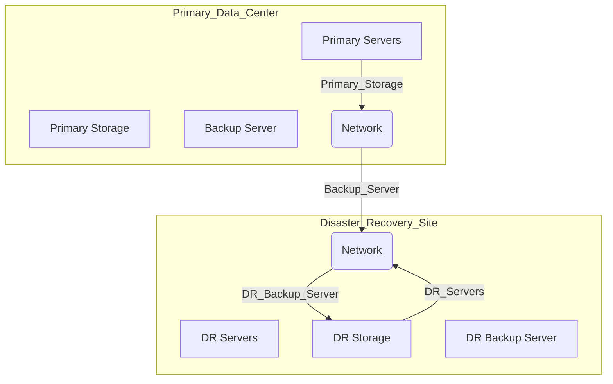
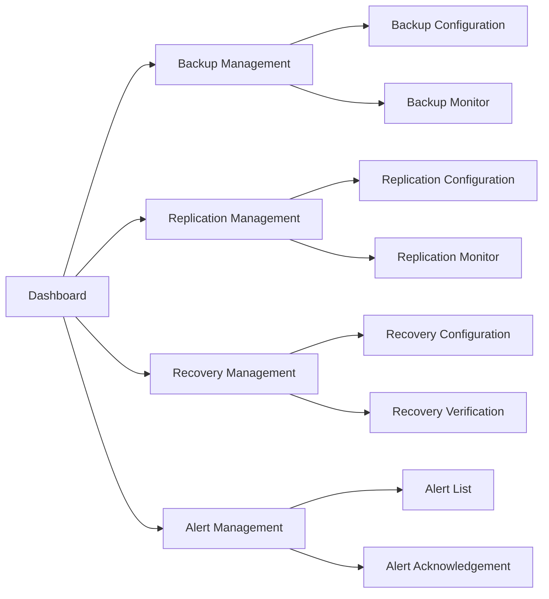
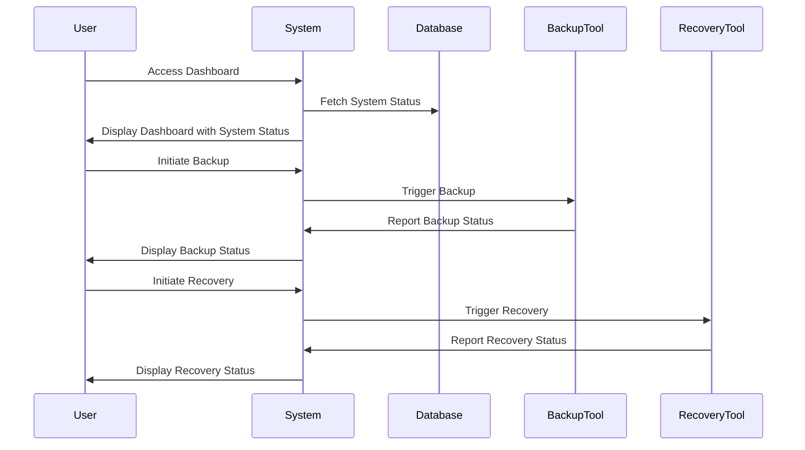

                 

### Introduction to Disaster Recovery and Data Recovery

Disaster recovery and data recovery are fundamental concepts in the realm of IT infrastructure management. Disaster recovery (DR) refers to a set of policies, strategies, and procedures designed to enable the recovery or continuation of vital technology infrastructure and systems following a natural or human-induced disaster. Data recovery, on the other hand, involves techniques and procedures used to recover lost, corrupted, or damaged data from various data storage media, such as hard drives, solid-state drives (SSDs), and tapes.

The significance of disaster recovery and data recovery cannot be overstated, especially in today's interconnected digital world where data is the lifeblood of businesses and organizations. A disaster, such as a hardware failure, cyberattack, or natural calamity, can disrupt critical business operations, leading to significant financial losses, damage to reputation, and loss of customer trust.

#### Common Disasters in Evaluation Systems

Evaluation systems, which are used to assess the performance of applications, software, or other services, are particularly vulnerable to various types of disasters. Some of the common disasters that can affect evaluation systems include:

1. **Hardware Failures**: These can range from server malfunctions to network hardware failures. For example, a power outage or a hardware component failure like a disk drive crash can lead to downtime and loss of data.

2. **Cyberattacks**: Malicious activities such as malware infections, DDoS attacks, SQL injection, or ransomware can compromise the integrity, availability, and confidentiality of evaluation systems.

3. **Natural Disasters**: Events like floods, earthquakes, fires, or hurricanes can physically damage infrastructure and disrupt operations, leading to data loss and system downtime.

4. **Software Bugs**: Critical application or system bugs can cause data corruption, crashes, or other issues that affect the reliability of the evaluation process.

5. **Human Errors**: Accidental deletion of data, misconfiguration of systems, or other user-related mistakes can lead to data loss and operational disruptions.

#### The Significance of Disaster Recovery Planning

The importance of having a robust disaster recovery plan cannot be underestimated. A well-designed DR plan can mitigate the impact of disasters, ensuring that critical operations can be restored quickly and efficiently. Some key reasons why disaster recovery planning is essential include:

1. **Business Continuity**: A solid DR strategy helps ensure that essential business functions can continue even during a crisis, minimizing downtime and financial loss.

2. **Data Protection**: DR plans include measures to back up and protect data, ensuring that it can be recovered in the event of data loss or corruption.

3. **Compliance**: Many industries and regions have regulatory requirements for data protection and business continuity. A well-implemented DR plan helps organizations meet these requirements.

4. **Customer Trust**: Maintaining a reliable evaluation system builds trust with customers and stakeholders, who rely on the accuracy and availability of the data.

5. **Reputation Management**: Effective disaster recovery can help protect an organization's reputation by demonstrating a commitment to maintaining high standards of service and reliability.

#### Key Concepts and Terminology

To effectively design and implement a disaster recovery and data recovery strategy, it's important to understand the key concepts and terminology involved. Some essential terms include:

1. **Business Impact Analysis (BIA)**: A process that identifies the potential impacts of disasters on business operations and resources, helping prioritize recovery efforts.

2. **Risk Assessment**: The process of identifying, analyzing, and prioritizing risks to the organization, including the likelihood and impact of potential disasters.

3. **Recovery Time Objective (RTO)**: The maximum acceptable downtime for a system or application following a disaster.

4. **Recovery Point Objective (RPO)**: The maximum amount of data that an organization is willing to lose in the event of a disaster.

5. **Backup**: The process of creating copies of data to protect against data loss.

6. **Replication**: The process of creating and maintaining copies of data across multiple locations to ensure high availability.

7. **DR Site**: A secondary location where backup systems and data can be housed to enable recovery following a disaster.

8. **Incident Response Plan**: A document that outlines the steps to be taken in the event of a disaster, including communication protocols, roles and responsibilities, and recovery procedures.

In summary, disaster recovery and data recovery are critical components of maintaining the resilience and reliability of IT systems. By understanding the common types of disasters, the importance of disaster recovery planning, and the key concepts and terminology, organizations can better protect their critical systems and data, ensuring business continuity and minimizing the impact of disruptions.

### Data Recovery Basics

Data recovery is a critical aspect of disaster recovery, aimed at restoring lost, corrupted, or damaged data from various storage media. Understanding the types of data loss, the causes of data corruption, and the principles of data recovery is essential for any organization striving to maintain data integrity and operational resilience.

#### Types of Data Loss

Data loss can occur due to a variety of reasons, and it's important to recognize these types to understand the scope and nature of the problem. The most common types of data loss include:

1. **Accidental Deletion**: Users may accidentally delete files or folders, either intentionally or unintentionally, leading to immediate data loss.

2. **Hardware Failures**: These include disk drive failures, RAID controller malfunctions, or other hardware issues that result in data becoming inaccessible.

3. **Corruption**: Data corruption can occur due to software bugs, improper shutdowns, or power outages, making the data unreadable or unusable.

4. **Virus and Malware**: Malicious software can corrupt or delete data, making it difficult or impossible to access.

5. **Natural Disasters**: Events like floods, fires, or earthquakes can damage physical storage media, leading to data loss.

6. **Human Error**: Mistakes made by users, such as overwriting files or misconfiguring storage settings, can result in data loss.

7. **Software Bugs**: Bugs in applications or system software can cause data corruption or loss, especially if they are not promptly addressed.

#### Causes of Data Corruption

Data corruption can stem from various sources and understanding these causes is crucial for implementing effective data recovery strategies. Some common causes of data corruption include:

1. **Hardware Issues**: Faulty hard drives, RAM, or other hardware components can cause data corruption.

2. **Software Bugs**: Software applications or system components with bugs can inadvertently corrupt data.

3. **Power Outages**: Sudden power loss can cause incomplete transactions or interrupted data writes, leading to corruption.

4. **Software Errors**: Misconfigurations or improper use of data management tools can corrupt data.

5. **Malicious Software**: Viruses, Trojans, ransomware, and other malware can corrupt data files or the file system itself.

6. **Data Overwrites**: Accidental overwriting of data can lead to permanent data loss if not detected and corrected promptly.

7. **Physical Damage**: Physical damage to storage media, such as scratches or water damage, can cause data corruption.

#### Principles of Data Recovery

The process of data recovery is based on several fundamental principles designed to maximize the chances of recovering data that has been lost or corrupted. These principles include:

1. **Non-Invasive Recovery**: The recovery process should be non-invasive to avoid causing further damage to the damaged media. This often involves reading data from the media without writing to it.

2. **Data Integrity**: Maintaining data integrity throughout the recovery process is crucial. Any modifications should be documented and verified to ensure the recovered data is accurate.

3. **Incremental Recovery**: Incremental recovery involves progressively recovering data in stages, starting from the most critical and essential files, ensuring that recovery efforts are focused and effective.

4. **Documentation**: Detailed documentation of the recovery process, including the steps taken, tools used, and any changes made, is essential for tracking the recovery process and for future reference.

5. **Professional Expertise**: Data recovery often requires specialized knowledge and tools. Engaging professional data recovery services can improve the chances of successful recovery, especially in complex cases.

6. **Validation**: After recovering data, it is crucial to validate its integrity and usability. This involves checking the files for corruption, verifying that they can be opened and used normally, and ensuring that all data has been successfully recovered.

7. **Prevention and Planning**: The best data recovery is the data that is never lost in the first place. Regular backups, data validation checks, and disaster recovery planning are key preventive measures that can minimize the risk of data loss and corruption.

In conclusion, understanding the basics of data recovery is essential for any organization looking to safeguard its data and maintain operational resilience. By recognizing the types of data loss, identifying the causes of data corruption, and adhering to the principles of data recovery, organizations can enhance their ability to restore data and mitigate the impact of data loss on their operations.

### Disaster Recovery Principles

Designing a comprehensive disaster recovery plan requires a thorough understanding of key principles that underpin effective DR strategies. These principles guide the development, implementation, and maintenance of DR plans, ensuring that they are robust, efficient, and capable of meeting organizational needs. Let's delve into the critical concepts of Business Impact Analysis (BIA), risk assessment, and DR strategies and objectives.

#### Business Impact Analysis (BIA)

Business Impact Analysis (BIA) is a crucial first step in the disaster recovery planning process. BIA involves identifying and analyzing the potential impacts that disruptions to business operations could have on the organization. This analysis helps prioritize recovery efforts and allocate resources effectively. The main components of BIA include:

1. **Identifying Critical Business Functions**: This step involves identifying the essential business processes that are vital for the organization's operations. Critical functions typically include customer service, financial operations, supply chain management, and key IT systems.

2. **Evaluating Impact and Recovery Time**: For each critical function, the impact of a disruption is assessed, including the financial cost, operational downtime, and potential harm to the organization's reputation. The recovery time objective (RTO) is then determined, which is the maximum acceptable downtime for the system or application following a disaster.

3. **Evaluating Recovery Point Objective (RPO)**: The RPO defines the maximum amount of data an organization is willing to lose in the event of a disaster. It helps determine the frequency and method of data backups required to ensure that minimal data loss occurs during a recovery process.

4. **Developing Contingency Plans**: Based on the BIA findings, contingency plans are developed to address potential disruptions. These plans outline specific actions to be taken before, during, and after a disaster to ensure the swift recovery of critical business functions.

#### Risk Assessment

Risk assessment is another foundational principle of disaster recovery planning. It involves identifying, analyzing, and prioritizing risks to the organization, including both internal and external threats. The primary objectives of risk assessment are to:

1. **Identify Potential Threats**: This step involves identifying potential threats that could disrupt business operations, such as natural disasters, cyberattacks, hardware failures, and human errors.

2. **Analyze Likelihood and Impact**: Each identified threat is analyzed to determine the likelihood of occurrence and the potential impact on the organization. This analysis helps prioritize risks and allocate resources effectively.

3. **Develop Mitigation Strategies**: Based on the risk assessment findings, mitigation strategies are developed to reduce the likelihood or impact of potential threats. These strategies may include implementing security measures, developing backup and recovery plans, and establishing incident response protocols.

4. **Monitor and Review**: Risk assessment is an ongoing process. Regular monitoring and review of the organization's risk landscape are essential to identify new threats and update mitigation strategies accordingly.

#### Disaster Recovery Strategies and Objectives

Once the risks and impacts have been assessed, it's crucial to develop disaster recovery strategies that align with the organization's goals and objectives. Key disaster recovery strategies include:

1. **Backups and Replication**: Regular backups and data replication are fundamental components of a DR plan. Backups involve creating copies of data and storing them securely, while replication involves maintaining real-time copies of data across multiple locations.

2. **Business Continuity Planning (BCP)**: Business Continuity Planning focuses on ensuring that critical business functions can continue during and after a disaster. This involves developing detailed procedures and protocols to maintain operations and recover quickly.

3. **Hot Sites and Cold Sites**: A hot site is a fully operational backup facility that can be used immediately following a disaster, while a cold site requires time to be set up and configured. Both types of sites provide a location where critical systems and data can be restored and operations can resume.

4. **Incident Response Plan**: An incident response plan outlines the steps to be taken in the event of a disaster, including communication protocols, roles and responsibilities, and recovery procedures. It ensures that all stakeholders are aware of their roles and can respond effectively to the situation.

5. **DR Testing and Maintenance**: Regular testing and maintenance of the DR plan are essential to ensure its effectiveness. This includes conducting simulated disaster recovery drills, updating the plan to reflect changes in the organization, and verifying the integrity of backups and replication systems.

The objectives of a disaster recovery plan are to:

1. **Minimize Downtime**: The primary goal is to minimize the downtime of critical systems and applications following a disaster, ensuring that business operations can resume quickly.

2. **Protect Data**: Ensuring the security and integrity of data is paramount. Data backups and replication strategies are designed to protect against data loss and corruption.

3. **Maintain Business Operations**: The ultimate objective is to maintain business operations with minimal disruption, ensuring that the organization can continue to serve its customers and meet its objectives.

4. **Enhance Reputation**: A robust DR plan demonstrates the organization's commitment to reliability and customer service, enhancing its reputation and customer trust.

In conclusion, disaster recovery planning is a complex but essential process that involves understanding key principles such as Business Impact Analysis, risk assessment, and developing effective DR strategies and objectives. By implementing these principles, organizations can enhance their resilience and ensure that they can quickly recover from any disaster, maintaining operational continuity and safeguarding their data and reputation.

### Technologies for Data Backup

Data backup is a critical component of disaster recovery, ensuring that organizations can recover data in the event of a disaster or data loss. There are several technologies and methods for data backup, each with its advantages and disadvantages. Let's explore the most common methods: full backup, incremental backup, tape backup vs. disk backup, and cloud backup solutions.

#### Full Backup

A full backup involves copying all of the data from a system or application to a backup storage medium. This method provides a complete copy of the data, allowing for a full restore if necessary. Key characteristics and considerations for full backup include:

1. **Complete Restoration**: Full backups allow for complete restoration of data, making them ideal for scenarios where a significant amount of data needs to be recovered.

2. **Resource Intensive**: Full backups require significant storage space and can be resource-intensive, particularly for large datasets.

3. **Time-Consuming**: Full backups can take a considerable amount of time to complete, especially when performed on large systems.

4. **Periodic Execution**: Full backups are typically performed periodically, such as daily, weekly, or monthly, depending on the organization's data recovery objectives.

5. **Consistency**: Full backups provide a consistent snapshot of the data, ensuring that all files are backed up in their current state.

6. **Cost**: Full backups can be expensive, particularly when dealing with large amounts of data and frequent backups.

#### Incremental Backup

Incremental backup involves backing up only the changes made since the last backup, whether it's a full or incremental backup. This method minimizes storage requirements and reduces backup time. Key characteristics and considerations for incremental backup include:

1. **Reduced Storage Space**: Incremental backups store only the changes since the last backup, significantly reducing storage space requirements.

2. **Faster Backup Times**: Incremental backups are faster than full backups because they only need to back up new or modified data.

3. **Complex Restoration**: While incremental backups are efficient, restoring data from incremental backups can be more complex and time-consuming, especially if multiple backups are required.

4. **Increased Storage Over Time**: Over time, the cumulative size of incremental backups can approach the size of full backups, requiring careful management.

5. **Regular Execution**: Incremental backups are typically performed more frequently, such as hourly, daily, or weekly, depending on the organization's needs.

6. **Limited Restoration Options**: Incremental backups are less flexible when it comes to restoring specific files or versions, as they rely on the cumulative set of changes.

#### Tape Backup vs. Disk Backup

Tape backup and disk backup are two traditional methods of storing backup data. Each method has its own set of advantages and disadvantages. Let's compare the two:

**Tape Backup:**

1. **Long-Term Storage**: Tape backups are well-suited for long-term data retention due to their low cost and durability.

2. **Portable**: Tapes can be easily transported to off-site locations for secure storage, providing an additional layer of security against physical disasters.

3. **Limited Speed**: Tape backups are slower compared to disk backups, particularly when it comes to restoring data.

4. **Limited Capacity**: Modern tape drives have limited storage capacity, making them less suitable for backing up large datasets.

5. **Manual Management**: Tape backups require manual handling and management, increasing the risk of human error.

**Disk Backup:**

1. **Faster Access**: Disk backups provide faster data access and recovery times, making them more suitable for organizations that require rapid data restoration.

2. **Scalable Storage**: Disk-based backup solutions offer scalable storage options, allowing organizations to easily expand their backup storage capacity.

3. **Automated Management**: Disk backups can be automated, reducing the need for manual intervention and minimizing the risk of human error.

4. **Cost**: While disk-based backup solutions can be more expensive initially, they offer better value over time due to faster recovery times and lower long-term storage costs.

5. **Limited Long-Term Retention**: Disk backups are not as suitable for long-term retention due to the risk of data degradation over time and the higher cost of storing data over extended periods.

#### Cloud Backup Solutions

Cloud backup solutions offer a modern alternative to traditional tape and disk backup methods. They leverage cloud storage to store backup data securely and provide several advantages. Key characteristics and considerations for cloud backup solutions include:

1. **Cost-Effectiveness**: Cloud backup solutions are typically more cost-effective, especially for small and medium-sized businesses, as they eliminate the need for purchasing and maintaining physical storage infrastructure.

2. **Scalability**: Cloud storage offers scalable capacity, allowing organizations to easily increase their backup storage as needed.

3. **Remote Accessibility**: Cloud backups can be accessed from anywhere with an internet connection, making them convenient for remote work and disaster recovery scenarios.

4. **Automated Backup**: Cloud backup solutions often include automated backup schedules, reducing the need for manual management.

5. **Data Security**: Cloud providers typically offer robust security measures, including encryption, to protect backup data from unauthorized access.

6. **Disaster Recovery**: Cloud-based backups provide an off-site location for data storage, enhancing disaster recovery capabilities.

7. **Potential Downtime**: Internet connectivity issues can impact the backup process, potentially leading to data loss if not properly managed.

In conclusion, data backup technologies vary in their capabilities and suitability for different organizational needs. Full backups provide complete data restoration but require significant storage and time, while incremental backups offer efficiency but can be more complex to restore. Tape backups excel in long-term storage and portability but suffer from slower access times, while disk backups provide faster access and scalability. Cloud backup solutions offer cost-effectiveness, scalability, and remote accessibility but can be affected by internet connectivity issues. Choosing the right backup technology depends on the organization's data recovery objectives, budget, and operational requirements.

### Technologies for Data Recovery

When it comes to data recovery, understanding the available tools and software is crucial for effectively addressing data loss scenarios. Different technologies offer varying levels of complexity and functionality, catering to various needs and recovery requirements. Let's explore some common tools and methodologies for data recovery, along with case studies to illustrate their practical applications.

#### File-Level Recovery vs. Image-Based Recovery

File-level recovery and image-based recovery are two primary methods used to restore lost or corrupted data. Each approach has its advantages and is suited for different scenarios.

**File-Level Recovery:**

File-level recovery involves restoring individual files and folders from a backup or recovery point. This method is often used in scenarios where specific files or directories need to be recovered without the need to restore an entire system or dataset. Key characteristics include:

1. **Flexibility**: File-level recovery provides granular control over the recovery process, allowing users to select specific files or folders to restore.

2. **Ease of Use**: Many file-level recovery tools offer user-friendly interfaces that simplify the recovery process, making them accessible to non-technical users.

3. **Speed**: File-level recovery is typically faster than image-based recovery, especially when dealing with small or specific subsets of data.

4. **Limitations**: This method can be complex when recovering large amounts of data or when the file system is severely corrupted, as it may require manual intervention to reconstruct the file structure.

**Case Study:**

Consider a scenario where a user accidentally deletes a critical set of financial reports from their workstation. Using a file-level recovery tool, the user can restore the specific files directly from a recent backup, ensuring minimal data loss and downtime.

**Image-Based Recovery:**

Image-based recovery involves creating a complete copy of a disk, partition, or volume and restoring it as a whole. This method is often used for full system restores or when dealing with severe data corruption. Key characteristics include:

1. **Completeness**: Image-based recovery ensures that all data, system settings, and applications are restored, providing a comprehensive solution for system failures.

2. **Efficiency**: This method is highly efficient for large-scale data recovery, as it restores an entire system or dataset in one operation.

3. **Complexity**: Image-based recovery requires more advanced tools and expertise, making it less accessible to non-technical users.

4. **Dependency**: The success of image-based recovery depends on the integrity of the backup image, making it crucial to regularly test and validate backups.

**Case Study:**

In a scenario where a company's server experiences a critical failure due to a hardware issue, an image-based recovery can be used to restore the entire server, including the operating system, applications, and data, ensuring that operations can resume quickly.

#### Common Tools and Software for Data Recovery

There are several popular tools and software available for data recovery, each with its own set of features and capabilities. Here are some commonly used tools:

1. **EaseUS Data Recovery Wizard**: This user-friendly tool supports both file-level and image-based recovery and can handle various data loss scenarios, including accidental deletion, format errors, and partition loss.

2. **MiniTool Power Data Recovery**: Another versatile data recovery tool, MiniTool Power Data Recovery offers both free and paid versions and supports a wide range of storage devices, including hard drives, SSDs, and USB drives.

3. **R-Studio**: R-Studio is a robust data recovery tool that supports image-based recovery and provides advanced features for data analysis and recovery, making it suitable for enterprise environments.

4. **AOMEI Backupper**: AOMEI Backupper offers comprehensive backup and recovery features, including file-level recovery, system imaging, and disk cloning, making it a popular choice for both home and business users.

5. **Kroll Ontrack**: Kroll Ontrack is a professional data recovery service provider that offers specialized solutions for complex data recovery scenarios, including hard drive crashes, RAID recovery, and data recovery from damaged devices.

#### Real-World Case Studies

**Case Study 1: Lost Photos from a Digital Camera**

A photographer accidentally formatted a memory card containing thousands of important photos from a recent event. Using EaseUS Data Recovery Wizard, the photographer was able to recover most of the photos directly from the formatted memory card within a few hours, thanks to the tool's user-friendly interface and efficient search capabilities.

**Case Study 2: Server Crash Recovery**

A small business experienced a server crash due to a hardware failure, resulting in the loss of critical business data and applications. The company's IT team used AOMEI Backupper to restore a recent system image backup, which included the operating system, applications, and data. Within a few hours, the server was back online, and business operations resumed without significant downtime.

**Case Study 3: RAID 5 Failure Recovery**

A medium-sized company's RAID 5 array failed due to a disk failure, leading to data corruption and potential data loss. The company's IT team engaged Kroll Ontrack's specialized data recovery services. The team was able to recover the vast majority of the data from the failed RAID array within a few days, thanks to Kroll Ontrack's advanced recovery techniques and specialized hardware.

In conclusion, the choice of data recovery technology and tools depends on the specific data loss scenario and the level of complexity involved. Whether using file-level recovery for specific file restoration or image-based recovery for full system recovery, having the right tools and understanding their capabilities is essential for effective data recovery. The case studies highlighted above demonstrate the practical application of different data recovery tools in real-world scenarios, showcasing their ability to minimize data loss and downtime.

### Implementing Disaster Recovery Plans

Implementing a comprehensive disaster recovery plan (DRP) is a critical step in ensuring business continuity and minimizing the impact of potential disasters. The process involves several stages, from preparing for disaster recovery to setting up a disaster recovery team and defining key roles and responsibilities. Let's explore these stages in detail.

#### Preparing for Disaster Recovery

Before implementing a DRP, organizations need to conduct thorough preparations to ensure that they are adequately equipped to handle a disaster. Key steps in this stage include:

1. **Business Impact Analysis (BIA)**: Conduct a BIA to identify and prioritize critical business functions and processes. This analysis helps determine the Recovery Time Objective (RTO) and Recovery Point Objective (RPO) for each critical function.

2. **Risk Assessment**: Perform a risk assessment to identify potential threats and vulnerabilities that could impact the organization. This includes both internal and external risks, such as hardware failures, cyberattacks, natural disasters, and human errors.

3. **Developing DR Strategies**: Based on the BIA and risk assessment, develop appropriate DR strategies that align with the organization's goals and objectives. These strategies may include data replication, off-site backups, hot sites, and cold sites.

4. **Resource Allocation**: Allocate necessary resources for implementing the DRP, including budget, personnel, technology, and physical infrastructure.

5. **Policy Development**: Develop and document DR policies and procedures that outline the steps to be taken before, during, and after a disaster. These policies should be clear, concise, and easily understood by all stakeholders.

#### Setting Up a Disaster Recovery Team

A dedicated disaster recovery team is essential for ensuring the effective execution of the DRP. This team should be established early in the planning process and include personnel with diverse expertise. Key steps in setting up a DR team include:

1. **Identifying Key Roles**: Define key roles and responsibilities within the DR team, such as the DR coordinator, IT staff, business unit representatives, and external vendors or consultants.

2. **Recruitment and Training**: Recruit team members with the necessary skills and expertise to handle various aspects of the DRP. Provide comprehensive training on the DRP, including policies, procedures, and emergency response protocols.

3. **Team Structure**: Establish clear reporting lines and communication channels within the DR team. Define how information will be shared and how decisions will be made during a disaster.

4. **Cross-Functional Collaboration**: Ensure that the DR team collaborates closely with other departments, such as IT, HR, legal, and operations. This collaboration is crucial for coordinating efforts during a disaster and ensuring that all aspects of the organization are addressed.

#### Defining Roles and Responsibilities

Clear roles and responsibilities are essential for ensuring that the DRP is executed efficiently and effectively. Key roles and responsibilities include:

1. **DR Coordinator**: The DR coordinator is responsible for overseeing the entire DR process, from preparation to execution and recovery. This includes coordinating with other departments, managing resources, and ensuring that the DRP is adhered to.

2. **IT Staff**: IT staff are responsible for managing and maintaining the technology infrastructure, including backups, replication, and recovery systems. They should also be skilled in disaster recovery tools and software.

3. **Business Unit Representatives**: Business unit representatives are responsible for identifying and prioritizing critical business processes and ensuring that their departments are prepared for a disaster. They should also participate in DR planning and testing.

4. **External Vendors/Consultants**: External vendors or consultants may be involved in various aspects of the DRP, such as providing specialized expertise, managing off-site data centers, or conducting DR testing and audits.

#### Preparing for Potential Disasters

Preparation is a critical component of a successful DRP. This involves several key steps:

1. **Testing and Drilling**: Regularly test the DRP through simulated disaster scenarios. This helps identify any gaps or issues in the plan and ensures that all team members are familiar with their roles and responsibilities.

2. **Documentation**: Maintain up-to-date documentation of the DRP, including policies, procedures, contact information for key personnel, and detailed step-by-step instructions for executing the plan.

3. **Emergency Supplies**: Ensure that all necessary emergency supplies, such as backup power sources, portable communication devices, and first aid kits, are readily available.

4. **Communication Plans**: Develop and maintain clear communication plans that outline how information will be shared with internal and external stakeholders during a disaster. This may include emergency hotlines, email lists, and collaboration tools.

5. **Business Continuity Planning (BCP)**: In addition to DRP, develop a Business Continuity Plan (BCP) that addresses all aspects of business continuity, including alternative work locations, remote working capabilities, and supplier continuity.

#### Implementation and Maintenance

Once the DRP is in place, it's essential to implement and maintain it effectively. Key steps in this stage include:

1. **Implementation**: Implement the DRP according to the defined policies and procedures. This includes setting up backup and recovery systems, establishing off-site data centers, and training employees on their roles and responsibilities.

2. **Monitoring and Maintenance**: Regularly monitor and maintain the DR infrastructure to ensure its reliability and effectiveness. This includes testing backups, verifying replication processes, and updating the DRP to reflect changes in the organization's infrastructure and processes.

3. **Review and Update**: Periodically review and update the DRP to ensure that it remains relevant and effective. This includes conducting risk assessments, evaluating the success of previous disaster scenarios, and incorporating lessons learned into the plan.

In conclusion, implementing a disaster recovery plan requires careful planning, preparation, and ongoing maintenance. By setting up a dedicated DR team, defining roles and responsibilities, and preparing for potential disasters, organizations can enhance their resilience and ensure that they can quickly recover from any disaster, maintaining operational continuity and minimizing the impact on their business.

### Implementing Disaster Recovery Plans: Practical Steps

Implementing a disaster recovery plan (DRP) involves a series of practical steps that ensure the plan is effectively executed when a disaster occurs. These steps include selecting the right DR tools, setting up backup and recovery systems, conducting DR testing, and developing incident response plans. Let's delve into each of these steps in detail.

#### Selecting Disaster Recovery Tools

Choosing the appropriate disaster recovery tools is crucial for ensuring the efficiency and effectiveness of the DR process. The right tools can significantly impact the speed of recovery, the reliability of data restoration, and the overall success of the DR efforts. Here are some key factors to consider when selecting DR tools:

1. **Scalability**: The DR tools should be able to scale with the organization's growth, supporting larger datasets and more complex environments.

2. **Compatibility**: The tools should be compatible with the organization's existing IT infrastructure, including hardware, software, and network configurations.

3. **Reliability**: Look for tools with a proven track record of reliability and performance, particularly in recovering from various types of disasters.

4. **Ease of Use**: User-friendly interfaces and intuitive workflows can simplify the recovery process, making it easier for non-technical staff to use the tools effectively.

5. **Cost**: Consider the cost of the tools, including licensing fees, maintenance, and operational expenses, and weigh them against the potential benefits and ROI.

6. **Security**: Ensure that the DR tools include robust security features, such as encryption, access controls, and compliance with data protection regulations.

Some popular disaster recovery tools include Veeam Backup & Replication, Commvault, and Dell EMC Avamar. These tools offer a range of features, including backup and replication, cloud integration, and advanced recovery capabilities.

#### Setting Up Backup and Recovery Systems

Once the appropriate DR tools are selected, the next step is to set up the backup and recovery systems. This involves several critical components:

1. **Backup Infrastructure**: Establish a robust backup infrastructure that includes backup servers, storage devices, and network components. This infrastructure should be designed to support the organization's backup and recovery needs.

2. **Backup Strategies**: Develop and implement backup strategies that align with the organization's RTO and RPO. Common backup strategies include full backups, incremental backups, and differential backups. Each strategy has its advantages and should be selected based on the organization's specific requirements.

3. **Replication**: Implement data replication to ensure that backup data is stored in multiple locations, providing redundancy and enhancing data availability. Replication can be synchronous or asynchronous, depending on the organization's needs.

4. **Off-Site Storage**: Store backup data off-site to protect against physical disasters, such as fires, floods, or hardware failures. Off-site storage can be in the form of cloud storage, remote data centers, or tape backups.

5. **Regular Monitoring**: Continuously monitor the backup and recovery systems to ensure that backups are completed successfully and that data is consistently available for recovery.

#### Conducting Disaster Recovery Testing

Regular disaster recovery testing is essential to ensure that the DR plan works as intended and that all team members are familiar with their roles and responsibilities. Here are key steps in conducting DR testing:

1. **Test Planning**: Develop a comprehensive testing plan that outlines the objectives, scenarios, test cases, and expected outcomes of the tests.

2. **Simulation**: Simulate various disaster scenarios, such as server crashes, data corruption, cyberattacks, and natural disasters. These simulations should be as realistic as possible to ensure that the DR plan is robust.

3. **Execution**: Execute the tests according to the plan, following the defined procedures and protocols. Document any issues or deviations from the plan and address them promptly.

4. **Evaluation**: Evaluate the results of the tests to identify any weaknesses or gaps in the DR plan. This includes assessing the time taken to recover from each scenario, the success rate of data recovery, and the overall effectiveness of the DR process.

5. **Feedback and Improvement**: Provide feedback to the DR team and stakeholders based on the test results. Use this feedback to make improvements to the DR plan and to enhance the testing processes for future tests.

#### Developing Incident Response Plans

An incident response plan (IRP) is a critical component of the DRP, outlining the steps to be taken in the event of a disaster or data loss incident. Key steps in developing an IRP include:

1. **Incident Identification**: Define the criteria for identifying and classifying incidents based on their severity and impact on the organization.

2. **Incident Response Team**: Establish an incident response team (IRT) that includes representatives from various departments, such as IT, HR, legal, and operations. Define the roles and responsibilities of each team member.

3. **Incident Reporting**: Develop a process for reporting incidents, including how and when to notify the IRT and external stakeholders, such as customers, partners, and regulatory bodies.

4. **Incident Assessment**: Outline the steps for assessing the impact of incidents, including identifying the affected systems, data, and personnel.

5. **Incident Containment**: Define the steps to contain the incident, including isolating affected systems, stopping the spread of the issue, and minimizing damage.

6. **Incident Recovery**: Develop a detailed recovery plan that outlines how to restore operations and data, including the execution of the DRP and any additional recovery actions.

7. **Incident Reporting and Documentation**: Ensure that all incidents are documented, including the details of the incident, the actions taken, and the outcomes. This documentation is essential for learning from past incidents and improving the IRP.

In conclusion, implementing a disaster recovery plan involves selecting the right tools, setting up robust backup and recovery systems, conducting regular testing, and developing comprehensive incident response plans. By following these practical steps, organizations can enhance their resilience and ensure that they can quickly recover from any disaster, maintaining operational continuity and minimizing the impact on their business.

### System Analysis and Architecture Design

When designing a comprehensive disaster recovery and data recovery system, a systematic approach is essential to ensure that the system is robust, scalable, and capable of meeting the organization's requirements. This involves a thorough system analysis, architecture design, and the creation of detailed diagrams to illustrate the system's structure and functionality. Let's break down the process step by step.

#### System Analysis

System analysis is the foundation of any successful system design. It involves understanding the current state of the system, identifying its strengths and weaknesses, and defining the requirements for the new system. Key components of system analysis include:

1. **Requirement Gathering**: Engage with stakeholders to gather requirements for the disaster recovery and data recovery system. This includes understanding the organization's current data storage and backup infrastructure, business continuity needs, and regulatory compliance requirements.

2. **Current State Assessment**: Analyze the existing system to identify its components, functionalities, and any limitations or issues. This assessment helps in understanding the scope of the new system and the changes required.

3. **Risk Assessment**: Identify potential risks that could impact the system, such as hardware failures, cyberattacks, natural disasters, and human errors. This assessment helps in designing the system to mitigate these risks.

4. **Business Impact Analysis (BIA)**: Conduct a BIA to prioritize the recovery of critical systems and data. Determine the Recovery Time Objective (RTO) and Recovery Point Objective (RPO) for each critical component.

5. **Define System Boundaries**: Clearly define the boundaries of the system, including the scope of data protection, supported platforms, and interfaces with other systems.

#### Architecture Design

Once the system analysis is complete, the next step is to design the system architecture. Architecture design involves defining the system's components, their interactions, and the overall structure. Key steps in architecture design include:

1. **Define System Components**: Identify the key components of the system, such as servers, storage devices, network infrastructure, backup and recovery tools, and monitoring systems.

2. **Design Data Storage**: Design the data storage solution, including the choice of storage media (e.g., disks, tapes, cloud storage), storage architectures (e.g., RAID, SAN, NAS), and data redundancy strategies (e.g., mirroring, replication).

3. **Design Backup and Recovery System**: Design the backup and recovery system to ensure that it meets the organization's RTO and RPO requirements. This includes defining the backup schedules, types of backups (full, incremental, differential), and recovery procedures.

4. **Design DR Site**: If an off-site DR site is part of the solution, design its infrastructure, including servers, storage, network connectivity, and security measures. Ensure that the DR site is geographically distant from the primary site to protect against localized disasters.

5. **Design Monitoring and Alerting**: Incorporate monitoring and alerting systems to continuously monitor the health of the DR infrastructure and detect any issues or anomalies that could impact data recovery capabilities.

#### System Function Design

System function design involves defining the functionalities of the disaster recovery and data recovery system. This includes:

1. **Data Backup**: Define how and when data will be backed up, including the backup strategies and tools to be used.

2. **Data Recovery**: Define the procedures and tools for recovering data in the event of a disaster or data loss. This includes file-level and image-based recovery options.

3. **DR Activation**: Define the steps and protocols for activating the DR system in the event of a disaster. This includes triggering backups, initiating recovery processes, and communicating with stakeholders.

4. **DR Testing**: Define the process for regularly testing the DR system to ensure that it functions as expected and meets the organization's recovery objectives.

5. **Incident Response**: Define the incident response protocols to handle data loss and disaster scenarios. This includes documenting the roles and responsibilities of the DR team and the steps to be taken in response to different types of incidents.

#### Architecture Diagrams

Creating detailed architecture diagrams is crucial for visualizing the system's structure and functionality. Here are the key diagrams to consider:

1. **System Architecture Diagram**: This diagram provides an overview of the entire system, including its components, connections, and interactions. It should clearly illustrate the primary and secondary systems involved in disaster recovery.

2. **Data Flow Diagram**: This diagram shows the flow of data within the system, including backup and recovery processes. It helps in understanding how data is managed and protected.

3. **Component Interaction Diagram**: This diagram shows the interactions between different components of the system, such as servers, storage devices, and backup tools. It helps in identifying dependencies and ensuring seamless communication between components.

4. **DR Site Architecture Diagram**: If a DR site is part of the solution, this diagram should illustrate its infrastructure, including servers, storage, network connectivity, and security measures.

5. **Incident Response Flowchart**: This flowchart outlines the steps and protocols for incident response, including how incidents are identified, reported, assessed, contained, and recovered from.

By following these steps and creating detailed architecture diagrams, organizations can design a robust disaster recovery and data recovery system that meets their specific needs and ensures business continuity in the face of disasters.

### Project Introduction and System Function Design

#### Project Overview

The project aims to design and implement a comprehensive disaster recovery (DR) and data recovery (DR) system for a mid-sized e-commerce company. The company handles a vast amount of transactional data and critical application systems, making the need for a robust DR and data recovery strategy paramount. The primary goal is to ensure business continuity, minimize data loss, and quickly recover from any potential disasters or data corruption incidents.

#### System Requirements

1. **High Availability**: The system must ensure high availability of critical applications and data, with minimal downtime in the event of a failure.
2. **Data Protection**: The system should provide comprehensive data protection, including regular backups and secure storage solutions.
3. **Scalability**: The system should be designed to scale with the company’s growth, accommodating increased data volumes and system complexities.
4. **User-Friendly Interface**: The system should have an intuitive user interface that allows non-technical users to perform backup and recovery tasks easily.
5. **Regulatory Compliance**: The system must comply with industry regulations and standards, such as GDPR and PCI DSS.

#### System Function Design

The disaster recovery and data recovery system consists of several key functions designed to ensure data protection and business continuity:

1. **Data Backup**: The system implements a multi-tiered backup strategy, including daily full backups, incremental backups, and differential backups. This ensures that data is protected and can be restored in case of data loss or corruption.
2. **Data Replication**: Data replication is employed to create real-time copies of critical data across multiple storage locations. This provides an additional layer of redundancy and ensures that data is always available, even in the event of a site failure.
3. **DR Site**: An off-site disaster recovery site is established to ensure that critical systems and data can be quickly restored in the event of a primary site failure. The DR site includes dedicated servers, storage systems, and network infrastructure.
4. **Monitoring and Alerting**: The system includes a robust monitoring and alerting mechanism to continuously monitor the health of the DR infrastructure. This helps in identifying potential issues before they escalate into critical problems.
5. **Incident Response**: The system is equipped with an incident response plan that outlines the steps to be taken in case of data loss or a disaster. The plan includes clear roles and responsibilities for the DR team and stakeholders.

#### Domain Model

To better understand the system's components and their relationships, a domain model is created. The domain model includes the following entities:

1. **User**: Represents the users who interact with the system.
2. **Application**: Represents the critical applications that need to be protected and recovered.
3. **Data**: Represents the data stored by the applications.
4. **Backup**: Represents the backup tasks and their schedules.
5. **Replication**: Represents the replication tasks and their configurations.
6. **DR Site**: Represents the off-site disaster recovery site.
7. **Alert**: Represents the alerts generated by the monitoring system.

The domain model is visualized using a UML class diagram, which illustrates the entities and their relationships. Here is a simplified version of the UML class diagram:

```mermaid
classDiagram
User --|>> Application: Uses
User --|>> Data: Accesses
Application --|>> Data: Stores
Backup --|>> Application: For
Backup --|>> Data: On
Replication --|>> Application: For
Replication --|>> Data: To
DRSite --|>> Application: For recovery
DRSite --|>> Backup: For
DRSite --|>> Replication: For
Alert --|>> User: Notifies
Alert --|>> Application: Indicates
Alert --|>> Backup: Triggered by
Alert --|>> Replication: Triggered by
endclassDiagram
```

#### System Architecture

The system architecture is designed to ensure high availability, scalability, and reliability. The architecture includes the following components:

1. **Primary Data Center**: The primary data center hosts the company’s critical applications and data. It includes servers, storage systems, and network infrastructure.
2. **DR Site**: The disaster recovery site is located off-site and is equipped with dedicated servers, storage systems, and network connectivity. It is designed to be fully operational in the event of a primary site failure.
3. **Backup Server**: The backup server is responsible for performing regular backups of the primary data center’s data. It is also used for managing and monitoring backup tasks.
4. **Replication Server**: The replication server ensures that critical data is continuously replicated to the DR site. This provides real-time redundancy and data protection.
5. **Monitoring System**: The monitoring system continuously monitors the health of the primary and DR sites, detecting potential issues and triggering alerts as needed.

Here is a high-level architectural diagram of the system:

```mermaid
graph TB
    PrimaryDataCenter[Primary Data Center] --> BackupServer(Backup Server)
    PrimaryDataCenter --> ReplicationServer(Replication Server)
    DRSite[DR Site] --> BackupServer
    DRSite --> ReplicationServer
    BackupServer --> MonitoringSystem(Monitoring System)
    ReplicationServer --> MonitoringSystem
    MonitoringSystem --> AlertSystem(Alert System)
    AlertSystem --> User Notifications(Notification)
end
```

#### System Interface Design

The system interface design focuses on providing a user-friendly interface for performing backup, replication, and recovery tasks. The interface includes the following components:

1. **Dashboard**: A dashboard provides an overview of the system’s status, including the status of backups, replications, and alerts.
2. **Backup Management**: A section for managing backup tasks, including scheduling, executing, and monitoring backups.
3. **Replication Management**: A section for managing replication tasks, including configuring, monitoring, and troubleshooting replication processes.
4. **Recovery Management**: A section for managing recovery tasks, including selecting backup sets, initiating recovery processes, and verifying the integrity of restored data.
5. **Alert Management**: A section for managing alerts, including viewing, acknowledging, and resolving alerts.

#### System Interaction

The system interaction design outlines how different components interact with each other to perform backup, replication, and recovery tasks. The key interactions include:

1. **User Interaction**: Users interact with the system through the user interface to initiate, monitor, and manage backup, replication, and recovery tasks.
2. **Backup and Replication Processes**: The backup and replication servers execute the configured tasks, backing up and replicating data as per the defined schedules and configurations.
3. **Monitoring and Alerting**: The monitoring system continuously monitors the health of the system and generates alerts in case of any issues or anomalies.
4. **DR Activation**: In the event of a disaster, the DR team activates the DR site, initiating the recovery processes to restore critical systems and data.

Here is a sequence diagram illustrating the system interaction:

```mermaid
sequenceDiagram
    User->>Dashboard: Accesses Dashboard
    User->>BackupManagement: Navigates to Backup Management
    User->>BackupSchedule: Sets Backup Schedule
    BackupServer->>MonitoringSystem: Executes Backup
    MonitoringSystem->>AlertSystem: Generates Alert if Backup Fails
    AlertSystem->>User: Sends Alert Notification
    User->>ReplicationManagement: Navigates to Replication Management
    User->>ReplicationConfig: Configures Replication Settings
    ReplicationServer->>MonitoringSystem: Executes Replication
    MonitoringSystem->>AlertSystem: Generates Alert if Replication Fails
    AlertSystem->>User: Sends Alert Notification
    User->>RecoveryManagement: Navigates to Recovery Management
    User->>RecoveryInitiation: Initiates Recovery Process
    ReplicationServer->>DRSite: Restores Data to DR Site
    DRSite->>MonitoringSystem: Confirms Data Restoration
    MonitoringSystem->>AlertSystem: Generates Completion Alert
    AlertSystem->>User: Sends Completion Notification
end
```

In conclusion, the project introduces a comprehensive disaster recovery and data recovery system for a mid-sized e-commerce company. The system is designed to ensure high availability, data protection, scalability, and user-friendliness. The system function design, domain model, system architecture, interface design, and system interaction are carefully crafted to provide a robust and reliable solution for ensuring business continuity and minimizing data loss.

### System Architecture Design

Designing a robust disaster recovery (DR) and data recovery (DR) system architecture is crucial for ensuring business continuity and minimizing downtime in the event of a disaster. The architecture should be scalable, reliable, and secure, incorporating various components such as servers, storage, network, and monitoring systems. Let's break down the architecture design into its key components and illustrate it using a Mermaid flowchart.

#### Key Components

1. **Servers**: The servers host the applications, databases, and other services that need to be protected. They can be categorized into primary servers and disaster recovery (DR) servers.
2. **Storage**: The storage system stores the data, which can be in the form of local disks, network-attached storage (NAS), or storage area networks (SAN). It's important to ensure data redundancy and high availability.
3. **Network**: The network infrastructure connects the servers and storage systems, enabling data transfer and communication. Redundant network connections and load balancing are recommended to enhance reliability.
4. **Backup and Recovery Tools**: These tools automate the backup process, manage backups, and facilitate data recovery. They can be local tools or cloud-based solutions.
5. **Monitoring and Management Tools**: These tools continuously monitor the health of the DR system, detect anomalies, and generate alerts. They help in maintaining the system's reliability and performance.

#### System Architecture

The system architecture consists of two primary components: the primary data center and the disaster recovery site.

1. **Primary Data Center**:
   - **Primary Servers**: Host the applications and databases.
   - **Primary Storage**: Stores the active data.
   - **Backup Server**: Responsible for performing regular backups of the primary storage.
   - **Network**: Connects the primary servers and storage.

2. **Disaster Recovery Site**:
   - **DR Servers**: Standby servers that can take over in case of a primary site failure.
   - **DR Storage**:mirror images of the primary storage, ensuring data redundancy.
   - **DR Backup Server**: Optional, for performing backups of the DR storage.
   - **Network**: Connects the DR servers and storage to the primary network.

#### Architecture Design

Here's a high-level Mermaid flowchart illustrating the system architecture:



#### Detailed Architecture Description

1. **Primary Servers**: The primary servers host the company's critical applications and databases. They are connected to the primary storage, which contains the active data.

2. **Primary Storage**: The primary storage contains the active data of the company. It is important to use high-availability storage solutions, such as RAID, to ensure data redundancy and protection against hardware failures.

3. **Backup Server**: The backup server is responsible for performing regular backups of the primary storage. The backups can be stored on local disks or replicated to the DR site for added security.

4. **Network**: The network connects the primary servers and storage to the DR site. Redundant network connections and load balancing can be used to enhance network reliability.

5. **DR Servers**: The DR servers are standby servers located at the DR site. In the event of a primary site failure, the DR servers can take over and continue hosting the applications and databases.

6. **DR Storage**: The DR storage contains mirror images of the primary storage, ensuring that data is redundant and can be quickly restored in case of a failure.

7. **DR Backup Server**: The DR backup server, if used, performs backups of the DR storage. This provides an additional layer of protection and ensures that the DR site has up-to-date backups.

8. **Monitoring and Management Tools**: These tools continuously monitor the health of the DR system, detect anomalies, and generate alerts. They help in maintaining the system's reliability and performance.

#### Architecture Advantages

- **High Availability**: By having both primary and DR servers, the system provides high availability, ensuring that critical applications and data are always accessible.
- **Data Redundancy**: By replicating data to the DR site, the system ensures that data is always protected and can be quickly restored in case of a failure.
- **Scalability**: The system can be easily scaled by adding more servers and storage as needed.
- **Security**: By using encrypted backups and secure network connections, the system ensures that data is protected from unauthorized access.

In conclusion, the system architecture design for disaster recovery and data recovery ensures high availability, data redundancy, scalability, and security. By incorporating primary and DR servers, storage, network, and monitoring tools, the system provides a robust and reliable solution for ensuring business continuity and minimizing downtime.

### System Interface and Interaction Design

The system interface and interaction design play a critical role in ensuring that users can effectively interact with the disaster recovery and data recovery system. This section will cover the design of the user interface (UI) and user experience (UX), as well as the system's interaction with external components and other systems.

#### User Interface (UI) Design

The UI design is crucial for providing a user-friendly and intuitive experience. It should be designed with the following considerations in mind:

1. **Clarity and Simplicity**: The interface should be clear and easy to navigate, with minimal clutter. Users should be able to perform tasks without confusion.
2. **Consistency**: Consistent design elements, such as color schemes, typography, and button styles, help users understand how to interact with the system.
3. **Responsive Design**: The interface should be responsive, providing a seamless experience across different devices and screen sizes.
4. **Visual Feedback**: The interface should provide visual feedback to users, such as confirmation messages or progress indicators, to ensure they understand the system's response to their actions.
5. **Accessibility**: The interface should be accessible to users with disabilities, adhering to accessibility standards and guidelines.

The UI design consists of the following main components:

1. **Dashboard**: The main dashboard provides an overview of the system's status, including key metrics such as backup success rates, replication status, and alert notifications.
2. **Backup Management**: This section allows users to manage backup tasks, including scheduling, initiating, and monitoring backups.
3. **Replication Management**: Users can configure and monitor replication tasks, ensuring that data is consistently replicated to the disaster recovery site.
4. **Recovery Management**: This section enables users to initiate and manage data recovery processes, verifying the integrity of restored data.
5. **Alert Management**: Users can view, acknowledge, and resolve alert notifications, ensuring that potential issues are addressed promptly.

Here is a simplified UI flow for the system:



#### User Experience (UX) Design

UX design focuses on the overall experience of using the system. This includes the usability, accessibility, and satisfaction of users. Key considerations for UX design include:

1. **User Research**: Conduct user research to understand the needs, preferences, and pain points of the users. This helps in designing an interface that meets their requirements.
2. **User Flow**: Design user flows to understand the steps users take to complete tasks. This helps in identifying areas for improvement and optimizing the user experience.
3. **Accessibility**: Ensure that the system is accessible to users with disabilities, adhering to accessibility standards and guidelines.
4. **Feedback and Iteration**: Continuously gather feedback from users and iterate on the design to improve usability and user satisfaction.

#### System Interaction

The system interacts with various components and systems, both internally and externally. The key interactions include:

1. **Internal Components**: The system interacts with internal components such as servers, storage, backup and recovery tools, and monitoring systems. This includes tasks such as initiating backups, monitoring replication status, and triggering recovery processes.
2. **External Systems**: The system may interact with external systems, such as cloud services, external databases, and third-party applications. These interactions are typically managed through APIs or other integration mechanisms.

Here is a simplified Mermaid sequence diagram illustrating the system interaction:



#### Integration with Other Systems

The disaster recovery and data recovery system may need to integrate with other systems, such as monitoring tools, security systems, and external databases. Key integration points include:

1. **Monitoring Tools**: The system should integrate with monitoring tools to continuously monitor the health of the infrastructure and generate alerts in case of issues.
2. **Security Systems**: The system should integrate with security systems, such as firewalls and intrusion detection systems, to ensure that data and infrastructure are protected against security threats.
3. **External Databases**: The system may need to access external databases for data backup and recovery purposes. This can be achieved through APIs or other integration mechanisms.

In conclusion, the system interface and interaction design is essential for ensuring that users can effectively interact with the disaster recovery and data recovery system. By focusing on UI and UX design, and by carefully managing system interactions with internal and external components, the system can provide a seamless and reliable user experience.

### Project Implementation and Detailed Analysis

Implementing the disaster recovery and data recovery system involves several critical steps, from setting up the environment to deploying the system and conducting comprehensive testing. This section provides a detailed analysis of the implementation process, including environment setup, system configuration, core logic implementation, and code analysis. Additionally, we will present a case study to illustrate the practical application of the system.

#### Environment Setup

The first step in implementing the disaster recovery and data recovery system is to set up the necessary environment. This includes:

1. **Hardware Setup**: Deploying the required servers, both for the primary data center and the disaster recovery site. The primary servers host the applications and databases, while the DR servers are used for failover in case of a primary site failure.
2. **Software Installation**: Installing the operating systems, database management systems, and other required software on both the primary and DR servers. This may include backup and recovery tools, monitoring systems, and security software.
3. **Networking**: Configuring the network infrastructure to ensure connectivity between the primary data center, DR site, and any external systems. This includes setting up redundant network connections and implementing load balancing.
4. **Storage Configuration**: Setting up the storage systems, including local disks, NAS, and SAN, and configuring RAID to ensure data redundancy and protection against hardware failures.

#### System Configuration

Once the environment is set up, the next step is to configure the system components:

1. **Backup Configuration**: Configuring the backup tools to perform regular backups of the primary data center's data. This includes defining the backup schedules, specifying the backup destinations, and setting up encryption for secure data storage.
2. **Replication Configuration**: Configuring the replication tools to replicate critical data to the DR site. This involves setting up replication schedules, defining replication methods (synchronous or asynchronous), and configuring monitoring for replication status.
3. **DR Site Configuration**: Configuring the DR site to ensure it is fully operational and can take over in case of a primary site failure. This includes setting up servers, storage, and networking, and testing the failover process.
4. **Monitoring and Alerting**: Configuring the monitoring and alerting tools to continuously monitor the health of the system, detect potential issues, and generate alerts.

#### Core Logic Implementation

The core logic of the disaster recovery and data recovery system involves several key components:

1. **Backup Logic**: The backup logic manages the backup process, including scheduling backups, executing backup jobs, and verifying the integrity of the backup files. This can be implemented using a backup management tool or custom scripts.
2. **Replication Logic**: The replication logic handles the replication of data from the primary site to the DR site. This involves monitoring the replication process, ensuring data consistency, and handling any errors or failures that occur during replication.
3. **Recovery Logic**: The recovery logic manages the data recovery process, including selecting backup sets, initiating recovery jobs, and verifying the integrity of recovered data. This can be implemented using recovery management tools or custom scripts.
4. **Monitoring Logic**: The monitoring logic continuously monitors the health of the system components, detects anomalies, and generates alerts. This can be implemented using monitoring tools or custom scripts.

Here is a simplified Python pseudocode for the core logic components:

```python
# Backup Logic
def backup():
    # Schedule backups
    schedule_backup()
    # Execute backup jobs
    execute_backup_jobs()
    # Verify backup integrity
    verify_backup_integrity()

# Replication Logic
def replicate():
    # Monitor replication process
    monitor_replication()
    # Ensure data consistency
    ensure_data_consistency()
    # Handle replication errors
    handle_replication_errors()

# Recovery Logic
def recover():
    # Select backup sets
    select_backup_sets()
    # Initiate recovery jobs
    initiate_recovery_jobs()
    # Verify recovered data
    verify_recovered_data()

# Monitoring Logic
def monitor():
    # Monitor system health
    monitor_system_health()
    # Generate alerts
    generate_alerts()
```

#### Code Analysis

The code for implementing the core logic should be well-structured, modular, and easy to maintain. Key considerations for code analysis include:

1. **Modularity**: The code should be divided into modular components, each responsible for a specific task. This makes the code more manageable and easier to debug.
2. **Error Handling**: The code should include robust error handling to ensure that any issues during the backup, replication, or recovery processes are handled gracefully and logged for further analysis.
3. **Testing**: The code should be thoroughly tested to ensure that it functions correctly under various scenarios and conditions.
4. **Documentation**: The code should be well-documented, including comments explaining the purpose of each function and module, as well as any dependencies or configuration requirements.

#### Case Study

To illustrate the practical application of the disaster recovery and data recovery system, let's consider a case study of a mid-sized e-commerce company:

1. **Scenario**: The company experiences a hardware failure in the primary data center, resulting in the loss of critical applications and data.
2. **Action**: The disaster recovery system is triggered, and the DR site takes over. The replication logic ensures that the latest data is available at the DR site, allowing the company to continue serving its customers without significant downtime.
3. **Recovery**: The recovery logic is used to restore the lost data from the backups. The company's IT team verifies the integrity of the recovered data and ensures that all applications are functioning correctly.
4. **Outcome**: The company is able to continue its operations with minimal disruption, thanks to the robust disaster recovery and data recovery system. The system ensures that critical data and applications are always available, providing peace of mind and enhancing the company's reputation for reliability and customer service.

In conclusion, the implementation of the disaster recovery and data recovery system involves several critical steps, from environment setup to core logic implementation and comprehensive testing. By following a systematic approach and ensuring robust code quality, organizations can effectively protect their critical data and ensure business continuity in the face of potential disasters.

### Best Practices, Project Summary, and Conclusion

#### Best Practices for Disaster Recovery and Data Recovery Systems

1. **Regular Testing**: Conduct regular disaster recovery and data recovery testing to ensure the system works as expected. This includes both planned testing scenarios and unplanned drills to simulate real-world situations.

2. **Documentation**: Maintain comprehensive documentation of the disaster recovery and data recovery processes, including configurations, roles, responsibilities, and step-by-step procedures. This documentation should be regularly updated to reflect any changes in the system.

3. **Compliance**: Ensure that the disaster recovery and data recovery systems comply with relevant industry regulations and standards. This includes data protection regulations, such as GDPR and PCI DSS, as well as any internal policies and procedures.

4. **Regular Training**: Provide regular training for the disaster recovery team and other relevant personnel to keep them updated on the latest practices and technologies in disaster recovery and data recovery.

5. **Data Redundancy**: Implement data redundancy strategies, such as mirroring and replication, to ensure that critical data is always available. This minimizes the risk of data loss and enhances data recovery capabilities.

6. **Monitoring and Alerts**: Implement robust monitoring and alerting systems to continuously monitor the health of the disaster recovery infrastructure. This helps in identifying and addressing issues before they impact data availability and recovery.

7. **DR Site Proximity**: Choose a disaster recovery site that is geographically distant from the primary site to protect against localized disasters. This ensures that the DR site can be used effectively in the event of a primary site failure.

8. **Automation**: Automate as many disaster recovery and data recovery processes as possible to minimize manual intervention and reduce the risk of human error. This includes automated backup schedules, replication, and recovery processes.

9. **Regular Review**: Regularly review and update the disaster recovery and data recovery plans to ensure they remain effective and relevant. This includes reviewing the RTO and RPO, as well as any changes in the organization's infrastructure or processes.

#### Project Summary

The project aimed to design and implement a comprehensive disaster recovery and data recovery system for a mid-sized e-commerce company. The system was designed to ensure high availability, data protection, scalability, and user-friendliness. Key components included servers, storage, network, backup and recovery tools, and monitoring systems.

The implementation process involved setting up the environment, configuring the system, implementing core logic, and conducting comprehensive testing. The system was designed to handle both planned and unplanned scenarios, ensuring business continuity and minimal data loss.

#### Conclusion

In conclusion, disaster recovery and data recovery are critical components of any IT infrastructure. By following best practices, organizations can enhance their resilience and ensure that they can quickly recover from any disaster, maintaining operational continuity and minimizing the impact on their business. The project demonstrated the importance of a systematic approach to designing and implementing a robust disaster recovery and data recovery system, highlighting the need for regular testing, comprehensive documentation, compliance, and continuous improvement. By investing in disaster recovery and data recovery, organizations can safeguard their critical data and maintain trust with their customers and stakeholders.

### Conclusion

In summary, disaster recovery and data recovery are essential components of any IT infrastructure, ensuring business continuity and minimizing the impact of unforeseen events. Throughout this article, we have explored the critical aspects of designing and implementing a comprehensive disaster recovery and data recovery system, including key principles, technologies, and best practices.

We began by understanding the importance of disaster recovery and data recovery in maintaining business operations and protecting critical data. We discussed common types of disasters that can affect evaluation systems, the significance of disaster recovery planning, and the key concepts and terminology involved.

Next, we examined the basics of data recovery, including types of data loss, causes of data corruption, and principles of data recovery. We then delved into disaster recovery principles, such as Business Impact Analysis (BIA), risk assessment, and disaster recovery strategies and objectives.

We explored various technologies for data backup, including full backup, incremental backup, tape backup vs. disk backup, and cloud backup solutions. We also discussed common tools and software for data recovery, highlighting file-level recovery and image-based recovery methods.

The article then provided a practical guide for implementing a disaster recovery plan, including steps for preparation, setting up a disaster recovery team, and defining roles and responsibilities. We discussed practical steps for implementing the disaster recovery plan, such as selecting the right tools, setting up backup and recovery systems, conducting DR testing, and developing incident response plans.

We further analyzed the system architecture design, focusing on servers, storage, network, backup and recovery tools, and monitoring systems. We presented the system interface and interaction design, ensuring a seamless user experience and efficient system operation.

The project implementation and detailed analysis provided a comprehensive overview of setting up the environment, configuring the system, implementing core logic, and conducting thorough testing. We concluded with best practices for disaster recovery and data recovery systems, a project summary, and a strong emphasis on the importance of investing in these critical areas.

By following the guidance and best practices outlined in this article, organizations can enhance their resilience and ensure that they can quickly recover from any disaster, maintaining operational continuity and safeguarding their data. Investing in disaster recovery and data recovery is not just a technical necessity but a strategic imperative for any forward-thinking organization. Let's prioritize the implementation of robust disaster recovery and data recovery systems to protect our businesses and data in an increasingly unpredictable world.

