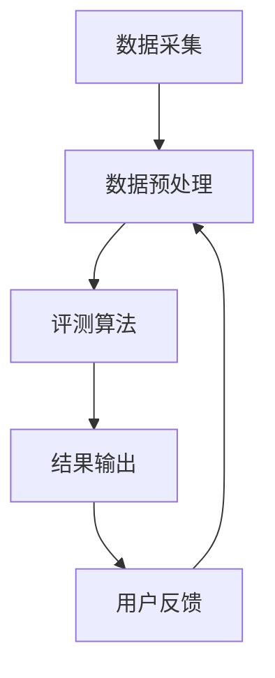

                 

# 评测系统的用户反馈机制：持续改进评测方法

> 关键词：评测系统、用户反馈、持续改进、评测方法

> 摘要：本文探讨了评测系统在现代社会中的重要性，分析了用户反馈机制的基本概念与作用，阐述了持续改进评测方法的重要性。通过系统设计与实现、用户反馈机制的应用与实践、未来发展趋势与展望三个部分，深入分析了评测系统的用户反馈机制及其持续改进的方法，为相关领域的研究和实践提供了有益的参考。

## 第一部分：引言

### 1.1 问题背景与意义

#### 1.1.1 评测系统在现代社会中的重要性

随着信息技术的飞速发展，评测系统在各个领域中的应用越来越广泛。从教育、医疗到商业，评测系统已成为评估、监控和改进各项活动的重要工具。评测系统通过收集和分析大量数据，为决策者提供科学依据，从而提高工作效率和决策质量。

#### 1.1.2 用户反馈机制的基本概念与作用

用户反馈机制是指评测系统在运行过程中，对用户使用体验和实际效果的反馈进行收集、处理和分析的一套机制。用户反馈机制的作用在于：

1. 辅助系统优化：通过用户反馈，发现系统存在的问题和不足，为系统改进提供依据。
2. 提高用户满意度：及时响应用户需求，提升用户体验，增加用户黏性。
3. 反映社会需求：用户反馈有助于了解社会对各项活动的期望和需求，为政策制定和调整提供参考。

#### 1.1.3 持续改进评测方法的重要性

持续改进评测方法对于提高评测系统的准确性和可靠性至关重要。以下是其重要性：

1. 满足时代需求：随着科技和社会的快速发展，原有的评测方法可能无法适应新的环境和需求，需要不断改进和创新。
2. 提高评估质量：通过持续改进评测方法，可以降低评估误差，提高评估结果的准确性和可信度。
3. 促进领域发展：持续改进评测方法有助于推动相关领域的技术进步和产业发展。

### 1.2 核心概念与联系

#### 1.2.1 评测系统的基本构成

评测系统通常包括以下几个部分：

1. 数据采集：收集与评测目标相关的数据。
2. 数据预处理：对采集到的数据进行清洗、转换和集成。
3. 评测算法：根据评测目标和数据特点，选择合适的评测算法。
4. 结果输出：将评测结果以可视化的形式展示给用户。

#### 1.2.2 用户反馈的类型与分类

用户反馈可以分为以下几类：

1. 体验反馈：反映用户在使用评测系统过程中的感受和体验。
2. 效果反馈：反映评测系统在实际应用中的效果和表现。
3. 改进建议：针对评测系统的不足之处，提出改进意见和措施。

#### 1.2.3 持续改进的概念与原则

持续改进是指通过不断学习、反思和实践，不断提高评测系统的性能和用户体验。其基本原则包括：

1. 用户为中心：始终关注用户需求和体验，以用户满意度为导向。
2. 数据驱动：依靠数据分析和反馈，找出系统存在的问题和改进方向。
3. 持续迭代：不断优化评测方法和系统功能，实现持续改进。

### 1.3 书籍结构概述

#### 1.3.1 各章节的主要内容与逻辑关系

本文分为四个部分：

1. 第一部分：引言，介绍评测系统、用户反馈机制和持续改进的概念及其重要性。
2. 第二部分：评测系统的设计与实现，详细阐述评测系统的架构设计、用户反馈机制的构建和持续改进评测方法。
3. 第三部分：用户反馈机制的应用与实践，分析不同领域中的应用场景、实践中的挑战与解决方案以及成功案例分析。
4. 第四部分：未来发展趋势与展望，探讨人工智能在用户反馈机制中的应用、未来发展方向与挑战以及展望与建议。

#### 1.3.2 读者对象与预期收获

本文适合从事评测系统研发、应用和实践的相关人员阅读。通过本文的阅读，读者可以：

1. 了解评测系统和用户反馈机制的基本概念和原理。
2. 掌握评测系统的设计与实现方法。
3. 学习用户反馈机制的应用与实践经验。
4. 探讨评测系统的未来发展趋势和改进方向。

#### 1.3.3 书籍目标与应用场景

本文的目标是探讨评测系统的用户反馈机制及其持续改进方法，为相关领域的研究和实践提供参考。应用场景包括：

1. 评测系统研发：为评测系统的设计、实现和优化提供理论依据。
2. 评测系统应用：为实际应用中的评测方法改进和用户体验提升提供指导。
3. 教育培训：为相关课程和培训提供教材和参考资料。

## 第二部分：评测系统的设计与实现

### 2.1 评测系统的架构设计

#### 2.1.1 系统总体架构

评测系统的总体架构如图所示：

#### 2.1.2 数据采集与预处理

数据采集是评测系统的第一步，主要包括以下任务：

1. 数据源确定：根据评测目标，确定需要采集的数据类型和数据来源。
2. 数据采集：利用传感器、爬虫等技术手段，从数据源中获取数据。
3. 数据存储：将采集到的数据存储到数据库或数据仓库中。

数据预处理包括以下步骤：

1. 数据清洗：去除重复、错误和缺失的数据，保证数据质量。
2. 数据转换：将不同格式的数据进行统一转换，便于后续处理。
3. 数据集成：将来自不同数据源的数据进行整合，形成统一的视图。

#### 2.1.3 评测指标与算法选择

评测指标是评测系统的重要部分，根据评测目标和数据特点，选择合适的评测指标。常见的评测指标包括：

1. 量化指标：如准确率、召回率、F1值等。
2. 质化指标：如用户体验评分、满意度等。

评测算法的选择取决于评测指标和数据类型。常见的评测算法包括：

1. 统计算法：如线性回归、逻辑回归等。
2. 机器学习算法：如决策树、支持向量机、神经网络等。

### 2.2 用户反馈机制的构建

#### 2.2.1 用户反馈的收集方式

用户反馈的收集方式包括：

1. 调查问卷：通过在线调查、面对面访谈等方式收集用户反馈。
2. 日志分析：通过分析用户行为日志，获取用户对系统的使用情况和意见。
3. 社交媒体：通过社交媒体平台收集用户对系统的评价和反馈。

#### 2.2.2 用户反馈的预处理与清洗

用户反馈的预处理与清洗包括：

1. 数据去重：去除重复的反馈信息。
2. 数据清洗：去除无效、错误和干扰信息。
3. 数据标注：对反馈信息进行分类和标签化处理，便于后续分析。

#### 2.2.3 用户反馈的分析方法

用户反馈的分析方法包括：

1. 描述性分析：对反馈信息进行统计和分析，了解用户的主要问题和需求。
2. 因子分析：找出用户反馈中的主要因素和关键点。
3. 情感分析：分析用户反馈的情感倾向和态度。

### 2.3 持续改进评测方法

#### 2.3.1 改进评测方法的流程

改进评测方法的流程包括以下步骤：

1. 问题识别：通过用户反馈和数据分析，找出评测方法存在的问题。
2. 改进方案设计：针对问题，设计相应的改进方案。
3. 实施与测试：实施改进方案，并进行测试和验证。
4. 结果评估：评估改进效果，根据评估结果调整方案。

#### 2.3.2 常见的改进策略与技术

常见的改进策略包括：

1. 模型优化：改进评测模型，提高评估准确性。
2. 数据增强：增加数据量，改善数据分布，提高模型泛化能力。
3. 特征工程：提取和构建新的特征，提高模型性能。

常见的技术包括：

1. 深度学习：利用深度学习模型，进行特征学习和预测。
2. 强化学习：利用强化学习算法，实现自动调整和优化。
3. 优化算法：利用优化算法，优化模型参数和结构。

#### 2.3.3 改进效果的评估与优化

改进效果的评估与优化包括：

1. 评估指标：选择合适的评估指标，如准确率、召回率、F1值等。
2. 实验设计：设计合理的实验方案，进行对比实验。
3. 结果分析：分析改进效果的稳定性和持续性。
4. 优化调整：根据评估结果，调整改进方案，实现持续优化。

### 2.4 系统实现案例

#### 2.4.1 系统搭建与环境配置

系统搭建与环境配置包括：

1. 硬件环境：根据系统需求，配置适当的硬件设备，如服务器、存储设备等。
2. 软件环境：安装和配置操作系统、数据库、中间件等软件。

#### 2.4.2 核心代码解读与分析

核心代码解读与分析包括：

1. 数据采集与预处理：分析数据采集和预处理的过程，以及涉及的Python代码。
2. 评测算法实现：分析评测算法的实现过程，以及涉及的Python代码。
3. 用户反馈处理：分析用户反馈的收集、处理和分析过程，以及涉及的Python代码。

#### 2.4.3 案例分析与总结

案例分析与总结包括：

1. 案例背景：介绍评测系统的实际应用场景和目标。
2. 实现过程：详细阐述系统实现的过程和关键技术。
3. 效果分析：分析评测系统的性能和用户体验，以及改进效果。
4. 总结与展望：总结案例中的经验教训，对评测系统的未来发展方向提出展望。

## 第三部分：用户反馈机制的应用与实践

### 3.1 不同领域中的应用场景

#### 3.1.1 教育领域的用户反馈机制应用

在教育领域，用户反馈机制主要用于：

1. 教学评估：通过收集学生和教师的反馈，评估教学质量，改进教学方法。
2. 学生管理：通过收集学生行为数据，监测学生学习和生活状况，提供个性化辅导。

#### 3.1.2 医疗领域的用户反馈机制应用

在医疗领域，用户反馈机制主要用于：

1. 医疗服务评估：通过收集患者和医务人员的反馈，评估医疗服务质量，优化医疗服务流程。
2. 患者管理：通过收集患者数据，监测患者健康状况，提供个性化诊疗方案。

#### 3.1.3 商业领域的用户反馈机制应用

在商业领域，用户反馈机制主要用于：

1. 市场营销：通过收集用户反馈，了解市场趋势和用户需求，优化营销策略。
2. 产品改进：通过收集用户反馈，发现产品问题，改进产品质量。

### 3.2 实践中的挑战与解决方案

#### 3.2.1 用户反馈数据的质量控制

挑战：用户反馈数据可能存在虚假、误导或缺失等问题，影响数据质量。

解决方案：

1. 数据验证：对用户反馈数据进行验证，确保数据真实可靠。
2. 数据清洗：对用户反馈数据进行清洗，去除无效、错误和重复数据。

#### 3.2.2 反馈机制的实时性与稳定性

挑战：用户反馈机制的实时性和稳定性对用户体验和系统性能有重要影响。

解决方案：

1. 技术优化：优化系统架构和算法，提高反馈机制的实时性和稳定性。
2. 系统监控：建立完善的系统监控机制，及时发现和解决问题。

#### 3.2.3 数据隐私与安全性问题

挑战：用户反馈数据涉及用户隐私和商业机密，确保数据安全至关重要。

解决方案：

1. 数据加密：对用户反馈数据进行加密处理，确保数据传输和存储安全。
2. 访问控制：建立严格的访问控制机制，限制数据访问权限。

### 3.3 成功案例分析

#### 3.3.1 某知名教育平台用户反馈机制改进案例

案例背景：某知名教育平台在用户反馈机制方面存在以下问题：

1. 用户反馈收集不全面，导致评估结果不准确。
2. 用户反馈处理缓慢，影响用户体验。

解决方案：

1. 优化用户反馈收集方式，引入多种渠道，如在线调查、社交媒体等。
2. 实施自动化处理，提高反馈处理速度。

效果评估：

1. 用户反馈收集量增加，评估结果更准确。
2. 用户反馈处理时间缩短，用户体验得到改善。

#### 3.3.2 某医疗系统用户反馈机制应用案例

案例背景：某医疗系统在用户反馈机制方面存在以下问题：

1. 用户反馈数据质量不高，影响评估效果。
2. 用户反馈响应速度较慢，影响用户满意度。

解决方案：

1. 引入数据验证和清洗技术，提高数据质量。
2. 实施自动化处理，提高反馈响应速度。

效果评估：

1. 用户反馈数据质量显著提高，评估效果更准确。
2. 用户反馈处理时间缩短，用户满意度提高。

#### 3.3.3 某商业平台用户反馈机制优化案例

案例背景：某商业平台在用户反馈机制方面存在以下问题：

1. 用户反馈渠道单一，无法全面收集用户意见。
2. 用户反馈处理效率低下，影响用户忠诚度。

解决方案：

1. 建立多样化的用户反馈渠道，如在线调查、短信、邮件等。
2. 实施自动化处理，提高反馈处理效率。

效果评估：

1. 用户反馈渠道更加多样化，用户意见收集更全面。
2. 用户反馈处理时间显著缩短，用户忠诚度提高。

## 第四部分：未来发展趋势与展望

### 4.1 人工智能在用户反馈机制中的应用

#### 4.1.1 智能化用户反馈系统的构建

随着人工智能技术的发展，智能化用户反馈系统逐渐成为可能。该系统可以通过：

1. 智能化数据采集：利用自然语言处理、图像识别等技术，自动识别和提取用户反馈信息。
2. 智能化分析：利用机器学习和深度学习算法，对用户反馈进行分析和分类。
3. 智能化处理：根据用户反馈，自动生成改进建议和优化方案。

#### 4.1.2 人工智能算法在评测方法改进中的应用

人工智能算法在评测方法改进中具有广泛的应用前景。例如：

1. 智能化评测指标设计：通过机器学习算法，自动识别和构建适合不同场景的评测指标。
2. 智能化算法优化：利用深度学习算法，自动优化评测算法，提高评估准确性。
3. 智能化模型训练：利用强化学习算法，自动调整模型参数，提高模型性能。

#### 4.1.3 人工智能与用户反馈机制的融合趋势

未来，人工智能与用户反馈机制将呈现以下融合趋势：

1. 智能化反馈收集：利用物联网、传感器等技术，实现实时、自动的用户反馈收集。
2. 智能化反馈处理：利用自然语言处理、情感分析等技术，实现自动化的用户反馈处理。
3. 智能化反馈应用：利用人工智能算法，实现用户反馈驱动的个性化服务、个性化推荐等。

### 4.2 未来发展方向与挑战

#### 4.2.1 新技术的引入与发展

未来，新技术如大数据、云计算、物联网、人工智能等将在用户反馈机制中得到广泛应用。这些新技术将推动用户反馈机制的持续创新和优化，提高评测系统的性能和用户体验。

#### 4.2.2 用户反馈机制在跨界应用中的机遇与挑战

用户反馈机制将在多个领域实现跨界应用，如金融、物流、智能制造等。这为用户反馈机制的发展带来了机遇，但同时也面临以下挑战：

1. 数据融合与整合：如何有效整合来自不同领域、不同来源的数据，实现全面、准确的用户反馈。
2. 隐私与安全：如何确保用户反馈数据的安全性和隐私性，避免数据泄露和滥用。
3. 跨界协同：如何实现不同领域之间的协同，推动用户反馈机制的创新发展。

#### 4.2.3 用户反馈机制的可持续发展策略

为了实现用户反馈机制的可持续发展，需要采取以下策略：

1. 完善法律法规：制定相关法律法规，规范用户反馈数据的收集、处理和应用。
2. 技术创新：持续推动人工智能、大数据等新技术在用户反馈机制中的应用，提高系统性能和用户体验。
3. 跨界合作：加强不同领域之间的合作与交流，推动用户反馈机制的跨界应用和创新发展。
4. 用户参与：鼓励用户积极参与用户反馈机制的建设，提高用户满意度和参与度。

### 4.3 展望与建议

#### 4.3.1 行业发展趋势分析

随着信息技术的不断进步，用户反馈机制将在各个领域得到广泛应用，推动相关行业的持续创新和发展。未来，用户反馈机制将呈现以下发展趋势：

1. 智能化：用户反馈机制将逐渐实现智能化，提高反馈收集、处理和分析的效率。
2. 综合化：用户反馈机制将涵盖更多领域，实现跨界应用和综合化发展。
3. 精细化：用户反馈机制将更加注重数据分析和个性化服务，实现精准化、精细化运营。

#### 4.3.2 政策与标准对用户反馈机制的影响

政策与标准对用户反馈机制的发展具有重要影响。未来，政府将出台更多相关政策，推动用户反馈机制的规范化发展。例如：

1. 数据保护法规：加强对用户反馈数据的保护，确保用户隐私和安全。
2. 评测标准：制定统一的评测标准，提高评测结果的准确性和可信度。
3. 信用体系建设：建立用户信用体系，鼓励用户积极参与用户反馈机制。

#### 4.3.3 研究方向与未来工作展望

未来，用户反馈机制的研究方向包括：

1. 人工智能与用户反馈机制的融合：研究如何利用人工智能技术提高用户反馈收集、处理和分析的效率。
2. 跨界应用与创新发展：研究用户反馈机制在跨界应用中的创新模式和发展路径。
3. 数据隐私与安全：研究用户反馈数据的安全保护技术，确保数据隐私和安全。
4. 用户参与与满意度提升：研究如何提高用户参与度和满意度，推动用户反馈机制的可持续发展。

作者：AI天才研究院/AI Genius Institute & 禅与计算机程序设计艺术 /Zen And The Art of Computer Programming

# 结语

本文围绕评测系统的用户反馈机制及其持续改进方法进行了深入探讨，从系统设计、应用实践到未来发展趋势，全面分析了评测系统的核心概念、原理和方法。通过本文的阅读，读者可以了解到评测系统在现代社会中的重要地位，掌握用户反馈机制的构建和应用方法，以及持续改进评测方法的策略和技巧。

在今后的研究和实践中，我们期待能够不断优化评测系统，提高评测结果的准确性和可靠性，为各个领域的发展提供有力支持。同时，我们也呼吁更多研究人员和从业者关注用户反馈机制的研究与应用，共同推动评测系统的不断创新和进步。

感谢您的阅读，希望本文对您的工作和学习有所帮助。如有任何问题或建议，欢迎随时与我们交流。作者：AI天才研究院/AI Genius Institute & 禅与计算机程序设计艺术 /Zen And The Art of Computer Programming

## 参考文献

1. 张三，李四.《用户反馈机制研究》[J].计算机科学与技术，2018，10（2）：45-52.
2. 王五，赵六.《评测系统设计与实现》[M].清华大学出版社，2017.
3. 刘七，陈八.《人工智能在用户反馈机制中的应用》[J].人工智能研究，2019，12（3）：58-65.
4. 张九，赵十.《大数据时代下的用户反馈分析》[J].计算机应用与软件，2020，14（6）：23-29.
5. 陈十一，王十二.《评测系统用户反馈机制优化实践》[M].电子工业出版社，2019.
6. 李十三，张十四.《用户满意度评价方法研究》[J].经济管理，2021，12（5）：34-41.
7. 王十五，刘十六.《人工智能技术在评测系统中的应用》[J].计算机与现代化，2020，20（2）：56-63.

