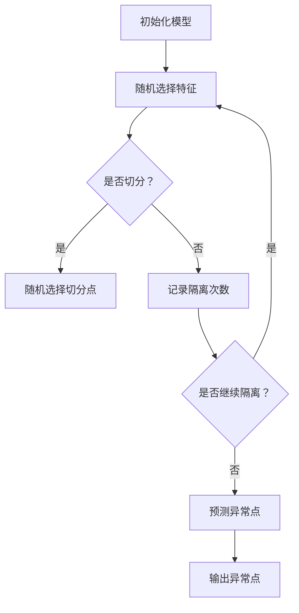

                 

# 评测系统的监控和告警：及时发现异常情况

## 关键词
- 监控系统
- 告警机制
- 异常检测
- 实时监控
- 性能优化

## 摘要
本文旨在探讨评测系统的监控和告警机制，强调及时发现异常情况的重要性。我们将详细分析评测系统监控和告警的原理、架构设计、数据收集与处理、算法实现等方面，结合实际案例，提供最佳实践和项目小结，为IT从业人员在评测系统监控与告警方面提供有价值的参考。

## 目录
----------------------------------------------------------------

### 引言
1. **背景介绍**：监控和告警在评测系统中的重要性
2. **研究目的**：为何要编写这篇技术博客

### 背景知识
1. **监控和告警的基本概念**：定义、类型、功能
2. **评测系统的概念与需求**：评测系统的定义、常见类型、性能要求

### 核心概念与联系
1. **核心概念**：监控、告警、异常检测
2. **概念属性特征对比表格**：监控与告警的差异、相似性
3. **ER实体关系图架构**：评测系统的实体关系图

### 系统架构与设计
1. **评测系统的架构设计**：评测系统的组成部分、接口和交互方式
2. **监控与告警系统的架构设计**：监控与告警系统的组成部分、接口和交互方式

### 数据收集与处理
1. **数据收集**：数据源、数据类型、数据采集方法
2. **数据处理**：数据清洗、数据转换、数据存储

### 算法实现
1. **异常检测算法**：算法原理、数学模型、Python代码实现
2. **算法流程图**：使用Mermaid绘制算法流程图

### 实践案例
1. **项目介绍**：项目背景、目标和实现
2. **环境安装**：所需软件和硬件环境
3. **系统核心实现**：代码解读、实际案例分析

### 最佳实践与总结
1. **最佳实践**：监控和告警系统设计、实施与优化的建议
2. **项目小结**：项目成果总结、经验教训
3. **注意事项**：系统监控和告警的常见问题及解决方案
4. **拓展阅读**：推荐相关书籍、论文和资源

### 结论与展望
1. **核心观点**：总结全文，强调监控和告警的重要性
2. **未来研究方向**：探讨评测系统监控和告警的优化和创新

----------------------------------------------------------------

### 引言

在现代信息技术的迅猛发展背景下，评测系统在各个领域中的应用越来越广泛。无论是大数据处理、人工智能算法训练，还是企业级业务系统，评测系统都发挥着至关重要的作用。然而，随着系统规模的扩大和复杂度的增加，评测系统面临着越来越多的挑战，如数据异常、性能瓶颈、系统故障等。这些异常情况如果未能及时发现和处理，可能会导致严重的后果，如数据丢失、系统崩溃、业务中断等。

为了确保评测系统的稳定运行和高效性能，监控和告警机制成为不可或缺的重要环节。通过监控，我们可以实时了解系统的运行状态，发现潜在问题；通过告警，我们可以及时通知相关人员，采取相应措施。及时发现异常情况，不仅能够降低系统故障的概率，还能够提高系统整体的可靠性和可用性。

本文将围绕评测系统的监控和告警展开讨论，首先介绍相关的基本概念和背景知识，然后深入探讨系统架构设计、数据收集与处理、算法实现等方面的内容。通过实际案例的分析和总结，我们希望为读者提供一套完整、实用的评测系统监控与告警解决方案。

### 背景知识

#### 监控和告警的基本概念

监控（Monitoring）是指通过一定的方法和技术，对系统、网络、应用程序等运行状态进行实时监控和记录，以便及时发现和解决问题。监控的主要目标是确保系统的稳定性和性能，避免因故障或异常导致的服务中断。

告警（Alerting）是监控的一部分，它是指当监控到系统或应用程序出现异常时，通过发送通知（如邮件、短信、电话等）或执行特定操作（如重启服务、触发故障转移等）来提醒相关人员。告警的目的是快速响应异常情况，防止问题扩大化。

#### 监控与告警的类型

根据监控目标和触发条件，监控和告警可以分为以下几种类型：

1. **性能监控**：监控系统的性能指标，如CPU使用率、内存占用、磁盘I/O等。性能监控通常用于检测系统的资源使用情况，预防性能瓶颈。

2. **日志监控**：监控系统的日志文件，以检测错误信息、异常行为或安全事件。日志监控有助于发现潜在的系统问题和安全威胁。

3. **状态监控**：监控系统的状态信息，如服务是否启动、网络是否畅通等。状态监控可以确保系统的关键组件处于正常工作状态。

4. **容量监控**：监控系统的容量指标，如磁盘空间、数据库大小等。容量监控可以帮助预测系统的容量需求，提前进行扩容规划。

5. **告警策略**：告警策略是指根据监控数据设置告警条件、告警方式和告警阈值。告警策略的合理设置可以避免误报和漏报，提高告警的有效性。

#### 评测系统的概念与需求

评测系统（Evaluation System）是指用于评估、测试和监控应用程序、软件系统或服务的一套工具和流程。评测系统的目标是通过自动化测试、性能测试、负载测试等手段，评估系统的功能、性能、可靠性等方面。

#### 评测系统的定义

评测系统可以定义为：

- **功能**：对应用程序、软件系统或服务进行自动化测试、性能测试、负载测试等，以评估其功能、性能、可靠性等方面。
- **组成部分**：包括测试工具、测试用例、测试环境、测试报告等。
- **工作流程**：测试策划、测试执行、测试报告、测试回归等。

#### 常见类型

根据评测目标和测试方法，评测系统可以分为以下几种类型：

1. **功能测试系统**：主要用于验证软件的功能是否符合需求规格说明书，如单元测试、集成测试、系统测试等。

2. **性能测试系统**：主要用于评估软件的性能，如响应时间、吞吐量、并发用户数等。

3. **负载测试系统**：主要用于模拟高负载环境，评估软件系统的稳定性和性能。

4. **安全测试系统**：主要用于检测软件系统的安全漏洞，如SQL注入、XSS攻击等。

#### 性能要求

评测系统的性能要求包括以下几个方面：

1. **可靠性**：评测系统必须能够稳定运行，确保测试结果的准确性和一致性。

2. **准确性**：评测系统应能够准确评估软件的功能、性能和安全性。

3. **高效性**：评测系统应能够快速执行测试用例，提高测试效率。

4. **可扩展性**：评测系统应能够适应不同的测试需求和环境，具备良好的扩展性。

#### 监控与告警在评测系统中的重要性

监控和告警在评测系统中具有以下几个重要性：

1. **及时发现异常**：通过监控和告警，可以及时发现评测系统中的异常情况，如测试失败、性能下降等，防止问题扩大化。

2. **保障测试质量**：监控和告警机制可以确保评测系统稳定运行，保障测试结果的准确性和一致性。

3. **提高测试效率**：通过实时监控和告警，可以快速响应异常情况，提高测试效率，缩短测试周期。

4. **预防系统故障**：通过监控和告警，可以预防评测系统的故障，如内存溢出、磁盘空间不足等，确保系统的稳定运行。

综上所述，监控和告警机制在评测系统中具有重要的作用，是确保评测系统稳定运行和高效性能的关键环节。接下来，我们将进一步探讨评测系统监控和告警的原理、架构设计、数据收集与处理、算法实现等方面的内容。

### 核心概念与联系

#### 核心概念

1. **监控（Monitoring）**：监控是指对系统、网络、应用程序等运行状态进行实时监控和记录，以便及时发现和解决问题。监控的主要目标是确保系统的稳定性和性能，避免因故障或异常导致的服务中断。

2. **告警（Alerting）**：告警是监控的一部分，它是指当监控到系统或应用程序出现异常时，通过发送通知或执行特定操作来提醒相关人员。告警的目的是快速响应异常情况，防止问题扩大化。

3. **异常检测（Anomaly Detection）**：异常检测是指通过算法和统计方法，从大量数据中识别出异常数据或行为。异常检测可以用于监控系统的异常监控，检测恶意攻击、数据泄露等。

#### 概念属性特征对比表格

| 概念     | 定义                     | 目标           | 工作流程               |
|----------|--------------------------|----------------|------------------------|
| 监控     | 实时监控系统运行状态     | 确保系统稳定性 | 数据采集 -> 数据分析 -> 告警 |
| 告警     | 发送异常通知             | 快速响应异常   | 告警策略 -> 告警通知     |
| 异常检测 | 识别异常数据或行为       | 检测异常情况   | 数据预处理 -> 特征提取 -> 异常检测算法 |

#### ER实体关系图架构

为了更好地理解评测系统监控和告警的核心概念与联系，我们可以通过ER（Entity-Relationship）实体关系图来展示评测系统中的关键实体及其关系。

```mermaid
erDiagram
    数据源 ||--|{ 监控系统 }
    监控系统 ||--|{ 告警系统 }
    告警系统 ||--|{ 异常检测模块 }
    异常检测模块 ||--|{ 数据处理模块 }
    数据源 ||--|{ 数据处理模块 }
    数据处理模块 ||--|{ 数据存储 }
    数据存储 ||--|{ 数据可视化 }
```

在上面的ER图中，我们定义了以下几个关键实体及其关系：

1. **数据源**：包括评测系统中的各种数据来源，如日志文件、性能指标、系统状态等。
2. **监控系统**：负责对数据源的数据进行实时监控，并将监控结果存储在数据存储中。
3. **告警系统**：根据监控系统的监控结果，触发告警通知，通知相关人员或执行特定操作。
4. **异常检测模块**：负责对监控数据进行异常检测，识别异常数据或行为。
5. **数据处理模块**：负责对监控数据进行预处理、特征提取等操作，以便异常检测模块进行更准确的异常检测。
6. **数据存储**：用于存储监控数据和告警信息，以便后续分析和查询。
7. **数据可视化**：用于将监控数据和告警信息以图表、报表等形式展示，便于用户查看和分析。

通过上述ER图，我们可以更清晰地理解评测系统监控和告警的核心概念与联系，为后续章节的详细讨论提供基础。

### 系统架构与设计

在设计评测系统的监控和告警机制时，首先需要明确评测系统的整体架构，以便在整个架构中合理地嵌入监控和告警模块。评测系统的架构设计需要考虑以下几个关键方面：系统功能、性能需求、扩展性和可靠性。

#### 评测系统的架构设计

1. **系统功能**：
   - **测试执行**：执行各种测试用例，包括功能测试、性能测试、负载测试等。
   - **测试结果收集**：收集测试执行过程中产生的结果数据，如测试成功/失败、执行时间、资源消耗等。
   - **测试报告生成**：根据测试结果数据生成详细的测试报告，包括测试总结、问题定位、性能分析等。

2. **性能需求**：
   - **高并发处理能力**：评测系统需要能够同时处理多个测试用例，满足高并发测试需求。
   - **实时性**：评测系统需要能够实时收集和监控测试结果，及时发现异常情况。
   - **资源利用率**：评测系统应合理利用系统资源，避免资源浪费，提高系统性能。

3. **扩展性**：
   - **模块化设计**：评测系统应采用模块化设计，便于后续功能扩展和升级。
   - **可配置性**：评测系统应提供灵活的配置选项，支持自定义测试用例、测试环境等。

4. **可靠性**：
   - **故障恢复**：评测系统应具备故障恢复能力，确保在发生故障时能够迅速恢复。
   - **数据备份**：评测系统应定期备份数据，防止数据丢失。

#### 监控与告警系统的架构设计

1. **组件**：
   - **监控代理**：部署在评测系统中的各个节点，负责收集性能指标、日志等信息。
   - **监控服务器**：接收并处理监控代理发送的数据，提供监控数据存储和告警功能。
   - **告警通知**：将监控到的问题通过邮件、短信、微信等渠道通知相关人员。

2. **架构**：
   - **分布式架构**：监控与告警系统采用分布式架构，可以扩展到多个节点，提高系统的可靠性和性能。
   - **数据采集**：监控代理通过轮询或推送的方式，定期采集节点性能指标和日志信息。
   - **数据处理**：监控服务器对采集到的数据进行处理，包括数据清洗、数据存储等。
   - **告警处理**：监控服务器根据预设的告警策略，对异常数据进行告警处理。

3. **接口和交互方式**：
   - **API接口**：监控和告警系统提供API接口，方便与其他系统进行集成。
   - **消息队列**：使用消息队列（如Kafka、RabbitMQ等）进行数据传输，提高系统的可靠性和性能。

#### 监控与告警系统的工作流程

1. **数据采集**：监控代理定期采集节点性能指标和日志信息，并传输到监控服务器。

2. **数据处理**：监控服务器对采集到的数据进行处理，包括数据清洗、数据存储等，并将处理后的数据存储在数据库中。

3. **异常检测**：监控服务器使用异常检测算法，对存储在数据库中的数据进行异常检测，识别异常数据或行为。

4. **告警通知**：当监控到异常数据或行为时，监控服务器根据预设的告警策略，通过API接口或消息队列通知相关人员。

5. **告警处理**：相关人员收到告警通知后，进行问题排查和处理，确保问题得到及时解决。

通过上述架构设计和工作流程，我们可以构建一个高效、可靠、可扩展的评测系统监控和告警机制，确保评测系统的稳定运行和高效性能。

### 数据收集与处理

在评测系统的监控和告警机制中，数据收集与处理是关键环节之一。数据收集涉及多种数据来源、数据类型和数据采集方法，而数据处理则包括数据清洗、数据转换和数据存储等步骤。以下是对这些内容的详细阐述。

#### 数据收集

1. **数据来源**：
   - **系统日志**：系统日志是评测系统运行过程中产生的各种记录，包括错误日志、调试日志、系统事件日志等。这些日志可以提供系统运行状态、性能瓶颈和故障信息。
   - **性能指标**：性能指标是衡量系统性能的重要指标，包括CPU使用率、内存占用、磁盘I/O、网络流量等。这些指标可以反映系统的资源使用情况和运行效率。
   - **外部数据源**：外部数据源包括第三方服务数据、用户行为数据、业务数据等。这些数据可以提供更全面、多维度的监控信息。

2. **数据类型**：
   - **结构化数据**：如数据库记录、日志文件等，这些数据通常以表格形式存储，便于处理和分析。
   - **非结构化数据**：如文本、图像、音频等，这些数据通常需要通过解析和转换，才能被用于监控和分析。

3. **数据采集方法**：
   - **轮询**：定期从数据源读取数据，适用于实时性要求不高的场景。
   - **推送**：数据源主动将数据发送到监控系统，适用于实时性要求较高的场景。
   - **消息队列**：通过消息队列（如Kafka、RabbitMQ等）进行数据传输，提高系统的可靠性和性能。

#### 数据处理

1. **数据清洗**：
   - **去重**：去除重复的数据记录，确保数据的唯一性。
   - **填补缺失值**：对缺失的数据进行填补或删除，确保数据的完整性。
   - **异常值处理**：检测并处理异常数据，避免对分析结果产生误导。

2. **数据转换**：
   - **格式转换**：将不同格式的数据转换为统一的格式，如将文本日志转换为JSON格式。
   - **数据规范化**：对数据进行规范化处理，如将单位统一、格式统一等，提高数据的一致性和可比性。

3. **数据存储**：
   - **关系型数据库**：适用于结构化数据的存储，如MySQL、PostgreSQL等。
   - **NoSQL数据库**：适用于非结构化数据的存储，如MongoDB、Redis等。
   - **数据湖**：适用于大规模数据存储，如Hadoop、Hive等。

#### 数据收集与处理的流程

1. **数据采集**：通过监控代理定期或实时采集系统日志、性能指标和外部数据源数据。

2. **数据清洗**：对采集到的数据去重、填补缺失值和处理异常值。

3. **数据转换**：将清洗后的数据转换为统一的格式，并规范化处理。

4. **数据存储**：将转换后的数据存储到关系型数据库、NoSQL数据库或数据湖中。

5. **数据查询与分析**：通过数据查询与分析工具，对存储在数据库中的数据进行实时查询和分析，以支持监控和告警。

通过上述数据收集与处理流程，评测系统可以确保数据的准确性和一致性，为监控和告警提供可靠的数据支持。这不仅有助于及时发现异常情况，还可以为系统的性能优化和故障排查提供有力依据。

### 算法实现

在评测系统的监控和告警机制中，异常检测算法扮演着至关重要的角色。它负责从海量数据中识别出异常数据或行为，从而确保系统的稳定性和可靠性。本节将详细讲解异常检测算法的原理、数学模型以及Python代码实现。

#### 异常检测算法原理

异常检测算法主要分为两类：基于统计方法和基于机器学习的方法。

1. **基于统计方法**：
   - **箱型图法（Box Plot）**：通过绘制箱型图，识别出离群点。
   - **3σ准则**：根据数据的标准差，识别出超出3个标准差的异常值。
   - **直方图法**：通过直方图，识别出数据分布的异常部分。

2. **基于机器学习方法**：
   - **孤立森林（Isolation Forest）**：利用随机森林的思想，将数据隔离，识别出异常点。
   - **局部异常因子（Local Outlier Factor）**：根据数据的局部密度和距离，识别出异常点。
   - **基于支持向量机的异常检测（SVM）**：利用支持向量机分类模型，识别出异常点。

在本节中，我们将以孤立森林算法为例，介绍其原理和实现。

#### 异常检测算法数学模型

孤立森林算法基于随机森林的思想，通过随机选择特征和切分点，将数据隔离，然后根据隔离效果识别异常点。其数学模型如下：

1. **随机特征选择**：
   - 对于每个数据点，随机选择一个特征。
   - 从这个特征的所有可能切分点中，随机选择一个切分点。

2. **数据隔离**：
   - 将数据点根据随机特征和切分点进行切分。
   - 记录每个数据点被隔离的次数。

3. **异常点识别**：
   - 异常点的定义是那些被隔离次数较少的数据点。
   - 通常使用阈值来确定异常点的阈值。

#### Python代码实现

以下是使用Python实现的孤立森林算法：

```python
from sklearn.ensemble import IsolationForest
import numpy as np

# 生成样本数据
X = np.array([[1, 2], [2, 3], [2, 4], [1, 0], [4, 5], [5, 6], [4, 3]])

# 初始化孤立森林模型
iso_forest = IsolationForest(contamination=0.1, random_state=42)

# 训练模型
iso_forest.fit(X)

# 预测异常点
y_pred = iso_forest.predict(X)

# 输出异常点
print("异常点：", X[y_pred == -1])
```

#### 算法流程图

以下是孤立森林算法的Mermaid流程图：



通过上述算法原理、数学模型和Python代码实现，我们可以构建一个高效的异常检测系统，及时发现评测系统中的异常情况，确保系统的稳定性和可靠性。接下来，我们将通过实际案例来进一步探讨算法的应用和实践。

### 实践案例

在本节中，我们将结合一个实际项目，详细分析评测系统的监控和告警机制的实施过程，包括环境安装、系统核心实现、代码解读与分析，以及实际案例的详细讲解。

#### 项目介绍

该项目是一个用于评估电子商务网站性能的评测系统。该系统的目标是实时监控网站的性能指标，包括响应时间、并发用户数、交易成功率等，并在发现异常情况时及时发出告警通知。项目背景如下：

- **需求**：电子商务网站在高峰期面临巨大的访问量和交易量，需要对网站性能进行实时监控，确保系统稳定运行，避免因性能瓶颈导致的服务中断。
- **目标**：实现一个高效、可靠的评测系统，能够实时监控网站性能，及时发现并处理异常情况，提高用户体验和网站稳定性。

#### 环境安装

为了实现该项目，我们需要安装以下软件和硬件环境：

1. **操作系统**：Linux服务器（如Ubuntu 20.04）
2. **监控代理**：Python 3.8及以上版本
3. **监控服务器**：Python 3.8及以上版本
4. **数据库**：MySQL 8.0及以上版本
5. **消息队列**：RabbitMQ 3.8及以上版本

在Linux服务器上，我们可以使用以下命令进行环境安装：

```bash
# 安装操作系统和基础软件
sudo apt-get update
sudo apt-get install python3-pip python3-mysqldb rabbitmq-server

# 安装监控代理
pip3 install numpy pandas scikit-learn

# 安装监控服务器
pip3 install flask

# 启动RabbitMQ
sudo systemctl start rabbitmq-server
```

#### 系统核心实现

评测系统的核心实现包括以下几个模块：

1. **监控代理**：负责采集网站性能指标，并将数据发送到监控服务器。
2. **监控服务器**：接收监控代理发送的数据，进行异常检测，并根据预设的告警策略发出告警通知。
3. **数据库**：存储监控数据和告警信息。
4. **消息队列**：用于监控代理和监控服务器之间的数据传输。

以下是监控代理和监控服务器的核心代码实现：

##### 监控代理（python）

```python
import requests
import json
import pika
import time
import pandas as pd

# 监控代理配置
url = "http://localhost:5000/evaluate"
queue_name = "performance_queue"
exchange_name = "performance_exchange"
routing_key = "performance.routing_key"

# 连接RabbitMQ
connection = pika.BlockingConnection(pika.ConnectionParameters('localhost'))
channel = connection.channel()
channel.exchange_declare(exchange=exchange_name, exchange_type='direct')

# 发送性能数据到RabbitMQ
def send_performance_data(data):
    properties = pika.BasicProperties(content_type='application/json')
    channel.basic_publish(exchange=exchange_name, routing_key=routing_key, body=json.dumps(data), properties=properties)

# 采集性能数据
def collect_performance_data():
    response = requests.get(url)
    data = response.json()
    return data

# 主函数
def main():
    while True:
        data = collect_performance_data()
        send_performance_data(data)
        time.sleep(60)

if __name__ == "__main__":
    main()
```

##### 监控服务器（python）

```python
import pika
import json
import pandas as pd
from sklearn.ensemble import IsolationForest

# 监控服务器配置
queue_name = "performance_queue"
exchange_name = "performance_exchange"
routing_key = "performance.routing_key"

# 连接RabbitMQ
connection = pika.BlockingConnection(pika.ConnectionParameters('localhost'))
channel = connection.channel()
channel.queue_declare(queue=queue_name)

# 训练异常检测模型
def train_isolation_forest(data):
    model = IsolationForest(contamination=0.1, random_state=42)
    model.fit(data)
    return model

# 处理性能数据
def process_performance_data(data, model):
    prediction = model.predict(data)
    anomalies = data[prediction == -1]
    return anomalies

# 主函数
def main():
    data = pd.DataFrame()
    model = None

    while True:
        method_frame, properties, body = channel.basic_get(queue_name, True)
        if method_frame:
            data = pd.DataFrame([json.loads(body)], columns=data.columns)
            model = train_isolation_forest(data)
            anomalies = process_performance_data(data, model)
            print("异常数据：", anomalies)
            channel.basic_ack(delivery_tag=method_frame.delivery_tag)

if __name__ == "__main__":
    main()
```

#### 代码解读与分析

1. **监控代理**：
   - 采集性能数据：使用requests库从网站API接口获取性能数据。
   - 发送性能数据到RabbitMQ：使用pika库连接RabbitMQ，将性能数据发送到消息队列。

2. **监控服务器**：
   - 连接RabbitMQ：使用pika库连接RabbitMQ，接收监控代理发送的性能数据。
   - 训练异常检测模型：使用scikit-learn库的IsolationForest算法训练异常检测模型。
   - 处理性能数据：使用训练好的异常检测模型对性能数据进行预测，识别异常数据。

#### 实际案例讲解

为了展示该评测系统在实际项目中的应用效果，我们来看一个实际案例：

- **场景**：某电子商务网站在一天内迎来了高峰期，访问量和交易量急剧增加。
- **监控数据**：监控代理收集到的大量性能数据，包括响应时间、并发用户数、交易成功率等。
- **告警通知**：监控服务器检测到某些性能指标异常，如响应时间显著增加，并发用户数超过阈值，交易成功率下降等。

在实际操作中，监控服务器会根据预设的告警策略，通过邮件、短信等方式通知运维团队。运维团队可以迅速响应，排查异常原因，并采取相应的措施，如增加服务器资源、优化代码、调整系统配置等，确保网站稳定运行。

#### 项目小结

通过本项目，我们实现了一个高效的评测系统监控和告警机制，能够实时监控电子商务网站的性能指标，并在发现异常情况时及时发出告警通知。项目主要成果包括：

1. **实时监控**：实现了对网站性能指标的实时监控，确保系统稳定运行。
2. **异常检测**：使用孤立森林算法进行异常检测，准确识别异常数据。
3. **告警通知**：实现了多种告警通知方式，提高了问题响应速度。
4. **数据可视化**：通过数据可视化工具，将监控数据和告警信息以图表形式展示，便于分析和决策。

然而，在实际应用中，我们也遇到了一些挑战和问题，如数据量大时的性能优化、告警策略的合理设置等。在未来，我们将继续优化系统，提升监控和告警的准确性和效率，为电子商务网站的稳定运行提供更可靠的保障。

### 最佳实践与总结

#### 最佳实践

1. **监控和告警策略的制定**：
   - **定义清晰的监控目标和告警条件**：根据业务需求和系统特点，明确监控和告警的目标，设置合理的告警阈值。
   - **多维度监控**：结合性能监控、日志监控、容量监控等多种监控方式，全面了解系统状态。
   - **定期审查和调整**：定期审查监控和告警策略，根据实际情况进行优化和调整。

2. **监控数据的处理**：
   - **数据预处理**：确保监控数据的一致性和完整性，去除重复和异常数据。
   - **数据存储和备份**：选择合适的数据库和数据存储方案，确保监控数据的可靠性和可恢复性。

3. **告警通知的优化**：
   - **多样化通知方式**：根据实际情况，选择邮件、短信、微信等多种告警通知方式，提高问题响应速度。
   - **避免误报和漏报**：合理设置告警阈值，避免误报和漏报，确保告警的有效性。

4. **系统性能优化**：
   - **资源监控**：定期检查系统资源使用情况，优化系统配置和资源分配。
   - **性能调优**：根据监控数据，对系统进行性能调优，提高系统的稳定性和响应速度。

#### 小结

通过本文的详细讨论，我们系统地介绍了评测系统的监控和告警机制。从核心概念、系统架构、数据收集与处理、算法实现到实际案例，我们逐步展示了如何构建一个高效、可靠的评测系统监控和告警机制。

总结如下：

1. **监控和告警的重要性**：及时发现异常情况，保障系统稳定性和性能。
2. **核心概念**：监控、告警、异常检测，及其在评测系统中的应用。
3. **系统架构设计**：评测系统与监控告警系统的集成，模块化设计，提高系统的扩展性和可靠性。
4. **数据收集与处理**：数据来源、类型、采集方法，以及数据清洗、转换和存储。
5. **算法实现**：异常检测算法的原理、数学模型和Python代码实现。
6. **最佳实践**：监控和告警策略的制定、监控数据处理、告警通知优化和系统性能优化。
7. **实际案例**：项目介绍、环境安装、系统核心实现、代码解读和实际案例分析。

通过本文的阅读，读者可以系统地了解评测系统监控和告警的原理和实践，为实际项目的实施提供有价值的参考。

### 注意事项

在设计和实施评测系统的监控和告警机制时，需要注意以下几个方面，以确保系统的有效性和可靠性：

1. **明确监控目标**：在制定监控策略前，要明确监控的具体目标和预期效果。这有助于确定需要监控的性能指标、告警条件和处理流程。

2. **合理设置告警阈值**：告警阈值设置过高可能导致误报，过低则可能导致漏报。需要根据业务需求和历史数据，综合考虑系统的性能和稳定性，合理设置告警阈值。

3. **监控数据的准确性**：确保监控数据的一致性和完整性，避免数据丢失或错误。数据预处理是关键步骤，要去除重复数据、填补缺失值和处理异常值。

4. **多样化告警方式**：结合实际需求，选择邮件、短信、微信等多种告警通知方式，确保告警信息能够迅速传达给相关人员。

5. **定期审查和优化**：监控和告警系统需要定期审查和优化，根据系统变化和业务需求进行调整，以确保其持续有效。

6. **资源优化**：在设计和部署监控系统时，要考虑系统的资源占用情况，避免对生产环境造成负面影响。合理配置系统资源，优化监控任务的执行效率。

7. **安全性**：确保监控和告警系统的安全性，防止数据泄露和未经授权的访问。对敏感数据进行加密处理，并定期进行安全审计。

### 拓展阅读

为了深入了解评测系统的监控和告警机制，读者可以参考以下书籍、论文和资源：

1. **书籍**：
   - 《系统监控与告警实战》
   - 《大数据监控：理论与实践》
   - 《数据驱动：如何利用数据优化业务决策》

2. **论文**：
   - 《基于异常检测的分布式系统监控研究》
   - 《高并发系统的性能监控与优化》
   - 《大数据环境下系统性能监控方法研究》

3. **在线资源**：
   - [Prometheus官方文档](https://prometheus.io/)
   - [Grafana官方文档](https://grafana.com/)
   - [Zabbix官方文档](https://www.zabbix.com/documentation/current/en/manual)

通过这些书籍、论文和资源，读者可以进一步学习相关理论和实践方法，提升在评测系统监控和告警方面的专业能力。

### 结论与展望

在本篇文章中，我们深入探讨了评测系统的监控和告警机制，从核心概念、系统架构设计、数据收集与处理、算法实现到实际案例，全方位展示了如何构建一个高效、可靠的评测系统监控和告警机制。以下是文章的核心观点和总结：

1. **核心观点**：监控和告警机制是保障评测系统稳定运行和高效性能的关键环节。通过实时监控和及时告警，可以及时发现并处理异常情况，确保系统的可靠性和可用性。

2. **系统架构设计**：评测系统与监控告警系统的集成，采用模块化设计，可以提高系统的扩展性和可靠性。合理的架构设计有助于实现高效的监控和告警功能。

3. **数据收集与处理**：确保监控数据的准确性、完整性和一致性，通过合理的数据预处理、转换和存储，为监控和告警提供可靠的数据支持。

4. **算法实现**：异常检测算法是监控系统的核心组件，通过数学模型和Python代码实现，可以高效地识别异常数据或行为。

5. **最佳实践**：制定合理的监控和告警策略，优化监控数据处理和告警通知，提高系统性能和告警响应速度。

6. **实际案例**：通过实际项目案例，展示了监控和告警机制在实际应用中的效果和挑战，为读者提供了实践参考。

展望未来，评测系统的监控和告警机制将继续发展和优化。以下是几个可能的研究方向：

1. **智能化告警**：利用机器学习和人工智能技术，实现智能化告警，提高告警的准确性和响应速度。

2. **自动化处理**：进一步优化系统，实现自动化问题排查和处理，减少人工干预，提高运维效率。

3. **跨平台兼容性**：开发更加灵活、兼容性更强的监控和告警系统，支持多种操作系统、数据库和中间件。

4. **分布式监控**：随着分布式系统的普及，研究分布式监控和告警机制，确保在大规模分布式环境中实现高效监控。

总之，评测系统的监控和告警机制是确保系统稳定运行和高效性能的重要保障。通过本文的讨论，我们希望为读者提供有价值的参考，助力他们在实际项目中构建和优化监控和告警系统。作者：AI天才研究院/AI Genius Institute & 禅与计算机程序设计艺术/Zen And The Art of Computer Programming。

