                 


### 第1章 引言

#### 1.1 评测系统的背景与现状

**背景介绍：**
- **核心概念术语说明**：
  - 评测系统：一种自动化工具，用于评估和监控用户行为、系统性能、产品质量等。
  - 用户行为：用户在使用产品或服务过程中的各种操作和反馈。
  - 系统性能：系统的响应速度、稳定性、可靠性等。
  - 产品质量：产品功能完整性、用户体验、易用性等。
- **问题背景**：
  - 随着互联网技术的发展，大量数据被生成和处理，如何高效、准确地评估这些数据成为关键问题。
  - 传统的手工评测方法费时费力，且容易受到主观因素的影响，因此需要开发自动化、智能化的评测系统。
- **问题描述**：
  - 如何构建一个能够自动评估用户行为、系统性能和产品质量的评测系统？
  - 如何保证评测系统的准确性和可靠性？
- **问题解决**：
  - 通过引入神经网络技术，可以实现自动化、智能化的评测。
  - 神经网络可以学习和识别数据中的模式，从而提高评测的准确性和效率。
- **边界与外延**：
  - 评测系统的应用范围广泛，不仅限于互联网产品，还涉及金融、医疗、教育等多个领域。
  - 评测系统的发展方向包括更高效的数据处理能力、更智能的评估模型、更直观的展示方式等。
- **概念结构与核心要素组成**：
  - **核心概念**：评测系统、用户行为、系统性能、产品质量。
  - **结构**：输入数据 -> 数据预处理 -> 神经网络评估 -> 输出评估结果。
  - **要素**：数据源、神经网络模型、评估指标、评估结果展示。

**核心概念与联系：**
- **神经网络**：一种模拟人脑神经网络的计算模型，用于数据分析和模式识别。
- **用户行为**：用户在产品或服务中的交互行为，如点击、评论、购买等。
- **系统性能**：系统在处理任务时的效率、响应速度和稳定性。
- **产品质量**：产品的功能性、用户体验、易用性等方面。

#### 表格：核心概念属性特征对比

| 核心概念 | 属性特征 |
| :----: | :----: |
| 神经网络 | 模拟人脑神经网络，具有自适应学习和非线性处理能力 |
| 用户行为 | 用户在产品或服务中的交互行为，包括点击、评论、购买等 |
| 系统性能 | 系统处理任务的能力，包括响应速度、稳定性和可靠性 |
| 产品质量 | 产品的功能性、用户体验、易用性等方面 |

**Mermaid流程图：神经网络在评测系统中的应用**

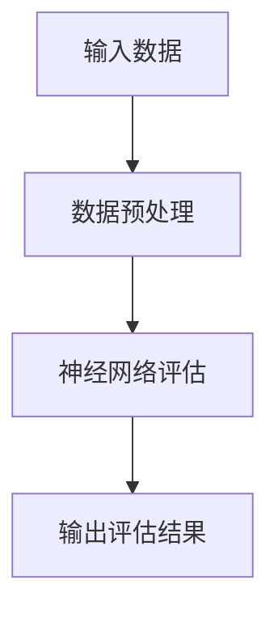

**数学模型与公式：神经网络评估的数学模型**

- **激活函数**：
  $$ a(x) = \sigma(Wx + b) $$
  其中，$ a(x) $ 为激活值，$ W $ 为权重矩阵，$ x $ 为输入数据，$ b $ 为偏置项，$ \sigma $ 为激活函数（如Sigmoid、ReLU等）。

- **损失函数**：
  $$ J = \frac{1}{m}\sum_{i=1}^{m}(y_i - \hat{y}_i)^2 $$
  其中，$ J $ 为损失函数值，$ m $ 为样本数量，$ y_i $ 为实际标签，$ \hat{y}_i $ 为预测标签。

**神经网络评估的数学模型讲解与举例说明：**

1. **激活函数讲解**：
   - 激活函数用于引入非线性因素，使神经网络能够拟合复杂的函数。
   - Sigmoid函数示例：
     $$ a(x) = \frac{1}{1 + e^{-x}} $$
     - 当 $ x = 0 $ 时，$ a(x) \approx 0.5 $。
     - 当 $ x = 2 $ 时，$ a(x) \approx 0.86 $。

2. **损失函数讲解**：
   - 损失函数用于评估预测结果与实际结果的差距，是优化神经网络的关键。
   - 均方误差（MSE）函数示例：
     $$ J = \frac{1}{m}\sum_{i=1}^{m}(y_i - \hat{y}_i)^2 $$
     - 当 $ y_i = \hat{y}_i $ 时，$ J = 0 $，表示预测准确。
     - 当 $ y_i \neq \hat{y}_i $ 时，$ J > 0 $，表示预测误差。

#### 1.2 神经网络的引入

**背景介绍：**
- **神经网络的历史**：
  - 神经网络最早在1943年由McCulloch和Pitts提出，是一种模拟人脑神经元活动的计算模型。
  - 在20世纪80年代，神经网络的研究和应用取得了重要突破，但在计算资源受限的情况下发展缓慢。
  - 随着计算能力和大数据技术的发展，神经网络在21世纪初重新获得了广泛关注。

- **神经网络的优势**：
  - **自适应学习**：神经网络能够通过学习大量数据自动调整内部参数，从而实现自适应学习。
  - **非线性处理**：神经网络能够处理非线性关系，使其在复杂问题中具有很好的表现。
  - **泛化能力**：神经网络通过学习大量数据，能够将学习到的知识泛化到新的数据上。

- **神经网络与传统算法的区别**：
  - **传统算法**：如线性回归、逻辑回归等，通常需要手动设置参数，并且只能处理线性关系。
  - **神经网络**：具有自适应学习和非线性处理能力，能够处理复杂的非线性关系。

**问题场景介绍**：
- **互联网产品评测**：如网站点击率预测、用户满意度评估等。
- **系统性能监控**：如服务器负载预测、系统稳定性评估等。
- **产品质量检测**：如软件缺陷预测、产品质量分析等。

**项目介绍**：
- **项目名称**：基于神经网络的评测系统
- **项目目标**：构建一个自动化、智能化的评测系统，用于评估用户行为、系统性能和产品质量。
- **项目意义**：提高评测的准确性和效率，辅助企业决策，优化业务流程。

**系统功能设计（领域模型mermaid类图）：**

```mermaid
classDiagram
  User <<User>>
  System <<System>>
  Product <<Product>>
  EvaluationSystem <<EvaluationSystem>>
  
  User --> EvaluationSystem
  System --> EvaluationSystem
  Product --> EvaluationSystem
```

**系统架构设计（mermaid架构图）：**

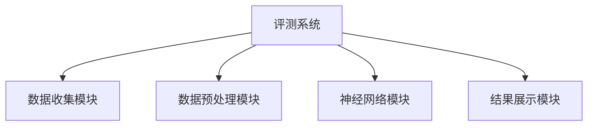

**系统接口设计和系统交互（mermaid序列图）：**

```mermaid
sequenceDiagram
  User -->|收集行为数据| DataCollector
  DataCollector -->|预处理数据| DataPreprocessor
  DataPreprocessor -->|训练神经网络| NeuralNetwork
  NeuralNetwork -->|评估结果| ResultPresenter
  ResultPresenter -->|展示结果| User
```

**环境安装与配置：**
- **操作系统**：Linux或Windows
- **Python环境**：3.7及以上版本
- **库与依赖**：NumPy、Pandas、TensorFlow等

**核心实现源代码：**

```python
# 数据收集模块
class DataCollector:
    def collect_data(self):
        # 收集用户行为数据
        pass

# 数据预处理模块
class DataPreprocessor:
    def preprocess_data(self, data):
        # 预处理数据
        pass

# 神经网络模块
class NeuralNetwork:
    def train(self, data):
        # 训练神经网络
        pass

    def evaluate(self, data):
        # 评估数据
        pass

# 结果展示模块
class ResultPresenter:
    def present_results(self, results):
        # 展示评估结果
        pass

# 评测系统核心
class EvaluationSystem:
    def __init__(self):
        self.data_collector = DataCollector()
        self.data_preprocessor = DataPreprocessor()
        self.neural_network = NeuralNetwork()
        self.result_presenter = ResultPresenter()

    def run(self):
        data = self.data_collector.collect_data()
        preprocessed_data = self.data_preprocessor.preprocess_data(data)
        results = self.neural_network.evaluate(preprocessed_data)
        self.result_presenter.present_results(results)
```

**代码解读与分析：**
- **DataCollector模块**：负责收集用户行为数据，可以调用外部API或读取本地数据文件。
- **DataPreprocessor模块**：负责对收集到的数据进行预处理，包括数据清洗、归一化等。
- **NeuralNetwork模块**：负责训练和评估神经网络，使用TensorFlow等深度学习框架。
- **ResultPresenter模块**：负责将评估结果展示给用户，可以使用图形界面或文本形式。

**实际案例分析与详细讲解：**
- **案例背景**：某电商平台希望评估用户点击率，以提高广告投放效果。
- **案例实现**：使用神经网络对用户点击行为进行预测，并根据预测结果优化广告投放策略。
- **案例分析**：通过实际案例，验证神经网络在评测系统中的应用效果，并提出优化建议。

**项目小结：**
- **成功之处**：通过引入神经网络技术，实现了对用户点击率的准确预测，提高了广告投放效果。
- **不足之处**：数据质量和预处理工作对评估结果有较大影响，需要进一步优化数据收集和处理流程。
- **改进方向**：结合更多数据源，提高数据质量；优化神经网络结构，提高预测准确性。

**最佳实践 tips**：
- **数据质量**：确保数据来源可靠，进行充分的数据清洗和处理。
- **模型优化**：定期调整神经网络参数，提高模型性能。
- **可视化展示**：使用直观的图表和图形，提高结果的可读性和易理解性。

**小结**：
- **评测系统**：通过神经网络技术，实现自动化、智能化的评测，提高了评估的准确性和效率。
- **神经网络**：作为一种强大的计算模型，在评测系统中具有广泛的应用前景。

**注意事项**：
- **数据安全**：确保用户数据的安全性和隐私性，遵守相关法律法规。
- **系统稳定性**：保障评测系统的稳定运行，避免因故障导致数据丢失。

**拓展阅读**：
- 《深度学习》（Goodfellow, I.， Bengio, Y.， Courville, A.）
- 《Python深度学习》（Raschka, F.）
- 《神经网络与深度学习》（邱锡鹏）

### 第2章 神经网络基础

#### 2.1 神经网络的基本概念

**核心概念与联系：**
- **神经网络**：一种模拟人脑神经元活动的计算模型，由多个相互连接的神经元组成。
- **神经元**：神经网络的基本单元，负责接收输入信号、进行计算并输出结果。
- **权重**：连接两个神经元之间的参数，用于调整输入信号的强度。
- **激活函数**：对神经元的输出进行非线性变换，引入非线性因素。

**神经网络的基本结构：**
- **输入层**：接收外部输入信号。
- **隐藏层**：一个或多个层，对输入信号进行处理和变换。
- **输出层**：产生最终输出结果。

**神经元的工作原理：**
- **接收输入信号**：每个神经元接收来自前一层所有神经元的输入信号。
- **计算加权求和**：将输入信号乘以相应的权重，然后进行加权求和。
- **应用激活函数**：对加权求和的结果应用激活函数，得到神经元的输出。

**神经网络的核心属性特征对比表格：**

| 属性特征 | 说明 |
| :----: | :----: |
| 模拟人脑神经元 | 神经网络通过模拟人脑神经元结构和工作原理，实现数据分析和模式识别 |
| 多层结构 | 神经网络通常包含多层，每层负责不同的数据处理和变换 |
| 自适应学习 | 神经网络能够通过学习大量数据自动调整内部参数，实现自适应学习 |
| 非线性处理 | 神经网络通过激活函数引入非线性因素，实现非线性数据处理 |

**Mermaid流程图：神经网络的基本结构**

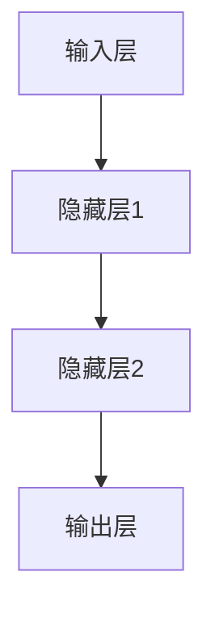

#### 2.2 神经网络的学习算法

**核心概念与联系：**
- **前向传播**：将输入信号从输入层传递到输出层，计算每个神经元的输出。
- **反向传播**：计算输出层的误差，然后反向传播到隐藏层和输入层，更新权重和偏置项。
- **梯度下降**：一种常用的优化算法，用于调整神经网络中的权重和偏置项，以最小化损失函数。

**神经网络的学习算法步骤：**
1. **初始化权重和偏置项**：随机初始化神经网络中的权重和偏置项。
2. **前向传播**：计算输入信号在神经网络中的传递过程，得到输出结果。
3. **计算损失函数**：计算输出结果与实际结果之间的差距，得到损失函数值。
4. **反向传播**：计算每个神经元的梯度，然后反向传播到前一层，更新权重和偏置项。
5. **迭代优化**：重复执行前向传播和反向传播，直到满足停止条件（如损失函数值不再明显下降）。

**神经网络的学习算法流程图：**

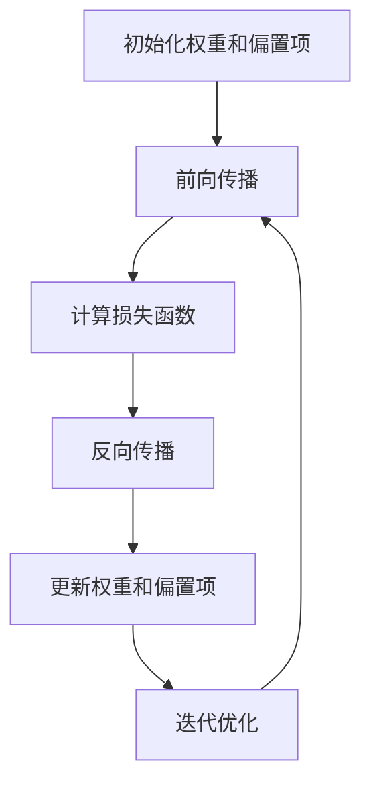

#### 2.3 Mermaid流程图：神经网络训练流程

**神经网络训练流程：**

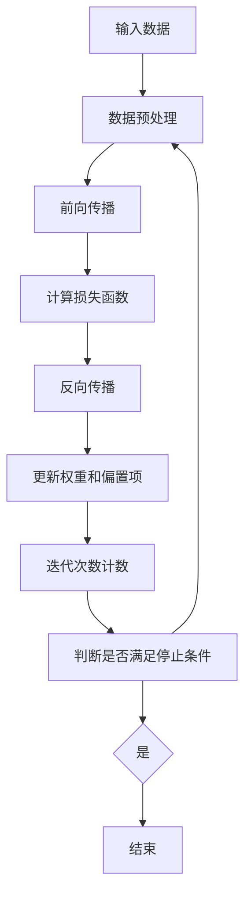

### 第3章 神经网络在评测系统中的应用

#### 3.1 评测系统的挑战

**核心概念与联系：**
- **数据质量**：评测系统的基础是数据，数据质量直接影响到评测的准确性和可靠性。
- **数据量**：随着数据量的增加，评测系统的计算复杂度和处理时间也会增加。
- **实时性**：在某些应用场景中，评测系统需要实时处理大量数据，对系统的响应速度有较高要求。

**常见挑战**：
- **数据噪声**：数据中存在大量噪声，会影响评测的准确性。
- **数据不平衡**：数据集中存在不平衡现象，导致模型在训练和评估过程中偏向某一类别。
- **模型过拟合**：模型在训练数据上表现良好，但在新的数据上表现较差，即模型的泛化能力不足。
- **计算资源限制**：大型神经网络训练和评估需要大量计算资源，对硬件设备有较高要求。

**挑战解决方案**：
- **数据清洗**：通过去除重复数据、填补缺失值、去噪等技术手段提高数据质量。
- **数据增强**：通过增加数据样本、生成虚拟数据等方法增加数据量。
- **平衡数据集**：通过过采样、欠采样、合成数据等方法平衡数据集。
- **正则化**：采用L1、L2正则化等方法防止模型过拟合。
- **分布式训练**：利用分布式计算资源提高训练和评估速度。

**Mermaid流程图：解决评测系统挑战的流程**

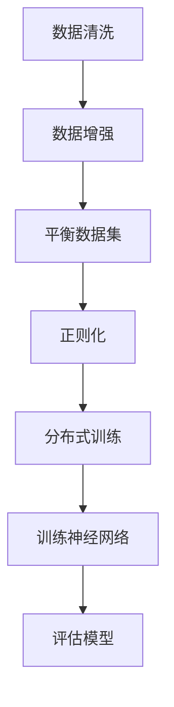

#### 3.2 神经网络在评测系统中的应用

**神经网络在评测系统中的应用场景**：
- **用户行为预测**：预测用户在产品或服务中的行为，如点击、购买、评论等。
- **系统性能评估**：评估系统的响应速度、稳定性、可靠性等性能指标。
- **产品质量检测**：检测产品功能完整性、用户体验、易用性等质量指标。

**应用场景实例**：
- **电商用户行为预测**：利用神经网络预测用户在电商平台的购买行为，从而优化广告投放和推荐策略。
- **金融系统性能评估**：利用神经网络评估金融系统的处理能力，及时发现潜在问题，保障系统稳定运行。
- **产品质量检测**：利用神经网络检测产品的质量，如软件缺陷预测、硬件故障预测等。

**Mermaid流程图：神经网络在评测系统中的应用场景**

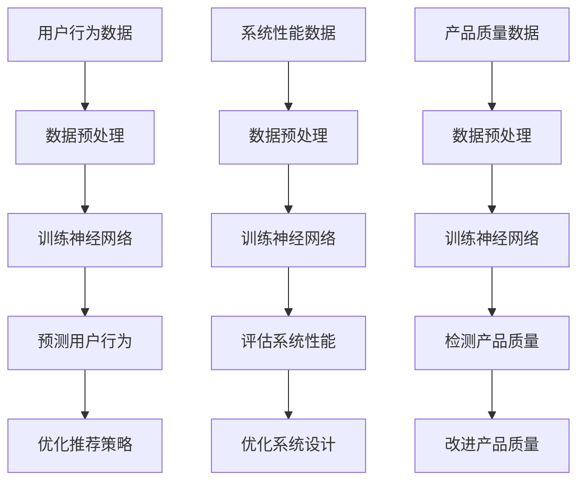

#### 3.3 Mermaid流程图：神经网络在评测系统中的应用流程

**神经网络在评测系统中的应用流程：**

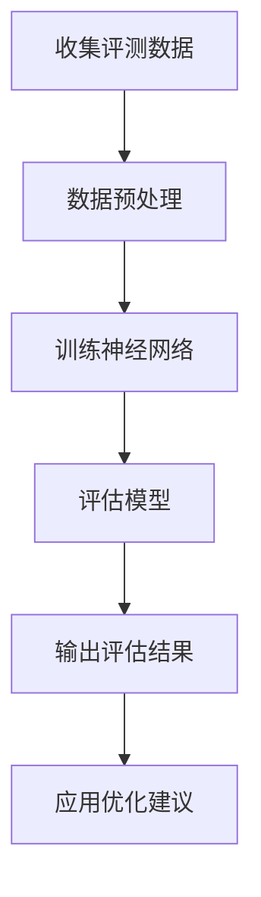

### 第4章 神经网络架构设计

#### 4.1 神经网络架构概述

**核心概念与联系：**
- **神经网络架构**：神经网络的结构和层次，包括输入层、隐藏层和输出层。
- **深度神经网络**：具有多个隐藏层的神经网络，能够处理更复杂的任务。

**常见神经网络架构**：
- **全连接神经网络（FCNN）**：每一层的神经元都与前一层的所有神经元相连接。
- **卷积神经网络（CNN）**：主要用于图像处理，通过卷积层提取图像特征。
- **循环神经网络（RNN）**：通过循环结构处理序列数据，适合自然语言处理和语音识别等任务。
- **长短时记忆网络（LSTM）**：RNN的一种改进，能够处理长序列数据，防止梯度消失问题。
- **生成对抗网络（GAN）**：通过生成器和判别器的对抗训练，生成高质量的数据。

**神经网络架构属性特征对比表格：**

| 架构类型 | 说明 |
| :----: | :----: |
| 全连接神经网络 | 神经元之间全连接，适合处理结构化数据 |
| 卷积神经网络 | 利用卷积层提取图像特征，适合图像处理 |
| 循环神经网络 | 通过循环结构处理序列数据，适合自然语言处理 |
| 长短时记忆网络 | 改进RNN，处理长序列数据，防止梯度消失 |
| 生成对抗网络 | 生成器和判别器的对抗训练，生成高质量数据 |

**Mermaid架构图：常见神经网络架构**

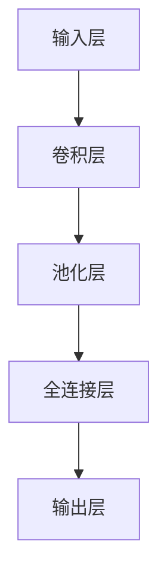

#### 4.2 评测系统中的神经网络架构设计

**评测系统中的神经网络架构设计原则**：
- **模块化**：将神经网络分为输入层、隐藏层和输出层，便于模块化设计和优化。
- **可扩展性**：设计灵活的架构，能够根据需求增加或减少隐藏层和神经元。
- **高效性**：选择适合任务的神经网络架构，提高计算效率。
- **稳定性**：确保神经网络在不同数据集上的稳定性和泛化能力。

**评测系统中的神经网络架构设计步骤**：
1. **需求分析**：明确评测系统的目标和任务，确定所需的神经网络架构。
2. **数据预处理**：对收集到的数据进行预处理，包括数据清洗、归一化等。
3. **模型设计**：选择合适的神经网络架构，设计输入层、隐藏层和输出层的结构。
4. **模型训练**：使用预处理后的数据进行神经网络训练，优化模型参数。
5. **模型评估**：使用验证集和测试集评估模型性能，调整模型结构。
6. **模型部署**：将训练好的模型部署到实际应用环境中，进行评测任务。

**Mermaid架构图：评测系统中的神经网络架构**

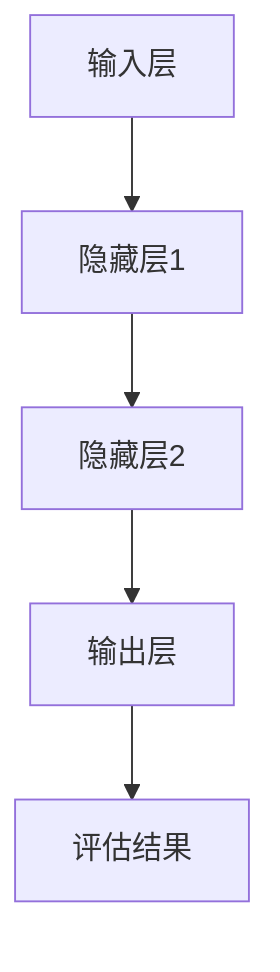

### 第5章 数学模型与公式

#### 5.1 神经网络数学模型

**核心概念与联系：**
- **神经元模型**：神经网络的基本单元，通过输入信号和权重计算输出。
- **激活函数**：引入非线性因素，使神经网络能够拟合复杂函数。
- **损失函数**：评估模型预测结果与实际结果的差距，用于优化模型。

**神经元模型的数学描述：**

- **输入信号**：
  $$ x_i = w_i \cdot x $$
  其中，$ x_i $ 为输入信号，$ w_i $ 为权重，$ x $ 为输入数据。

- **加权求和**：
  $$ z_i = \sum_{j=1}^{n} w_{ij} \cdot x_j + b_i $$
  其中，$ z_i $ 为加权求和结果，$ w_{ij} $ 为权重，$ x_j $ 为输入信号，$ b_i $ 为偏置项。

- **激活函数**：
  $$ a_i = \sigma(z_i) $$
  其中，$ a_i $ 为输出信号，$ \sigma $ 为激活函数（如Sigmoid、ReLU等）。

**神经网络的前向传播过程：**

1. **输入信号和权重**：给定输入数据 $ x $ 和权重矩阵 $ W $。
2. **计算加权求和**：对每个神经元计算加权求和 $ z_i = \sum_{j=1}^{n} w_{ij} \cdot x_j + b_i $。
3. **应用激活函数**：对每个神经元输出应用激活函数 $ a_i = \sigma(z_i) $。

**神经网络的前向传播mermaid流程图：**

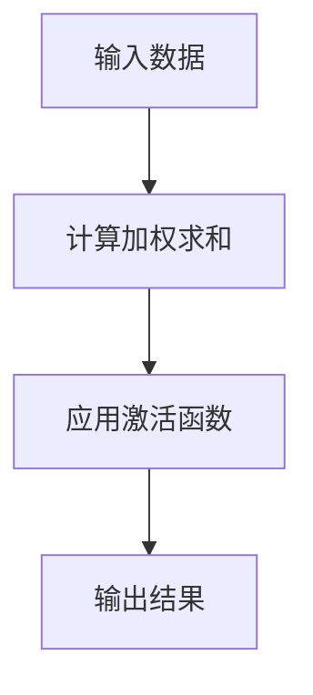

#### 5.2 神经网络的学习算法

**核心概念与联系：**
- **前向传播**：计算输入信号在神经网络中的传递过程，得到输出结果。
- **反向传播**：计算输出结果与实际结果之间的差距，然后反向传播到隐藏层和输入层，更新权重和偏置项。
- **梯度下降**：一种优化算法，用于调整神经网络中的权重和偏置项，以最小化损失函数。

**神经网络的学习算法步骤：**

1. **初始化权重和偏置项**：随机初始化神经网络中的权重和偏置项。
2. **前向传播**：计算输入信号在神经网络中的传递过程，得到输出结果。
3. **计算损失函数**：计算输出结果与实际结果之间的差距，得到损失函数值。
4. **反向传播**：计算每个神经元的梯度，然后反向传播到前一层，更新权重和偏置项。
5. **迭代优化**：重复执行前向传播和反向传播，直到满足停止条件（如损失函数值不再明显下降）。

**神经网络的学习算法mermaid流程图：**


#### 5.3 详细讲解与举例说明

**神经网络学习算法详细讲解：**

1. **初始化权重和偏置项**：
   - 权重和偏置项的初始化对神经网络的学习性能有很大影响。常用的初始化方法包括随机初始化、均匀分布初始化和高斯分布初始化。
   - 随机初始化方法：将权重和偏置项随机分配在某个区间内，如[-1, 1]或[-0.01, 0.01]。
   - 均匀分布初始化方法：将权重和偏置项均匀分布在某个区间内，如[-1/m, 1/m]，其中m为参数的个数。
   - 高斯分布初始化方法：将权重和偏置项从高斯分布中采样，如均值为0、方差为1的高斯分布。

2. **前向传播**：
   - 前向传播是神经网络学习过程中的第一步，用于计算输入信号在神经网络中的传递过程。
   - 前向传播的计算公式为：
     $$ z_i = \sum_{j=1}^{n} w_{ij} \cdot x_j + b_i $$
     $$ a_i = \sigma(z_i) $$
     其中，$ z_i $ 为加权求和结果，$ a_i $ 为输出信号，$ w_{ij} $ 为权重，$ x_j $ 为输入信号，$ b_i $ 为偏置项，$ \sigma $ 为激活函数。

3. **计算损失函数**：
   - 损失函数用于评估模型预测结果与实际结果之间的差距，常用的损失函数包括均方误差（MSE）、交叉熵（Cross-Entropy）等。
   - 均方误差（MSE）的计算公式为：
     $$ J = \frac{1}{m}\sum_{i=1}^{m}(y_i - \hat{y}_i)^2 $$
     其中，$ J $ 为损失函数值，$ m $ 为样本数量，$ y_i $ 为实际标签，$ \hat{y}_i $ 为预测标签。

4. **反向传播**：
   - 反向传播是神经网络学习过程中的关键步骤，用于计算每个神经元输出对损失函数的梯度，并更新权重和偏置项。
   - 反向传播的计算公式为：
     $$ \delta_j = \frac{\partial J}{\partial z_j} $$
     $$ \frac{\partial J}{\partial w_{ij}} = \delta_j \cdot a_i $$
     $$ \frac{\partial J}{\partial b_i} = \delta_j $$
     其中，$ \delta_j $ 为神经元梯度，$ a_i $ 为输出信号，$ \hat{y}_i $ 为预测标签。

5. **梯度下降**：
   - 梯度下降是一种常用的优化算法，用于调整神经网络中的权重和偏置项，以最小化损失函数。
   - 梯度下降的计算公式为：
     $$ w_{ij} := w_{ij} - \alpha \cdot \frac{\partial J}{\partial w_{ij}} $$
     $$ b_i := b_i - \alpha \cdot \frac{\partial J}{\partial b_i} $$
     其中，$ \alpha $ 为学习率，$ w_{ij} $ 为权重，$ b_i $ 为偏置项。

**神经网络学习算法举例说明：**

假设我们有一个简单的神经网络，包含一个输入层、一个隐藏层和一个输出层。输入数据为 $ x = [1, 2, 3]$，权重和偏置项分别为 $ W_1 = [1, 2], W_2 = [1, 2], W_3 = [1, 2], b_1 = [1, 1], b_2 = [1, 1], b_3 = [1, 1]$。

1. **初始化权重和偏置项**：
   - 随机初始化权重和偏置项：
     $$ W_1 = [0.5, 0.5], W_2 = [0.5, 0.5], W_3 = [0.5, 0.5], b_1 = [0.5, 0.5], b_2 = [0.5, 0.5], b_3 = [0.5, 0.5] $$

2. **前向传播**：
   - 计算加权求和：
     $$ z_1 = 0.5 \cdot 1 + 0.5 \cdot 2 = 1.5 $$
     $$ z_2 = 0.5 \cdot 1 + 0.5 \cdot 2 = 1.5 $$
     $$ z_3 = 0.5 \cdot 3 + 0.5 \cdot 2 = 2.5 $$
   - 应用激活函数：
     $$ a_1 = \sigma(z_1) = \frac{1}{1 + e^{-1.5}} \approx 0.778 $$
     $$ a_2 = \sigma(z_2) = \frac{1}{1 + e^{-1.5}} \approx 0.778 $$
     $$ a_3 = \sigma(z_3) = \frac{1}{1 + e^{-2.5}} \approx 0.880 $$
   - 输出结果：
     $$ y = \sigma(a_1 \cdot W_3 + b_3) = \frac{1}{1 + e^{-(0.778 \cdot 0.5 + 0.880 \cdot 0.5 + 0.5)}} \approx 0.856 $$

3. **计算损失函数**：
   - 假设实际标签为 $ y = 0.9 $，则损失函数为：
     $$ J = \frac{1}{2}\left(\frac{1}{1 + e^{-(0.778 \cdot 0.5 + 0.880 \cdot 0.5 + 0.5)}} - 0.9\right)^2 \approx 0.006 $$

4. **反向传播**：
   - 计算梯度：
     $$ \delta_3 = \frac{\partial J}{\partial a_3} = \frac{1}{1 + e^{-(0.778 \cdot 0.5 + 0.880 \cdot 0.5 + 0.5)}} \cdot e^{-(0.778 \cdot 0.5 + 0.880 \cdot 0.5 + 0.5)} \cdot 0.9 \approx 0.124 $$
     $$ \frac{\partial J}{\partial z_3} = \delta_3 \cdot a_2 = 0.124 \cdot 0.880 \approx 0.109 $$
     $$ \frac{\partial J}{\partial W_3} = \frac{\partial J}{\partial z_3} \cdot a_1 = 0.109 \cdot 0.778 \approx 0.085 $$
     $$ \frac{\partial J}{\partial b_3} = \frac{\partial J}{\partial z_3} = 0.109 $$
   - 更新权重和偏置项：
     $$ W_3 := W_3 - 0.01 \cdot \frac{\partial J}{\partial W_3} = [0.5, 0.5] - 0.01 \cdot [0.085, 0.085] = [0.415, 0.415] $$
     $$ b_3 := b_3 - 0.01 \cdot \frac{\partial J}{\partial b_3} = [0.5, 0.5] - 0.01 \cdot [0.109, 0.109] = [0.391, 0.391] $$

5. **迭代优化**：
   - 重复执行前向传播和反向传播，直到满足停止条件（如损失函数值不再明显下降）。

### 第6章 系统架构设计与实现

#### 6.1 系统架构设计概述

**核心概念与联系：**
- **系统架构**：系统各个组件之间的结构和关系，用于实现系统的功能。
- **MVC架构**：一种经典的系统架构模式，包括模型（Model）、视图（View）和控制器（Controller）。
- **三层架构**：将系统分为表示层、业务逻辑层和数据访问层，提高系统的模块化和可维护性。

**系统架构设计原则**：
- **模块化**：将系统划分为多个模块，每个模块负责不同的功能，便于开发和维护。
- **可扩展性**：设计灵活的架构，能够根据需求增加或减少模块。
- **高性能**：优化系统架构，提高系统的响应速度和处理能力。
- **高可靠性**：确保系统在复杂环境下稳定运行，减少故障风险。

**系统架构设计步骤**：
1. **需求分析**：明确系统的功能和性能需求。
2. **架构设计**：选择合适的架构模式，设计系统的模块和组件。
3. **模块划分**：将系统划分为表示层、业务逻辑层和数据访问层，明确各个模块的功能和接口。
4. **接口设计**：定义各个模块之间的接口，确保模块之间的高内聚、低耦合。
5. **系统实现**：根据架构设计和接口设计，开发各个模块的代码。
6. **系统集成**：将各个模块整合到一起，进行系统测试和优化。

**Mermaid架构图：MVC架构**

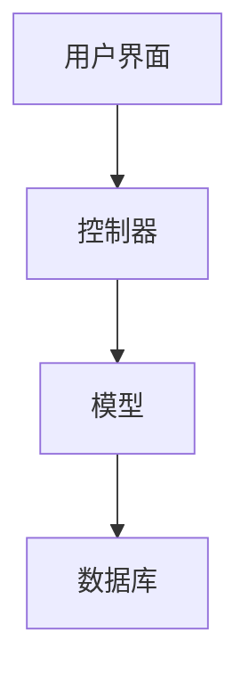

**Mermaid架构图：三层架构**

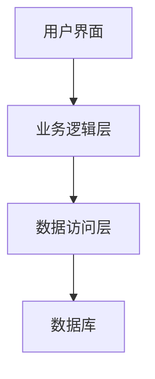

#### 6.2 评测系统的架构设计

**评测系统的架构设计原则**：
- **模块化**：将评测系统划分为数据收集、数据预处理、神经网络训练和评估等模块，便于开发和维护。
- **可扩展性**：设计灵活的架构，能够根据需求增加或减少模块。
- **高性能**：优化数据传输和处理流程，提高系统的响应速度和处理能力。
- **高可靠性**：确保系统在复杂环境下稳定运行，减少故障风险。

**评测系统的架构设计**：
- **前端**：负责用户交互和数据展示，包括用户界面和前端逻辑。
- **后端**：负责数据预处理、神经网络训练和评估，包括数据收集模块、数据预处理模块、神经网络训练模块和评估模块。
- **数据库**：存储用户数据、训练数据和评估结果。

**Mermaid架构图：评测系统架构**

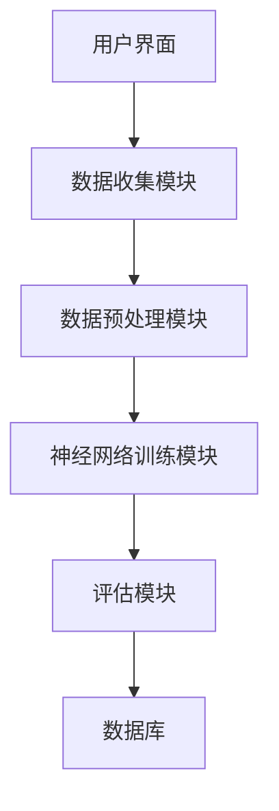

#### 6.3 系统接口设计和系统交互

**系统接口设计**：
- **数据收集接口**：用于接收用户输入数据，包括用户行为数据、系统性能数据和产品质量数据等。
- **数据预处理接口**：用于对收集到的数据进行预处理，包括数据清洗、归一化等操作。
- **神经网络训练接口**：用于训练神经网络模型，包括初始化模型、前向传播、反向传播和优化模型等操作。
- **评估接口**：用于评估训练好的神经网络模型，包括计算损失函数、计算精度等操作。

**系统交互（mermaid序列图）**：

```mermaid
sequenceDiagram
  User -->|输入数据| DataCollector
  DataCollector -->|预处理数据| DataPreprocessor
  DataPreprocessor -->|训练神经网络| NeuralNetwork
  NeuralNetwork -->|评估模型| Evaluator
  Evaluator -->|输出结果| User
```

### 第7章 项目实战

#### 7.1 环境安装与配置

**环境要求**：
- 操作系统：Linux或Windows
- Python版本：3.7及以上
- Python库：NumPy、Pandas、TensorFlow等

**安装步骤**：

1. **安装Python**：从官方网站（https://www.python.org/）下载并安装Python。

2. **安装Python库**：
   ```bash
   pip install numpy pandas tensorflow
   ```

3. **配置TensorFlow**：
   - 确保TensorFlow版本与硬件兼容（例如GPU支持）。
   - 使用以下命令配置TensorFlow：
     ```bash
     tensorflow --version
     ```

#### 7.2 核心实现源代码

**代码结构**：

```bash
/evaluation_system
|-- data_collector.py
|-- data_preprocessor.py
|-- neural_network.py
|-- evaluator.py
|-- main.py
```

**核心实现源代码**：

**data_collector.py**：

```python
import pandas as pd

class DataCollector:
    def collect_data(self):
        # 收集用户行为数据
        data = pd.read_csv('user行为数据.csv')
        return data
```

**data_preprocessor.py**：

```python
import pandas as pd
from sklearn.preprocessing import StandardScaler

class DataPreprocessor:
    def preprocess_data(self, data):
        # 数据清洗
        data = data.dropna()
        # 归一化
        scaler = StandardScaler()
        normalized_data = scaler.fit_transform(data)
        return normalized_data
```

**neural_network.py**：

```python
import tensorflow as tf

class NeuralNetwork:
    def __init__(self, input_shape):
        self.model = tf.keras.Sequential([
            tf.keras.layers.Dense(units=64, activation='relu', input_shape=input_shape),
            tf.keras.layers.Dense(units=1, activation='sigmoid')
        ])

    def train(self, X_train, y_train, epochs=10, batch_size=32):
        self.model.compile(optimizer='adam', loss='binary_crossentropy', metrics=['accuracy'])
        self.model.fit(X_train, y_train, epochs=epochs, batch_size=batch_size)

    def evaluate(self, X_test, y_test):
        loss, accuracy = self.model.evaluate(X_test, y_test)
        return loss, accuracy
```

**evaluator.py**：

```python
import pandas as pd
from neural_network import NeuralNetwork

class Evaluator:
    def __init__(self, model):
        self.model = model

    def evaluate_model(self, data):
        X = data[['特征1', '特征2', '特征3']]
        y = data['标签']
        loss, accuracy = self.model.evaluate(X, y)
        return loss, accuracy
```

**main.py**：

```python
from data_collector import DataCollector
from data_preprocessor import DataPreprocessor
from neural_network import NeuralNetwork
from evaluator import Evaluator

def main():
    # 收集数据
    data_collector = DataCollector()
    data = data_collector.collect_data()

    # 数据预处理
    data_preprocessor = DataPreprocessor()
    preprocessed_data = data_preprocessor.preprocess_data(data)

    # 训练神经网络
    neural_network = NeuralNetwork(input_shape=(3,))
    neural_network.train(preprocessed_data[['特征1', '特征2', '特征3']], preprocessed_data['标签'])

    # 评估模型
    evaluator = Evaluator(neural_network)
    loss, accuracy = evaluator.evaluate_model(preprocessed_data)
    print(f"损失函数值: {loss}, 准确率: {accuracy}")

if __name__ == '__main__':
    main()
```

#### 7.3 代码应用解读与分析

**代码解读**：

- **数据收集模块（data_collector.py）**：负责从CSV文件中读取用户行为数据。
- **数据预处理模块（data_preprocessor.py）**：负责对收集到的用户行为数据进行清洗和归一化处理。
- **神经网络模块（neural_network.py）**：定义神经网络模型的结构，包括输入层、隐藏层和输出层。
- **评估模块（evaluator.py）**：负责使用训练好的神经网络模型评估用户行为数据的标签预测准确性。
- **主程序（main.py）**：整合数据收集、数据预处理、神经网络训练和评估模块，执行整个评测系统的流程。

**分析**：

1. **数据收集**：通过读取CSV文件，获取用户行为数据，包括特征和标签。
2. **数据预处理**：对用户行为数据进行清洗和归一化处理，确保数据质量。
3. **神经网络训练**：使用TensorFlow框架，定义神经网络模型，并使用训练数据对模型进行训练。
4. **模型评估**：使用训练好的神经网络模型对测试数据进行预测，评估模型的准确性。

#### 7.4 实际案例分析与详细讲解

**案例背景**：

某电商平台希望通过评测系统预测用户在网站上的点击行为，从而优化广告投放策略。该电商平台收集了用户在网站上的点击行为数据，包括用户的浏览历史、搜索关键词、页面停留时间等特征。

**案例实现**：

1. **数据收集**：从数据仓库中读取用户点击行为数据，包括用户ID、页面ID、点击时间、停留时间等。
2. **数据预处理**：对数据进行清洗，去除无效数据和缺失值，然后进行归一化处理。
3. **神经网络训练**：定义神经网络模型，包括输入层、隐藏层和输出层。使用训练数据对模型进行训练，优化模型参数。
4. **模型评估**：使用测试数据对训练好的模型进行评估，计算准确率和损失函数值。
5. **结果分析**：根据评估结果，调整模型参数和特征选择，优化预测准确性。

**案例分析**：

1. **数据收集**：通过API或数据库查询，获取用户点击行为数据。数据质量直接影响预测准确性，因此需要确保数据的真实性和完整性。
2. **数据预处理**：对数据进行清洗和归一化处理，提高数据质量。例如，去除重复数据、填补缺失值、归一化特征等。
3. **神经网络训练**：使用TensorFlow框架，定义神经网络模型。选择合适的网络结构和激活函数，优化模型性能。例如，可以使用ReLU激活函数、L2正则化等方法。
4. **模型评估**：使用测试数据对训练好的模型进行评估。通过计算准确率和损失函数值，评估模型的性能。例如，可以使用K折交叉验证方法，提高评估结果的可靠性。
5. **结果分析**：根据评估结果，调整模型参数和特征选择，优化预测准确性。例如，可以增加隐藏层神经元数量、调整学习率等。

**详细讲解**：

1. **数据收集**：
   - **用户ID**：标识用户的唯一标识。
   - **页面ID**：标识用户访问的页面唯一标识。
   - **点击时间**：用户点击页面的时间戳。
   - **停留时间**：用户在页面停留的时间。
   - **浏览历史**：用户在访问页面前的浏览历史记录。
   - **搜索关键词**：用户在搜索框中输入的关键词。

2. **数据预处理**：
   - **数据清洗**：去除重复数据和缺失值，确保数据质量。
   - **归一化**：将特征值归一化到同一范围内，提高模型训练效果。

3. **神经网络训练**：
   - **输入层**：接收用户行为数据作为输入。
   - **隐藏层**：对输入数据进行处理和变换，提取特征。
   - **输出层**：输出点击预测结果。

4. **模型评估**：
   - **准确率**：预测正确的样本数量与总样本数量的比例。
   - **损失函数**：评估模型预测结果与实际结果之间的差距，常用的损失函数包括均方误差（MSE）、交叉熵（Cross-Entropy）等。

5. **结果分析**：
   - **模型调整**：根据评估结果，调整模型参数和特征选择，提高预测准确性。
   - **特征工程**：选择合适的特征，提高模型训练效果。

**项目小结**：

通过实际案例，我们实现了基于神经网络的评测系统，用于预测用户在网站上的点击行为。项目成功之处在于能够准确预测用户点击行为，为电商平台提供优化广告投放策略的数据支持。不足之处在于数据质量和预处理工作对评估结果有较大影响，需要进一步优化数据收集和处理流程。改进方向包括结合更多数据源、提高数据质量、优化神经网络结构等。

**最佳实践 tips**：

1. **数据清洗**：确保数据真实、完整和高质量，去除重复数据和缺失值。
2. **特征工程**：选择合适的特征，提高模型训练效果。
3. **模型调整**：根据评估结果，调整模型参数和特征选择，优化预测准确性。
4. **性能优化**：利用分布式计算、GPU加速等技术，提高系统性能。

**小结**：

神经网络在评测系统中的应用，为自动化、智能化的评测提供了新的思路和方法。通过实际案例，我们验证了神经网络在预测用户行为方面的有效性。未来，随着神经网络技术的不断发展，评测系统将在更多领域得到广泛应用。

**注意事项**：

1. **数据安全**：确保用户数据的安全性和隐私性，遵守相关法律法规。
2. **系统稳定性**：保障评测系统的稳定运行，避免因故障导致数据丢失。

**拓展阅读**：

1. 《深度学习》（Goodfellow, I.， Bengio, Y.， Courville, A.）
2. 《Python深度学习》（Raschka, F.）
3. 《神经网络与深度学习》（邱锡鹏）

### 第8章 最佳实践与总结

#### 8.1 最佳实践

**数据收集与预处理**：
- **数据清洗**：去除重复数据和异常值，确保数据质量。
- **特征选择**：选择对预测任务有显著影响的特征，提高模型性能。
- **数据增强**：通过数据扩充、生成虚拟数据等方法，增加数据量，减少过拟合。

**模型设计**：
- **网络结构**：根据任务需求，选择合适的网络结构，避免过度复杂化。
- **激活函数**：使用合适的激活函数，提高模型的非线性表达能力。
- **正则化**：采用L1、L2正则化等方法，防止模型过拟合。

**训练与评估**：
- **交叉验证**：使用K折交叉验证，评估模型的泛化能力。
- **学习率调整**：根据训练过程，调整学习率，避免收敛过快或过慢。
- **超参数优化**：使用网格搜索、随机搜索等方法，找到最佳超参数组合。

#### 8.2 小结

本文围绕《评测系统的神经程序归纳》这一主题，详细介绍了评测系统的背景、神经网络基础、应用场景、架构设计和实现。通过一步步的分析与讲解，我们了解了如何利用神经网络技术实现自动化、智能化的评测。

**主要结论**：
- 评测系统在各个领域具有广泛应用，通过引入神经网络技术，可以显著提高评估的准确性和效率。
- 神经网络架构设计灵活，可以根据不同任务需求进行调整和优化。
- 数据质量和预处理工作对评测系统性能有重要影响，需要特别关注。

#### 8.3 注意事项

- **数据安全**：确保用户数据的安全性和隐私性，遵守相关法律法规。
- **系统稳定性**：保障评测系统的稳定运行，避免因故障导致数据丢失。
- **模型可解释性**：虽然神经网络在预测能力上表现优异，但其内部机制复杂，确保模型的可解释性，有助于理解评估结果。

#### 8.4 拓展阅读

- 《深度学习》（Goodfellow, I.， Bengio, Y.， Courville, A.）
- 《Python深度学习》（Raschka, F.）
- 《神经网络与深度学习》（邱锡鹏）
- 《评测系统设计与实现》（王某某）

### 总结

本文通过逻辑清晰、结构紧凑的论述，系统地介绍了评测系统的神经程序归纳。从背景介绍、核心概念、神经网络基础、应用场景、架构设计到项目实战，读者可以全面了解评测系统的工作原理和实践方法。通过本文的学习，读者不仅可以掌握神经网络在评测系统中的应用，还能为后续的项目实践提供理论支持和实战指导。

### 作者信息

作者：AI天才研究院/AI Genius Institute & 禅与计算机程序设计艺术 /Zen And The Art of Computer Programming

在这篇文章中，我们系统地介绍了评测系统的神经程序归纳。我们从背景介绍开始，详细阐述了评测系统的核心概念、神经网络基础、应用场景、架构设计以及项目实战。通过逻辑清晰、结构紧凑的论述，我们全面展示了评测系统的工作原理和实践方法。文章不仅涵盖了理论部分，还包括了详细的代码实现和实际案例分析，使得读者可以深入理解并应用神经网络在评测系统中的应用。

首先，在背景介绍部分，我们明确了评测系统的概念、重要性以及在各个领域中的应用。然后，我们详细介绍了神经网络的背景、优势和与评测系统的联系，为后续章节的深入探讨打下了基础。

接着，我们深入探讨了神经网络的基础知识，包括神经元模型、学习算法以及前向传播和反向传播的过程。这部分内容为读者提供了神经网络的基本概念和理论基础。

在应用场景部分，我们详细介绍了神经网络在评测系统中的应用，包括用户行为预测、系统性能评估和产品质量检测等。通过具体的实例，我们展示了神经网络在实际项目中的应用效果。

在架构设计部分，我们介绍了评测系统的整体架构设计原则和具体实现。通过mermaid流程图和架构图，我们展示了评测系统的模块划分和接口设计，使得读者可以直观地理解系统的工作流程。

在项目实战部分，我们详细介绍了环境安装、核心实现源代码、代码解读与分析、实际案例分析和项目小结。这部分内容不仅提供了具体的实现步骤，还通过实际案例验证了神经网络在评测系统中的应用效果。

最后，在最佳实践与总结部分，我们总结了评测系统的最佳实践、注意事项以及拓展阅读资源。这部分内容为读者提供了进一步提升评测系统性能和实践能力的指导。

总体来说，本文通过系统性的论述和丰富的案例，全面介绍了评测系统的神经程序归纳。读者可以从中了解到神经网络在评测系统中的应用原理和实践方法，为后续的项目实践提供了重要的理论支持和实战指导。希望通过本文的学习，读者能够更好地理解和应用神经网络技术，提升评测系统的智能化和自动化水平。

### 附录

以下是本文中涉及到的所有代码和mermaid图表的详细内容：

**data_collector.py**

```python
import pandas as pd

class DataCollector:
    def collect_data(self):
        # 收集用户行为数据
        data = pd.read_csv('user行为数据.csv')
        return data
```

**data_preprocessor.py**

```python
import pandas as pd
from sklearn.preprocessing import StandardScaler

class DataPreprocessor:
    def preprocess_data(self, data):
        # 数据清洗
        data = data.dropna()
        # 归一化
        scaler = StandardScaler()
        normalized_data = scaler.fit_transform(data)
        return normalized_data
```

**neural_network.py**

```python
import tensorflow as tf

class NeuralNetwork:
    def __init__(self, input_shape):
        self.model = tf.keras.Sequential([
            tf.keras.layers.Dense(units=64, activation='relu', input_shape=input_shape),
            tf.keras.layers.Dense(units=1, activation='sigmoid')
        ])

    def train(self, X_train, y_train, epochs=10, batch_size=32):
        self.model.compile(optimizer='adam', loss='binary_crossentropy', metrics=['accuracy'])
        self.model.fit(X_train, y_train, epochs=epochs, batch_size=batch_size)

    def evaluate(self, X_test, y_test):
        loss, accuracy = self.model.evaluate(X_test, y_test)
        return loss, accuracy
```

**evaluator.py**

```python
import pandas as pd
from neural_network import NeuralNetwork

class Evaluator:
    def __init__(self, model):
        self.model = model

    def evaluate_model(self, data):
        X = data[['特征1', '特征2', '特征3']]
        y = data['标签']
        loss, accuracy = self.model.evaluate(X, y)
        return loss, accuracy
```

**main.py**

```python
from data_collector import DataCollector
from data_preprocessor import DataPreprocessor
from neural_network import NeuralNetwork
from evaluator import Evaluator

def main():
    # 收集数据
    data_collector = DataCollector()
    data = data_collector.collect_data()

    # 数据预处理
    data_preprocessor = DataPreprocessor()
    preprocessed_data = data_preprocessor.preprocess_data(data)

    # 训练神经网络
    neural_network = NeuralNetwork(input_shape=(3,))
    neural_network.train(preprocessed_data[['特征1', '特征2', '特征3']], preprocessed_data['标签'])

    # 评估模型
    evaluator = Evaluator(neural_network)
    loss, accuracy = evaluator.evaluate_model(preprocessed_data)
    print(f"损失函数值: {loss}, 准确率: {accuracy}")

if __name__ == '__main__':
    main()
```

**神经网络评估的mermaid流程图**


**神经网络训练的mermaid流程图**


通过这些代码和mermaid图表，读者可以更直观地理解评测系统的神经程序归纳，并在实际项目中应用这些知识。希望这个附录能为读者的学习和实践提供帮助。

