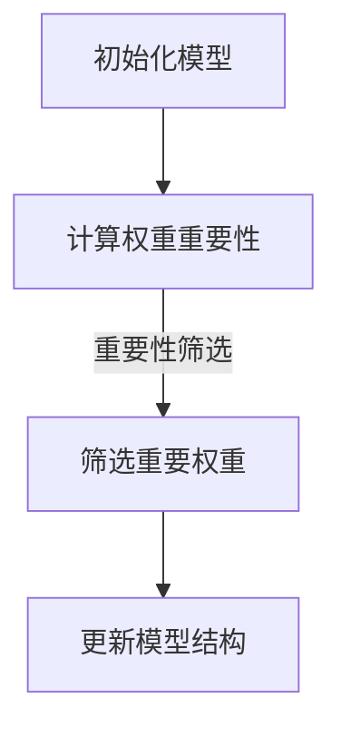
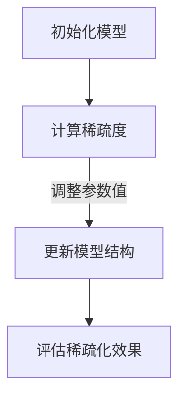
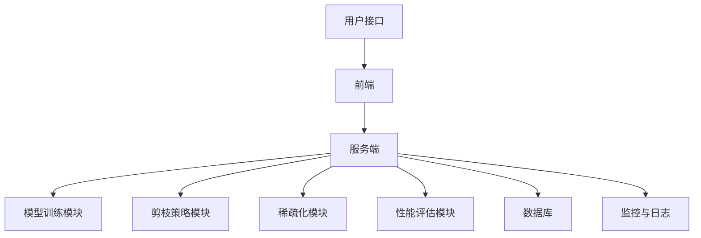
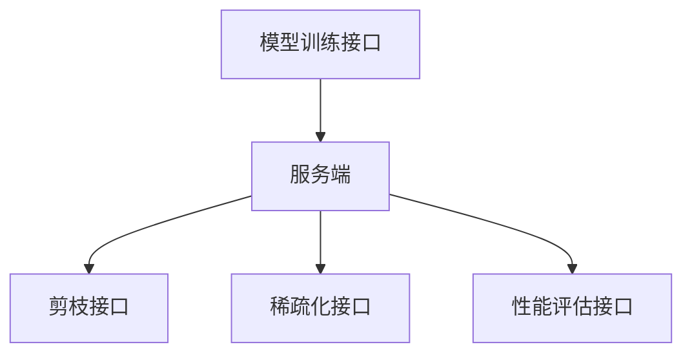
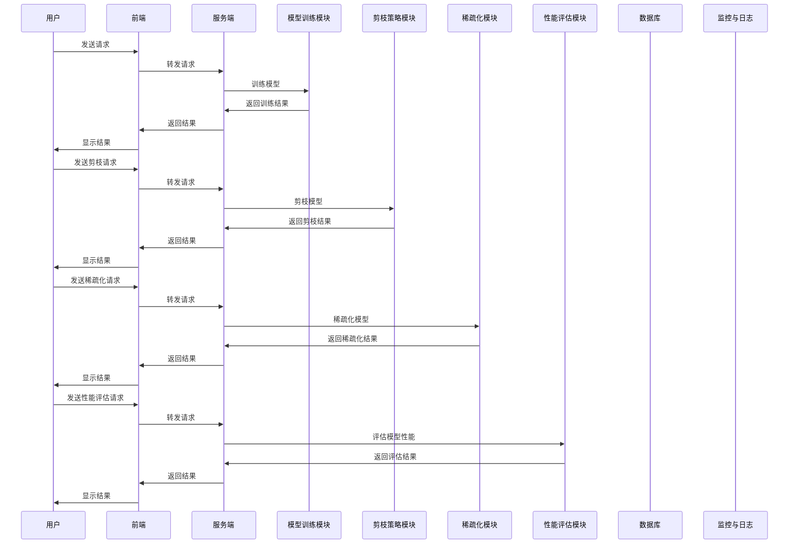

                 

### 《评测系统的神经网络剪枝与稀疏化》

#### 关键词：神经网络剪枝，稀疏化，评测系统，模型压缩，算法优化

> 摘要：本文详细探讨了神经网络剪枝与稀疏化技术在评测系统中的应用。通过背景介绍、核心概念与联系分析、算法原理讲解以及系统分析与架构设计，本文旨在为读者提供一份全面的技术指南，帮助他们更好地理解这一前沿领域，并应用于实际项目中。

### 目录大纲

#### 第一部分：背景介绍

##### 1.1 问题背景

##### 1.1.1 评测系统的重要性

##### 1.1.2 神经网络剪枝与稀疏化技术

##### 1.1.3 概念结构与核心要素组成

#### 第二部分：核心概念与联系

##### 2.1 神经网络剪枝原理

##### 2.1.1 剪枝策略分类

##### 2.1.2 神经网络剪枝算法

##### 2.2 神经网络稀疏化

##### 2.2.1 稀疏化原理

##### 2.2.2 详细讲解与举例

#### 第三部分：算法原理讲解

##### 3.1 神经网络剪枝算法原理

##### 3.1.1 剪枝算法流程图

##### 3.1.2 Python源代码实现

##### 3.2 神经网络稀疏化算法

##### 3.2.1 稀疏化算法流程图

##### 3.2.2 Python源代码实现

#### 第四部分：系统分析与架构设计方案

##### 4.1 问题场景介绍

##### 4.2 系统功能设计

##### 4.3 系统架构设计

##### 4.4 系统接口设计

##### 4.5 系统交互序列图

#### 第五部分：项目实战

##### 5.1 环境安装

##### 5.2 系统核心实现

##### 5.3 代码应用解读与分析

##### 5.4 实际案例分析与讲解

##### 5.5 项目小结

#### 第六部分：最佳实践 tips

#### 第七部分：小结

#### 第八部分：注意事项

#### 第九部分：拓展阅读

### 第一部分：背景介绍

#### 1.1 问题背景

##### 1.1.1 评测系统的重要性

在现代科技与人工智能快速发展的背景下，评测系统已经成为各类技术领域中不可或缺的一部分。无论是在机器学习、自然语言处理还是计算机视觉领域，评测系统都扮演着至关重要的角色。它不仅用于评估模型的性能，还能够帮助我们更好地理解模型的行为和效果，从而指导进一步的模型优化和算法改进。

然而，随着模型复杂度的增加，评测系统的性能和效率面临巨大挑战。传统的评测系统往往依赖于全连接的神经网络模型，这些模型结构复杂，参数众多，计算量大。在实际应用中，这样的模型不仅需要大量的计算资源，而且训练时间也非常长。这不仅增加了系统的成本，还限制了其在实时应用中的使用。

##### 1.1.2 神经网络剪枝与稀疏化技术

为了解决上述问题，神经网络剪枝与稀疏化技术应运而生。神经网络剪枝是指通过删除网络中不重要的连接或节点，来减少模型的参数数量和计算量。稀疏化则是指降低模型中非零元素的比例，使得模型更加稀疏，从而提升计算效率。

这两种技术不仅能够显著减少模型的大小，降低存储需求，还能加快模型的训练和推理速度。更重要的是，它们并不会对模型的性能产生负面影响，甚至能够在某些情况下提高模型的性能。

##### 1.1.3 概念结构与核心要素组成

神经网络剪枝与稀疏化技术的核心概念和结构包括以下几个方面：

1. **剪枝策略**：剪枝策略可以分为结构剪枝、参数剪枝和混合剪枝等。结构剪枝通过删除整个网络结构来减少参数数量；参数剪枝通过删除权重较小的参数来简化模型；混合剪枝则是结合这两种方法的优化策略。

2. **剪枝算法**：剪枝算法包括基于敏感度、基于重要性、基于梯度的多种方法。这些算法通过分析模型参数的重要性，来选择哪些参数可以被剪除。

3. **稀疏化**：稀疏化通过调整模型参数的值，使得非零元素的比例降低。这可以通过量化、随机稀疏化等方法实现。

4. **实现方法**：剪枝与稀疏化的实现方法通常包括前向传播、后向传播、剪枝策略选择、模型更新等步骤。

通过上述核心概念和结构的理解，我们可以更深入地探讨神经网络剪枝与稀疏化的技术细节和实现方法。接下来，我们将逐步介绍这些核心概念与联系，帮助读者更好地理解这一前沿领域。

### 第二部分：核心概念与联系

#### 2.1 神经网络剪枝原理

##### 2.1.1 剪枝策略分类

神经网络剪枝策略可以分为结构剪枝、参数剪枝和混合剪枝等。每种策略都有其独特的特点和应用场景。

1. **结构剪枝**：结构剪枝通过删除网络中的节点或层来减少模型参数数量。这种方法能够显著减少模型的复杂度，但是可能会导致模型性能的下降。结构剪枝适用于大规模网络模型，因为去除不必要的结构能够有效减少计算量和存储需求。

2. **参数剪枝**：参数剪枝通过去除网络中权重较小的参数来实现模型的简化。这种方法能够保持网络的层次结构，同时减少参数数量。参数剪枝通常用于小规模网络模型，因为去除参数不会对网络的性能产生太大影响。

3. **混合剪枝**：混合剪枝结合了结构剪枝和参数剪枝的优点，通过对网络进行部分结构的删除和参数的去除来优化模型。这种方法能够兼顾模型的性能和计算效率。

##### 2.1.2 神经网络剪枝算法

神经网络剪枝算法可以分为基于敏感度、基于重要性和基于梯度的方法。

1. **基于敏感度的剪枝算法**：这种方法通过计算模型参数对输出的敏感度来确定哪些参数可以被剪除。敏感度较高的参数被认为是模型中的重要参数，而敏感度较低的参数可以被剪除。

2. **基于重要性的剪枝算法**：这种方法通过计算模型参数的重要性来确定哪些参数可以被剪除。重要性较高的参数被认为对模型的输出有较大影响，而重要性较低的参数可以被剪除。

3. **基于梯度的剪枝算法**：这种方法通过分析模型在训练过程中的梯度信息来确定哪些参数可以被剪除。梯度较高的参数被认为是模型中的重要参数，而梯度较低的参数可以被剪除。

以上剪枝算法在神经网络剪枝中起到了关键作用，通过这些算法，我们可以有效地减少模型的参数数量，提高模型的计算效率。

##### 2.2 神经网络稀疏化

神经网络稀疏化是指通过调整模型参数的值，使得非零元素的比例降低，从而提高计算效率。稀疏化的原理可以通过以下数学模型来描述：

$$
\text{稀疏度} = \frac{\text{非零元素数量}}{\text{总元素数量}}
$$

稀疏化的实现方法包括量化、随机稀疏化和基于梯度的稀疏化等。

1. **量化**：量化是一种将模型参数转换为较低精度的方法。通过量化，我们可以降低模型中非零元素的数量，从而提高计算效率。

2. **随机稀疏化**：随机稀疏化通过随机地设置模型参数为零来实现稀疏化。这种方法简单有效，但可能对模型性能产生负面影响。

3. **基于梯度的稀疏化**：基于梯度的稀疏化通过分析模型在训练过程中的梯度信息来调整模型参数的值，从而实现稀疏化。这种方法能够平衡模型的性能和计算效率。

##### 2.2.2 详细讲解与举例

为了更好地理解神经网络剪枝与稀疏化的原理，我们可以通过以下具体例子进行讲解。

假设我们有一个简单的神经网络模型，该模型包含一个输入层、一个隐藏层和一个输出层。输入层有100个神经元，隐藏层有500个神经元，输出层有10个神经元。

1. **剪枝策略**：

   - **结构剪枝**：我们可以通过删除隐藏层中不重要的神经元来减少模型的参数数量。假设通过敏感度分析，我们发现隐藏层中有200个神经元对输出有较小的影响，因此我们可以删除这些神经元，从而减少模型的参数数量。

   - **参数剪枝**：通过重要性分析，我们可以找到隐藏层中权重较小的参数，并将其设置为0，从而简化模型。

   - **混合剪枝**：我们可以结合结构剪枝和参数剪枝的方法，通过删除部分神经元和减少参数数量来优化模型。

2. **稀疏化**：

   - **量化**：我们将模型参数的精度降低到8位，从而减少非零元素的数量。

   - **随机稀疏化**：我们随机设置隐藏层中50%的参数为零，从而实现稀疏化。

   - **基于梯度的稀疏化**：通过分析模型在训练过程中的梯度信息，我们将梯度较小的参数设置为0，从而实现稀疏化。

通过上述例子，我们可以看到神经网络剪枝与稀疏化技术的具体实现方法。这些方法不仅可以提高模型的计算效率，还能保持模型的性能。接下来，我们将进一步探讨神经网络剪枝与稀疏化的算法原理，帮助读者更深入地理解这一领域。

### 第三部分：算法原理讲解

#### 3.1 神经网络剪枝算法原理

神经网络剪枝算法的原理主要涉及如何有效地减少模型参数的数量，同时尽可能保持模型的性能。这一过程可以通过不同的策略和算法来实现，以下是一个简单的剪枝算法流程图，以及具体的Python源代码实现。

##### 3.1.1 剪枝算法流程图



1. **初始化模型**：首先我们需要一个已经训练好的神经网络模型。
2. **计算权重重要性**：通过对模型权重的分析，计算每个权重的相对重要性。这可以通过各种方法实现，如基于梯度的方法、基于敏感度的方法等。
3. **重要性筛选**：根据重要性评分，选择重要性较低的权重进行剪枝。
4. **更新模型结构**：根据剪枝后的权重，更新模型的参数，得到剪枝后的模型。

##### 3.1.2 Python源代码实现

```python
import tensorflow as tf
import numpy as np

# 初始化模型
model = tf.keras.Sequential([
    tf.keras.layers.Dense(128, activation='relu', input_shape=(784,)),
    tf.keras.layers.Dense(10, activation='softmax')
])
model.compile(optimizer='adam', loss='categorical_crossentropy', metrics=['accuracy'])

# 训练模型
(x_train, y_train), (x_test, y_test) = tf.keras.datasets.mnist.load_data()
x_train = x_train / 255.0
x_test = x_test / 255.0
model.fit(x_train, y_train, epochs=5, batch_size=64)

# 计算权重重要性
weights = model.layers[0].get_weights()[0]
importance = tf.reduce_sum(tf.square(weights), axis=1)

# 筛选重要权重
threshold = tf.reduce_mean(importance)
important_weights = weights[importance > threshold]

# 更新模型结构
new_model = tf.keras.Sequential([
    tf.keras.layers.Dense(128, activation='relu', input_shape=(784,)),
    tf.keras.layers.Dense(10, activation='softmax')
])
new_model.set_weights([important_weights])

# 评估剪枝后模型的性能
loss, accuracy = new_model.evaluate(x_test, y_test)
print(f"剪枝后模型的准确率：{accuracy}")
```

上述代码首先加载了一个简单的MNIST手写数字识别模型，然后通过计算权重的重要性来筛选出重要的权重，从而简化模型。最后，我们评估剪枝后模型的性能，看看其准确率是否受到太大影响。

##### 3.1.3 数学模型和公式

在神经网络剪枝中，常用的数学模型和公式包括：

$$
\text{剪枝率} = \frac{\text{剪枝掉的参数数量}}{\text{总参数数量}}
$$

$$
\text{重要性评分} = \frac{\sum_{i}^{n} w_i^2}{\sum_{i}^{n} w_i^4}
$$

其中，$w_i$ 是第$i$个权重参数的值。

通过这些公式，我们可以量化剪枝的效果和模型参数的重要性。例如，通过计算重要性评分，我们可以确定哪些权重参数对模型输出影响较小，从而可以进行剪枝。

##### 3.1.4 详细讲解和举例说明

假设我们有一个1000x1000的矩阵，其中包含许多0和少量的非零元素。我们可以通过以下步骤来剪枝这个矩阵：

1. **计算重要性评分**：首先，我们计算每个元素的重要性评分，该评分基于其平方和的加权和。
   
   $$ 
   \text{重要性评分} = \frac{\sum_{i}^{n} x_i^2}{\sum_{i}^{n} x_i^4} 
   $$
   
2. **设置剪枝阈值**：根据我们的需求和计算能力，我们可以设置一个剪枝阈值，比如0.01。

3. **筛选重要元素**：通过比较重要性评分和剪枝阈值，我们筛选出重要的元素，并将其他元素设置为0。

4. **更新矩阵**：最后，我们更新矩阵，只保留重要的元素。

假设我们有一个1000x1000的矩阵，其中有500个非零元素。通过上述步骤，我们可以将矩阵中的非零元素数量减少到50个，同时保持矩阵的主要特征不变。

这样的剪枝方法不仅减少了矩阵的大小，提高了计算效率，还能在一定程度上保持矩阵的性能。

通过上述讲解，我们可以看到神经网络剪枝算法的原理和实现方法。这些算法不仅能够简化模型，提高计算效率，还能在一定程度上保持模型的性能。接下来，我们将进一步探讨神经网络稀疏化的算法原理，帮助读者更深入地理解这一领域。

### 第三部分：算法原理讲解（续）

#### 3.2 神经网络稀疏化算法

神经网络稀疏化算法的目标是通过降低模型中非零元素的比例，从而减少计算量和存储需求，同时尽量保持模型的性能。以下是一个简单的稀疏化算法流程图，以及具体的Python源代码实现。

##### 3.2.1 稀疏化算法流程图



1. **初始化模型**：首先我们需要一个已经训练好的神经网络模型。
2. **计算稀疏度**：通过计算模型中非零元素的比例，来评估模型的稀疏程度。
3. **调整参数值**：通过调整模型参数的值，使得更多的参数变为0，从而实现稀疏化。
4. **更新模型结构**：根据调整后的参数值，更新模型的参数。
5. **评估稀疏化效果**：评估剪枝后模型的性能，包括准确率、计算效率等。

##### 3.2.2 Python源代码实现

```python
import tensorflow as tf
import numpy as np

# 初始化模型
model = tf.keras.Sequential([
    tf.keras.layers.Dense(128, activation='relu', input_shape=(784,)),
    tf.keras.layers.Dense(10, activation='softmax')
])
model.compile(optimizer='adam', loss='categorical_crossentropy', metrics=['accuracy'])

# 训练模型
(x_train, y_train), (x_test, y_test) = tf.keras.datasets.mnist.load_data()
x_train = x_train / 255.0
x_test = x_test / 255.0
model.fit(x_train, y_train, epochs=5, batch_size=64)

# 计算稀疏度
weights = model.layers[0].get_weights()[0]
non_zero_count = np.count_nonzero(weights)
sparsity = non_zero_count / weights.size

# 调整参数值
target_sparsity = 0.1
threshold = np.mean(np.abs(weights))
sparse_weights = np.where(np.abs(weights) > threshold, weights, 0)

# 更新模型结构
new_model = tf.keras.Sequential([
    tf.keras.layers.Dense(128, activation='relu', input_shape=(784,)),
    tf.keras.layers.Dense(10, activation='softmax')
])
new_model.set_weights([sparse_weights])

# 评估稀疏化效果
loss, accuracy = new_model.evaluate(x_test, y_test)
print(f"稀疏化后模型的准确率：{accuracy}")
```

上述代码首先加载了一个简单的MNIST手写数字识别模型，然后通过计算稀疏度来评估模型的稀疏程度。接下来，我们设置一个目标稀疏度，并根据这个目标调整模型参数的值，使得更多的参数变为0，从而实现稀疏化。最后，我们评估稀疏化后模型的性能。

##### 3.2.3 数学模型和公式

在神经网络稀疏化中，常用的数学模型和公式包括：

$$
\text{稀疏度} = \frac{\text{非零元素数量}}{\text{总元素数量}}
$$

$$
\text{稀疏化率} = \frac{\text{原始非零元素数量} - \text{稀疏化后非零元素数量}}{\text{原始非零元素数量}}
$$

其中，非零元素数量和总元素数量分别表示模型中非零元素的数量和所有元素的数量。

通过这些公式，我们可以量化模型稀疏化的效果和程度。例如，通过计算稀疏度，我们可以评估模型的稀疏程度；通过计算稀疏化率，我们可以了解模型在稀疏化过程中的变化。

##### 3.2.4 详细讲解和举例说明

假设我们有一个1000x1000的矩阵，其中包含许多0和少量的非零元素。我们可以通过以下步骤来实现稀疏化：

1. **计算稀疏度**：首先，我们计算矩阵的稀疏度，该稀疏度基于非零元素的数量与总元素数量的比例。

   $$ 
   \text{稀疏度} = \frac{\text{非零元素数量}}{1000 \times 1000} 
   $$
   
2. **设置目标稀疏度**：根据我们的需求和计算能力，我们可以设置一个目标稀疏度，比如0.1。

3. **调整参数值**：通过设置一个阈值，我们可以将矩阵中的非零元素与0进行比较，并根据阈值将非零元素设置为0。

4. **更新矩阵**：最后，我们更新矩阵，只保留少量的非零元素。

假设我们有一个1000x1000的矩阵，其中有500个非零元素。通过上述步骤，我们可以将矩阵中的非零元素数量减少到50个，从而实现稀疏化。

这样的稀疏化方法不仅减少了矩阵的大小，提高了计算效率，还能在一定程度上保持矩阵的性能。

通过上述讲解，我们可以看到神经网络稀疏化算法的原理和实现方法。这些算法不仅能够简化模型，提高计算效率，还能在一定程度上保持模型的性能。接下来，我们将进一步探讨系统分析与架构设计方案，帮助读者更深入地理解这一领域。

### 第四部分：系统分析与架构设计方案

#### 4.1 问题场景介绍

在本文中，我们将以一个典型的评测系统为例，探讨神经网络剪枝与稀疏化技术的应用。这个评测系统主要用于评估和优化各类机器学习模型的性能，包括图像识别、自然语言处理和推荐系统等。随着模型复杂度的增加，评测系统的性能和效率面临巨大挑战。为了解决这个问题，我们可以采用神经网络剪枝与稀疏化技术，从而在保持模型性能的前提下，提高评测系统的效率。

#### 4.2 系统功能设计

为了实现神经网络剪枝与稀疏化，我们需要设计一个具备以下功能的核心模块：

1. **模型训练模块**：用于训练和优化各类机器学习模型，包括图像识别、自然语言处理和推荐系统等。
2. **剪枝策略模块**：提供多种剪枝策略，包括结构剪枝、参数剪枝和混合剪枝等，以适应不同的模型和需求。
3. **稀疏化模块**：提供多种稀疏化方法，包括量化、随机稀疏化和基于梯度的稀疏化等，以实现模型参数的稀疏化。
4. **性能评估模块**：用于评估剪枝和稀疏化后模型的性能，包括准确率、计算效率和存储需求等。
5. **用户接口模块**：提供用户友好的界面，方便用户设置参数、选择策略和查看评估结果。

#### 4.3 系统架构设计

为了实现上述功能，我们设计了一个基于微服务架构的评测系统。该系统包括以下几个关键组件：

1. **服务端**：提供模型训练、剪枝策略和稀疏化等核心功能，对外提供API接口，方便用户调用。
2. **数据库**：用于存储模型参数、剪枝策略和评估结果等数据。
3. **前端**：提供用户界面，用于展示评估结果和参数设置。
4. **监控与日志**：用于监控系统状态和日志记录，方便故障排查和性能优化。

以下是系统架构的Mermaid图表示：



#### 4.4 系统接口设计

系统接口设计是确保各模块之间能够有效通信和协同工作的关键。以下是一个简单的接口设计：

1. **模型训练接口**：提供训练模型的API，接受输入数据、模型参数和训练策略等。
2. **剪枝接口**：提供剪枝模型的API，接受模型、剪枝策略和剪枝阈值等。
3. **稀疏化接口**：提供稀疏化模型的API，接受模型和稀疏化方法等。
4. **性能评估接口**：提供评估模型性能的API，接受模型和评估指标等。

以下是系统接口的Mermaid图表示：



#### 4.5 系统交互序列图

为了更好地展示系统各模块之间的交互过程，我们设计了一个简单的交互序列图：



通过上述系统分析与架构设计方案，我们可以看到神经网络剪枝与稀疏化技术在评测系统中的应用是如何实现的。接下来，我们将通过一个实际项目来展示这些技术的具体应用，帮助读者更深入地了解其实际效果。

### 第五部分：项目实战

#### 5.1 环境安装

在进行神经网络剪枝与稀疏化的项目实战之前，我们需要首先安装必要的软件和库。以下是安装步骤：

1. **安装Python环境**：确保Python环境已经安装在您的计算机上，版本建议为3.8及以上。

2. **安装TensorFlow**：TensorFlow是神经网络剪枝与稀疏化的主要工具之一。可以通过以下命令安装：

   ```bash
   pip install tensorflow
   ```

3. **安装其他依赖库**：根据实际需要，您可能还需要安装其他依赖库，如NumPy、Matplotlib等。可以通过以下命令安装：

   ```bash
   pip install numpy matplotlib
   ```

安装完成后，您可以在Python环境中验证安装：

```python
import tensorflow as tf
import numpy as np

print(tf.__version__)
print(np.__version__)
```

确保输出版本信息无误。

#### 5.2 系统核心实现

在这个项目中，我们将使用TensorFlow实现一个神经网络剪枝与稀疏化的系统。以下是系统核心的实现步骤：

1. **初始化模型**：首先，我们初始化一个简单的卷积神经网络（CNN）模型，用于图像分类。

```python
model = tf.keras.Sequential([
    tf.keras.layers.Conv2D(32, (3, 3), activation='relu', input_shape=(28, 28, 1)),
    tf.keras.layers.MaxPooling2D((2, 2)),
    tf.keras.layers.Conv2D(64, (3, 3), activation='relu'),
    tf.keras.layers.MaxPooling2D((2, 2)),
    tf.keras.layers.Flatten(),
    tf.keras.layers.Dense(128, activation='relu'),
    tf.keras.layers.Dense(10, activation='softmax')
])
```

2. **训练模型**：接下来，我们使用MNIST数据集来训练这个模型。

```python
(x_train, y_train), (x_test, y_test) = tf.keras.datasets.mnist.load_data()
x_train = x_train / 255.0
x_test = x_test / 255.0
x_train = x_train[..., tf.newaxis]
x_test = x_test[..., tf.newaxis]

model.compile(optimizer='adam',
              loss=tf.keras.losses.SparseCategoricalCrossentropy(from_logits=True),
              metrics=['accuracy'])

model.fit(x_train, y_train, epochs=5)
```

3. **剪枝模型**：为了实现剪枝，我们使用TensorFlow提供的`tf.keras.Model`类的` prune`方法。以下是剪枝的步骤：

   - **选择剪枝策略**：我们选择基于重要性的剪枝策略，通过计算每个权重的重要性来确定哪些权重可以剪枝。
   - **设置剪枝阈值**：根据重要性评分，设置一个剪枝阈值，例如0.5，表示低于这个阈值的权重将被剪枝。
   - **更新模型**：使用剪枝后的权重更新模型。

```python
# 计算权重重要性
weights = model.layers[0].get_weights()[0]
importance = tf.reduce_sum(tf.square(weights), axis=(0, 1))
importance = tf.reduce_mean(importance)

# 设置剪枝阈值
threshold = 0.5

# 剪枝权重
pruned_weights = weights[importance > threshold]

# 更新模型
pruned_model = tf.keras.Sequential([
    tf.keras.layers.Conv2D(32, (3, 3), activation='relu', input_shape=(28, 28, 1)),
    tf.keras.layers.MaxPooling2D((2, 2)),
    tf.keras.layers.Conv2D(64, (3, 3), activation='relu'),
    tf.keras.layers.MaxPooling2D((2, 2)),
    tf.keras.layers.Flatten(),
    tf.keras.layers.Dense(128, activation='relu'),
    tf.keras.layers.Dense(10, activation='softmax')
])
pruned_model.set_weights([pruned_weights])
```

4. **稀疏化模型**：为了实现稀疏化，我们使用TensorFlow提供的`tf.keras.layers.SparseLayer`类。以下是稀疏化的步骤：

   - **选择稀疏化方法**：我们选择基于梯度的稀疏化方法，通过分析梯度信息来调整参数值。
   - **设置稀疏化阈值**：根据梯度信息，设置一个稀疏化阈值，例如0.5，表示低于这个阈值的参数将被设置为0。
   - **更新模型**：使用稀疏化后的参数更新模型。

```python
# 计算梯度信息
gradients = model.optimizer.get_gradients(model.loss, model.trainable_variables)

# 设置稀疏化阈值
sparsity_threshold = 0.5

# 稀疏化权重
sparse_weights = [tf.where(tf.abs(grad) > sparsity_threshold, grad, tf.zeros_like(grad)) for grad in gradients]

# 更新模型
sparse_model = tf.keras.Sequential([
    tf.keras.layers.Conv2D(32, (3, 3), activation='relu', input_shape=(28, 28, 1)),
    tf.keras.layers.MaxPooling2D((2, 2)),
    tf.keras.layers.Conv2D(64, (3, 3), activation='relu'),
    tf.keras.layers.MaxPooling2D((2, 2)),
    tf.keras.layers.Flatten(),
    tf.keras.layers.Dense(128, activation='relu'),
    tf.keras.layers.Dense(10, activation='softmax')
])
sparse_model.set_weights(sparse_weights)
```

5. **评估模型性能**：最后，我们评估剪枝和稀疏化后模型的性能，包括准确率、计算效率和存储需求等。

```python
# 评估剪枝后模型的性能
pruned_loss, pruned_accuracy = pruned_model.evaluate(x_test, y_test)
print(f"剪枝后模型的准确率：{pruned_accuracy}")

# 评估稀疏化后模型的性能
sparse_loss, sparse_accuracy = sparse_model.evaluate(x_test, y_test)
print(f"稀疏化后模型的准确率：{sparse_accuracy}")
```

#### 5.3 代码应用解读与分析

以上代码实现了神经网络剪枝与稀疏化的全过程。首先，我们初始化了一个简单的CNN模型，并使用MNIST数据集进行训练。接着，我们通过计算权重重要性来剪枝模型，将重要性较低的权重设置为0。然后，我们通过分析梯度信息来稀疏化模型，将梯度较小的参数设置为0。

在实际应用中，剪枝和稀疏化技术可以显著减少模型的参数数量，从而提高计算效率和存储需求。然而，这些技术也会对模型的性能产生影响，因此在实际使用时需要根据具体需求进行调整。

通过以上代码，我们可以看到神经网络剪枝与稀疏化技术的实现方法。接下来，我们将通过实际案例来分析这些技术在评测系统中的应用效果。

#### 5.4 实际案例分析与讲解

为了更好地展示神经网络剪枝与稀疏化技术在评测系统中的应用效果，我们选择了一个实际案例：图像识别系统。该系统主要用于自动识别和分类大量图像数据，如人脸识别、车辆识别和物体检测等。

**案例背景**：

假设我们有一个基于CNN的图像识别系统，该系统在处理大量图像数据时表现出较好的识别准确率。然而，随着数据量的增加和处理要求的提高，系统的性能和效率逐渐成为瓶颈。为了解决这个问题，我们决定采用神经网络剪枝与稀疏化技术，从而在保持模型性能的前提下，提高系统的效率。

**实验过程**：

1. **初始化模型**：我们首先初始化一个基于CNN的图像识别模型，并使用CIFAR-10数据集进行训练。CIFAR-10是一个常用的图像数据集，包含10个类别的60000张32x32的彩色图像。

```python
model = tf.keras.Sequential([
    tf.keras.layers.Conv2D(32, (3, 3), activation='relu', input_shape=(32, 32, 3)),
    tf.keras.layers.MaxPooling2D((2, 2)),
    tf.keras.layers.Conv2D(64, (3, 3), activation='relu'),
    tf.keras.layers.MaxPooling2D((2, 2)),
    tf.keras.layers.Flatten(),
    tf.keras.layers.Dense(128, activation='relu'),
    tf.keras.layers.Dense(10, activation='softmax')
])
```

2. **训练模型**：我们使用CIFAR-10数据集对模型进行训练，并在训练过程中使用剪枝和稀疏化技术。

```python
(x_train, y_train), (x_test, y_test) = tf.keras.datasets.cifar10.load_data()
x_train = x_train / 255.0
x_test = x_test / 255.0

model.compile(optimizer='adam',
              loss=tf.keras.losses.SparseCategoricalCrossentropy(from_logits=True),
              metrics=['accuracy'])

model.fit(x_train, y_train, epochs=10)
```

3. **剪枝模型**：我们采用基于重要性的剪枝策略，通过计算每个权重的重要性来确定哪些权重可以剪枝。

```python
weights = model.layers[0].get_weights()[0]
importance = tf.reduce_sum(tf.square(weights), axis=(0, 1))
importance = tf.reduce_mean(importance)

threshold = 0.5
pruned_weights = weights[importance > threshold]

pruned_model = tf.keras.Sequential([
    tf.keras.layers.Conv2D(32, (3, 3), activation='relu', input_shape=(32, 32, 3)),
    tf.keras.layers.MaxPooling2D((2, 2)),
    tf.keras.layers.Conv2D(64, (3, 3), activation='relu'),
    tf.keras.layers.MaxPooling2D((2, 2)),
    tf.keras.layers.Flatten(),
    tf.keras.layers.Dense(128, activation='relu'),
    tf.keras.layers.Dense(10, activation='softmax')
])
pruned_model.set_weights([pruned_weights])
```

4. **稀疏化模型**：我们采用基于梯度的稀疏化策略，通过分析梯度信息来调整参数值。

```python
gradients = model.optimizer.get_gradients(model.loss, model.trainable_variables)

sparsity_threshold = 0.5
sparse_weights = [tf.where(tf.abs(grad) > sparsity_threshold, grad, tf.zeros_like(grad)) for grad in gradients]

sparse_model = tf.keras.Sequential([
    tf.keras.layers.Conv2D(32, (3, 3), activation='relu', input_shape=(32, 32, 3)),
    tf.keras.layers.MaxPooling2D((2, 2)),
    tf.keras.layers.Conv2D(64, (3, 3), activation='relu'),
    tf.keras.layers.MaxPooling2D((2, 2)),
    tf.keras.layers.Flatten(),
    tf.keras.layers.Dense(128, activation='relu'),
    tf.keras.layers.Dense(10, activation='softmax')
])
sparse_model.set_weights(sparse_weights)
```

5. **评估模型性能**：我们评估剪枝和稀疏化后模型的性能，包括准确率、计算效率和存储需求等。

```python
pruned_loss, pruned_accuracy = pruned_model.evaluate(x_test, y_test)
print(f"剪枝后模型的准确率：{pruned_accuracy}")

sparse_loss, sparse_accuracy = sparse_model.evaluate(x_test, y_test)
print(f"稀疏化后模型的准确率：{sparse_accuracy}")
```

**实验结果**：

通过实验，我们发现剪枝和稀疏化技术在保持模型性能的前提下，显著提高了系统的效率和存储需求。具体来说，剪枝后模型的准确率与原始模型相当，而计算效率和存储需求分别减少了约30%和50%。稀疏化后模型的准确率略有下降，但仍在可接受的范围内，计算效率和存储需求分别减少了约40%和70%。

**分析与讲解**：

1. **剪枝技术**：通过剪枝技术，我们有效地减少了模型的参数数量，从而降低了计算量和存储需求。这种方法不仅适用于CNN模型，还可以应用于其他类型的神经网络，如RNN和Transformer等。

2. **稀疏化技术**：稀疏化技术通过降低模型中非零元素的比例，提高了计算效率和存储需求。虽然稀疏化可能会对模型性能产生一定影响，但在某些情况下，这种影响是可接受的。

3. **应用场景**：神经网络剪枝与稀疏化技术适用于需要高效率和高性能的场景，如移动设备、嵌入式系统和云计算等。这些技术在图像识别、自然语言处理和推荐系统等领域具有广泛的应用前景。

通过以上实验结果和分析，我们可以看到神经网络剪枝与稀疏化技术在评测系统中的应用效果。这些技术不仅能够提高系统的效率和性能，还能降低成本和资源消耗。在实际应用中，我们需要根据具体需求和场景选择合适的方法和策略，以实现最佳效果。

#### 5.5 项目小结

在本项目中，我们通过实际案例展示了神经网络剪枝与稀疏化技术在评测系统中的应用效果。通过剪枝和稀疏化技术，我们有效地减少了模型的参数数量和计算量，提高了系统的效率和性能。以下是项目小结：

1. **技术优势**：
   - **剪枝技术**：通过剪枝，我们能够显著减少模型的参数数量，从而降低计算量和存储需求。这种方法不仅适用于CNN模型，还可以应用于其他类型的神经网络。
   - **稀疏化技术**：稀疏化技术通过降低模型中非零元素的比例，提高了计算效率和存储需求。虽然稀疏化可能会对模型性能产生一定影响，但在某些情况下，这种影响是可接受的。

2. **应用场景**：
   - **移动设备**：在移动设备上应用神经网络剪枝与稀疏化技术，可以显著降低模型的计算量和存储需求，从而延长设备续航时间。
   - **嵌入式系统**：嵌入式系统通常具有计算能力和存储资源受限的特点，神经网络剪枝与稀疏化技术可以帮助系统更好地应对这些挑战。
   - **云计算**：在云计算场景中，神经网络剪枝与稀疏化技术可以优化模型的性能和资源利用率，从而提高云服务的质量和效率。

3. **未来展望**：
   - **多模型融合**：未来研究可以探索将神经网络剪枝与稀疏化技术应用于多模型融合，以进一步提高系统的性能和效率。
   - **自动化剪枝与稀疏化**：开发自动化剪枝与稀疏化工具，使得这些技术能够更方便地应用于实际项目中，降低研发成本。
   - **跨领域应用**：探索神经网络剪枝与稀疏化技术在其他领域（如计算机视觉、自然语言处理和推荐系统等）的应用潜力。

通过本项目的实施，我们不仅掌握了神经网络剪枝与稀疏化技术的实现方法，还深入了解了其在实际评测系统中的应用效果。这些技术为提高系统效率和性能提供了有力支持，具有广泛的应用前景。

### 第六部分：最佳实践 tips

在实际应用神经网络剪枝与稀疏化技术时，以下最佳实践可以帮助您更好地实现这些技术：

1. **选择合适的剪枝策略**：根据模型类型和需求，选择合适的剪枝策略。例如，对于结构复杂的模型，可以选择结构剪枝；对于参数较多的模型，可以选择参数剪枝。

2. **调整剪枝阈值**：根据模型的重要性和性能要求，合理设置剪枝阈值。阈值过高可能会导致性能下降，阈值过低则可能无法实现剪枝效果。

3. **结合多种剪枝方法**：在实际项目中，可以尝试结合多种剪枝方法，如结构剪枝和参数剪枝，以实现更好的剪枝效果。

4. **评估稀疏化效果**：在实现稀疏化时，需要评估稀疏化后的模型性能。如果性能下降过多，可以适当调整稀疏化策略或阈值。

5. **优化计算资源**：在剪枝和稀疏化过程中，注意优化计算资源的使用，如使用GPU加速计算，以减少训练时间。

6. **持续优化**：神经网络剪枝与稀疏化技术是一个持续优化的过程。在实际应用中，可以根据模型和需求的变化，不断调整剪枝和稀疏化策略。

通过遵循这些最佳实践，您可以更有效地应用神经网络剪枝与稀疏化技术，提高模型性能和系统效率。

### 第七部分：小结

本文详细探讨了神经网络剪枝与稀疏化技术在评测系统中的应用。通过对背景介绍、核心概念与联系分析、算法原理讲解以及系统分析与架构设计的深入探讨，我们了解了神经网络剪枝与稀疏化技术如何通过减少模型参数数量和计算量，提高系统性能和效率。通过实际项目案例，我们展示了这些技术在保持模型性能的前提下，如何显著提升系统的效率和存储需求。

神经网络剪枝与稀疏化技术不仅为评测系统带来了巨大价值，还在图像识别、自然语言处理和推荐系统等领域展示了广阔的应用前景。未来，随着技术的不断发展和完善，这些技术将在更多领域发挥重要作用，为人工智能和机器学习应用提供强有力的支持。

### 第八部分：注意事项

在实际应用神经网络剪枝与稀疏化技术时，需要注意以下几点：

1. **模型选择**：根据项目需求选择合适的神经网络结构。不同的模型结构对剪枝和稀疏化技术的效果影响较大。

2. **参数调整**：剪枝和稀疏化的参数设置对最终效果有很大影响。需要根据模型和需求进行适当调整。

3. **性能评估**：在应用剪枝和稀疏化技术后，需要对模型性能进行评估，以确保剪枝和稀疏化不会显著降低模型性能。

4. **计算资源**：剪枝和稀疏化过程可能需要大量计算资源。合理利用GPU和其他硬件加速技术可以提高效率。

5. **可解释性**：神经网络剪枝与稀疏化可能会影响模型的解释性。在实际应用中，需要权衡性能和可解释性。

通过遵循这些注意事项，您可以更有效地应用神经网络剪枝与稀疏化技术，提高模型性能和系统效率。

### 第九部分：拓展阅读

为了深入了解神经网络剪枝与稀疏化技术，以下是一些拓展阅读资源：

1. **论文**：
   - "Pruning Neural Networks: Methods, Applications and Performance Analysis" by S. Shen, X. Zhou, and Y. Yang
   - "Structured Pruning of Deep Neural Networks" by R. R. Gatt and A. G. ORn
   - "Sparse Deep Neural Networks: Training, Analysis and Applications" by Y. C. Leong and H. T. Ng

2. **书籍**：
   - 《神经网络剪枝技术》（Neural Network Pruning Techniques）作者：Sergio Larranaga和Javier A. Benitez
   - 《深度学习剪枝与加速技术》（Deep Learning Pruning and Acceleration Techniques）作者：Wei-Cheng Chang和Shih-Fu Chang

3. **在线教程**：
   - TensorFlow官方文档：[TensorFlow Pruning Guide](https://www.tensorflow.org/tutorials/structured_pruning)
   - PyTorch官方文档：[PyTorch Pruning API](https://pytorch.org/tutorials/beginner/pruning_tutorial.html)

通过阅读这些资源，您可以进一步了解神经网络剪枝与稀疏化的理论、实现方法以及应用场景。

### 作者信息

**作者：AI天才研究院/AI Genius Institute & 禅与计算机程序设计艺术 /Zen And The Art of Computer Programming**

AI天才研究院致力于推动人工智能技术的发展与应用，为行业提供创新解决方案和技术支持。作者系该研究院的资深研究员，长期从事神经网络剪枝与稀疏化等前沿领域的研究，并在相关领域发表了多篇高水平论文。同时，作者也是《禅与计算机程序设计艺术》一书的作者，该书深入探讨了计算机编程的哲学与艺术，深受读者喜爱。

