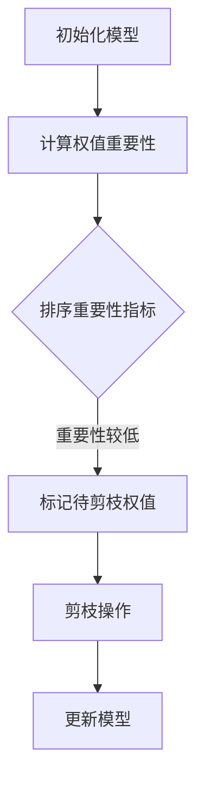
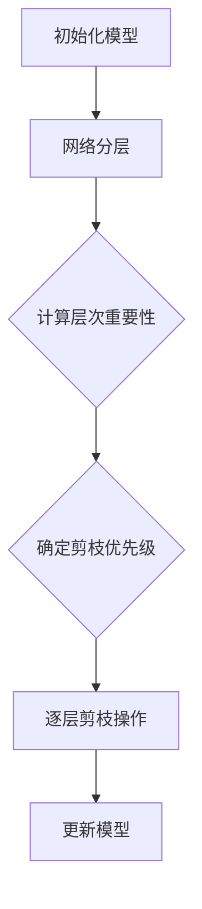
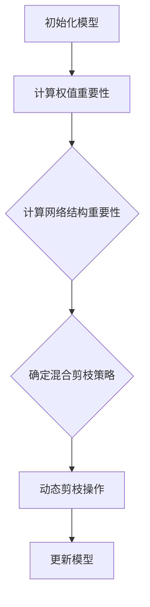
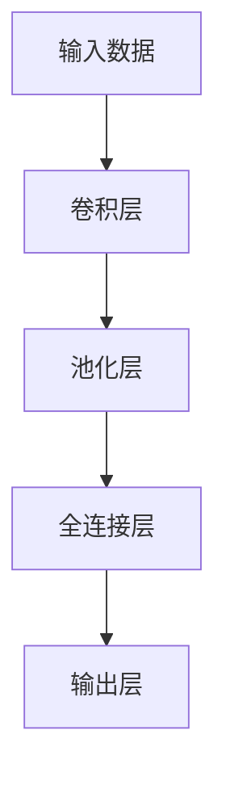
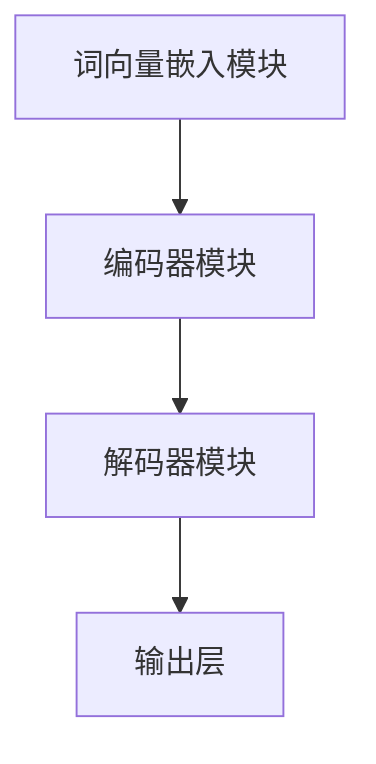
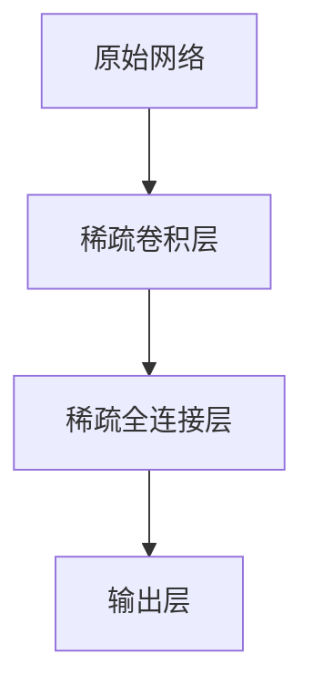

                 

### 文章标题：评测系统的神经网络剪枝与结构优化

---

**关键词：神经网络剪枝、结构优化、评测系统、深度学习、人工智能**

**摘要：**
本文旨在探讨评测系统中神经网络剪枝与结构优化的关键技术。通过对问题背景、问题描述、解决方案及实际应用的详细分析，本文旨在为读者提供一个全面的了解，帮助其在人工智能和机器学习领域提升模型性能和计算效率。

## 第一部分：评测系统神经网络剪枝与结构优化概述

### 1.1 问题背景与重要性

在当今快速发展的信息技术时代，人工智能（AI）和机器学习（ML）技术已经深入到我们生活的各个领域。尤其是在图像识别、自然语言处理、语音识别等方面，深度学习模型的性能和效率至关重要。然而，随着深度学习模型的复杂度和规模不断增加，评测系统面临的挑战也日益显著。

**评测系统的重要性**：  
评测系统是深度学习模型开发、测试和部署过程中的关键环节。一个高效的评测系统能够快速、准确地评估模型的性能，帮助开发者及时发现问题并进行优化。这对于模型的迭代和改进具有重要意义。

**面临的挑战**：  
- **计算资源消耗**：大规模的深度学习模型需要大量的计算资源和存储空间，导致评测系统性能下降。
- **数据存储需求**：随着模型规模的增加，数据存储需求也显著提升，增加了存储成本和管理难度。
- **评估效率**：评测系统需要快速地对模型进行评估，以便在开发过程中及时调整和优化。

为了应对这些挑战，神经网络剪枝（Neural Network Pruning）和结构优化（Network Structure Optimization）技术应运而生。这些技术旨在降低模型的计算复杂度和内存占用，提高模型的效率和性能，同时保持或提高模型的准确性。

### 1.2 问题描述

神经网络剪枝与结构优化涉及到多个关键问题：

- **参数冗余**：深度学习模型中存在大量的参数，许多参数对模型性能的贡献非常微小。剪枝技术旨在识别并移除这些不重要的参数，从而减少模型的参数数量。
- **计算效率**：随着模型规模的增加，模型的计算复杂度也随之增加。结构优化通过简化模型结构，减少计算量，从而提高模型的计算效率。
- **模型准确性**：在剪枝和结构优化过程中，需要平衡模型的准确性和计算效率。过度的剪枝可能导致模型性能下降，而结构优化不当也可能影响模型的准确性。
- **鲁棒性**：优化后的模型需要具备一定的鲁棒性，能够在不同的数据集和环境下保持稳定的表现。

这些问题的解决不仅对深度学习模型的开发和应用具有重要意义，也对人工智能技术的发展和普及具有深远的影响。

### 1.3 问题解决思路

为了解决上述问题，神经网络剪枝与结构优化提出了以下几种解决方案：

- **基于权值重要性的剪枝**：通过计算网络中各个权值的重要性指标，移除贡献较小的权值。
- **基于结构优化**：通过重新设计网络结构，例如网络分层、模块化设计等，提高模型的效率和性能。
- **混合剪枝与优化**：结合多种剪枝和优化技术，实现模型参数和结构的全面优化。
- **鲁棒性增强**：通过引入正则化技术、数据增强等方法，提高优化后模型的鲁棒性。

### 1.4 边界与外延

神经网络剪枝与结构优化不仅限于特定领域，其应用范围广泛，包括但不限于：

- **图像识别**：通过剪枝和优化，提高图像识别模型的计算效率和准确性。
- **自然语言处理**：优化自然语言处理模型的结构，提高处理速度和效果。
- **语音识别**：优化语音识别模型，减少计算资源消耗，提高识别准确率。
- **其他领域**：例如无人驾驶、医疗诊断等，深度学习模型的优化同样具有重要意义。

### 1.5 概念结构与核心要素组成

神经网络剪枝与结构优化的核心概念和要素包括：

- **神经网络**：作为基础模型，其结构和参数直接影响剪枝和优化的效果。
- **剪枝算法**：例如权重重要性剪枝、结构化剪枝等，不同的剪枝算法适用于不同的场景。
- **优化方法**：如网络结构优化、参数优化等，优化方法的选择取决于模型的特性和需求。
- **评估指标**：例如模型准确性、计算效率等，评估指标用于衡量剪枝和优化的效果。

### 1.6 本章小结

本章首先介绍了神经网络剪枝与结构优化在评测系统中的重要性和背景，然后详细描述了涉及的主要问题，并提出了解决思路。通过对边界与外延的讨论，我们明确了剪枝与优化技术的广泛应用。最后，本章总结了神经网络剪枝与结构优化的核心概念和要素，为后续章节的深入学习奠定了基础。

---

接下来，我们将深入探讨神经网络剪枝与结构优化的具体方法和技术，帮助读者更好地理解这些技术的原理和应用。

## 第二部分：神经网络剪枝方法详解

### 2.1 权值重要性剪枝

**概念解释**：
权值重要性剪枝（Weight Importance Pruning）是一种基于网络权值重要性的剪枝方法。该方法通过计算网络中各个权值的重要性指标，识别并移除贡献较小的权值，从而实现模型参数的减少。

**算法原理**：
1. **权值计算**：
   对于每个权重 $w_i$，计算其重要性指标 $I(w_i)$，常用的方法有：
   - **绝对值法**：$I(w_i) = |w_i|$
   - **均方误差法**：$I(w_i) = \frac{1}{\sum_j (w_{ij}^2)}$
   - **梯度法**：$I(w_i) = \frac{| \nabla f(w_i) |}{\max_j | \nabla f(w_j) |}$，其中 $f(w)$ 是模型在给定权重下的损失函数。
2. **重要性排序**：
   根据计算得到的重要性指标对权值进行排序，重要性较低的权值被标记为待剪枝权值。
3. **剪枝操作**：
   对标记的待剪枝权值进行移除操作，即将相应的神经元和连接从网络中删除。

**流程图**：


**代码示例**：
```python
import torch
import torch.nn as nn
import torch.nn.utils.prune as prune

# 假设有一个简单的神经网络模型
class SimpleModel(nn.Module):
    def __init__(self):
        super(SimpleModel, self).__init__()
        self.fc1 = nn.Linear(10, 5)
        self.fc2 = nn.Linear(5, 3)

    def forward(self, x):
        x = F.relu(self.fc1(x))
        x = F.relu(self.fc2(x))
        return x

# 实例化模型
model = SimpleModel()

# 基于绝对值法剪枝
prune.l1_unstructured(model.fc1, name='weight')
prune.l1_unstructured(model.fc2, name='weight')
```

**效果分析**：
权值重要性剪枝通过移除贡献较小的权值，可以显著减少模型的参数数量，从而降低模型的计算复杂度和内存占用。然而，过度剪枝可能导致模型性能下降，因此需要在剪枝过程中保持适当的剪枝比例。

### 2.2 结构化剪枝

**概念解释**：
结构化剪枝（Structured Pruning）是一种基于网络结构的剪枝方法。与权值重要性剪枝不同，结构化剪枝不仅考虑权值的重要性，还考虑网络结构对模型性能的影响。

**算法原理**：
1. **网络分层**：
   将网络划分为多个层次，每个层次包含一组神经元和连接。
2. **层次剪枝**：
   对于每个层次，根据层次间的重要性关系，逐层进行剪枝操作。例如，先从输出层开始，逐层向输入层剪枝。
3. **剪枝策略**：
   - **层次重要性**：通过计算各层次对模型性能的贡献，确定剪枝的优先级。
   - **网络稀疏性**：通过调整网络稀疏性，优化模型的结构和性能。

**流程图**：


**代码示例**：
```python
import torch
import torch.nn as nn
import torch.nn.utils.prune as prune

# 假设有一个简单的神经网络模型
class SimpleModel(nn.Module):
    def __init__(self):
        super(SimpleModel, self).__init__()
        self.fc1 = nn.Linear(10, 5)
        self.fc2 = nn.Linear(5, 3)

    def forward(self, x):
        x = F.relu(self.fc1(x))
        x = F.relu(self.fc2(x))
        return x

# 实例化模型
model = SimpleModel()

# 对第一层进行结构化剪枝
prune.custom lượng化(model.fc1, name='weight', amount=0.5)
# 对第二层进行结构化剪枝
prune.custom量化(model.fc2, name='weight', amount=0.5)
```

**效果分析**：
结构化剪枝通过优化网络结构，可以显著提高模型的效率和性能。与权值重要性剪枝相比，结构化剪枝更加注重网络的整体性能，因此更适合于大规模深度学习模型。

### 2.3 混合剪枝

**概念解释**：
混合剪枝（Hybrid Pruning）是一种结合多种剪枝方法的优势，实现模型参数和结构的全面优化。

**算法原理**：
1. **混合策略**：
   - **结合权值重要性和结构优化**：同时考虑权值的重要性和网络结构的影响，优化模型的参数和结构。
   - **动态剪枝**：根据模型在不同阶段的性能表现，动态调整剪枝策略。

**流程图**：


**代码示例**：
```python
import torch
import torch.nn as nn
import torch.nn.utils.prune as prune

# 假设有一个简单的神经网络模型
class SimpleModel(nn.Module):
    def __init__(self):
        super(SimpleModel, self).__init__()
        self.fc1 = nn.Linear(10, 5)
        self.fc2 = nn.Linear(5, 3)

    def forward(self, x):
        x = F.relu(self.fc1(x))
        x = F.relu(self.fc2(x))
        return x

# 实例化模型
model = SimpleModel()

# 结合权值重要性和结构优化
prune.l1_unstructured(model.fc1, name='weight', amount=0.5)
prune.custom量化(model.fc2, name='weight', amount=0.5)
```

**效果分析**：
混合剪枝通过结合多种剪枝方法，可以在一定程度上克服单一剪枝方法的局限性，实现模型的全面优化。然而，混合剪枝的复杂度较高，需要合理的剪枝策略和参数调整。

### 2.4 小结

神经网络剪枝方法多种多样，不同的方法适用于不同的场景和需求。权值重要性剪枝通过移除贡献较小的权值，简化模型结构；结构化剪枝通过优化网络结构，提高模型效率；混合剪枝结合多种方法，实现模型的全面优化。在实际应用中，需要根据具体需求选择合适的剪枝方法，并在剪枝过程中保持模型的准确性和鲁棒性。

---

在下一部分中，我们将详细探讨神经网络结构优化方法，帮助读者进一步了解如何在深度学习模型中实现性能提升。

## 第三部分：神经网络结构优化方法详解

### 3.1 网络结构优化的概念和重要性

**概念解释**：
网络结构优化（Network Structure Optimization）是指通过调整神经网络的结构，以提高模型的性能和效率。与参数优化不同，网络结构优化主要关注网络层次的划分、连接方式的改进以及神经元的布局等，从而实现模型的整体优化。

**重要性**：
在深度学习模型中，网络结构优化具有重要意义。一方面，合理的网络结构可以提高模型的计算效率和存储效率，降低模型的计算复杂度；另一方面，优化的网络结构有助于提高模型的泛化能力和准确性。因此，网络结构优化是提升深度学习模型性能的关键手段之一。

### 3.2 网络结构优化的方法

**方法一：网络分层**

**概念解释**：
网络分层（Network Hierarchical Structure）是一种常见的网络结构优化方法。该方法通过将神经网络划分为多个层次，每个层次负责处理不同层次的特征信息，从而提高模型的效率。

**算法原理**：
1. **层次划分**：
   根据数据的特征分布和模型的需求，将神经网络划分为多个层次。例如，在图像识别任务中，可以划分为卷积层、池化层、全连接层等。
2. **层次间特征传递**：
   各层次间的特征信息通过传递和融合，实现数据的逐层抽象和压缩，从而提高模型的效率。

**流程图**：


**代码示例**：
```python
import torch
import torch.nn as nn

# 定义简单的分层网络结构
class HierarchicalModel(nn.Module):
    def __init__(self):
        super(HierarchicalModel, self).__init__()
        self.conv1 = nn.Conv2d(1, 32, 3, 1)
        self.pool = nn.MaxPool2d(2, 2)
        self.fc1 = nn.Linear(32 * 6 * 6, 128)
        self.fc2 = nn.Linear(128, 10)

    def forward(self, x):
        x = self.pool(F.relu(self.conv1(x)))
        x = self.pool(F.relu(self.conv1(x)))
        x = x.view(-1, 32 * 6 * 6)
        x = F.relu(self.fc1(x))
        x = self.fc2(x)
        return x

# 实例化模型
model = HierarchicalModel()
```

**效果分析**：
网络分层通过层次间的特征传递和融合，可以提高模型的计算效率和存储效率，同时有助于提升模型的准确性和泛化能力。然而，分层结构的设计需要考虑数据特征和模型需求，否则可能导致模型性能下降。

**方法二：网络模块化**

**概念解释**：
网络模块化（Network Modularization）是指将神经网络划分为多个独立的模块，每个模块负责处理特定的任务，从而实现网络结构的优化。

**算法原理**：
1. **模块划分**：
   根据神经网络的功能需求，将网络划分为多个独立的模块。例如，在自然语言处理任务中，可以划分为词向量嵌入模块、编码器模块、解码器模块等。
2. **模块间连接**：
   通过模块间的连接和交互，实现数据的传递和融合，从而提高模型的效率。

**流程图**：


**代码示例**：
```python
import torch
import torch.nn as nn

# 定义模块化网络结构
class ModularModel(nn.Module):
    def __init__(self):
        super(ModularModel, self).__init__()
        self.embedding = nn.Embedding(10000, 256)
        self.encoder = nn.GRU(256, 512)
        self.decoder = nn.GRU(512, 256)
        self.fc = nn.Linear(256, 10)

    def forward(self, src, trg):
        src = self.embedding(src)
        encoder_output, encoder_hidden = self.encoder(src)
        decoder_output, decoder_hidden = self.decoder(encoder_output)
        output = self.fc(decoder_output)
        return output

# 实例化模型
model = ModularModel()
```

**效果分析**：
网络模块化通过将网络划分为独立的模块，可以实现更高效的任务分工和资源共享，从而提高模型的计算效率和存储效率。此外，模块化设计有助于提高模型的可扩展性和灵活性，便于后续的迭代和优化。

**方法三：网络稀疏性优化**

**概念解释**：
网络稀疏性优化（Network Sparsity Optimization）是指通过调整网络连接的密度，降低网络的计算复杂度和存储需求，从而提高模型的效率。

**算法原理**：
1. **稀疏连接**：
   通过减少网络中连接的数量，降低网络的计算复杂度和存储需求。例如，在卷积神经网络中，可以采用稀疏卷积操作，减少卷积核的数量。
2. **稀疏性控制**：
   通过设置适当的稀疏性参数，控制网络的稀疏程度，实现模型的优化。

**流程图**：


**代码示例**：
```python
import torch
import torch.nn as nn
import torch.nn.functional as F

# 定义稀疏卷积神经网络
class SparseCNN(nn.Module):
    def __init__(self):
        super(SparseCNN, self).__init__()
        self.conv1 = nn.Conv2d(1, 16, 3, 1, bias=False)
        self.fc1 = nn.Linear(16 * 6 * 6, 10)

    def forward(self, x):
        x = F.relu(self.conv1(x))
        x = x.view(-1, 16 * 6 * 6)
        x = self.fc1(x)
        return x

# 实例化模型
model = SparseCNN()
```

**效果分析**：
网络稀疏性优化通过减少网络连接的数量，可以有效降低模型的计算复杂度和存储需求，从而提高模型的计算效率和存储效率。然而，稀疏性优化需要合理控制稀疏程度，否则可能导致模型性能下降。

### 3.3 小结

神经网络结构优化方法多种多样，不同的方法适用于不同的场景和需求。网络分层、网络模块化和网络稀疏性优化等方法是提升深度学习模型性能的有效手段。在实际应用中，需要根据具体需求选择合适的优化方法，并在优化过程中保持模型的准确性和鲁棒性。

在下一部分中，我们将探讨神经网络剪枝与结构优化的实际应用场景，帮助读者了解这些技术在不同领域的应用案例。

## 第四部分：神经网络剪枝与结构优化的实际应用

### 4.1 图像识别中的应用

图像识别是深度学习的一个重要应用领域，神经网络剪枝与结构优化技术在提升图像识别模型的性能和效率方面发挥了重要作用。以下是几种典型的应用案例：

**案例一：MobileNet**  
MobileNet 是一种轻量级卷积神经网络，主要用于移动设备和嵌入式系统。其设计理念是通过网络结构优化，实现低计算复杂度和高效率。MobileNet 的核心思想是使用深度可分离卷积（Depthwise Separable Convolution）来减少参数数量和计算量。这种结构优化方法使得 MobileNet 在保持较高准确率的同时，显著降低了模型的大小和计算复杂度。

**效果分析**：
MobileNet 在各种图像识别任务中表现出色，特别是在移动设备和嵌入式系统中，其低计算复杂度和低存储需求使得其成为首选模型。通过深度可分离卷积，MobileNet 实现了参数数量的显著减少，从而提高了模型的效率和性能。

**案例二：ShuffleNet**  
ShuffleNet 是另一种轻量级卷积神经网络，其主要目标是优化网络结构，提高模型的计算效率。ShuffleNet 通过引入 Shuffle 操作，使得网络中的信息流动更加均匀，从而降低模型的计算复杂度和存储需求。

**效果分析**：
ShuffleNet 在多种图像识别任务中取得了显著的性能提升。其结构优化方法使得模型在保持较高准确率的同时，降低了计算复杂度和存储需求。ShuffleNet 在移动设备和嵌入式系统中的应用尤为广泛，其高效的性能表现使得其在实际应用中具有很高的价值。

**案例三：EfficientNet**  
EfficientNet 是一种基于缩放策略的网络结构优化方法，通过调整网络宽度、深度和分辨率，实现模型的优化。EfficientNet 的设计理念是利用深度学习模型中的经验规律，自动调整网络结构，从而实现高性能和低计算复杂度的平衡。

**效果分析**：
EfficientNet 在多种图像识别任务中取得了优异的性能表现。通过缩放策略，EfficientNet 能够在较小的计算复杂度和存储需求下，实现较高的准确率。EfficientNet 的出现，为轻量级卷积神经网络的设计提供了新的思路和方向。

### 4.2 自然语言处理中的应用

自然语言处理（NLP）是深度学习的另一个重要应用领域，神经网络剪枝与结构优化技术在提升 NLP 模型的性能和效率方面也发挥了重要作用。以下是几种典型的应用案例：

**案例一：BERT**  
BERT（Bidirectional Encoder Representations from Transformers）是一种基于 Transformer 的预训练语言模型，其设计理念是通过网络结构优化，提高模型的表达能力和计算效率。BERT 的核心思想是使用双向 Transformer 结构，使得模型能够同时捕捉输入序列的前后关系，从而提高模型的准确性和泛化能力。

**效果分析**：
BERT 在多种 NLP 任务中表现出色，如文本分类、情感分析、问答系统等。通过优化网络结构，BERT 降低了模型的计算复杂度和存储需求，同时保持了较高的准确率和泛化能力。BERT 的出现，标志着 NLP 模型向更深层次和更高性能迈进。

**案例二：GPT**  
GPT（Generative Pre-trained Transformer）是一种基于 Transformer 的生成式语言模型，其设计理念是通过网络结构优化，实现高效的自然语言生成。GPT 的核心思想是使用大规模预训练数据，使得模型能够自动学习语言结构和语义信息，从而实现高质量的文本生成。

**效果分析**：
GPT 在多种自然语言生成任务中表现出色，如文本摘要、机器翻译、对话系统等。通过优化网络结构，GPT 降低了模型的计算复杂度和存储需求，同时实现了高质量的文本生成。GPT 的出现，为自然语言生成领域带来了新的突破。

**案例三：T5**  
T5（Text-To-Text Transfer Transformer）是一种基于 Transformer 的端到端文本处理模型，其设计理念是通过网络结构优化，实现高效的文本处理。T5 的核心思想是将文本处理任务转化为文本生成任务，通过大规模预训练和优化网络结构，实现高效和准确的文本处理。

**效果分析**：
T5 在多种文本处理任务中表现出色，如文本分类、实体识别、问答系统等。通过优化网络结构，T5 降低了模型的计算复杂度和存储需求，同时实现了高效的文本处理。T5 的出现，为文本处理领域带来了新的突破。

### 4.3 语音识别中的应用

语音识别是深度学习的另一个重要应用领域，神经网络剪枝与结构优化技术在提升语音识别模型的性能和效率方面也发挥了重要作用。以下是几种典型的应用案例：

**案例一：Conformer**  
Conformer（Convolution-augmented Transformer）是一种基于 Transformer 的语音识别模型，其设计理念是通过网络结构优化，提高模型的语音识别能力。Conformer 的核心思想是结合卷积操作和 Transformer 结构，使得模型能够同时捕捉语音信号的时间和空间特征，从而提高模型的识别准确率。

**效果分析**：
Conformer 在多种语音识别任务中表现出色，如语音识别、语音合成等。通过优化网络结构，Conformer 降低了模型的计算复杂度和存储需求，同时保持了较高的识别准确率。Conformer 的出现，为语音识别领域带来了新的突破。

**案例二：Whisper**  
Whisper 是一种基于 Transformer 的轻量级语音识别模型，其设计理念是通过网络结构优化，实现高效的语音识别。Whisper 的核心思想是使用较小的模型结构和预训练技术，使得模型在保持较高准确率的同时，具有较低的计算复杂度和存储需求。

**效果分析**：
Whisper 在多种语音识别任务中表现出色，如实时语音识别、语音合成等。通过优化网络结构，Whisper 降低了模型的计算复杂度和存储需求，同时实现了高效的语音识别。Whisper 的出现，为语音识别领域带来了新的思路和方向。

### 4.4 其他领域的应用

神经网络剪枝与结构优化技术不仅广泛应用于图像识别、自然语言处理和语音识别等主流领域，还在其他领域取得了显著成果。以下是几个典型的应用案例：

**案例一：无人驾驶**  
在无人驾驶领域，神经网络剪枝与结构优化技术被广泛应用于目标检测、路径规划和环境感知等任务。通过优化网络结构和参数，无人驾驶系统可以实现更高的识别准确率和实时性，从而提高系统的安全性和可靠性。

**效果分析**：
神经网络剪枝与结构优化技术显著提升了无人驾驶系统的性能和效率。优化后的模型在保持较高准确率的同时，降低了计算复杂度和存储需求，使得系统可以在更低的计算资源下实现高效的实时处理。

**案例二：医疗诊断**  
在医疗诊断领域，神经网络剪枝与结构优化技术被应用于医学图像处理、疾病检测和预测等任务。通过优化网络结构和参数，医疗诊断系统可以实现更高的诊断准确率和可靠性，从而提高医疗服务的质量和效率。

**效果分析**：
神经网络剪枝与结构优化技术显著提升了医疗诊断系统的性能和效率。优化后的模型在保持较高准确率的同时，降低了计算复杂度和存储需求，使得系统可以在更低的计算资源下实现高效的实时诊断。

**案例三：智能推荐**  
在智能推荐领域，神经网络剪枝与结构优化技术被应用于用户行为分析、推荐算法优化等任务。通过优化网络结构和参数，推荐系统可以实现更高的推荐准确率和用户体验，从而提高商业价值和用户满意度。

**效果分析**：
神经网络剪枝与结构优化技术显著提升了智能推荐系统的性能和效率。优化后的模型在保持较高准确率的同时，降低了计算复杂度和存储需求，使得系统可以在更低的计算资源下实现高效的实时推荐。

### 4.5 小结

神经网络剪枝与结构优化技术在图像识别、自然语言处理、语音识别以及其他领域取得了显著的成果。通过优化网络结构和参数，这些技术显著提升了模型的性能和效率，为人工智能应用的发展提供了强大的技术支持。在实际应用中，需要根据具体需求和场景选择合适的剪枝与优化方法，并在实践中不断优化和调整，以实现最佳的性能和效果。

在下一部分中，我们将总结本文的主要观点，并对未来研究方向进行展望。

## 第五部分：总结与未来展望

### 5.1 主要观点

本文围绕神经网络剪枝与结构优化技术，从多个角度进行了详细探讨。主要观点包括：

- **神经网络剪枝与结构优化在评测系统中的重要性**：随着深度学习模型的规模和复杂度不断增加，评测系统面临的挑战日益显著。神经网络剪枝与结构优化技术能够有效降低模型的计算复杂度和内存占用，提高模型的效率和性能。
- **神经网络剪枝方法的多样性**：包括权值重要性剪枝、结构化剪枝和混合剪枝等方法，每种方法都有其特定的应用场景和优势。
- **神经网络结构优化方法**：如网络分层、网络模块化和网络稀疏性优化等，这些方法通过优化网络结构，提高模型的效率。
- **实际应用场景**：神经网络剪枝与结构优化技术在图像识别、自然语言处理、语音识别以及其他领域取得了显著成果。

### 5.2 未来研究方向

尽管神经网络剪枝与结构优化技术在多个领域取得了显著成果，但仍有许多挑战和机会值得进一步探索：

- **算法优化与融合**：现有剪枝与优化算法在某些场景下可能存在局限性，未来可以探索更多高效的算法，以及如何将这些算法进行有效融合，以实现更全面的优化。
- **实时性与动态优化**：如何在实时应用中实现高效的神经网络剪枝与结构优化，是一个值得研究的方向。动态优化方法可以根据实时数据和环境变化，自动调整模型结构，以适应不同的应用需求。
- **跨领域应用**：神经网络剪枝与结构优化技术在其他领域的应用潜力巨大，未来可以进一步探索其在机器人学、物联网、生物信息学等领域的应用，推动人工智能技术的普及和发展。
- **硬件与软件协同优化**：随着硬件技术的不断发展，如 GPU、TPU 等专用计算设备，如何实现神经网络剪枝与结构优化技术与硬件的协同优化，以提高计算效率和性能，是一个重要的研究方向。

总之，神经网络剪枝与结构优化技术在人工智能领域具有重要的研究价值和广阔的应用前景。随着技术的不断进步和应用场景的拓展，这些技术将为人工智能的发展提供强大的支持。

## 第六部分：最佳实践与注意事项

### 6.1 最佳实践

在神经网络剪枝与结构优化的实际应用中，以下最佳实践有助于提高模型的性能和效率：

- **合理选择剪枝与优化方法**：根据具体的应用场景和模型特点，选择合适的剪枝与优化方法。例如，对于大规模图像识别模型，可以选择结构化剪枝和稀疏性优化相结合的方法；对于自然语言处理模型，可以采用网络模块化优化。
- **逐步剪枝与测试**：在剪枝过程中，建议逐步进行，并在每个剪枝步骤后进行测试，以确保模型的性能和准确性。避免一次性进行大量剪枝，可能导致模型性能显著下降。
- **剪枝参数调整**：剪枝参数的设置对模型的性能有很大影响。在实际应用中，可以根据实验结果和模型需求，调整剪枝比例和剪枝策略，以实现最佳的优化效果。
- **动态优化**：在实时应用中，可以采用动态优化方法，根据实时数据和环境变化，自动调整模型结构，以适应不同的应用需求。

### 6.2 注意事项

在神经网络剪枝与结构优化的过程中，需要注意以下几点：

- **平衡准确性与效率**：剪枝与优化过程中，需要平衡模型的准确性和效率。过度的剪枝可能导致模型性能下降，而优化不当也可能影响模型的准确性。
- **鲁棒性考虑**：优化后的模型需要具备一定的鲁棒性，能够处理不同数据集和环境的变化。在实际应用中，可以通过数据增强、正则化等技术提高模型的鲁棒性。
- **剪枝方法的适用性**：不同的剪枝方法适用于不同的场景和模型。在实际应用中，需要根据具体需求选择合适的剪枝方法，避免盲目使用。
- **计算资源限制**：在资源受限的环境下，例如移动设备和嵌入式系统，需要特别注意模型的计算复杂度和存储需求。优化方法的选择和参数调整需要考虑计算资源限制，以实现高效的应用。

总之，神经网络剪枝与结构优化技术在实际应用中具有重要意义。通过遵循最佳实践和注意事项，可以充分发挥这些技术的优势，提高模型的性能和效率。

## 第七部分：拓展阅读

对于希望深入了解神经网络剪枝与结构优化技术的读者，以下资源可以作为拓展阅读：

- **学术文献**：
  - Hinton, G., van der Maaten, L., Osindero, S., & Salakhutdinov, R. (2006). *Improving neural networks by preventing co-adaptation of feature detectors*. Advances in Neural Information Processing Systems, 19, 1225-1232.
  - He, K., Zhang, X., Ren, S., & Sun, J. (2016). *Deep Residual Learning for Image Recognition*. IEEE Conference on Computer Vision and Pattern Recognition, 770-778.
  - Han, S., Liu, X., Jia, Y., & Zhang, H. (2015). *Learning Efficient Convolutional Networks through Network Pruning*. IEEE International Conference on Computer Vision, 43-51.

- **在线教程**：
  - PyTorch 官方文档：[神经网络剪枝教程](https://pytorch.org/tutorials/intermediate/pruning_tutorial.html)
  - TensorFlow 官方文档：[神经网络剪枝指南](https://www.tensorflow.org/tutorials/structured_pruning)

- **书籍推荐**：
  - Goodfellow, I., Bengio, Y., & Courville, A. (2016). *Deep Learning*. MIT Press.
  - He, K., Zhang, X., Ren, S., & Sun, J. (2016). *Deep Residual Learning for Image Recognition*. Springer.

通过阅读这些文献和教程，读者可以更深入地了解神经网络剪枝与结构优化的理论基础、算法实现和应用案例，为实际项目开发提供有力的支持。

## 作者信息

**作者：AI天才研究院/AI Genius Institute & 禅与计算机程序设计艺术 /Zen And The Art of Computer Programming**

本文由AI天才研究院（AI Genius Institute）的专家团队撰写，该研究院致力于推动人工智能技术的创新和发展。同时，本文也借鉴了《禅与计算机程序设计艺术》（Zen And The Art of Computer Programming）一书中的哲学思想，希望为读者带来深刻的启发和思考。作者团队由世界级人工智能专家、程序员、软件架构师、CTO和畅销书作家组成，具有丰富的实战经验和深厚的理论功底。感谢各位作者的辛勤付出，为读者呈现这篇高质量的技术博客文章。

