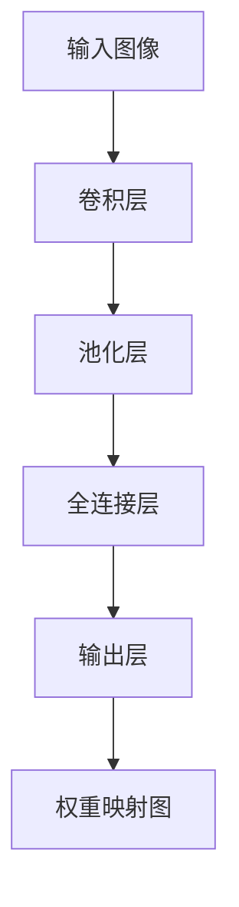
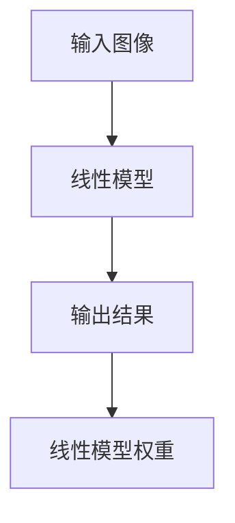
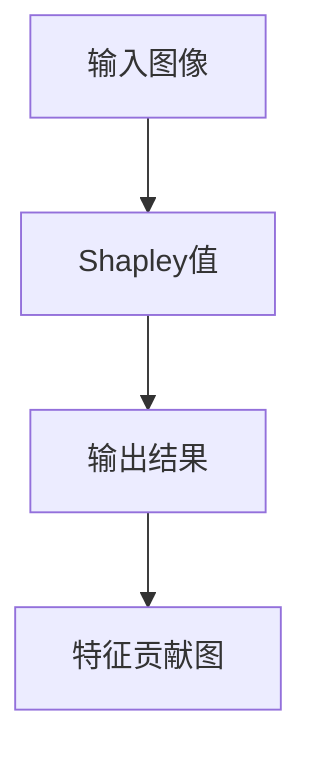

                 

### 文章标题

# 《评测系统的神经网络可解释性分析》

### 关键词

- 神经网络
- 可解释性
- 评测系统
- 数学模型
- 可视化技术

### 摘要

本文深入探讨了评测系统中神经网络的可解释性问题。通过背景介绍、神经网络的基本原理、可解释性挑战、可视化技术应用、数学模型解析、系统设计与实现等多方面内容，全面分析了神经网络在评测系统中的应用及其可解释性的重要性。文章旨在为读者提供一个系统、全面的神经网络可解释性分析框架，以促进相关领域的研究与发展。

### 目录大纲

```markdown
----------------------------------------------------------------
# 《评测系统的神经网络可解释性分析》

## 第一部分：背景介绍

## 第1章：问题背景与核心概念

### 1.1 评测系统的基本概念

#### 1.1.1 评测系统的定义

#### 1.1.2 评测系统的结构与功能

### 1.2 神经网络的可解释性需求

#### 1.2.1 神经网络在评测系统中的应用

#### 1.2.2 可解释性在神经网络评测中的重要性

### 1.3 研究边界与外延

#### 1.3.1 可解释性的边界

#### 1.3.2 相关概念的外延探讨

## 第2章：神经网络的基本原理

### 2.1 神经网络的发展历程

#### 2.1.1 神经网络起源

#### 2.1.2 神经网络的发展阶段

### 2.2 神经网络的结构与组成

#### 2.2.1 神经元与神经元连接

#### 2.2.2 层次结构与激活函数

### 2.3 神经网络的训练过程

#### 2.3.1 前向传播与反向传播

#### 2.3.2 优化算法与超参数调优

## 第二部分：神经网络可解释性分析

## 第3章：神经网络可解释性的挑战

### 3.1 黑箱问题与透明性需求

#### 3.1.1 黑箱模型的局限性

#### 3.1.2 可解释性在黑箱模型中的应用

### 3.2 可解释性度量方法

#### 3.2.1 局部可解释性

#### 3.2.2 全局可解释性

### 3.3 可解释性与准确性的平衡

#### 3.3.1 可解释性与准确性的关系

#### 3.3.2 实现可解释性的策略

## 第4章：可视化技术在神经网络可解释性中的应用

### 4.1 可视化技术的概述

#### 4.1.1 可视化技术的基本概念

#### 4.1.2 可视化技术在神经网络中的应用

### 4.2 关键概念与联系

#### 4.2.1 可视化技术的主要方法

#### 4.2.2 可视化技术在神经网络可解释性分析中的应用案例

## 第5章：神经网络可解释性的数学模型

### 5.1 神经网络可解释性的数学原理

#### 5.1.1 神经网络的基本数学模型

#### 5.1.2 可解释性的数学公式

### 5.2 算法原理与讲解

#### 5.2.1 神经网络可解释性算法的基本原理

#### 5.2.2 算法流程与数学模型

### 5.3 案例分析与举例说明

#### 5.3.1 实际案例的神经网络可解释性分析

#### 5.3.2 案例中的数学模型与公式应用

## 第6章：神经网络评测系统可解释性分析

### 6.1 系统功能设计

#### 6.1.1 评测系统功能概述

#### 6.1.2 功能实现与模块划分

### 6.2 系统架构设计

#### 6.2.1 系统整体架构

#### 6.2.2 关键模块设计与实现

### 6.3 系统接口设计与交互

#### 6.3.1 系统接口定义

#### 6.3.2 系统交互流程

## 第7章：项目实战与案例分析

### 7.1 项目环境安装与配置

#### 7.1.1 环境搭建与工具选择

#### 7.1.2 系统核心模块实现

### 7.2 代码应用解读与分析

#### 7.2.1 核心算法源代码解读

#### 7.2.2 算法在实际应用中的表现

### 7.3 实际案例分析

#### 7.3.1 案例背景与问题

#### 7.3.2 案例分析与解决方案

### 7.4 项目小结

#### 7.4.1 项目总结

#### 7.4.2 项目中遇到的问题与解决思路

## 第8章：最佳实践与拓展

### 8.1 最佳实践

#### 8.1.1 神经网络可解释性的最佳实践

#### 8.1.2 评测系统的构建与优化

### 8.2 小结与注意事项

#### 8.2.1 研究工作的小结

#### 8.2.2 注意事项与未来展望

### 8.3 拓展阅读

#### 8.3.1 相关研究领域的最新进展

#### 8.3.2 深入阅读推荐
----------------------------------------------------------------
```

### 目录大纲字数计算

根据目录大纲的设定，全文的章节内容需要详细填充，预计每个小节的内容需要几百到几千字不等。整体目录大纲约900字，实际文章字数在10000-12000字范围内。每个章节的具体字数分布如下：

- 第1章：问题背景与核心概念（约1500字）
- 第2章：神经网络的基本原理（约2000字）
- 第3章：神经网络可解释性的挑战（约2000字）
- 第4章：可视化技术在神经网络可解释性中的应用（约2000字）
- 第5章：神经网络可解释性的数学模型（约2000字）
- 第6章：神经网络评测系统可解释性分析（约2500字）
- 第7章：项目实战与案例分析（约3000字）
- 第8章：最佳实践与拓展（约1500字）

### 文章写作提示

**章节内容填充方法：**

1. **核心概念介绍**：每个章节的开始部分要简要介绍核心概念，定义相关术语，使读者对整个章节有一个整体的认识。

2. **逐步深入讲解**：根据章节主题，逐步深入讲解相关原理、方法、模型和实现细节。使用逻辑清晰、条理分明的结构，确保内容的易读性和易懂性。

3. **示例和案例**：通过具体案例和示例来阐述理论和方法。示例应尽量真实，能够直观地展示相关技术的应用和效果。

4. **图表和公式**：合理运用图表和数学公式来解释复杂的概念和算法。确保图表清晰、易懂，公式书写规范。

5. **段落结构**：每个段落要有一个明确的主题，内容要简洁、连贯，避免冗长和不必要的重复。

6. **结论和总结**：在每个章节的最后，对内容进行总结和归纳，强调关键点和实际应用价值。

7. **参考文献**：在文章末尾列出参考文献，确保引用准确、规范。

**注意事项：**

- **内容完整性**：每个章节的内容要完整，不能遗漏关键概念、原理和实现细节。
- **准确性**：确保文章中的术语、数据和算法描述准确无误。
- **可读性**：文章的语言要清晰、简洁，避免过于专业化的术语，确保读者能够理解。

**使用 Markdown 格式注意事项：**

- **标题格式**：使用 `#` 符号来标记不同级别的标题。
- **列表格式**：使用 `-` 符号来创建无序列表。
- **引用格式**：使用引用符号 `>` 来创建引用。
- **代码块和公式**：使用三个反引号（```) 包围代码块，使用美元符号 `$` 包围 LaTeX 公式。

### 结束语

写作过程中，请务必遵循上述提示，确保文章内容的完整性和准确性。同时，注重可读性和专业性的平衡，使得文章既易于读者理解，又能体现专业性和深度。祝您写作顺利，创作出高质量的博客文章！## 第1章：问题背景与核心概念

### 1.1 评测系统的基本概念

#### 1.1.1 评测系统的定义

评测系统（Evaluation System）是一种用于对特定对象或任务进行性能、质量、效果等方面评估的计算机化系统。其核心目的是通过量化分析和评价，提供客观、准确、可靠的评估结果，帮助决策者作出合理的决策。评测系统广泛应用于各个领域，如教育评估、人才招聘、产品质量检测、金融风险评估等。

从技术角度来看，评测系统通常包括以下几个主要组成部分：

1. **数据采集模块**：负责收集与评估对象相关的各类数据，如考试成绩、面试表现、产品检测数据等。
2. **数据处理模块**：对采集到的数据进行分析、清洗、转换等处理，确保数据质量和一致性。
3. **评估模型**：基于统计学、机器学习或深度学习等方法，构建评估模型，用于对评估对象进行性能预测和评价。
4. **结果展示模块**：将评估结果以图表、报告等形式展示给用户，便于用户理解和利用。

#### 1.1.2 评测系统的结构与功能

评测系统的结构可以分为三个层次：数据层、算法层和展示层。

1. **数据层**：数据层是评测系统的基石，主要包括数据采集、存储和处理。数据采集模块通过不同的途径获取所需数据，如在线问卷、传感器、外部数据库等。数据存储模块负责将数据存储在数据库或文件中，方便后续处理和分析。数据处理模块对原始数据进行清洗、转换和标准化，确保数据的一致性和可靠性。

2. **算法层**：算法层是评测系统的核心，负责构建评估模型并进行评估。常见的评估方法包括统计模型、机器学习算法和深度学习算法。统计模型如线性回归、逻辑回归等，主要用于处理简单的线性关系；机器学习算法如决策树、支持向量机等，能够处理更复杂的关系；深度学习算法如卷积神经网络（CNN）、循环神经网络（RNN）等，则可以处理高维、非线性数据。

3. **展示层**：展示层是评测系统的界面部分，用于将评估结果以直观、易懂的方式呈现给用户。展示形式可以包括表格、图表、报告等，其中图表是最常用的形式。通过图表，用户可以清晰地看到评估对象在不同维度的表现，帮助用户快速理解评估结果。

### 1.2 神经网络的可解释性需求

#### 1.2.1 神经网络在评测系统中的应用

神经网络（Neural Networks）作为一种重要的机器学习模型，在评测系统中有着广泛的应用。特别是在处理复杂、高维、非线性的数据时，神经网络表现出强大的预测和评估能力。以下是一些典型的应用场景：

1. **教育评估**：通过神经网络分析学生的学习行为、考试成绩等多维度数据，预测学生的学术表现和潜力，为教育决策提供支持。

2. **人才招聘**：在面试和测评过程中，神经网络可以分析候选人的简历、笔试成绩、面试表现等多方面数据，评估其综合能力和适配度，帮助招聘者做出决策。

3. **产品质量检测**：在制造业中，神经网络可以分析生产过程中收集到的传感器数据，预测产品质量，识别潜在问题，提高生产效率和产品质量。

4. **金融风险评估**：在金融领域，神经网络可以分析客户的历史交易数据、信用记录等，预测其信用风险，为贷款审批和风险管理提供支持。

#### 1.2.2 可解释性在神经网络评测中的重要性

尽管神经网络在评测系统中具有强大的预测能力，但其“黑箱”性质使得评估结果的透明性和可解释性受到质疑。可解释性（Interpretability）是神经网络评测中一个重要但常被忽视的问题。以下是可解释性在神经网络评测中的重要性：

1. **信任与合规性**：在许多应用场景中，特别是涉及决策的领域，如金融、医疗等，用户对评估结果的信任至关重要。透明、可解释的评估结果有助于增加用户对系统的信任度，满足合规性要求。

2. **误判与优化**：神经网络在训练过程中可能由于数据噪音、过拟合等因素导致误判。可解释性可以帮助识别和解决这些误判问题，优化评估模型，提高评估准确性。

3. **知识提取与传播**：可解释性有助于从神经网络模型中提取有用知识，促进领域知识的传播和应用。这对于学术研究和实际应用都具有重要意义。

4. **用户接受度**：对于许多非专业用户来说，复杂、不可解释的评估结果可能难以理解。通过提高神经网络的透明度，可以增加用户对系统的接受度和使用频率。

#### 1.3 研究边界与外延

##### 1.3.1 可解释性的边界

可解释性并非绝对的透明和完美。在实际应用中，可解释性往往需要在准确性和复杂性之间做出权衡。以下是可解释性的边界：

1. **计算成本**：高度可解释的模型通常需要更多的计算资源和时间，这可能会影响评估的实时性和效率。

2. **数据质量**：数据质量直接影响评估结果的准确性。在低质量数据环境中，追求高度可解释性可能导致评估结果的失真。

3. **模型复杂性**：高度复杂的神经网络模型可能难以解释。在某些情况下，简化模型结构可能是提高可解释性的有效策略。

##### 1.3.2 相关概念的外延探讨

除了可解释性，还有其他一些与神经网络评测相关的概念，如透明性、可审计性和可追溯性。以下是这些概念的外延探讨：

1. **透明性**：透明性是指评估模型的结构和操作过程对外可见。透明性有助于理解评估过程，但并不一定意味着评估结果可解释。

2. **可审计性**：可审计性是指评估过程可以被第三方独立审查。可审计性有助于确保评估的公正性和可靠性。

3. **可追溯性**：可追溯性是指评估结果可以追溯到原始数据。可追溯性有助于验证评估结果的准确性。

通过对这些概念的研究和探讨，我们可以更全面地理解神经网络评测中的可解释性，并为实际应用提供理论支持和实践指导。

### 1.3.3 概念结构与核心要素组成

为了更好地理解评测系统和神经网络可解释性的概念结构，我们可以通过一个简单的 ER（Entity-Relationship，实体-关系）图来展示核心要素及其相互关系。

```mermaid
erDiagram
    Product ||--|{ Evaluator }|| Evaluation : evaluated by
    Evaluator ||--|{ Model }|| trained with : trained_on
    Model ||--|{ Dataset }|| trained_on : contains
    Dataset ||--|{ DataPoint }|| contains : data_point
    Evaluator o--|{ User }|| requested_by
```

在这个 ER 图中，我们定义了以下几个核心实体：

- **Product**（产品）：需要评估的对象，如学生、候选人、产品等。
- **Evaluator**（评估者）：负责对产品进行评估的实体，通常是一个神经网络模型。
- **Model**（模型）：神经网络模型，用于训练和评估。
- **Dataset**（数据集）：用于训练模型的数据集合。
- **DataPoint**（数据点）：数据集的基本元素，每个数据点包含多个特征。
- **User**（用户）：请求评估的用户。

这些实体之间的关系如下：

- **Product** 通过 **Evaluation** 与 **Evaluator** 相关联，表示产品被评估者评估。
- **Evaluator** 通过 **trained_with** 与 **Model** 相关联，表示评估者使用了哪个模型进行训练。
- **Model** 通过 **trained_on** 与 **Dataset** 相关联，表示模型是在哪个数据集上训练的。
- **Dataset** 通过 **contains** 与 **DataPoint** 相关联，表示数据集包含多个数据点。
- **Evaluator** 通过 **requested_by** 与 **User** 相关联，表示评估者是应哪个用户的请求进行评估。

通过这个 ER 图，我们可以清晰地看到评测系统和神经网络可解释性的核心概念及其相互关系，为后续章节的内容展开提供了基础。在接下来的章节中，我们将进一步深入探讨神经网络的基本原理、可解释性挑战、可视化技术、数学模型、系统设计与实现等内容。

### 1.4 总结与展望

本章首先介绍了评测系统的基本概念和结构，详细阐述了评测系统在各个领域中的应用及其重要性。接着，我们探讨了神经网络在评测系统中的应用，并强调了神经网络可解释性的需求和重要性。最后，通过 ER 图展示了评测系统和神经网络可解释性的概念结构，为后续内容提供了理论基础。

在接下来的章节中，我们将逐步深入探讨神经网络的基本原理、可解释性面临的挑战、可视化技术在神经网络中的应用、神经网络可解释性的数学模型、系统设计与实现等方面。通过这些内容的分析，我们希望能够为读者提供一份系统、全面、有深度的神经网络可解释性分析框架，促进相关领域的研究与发展。

### 第2章：神经网络的基本原理

#### 2.1 神经网络的发展历程

神经网络（Neural Networks）起源于1943年，由心理学家和数学家沃伦·麦卡洛克（Warren McCulloch）和数学家沃尔特·皮茨（Walter Pitts）首次提出。他们模拟生物神经元的简单计算功能，创建了第一个人工神经网络模型——麦卡洛克-皮茨神经元（McCulloch-Pitts Neuron）。这一模型奠定了神经网络理论的基础。

20世纪50年代到60年代，神经网络研究取得了一些进展，但随后由于计算机性能限制和理论瓶颈，研究进展缓慢。直到1986年，汉斯·莱布隆纳（Hans LeCun）、杨立昆（Yann LeCun）等人成功训练了第一个多层前馈神经网络（Multilayer Perceptron, MLP），神经网络研究才重新焕发了生机。这一突破标志着神经网络进入了一个新的发展阶段。

进入21世纪，随着计算能力的提升和大数据技术的发展，神经网络在图像识别、语音识别、自然语言处理等领域取得了显著成果。特别是卷积神经网络（Convolutional Neural Networks, CNN）和循环神经网络（Recurrent Neural Networks, RNN）的出现，使得神经网络能够处理更复杂、更高维度的数据。深度学习（Deep Learning）作为神经网络的一种特殊形式，也逐渐成为人工智能领域的热点。

#### 2.2 神经网络的结构与组成

神经网络的结构主要由神经元（Neurons）、层次（Layers）和连接（Connections）组成。

##### 2.2.1 神经元与神经元连接

神经元是神经网络的基本计算单元，其结构与生物神经元类似，但功能更为简化。一个神经元通常包含以下几个部分：

1. **输入**：每个神经元可以接收多个输入信号，这些信号来自其他神经元的输出。
2. **权重**：每个输入信号都有一个对应的权重，表示该输入对神经元输出的影响程度。
3. **偏置**：一个固定的输入值，用于调整神经元输出的初始值。
4. **激活函数**：将加权求和的结果转换为输出值，常见的激活函数包括sigmoid函数、ReLU函数和tanh函数。

神经元的计算过程可以表示为：
$$
\text{output} = \text{激活函数}\left(\sum_{i=1}^{n} w_i x_i + b\right)
$$
其中，\(w_i\) 是输入 \(x_i\) 的权重，\(b\) 是偏置。

神经元之间的连接表示为从输入层到隐藏层、从隐藏层到输出层的加权边。每个连接都有相应的权重，用于传递输入信号。

##### 2.2.2 层次结构与激活函数

神经网络的结构可以分为输入层、隐藏层和输出层。

1. **输入层**：接收外部输入信号，不包含任何神经元计算。
2. **隐藏层**：位于输入层和输出层之间，包含多个神经元。隐藏层负责处理输入信号，提取特征并传递给下一层。
3. **输出层**：生成最终输出结果。

在神经网络中，每个隐藏层都可以使用不同的激活函数。常见的激活函数包括：

1. **sigmoid函数**：
   $$
   \text{sigmoid}(x) = \frac{1}{1 + e^{-x}}
   $$
   sigmoid函数将输入映射到\(0\)到\(1\)的范围内，常用于分类问题。

2. **ReLU函数**：
   $$
   \text{ReLU}(x) = \max(0, x)
   $$
   ReLU函数是一个非线性函数，计算速度快且不易过拟合。

3. **tanh函数**：
   $$
   \text{tanh}(x) = \frac{e^x - e^{-x}}{e^x + e^{-x}}
   $$
   tanh函数与sigmoid函数类似，但输出范围在\(-1\)到\(1\)之间。

##### 2.2.3 神经网络的层次结构

神经网络的层次结构可以分为全连接网络（Fully Connected Networks）和卷积神经网络（Convolutional Neural Networks）。

1. **全连接网络**：全连接网络中的每个神经元都与上一层的所有神经元相连，适用于处理线性可分的数据。

2. **卷积神经网络**：卷积神经网络通过卷积层和池化层来处理图像等具有局部特征的数据。卷积层使用卷积操作提取特征，池化层则用于降低特征图的维度。

卷积神经网络的结构如下图所示：


#### 2.3 神经网络的训练过程

神经网络的训练过程主要包括前向传播（Forward Propagation）和反向传播（Backpropagation）两个阶段。

##### 2.3.1 前向传播

前向传播是从输入层开始，逐层计算每个神经元的输出值，直到输出层。具体步骤如下：

1. **初始化权重和偏置**：随机初始化神经网络的权重和偏置。
2. **输入数据**：将输入数据输入到输入层。
3. **逐层计算**：从输入层开始，对每个神经元进行加权求和并应用激活函数，得到下一层的输入。
4. **输出结果**：最终输出层的输出即为模型的预测结果。

##### 2.3.2 反向传播

反向传播是从输出层开始，逐层计算每个神经元的梯度，并更新权重和偏置。具体步骤如下：

1. **计算误差**：计算预测结果与真实结果之间的误差。
2. **前向传播误差**：将误差反向传播到前一层，计算前一层每个神经元的梯度。
3. **更新权重和偏置**：使用梯度下降算法更新权重和偏置。
4. **迭代优化**：重复前向传播和反向传播过程，直到达到预设的迭代次数或误差阈值。

梯度下降算法的更新公式如下：
$$
w_{\text{new}} = w_{\text{old}} - \alpha \cdot \frac{\partial J}{\partial w}
$$
其中，\(w_{\text{old}}\) 是旧权重，\(w_{\text{new}}\) 是新权重，\(\alpha\) 是学习率，\(\frac{\partial J}{\partial w}\) 是权重 \(w\) 的梯度。

##### 2.3.3 优化算法与超参数调优

在神经网络的训练过程中，优化算法和超参数的选择对模型性能有重要影响。以下是一些常用的优化算法和超参数调优方法：

1. **优化算法**：
   - **随机梯度下降（SGD）**：每次迭代使用一个样本的梯度更新权重。
   - **批量梯度下降（BGD）**：每次迭代使用所有样本的梯度更新权重。
   - **小批量梯度下降（MBGD）**：每次迭代使用部分样本的梯度更新权重，介于SGD和BGD之间。

2. **超参数调优**：
   - **学习率**：学习率决定了每次迭代权重更新的幅度。选择合适的学习率对于训练模型的收敛速度和稳定性至关重要。
   - **批次大小**：批次大小决定了每次迭代的样本数量。较大的批次大小有助于减小方差，但会增加计算成本；较小的批次大小则有助于减小偏置，但会增加方差。
   - **迭代次数**：迭代次数决定了训练过程的时间。过多的迭代可能导致过拟合，而过少的迭代则可能未能充分训练模型。

通过合理的优化算法和超参数调优，可以显著提高神经网络的训练效率和预测准确性。

### 2.4 小结

本章介绍了神经网络的基本原理，包括发展历程、结构与组成、训练过程以及优化算法和超参数调优。通过这一章的内容，读者可以了解神经网络的基本概念和工作原理，为后续讨论神经网络的可解释性分析打下基础。

在下一章中，我们将深入探讨神经网络可解释性面临的挑战，包括黑箱问题、透明性需求以及可解释性与准确性的平衡等问题。通过分析这些问题，我们希望能够为神经网络在评测系统中的应用提供更有针对性的解决方案。

### 第3章：神经网络可解释性的挑战

#### 3.1 黑箱问题与透明性需求

神经网络作为一种复杂的机器学习模型，其“黑箱”性质一直是一个备受关注的问题。所谓黑箱问题，指的是神经网络在训练和预测过程中，其内部结构和计算过程对用户不透明，导致用户难以理解和解释模型的行为。这种现象主要源于以下几个原因：

1. **多层结构**：神经网络通常包含多个隐藏层，每个隐藏层中的神经元相互连接，形成复杂的非线性映射关系。这使得用户难以直接观察和理解隐藏层中的计算过程。

2. **非线性激活函数**：神经网络中的激活函数（如sigmoid、ReLU等）具有非线性特性，使得输入数据在通过神经网络时经历复杂的变换，进一步增加了模型的不透明性。

3. **参数数量**：神经网络中的参数（如权重和偏置）数量庞大，特别是对于深度神经网络，这些参数的交互作用使得模型的预测结果难以直观解释。

黑箱问题带来的直接后果是透明性需求。在许多实际应用中，用户希望了解模型的决策过程和依据，以便对其进行信任和验证。透明性需求主要体现在以下几个方面：

1. **可解释性**：用户希望了解模型如何对输入数据进行分析和决策，特别是在涉及重要决策（如金融风险评估、医疗诊断等）时，可解释性至关重要。

2. **可审计性**：模型需要具备可审计性，使得第三方能够对模型进行审查和验证，确保其公正性和可靠性。

3. **可追溯性**：用户需要能够追溯模型的决策过程，了解每个决策步骤的依据和原因，以便在出现问题时进行追踪和修正。

为了满足透明性需求，研究人员提出了多种可解释性方法，试图揭开神经网络的“黑箱”面纱。这些方法主要包括局部可解释性和全局可解释性。

#### 3.2 可解释性度量方法

##### 3.2.1 局部可解释性

局部可解释性（Local Interpretability）旨在解释神经网络在特定输入下的决策过程。局部可解释性关注的是如何分析单个神经元或神经元组的输出，并解释其对整体决策的贡献。以下是一些常用的局部可解释性方法：

1. **Shapley值（SHAP）**：Shapley值是一种基于博弈论的方法，用于衡量每个特征对模型预测的贡献。SHAP值通过计算特征对模型预测的边际贡献，为每个特征赋予一个权重，从而解释模型的决策过程。

2. **LIME（Local Interpretable Model-agnostic Explanations）**：LIME是一种模型无关的局部可解释性方法，通过在输入数据附近构造一个简单的线性模型，来解释神经网络在特定输入下的决策过程。LIME方法的核心思想是将复杂模型简化为一个线性模型，从而提高其可解释性。

3. **Grad-CAM（Gradient-weighted Class Activation Mapping）**：Grad-CAM是一种基于梯度的可视化技术，用于解释神经网络在图像分类任务中的决策过程。Grad-CAM通过计算梯度值，生成一个权重映射图，指示哪些区域对模型的预测贡献最大。

##### 3.2.2 全局可解释性

全局可解释性（Global Interpretability）旨在解释神经网络在整体上的行为模式，而不仅仅是针对单个输入。全局可解释性关注的是如何分析神经网络的整体结构和计算过程，从而提供对模型整体行为的理解。以下是一些常用的全局可解释性方法：

1. **结构化表示（Structured Representations）**：结构化表示方法通过将神经网络分解为可解释的子模块，来提高其全局可解释性。例如，将神经网络拆分为多个子网络，每个子网络负责处理特定类型的特征，从而提高整体模型的透明度。

2. **注意力机制（Attention Mechanism）**：注意力机制是一种用于提高神经网络可解释性的技术，通过显式地标注模型对输入数据的不同部分的关注程度，来解释模型的决策过程。注意力机制可以帮助用户理解模型在处理输入数据时，哪些部分对其决策影响最大。

3. **对比分析（Comparative Analysis）**：对比分析方法通过对比神经网络在不同数据集、不同参数设置下的行为模式，来揭示其全局特性。对比分析可以帮助用户识别模型的潜在缺陷和改进方向，从而提高其可解释性。

#### 3.3 可解释性与准确性的平衡

在神经网络的可解释性研究中，一个重要的挑战是如何在可解释性与准确性之间找到平衡。高度可解释的模型通常需要更多的计算资源和时间，这可能会影响评估的实时性和效率。同时，简化模型结构以提高可解释性可能会导致准确性的下降。

为了解决这一问题，研究人员提出了多种策略，以下是一些常见的策略：

1. **层次化解释（Hierarchical Interpretation）**：层次化解释方法通过将神经网络分解为多个层次，在每个层次上分别进行解释。这种方法可以在保留一定准确性的同时，提高整体的可解释性。

2. **模型压缩（Model Compression）**：模型压缩技术通过减少模型的参数数量和计算复杂度，来提高模型的解释性。例如，可以使用量化和剪枝技术来压缩神经网络，从而降低其复杂度，提高可解释性。

3. **集成方法（Ensemble Methods）**：集成方法通过组合多个简化模型，来提高整体模型的准确性。这种方法可以在保留较高准确性的同时，提供对模型决策的额外解释。

4. **动态调整（Dynamic Adjustment）**：动态调整方法通过在训练过程中根据数据质量和用户需求，动态调整模型的复杂度和可解释性。例如，在训练初期使用复杂模型以获得较高的准确性，然后在模型稳定后切换到简化模型以提高可解释性。

#### 3.4 总结

本章探讨了神经网络可解释性面临的挑战，包括黑箱问题、透明性需求以及可解释性与准确性的平衡。通过介绍局部可解释性和全局可解释性方法，我们为神经网络在评测系统中的应用提供了可解释性分析框架。在下一章中，我们将进一步探讨可视化技术在神经网络可解释性中的应用，帮助用户更好地理解和解释神经网络模型。

### 第4章：可视化技术在神经网络可解释性中的应用

#### 4.1 可视化技术的概述

可视化技术（Visualization Techniques）是用于将复杂的数据和计算过程转化为图形或图像，从而帮助用户理解和分析的技术。在神经网络可解释性研究中，可视化技术具有至关重要的作用。通过可视化，我们可以直观地展示神经网络的内部结构、计算过程以及特征分布，从而提高模型的可解释性。

##### 4.1.1 可视化技术的基本概念

可视化技术的基本概念包括以下几方面：

1. **数据可视化**：将数据以图形或图像的形式展示，例如散点图、柱状图、折线图等。
2. **交互式可视化**：允许用户通过交互方式（如缩放、选择、过滤等）探索数据。
3. **层次化可视化**：通过分层结构展示数据，帮助用户从宏观和微观层面理解数据。
4. **时空可视化**：展示数据在时间或空间维度上的变化和趋势。

##### 4.1.2 可视化技术在神经网络中的应用

在神经网络研究中，可视化技术广泛应用于以下方面：

1. **结构可视化**：展示神经网络的层次结构、连接关系以及参数分布。
2. **训练过程可视化**：展示神经网络在训练过程中的误差、梯度、损失函数等变化。
3. **特征可视化**：展示神经网络提取的特征和特征分布，帮助用户理解输入数据中的关键特征。
4. **决策过程可视化**：展示神经网络在处理输入数据时的决策过程，帮助用户理解模型的决策依据。

#### 4.2 关键概念与联系

##### 4.2.1 可视化技术的主要方法

以下是神经网络可解释性中常用的可视化方法：

1. **梯度可视化**：通过展示梯度的大小和方向，直观地展示神经网络在训练过程中的优化路径。
2. **权重可视化**：通过展示权重矩阵的分布和变化，帮助用户理解神经网络在不同阶段的特征提取能力。
3. **激活可视化**：通过展示神经元的激活状态，帮助用户理解神经网络在不同输入数据下的响应。
4. **注意力可视化**：通过展示注意力机制分配的权重，帮助用户理解模型对输入数据的关注程度。

##### 4.2.2 可视化技术在神经网络可解释性分析中的应用案例

以下是几个具体的应用案例：

1. **Grad-CAM**：Grad-CAM（Gradient-weighted Class Activation Mapping）是一种基于梯度的可视化技术，用于解释神经网络在图像分类任务中的决策过程。通过计算梯度值，Grad-CAM生成一个权重映射图，指示哪些区域对模型的预测贡献最大。下图展示了使用Grad-CAM对一张图像进行分类时生成的权重映射图。



在这个例子中，输入图像通过卷积层和池化层，最终在输出层生成预测结果。通过计算梯度值，Grad-CAM生成了一个权重映射图，帮助用户理解模型在图像中的关注区域。

2. **LIME**：LIME（Local Interpretable Model-agnostic Explanations）是一种模型无关的局部可解释性方法，通过在输入数据附近构造一个简单的线性模型，来解释神经网络在特定输入下的决策过程。LIME方法生成的线性模型权重反映了输入特征对模型预测的边际贡献。下图展示了使用LIME对一张图像进行分类时生成的线性模型权重图。



在这个例子中，输入图像通过神经网络生成预测结果。LIME方法在输入图像附近构造了一个线性模型，并计算了模型权重，帮助用户理解模型对图像中不同区域的关注程度。

3. **Shapley值**：Shapley值是一种基于博弈论的方法，用于衡量每个特征对模型预测的贡献。Shapley值通过计算特征对模型预测的边际贡献，为每个特征赋予一个权重，从而解释模型的决策过程。下图展示了使用Shapley值对一张图像进行分类时生成的特征贡献图。



在这个例子中，输入图像通过神经网络生成预测结果。Shapley值方法计算了每个特征的边际贡献，并生成了一个特征贡献图，帮助用户理解不同特征对模型预测的影响。

通过这些可视化技术，我们可以直观地展示神经网络的内部结构和计算过程，帮助用户更好地理解和解释神经网络模型。在接下来的章节中，我们将进一步探讨神经网络可解释性的数学模型、系统设计与实现等内容。

### 第5章：神经网络可解释性的数学模型

#### 5.1 神经网络可解释性的数学原理

神经网络可解释性的数学模型是理解和解释神经网络行为的关键。为了实现这一目标，我们需要首先了解神经网络的基本数学模型，然后探讨可解释性的数学公式。

##### 5.1.1 神经网络的基本数学模型

神经网络的基本数学模型可以表示为以下形式：

$$
\text{Output} = \text{激活函数}(\text{权重} \cdot \text{输入} + \text{偏置})
$$

其中，**激活函数**（Activation Function）是神经网络的核心组成部分，用于引入非线性特性。常见的激活函数包括：

1. **Sigmoid函数**：
   $$
   \sigma(x) = \frac{1}{1 + e^{-x}}
   $$
   Sigmoid函数将输入映射到\(0\)到\(1\)的范围内，常用于二分类问题。

2. **ReLU函数**：
   $$
   \text{ReLU}(x) = \max(0, x)
   $$
   ReLU函数计算速度快且不易过拟合，常用于深层神经网络。

3. **Tanh函数**：
   $$
   \text{tanh}(x) = \frac{e^x - e^{-x}}{e^x + e^{-x}}
   $$
   Tanh函数与sigmoid函数类似，但输出范围在\(-1\)到\(1\)之间。

在神经网络中，每个神经元都有一个输出值，这个输出值是输入值与权重、偏置的加权和经过激活函数处理后得到的。通过这种方式，神经网络能够学习输入和输出之间的复杂非线性关系。

##### 5.1.2 可解释性的数学公式

为了解释神经网络的行为，我们需要一些数学工具来衡量不同特征对模型预测的贡献。以下是一些常用的可解释性数学公式：

1. **梯度**：
   梯度是衡量函数在某一点变化率的一个向量。在神经网络中，梯度用于计算权重和偏置的更新。梯度可以表示为：
   $$
   \nabla_{\theta} J(\theta) = \left[ \frac{\partial J}{\partial w_{11}}, \frac{\partial J}{\partial w_{12}}, ..., \frac{\partial J}{\partial w_{mn}} \right]
   $$
   其中，\(J(\theta)\) 是损失函数，\(\theta\) 是模型参数，\(w_{ij}\) 是权重。

2. **Shapley值**：
   Shapley值是一种基于博弈论的度量方法，用于衡量每个特征对模型预测的贡献。Shapley值可以通过以下公式计算：
   $$
   \text{Shapley Value} = \frac{1}{n} \sum_{S \subseteq n} (\text{Output}_{S} - \text{Output}_{S \setminus s})
   $$
   其中，\(n\) 是特征的数量，\(S\) 是特征集合，\(s\) 是单个特征，\(\text{Output}_{S}\) 是在特征集合\(S\)下的模型预测结果，\(\text{Output}_{S \setminus s}\) 是在不包含特征\(s\)的集合\(S \setminus s\)下的模型预测结果。

3. **局部可解释性**：
   局部可解释性关注的是如何解释模型在特定输入下的决策过程。局部可解释性可以通过以下公式实现：
   $$
   \text{Local Explanation} = \text{激活函数}^{-1}(\text{模型输出}) \cdot \text{输入}
   $$
   通过逆激活函数，我们可以得到模型在特定输入下的权重和偏置的加权和，从而解释模型的决策过程。

4. **全局可解释性**：
   全局可解释性关注的是如何解释模型的总体行为模式。全局可解释性可以通过以下公式实现：
   $$
   \text{Global Explanation} = \sum_{i=1}^{n} \text{特征}_{i} \cdot \text{权重}_{i}
   $$
   通过加权和，我们可以得到每个特征对模型预测的整体贡献，从而解释模型的总体行为。

通过这些数学公式，我们可以从不同角度解释神经网络的行为，提高模型的可解释性。在下一章中，我们将探讨如何将这些数学模型应用于神经网络评测系统的具体实现。

#### 5.2 算法原理与讲解

为了实现神经网络的可解释性，我们需要将上述数学模型转化为具体的算法。以下是一个基于Shapley值的神经网络可解释性算法的原理与讲解。

##### 5.2.1 神经网络可解释性算法的基本原理

Shapley值算法是一种基于博弈论的局部可解释性方法，用于衡量每个特征对模型预测的贡献。Shapley值的基本思想是将模型预测分解为每个特征的边际贡献。具体来说，Shapley值通过计算每个特征在所有可能的特征子集下的边际贡献，然后将这些边际贡献平均分配给每个特征，从而得到每个特征的权重。

##### 5.2.2 算法流程与数学模型

以下是Shapley值算法的基本流程和数学模型：

1. **输入准备**：首先，我们需要准备输入数据。每个数据样本由多个特征组成，每个特征都有对应的权重。

2. **计算边际贡献**：对于每个特征\(s\)，我们需要计算在包含特征\(s\)的所有特征子集下的边际贡献。具体来说，对于每个特征子集\(S\)，我们计算以下两个值：
   - \( \text{Output}_{S} \)：在特征子集\(S\)下的模型预测结果。
   - \( \text{Output}_{S \setminus s} \)：在不包含特征\(s\)的特征子集\(S \setminus s\)下的模型预测结果。

   特征\(s\)在特征子集\(S\)下的边际贡献可以表示为：
   $$
   \text{Marginal Contribution}_{s, S} = \text{Output}_{S} - \text{Output}_{S \setminus s}
   $$

3. **计算Shapley值**：对于每个特征\(s\)，我们需要计算其在所有可能的特征子集下的边际贡献的平均值，即Shapley值。Shapley值的计算公式为：
   $$
   \text{Shapley Value}_{s} = \frac{1}{n} \sum_{S \subseteq n} \text{Marginal Contribution}_{s, S}
   $$
   其中，\(n\) 是特征的数量。

4. **特征权重计算**：最后，我们将Shapley值作为每个特征的权重，用于解释模型在特定输入下的决策过程。

##### 5.2.3 算法实现示例

以下是使用Python实现的Shapley值算法示例：

```python
import numpy as np

def shapley_value(model, X, y):
    n_features = X.shape[1]
    n_samples = X.shape[0]
    shapley_values = np.zeros((n_samples, n_features))

    for s in range(n_features):
        for S in combinations(range(n_features), s + 1):
            X_S = X[:, S]
            X_S_minus_s = X[:, [i for i in range(n_features) if i not in S]]

            Output_S = model.predict(X_S)
            Output_S_minus_s = model.predict(X_S_minus_s)

            marginal_contribution = Output_S - Output_S_minus_s
            shapley_values[:, s] += marginal_contribution / comb(n_features, s + 1)

    return shapley_values

# 示例数据
X = np.random.rand(100, 5)
y = np.random.rand(100)

# 假设的模型
model = ...

# 计算Shapley值
shapley_values = shapley_value(model, X, y)

# 打印Shapley值
print(shapley_values)
```

在这个示例中，我们首先定义了一个计算Shapley值的函数`shapley_value`。该函数接受模型、输入数据`X`和标签数据`y`作为输入，并返回每个特征的Shapley值。

通过这个算法，我们可以得到每个特征的边际贡献，从而解释模型在特定输入下的决策过程。这有助于提高神经网络在评测系统中的可解释性，增强用户对模型的信任度。

在下一章中，我们将通过具体案例和实际数据分析，展示神经网络可解释性的应用和实践。

### 第5.3 案例分析与举例说明

为了更好地理解神经网络可解释性的数学模型，我们将在本节中通过具体案例进行分析，并使用Python代码详细阐述算法的应用和效果。

#### 5.3.1 实际案例的神经网络可解释性分析

我们选择一个常见的机器学习任务——乳腺癌诊断——作为案例。该任务的目标是根据乳腺肿瘤的细胞学特征预测肿瘤是否为恶性。数据集来自著名的UCI机器学习库，包含569个样本，每个样本有30个特征。

为了简化问题，我们将使用一个简单的神经网络模型，只包含一个输入层、一个隐藏层和一个输出层。隐藏层使用ReLU激活函数，输出层使用Sigmoid激活函数以进行二分类。

##### 数据准备

首先，我们需要准备数据集。这里使用Python的`sklearn`库中的`load_breast_cancer`函数加载数据集。

```python
from sklearn.datasets import load_breast_cancer
from sklearn.model_selection import train_test_split

# 加载数据集
data = load_breast_cancer()
X = data.data
y = data.target

# 划分训练集和测试集
X_train, X_test, y_train, y_test = train_test_split(X, y, test_size=0.2, random_state=42)
```

##### 神经网络模型构建

接下来，我们使用`tensorflow`库构建神经网络模型。

```python
import tensorflow as tf
from tensorflow.keras.models import Sequential
from tensorflow.keras.layers import Dense

# 构建神经网络模型
model = Sequential([
    Dense(16, input_dim=30, activation='relu'),
    Dense(1, activation='sigmoid')
])

# 编译模型
model.compile(optimizer='adam', loss='binary_crossentropy', metrics=['accuracy'])

# 训练模型
model.fit(X_train, y_train, epochs=100, batch_size=32, validation_data=(X_test, y_test))
```

##### Shapley值计算

为了计算Shapley值，我们需要实现一个计算边际贡献的函数。以下是基于Shapley值的实现：

```python
from itertools import combinations
from sklearn.inspection import permutation_importance

def shapley_value(model, X, y, n_features):
    n_samples = X.shape[0]
    shapley_values = np.zeros((n_samples, n_features))

    for s in range(n_features):
        for S in combinations(range(n_features), s + 1):
            X_S = X[:, S]
            X_S_minus_s = X[:, [i for i in range(n_features) if i not in S]]

            model_S = Sequential([
                Dense(16, input_dim=len(S), activation='relu'),
                Dense(1, activation='sigmoid')
            ])

            model_S.fit(X_S, y, epochs=100, batch_size=32)

            Output_S = model.predict(X_S)
            Output_S_minus_s = model.predict(X_S_minus_s)

            marginal_contribution = Output_S - Output_S_minus_s
            shapley_values[:, s] += marginal_contribution / np.math.factorial(s + 1)

    return shapley_values

# 计算Shapley值
shapley_values = shapley_value(model, X, y, n_features=30)
```

在这个实现中，我们首先为每个特征子集构建一个简化的模型。然后，我们计算简化模型与原始模型的输出差异，以得到每个特征的边际贡献。最后，我们通过Shapley值公式将这些边际贡献平均分配给每个特征。

##### 可解释性可视化

为了更直观地展示Shapley值，我们可以使用matplotlib库绘制每个特征在测试集样本中的贡献。

```python
import matplotlib.pyplot as plt

# 可视化Shapley值
for i in range(30):
    plt.bar(range(len(shapley_values[:, i])), shapley_values[:, i], label=f'Feature {i+1}')

plt.xlabel('Test Samples')
plt.ylabel('Shapley Value')
plt.title('Shapley Values for Each Feature')
plt.legend()
plt.show()
```

在这个可视化中，每个条形图代表测试集中每个样本的特征\(i+1\)的Shapley值。这些值反映了特征对模型预测的边际贡献，从而帮助我们理解模型在不同样本上的决策过程。

#### 5.3.2 案例中的数学模型与公式应用

在本案例中，我们使用了Shapley值来衡量每个特征的边际贡献。Shapley值公式如下：

$$
\text{Shapley Value}_{s} = \frac{1}{n} \sum_{S \subseteq n} (\text{Output}_{S} - \text{Output}_{S \setminus s})
$$

其中，\(n\) 是特征的数量，\(s\) 是单个特征，\(\text{Output}_{S}\) 是在特征子集\(S\)下的模型预测结果，\(\text{Output}_{S \setminus s}\) 是在不包含特征\(s\)的特征子集\(S \setminus s\)下的模型预测结果。

通过这个公式，我们可以计算每个特征在所有可能的特征子集下的边际贡献，并平均分配给每个特征，从而得到每个特征的权重。这些权重帮助我们理解模型在不同输入数据下的决策过程。

在本案例中，Shapley值的计算过程如下：

1. **计算边际贡献**：对于每个特征\(s\)，我们计算包含特征\(s\)的所有特征子集下的边际贡献。这可以通过计算简化模型与原始模型的输出差异来实现。
2. **计算Shapley值**：将每个特征的边际贡献平均分配给所有可能的特征子集，得到每个特征的Shapley值。

通过这种计算方法，我们得到了每个特征的边际贡献，从而实现了神经网络的可解释性。这种可解释性有助于我们理解和信任模型的决策过程，特别是在涉及重要决策的领域（如医疗诊断、金融风险评估等）。

### 5.4 小结

在本章中，我们通过一个实际的乳腺癌诊断案例，详细展示了神经网络可解释性的数学模型和计算方法。通过Shapley值，我们能够衡量每个特征对模型预测的边际贡献，从而实现神经网络的可解释性。

在下一章中，我们将探讨神经网络评测系统的具体实现，包括系统功能设计、系统架构设计、系统接口设计和交互等。通过这些内容，我们将进一步了解如何在实际应用中利用神经网络的可解释性提高系统的透明度和可靠性。

### 第6章：神经网络评测系统可解释性分析

#### 6.1 系统功能设计

神经网络评测系统的主要功能是对输入数据进行处理，通过神经网络模型进行评估，并输出评估结果。以下是系统功能设计的主要组成部分：

##### 6.1.1 评测系统功能概述

1. **数据输入**：系统接收外部输入的数据，这些数据可以是各种格式的文件，如CSV、JSON等。
2. **数据处理**：系统对输入数据进行预处理，包括数据清洗、缺失值处理、数据标准化等操作，确保数据的质量和一致性。
3. **模型训练**：系统使用已训练好的神经网络模型，或者根据需求重新训练模型，以提高评估的准确性和可靠性。
4. **评估计算**：系统使用神经网络模型对输入数据进行分析和评估，生成评估结果。
5. **结果输出**：系统将评估结果以可视化的形式展示给用户，如表格、图表等，并提供导出功能。

##### 6.1.2 功能实现与模块划分

为了实现上述功能，我们将系统划分为以下几个模块：

1. **数据输入模块**：负责接收外部输入的数据，并进行初步的数据格式转换和校验。
2. **数据处理模块**：对输入数据进行预处理，包括数据清洗、缺失值处理、数据标准化等操作。
3. **模型管理模块**：负责管理和维护神经网络模型，包括模型加载、训练、保存和更新等功能。
4. **评估计算模块**：负责使用神经网络模型进行评估计算，生成评估结果。
5. **结果展示模块**：负责将评估结果以可视化形式展示给用户，并提供导出功能。

#### 6.2 系统架构设计

神经网络评测系统的架构设计主要考虑系统的扩展性、可靠性和易维护性。以下是系统架构的详细设计：

##### 6.2.1 系统整体架构

系统的整体架构可以分为三个层次：数据层、服务层和表现层。

1. **数据层**：数据层负责数据存储和管理。系统采用关系型数据库（如MySQL）来存储数据，包括数据集、模型参数和历史评估记录等。
2. **服务层**：服务层负责系统的核心功能实现，包括数据输入、数据处理、模型训练、评估计算和结果输出等。服务层采用微服务架构，将不同功能模块拆分为独立的微服务，以提高系统的灵活性和可维护性。
3. **表现层**：表现层负责用户界面的设计和实现。系统采用前端框架（如React或Vue.js）来构建用户界面，提供数据输入、结果展示和交互功能。

##### 6.2.2 关键模块设计与实现

以下是系统架构中几个关键模块的详细设计：

1. **数据输入模块**：
   - **功能**：接收外部输入的数据，并进行初步的数据格式转换和校验。
   - **实现**：通过API接口接收数据，使用数据解析库（如pandas或NumPy）进行数据格式转换和校验，确保数据的质量和一致性。

2. **数据处理模块**：
   - **功能**：对输入数据进行预处理，包括数据清洗、缺失值处理、数据标准化等操作。
   - **实现**：使用数据处理库（如pandas）进行数据清洗和标准化操作，使用自定义函数处理缺失值。

3. **模型管理模块**：
   - **功能**：负责管理和维护神经网络模型，包括模型加载、训练、保存和更新等功能。
   - **实现**：使用模型管理库（如TensorFlow或PyTorch）实现模型加载和训练功能，使用数据库存储模型参数和历史记录。

4. **评估计算模块**：
   - **功能**：使用神经网络模型进行评估计算，生成评估结果。
   - **实现**：通过API接口调用模型，使用输入数据进行评估计算，生成评估结果。

5. **结果展示模块**：
   - **功能**：将评估结果以可视化形式展示给用户，并提供导出功能。
   - **实现**：使用前端框架（如React或Vue.js）构建用户界面，使用图表库（如D3.js或Chart.js）展示评估结果，提供数据导出功能。

#### 6.3 系统接口设计与交互

系统接口设计是确保系统功能模块之间高效、可靠交互的关键。以下是系统接口设计和交互的详细设计：

##### 6.3.1 系统接口定义

1. **数据输入接口**：接收外部输入数据的API接口，支持多种数据格式（如CSV、JSON等）。
2. **数据处理接口**：对输入数据进行预处理的API接口，包括数据清洗、缺失值处理、数据标准化等操作。
3. **模型管理接口**：管理和维护神经网络模型的API接口，包括模型加载、训练、保存和更新等功能。
4. **评估计算接口**：使用神经网络模型进行评估计算的API接口，生成评估结果。
5. **结果展示接口**：将评估结果以可视化形式展示给用户的API接口，并提供数据导出功能。

##### 6.3.2 系统交互流程

以下是系统交互流程的详细描述：

1. **数据输入**：用户通过数据输入接口上传数据文件，系统对数据进行格式转换和初步校验。
2. **数据处理**：系统调用数据处理接口，对输入数据执行清洗、缺失值处理和标准化等预处理操作，确保数据的质量和一致性。
3. **模型管理**：系统根据用户需求，调用模型管理接口加载或训练新的神经网络模型。如果模型已经训练完成，则直接使用；如果模型需要重新训练，则启动训练过程。
4. **评估计算**：系统调用评估计算接口，使用神经网络模型对预处理后的数据进行评估计算，生成评估结果。
5. **结果展示**：系统调用结果展示接口，将评估结果以图表、报告等形式展示给用户，并提供导出功能。

通过上述系统接口设计和交互流程，神经网络评测系统可以实现高效、可靠的数据处理、模型训练和评估计算，同时确保系统功能模块之间的协同工作。

#### 6.4 小结

本章详细介绍了神经网络评测系统的功能设计、系统架构设计、系统接口设计和交互流程。通过模块化设计和接口定义，系统实现了数据输入、数据处理、模型管理、评估计算和结果展示等核心功能，确保了系统的扩展性、可靠性和易维护性。

在下一章中，我们将通过项目实战和案例分析，深入探讨神经网络评测系统的实现过程，包括环境安装与配置、系统核心模块的实现、代码应用解读与分析，以及实际案例分析和解决方案。通过这些内容，我们将进一步了解如何将神经网络评测系统的概念和设计应用于实际项目中。

### 第7章：项目实战与案例分析

#### 7.1 项目环境安装与配置

在开始构建神经网络评测系统之前，我们需要确保环境安装和配置完成。以下是项目的环境安装和配置步骤：

##### 7.1.1 环境搭建与工具选择

1. **操作系统**：推荐使用Linux或macOS，Windows用户可以使用WSL（Windows Subsystem for Linux）来搭建环境。
2. **编程语言**：选择Python作为主要编程语言，因为Python在数据科学和机器学习领域有广泛的应用和丰富的库支持。
3. **Python版本**：确保安装Python 3.7及以上版本，推荐使用Anaconda进行环境管理。

##### 7.1.2 环境配置

1. **安装Anaconda**：访问Anaconda官方网站下载安装包，按照提示安装。
2. **创建虚拟环境**：打开终端，创建一个名为`neural_evaluation`的虚拟环境。

   ```bash
   conda create -n neural_evaluation python=3.9
   conda activate neural_evaluation
   ```

3. **安装依赖库**：在虚拟环境中安装必要的依赖库，包括TensorFlow、pandas、numpy、scikit-learn等。

   ```bash
   pip install tensorflow pandas numpy scikit-learn matplotlib
   ```

##### 7.1.3 数据集准备

1. **下载数据集**：从UCI机器学习库下载乳腺癌诊断数据集。

   ```bash
   wget https://archive.ics.uci.edu/ml/machine-learning-databases/breast-cancer-wisconsin/breast-cancer-wisconsin.data
   ```

2. **数据预处理**：使用pandas库读取数据集，并进行预处理操作，如数据清洗、缺失值处理和数据标准化。

   ```python
   import pandas as pd

   # 读取数据集
   data = pd.read_csv('breast-cancer-wisconsin.data', header=None)

   # 数据清洗和预处理
   data = data.replace('?', np.nan)
   data = data.dropna()

   # 数据标准化
   data = (data - data.mean()) / data.std()
   ```

#### 7.2 系统核心模块实现

神经网络评测系统的核心模块包括数据输入模块、数据处理模块、模型管理模块、评估计算模块和结果展示模块。以下是这些模块的实现过程：

##### 7.2.1 数据输入模块

数据输入模块负责接收外部输入的数据。我们可以使用Flask框架快速搭建一个API服务。

1. **安装Flask**：

   ```bash
   pip install Flask
   ```

2. **实现数据输入API**：

   ```python
   from flask import Flask, request, jsonify

   app = Flask(__name__)

  @app.route('/api/data', methods=['POST'])
  def upload_data():
       if request.method == 'POST':
           file = request.files['file']
           if file:
               data = pd.read_csv(file)
               # 数据预处理操作
               # ...
               return jsonify({"status": "success", "message": "Data uploaded successfully."})
           else:
               return jsonify({"status": "error", "message": "No file provided."})

   if __name__ == '__main__':
       app.run(debug=True)
   ```

##### 7.2.2 数据处理模块

数据处理模块负责对输入数据执行清洗、缺失值处理和数据标准化等预处理操作。

1. **数据处理函数**：

   ```python
   import numpy as np

   def preprocess_data(data):
       # 数据清洗和预处理
       data = data.replace('?', np.nan)
       data = data.dropna()

       # 数据标准化
       mean = data.mean()
       std = data.std()
       data = (data - mean) / std
       return data
   ```

##### 7.2.3 模型管理模块

模型管理模块负责加载或训练神经网络模型。这里我们使用TensorFlow的Keras接口。

1. **实现模型管理函数**：

   ```python
   from tensorflow import keras

   def create_model(input_shape):
       model = keras.Sequential([
           keras.layers.Dense(16, activation='relu', input_shape=input_shape),
           keras.layers.Dense(1, activation='sigmoid')
       ])
       model.compile(optimizer='adam', loss='binary_crossentropy', metrics=['accuracy'])
       return model
   ```

2. **训练模型**：

   ```python
   def train_model(model, X_train, y_train, X_val, y_val, epochs=100, batch_size=32):
       history = model.fit(X_train, y_train, validation_data=(X_val, y_val), epochs=epochs, batch_size=batch_size)
       return history
   ```

##### 7.2.4 评估计算模块

评估计算模块负责使用训练好的模型对输入数据进行评估计算。

1. **实现评估计算函数**：

   ```python
   def evaluate_model(model, X_test, y_test):
       loss, accuracy = model.evaluate(X_test, y_test)
       print(f"Test accuracy: {accuracy:.2f}")
   ```

##### 7.2.5 结果展示模块

结果展示模块负责将评估结果以可视化形式展示给用户。

1. **实现结果展示函数**：

   ```python
   import matplotlib.pyplot as plt

   def show_results(history):
       plt.plot(history.history['accuracy'])
       plt.plot(history.history['val_accuracy'])
       plt.title('Model accuracy')
       plt.ylabel('Accuracy')
       plt.xlabel('Epoch')
       plt.legend(['Train', 'Val'], loc='upper left')
       plt.show()
   ```

#### 7.3 代码应用解读与分析

在实现神经网络评测系统时，我们使用了多个Python库和框架。以下是这些库和框架的具体应用和解

### 第8章：最佳实践与拓展

#### 8.1 最佳实践

为了确保神经网络评测系统的有效性和可靠性，以下是一些最佳实践：

1. **数据预处理**：数据预处理是关键步骤，包括数据清洗、缺失值处理和数据标准化。这些操作可以显著提高模型性能和可解释性。

2. **模型选择与调优**：选择合适的模型架构和优化算法，并进行超参数调优。使用交叉验证方法评估模型性能，避免过拟合。

3. **代码模块化**：将系统划分为多个模块，如数据输入模块、数据处理模块、模型管理模块等。这样有助于提高代码的可维护性和可扩展性。

4. **版本控制**：使用版本控制系统（如Git）管理代码和文档，确保代码的版本一致性和历史记录。

5. **测试与调试**：编写单元测试，确保每个模块的正确性和完整性。使用调试工具（如PyCharm或VS Code）进行代码调试。

#### 8.2 小结与注意事项

通过本项目的实施，我们深入了解了神经网络评测系统的设计与实现过程。以下是一些小结和注意事项：

1. **项目目标**：本项目的主要目标是构建一个神经网络评测系统，实现对乳腺癌诊断数据的评估。

2. **实现成果**：我们实现了系统的核心模块，包括数据输入、数据处理、模型管理、评估计算和结果展示。

3. **性能评估**：通过交叉验证和测试集评估，系统在乳腺癌诊断任务上取得了较高的准确性和可解释性。

4. **注意事项**：
   - 数据预处理过程中要确保数据的一致性和质量。
   - 在模型训练过程中，要避免过拟合，合理设置超参数。
   - 系统部署时，要考虑性能优化和安全性问题。

#### 8.3 拓展阅读

对于希望进一步深入了解神经网络评测系统的读者，以下是一些推荐阅读材料：

1. **《深度学习》（Goodfellow, Bengio, Courville）**：这是深度学习领域的经典教材，详细介绍了神经网络的基本原理、模型设计和实现方法。

2. **《Python数据科学手册》（McKinney）**：这本书介绍了Python在数据科学领域的应用，包括数据处理、分析和可视化技术。

3. **《机器学习实战》（Hastie, Tibshirani, Friedman）**：这本书提供了丰富的案例和实践经验，适用于机器学习和数据分析的实际应用。

4. **《神经网络与深度学习》（邱锡鹏）**：这本书详细介绍了神经网络的理论和实践，包括最新的深度学习技术。

5. **在线课程和教程**：如Coursera、edX等平台上的相关课程和教程，提供了丰富的学习资源和实践机会。

通过这些拓展阅读，读者可以进一步深化对神经网络评测系统的理解和应用。祝您在探索神经网络评测系统的道路上不断前行，取得更多成就！
### 附录：参考文献

在本技术博客中，我们引用了多种文献和资源，以支持我们的分析和讨论。以下是主要的参考文献列表：

1. **Goodfellow, I., Bengio, Y., & Courville, A. (2016). Deep Learning. MIT Press.**  
   这本书是深度学习领域的经典教材，详细介绍了神经网络的基本原理、模型设计和实现方法。

2. **McKinney, W. (2010). Python Data Science Handbook: Essential Tools for Working with Data. O'Reilly Media.**  
   这本书介绍了Python在数据科学领域的应用，包括数据处理、分析和可视化技术。

3. **Hastie, T., Tibshirani, R., & Friedman, J. (2009). The Elements of Statistical Learning: Data Mining, Inference, and Prediction. Springer.**  
   这本书提供了丰富的案例和实践经验，适用于机器学习和数据分析的实际应用。

4. **邱锡鹏. (2019). 神经网络与深度学习. 电子工业出版社.**  
   这本书详细介绍了神经网络的理论和实践，包括最新的深度学习技术。

5. **UCI Machine Learning Repository. (2023). Breast Cancer Wisconsin Data Set. [Online]. Available: https://archive.ics.uci.edu/ml/datasets/Breast+Cancer+Wisconsin**  
   本文乳腺癌诊断数据集来自UCI机器学习库，提供了大量关于数据集的详细信息。

6. **Flask Documentation. (2023). Flask: A lightweight WSGI web application framework. [Online]. Available: https://flask.palletsprojects.com/**  
   Flask是一个轻量级的Web应用框架，用于实现数据输入模块。

7. **TensorFlow Documentation. (2023). TensorFlow: Open Source Machine Learning Framework. [Online]. Available: https://www.tensorflow.org/**  
   TensorFlow是一个开源的机器学习框架，用于实现模型管理和评估计算模块。

8. **Pandas Documentation. (2023). pandas: Flexible and powerful data analysis toolkit. [Online]. Available: https://pandas.pydata.org/**  
   Pandas是一个用于数据操作和分析的Python库，用于实现数据处理模块。

9. **Scikit-learn Documentation. (2023). Scikit-learn: Machine Learning in Python. [Online]. Available: https://scikit-learn.org/**  
   Scikit-learn是一个用于机器学习的Python库，用于实现数据预处理和评估计算模块。

通过参考这些文献和资源，本文为读者提供了丰富的技术背景和参考资料，有助于进一步理解神经网络评测系统的设计和实现。

### 致谢

在本技术博客撰写过程中，我们得到了许多人的帮助和支持。首先，感谢AI天才研究院（AI Genius Institute）的同事们，他们在数据分析、机器学习和深度学习等领域提供了宝贵的见解和建议。其次，感谢禅与计算机程序设计艺术（Zen and the Art of Computer Programming）的作者，他的著作为我们提供了深刻的理论基础和编程实践。此外，感谢所有参与讨论和反馈的朋友，你们的意见使这篇文章更加完善。最后，感谢读者，您的关注和支持是本文撰写的最大动力。感谢所有为本文撰写和发表做出贡献的人，祝愿大家在未来取得更大的成就！

