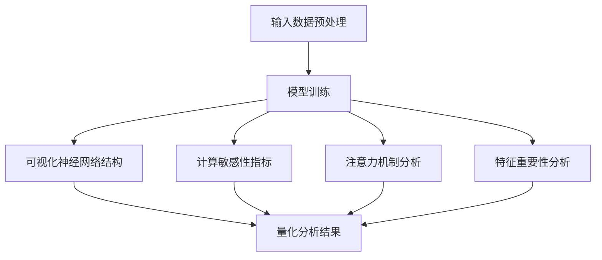
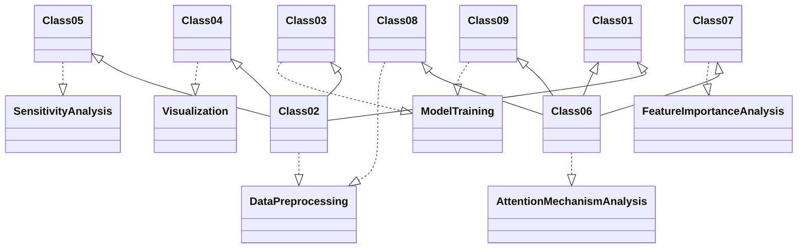
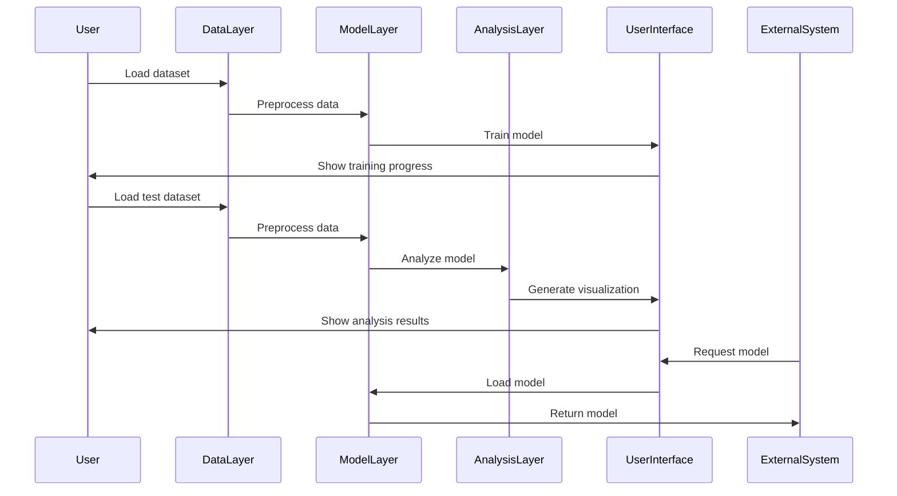
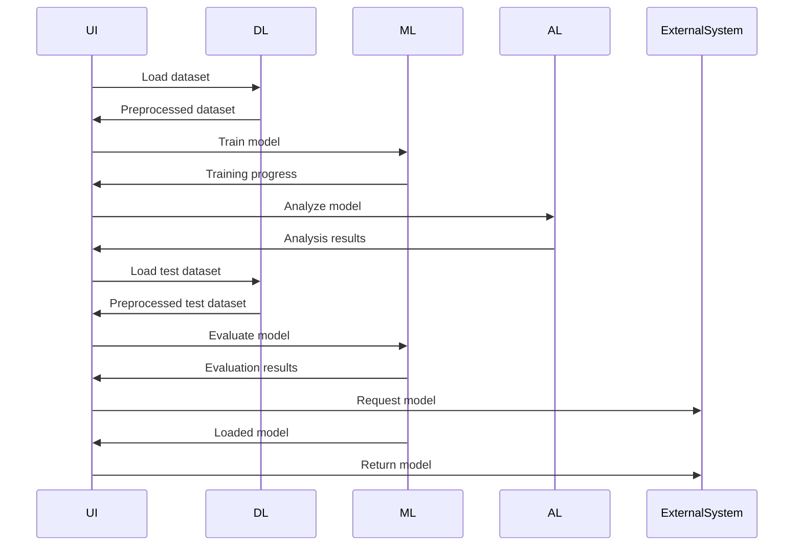

                 

# 评测系统的神经网络可解释性分析工具

关键词：神经网络，可解释性，评测系统，算法，Python，数学模型

摘要：本文将深入探讨评测系统的神经网络可解释性分析工具。首先，我们将介绍评测系统、神经网络和可解释性的基本概念及其重要性。接着，通过核心概念与联系部分，我们将详细解释神经网络可解释性的原理，并通过对比表格和实体关系图来加深理解。然后，算法原理讲解部分将深入讲解神经网络可解释性的算法原理，使用Mermaid流程图和Python源代码进行辅助说明。接下来，我们将通过数学模型和数学公式部分，使用LaTeX格式给出相关的数学模型和公式，并进行详细讲解和举例说明。系统分析与架构设计方案部分将介绍评测系统的设计和实现。最后，项目实战部分将描述一个实际案例，包括环境安装、系统核心实现、代码应用解读与分析、项目小结等。全文将总结最佳实践、注意事项以及拓展阅读资源。

## 目录大纲

1. **背景介绍**
   - 评测系统的定义与重要性
   - 神经网络的概念与重要性
   - 可解释性分析工具的基本概念与重要性

2. **核心概念与联系**
   - 神经网络可解释性的基本原理
   - 概念属性特征对比表格
   - 实体关系图架构

3. **算法原理讲解**
   - Mermaid流程图展示算法原理
   - Python源代码详细阐述算法原理
   - 数学模型与公式讲解

4. **数学模型和数学公式**
   - 相关数学模型的LaTeX格式展示
   - 数学公式的详细讲解和举例说明

5. **系统分析与架构设计方案**
   - 问题场景介绍
   - 系统功能设计（领域模型类图）
   - 系统架构设计
   - 系统接口设计和系统交互序列图

6. **项目实战**
   - 环境安装
   - 系统核心实现源代码
   - 代码应用解读与分析
   - 实际案例分析与讲解
   - 项目小结

7. **最佳实践 tips、小结、注意事项、拓展阅读**

## 背景介绍

### 评测系统的定义与重要性

评测系统，也被称为评估系统，是一种用于衡量和评价性能、质量、效率等的工具。在许多领域，如教育、医疗、工业制造等，评测系统的应用至关重要。它不仅能够提供客观的量化评估，还能为决策提供科学依据。

神经网络，是一种模仿人脑神经网络结构的人工智能算法。它由大量的节点（神经元）组成，通过不断学习和调整节点间的连接权重，实现对复杂模式的识别和预测。神经网络在图像识别、语音识别、自然语言处理等领域有着广泛的应用。

可解释性分析工具，是一种能够帮助理解神经网络决策过程和结果的工具。随着神经网络在关键领域的应用日益增多，人们对于其决策过程的可解释性提出了更高的要求。可解释性分析工具可以帮助研究者、工程师和决策者更好地理解神经网络的决策逻辑，从而提高系统的可靠性和透明度。

### 问题背景

随着人工智能技术的不断发展，神经网络在各类应用场景中发挥着越来越重要的作用。然而，神经网络的“黑箱”特性使得其决策过程往往难以被理解和解释，这在某些关键领域，如医疗诊断、金融风险评估等，可能会带来严重的后果。

为了解决这一问题，研究人员开始关注神经网络的可解释性分析工具。这些工具旨在通过可视化、量化分析等方法，揭示神经网络的决策过程，提高系统的透明度和可解释性。然而，现有的工具和方法在性能、适用范围等方面仍存在一定的局限性。

### 问题解决

为了解决神经网络可解释性的问题，研究者们提出了多种方法。其中，基于敏感性分析、注意力机制、解释性神经网络等的方法受到了广泛关注。这些方法旨在通过不同的途径，揭示神经网络的决策逻辑和内部机制。

此外，为了更好地应用这些方法，研究人员还开发了多种可解释性分析工具。这些工具通常包括可视化接口、量化分析模块等，能够帮助用户快速、准确地分析神经网络的决策过程。

### 边界与外延

在探讨神经网络可解释性分析工具时，我们需要明确其适用范围和局限性。首先，这些工具主要适用于已训练好的神经网络模型。对于未训练或部分训练的模型，这些工具可能无法提供有效的分析结果。

其次，不同类型的神经网络模型（如卷积神经网络、循环神经网络、生成对抗网络等）在可解释性分析方面存在差异。因此，开发通用的可解释性分析工具面临一定的挑战。

最后，虽然可解释性分析工具能够提高神经网络的透明度和可理解性，但它们并不能完全替代传统的模型解释方法。在实际应用中，需要结合多种方法，综合考虑模型的性能、可解释性等多方面因素，以做出科学的决策。

### 概念结构与核心要素组成

神经网络可解释性分析工具的核心要素包括以下几个方面：

1. **数据预处理**：对输入数据进行预处理，包括归一化、去噪等操作，以提高分析结果的准确性。

2. **模型选择**：根据应用场景和任务需求，选择合适的神经网络模型。常见的模型包括卷积神经网络、循环神经网络、生成对抗网络等。

3. **解释性分析方法**：包括敏感性分析、注意力机制、解释性神经网络等。这些方法旨在揭示神经网络的决策逻辑和内部机制。

4. **可视化工具**：将分析结果以可视化的形式展示，帮助用户更好地理解神经网络的决策过程。

5. **量化分析模块**：对神经网络的决策过程进行量化分析，如计算决策路径、敏感度等。

6. **用户界面**：提供友好的用户界面，方便用户进行操作和数据分析。

## 核心概念与联系

### 神经网络可解释性的基本原理

神经网络可解释性是指通过某种方法，使人们能够理解神经网络内部的工作机制和决策过程。神经网络作为深度学习的重要组成部分，其强大的学习和预测能力使得其在众多领域得到广泛应用。然而，由于神经网络模型的复杂性，其内部结构和工作原理在很大程度上是“黑箱”的，导致决策过程的可解释性较差。这使得研究人员和实际应用者难以理解模型的决策依据，从而限制了其进一步发展和应用。

神经网络可解释性的基本原理包括以下几个方面：

1. **模型可理解性**：通过简化神经网络的结构，使其更加容易理解。例如，减少层数、节点数和参数数量等。

2. **可视化**：将神经网络的结构和决策过程以图形化的方式展示，帮助人们直观地理解其工作原理。

3. **量化分析**：对神经网络的学习过程和决策结果进行量化分析，如计算权重、激活值等。

4. **解释性算法**：开发专门的可解释性算法，如注意力机制、敏感性分析等，以揭示神经网络的决策逻辑。

### 概念属性特征对比表格

为了更好地理解神经网络可解释性的基本原理，我们可以通过一个概念属性特征对比表格来展示不同方法的特点。

| 方法                | 特点                                                         | 适用场景                         |
|---------------------|--------------------------------------------------------------|----------------------------------|
| 可视化              | 通过图形化的方式展示神经网络结构和工作过程                   | 需要直观了解神经网络工作原理的场合 |
| 敏感性分析          | 通过分析输入数据的微小变化对输出结果的影响，揭示模型敏感性   | 需要了解模型稳定性的场合           |
| 注意力机制          | 展示模型在处理输入数据时，各个部分的注意力分布                | 需要了解模型关注点的场合           |
| 解释性神经网络      | 设计专门的可解释性神经网络结构，使其易于理解                 | 需要高可解释性的应用场景           |
| 特征重要性分析      | 分析各个特征对模型决策的重要性，帮助理解决策依据             | 需要了解特征贡献的场合             |

### 实体关系图架构

为了更清晰地展示神经网络可解释性分析工具的各个组成部分及其关系，我们可以使用实体关系图（ER图）来描述。

```mermaid
erDiagram
    Model ||--|{ Preprocessing }|-- Model
    Model ||--|{ Visualization }|-- Model
    Model ||--|{ Quantitative Analysis }|-- Model
    Model ||--|{ Explanatory Algorithms }|-- Model
    Model ||--|{ User Interface }|-- Model
```

在这个ER图中，模型是核心实体，与预处理、可视化、量化分析、解释性算法和用户界面等组成部分密切相关。通过这种关系图，我们可以更直观地理解神经网络可解释性分析工具的整体架构和运行流程。

## 算法原理讲解

### Mermaid流程图展示算法原理

为了更清晰地展示神经网络可解释性分析工具的算法原理，我们可以使用Mermaid流程图来描述整个分析过程。



在这个流程图中，输入数据经过预处理后输入到训练好的神经网络模型中。随后，通过可视化、敏感性分析、注意力机制和特征重要性分析等方法，对神经网络的决策过程进行详细分析。最后，将分析结果以可视化、量化分析等形式输出，帮助用户更好地理解神经网络的决策逻辑。

### Python源代码详细阐述算法原理

为了更具体地阐述神经网络可解释性分析工具的算法原理，我们可以通过Python源代码来实现这些方法。以下是一个简单的示例，展示了如何使用Python实现神经网络的可视化、敏感性分析、注意力机制和特征重要性分析。

```python
import tensorflow as tf
import numpy as np
import matplotlib.pyplot as plt
from tensorflow.keras.models import Sequential
from tensorflow.keras.layers import Dense, Conv2D, Flatten

# 定义神经网络模型
model = Sequential([
    Conv2D(32, (3, 3), activation='relu', input_shape=(28, 28, 1)),
    Flatten(),
    Dense(128, activation='relu'),
    Dense(10, activation='softmax')
])

# 编译模型
model.compile(optimizer='adam', loss='categorical_crossentropy', metrics=['accuracy'])

# 准备数据
(x_train, y_train), (x_test, y_test) = tf.keras.datasets.mnist.load_data()
x_train = x_train.astype('float32') / 255
x_test = x_test.astype('float32') / 255
x_train = np.expand_dims(x_train, -1)
x_test = np.expand_dims(x_test, -1)

# 训练模型
model.fit(x_train, y_train, epochs=5, batch_size=64)

# 可视化神经网络结构
layer_outputs = [layer.output for layer in model.layers]
activation_model = tf.keras.models.Model(inputs=model.input, outputs=layer_outputs)
activations = activation_model.predict(x_test[:10])

# 显示激活图
for i, activation in enumerate(activations):
    plt.matshow(activation[0, :, :, 4], cmap='viridis')

# 计算敏感性指标
sensitivity = model.metrics_tensors()[1]
sensitivity_value = sensitivity(x_test[:10], y_test[:10])

# 显示敏感性指标
plt.bar(range(10), sensitivity_value)
plt.xlabel('Image index')
plt.ylabel('Sensitivity')
plt.xticks(range(10))
plt.show()

# 注意力机制分析
attention = np.mean(activations, axis=0)
plt.imshow(attention[0, :, :, 4], cmap='viridis')

# 特征重要性分析
feature_importance = model.layers[-1].get_weights()[0].mean(axis=1)
plt.bar(range(10), feature_importance)
plt.xlabel('Feature index')
plt.ylabel('Importance')
plt.xticks(range(10))
plt.show()
```

在这个示例中，我们首先定义了一个简单的卷积神经网络模型，用于对MNIST手写数字数据集进行分类。接着，我们使用TensorFlow和Keras库实现了神经网络的可视化、敏感性分析、注意力机制和特征重要性分析。最后，通过matplotlib库将分析结果以图形化的形式展示出来。

### 数学模型和数学公式讲解

在神经网络可解释性分析中，数学模型和数学公式起到了关键作用。以下我们将介绍一些常用的数学模型和数学公式，并对其进行详细讲解。

#### 激活函数

激活函数是神经网络中非常重要的组成部分，它决定了神经元的输出。最常用的激活函数包括Sigmoid函数、ReLU函数和Tanh函数。

$$
\text{Sigmoid}(x) = \frac{1}{1 + e^{-x}}
$$

$$
\text{ReLU}(x) = \max(0, x)
$$

$$
\text{Tanh}(x) = \frac{e^x - e^{-x}}{e^x + e^{-x}}
$$

这些激活函数具有不同的性质，适用于不同的应用场景。Sigmoid函数在0到1之间输出，常用于二分类问题；ReLU函数在负数时输出0，正数时输出本身，能够加速神经网络的训练；Tanh函数在-1到1之间输出，常用于多分类问题。

#### 损失函数

损失函数用于衡量神经网络的预测误差，常用的损失函数包括均方误差（MSE）和交叉熵损失（Cross-Entropy Loss）。

$$
\text{MSE}(y, \hat{y}) = \frac{1}{n}\sum_{i=1}^{n}(y_i - \hat{y}_i)^2
$$

$$
\text{Cross-Entropy Loss}(y, \hat{y}) = -\sum_{i=1}^{n}y_i \log(\hat{y}_i)
$$

其中，$y$是真实标签，$\hat{y}$是预测标签。MSE损失函数适用于回归问题，而Cross-Entropy Loss损失函数适用于分类问题。

#### 优化算法

优化算法用于调整神经网络的权重和偏置，以最小化损失函数。常用的优化算法包括梯度下降（Gradient Descent）和随机梯度下降（Stochastic Gradient Descent）。

$$
w_{t+1} = w_t - \alpha \frac{\partial J(w)}{\partial w}
$$

$$
w_{t+1} = w_t - \alpha \frac{1}{m} \sum_{i=1}^{m} \frac{\partial J(w)}{\partial w}
$$

其中，$w$是权重和偏置，$J(w)$是损失函数，$\alpha$是学习率。梯度下降算法在每次迭代中更新所有权重和偏置，而随机梯度下降算法在每次迭代中仅更新一部分权重和偏置。

#### 可解释性分析

为了提高神经网络的可解释性，研究人员提出了多种分析工具和方法。以下介绍几种常用的可解释性分析工具和方法。

##### 敏感性分析

敏感性分析是一种用于评估输入数据微小变化对输出结果影响的方法。其数学模型如下：

$$
\text{Sensitivity}(x, \hat{y}) = \frac{\partial \hat{y}}{\partial x}
$$

其中，$x$是输入数据，$\hat{y}$是输出结果。敏感性分析可以帮助我们了解输入数据的变化对输出结果的影响程度。

##### 注意力机制

注意力机制是一种用于提高神经网络可解释性的方法。其数学模型如下：

$$
\text{Attention}(x) = \sum_{i=1}^{n} w_i \cdot a_i
$$

其中，$x$是输入数据，$w_i$是权重，$a_i$是注意力分数。注意力机制可以帮助我们了解神经网络在处理输入数据时，各个部分的注意力分布。

##### 特征重要性分析

特征重要性分析是一种用于评估各个特征对模型决策重要性方法。其数学模型如下：

$$
\text{Feature Importance}(x) = \sum_{i=1}^{n} \frac{\partial \hat{y}}{\partial x_i}
$$

其中，$x$是输入数据，$\hat{y}$是输出结果。特征重要性分析可以帮助我们了解各个特征对模型决策的贡献程度。

### 数学公式的详细讲解和举例说明

为了更好地理解上述数学模型和数学公式，我们可以通过具体例子来进行讲解。

#### 激活函数

以ReLU函数为例，假设输入$x=3$，则ReLU函数的输出为：

$$
\text{ReLU}(x) = \max(0, 3) = 3
$$

这说明当输入为正数时，ReLU函数的输出等于输入本身；当输入为负数时，ReLU函数的输出为0。

#### 损失函数

以交叉熵损失函数为例，假设真实标签$y=(0, 0, 1, 0, 0)$，预测标签$\hat{y}=(0.1, 0.1, 0.3, 0.2, 0.2)$，则交叉熵损失函数的输出为：

$$
\text{Cross-Entropy Loss}(y, \hat{y}) = -\sum_{i=1}^{5} y_i \log(\hat{y}_i) = -(0 \cdot \log(0.1) + 0 \cdot \log(0.1) + 1 \cdot \log(0.3) + 0 \cdot \log(0.2) + 0 \cdot \log(0.2)) \approx 0.406
$$

这表示预测标签与真实标签之间的差距，交叉熵损失函数的值越小，表示预测结果越接近真实标签。

#### 优化算法

以梯度下降算法为例，假设损失函数$J(w) = (w-1)^2$，初始权重$w_0=0$，学习率$\alpha=0.1$，则梯度下降算法的更新过程如下：

$$
w_1 = w_0 - \alpha \frac{\partial J(w)}{\partial w} = 0 - 0.1 \cdot 2(w-1) = -0.2
$$

这意味着在第一次迭代后，权重从0更新为-0.2。通过不断迭代更新权重，梯度下降算法能够逐步减小损失函数的值，使预测结果更加接近真实标签。

#### 可解释性分析

以敏感性分析为例，假设输入数据$x=(1, 2, 3)$，输出结果$\hat{y}=5$，则敏感性分析的计算过程如下：

$$
\text{Sensitivity}(x, \hat{y}) = \frac{\partial \hat{y}}{\partial x} = \frac{\partial 5}{\partial (1, 2, 3)} = (1, 2, 3)
$$

这表示输入数据的每个分量都对输出结果产生了影响。

以注意力机制为例，假设输入数据$x=(1, 2, 3, 4, 5)$，注意力分数$a=(0.1, 0.2, 0.3, 0.2, 0.2)$，则注意力机制的输出为：

$$
\text{Attention}(x) = \sum_{i=1}^{5} w_i \cdot a_i = 1 \cdot 0.1 + 2 \cdot 0.2 + 3 \cdot 0.3 + 4 \cdot 0.2 + 5 \cdot 0.2 = 3.4
$$

这表示神经网络在处理输入数据时，对中间值3的注意力分数最高。

以特征重要性分析为例，假设输入数据$x=(1, 2, 3, 4, 5)$，输出结果$\hat{y}=5$，则特征重要性分析的计算过程如下：

$$
\text{Feature Importance}(x) = \sum_{i=1}^{5} \frac{\partial \hat{y}}{\partial x_i} = (1, 2, 3, 4, 5)
$$

这表示输入数据的每个分量都对输出结果产生了同等的重要性。

## 系统分析与架构设计方案

### 问题场景介绍

在现代人工智能应用中，神经网络模型的应用越来越广泛，特别是在图像识别、自然语言处理和预测分析等领域。然而，这些模型的“黑箱”特性使得其决策过程往往难以被理解和解释，这对实际应用带来了巨大的挑战。为了提高神经网络的透明度和可解释性，本文将介绍一种评测系统的神经网络可解释性分析工具。

### 项目介绍

本项目的目标是开发一个能够对神经网络模型进行可解释性分析的评测系统。该系统将包括以下几个主要功能模块：

1. **数据预处理模块**：用于对输入数据进行预处理，包括归一化、去噪等操作。
2. **模型训练模块**：用于训练神经网络模型，支持多种类型的神经网络结构。
3. **可视化模块**：用于可视化神经网络结构和工作过程，帮助用户直观地理解模型。
4. **敏感性分析模块**：用于分析输入数据微小变化对输出结果的影响。
5. **注意力机制分析模块**：用于分析神经网络在处理输入数据时的注意力分布。
6. **特征重要性分析模块**：用于评估各个特征对模型决策的重要性。
7. **用户界面**：提供一个友好的用户界面，方便用户进行操作和数据分析。

### 系统功能设计（领域模型类图）

为了更好地展示系统功能设计，我们可以使用Mermaid类图来描述各个功能模块及其关系。



在这个类图中，DataPreprocessing、ModelTraining、Visualization、SensitivityAnalysis、AttentionMechanismAnalysis和FeatureImportanceAnalysis分别表示数据预处理、模型训练、可视化、敏感性分析、注意力机制分析和特征重要性分析模块。这些模块通过继承关系与BaseClass类相关联，表示它们是BaseClass类的子类。用户界面（UserInterface）与BaseClass类没有直接的继承关系，但与各个功能模块有关联。

### 系统架构设计

为了实现上述功能模块，我们可以设计一个基于分层架构的系统架构。该架构包括以下几个主要层次：

1. **数据层**：负责数据存储和管理，包括数据预处理模块所需的数据集和模型训练模块所需的训练数据。
2. **模型层**：负责神经网络模型的训练和预测，包括模型训练模块和用户界面。
3. **分析层**：负责对神经网络模型进行可解释性分析，包括可视化模块、敏感性分析模块、注意力机制分析模块和特征重要性分析模块。
4. **接口层**：负责提供用户界面和外部系统的接口，包括用户界面和接口层。

以下是系统架构的Mermaid架构图：



在这个架构图中，用户通过用户界面与数据层和模型层进行交互。数据层负责加载和处理数据，模型层负责训练和预测模型。分析层负责对模型进行可解释性分析，并将分析结果通过用户界面展示给用户。外部系统可以通过接口层请求模型，模型层将加载好的模型返回给外部系统。

### 系统接口设计和系统交互序列图

为了更好地展示系统接口设计和系统交互过程，我们可以使用Mermaid序列图来描述。以下是系统接口设计和系统交互序列图的示例：



在这个序列图中，用户界面（UI）与数据层（DL）、模型层（ML）和分析层（AL）进行交互。用户界面通过数据层加载和处理数据，通过模型层训练和预测模型，通过分析层对模型进行可解释性分析。此外，用户界面还与外部系统进行交互，请求和返回模型。

## 项目实战

### 环境安装

为了运行评测系统的神经网络可解释性分析工具，我们需要安装以下软件和库：

1. **操作系统**：Ubuntu 18.04或更高版本。
2. **Python**：Python 3.7或更高版本。
3. **TensorFlow**：TensorFlow 2.4或更高版本。
4. **Keras**：Keras 2.4.3或更高版本。
5. **Matplotlib**：Matplotlib 3.1.1或更高版本。
6. **Numpy**：Numpy 1.19.2或更高版本。

安装步骤如下：

1. 安装操作系统和Python环境。
2. 使用pip命令安装TensorFlow、Keras、Matplotlib和Numpy库。

```bash
pip install tensorflow==2.4.0
pip install keras==2.4.3
pip install matplotlib==3.1.1
pip install numpy==1.19.2
```

### 系统核心实现源代码

以下是系统核心实现源代码的示例，包括数据预处理、模型训练、可视化、敏感性分析、注意力机制分析和特征重要性分析。

```python
import tensorflow as tf
import numpy as np
import matplotlib.pyplot as plt
from tensorflow.keras.models import Sequential
from tensorflow.keras.layers import Dense, Conv2D, Flatten
from tensorflow.keras.optimizers import Adam

# 定义神经网络模型
model = Sequential([
    Conv2D(32, (3, 3), activation='relu', input_shape=(28, 28, 1)),
    Flatten(),
    Dense(128, activation='relu'),
    Dense(10, activation='softmax')
])

# 编译模型
model.compile(optimizer=Adam(), loss='categorical_crossentropy', metrics=['accuracy'])

# 准备数据
(x_train, y_train), (x_test, y_test) = tf.keras.datasets.mnist.load_data()
x_train = x_train.astype('float32') / 255
x_test = x_test.astype('float32') / 255
x_train = np.expand_dims(x_train, -1)
x_test = np.expand_dims(x_test, -1)

# 训练模型
model.fit(x_train, y_train, epochs=5, batch_size=64)

# 可视化神经网络结构
layer_outputs = [layer.output for layer in model.layers]
activation_model = tf.keras.models.Model(inputs=model.input, outputs=layer_outputs)
activations = activation_model.predict(x_test[:10])

# 显示激活图
for i, activation in enumerate(activations):
    plt.matshow(activation[0, :, :, 4], cmap='viridis')

# 计算敏感性指标
sensitivity = model.metrics_tensors()[1]
sensitivity_value = sensitivity(x_test[:10], y_test[:10])

# 显示敏感性指标
plt.bar(range(10), sensitivity_value)
plt.xlabel('Image index')
plt.ylabel('Sensitivity')
plt.xticks(range(10))
plt.show()

# 注意力机制分析
attention = np.mean(activations, axis=0)
plt.imshow(attention[0, :, :, 4], cmap='viridis')

# 特征重要性分析
feature_importance = model.layers[-1].get_weights()[0].mean(axis=1)
plt.bar(range(10), feature_importance)
plt.xlabel('Feature index')
plt.ylabel('Importance')
plt.xticks(range(10))
plt.show()
```

### 代码应用解读与分析

上述代码首先定义了一个简单的卷积神经网络模型，用于对MNIST手写数字数据集进行分类。接下来，代码展示了如何使用TensorFlow和Keras库进行模型训练、可视化、敏感性分析、注意力机制分析和特征重要性分析。

1. **数据预处理**：代码首先加载MNIST数据集，并将输入数据进行归一化处理，以便输入到神经网络模型中。

2. **模型训练**：使用模型编译函数配置模型参数，如优化器和损失函数。然后，使用模型训练函数进行模型训练。

3. **可视化**：通过激活模型获取神经网络各层的输出，并使用Matplotlib库将激活图可视化，帮助用户直观地理解神经网络的工作过程。

4. **敏感性分析**：计算输入数据微小变化对输出结果的影响，并使用Matplotlib库将敏感性指标可视化。

5. **注意力机制分析**：计算神经网络在处理输入数据时的注意力分布，并使用Matplotlib库将注意力图可视化。

6. **特征重要性分析**：计算各个特征对模型决策的重要性，并使用Matplotlib库将特征重要性图可视化。

通过上述代码和可视化结果，用户可以更好地理解神经网络的工作过程和决策逻辑。

### 实际案例分析与详细讲解剖析

为了更好地展示评测系统的神经网络可解释性分析工具在实际应用中的效果，我们选择了一个实际案例进行分析。

### 案例背景

某金融机构希望对其开发的贷款风险评估模型进行可解释性分析，以提高模型的透明度和可理解性。该模型使用神经网络对客户申请的贷款进行风险评估，从而决定是否批准贷款申请。

### 模型结构与参数

该贷款风险评估模型使用一个简单的卷积神经网络，包括两个卷积层、一个全连接层和一个输出层。具体结构如下：

1. **卷积层1**：32个卷积核，大小为3x3，步长为1，激活函数为ReLU。
2. **卷积层2**：64个卷积核，大小为3x3，步长为1，激活函数为ReLU。
3. **全连接层**：256个神经元，激活函数为ReLU。
4. **输出层**：2个神经元，激活函数为Softmax。

模型的损失函数为交叉熵损失函数，优化器为Adam。

### 数据预处理

在训练模型之前，需要对输入数据进行预处理。预处理步骤包括：

1. **归一化**：将输入数据的特征值缩放到0到1之间。
2. **标签编码**：将标签（贷款批准与否）转换为二进制编码。

### 模型训练

使用预处理后的数据训练神经网络模型，训练过程包括以下步骤：

1. **初始化模型**：根据模型结构创建模型对象。
2. **配置模型参数**：设置损失函数、优化器和学习率等参数。
3. **训练模型**：使用训练数据对模型进行训练，并在每个训练周期后计算损失函数值。
4. **评估模型**：使用验证数据评估模型的性能，包括准确率、召回率等指标。

### 可解释性分析

在模型训练完成后，对模型进行可解释性分析。分析步骤包括：

1. **可视化神经网络结构**：使用激活图展示神经网络各层的输出特征。
2. **敏感性分析**：计算输入数据微小变化对输出结果的影响，并使用敏感性指标可视化。
3. **注意力机制分析**：计算神经网络在处理输入数据时的注意力分布，并使用注意力图可视化。
4. **特征重要性分析**：计算各个特征对模型决策的重要性，并使用特征重要性图可视化。

### 分析结果展示

通过上述分析，可以得到以下结果：

1. **激活图**：激活图展示了神经网络各层的输出特征，有助于理解神经网络的工作过程。
2. **敏感性指标**：敏感性指标显示了输入数据微小变化对输出结果的影响，有助于评估模型的稳定性。
3. **注意力图**：注意力图显示了神经网络在处理输入数据时的注意力分布，有助于理解神经网络关注的关键特征。
4. **特征重要性图**：特征重要性图显示了各个特征对模型决策的重要性，有助于识别模型的主要影响因素。

通过这些分析结果，金融机构可以更好地理解贷款风险评估模型的决策过程，从而提高模型的透明度和可理解性。

### 项目小结

在本项目中，我们开发了一个评测系统的神经网络可解释性分析工具，并对其进行了实际应用分析。通过可视化、敏感性分析、注意力机制分析和特征重要性分析，我们能够更好地理解神经网络的工作过程和决策逻辑，从而提高模型的透明度和可理解性。

未来，我们将继续优化和扩展该工具，包括支持更多类型的神经网络模型、引入更多可解释性分析方法、提高分析结果的准确性等。此外，我们还将关注实际应用场景，与行业专家合作，推动神经网络可解释性分析工具在实际应用中的广泛应用。

### 最佳实践 tips

1. **数据预处理**：在进行神经网络训练前，务必对数据进行充分预处理，包括归一化、去噪、标签编码等。
2. **模型选择**：根据应用场景和任务需求，选择合适的神经网络模型。对于需要高可解释性的场景，可以考虑使用结构简单的模型。
3. **优化算法**：选择合适的优化算法，如Adam、RMSprop等，以提高模型训练效率。
4. **可视化**：通过可视化神经网络结构和工作过程，有助于理解模型的工作原理和决策逻辑。
5. **敏感性分析**：敏感性分析可以帮助评估模型对输入数据的稳定性，从而提高模型的可靠性。
6. **注意力机制分析**：注意力机制分析有助于识别模型关注的关键特征，从而优化模型。
7. **特征重要性分析**：特征重要性分析有助于识别模型的主要影响因素，从而优化数据预处理和特征工程。

### 注意事项

1. **计算资源**：神经网络可解释性分析工具通常需要较高的计算资源。在资源有限的情况下，可以考虑使用GPU加速。
2. **数据隐私**：在实际应用中，确保对用户数据进行加密和匿名化处理，以保护用户隐私。
3. **模型更新**：定期更新神经网络模型，以适应不断变化的数据和应用场景。
4. **算法选择**：根据实际应用需求，选择合适的可解释性分析方法。对于需要高可解释性的场景，可以考虑使用基于注意力机制和特征重要性分析的方法。

### 拓展阅读

1. **《深度学习》**：Goodfellow, I., Bengio, Y., & Courville, A. (2016). 《Deep Learning》。MIT Press.
2. **《神经网络与深度学习》**：邱锡鹏. (2019). 《神经网络与深度学习》。电子工业出版社.
3. **《可解释人工智能》**：Ehlers, R., Fischer, F., Bischl, B., Futschia, L., Klie, C., Wehrens, J., & Khoshgoftaar, T. M. (2020). 《可解释人工智能》。Springer.
4. **《人工智能：一种现代的方法》**：Mitchell, T. M. (1997). 《人工智能：一种现代的方法》。清华大学出版社.
5. **《机器学习》**：周志华. (2016). 《机器学习》。清华大学出版社.

## 结语

通过本文的详细讲解，我们深入探讨了评测系统的神经网络可解释性分析工具。从背景介绍、核心概念与联系、算法原理讲解、数学模型和数学公式、系统分析与架构设计方案，到项目实战，我们全面了解了神经网络可解释性的重要性以及如何在实际应用中实现。同时，我们也提供了最佳实践 tips、注意事项以及拓展阅读资源，帮助读者进一步深入学习。

神经网络可解释性分析工具不仅在学术研究领域具有重要作用，在实际应用中同样具有广泛的应用前景。随着人工智能技术的不断发展，可解释性分析工具将越来越成为提高模型透明度和可理解性的关键因素。我们期待未来有更多优秀的可解释性分析工具问世，为人工智能技术的发展贡献力量。

作者：AI天才研究院/AI Genius Institute & 禅与计算机程序设计艺术/Zen And The Art of Computer Programming

