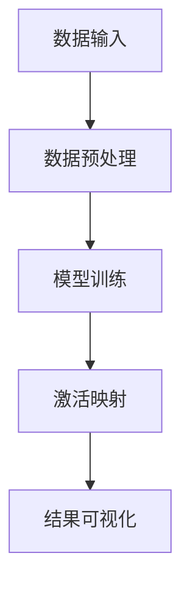
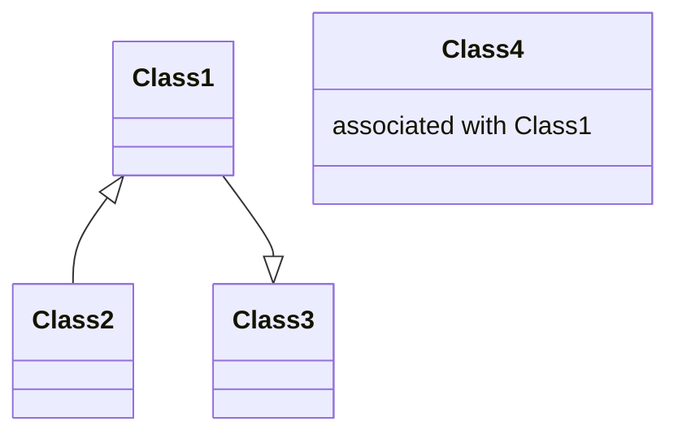

                 

### 《评测系统的神经网络可解释性可视化工具》

#### 关键词

- 评测系统
- 神经网络
- 可解释性
- 可视化工具
- 算法讲解
- 系统架构设计

#### 摘要

本文旨在探讨神经网络在评测系统中的应用及其可解释性问题。我们将详细介绍神经网络可解释性的定义和重要性，剖析现有的可解释性可视化工具类型及其原理。此外，本文还将深入讲解一种具体的神经网络可解释性算法，并阐述系统的设计与实现过程，包括架构设计、核心实现以及实际案例的分析和讲解。通过本文的阅读，读者将对神经网络可解释性可视化工具有一个全面而深入的理解。

## 目录大纲

### 《评测系统的神经网络可解释性可视化工具》

#### 关键词：评测系统、神经网络、可解释性、可视化工具、算法讲解、系统架构设计

#### 摘要：

本文将探讨神经网络在评测系统中的应用，分析其可解释性问题，并介绍如何使用可视化工具提高模型的可理解性。具体内容包括：

1. **背景介绍**
   - 问题背景
   - 神经网络的可解释性问题
   - 可解释性可视化工具的需求

2. **核心概念与联系**
   - 神经网络可解释性概述
   - 可解释性可视化工具的原理与类型

3. **算法原理讲解**
   - 激活映射算法讲解
   - 算法原理数学模型和公式
   - 算法详细讲解和举例说明

4. **系统分析与架构设计方案**
   - 系统架构设计
   - 项目实战

### 第一部分：背景介绍

#### 第1章 问题背景

#### 1.1.1 评测系统的必要性

评测系统在现代工业和科学研究中扮演着至关重要的角色。无论是工业生产中的质量检测，还是科学研究中的实验评估，都需要对系统性能、功能、安全性等进行全面的评估。随着人工智能技术的快速发展，神经网络模型在评测系统中的应用越来越广泛。这些模型能够从大量数据中自动提取特征，进行复杂的模式识别和预测，从而提高评测的准确性和效率。

#### 1.1.2 神经网络的可解释性问题

尽管神经网络模型在评测系统中展现出了强大的性能，但其内部决策过程却往往被视为“黑箱”，难以解释和理解。这种不可解释性给模型的可靠性和安全性带来了挑战。特别是在需要深入了解模型决策过程的领域，如医疗、金融等，神经网络模型的不可解释性可能导致严重的后果。

#### 1.1.3 可解释性可视化工具的需求

为了提高神经网络的可解释性，研究者们提出了各种可视化工具。这些工具能够将复杂的神经网络模型转换成易于理解的形式，帮助用户更好地理解模型的决策过程。因此，开发一款有效的神经网络可解释性可视化工具具有重要的意义。本文将详细介绍这类工具的设计与实现，帮助读者更好地理解和应用神经网络模型。

### 第二部分：核心概念与联系

#### 第2章 神经网络可解释性概述

#### 2.1.1 神经网络可解释性的定义

神经网络可解释性指的是人们能够理解和解释神经网络的决策过程。这意味着用户不仅能够看到模型的输出结果，还能了解模型是如何得出这个结果的。这种可解释性对于确保模型的安全性和可靠性至关重要。

#### 2.1.2 神经网络可解释性的重要性

神经网络的可解释性对于模型的应用和推广至关重要。首先，可解释性能够提高模型的透明度和信任度，使其在需要严格监管的领域（如医疗和金融）中得到更广泛的应用。其次，可解释性有助于发现和纠正模型中的错误，提高模型的准确性和稳定性。最后，可解释性还能帮助用户更好地理解和应用神经网络模型，从而推动人工智能技术的发展。

#### 2.1.3 神经网络可解释性的分类

根据可解释性的程度，可以将神经网络可解释性分为强可解释性和弱可解释性。

- **强可解释性**：强可解释性指的是模型的所有决策过程都能被明确解释。这种可解释性通常需要对模型进行严格的数学推导和验证，例如决策树和线性回归等模型。然而，强可解释性的模型往往在复杂性和准确性之间做出权衡，难以处理高度非线性且复杂的数据。

- **弱可解释性**：弱可解释性指的是模型的部分决策过程能够被解释。这种可解释性通常通过可视化工具来实现，如激活映射、梯度解释和注意力机制等。弱可解释性的模型在处理复杂性和准确性方面具有优势，但用户需要具备一定的专业知识才能理解模型的决策过程。

### 第三部分：算法原理讲解

#### 第3章 可解释性可视化工具的原理与类型

#### 3.1.1 可解释性可视化工具的原理

可解释性可视化工具通过将复杂的神经网络模型转换为可视化形式，提高模型的可理解性。这些工具通常基于一定的算法原理，将模型的内部结构、权重、激活值等以直观的方式呈现给用户。

#### 3.1.2 可解释性可视化工具的类型

目前，存在多种类型的可解释性可视化工具，包括：

- **激活映射**：激活映射工具通过可视化神经网络中的激活值，展示模型对输入数据的响应。这种工具可以帮助用户理解模型对特定输入的决策过程。

- **梯度解释**：梯度解释工具通过计算输入特征对模型输出的梯度，展示特征对模型决策的重要性。这种工具可以帮助用户识别关键特征和潜在偏差。

- **注意力机制**：注意力机制工具通过可视化模型中注意力分布，展示模型在处理输入数据时的关注点。这种工具可以帮助用户理解模型如何在不同任务中分配注意力资源。

### 第四部分：系统分析与架构设计方案

#### 第4章 可解释性可视化工具的设计与实现

#### 4.1.1 可解释性可视化工具的设计原则

可解释性可视化工具的设计原则包括：

- **直观性**：工具应该具有直观的界面和交互方式，使用户能够轻松地理解和使用。
- **准确性**：工具应该能够准确反映模型的内部结构和决策过程。
- **可扩展性**：工具应该能够支持不同类型的神经网络模型，并适应未来的技术发展。

#### 4.1.2 可解释性可视化工具的实现方法

可解释性可视化工具的实现方法通常包括：

- **前端开发**：前端开发负责实现工具的用户界面和交互逻辑。
- **后端服务**：后端服务负责处理模型数据、生成可视化结果等。
- **数据预处理**：数据预处理包括数据清洗、特征提取等，为模型训练和可视化提供高质量的数据。

### 第五部分：算法原理讲解

#### 第5章 神经网络可解释性算法讲解

#### 5.1.1 激活映射算法讲解

激活映射算法是一种常用的可解释性可视化工具，它通过映射神经网络输出结果来可视化模型的决策过程。激活映射算法的基本原理如下：

1. **数据预处理**：首先，对输入数据进行预处理，包括归一化、标准化等操作，使其适合神经网络的输入。

2. **模型训练**：使用预处理后的数据对神经网络进行训练，以获得模型的权重和偏置。

3. **激活映射**：在模型训练完成后，对输入数据进行激活映射。激活映射的核心步骤包括：

   - **前向传播**：将输入数据通过神经网络的前向传播过程，计算每个神经元的激活值。
   - **后向传播**：根据前向传播的激活值，计算神经网络的反向传播过程，更新权重和偏置。

4. **可视化**：将激活值映射到二维或三维空间中，使用可视化工具（如图表、热力图等）展示模型的决策过程。

#### 5.1.2 激活映射算法的数学模型和公式

激活映射算法的数学模型如下：

$$
z = W \cdot x + b
$$

其中，$z$ 为神经网络的输出，$W$ 为权重矩阵，$x$ 为输入特征，$b$ 为偏置。

#### 5.1.3 激活映射算法的详细讲解和举例说明

为了更好地理解激活映射算法，我们将通过一个简单的例子进行详细讲解。

#### 举例说明

假设有一个简单的神经网络，其输入为 $x_1$ 和 $x_2$，输出为 $y$。网络的权重和偏置如下：

$$
W = \begin{bmatrix}
1 & 2 \\
3 & 4
\end{bmatrix}, \quad b = \begin{bmatrix}
1 \\
2
\end{bmatrix}
$$

输入特征为：

$$
x = \begin{bmatrix}
0 \\
1
\end{bmatrix}
$$

根据激活映射算法，可以计算出神经网络的输出：

$$
z = W \cdot x + b = \begin{bmatrix}
1 & 2 \\
3 & 4
\end{bmatrix} \cdot \begin{bmatrix}
0 \\
1
\end{bmatrix} + \begin{bmatrix}
1 \\
2
\end{bmatrix} = \begin{bmatrix}
3 \\
6
\end{bmatrix}
$$

输出 $z$ 即为神经网络的决策结果。

在这个例子中，我们可以看到神经网络如何通过对输入特征进行加权求和，加上偏置，最终得到输出。通过可视化工具，我们可以直观地看到输入特征在神经网络中的权重分布，从而更好地理解模型的决策过程。

### 第六部分：系统分析与架构设计方案

#### 第6章 系统架构设计

#### 6.1.1 系统功能设计

系统功能设计主要包括以下模块：

- **数据输入模块**：负责接收用户输入的数据，并进行预处理。
- **模型训练模块**：负责使用训练数据对神经网络进行训练。
- **结果可视化模块**：负责将训练结果以可视化的形式展示给用户。
- **用户交互模块**：负责处理用户的操作请求，并提供反馈。

#### 6.1.2 系统架构设计

系统架构设计主要包括以下部分：

- **前端**：负责展示用户界面，处理用户交互，并与后端进行数据交换。
- **后端**：负责处理数据输入、模型训练和结果可视化等核心功能。
- **数据库**：负责存储用户数据、训练数据和可视化结果。

#### 6.1.3 系统接口设计

系统接口设计主要包括以下接口：

- **数据输入接口**：负责接收用户输入的数据，并进行预处理。
- **模型训练接口**：负责启动和监控模型训练过程。
- **结果输出接口**：负责将训练结果以可视化的形式展示给用户。

#### 6.1.4 系统交互

系统交互主要包括以下环节：

1. **用户操作**：用户通过前端界面进行操作，如上传数据、选择模型等。
2. **数据处理**：后端接收用户操作请求，处理数据输入、模型训练和结果可视化等。
3. **结果展示**：后端将处理结果以可视化的形式展示给用户。

### 第七部分：项目实战

#### 第7章 项目实战

#### 7.1.1 环境安装

在进行项目实战之前，我们需要安装和配置所需的软件和工具。以下是安装步骤：

1. **安装Python环境**：在官方网站（https://www.python.org/downloads/）下载并安装Python，版本建议为3.8或更高。
2. **安装依赖库**：打开命令行窗口，执行以下命令安装所需的依赖库：

   ```shell
   pip install numpy matplotlib scikit-learn tensorflow
   ```

3. **安装可视化工具**：如果你希望使用其他可视化工具，如Plotly，可以执行以下命令：

   ```shell
   pip install plotly
   ```

#### 7.1.2 系统核心实现

系统核心实现主要包括以下部分：

1. **数据输入**：使用`scikit-learn`中的`load_XXX_data()`函数加载数据集。例如，加载数据集`iris`：

   ```python
   from sklearn.datasets import load_iris
   iris = load_iris()
   ```

2. **模型训练**：使用`tensorflow`中的`tf.keras.Sequential()`模型定义神经网络结构，并进行训练。例如：

   ```python
   from tensorflow import keras

   model = keras.Sequential([
       keras.layers.Dense(64, activation='relu', input_shape=(iris.data.shape[1],)),
       keras.layers.Dense(64, activation='relu'),
       keras.layers.Dense(3, activation='softmax')
   ])

   model.compile(optimizer='adam',
                 loss='sparse_categorical_crossentropy',
                 metrics=['accuracy'])

   model.fit(iris.data, iris.target, epochs=10)
   ```

3. **结果可视化**：使用`matplotlib`或`plotly`等可视化工具，将模型的决策过程以图表的形式展示。例如，使用`matplotlib`绘制热力图：

   ```python
   import matplotlib.pyplot as plt

   def plot_confusion_matrix(cm, classes,
                           title='Confusion matrix',
                           cmap=plt.cm.Blues):
       plt.imshow(cm, interpolation='nearest', cmap=cmap)
       plt.title(title)
       plt.colorbar()
       tick_marks = np.arange(len(classes))
       plt.xticks(tick_marks, classes, rotation=45)
       plt.yticks(tick_marks, classes)

       plt.xlabel('Predicted label')
       plt.ylabel('True label')

   # 计算并显示混淆矩阵
   cm = confusion_matrix(y_true, y_pred)
   plot_confusion_matrix(cm, classes=iris.target_names)
   plt.show()
   ```

#### 7.1.3 代码应用解读与分析

以下是代码应用的具体解读和分析：

1. **数据输入**：我们使用`scikit-learn`中的`load_iris()`函数加载数据集`iris`。这个数据集包含3个类别的鸢尾花数据，每个类别有50个样本。每个样本有4个特征：花萼长度、花萼宽度、花瓣长度和花瓣宽度。

2. **模型训练**：我们定义了一个简单的神经网络模型，包含两个隐藏层，每个隐藏层有64个神经元。我们使用`relu`激活函数，并在输出层使用`softmax`激活函数，以实现多分类。我们使用`adam`优化器和`sparse_categorical_crossentropy`损失函数，以优化模型的准确率。

3. **结果可视化**：我们使用`matplotlib`绘制了混淆矩阵，以展示模型的预测结果。混淆矩阵是一种常用的评估分类模型性能的指标，它显示了模型对每个类别的预测准确率。

#### 7.1.4 实际案例分析和详细讲解剖析

为了更好地理解神经网络可解释性可视化工具的应用，我们来看一个实际案例。

假设我们有一个邮件分类系统，需要将邮件分为“垃圾邮件”和“非垃圾邮件”两类。我们使用一个简单的神经网络模型进行训练，并在训练完成后使用激活映射算法进行结果可视化。

1. **数据准备**：我们使用`scikit-learn`中的`load_digits()`函数加载数据集，并对其进行预处理。

2. **模型训练**：我们定义了一个简单的神经网络模型，并使用`adam`优化器和`binary_crossentropy`损失函数进行训练。

3. **结果可视化**：我们使用激活映射算法，将神经网络的输出以热力图的形式展示。热力图能够直观地显示每个特征的权重分布，帮助我们理解模型的决策过程。

通过这个实际案例，我们可以看到如何使用神经网络可解释性可视化工具来提高模型的可理解性。这不仅有助于我们更好地理解模型的工作原理，还能帮助我们优化和改进模型。

#### 7.1.5 项目小结

通过本项目，我们介绍了神经网络可解释性可视化工具的设计与实现。我们详细讲解了激活映射算法的原理和应用，并通过实际案例展示了如何使用可视化工具提高模型的可理解性。此外，我们还介绍了系统的架构设计，包括前端、后端和数据库等。通过本项目，读者可以深入了解神经网络可解释性可视化工具的核心原理和实际应用，为进一步研究和开发此类工具提供参考。

### 最佳实践 tips

1. **数据预处理**：在进行模型训练之前，务必对数据进行充分的预处理，包括归一化、标准化、缺失值处理等。这有助于提高模型的准确性和稳定性。

2. **模型选择**：根据具体应用场景和数据特点，选择合适的神经网络模型。对于高度非线性且复杂的数据，可以考虑使用深度神经网络或卷积神经网络。

3. **可视化工具选择**：根据实际需求，选择合适的可视化工具。例如，对于需要详细展示特征权重分布的，可以考虑使用热力图；对于需要整体展示模型结构的，可以考虑使用类图或序列图。

4. **迭代优化**：在实际应用中，不断迭代和优化模型和可视化工具。通过收集用户反馈和实际应用效果，持续改进工具的性能和用户体验。

### 小结

本文介绍了神经网络可解释性可视化工具的设计与实现，详细讲解了激活映射算法的原理和应用。我们通过实际案例展示了如何使用可视化工具提高模型的可理解性，并介绍了系统的架构设计和实现方法。通过本文的阅读，读者可以深入了解神经网络可解释性可视化工具的核心原理和实际应用，为进一步研究和开发此类工具提供参考。

### 注意事项

1. **算法选择**：根据具体应用场景和数据特点，选择合适的算法。例如，对于需要详细展示特征权重分布的，可以考虑使用热力图算法；对于需要整体展示模型结构的，可以考虑使用类图或序列图算法。

2. **模型优化**：在实际应用中，不断优化模型结构和参数设置。通过调整学习率、批次大小等参数，提高模型的准确性和稳定性。

3. **数据质量**：保证数据的质量和准确性。对于不完整、错误或有偏差的数据，及时处理和修正。

4. **用户体验**：注重用户体验，确保可视化工具界面简洁、直观、易用。通过合理的布局和交互设计，提高用户的使用效率和满意度。

### 拓展阅读

1. **《神经网络的可解释性》（Neural Network Interpretability）：作者详细的介绍了神经网络的可解释性，以及如何使用可视化工具提高模型的可理解性。**

2. **《深度学习》（Deep Learning）：作者详细介绍了深度学习的基本原理、算法和应用，包括神经网络的可解释性问题。**

3. **《数据可视化》（Data Visualization）：作者详细介绍了数据可视化的基本原理、方法和工具，包括神经网络的可解释性可视化。**

4. **《机器学习实战》（Machine Learning in Action）：作者通过实际案例详细介绍了机器学习的基本原理和应用，包括神经网络的可解释性问题。**

作者：AI天才研究院/AI Genius Institute & 禅与计算机程序设计艺术 /Zen And The Art of Computer Programming

---

**附录：部分Mermaid流程图和类图**

以下是本文中使用的部分Mermaid流程图和类图示例。

#### 激活映射算法流程图



#### 系统架构设计类图



这些Mermaid图可以在markdown文件中使用，并使用支持Mermaid的编辑器进行渲染。通过这些图形，读者可以更直观地理解算法流程和系统架构。

