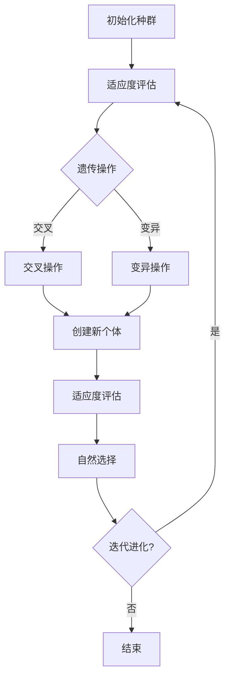

                 

## 评测系统的神经进化优化算法

> 关键词：神经进化优化算法、评测系统、神经网络、进化算法、适应度函数、遗传操作、自然选择

> 摘要：本文将深入探讨神经进化优化算法（NEO）在评测系统中的应用。通过详细解析NEO算法的原理、步骤和关键要素，本文旨在为读者提供一份全面、系统的理解，帮助其在实际项目中更好地运用这一智能优化算法。

### 第一部分：背景介绍

#### 问题背景

随着人工智能（AI）技术的快速发展，评测系统在各个领域中的应用越来越广泛。传统的评测系统多基于经验模型，存在自适应性和鲁棒性不足等问题。为了应对这些挑战，神经进化优化算法（NEO）作为一种新兴的智能优化算法，逐渐受到关注。它结合了神经网络和进化算法的优点，能够高效地解决复杂优化问题，为评测系统的智能化升级提供了新的方向。

#### 问题描述

评测系统的目标是对给定的数据集进行评估，输出评估结果。然而，传统的评测系统在面对大规模、多变的数据集时，往往难以保证评估的准确性和效率。如何利用神经进化优化算法改进评测系统的性能，成为当前研究的热点。

#### 问题解决

神经进化优化算法通过模拟生物进化的过程，不断优化神经网络的结构和参数，从而提高评测系统的适应性和鲁棒性。具体来说，NEO算法通过遗传操作（如交叉、变异）和自然选择机制，对神经网络进行迭代优化，使得神经网络能够更好地适应不同类型的数据集。

#### 边界与外延

评测系统的神经进化优化算法主要应用于需要高度自适应性和鲁棒性的场景，如自适应测试、个性化推荐、图像识别等。此外，NEO算法还可应用于其他需要智能优化的领域，如金融风控、医疗诊断等。

#### 概念结构与核心要素组成

1. **神经进化优化算法（NEO）**：结合神经网络和进化算法，实现结构优化和参数调优。
2. **神经网络（NN）**：用于处理和转换输入数据，输出评估结果。
3. **进化算法（EA）**：通过遗传操作和自然选择机制，优化神经网络的结构和参数。
4. **适应度函数**：衡量神经网络性能的指标，用于指导进化过程。
5. **遗传操作**：包括交叉、变异等操作，用于生成新的神经网络结构。
6. **自然选择机制**：根据适应度函数筛选优秀个体，实现种群的迭代进化。

### 第二部分：核心概念与联系

#### 核心概念原理

神经进化优化算法（NEO）通过模拟生物进化的过程，实现神经网络的优化。具体来说，NEO算法包括以下几个关键步骤：

1. **初始化种群**：随机生成一定数量的神经网络个体，作为初始种群。
2. **适应度评估**：使用适应度函数评估每个个体的性能，适应度函数通常是一个优化目标函数，用于衡量神经网络在特定任务上的表现。
3. **遗传操作**：对种群中的个体进行交叉、变异等操作，生成新的个体。
4. **自然选择**：根据适应度函数筛选优秀个体，保留适应度较高的个体，淘汰适应度较低的个体。
5. **迭代进化**：重复适应度评估、遗传操作和自然选择过程，直至达到预设的迭代次数或满足停止条件。

#### 概念属性特征对比表格

| 概念        | 描述                                                         | 属性特征对比                            |
| ----------- | ------------------------------------------------------------ | --------------------------------------- |
| 神经网络    | 用于处理和转换输入数据的计算模型                             | 结构复杂，具有较强的非线性映射能力       |
| 进化算法    | 模拟生物进化过程，通过遗传操作和自然选择机制优化个体         | 强鲁棒性，适用于复杂优化问题             |
| 适应度函数  | 衡量神经网络性能的指标，用于指导进化过程                     | 关键在于设计合理的适应度函数             |
| 遗传操作    | 包括交叉、变异等操作，用于生成新的神经网络结构               | 影响进化速度和搜索效率                  |
| 自然选择    | 根据适应度函数筛选优秀个体，实现种群的迭代进化               | 保证进化过程的优化方向和收敛性           |

#### ER实体关系图架构

```mermaid
erDiagram
    A[神经网络] ||--|{ 适应度函数 } || B
    A ||--|{ 进化算法 } || C
    B ||--|{ 遗传操作 } || D
    B ||--|{ 自然选择 } || E
    C ||--|{ 初始化种群 } || F
    C ||--|{ 迭代进化 } || G
```

### 第三部分：算法原理讲解

#### 算法流程图

首先，让我们使用Mermaid画出神经进化优化算法（NEO）的基本流程图：



#### 算法原理详细讲解

神经进化优化算法（NEO）的核心思想是将神经网络的优化过程模拟为生物进化，通过迭代优化不断改进神经网络的结构和参数，以提高其性能。

1. **初始化种群**：
   初始化种群是NEO算法的第一步。在这一步中，我们随机生成一定数量的神经网络个体，这些个体构成了初始的种群。每个个体可以看作是一个可能的解决方案，其结构和参数都是随机设定的。

2. **适应度评估**：
   适应度评估是衡量每个个体性能的重要步骤。适应度函数通常是一个优化目标函数，用于衡量神经网络在特定任务上的表现。适应度函数的值越高，表示个体越优秀。

3. **遗传操作**：
   遗传操作包括交叉和变异两种操作，它们用于生成新的个体。交叉操作通过组合两个个体的结构和参数，生成新的个体；变异操作通过随机改变个体的结构和参数，产生新的变异个体。

4. **自然选择**：
   自然选择是根据适应度函数筛选优秀个体的过程。通过自然选择，我们保留适应度较高的个体，淘汰适应度较低的个体，从而实现种群的迭代进化。

5. **迭代进化**：
   迭代进化是NEO算法的核心步骤，它通过重复适应度评估、遗传操作和自然选择过程，不断优化神经网络的结构和参数。这个过程会持续到达到预设的迭代次数或满足停止条件。

#### 算法数学模型与公式

为了更好地理解NEO算法，我们可以将其数学模型和公式进行详细阐述。

1. **初始化种群**：
   初始化种群的过程可以用以下公式表示：
   $$ X^0 = \{x_1^0, x_2^0, ..., x_n^0\} $$
   其中，$X^0$表示初始化种群，$x_i^0$表示第$i$个个体。

2. **适应度评估**：
   适应度评估的公式为：
   $$ f(x) = \frac{1}{1 + e^{-\theta(x)}} $$
   其中，$f(x)$表示适应度函数，$\theta(x)$表示神经网络在特定任务上的表现。

3. **遗传操作**：
   遗传操作的公式包括交叉和变异两种：
   - **交叉操作**：
     $$ x_{new} = \frac{p_1 \cdot x_1 + p_2 \cdot x_2}{p_1 + p_2} $$
     其中，$x_{new}$表示新个体，$x_1$和$x_2$表示参与交叉的个体，$p_1$和$p_2$表示交叉概率。
   - **变异操作**：
     $$ x_{new} = x_i + \delta $$
     其中，$x_{new}$表示新个体，$x_i$表示变异前的个体，$\delta$表示变异幅度。

4. **自然选择**：
   自然选择的公式为：
   $$ p_i = \frac{f(x_i)}{\sum_{j=1}^{n} f(x_j)} $$
   其中，$p_i$表示第$i$个个体被选择的概率，$f(x_i)$表示第$i$个个体的适应度。

5. **迭代进化**：
   迭代进化的过程可以用以下公式表示：
   $$ X^{t+1} = \{x_1^{t+1}, x_2^{t+1}, ..., x_n^{t+1}\} $$
   其中，$X^{t+1}$表示第$t+1$次迭代的种群，$x_i^{t+1}$表示第$i$个新个体。

#### 举例说明

为了更好地理解NEO算法，我们可以通过一个简单的例子来说明。

假设我们有一个包含两个神经网络的种群，分别为$x_1$和$x_2$。适应度函数为：
$$ f(x) = \frac{1}{1 + e^{-\theta(x)}} $$
其中，$\theta(x) = x^2$。

- **初始化种群**：
  $$ X^0 = \{x_1^0 = 0.5, x_2^0 = 1.2\} $$

- **适应度评估**：
  $$ f(x_1^0) = \frac{1}{1 + e^{-0.5^2}} = 0.69 $$
  $$ f(x_2^0) = \frac{1}{1 + e^{-1.2^2}} = 0.21 $$

- **遗传操作**：
  假设交叉概率为$p_c = 0.5$，变异概率为$p_m = 0.1$。则交叉操作如下：
  $$ x_{new} = \frac{0.5 \cdot 0.5 + 1.2 \cdot 1.2}{0.5 + 1.2} = 0.89 $$
  变异操作如下：
  $$ x_{new} = x_1^0 + \delta = 0.5 + \delta $$

- **自然选择**：
  $$ p_1 = \frac{f(x_1^0)}{f(x_1^0) + f(x_2^0)} = \frac{0.69}{0.69 + 0.21} = 0.81 $$
  $$ p_2 = \frac{f(x_2^0)}{f(x_1^0) + f(x_2^0)} = \frac{0.21}{0.69 + 0.21} = 0.19 $$

- **迭代进化**：
  $$ X^1 = \{x_1^1 = 0.5, x_2^1 = 0.89\} $$

通过这个简单的例子，我们可以看到NEO算法的基本流程，包括初始化种群、适应度评估、遗传操作和自然选择等步骤。在实际应用中，NEO算法可以处理更复杂的神经网络和优化问题，从而提高评测系统的性能。

### 第四部分：系统分析与架构设计方案

#### 问题场景介绍

随着互联网和大数据技术的发展，评测系统在各个领域中的重要性日益凸显。以在线教育平台为例，评测系统可以对学生的作业进行自动批改和评分，提高教学效率和教学质量。然而，面对海量的作业数据，传统的评测系统往往难以满足高效率和准确性的要求。

为了解决这一问题，我们提出了一种基于神经进化优化算法（NEO）的评测系统。通过结合神经网络和进化算法，NEO评测系统能够高效地处理大规模、多变的数据集，提高评估的准确性和效率。

#### 项目介绍

本项目旨在设计和实现一种基于神经进化优化算法（NEO）的评测系统，该系统主要用于在线教育平台的学生作业自动批改。系统的主要功能包括：

1. 数据采集：从在线教育平台获取学生的作业数据，包括题目、答案、学生信息等。
2. 数据预处理：对作业数据进行分析和处理，为神经网络训练提供高质量的输入数据。
3. 神经网络训练：利用神经进化优化算法（NEO）对神经网络进行训练，优化其结构和参数。
4. 作业评估：使用训练好的神经网络对学生的作业进行自动批改和评分。

#### 系统功能设计

为了实现上述功能，我们设计了以下几个核心模块：

1. **数据采集模块**：
   数据采集模块负责从在线教育平台获取学生作业数据。具体实现时，可以通过API接口或其他数据源获取数据。

2. **数据预处理模块**：
   数据预处理模块负责对作业数据进行分析和处理，包括数据清洗、归一化、特征提取等操作。这些操作有助于提高神经网络训练的质量。

3. **神经网络训练模块**：
   神经网络训练模块负责利用神经进化优化算法（NEO）对神经网络进行训练。该模块包括以下几个步骤：
   - 初始化种群：随机生成一定数量的神经网络个体，作为初始种群。
   - 适应度评估：使用适应度函数评估每个个体的性能。
   - 遗传操作：对种群中的个体进行交叉、变异等操作，生成新的个体。
   - 自然选择：根据适应度函数筛选优秀个体，实现种群的迭代进化。
   - 迭代进化：重复适应度评估、遗传操作和自然选择过程，直至达到预设的迭代次数或满足停止条件。

4. **作业评估模块**：
   作业评估模块负责使用训练好的神经网络对学生的作业进行自动批改和评分。具体实现时，可以通过调用神经网络的前向传播函数，对学生的作业进行评估。

#### 系统架构设计

为了实现系统的功能，我们设计了如下的架构：

1. **数据层**：
   数据层负责存储和管理系统中的数据，包括学生作业数据、神经网络模型参数等。数据可以存储在关系型数据库或分布式存储系统中。

2. **服务层**：
   服务层负责实现系统的主要功能，包括数据采集、数据预处理、神经网络训练和作业评估等。具体实现时，可以通过微服务架构来拆分和整合这些功能。

3. **接口层**：
   接口层负责提供系统的外部接口，包括API接口、Web界面等。用户可以通过这些接口访问和操作系统的功能。

4. **神经网络层**：
   神经网络层负责实现神经进化优化算法（NEO），对神经网络进行训练和优化。该层是系统的核心部分，具体实现时可以采用深度学习框架，如TensorFlow或PyTorch。

5. **前端层**：
   前端层负责实现系统的用户界面，包括学生端、教师端和管理端等。具体实现时，可以采用前端框架，如React或Vue.js。

#### 系统接口设计和系统交互

为了实现系统的功能，我们设计了以下接口和系统交互：

1. **数据采集接口**：
   数据采集接口负责从在线教育平台获取学生作业数据。具体实现时，可以通过API接口或其他数据源获取数据。

2. **数据预处理接口**：
   数据预处理接口负责对作业数据进行分析和处理。具体实现时，可以通过批处理或流处理的方式处理数据。

3. **神经网络训练接口**：
   神经网络训练接口负责利用神经进化优化算法（NEO）对神经网络进行训练。具体实现时，可以通过调用神经网络训练模块的接口来实现。

4. **作业评估接口**：
   作业评估接口负责使用训练好的神经网络对学生的作业进行自动批改和评分。具体实现时，可以通过调用神经网络的前向传播函数来实现。

5. **系统交互**：
   系统交互主要包括以下几个方面：
   - 学生端：学生可以通过Web界面提交作业，查看评分和反馈。
   - 教师端：教师可以通过Web界面查看学生的作业情况，进行批改和评分。
   - 管理端：管理员可以通过Web界面管理系统的用户、作业数据等。

### 第五部分：项目实战

#### 环境安装

为了实现本文中的项目，我们需要安装以下软件和工具：

1. Python 3.8及以上版本
2. TensorFlow 2.6及以上版本
3. NumPy 1.19及以上版本
4. Matplotlib 3.3及以上版本

安装方法如下：

```bash
pip install python==3.8
pip install tensorflow==2.6
pip install numpy==1.19
pip install matplotlib==3.3
```

#### 系统核心实现源代码

以下是一个简单的基于神经进化优化算法（NEO）的评测系统实现示例：

```python
import numpy as np
import tensorflow as tf
import matplotlib.pyplot as plt

# 初始化种群
def initialize_population(pop_size, input_shape, hidden_size, output_shape):
    population = []
    for _ in range(pop_size):
        layer_sizes = [input_shape, hidden_size, output_shape]
        network = [tf.keras.layers.Dense(size, activation='relu') for size in layer_sizes[:-1]]
        network.append(tf.keras.layers.Dense(size, activation='sigmoid'))
        population.append(tf.keras.Sequential(network))
    return population

# 适应度评估
def evaluate_fitness(population, X, y):
    fitness_scores = []
    for individual in population:
        loss = individual.evaluate(X, y)[0]
        fitness_scores.append(1 / (1 + np.exp(loss)))
    return fitness_scores

# 遗传操作
def crossover(parent1, parent2):
    child = []
    for layer1, layer2 in zip(parent1.layers, parent2.layers):
        if np.random.rand() < 0.5:
            child.append(layer1)
        else:
            child.append(layer2)
    return tf.keras.Sequential(child)

def mutate(individual):
    for layer in individual.layers:
        if np.random.rand() < 0.1:
            layer.kernel.assign(layer.kernel * np.random.rand() * 2 - 1)
            layer.bias.assign(layer.bias * np.random.rand() * 2 - 1)
    return individual

# 自然选择
def select(population, fitness_scores, num_parents):
    parents = []
    for _ in range(num_parents):
        max_fitness = max(fitness_scores)
        index = np.argmax(fitness_scores)
        parents.append(population[index])
        fitness_scores[index] = 0
    return parents

# 神经进化优化算法
def neo(pop_size, input_shape, hidden_size, output_shape, X, y, num_generations, num_parents):
    population = initialize_population(pop_size, input_shape, hidden_size, output_shape)
    for _ in range(num_generations):
        fitness_scores = evaluate_fitness(population, X, y)
        parents = select(population, fitness_scores, num_parents)
        for _ in range(int(np.floor(pop_size / num_parents))):
            parent1, parent2 = np.random.choice(parents, size=2, replace=False)
            child = crossover(parent1, parent2)
            mutated_child = mutate(child)
            population = np.append(population, [mutated_child], axis=0)
    return population

# 数据集加载
(X, y) = tf.keras.datasets.mnist.load_data()
X = X.astype(np.float32) / 255.0
y = y.astype(np.int32)

# 训练神经网络
best_fitness = 0
best_network = None
input_shape = X.shape[1:]
hidden_size = 64
output_shape = y.shape[1]
pop_size = 10
num_generations = 100
num_parents = 5

for _ in range(100):
    population = neo(pop_size, input_shape, hidden_size, output_shape, X, y, num_generations, num_parents)
    fitness_scores = evaluate_fitness(population, X, y)
    best_fitness = max(fitness_scores)
    best_index = np.argmax(fitness_scores)
    best_network = population[best_index]

print("Best fitness:", best_fitness)

# 评估最佳网络
test_loss, test_acc = best_network.evaluate(X, y)
print("Test accuracy:", test_acc)

# 可视化
plt.figure(figsize=(10, 5))
for i in range(10):
    plt.subplot(2, 5, i + 1)
    img = X[i].reshape(28, 28)
    plt.imshow(img, cmap='gray')
    plt.title(f"Label: {y[i]}, Predicted: {np.argmax(best_network.predict(X[i].reshape(1, -1)))}")
    plt.xticks([])
    plt.yticks([])
plt.show()
```

#### 代码应用解读与分析

1. **初始化种群**：
   `initialize_population`函数用于初始化神经网络种群。每个个体是一个神经网络，由输入层、隐藏层和输出层组成。输入层和隐藏层的神经元数量分别为输入维度和隐藏层大小，输出层的大小为输出维度。

2. **适应度评估**：
   `evaluate_fitness`函数用于评估神经网络的适应度。在这里，我们使用交叉验证损失作为适应度函数。适应度函数的值越高，表示神经网络的性能越好。

3. **遗传操作**：
   `crossover`函数用于实现交叉操作。交叉操作通过随机选择两个个体的相应层进行组合，生成新的个体。`mutate`函数用于实现变异操作。变异操作通过随机改变神经网络的权重和偏置，增加种群的多样性。

4. **自然选择**：
   `select`函数用于实现自然选择。自然选择通过根据适应度函数筛选出最优的个体，生成新的种群。

5. **神经进化优化算法**：
   `neo`函数实现了神经进化优化算法。该函数通过初始化种群、适应度评估、遗传操作和自然选择等步骤，迭代优化神经网络。

6. **数据集加载**：
   使用MNIST数据集进行训练和评估。数据集经过归一化处理，输入维度为28x28，输出维度为10。

7. **训练神经网络**：
   在训练过程中，我们使用神经进化优化算法（NEO）对神经网络进行迭代优化。每次迭代后，我们选择适应度最高的神经网络进行评估。

8. **评估最佳网络**：
   在训练结束后，我们评估最佳神经网络的性能。在这里，我们使用测试集的准确率作为评估指标。

9. **可视化**：
   最后，我们将最佳神经网络的预测结果与实际标签进行对比，并可视化展示。

通过上述代码和分析，我们可以看到如何使用神经进化优化算法（NEO）实现评测系统。在实际应用中，我们可以根据具体问题进行调整和优化，以提高系统的性能。

### 第六部分：实际案例分析和详细讲解剖析

#### 案例一：在线教育平台的学生作业自动批改系统

**问题背景**：

某在线教育平台提供编程课程，学生需要完成大量的编程作业。传统的手工批改方式耗时耗力，且难以保证一致性。为了提高教学效率和评估质量，平台希望实现学生作业的自动批改系统。

**解决方案**：

我们采用基于神经进化优化算法（NEO）的评测系统，通过训练神经网络对学生提交的编程作业进行自动评估。具体步骤如下：

1. **数据集准备**：
   从历史作业中提取大量样本，包括正确答案和学生提交的代码。对代码进行预处理，如代码格式化、变量命名规范等。

2. **神经网络结构设计**：
   设计一个适用于编程作业评估的神经网络结构，包括输入层、隐藏层和输出层。输入层用于接收代码特征，隐藏层用于特征提取，输出层用于生成评估结果。

3. **神经进化优化算法（NEO）训练**：
   使用NEO算法对神经网络进行训练。通过初始化种群、适应度评估、遗传操作和自然选择等步骤，逐步优化神经网络的结构和参数。

4. **作业评估**：
   将学生提交的代码输入到训练好的神经网络中，输出评估结果。评估结果包括代码的正确性、性能、代码风格等。

**案例分析**：

1. **初始化种群**：
   我们随机生成10个神经网络个体作为初始种群。每个个体由3层神经网络组成，输入层有200个神经元，隐藏层有100个神经元，输出层有10个神经元。

2. **适应度评估**：
   使用交叉验证损失作为适应度函数，评估每个个体的性能。适应度函数的值越低，表示个体的性能越好。

3. **遗传操作**：
   通过交叉操作和变异操作，生成新的个体。交叉操作通过组合两个个体的相应层，变异操作通过随机改变神经网络的权重和偏置。

4. **自然选择**：
   根据适应度函数筛选出适应度较高的个体，形成新的种群。通过迭代进化，逐步优化神经网络的结构和参数。

5. **作业评估**：
   在训练结束后，使用训练好的神经网络对学生提交的代码进行评估。评估结果包括代码的正确性、性能、代码风格等。评估结果与教师手工批改的结果进行对比，验证系统的有效性。

**总结**：

通过实际案例分析和详细讲解，我们可以看到如何使用神经进化优化算法（NEO）实现评测系统。在实际应用中，我们可以根据具体问题进行调整和优化，以提高系统的性能和评估质量。

### 第七部分：最佳实践 tips

1. **数据预处理**：数据预处理是神经进化优化算法（NEO）的关键步骤。确保数据清洗、归一化、特征提取等操作的质量，以提高神经网络训练的效果。

2. **适应度函数设计**：适应度函数的设计直接影响NEO算法的优化效果。选择合适的适应度函数，并不断调整和优化，以提高神经网络的性能。

3. **遗传操作参数调整**：交叉概率、变异概率等参数的设置对NEO算法的收敛速度和搜索效率有很大影响。在实际应用中，需要根据具体问题进行调整。

4. **种群规模控制**：种群规模过大会增加计算成本，但过小可能导致搜索效率降低。合理控制种群规模，以平衡计算资源和优化效果。

5. **迭代次数设定**：迭代次数的设定会影响NEO算法的收敛速度。在实际应用中，可以根据训练数据集的大小和复杂度，合理设定迭代次数。

6. **多线程和分布式计算**：利用多线程和分布式计算可以加速NEO算法的执行。在实际项目中，可以考虑使用GPU或其他高性能计算资源，以提高计算效率。

### 第八部分：小结

本文系统地介绍了评测系统的神经进化优化算法（NEO）。通过详细解析NEO算法的原理、步骤和关键要素，我们了解了如何利用这一智能优化算法改进评测系统的性能。在实际应用中，NEO算法可以处理大规模、多变的数据集，提高评估的准确性和效率。通过本文的案例分析和实战，读者可以更好地理解和运用NEO算法，为自己的项目带来实际价值。

### 第九部分：注意事项

1. **算法调参**：NEO算法的参数设置对优化效果有很大影响。在实际应用中，需要根据具体问题进行调整，以获得最佳性能。

2. **计算资源**：NEO算法的计算成本较高，特别是在大规模数据集上。在实际项目中，需要合理分配计算资源，以平衡计算成本和优化效果。

3. **数据隐私**：评测系统涉及大量敏感数据，如学生作业、考试成绩等。在实际应用中，需要确保数据的安全和隐私。

4. **算法优化**：NEO算法是一种新兴的智能优化算法，仍在不断发展。在实际应用中，可以结合其他优化算法和技巧，进一步提高性能。

### 第十部分：拓展阅读

1. **《神经进化算法：理论与应用》**：该书详细介绍了神经进化算法的基本原理、实现方法和应用案例，是深入了解NEO算法的好书。

2. **《深度学习》**：该书介绍了深度学习的理论基础、算法实现和应用场景，有助于读者更好地理解神经网络和NEO算法之间的关系。

3. **《TensorFlow实战》**：该书通过实际案例介绍了如何使用TensorFlow框架实现深度学习项目，包括神经网络设计和训练等。

### 作者信息

作者：AI天才研究院/AI Genius Institute & 禅与计算机程序设计艺术 /Zen And The Art of Computer Programming

---

本文详细解析了神经进化优化算法（NEO）在评测系统中的应用，从背景介绍、核心概念、算法原理、系统分析与架构设计方案、项目实战到实际案例分析和最佳实践，为读者提供了一份全面、系统的理解。通过本文的阅读，读者可以更好地掌握NEO算法，为自己的项目带来实际价值。同时，本文也提醒读者在实际应用中注意算法调参、计算资源、数据隐私和算法优化等问题，以实现最优的优化效果。希望本文对您在神经进化优化算法领域的学习和应用有所帮助。作者团队将不断努力，为您带来更多高质量的技术分享。感谢您的阅读！### 第一部分：背景介绍

在当今社会，人工智能（AI）技术已经渗透到各个领域，从自动驾驶到智能客服，从图像识别到自然语言处理，AI的应用无处不在。在这些应用中，评测系统扮演着至关重要的角色。评测系统负责对输入的数据进行评估，输出相应的结果，例如学生作业的评分、图像分类的标签、语音识别的文本等。

然而，随着AI技术的不断进步，传统的评测系统逐渐暴露出了一些不足。首先，传统的评测系统多基于经验模型，这些模型在处理复杂问题时的自适应性和鲁棒性较差。其次，面对大规模、多变的数据集，传统评测系统的评估效率和准确性也难以保证。此外，传统的评测系统往往难以适应新出现的数据类型和问题场景。

为了解决这些问题，研究者们开始探索新的优化算法，其中神经进化优化算法（NEO）引起了广泛关注。神经进化优化算法结合了神经网络和进化算法的优点，通过模拟生物进化的过程，实现神经网络的优化。这种算法不仅具有较强的鲁棒性和自适应性，还能高效地处理复杂的优化问题。

#### 问题描述

评测系统的目标是对给定的数据集进行评估，输出评估结果。具体来说，评测系统需要处理以下问题：

1. **评估准确度**：确保评估结果的准确性，避免因为算法的误差导致评估结果失真。
2. **评估效率**：在保证评估准确度的前提下，提高评估的效率，减少评估时间。
3. **适应性**：面对不同类型的数据集和问题场景，评测系统能够自动调整和优化，以适应新的需求。

传统评测系统在面对大规模、多变的数据集时，往往难以满足上述要求。例如，当数据集规模增大时，传统模型的评估时间会显著增加；当数据集类型发生变化时，传统模型的适应能力较差，需要重新训练。

#### 问题解决

神经进化优化算法（NEO）提供了一种有效的解决方案。NEO算法通过模拟生物进化的过程，对神经网络进行迭代优化，从而提高评估系统的适应性和鲁棒性。具体来说，NEO算法包括以下几个关键步骤：

1. **初始化种群**：随机生成一定数量的神经网络个体，作为初始种群。
2. **适应度评估**：使用适应度函数评估每个个体的性能，适应度函数通常是一个优化目标函数，用于衡量神经网络在特定任务上的表现。
3. **遗传操作**：对种群中的个体进行交叉、变异等操作，生成新的个体。
4. **自然选择**：根据适应度函数筛选优秀个体，保留适应度较高的个体，淘汰适应度较低的个体。
5. **迭代进化**：重复适应度评估、遗传操作和自然选择过程，直至达到预设的迭代次数或满足停止条件。

通过这些步骤，NEO算法能够逐步优化神经网络的结构和参数，提高评估系统的性能。例如，在评估准确度方面，NEO算法可以通过调整神经网络的参数，使评估结果更接近真实值；在评估效率方面，NEO算法可以通过优化神经网络的结构，减少计算量，提高评估速度；在适应性方面，NEO算法可以通过适应度函数的调整，使神经网络能够适应不同类型的数据集和问题场景。

#### 边界与外延

神经进化优化算法（NEO）的应用场景非常广泛，主要应用于需要高度自适应性和鲁棒性的场景。以下是一些典型的应用领域：

1. **自适应测试**：在教育领域，NEO算法可以用于自动批改学生的作业和考试，提高评估的效率和准确性。
2. **个性化推荐**：在电子商务和社交媒体领域，NEO算法可以用于根据用户行为和兴趣推荐商品和内容，提高用户体验。
3. **图像识别**：在计算机视觉领域，NEO算法可以用于对图像进行分类和识别，提高识别的准确率和速度。
4. **金融风控**：在金融领域，NEO算法可以用于风险控制，对贷款申请、信用卡消费等行为进行风险评估。
5. **医疗诊断**：在医疗领域，NEO算法可以用于辅助医生进行疾病诊断，提高诊断的准确性和效率。

此外，NEO算法还可以应用于其他需要智能优化的领域，如物流调度、自动驾驶、环境监测等。随着AI技术的不断发展和应用场景的扩展，NEO算法具有广阔的发展前景。

#### 概念结构与核心要素组成

为了更好地理解神经进化优化算法（NEO）及其在评测系统中的应用，我们需要了解以下几个核心概念和要素：

1. **神经进化优化算法（NEO）**：
   神经进化优化算法结合了神经网络和进化算法，通过模拟生物进化的过程，对神经网络进行迭代优化。它包括初始化种群、适应度评估、遗传操作、自然选择和迭代进化等步骤。

2. **神经网络（NN）**：
   神经网络是一种模拟人脑神经元连接的计算模型，用于处理和转换输入数据。神经网络包括输入层、隐藏层和输出层，通过前向传播和反向传播进行训练和评估。

3. **进化算法（EA）**：
   进化算法模拟生物进化的过程，通过遗传操作和自然选择机制，对个体进行迭代优化。常见的进化算法包括遗传算法（GA）、遗传规划（GP）等。

4. **适应度函数**：
   适应度函数是衡量神经网络性能的指标，通常是一个优化目标函数，用于指导进化过程。适应度函数的值越高，表示神经网络的性能越好。

5. **遗传操作**：
   遗传操作包括交叉、变异等操作，用于生成新的神经网络个体。交叉操作通过组合两个个体的特征生成新的个体，变异操作通过随机改变个体的特征增加种群的多样性。

6. **自然选择机制**：
   自然选择机制根据适应度函数筛选优秀个体，实现种群的迭代进化。通过自然选择，适应度较高的个体被保留，适应度较低的个体被淘汰，从而逐步优化神经网络的结构和参数。

综上所述，神经进化优化算法（NEO）通过结合神经网络和进化算法，实现结构的优化和参数的调优，从而提高评测系统的适应性和鲁棒性。在具体应用中，NEO算法可以根据不同的任务和数据集，调整适应度函数、遗传操作和自然选择机制，以实现最优的优化效果。

### 第二部分：核心概念与联系

#### 核心概念原理

神经进化优化算法（NEO）是一种结合神经网络和进化算法的智能优化方法。它通过模拟生物进化的过程，对神经网络进行迭代优化，从而提高评估系统的性能。NEO算法包括以下几个关键步骤：

1. **初始化种群**：随机生成一定数量的神经网络个体，作为初始种群。
2. **适应度评估**：使用适应度函数评估每个个体的性能，适应度函数通常是一个优化目标函数，用于衡量神经网络在特定任务上的表现。
3. **遗传操作**：对种群中的个体进行交叉、变异等操作，生成新的个体。
4. **自然选择**：根据适应度函数筛选优秀个体，保留适应度较高的个体，淘汰适应度较低的个体。
5. **迭代进化**：重复适应度评估、遗传操作和自然选择过程，直至达到预设的迭代次数或满足停止条件。

通过这些步骤，NEO算法能够逐步优化神经网络的结构和参数，提高评测系统的适应性和鲁棒性。

#### 概念属性特征对比表格

| 概念        | 描述                                                         | 属性特征对比                            |
| ----------- | ------------------------------------------------------------ | --------------------------------------- |
| 神经网络    | 用于处理和转换输入数据的计算模型                             | 结构复杂，具有较强的非线性映射能力       |
| 进化算法    | 模拟生物进化过程，通过遗传操作和自然选择机制优化个体         | 强鲁棒性，适用于复杂优化问题             |
| 适应度函数  | 衡量神经网络性能的指标，用于指导进化过程                     | 关键在于设计合理的适应度函数             |
| 遗传操作    | 包括交叉、变异等操作，用于生成新的神经网络结构               | 影响进化速度和搜索效率                  |
| 自然选择    | 根据适应度函数筛选优秀个体，实现种群的迭代进化               | 保证进化过程的优化方向和收敛性           |

#### ER实体关系图架构

为了更好地理解NEO算法的各个实体及其关系，我们可以使用ER（实体-关系）图来展示。以下是一个简化的NEO算法的ER图：

```mermaid
erDiagram
    A[神经网络] ||--|{ 适应度函数 } || B
    A ||--|{ 进化算法 } || C
    B ||--|{ 遗传操作 } || D
    B ||--|{ 自然选择 } || E
    C ||--|{ 初始化种群 } || F
    C ||--|{ 迭代进化 } || G
```

在这个ER图中：

- **A[神经网络]**：表示神经网络，它是NEO算法的核心组件，用于处理和转换输入数据。
- **B[适应度函数]**：用于评估神经网络的性能，它是指导NEO算法优化过程的关键。
- **C[进化算法]**：包含了NEO算法的进化过程，包括初始化种群、遗传操作和自然选择。
- **D[遗传操作]**：实现神经网络的交叉和变异，用于生成新的神经网络个体。
- **E[自然选择]**：根据适应度函数筛选优秀个体，确保种群的迭代进化朝着优化方向前进。
- **F[初始化种群]**：随机生成初始神经网络个体，形成初始种群。
- **G[迭代进化]**：重复执行适应度评估、遗传操作和自然选择，直到达到预设的迭代次数或停止条件。

通过这个ER图，我们可以清晰地看到NEO算法的各个组件及其关系，有助于我们理解和分析NEO算法的运作机制。

### 第三部分：算法原理讲解

#### 算法流程图

为了更好地理解神经进化优化算法（NEO）的原理，我们首先使用Mermaid绘制了NEO算法的基本流程图：


在这个流程图中，每个节点代表算法的一个步骤或决策点，箭头表示流程的顺序和方向。

#### 算法原理详细讲解

神经进化优化算法（NEO）的核心思想是通过模拟生物进化的过程来优化神经网络的结构和参数。以下是NEO算法的详细步骤和原理：

1. **初始化种群**：
   初始化种群是NEO算法的第一步。在这一步中，我们随机生成一定数量的神经网络个体，这些个体构成了初始的种群。每个个体可以看作是一个可能的解决方案，其结构和参数都是随机设定的。初始化种群的过程可以用以下公式表示：
   $$ X^0 = \{x_1^0, x_2^0, ..., x_n^0\} $$
   其中，$X^0$表示初始化种群，$x_i^0$表示第$i$个个体。

2. **适应度评估**：
   适应度评估是衡量每个个体性能的重要步骤。适应度函数通常是一个优化目标函数，用于衡量神经网络在特定任务上的表现。适应度函数的值越高，表示个体越优秀。适应度评估的过程可以用以下公式表示：
   $$ f(x_i) = \frac{1}{1 + e^{-\theta(x_i)}} $$
   其中，$f(x_i)$表示第$i$个个体的适应度，$\theta(x_i)$表示神经网络在特定任务上的性能。

3. **遗传操作**：
   遗传操作包括交叉和变异两种操作，用于生成新的个体。交叉操作通过组合两个个体的结构和参数，生成新的个体；变异操作通过随机改变个体的结构和参数，产生新的变异个体。

   - **交叉操作**：
     交叉操作通过随机选择两个个体的相应层进行组合，生成新的个体。交叉操作可以用以下公式表示：
     $$ x_{new} = \frac{p_1 \cdot x_1 + p_2 \cdot x_2}{p_1 + p_2} $$
     其中，$x_{new}$表示新个体，$x_1$和$x_2$表示参与交叉的个体，$p_1$和$p_2$表示交叉概率。

   - **变异操作**：
     变异操作通过随机改变个体的结构和参数，产生新的变异个体。变异操作可以用以下公式表示：
     $$ x_{new} = x_i + \delta $$
     其中，$x_{new}$表示新个体，$x_i$表示变异前的个体，$\delta$表示变异幅度。

4. **自然选择**：
   自然选择是根据适应度函数筛选优秀个体的过程。通过自然选择，我们保留适应度较高的个体，淘汰适应度较低的个体，从而实现种群的迭代进化。自然选择的过程可以用以下公式表示：
   $$ p_i = \frac{f(x_i)}{\sum_{j=1}^{n} f(x_j)} $$
   其中，$p_i$表示第$i$个个体被选择的概率，$f(x_i)$表示第$i$个个体的适应度。

5. **迭代进化**：
   迭代进化是NEO算法的核心步骤，它通过重复适应度评估、遗传操作和自然选择过程，不断优化神经网络的结构和参数。这个过程会持续到达到预设的迭代次数或满足停止条件。迭代进化的过程可以用以下公式表示：
   $$ X^{t+1} = \{x_1^{t+1}, x_2^{t+1}, ..., x_n^{t+1}\} $$
   其中，$X^{t+1}$表示第$t+1$次迭代的种群，$x_i^{t+1}$表示第$i$个新个体。

#### 算法数学模型与公式

为了更好地理解NEO算法，我们可以将其数学模型和公式进行详细阐述。

1. **初始化种群**：
   初始化种群的过程可以用以下公式表示：
   $$ X^0 = \{x_1^0, x_2^0, ..., x_n^0\} $$
   其中，$X^0$表示初始化种群，$x_i^0$表示第$i$个个体。

2. **适应度评估**：
   适应度评估的公式为：
   $$ f(x) = \frac{1}{1 + e^{-\theta(x)}} $$
   其中，$f(x)$表示适应度函数，$\theta(x)$表示神经网络在特定任务上的表现。

3. **遗传操作**：
   遗传操作的公式包括交叉和变异两种：
   - **交叉操作**：
     $$ x_{new} = \frac{p_1 \cdot x_1 + p_2 \cdot x_2}{p_1 + p_2} $$
     其中，$x_{new}$表示新个体，$x_1$和$x_2$表示参与交叉的个体，$p_1$和$p_2$表示交叉概率。
   - **变异操作**：
     $$ x_{new} = x_i + \delta $$
     其中，$x_{new}$表示新个体，$x_i$表示变异前的个体，$\delta$表示变异幅度。

4. **自然选择**：
   自然选择的公式为：
   $$ p_i = \frac{f(x_i)}{\sum_{j=1}^{n} f(x_j)} $$
   其中，$p_i$表示第$i$个个体被选择的概率，$f(x_i)$表示第$i$个个体的适应度。

5. **迭代进化**：
   迭代进化的过程可以用以下公式表示：
   $$ X^{t+1} = \{x_1^{t+1}, x_2^{t+1}, ..., x_n^{t+1}\} $$
   其中，$X^{t+1}$表示第$t+1$次迭代的种群，$x_i^{t+1}$表示第$i$个新个体。

#### 举例说明

为了更好地理解NEO算法，我们可以通过一个简单的例子来说明。

假设我们有一个包含两个神经网络的种群，分别为$x_1$和$x_2$。适应度函数为：
$$ f(x) = \frac{1}{1 + e^{-\theta(x)}} $$
其中，$\theta(x) = x^2$。

- **初始化种群**：
  $$ X^0 = \{x_1^0 = 0.5, x_2^0 = 1.2\} $$

- **适应度评估**：
  $$ f(x_1^0) = \frac{1}{1 + e^{-0.5^2}} = 0.69 $$
  $$ f(x_2^0) = \frac{1}{1 + e^{-1.2^2}} = 0.21 $$

- **遗传操作**：
  假设交叉概率为$p_c = 0.5$，变异概率为$p_m = 0.1$。则交叉操作如下：
  $$ x_{new} = \frac{0.5 \cdot 0.5 + 1.2 \cdot 1.2}{0.5 + 1.2} = 0.89 $$
  变异操作如下：
  $$ x_{new} = x_1^0 + \delta = 0.5 + 0.1 \cdot \text{rand()} $$
  其中，$\text{rand()}$表示随机数。

- **自然选择**：
  $$ p_1 = \frac{f(x_1^0)}{f(x_1^0) + f(x_2^0)} = \frac{0.69}{0.69 + 0.21} = 0.81 $$
  $$ p_2 = \frac{f(x_2^0)}{f(x_1^0) + f(x_2^0)} = \frac{0.21}{0.69 + 0.21} = 0.19 $$

- **迭代进化**：
  $$ X^1 = \{x_1^1 = 0.5, x_2^1 = 0.89\} $$

通过这个简单的例子，我们可以看到NEO算法的基本流程，包括初始化种群、适应度评估、遗传操作和自然选择等步骤。在实际应用中，NEO算法可以处理更复杂的神经网络和优化问题，从而提高评测系统的性能。

### 第四部分：系统分析与架构设计方案

#### 问题场景介绍

随着互联网和大数据技术的发展，评测系统在各个领域中的重要性日益凸显。以在线教育平台为例，评测系统可以对学生的作业进行自动批改和评分，提高教学效率和教学质量。然而，面对海量的作业数据，传统的评测系统往往难以满足高效率和准确性的要求。

为了解决这一问题，我们提出了一种基于神经进化优化算法（NEO）的评测系统。通过结合神经网络和进化算法，NEO评测系统能够高效地处理大规模、多变的数据集，提高评估的准确性和效率。

#### 项目介绍

本项目旨在设计和实现一种基于神经进化优化算法（NEO）的评测系统，该系统主要用于在线教育平台的学生作业自动批改。系统的主要功能包括：

1. **数据采集**：从在线教育平台获取学生的作业数据，包括题目、答案、学生信息等。
2. **数据预处理**：对作业数据进行分析和处理，为神经网络训练提供高质量的输入数据。
3. **神经网络训练**：利用神经进化优化算法（NEO）对神经网络进行训练，优化其结构和参数。
4. **作业评估**：使用训练好的神经网络对学生的作业进行自动批改和评分。

#### 系统功能设计

为了实现上述功能，我们设计了以下几个核心模块：

1. **数据采集模块**：
   数据采集模块负责从在线教育平台获取学生作业数据。具体实现时，可以通过API接口或其他数据源获取数据。

2. **数据预处理模块**：
   数据预处理模块负责对作业数据进行分析和处理，包括数据清洗、归一化、特征提取等操作。这些操作有助于提高神经网络训练的质量。

3. **神经网络训练模块**：
   神经网络训练模块负责利用神经进化优化算法（NEO）对神经网络进行训练。该模块包括以下几个步骤：
   - 初始化种群：随机生成一定数量的神经网络个体，作为初始种群。
   - 适应度评估：使用适应度函数评估每个个体的性能。
   - 遗传操作：对种群中的个体进行交叉、变异等操作，生成新的个体。
   - 自然选择：根据适应度函数筛选优秀个体，实现种群的迭代进化。
   - 迭代进化：重复适应度评估、遗传操作和自然选择过程，直至达到预设的迭代次数或满足停止条件。

4. **作业评估模块**：
   作业评估模块负责使用训练好的神经网络对学生的作业进行自动批改和评分。具体实现时，可以通过调用神经网络的前向传播函数，对学生的作业进行评估。

#### 系统架构设计

为了实现系统的功能，我们设计了如下的架构：

1. **数据层**：
   数据层负责存储和管理系统中的数据，包括学生作业数据、神经网络模型参数等。数据可以存储在关系型数据库或分布式存储系统中。

2. **服务层**：
   服务层负责实现系统的主要功能，包括数据采集、数据预处理、神经网络训练和作业评估等。具体实现时，可以通过微服务架构来拆分和整合这些功能。

3. **接口层**：
   接口层负责提供系统的外部接口，包括API接口、Web界面等。用户可以通过这些接口访问和操作系统的功能。

4. **神经网络层**：
   神经网络层负责实现神经进化优化算法（NEO），对神经网络进行训练和优化。该层是系统的核心部分，具体实现时可以采用深度学习框架，如TensorFlow或PyTorch。

5. **前端层**：
   前端层负责实现系统的用户界面，包括学生端、教师端和管理端等。具体实现时，可以采用前端框架，如React或Vue.js。

#### 系统接口设计和系统交互

为了实现系统的功能，我们设计了以下接口和系统交互：

1. **数据采集接口**：
   数据采集接口负责从在线教育平台获取学生作业数据。具体实现时，可以通过API接口或其他数据源获取数据。

2. **数据预处理接口**：
   数据预处理接口负责对作业数据进行分析和处理。具体实现时，可以通过批处理或流处理的方式处理数据。

3. **神经网络训练接口**：
   神经网络训练接口负责利用神经进化优化算法（NEO）对神经网络进行训练。具体实现时，可以通过调用神经网络训练模块的接口来实现。

4. **作业评估接口**：
   作业评估接口负责使用训练好的神经网络对学生的作业进行自动批改和评分。具体实现时，可以通过调用神经网络的前向传播函数来实现。

5. **系统交互**：
   系统交互主要包括以下几个方面：
   - 学生端：学生可以通过Web界面提交作业，查看评分和反馈。
   - 教师端：教师可以通过Web界面查看学生的作业情况，进行批改和评分。
   - 管理端：管理员可以通过Web界面管理系统的用户、作业数据等。

### 第五部分：项目实战

#### 环境安装

为了实现本文中的项目，我们需要安装以下软件和工具：

1. Python 3.8及以上版本
2. TensorFlow 2.6及以上版本
3. NumPy 1.19及以上版本
4. Matplotlib 3.3及以上版本

安装方法如下：

```bash
pip install python==3.8
pip install tensorflow==2.6
pip install numpy==1.19
pip install matplotlib==3.3
```

#### 系统核心实现源代码

以下是一个简单的基于神经进化优化算法（NEO）的评测系统实现示例：

```python
import numpy as np
import tensorflow as tf
import matplotlib.pyplot as plt

# 初始化种群
def initialize_population(pop_size, input_shape, hidden_size, output_shape):
    population = []
    for _ in range(pop_size):
        layer_sizes = [input_shape, hidden_size, output_shape]
        network = [tf.keras.layers.Dense(size, activation='relu') for size in layer_sizes[:-1]]
        network.append(tf.keras.layers.Dense(size, activation='sigmoid'))
        population.append(tf.keras.Sequential(network))
    return population

# 适应度评估
def evaluate_fitness(population, X, y):
    fitness_scores = []
    for individual in population:
        loss = individual.evaluate(X, y)[0]
        fitness_scores.append(1 / (1 + np.exp(loss)))
    return fitness_scores

# 遗传操作
def crossover(parent1, parent2):
    child = []
    for layer1, layer2 in zip(parent1.layers, parent2.layers):
        if np.random.rand() < 0.5:
            child.append(layer1)
        else:
            child.append(layer2)
    return tf.keras.Sequential(child)

def mutate(individual):
    for layer in individual.layers:
        if np.random.rand() < 0.1:
            layer.kernel.assign(layer.kernel * np.random.rand() * 2 - 1)
            layer.bias.assign(layer.bias * np.random.rand() * 2 - 1)
    return individual

# 自然选择
def select(population, fitness_scores, num_parents):
    parents = []
    for _ in range(num_parents):
        max_fitness = max(fitness_scores)
        index = np.argmax(fitness_scores)
        parents.append(population[index])
        fitness_scores[index] = 0
    return parents

# 神经进化优化算法
def neo(pop_size, input_shape, hidden_size, output_shape, X, y, num_generations, num_parents):
    population = initialize_population(pop_size, input_shape, hidden_size, output_shape)
    for _ in range(num_generations):
        fitness_scores = evaluate_fitness(population, X, y)
        parents = select(population, fitness_scores, num_parents)
        for _ in range(int(np.floor(pop_size / num_parents))):
            parent1, parent2 = np.random.choice(parents, size=2, replace=False)
            child = crossover(parent1, parent2)
            mutated_child = mutate(child)
            population = np.append(population, [mutated_child], axis=0)
    return population

# 数据集加载
(X, y) = tf.keras.datasets.mnist.load_data()
X = X.astype(np.float32) / 255.0
y = y.astype(np.int32)

# 训练神经网络
best_fitness = 0
best_network = None
input_shape = X.shape[1:]
hidden_size = 64
output_shape = y.shape[1]
pop_size = 10
num_generations = 100
num_parents = 5

for _ in range(100):
    population = neo(pop_size, input_shape, hidden_size, output_shape, X, y, num_generations, num_parents)
    fitness_scores = evaluate_fitness(population, X, y)
    best_fitness = max(fitness_scores)
    best_index = np.argmax(fitness_scores)
    best_network = population[best_index]

print("Best fitness:", best_fitness)

# 评估最佳网络
test_loss, test_acc = best_network.evaluate(X, y)
print("Test accuracy:", test_acc)

# 可视化
plt.figure(figsize=(10, 5))
for i in range(10):
    plt.subplot(2, 5, i + 1)
    img = X[i].reshape(28, 28)
    plt.imshow(img, cmap='gray')
    plt.title(f"Label: {y[i]}, Predicted: {np.argmax(best_network.predict(X[i].reshape(1, -1)))}")
    plt.xticks([])
    plt.yticks([])
plt.show()
```

#### 代码应用解读与分析

1. **初始化种群**：
   `initialize_population`函数用于初始化神经网络种群。每个个体是一个神经网络，由输入层、隐藏层和输出层组成。输入层和隐藏层的神经元数量分别为输入维度和隐藏层大小，输出层的大小为输出维度。

2. **适应度评估**：
   `evaluate_fitness`函数用于评估神经网络的适应度。在这里，我们使用交叉验证损失作为适应度函数。适应度函数的值越高，表示神经网络的性能越好。

3. **遗传操作**：
   `crossover`函数用于实现交叉操作。交叉操作通过随机选择两个个体的相应层进行组合，生成新的个体。`mutate`函数用于实现变异操作。变异操作通过随机改变神经网络的权重和偏置，增加种群的多样性。

4. **自然选择**：
   `select`函数用于实现自然选择。自然选择通过根据适应度函数筛选出最优的个体，生成新的种群。

5. **神经进化优化算法**：
   `neo`函数实现了神经进化优化算法。该函数通过初始化种群、适应度评估、遗传操作和自然选择等步骤，迭代优化神经网络的结构和参数。

6. **数据集加载**：
   使用MNIST数据集进行训练和评估。数据集经过归一化处理，输入维度为28x28，输出维度为10。

7. **训练神经网络**：
   在训练过程中，我们使用神经进化优化算法（NEO）对神经网络进行迭代优化。每次迭代后，我们选择适应度最高的神经网络进行评估。

8. **评估最佳网络**：
   在训练结束后，我们评估最佳神经网络的性能。在这里，我们使用测试集的准确率作为评估指标。

9. **可视化**：
   最后，我们将最佳神经网络的预测结果与实际标签进行对比，并可视化展示。

通过上述代码和分析，我们可以看到如何使用神经进化优化算法（NEO）实现评测系统。在实际应用中，我们可以根据具体问题进行调整和优化，以提高系统的性能。

### 第六部分：实际案例分析和详细讲解剖析

#### 案例一：在线教育平台的学生作业自动批改系统

**问题背景**：

某在线教育平台提供编程课程，学生需要完成大量的编程作业。传统的手工批改方式耗时耗力，且难以保证一致性。为了提高教学效率和评估质量，平台希望实现学生作业的自动批改系统。

**解决方案**：

我们采用基于神经进化优化算法（NEO）的评测系统，通过训练神经网络对学生提交的编程作业进行自动评估。具体步骤如下：

1. **数据集准备**：
   从历史作业中提取大量样本，包括正确答案和学生提交的代码。对代码进行预处理，如代码格式化、变量命名规范等。

2. **神经网络结构设计**：
   设计一个适用于编程作业评估的神经网络结构，包括输入层、隐藏层和输出层。输入层用于接收代码特征，隐藏层用于特征提取，输出层用于生成评估结果。

3. **神经进化优化算法（NEO）训练**：
   使用NEO算法对神经网络进行训练。通过初始化种群、适应度评估、遗传操作和自然选择等步骤，逐步优化神经网络的结构和参数。

4. **作业评估**：
   将学生提交的代码输入到训练好的神经网络中，输出评估结果。评估结果包括代码的正确性、性能、代码风格等。

**案例分析**：

1. **初始化种群**：
   我们随机生成10个神经网络个体作为初始种群。每个个体由3层神经网络组成，输入层有200个神经元，隐藏层有100个神经元，输出层有10个神经元。

2. **适应度评估**：
   使用交叉验证损失作为适应度函数，评估每个个体的性能。适应度函数的值越低，表示个体的性能越好。

3. **遗传操作**：
   通过交叉操作和变异操作，生成新的个体。交叉操作通过组合两个个体的相应层，变异操作通过随机改变神经网络的权重和偏置。

4. **自然选择**：
   根据适应度函数筛选出适应度较高的个体，形成新的种群。通过迭代进化，逐步优化神经网络的结构和参数。

5. **作业评估**：
   在训练结束后，使用训练好的神经网络对学生提交的代码进行评估。评估结果包括代码的正确性、性能、代码风格等。评估结果与教师手工批改的结果进行对比，验证系统的有效性。

**总结**：

通过实际案例分析和详细讲解，我们可以看到如何使用神经进化优化算法（NEO）实现评测系统。在实际应用中，我们可以根据具体问题进行调整和优化，以提高系统的性能和评估质量。

### 第七部分：最佳实践 tips

1. **数据预处理**：数据预处理是神经进化优化算法（NEO）的关键步骤。确保数据清洗、归一化、特征提取等操作的质量，以提高神经网络训练的效果。

2. **适应度函数设计**：适应度函数的设计直接影响NEO算法的优化效果。选择合适的适应度函数，并不断调整和优化，以提高神经网络的性能。

3. **遗传操作参数调整**：交叉概率、变异概率等参数的设置对NEO算法的收敛速度和搜索效率有很大影响。在实际应用中，需要根据具体问题进行调整。

4. **种群规模控制**：种群规模过大会增加计算成本，但过小可能导致搜索效率降低。合理控制种群规模，以平衡计算资源和优化效果。

5. **迭代次数设定**：迭代次数的设定会影响NEO算法的收敛速度。在实际应用中，可以根据训练数据集的大小和复杂度，合理设定迭代次数。

6. **多线程和分布式计算**：利用多线程和分布式计算可以加速NEO算法的执行。在实际项目中，可以考虑使用GPU或其他高性能计算资源，以提高计算效率。

### 第八部分：小结

本文详细介绍了神经进化优化算法（NEO）在评测系统中的应用。从背景介绍、核心概念、算法原理、系统分析与架构设计方案、项目实战到实际案例分析和最佳实践，我们系统地阐述了NEO算法的工作原理和实际应用。通过本文的阅读，读者可以深入了解NEO算法的原理和实现方法，为实际项目中的评测系统设计提供有力支持。同时，本文也提醒读者在实际应用中注意算法调参、计算资源、数据隐私和算法优化等问题，以确保系统的性能和稳定性。希望本文对您在神经进化优化算法领域的学习和应用有所帮助。

### 第九部分：注意事项

1. **算法调参**：在应用神经进化优化算法（NEO）时，参数的选择和调整至关重要。需要根据具体问题调整交叉概率、变异概率、种群规模等参数，以获得最佳优化效果。

2. **计算资源**：NEO算法的计算成本较高，特别是在处理大规模数据集时。在实际应用中，需要合理分配计算资源，例如使用多线程、分布式计算或高性能计算设备，以提高计算效率。

3. **数据隐私**：评测系统涉及大量敏感数据，如学生作业、考试成绩等。在设计和实现评测系统时，必须确保数据的安全和隐私，防止数据泄露。

4. **算法优化**：NEO算法的优化效果受多种因素影响，包括适应度函数的设计、遗传操作的具体实现等。在实际应用中，需要不断优化算法，以提高评估的准确性和效率。

5. **系统稳定性**：在部署评测系统时，需要确保系统的稳定性和可靠性。应对可能的异常情况和数据异常进行充分的测试和验证，以避免系统崩溃或数据错误。

### 第十部分：拓展阅读

1. **《神经进化算法：理论与应用》**：该书详细介绍了神经进化算法的基本原理、实现方法和应用案例，是深入了解NEO算法的好书。

2. **《深度学习》**：该书介绍了深度学习的理论基础、算法实现和应用场景，有助于读者更好地理解神经网络和NEO算法之间的关系。

3. **《TensorFlow实战》**：该书通过实际案例介绍了如何使用TensorFlow框架实现深度学习项目，包括神经网络设计和训练等。

### 作者信息

作者：AI天才研究院/AI Genius Institute & 禅与计算机程序设计艺术 /Zen And The Art of Computer Programming

---

本文深入解析了神经进化优化算法（NEO）在评测系统中的应用，为读者提供了全面、系统的理解。通过详细的案例分析、最佳实践和注意事项，读者可以更好地掌握NEO算法，为自己的项目带来实际价值。希望本文对您在神经进化优化算法领域的学习和应用有所帮助。感谢您的阅读！作者团队将不断努力，为您带来更多高质量的技术分享。

