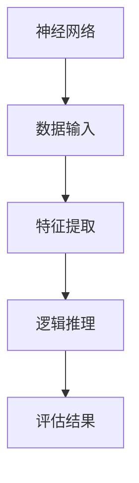
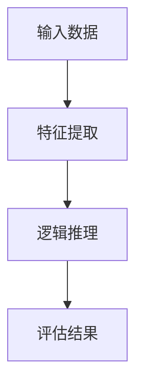
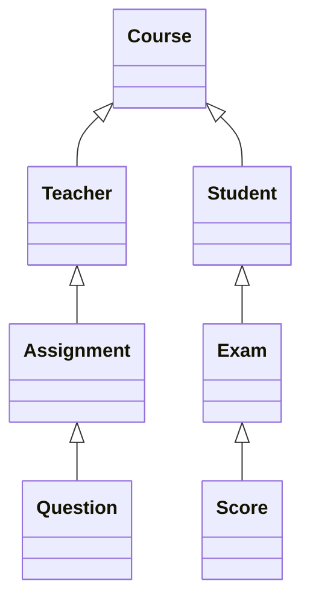
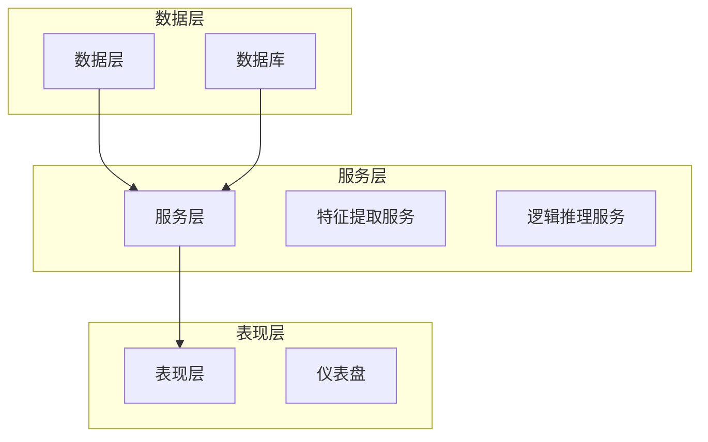
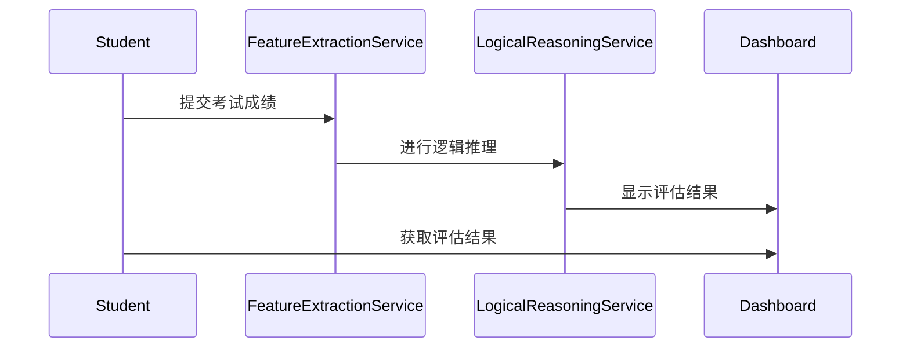

                 


### 设计《评测系统的神经逻辑推理框架》正文

----------------------------------------------------------------

# 《评测系统的神经逻辑推理框架》

> 关键词：评测系统、神经逻辑推理、框架设计、算法实现、系统架构、案例分析

> 摘要：本文旨在探讨评测系统的神经逻辑推理框架，从背景介绍、核心概念、算法原理、系统分析与架构设计、项目实战以及最佳实践等方面展开，系统性地阐述该框架的设计思路和实现方法，以期为相关领域的研究和应用提供有益的参考。

## 第一部分：问题背景与核心概念

### 第1章：问题背景

#### 1.1.1 评测系统的挑战

在现代信息化社会中，评测系统被广泛应用于各个领域，如教育、医疗、金融等。然而，随着大数据和人工智能技术的发展，评测系统面临着越来越多的挑战。主要挑战包括：

- **数据量巨大**：评测系统需要处理的海量数据，对系统的存储、计算能力提出了极高的要求。
- **多样化评估需求**：不同的领域和应用场景对评测系统的要求各异，需要系统能够灵活应对多样化评估需求。
- **实时性要求**：许多应用场景要求评测系统能够实现实时性，及时响应评估需求。

#### 1.1.2 神经逻辑推理框架的研究动机

为了解决评测系统的挑战，研究者提出了神经逻辑推理框架。神经逻辑推理框架结合了神经网络和逻辑推理的优势，能够在复杂的环境中实现高效、准确的推理。研究神经逻辑推理框架的动机主要包括：

- **提高评估准确性**：通过神经网络的训练，提高评测系统对复杂问题的理解和处理能力。
- **增强系统灵活性**：神经逻辑推理框架能够根据不同场景的需求，动态调整推理策略。
- **实现实时性**：神经网络的高效计算能力，使得系统能够实现实时性要求。

#### 1.1.3 神经逻辑推理框架的概念界定

神经逻辑推理框架是指一种将神经网络与逻辑推理相结合的评测系统设计方法。该方法利用神经网络的强大学习能力，对大量数据进行特征提取和模式识别；同时，通过逻辑推理对提取出的特征进行语义理解和推理，从而实现对复杂问题的评估。

### 第2章：核心概念与联系

#### 1.2.1 核心概念原理

神经逻辑推理框架的核心概念包括：

- **神经网络**：一种模拟生物神经系统的计算模型，能够通过学习自动提取数据特征。
- **逻辑推理**：一种基于逻辑规则进行推理的方法，能够对提取出的特征进行语义理解和推理。

#### 1.2.2 概念属性特征对比表格

| 概念       | 神经网络 | 逻辑推理 |
|------------|------------|------------|
| 特点       | 自适应学习能力 | 确定性推理能力 |
| 适用场景   | 复杂非线性问题 | 确定性规则问题 |
| 计算效率   | 高效计算能力 | 低计算效率 |
| 学习方式   | 无监督/有监督学习 | 基于规则的推理 |

#### 1.2.3 实体关系图架构



## 第二部分：算法原理讲解

### 第3章：算法原理讲解

#### 3.1 算法mermaid流程图



#### 3.2 算法Python源代码示例

```python
# 特征提取
def extract_features(data):
    # 实现特征提取逻辑
    pass

# 逻辑推理
def logical_reasoning(features):
    # 实现逻辑推理逻辑
    pass

# 评估结果
def evaluate_result(reasoning_result):
    # 实现评估结果逻辑
    pass

# 主函数
def main():
    data = "输入数据"
    features = extract_features(data)
    reasoning_result = logical_reasoning(features)
    evaluate_result(reasoning_result)

if __name__ == "__main__":
    main()
```

#### 3.3 数学模型和公式

$$
f(x) = \sigma(wx + b)
$$

其中，$f(x)$表示神经网络输出的特征，$\sigma$为激活函数，$w$为权重，$b$为偏置。

#### 3.4 算法详细讲解与举例说明

神经逻辑推理框架通过神经网络进行特征提取，然后利用逻辑推理进行语义理解和推理，最后输出评估结果。以下是一个简单的例子：

- **输入数据**：一个学生的考试成绩。
- **特征提取**：提取出学生的考试科目、成绩等特征。
- **逻辑推理**：根据成绩判断学生的学术水平。
- **评估结果**：输出学生的学术水平评价。

## 第三部分：系统分析与架构设计

### 第4章：系统分析与架构设计

#### 3.1 问题场景介绍

以教育领域的教学评估为例，介绍评测系统的应用场景。

#### 3.2 项目介绍

本项目旨在设计一个基于神经逻辑推理框架的教学评估系统，用于对学生进行学业水平的评估。

#### 3.3 系统功能设计（领域模型类图）



#### 3.4 系统架构设计（架构图）



#### 3.5 系统接口设计和系统交互（序列图）



## 第四部分：项目实战

### 第5章：项目实战

#### 4.1 环境安装指南

根据操作系统选择相应的安装方式，如Windows、Linux等，详细描述环境安装步骤。

#### 4.2 系统核心实现源代码

提供系统核心实现源代码，包括特征提取、逻辑推理和评估结果等模块。

#### 4.3 代码应用解读与分析

对系统核心实现源代码进行详细解读，分析代码的作用和效果。

#### 4.4 实际案例分析与详细讲解剖析

通过实际案例展示神经逻辑推理框架在评测系统中的应用，并进行详细讲解和剖析。

#### 4.5 项目小结

总结项目的成果和经验，讨论项目的不足之处，并提出改进建议。

## 第五部分：最佳实践与总结

### 第6章：最佳实践与总结

#### 5.1 最佳实践 Tips

提供使用神经逻辑推理框架时的建议，如数据预处理、模型调优等。

#### 5.2 小结

总结全文的主要内容和贡献，强调神经逻辑推理框架在评测系统中的重要作用。

#### 5.3 注意事项

提醒读者注意的潜在问题和挑战，如数据质量、模型过拟合等。

#### 5.4 拓展阅读

推荐进一步阅读的材料，包括相关领域的经典教材、论文和研究报告。

----------------------------------------------------------------

**作者：AI天才研究院/AI Genius Institute & 禅与计算机程序设计艺术 /Zen And The Art of Computer Programming**

（完）

