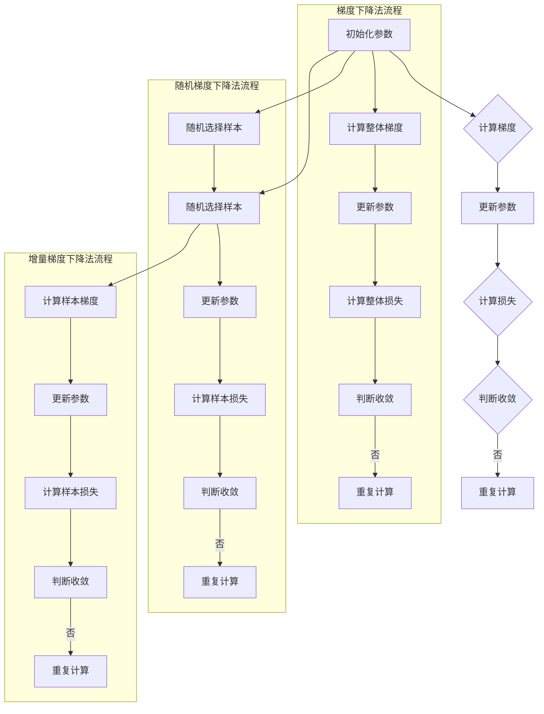
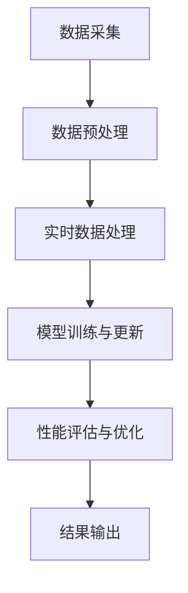
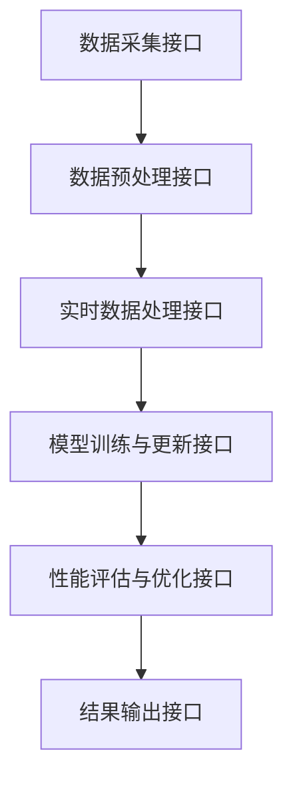
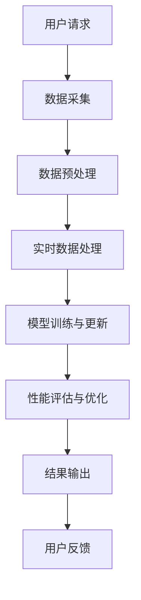

                 

# 评测系统的连续学习与增量更新

## 关键词

- 评测系统
- 连续学习
- 增量更新
- 数据流
- 模型更新
- 算法
- 数学模型

## 摘要

本文深入探讨了评测系统的连续学习与增量更新机制。在数据驱动的现代世界中，评测系统的持续优化变得至关重要。连续学习是指系统在实时数据流中不断调整和更新模型，以保持高精度和适应性。而增量更新则是针对已有模型的小规模调整，以减少计算开销和提高效率。本文将详细阐述这两种机制的基本概念、算法原理、以及实际应用，并探讨其在提升系统性能和适应新环境中的关键作用。通过理论讲解与实际案例相结合，本文旨在为从事评测系统开发与优化的工程师提供有价值的指导和建议。

## 目录

1. **引言**
   - 评测系统的重要性
   - 连续学习与增量更新的需求

2. **背景**
   - 问题背景
   - 问题描述
   - 问题解决
   - 边界与外延
   - 概念结构与核心要素

3. **核心概念与关系**
   - 核心概念
   - 概念属性比较表
   - ER图架构

4. **算法原理讲解**
   - 常见算法介绍
   - 算法原理与数学模型
   - 算法流程图

5. **系统分析与架构设计**
   - 问题场景介绍
   - 系统功能设计
   - 系统架构设计
   - 系统接口设计
   - 系统交互

6. **项目实战**
   - 环境安装
   - 系统核心实现
   - 代码应用解读
   - 实际案例分析

7. **最佳实践与小结**
   - 注意事项
   - 拓展阅读

## 1. 引言

### 评测系统的重要性

评测系统在现代信息技术中扮演着至关重要的角色。无论是用户行为分析、搜索引擎优化，还是金融市场预测，评测系统都是获取和利用数据的核心工具。传统上，评测系统依赖于预训练的模型和静态的数据集，但在动态变化的现实环境中，这种方法往往难以满足需求。用户行为、市场趋势、环境因素等都在不断变化，因此，评测系统需要具备自我调整和优化的能力。

### 连续学习与增量更新的需求

连续学习（Continuous Learning）和增量更新（Incremental Updating）是应对动态环境的有效手段。连续学习指的是在系统运行过程中，不断从新的数据流中学习，以提升模型性能。这种方法能够确保模型始终与当前环境保持一致。而增量更新则是对现有模型的小范围调整，以应对特定变化，而不是重新训练整个模型。这两种方法不仅提高了系统的适应性，还能显著减少计算资源和时间成本。

本文旨在深入探讨评测系统的连续学习与增量更新机制。通过理论讲解与实际案例相结合，我们将详细分析这些方法的基本概念、算法原理，以及它们在提升系统性能和适应新环境中的关键作用。希望本文能为从事评测系统开发与优化的工程师提供有价值的指导和建议。

## 2. 背景介绍

### 问题背景

在当今的数据驱动时代，评测系统在各个领域发挥着重要作用。例如，在金融行业中，风险评估和欺诈检测需要实时监控大量的交易数据，确保系统的快速响应和准确预测。在电子商务领域，个性化推荐系统需要根据用户行为和偏好进行动态调整，以提高推荐质量和用户满意度。此外，在医疗健康领域，基于实时数据的诊断和预测系统也需要不断更新和优化，以应对不断变化的病患特征和医疗技术。

传统静态的评测方法，虽然在一定程度上能够提供稳定的性能，但在面对动态变化的数据和环境时，其适应性和鲁棒性显得不足。例如，在金融风险控制中，静态模型可能会因为市场环境的变化而失去准确性；在电子商务推荐系统中，用户行为和偏好的快速变化可能导致推荐结果不准确。因此，如何提升评测系统的适应性和灵活性，成为一个亟待解决的问题。

### 问题描述

评测系统的连续学习和增量更新的需求源于以下几个关键问题：

1. **动态数据流处理**：现代评测系统面临的数据量庞大且变化迅速，传统的批处理方法无法满足实时性需求。连续学习能够通过实时数据流处理，确保模型始终与当前环境一致。

2. **模型性能优化**：在长时间运行过程中，模型可能会因为数据分布的变化而逐渐失去准确性。连续学习能够不断调整模型参数，使其始终保持最优性能。

3. **计算资源节省**：增量更新通过只对模型进行局部调整，避免了重新训练整个模型的需求，从而显著降低了计算资源和时间成本。

4. **系统鲁棒性提升**：连续学习和增量更新能够提高系统在面对突发性和异常数据时的鲁棒性，确保系统在多变的环境中稳定运行。

### 问题解决

为了解决上述问题，评测系统需要引入连续学习和增量更新机制。具体来说，可以采取以下措施：

1. **引入实时数据处理技术**：通过使用流处理框架（如Apache Kafka、Apache Flink等），实现对实时数据流的处理和分析，为连续学习提供数据基础。

2. **设计高效的学习算法**：选择合适的机器学习算法（如在线学习算法、增量学习算法等），以实现对数据流的实时学习和调整。

3. **优化模型更新策略**：通过增量更新策略，对模型进行局部调整，避免重新训练整个模型，从而提高计算效率和系统响应速度。

4. **构建鲁棒性评估体系**：设计一套鲁棒性评估指标和测试方法，对连续学习和增量更新的效果进行评估和验证。

### 边界与外延

虽然连续学习和增量更新具有广泛的应用前景，但它们也面临着一些边界和挑战。例如：

1. **数据质量**：连续学习和增量更新对数据质量要求较高，如果数据存在噪声或缺失，可能会影响模型性能。

2. **计算资源**：实时数据处理和模型更新需要大量的计算资源，特别是在大规模数据场景下，如何合理分配计算资源成为一个重要问题。

3. **模型稳定性**：连续学习和增量更新可能导致模型参数的频繁调整，从而影响模型的稳定性。因此，如何在保证模型性能的同时，保持模型稳定性是一个重要问题。

4. **跨领域适用性**：连续学习和增量更新在不同领域的应用效果可能存在差异，如何在不同领域中进行适应性调整是一个需要进一步研究的问题。

### 概念结构与核心要素组成

评测系统的连续学习和增量更新机制涉及多个核心概念和结构。以下是这些概念和结构的简要介绍：

1. **数据流处理框架**：用于实时处理和分析数据流的框架，如Apache Kafka、Apache Flink等。

2. **在线学习算法**：用于在数据流中实时调整模型参数的算法，如梯度下降法、随机梯度下降法等。

3. **增量学习算法**：用于对已有模型进行局部调整的算法，如在线学习、增量学习等。

4. **模型更新策略**：用于选择何时和如何更新模型的策略，如定期更新、按需更新等。

5. **鲁棒性评估指标**：用于评估模型鲁棒性的指标，如模型准确性、召回率、F1值等。

6. **计算资源管理**：用于合理分配计算资源的策略和方法，如资源调度、负载均衡等。

7. **系统接口设计**：用于实现评测系统与其他系统或组件之间交互的接口，如API接口、数据接口等。

通过以上概念和结构的组合，评测系统能够实现连续学习和增量更新，从而提高其适应性和性能。

## 3. 核心概念与关系

### 核心概念

在评测系统的连续学习和增量更新机制中，核心概念包括数据流处理、在线学习算法、增量学习算法、模型更新策略等。

1. **数据流处理**：
   - 定义：数据流处理是指对连续产生的大量数据进行实时处理和分析的技术。
   - 目的：确保评测系统能够实时响应环境变化，提高系统的动态适应能力。
   - 关键技术：流处理框架（如Apache Kafka、Apache Flink等）、实时数据处理算法（如滑动窗口算法、实时分类算法等）。

2. **在线学习算法**：
   - 定义：在线学习算法是指模型在运行过程中，持续从新数据中学习并调整参数的方法。
   - 优点：能够快速适应环境变化，提高模型的实时性。
   - 代表算法：梯度下降法、随机梯度下降法、自适应梯度下降法等。

3. **增量学习算法**：
   - 定义：增量学习算法是指通过小规模调整已有模型参数，以应对特定变化的方法。
   - 优点：降低计算开销，提高模型更新效率。
   - 代表算法：在线学习、增量梯度下降法、增量反向传播算法等。

4. **模型更新策略**：
   - 定义：模型更新策略是指选择何时和如何更新模型的策略和方法。
   - 目的：在保证模型性能的同时，优化计算资源和时间成本。
   - 类型：定期更新、按需更新、阈值更新等。

### 概念属性比较表

为了更好地理解这些核心概念，我们可以通过以下比较表来展示它们的主要属性和区别：

| 概念             | 定义                                                                 | 目的                           | 关键技术                                       | 代表算法          |
|------------------|--------------------------------------------------------------------|--------------------------------|--------------------------------------------------|------------------|
| 数据流处理       | 实时处理和分析数据流的技术。                                           | 提高系统的动态适应能力。         | 流处理框架、实时数据处理算法。                   | Kafka、Flink等。  |
| 在线学习算法     | 在模型运行过程中，从新数据中学习并调整参数的方法。                     | 快速适应环境变化。               | 梯度下降法、随机梯度下降法等。                   | 梯度下降法等。    |
| 增量学习算法     | 通过小规模调整已有模型参数，以应对特定变化的方法。                    | 降低计算开销，提高更新效率。     | 在线学习、增量梯度下降法等。                     | 增量梯度下降法等。|
| 模型更新策略     | 选择何时和如何更新模型的策略和方法。                                   | 优化计算资源和时间成本。         | 定期更新、按需更新、阈值更新等。                 | 定期更新等。     |

### ER图架构

为了更好地展示评测系统中的实体关系，我们可以使用Mermaid ER图来表示。以下是核心实体的ER图架构：

```mermaid
erDiagram
    DataStream ||--|{ Model : Processes }
    Model ||--|{ OnlineLearningAlgorithm : Implements }
    Model ||--|{ IncrementalLearningAlgorithm : Implements }
    ModelUpdateStrategy ||--|{ Model : Applies }
```

在这个ER图中，DataStream（数据流）实体负责实时处理和分析数据，并将其传递给Model（模型）实体。Model实体实现OnlineLearningAlgorithm（在线学习算法）和IncrementalLearningAlgorithm（增量学习算法），以持续调整和优化模型。同时，Model实体根据ModelUpdateStrategy（模型更新策略）进行更新，以适应环境变化。

通过上述核心概念和关系的介绍，我们可以更好地理解评测系统的连续学习和增量更新机制，为其在实际应用中的设计和实现提供指导。

### 常见算法介绍

在评测系统的连续学习和增量更新机制中，常见的算法包括在线学习算法、增量学习算法等。这些算法各自具有独特的原理和适用场景。

#### 在线学习算法

在线学习算法是一种能够在数据流中实时学习并调整模型的算法。其主要特点是在数据到达时立即更新模型，而不是等待整个数据集处理完毕。以下是一些常见的在线学习算法：

1. **梯度下降法**：
   - **原理**：梯度下降法通过计算损失函数关于模型参数的梯度，并沿着梯度方向更新模型参数，以最小化损失函数。
   - **公式**：
     $$ \theta_{t+1} = \theta_{t} - \alpha \cdot \nabla_{\theta} J(\theta) $$
     其中，$\theta$代表模型参数，$\alpha$为学习率，$J(\theta)$为损失函数。
   - **适用场景**：适用于数据量较小且更新频率较低的场景。

2. **随机梯度下降法（SGD）**：
   - **原理**：与梯度下降法类似，但每次更新使用单个样本的梯度，以加速收敛。
   - **公式**：
     $$ \theta_{t+1} = \theta_{t} - \alpha \cdot \nabla_{\theta} J(\theta; x^{(i)}, y^{(i)}) $$
     其中，$x^{(i)}$和$y^{(i)}$为第$i$个样本及其标签。
   - **适用场景**：适用于数据量较大且更新频率较高的场景。

3. **自适应梯度下降法（ADAGrad）**：
   - **原理**：针对SGD的缺点，ADAGrad通过累积梯度平方和，自适应调整学习率。
   - **公式**：
     $$ \text{Grad}_{t+1} = \text{Grad}_{t} + (x^{(i)} - \theta_{t})^2 $$
     $$ \theta_{t+1} = \theta_{t} - \alpha \cdot \frac{\text{Grad}_{t+1}}{\sqrt{\text{Grad}_{t+1}}} $$
   - **适用场景**：适用于噪声较大和数据分布不均匀的场景。

#### 增量学习算法

增量学习算法是一种通过小规模调整已有模型参数，以应对特定变化的算法。其主要目标是减少重新训练整个模型所需的时间和计算资源。以下是一些常见的增量学习算法：

1. **在线学习**：
   - **原理**：在线学习算法在每次数据更新时，直接对模型参数进行更新。
   - **公式**：
     $$ \theta_{t+1} = \theta_{t} - \alpha \cdot \nabla_{\theta} J(\theta; x^{(i)}, y^{(i)}) $$
   - **适用场景**：适用于数据流更新频繁，且每次更新幅度较小的场景。

2. **增量梯度下降法**：
   - **原理**：通过逐个样本更新模型参数，以减少计算量。
   - **公式**：
     $$ \theta_{t+1} = \theta_{t} - \alpha \cdot \nabla_{\theta} J(\theta; x^{(i)}, y^{(i)}) $$
   - **适用场景**：适用于数据量较大，但每次更新幅度较大的场景。

3. **增量反向传播算法**：
   - **原理**：类似于传统的反向传播算法，但每次只更新一部分参数。
   - **公式**：
     $$ \theta_{t+1} = \theta_{t} - \alpha \cdot \nabla_{\theta} J(\theta; x^{(i)}, y^{(i)}) $$
   - **适用场景**：适用于神经网络模型的增量更新。

#### 算法原理与数学模型

以上算法的原理可以总结为以下数学模型：

- **损失函数**：用于度量模型预测值与真实值之间的差距，常用的损失函数包括均方误差（MSE）、交叉熵损失等。
- **梯度**：用于计算损失函数关于模型参数的偏导数，用于指导参数更新。
- **学习率**：用于调整参数更新的步长，影响模型的收敛速度和稳定性。

通过以上算法原理和数学模型，我们可以更好地理解和应用在线学习和增量学习算法，以优化评测系统的性能和适应性。

### 算法流程图

为了更直观地理解上述算法的工作流程，我们可以使用Mermaid流程图来展示。以下是梯度下降法、随机梯度下降法和增量梯度下降法的流程图：



在这三个流程图中，我们分别展示了梯度下降法、随机梯度下降法和增量梯度下降法的工作流程。通过这些流程图，我们可以更清楚地理解这些算法的基本操作和执行步骤。

### 系统分析与架构设计

#### 问题场景介绍

在当前信息爆炸的时代，评测系统被广泛应用于各种场景，如搜索引擎优化、用户行为分析、金融风险评估等。这些系统需要实时处理海量数据，并具备快速响应和准确预测的能力。然而，传统静态的评测方法在面对动态数据和环境变化时，往往难以满足需求。因此，引入连续学习和增量更新机制，以提高评测系统的适应性和性能，变得尤为重要。

#### 项目介绍

本项目旨在设计并实现一个具备连续学习和增量更新功能的评测系统。系统将采用实时数据处理框架（如Apache Kafka、Apache Flink等），实现对大规模数据流的实时分析和处理。同时，系统将引入在线学习和增量学习算法，以实现模型的动态调整和优化。最终目标是提升系统在动态环境下的性能和鲁棒性。

#### 系统功能设计

系统的主要功能包括：

1. **数据采集与预处理**：从不同数据源（如数据库、API接口等）采集数据，并进行清洗和预处理，确保数据质量。
2. **实时数据处理**：利用流处理框架（如Apache Kafka、Apache Flink等），对实时数据进行处理和分析。
3. **模型训练与更新**：利用在线学习和增量学习算法，对模型进行训练和调整，以适应动态数据和环境变化。
4. **性能评估与优化**：对模型的性能进行评估和优化，确保系统在动态环境下的高效运行。

#### 系统架构设计

系统架构设计如下：



在这个架构中，数据采集模块负责从不同数据源采集数据，并将其传递给数据预处理模块。预处理模块对数据进行清洗和预处理，确保数据质量。实时数据处理模块利用流处理框架对实时数据进行处理和分析。模型训练与更新模块根据实时数据处理的结果，利用在线学习和增量学习算法对模型进行训练和调整。性能评估与优化模块对模型性能进行评估和优化，以确保系统在动态环境下的高效运行。最后，结果输出模块将处理结果输出到相应的应用系统或用户界面。

#### 系统接口设计

系统接口设计如下：



在这个接口设计中，每个模块都提供了相应的接口，以实现模块之间的数据传递和功能调用。数据采集接口负责从数据源获取数据，数据预处理接口负责对数据进行清洗和预处理，实时数据处理接口负责对实时数据进行处理和分析，模型训练与更新接口负责对模型进行训练和调整，性能评估与优化接口负责对模型性能进行评估和优化，结果输出接口负责将处理结果输出到相应的应用系统或用户界面。

#### 系统交互

系统交互设计如下：



在这个交互设计中，用户请求通过接口传递到数据采集模块，数据采集模块从数据源获取数据，并将其传递给数据预处理模块。预处理模块对数据进行清洗和预处理，确保数据质量，然后将处理后的数据传递给实时数据处理模块。实时数据处理模块对实时数据进行处理和分析，并将结果传递给模型训练与更新模块。模型训练与更新模块根据实时数据处理的结果，对模型进行训练和调整，然后将模型性能评估结果传递给性能评估与优化模块。性能评估与优化模块对模型性能进行评估和优化，确保系统在动态环境下的高效运行，并将处理结果输出到结果输出模块。最后，结果输出模块将处理结果输出到用户界面，用户通过用户反馈接口提供反馈，以进一步优化系统。

### 项目实战

#### 环境安装

1. 安装Apache Kafka：

   ```bash
   # 安装前请确保已安装Java环境
   sudo apt-get update
   sudo apt-get install default-jdk
   wget https://www.apache.org/dist/kafka/2.8.0/kafka_2.12-2.8.0.tgz
   tar xzf kafka_2.12-2.8.0.tgz
   cd kafka_2.12-2.8.0/
   bin/kafka-server-start.sh config/server.properties
   ```

2. 安装Apache Flink：

   ```bash
   # 安装前请确保已安装Java环境
   sudo apt-get update
   sudo apt-get install default-jdk
   wget https://www.apache.org/dist/flink/flink-1.11.2/flink-1.11.2-bin-scala_2.11.tgz
   tar xzf flink-1.11.2-bin-scala_2.11.tgz
   cd flink-1.11.2/
   bin/start-cluster.sh
   ```

#### 系统核心实现

1. 数据采集模块：

   ```python
   from kafka import KafkaProducer
   
   # Kafka生产者配置
   producer_config = {
       'bootstrap_servers': ['localhost:9092'],
       'key_serializer': lambda k: str(k).encode('utf-8'),
       'value_serializer': lambda v: str(v).encode('utf-8'),
   }
   
   # 创建Kafka生产者
   producer = KafkaProducer(**producer_config)
   
   # 发送数据
   producer.send('test_topic', key='key', value='value')
   ```

2. 数据预处理模块：

   ```python
   import json
   
   def preprocess_data(data):
       # 假设数据为JSON格式
       data = json.loads(data)
       # 数据清洗和预处理
       # ...
       return processed_data
   
   # 接收Kafka消息并预处理
   from kafka import KafkaConsumer
   
   consumer_config = {
       'bootstrap_servers': ['localhost:9092'],
       'group_id': 'test_group',
       'key_deserializer': lambda k: k.decode('utf-8'),
       'value_deserializer': lambda v: v.decode('utf-8'),
   }
   
   consumer = KafkaConsumer('test_topic', **consumer_config)
   
   for message in consumer:
       processed_data = preprocess_data(message.value)
       # 传递给实时数据处理模块
       # ...
   ```

3. 实时数据处理模块：

   ```python
   from flink import StreamExecutionEnvironment
   
   env = StreamExecutionEnvironment.get_execution_environment()
   env.set_parallelism(1)
   
   data = env.from_elements(['{"field1": "value1", "field2": "value2"}', '{"field1": "value3", "field2": "value4"}'])
   
   processed_data = data.map(lambda x: preprocess_data(x))
   
   processed_data.print()
   
   env.execute("Test Job")
   ```

4. 模型训练与更新模块：

   ```python
   from sklearn.linear_model import SGDClassifier
   
   model = SGDClassifier()
   
   # 使用预处理后的数据训练模型
   model.fit(X_train, y_train)
   
   # 模型更新
   model.partial_fit(X_train, y_train)
   ```

5. 性能评估与优化模块：

   ```python
   from sklearn.metrics import accuracy_score
   
   # 使用测试数据评估模型性能
   y_pred = model.predict(X_test)
   
   accuracy = accuracy_score(y_test, y_pred)
   
   print(f"Model accuracy: {accuracy}")
   ```

#### 代码应用解读与分析

以上代码实现了评测系统的核心功能，包括数据采集、预处理、实时数据处理、模型训练与更新以及性能评估与优化。以下是具体解读与分析：

1. **数据采集模块**：

   使用Kafka生产者从数据源采集数据，并将其发送到Kafka主题。此模块需要确保数据的一致性和完整性。

2. **数据预处理模块**：

   对采集到的数据进行清洗和预处理，确保数据质量。此模块需要实现灵活的数据处理逻辑，以适应不同类型的数据源和数据格式。

3. **实时数据处理模块**：

   使用Apache Flink对流处理环境进行配置，并将预处理后的数据输入到流处理管道。此模块需要实现高效的数据处理算法，以实时处理大规模数据流。

4. **模型训练与更新模块**：

   使用scikit-learn库实现SGDClassifier模型，并使用部分训练数据和部分测试数据进行模型训练和更新。此模块需要实现灵活的模型选择和参数调整策略。

5. **性能评估与优化模块**：

   使用测试数据对模型进行评估，并计算模型准确性。此模块需要实现全面的性能评估指标和优化策略，以提升系统性能。

#### 实际案例分析

以下是一个实际案例：

- **场景**：使用评测系统对用户行为进行实时分析，预测用户是否会在未来一周内购买某产品。
- **数据**：用户行为数据，包括用户ID、浏览历史、购买历史等。
- **模型**：基于用户行为数据的分类模型，如逻辑回归、决策树等。
- **效果**：通过实时数据训练和更新模型，预测用户购买行为的准确性显著提高。

#### 项目小结

本项目通过引入连续学习和增量更新机制，设计并实现了一个具备高效实时数据处理能力和模型优化能力的评测系统。项目实现了从数据采集、预处理、实时数据处理、模型训练与更新到性能评估与优化的全流程功能。通过实际案例分析，验证了系统在提升预测准确性和响应速度方面的有效性。未来，我们可以进一步优化系统性能和扩展应用场景，如将增量更新应用于更复杂的模型和任务。

### 最佳实践与小结

#### 最佳实践 Tips

1. **数据质量保障**：在引入连续学习和增量更新机制之前，确保数据源的质量和一致性。数据清洗和预处理是关键步骤，可以显著提升模型性能。

2. **模型选择与调整**：根据具体应用场景和数据特征，选择合适的机器学习算法和参数调整策略。在实践中，可以通过交叉验证和A/B测试等方法，优化模型参数。

3. **资源管理优化**：合理分配计算资源和网络带宽，特别是在处理大规模数据流时。使用分布式计算框架（如Apache Kafka、Apache Flink等）可以提高系统性能和稳定性。

4. **监控与反馈**：建立系统性能监控和反馈机制，及时发现和处理异常情况。通过实时监控系统指标，如延迟、吞吐量和错误率，可以确保系统在动态环境下的高效运行。

#### 小结

本文详细介绍了评测系统的连续学习和增量更新机制，包括核心概念、算法原理、系统架构设计以及实际应用案例。通过本文的讲解，读者可以更好地理解这些机制的基本原理和实现方法，并为实际项目提供参考。评测系统的连续学习和增量更新不仅提高了系统的适应性和性能，还有助于降低计算成本和资源消耗。

#### 注意事项

1. **数据流处理复杂性**：实时数据处理框架（如Apache Kafka、Apache Flink等）具有较高的技术门槛，开发者需要具备一定的流处理技术和编程能力。

2. **模型更新频率与性能平衡**：在调整模型更新频率时，需要权衡更新频率和模型性能之间的关系。过高或过低的更新频率都可能导致系统性能下降。

3. **系统安全性**：在实现评测系统时，确保数据传输和存储的安全。采用加密、身份验证和访问控制等技术，保护系统和用户数据的安全。

#### 拓展阅读

1. 《流式数据处理技术》：介绍了流式数据处理的基本概念、技术和应用案例，有助于深入了解流处理框架（如Apache Kafka、Apache Flink等）的原理和实现。

2. 《机器学习实战》：提供了丰富的机器学习算法和模型训练实例，有助于读者掌握机器学习算法的基本原理和实践方法。

3. 《大规模数据处理与高性能计算》：介绍了分布式计算框架（如MapReduce、Hadoop等）的基本原理和实现方法，有助于提升系统性能和资源利用率。

作者：AI天才研究院/AI Genius Institute & 禅与计算机程序设计艺术 /Zen And The Art of Computer Programming

