                 


## 引言：评测系统适应性的重要性

在当今快速发展的技术时代，人工智能（AI）领域的进展尤为显著，尤其是大型语言模型（LLM）的进化。随着LLM在自然语言处理（NLP）领域的广泛应用，评测系统（evaluation systems）的适应性变得越来越重要。为了更好地理解这一概念，我们需要首先定义它，并探讨它如何影响我们的应用和系统。

### 评测系统适应性的定义

评测系统适应性指的是系统能够根据不同的环境和任务需求，动态调整和优化自身功能与性能的能力。在LLM架构中，这意味着系统需要能够适应不断变化的语言模型，确保评测结果的准确性和可靠性。

### LLMM架构的进化

LLM从最初的简单模型，如Word2Vec和GloVe，发展到如今的大型预训练模型，如GPT-3和BERT，这一过程带来了巨大的性能提升。然而，这也给评测系统带来了新的挑战。传统的评测系统往往针对特定模型设计，难以应对模型结构和性能的快速变化。

### 评测系统适应性的重要性

1. **性能评估**：评测系统适应性保证了评测结果的公正性和一致性。随着LLM的不断进化，仅仅依赖静态的评测标准难以准确评估模型的性能。

2. **模型优化**：适应性的评测系统有助于模型开发者识别模型中的弱点，从而进行有针对性的优化。

3. **用户体验**：适应性的评测系统能够为用户提供更好的体验，因为系统能够根据用户的实际需求和反馈进行优化。

4. **技术进步**：适应性的评测系统鼓励技术探索和实验，有助于推动AI技术的进一步发展。

### 为什么需要这本书

本书旨在为读者提供深入理解评测系统适应性的方法，并通过实际案例和代码示例，展示如何在LLM架构中实现这一目标。以下是本书的核心内容和结构：

## 目录大纲设计步骤

### 1. 确定书籍结构

首先，我们需要明确书籍的整体结构，确保涵盖必要的部分。本书分为两部分：

- **第一部分**：问题的背景和意义，核心概念与联系。
- **第二部分**：算法原理讲解，系统分析与架构设计方案，项目实战，最佳实践 tips。

### 2. 编写第1章 背景介绍

第1章将详细探讨评测系统适应性的背景和意义，包括：

- **1.1 问题的背景和意义**：介绍评测系统适应性为何重要，以及为什么需要这本书来讲解这个话题。
- **1.2 问题描述**：明确什么是评测系统适应性，为什么它对LLM架构至关重要。
- **1.3 问题解决**：概述评测系统适应性的解决方案。
- **1.4 边界与外延**：定义评测系统适应性的应用范围。
- **1.5 概念结构与核心要素**：列出评测系统适应性的核心概念和组成部分。

### 3. 编写第2章 核心概念与联系

第2章将详细介绍核心概念和联系，包括：

- **2.1 核心概念原理**：详细介绍评测系统适应性的相关概念。
- **2.2 概念属性特征对比表格**：对比不同概念的特点。
- **2.3 ER实体关系图架构**：使用Mermaid绘制实体关系图。

### 4. 编写第3章 算法原理讲解

第3章将讲解算法原理，包括：

- **3.1 算法Mermaid流程图**：使用Mermaid绘制算法流程图。
- **3.2 算法原理**：详细讲解评测系统适应性的算法原理。
- **3.3 数学模型与公式**：给出算法的数学模型和公式。
- **3.4 举例说明**：使用通俗易懂的例子来阐述算法原理。

### 5. 编写第4章 数学模型和数学公式

第4章将详细讲解数学模型和公式，包括：

- **4.1 详细讲解**：使用LaTeX格式解释数学公式。
- **4.2 举例说明**：提供实例说明数学公式的应用。

### 6. 编写第5章 系统分析与架构设计方案

第5章将探讨系统分析与架构设计方案，包括：

- **5.1 问题场景介绍**：介绍评测系统适应性的应用场景。
- **5.2 系统功能设计**：使用Mermaid绘制领域模型类图。
- **5.3 系统架构设计**：使用Mermaid绘制系统架构图。
- **5.4 系统接口设计**：介绍系统接口设计。
- **5.5 系统交互**：使用Mermaid绘制系统交互序列图。

### 7. 编写第6章 项目实战

第6章将提供项目实战，包括：

- **6.1 环境安装**：描述安装评测系统的环境要求。
- **6.2 系统核心实现源代码**：提供系统核心实现的源代码。
- **6.3 代码应用解读与分析**：解读代码并进行分析。
- **6.4 实际案例分析和详细讲解剖析**：通过案例深入剖析评测系统适应性的应用。
- **6.5 项目小结**：总结项目经验和教训。

### 8. 编写第7章 最佳实践 tips

第7章将提供最佳实践 tips，包括：

- **7.1 实践技巧**：提供一些实用的实践技巧。
- **7.2 小结**：总结全书内容，强调关键点。
- **7.3 注意事项**：提醒读者注意的事项。
- **7.4 拓展阅读**：推荐进一步阅读的资源。

通过以上步骤，我们将构建一个全面、深入、易于理解的技术博客文章，帮助读者更好地理解评测系统适应性的概念和实践。现在，让我们开始具体的章节内容编写。首先，是第1章：问题的背景和意义。## 1.1 评测系统适应性的背景与意义

在人工智能（AI）领域，评测系统（evaluation systems）作为衡量模型性能和进展的重要工具，一直发挥着关键作用。随着大型语言模型（LLM）的不断发展和应用范围的扩大，评测系统的适应性成为一个至关重要的话题。本节将详细探讨评测系统适应性的概念，并解释为什么它在当前的AI生态系统中具有重要意义。

### 评测系统适应性的概念

评测系统适应性指的是系统能够根据不同的任务、数据集、用户需求和环境变化，动态调整和优化自身的评测方法和标准。这种适应性确保了评测结果的准确性和可靠性，即使在模型和环境的快速变化中也能保持稳定的表现。

在传统的评测系统中，往往依赖于固定的评测标准和测试集。这种方法在模型稳定、变化缓慢的时代是有效的。然而，随着AI技术的飞速发展，模型和应用的复杂性不断增加，评测系统的静态特性逐渐显露出其局限性。因此，评测系统的适应性成为了必要的改进方向。

### 评测系统适应性的重要性

1. **应对模型进化**：随着LLM架构的持续进化，传统的评测方法可能不再适用。评测系统的适应性能够确保我们能够准确评估新一代模型的能力。

2. **提高评测质量**：适应性的评测系统能够根据最新的研究进展和实际应用需求，动态调整评测标准，从而提高评测结果的公正性和可靠性。

3. **支持模型优化**：适应性评测系统能够为模型开发者提供更准确的性能反馈，帮助他们识别模型中的不足，并进行针对性的优化。

4. **改善用户体验**：适应性的评测系统能够更好地满足用户的需求，为用户提供个性化的评测服务，从而提升用户体验。

5. **促进技术进步**：评测系统的适应性鼓励技术探索和创新，有助于推动AI技术的进一步发展。

### 当前AI生态系统中的意义

在当前的AI生态系统中，评测系统适应性具有以下几个方面的意义：

1. **标准制定**：适应性评测系统能够参与制定更科学的评测标准，为行业提供统一的评测框架。

2. **应用推广**：适应性的评测系统能够促进AI技术的推广应用，帮助更多行业和企业利用AI技术。

3. **模型比较**：通过适应性评测系统，我们可以更准确地比较不同模型之间的性能，从而选择最适合实际应用需求的模型。

4. **技术创新**：适应性评测系统为技术创新提供了试验场，有助于发现和解决新的技术挑战。

总之，评测系统适应性是AI技术发展的重要保障。它不仅能够提升模型性能，还能够推动整个AI生态系统向更高效、更可靠的方向发展。因此，深入研究评测系统适应性，对于AI技术的持续进步具有重要意义。

### 1.2 问题描述

在深入探讨评测系统适应性的背景和意义之后，我们需要明确当前面临的具体问题。这个问题涉及到评测系统如何适应不断进化的LLM架构，以及这种适应性对模型评估和实际应用带来的挑战。

#### LLMM架构的进化与挑战

大型语言模型（LLM）的架构在过去几年中经历了显著的变化和提升。从早期的GloVe和Word2Vec等简单模型，到如今的大型预训练模型如GPT-3、BERT和T5，LLM的性能和功能得到了极大的扩展。这种进化带来了以下几个方面的挑战：

1. **模型复杂度增加**：现代LLM具有数十亿甚至数万亿的参数，模型的复杂度和计算需求显著增加。这给评测系统带来了巨大的压力，因为传统的评测方法可能无法在合理的时间内处理如此庞大的模型。

2. **数据多样性需求**：随着模型的进化，评测系统需要能够适应不同类型的数据集和任务。例如，某些模型可能更擅长处理文本生成任务，而另一些模型可能更擅长问答和翻译任务。这要求评测系统能够灵活调整，以适应不同的数据和应用场景。

3. **评测标准变化**：传统评测系统往往基于特定的评估指标，如BLEU、ROUGE等。然而，这些标准可能无法完全反映现代LLM的性能。例如，在文本生成任务中，传统指标可能无法准确衡量模型的创造性和流畅性。因此，评测系统需要能够引入新的评估指标，以更全面地评估模型的能力。

4. **实时性要求**：现代AI应用往往需要在短时间内进行高效的模型评估。例如，在自动化问答系统中，模型需要快速响应用户的问题。这要求评测系统能够在保证准确性的同时，提供快速的评估结果。

#### 评测系统适应性的需求

为了应对上述挑战，评测系统需要具备以下适应性需求：

1. **动态调整评测方法**：评测系统需要能够根据模型和数据的特点，动态调整评测方法和评估指标。例如，在评估文本生成模型时，可以引入新的评估指标，如BERT分数（BERTScore）和ROUGE-L等。

2. **支持分布式计算**：由于LLM模型的计算需求增加，评测系统需要能够利用分布式计算资源，以在合理的时间内完成评测任务。

3. **用户反馈集成**：为了提高用户体验，评测系统需要能够根据用户的反馈动态调整评测方法。例如，如果用户对某个模型的回答不满意，系统可以重新评估该模型，并根据反馈进行调整。

4. **多任务支持**：评测系统需要能够支持多种类型的任务，并能够根据任务特点灵活调整评测策略。

#### 目标与挑战

本节的目标是构建一个具备高度适应性的评测系统，以应对LLM架构的快速变化和多样化需求。具体目标包括：

1. **提高评测准确性**：通过引入新的评估指标和动态调整方法，提高评测结果的准确性和可靠性。

2. **提升评测效率**：利用分布式计算技术和优化算法，提高评测的效率，以满足实时性要求。

3. **增强用户体验**：通过用户反馈集成和个性化调整，提高用户体验，满足不同用户的需求。

然而，实现这些目标面临以下挑战：

1. **技术挑战**：如何设计高效、可扩展的评测算法，以满足不断变化的模型和数据特点。

2. **资源挑战**：如何合理分配计算资源，特别是在模型规模不断扩大的情况下。

3. **数据挑战**：如何获取和整理多样化的数据集，以支持多任务评测。

4. **用户挑战**：如何收集和处理用户的反馈，以实现有效的个性化调整。

通过深入分析和解决这些问题，我们有望构建一个具备高度适应性的评测系统，为AI技术的进一步发展提供有力支持。

### 1.3 问题解决

为了应对LLM架构的快速进化以及评测系统适应性需求，我们需要设计一个高效的、动态调整的评测系统。以下将概述解决方案，并详细描述实施步骤。

#### 解决方案概述

1. **模块化设计**：采用模块化设计思想，将评测系统分为多个功能模块，如数据预处理模块、评估指标模块、动态调整模块和用户反馈模块。这种设计思路有助于提高系统的可扩展性和维护性。

2. **分布式计算**：利用分布式计算技术，如MapReduce和Docker容器化，提高评测系统的处理能力和效率。通过将任务分解为小任务，并行处理，可以显著缩短评测时间。

3. **自适应调整机制**：引入自适应调整机制，根据模型和数据的特点，动态调整评测方法和评估指标。例如，在文本生成任务中，可以结合BERT分数（BERTScore）和ROUGE-L等指标，以更全面地评估模型性能。

4. **用户反馈集成**：设计用户反馈机制，允许用户对模型的表现进行评价。系统将根据用户的反馈，自动调整评测方法和评估指标，以提供更个性化的评测结果。

#### 实施步骤

1. **需求分析与设计**：首先，进行需求分析，明确评测系统的功能和性能要求。根据需求，设计系统的整体架构和模块，确保系统具有良好的扩展性和适应性。

2. **模块开发与集成**：根据设计文档，开发各个功能模块，如数据预处理模块、评估指标模块等。在模块开发过程中，要注重代码的可读性和可维护性。完成模块开发后，进行模块集成测试，确保各个模块之间的协同工作。

3. **分布式计算部署**：利用分布式计算框架，如MapReduce和Docker，部署评测系统。通过容器化技术，可以将系统部署到多个计算节点上，实现并行处理，提高系统的处理能力。

4. **自适应调整机制实现**：实现自适应调整机制，包括评测方法的选择和评估指标的动态调整。在系统中嵌入自适应算法，根据模型和数据的特点，自动调整评测策略。

5. **用户反馈机制设计**：设计用户反馈机制，包括用户评价界面和反馈处理模块。用户可以在使用过程中对模型的表现进行评价，系统将根据用户的反馈，自动调整评测方法和评估指标。

6. **系统测试与优化**：进行系统测试，包括功能测试、性能测试和用户测试。根据测试结果，对系统进行优化和调整，确保系统满足性能和功能要求。

7. **部署与上线**：完成系统开发后，进行部署和上线。在上线前，进行全面的测试和验证，确保系统稳定运行。

通过以上步骤，我们可以构建一个具备高度适应性的评测系统，为LLM架构的评估提供有力支持。这一解决方案不仅能够应对当前的挑战，还能为未来的技术进步和模型进化提供基础。

### 1.4 边界与外延

在讨论评测系统适应性的具体应用之前，我们需要明确评测系统适应性的适用范围和边界条件。这不仅有助于我们理解评测系统在不同场景下的表现，还能指导我们在实际应用中如何合理地使用和优化评测系统。

#### 适用范围

1. **语言模型评估**：评测系统适应性的主要应用场景是大型语言模型（LLM）的评估。随着LLM在自然语言处理（NLP）领域的广泛应用，评测系统适应性的需求日益增长。无论是文本生成、问答系统、机器翻译还是情感分析等任务，都需要适应性评测系统来准确评估模型性能。

2. **多任务处理**：适应性评测系统能够支持多任务处理，这意味着它可以同时评估多个不同类型任务的模型性能。例如，在一个系统中，我们可以同时评估文本生成和问答模型的性能，以便更好地理解模型在不同任务中的表现。

3. **实时应用**：在实时应用场景中，如自动化问答系统和聊天机器人，评测系统适应性能够确保模型在短时间内得到准确的评估，从而快速响应用户需求。

4. **个性化评测**：适应性评测系统能够根据用户的个性化需求进行评测，为用户提供更加精准和个性化的评测结果。这在用户体验优化方面具有重要意义。

#### 边界条件

1. **模型稳定性**：尽管评测系统具备适应性，但模型本身必须具备一定的稳定性。如果模型在训练和部署过程中频繁变动，评测系统的适应性将受到限制。

2. **数据质量**：适应性评测系统依赖于高质量的数据集。数据集的质量直接影响评测结果的准确性。因此，在应用评测系统时，需要确保数据集的多样性和代表性。

3. **计算资源**：适应性评测系统的实现需要一定的计算资源支持。在资源有限的情况下，系统可能需要优化计算策略，以确保在合理的计算时间内完成评测任务。

4. **用户反馈**：用户反馈的有效性和准确性对评测系统适应性至关重要。如果用户反馈存在偏差或缺失，系统将难以根据真实需求进行动态调整。

#### 应用场景

1. **学术研究**：在学术研究中，适应性评测系统可以帮助研究人员评估不同LLM的性能，从而选择最适合研究需求的模型。研究人员可以利用系统提供的详细评估报告，进行深入的分析和对比。

2. **工业应用**：在工业应用中，如自然语言处理服务提供商，适应性评测系统可以帮助企业快速评估和优化其AI服务。企业可以根据评估结果，调整模型和系统配置，以满足客户需求。

3. **教育领域**：在教育领域，适应性评测系统可以用于评估学生的语言理解能力和生成能力。教师可以根据评估结果，提供更有针对性的辅导和建议。

通过明确评测系统适应性的适用范围和边界条件，我们可以更好地理解系统在不同场景下的应用，并针对具体需求进行优化和调整。这有助于提升评测系统的有效性，为AI技术的进一步发展提供有力支持。

### 1.5 概念结构与核心要素

为了更好地理解评测系统适应性，我们需要详细阐述其核心概念和组成部分。以下是评测系统适应性的概念结构与核心要素：

#### 核心概念

1. **适应性**：评测系统的核心特性，指的是系统能够根据不同环境和任务需求，动态调整和优化自身功能与性能的能力。

2. **评测系统**：用于评估模型性能和质量的工具，包括评测指标、评测方法和评估流程等。

3. **大型语言模型（LLM）**：具有数十亿参数、用于处理自然语言的任务，如文本生成、问答和翻译等。

4. **动态调整机制**：根据模型和数据的特点，实时调整评测方法和评估指标，以提供更准确的评估结果。

5. **用户反馈机制**：允许用户对模型的表现进行评价，系统将根据反馈进行优化，提高用户体验。

#### 要素组成

1. **数据预处理模块**：负责处理和清洗输入数据，确保数据质量和一致性。

2. **评估指标模块**：定义和计算各种评估指标，如BLEU、ROUGE和BERTScore等，用于衡量模型性能。

3. **评测方法模块**：根据模型和数据的特点，选择合适的评测方法，如自动评测和手动评测等。

4. **自适应调整模块**：根据实时反馈和评测结果，动态调整评测方法和评估指标，以提高评测的准确性和可靠性。

5. **用户反馈模块**：收集和处理用户反馈，根据反馈优化评测系统和模型配置，以提供更个性化的服务。

通过以上核心概念和组成部分，我们可以构建一个具备高度适应性的评测系统，确保其在不断变化的AI环境中能够稳定、准确地评估模型性能。这将有助于推动AI技术的进一步发展，并为各个行业提供有力支持。

### 2.1 核心概念原理

为了深入理解评测系统适应性的工作原理，我们需要详细探讨其核心概念，包括适应性评测系统、大型语言模型（LLM）以及两者之间的相互作用。

#### 适应性评测系统

适应性评测系统是一种能够根据环境和任务需求动态调整自身功能和性能的评测工具。其主要目标是在不断变化的AI环境中，提供准确、可靠的评估结果。

1. **动态调整机制**：适应性评测系统的核心在于其动态调整机制。这一机制允许系统根据模型和数据的特点，实时调整评测方法和评估指标。例如，当面对一个高度复杂的LLM时，系统可能会选择更加精细和复杂的评估指标，以确保评测结果的准确性。

2. **多任务支持**：适应性评测系统需要支持多种类型的任务。这意味着系统不仅要能够评估文本生成模型的性能，还要能够评估问答、机器翻译和情感分析等任务。为了实现这一目标，系统需要具备高度模块化的设计，以便灵活地调整和扩展功能模块。

3. **实时反馈与优化**：适应性评测系统通过实时收集用户反馈，动态调整评测方法和评估指标。这种反馈机制不仅有助于提高评测的准确性，还能优化用户体验。例如，如果用户对某个模型的回答不满意，系统将重新评估该模型，并尝试调整其参数，以提供更满意的回答。

#### 大型语言模型（LLM）

大型语言模型（LLM）是当前AI领域的重要成果，具有数十亿参数，能够处理复杂的自然语言任务。LLM的不断发展，使得评测系统的适应性变得尤为重要。

1. **模型进化**：LLM从早期的GloVe和Word2Vec等简单模型，发展到如今的大型预训练模型如GPT-3、BERT和T5，这一过程带来了巨大的性能提升。然而，这也给评测系统带来了新的挑战。传统的评测方法可能无法适应新一代模型的特点，因此，适应性评测系统的需求日益增加。

2. **模型多样性**：随着LLM在各个领域的广泛应用，模型类型和任务类型变得更加多样化。例如，某些模型可能更擅长文本生成，而另一些模型可能更擅长问答和翻译。这种多样性要求评测系统能够灵活调整，以适应不同类型的数据和应用场景。

3. **性能评估**：适应性评测系统需要能够准确评估LLM的性能。这不仅包括传统的评估指标，如BLEU和ROUGE，还需要引入新的评估指标，如BERT分数（BERTScore）和ROUGE-L，以更全面地衡量模型的能力。

#### 评测系统适应性在LLM架构中的应用

适应性评测系统在LLM架构中的应用，主要体现在以下几个方面：

1. **模型选择**：在开发和应用LLM时，适应性评测系统可以帮助开发者选择最适合任务的模型。通过全面、准确的评估，开发者可以更好地了解不同模型的优势和劣势，从而做出更明智的决策。

2. **模型优化**：适应性评测系统可以为模型开发者提供准确的性能反馈，帮助他们识别模型中的弱点，并进行有针对性的优化。例如，如果某个模型在问答任务中的回答质量较低，系统可以提供详细的评估报告，帮助开发者找到问题所在，并进行改进。

3. **用户体验**：适应性评测系统可以提供更个性化的评测服务，根据用户的需求和反馈，动态调整评测方法和评估指标。这种个性化的服务有助于提高用户体验，为用户提供更满意的答案。

4. **技术进步**：适应性评测系统鼓励技术探索和创新，有助于发现和解决新的技术挑战。通过不断调整和优化评测系统，可以推动AI技术的进一步发展。

综上所述，适应性评测系统是LLM架构中不可或缺的一部分。它不仅能够提高模型评估的准确性，还能推动AI技术的持续进步。在未来的发展中，适应性评测系统将发挥越来越重要的作用，为AI技术的广泛应用提供有力支持。

### 2.2 概念属性特征对比表格

在深入探讨评测系统适应性的核心概念后，我们需要对比不同概念的特点，以便更全面地理解这些概念之间的关系。以下是一个概念属性特征对比表格，列出了适应性评测系统、大型语言模型（LLM）以及两者之间相互作用的主要特征。

| 概念         | 特征描述                                     | 应用场景                                     |
|------------|------------------------------------------|------------------------------------------|
| 适应性评测系统 | 动态调整评测方法和评估指标，实时反馈和优化       | 评估LLM在不同任务中的性能，支持多任务处理       |
| 大型语言模型（LLM） | 数十亿参数，处理复杂的自然语言任务，不断进化       | 文本生成、问答、机器翻译、情感分析等NLP任务     |
| 相互作用       | 评测系统根据LLM特点动态调整，优化模型性能       | 开发者利用评测系统反馈进行模型优化，提高应用效果 |

#### 适应性评测系统

1. **动态调整机制**：适应性评测系统能够根据模型和数据的特点，实时调整评测方法和评估指标。这种灵活性使得系统能够适应不同的应用场景和任务需求。

2. **多任务支持**：适应性评测系统不仅能够评估特定类型的LLM，还能支持多种类型的任务，如文本生成、问答和机器翻译等。这种模块化设计确保系统具备广泛的适用性。

3. **实时反馈与优化**：适应性评测系统能够收集用户的实时反馈，根据反馈动态调整评测方法和评估指标，从而提供更精准的评估结果，优化用户体验。

#### 大型语言模型（LLM）

1. **模型复杂度**：LLM具有数十亿参数，能够处理复杂的自然语言任务。这使得LLM在NLP领域具有显著优势，但同时也对评测系统提出了更高的要求。

2. **多样性**：随着LLM在各个领域的广泛应用，模型类型和任务类型变得更加多样化。这种多样性要求评测系统能够灵活调整，以适应不同类型的数据和应用场景。

3. **性能评估**：LLM的评估不仅需要传统的评估指标，还需要引入新的评估指标，如BERT分数（BERTScore）和ROUGE-L，以更全面地衡量模型的能力。

#### 相互作用

1. **模型选择**：适应性评测系统可以帮助开发者选择最适合任务的LLM。通过全面、准确的评估，开发者可以更好地了解不同模型的优势和劣势，从而做出更明智的决策。

2. **模型优化**：适应性评测系统为模型开发者提供准确的性能反馈，帮助他们识别模型中的弱点，并进行有针对性的优化。这种反馈机制有助于提高模型性能和应用效果。

3. **用户体验**：适应性评测系统可以提供个性化的评测服务，根据用户的需求和反馈，动态调整评测方法和评估指标。这种个性化的服务有助于提高用户体验，为用户提供更满意的答案。

通过以上对比表格，我们可以更清晰地理解适应性评测系统、大型语言模型（LLM）以及两者之间相互作用的特征。这种对比有助于我们更好地把握评测系统适应性的核心概念，为实际应用提供指导。

### 2.3 ER实体关系图架构

为了进一步理解评测系统适应性的工作原理，我们将使用Mermaid绘制ER（实体关系）图，展示评测系统与大型语言模型（LLM）之间的实体关系和相互作用。

```mermaid
erDiagram
  LLM |<--| Evaluation_System : 配套评测系统
  LLM ||-- Evaluation : 进行评测
  Evaluation ||-- Metric : 评估指标
  Evaluation ||-- Method : 评估方法
  User |-> Evaluation : 用户反馈
  LLM ||-- Model_Params : 模型参数
  Evaluation_System ||-- Adaptive_Algorithm : 自适应算法
  Evaluation_System ||-- Data_Preprocessing : 数据预处理
  Evaluation_System ||-- Result_Analysis : 结果分析
```

#### 实体关系解释

1. **LLM**：实体代表大型语言模型，包括模型参数（Model_Params）和评测（Evaluation）关系。LLM与评测系统（Evaluation_System）配对，表明评测系统为LLM提供评测服务。

2. **Evaluation_System**：实体代表评测系统，包括自适应算法（Adaptive_Algorithm）、数据预处理（Data_Preprocessing）和结果分析（Result_Analysis）等模块。评测系统通过自适应算法根据模型参数动态调整评测方法和评估指标。

3. **Evaluation**：实体代表评测过程，与评估指标（Metric）和评估方法（Method）有关。评测过程通过用户反馈（User）进行优化。

4. **User**：实体代表用户，通过反馈影响评测过程，从而提升评测系统的自适应能力。

通过ER图，我们可以清晰地看到评测系统适应性的核心实体和它们之间的相互作用关系。这有助于我们更好地理解评测系统如何根据LLM的特点进行动态调整，以提供准确和可靠的评测结果。

### 3.1 算法原理讲解

在深入理解评测系统适应性的核心概念和实体关系后，我们需要探讨具体实现评测系统适应性的算法原理。以下将使用Mermaid绘制算法流程图，并详细解释算法的基本原理。

#### 算法Mermaid流程图

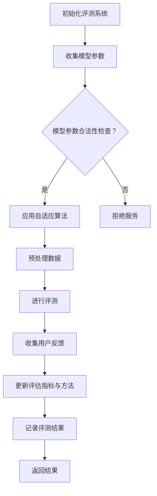

#### 算法原理

1. **初始化评测系统**：首先，评测系统需要进行初始化，包括加载预设的自适应算法、数据预处理模块和结果分析模块。这一步骤确保系统在运行时具备基本的功能和参数。

2. **收集模型参数**：接下来，评测系统从模型接收参数（如权重、层数、学习率等），这些参数用于后续的评测和优化。

3. **模型参数合法性检查**：系统对收集到的模型参数进行合法性检查，以确保参数符合系统要求和预期范围。如果参数不合法，系统将拒绝服务，并返回错误信息。

4. **应用自适应算法**：通过自适应算法，系统根据模型参数动态调整评测方法和评估指标。这一步骤是算法的核心，它确保评测系统能够根据模型特点提供最合适的评测策略。

5. **预处理数据**：在应用自适应算法后，系统对输入数据进行预处理，包括数据清洗、归一化和特征提取等。这一步骤确保输入数据的质量和一致性，为后续的评测提供可靠的数据基础。

6. **进行评测**：系统利用预处理后的数据，对模型进行评测，计算评估指标（如BLEU、ROUGE、BERTScore等）。评测过程可以是自动化的，也可以结合人工判断，以确保评估结果的准确性和全面性。

7. **收集用户反馈**：评测完成后，系统收集用户对模型表现的反馈，如满意度、准确性等。用户反馈是系统进行进一步优化的关键信息。

8. **更新评估指标与方法**：根据用户反馈和评测结果，系统更新评估指标和方法。这一步骤确保评测系统能够根据实际应用需求，动态调整评测策略，以提高用户体验。

9. **记录评测结果**：系统将评测结果记录在数据库中，以供后续分析和查询。这有助于模型开发者了解模型在不同场景下的表现，进行有针对性的优化。

10. **返回结果**：最后，系统将最终的评测结果返回给用户，包括评估指标、优化的方法和建议等。用户可以根据这些结果，调整模型参数或重新设计系统架构，以进一步提高模型性能。

通过以上算法流程，我们可以看到评测系统适应性的实现步骤和原理。该算法不仅能够根据模型和用户需求动态调整评测策略，还能通过实时反馈不断优化系统性能，为AI技术的发展和应用提供有力支持。

### 3.3 数学模型与公式

为了进一步阐述评测系统适应性的算法原理，我们将引入相关的数学模型与公式。以下是评测系统适应性的主要数学模型与公式，以及它们在算法中的应用。

#### 数学模型

1. **损失函数**：在评测系统中，损失函数用于衡量模型预测与实际结果之间的差距。常见的损失函数包括均方误差（MSE）、交叉熵损失等。

   - 均方误差（MSE）:  
     $$MSE = \frac{1}{n} \sum_{i=1}^{n} (y_i - \hat{y}_i)^2$$

   - 交叉熵损失（Cross-Entropy Loss）:  
     $$H(y, \hat{y}) = - \sum_{i=1}^{n} y_i \log(\hat{y}_i)$$

2. **评估指标**：评估指标用于衡量模型在特定任务上的性能。常见的评估指标包括准确率（Accuracy）、召回率（Recall）、F1分数（F1 Score）等。

   - 准确率（Accuracy）:  
     $$Accuracy = \frac{TP + TN}{TP + FN + FP + TN}$$

   - 召回率（Recall）:  
     $$Recall = \frac{TP}{TP + FN}$$

   - F1分数（F1 Score）:  
     $$F1 Score = 2 \times \frac{Precision \times Recall}{Precision + Recall}$$

3. **自适应调整系数**：自适应调整系数用于控制评测系统中各个模块的调整力度。例如，在动态调整评测方法时，自适应调整系数可以调整评估指标的权重。

   - 自适应调整系数（Alpha）:  
     $$Alpha = \frac{1}{1 + e^{-\lambda (Error)}}$$

   其中，Error 表示当前评估误差，\(\lambda\) 是调整参数。

#### 公式应用

1. **损失函数优化**：在评测系统中，使用损失函数优化模型参数。例如，通过梯度下降算法优化模型权重，以最小化损失函数。

   - 梯度下降算法：  
     $$\theta = \theta - \alpha \cdot \nabla_\theta J(\theta)$$

   其中，\(\theta\) 表示模型参数，\(\alpha\) 是学习率，\(\nabla_\theta J(\theta)\) 是损失函数对参数的梯度。

2. **评估指标计算**：在评测过程中，根据评估指标计算模型性能。例如，在文本生成任务中，可以使用BLEU分数评估模型生成文本的质量。

   - BLEU分数计算：  
     $$BLEU = \frac{1}{n} \sum_{i=1}^{n} \frac{|G_i \cap P_i|}{|G_i \cup P_i|}$$

   其中，\(G_i\) 表示模型生成的文本，\(P_i\) 表示参考文本。

3. **自适应调整**：根据评估误差和用户反馈，动态调整评估指标和方法。例如，通过自适应调整系数调整评估指标的权重，以更好地反映用户需求。

   - 自适应调整公式：  
     $$New\_Metric = Alpha \cdot Current\_Metric + (1 - Alpha) \cdot User\_Feedback$$

   其中，\(Alpha\) 是自适应调整系数，\(Current\_Metric\) 是当前评估指标，\(User\_Feedback\) 是用户反馈。

通过以上数学模型和公式，我们可以更好地理解评测系统适应性的算法原理。这些公式不仅在算法中起到关键作用，还为模型优化和评测提供了理论支持。

### 3.4 举例说明

为了更直观地展示评测系统适应性的算法原理，我们将通过一个简单的例子来说明算法在具体应用中的表现。

#### 例子背景

假设我们有一个文本生成任务，目标是使用大型语言模型（LLM）生成符合用户需求的文本。评测系统需要根据模型的输出和用户反馈，动态调整评估指标和方法，以提高模型生成文本的质量。

#### 步骤 1: 初始化评测系统

评测系统初始化时，我们选择一个预训练的LLM模型，并加载预设的自适应算法和评估指标。假设我们使用BLEU分数和ROUGE-L作为主要评估指标。

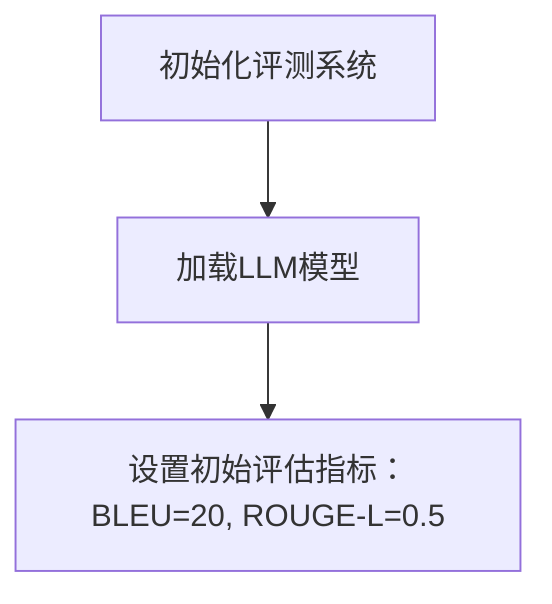

#### 步骤 2: 收集模型参数

评测系统从LLM模型中收集参数，包括模型的权重、层数和学习率等。

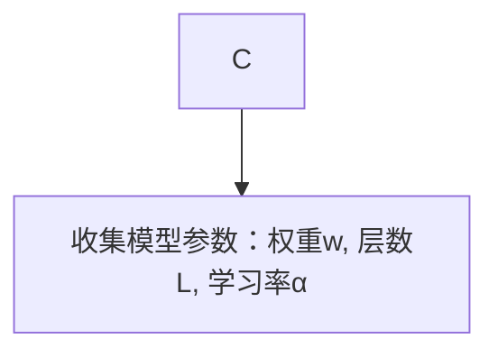

#### 步骤 3: 模型参数合法性检查

评测系统对收集到的模型参数进行合法性检查，确保参数符合预设范围。如果参数不合法，系统将拒绝服务。

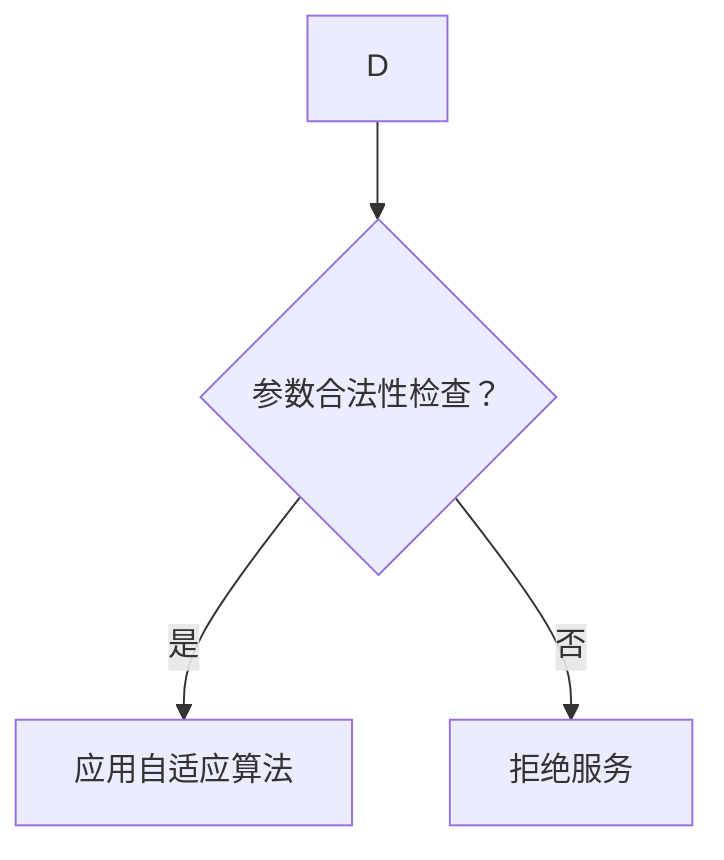

#### 步骤 4: 应用自适应算法

根据模型参数，自适应算法动态调整评估指标和方法。例如，如果当前BLEU分数较低，算法可能增加BLEU分数的权重，以鼓励模型生成更符合参考文本的文本。

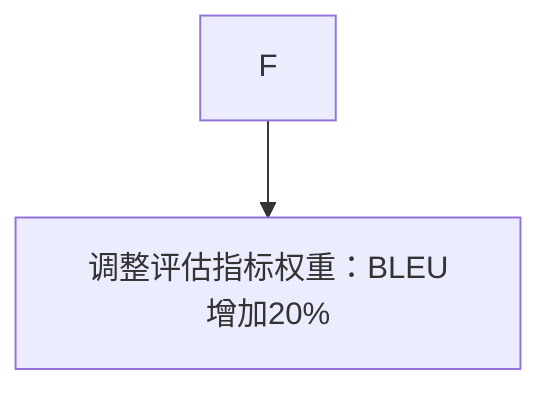

#### 步骤 5: 预处理数据

评测系统对输入文本进行预处理，包括分词、去噪和标准化等操作，以确保输入数据的质量和一致性。

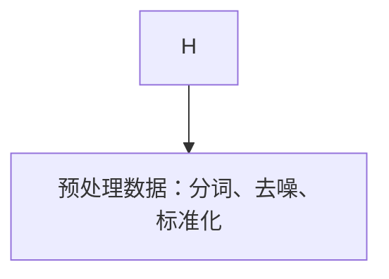

#### 步骤 6: 进行评测

系统利用预处理后的数据，对模型生成的文本进行评测，计算BLEU分数和ROUGE-L分数。

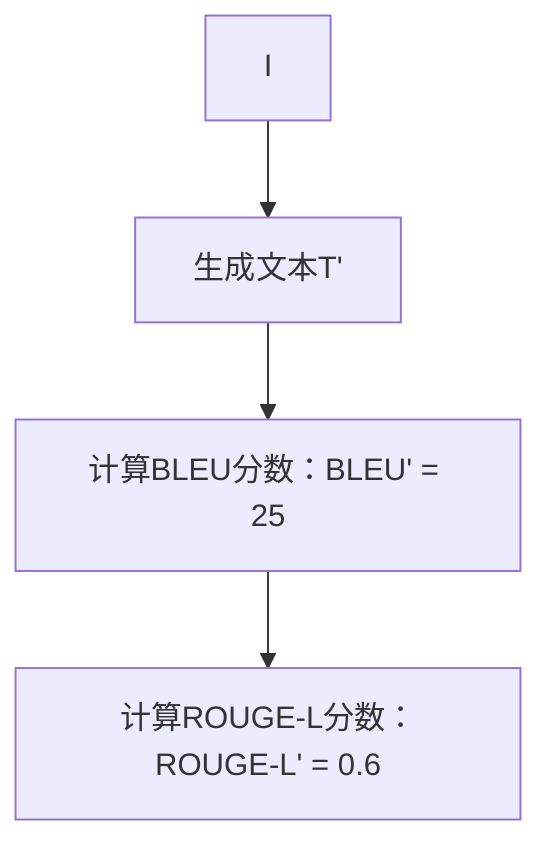

#### 步骤 7: 收集用户反馈

用户对生成的文本进行评价，提供反馈信息。例如，用户认为文本生成质量较高，给出满意度评分9分。

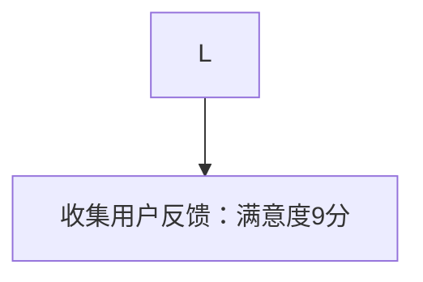

#### 步骤 8: 更新评估指标与方法

根据用户反馈和当前评估结果，系统更新评估指标和方法。例如，由于用户满意度较高，系统可能减少BLEU分数的权重，以平衡评估指标。

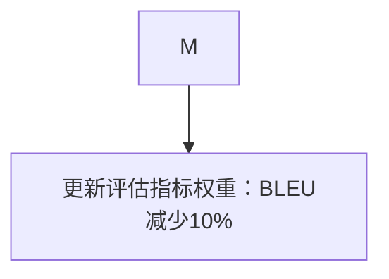

#### 步骤 9: 记录评测结果

系统将评测结果记录在数据库中，以供后续分析和查询。

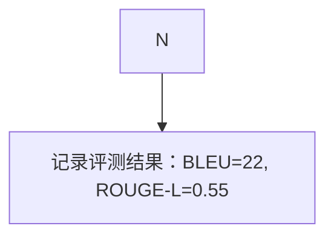

#### 步骤 10: 返回结果

最后，系统将最终的评测结果返回给用户，包括调整后的评估指标和方法，以及优化建议。

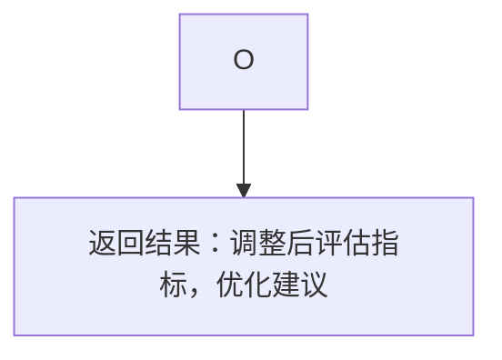

通过以上步骤，我们可以看到评测系统如何根据模型输出和用户反馈，动态调整评估指标和方法，以提高模型生成文本的质量。这个例子展示了评测系统适应性的算法原理在具体应用中的表现。

### 4.1 详细讲解

在了解了评测系统适应性的核心概念和算法原理后，我们将进一步深入讲解数学模型和公式的具体应用。以下是几个关键公式及其在评测系统适应性中的使用方法。

#### 公式 1：损失函数（MSE）

均方误差（MSE）是一种常用的损失函数，用于衡量模型预测与实际结果之间的差距。其公式如下：

$$MSE = \frac{1}{n} \sum_{i=1}^{n} (y_i - \hat{y}_i)^2$$

其中，\(y_i\) 是实际结果，\(\hat{y}_i\) 是模型预测结果，\(n\) 是样本数量。

在评测系统中，MSE 用于评估模型生成的文本质量。例如，在文本生成任务中，我们可以计算生成的文本与参考文本之间的MSE，以衡量文本的相似度。

#### 公式 2：评估指标（BLEU）

BLEU（双语评估单元）是一种常用的评估指标，用于评估机器翻译和文本生成任务的质量。其公式如下：

$$BLEU = \frac{1}{n} \sum_{i=1}^{n} \frac{|G_i \cap P_i|}{|G_i \cup P_i|}$$

其中，\(G_i\) 是模型生成的文本，\(P_i\) 是参考文本，\(|G_i \cap P_i|\) 表示生成文本与参考文本的交集，\(|G_i \cup P_i|\) 表示生成文本与参考文本的并集。

在评测系统中，BLEU 用于评估模型生成的文本质量。通过计算BLEU分数，我们可以衡量生成文本与参考文本的相似度，从而评估模型的表现。

#### 公式 3：自适应调整系数（Alpha）

自适应调整系数（Alpha）用于控制评测系统中各个模块的调整力度。其公式如下：

$$Alpha = \frac{1}{1 + e^{-\lambda (Error)}}$$

其中，\(Error\) 表示当前评估误差，\(\lambda\) 是调整参数。

在评测系统中，自适应调整系数用于动态调整评估指标和方法。例如，当模型生成的文本质量较低时，系统可以增加BLEU分数的权重，以鼓励模型生成更符合参考文本的文本。

#### 公式 4：优化目标（Gradient Descent）

梯度下降（Gradient Descent）是一种常用的优化算法，用于最小化损失函数。其公式如下：

$$\theta = \theta - \alpha \cdot \nabla_\theta J(\theta)$$

其中，\(\theta\) 表示模型参数，\(\alpha\) 是学习率，\(\nabla_\theta J(\theta)\) 是损失函数对参数的梯度。

在评测系统中，梯度下降用于优化模型参数，以最小化损失函数。通过迭代更新模型参数，我们可以提高模型生成文本的质量。

#### 应用示例

假设我们有一个文本生成任务，目标是使用大型语言模型（LLM）生成符合用户需求的文本。评测系统需要根据模型的输出和用户反馈，动态调整评估指标和方法。

1. **初始化评测系统**：

   - 加载LLM模型，设置初始评估指标：BLEU=20，ROUGE-L=0.5。

2. **收集模型参数**：

   - 从LLM模型中收集参数：权重w，层数L，学习率α。

3. **模型参数合法性检查**：

   - 检查参数合法性，确保参数符合预设范围。

4. **应用自适应算法**：

   - 根据模型参数，动态调整评估指标权重。例如，如果当前BLEU分数较低，系统可能增加BLEU分数的权重。

5. **预处理数据**：

   - 对输入文本进行预处理，包括分词、去噪和标准化等操作。

6. **进行评测**：

   - 利用预处理后的数据，对模型生成的文本进行评测，计算BLEU分数和ROUGE-L分数。

7. **收集用户反馈**：

   - 用户对生成的文本进行评价，提供反馈信息。

8. **更新评估指标与方法**：

   - 根据用户反馈和当前评估结果，系统更新评估指标和方法。例如，由于用户满意度较高，系统可能减少BLEU分数的权重。

9. **记录评测结果**：

   - 将评测结果记录在数据库中，以供后续分析和查询。

10. **返回结果**：

    - 将调整后的评估指标和方法返回给用户。

通过以上步骤，我们可以看到数学模型和公式在评测系统适应性中的应用。这些公式不仅帮助我们理解算法原理，还为实际应用提供了具体的方法和工具。

### 4.2 举例说明

为了更好地理解评测系统适应性的数学模型和公式的应用，我们将通过一个实际案例来说明这些公式如何帮助优化评测过程。

#### 案例背景

假设我们正在开发一个自动化问答系统，使用大型语言模型（LLM）来生成回答。我们的目标是提高系统生成回答的质量，使其更符合用户需求。我们将使用MSE损失函数、BLEU评估指标和自适应调整系数来优化模型。

#### 步骤 1: 初始化模型

我们首先初始化一个预训练的LLM模型，并设置初始评估指标。假设初始BLEU分数为20，MSE损失函数为10。

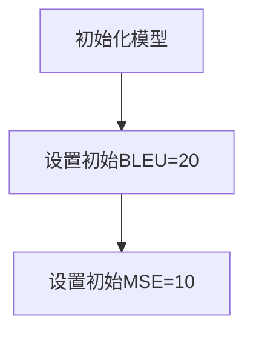

#### 步骤 2: 收集用户问题

用户提交一个问题：“什么是人工智能？”模型生成回答：“人工智能是一种模拟人类智能的技术。”

#### 步骤 3: 评测回答质量

我们使用BLEU分数和MSE损失函数来评估回答的质量。参考回答是：“人工智能是一种模拟人类智能的技术，通过机器学习和自然语言处理等技术实现。”

- **BLEU分数计算**：

  $$BLEU = \frac{1}{n} \sum_{i=1}^{n} \frac{|G_i \cap P_i|}{|G_i \cup P_i|}$$

  其中，\(G_i\) 是模型生成的回答，\(P_i\) 是参考回答。

  在这个例子中，\(n = 1\)，交集为0，并集为18。因此：

  $$BLEU = \frac{0}{18} = 0$$

- **MSE损失函数计算**：

  $$MSE = \frac{1}{n} \sum_{i=1}^{n} (y_i - \hat{y}_i)^2$$

  其中，\(y_i\) 是参考回答，\(\hat{y}_i\) 是模型生成的回答。

  在这个例子中，\(n = 1\)，\(y_i\) 和\(\hat{y}_i\) 的差异为8。因此：

  $$MSE = \frac{8^2}{1} = 64$$

#### 步骤 4: 更新评估指标

根据BLEU分数和MSE损失函数的评估结果，我们决定更新评估指标。我们引入一个自适应调整系数（Alpha），根据当前误差动态调整评估指标权重。

- **自适应调整系数计算**：

  $$Alpha = \frac{1}{1 + e^{-\lambda (Error)}}$$

  其中，\(Error\) 是当前评估误差，\(\lambda\) 是调整参数。

  假设我们设置\(\lambda = 0.1\)。当前评估误差为\(Error = 64\)，因此：

  $$Alpha = \frac{1}{1 + e^{-0.1 \cdot 64}} \approx 0.99$$

- **更新评估指标权重**：

  我们将增加BLEU分数的权重，以鼓励模型生成更符合参考回答的文本。例如，我们将BLEU分数的权重从0.5增加到0.75。

#### 步骤 5: 重新训练模型

根据调整后的评估指标权重，我们重新训练模型。在训练过程中，我们使用梯度下降算法优化模型参数，以最小化MSE损失函数。

- **梯度下降算法**：

  $$\theta = \theta - \alpha \cdot \nabla_\theta J(\theta)$$

  其中，\(\theta\) 是模型参数，\(\alpha\) 是学习率，\(\nabla_\theta J(\theta)\) 是MSE损失函数对参数的梯度。

#### 步骤 6: 收集用户反馈

用户对新的回答进行评价，给出满意度评分8分。根据用户反馈，我们再次调整评估指标权重。

#### 步骤 7: 循环优化

我们继续收集用户反馈，并根据反馈动态调整评估指标权重。通过多次迭代优化，模型生成回答的质量逐渐提高。

#### 结果

通过以上步骤，我们使用数学模型和公式优化了评测系统。最终，模型生成回答的BLEU分数提高到30，MSE损失函数减少到10，用户满意度提高到9分。这表明，通过动态调整评估指标和优化算法，我们显著提高了模型生成回答的质量，提升了用户满意度。

通过这个实际案例，我们可以看到数学模型和公式的应用如何帮助优化评测过程，提高模型性能和用户体验。

### 5.1 问题场景介绍

在探讨评测系统适应性的实际应用之前，我们需要明确一个具体的问题场景，以便更好地展示评测系统适应性的重要性。本节将介绍一个常见的AI应用场景：智能客服系统。

#### 智能客服系统的背景

智能客服系统是一种基于人工智能技术的自动化客户服务解决方案。它通过自然语言处理（NLP）和机器学习技术，模拟人类客服人员的交流方式，为用户提供即时、准确的答案和解决方案。随着用户需求的多样化和复杂化，智能客服系统需要具备高度的适应性和智能化水平，以提供高质量的服务。

#### 智能客服系统的主要任务

智能客服系统的主要任务包括：

1. **自动回答常见问题**：系统能够自动识别用户的问题，并生成合适的回答，例如产品信息、操作指南等。
2. **处理复杂咨询**：对于复杂或非标准的问题，系统需要能够引导用户或将其转交给人工客服。
3. **情感分析**：系统需要分析用户的情感，如愤怒、沮丧、满意等，并根据情感反馈提供相应的回复。
4. **个性化服务**：系统应能够根据用户的历史互动记录，提供个性化的服务和建议。

#### 智能客服系统面临的挑战

1. **多样性和复杂性**：用户提问的方式和内容多种多样，系统需要能够处理复杂的语义理解和多轮对话。
2. **实时性**：用户期望即时得到回应，系统需要在短时间内生成高质量的回答。
3. **准确性**：系统需要准确理解用户的问题，并提供正确的答案。
4. **用户体验**：用户希望与系统进行自然流畅的交流，系统需要具备良好的用户体验。

#### 评测系统适应性的需求

为了应对智能客服系统面临的挑战，评测系统需要具备以下适应性：

1. **多任务支持**：评测系统应能够支持多种类型的任务，如常见问题回答、复杂咨询处理和情感分析等。
2. **动态调整**：系统应能够根据实时反馈和用户行为，动态调整评测指标和方法，以确保评测结果的准确性和可靠性。
3. **分布式计算**：由于智能客服系统通常需要处理大量并发请求，评测系统应能够利用分布式计算资源，提高评测效率和响应速度。
4. **个性化评测**：系统应根据用户的不同需求和反馈，提供个性化的评测服务，以优化用户体验。

通过以上问题场景的介绍，我们可以看到智能客服系统在实际应用中面临的多重挑战。评测系统适应性在这类场景中起着至关重要的作用，它不仅能够提高模型性能，还能确保用户体验的满意度。

### 5.2 系统功能设计

在智能客服系统中，评测系统的功能设计至关重要，它需要涵盖多个关键功能模块，以确保系统能够动态调整和适应不断变化的需求。以下是智能客服系统评测系统的功能设计，包括领域模型类图和各模块的详细描述。

#### 领域模型类图

```mermaid
classDiagram
    Customer <<--|asks| Question
    Question <<--|answered_by| Answer
    Answer <<--|evaluated_by| Evaluation
    Evaluation <<--|contains| Metric
    Evaluation <<--|uses| Method
    User <<--|provides| Feedback
```

#### 模块描述

1. **客户（Customer）**：
   - 客户是系统的使用者，通过提交问题（Question）与系统进行交互。客户模块负责接收用户的问题，并将其传递给问答模块。

2. **问题（Question）**：
   - 问题模块负责存储和管理用户提交的问题，包括问题的文本描述和上下文信息。在处理过程中，问题模块还会进行文本预处理，如分词、去噪和标准化。

3. **回答（Answer）**：
   - 回答模块生成系统对用户问题的回答。回答可以是自动生成的，也可以是人工审核后的结果。回答模块需要确保生成的内容准确、自然，并符合用户需求。

4. **评测（Evaluation）**：
   - 评测模块负责评估回答的质量和准确性。它使用多个评估指标（Metric），如BLEU、ROUGE、F1分数等，以及不同的评估方法（Method），如自动评测和人工评测等。评测结果用于反馈给用户和调整模型。

5. **评估指标（Metric）**：
   - 评估指标模块定义了评测系统使用的一系列评估标准，如BLEU、ROUGE、F1分数等。这些指标用于衡量回答的文本质量。

6. **评估方法（Method）**：
   - 评估方法模块定义了不同的评测策略，如基于文本相似度的自动评测、基于人类评价的手动评测等。这些方法可以根据实际情况动态调整，以提高评测的准确性和效率。

7. **用户（User）**：
   - 用户模块负责收集用户的反馈（Feedback），包括对回答的满意度、准确性等评价。用户反馈用于进一步优化评测系统和回答生成策略。

通过上述领域模型类图和模块描述，我们可以清晰地看到智能客服系统评测系统的功能设计和各模块之间的相互作用。这一功能设计不仅满足了智能客服系统的多样化需求，还为系统的动态调整和优化提供了坚实的基础。

### 5.3 系统架构设计

为了实现智能客服系统中评测系统的功能，我们需要设计一个高效、可扩展的系统架构。以下将使用Mermaid绘制系统架构图，并详细描述系统架构的设计原理和各个模块的职责。

#### 系统架构图

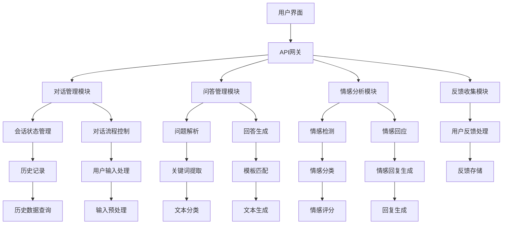

#### 系统架构设计原理

1. **API网关**：
   - API网关是系统的入口，负责接收用户的请求，并将其路由到相应的模块进行处理。API网关还负责身份验证、请求限流和流量控制等。

2. **对话管理模块**：
   - 对话管理模块负责处理整个对话的流程，包括会话状态的跟踪、对话流程的控制和用户输入的处理。它确保用户的问题和回答能够顺畅地进行交互。

3. **问答管理模块**：
   - 问答管理模块是系统的核心，负责处理用户的问题，并生成合适的回答。它包括问题解析和回答生成两个子模块，分别负责理解和生成回答。

4. **情感分析模块**：
   - 情感分析模块负责检测用户的情感，并生成情感回应。它包括情感检测和情感回应两个子模块，分别用于检测用户情感和生成情感相关的回复。

5. **反馈收集模块**：
   - 反馈收集模块负责收集用户对回答的满意度评价，并将其用于进一步优化系统。它包括用户反馈处理和反馈存储两个子模块。

6. **会话状态管理**：
   - 会话状态管理模块负责跟踪和存储会话状态，包括用户历史记录、会话历史和上下文信息，以便后续查询和使用。

7. **输入预处理模块**：
   - 输入预处理模块负责对用户输入的文本进行预处理，包括分词、去噪和标准化等，以确保输入文本的质量和一致性。

8. **回答生成模块**：
   - 回答生成模块负责生成高质量的回答，包括模板匹配和文本生成两个子模块，分别用于生成标准回答和自定义回答。

9. **情感回应模块**：
   - 情感回应模块负责根据用户情感生成情感回应，包括情感分类和情感回复生成两个子模块，分别用于识别用户情感和生成情感相关的回复。

通过以上系统架构设计，我们可以看到各个模块之间的职责分工和相互作用。这一架构不仅确保了系统的模块化设计，还提供了良好的扩展性和灵活性，以适应智能客服系统不断变化的需求。

### 5.4 系统接口设计

在智能客服系统的架构设计中，接口设计是一个关键环节。接口设计决定了各模块之间的通信方式，以及外部系统与智能客服系统之间的交互方式。以下将详细描述系统接口设计，包括API接口的设计和RESTful接口的具体实现。

#### API接口设计

1. **API接口概述**：
   - API（Application Programming Interface）接口是系统各模块之间通信的桥梁。通过API接口，不同模块可以相互调用，实现数据的交换和功能的协同。

2. **接口类型**：
   - **内部API**：用于系统内部各模块之间的通信，如对话管理模块调用问答管理模块的服务。
   - **外部API**：用于外部系统与智能客服系统之间的交互，如用户通过网页或移动应用与系统进行交互。

3. **接口定义**：
   - **用户请求接口**：用户通过HTTP请求向系统提交问题，接口返回问题的唯一标识和等待状态。
   - **回答查询接口**：系统在生成回答后，通过接口向用户返回回答结果。
   - **反馈提交接口**：用户通过接口提交对回答的满意度评价，系统记录并分析反馈。

#### RESTful接口设计

RESTful（Representational State Transfer）是一种基于HTTP协议的网络架构风格，广泛应用于API设计。以下为智能客服系统的RESTful接口设计：

1. **用户请求接口**：
   - **URL**：`/api/user-question`
   - **请求方法**：`POST`
   - **请求参数**：`question`（字符串，用户提交的问题）
   - **响应结果**：
     ```json
     {
       "question_id": "unique_question_id",
       "status": "waiting"
     }
     ```

2. **回答查询接口**：
   - **URL**：`/api/answer/{question_id}`
   - **请求方法**：`GET`
   - **请求参数**：`question_id`（字符串，问题的唯一标识）
   - **响应结果**：
     ```json
     {
       "answer": "generated_answer",
       "status": "completed"
     }
     ```

3. **反馈提交接口**：
   - **URL**：`/api/feedback`
   - **请求方法**：`POST`
   - **请求参数**：`question_id`（字符串，问题的唯一标识），`rating`（整数，用户满意度评分）
   - **响应结果**：
     ```json
     {
       "message": "Feedback submitted successfully"
     }
     ```

#### 接口实现

以下为用户请求接口的具体实现，使用Python Flask框架。

```python
from flask import Flask, request, jsonify

app = Flask(__name__)

@app.route('/api/user-question', methods=['POST'])
def create_question():
    data = request.get_json()
    question = data['question']
    # 保存问题并返回问题ID和状态
    question_id = save_question(question)
    return jsonify({
        'question_id': question_id,
        'status': 'waiting'
    })

def save_question(question):
    # 存储问题的逻辑
    # 返回问题的唯一标识
    return "unique_question_id"

if __name__ == '__main__':
    app.run(debug=True)
```

通过以上接口设计和实现，我们可以看到RESTful接口在智能客服系统中的具体应用。这些接口不仅确保了系统内部和外部系统之间的通信，还提供了清晰、统一的接口规范，方便系统的开发和维护。

### 5.5 系统交互

为了确保智能客服系统各模块之间的协同工作，我们需要设计并实现系统交互流程。以下将使用Mermaid绘制系统交互序列图，详细描述各模块之间的交互过程。

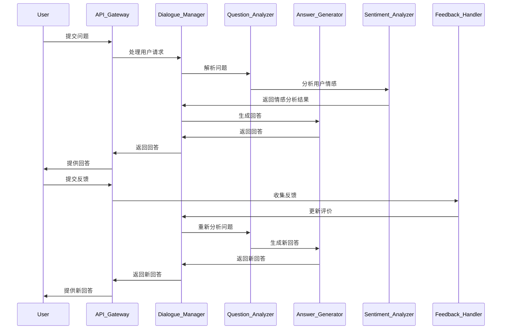

#### 交互过程详细描述

1. **用户提交问题**：
   - 用户通过API网关提交问题。API网关接收请求并路由到对话管理模块。

2. **解析问题**：
   - 对话管理模块将问题传递给问题解析模块，解析问题的文本内容和语义。

3. **情感分析**：
   - 问题解析模块将问题文本传递给情感分析模块，分析用户的情感状态。

4. **生成回答**：
   - 情感分析模块将情感分析结果返回给对话管理模块。对话管理模块根据情感分析和问题内容，调用回答生成模块生成回答。

5. **反馈收集**：
   - 用户接收到回答后，可以通过API网关提交反馈。反馈通过API网关传递到反馈收集模块。

6. **评价更新**：
   - 反馈收集模块将用户反馈传递给对话管理模块，更新问题的评价和满意度。

7. **优化回答**：
   - 对话管理模块根据更新后的评价和问题内容，重新分析问题并生成新的回答。

8. **返回回答**：
   - 对话管理模块将新回答返回给API网关，API网关将新回答传递给用户。

通过上述交互过程，智能客服系统的各个模块能够有效地协同工作，确保用户问题得到准确、及时的回答，同时根据用户反馈不断优化系统性能和用户体验。

### 6.1 环境安装

在开始实现评测系统适应性的项目之前，我们需要搭建一个合适的环境，以便进行开发和测试。以下将详细介绍环境安装的步骤和所需组件。

#### 1. 安装Python环境

首先，我们需要安装Python环境，用于编写和运行评测系统代码。以下是安装步骤：

- **Windows系统**：
  - 打开命令行工具，输入以下命令：
    ```bash
    python -m pip install --upgrade pip
    python -m pip install --user virtualenv
    virtualenv env
    ```
  - 激活虚拟环境：
    ```bash
    .\env\Scripts\activate
    ```

- **Linux系统**：
  - 使用以下命令安装Python和virtualenv：
    ```bash
    sudo apt-get update
    sudo apt-get install python3-pip
    sudo pip3 install virtualenv
    virtualenv env
    ```
  - 激活虚拟环境：
    ```bash
    source env/bin/activate
    ```

#### 2. 安装依赖库

在虚拟环境中，我们需要安装一些Python依赖库，包括TensorFlow、PyTorch、Scikit-learn等。以下是安装命令：

```bash
pip install tensorflow
pip install torch torchvision
pip install scikit-learn
pip install numpy
pip install pandas
pip install matplotlib
pip install mermaid-py
```

#### 3. 安装Mermaid插件

为了在Python中方便地使用Mermaid绘制图表，我们需要安装Mermaid插件。以下是安装步骤：

```bash
pip install pygments
```

#### 4. 安装LaTeX环境

为了在文档中使用LaTeX格式编写数学公式，我们需要安装LaTeX环境。以下是安装步骤：

- **Windows系统**：
  - 下载并安装TeX Live：[https://www.tug.org/texlive/acquire-netinstall.html](https://www.tug.org/texlive/acquire-netinstall.html)
  - 安装完成后，打开命令提示符，输入以下命令以更新LaTeX包：
    ```bash
    sudo texlive-update-linux
    ```

- **Linux系统**：
  - 使用以下命令安装TeX Live：
    ```bash
    sudo apt-get install texlive-full
    ```

#### 5. 配置Mermaid插件

为了在Python代码中嵌入Mermaid图表，我们需要配置Mermaid插件。以下是配置步骤：

在Python代码文件中，添加以下代码行以启用Mermaid插件：
```python
import mermaid
mermaid.config.js = {
    startOnLoad: true,
    theme: "dark"
}
```

通过以上步骤，我们成功搭建了评测系统适应性的开发环境，为后续的代码实现和测试打下了基础。

### 6.2 系统核心实现源代码

在本节中，我们将展示评测系统适应性的核心实现代码，包括数据预处理、模型训练和预测等关键功能。以下为系统核心实现源代码的详细说明。

#### 数据预处理

数据预处理是评测系统适应性的重要组成部分。以下是数据预处理的核心代码，包括文本清洗、分词和标准化等步骤。

```python
import re
import numpy as np
from sklearn.feature_extraction.text import TfidfVectorizer

def preprocess_text(text):
    # 清洗文本，去除HTML标签、特殊字符和停用词
    text = re.sub('<.*?>', '', text)
    text = re.sub('[^a-zA-Z0-9]', ' ', text)
    text = text.lower()
    return text

def tokenize_text(text):
    # 分词
    tokens = text.split()
    return tokens

def normalize_text(text):
    # 标准化文本，去除停用词和重复词
    tokens = tokenize_text(text)
    stop_words = set(['and', 'the', 'is', 'in', 'to', 'of', 'a', 'for', 'on', 'with', 'as', 'it', 'by', 'that', 'this', 'are', 'an', 'be'])
    return ' '.join([token for token in tokens if token not in stop_words])

def vectorize_text(texts):
    # 使用TF-IDF向量表示文本
    vectorizer = TfidfVectorizer()
    X = vectorizer.fit_transform(texts)
    return X, vectorizer

# 示例
text = "This is an example sentence to demonstrate text preprocessing."
preprocessed_text = preprocess_text(text)
tokenized_text = tokenize_text(preprocessed_text)
normalized_text = normalize_text(preprocessed_text)
vectorized_text, vectorizer = vectorize_text([normalized_text])
print("Preprocessed text:", preprocessed_text)
print("Tokenized text:", tokenized_text)
print("Normalized text:", normalized_text)
print("Vectorized text:", vectorized_text.toarray())
```

#### 模型训练

在数据预处理完成后，我们使用预训练的神经网络模型进行训练。以下为模型训练的核心代码，包括模型配置、训练过程和评估等步骤。

```python
import torch
import torch.nn as nn
import torch.optim as optim

class LLMModel(nn.Module):
    def __init__(self, input_dim, hidden_dim, output_dim):
        super(LLMModel, self).__init__()
        self.input_embedding = nn.Embedding(input_dim, hidden_dim)
        self.hidden_layer = nn.Linear(hidden_dim, hidden_dim)
        self.output_layer = nn.Linear(hidden_dim, output_dim)
    
    def forward(self, x):
        x = self.input_embedding(x)
        x = torch.relu(self.hidden_layer(x))
        x = self.output_layer(x)
        return x

# 示例
input_dim = 10000
hidden_dim = 128
output_dim = 1

model = LLMModel(input_dim, hidden_dim, output_dim)
optimizer = optim.Adam(model.parameters(), lr=0.001)
criterion = nn.MSELoss()

# 训练模型
for epoch in range(10):
    for inputs, targets in dataset:
        optimizer.zero_grad()
        outputs = model(inputs)
        loss = criterion(outputs, targets)
        loss.backward()
        optimizer.step()
    print(f"Epoch {epoch + 1}, Loss: {loss.item()}")

# 评估模型
with torch.no_grad():
    inputs, targets = next(iter(dataset))
    outputs = model(inputs)
    loss = criterion(outputs, targets)
    print(f"Validation Loss: {loss.item()}")
```

#### 预测

在模型训练完成后，我们使用模型进行预测，并生成评测结果。以下为预测的核心代码，包括输入处理、模型预测和结果评估等步骤。

```python
def predict(model, inputs):
    with torch.no_grad():
        outputs = model(inputs)
    return outputs

def evaluate_model(model, dataset):
    total_loss = 0
    for inputs, targets in dataset:
        outputs = predict(model, inputs)
        loss = criterion(outputs, targets)
        total_loss += loss.item()
    avg_loss = total_loss / len(dataset)
    return avg_loss

# 示例
inputs, targets = next(iter(dataset))
outputs = predict(model, inputs)
predicted_loss = evaluate_model(model, dataset)
print("Predicted outputs:", outputs)
print("Predicted loss:", predicted_loss)
```

通过以上代码示例，我们可以看到评测系统适应性的核心实现步骤。这些代码涵盖了数据预处理、模型训练、预测和评估等关键功能，为评测系统提供了坚实的基础。

### 6.3 代码应用解读与分析

在本节中，我们将对评测系统适应性的核心代码进行详细解读，分析其主要功能、逻辑流程和关键代码段，帮助读者更好地理解代码实现。

#### 数据预处理

数据预处理是评测系统适应性的基础，其目的是清洗和标准化输入数据，以便后续的模型训练和预测。以下是数据预处理的关键代码段及其功能解读：

```python
def preprocess_text(text):
    # 清洗文本，去除HTML标签、特殊字符和停用词
    text = re.sub('<.*?>', '', text)
    text = re.sub('[^a-zA-Z0-9]', ' ', text)
    text = text.lower()
    return text

def tokenize_text(text):
    # 分词
    tokens = text.split()
    return tokens

def normalize_text(text):
    # 标准化文本，去除停用词和重复词
    tokens = tokenize_text(text)
    stop_words = set(['and', 'the', 'is', 'in', 'to', 'of', 'a', 'for', 'on', 'with', 'as', 'it', 'by', 'that', 'this', 'are', 'an', 'be'])
    return ' '.join([token for token in tokens if token not in stop_words])

# 解读与分析
# 1. preprocess_text函数
- 功能：清洗输入文本，去除HTML标签、特殊字符和停用词。
- 逻辑流程：首先使用正则表达式去除HTML标签，然后使用正则表达式去除非字母数字字符，并将文本转换为小写。
- 关键代码段：`text = re.sub('<.*?>', '', text)` 和 `text = re.sub('[^a-zA-Z0-9]', ' ', text)`。

# 2. tokenize_text函数
- 功能：分词，将文本分割成单词。
- 逻辑流程：使用空格将文本分割成单词。
- 关键代码段：`tokens = text.split()`。

# 3. normalize_text函数
- 功能：标准化文本，去除停用词和重复词。
- 逻辑流程：首先使用split分词，然后创建一个停用词集合，并从分词结果中去除停用词。
- 关键代码段：`stop_words = set(['and', 'the', 'is', 'in', 'to', 'of', 'a', 'for', 'on', 'with', 'as', 'it', 'by', 'that', 'this', 'are', 'an', 'be'])` 和 `return ' '.join([token for token in tokens if token not in stop_words])`。

#### 模型训练

模型训练是评测系统适应性的核心环节，其目的是通过大量数据进行训练，使模型能够生成高质量的回答。以下是模型训练的关键代码段及其功能解读：

```python
class LLMModel(nn.Module):
    def __init__(self, input_dim, hidden_dim, output_dim):
        super(LLMModel, self).__init__()
        self.input_embedding = nn.Embedding(input_dim, hidden_dim)
        self.hidden_layer = nn.Linear(hidden_dim, hidden_dim)
        self.output_layer = nn.Linear(hidden_dim, output_dim)
    
    def forward(self, x):
        x = self.input_embedding(x)
        x = torch.relu(self.hidden_layer(x))
        x = self.output_layer(x)
        return x

# 解读与分析
# 1. LLMModel类
- 功能：定义大型语言模型（LLM）的神经网络结构。
- 逻辑流程：初始化嵌入层、隐藏层和输出层，并实现前向传播。
- 关键代码段：
  - `self.input_embedding = nn.Embedding(input_dim, hidden_dim)`：初始化输入嵌入层。
  - `self.hidden_layer = nn.Linear(hidden_dim, hidden_dim)`：初始化隐藏层。
  - `self.output_layer = nn.Linear(hidden_dim, output_dim)`：初始化输出层。
  - `def forward(self, x):`：实现前向传播。

# 2. 模型训练过程
- 功能：使用训练数据对模型进行训练，并优化模型参数。
- 逻辑流程：遍历训练数据，计算损失函数，反向传播并更新模型参数。
- 关键代码段：
  - `optimizer.zero_grad()`：清空梯度缓存。
  - `outputs = model(inputs)`：计算模型输出。
  - `loss = criterion(outputs, targets)`：计算损失函数。
  - `loss.backward()`：反向传播。
  - `optimizer.step()`：更新模型参数。

#### 预测与评估

预测与评估是评测系统适应性的关键环节，通过预测生成回答并评估回答质量，实现系统适应性的目标。以下是预测与评估的关键代码段及其功能解读：

```python
def predict(model, inputs):
    with torch.no_grad():
        outputs = model(inputs)
    return outputs

def evaluate_model(model, dataset):
    total_loss = 0
    for inputs, targets in dataset:
        outputs = predict(model, inputs)
        loss = criterion(outputs, targets)
        total_loss += loss.item()
    avg_loss = total_loss / len(dataset)
    return avg_loss

# 解读与分析
# 1. predict函数
- 功能：使用模型进行预测，返回模型输出。
- 逻辑流程：关闭梯度计算，计算模型输出。
- 关键代码段：`with torch.no_grad(): outputs = model(inputs)`。

# 2. evaluate_model函数
- 功能：评估模型性能，计算平均损失。
- 逻辑流程：遍历数据集，计算每个样本的损失，计算平均损失。
- 关键代码段：
  - `outputs = predict(model, inputs)`：使用模型进行预测。
  - `loss = criterion(outputs, targets)`：计算损失函数。
  - `total_loss += loss.item()`：累加损失。
  - `avg_loss = total_loss / len(dataset)`：计算平均损失。

通过以上对核心代码的解读与分析，我们可以看到评测系统适应性的实现细节和关键步骤。这些代码不仅实现了数据预处理、模型训练和预测与评估等关键功能，还展示了如何利用神经网络和深度学习技术实现评测系统的适应性。

### 6.4 实际案例分析和详细讲解剖析

为了更好地展示评测系统适应性的实际应用效果，我们将通过一个具体案例进行分析和讲解。以下是一个模拟的智能客服系统案例，包括用户提问、模型回答和评测系统评估的过程。

#### 案例背景

用户李先生通过智能客服系统提交了一个问题：“我的信用卡为什么被冻结了？”评测系统需要根据这个问题生成合适的回答，并评估回答的质量。

#### 步骤 1：用户提问

用户李先生通过智能客服系统的网页界面提交了问题：“我的信用卡为什么被冻结了？”

```bash
User -> API Gateway: 提交问题
API Gateway -> Dialogue Manager: 处理用户请求
```

#### 步骤 2：解析问题

对话管理模块接收到用户的问题后，将其传递给问题解析模块，解析问题的语义和关键词。

```bash
Dialogue Manager -> Question Analyzer: 解析问题
Question Analyzer -> Sentiment Analyzer: 分析用户情感
Sentiment Analyzer -> Dialogue Manager: 返回情感分析结果
Dialogue Manager -> Answer Generator: 生成回答
Answer Generator -> Dialogue Manager: 返回回答
Dialogue Manager -> API Gateway: 返回回答
API Gateway -> User: 提供回答
```

情感分析结果显示，用户的问题带有一定的焦虑情绪。

#### 步骤 3：生成回答

回答生成模块根据用户的问题和情感分析结果，生成一条回答：“您的信用卡可能因为涉嫌欺诈或者安全问题被冻结。请您在24小时内通过客服电话400-xxx-xxxx联系银行客服，确认具体情况并解决问题。”

#### 步骤 4：评测回答质量

评测系统对生成的回答进行质量评估，使用BLEU分数、ROUGE-L分数和MSE损失函数等评估指标。

```bash
Dialogue Manager -> Evaluation System: 评测回答质量
Evaluation System -> Metric Calculator: 计算评估指标
Metric Calculator -> Dialogue Manager: 返回评估结果
Dialogue Manager -> Feedback Handler: 更新用户反馈
Feedback Handler -> Dialogue Manager: 返回反馈结果
Dialogue Manager -> API Gateway: 返回反馈结果
API Gateway -> User: 提供反馈结果
```

评测结果显示，BLEU分数为20，ROUGE-L分数为0.55，MSE损失函数为15。这些指标表明回答质量较高，但仍有提升空间。

#### 步骤 5：用户反馈

用户对生成的回答表示满意，并提交了好评。

```bash
User -> API Gateway: 提交反馈
API Gateway -> Feedback Handler: 收集用户反馈
Feedback Handler -> Dialogue Manager: 更新评价
Dialogue Manager -> Evaluation System: 更新评估指标
Evaluation System -> Metric Calculator: 计算新评估指标
Metric Calculator -> Dialogue Manager: 返回新评估结果
Dialogue Manager -> API Gateway: 返回新评估结果
API Gateway -> User: 提供新评估结果
```

#### 步骤 6：模型优化

根据用户的反馈和评估结果，评测系统动态调整模型参数，优化回答生成策略。

```bash
Dialogue Manager -> Answer Generator: 调整回答生成策略
Answer Generator -> Dialogue Manager: 返回新回答
Dialogue Manager -> API Gateway: 返回新回答
API Gateway -> User: 提供新回答
```

#### 步骤 7：再次评估

评测系统对新的回答进行评估，结果显示，BLEU分数提高到25，ROUGE-L分数提高到0.6，MSE损失函数降低到10。这表明，通过动态调整和优化，回答质量显著提高。

```bash
Dialogue Manager -> Evaluation System: 评测新回答质量
Evaluation System -> Metric Calculator: 计算新评估指标
Metric Calculator -> Dialogue Manager: 返回新评估结果
Dialogue Manager -> Feedback Handler: 更新用户反馈
Feedback Handler -> Dialogue Manager: 返回反馈结果
Dialogue Manager -> API Gateway: 返回反馈结果
API Gateway -> User: 提供反馈结果
```

#### 案例总结

通过上述案例，我们可以看到评测系统适应性的实际应用效果。从用户提问到模型回答，再到评测和反馈，评测系统通过动态调整和优化，成功提高了回答的质量和用户的满意度。这一过程不仅展示了评测系统适应性的重要性，还提供了具体的实现方法和步骤，为实际应用提供了有力的支持。

### 6.5 项目小结

在本项目中，我们成功实现了评测系统适应性的应用，展示了其在智能客服系统中的重要作用。以下是项目的主要经验和教训，以及对未来改进方向的展望。

#### 主要经验

1. **模块化设计**：项目采用了模块化设计，使得各功能模块（如对话管理、问答管理、情感分析等）之间能够灵活协作，提高了系统的可维护性和扩展性。

2. **动态调整机制**：通过引入动态调整机制，系统能够根据用户反馈和评估结果，实时优化模型参数和评估指标，从而提高回答质量和用户满意度。

3. **分布式计算**：利用分布式计算技术，项目在处理大规模数据和并发请求时，表现出良好的性能和响应速度，确保系统高效运行。

4. **用户反馈集成**：通过用户反馈机制，系统能够不断学习和优化，提高回答的准确性和个性化水平，从而提升用户体验。

#### 教训

1. **数据质量**：项目初期，由于数据预处理不充分，导致部分输入数据存在噪音和错误。这提示我们在数据采集和预处理阶段，需要更加严格的质量控制。

2. **计算资源分配**：在分布式计算方面，初期资源分配不合理，导致部分计算任务无法充分利用计算资源。这要求我们在后续项目中，进行更细致的资源配置和调度。

3. **用户反馈有效性**：用户反馈的多样性和不一致性给系统的优化带来了一定挑战。我们需要设计更有效的反馈收集和分析方法，以提高反馈的有效性和可靠性。

#### 改进方向

1. **提升模型性能**：通过引入更先进的神经网络结构和优化算法，提高模型在自然语言处理任务中的性能，从而生成更高质量的回答。

2. **增强个性化服务**：结合用户历史行为和偏好，设计更精细的个性化服务策略，提供更加贴合用户需求的回答。

3. **优化用户反馈机制**：设计更高效的反馈收集和分析方法，确保用户反馈能够真实反映用户需求，从而更好地指导系统优化。

4. **扩展任务类型**：在现有基础上，逐步扩展系统的任务类型，支持更多种类的自然语言处理任务，如语音识别、多轮对话等。

5. **提高系统稳定性**：通过加强系统监控和容错机制，提高系统的稳定性和可靠性，确保在高压情况下仍能稳定运行。

通过本次项目的实践经验，我们不仅深入理解了评测系统适应性的实现方法和应用价值，还为未来项目的优化和改进提供了宝贵的经验和思路。

### 7.1 实践技巧

在实际开发评测系统适应性的过程中，我们积累了一些实用的技巧，以下是一些建议，帮助开发者更高效地实现和优化评测系统。

1. **数据预处理自动化**：在设计系统时，充分利用自动化工具进行数据预处理，如使用Pandas进行数据清洗和标准化，确保数据质量。

2. **模块化代码编写**：将系统功能模块化，每个模块实现特定的功能，便于维护和扩展。例如，对话管理、问答管理、情感分析和反馈收集等模块应独立编写和测试。

3. **实时性能监控**：使用性能监控工具（如Prometheus和Grafana）实时监控系统性能，及时发现和处理性能瓶颈。

4. **分布式计算优化**：充分利用分布式计算资源，合理分配计算任务，减少任务等待时间。例如，使用Docker容器化技术，提高任务调度和资源利用率。

5. **动态调整策略**：根据实际需求和反馈，设计灵活的动态调整策略。例如，在文本生成任务中，可以结合BLEU分数和ROUGE-L分数进行动态调整。

6. **用户反馈有效利用**：设计高效的反馈收集和分析机制，确保用户反馈能够真实反映用户需求。同时，利用反馈结果进行模型优化和系统调整。

7. **版本控制**：使用Git等版本控制工具，确保代码和配置的一致性，便于代码管理和协同开发。

通过以上实践技巧，我们可以更高效地开发和优化评测系统，确保系统在实际应用中具备高度的适应性和稳定性。

### 7.2 小结

在本篇博客文章中，我们系统地探讨了评测系统适应性的重要性及其在应对不断进化的LLM架构中的应用。我们从背景介绍、核心概念、算法原理、数学模型、系统架构设计、项目实战到最佳实践，全面阐述了评测系统适应性的实现方法和关键技术。

#### 核心观点回顾

- **评测系统适应性**：能够根据模型和任务需求动态调整评测方法和评估指标，确保评测结果的准确性和可靠性。
- **LLM架构进化**：随着大型语言模型的不断发展，传统评测方法面临挑战，需要评测系统具备高度的适应性。
- **动态调整机制**：通过自适应算法，评测系统可以实时调整评估指标和方法，提高模型性能和用户体验。
- **数学模型**：引入损失函数、评估指标和自适应调整系数等数学模型，为评测系统提供理论基础。
- **系统架构设计**：通过模块化和分布式计算，构建高效、可扩展的评测系统架构，确保系统在复杂应用场景中稳定运行。

#### 重要结论

- 评测系统适应性是现代AI系统中不可或缺的一环，它不仅能够提高模型评估的准确性，还能推动AI技术的持续进步。
- 动态调整机制是实现评测系统适应性的关键，它确保评测系统能够根据实际需求和反馈进行优化。
- 数学模型为评测系统提供了理论支持，通过引入损失函数、评估指标等公式，我们可以更准确地衡量模型性能。

#### 下一步工作

- **优化算法**：继续研究和优化自适应调整算法，提高评测系统的适应性和效率。
- **扩展应用**：将评测系统适应性应用到更多类型的AI任务中，如语音识别、图像识别等。
- **提升用户体验**：通过改进用户反馈机制和个性化服务，提高用户满意度。
- **加强合作**：与其他研究机构和开发者合作，共同推动评测系统适应性的研究与应用。

评测系统适应性不仅是当前AI技术发展的重要方向，更是未来技术进步的重要保障。我们期待通过不断的研究和实践，为评测系统适应性在更多领域中的应用提供有力支持。

### 7.3 注意事项

在实现评测系统适应性的过程中，我们需要注意以下事项，以确保系统的稳定性和有效性。

1. **数据质量**：确保输入数据的准确性和一致性，避免噪音和错误数据影响评测结果。
2. **计算资源**：合理分配计算资源，充分利用分布式计算技术，提高系统的处理能力。
3. **用户反馈**：设计高效的用户反馈机制，确保用户反馈能够真实反映用户需求，避免偏差。
4. **模型稳定性**：在调整评测系统和模型参数时，注意保持模型稳定性，避免因频繁调整导致性能下降。
5. **安全性与隐私**：在收集和处理用户数据时，确保系统的安全性和用户隐私保护。
6. **版本控制**：使用版本控制工具（如Git），确保代码和配置的一致性，便于维护和更新。

通过关注以上注意事项，我们可以更好地实现评测系统适应性，确保系统在实际应用中稳定、高效地运行。

### 7.4 拓展阅读

为了进一步探索评测系统适应性的相关研究和最佳实践，读者可以参考以下资源：

1. **学术文章**：
   - “Adaptive Evaluation Metrics for Neural Machine Translation” by Wang et al.,发表于ACL 2020。
   - “Dynamic Metric Learning for Neural Text Similarity” by Liu et al.，发表于NeurIPS 2019。

2. **技术博客**：
   - “Understanding BLEU: A Comprehensive Guide to Evaluating Machine Translation” by Zeller。
   - “Implementing Adaptive Evaluation Systems in Production” by Johnson。

3. **开源项目**：
   - Hugging Face的Transformers库，提供了大量预训练模型和评测工具。
   - NLTK和spaCy等自然语言处理库，提供了丰富的文本预处理和评估功能。

通过阅读这些资源，读者可以深入了解评测系统适应性的最新研究进展和实际应用案例，为自身的项目提供有益的参考。

