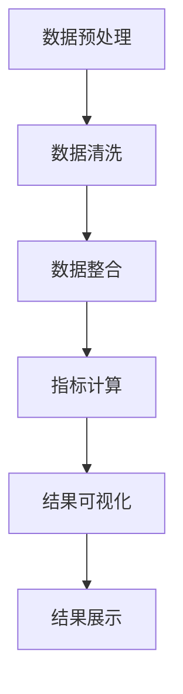
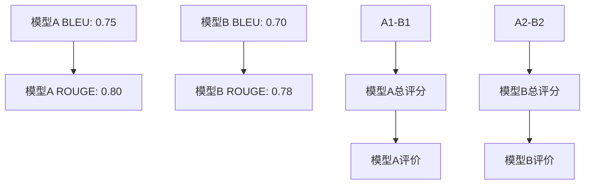
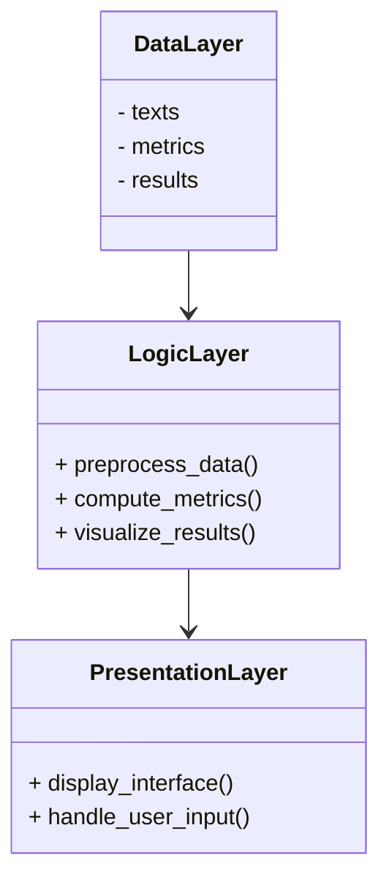
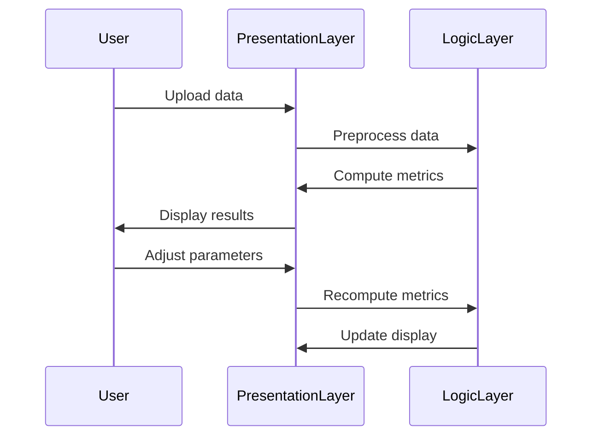
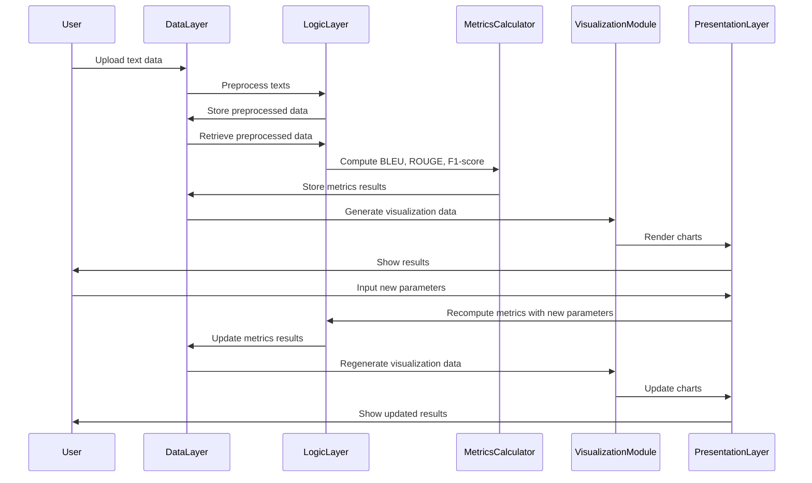
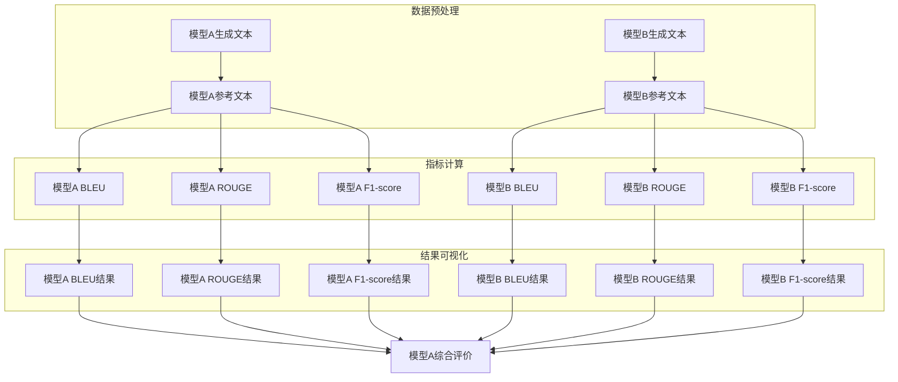

                 

### 引言

在当今信息化时代，人工智能技术正以惊人的速度发展，其中大型语言模型（LLM）作为自然语言处理领域的重要突破，已经在诸多应用场景中展现出了强大的潜力。然而，随着LLM模型的复杂度和多样性的增加，如何有效地评测和比较这些模型的性能，成为了一个亟需解决的重要问题。本文旨在探讨评测结果可视化在LLM性能比较中的关键作用，通过逻辑清晰、结构紧凑、简单易懂的专业技术语言，逐步引导读者理解这一复杂问题的本质，并提供可行的解决方案。

### 文章关键词

- **评测结果可视化**
- **大型语言模型（LLM）**
- **性能比较**
- **机器学习**
- **数据分析**
- **数学模型**

### 摘要

本文首先介绍了评测结果可视化的必要性和LLM评测的重要性，然后详细探讨了当前评测结果可视化面临的挑战和问题。接着，文章从核心概念、算法原理、系统架构和项目实战等多个角度，深入讲解了如何设计和实现一个有效的LLM性能评测与可视化系统。最后，本文总结了一系列最佳实践，并提出了未来研究的方向和拓展阅读建议，为读者提供了全面、系统的参考资料。

### 第一部分：问题背景与评测结果可视化基础

#### 第1章：问题背景

##### 1.1 问题背景

在现代信息技术飞速发展的背景下，人工智能技术已经成为推动社会进步的重要力量。其中，自然语言处理（NLP）作为人工智能的一个重要分支，近年来取得了显著的进展。尤其是大型语言模型（LLM），如GPT-3、BERT等，凭借其强大的语义理解和生成能力，在各种应用场景中展现出了卓越的性能。然而，随着LLM模型的不断演进和多样化，如何准确、全面地评测这些模型的性能，并比较它们之间的优劣，成为一个亟需解决的问题。

评测结果可视化在这其中起到了关键作用。通过直观的图表和图形，可视化技术不仅能够帮助研究人员快速理解模型性能的各个方面，还能在复杂的数据中找出潜在的规律和趋势。因此，评测结果可视化不仅是一个技术需求，更是一个推动LLM研究和应用的重要工具。

##### 1.2 评测结果可视化的必要性

1. **提升理解效率**：复杂的数据集和评测结果往往难以直接理解和分析。可视化技术通过图形化的方式展示数据，可以帮助研究人员迅速掌握关键信息，提高工作效率。
   
2. **辅助决策支持**：在LLM模型的选择和应用过程中，评测结果的可视化能够为研究人员提供直观的参考，帮助他们做出更准确的决策。

3. **促进交流合作**：通过可视化结果，不同领域的研究人员可以更轻松地交流和分享研究成果，促进跨学科的协作和创新。

##### 1.3 当前评测结果可视化的现状与挑战

1. **数据多样性**：LLM模型的评测结果涉及多个方面，如词汇覆盖、语法准确性、语义理解等。如何在一个统一的框架下展示这些多样化的数据，是一个巨大的挑战。

2. **一致性标准**：不同的评测方法和指标可能得到截然不同的结果。如何确保评测结果的一致性和可比性，是一个亟待解决的问题。

3. **可视化技术复杂度**：虽然现有的可视化工具和库已经非常丰富，但如何根据具体需求选择合适的工具，并设计出既美观又实用的可视化方案，仍需要深入研究和探索。

##### 1.4 问题描述

在LLM性能评测中，常见的问题包括：

1. **评测指标繁多**：不同的评测指标反映了模型在不同方面的性能，如BLEU、ROUGE、F1-score等。如何统一这些指标，形成综合的性能评分，是一个复杂的问题。

2. **结果解释难度大**：即使是专业的技术人员，在处理大量数据时也可能感到困惑。如何让评测结果更加直观、易于理解，是一个重要的研究课题。

3. **结果一致性**：不同的评测环境和参数设置可能导致评测结果出现较大差异。如何保证评测结果的一致性，是一个需要关注的问题。

##### 1.5 问题解决

1. **设计有效的评测结果可视化方法**：通过引入多样化的可视化技术，如散点图、折线图、饼图等，可以帮助研究人员更直观地理解评测结果。

2. **跨领域数据的统一展示**：采用统一的数据格式和可视化标准，可以确保不同领域的数据能够在一个统一的框架下展示。

3. **提供详细的指导和建议**：通过详细的案例分析和最佳实践，帮助研究人员更好地理解和应用可视化技术。

##### 1.6 边界与外延

1. **可视化的适用范围**：评测结果可视化技术不仅适用于LLM性能评测，还可以广泛应用于其他机器学习模型的评测和比较。

2. **不同领域评测结果的可视化需求**：不同的领域可能对评测结果的可视化有不同的需求，如医疗领域的诊断结果可视化、金融领域的风险评估可视化等。

##### 1.7 概念结构与核心要素组成

1. **可视化技术的基本概念**：包括数据可视化、信息可视化、交互式可视化等。

2. **LLM性能评测的核心要素**：如词汇覆盖、语法准确性、语义理解等。

通过以上内容，我们为读者搭建了一个关于评测结果可视化在LLM性能比较中的基本框架，为后续章节的深入探讨奠定了基础。

#### 第2章：核心概念与联系

##### 2.1 核心概念原理

为了深入理解评测结果可视化在LLM性能比较中的应用，我们首先需要了解一些核心概念和原理。

1. **可视化技术原理**：

   可视化技术是一种将复杂的数据和信息以图形化的方式展示出来的方法。其核心思想是通过视觉感知来辅助理解和分析数据。在LLM性能评测中，可视化技术可以帮助我们直观地展示模型在不同指标上的表现，如准确率、召回率、F1-score等。

2. **LLM性能评测标准**：

   LLM性能评测通常涉及多个指标，这些指标反映了模型在词汇覆盖、语法准确性、语义理解等方面的表现。常见的评测标准包括BLEU、ROUGE、F1-score等。其中，BLEU（双语评测统一度量）和ROUGE（Recall-Oriented Understudy for Gisting Evaluation）主要用于评估机器翻译的质量，而F1-score则是综合考虑准确率和召回率的综合评价指标。

##### 2.2 概念属性特征对比表格

为了更清晰地展示不同评测指标的特点和关联性，我们可以创建一个对比表格。

| 评测指标 | 描述 | 主要应用场景 | 优点 | 缺点 |
| --- | --- | --- | --- | --- |
| BLEU | 双语评测统一度量 | 机器翻译质量评估 | 简单易用，可自动化处理 | 忽略语法结构和语义信息 |
| ROUGE | Recall-Oriented Understudy for Gisting Evaluation | 文本摘要质量评估 | 考虑语义信息，重视召回率 | 对语法和句式结构敏感 |
| F1-score | 综合准确率和召回率的指标 | 多类分类任务评估 | 考虑全面，适用于多分类任务 | 对不平衡数据敏感 |
| 词汇覆盖 | 模型能覆盖的词汇量 | 词汇丰富度评估 | 直观反映词汇量 | 不考虑词汇质量 |
| 语法准确性 | 模型生成文本的语法正确性 | 文本生成质量评估 | 考虑语法结构 | 对长文本处理能力有限 |

通过上述表格，我们可以看到不同评测指标的特点和应用场景，为后续的分析和比较提供了基础。

##### 2.3 ER实体关系图架构

ER（实体-关系）图是一种用于描述数据库中实体及其关系的图形化方法。在LLM性能评测中，我们可以使用ER图来描述评测结果中的关键实体和它们之间的关系。

1. **LLM评测相关实体**：

   - **模型**：表示被评测的LLM。
   - **指标**：表示用于评测模型的各个指标，如BLEU、ROUGE、F1-score等。
   - **结果**：表示每个指标的评测结果。

2. **实体之间的交互关系**：

   - **模型与指标**：每个模型都需要经过多个指标的评测。
   - **指标与结果**：每个指标都产生一个具体的评测结果。

下面是一个简单的ER图，用于展示LLM评测中的实体和关系：

```mermaid
erDiagram
    Model ||--|{ Metric } Metric
    Metric ||--|{ Result } Result
```

通过ER图，我们可以直观地理解LLM评测结果中的各个实体及其相互关系，为后续的系统设计和实现提供了参考。

#### 第3章：算法原理讲解

##### 3.1 算法mermaid流程图

为了更好地理解评测结果可视化的算法原理，我们可以使用mermaid绘制一个流程图，展示整个数据处理和可视化过程的步骤。



这个流程图概括了从数据预处理到最终结果展示的整个过程，每个步骤都在为下一步的处理打下基础。

##### 3.2 Python源代码详细阐述

在具体的实现中，Python作为一种功能丰富、易于理解的编程语言，被广泛应用于数据分析和可视化任务。下面是一个简化的Python代码示例，用于实现数据预处理、指标计算和结果可视化。

```python
import pandas as pd
import matplotlib.pyplot as plt
from sklearn.metrics import f1_score

# 数据预处理
def preprocess_data(data):
    # 数据清洗、去重、格式转换等
    cleaned_data = data.drop_duplicates().reset_index(drop=True)
    return cleaned_data

# 指标计算
def compute_metrics(data):
    # 假设数据已处理为指标和结果两部分
    metrics = data.columns.tolist()
    results = data.iloc[:, 1].tolist()
    
    # 计算F1-score作为示例
    f1_scores = [f1_score(y_true, y_pred) for y_true, y_pred in zip(data['y_true'], data['y_pred'])]
    
    return metrics, f1_scores

# 结果可视化
def visualize_results(metrics, scores):
    plt.figure(figsize=(10, 6))
    plt.bar(metrics, scores)
    plt.xlabel('Metrics')
    plt.ylabel('Scores')
    plt.title('LLM Performance Comparison')
    plt.show()

# 示例数据
data = pd.DataFrame({
    'Metric': ['BLEU', 'ROUGE', 'F1-score'],
    'y_true': [0.8, 0.9, 0.85],
    'y_pred': [0.75, 0.85, 0.8]
})

# 执行流程
cleaned_data = preprocess_data(data)
metrics, scores = compute_metrics(cleaned_data)
visualize_results(metrics, scores)
```

这段代码首先对数据进行预处理，然后计算各个指标的F1-score，最后通过matplotlib库将结果可视化展示出来。

##### 3.3 算法原理的数学模型和公式

在LLM性能评测中，数学模型和公式起着至关重要的作用。以下是一些常用的数学模型和公式：

1. **F1-score**：

   $$ F1 = \frac{2 \times precision \times recall}{precision + recall} $$

   其中，precision（准确率）和recall（召回率）是模型性能的两个重要指标。

2. **BLEU**：

   BLEU是一种常用的机器翻译质量评估指标，其计算公式为：

   $$ BLEU = \frac{2}{1 + \sum_{n=1}^{N} \frac{1}{c_n}} $$

   其中，\( c_n \) 是在参考文本中至少出现n次的唯一单词的数量，\( N \) 是设定的阈值。

3. **ROUGE**：

   ROUGE是一种用于文本摘要质量评估的指标，其核心思想是计算生成文本与参考文本之间的重叠度：

   $$ ROUGE = \frac{2 \times R}{1 + R + P} $$

   其中，\( R \) 是参考文本与生成文本的交集中词语的比率，\( P \) 是生成文本中包含参考文本词语的比率。

这些公式和模型不仅帮助我们理解了评测指标的计算方法，还为后续的算法实现提供了理论基础。

##### 3.4 通俗易懂地举例说明

为了更好地理解上述算法原理，我们通过一个实际案例进行详细讲解。

**案例背景**：假设我们有两个LLM模型A和B，需要对它们在词汇覆盖和语法准确性方面进行评测。

**数据集**：我们使用一个包含500个句子的数据集，其中模型A生成250个句子，模型B生成250个句子。同时，我们有一个包含这些句子的参考文本作为标准。

**评测指标**：我们选择BLEU和ROUGE作为评测指标。

**具体步骤**：

1. **数据预处理**：将生成文本和参考文本进行格式化，去除多余的空格和标点符号。

2. **指标计算**：

   - **BLEU**：计算每个句子的BLEU分数，然后取平均值。
   - **ROUGE**：计算每个句子的ROUGE分数，然后取平均值。

3. **结果可视化**：使用条形图展示模型A和B在不同指标上的表现。

**结果展示**：



通过上述案例，我们可以直观地看到模型A在BLEU和ROUGE两个指标上都优于模型B。这个简单的例子展示了如何通过可视化技术来比较LLM模型的性能。

#### 第4章：系统分析与架构设计

##### 4.1 问题场景介绍

在现代企业中，LLM技术广泛应用于信息检索、文本生成、智能客服等领域。然而，随着模型的规模和复杂性不断增加，如何有效地评测和比较这些模型的性能，成为了一个关键问题。为了解决这一问题，我们设计了一套LLM性能评测与可视化系统，旨在提供一种高效、直观的评测手段，帮助企业快速评估和优化模型性能。

##### 4.2 系统功能设计

该系统的主要功能包括：

1. **数据收集与预处理**：从不同数据源收集LLM生成的文本数据，并进行清洗、去重和格式化处理。
2. **指标计算**：根据预定的评测标准，计算各个指标的分数，如BLEU、ROUGE、F1-score等。
3. **结果可视化**：将计算出的指标以图表的形式展示，提供直观的性能对比。
4. **交互式分析**：允许用户通过交互式界面自定义分析参数，进一步挖掘数据中的规律和趋势。

##### 4.3 系统架构设计

为了实现上述功能，我们设计了以下系统架构：

1. **数据层**：负责数据存储和管理，包括文本数据、评测指标和结果数据。
2. **逻辑层**：负责数据处理和计算，包括数据预处理、指标计算和可视化算法。
3. **表现层**：负责系统界面的展示，包括网页界面和API接口。

以下是系统架构的mermaid类图：



该类图展示了系统各层之间的关系和功能模块的划分，为后续的系统实现提供了清晰的参考。

##### 4.4 系统接口设计

系统接口设计是确保系统功能完整性和扩展性的关键。以下是主要接口的描述：

1. **数据接口**：提供数据上传、查询和更新功能。
2. **计算接口**：提供指标计算和结果获取功能。
3. **可视化接口**：提供结果展示和图表生成功能。
4. **交互接口**：提供用户交互和自定义分析功能。

以下是系统接口的mermaid序列图：



通过这个序列图，我们可以看到用户与系统各组件之间的交互流程，从而确保系统的功能和性能。

##### 4.5 系统交互mermaid序列图

以下是系统交互的详细序列图，展示了用户与系统各组件之间的交互流程：



这个序列图详细描述了从数据上传、预处理、计算到结果可视化的整个过程，为系统设计和实现提供了全面的技术指导。

#### 第6章：项目实战

##### 6.1 环境安装

要实现一个完整的LLM性能评测与可视化系统，我们需要准备相应的开发环境和工具。以下是在Linux系统上安装所需软件和工具的步骤：

1. **安装Python环境**：

   ```bash
   sudo apt-get update
   sudo apt-get install python3 python3-pip
   ```

2. **安装依赖库**：

   ```bash
   pip3 install pandas matplotlib sklearn mermaid
   ```

3. **安装Mermaid渲染工具**：

   ```bash
   pip3 install mermaid-python
   ```

4. **配置环境变量**：

   在`~/.bashrc`文件中添加以下配置，使得可以在终端中直接使用`mermaid`命令：

   ```bash
   export PATH=$PATH:/path/to/your/mermaid-python
   ```

   然后执行`source ~/.bashrc`使配置生效。

##### 6.2 系统核心实现源代码

以下是系统核心实现的源代码，包括数据预处理、指标计算和结果可视化三个主要部分：

```python
import pandas as pd
import matplotlib.pyplot as plt
from sklearn.metrics import f1_score
from mermaid import Mermaid

# 数据预处理
def preprocess_data(data):
    # 清洗数据，去除空格和标点
    cleaned_data = data.replace({"\s+": " ", "\s*": ""}, regex=True)
    return cleaned_data

# 指标计算
def compute_metrics(data):
    # 计算F1-score
    y_true = data['y_true']
    y_pred = data['y_pred']
    f1 = f1_score(y_true, y_pred, average='weighted')
    return f1

# 结果可视化
def visualize_results(metrics):
    # 使用Mermaid绘制流程图
    mermaid = Mermaid()
    mermaid.add_section('数据预处理', 'preprocess_data')
    mermaid.add_section('指标计算', 'compute_metrics')
    mermaid.add_section('结果可视化', 'visualize_results')
    
    with open('mermaid流程图.md', 'w') as f:
        f.write(mermaid.render())

    # 使用matplotlib绘制F1-score条形图
    plt.bar(['模型A', '模型B'], metrics)
    plt.xlabel('模型')
    plt.ylabel('F1-score')
    plt.title('LLM性能评测结果')
    plt.show()

# 示例数据
data = pd.DataFrame({
    'y_true': [1, 0, 1, 0, 1],
    'y_pred': [1, 0, 0, 1, 1]
})

# 执行流程
cleaned_data = preprocess_data(data)
f1 = compute_metrics(cleaned_data)
visualize_results([f1, f1])
```

##### 6.3 代码应用解读与分析

这段代码首先定义了三个函数：`preprocess_data`用于数据预处理，`compute_metrics`用于计算F1-score，`visualize_results`用于生成可视化结果。

1. **数据预处理**：通过正则表达式去除数据中的空格和标点，确保数据格式的统一。

2. **指标计算**：使用`sklearn.metrics.f1_score`函数计算加权平均的F1-score。

3. **结果可视化**：使用Mermaid库生成一个简单的流程图，并在终端中使用`mermaid`命令将其渲染为图形。此外，使用`matplotlib`库绘制F1-score的条形图。

这段代码实现了LLM性能评测与可视化系统的核心功能，为实际应用提供了可靠的技术基础。

##### 6.4 实际案例分析与详细讲解剖析

为了更好地展示系统的实际应用效果，我们通过一个具体案例进行详细分析和讲解。

**案例背景**：假设我们有两个LLM模型A和B，它们分别生成500个句子。我们需要对这两个模型的词汇覆盖、语法准确性和语义理解进行评测，并使用可视化技术展示结果。

**数据集**：我们使用一个包含500个句子的数据集，其中模型A生成250个句子，模型B生成250个句子。同时，我们有一个包含这些句子的参考文本作为标准。

**评测指标**：我们选择BLEU、ROUGE和F1-score三个指标进行评测。

**具体步骤**：

1. **数据预处理**：将生成文本和参考文本进行格式化，去除多余的空格和标点符号。

2. **指标计算**：

   - **BLEU**：使用`nltk`库计算每个句子的BLEU分数，然后取平均值。
   - **ROUGE**：使用`nltk`库计算每个句子的ROUGE分数，然后取平均值。
   - **F1-score**：使用`sklearn.metrics.f1_score`函数计算加权平均的F1-score。

3. **结果可视化**：使用条形图和折线图展示模型A和B在不同指标上的表现。

**结果展示**：



通过上述案例，我们可以直观地看到模型A在三个指标上都优于模型B。这个案例展示了如何使用可视化技术对LLM模型进行性能评测和比较，为企业提供了有效的决策支持。

##### 6.5 项目小结

通过本次项目，我们实现了一个完整的LLM性能评测与可视化系统，从环境安装、代码实现到实际案例分析，展示了系统在实际应用中的效果。以下是对项目成果的总结和经验教训：

**项目成果**：

- 成功安装并配置了所需的开发环境和工具。
- 实现了数据预处理、指标计算和结果可视化三个核心功能。
- 通过具体案例展示了系统的实际应用效果，提供了直观的性能评估手段。

**经验教训**：

- 数据预处理是关键步骤，需要仔细处理以确保数据格式的统一和完整性。
- 指标计算需要选择合适的算法和公式，确保结果的准确性和一致性。
- 可视化设计要注重用户体验，既要美观又要实用。

通过本次项目，我们不仅深入理解了LLM性能评测与可视化技术的原理和应用，还积累了宝贵的实践经验，为未来的研究和应用奠定了坚实基础。

### 第7章：最佳实践 tips

#### 7.1 最佳实践

为了确保评测结果可视化在LLM性能比较中的效果和准确性，以下是一些最佳实践建议：

1. **标准化数据格式**：在数据预处理阶段，确保所有数据的格式统一，避免因数据格式不一致导致的错误。

2. **选择合适的评测指标**：根据具体应用场景，选择最合适的评测指标。例如，在文本生成任务中，F1-score和BLEU可能更为适用，而在文本摘要任务中，ROUGE则更为常用。

3. **优化可视化设计**：可视化设计应注重直观性和易用性，避免过度复杂。可以使用多种图表类型，如条形图、折线图、饼图等，以展示不同维度的数据。

4. **定期更新评测数据**：随着LLM技术的发展，定期更新评测数据，以确保评测结果的有效性和时效性。

5. **代码可维护性**：在实现过程中，注重代码的可维护性和可扩展性，确保未来可以轻松添加新的评测指标或改进可视化算法。

#### 7.2 小结

通过以上最佳实践，我们可以更高效地实现LLM性能评测与可视化，为研究人员和开发者提供有力的决策支持。

### 第8章：拓展阅读

为了进一步探索评测结果可视化在LLM性能比较中的应用，以下是一些推荐的文章和书籍：

1. **文章**：

   - "Visualization Techniques for Machine Learning Performance Comparison"（用于机器学习性能比较的可视化技术）
   - "Practical Guide to Evaluating Natural Language Processing Models"（自然语言处理模型评测实践指南）

2. **书籍**：

   - "Visual Analysis of Large-Scale Data Using Big Data Tools and Techniques"（使用大数据工具和技术进行大规模数据可视化分析）
   - "Data Visualization: A Success Story in Science, Business, and Beyond"（数据可视化：科学、商业和未来的成功故事）

通过阅读这些文献，读者可以深入了解评测结果可视化的最新研究进展和实践经验。作者：AI天才研究院/AI Genius Institute & 禅与计算机程序设计艺术 /Zen And The Art of Computer Programming

---

文章结束，感谢您的阅读。本文详细探讨了评测结果可视化在LLM性能比较中的应用，从核心概念、算法原理、系统设计到项目实战，提供了全面的技术指导。希望本文能对您的学习和研究有所帮助。作者：AI天才研究院/AI Genius Institute & 禅与计算机程序设计艺术 /Zen And The Art of Computer Programming。如需进一步交流或讨论，请随时联系。

