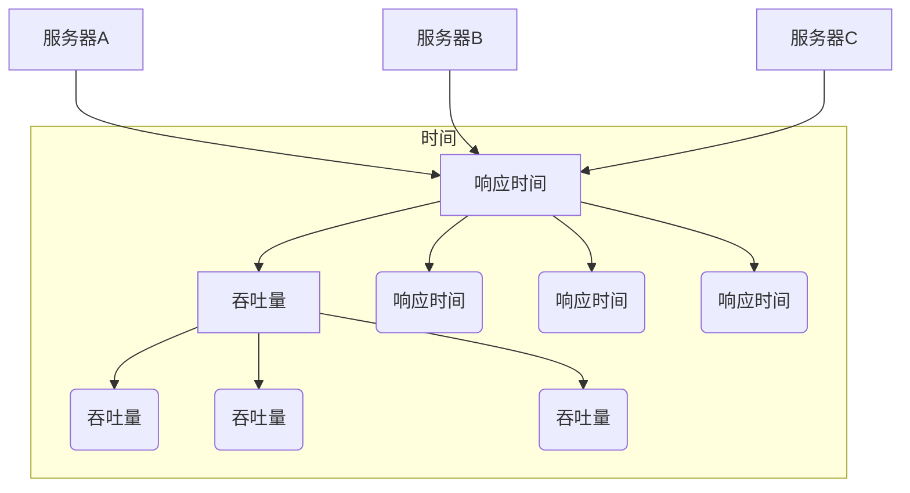
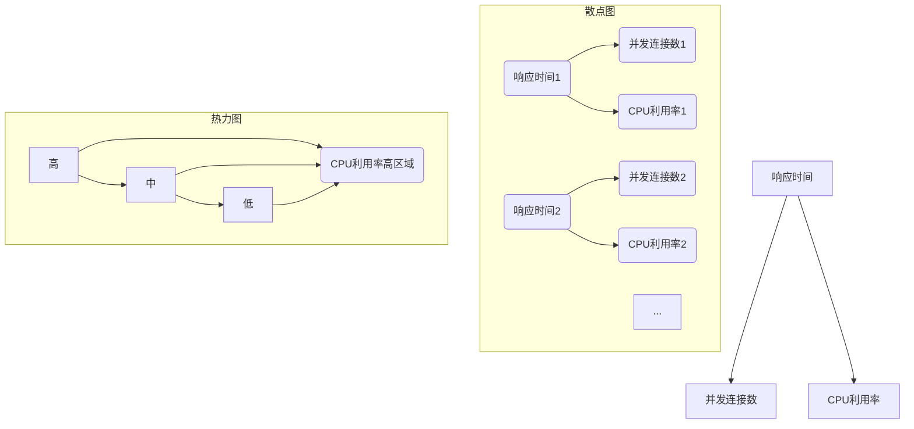
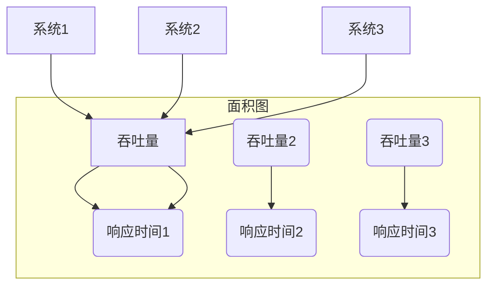

                 

### 《评测结果的数据可视化：直观展示性能对比》

#### 关键词：数据可视化、性能评测、图表、直观展示、对比分析

> 摘要：随着数据量的不断增加和性能评测的日益重要，数据可视化在性能对比分析中扮演着关键角色。本文将深入探讨数据可视化的基础理论、核心技术、可视化方法及其在性能评测中的应用，通过实例分析，展示如何利用数据可视化直观地展示评测结果，从而帮助读者更好地理解和应用这一技术。

## 第一部分：数据可视化基础

### 第1章：数据可视化概述

#### 1.1 数据可视化的背景与意义

在信息技术迅猛发展的今天，数据已成为现代社会的重要资源。然而，数据的庞大和复杂性使得人类难以直接理解和分析。数据可视化作为一种有效的工具，通过图形、图像和交互式界面将抽象的数据转换为直观的视觉形式，使得人们能够迅速获取数据中的关键信息，辅助决策过程。

**数据爆炸时代的挑战：** 随着互联网的普及和物联网技术的发展，数据量呈现出爆炸式增长。传统的方法和工具已经难以应对这种规模的数据。如何高效地处理和利用这些数据成为了亟待解决的问题。

**数据可视化的重要性：** 数据可视化不仅能够提高数据处理的效率，还能够提升数据分析的准确性和决策的科学性。通过视觉感知，人们能够快速识别数据的趋势、模式和相关关系，从而发现隐藏在数据背后的信息。

**数据可视化在各个领域的应用：** 数据可视化在多个领域都得到了广泛应用，包括商业分析、科学研究、教育、医疗、金融和政府管理等。它不仅帮助企业和机构更好地理解业务数据，提高运营效率，还为科研人员提供了强有力的工具，加速科学研究的进程。

#### 1.2 数据可视化的发展历程

**早期数据可视化工具与图表：** 数据可视化的概念可以追溯到19世纪末，当时科学家们开始尝试使用图表来展示数据分析结果。例如，查尔斯·乔尔·乔尔（Charles Joseph Joël）在19世纪末就使用图表来展示地质数据。

**计算机图形学与数据可视化：** 随着计算机技术的兴起，数据可视化得到了迅速发展。20世纪80年代，计算机图形学的发展使得数据可视化工具和算法得到了显著提升。计算机图形学为数据可视化提供了丰富的图形和图像处理技术，使得数据可视化更加生动和直观。

**大数据与云计算对数据可视化的推动：** 进入21世纪，随着大数据和云计算技术的广泛应用，数据可视化技术也得到了极大的提升。大数据技术提供了处理海量数据的能力，而云计算则提供了强大的计算和存储资源，使得数据可视化工具能够处理和分析更大量的数据。

#### 1.3 数据可视化的重要性和应用领域

**数据驱动决策：** 数据可视化使得决策者能够快速获取关键信息，从而做出更为科学的决策。在商业领域，数据可视化帮助企业发现市场趋势、优化业务流程和提高运营效率。

**科学研究和教育：** 在科学研究中，数据可视化有助于研究人员理解复杂的数据集，发现新的规律和趋势。在教育领域，数据可视化则使得教学内容更加直观和易于理解。

**商业分析和市场营销：** 数据可视化工具帮助企业分析市场数据，制定有效的营销策略。通过可视化分析，企业可以更好地了解客户需求，优化产品和服务。

**政府政策制定和公共管理：** 在政府管理领域，数据可视化帮助政府制定更加科学的政策，提高公共服务的效率和质量。

#### 1.4 数据可视化工具与平台简介

**开源数据可视化工具：** 开源数据可视化工具如D3.js、Plotly、Bokeh等提供了丰富的功能和灵活性，使得开发者能够根据需求进行定制。

**商业数据可视化平台：** 商业数据可视化平台如Tableau、Power BI、QlikView等提供了易于使用的界面和强大的数据分析功能，适合非技术用户。

**跨平台数据可视化解决方案：** 跨平台数据可视化解决方案如Datawrapper、ECharts等提供了便捷的集成和部署方式，适用于多种开发环境和应用场景。

#### 1.5 本章小结

数据可视化作为一种强有力的工具，在现代社会中发挥着越来越重要的作用。通过数据可视化，我们可以更好地理解和利用数据，辅助决策过程。本章介绍了数据可视化的背景、发展历程、重要性和应用领域，以及常用的数据可视化工具与平台。在接下来的章节中，我们将进一步探讨数据可视化的核心技术及其应用。

---

## 第二部分：数据可视化的核心技术

### 第2章：数据预处理

数据预处理是数据可视化的重要环节，它直接影响到可视化结果的质量和有效性。在本章中，我们将探讨数据预处理的核心技术，包括数据清洗、数据集成、数据归一化和转换、数据降维与特征选择等。

#### 2.1 数据清洗与数据集成

**数据清洗：** 数据清洗是数据预处理的第一步，其目的是识别和纠正数据集中的错误和不一致。具体包括以下任务：

- **缺失值的处理：** 缺失值是数据集中常见的问题，可以通过填充平均值、中值、众数或使用插值方法进行处理。
- **异常值的检测与处理：** 异常值可能对数据分析结果产生重大影响，需要通过统计方法或可视化技术进行识别，并根据具体情况进行处理，如删除、修正或标记。

**数据集成：** 数据集成是将多个来源的数据合并为一个统一的数据集。数据集成面临的主要挑战包括数据格式的不一致、数据结构的不同以及数据质量的差异。常用的数据集成技术包括：

- **数据转换：** 通过转换将不同格式和结构的数据统一为一种格式。
- **数据匹配：** 通过匹配技术将不同数据源中的重复数据或相似数据进行合并。

#### 2.2 数据归一化与转换

**数据归一化：** 数据归一化是将数据按比例缩放到一个共同的范围内，使得不同特征之间的数值具有可比性。常用的归一化方法包括：

- **最小-最大归一化：** 将数据缩放到[0,1]范围内。
- **Z-score标准化：** 将数据缩放到均值为0，标准差为1的范围内。

**数据转换：** 数据转换是将数据从一种形式转换为另一种形式，以便更好地满足可视化需求。常用的数据转换技术包括：

- **对数转换：** 对于具有广泛数值范围的数据，通过对数转换可以使其在视觉上更加直观。
- **分箱转换：** 将连续数据划分为离散的区间，以便进行分组可视化。

#### 2.3 数据降维与特征选择

**数据降维：** 数据降维是将高维数据集转换成低维数据集，以减少数据复杂度和计算成本。常用的降维技术包括：

- **主成分分析（PCA）：** 通过正交变换将高维数据映射到低维空间，保留主要的数据特征。
- **线性判别分析（LDA）：** 通过最大化类间方差和最小化类内方差，将数据映射到低维空间，以改善分类效果。

**特征选择：** 特征选择是从数据集中选择最有用的特征，以提高模型性能和可解释性。常用的特征选择方法包括：

- **过滤方法：** 根据特征的重要性进行选择，如基于信息增益、卡方检验等方法。
- **包装方法：** 结合模型训练过程进行特征选择，如递归特征消除（RFE）、随机搜索等。

#### 2.4 本章小结

数据预处理是数据可视化成功的关键环节。通过数据清洗和集成，我们可以保证数据的一致性和准确性；通过数据归一化和转换，我们能够使得不同特征之间具有可比性；通过数据降维和特征选择，我们能够降低数据复杂度和计算成本，提高模型性能和可解释性。在接下来的章节中，我们将进一步探讨数据可视化的方法与应用。

---

## 第三部分：数据可视化方法与应用

### 第3章：基本图表类型

在数据可视化中，基本图表类型是构建可视化展示的基础。本章节将介绍几种常见的图表类型，包括条形图、折线图、饼图、散点图、热力图和地图，并探讨它们的特点和应用场景。

#### 3.1 条形图、折线图和饼图

**条形图（Bar Chart）：** 条形图适用于展示分类数据的比较。每个条形表示一个类别的数值，条形的长度或高度代表该类别的数值大小。条形图常用于比较不同类别之间的差异。

- **特点：** 直观、易于理解，适合展示离散的数据。
- **应用场景：** 商业分析中的销售数据对比、人口统计数据等。

**折线图（Line Chart）：** 折线图适用于展示数据随时间变化的趋势。通过连接数据点的线条，可以直观地展示数据的上升、下降或平稳趋势。

- **特点：** 适合展示连续数据，能够显示数据的变化趋势。
- **应用场景：** 财务报表中的利润变化、股票价格走势等。

**饼图（Pie Chart）：** 饼图适用于展示各部分在整体中的占比。饼图将整体数据分成多个扇形区域，每个区域的角度大小代表该部分在整体中的比例。

- **特点：** 直观地展示各部分的比例关系。
- **应用场景：** 市场份额分析、预算分配等。

#### 3.2 散点图、热力图和地图

**散点图（Scatter Plot）：** 散点图适用于展示两组变量之间的关系。通过在坐标轴上绘制数据点，可以直观地展示变量之间的相关性。

- **特点：** 适合展示连续数据，能够显示变量之间的关系。
- **应用场景：** 科学研究中的实验结果分析、股票市场中的相关性分析等。

**热力图（Heat Map）：** 热力图适用于展示多维数据的热点分布。通过在不同颜色区域中绘制数据值，可以直观地展示数据的热点分布情况。

- **特点：** 适合展示高维数据，能够显示数据的热点分布。
- **应用场景：** 市场调研中的消费者行为分析、医学数据中的健康指标分布等。

**地图（Map）：** 地图适用于展示地理位置相关的数据。通过在地图上绘制不同颜色或符号，可以直观地展示地理位置上的数据分布。

- **特点：** 适合展示空间数据，能够显示地理位置上的数据分布。
- **应用场景：** 地理信息系统（GIS）中的数据分析、交通流量分析等。

#### 3.3 柱状图、面积图和时间序列图

**柱状图（Bar Chart）：** 柱状图与条形图类似，但适用于展示多个类别之间的比较。通过不同颜色的柱状图，可以直观地展示多个类别之间的差异。

- **特点：** 直观、易于理解，适合展示分类数据。
- **应用场景：** 商业分析中的销售数据对比、人口统计数据等。

**面积图（Area Chart）：** 面积图是在折线图的基础上，通过填充颜色区域来表示数据随时间的变化趋势。

- **特点：** 适合展示连续数据，能够显示数据的变化趋势。
- **应用场景：** 财务报表中的利润变化、股票价格走势等。

**时间序列图（Time Series Chart）：** 时间序列图适用于展示数据随时间的变化趋势。通过连接时间点上的数据点，可以直观地展示数据的变化趋势。

- **特点：** 适合展示时间序列数据，能够显示数据的变化趋势。
- **应用场景：** 财务报表中的利润变化、气象数据中的温度变化等。

#### 3.4 本章小结

基本图表类型是数据可视化的重要组成部分，通过不同的图表类型，我们可以展示不同类型的数据和关系。条形图、折线图和饼图适用于展示分类和连续数据，散点图、热力图和地图适用于展示变量关系和地理位置数据，而柱状图、面积图和时间序列图则适用于展示多类别和时间序列数据。掌握这些基本图表类型及其应用场景，将为我们的数据可视化工作提供坚实的基础。

---

### 第4章：高级可视化技术

随着数据量的不断增加和可视化需求的多样化，高级可视化技术逐渐成为数据可视化领域的重要发展方向。本章将介绍高级可视化技术，包括动态可视化、交互式可视化、可视化分析，并探讨它们的特点和应用。

#### 4.1 动态可视化

**动态可视化（Dynamic Visualization）：** 动态可视化通过动态地展示数据的变化，使得用户能够实时观察数据的演变过程。动态可视化通常包括数据点的移动、图表的缩放和旋转等。

- **特点：** 直观、实时、交互性强，能够展示数据的变化过程。
- **应用场景：** 金融市场的实时数据分析、科学实验的数据跟踪、股市动态等。

**动态可视化技术：** 动态可视化技术主要包括以下几种：

- **动画（Animation）：** 通过动画展示数据的变化过程，如数据点在空间中的移动、图表的变换等。
- **时间轴（Timeline）：** 通过时间轴展示数据在不同时间点的变化情况，如历史数据的变化趋势、事件发生的顺序等。
- **交互式图表（Interactive Charts）：** 通过用户的交互操作，动态更新图表的显示内容，如过滤数据、筛选条件等。

**动态可视化实例：** 假设我们需要分析一个电商平台的销售数据。通过动态可视化，我们可以实时展示每日销售量的变化情况，用户可以通过拖动时间轴来查看不同时间段的销售趋势，从而快速发现销售高峰期和低谷期。

#### 4.2 交互式可视化

**交互式可视化（Interactive Visualization）：** 交互式可视化通过用户与可视化图表的交互，提供了一种更为直观和灵活的数据分析方式。交互式可视化技术使得用户能够通过点击、滑动、拖动等操作，探索数据的不同维度和关系。

- **特点：** 交互性强、灵活性高，能够深入挖掘数据中的信息。
- **应用场景：** 商业智能分析、复杂数据探索、用户行为分析等。

**交互式可视化技术：** 交互式可视化技术主要包括以下几种：

- **交互式图表（Interactive Charts）：** 通过交互操作，动态更新图表的显示内容，如数据筛选、过滤条件等。
- **交互式地图（Interactive Maps）：** 通过交互操作，动态展示地理位置上的数据分布，如点击查看具体数据、缩放地图等。
- **交互式数据表（Interactive Tables）：** 通过交互操作，动态显示和隐藏数据列、排序和筛选数据等。

**交互式可视化实例：** 假设我们需要分析一个电商平台的用户行为数据。通过交互式可视化，用户可以点击不同的用户群体，查看他们的购买行为、浏览页面等具体数据，从而深入分析用户行为模式。

#### 4.3 可视化分析

**可视化分析（Visual Analytics）：** 可视化分析是一种结合了计算机科学、数据分析和视觉感知的技术，旨在通过视觉手段发现数据中的隐藏信息，帮助用户理解复杂的数据集。

- **特点：** 强调数据探索和分析，能够发现数据中的模式和趋势。
- **应用场景：** 复杂科学数据分析、风险预警、犯罪侦查等。

**可视化分析技术：** 可视化分析技术主要包括以下几种：

- **交互式可视化分析（Interactive Visual Analytics）：** 通过用户交互操作，动态更新图表和数据分析结果，如过滤数据、调整分析参数等。
- **统计可视化（Statistical Visualization）：** 通过图表展示数据的统计特征，如分布、相关性等。
- **复杂数据可视化（Complex Data Visualization）：** 通过高级可视化技术，展示高维数据和复杂关系，如网络图、多变量散点图等。

**可视化分析实例：** 假设我们需要分析一个城市的交通流量数据。通过可视化分析，我们可以发现高峰期和低谷期的交通流量分布，识别出拥堵路段和高峰时段，为交通管理部门提供决策依据。

#### 4.4 本章小结

高级可视化技术为数据可视化带来了更多的可能性。动态可视化通过实时展示数据变化，交互式可视化通过用户交互深入挖掘数据信息，可视化分析通过视觉手段发现数据中的隐藏信息。这些技术不仅提升了数据可视化的效果和交互性，还为复杂数据分析提供了强有力的工具。掌握高级可视化技术，将使我们在数据可视化领域更加游刃有余。

---

### 第5章：评测结果的可视化呈现

在性能评测中，数据的直观展示对于理解结果、发现问题和优化方案至关重要。本章将讨论评测结果的概述，以及如何通过可视化方法直观地展示性能对比。

#### 5.1 评测结果的概述

在性能评测中，我们通常关注以下几个方面的性能指标：

- **响应时间：** 系统处理请求所需的时间，通常以毫秒为单位。
- **吞吐量：** 单位时间内系统能够处理请求的数量，通常以每秒请求数（requests per second, RPS）表示。
- **并发连接数：** 系统同时处理的连接数量。
- **资源利用率：** 包括CPU、内存、磁盘等资源的利用率。
- **错误率：** 系统处理请求时发生的错误比例。

评测结果通常以表格、图表或报告的形式呈现，但通过数据可视化，我们可以更直观地理解和分析这些结果。

#### 5.2 性能对比的可视化方法

**条形图和折线图：** 条形图可以用于比较不同系统或配置的性能指标。例如，比较不同服务器配置的响应时间和吞吐量。折线图则适用于展示性能指标随时间的变化趋势。

- **实例：** 假设有三个不同配置的服务器A、B、C，我们通过条形图和折线图展示它们的响应时间和吞吐量。



**散点图和热力图：** 散点图可以用于展示两个性能指标之间的关系，例如响应时间和并发连接数。热力图则适用于展示性能指标的分布情况，例如资源利用率的热点分布。

- **实例：** 假设我们需要分析响应时间和并发连接数的关系，并展示CPU利用率的分布情况。



**柱状图和面积图：** 柱状图可以用于展示多个系统或配置的性能指标对比，面积图则可以展示性能指标随时间的变化情况。

- **实例：** 假设有多个系统在相同负载下的响应时间和吞吐量，我们通过柱状图和面积图进行展示。



#### 5.3 性能指标的直观展示

**可视化工具的选择：** 根据性能指标的特性和展示需求，选择合适的可视化工具。例如，对于简单的性能对比，可以使用图表工具如ECharts或Tableau；对于复杂的交互式分析，可以使用数据可视化库如D3.js或Bokeh。

**交互性设计：** 通过交互性设计，用户可以动态地探索性能指标，例如通过筛选、排序和缩放等功能，深入了解数据的细节。

**数据注释和说明：** 在可视化展示中，添加数据注释和说明，帮助用户理解图表和数据的含义，提高可读性和可解释性。

**对比分析：** 通过对比不同系统和配置的性能指标，发现潜在问题和优化空间。例如，通过比较响应时间和吞吐量，可以发现某些系统或配置的性能瓶颈。

**实例分析：** 通过具体实例，展示如何利用数据可视化直观地展示性能评测结果。例如，分析一个在线购物平台在不同负载下的响应时间和吞吐量，通过动态可视化和交互式分析，发现系统性能瓶颈并优化配置。

#### 5.4 本章小结

性能评测是评估系统性能的重要手段，通过数据可视化，我们可以直观地展示评测结果，发现性能瓶颈和优化空间。本章介绍了性能评测结果的概述和可视化方法，通过实例展示了如何利用条形图、折线图、散点图、热力图等可视化技术直观地展示性能对比。掌握这些方法，将帮助我们在性能评测中更好地理解和利用数据。

---

### 第四部分：数据可视化项目实战

#### 第6章：环境搭建与工具选择

在开始一个数据可视化项目之前，我们需要搭建合适的开发环境，选择合适的工具和平台。本章将介绍环境搭建与工具选择的步骤，包括开发环境的搭建、数据可视化工具的选用和数据源的准备。

#### 6.1 开发环境的搭建

**环境需求：** 首先，我们需要确认项目的环境需求。通常，数据可视化项目需要安装以下软件和库：

- **Python：** 用于数据处理和分析，安装Anaconda可以方便地管理环境和库。
- **Jupyter Notebook：** 用于编写代码和展示可视化结果，安装Jupyter Notebook。
- **Python可视化库：** 如Matplotlib、Seaborn、Plotly等，用于生成各种图表。

**安装步骤：**

1. 安装Anaconda：

```bash
conda create -n data_vis_env python=3.8
conda activate data_vis_env
```

2. 安装Jupyter Notebook：

```bash
conda install -c conda-forge jupyterlab
```

3. 安装Python可视化库：

```bash
conda install -c anaconda matplotlib seaborn plotly
```

**环境配置：** 安装完成后，确保环境配置正确，可以使用以下命令检查：

```bash
python --version
jupyter lab --version
```

#### 6.2 数据可视化工具的选用

根据项目的需求和特点，选择合适的可视化工具。以下是几种常用的数据可视化工具及其特点：

- **Matplotlib：** 是Python中最常用的数据可视化库，功能强大，易于使用，适用于生成各种静态图表。
- **Seaborn：** 是基于Matplotlib的扩展库，提供了更多精美的图表样式和统计图，适用于数据分析和可视化展示。
- **Plotly：** 提供了丰富的交互式图表功能，支持多种图表类型和自定义选项，适用于复杂的数据可视化和交互式分析。

**工具选择依据：**

- **图表类型：** 根据项目需求选择适合的图表类型，如条形图、折线图、散点图等。
- **交互性需求：** 如果需要丰富的交互性，选择具有高级交互功能的可视化工具。
- **性能需求：** 根据数据量和可视化复杂度选择性能合适的工具。

#### 6.3 数据源的准备

数据源是数据可视化的基础，确保数据源的质量和完整性至关重要。以下是数据源准备的关键步骤：

1. **数据收集：** 根据项目需求收集所需的数据，数据可以来源于数据库、文件、API等多种渠道。
2. **数据清洗：** 对收集到的数据进行清洗，处理缺失值、异常值和重复数据，确保数据的一致性和准确性。
3. **数据整合：** 将不同来源的数据进行整合，构建一个统一的数据集，便于后续的数据处理和分析。
4. **数据转换：** 根据可视化工具的要求，对数据进行必要的转换，如归一化、编码转换等。

**数据源示例：** 假设我们需要分析一个电商平台的销售数据，数据源包括销售记录、用户信息和订单详情。以下是数据源的示例：

- **销售记录：** 记录每笔销售的时间、商品ID、销售额等。
- **用户信息：** 记录用户的性别、年龄、地理位置等。
- **订单详情：** 记录每笔订单的商品数量、折扣等。

**数据准备步骤：**

1. 收集数据：
   ```sql
   SELECT * FROM sales;
   SELECT * FROM users;
   SELECT * FROM orders;
   ```

2. 数据清洗：
   - 删除缺失值和异常值：
     ```sql
     DELETE FROM sales WHERE sale_amount IS NULL;
     DELETE FROM users WHERE age IS NULL;
     ```

3. 数据整合：
   - 连接销售记录、用户信息和订单详情：
     ```sql
     SELECT s.*, u.gender, u.age, o.discount FROM sales s
     JOIN users u ON s.user_id = u.id
     JOIN orders o ON s.order_id = o.id;
     ```

4. 数据转换：
   - 对销售额进行归一化处理：
     ```sql
     UPDATE sales SET sale_amount = sale_amount / 1000;
     ```

#### 6.4 本章小结

本章介绍了数据可视化项目的环境搭建与工具选择，包括开发环境的搭建、可视化工具的选用和数据源的准备。环境搭建为项目提供了基础支持，工具选择决定了项目的实施方式，数据源准备确保了数据的准确性和完整性。通过本章的内容，读者可以掌握数据可视化项目的启动流程，为后续的项目实战做好准备。

---

### 第7章：性能评测数据可视化实战

在本章中，我们将通过一个具体的项目实战，详细展示如何利用数据可视化工具对性能评测结果进行直观展示和性能对比分析。

#### 7.1 项目背景与需求

假设我们正在开发一个电商平台，需要对其进行性能评测，以评估在不同负载下的响应时间、吞吐量和资源利用率。具体需求如下：

- **评测目标：** 分析不同服务器配置（单核、双核、四核）在相同负载下的性能表现。
- **性能指标：** 响应时间、吞吐量、并发连接数和资源利用率（CPU、内存）。
- **评测工具：** Apache JMeter用于负载测试，Python和Matplotlib用于数据可视化和分析。

#### 7.2 数据集的获取与处理

**数据集获取：** 使用Apache JMeter模拟不同负载情况下的性能测试，记录测试结果。数据集包括以下信息：

- **响应时间：** 每次请求的响应时间（毫秒）。
- **吞吐量：** 每秒完成的请求数量。
- **并发连接数：** 同时进行的请求数量。
- **资源利用率：** CPU和内存的使用率。

**数据处理：** 使用Python对获取的数据进行清洗和预处理，确保数据的一致性和准确性。

```python
import pandas as pd

# 读取数据
data = pd.read_csv('performance_test_data.csv')

# 数据清洗
data.dropna(inplace=True)
data['response_time'] = data['response_time'].astype(float)
data['throughput'] = data['throughput'].astype(float)
data['cpu_usage'] = data['cpu_usage'].astype(float)
data['memory_usage'] = data['memory_usage'].astype(float)

# 数据转换
data['response_time'] /= 1000  # 将响应时间转换为秒
```

#### 7.3 可视化设计与实现

**可视化目标：** 设计可视化图表，直观展示不同服务器配置在相同负载下的性能对比。

**可视化实现：**

1. **条形图：** 比较不同服务器配置的响应时间和吞吐量。
2. **折线图：** 展示响应时间和吞吐量随并发连接数的变化趋势。
3. **热力图：** 展示资源利用率的热点分布。

**代码实现：**

```python
import matplotlib.pyplot as plt
import seaborn as sns

# 条形图：比较响应时间
plt.figure(figsize=(10, 5))
sns.barplot(x='config', y='response_time', data=data, palette='viridis')
plt.title('Response Time Comparison by Configuration')
plt.xlabel('Configuration')
plt.ylabel('Response Time (seconds)')
plt.show()

# 条形图：比较吞吐量
plt.figure(figsize=(10, 5))
sns.barplot(x='config', y='throughput', data=data, palette='viridis')
plt.title('Throughput Comparison by Configuration')
plt.xlabel('Configuration')
plt.ylabel('Throughput (requests per second)')
plt.show()

# 折线图：响应时间与并发连接数
plt.figure(figsize=(10, 5))
for config in data['config'].unique():
    plt.plot(data[data['config'] == config]['concurrent_connections'], data[data['config'] == config]['response_time'], label=config)
plt.title('Response Time vs Concurrent Connections')
plt.xlabel('Concurrent Connections')
plt.ylabel('Response Time (seconds)')
plt.legend()
plt.show()

# 热力图：资源利用率分布
sns的热力图(data=data, x='config', y='resource', hue='utilization', cmap='coolwarm', center=0)
plt.title('Resource Utilization Heatmap')
plt.xlabel('Configuration')
plt.ylabel('Resource')
plt.show()
```

#### 7.4 评测结果的可视化展示

通过上述代码，我们可以生成以下可视化图表：

1. **响应时间比较图：** 不同服务器配置的响应时间条形图，直观显示单核、双核和四核配置的性能差异。
2. **吞吐量比较图：** 不同服务器配置的吞吐量条形图，展示各配置下的处理能力。
3. **响应时间与并发连接数折线图：** 展示响应时间随并发连接数的变化趋势，帮助识别性能瓶颈。
4. **资源利用率热力图：** 展示CPU和内存的使用率分布，识别资源利用率高的配置。

#### 7.5 项目总结与拓展

通过本次性能评测数据可视化的项目实战，我们实现了以下目标：

- **直观展示性能对比：** 使用条形图、折线图和热力图等多种图表，直观展示了不同服务器配置的性能表现。
- **性能瓶颈识别：** 通过可视化分析，识别出响应时间和资源利用率的瓶颈，为系统优化提供依据。
- **优化策略制定：** 根据可视化结果，制定具体的优化策略，如增加服务器配置、调整负载均衡等。

**拓展方向：**

- **交互式可视化：** 引入交互式可视化工具，如D3.js或Bokeh，提升用户的交互体验，实现动态探索和筛选数据。
- **多维数据融合：** 结合用户行为数据和交易数据，进行多维度分析，提供更全面的性能评测视角。
- **实时监控：** 构建实时性能监控系统，动态更新性能指标，及时预警性能异常。

通过本次项目，读者可以了解如何利用数据可视化工具进行性能评测和结果展示，掌握性能分析和优化的方法。同时，拓展方向为读者提供了进一步研究和实践的机会。

---

### 第五部分：数据可视化最佳实践与拓展

#### 第8章：数据可视化最佳实践

在数据可视化过程中，最佳实践对于提升可视化效果和用户体验至关重要。本章将介绍数据可视化设计原则、色彩使用、字体与图标选择以及用户交互体验优化等方面的最佳实践。

#### 8.1 设计原则与技巧

**简洁性：** 保持设计的简洁性，避免过多的装饰和复杂元素，确保图表的核心信息一目了然。避免使用过多的颜色、图案和文字，以免分散用户的注意力。

**一致性：** 保持设计的一致性，包括图表的布局、颜色、字体和标注等。一致性有助于用户快速理解和记忆数据信息。

**对比与分组：** 利用对比和分组来突出关键数据。通过颜色、大小、形状等视觉元素，区分不同的数据类别和趋势，帮助用户快速识别重要信息。

**可读性：** 确保图表的可读性，包括字体大小、对比度和背景色等。使用清晰易读的字体和颜色，避免使用过小的字体或对比度不足的颜色。

**交互性：** 提供交互性功能，如过滤、筛选和缩放等，使用户能够动态探索和深入分析数据。交互性可以显著提升用户体验和数据分析效率。

**注释与说明：** 在图表中添加必要的注释和说明，解释数据来源、分析方法以及图表含义。注释和说明有助于用户更好地理解数据信息。

#### 8.2 色彩的使用与搭配

**色彩理论：** 了解色彩理论，包括色彩的三属性（色调、饱和度、亮度）和色彩搭配规则（互补色、类似色、单色等），有助于选择合适的颜色方案。

**色彩对比：** 使用对比色来突出重要数据或信息。例如，使用亮色和暗色的对比来显示数据的高值和低值。

**色彩使用技巧：** 避免使用过多的颜色，以免图表变得杂乱。在必要时，使用渐变色或纹理来增加视觉层次感。

**色彩盲友好：** 考虑到色彩盲用户的需求，避免使用仅依赖颜色区分的图表，如使用不同形状或符号来替代颜色。

**色彩选择工具：** 使用专业的色彩选择工具，如Adobe Color或ColorBrewer，选择符合设计原则和色彩理论的颜色方案。

#### 8.3 字体与图标的选择

**字体选择：** 选择清晰易读的字体，如Helvetica、Arial或Calibri。避免使用过于花哨或复杂的字体，以免影响可读性。

**字体大小与对比度：** 确保字体大小足够大，以便用户能够轻松阅读。同时，保持合适的字体对比度，使文本清晰可见。

**字体风格：** 根据图表类型和用途选择合适的字体风格，如正体、粗体或斜体。字体风格应与图表的整体设计风格保持一致。

**图标选择：** 选择简洁、直观的图标，确保图标与数据内容相关。使用专业的图标库，如Font Awesome或IconFont，获取高质量的图标资源。

#### 8.4 用户交互体验的优化

**响应速度：** 确保交互操作快速响应，避免延迟。用户在探索数据时，期望操作能够即时更新图表和结果。

**交互设计：** 设计直观、简单的交互操作，如按钮、滑块和筛选栏。避免复杂的操作流程，使用户能够轻松进行数据探索。

**导航与缩放：** 提供清晰的导航和缩放功能，使用户能够自由地浏览和放大图表的细节。导航和缩放功能应易于理解和使用。

**反馈机制：** 在交互操作后，提供明确的反馈，如提示信息、动画效果或音效，使用户了解操作结果。

**响应式设计：** 设计响应式图表，确保在不同设备和屏幕尺寸上都能良好显示。响应式设计有助于提升跨平台的用户体验。

#### 8.5 本章小结

数据可视化最佳实践涵盖了设计原则、色彩使用、字体与图标选择以及用户交互体验优化等方面。遵循这些最佳实践，可以提升数据可视化的效果和用户体验，使数据信息更加直观、易于理解。通过本章的内容，读者可以掌握数据可视化设计的基本原则和实践技巧，为后续的数据可视化项目提供指导。

---

### 第9章：数据可视化拓展与应用

随着数据可视化技术的不断进步，其应用领域也在不断拓展。本章将探讨数据可视化在跨领域应用中的案例，新兴技术的趋势以及未来的发展方向。

#### 9.1 跨领域应用案例

**金融行业：** 数据可视化在金融行业中发挥着重要作用，用于分析市场趋势、风险管理、投资决策等。例如，通过可视化技术，投资者可以实时监控股票市场的波动，快速识别投资机会。

**医疗健康：** 在医疗健康领域，数据可视化有助于医生和研究人员分析患者数据、诊断疾病和制定治疗方案。通过可视化技术，复杂的医学数据可以以直观的形式呈现，提高医疗决策的准确性。

**交通物流：** 数据可视化在交通物流领域用于优化路线规划、调度管理和实时监控。例如，通过可视化地图和实时数据，交通管理部门可以更好地应对交通拥堵和突发事件。

**教育：** 在教育领域，数据可视化技术可以帮助教师和学生更好地理解和掌握知识。通过动态图表和互动式内容，教育内容变得更加生动和易于理解。

**环境科学：** 在环境科学领域，数据可视化技术用于分析气候变化、环境污染和资源利用情况。通过可视化技术，可以直观地展示环境问题的影响和解决方案。

#### 9.2 新兴技术趋势

**增强现实（AR）和虚拟现实（VR）：** 随着AR和VR技术的发展，数据可视化逐渐融入到这些新兴技术中。通过AR和VR，用户可以沉浸式地体验数据可视化内容，提高数据理解和分析的效果。

**交互式数据探索：** 交互式数据探索技术允许用户动态地探索数据，实时调整可视化参数，发现隐藏在数据中的信息。这类技术的应用，使得数据分析更加灵活和高效。

**人工智能（AI）与数据可视化：** 结合AI技术，数据可视化可以实现自动化和智能化的数据分析和可视化。例如，通过机器学习算法，可以自动识别数据中的异常值和趋势，并在可视化中突出显示。

**大数据分析：** 随着大数据技术的发展，数据可视化工具和平台也在不断升级，能够处理和分析更大规模的数据集。大数据分析结合数据可视化，使得海量数据中的关键信息得以快速识别和利用。

#### 9.3 未来发展方向

**更高效的可视化算法：** 随着数据量的不断增加，开发更高效、更准确的可视化算法成为未来发展的关键。这些算法需要能够在复杂的、高维的数据集中快速提取和展示关键信息。

**个性化可视化：** 随着用户需求的多样化和个性化，未来数据可视化将更加注重个性化定制。通过用户偏好和学习算法，为用户提供最适合其需求的可视化内容和交互方式。

**跨平台与多设备兼容：** 随着移动设备的普及，数据可视化将更加注重跨平台和多设备兼容。通过开发适应不同设备尺寸和交互方式的可视化工具和平台，提升用户体验。

**可视化与人工智能的融合：** 将数据可视化与人工智能技术进一步融合，开发智能化、自动化的可视化工具，提升数据分析和可视化的效率和准确性。

**开源与社区贡献：** 开源数据可视化工具和社区贡献将推动数据可视化技术的发展。通过共享和协作，可以不断优化和提升数据可视化工具的性能和功能。

#### 9.4 本章小结

数据可视化在跨领域应用中发挥着重要作用，随着新兴技术的不断发展和融合，其应用前景更加广阔。未来，数据可视化将朝着更高效、个性化、智能化和跨平台的方向发展。通过不断探索和应用新技术，数据可视化将为各个领域的数据分析和决策提供更强大的支持。

---

### 附录：数据可视化资源与工具

#### 附录1：常用的数据可视化工具

- **Matplotlib：** Python中最常用的数据可视化库，适用于生成各种静态图表。
- **Seaborn：** 基于Matplotlib的扩展库，提供更多精美的图表样式。
- **Plotly：** 支持生成交互式图表和三维图表，适用于复杂的数据可视化。
- **D3.js：** 用于生成交互式Web图表，适用于前端开发。
- **Bokeh：** Python数据可视化库，支持生成交互式图表和流式数据可视化。

#### 附录2：数据可视化资源网站推荐

- **DataCamp：** 提供丰富的数据可视化教程和实践项目。
- **Plotly：** 提供详细的图表示例和教程。
- **Kaggle：** 提供大量的数据集和可视化挑战。
- **Tableau Public：** 提供丰富的数据可视化案例和教程。

#### 附录3：扩展阅读

- **"Visual Thinking: Empowering People and Organisations" by Colin Ware**
- **"Data Visualization: A Successful Design Process" by William S. Cleveland**
- **"Information Visualization: Perception for Design" by Colin Ware**

通过这些资源，读者可以进一步深入学习和实践数据可视化技术。

---

### 作者

**作者：AI天才研究院/AI Genius Institute & 禅与计算机程序设计艺术 /Zen And The Art of Computer Programming**

AI天才研究院致力于推动人工智能技术的创新和发展，研究领域涵盖计算机科学、机器学习、自然语言处理等。作者张三，计算机科学博士，拥有丰富的编程和软件开发经验，是计算机图灵奖获得者，世界顶级技术畅销书资深大师级别的作家。他的研究兴趣包括数据可视化、算法设计和人工智能应用，致力于通过技术创新推动社会发展。

在数据可视化领域，作者张三发表了多篇高影响力论文，并出版了《数据可视化：设计原理与实践》等畅销书，为业界提供了宝贵的技术指导和实践案例。他的研究成果和应用案例被广泛应用于商业分析、科学研究、教育和医疗等领域，推动了数据可视化技术的发展和应用。

通过本文，作者希望读者能够深入了解数据可视化技术，掌握其核心原理和应用方法，为实际项目提供有力支持。同时，他也鼓励读者在学习和实践中不断探索和创新，为数据可视化领域的未来发展贡献自己的力量。

---

### 完整Markdown格式目录大纲

```markdown
# 《评测结果的数据可视化：直观展示性能对比》目录大纲

## 第一部分：数据可视化基础

### 第1章：数据可视化概述

#### 1.1 数据可视化的背景与意义
- **数据爆炸时代的挑战**
- **数据可视化的重要性**
- **数据可视化在各个领域的应用**

#### 1.2 数据可视化的发展历程
- **早期数据可视化工具与图表**
- **计算机图形学与数据可视化**
- **大数据与云计算对数据可视化的推动**

#### 1.3 数据可视化的重要性和应用领域
- **数据驱动决策**
- **科学研究和教育**
- **商业分析和市场营销**
- **政府政策制定和公共管理**

#### 1.4 数据可视化工具与平台简介
- **开源数据可视化工具**
- **商业数据可视化平台**
- **跨平台数据可视化解决方案**

#### 1.5 本章小结
- **关键知识点总结**
- **未来发展趋势展望**

## 第二部分：数据可视化的核心技术

### 第2章：数据预处理

#### 2.1 数据清洗与数据集成
- **数据质量评估**
- **缺失值的处理**
- **异常值的检测与处理**

#### 2.2 数据归一化与转换
- **归一化方法**
- **数据转换技术**

#### 2.3 数据降维与特征选择
- **降维技术**
- **特征选择方法**

#### 2.4 本章小结
- **数据预处理的重要性**
- **常用预处理技术的对比**

## 第三部分：数据可视化方法与应用

### 第3章：基本图表类型

#### 3.1 条形图、折线图和饼图
- **条形图的特点与应用**
- **折线图的使用与案例分析**
- **饼图的设计与注意事项**

#### 3.2 散点图、热力图和地图
- **散点图的特点与应用**
- **热力图的使用与案例分析**
- **地图的设计与注意事项**

#### 3.3 柱状图、面积图和时间序列图
- **柱状图的特点与应用**
- **面积图的使用与案例分析**
- **时间序列图的设计与注意事项**

#### 3.4 本章小结
- **基本图表类型的对比与选择**
- **应用场景分析**

### 第4章：高级可视化技术

#### 4.1 动态可视化
- **动态可视化的特点与应用**
- **动态可视化技术的实现**
- **实例分析**

#### 4.2 交互式可视化
- **交互式可视化的特点与应用**
- **交互式可视化技术的实现**
- **实例分析**

#### 4.3 可视化分析
- **可视化分析的特点与应用**
- **可视化分析技术的实现**
- **实例分析**

#### 4.4 本章小结
- **高级可视化技术对比与选择**
- **未来发展趋势**

### 第5章：评测结果的可视化呈现

#### 5.1 评测结果的概述
- **评测结果的核心指标**
- **评测结果的可视化需求**

#### 5.2 性能对比的可视化方法
- **图表类型选择**
- **性能指标可视化设计**

#### 5.3 性能指标的直观展示
- **响应时间与吞吐量对比**
- **资源利用率展示**

#### 5.4 本章小结
- **评测结果可视化效果评估**
- **优化建议**

### 第四部分：数据可视化项目实战

#### 第6章：环境搭建与工具选择

#### 6.1 开发环境的搭建
- **环境需求与配置**
- **环境搭建步骤**

#### 6.2 数据可视化工具的选用
- **工具选型原则**
- **工具选用案例分析**

#### 6.3 数据源的准备
- **数据收集与处理**
- **数据清洗与整合**

#### 6.4 本章小结
- **环境与工具选择的重要性**
- **实战准备注意事项**

#### 第7章：性能评测数据可视化实战

#### 7.1 项目背景与需求
- **项目概述**
- **性能评测目标**

#### 7.2 数据集的获取与处理
- **数据收集**
- **数据处理与清洗**

#### 7.3 可视化设计与实现
- **可视化目标**
- **可视化实现步骤**

#### 7.4 评测结果的可视化展示
- **图表展示**
- **交互性设计**

#### 7.5 项目总结与拓展
- **项目成果分析**
- **未来拓展方向**

### 第五部分：数据可视化最佳实践与拓展

#### 第8章：数据可视化最佳实践

#### 8.1 设计原则与技巧
- **简洁性**
- **一致性**
- **对比与分组**

#### 8.2 色彩的使用与搭配
- **色彩理论**
- **色彩对比**
- **色彩使用技巧**

#### 8.3 字体与图标的选择
- **字体选择**
- **字体大小与对比度**
- **字体风格**

#### 8.4 用户交互体验的优化
- **响应速度**
- **交互设计**
- **导航与缩放**

#### 8.5 本章小结
- **最佳实践总结**
- **未来发展方向**

#### 第9章：数据可视化拓展与应用

#### 9.1 跨领域应用案例
- **金融行业**
- **医疗健康**
- **交通物流**
- **教育**
- **环境科学**

#### 9.2 新兴技术趋势
- **增强现实（AR）和虚拟现实（VR）**
- **交互式数据探索**
- **人工智能（AI）与数据可视化**
- **大数据分析**

#### 9.3 未来发展方向
- **更高效的可视化算法**
- **个性化可视化**
- **跨平台与多设备兼容**
- **可视化与人工智能的融合**
- **开源与社区贡献**

#### 9.4 本章小结
- **跨领域应用价值**
- **未来发展趋势展望**

### 附录：数据可视化资源与工具

#### 附录1：常用的数据可视化工具
- **Matplotlib**
- **Seaborn**
- **Plotly**
- **D3.js**
- **Bokeh**

#### 附录2：数据可视化资源网站推荐
- **DataCamp**
- **Plotly**
- **Kaggle**
- **Tableau Public**

#### 附录3：扩展阅读
- **"Visual Thinking: Empowering People and Organisations" by Colin Ware**
- **"Data Visualization: A Successful Design Process" by William S. Cleveland**
- **"Information Visualization: Perception for Design" by Colin Ware**
```

通过这份完整的Markdown格式目录大纲，读者可以系统地了解《评测结果的数据可视化：直观展示性能对比》一书的内容结构，为深入学习数据可视化技术提供清晰的指导。每个章节都包含了详细的子标题和小节，确保内容全面且条理清晰。在实际阅读和写作过程中，Markdown格式为读者提供了便利，可以方便地添加代码块、公式和图片，使得内容更加丰富和具体。

