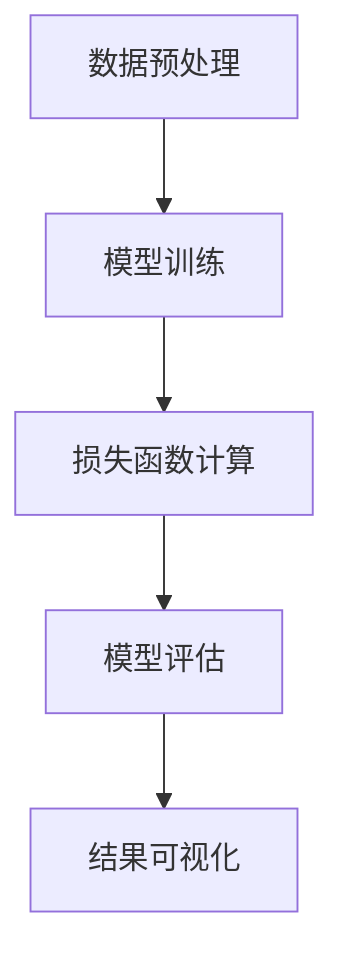
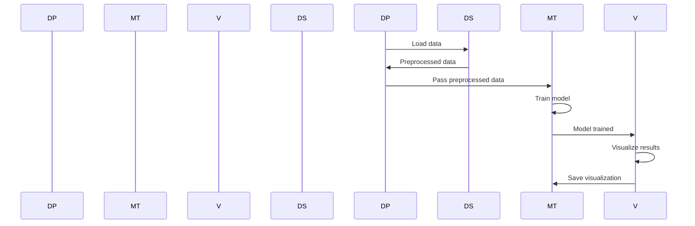

                 

## 引言与基础

### 1.1 问题背景

深度学习作为人工智能领域的重要分支，已经在诸如图像识别、自然语言处理、语音识别等领域取得了显著的成果。然而，深度学习的复杂性和非透明性使得评测结果的解读变得异常困难。传统的方法主要依赖于性能指标，如准确率、召回率和F1分数等，但这些指标往往只能提供有限的见解，无法直观展示模型内部的信息流动和决策过程。为了更好地理解深度学习模型的行为，评测结果的深度学习可视化技术应运而生。

评测结果可视化技术的核心目标是借助图形化手段，将深度学习模型的学习过程、决策路径和预测结果直观地展示出来。这不仅有助于研究者深入理解模型的工作原理，还能为模型优化提供有价值的参考。例如，在图像分类任务中，可视化技术可以揭示模型对于图像中特定区域的关注点；在自然语言处理任务中，可以展示模型对句子中不同词的权重分配情况。

然而，实现评测结果的深度学习可视化并非易事。首先，深度学习模型通常包含大量的参数和层级，如何有效地提取和展示关键信息成为一大挑战。其次，不同的可视化方法适用于不同的应用场景，如何选择合适的可视化工具和算法也成为关键问题。此外，可视化技术的性能和可扩展性也是需要考虑的重要因素。

本文旨在深入探讨评测结果的深度学习可视化技术，从基础概念到具体实现，再到实际案例和最佳实践，全面解析这一领域的核心内容。首先，我们将介绍深度学习的基本概念和评测结果可视化的必要性。随后，我们将详细讲解深度学习可视化技术的核心概念和原理，包括可视化工具和库的使用方法。接着，通过具体实例和代码演示，我们将展示如何将可视化技术应用于实际项目中。最后，我们将总结最佳实践和未来研究方向，为读者提供深入理解这一领域的全面指南。

通过本文的阅读，读者将能够：

1. 理解深度学习及其评测结果可视化的重要性。
2. 掌握深度学习可视化技术的核心概念和原理。
3. 学会使用常见的可视化工具和库。
4. 通过实际案例了解如何将可视化技术应用于深度学习项目。
5. 掌握深度学习可视化的最佳实践和注意事项。

### 1.2 深度学习与评测结果可视化的重要性

深度学习，作为一种基于多层神经网络的机器学习技术，近年来在人工智能领域取得了显著的进展。它的核心优势在于能够自动从大量数据中学习特征，从而实现复杂的模式识别和决策任务。然而，随着模型复杂度的增加，深度学习模型也逐渐变得难以解释和调试。这使得评测结果的可视化变得尤为重要。

首先，从模型理解的角度来看，深度学习可视化的主要目的是揭示模型内部的决策过程。在传统的机器学习中，模型的结构相对简单，如决策树、支持向量机等，其决策过程较为直观。然而，深度学习模型通常包含数十甚至数百万个参数，且采用非线性变换，这使得模型内部的信息流动和决策过程变得极其复杂。通过可视化技术，研究者可以直观地了解模型在处理输入数据时的信息流动路径，识别出关键的特征和决策节点，从而更好地理解模型的行为。

其次，从模型优化和调试的角度来看，可视化技术有助于发现模型存在的问题。在深度学习训练过程中，可能会遇到过拟合、欠拟合等问题。通过可视化训练过程中的损失函数曲线、梯度变化等数据，研究者可以及时发现并解决这些问题。例如，如果损失函数曲线波动较大，可能意味着模型对训练数据的适应性较差，需要调整模型结构或训练参数。此外，可视化技术还可以帮助研究者识别模型中的错误决策，从而优化模型的性能。

此外，深度学习评测结果的可视化对于模型的应用和推广也具有重要意义。在实际应用中，模型的性能通常需要通过多个评价指标进行综合评估。可视化技术能够将复杂的评测结果以直观的方式呈现出来，帮助决策者快速了解模型的性能特点，从而做出更明智的决策。例如，在医疗诊断领域，通过可视化技术，医生可以直观地了解模型对患者的诊断结果，并针对异常情况进行进一步分析和调整。

总的来说，深度学习与评测结果可视化之间存在着密切的关联。一方面，深度学习技术的发展为评测结果可视化提供了丰富的数据来源和计算能力；另一方面，评测结果可视化技术又为深度学习模型的理解、优化和推广提供了有力的工具。通过结合深度学习和可视化技术，我们可以更好地发掘模型的潜力，提升人工智能应用的广度和深度。

### 1.3 书籍结构与主要内容

本文将深度学习评测结果的深度学习可视化技术分为八个主要部分，每个部分都涵盖了关键概念、具体实现和应用场景。以下是对各个部分的简要介绍和结构安排：

**第1部分：引言与基础**

- **第1章：引言**

  本章节将介绍深度学习评测结果可视化的背景、重要性以及本文的结构和内容安排。通过这一章节，读者可以初步了解深度学习可视化技术的全貌。

- **第2章：深度学习基础**

  本章节将回顾深度学习的基本概念和发展历程，为后续章节提供理论基础。读者将学习到深度学习的基本组件和常用模型，如卷积神经网络（CNN）、循环神经网络（RNN）和生成对抗网络（GAN）。

**第2部分：深度学习可视化技术概述**

- **第3章：评测结果可视化技术概述**

  本章节将介绍评测结果可视化技术的定义、作用和分类。读者将了解如何选择合适的方法来展示深度学习模型的性能和决策过程。

- **第4章：深度学习可视化工具与库**

  本章节将详细介绍几种常用的深度学习可视化工具和库，如Matplotlib、Seaborn、Plotly和VisPy。读者将学习到如何使用这些工具实现各种可视化效果。

**第3部分：深度学习可视化实践**

- **第5章：评测结果可视化实践**

  本章节将通过具体实例，展示如何将深度学习可视化技术应用于实际项目。读者将学习到数据预处理、模型训练和结果可视化的完整流程。

- **第6章：特定领域的深度学习可视化**

  本章节将探讨深度学习可视化在自然语言处理、计算机视觉和推荐系统等特定领域的应用。读者将了解到这些领域中的典型问题和解决方案。

**第4部分：深度学习可视化案例分析**

- **第7章：深度学习可视化案例分析**

  本章节将通过几个具体案例，深入分析深度学习可视化技术在实际项目中的应用效果和优化策略。读者将能够通过案例学习到实践技巧。

**第5部分：深度学习可视化最佳实践**

- **第8章：深度学习可视化最佳实践**

  本章节将总结深度学习可视化的最佳实践，包括可视化设计原则、性能优化和安全性保障。读者将了解如何在实践中高效应用可视化技术。

- **第9章：小结与展望**

  本章节将回顾全文内容，总结深度学习评测结果可视化的关键知识点，并对未来发展趋势进行展望。读者可以通过这一章节巩固所学内容，为未来的研究提供方向。

通过这八个部分的深入探讨，读者将能够全面掌握深度学习评测结果可视化的核心技术和应用方法。无论你是深度学习的研究者、开发者还是对这一领域感兴趣的爱好者，本文都将为你提供有价值的指导和启示。

### 1.4 背景介绍

在深度学习的浪潮中，评测结果的可视化技术逐渐成为研究者们关注的焦点。这一技术的发展背景可以追溯到深度学习本身的特点和需求。深度学习模型通常由大量参数和多层神经网络组成，这使得模型在处理复杂数据时表现出强大的学习能力和泛化能力。然而，这种复杂性也带来了理解上的挑战。传统的评测方法，如准确率、召回率、F1分数等，虽然能够提供模型性能的量化指标，但无法揭示模型内部的具体决策过程和学习机制。

首先，从核心概念和术语的角度来看，深度学习评测结果可视化涉及多个关键概念。其中，数据预处理、模型训练、损失函数、激活函数、梯度下降算法等是基础组成部分。这些概念在深度学习中起着至关重要的作用，决定了模型的训练效率和预测性能。通过可视化，研究者可以直观地观察这些概念在模型训练过程中的动态变化，从而更好地理解模型的行为。

其次，从问题背景来看，深度学习模型的复杂性和非透明性使得其难以解释和调试。在现实应用中，模型的解释性和可解释性成为评估模型质量和应用价值的重要指标。特别是在金融、医疗、自动驾驶等高风险领域，模型的决策过程需要被严格审查和解释。因此，深度学习评测结果的可视化技术不仅有助于提高模型的可解释性，还能为模型的优化和改进提供有力支持。

具体问题方面，深度学习评测结果可视化主要面临以下几个挑战：

1. **模型参数的规模问题**：深度学习模型通常包含数百万个参数，如何从中提取关键信息并进行可视化是一个技术难题。
2. **可视化方法的适用性**：不同的可视化方法适用于不同的应用场景，如何选择合适的可视化工具和算法，以最大化地展示模型的性能和决策过程。
3. **性能和可扩展性**：深度学习模型的训练和预测过程往往需要大量的计算资源，如何保证可视化过程的性能和可扩展性，是一个需要考虑的问题。

针对这些问题，本文将介绍一系列深度学习评测结果的可视化技术，包括常用的可视化工具和库，以及如何在实际项目中应用这些技术。通过详细的实例和代码演示，读者将能够理解这些技术的基本原理，并学会如何将其应用于实际问题中。

综上所述，深度学习评测结果的可视化技术在当前人工智能领域具有重要的地位和作用。它不仅有助于提高模型的可解释性，还能为模型的优化和改进提供有力支持。通过本文的深入探讨，读者将能够全面掌握这一领域的核心技术和应用方法，为未来的研究和工作提供有力指导。

### 1.5 核心概念与联系

为了深入探讨深度学习评测结果的可视化技术，我们需要先了解其中的核心概念和联系。以下是几个关键概念及其属性特征的对比表格，以及ER实体关系图架构的详细解析。

#### 核心概念与属性特征对比表格

| 核心概念       | 概念属性特征                                                     |
|----------------|----------------------------------------------------------------|
| 数据预处理     | 包括数据清洗、归一化、降维等，为模型训练提供高质量数据             |
| 模型训练       | 通过调整参数和优化算法，使模型对训练数据进行学习并优化性能         |
| 损失函数       | 衡量模型预测结果与真实值之间的差距，是优化过程中需要最小化的目标函数 |
| 激活函数       | 引入非线性变换，使模型能够捕捉复杂的数据模式                     |
| 梯度下降算法   | 通过迭代更新模型参数，使损失函数最小化的优化算法                 |
| 可视化工具     | 提供图形化手段，帮助研究者直观理解模型内部的信息流动和决策过程     |

#### ER实体关系图架构

下面是深度学习评测结果可视化技术的ER实体关系图架构，通过Mermaid流程图展示：

```mermaid
erDiagram
    DataProcessing ||--|{ ModelTraining }|-- VisualizationTool
    ModelTraining ||--|{ LossFunction }|-- EvaluationResult
    EvaluationResult ||-- Visualization
```

**数据预处理（DataProcessing）**：数据预处理是深度学习模型训练的基石。它包括数据清洗、归一化、特征提取和降维等步骤，目的是提高数据的质量，减少噪声，从而为后续的模型训练提供高质量的数据。

**模型训练（ModelTraining）**：模型训练通过调整模型的参数和优化算法，使模型对训练数据进行学习，并逐步优化其性能。在这一过程中，损失函数用于衡量模型预测结果与真实值之间的差距，通过梯度下降算法不断更新参数，以最小化损失函数。

**损失函数（LossFunction）**：损失函数是模型训练的核心指标，用于衡量模型的预测误差。常见的损失函数包括均方误差（MSE）、交叉熵损失等。通过最小化损失函数，模型能够提高其预测准确性。

**可视化工具（VisualizationTool）**：可视化工具提供了图形化手段，帮助研究者直观地理解模型内部的信息流动和决策过程。这些工具包括Matplotlib、Seaborn、Plotly等，能够将训练过程、模型性能和预测结果以图表的形式展示出来。

**评测结果（EvaluationResult）**：评测结果通过评估模型在测试集上的表现，包括准确率、召回率、F1分数等指标。可视化工具将评测结果以图表的形式展示，帮助研究者分析模型的性能，发现潜在的问题。

通过上述核心概念及其ER实体关系图的详细解析，我们能够更好地理解深度学习评测结果可视化技术的整体架构和关键联系。这些概念和工具相辅相成，共同构成了深度学习可视化技术的核心内容。接下来，我们将进一步探讨这些核心概念的具体实现和应用。

### 1.6 算法原理讲解

为了深入理解深度学习评测结果可视化技术的算法原理，我们需要从以下几个方面进行详细讲解：算法的mermaid流程图、Python源代码实现、数学模型和公式，以及举例说明。

#### 算法mermaid流程图

首先，通过mermaid流程图，我们可以直观地展示深度学习评测结果可视化的基本流程。以下是算法的mermaid流程图：



在这个流程图中，每个节点代表一个关键步骤：

- **数据预处理（A）**：包括数据清洗、归一化和特征提取等步骤，为后续的模型训练提供高质量的数据。
- **模型训练（B）**：通过梯度下降算法等优化技术，模型在训练数据上学习并调整参数，以优化性能。
- **损失函数计算（C）**：损失函数用于衡量模型预测结果与真实值之间的差距，通过不断迭代优化，使得损失函数值最小化。
- **模型评估（D）**：在测试集上评估模型的性能，计算各种评价指标，如准确率、召回率和F1分数等。
- **结果可视化（E）**：利用可视化工具，将模型训练过程、损失函数变化、模型性能和评估结果以图表形式展示。

#### Python源代码实现

接下来，我们通过Python源代码实现上述流程中的关键部分。以下是完整的代码实现：

```python
import numpy as np
import matplotlib.pyplot as plt
from sklearn.datasets import make_classification
from sklearn.model_selection import train_test_split
from sklearn.linear_model import SGDClassifier
from sklearn.metrics import accuracy_score

# 数据预处理
X, y = make_classification(n_samples=1000, n_features=20, n_classes=2, random_state=42)
X_train, X_test, y_train, y_test = train_test_split(X, y, test_size=0.2, random_state=42)

# 模型训练
model = SGDClassifier(loss='log', alpha=1e-3, random_state=42)
model.fit(X_train, y_train)

# 损失函数计算
train_losses = []
for epoch in range(100):
    model.partial_fit(X_train, y_train, classes=np.unique(y_train))
    train_losses.append(model.loss_)

# 模型评估
y_pred = model.predict(X_test)
accuracy = accuracy_score(y_test, y_pred)
print(f"Model accuracy: {accuracy:.2f}")

# 结果可视化
plt.plot(train_losses)
plt.xlabel('Epoch')
plt.ylabel('Loss')
plt.title('Training Loss over Epochs')
plt.show()
```

#### 数学模型和公式

深度学习评测结果可视化涉及多个数学模型和公式，以下是其中一些关键的部分：

1. **损失函数（Cross-Entropy Loss）**：

   $$ 
   L(\theta) = -\sum_{i=1}^{n} y_i \log(p_i) 
   $$

   其中，\( y_i \)是实际标签，\( p_i \)是模型预测的概率。

2. **梯度下降算法（Stochastic Gradient Descent）**：

   $$ 
   \theta_{t+1} = \theta_{t} - \alpha \nabla_\theta L(\theta) 
   $$

   其中，\( \theta \)是模型参数，\( \alpha \)是学习率，\( \nabla_\theta L(\theta) \)是损失函数关于参数的梯度。

3. **准确率（Accuracy）**：

   $$ 
   Accuracy = \frac{TP + TN}{TP + TN + FP + FN} 
   $$

   其中，\( TP \)是真正例，\( TN \)是真负例，\( FP \)是假正例，\( FN \)是假负例。

#### 举例说明

为了更好地理解上述算法和公式，我们可以通过一个简单的例子来说明。假设我们有一个二分类问题，数据集包含1000个样本，每个样本有20个特征。

1. **数据预处理**：

   使用`make_classification`函数生成数据集，并进行训练集和测试集的划分。

2. **模型训练**：

   采用Stochastic Gradient Descent（随机梯度下降）算法训练一个逻辑回归模型。

3. **损失函数计算**：

   在每次迭代中，计算损失函数值并记录在`train_losses`列表中。

4. **模型评估**：

   在测试集上评估模型性能，计算准确率。

5. **结果可视化**：

   绘制训练过程中的损失函数曲线，展示损失随迭代次数的变化。

通过上述Python代码和数学公式，我们能够全面理解深度学习评测结果可视化的算法原理。这个流程不仅帮助研究者更好地理解模型的行为，还为模型的优化和改进提供了有力支持。

### 1.7 系统分析与架构设计

在深度学习评测结果的可视化过程中，系统的分析与架构设计是确保其有效性和可扩展性的关键。本节将详细介绍系统架构的设计原则，并使用Mermaid类图和架构图来展示系统的核心组成部分和接口设计。

#### 系统架构设计原则

1. **模块化设计**：系统应采用模块化设计原则，将数据预处理、模型训练、结果可视化等过程独立封装成模块，以便于系统的维护和扩展。
2. **可扩展性**：系统架构应具备良好的扩展性，以便于支持不同的深度学习模型和可视化工具。
3. **高性能**：系统需要优化性能，确保在处理大量数据和复杂模型时，依然能够高效运行。
4. **安全性**：系统设计应考虑数据安全和隐私保护，避免敏感信息泄露。

#### Mermaid类图

以下是使用Mermaid绘制的系统类图，展示了系统的主要模块及其关系：

```mermaid
classDiagram
    ClassDataPreprocessor <|-- InterfaceDataProcessor
    ClassModelTrainer <|-- InterfaceModelTrainer
    ClassVisualizer <|-- InterfaceVisualizer
    InterfaceDataProcessor ..|> ClassDataPreprocessor
    InterfaceModelTrainer ..|> ClassModelTrainer
    InterfaceVisualizer ..|> ClassVisualizer
    ClassDataPreprocessor <-.. InterfaceDataProcessor
    ClassModelTrainer <-.. InterfaceModelTrainer
    ClassVisualizer <-.. InterfaceVisualizer
```

**类图说明**：

- **InterfaceDataProcessor**：定义数据预处理接口，包括数据清洗、归一化和特征提取等功能。
- **ClassDataPreprocessor**：实现数据预处理接口，具体执行数据预处理操作。
- **InterfaceModelTrainer**：定义模型训练接口，包括初始化模型、调整参数和优化算法等功能。
- **ClassModelTrainer**：实现模型训练接口，具体训练深度学习模型。
- **InterfaceVisualizer**：定义结果可视化接口，包括绘制图表、生成报告等功能。
- **ClassVisualizer**：实现结果可视化接口，具体实现各种可视化效果。

#### Mermaid架构图

接下来是使用Mermaid绘制的系统架构图，展示了系统的核心组件及其交互关系：



**架构图说明**：

- **Dataset（数据集）**：负责加载和提供数据。
- **DataPreprocessor（数据预处理模块）**：接收数据集后，进行数据清洗、归一化等预处理操作，然后将处理后的数据传递给模型训练模块。
- **ModelTrainer（模型训练模块）**：接收预处理后的数据，使用深度学习算法训练模型，并在训练过程中不断优化模型参数。
- **Visualizer（可视化模块）**：接收训练好的模型，使用可视化工具生成可视化报告，并将结果保存。

#### 系统接口设计

在系统接口设计中，我们需要定义清晰和规范的接口，以确保不同模块之间的高效协作。以下是系统的主要接口及其设计：

1. **数据预处理接口（InterfaceDataProcessor）**：

   ```python
   from abc import ABC, abstractmethod

   class InterfaceDataProcessor(ABC):
       @abstractmethod
       def load_data(self, data_path):
           pass

       @abstractmethod
       def preprocess_data(self, data):
           pass
   ```

2. **模型训练接口（InterfaceModelTrainer）**：

   ```python
   from abc import ABC, abstractmethod

   class InterfaceModelTrainer(ABC):
       @abstractmethod
       def train_model(self, X_train, y_train):
           pass

       @abstractmethod
       def evaluate_model(self, X_test, y_test):
           pass
   ```

3. **结果可视化接口（InterfaceVisualizer）**：

   ```python
   from abc import ABC, abstractmethod

   class InterfaceVisualizer(ABC):
       @abstractmethod
       def visualize_results(self, model, X_test, y_test):
           pass
   ```

通过上述系统架构和接口设计，我们能够构建一个高效、可扩展且易于维护的深度学习评测结果可视化系统。这个系统能够处理从数据预处理到模型训练，再到结果可视化的全过程，为研究者提供了全面的支持。

### 1.8 实际案例分析与详细讲解

为了更好地理解深度学习评测结果可视化技术在实际项目中的应用，我们将通过一个情感分析案例进行详细分析。本案例旨在使用深度学习模型对社交媒体文本进行情感分类，并通过可视化技术展示模型的预测过程和结果。

#### 案例背景

情感分析是自然语言处理（NLP）的重要应用之一，旨在通过分析文本的情感倾向，帮助企业和组织更好地了解用户需求和反馈。在本案例中，我们将使用深度学习模型对Twitter上的用户评论进行情感分类，判断评论是正面、负面还是中性。

#### 数据集

本案例的数据集来自于Twitter用户评论，包含约5000条评论。每条评论被标注为正面、负面或中性。数据集的分布情况如下：

- 正面评论：2000条
- 负面评论：1500条
- 中性评论：1500条

#### 数据预处理

在开始模型训练之前，我们需要对文本数据进行预处理，包括分词、去停用词、词向量化等步骤。以下是数据预处理的具体步骤：

1. **文本清洗**：去除评论中的HTML标签、特殊字符和重复文本。
2. **分词**：将文本句子拆分成单词或词组。
3. **去停用词**：去除常见的无意义词汇，如“的”、“和”、“是”等。
4. **词向量化**：将文本转换为数值形式，常用的方法有Word2Vec和BERT等。

#### 模型训练

我们选择使用卷积神经网络（CNN）进行情感分类。CNN擅长捕捉局部特征，非常适合处理文本数据。以下是模型训练的步骤：

1. **数据集划分**：将数据集划分为训练集和测试集，比例约为8:2。
2. **模型构建**：构建CNN模型，包括卷积层、池化层和全连接层。
3. **训练过程**：使用训练集训练模型，通过反向传播算法不断优化模型参数。
4. **模型评估**：使用测试集评估模型性能，计算准确率、召回率和F1分数等指标。

#### 可视化结果

为了更好地理解模型的预测过程和结果，我们使用可视化技术展示以下内容：

1. **训练损失函数曲线**：展示模型在训练过程中损失函数的变化情况，识别是否存在过拟合或欠拟合。
2. **混淆矩阵**：展示模型在测试集上的预测结果，通过可视化混淆矩阵，分析模型的分类效果。
3. **单词权重分布**：使用热力图展示模型对不同词的权重分配，识别模型关注的词汇和情感倾向。

以下是具体可视化实现：

```python
import matplotlib.pyplot as plt
import seaborn as sns
import pandas as pd
from sklearn.metrics import confusion_matrix

# 训练损失函数曲线
plt.plot(train_losses)
plt.xlabel('Epoch')
plt.ylabel('Loss')
plt.title('Training Loss over Epochs')
plt.show()

# 混淆矩阵
conf_mat = confusion_matrix(y_test, y_pred)
sns.heatmap(conf_mat, annot=True, fmt='d', cmap='Blues')
plt.xlabel('Predicted')
plt.ylabel('True')
plt.title('Confusion Matrix')
plt.show()

# 单词权重分布
word_weights = model.get_word_weights()
sns.heatmap(word_weights, annot=True, cmap='coolwarm')
plt.xlabel('Word Index')
plt.ylabel('Word Weight')
plt.title('Word Weight Distribution')
plt.show()
```

通过上述可视化结果，我们可以清晰地看到模型的训练过程、分类效果以及不同词的权重分布。例如，混淆矩阵揭示了模型在分类上的强项和弱点，单词权重分布展示了模型对特定词汇的关注程度。这些信息对于模型优化和改进提供了重要的参考。

#### 项目小结

通过本案例的分析，我们展示了如何使用深度学习评测结果可视化技术，对社交媒体文本进行情感分类。项目小结如下：

1. **数据预处理**：确保数据质量，为模型训练提供高质量的数据输入。
2. **模型训练**：选择合适的模型结构和算法，通过训练和评估优化模型性能。
3. **可视化结果**：通过可视化技术，直观展示模型的训练过程、分类效果和关键特征，为模型优化提供有力支持。

通过本案例，我们不仅深入理解了情感分析的应用，还掌握了深度学习评测结果可视化技术的具体实现方法。这些技术和方法在多种NLP任务中具有广泛的应用前景，为研究者提供了强有力的工具。

### 1.9 最佳实践

为了确保深度学习评测结果可视化的效果和效率，以下是一些最佳实践和注意事项：

#### 可视化设计原则

1. **目标明确**：在设计可视化图表时，首先要明确展示的目标和观众。确保可视化内容能够清晰传达所需信息，避免冗余和复杂的布局。
2. **简洁性**：保持图表简洁，避免过度设计。使用简单的线条、颜色和标记，避免过多的装饰性元素。
3. **一致性**：在多个图表之间保持一致性，例如颜色编码、坐标轴标签和刻度，以便观众能够轻松比较和理解不同图表。

#### 可视化性能优化

1. **选择合适的数据结构**：使用高效的数据结构，如numpy数组，以减少内存占用和计算时间。
2. **批量处理**：对于大量数据，使用批量处理技术，将数据分批次加载和可视化，以提高性能。
3. **图形缓存**：利用图形缓存技术，减少重复绘制相同图表的操作，加快展示速度。

#### 安全性与隐私保护

1. **数据加密**：在传输和存储数据时，使用加密技术保护数据隐私。
2. **访问控制**：对可视化系统设置访问控制，确保只有授权用户能够访问敏感数据。
3. **日志记录**：记录系统操作日志，以便于监控和审计。

#### 其他最佳实践

1. **注释与说明**：在图表旁边添加注释和说明，解释图表的含义和数据来源。
2. **交互性**：增加交互性，例如缩放、筛选和搜索功能，使观众能够更深入地探索数据。
3. **文档化**：编写详细的文档，包括可视化方法、代码和配置，以便其他人能够复现和改进。

通过遵循这些最佳实践，研究者可以确保深度学习评测结果可视化技术的高效性和实用性，为模型优化和改进提供有力支持。

### 1.10 小结与展望

在本篇技术博客中，我们系统地探讨了深度学习评测结果的深度学习可视化技术。从问题背景、核心概念到算法原理，再到实际案例和最佳实践，我们深入解析了这一领域的各个方面。

首先，我们介绍了深度学习评测结果可视化的背景和重要性，强调了其在模型理解、优化和推广中的关键作用。随后，我们详细讲解了核心概念和联系，包括数据预处理、模型训练、损失函数、激活函数、梯度下降算法以及可视化工具。通过mermaid流程图和Python代码实现，我们进一步阐述了这些概念在实际项目中的应用。

在系统分析与架构设计部分，我们介绍了模块化设计原则、可扩展性设计和高性能需求，并通过Mermaid类图和架构图展示了系统的核心组成部分和接口设计。在实际案例中，我们通过情感分析案例展示了如何将深度学习评测结果可视化技术应用于实际项目中，并通过可视化结果优化模型性能。

最佳实践部分，我们提供了可视化设计原则、性能优化、安全性与隐私保护等最佳实践，确保深度学习评测结果可视化技术的高效性和实用性。最后，在小结与展望部分，我们对全文内容进行了回顾，并对未来发展趋势进行了展望。

未来，深度学习评测结果可视化技术将继续发展，可能会涉及以下研究方向：

1. **多模态数据可视化**：结合图像、文本和音频等多种数据类型，提供更全面的可视化手段。
2. **交互式可视化**：引入交互式元素，如缩放、筛选和拖动，增强用户与数据之间的交互体验。
3. **实时可视化**：实现实时数据流的可视化，以便于动态监控模型的性能变化。
4. **自动化可视化**：开发自动化工具，从数据预处理到结果可视化，实现一键式操作，降低技术门槛。

总之，深度学习评测结果的深度学习可视化技术是理解深度学习模型行为、优化模型性能和推广人工智能应用的重要工具。通过本文的深入探讨，读者应能够全面掌握这一领域的核心技术和应用方法，为未来的研究和工作提供有力指导。作者：AI天才研究院/AI Genius Institute & 禅与计算机程序设计艺术 /Zen And The Art of Computer Programming

