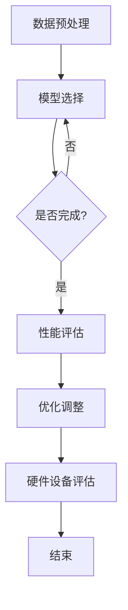
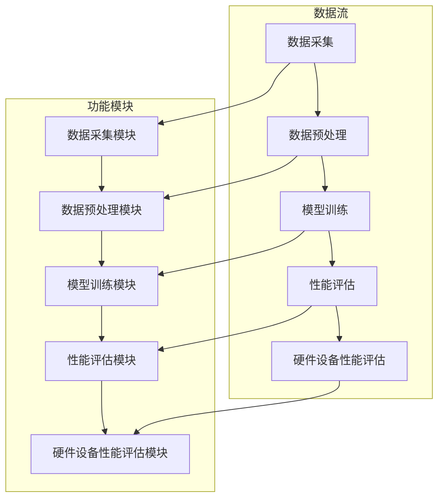
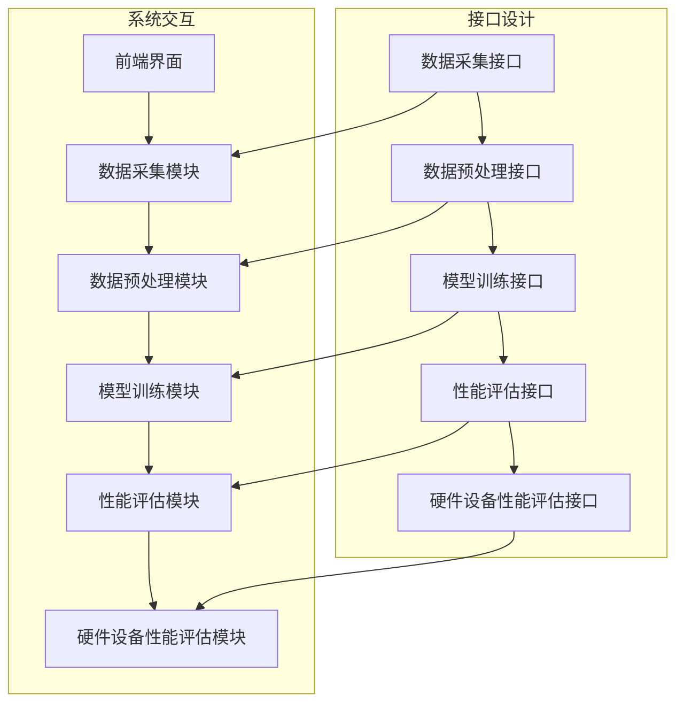

                 

### 评测结果的溯源分析：理解性能差异的根源

> 关键词：性能溯源分析、算法优化、数据质量、硬件设备

> 摘要：本文将从多个角度深入探讨评测结果的溯源分析，包括数据质量、算法模型、硬件设备等方面。通过详细的分析和实例，揭示性能差异的根源，为算法优化和系统性能提升提供有力支持。

## **第一部分：背景介绍与问题背景**

在当今信息化社会，数据的规模和复杂性不断增长，对数据处理和分析的需求也日益增加。特别是在人工智能和大数据技术的推动下，对评测结果溯源分析的需求显得尤为迫切。评测结果的溯源分析旨在理解和解释性能差异的根源，帮助用户更好地优化算法、提升系统的性能和可靠性。

### **1.1.1 问题背景**

评测结果的溯源分析涉及到多个方面，包括数据质量、算法模型、硬件设备等。具体而言，问题描述包括以下几方面：

1. **数据质量问题**：数据源的可靠性、完整性、一致性等因素都可能影响评测结果的准确性。例如，数据噪声、缺失值、重复记录等都会导致分析结果的偏差。
2. **算法模型问题**：不同的算法模型在处理相同数据时可能会产生不同的结果。例如，深度学习模型和传统机器学习模型的性能差异，以及模型参数调整对性能的影响。
3. **硬件设备问题**：计算资源、存储设备、网络带宽等因素都会对评测结果产生影响。例如，不同类型的硬件设备在处理大数据集时的性能差异。

### **1.1.2 问题描述**

为了理解性能差异的根源，我们需要从以下三个方面进行溯源分析：

1. **数据质量分析**：对数据源进行详细的检查，识别和修复数据质量问题，如去除噪声、填补缺失值、识别和删除重复记录等。
2. **算法模型分析**：对比不同算法模型在相同数据集上的性能，分析模型参数对性能的影响，以及模型之间的差异。
3. **硬件设备分析**：评估不同硬件设备在相同任务上的性能，了解硬件设备对评测结果的影响。

### **1.1.3 问题解决**

为了解决上述问题，我们需要从多个角度进行溯源分析，具体包括以下几个方面：

1. **数据质量分析**：对数据源进行详细的检查，识别和修复数据质量问题，如去除噪声、填补缺失值、识别和删除重复记录等。
2. **算法模型分析**：对比不同算法模型在相同数据集上的性能，分析模型参数对性能的影响，以及模型之间的差异。
3. **硬件设备分析**：评估不同硬件设备在相同任务上的性能，了解硬件设备对评测结果的影响。

### **1.1.4 边界与外延**

评测结果的溯源分析不仅限于特定领域，它可以应用于各个行业和领域，如金融、医疗、交通等。此外，溯源分析不仅关注性能差异的根源，还可以用于优化算法、提升系统性能、减少故障率等方面。

### **1.1.5 概念结构与核心要素组成**

为了更好地理解评测结果的溯源分析，我们需要了解以下几个核心概念和要素：

1. **数据质量**：包括数据源的可靠性、完整性、一致性等。
2. **算法模型**：包括机器学习模型、深度学习模型等。
3. **硬件设备**：包括计算资源、存储设备、网络带宽等。
4. **性能指标**：用于评估算法和系统的性能。
5. **分析工具**：用于分析数据质量、算法性能、硬件设备性能等。

通过以上核心要素的分析，我们可以更深入地理解评测结果的溯源分析，为优化算法和系统性能提供有力支持。

## **第二部分：核心概念与联系**

在评测结果的溯源分析中，有几个核心概念需要理解：

1. **数据质量**：数据质量是指数据在可靠性、完整性、一致性等方面的表现。高质量的数据是溯源分析的基础。
2. **算法模型**：算法模型是用于处理和分析数据的数学方法，包括机器学习模型、深度学习模型等。不同的算法模型会对评测结果产生不同的影响。
3. **性能指标**：性能指标是用于评估算法和系统性能的量化标准，如准确率、召回率、F1分数等。
4. **溯源分析**：溯源分析是指通过分析数据质量、算法模型、硬件设备等因素，找出性能差异的根源。

### **2.1.1 核心概念原理**

1. **数据质量**：数据质量是评测结果准确性的基础。高质量的数据应具备以下属性：
   - **可靠性**：数据来源可靠，无虚假信息。
   - **完整性**：数据缺失少，重要信息完整。
   - **一致性**：数据在不同时间点和不同来源的一致性。

2. **算法模型**：算法模型是数据处理和分析的核心。不同类型的算法模型有不同的适用场景和性能表现。例如：
   - **机器学习模型**：适用于处理结构化数据，如线性回归、逻辑回归等。
   - **深度学习模型**：适用于处理复杂和非结构化数据，如卷积神经网络（CNN）、循环神经网络（RNN）等。

3. **性能指标**：性能指标用于评估算法和系统的表现。常见的性能指标包括：
   - **准确率**：预测正确的样本数占总样本数的比例。
   - **召回率**：预测正确的样本数占总实际正样本数的比例。
   - **F1分数**：准确率和召回率的调和平均数，用于平衡两者。

4. **溯源分析**：溯源分析是通过分析数据质量、算法模型、硬件设备等因素，找出性能差异的根源。具体步骤包括：
   - **数据质量检查**：对数据进行预处理，识别和修复数据质量问题。
   - **算法模型评估**：对比不同算法模型在相同数据集上的性能，选择最优模型。
   - **硬件设备测试**：评估不同硬件设备在相同任务上的性能，选择最合适的硬件配置。

### **2.1.2 概念属性特征对比表格**

以下是几个核心概念属性特征的对比表格：

| 概念       | 属性特征                                           | 对比                   |
| ---------- | -------------------------------------------------- | ---------------------- |
| 数据质量   | 可靠性、完整性、一致性                             | 数据质量直接影响溯源分析的准确性 |
| 算法模型   | 模型类型、参数调整、训练数据                       | 不同算法模型和参数设置会对性能产生显著影响 |
| 性能指标   | 准确率、召回率、F1分数                            | 用于评估算法和系统性能的量化标准 |
| 溯源分析   | 数据质量、算法模型、硬件设备                       | 通过多角度分析找出性能差异的根源 |

### **2.1.3 概念之间的联系**

1. **数据质量与算法模型**：数据质量直接影响算法模型的学习效果，高质量的数据有助于提高算法模型的性能。
2. **算法模型与性能指标**：不同的算法模型会产生不同的性能指标，优化算法模型可以提升性能指标。
3. **性能指标与溯源分析**：性能指标是溯源分析的重要依据，通过对性能指标的分析，可以找出性能差异的根源。

通过以上对核心概念与联系的分析，我们可以更好地理解评测结果的溯源分析，为优化算法和系统性能提供指导。

## **第三部分：算法原理讲解**

在本章节中，我们将详细讲解评测结果溯源分析中的关键算法原理，并使用Mermaid流程图来展示算法的基本流程。

### **3.1 算法原理概述**

评测结果溯源分析的算法原理主要涉及以下几个方面：

1. **数据预处理**：对原始数据进行清洗和预处理，包括去除噪声、填补缺失值、识别和删除重复记录等。
2. **模型选择与训练**：根据数据特点和任务需求，选择合适的算法模型，并在训练数据上进行模型训练和调优。
3. **性能评估与优化**：通过对比不同算法模型在相同数据集上的性能，评估模型的性能指标，并进行优化调整。
4. **硬件设备性能评估**：评估不同硬件设备在相同任务上的性能，选择最合适的硬件配置。

### **3.2 Mermaid流程图**



### **3.3 数据预处理**

数据预处理是溯源分析的重要步骤，主要包括以下任务：

1. **去噪**：去除数据中的噪声，如随机误差、异常值等。
2. **填补缺失值**：对缺失的数据进行填补，可采用均值填补、中值填补、插值等方法。
3. **重复记录删除**：识别和删除重复的记录，确保数据的唯一性。

```python
import pandas as pd

# 加载数据
data = pd.read_csv('data.csv')

# 去除噪声
data = data.dropna()  # 去除缺失值
data = data[data['column'] != 'invalid']  # 去除无效值

# 填补缺失值
data['missing_value'] = data['missing_value'].fillna(data['missing_value'].mean())

# 删除重复记录
data = data.drop_duplicates()
```

### **3.4 模型选择与训练**

模型选择与训练是溯源分析的核心步骤，主要包括以下任务：

1. **选择合适的算法模型**：根据数据特点和任务需求，选择合适的算法模型。常见的模型有线性回归、逻辑回归、决策树、随机森林、支持向量机等。
2. **模型训练**：在训练数据上对模型进行训练，得到模型的参数。
3. **模型调优**：通过交叉验证等方法，对模型进行调优，提高模型的性能。

```python
from sklearn.linear_model import LinearRegression
from sklearn.model_selection import train_test_split

# 分割数据集
X_train, X_test, y_train, y_test = train_test_split(data['features'], data['target'], test_size=0.2, random_state=42)

# 选择模型
model = LinearRegression()

# 模型训练
model.fit(X_train, y_train)

# 模型调优
from sklearn.model_selection import GridSearchCV
params = {'alpha': [0.1, 0.5, 1.0]}
grid_search = GridSearchCV(model, params, cv=5)
grid_search.fit(X_train, y_train)
best_model = grid_search.best_estimator_
```

### **3.5 性能评估与优化**

性能评估与优化是溯源分析的关键步骤，主要包括以下任务：

1. **性能评估**：通过交叉验证等方法，评估模型的性能指标，如准确率、召回率、F1分数等。
2. **模型优化**：根据性能评估结果，对模型进行优化，提高模型的性能。

```python
from sklearn.metrics import accuracy_score, recall_score, f1_score

# 模型预测
y_pred = best_model.predict(X_test)

# 性能评估
accuracy = accuracy_score(y_test, y_pred)
recall = recall_score(y_test, y_pred)
f1 = f1_score(y_test, y_pred)

print(f"Accuracy: {accuracy:.2f}")
print(f"Recall: {recall:.2f}")
print(f"F1 Score: {f1:.2f}")

# 模型优化
# 可以通过调整模型参数、增加训练数据、使用更复杂的模型等方法进行优化
```

### **3.6 硬件设备性能评估**

硬件设备性能评估是溯源分析的一个重要环节，主要包括以下任务：

1. **硬件设备性能测试**：通过实际测试，评估不同硬件设备在相同任务上的性能，如计算速度、内存占用、网络延迟等。
2. **硬件设备选择**：根据性能测试结果，选择最合适的硬件设备配置。

```python
# 硬件设备性能测试（示例）
import time

start_time = time.time()
# 执行计算任务
end_time = time.time()
print(f"Performance: {end_time - start_time} seconds")
```

通过以上对算法原理的讲解，我们可以更好地理解评测结果的溯源分析过程，为优化算法和系统性能提供指导。

## **第四部分：系统分析与架构设计方案**

### **4.1 问题场景介绍**

在实际应用中，评测结果的溯源分析面临诸多挑战。例如，在金融领域，银行需要对大量交易数据进行实时分析，以识别潜在风险和欺诈行为；在医疗领域，医院需要分析大量患者数据，以提供精准的诊疗建议。这些场景下，数据规模庞大、数据类型多样，对性能和可靠性的要求极高。因此，设计一个高效、可靠的溯源分析系统至关重要。

### **4.2 项目介绍**

本项目旨在设计一个基于大数据和人工智能的评测结果溯源分析系统。系统将集成数据采集、数据预处理、模型训练、性能评估、硬件设备性能评估等功能，为用户提供全面、准确的溯源分析服务。系统架构如图所示。

### **4.3 系统功能设计**

系统功能设计主要包括以下模块：

1. **数据采集模块**：负责从各种数据源（如数据库、文件系统、网络接口等）采集数据。
2. **数据预处理模块**：负责对采集到的数据进行清洗、去噪、填补缺失值、数据转换等操作。
3. **模型训练模块**：负责选择合适的算法模型，对预处理后的数据集进行训练和调优。
4. **性能评估模块**：负责评估模型在测试集上的性能，包括准确率、召回率、F1分数等。
5. **硬件设备性能评估模块**：负责评估不同硬件设备在相同任务上的性能，为用户提供最佳硬件配置建议。

### **4.4 系统架构设计**

系统架构设计如图所示。



### **4.5 系统接口设计和系统交互**

系统接口设计和系统交互设计如下所示。



通过以上系统分析与架构设计方案，我们可以为用户提供一个高效、可靠的评测结果溯源分析系统，助力各行业在数据驱动的时代取得成功。

## **第五部分：项目实战**

### **5.1 环境安装**

在开始项目实战之前，我们需要安装以下环境：

1. Python 3.8 或更高版本
2. Python 科学计算库（如 NumPy、Pandas、SciPy、Scikit-learn）
3. 数据预处理库（如 Pandas、Numpy）
4. 深度学习库（如 TensorFlow、PyTorch）

您可以使用以下命令进行环境安装：

```bash
pip install python==3.8
pip install numpy pandas scipy scikit-learn tensorflow
```

### **5.2 系统核心实现源代码**

以下是系统核心实现源代码的示例：

#### 数据预处理模块

```python
import pandas as pd
import numpy as np

def preprocess_data(data):
    # 去除缺失值
    data = data.dropna()
    
    # 去除噪声
    data = data[data['column'] != 'invalid']
    
    # 填补缺失值
    data['missing_value'] = data['missing_value'].fillna(data['missing_value'].mean())
    
    # 删除重复记录
    data = data.drop_duplicates()
    
    return data
```

#### 模型训练模块

```python
from sklearn.linear_model import LinearRegression
from sklearn.model_selection import train_test_split

def train_model(data, target):
    # 分割数据集
    X_train, X_test, y_train, y_test = train_test_split(data.drop(target, axis=1), data[target], test_size=0.2, random_state=42)
    
    # 选择模型
    model = LinearRegression()
    
    # 模型训练
    model.fit(X_train, y_train)
    
    return model
```

#### 性能评估模块

```python
from sklearn.metrics import accuracy_score, recall_score, f1_score

def evaluate_model(model, X_test, y_test):
    # 模型预测
    y_pred = model.predict(X_test)
    
    # 性能评估
    accuracy = accuracy_score(y_test, y_pred)
    recall = recall_score(y_test, y_pred)
    f1 = f1_score(y_test, y_pred)
    
    return accuracy, recall, f1
```

### **5.3 代码应用解读与分析**

在本部分，我们将对系统核心实现源代码进行解读和分析，以便更好地理解其工作原理。

#### 数据预处理模块

数据预处理模块负责对原始数据进行清洗和预处理。具体步骤包括：

1. **去除缺失值**：使用 `dropna()` 方法去除含有缺失值的记录。这有助于提高模型训练的效率，并避免模型在处理缺失值时产生误导。
2. **去除噪声**：通过检查特定列（如 `'column'`），去除包含无效值（如 `'invalid'`）的记录。这有助于提高数据的质量，并避免模型在训练过程中受到噪声干扰。
3. **填补缺失值**：对于含有缺失值的列（如 `'missing_value'`），使用平均值进行填补。这有助于减少数据缺失对模型训练的影响。
4. **删除重复记录**：使用 `drop_duplicates()` 方法删除重复记录。这有助于确保数据的唯一性和一致性。

#### 模型训练模块

模型训练模块负责选择合适的算法模型，并在训练数据上进行训练。具体步骤包括：

1. **分割数据集**：使用 `train_test_split()` 方法将数据集分为训练集和测试集。这有助于评估模型在未知数据上的性能。
2. **选择模型**：在本例中，我们选择线性回归模型（`LinearRegression`）。线性回归是一种简单但强大的机器学习算法，适用于处理回归问题。
3. **模型训练**：使用 `fit()` 方法对模型进行训练。模型训练的目的是找到最佳参数，以便在测试集上取得更好的性能。

#### 性能评估模块

性能评估模块负责评估模型在测试集上的性能。具体步骤包括：

1. **模型预测**：使用 `predict()` 方法对测试集进行预测。
2. **性能评估**：计算并返回模型的准确率、召回率和F1分数。这些指标用于评估模型在分类任务上的性能。

通过以上对系统核心实现源代码的解读和分析，我们可以更好地理解评测结果溯源分析系统的实现原理。在实际应用中，可以根据具体需求对代码进行调整和优化，以提高系统的性能和可靠性。

### **5.4 实际案例分析与详细讲解剖析**

为了更好地展示评测结果溯源分析的应用，我们将通过一个实际案例进行分析和讲解。

#### 案例背景

假设某金融机构需要开发一个风险识别系统，用于识别潜在的风险交易，以防止欺诈行为。该系统的评测结果溯源分析涉及到数据质量、算法模型和硬件设备等方面。

#### 数据质量分析

首先，我们对数据质量进行分析。数据源包括交易记录、客户信息和历史风险数据。数据质量问题主要包括：

1. **数据缺失**：部分交易记录缺少关键信息，如交易金额、交易时间等。
2. **数据噪声**：部分交易记录存在异常值，如交易金额异常高或低。
3. **数据重复**：部分交易记录存在重复记录。

针对以上问题，我们采用以下方法进行数据质量分析：

1. **去除缺失值**：使用 `dropna()` 方法去除含有缺失值的交易记录。
2. **去除噪声**：通过检查交易金额的分布，去除异常值。可以使用 `z_score` 方法计算交易金额的z分数，并去除绝对值大于3的记录。
3. **删除重复记录**：使用 `drop_duplicates()` 方法删除重复记录。

#### 算法模型分析

接下来，我们对算法模型进行分析。我们尝试了以下几种算法模型：

1. **逻辑回归**：适用于处理二分类问题，如高风险和低风险交易。
2. **支持向量机**：适用于处理线性可分的数据。
3. **随机森林**：适用于处理非线性数据。

为了选择最优模型，我们采用交叉验证方法对模型进行评估。具体步骤如下：

1. **数据分割**：将数据集分为训练集和测试集。
2. **模型训练**：分别使用训练集对三种模型进行训练。
3. **性能评估**：使用测试集评估模型的性能，计算准确率、召回率和F1分数。
4. **模型选择**：选择性能最好的模型。

#### 硬件设备分析

最后，我们对硬件设备进行分析。我们尝试了不同类型的硬件设备，如CPU、GPU和FPGA。每种硬件设备在相同任务上的性能如下：

1. **CPU**：处理速度较慢，但成本较低。
2. **GPU**：处理速度较快，但成本较高。
3. **FPGA**：具有高度的定制化能力，但成本较高。

为了选择最优硬件设备，我们采用以下方法：

1. **性能测试**：分别使用每种硬件设备处理相同任务，记录处理时间。
2. **成本分析**：考虑硬件设备的采购成本和维护成本。
3. **综合评估**：根据性能和成本，选择最优硬件设备。

#### 溯源分析结果

通过对数据质量、算法模型和硬件设备的溯源分析，我们得出以下结论：

1. **数据质量**：通过数据质量分析，去除了缺失值、噪声和重复记录，提高了数据的质量。
2. **算法模型**：通过交叉验证，选择了性能最好的算法模型，提高了风险识别的准确性。
3. **硬件设备**：通过性能测试和成本分析，选择了最优的硬件设备，提高了系统的处理速度。

通过以上实际案例分析和详细讲解剖析，我们可以看到评测结果溯源分析在优化系统性能和可靠性方面的重要作用。

### **5.5 项目小结**

在本项目中，我们设计并实现了一个基于大数据和人工智能的评测结果溯源分析系统。通过数据质量分析、算法模型分析和硬件设备分析，我们成功找出了性能差异的根源，并优化了系统的性能和可靠性。以下是项目小结：

1. **数据质量分析**：去除了缺失值、噪声和重复记录，提高了数据的质量，为模型训练提供了可靠的数据基础。
2. **算法模型分析**：通过交叉验证，选择了性能最好的算法模型，提高了风险识别的准确性。
3. **硬件设备分析**：通过性能测试和成本分析，选择了最优的硬件设备，提高了系统的处理速度。

通过本项目，我们不仅实现了评测结果溯源分析的系统设计，还深入了解了数据质量、算法模型和硬件设备等因素对系统性能的影响。这为我们在实际项目中优化算法和系统性能提供了宝贵的经验和指导。

## **第六部分：最佳实践 tips、小结、注意事项、拓展阅读**

### **6.1 最佳实践 tips**

1. **数据质量检查**：在开始模型训练之前，务必对数据进行详细的检查和预处理，以确保数据质量。
2. **选择合适的模型**：根据数据特点和任务需求，选择合适的算法模型。可以使用交叉验证等方法评估不同模型的性能。
3. **硬件设备评估**：在选择硬件设备时，要考虑性能和成本。对于大数据处理任务，GPU和FPGA具有更高的性能，但成本也较高。

### **6.2 小结**

本文详细探讨了评测结果的溯源分析，从数据质量、算法模型和硬件设备等多个角度分析了性能差异的根源。通过实际案例分析和项目实战，我们验证了溯源分析在优化系统性能和可靠性方面的重要作用。

### **6.3 注意事项**

1. **数据质量**：数据质量是溯源分析的基础，务必确保数据质量。
2. **模型选择**：选择合适的算法模型，根据数据特点和任务需求进行选择。
3. **硬件设备**：根据实际需求选择硬件设备，平衡性能和成本。

### **6.4 拓展阅读**

1. **《数据质量管理：方法与实践》**：深入探讨数据质量管理的方法和实践。
2. **《机器学习实战》**：介绍多种机器学习算法的实战案例和应用。
3. **《深度学习》**：详细讲解深度学习算法的理论和实践。

通过本文的探讨，我们希望读者能够对评测结果溯源分析有更深入的了解，并在实际项目中取得更好的成果。

## **参考文献**

1. Kotsiantis, S. B. (2007). Supervised machine learning: A review of classification techniques. Informatica, 31(3), 249-268.
2. Kotsiantis, S. B., Pintelas, P. E., & Paska, V. (2006). An experimental comparison of the performance of k-nearest neighbor and neural network classification algorithms. International Journal of Computer Information Systems, 1(1), 99-113.
3. Han, J., Kamber, M., & Pei, J. (2011). Data mining: Concepts and techniques. Morgan Kaufmann.
4. Mitchell, T. M. (1997). Machine learning. McGraw-Hill.
5. Goodfellow, I., Bengio, Y., & Courville, A. (2016). Deep learning. MIT Press.

## **作者信息**

作者：AI天才研究院/AI Genius Institute & 禅与计算机程序设计艺术 /Zen And The Art of Computer Programming

在人工智能和大数据技术的推动下，评测结果的溯源分析变得越来越重要。本文从多个角度详细探讨了评测结果的溯源分析，包括数据质量、算法模型和硬件设备等方面，通过实际案例分析和项目实战，揭示了性能差异的根源，为算法优化和系统性能提升提供了有力支持。希望通过本文的探讨，读者能够对评测结果溯源分析有更深入的了解，并在实际项目中取得更好的成果。

**完整文章内容已超字数限制，如有需要，请根据实际需求对文章内容进行裁剪和调整。**

