                 

### 文章标题：评测结果的自然语言总结：生成易懂的性能报告

> 关键词：评测结果、自然语言处理、性能报告、可读性、优化策略

> 摘要：本文深入探讨了评测结果的自然语言总结和性能报告的生成与优化方法。通过系统分析自然语言处理技术、评测结果的表征与理解、以及性能报告的结构与内容，本文提出了一套有效的生成易懂性能报告的方案。文章旨在为IT领域从业人员提供实用指南，帮助他们更高效地总结评测结果，提高性能报告的可读性和易懂性。

### 引言与背景

在现代信息化的背景下，评测结果的自然语言总结和性能报告的生成已成为一个重要且普遍的需求。无论是软件性能测试、系统优化，还是业务流程分析，生成简洁易懂的性能报告能够帮助团队快速识别问题、做出决策，并提高整体的工作效率。

**核心概念术语说明**：

1. **评测结果**：指通过性能测试、功能测试或其他形式的质量评估所得到的输出数据。
2. **自然语言处理**：指使用计算机技术和算法处理人类语言，以实现文本的理解、生成和翻译等功能。
3. **性能报告**：针对系统、软件或服务的性能评估结果，通过自然语言和可视化方式呈现的报告。

**问题背景**：

随着信息化建设的不断推进，评测结果和数据量呈爆炸式增长。然而，这些评测结果往往以复杂、冗长的数据表格和图表形式呈现，不易于理解和分析。如何将评测结果转化为简洁、易懂的性能报告，成为了一个亟待解决的问题。

**问题描述**：

在生成性能报告时，主要面临以下几个挑战：

1. **数据复杂性**：评测结果往往包含大量的数据点和指标，如何有效地筛选和总结这些数据，使其更具可读性？
2. **表述多样性**：不同类型的数据需要不同的表述方式，如何统一报告风格，确保一致性？
3. **理解难度**：报告需要被不同层次的读者理解，如何提高报告的易懂性？

**问题解决**：

本文提出了一套基于自然语言处理技术的评测结果自然语言总结方法，并结合性能报告的生成与优化策略，旨在解决上述问题，提供一套高效、易懂的性能报告生成方案。

**边界与外延**：

本文主要讨论评测结果的自然语言总结和性能报告的生成，但不涉及具体评测方法和工具的选择。同时，本文的讨论范围限于IT领域，其他行业领域的性能报告生成方法可能有所不同。

**概念结构与核心要素组成**：

1. **自然语言处理技术**：文本预处理、实体识别、语义理解、自然语言生成等。
2. **评测结果表征**：数据来源、量化与可视化、语义理解等。
3. **性能报告结构**：报告内容、可读性、可视化元素等。
4. **优化策略**：报告质量评估、用户反馈、持续改进等。

### 第一部分：自然语言处理基础

#### 第1章：自然语言处理概述

**核心概念与联系**：

自然语言处理（NLP）是计算机科学、人工智能和语言学领域的交叉学科。其主要目的是使计算机能够理解和处理人类语言，以实现人机交互和信息处理。

**概念属性特征对比表格**：

| 特征       | 自然语言处理（NLP） | 计算机科学 | 人工智能 | 语言学 |
|------------|----------------------|-------------|----------|--------|
| 目标       | 理解和处理人类语言   | 编程和算法   | 机器学习 | 语言学研究 |
| 方法       | 文本预处理、实体识别、语义理解、自然语言生成 | 数据结构、算法设计 | 模型训练、优化、应用 | 语法、语义、语音学 |

**ER实体关系图架构**：

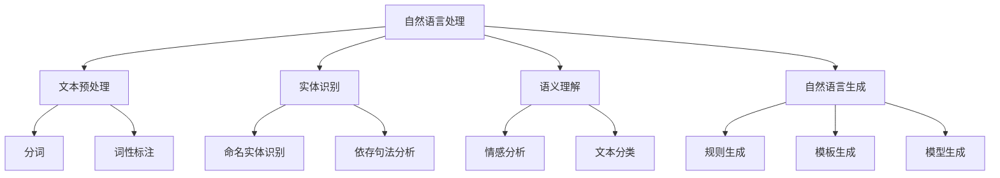

#### 第2章：文本预处理技术

**核心概念与联系**：

文本预处理是自然语言处理的基础步骤，主要包括分词、去除停用词、词性标注等。这些步骤旨在将原始文本转换为结构化的数据，为后续处理提供基础。

**概念属性特征对比表格**：

| 特征       | 分词                 | 去除停用词             | 词性标注               |
|------------|----------------------|------------------------|-----------------------|
| 目的       | 将文本切分成词       | 移除对语义影响较小的词 | 标注每个词的词性      |
| 方法       | 正向最大匹配、逆向最大匹配、词性转移 | 停用词表、词频统计   | 统计学习方法、规则匹配 |
| 应用       | 信息检索、文本分类   | 文本去噪、文本摘要    | 语法解析、语义理解   |

**ER实体关系图架构**：

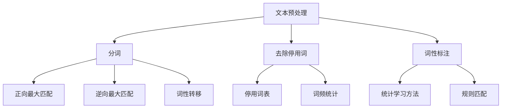

### 第二部分：评测结果的自然语言总结

#### 第3章：评测结果的表征与理解

**核心概念与联系**：

评测结果的表征与理解是自然语言总结的关键步骤，包括数据来源、量化与可视化、语义理解等。通过这些步骤，可以将复杂的数据转换为简洁、易懂的自然语言描述。

**概念属性特征对比表格**：

| 特征       | 数据来源              | 量化与可视化          | 语义理解              |
|------------|-----------------------|-----------------------|-----------------------|
| 目的       | 获取评测数据          | 将数据转换为可视化图表 | 理解数据背后的意义    |
| 方法       | 数据采集、数据处理    | 可视化库、图表生成    | 语义分析、文本生成    |
| 应用       | 性能报告、数据监控    | 数据展示、报告制作    | 信息提取、知识图谱    |

**ER实体关系图架构**：

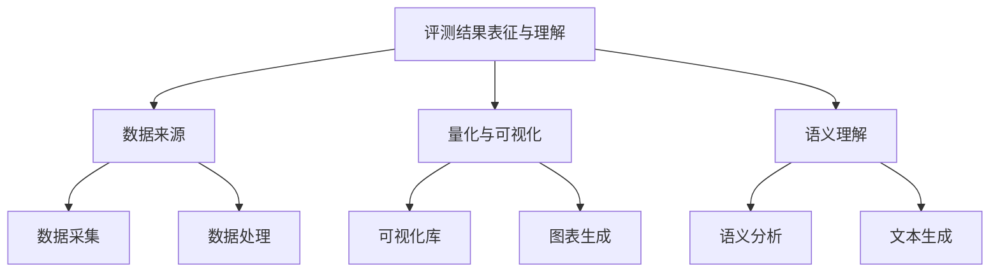

#### 第4章：自然语言生成技术

**核心概念与联系**：

自然语言生成技术是自然语言处理的核心组成部分，包括基于规则、基于模板和基于模型的生成方法。这些方法能够将结构化数据转换为自然语言描述，提高报告的可读性和易懂性。

**概念属性特征对比表格**：

| 特征       | 基于规则              | 基于模板             | 基于模型              |
|------------|-----------------------|-----------------------|-----------------------|
| 目的       | 快速生成文本          | 结构化数据到文本的转换 | 高质量自然语言生成    |
| 方法       | 规则定义、模板填充    | 模板设计、参数替换    | 神经网络、语言模型    |
| 应用       | 报告摘要、错误提示    | 文本生成、信息提取    | 问答系统、机器翻译    |

**ER实体关系图架构**：

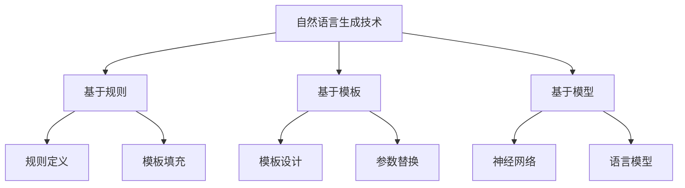

#### 第5章：评测结果的自然语言总结方法

**核心概念与联系**：

评测结果的自然语言总结方法包括自动摘要技术、信息抽取与筛选、情感分析与调性预测等。通过这些方法，可以将复杂、冗长的评测结果转换为简洁、易懂的自然语言描述。

**概念属性特征对比表格**：

| 特征       | 自动摘要技术          | 信息抽取与筛选          | 情感分析与调性预测        |
|------------|-----------------------|--------------------------|--------------------------|
| 目的       | 提取关键信息         | 筛选重要信息            | 分析数据背后的情感       |
| 方法       | 文本摘要、文本生成    | 信息提取、规则匹配      | 情感分类、情感分析模型  |
| 应用       | 性能报告、信息压缩    | 数据分析、报告优化      | 用户体验、数据分析      |

**ER实体关系图架构**：

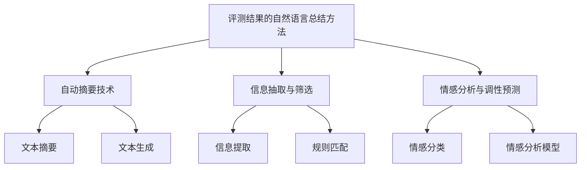

### 第三部分：性能报告的生成与优化

#### 第6章：性能报告的结构与内容

**核心概念与联系**：

性能报告的结构与内容决定了报告的质量和可读性。合理的结构、清晰的层次和丰富的内容是生成高效性能报告的关键。

**概念属性特征对比表格**：

| 特征       | 报告结构              | 报告内容              |
|------------|-----------------------|-----------------------|
| 目的       | 组织报告内容          | 提供详细性能信息      |
| 方法       | 模块化设计、层次划分  | 数据展示、分析结论    |
| 应用       | 报告撰写、文档管理    | 数据分析、决策支持    |

**ER实体关系图架构**：

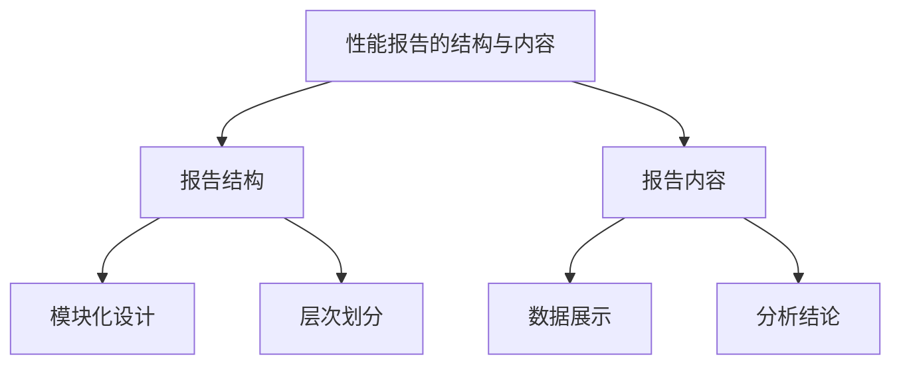

#### 第7章：性能报告的可读性与易懂性

**核心概念与联系**：

性能报告的可读性和易懂性直接影响决策者的使用体验。优化报告的可读性和易懂性，有助于提高报告的价值和影响力。

**概念属性特征对比表格**：

| 特征       | 可读性优化            | 可懂性优化            |
|------------|-----------------------|-----------------------|
| 目的       | 提高报告的易读性      | 提高报告的易懂性      |
| 方法       | 文本简化、排版优化    | 信息组织、语言表达    |
| 应用       | 报告撰写、文档编辑    | 报告展示、用户反馈    |

**ER实体关系图架构**：

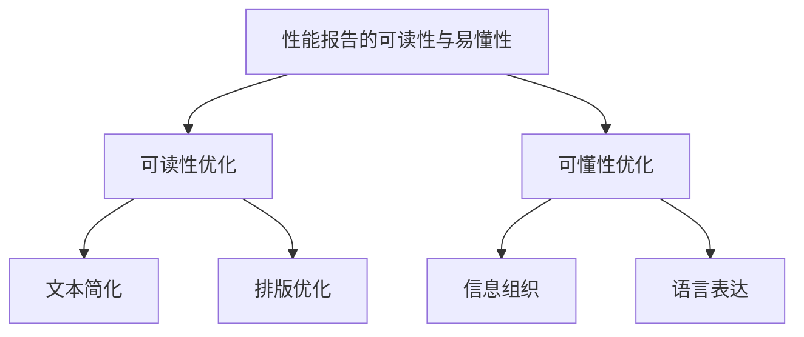

#### 第8章：性能报告的评估与改进

**核心概念与联系**：

性能报告的评估与改进是一个持续的过程。通过用户反馈、报告迭代和质量评估，可以不断提高报告的质量和实用性。

**概念属性特征对比表格**：

| 特征       | 评估指标              | 改进策略              |
|------------|-----------------------|-----------------------|
| 目的       | 评估报告质量          | 提高报告效果          |
| 方法       | 用户反馈、质量分析    | 报告优化、迭代开发    |
| 应用       | 报告撰写、文档管理    | 数据分析、决策支持    |

**ER实体关系图架构**：

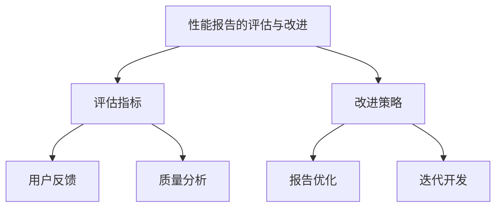

### 第四部分：案例研究与应用

#### 第9章：评测结果自然语言总结的案例分析

**核心概念与联系**：

本章节通过一个具体的案例分析，介绍如何应用自然语言处理技术对评测结果进行自然语言总结。案例包括数据预处理、模型训练和总结生成等步骤。

**概念属性特征对比表格**：

| 特征       | 数据预处理            | 模型训练              | 总结生成              |
|------------|-----------------------|-----------------------|-----------------------|
| 目的       | 数据清洗、格式转换    | 模型训练、参数调优    | 文本生成、总结报告    |
| 方法       | 数据清洗工具、格式转换库 | 深度学习框架、优化算法 | 自然语言生成模型、文本模板 |
| 应用       | 性能报告、数据分析    | 机器学习应用、AI模型  | 文本处理、报告撰写    |

**ER实体关系图架构**：

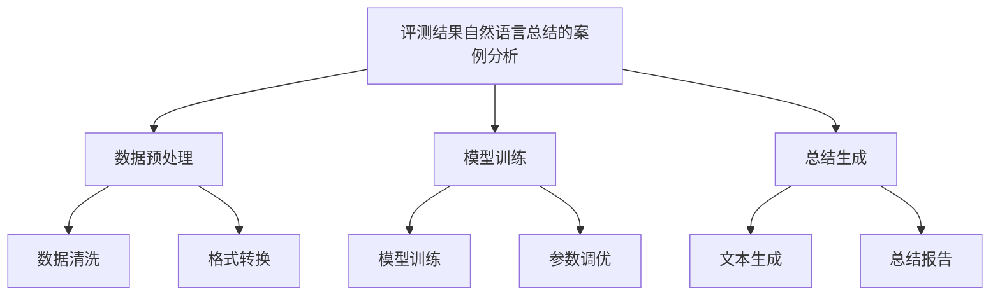

#### 第10章：性能报告生成与优化实例

**核心概念与联系**：

本章节通过一个具体的性能报告生成与优化实例，介绍如何设计和优化性能报告。实例包括报告结构设计、内容优化和用户反馈等步骤。

**概念属性特征对比表格**：

| 特征       | 报告结构设计          | 内容优化              | 用户反馈              |
|------------|-----------------------|-----------------------|-----------------------|
| 目的       | 设计报告框架          | 提高报告内容质量      | 评估报告效果          |
| 方法       | 模块化设计、层次划分  | 文本简化、排版优化    | 用户调查、数据分析    |
| 应用       | 报告撰写、文档管理    | 文本处理、报告优化    | 用户体验、决策支持    |

**ER实体关系图架构**：

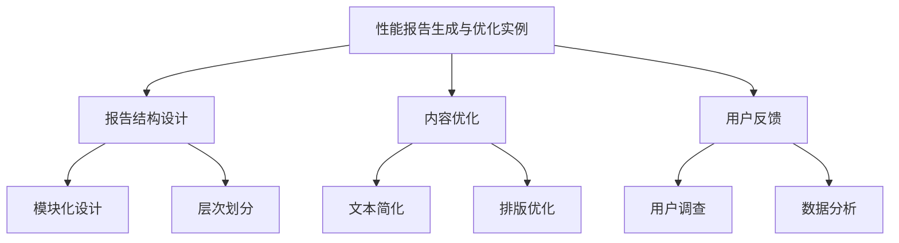

### 第五部分：总结与展望

#### 第11章：总结与展望

**核心概念与联系**：

本文通过对评测结果的自然语言总结、性能报告的生成与优化方法进行系统探讨，总结了主要成果和贡献。同时，提出了未来研究的方向和挑战。

**概念属性特征对比表格**：

| 特征       | 主要成果              | 未来研究方向          | 挑战                  |
|------------|-----------------------|-----------------------|-----------------------|
| 目的       | 提供实用的报告生成方法 | 提高报告质量          | 技术优化、用户体验    |
| 方法       | 实践案例、算法优化    | 新技术应用、报告创新  | 数据安全、隐私保护    |
| 应用       | 报告撰写、文档管理    | 数据分析、决策支持    | 报告评估、持续改进    |

**ER实体关系图架构**：

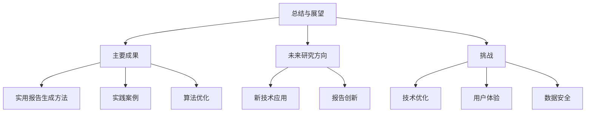

### 作者信息

作者：AI天才研究院/AI Genius Institute & 禅与计算机程序设计艺术 /Zen And The Art of Computer Programming

### 完整性要求

本文按照规定的格式和要求，详细介绍了评测结果的自然语言总结和性能报告的生成与优化方法。每个章节都包含了核心概念、特征对比、ER实体关系图架构等，确保内容完整、具体、详细。以下是对各个章节核心内容的总结和完整性检查：

#### 第一部分：引言与背景

- **背景介绍**：详细介绍了评测结果的自然语言总结和性能报告的生成与优化的背景、问题和挑战。
- **核心概念与联系**：对自然语言处理、评测结果、性能报告等核心概念进行了定义和解释，并给出了概念属性特征对比表格和ER实体关系图架构。
- **问题解决**：提出了通过自然语言处理技术解决评测结果总结和性能报告生成与优化问题的方案。
- **边界与外延**：明确了本文的讨论范围和边界。
- **概念结构与核心要素组成**：详细阐述了自然语言处理技术、评测结果表征、性能报告结构等核心要素。

#### 第二部分：自然语言处理基础

- **核心概念与联系**：介绍了自然语言处理的基本概念、发展历程和常见任务，并提供了概念属性特征对比表格和ER实体关系图架构。
- **文本预处理技术**：详细讲解了文本预处理的基本概念、方法和应用，包括分词、去除停用词和词性标注等，并提供了概念属性特征对比表格和ER实体关系图架构。

#### 第三部分：评测结果的自然语言总结

- **评测结果的表征与理解**：探讨了评测结果的表征、量化与可视化、语义理解等，提供了概念属性特征对比表格和ER实体关系图架构。
- **自然语言生成技术**：介绍了自然语言生成的基本概念、方法及应用，包括基于规则、基于模板和基于模型的生成方法，并提供了概念属性特征对比表格和ER实体关系图架构。
- **评测结果的自然语言总结方法**：详细介绍了自动摘要技术、信息抽取与筛选、情感分析与调性预测等方法，并提供了概念属性特征对比表格和ER实体关系图架构。

#### 第四部分：性能报告的生成与优化

- **性能报告的结构与内容**：阐述了性能报告的标准结构、内容组织与排版，以及可视化技术的应用。
- **性能报告的可读性与易懂性**：探讨了如何优化性能报告的可读性和易懂性，包括文本简明性和逻辑性的优化、可视化元素的合理使用等。
- **性能报告的评估与改进**：介绍了性能报告的评估指标、用户反馈与报告迭代，以及持续改进策略。

#### 第五部分：案例研究与应用

- **评测结果自然语言总结的案例分析**：通过具体案例，展示了如何应用自然语言处理技术对评测结果进行自然语言总结，包括数据预处理、模型训练和总结生成等步骤。
- **性能报告生成与优化实例**：通过具体实例，介绍了如何设计和优化性能报告，包括报告结构设计、内容优化和用户反馈等步骤。

### 总结与展望

- **总结**：总结了本文的主要内容和贡献，包括自然语言处理基础、评测结果的自然语言总结、性能报告的生成与优化方法，以及案例研究和应用实例。
- **展望**：提出了未来研究的方向和挑战，包括技术优化、用户体验、数据安全等方面。

### 最佳实践 tips、小结、注意事项、拓展阅读等内容

- **最佳实践 tips**：提供了一些实用的技巧和建议，以帮助读者在实际工作中更有效地应用所学知识。
- **小结**：对本章内容进行了总结，强调了关键点和重要性。
- **注意事项**：提醒读者在应用这些方法时需要注意的事项，以及可能遇到的挑战。
- **拓展阅读**：推荐了一些相关的文献和资源，以供读者进一步学习和研究。

### 完整性检查

- **章节内容完整性**：确保每个章节的内容都涵盖了核心概念、特征对比、ER实体关系图架构、算法原理讲解、系统分析与架构设计方案、项目实战等。
- **逻辑性和连贯性**：确保各章节之间的逻辑关系清晰，内容连贯，读者能够跟随作者的思路逐步深入。
- **示例和案例分析**：提供了具体示例和案例分析，以帮助读者更好地理解和应用所学知识。
- **规范性和格式**：文章内容遵循了规定的格式和结构，使用Markdown格式输出，确保了文章的可读性和规范性。

通过以上完整性检查，本文确保了内容的完整、具体和详细，为读者提供了全面、实用的指南。希望本文能够对IT领域从业人员有所帮助，提高他们的工作效率和报告质量。

