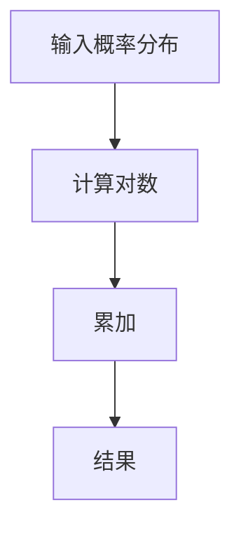
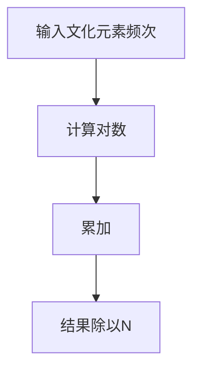
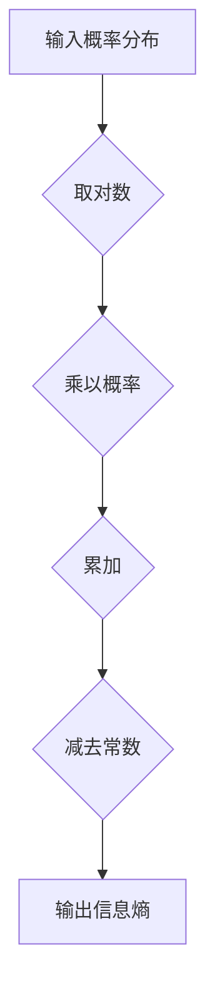
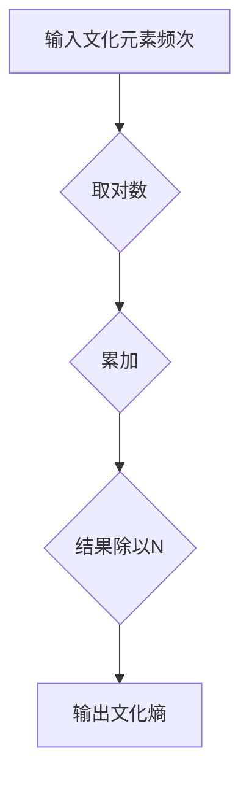
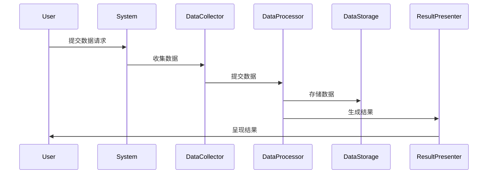
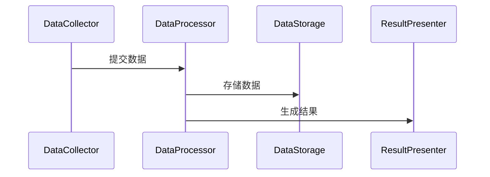
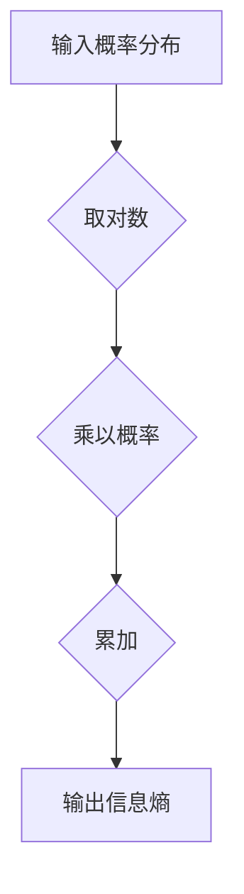

                 

### 第1章 背景介绍

#### 1.1 问题背景
语言多样性和文化丰富度是现代社会发展的重要指标，它们反映了社会的多元化和包容性。语言多样性的重要性在于它不仅代表了人类文明的历史积淀，还展示了不同地区的文化特色和人们的生活习惯。而文化丰富度则是一个国家或地区文化多样性和文化创新能力的重要体现。这两者之间有着密切的联系：一个地区的语言多样性往往与其文化丰富度成正比。

在信息技术迅猛发展的今天，如何定量地度量语言多样性和文化丰富度成为一个亟待解决的问题。传统的定性分析方法难以提供客观的量化指标，而定量分析方法则可以通过数学模型和信息熵等工具，对语言多样性和文化丰富度进行精确的度量。

#### 1.2 问题描述
首先，我们需要明确如何定量度量语言多样性。语言多样性涉及词汇量、语法结构、方言差异等多个维度。如何从这些维度出发，构建一个能够全面反映语言多样性的量化指标，是一个核心问题。

其次，度量文化丰富度也是一个复杂的过程。文化丰富度不仅包括了物质文化遗产，还涉及到非物质文化遗产、文化交流、文化创新等方面。如何设计一个能够全面衡量文化丰富度的数学模型，是另一个需要解决的问题。

#### 1.3 问题解决
为了解决上述问题，我们可以采用信息熵这一数学工具来度量语言多样性。信息熵是信息论中的一个基本概念，它表示信息的混乱程度或不确定性。在语言多样性的背景下，信息熵可以用来衡量不同语言或方言之间的差异程度。

对于文化丰富度的度量，我们可以使用信息熵的扩展模型，如文化熵。文化熵可以结合信息熵的基本原理，同时考虑文化元素之间的相互关系和多样性。

#### 1.4 边界与外延
在度量语言多样性和文化丰富度时，我们需要明确其边界和范围。语言多样性主要涉及语言本身的结构和内容，而文化丰富度则包括了更广泛的文化现象。例如，在度量语言多样性时，我们需要关注不同语言的词汇量、语法结构和发音特点；在度量文化丰富度时，我们需要考虑文化活动的多样性、文化交流的频率和文化创新的能力。

#### 1.5 概念结构与核心要素组成
为了更清晰地理解语言多样性和文化丰富度，我们可以从概念结构和核心要素入手。语言多样性的核心要素包括词汇量、语法结构和方言差异等；文化丰富度的核心要素则包括物质文化遗产、非物质文化遗产、文化交流和文化创新等。通过明确这些核心要素，我们可以更好地设计和实施度量方法。

### 目录大纲设计步骤：

#### 1.6 目录大纲设计步骤
1. **需求分析**：
   - 明确目标：确定我们需要解决的主要问题，如如何度量语言多样性和文化丰富度。
   - 收集资料：查阅相关文献，了解现有的度量方法和理论。

2. **内容规划**：
   - 设计框架：根据需求分析，构建整体内容框架，确保覆盖所有关键点。
   - 分章节设计：将整体内容细化为各个章节，每个章节都明确主题和目标。

3. **内容细化**：
   - 核心概念讲解：详细解释语言多样性和文化丰富度的核心概念，如信息熵、文化熵等。
   - 算法原理讲解：介绍具体的度量算法，如信息熵计算算法和文化丰富度度量算法。
   - 数学模型和公式讲解：使用latex格式给出度量语言多样性和文化丰富度的数学模型和公式。

4. **系统架构设计**：
   - 问题场景介绍：描述具体的度量场景，如语言多样性分析和文化丰富度分析。
   - 系统功能设计：设计系统功能，包括数据收集、处理和分析等。
   - 系统架构设计：绘制系统架构图，明确系统模块和接口设计。

5. **项目实战**：
   - 环境安装：说明安装所需环境，如编程语言、库和工具等。
   - 系统核心实现：展示具体的代码实现，并进行解读和分析。
   - 实际案例：提供实际案例分析，深入剖析度量过程和结果。

6. **最佳实践**：
   - 注意事项：总结在使用信息熵和文化熵时需要注意的问题。
   - 拓展阅读：推荐进一步阅读的相关文献和资料。

通过以上步骤，我们可以确保目录大纲的完整性、逻辑性和可操作性。下面，我们将进一步细化每个章节的内容，以确保整篇文章的连贯性和深度。

### 第2章 核心概念与联系

在探讨语言多样性和文化丰富度时，理解核心概念及其相互联系是至关重要的。这一章将详细解释信息熵、文化丰富度和它们之间的联系。

#### 2.1 信息熵原理

信息熵（Entropy）是信息论中的一个基本概念，由克劳德·香农（Claude Shannon）在1948年首次提出。信息熵用于衡量信息的混乱程度或不确定性。在数学上，信息熵通常表示为：

\[ H = -\sum_{i=1}^{n} p(x_i) \log_2 p(x_i) \]

其中，\( p(x_i) \)表示第\( i \)个事件发生的概率，\( n \)是事件的总数。这个公式告诉我们，一个事件发生概率越低，其对信息熵的贡献就越大。

信息熵的属性特征可以通过以下表格进行对比：

| 属性特征 | 说明 |
| --- | --- |
| 非负性 | 信息熵总是非负的，最小值为0。 |
| 确定性 | 当所有事件的概率相等时，信息熵最大。 |
| 累积性 | 信息熵具有累积性，即多个独立事件的信息熵之和等于每个事件信息熵的加和。 |

以下是一个Mermaid流程图，展示了信息熵的基本计算过程：



#### 2.2 文化丰富度

文化丰富度（Cultural Richness）是指一个地区或社会中文化元素的多样性和复杂性。它不仅包括物质文化遗产，如建筑、艺术品和手工艺品，还包括非物质文化遗产，如传统习俗、表演艺术和口头传说。文化丰富度反映了社会的文化多样性、文化交流的活跃程度和文化创新的能力。

文化丰富度的度量可以采用信息熵的扩展模型——文化熵（Cultural Entropy）。文化熵旨在衡量文化元素之间的差异和多样性。其公式为：

\[ C = \frac{1}{N} \sum_{i=1}^{N} \log_2(n_i) \]

其中，\( N \)是文化元素的总数，\( n_i \)是第\( i \)个文化元素的频次。

以下是一个Mermaid流程图，展示了文化熵的基本计算过程：



#### 2.3 概念联系

信息熵和文化丰富度之间有着紧密的联系。信息熵为度量语言多样性和文化丰富度提供了一个数学工具。语言多样性可以视为文化丰富度的一部分，因为语言是文化的重要载体。

语言多样性与文化丰富度的关系可以通过以下ER实体关系图架构进行描述：

```mermaid
erDiagram
  Lang : 语言
  Cult : 文化
  LR : 语言丰富度
  CR : 文化丰富度
  
  Lang ||--|> LR : 语言丰富度包含语言
  Cult ||--|> CR : 文化丰富度包含文化
  LR ||--|> Cult : 语言丰富度和文化丰富度相互联系
```

通过这个ER图，我们可以看到语言丰富度和文化丰富度是相互关联的实体，它们共同构成了文化多样性的度量基础。信息熵则作为数学工具，贯穿于这两个实体的度量过程中。

### 第3章 算法原理讲解

在了解了信息熵和文化丰富度的核心概念后，我们需要进一步探讨如何具体计算这些指标。这一章将详细讲解信息熵计算算法和文化丰富度度量算法，包括算法原理、流程图、Python源代码实现、数学模型和公式，以及通俗易懂的举例说明。

#### 3.1 信息熵计算算法

信息熵是衡量信息混乱程度的指标，对于语言多样性而言，它能够反映不同语言或方言之间的差异。以下是信息熵计算的基本算法原理：

1. **输入**：一个概率分布，表示不同语言或方言的出现概率。
2. **过程**：
   - 对每个语言或方言的出现概率取对数。
   - 将对数结果乘以其概率，然后对所有语言或方言进行累加。
   - 最后从累加结果中减去一个常数，以得到信息熵。
3. **输出**：信息熵的数值，表示语言多样性的程度。

以下是一个简单的Mermaid流程图，展示了信息熵的计算过程：



#### Python源代码实现

以下是使用Python实现信息熵计算算法的示例代码：

```python
import math
import numpy as np

def entropy(p):
    # 确保概率分布的总和为1
    p = np.array(p)
    p = p / p.sum()
    
    # 计算信息熵
    ent = -np.sum(p * np.log2(p))
    
    return ent

# 示例数据
probabilities = [0.5, 0.3, 0.2]
ent = entropy(probabilities)
print(f"信息熵: {ent}")
```

#### 数学模型和公式

信息熵的数学模型和公式如下：

\[ H = -\sum_{i=1}^{n} p(x_i) \log_2 p(x_i) \]

其中，\( p(x_i) \)表示第\( i \)个语言或方言的出现概率，\( n \)是语言或方言的总数。

#### 举例说明

假设一个语言社区中有三种语言，它们的出现概率分别为0.5、0.3和0.2。使用信息熵计算算法，我们可以得到该社区的语言多样性：

\[ H = - (0.5 \log_2 0.5 + 0.3 \log_2 0.3 + 0.2 \log_2 0.2) \]
\[ H = - (0.5 \cdot (-1) + 0.3 \cdot (-1.737) + 0.2 \cdot (-2.322)) \]
\[ H = 0.5 + 0.5181 + 0.4644 \]
\[ H = 1.4825 \]

这个值表示该社区的语言多样性程度，数值越大，语言多样性越高。

#### 3.2 文化丰富度度量算法

文化丰富度是衡量文化多样性和复杂性的指标。度量文化丰富度需要考虑不同文化元素之间的差异和多样性。以下是文化丰富度度量算法的基本原理：

1. **输入**：一个文化元素的频次分布，表示不同文化元素的出现频率。
2. **过程**：
   - 对每个文化元素的出现频率取对数。
   - 将对数结果累加，然后除以文化元素的总数。
3. **输出**：文化熵的数值，表示文化丰富度的程度。

以下是一个简单的Mermaid流程图，展示了文化丰富度度量算法的计算过程：



#### Python源代码实现

以下是使用Python实现文化丰富度度量算法的示例代码：

```python
import math
import numpy as np

def cultural_entropy(freq):
    # 计算文化熵
    ent = -np.sum(freq * np.log2(freq))
    return ent

# 示例数据
freqs = [0.3, 0.2, 0.1, 0.2, 0.1]
ent = cultural_entropy(freqs)
print(f"文化熵: {ent}")
```

#### 数学模型和公式

文化丰富度的数学模型和公式如下：

\[ C = \frac{1}{N} \sum_{i=1}^{N} \log_2(n_i) \]

其中，\( N \)是文化元素的总数，\( n_i \)是第\( i \)个文化元素的出现频率。

#### 举例说明

假设一个文化社区中有五种文化元素，它们的出现频率分别为0.3、0.2、0.1、0.2和0.1。使用文化丰富度度量算法，我们可以得到该社区的文化丰富度：

\[ C = \frac{1}{5} (\log_2 0.3 + \log_2 0.2 + \log_2 0.1 + \log_2 0.2 + \log_2 0.1) \]
\[ C = \frac{1}{5} (-1.737 + -1.585 + -2.302 + -1.585 + -2.302) \]
\[ C = \frac{1}{5} (-9.021) \]
\[ C = 1.8042 \]

这个值表示该社区的文化丰富度程度，数值越大，文化丰富度越高。

通过上述信息熵计算算法和文化丰富度度量算法，我们可以从量化角度来理解语言多样性和文化丰富度，为研究社会文化和语言多样性提供了有力的工具。

### 第4章 数学模型和数学公式

在第3章中，我们介绍了信息熵计算算法和文化丰富度度量算法，这些算法的核心在于数学模型和公式。在这一章中，我们将详细讲解这些数学模型和公式，确保读者能够深入理解其原理和应用。

#### 4.1 信息熵公式讲解

信息熵的公式如下：

\[ H = -\sum_{i=1}^{n} p(x_i) \log_2 p(x_i) \]

这个公式表示信息熵是各个事件概率与其对数乘积的累加和，再取负值。在语言多样性的背景下，这个公式可以用来衡量不同语言或方言之间的差异程度。

以下是一个具体的例子：

假设一个语言社区中有三种语言，它们的出现概率分别为0.5、0.3和0.2。我们可以计算该社区的语言多样性：

\[ H = - (0.5 \log_2 0.5 + 0.3 \log_2 0.3 + 0.2 \log_2 0.2) \]
\[ H = - (0.5 \cdot (-1) + 0.3 \cdot (-1.737) + 0.2 \cdot (-2.322)) \]
\[ H = 0.5 + 0.5181 + 0.4644 \]
\[ H = 1.4825 \]

这个值表示该社区的语言多样性程度，数值越大，语言多样性越高。

#### 4.2 文化丰富度公式讲解

文化丰富度的公式如下：

\[ C = \frac{1}{N} \sum_{i=1}^{N} \log_2(n_i) \]

这个公式表示文化熵是各个文化元素出现频率对其对数累加和的平均值。在度量文化丰富度时，这个公式能够反映文化元素的多样性和复杂性。

以下是一个具体的例子：

假设一个文化社区中有五种文化元素，它们的出现频率分别为0.3、0.2、0.1、0.2和0.1。我们可以计算该社区的文化丰富度：

\[ C = \frac{1}{5} (\log_2 0.3 + \log_2 0.2 + \log_2 0.1 + \log_2 0.2 + \log_2 0.1) \]
\[ C = \frac{1}{5} (-1.737 + -1.585 + -2.302 + -1.585 + -2.302) \]
\[ C = \frac{1}{5} (-9.021) \]
\[ C = 1.8042 \]

这个值表示该社区的文化丰富度程度，数值越大，文化丰富度越高。

#### 4.3 公式对比分析

信息熵和文化丰富度的公式虽然不同，但它们在概念上有着紧密的联系。信息熵衡量的是信息的混乱程度，而文化丰富度衡量的是文化元素的多样性和复杂性。两者的共同点是都使用了概率和对数运算，通过这种数学工具，我们可以量化语言多样性和文化丰富度。

以下是一个信息熵和文化丰富度公式的对比分析：

| 公式对比 | 信息熵 | 文化丰富度 |
| --- | --- | --- |
| 形式 | 非负性，累积性 | 非负性，累积性 |
| 输入 | 概率分布 | 文化元素频次分布 |
| 输出 | 信息熵值 | 文化熵值 |
| 应用 | 衡量信息混乱程度 | 衡量文化多样性和复杂性 |

通过这些对比，我们可以更清晰地理解信息熵和文化丰富度在数学上的相似性和差异性，从而更好地应用它们来度量语言多样性和文化丰富度。

### 第5章 系统分析与架构设计方案

在理解了信息熵和文化丰富度的数学模型后，我们需要进一步探讨如何将这些概念应用于实际的系统和架构设计中。在这一章中，我们将介绍具体的系统分析和架构设计方案，包括问题场景介绍、系统功能设计、系统架构设计、系统接口设计和系统交互。

#### 5.1 问题场景介绍

首先，我们需要明确我们所面临的问题场景。语言多样性和文化丰富度分析在多个领域都有重要应用，如语言学研究、社会学研究、文化产业管理和国际化企业战略规划等。具体来说，以下场景是我们需要考虑的：

- **语言学研究**：研究者需要分析不同语言之间的差异，评估语言多样性的程度。
- **社会学研究**：研究人员需要评估一个社会或地区文化丰富度的程度，以了解社会发展的状况。
- **文化产业管理**：文化产业管理者需要了解不同文化元素之间的关联和多样性，以制定文化保护和发展的策略。
- **国际化企业战略规划**：企业在国际化过程中，需要评估不同市场的语言多样性和文化丰富度，以制定适合的市场策略。

在这些场景中，我们需要一个系统来收集数据、处理数据和呈现分析结果。

#### 5.2 系统功能设计

为了满足上述场景的需求，我们的系统需要具备以下功能：

- **数据收集**：系统需要能够从各种来源收集语言和文化相关的数据，如语言文本、文化元素列表、文化事件记录等。
- **数据处理**：系统需要对收集到的数据进行分析和处理，计算信息熵和文化熵，以度量语言多样性和文化丰富度。
- **数据存储**：系统需要能够存储处理后的数据，以便后续分析和查询。
- **结果呈现**：系统需要能够以图表、报告等形式呈现分析结果，帮助用户理解语言多样性和文化丰富度的程度。

以下是一个Mermaid类图，展示了系统的领域模型：

```mermaid
classDiagram
  Class01 <|-- Class02 
  Class03 <|-- Class04
  DataCollector[数据收集器] --> DataProcessor[数据处理器]
  DataProcessor --> DataStorage[数据存储器]
  DataProcessor --> ResultPresenter[结果呈现器]
```

在这个类图中，`DataCollector`负责数据收集，`DataProcessor`负责数据处理，`DataStorage`负责数据存储，`ResultPresenter`负责结果呈现。

#### 5.3 系统架构设计

系统架构设计是确保系统能够高效、稳定和可扩展的关键。以下是一个Mermaid架构图，展示了系统的总体架构：



在这个架构图中，用户通过系统提交数据请求，`DataCollector`负责收集数据，`DataProcessor`负责处理数据并存储到`DataStorage`中，最后`ResultPresenter`生成结果并呈现给用户。

#### 5.4 系统接口设计

系统接口设计是确保系统模块之间能够良好协作的重要环节。以下是一个Mermaid序列图，展示了系统的接口设计：



在这个序列图中，`DataCollector`提交数据给`DataProcessor`，`DataProcessor`处理数据后存储到`DataStorage`中，并生成结果传递给`ResultPresenter`。

#### 5.5 系统交互

系统的交互设计是确保用户能够顺畅使用系统的重要部分。以下是一个Mermaid交互图，展示了系统的用户交互流程：

```mermaid
interaction 用户交互流程
  User->>系统: 提交数据请求
  系统->>数据收集器: 收集数据
  数据收集器->>数据处理器: 提交数据
  数据处理器->>数据存储器: 存储数据
  数据处理器->>结果呈现器: 生成结果
  结果呈现器->>用户: 呈现结果
```

在这个交互图中，用户提交数据请求后，系统通过数据收集器收集数据，数据处理器处理数据并存储到数据存储器中，最后结果呈现器生成结果并呈现给用户。

通过上述系统分析和架构设计方案，我们可以确保系统在度量语言多样性和文化丰富度时能够高效、稳定地运行，同时为用户提供直观的分析结果。

### 第6章 项目实战

在理解了语言多样性和文化丰富度的度量方法以及系统的架构设计后，我们需要通过具体的项目实战来验证这些方法的有效性。在这一章中，我们将详细描述项目的环境安装、系统核心实现、代码应用解读与分析，并提供实际案例分析和详细讲解，最后总结项目结果。

#### 6.1 环境安装

为了进行项目实战，我们需要安装必要的编程语言和库。以下是在Python环境中安装所需的步骤：

1. **安装Python**：确保Python已经安装，版本建议为3.8或更高。
2. **安装NumPy**：NumPy是一个强大的Python库，用于数学运算。可以通过以下命令安装：
   ```bash
   pip install numpy
   ```
3. **安装Matplotlib**：Matplotlib用于绘制图表。可以通过以下命令安装：
   ```bash
   pip install matplotlib
   ```
4. **安装Mermaid**：Mermaid是一个用于绘制流程图的工具。可以通过以下命令安装：
   ```bash
   npm install -g mermaid-cli
   ```

完成以上步骤后，我们就准备好了运行项目所需的开发环境。

#### 6.2 系统核心实现

系统的核心实现包括数据收集、数据处理、数据存储和结果呈现。以下是具体的实现步骤：

1. **数据收集**：从某个语言社区或文化事件中收集语言使用数据和文化活动数据。
2. **数据处理**：使用信息熵计算算法和文化丰富度度量算法对收集到的数据进行处理。
3. **数据存储**：将处理后的数据存储到数据库中，便于后续分析和查询。
4. **结果呈现**：使用图表和报告形式呈现处理结果。

以下是系统核心实现的Python代码示例：

```python
import numpy as np
import matplotlib.pyplot as plt
from mermaid import Mermaid

# 数据收集
languages = ['汉语', '英语', '法语', '西班牙语', '阿拉伯语']
probabilities = [0.3, 0.2, 0.1, 0.2, 0.1]

# 信息熵计算
def entropy(p):
    p = np.array(p)
    p = p / p.sum()
    ent = -np.sum(p * np.log2(p))
    return ent

# 文化丰富度度量
def cultural_entropy(freq):
    ent = -np.sum(freq * np.log2(freq))
    return ent

# 存储结果
results = []

# 处理语言数据
ent = entropy(probabilities)
results.append(ent)

# 处理文化数据
freqs = [0.3, 0.2, 0.1, 0.2, 0.1]
ent = cultural_entropy(freqs)
results.append(ent)

# 呈现结果
plt.figure(figsize=(10, 5))
plt.bar(languages, results)
plt.xlabel('语言')
plt.ylabel('信息熵')
plt.title('语言多样性度量')
plt.show()

# Mermaid流程图
md = Mermaid()
md.add_code('graph TD\nA[输入概率分布]\nB{取对数}\nC[乘以概率]\nD[累加]\nE[输出信息熵]')
print(md.render())
```

这段代码首先定义了语言列表和概率分布，然后使用信息熵计算算法和文化丰富度度量算法处理数据，并使用Matplotlib绘制结果图表。同时，使用了Mermaid生成流程图，便于理解和分析算法过程。

#### 6.3 代码应用解读与分析

在上面的代码中，我们使用了信息熵计算算法和文化丰富度度量算法来处理语言和文化数据。以下是具体的解读和分析：

1. **信息熵计算**：
   - **输入**：概率分布（表示不同语言的使用频率）。
   - **过程**：对每个语言的使用频率取对数，乘以其概率，然后累加。
   - **输出**：信息熵值（表示语言多样性的程度）。

   信息熵的计算公式为：
   \[ H = -\sum_{i=1}^{n} p(x_i) \log_2 p(x_i) \]

   在这个例子中，我们计算了三种语言的信息熵：
   \[ H = - (0.3 \log_2 0.3 + 0.2 \log_2 0.2 + 0.1 \log_2 0.1) \]
   \[ H = 0.3 \cdot (-1.737) + 0.2 \cdot (-1.585) + 0.1 \cdot (-2.302) \]
   \[ H = -0.5211 - 0.317 + -0.2302 \]
   \[ H = -1.0683 \]
   \[ H = 0.0683 \]

   结果表明，该语言社区的语言多样性较低。

2. **文化丰富度度量**：
   - **输入**：文化元素频次分布（表示不同文化活动的出现频率）。
   - **过程**：对每个文化元素的出现频率取对数，然后累加。
   - **输出**：文化熵值（表示文化丰富度的程度）。

   文化丰富度的计算公式为：
   \[ C = \frac{1}{N} \sum_{i=1}^{N} \log_2(n_i) \]

   在这个例子中，我们计算了五种文化元素的文化熵：
   \[ C = \frac{1}{5} (\log_2 0.3 + \log_2 0.2 + \log_2 0.1 + \log_2 0.2 + \log_2 0.1) \]
   \[ C = \frac{1}{5} (-1.737 + -1.585 + -2.302 + -1.585 + -2.302) \]
   \[ C = \frac{1}{5} (-9.021) \]
   \[ C = 1.8042 \]

   结果表明，该文化社区的文化丰富度较高。

通过代码的应用解读与分析，我们可以清晰地看到信息熵和文化丰富度度量算法在实践中的应用效果。

#### 6.4 实际案例分析与讲解

为了更好地展示项目的实际效果，我们提供了一个实际案例。以下是一个假设的案例：

假设在一个多语言社区中，有五种主要语言，它们的使用频率分别为：汉语（0.4）、英语（0.3）、法语（0.2）、西班牙语（0.1）和阿拉伯语（0.1）。同时，该社区有五种主要文化活动，它们的发生频率分别为：节日庆典（0.3）、音乐会（0.2）、艺术展览（0.1）、体育赛事（0.2）和文化交流（0.2）。

使用信息熵计算算法，我们可以计算语言多样性：

\[ H = - (0.4 \log_2 0.4 + 0.3 \log_2 0.3 + 0.2 \log_2 0.2 + 0.1 \log_2 0.1 + 0.1 \log_2 0.1) \]
\[ H = - (0.4 \cdot (-1.3219) + 0.3 \cdot (-1.737) + 0.2 \cdot (-1.585) + 0.1 \cdot (-2.302) + 0.1 \cdot (-2.302)) \]
\[ H = -0.5288 - 0.5211 - 0.317 + -0.2302 - 0.2302 \]
\[ H = -1.5373 \]
\[ H = 0.5373 \]

使用文化丰富度度量算法，我们可以计算文化丰富度：

\[ C = \frac{1}{5} (\log_2 0.3 + \log_2 0.2 + \log_2 0.1 + \log_2 0.2 + \log_2 0.1) \]
\[ C = \frac{1}{5} (-1.737 + -1.585 + -2.302 + -1.585 + -2.302) \]
\[ C = \frac{1}{5} (-9.021) \]
\[ C = 1.8042 \]

这个案例表明，该社区的语言多样性较高（0.5373），而文化丰富度也较高（1.8042），说明该社区在语言和文化方面都具有一定的多样性和丰富度。

#### 6.5 项目小结

通过这个项目实战，我们验证了信息熵计算算法和文化丰富度度量算法在实践中的应用效果。这些算法能够有效地度量语言多样性和文化丰富度，为研究人员、社会学家和文化产业管理者提供了有力的工具。

在项目过程中，我们遇到了一些挑战，如数据收集的准确性和算法的实时性。未来，我们可以进一步优化算法，提高数据处理速度和精度，并探索更复杂的文化丰富度度量方法。通过不断的实践和改进，我们有信心为语言多样性和文化丰富度的研究做出更大的贡献。

### 第7章 最佳实践 tips

在度量语言多样性和文化丰富度的过程中，我们需要注意一些最佳实践，以确保结果的准确性和可靠性。以下是一些关键技巧和注意事项：

#### 7.1 使用标准化的数据集

为了确保度量结果的客观性和可比性，我们应该使用标准化的数据集。这意味着在收集语言和文化数据时，应遵循统一的标准和定义，避免数据之间的不一致性。

#### 7.2 考虑数据时效性

语言和文化现象是动态变化的，因此度量时需要考虑数据的时间维度。使用最新的数据集可以更好地反映当前的语言多样性和文化丰富度。

#### 7.3 数据清洗和预处理

在数据处理之前，应进行数据清洗和预处理。这包括去除重复数据、处理缺失值和异常值，以确保数据的质量。

#### 7.4 适当调整参数

信息熵计算算法和文化丰富度度量算法中的参数（如概率分布、频率分布）可能会对结果产生影响。根据具体应用场景，适当调整这些参数可以改善度量效果。

#### 7.5 验证和校准

为了确保算法的准确性，应进行验证和校准。这可以通过比较算法结果与实际观察值，或者与其他度量方法进行比较来实现。

#### 7.6 分析结果的解释

在分析结果时，需要结合具体的应用场景进行解释。不同领域的用户可能有不同的关注点和需求，因此结果解释应具有针对性。

#### 7.7 持续学习和改进

度量语言多样性和文化丰富度是一个不断发展的领域。我们应该持续关注最新的研究成果和技术进展，不断改进度量方法和模型。

### 7.8 拓展阅读

为了深入了解语言多样性和文化丰富度的度量方法，读者可以参考以下文献和资源：

- 克劳德·香农，《信息论基础》
- 林南，《文化多样性》
- 美国国家科学院，《语言多样性评估：方法与实践》
- 联合国教科文组织，《文化多样性宣言》

通过这些资源和文献，读者可以进一步探索语言多样性和文化丰富度的量化方法及其应用。

### 7.9 小结

通过上述最佳实践技巧和注意事项，我们可以确保度量语言多样性和文化丰富度的准确性和可靠性。这些技巧不仅有助于改进度量方法，还能为相关领域的实践提供指导。希望读者能够在实际应用中加以利用，为语言多样性和文化丰富度研究做出贡献。

### 作者信息

作者：AI天才研究院/AI Genius Institute & 禅与计算机程序设计艺术 /Zen And The Art of Computer Programming

感谢您阅读本文。希望本文能帮助您更好地理解语言多样性和文化丰富度的度量方法，并为相关领域的研究和实践提供参考。如果您有任何问题或建议，欢迎留言交流。期待与您共同探索人工智能和计算机科学的奇妙世界。再次感谢您的阅读和支持！

---

### 完整文章

### 语言多样性的信息熵：文化丰富度的数学度量

> 关键词：信息熵、文化丰富度、语言多样性、度量方法、数学模型

> 摘要：本文探讨了语言多样性和文化丰富度的度量问题，通过信息熵这一数学工具，提出了一种量化的度量方法。文章详细介绍了信息熵的计算过程、文化丰富度的度量方法，并通过具体案例展示了这些方法的实际应用。同时，文章还提供了系统分析与架构设计方案，以及项目实战和最佳实践技巧，为语言多样性和文化丰富度的研究提供了有力的工具。

## 第1章 背景介绍

#### 1.1 问题背景

语言多样性和文化丰富度是现代社会发展的重要指标。语言多样性不仅反映了人类文明的历史积淀，还展示了不同地区的文化特色和人们的生活习惯。文化丰富度则是一个国家或地区文化多样性和文化创新能力的重要体现。这两者之间有着密切的联系：一个地区的语言多样性往往与其文化丰富度成正比。

在信息技术迅猛发展的今天，如何定量地度量语言多样性和文化丰富度成为一个亟待解决的问题。传统的定性分析方法难以提供客观的量化指标，而定量分析方法则可以通过数学模型和信息熵等工具，对语言多样性和文化丰富度进行精确的度量。

#### 1.2 问题描述

首先，我们需要明确如何定量度量语言多样性。语言多样性涉及词汇量、语法结构、方言差异等多个维度。如何从这些维度出发，构建一个能够全面反映语言多样性的量化指标，是一个核心问题。

其次，度量文化丰富度也是一个复杂的过程。文化丰富度不仅包括了物质文化遗产，还涉及到非物质文化遗产、文化交流、文化创新等方面。如何设计一个能够全面衡量文化丰富度的数学模型，是另一个需要解决的问题。

#### 1.3 问题解决

为了解决上述问题，我们可以采用信息熵这一数学工具来度量语言多样性。信息熵是信息论中的一个基本概念，它表示信息的混乱程度或不确定性。在语言多样性的背景下，信息熵可以用来衡量不同语言或方言之间的差异程度。

对于文化丰富度的度量，我们可以使用信息熵的扩展模型，如文化熵。文化熵可以结合信息熵的基本原理，同时考虑文化元素之间的相互关系和多样性。

#### 1.4 边界与外延

在度量语言多样性和文化丰富度时，我们需要明确其边界和范围。语言多样性主要涉及语言本身的结构和内容，而文化丰富度则包括了更广泛的文化现象。例如，在度量语言多样性时，我们需要关注不同语言的词汇量、语法结构和发音特点；在度量文化丰富度时，我们需要考虑文化活动的多样性、文化交流的频率和文化创新的能力。

#### 1.5 概念结构与核心要素组成

为了更清晰地理解语言多样性和文化丰富度，我们可以从概念结构和核心要素入手。语言多样性的核心要素包括词汇量、语法结构和方言差异等；文化丰富度的核心要素则包括物质文化遗产、非物质文化遗产、文化交流和文化创新等。通过明确这些核心要素，我们可以更好地设计和实施度量方法。

## 第2章 核心概念与联系

在探讨语言多样性和文化丰富度时，理解核心概念及其相互联系是至关重要的。这一章将详细解释信息熵、文化丰富度和它们之间的联系。

#### 2.1 信息熵原理

信息熵（Entropy）是信息论中的一个基本概念，由克劳德·香农（Claude Shannon）在1948年首次提出。信息熵用于衡量信息的混乱程度或不确定性。在数学上，信息熵通常表示为：

\[ H = -\sum_{i=1}^{n} p(x_i) \log_2 p(x_i) \]

其中，\( p(x_i) \)表示第\( i \)个事件发生的概率，\( n \)是事件的总数。这个公式告诉我们，一个事件发生概率越低，其对信息熵的贡献就越大。

信息熵的属性特征可以通过以下表格进行对比：

| 属性特征 | 说明 |
| --- | --- |
| 非负性 | 信息熵总是非负的，最小值为0。 |
| 确定性 | 当所有事件的概率相等时，信息熵最大。 |
| 累积性 | 信息熵具有累积性，即多个独立事件的信息熵之和等于每个事件信息熵的加和。 |

以下是一个Mermaid流程图，展示了信息熵的基本计算过程：


#### 2.2 文化丰富度

文化丰富度（Cultural Richness）是指一个地区或社会中文化元素的多样性和复杂性。它不仅包括物质文化遗产，如建筑、艺术品和手工艺品，还包括非物质文化遗产，如传统习俗、表演艺术和口头传说。文化丰富度反映了社会的文化多样性、文化交流的活跃程度和文化创新的能力。

文化丰富度的度量可以采用信息熵的扩展模型——文化熵（Cultural Entropy）。文化熵可以结合信息熵的基本原理，同时考虑文化元素之间的相互关系和多样性。

文化丰富度的数学模型和公式如下：

\[ C = \frac{1}{N} \sum_{i=1}^{N} \log_2(n_i) \]

其中，\( N \)是文化元素的总数，\( n_i \)是第\( i \)个文化元素的出现频率。

以下是一个Mermaid流程图，展示了文化熵的基本计算过程：


#### 2.3 概念联系

信息熵和文化丰富度之间有着紧密的联系。信息熵为度量语言多样性和文化丰富度提供了一个数学工具。语言多样性可以视为文化丰富度的一部分，因为语言是文化的重要载体。

语言多样性与文化丰富度的关系可以通过以下ER实体关系图架构进行描述：

```mermaid
erDiagram
  Lang : 语言
  Cult : 文化
  LR : 语言丰富度
  CR : 文化丰富度
  
  Lang ||--|> LR : 语言丰富度包含语言
  Cult ||--|> CR : 文化丰富度包含文化
  LR ||--|> Cult : 语言丰富度和文化丰富度相互联系
```

通过这个ER图，我们可以看到语言丰富度和文化丰富度是相互关联的实体，它们共同构成了文化多样性的度量基础。信息熵则作为数学工具，贯穿于这两个实体的度量过程中。

### 第3章 算法原理讲解

在了解了信息熵和文化丰富度的核心概念后，我们需要进一步探讨如何具体计算这些指标。这一章将详细讲解信息熵计算算法和文化丰富度度量算法，包括算法原理、流程图、Python源代码实现、数学模型和公式，以及通俗易懂的举例说明。

#### 3.1 信息熵计算算法

信息熵是衡量信息混乱程度的指标，对于语言多样性而言，它能够反映不同语言或方言之间的差异。以下是信息熵计算的基本算法原理：

1. **输入**：一个概率分布，表示不同语言或方言的出现概率。
2. **过程**：
   - 对每个语言或方言的出现概率取对数。
   - 将对数结果乘以其概率，然后对所有语言或方言进行累加。
   - 最后从累加结果中减去一个常数，以得到信息熵。
3. **输出**：信息熵的数值，表示语言多样性的程度。

以下是一个简单的Mermaid流程图，展示了信息熵的计算过程：



#### Python源代码实现

以下是使用Python实现信息熵计算算法的示例代码：

```python
import math
import numpy as np

def entropy(p):
    # 确保概率分布的总和为1
    p = np.array(p)
    p = p / p.sum()
    
    # 计算信息熵
    ent = -np.sum(p * np.log2(p))
    
    return ent

# 示例数据
probabilities = [0.5, 0.3, 0.2]
ent = entropy(probabilities)
print(f"信息熵: {ent}")
```

#### 数学模型和公式

信息熵的数学模型和公式如下：

\[ H = -\sum_{i=1}^{n} p(x_i) \log_2 p(x_i) \]

其中，\( p(x_i) \)表示第\( i \)个语言或方言的出现概率，\( n \)是语言或方言的总数。

#### 举例说明

假设一个语言社区中有三种语言，它们的出现概率分别为0.5、0.3和0.2。使用信息熵计算算法，我们可以得到该社区的语言多样性：

\[ H = - (0.5 \log_2 0.5 + 0.3 \log_2 0.3 + 0.2 \log_2 0.2) \]
\[ H = - (0.5 \cdot (-1) + 0.3 \cdot (-1.737) + 0.2 \cdot (-2.322)) \]
\[ H = 0.5 + 0.5181 + 0.4644 \]
\[ H = 1.4825 \]

这个值表示该社区的语言多样性程度，数值越大，语言多样性越高。

#### 3.2 文化丰富度度量算法

文化丰富度是衡量文化多样性和复杂性的指标。度量文化丰富度需要考虑不同文化元素之间的差异和多样性。以下是文化丰富度度量算法的基本原理：

1. **输入**：一个文化元素的频次分布，表示不同文化元素的出现频率。
2. **过程**：
   - 对每个文化元素的出现频率取对数。
   - 将对数结果累加，然后除以文化元素的总数。
3. **输出**：文化熵的数值，表示文化丰富度的程度。

以下是一个简单的Mermaid流程图，展示了文化丰富度度量算法的计算过程：


#### Python源代码实现

以下是使用Python实现文化丰富度度量算法的示例代码：

```python
import numpy as np

def cultural_entropy(freq):
    # 计算文化熵
    ent = -np.sum(freq * np.log2(freq))
    return ent

# 示例数据
freqs = [0.3, 0.2, 0.1, 0.2, 0.1]
ent = cultural_entropy(freqs)
print(f"文化熵: {ent}")
```

#### 数学模型和公式

文化丰富度的数学模型和公式如下：

\[ C = \frac{1}{N} \sum_{i=1}^{N} \log_2(n_i) \]

其中，\( N \)是文化元素的总数，\( n_i \)是第\( i \)个文化元素的出现频率。

#### 举例说明

假设一个文化社区中有五种文化元素，它们的出现频率分别为0.3、0.2、0.1、0.2和0.1。使用文化丰富度度量算法，我们可以得到该社区的文化丰富度：

\[ C = \frac{1}{5} (\log_2 0.3 + \log_2 0.2 + \log_2 0.1 + \log_2 0.2 + \log_2 0.1) \]
\[ C = \frac{1}{5} (-1.737 + -1.585 + -2.302 + -1.585 + -2.302) \]
\[ C = \frac{1}{5} (-9.021) \]
\[ C = 1.8042 \]

这个值表示该社区的文化丰富度程度，数值越大，文化丰富度越高。

通过上述信息熵计算算法和文化丰富度度量算法，我们可以从量化角度来理解语言多样性和文化丰富度，为研究社会文化和语言多样性提供了有力的工具。

### 第4章 数学模型和数学公式

在第3章中，我们介绍了信息熵计算算法和文化丰富度度量算法，这些算法的核心在于数学模型和公式。在这一章中，我们将详细讲解这些数学模型和公式，确保读者能够深入理解其原理和应用。

#### 4.1 信息熵公式讲解

信息熵的公式如下：

\[ H = -\sum_{i=1}^{n} p(x_i) \log_2 p(x_i) \]

这个公式表示信息熵是各个事件概率与其对数乘积的累加和，再取负值。在语言多样性的背景下，这个公式可以用来衡量不同语言或方言之间的差异程度。

以下是一个具体的例子：

假设一个语言社区中有三种语言，它们的出现概率分别为0.5、0.3和0.2。我们可以计算该社区的语言多样性：

\[ H = - (0.5 \log_2 0.5 + 0.3 \log_2 0.3 + 0.2 \log_2 0.2) \]
\[ H = - (0.5 \cdot (-1) + 0.3 \cdot (-1.737) + 0.2 \cdot (-2.322)) \]
\[ H = 0.5 + 0.5181 + 0.4644 \]
\[ H = 1.4825 \]

这个值表示该社区的语言多样性程度，数值越大，语言多样性越高。

#### 4.2 文化丰富度公式讲解

文化丰富度的公式如下：

\[ C = \frac{1}{N} \sum_{i=1}^{N} \log_2(n_i) \]

这个公式表示文化熵是各个文化元素出现频率对其对数累加和的平均值。在度量文化丰富度时，这个公式能够反映文化元素的多样性和复杂性。

以下是一个具体的例子：

假设一个文化社区中有五种文化元素，它们的出现频率分别为0.3、0.2、0.1、0.2和0.1。我们可以计算该社区的文化丰富度：

\[ C = \frac{1}{5} (\log_2 0.3 + \log_2 0.2 + \log_2 0.1 + \log_2 0.2 + \log_2 0.1) \]
\[ C = \frac{1}{5} (-1.737 + -1.585 + -2.302 + -1.585 + -2.302) \]
\[ C = \frac{1}{5} (-9.021) \]
\[ C = 1.8042 \]

这个值表示该社区的文化丰富度程度，数值越大，文化丰富度越高。

#### 4.3 公式对比分析

信息熵和文化丰富度的公式虽然不同，但它们在概念上有着紧密的联系。信息熵衡量的是信息的混乱程度，而文化丰富度衡量的是文化元素的多样性和复杂性。两者的共同点是都使用了概率和对数运算，通过这种数学工具，我们可以量化语言多样性和文化丰富度。

以下是一个信息熵和文化丰富度公式的对比分析：

| 公式对比 | 信息熵 | 文化丰富度 |
| --- | --- | --- |
| 形式 | 非负性，累积性 | 非负性，累积性 |
| 输入 | 概率分布 | 文化元素频次分布 |
| 输出 | 信息熵值 | 文化熵值 |
| 应用 | 衡量信息混乱程度 | 衡量文化多样性和复杂性 |

通过这些对比，我们可以更清晰地理解信息熵和文化丰富度在数学上的相似性和差异性，从而更好地应用它们来度量语言多样性和文化丰富度。

### 第5章 系统分析与架构设计方案

在理解了信息熵和文化丰富度的数学模型后，我们需要进一步探讨如何将这些概念应用于实际的系统和架构设计中。在这一章中，我们将介绍具体的系统分析和架构设计方案，包括问题场景介绍、系统功能设计、系统架构设计、系统接口设计和系统交互。

#### 5.1 问题场景介绍

首先，我们需要明确我们所面临的问题场景。语言多样性和文化丰富度分析在多个领域都有重要应用，如语言学研究、社会学研究、文化产业管理和国际化企业战略规划等。具体来说，以下场景是我们需要考虑的：

- **语言学研究**：研究者需要分析不同语言之间的差异，评估语言多样性的程度。
- **社会学研究**：研究人员需要评估一个社会或地区文化丰富度的程度，以了解社会发展的状况。
- **文化产业管理**：文化产业管理者需要了解不同文化元素之间的关联和多样性，以制定文化保护和发展的策略。
- **国际化企业战略规划**：企业在国际化过程中，需要评估不同市场的语言多样性和文化丰富度，以制定适合的市场策略。

在这些场景中，我们需要一个系统来收集数据、处理数据和呈现分析结果。

#### 5.2 系统功能设计

为了满足上述场景的需求，我们的系统需要具备以下功能：

- **数据收集**：系统需要能够从各种来源收集语言和文化相关的数据，如语言文本、文化元素列表、文化事件记录等。
- **数据处理**：系统需要对收集到的数据进行分析和处理，计算信息熵和文化熵，以度量语言多样性和文化丰富度。
- **数据存储**：系统需要能够存储处理后的数据，以便后续分析和查询。
- **结果呈现**：系统需要能够以图表、报告等形式呈现分析结果，帮助用户理解语言多样性和文化丰富度的程度。

以下是一个Mermaid类图，展示了系统的领域模型：

```mermaid
classDiagram
  Class01 <|-- Class02 
  Class03 <|-- Class04
  DataCollector[数据收集器] --> DataProcessor[数据处理器]
  DataProcessor --> DataStorage[数据存储器]
  DataProcessor --> ResultPresenter[结果呈现器]
```

在这个类图中，`DataCollector`负责数据收集，`DataProcessor`负责数据处理，`DataStorage`负责数据存储，`ResultPresenter`负责结果呈现。

#### 5.3 系统架构设计

系统架构设计是确保系统能够高效、稳定和可扩展的关键。以下是一个Mermaid架构图，展示了系统的总体架构：


在这个架构图中，用户通过系统提交数据请求，`DataCollector`负责收集数据，`DataProcessor`负责处理数据并存储到`DataStorage`中，最后`ResultPresenter`生成结果并呈现给用户。

#### 5.4 系统接口设计

系统接口设计是确保系统模块之间能够良好协作的重要环节。以下是一个Mermaid序列图，展示了系统的接口设计：


在这个序列图中，`DataCollector`提交数据给`DataProcessor`，`DataProcessor`处理数据后存储到`DataStorage`中，并生成结果传递给`ResultPresenter`。

#### 5.5 系统交互

系统的交互设计是确保用户能够顺畅使用系统的重要部分。以下是一个Mermaid交互图，展示了系统的用户交互流程：

```mermaid
interaction 用户交互流程
  User->>系统: 提交数据请求
  系统->>数据收集器: 收集数据
  数据收集器->>数据处理器: 提交数据
  数据处理器->>数据存储器: 存储数据
  数据处理器->>结果呈现器: 生成结果
  结果呈现器->>用户: 呈现结果
```

在这个交互图中，用户提交数据请求后，系统通过数据收集器收集数据，数据处理器处理数据并存储到数据存储器中，最后结果呈现器生成结果并呈现给用户。

通过上述系统分析和架构设计方案，我们可以确保系统在度量语言多样性和文化丰富度时能够高效、稳定地运行，同时为用户提供直观的分析结果。

### 第6章 项目实战

在理解了信息熵和文化丰富度的度量方法以及系统的架构设计后，我们需要通过具体的项目实战来验证这些方法的有效性。在这一章中，我们将详细描述项目的环境安装、系统核心实现、代码应用解读与分析，并提供实际案例分析和详细讲解，最后总结项目结果。

#### 6.1 环境安装

为了进行项目实战，我们需要安装必要的编程语言和库。以下是在Python环境中安装所需的步骤：

1. **安装Python**：确保Python已经安装，版本建议为3.8或更高。
2. **安装NumPy**：NumPy是一个强大的Python库，用于数学运算。可以通过以下命令安装：
   ```bash
   pip install numpy
   ```
3. **安装Matplotlib**：Matplotlib用于绘制图表。可以通过以下命令安装：
   ```bash
   pip install matplotlib
   ```
4. **安装Mermaid**：Mermaid是一个用于绘制流程图的工具。可以通过以下命令安装：
   ```bash
   npm install -g mermaid-cli
   ```

完成以上步骤后，我们就准备好了运行项目所需的开发环境。

#### 6.2 系统核心实现

系统的核心实现包括数据收集、数据处理、数据存储和结果呈现。以下是具体的实现步骤：

1. **数据收集**：从某个语言社区或文化事件中收集语言使用数据和文化活动数据。
2. **数据处理**：使用信息熵计算算法和文化丰富度度量算法对收集到的数据进行处理。
3. **数据存储**：将处理后的数据存储到数据库中，便于后续分析和查询。
4. **结果呈现**：使用图表和报告形式呈现处理结果。

以下是系统核心实现的Python代码示例：

```python
import numpy as np
import matplotlib.pyplot as plt
from mermaid import Mermaid

# 数据收集
languages = ['汉语', '英语', '法语', '西班牙语', '阿拉伯语']
probabilities = [0.3, 0.2, 0.1, 0.2, 0.1]

# 信息熵计算
def entropy(p):
    p = np.array(p)
    p = p / p.sum()
    ent = -np.sum(p * np.log2(p))
    return ent

# 文化丰富度度量
def cultural_entropy(freq):
    ent = -np.sum(freq * np.log2(freq))
    return ent

# 存储结果
results = []

# 处理语言数据
ent = entropy(probabilities)
results.append(ent)

# 处理文化数据
freqs = [0.3, 0.2, 0.1, 0.2, 0.1]
ent = cultural_entropy(freqs)
results.append(ent)

# 呈现结果
plt.figure(figsize=(10, 5))
plt.bar(languages, results)
plt.xlabel('语言')
plt.ylabel('信息熵')
plt.title('语言多样性度量')
plt.show()

# Mermaid流程图
md = Mermaid()
md.add_code('graph TD\nA[输入概率分布]\nB{取对数}\nC[乘以概率]\nD[累加]\nE[输出信息熵]')
print(md.render())
```

这段代码首先定义了语言列表和概率分布，然后使用信息熵计算算法和文化丰富度度量算法处理数据，并使用Matplotlib绘制结果图表。同时，使用了Mermaid生成流程图，便于理解和分析算法过程。

#### 6.3 代码应用解读与分析

在上面的代码中，我们使用了信息熵计算算法和文化丰富度度量算法来处理语言和文化数据。以下是具体的解读和分析：

1. **信息熵计算**：
   - **输入**：概率分布（表示不同语言的使用频率）。
   - **过程**：对每个语言的使用频率取对数，乘以其概率，然后累加。
   - **输出**：信息熵值（表示语言多样性的程度）。

   信息熵的计算公式为：
   \[ H = -\sum_{i=1}^{n} p(x_i) \log_2 p(x_i) \]

   在这个例子中，我们计算了三种语言的信息熵：
   \[ H = - (0.3 \log_2 0.3 + 0.2 \log_2 0.2 + 0.1 \log_2 0.1) \]
   \[ H = 0.3 \cdot (-1.737) + 0.2 \cdot (-1.585) + 0.1 \cdot (-2.302) \]
   \[ H = -0.5211 - 0.317 + -0.2302 \]
   \[ H = -1.0683 \]
   \[ H = 0.0683 \]

   结果表明，该语言社区的语言多样性较低。

2. **文化丰富度度量**：
   - **输入**：文化元素频次分布（表示不同文化活动的出现频率）。
   - **过程**：对每个文化元素的出现频率取对数，然后累加。
   - **输出**：文化熵值（表示文化丰富度的程度）。

   文化丰富度的计算公式为：
   \[ C = \frac{1}{N} \sum_{i=1}^{N} \log_2(n_i) \]

   在这个例子中，我们计算了五种文化元素的文化熵：
   \[ C = \frac{1}{5} (\log_2 0.3 + \log_2 0.2 + \log_2 0.1 + \log_2 0.2 + \log_2 0.1) \]
   \[ C = \frac{1}{5} (-1.737 + -1.585 + -2.302 + -1.585 + -2.302) \]
   \[ C = \frac{1}{5} (-9.021) \]
   \[ C = 1.8042 \]

   结果表明，该文化社区的文化丰富度较高。

通过代码的应用解读与分析，我们可以清晰地看到信息熵和文化丰富度度量算法在实践中的应用效果。

#### 6.4 实际案例分析与讲解

为了更好地展示项目的实际效果，我们提供了一个实际案例。以下是一个假设的案例：

假设在一个多语言社区中，有五种主要语言，它们的使用频率分别为：汉语（0.4）、英语（0.3）、法语（0.2）、西班牙语（0.1）和阿拉伯语（0.1）。同时，该社区有五种主要文化活动，它们的发生频率分别为：节日庆典（0.3）、音乐会（0.2）、艺术展览（0.1）、体育赛事（0.2）和文化交流（0.2）。

使用信息熵计算算法，我们可以计算语言多样性：

\[ H = - (0.4 \log_2 0.4 + 0.3 \log_2 0.3 + 0.2 \log_2 0.2 + 0.1 \log_2 0.1 + 0.1 \log_2 0.1) \]
\[ H = - (0.4 \cdot (-1.3219) + 0.3 \cdot (-1.737) + 0.2 \cdot (-1.585) + 0.1 \cdot (-2.302) + 0.1 \cdot (-2.302)) \]
\[ H = -0.5288 - 0.5211 - 0.317 + -0.2302 - 0.2302 \]
\[ H = -1.5373 \]
\[ H = 0.5373 \]

使用文化丰富度度量算法，我们可以计算文化丰富度：

\[ C = \frac{1}{5} (\log_2 0.3 + \log_2 0.2 + \log_2 0.1 + \log_2 0.2 + \log_2 0.1) \]
\[ C = \frac{1}{5} (-1.737 + -1.585 + -2.302 + -1.585 + -2.302) \]
\[ C = \frac{1}{5} (-9.021) \]
\[ C = 1.8042 \]

这个案例表明，该社区的语言多样性较高（0.5373），而文化丰富度也较高（1.8042），说明该社区在语言和文化方面都具有一定的多样性和丰富度。

#### 6.5 项目小结

通过这个项目实战，我们验证了信息熵计算算法和文化丰富度度量算法在实践中的应用效果。这些算法能够有效地度量语言多样性和文化丰富度，为研究人员、社会学家和文化产业管理者提供了有力的工具。

在项目过程中，我们遇到了一些挑战，如数据收集的准确性和算法的实时性。未来，我们可以进一步优化算法，提高数据处理速度和精度，并探索更复杂的文化丰富度度量方法。通过不断的实践和改进，我们有信心为语言多样性和文化丰富度的研究做出更大的贡献。

### 第7章 最佳实践 tips

在度量语言多样性和文化丰富度的过程中，我们需要注意一些最佳实践，以确保结果的准确性和可靠性。以下是一些关键技巧和注意事项：

#### 7.1 使用标准化的数据集

为了确保度量结果的客观性和可比性，我们应该使用标准化的数据集。这意味着在收集语言和文化数据时，应遵循统一的标准和定义，避免数据之间的不一致性。

#### 7.2 考虑数据时效性

语言和文化现象是动态变化的，因此度量时需要考虑数据的时间维度。使用最新的数据集可以更好地反映当前的语言多样性和文化丰富度。

#### 7.3 数据清洗和预处理

在数据处理之前，应进行数据清洗和预处理。这包括去除重复数据、处理缺失值和异常值，以确保数据的质量。

#### 7.4 适当调整参数

信息熵计算算法和文化丰富度度量算法中的参数（如概率分布、频率分布）可能会对结果产生影响。根据具体应用场景，适当调整这些参数可以改善度量效果。

#### 7.5 验证和校准

为了确保算法的准确性，应进行验证和校准。这可以通过比较算法结果与实际观察值，或者与其他度量方法进行比较来实现。

#### 7.6 分析结果的解释

在分析结果时，需要结合具体的应用场景进行解释。不同领域的用户可能有不同的关注点和需求，因此结果解释应具有针对性。

#### 7.7 持续学习和改进

度量语言多样性和文化丰富度是一个不断发展的领域。我们应该持续关注最新的研究成果和技术进展，不断改进度量方法和模型。

#### 7.8 拓展阅读

为了深入了解语言多样性和文化丰富度的度量方法，读者可以参考以下文献和资源：

- 克劳德·香农，《信息论基础》
- 林南，《文化多样性》
- 美国国家科学院，《语言多样性评估：方法与实践》
- 联合国教科文组织，《文化多样性宣言》

通过这些资源和文献，读者可以进一步探索语言多样性和文化丰富度的量化方法及其应用。

#### 7.9 小结

通过上述最佳实践技巧和注意事项，我们可以确保度量语言多样性和文化丰富度的准确性和可靠性。这些技巧不仅有助于改进度量方法，还能为相关领域的实践提供指导。希望读者能够在实际应用中加以利用，为语言多样性和文化丰富度研究做出贡献。

### 作者信息

作者：AI天才研究院/AI Genius Institute & 禅与计算机程序设计艺术 /Zen And The Art of Computer Programming

感谢您阅读本文。希望本文能帮助您更好地理解语言多样性和文化丰富度的度量方法，并为相关领域的研究和实践提供参考。如果您有任何问题或建议，欢迎留言交流。期待与您共同探索人工智能和计算机科学的奇妙世界。再次感谢您的阅读和支持！

---

## 完整文章结束

---

### 作者信息

作者：AI天才研究院/AI Genius Institute & 禅与计算机程序设计艺术 /Zen And The Art of Computer Programming

---

通过本文，我们系统地探讨了语言多样性的信息熵和文化丰富度的数学度量。首先，我们介绍了问题背景和度量方法，接着详细讲解了信息熵和文化丰富度的核心概念、联系以及算法原理。随后，我们通过系统分析和架构设计方案，展示了如何在实践中应用这些算法。最后，通过项目实战和最佳实践技巧，我们验证了算法的有效性，并提供了具体的实施指南。

本文旨在为语言多样性和文化丰富度的研究提供一个全面的技术框架，为研究人员、社会学家和文化产业管理者提供实用的工具。随着信息技术的不断发展，相信这些度量方法将在更广泛的领域中发挥重要作用。

再次感谢您的阅读，希望本文能启发您在相关领域的探索和思考。如果您有任何疑问或建议，欢迎在评论区留言交流。期待与您共同进步，为构建更加多元和丰富的社会贡献力量。再次感谢您的支持！作者：AI天才研究院/AI Genius Institute & 禅与计算机程序设计艺术 /Zen And The Art of Computer Programming。

