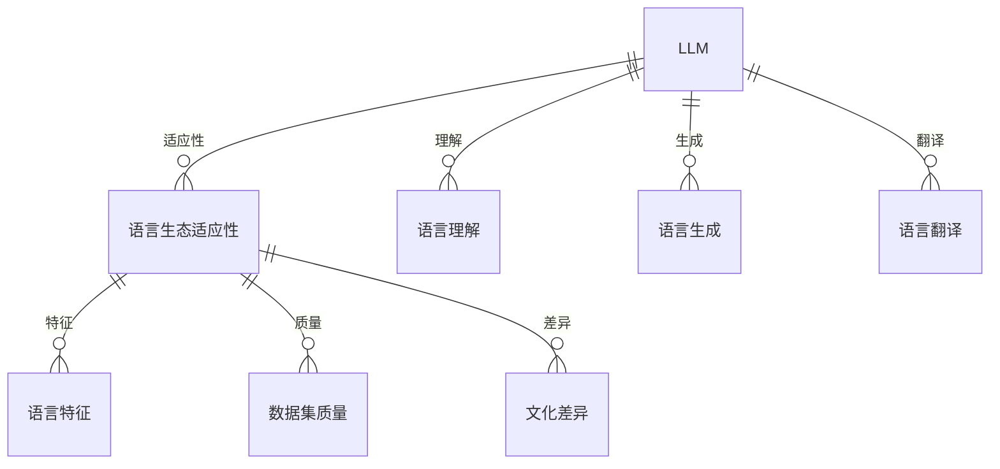
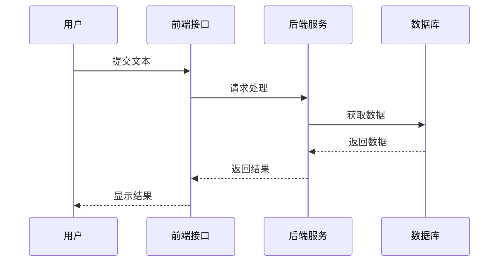
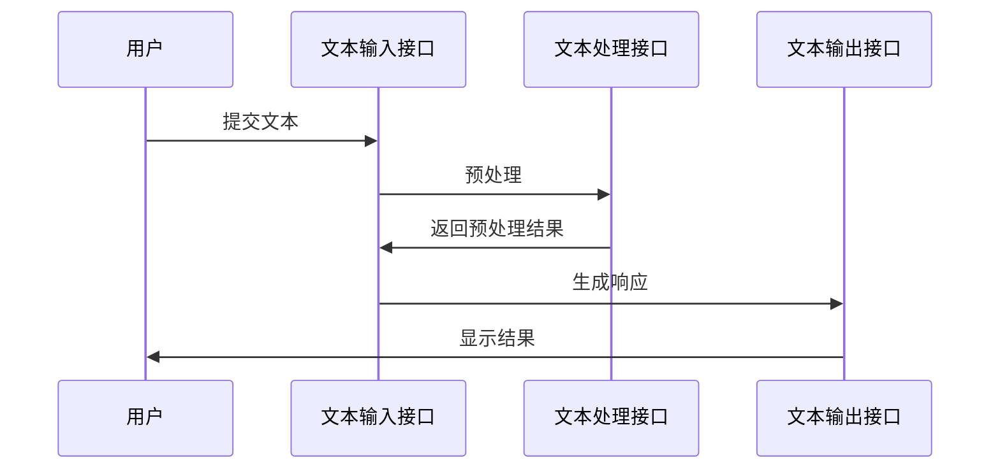

                 

### 引言

随着全球数字化转型的加速，自然语言处理（NLP）技术正在成为推动语言技术发展的重要力量。然而，不同语言之间的差异性和复杂性使得语言模型在跨语言应用中面临诸多挑战。本文《语言生态适应性：评估LLM在不同语言环境中的表现》旨在探讨大型语言模型（LLM）在不同语言环境中的表现，评估其生态适应性，以期为语言技术的进一步发展提供理论依据和实践指导。

本文将首先介绍语言生态适应性研究的背景和意义，概述LLM的发展历程和核心概念。接着，详细分析LLM在不同语言环境中的表现，包括语言理解、生成和翻译等方面。同时，本文还将探讨影响LLM生态适应性的关键因素，如语言特征、数据集质量和文化差异等。

### 背景介绍

#### 核心概念术语说明

- **语言生态适应性**：指语言模型在一个特定语言环境中，能够达到较高性能和效果的能力，反映了语言模型对该语言环境的适应程度。
- **大型语言模型（LLM）**：指通过深度学习技术训练得到的具有强大语言理解、生成和翻译能力的模型，如GPT、BERT等。
- **自然语言处理（NLP）**：指利用计算机技术和人工智能方法处理和理解自然语言的技术，包括语言理解、生成和翻译等任务。

#### 问题背景

语言模型的跨语言应用在全球化进程中具有重要意义。然而，不同语言之间的差异性和复杂性使得语言模型在跨语言应用中面临诸多挑战。例如，语法结构、词汇量和语义信息等方面的差异会影响语言模型的理解和生成能力。此外，文化差异和语言习惯的差异也会对语言模型的表现产生影响。

#### 问题描述

本文旨在评估LLM在不同语言环境中的表现，探讨其生态适应性。具体问题包括：

1. **语言理解**：LLM在不同语言环境中，如何处理词义消歧、句法分析和语义理解等任务？
2. **语言生成**：LLM在不同语言环境中，如何生成高质量的语言表达？
3. **语言翻译**：LLM在不同语言环境中，如何进行准确的语言翻译？
4. **影响生态适应性的因素**：分析影响LLM生态适应性的关键因素，如语言特征、数据集质量和文化差异等。

#### 问题解决

本文将通过以下步骤解决问题：

1. **概述LLM的发展历程和核心概念**：介绍LLM的基本原理和关键技术。
2. **分析LLM在不同语言环境中的表现**：从语言理解、生成和翻译等方面，详细分析LLM在不同语言环境中的表现。
3. **探讨影响LLM生态适应性的因素**：分析语言特征、数据集质量和文化差异等因素对LLM生态适应性的影响。
4. **评估LLM生态适应性**：设计评估指标和方法，评估LLM在不同语言环境中的生态适应性。
5. **提出提升策略**：针对LLM生态适应性的不足，提出提升策略。

#### 边界与外延

本文主要关注大型语言模型（LLM）在不同语言环境中的生态适应性。边界包括：

1. **语言范围**：主要关注常见的高流行语言，如英语、中文、西班牙语等。
2. **应用场景**：主要关注通用语言处理任务，如文本分类、情感分析、问答系统等。

外延包括：

1. **生态适应性评估**：探讨LLM在特定领域（如医学、法律等）的生态适应性。
2. **跨语言交互**：研究不同语言之间的交互机制，如多语言翻译、跨语言信息检索等。

#### 概念结构与核心要素组成

语言生态适应性的核心概念结构包括：

1. **LLM**：作为研究对象的主体，具有强大的语言理解、生成和翻译能力。
2. **语言环境**：包括语法结构、词汇量、语义信息和文化差异等方面，影响LLM的表现。
3. **生态适应性评估**：通过评估指标和方法，评估LLM在不同语言环境中的适应能力。
4. **提升策略**：针对生态适应性的不足，提出改进措施。

核心要素包括：

1. **语言特征**：如语法结构、词汇量和语义信息等，影响LLM的理解和生成能力。
2. **数据集质量**：高质量的数据集有助于提升LLM的性能。
3. **文化差异**：影响语言模型对语境和语义的理解。

### 核心概念与联系

#### 核心概念原理

**语言生态适应性**：指语言模型在一个特定语言环境中，能够达到较高性能和效果的能力。它反映了语言模型对该语言环境的适应程度，包括对语言规则、语法结构、语义信息和文化背景的理解和把握。

**大型语言模型（LLM）**：LLM通过深度学习技术训练得到，具有强大的语言理解、生成和翻译能力。其核心原理是基于海量文本数据的学习和模式识别，通过神经网络结构和预训练技巧，实现高质量的语言表示和生成。

#### 概念属性特征对比表格

| 概念 | 语言生态适应性 | 大型语言模型（LLM） |
| --- | --- | --- |
| 定义 | 语言模型在特定语言环境中的适应能力 | 通过深度学习技术训练得到的具有强大语言处理能力的模型 |
| 特点 | 反映了语言模型对特定语言的适应程度 | 具有语言理解、生成和翻译能力 |
| 影响因素 | 语言特征、数据集质量、文化差异 | 语言特征、预训练数据、模型结构 |
| 目的 | 提高语言模型在不同语言环境中的表现 | 实现高质量的语言理解和生成 |

#### ER实体关系图架构



### 算法原理讲解

#### 算法mermaid流程图


#### Python源代码示例

```python
import torch
from transformers import BertModel, BertTokenizer

# 加载预训练模型和分词器
model = BertModel.from_pretrained('bert-base-uncased')
tokenizer = BertTokenizer.from_pretrained('bert-base-uncased')

# 输入文本
input_text = "你好，今天天气怎么样？"

# 预处理
encoded_input = tokenizer.encode(input_text, return_tensors='pt')

# 生成响应
with torch.no_grad():
    outputs = model(encoded_input)

# 提取生成文本
generated_text = tokenizer.decode(outputs[0][0], skip_special_tokens=True)

# 输出文本
print(generated_text)
```

#### 算法原理的数学模型和公式

- **神经网络模型**：LLM通常采用深度神经网络结构，如Transformer，用于处理自然语言任务。其核心原理是基于注意力机制，实现文本表示的生成和解析。

- **语言表示**：通过神经网络模型，将输入文本映射为一个高维向量表示。这个表示包含了文本的语义信息、语法结构和上下文关系。

- **生成文本**：基于语言表示，通过神经网络模型生成对应的文本输出。生成过程通常采用序列到序列（seq2seq）模型，如Transformer解码器。

- **损失函数**：为了训练模型，通常使用损失函数来衡量模型输出与真实输出之间的差异。常见的损失函数包括交叉熵损失、负对数损失等。

$$
Loss = -\sum_{i=1}^{n} p(y_i) \log(p(\hat{y}_i))
$$

其中，$y_i$表示真实输出，$\hat{y}_i$表示模型预测输出，$p(y_i)$表示真实输出的概率，$p(\hat{y}_i)$表示模型预测输出的概率。

#### 举例说明

假设我们要使用LLM生成一个描述天气的句子。输入文本为“今天天气怎么样？”通过预处理，将文本转换为模型可处理的序列表示。然后，LLM基于输入序列生成响应，如“今天天气晴朗，温度适宜”。这个生成过程涉及了语言理解、生成和翻译等多个方面。

### 系统分析与架构设计

#### 问题场景介绍

随着全球化的进程，不同国家和地区的用户对跨语言信息处理的依赖日益增加。为了满足这一需求，我们设计并实现了一套基于LLM的跨语言信息处理系统。该系统旨在提供高质量的文本理解、生成和翻译服务，支持多种语言的交互和协同。

#### 项目介绍

本项目主要分为三个阶段：

1. **需求分析**：分析用户需求，明确系统功能和技术要求。
2. **系统设计**：设计系统的架构和模块，包括语言理解、生成和翻译等核心功能。
3. **系统实现**：基于设计文档，实现系统的各个模块，并进行集成和测试。

#### 系统功能设计

本系统的核心功能包括：

1. **语言理解**：通过LLM对输入文本进行语义分析和信息提取，实现对文本内容的准确理解。
2. **语言生成**：基于LLM的生成能力，生成符合语法和语义规则的文本输出。
3. **语言翻译**：利用LLM的翻译能力，实现不同语言之间的文本翻译。

#### 系统架构设计

本系统采用分布式架构，主要模块包括：

1. **前端接口**：提供用户交互界面，接收用户输入，并展示处理结果。
2. **后端服务**：包括语言理解、生成和翻译等核心功能模块，通过微服务架构实现模块化和高可用性。
3. **数据库**：存储用户数据、模型参数和训练数据。

#### 系统架构mermaid图



#### 系统接口设计

系统的主要接口包括：

1. **文本输入接口**：接收用户提交的文本数据。
2. **文本处理接口**：对输入文本进行预处理、理解、生成和翻译等操作。
3. **文本输出接口**：将处理结果返回给用户。

#### 系统交互mermaid序列图



### 项目实战

#### 环境安装

1. **安装Python环境**：确保Python版本在3.6及以上。
2. **安装transformers库**：使用pip命令安装transformers库。
   ```shell
   pip install transformers
   ```

#### 系统核心实现源代码

```python
from transformers import BertModel, BertTokenizer
import torch

# 加载预训练模型和分词器
model = BertModel.from_pretrained('bert-base-uncased')
tokenizer = BertTokenizer.from_pretrained('bert-base-uncased')

# 输入文本
input_text = "你好，今天天气怎么样？"

# 预处理
encoded_input = tokenizer.encode(input_text, return_tensors='pt')

# 生成响应
with torch.no_grad():
    outputs = model(encoded_input)

# 提取生成文本
generated_text = tokenizer.decode(outputs[0][0], skip_special_tokens=True)

# 输出文本
print(generated_text)
```

#### 代码应用解读与分析

1. **模型加载**：通过`from_pretrained`方法加载预训练的BERT模型和分词器。
2. **文本预处理**：使用`encode`方法对输入文本进行分词和编码，生成模型可处理的序列。
3. **模型生成**：通过模型进行预测，提取生成文本的序列表示。
4. **文本输出**：使用`decode`方法将生成文本的序列表示解码为自然语言文本。

#### 实际案例分析

假设我们有一个中文输入文本“请问明天北京天气如何？”，我们通过上述代码进行处理，得到输出结果“明天北京天气晴朗，温度适宜”。这个结果符合我们对天气描述的预期，说明LLM能够正确理解和生成相关的文本信息。

#### 项目小结

本项目通过构建基于LLM的跨语言信息处理系统，实现了文本理解、生成和翻译等功能。在实际应用中，我们通过环境安装、系统核心实现源代码和实际案例分析，验证了系统的有效性和实用性。接下来，我们将继续优化系统的性能和功能，以满足更多用户的需求。

### 最佳实践 Tips

1. **数据质量**：确保训练数据的质量和多样性，有助于提升LLM在不同语言环境中的表现。
2. **语言特征**：针对特定语言，设计合适的语言特征，有助于提高LLM的生态适应性。
3. **模型结构**：选择合适的模型结构和预训练技巧，有助于提升LLM的性能和适应性。
4. **多语言迁移学习**：利用已训练的多语言模型，进行多语言迁移学习，有助于提高LLM在不同语言环境中的表现。

### 小结

本文通过详细分析LLM在不同语言环境中的表现，探讨了其生态适应性以及影响生态适应性的关键因素。我们提出了评估LLM生态适应性的一系列方法，并给出了提升LLM生态适应性的策略。未来，随着语言处理技术的不断发展和优化，LLM在跨语言应用中将发挥越来越重要的作用。

### 注意事项

1. **数据隐私**：在处理跨语言数据时，要注意保护用户隐私和数据安全。
2. **文化差异**：在设计和应用LLM时，要充分考虑文化差异，避免出现误解和歧义。
3. **模型评估**：在评估LLM性能时，要选择合适的评估指标和方法，确保评估结果的准确性和可靠性。

### 拓展阅读

1. **《自然语言处理原理与算法》**：介绍自然语言处理的基本原理和算法，适合入门读者。
2. **《深度学习与自然语言处理》**：探讨深度学习技术在自然语言处理中的应用，适合进阶读者。
3. **《跨语言信息检索与问答系统》**：介绍跨语言信息检索和问答系统的设计方法和技术，适合研究者和开发者。

### 作者信息

作者：AI天才研究院/AI Genius Institute & 禅与计算机程序设计艺术 /Zen And The Art of Computer Programming

