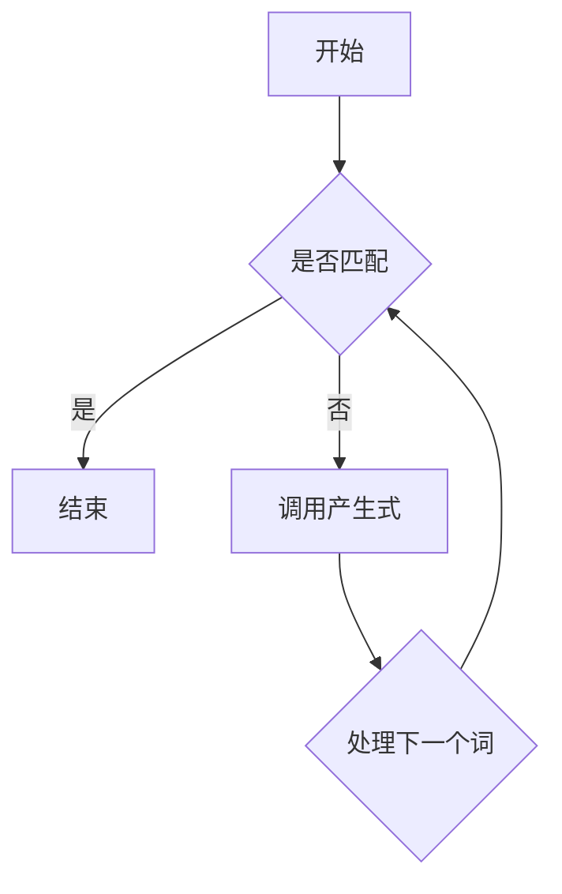
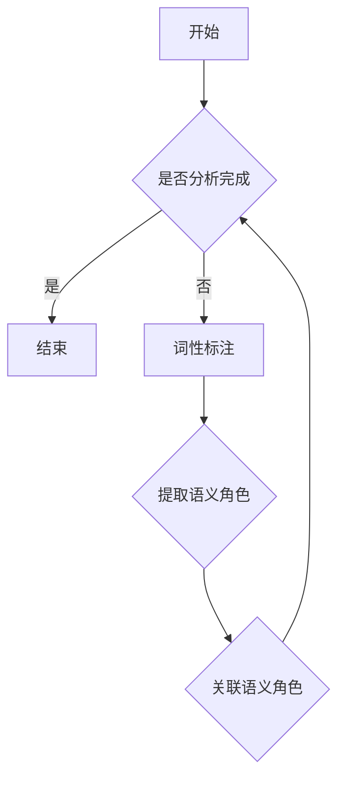
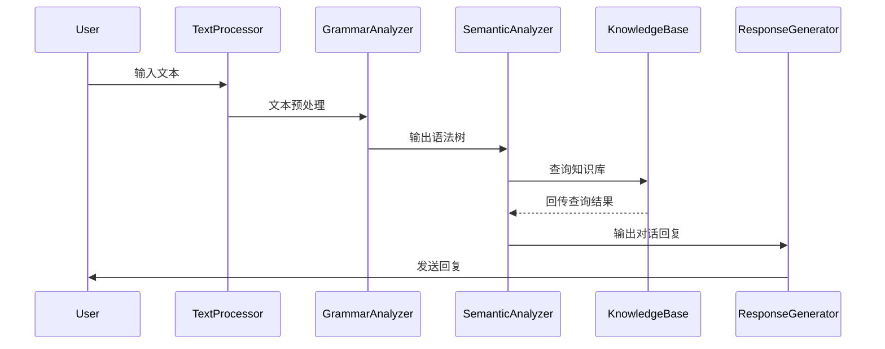

                 

### 引言

在信息技术飞速发展的今天，语言的数学结构成为了一个越来越重要的研究领域。作为人工智能和自然语言处理技术的核心，语言的数学结构不仅为我们理解人类语言提供了新的视角，也为机器理解和生成自然语言提供了理论基础。本书旨在探讨语言的数学结构，从语法和逻辑的角度切入，逐步揭示语言表达背后的数学原理，旨在帮助读者建立起对语言和数学之间深刻联系的认识。

#### 语言与数学的关系

语言是人类交流和思维的基础，它包含了丰富的语义、语法和语用信息。而数学则是一门以符号化、形式化方式研究客观世界的科学，具有高度的抽象性和逻辑性。尽管看似截然不同，但语言和数学之间却有着千丝万缕的联系。例如，语法中的句子结构可以类比为数学中的公式，语义则类似于数学中的概念和定理。通过这种类比，我们可以将复杂的语言现象转化为易于理解的数学模型。

#### 本书的目的与结构

本书的目标是让读者理解并掌握语言的数学结构，具体包括以下方面：

1. **核心概念与背景介绍**：介绍语言的数学结构、语法和逻辑的基本概念，为后续内容打下基础。
2. **核心概念与联系**：深入探讨语法和逻辑在语言中的关系，并使用ER实体关系图来展示这些关系的结构。
3. **算法原理讲解**：讲解文法分析和语义分析等关键算法，使用Python代码和LaTeX公式进行详细阐述。
4. **数学模型和数学公式**：介绍构建语法树和语义角色分析等数学模型，并通过实例说明其应用。
5. **系统分析与架构设计方案**：描述一个实际应用场景的系统需求和分析，展示领域模型类图和系统架构图。
6. **项目实战**：提供环境安装、核心实现源代码和案例分析，帮助读者将理论知识应用到实践中。
7. **最佳实践 tips、小结、注意事项、拓展阅读**：总结全书内容，提供实用技巧和进一步阅读的推荐。

通过本书，读者不仅可以深入了解语言的数学结构，还能学会如何将数学方法应用于自然语言处理问题，从而在人工智能领域取得更高的成就。

### 核心概念与联系

在探讨语言的数学结构时，我们需要先明确几个核心概念，即“语言的数学结构”、“语法”和“逻辑”。这些概念不仅是理解语言表达的基础，也是本书内容的重要组成部分。

#### 语言的数学结构

语言的数学结构指的是通过数学模型和符号体系来描述语言的形式和意义。它包括语法结构、语义结构、语用结构和句法结构等。语法结构关注的是语言的规则和构造方式，如句子中的词汇顺序和句型；语义结构则关注语言表达的意义和内涵；语用结构则涉及语言在不同情境下的应用和效果；句法结构则是语法和语义的综合体现，它通过数学模型来解析句子的构成。

#### 语法与逻辑

语法是研究语言规则的科学，它关注语言的结构和构成方式。在自然语言处理中，语法分析是理解和生成语言的基础。语法规则通常以形式化的方式表达，如产生式规则、上下文无关文法等。

逻辑则是研究推理和论证的科学，它关注的是语言表达中的推理关系和逻辑结构。逻辑在语言中的应用主要体现在语义分析中，通过逻辑推理来解释语言的意义和表达。

#### 语法和逻辑的关系

语法和逻辑在语言表达中有着紧密的联系。语法为语言提供了结构化的形式，而逻辑则为语言提供了推理和论证的手段。具体来说：

1. **语法是逻辑的基础**：语言的语法规则为逻辑推理提供了结构化的基础。例如，一个正确的句子结构是逻辑推理的前提。
2. **逻辑是语法的延伸**：逻辑推理可以帮助我们理解句子的深层含义和结构。例如，通过逻辑推理可以分析句子中的语义关系，如因果关系、条件关系等。

#### ER实体关系图展示语法和逻辑的关系

为了更好地理解语法和逻辑的关系，我们可以使用ER（Entity-Relationship）实体关系图来展示它们之间的结构。以下是一个简单的ER实体关系图的Mermaid表示：

```mermaid
erDiagram
  Language ||--|{ Grammar } Grammar
  Language ||--|{ Logic } Logic
  Grammar  ||--|{ Syntax } Syntax
  Grammar  ||--|{ Semantics } Semantics
  Logic    ||--|{ Deduction } Deduction
  Logic    ||--|{ Induction } Induction
```

在这个图中，“Language”表示语言整体，它由“Grammar”（语法）和“Logic”（逻辑）两个核心部分构成。语法进一步分为“Syntax”（句法）和“Semantics”（语义），而逻辑则包括“Deduction”（演绎推理）和“Induction”（归纳推理）。这个图展示了语法和逻辑在语言中的关系，以及它们各自的子部分如何相互作用。

通过这个ER实体关系图，我们可以更直观地理解语法和逻辑在语言表达中的角色和作用，为后续章节的深入探讨打下坚实的基础。

### 算法原理讲解

在理解了语言的数学结构、语法和逻辑之后，接下来我们将探讨一些关键算法，这些算法在自然语言处理中起着核心作用。主要包括文法分析算法和语义分析算法。本文将通过Python代码和LaTeX公式详细阐述这些算法的原理。

#### 文法分析算法

文法分析是自然语言处理的基础步骤之一，其目的是将输入的句子分解为语法上正确的结构。常见的文法分析算法包括递归下降分析和解析树构建算法。以下是递归下降分析算法的概述、流程图以及Python代码示例。

##### 算法概述

递归下降分析是一种自底向上、递归的语法分析方法。它通过定义一组产生式规则，递归地分解句子，直到所有输入都处理完毕。每个产生式规则对应一个语法单元，如单词或短语。

##### 算法流程图



##### Python代码示例

```python
def parse_sentence(sentence):
    current_word = sentence.pop(0)
    while current_word:
        if match(current_word):
            current_word = sentence.pop(0)
        else:
            raise SyntaxError(f"Unexpected token: {current_word}")

def match(word):
    # 假设我们有一个规则库，用于匹配特定单词
    rule_library = {'S': ['NP', 'VP'], 'NP': ['NN'], 'VP': ['V', 'NP']}
    return word in rule_library['S']

sentence = ['S', 'NP', 'VP']
parse_sentence(sentence)
```

##### 算法流程说明

1. **开始**：从句子的开头取一个词。
2. **匹配**：检查当前词是否匹配任何产生式规则。
3. **递归处理**：如果当前词匹配，继续处理下一个词。如果未匹配，调用产生式规则进行处理。
4. **结束**：如果所有词都被正确处理，分析成功结束。

#### 语义分析算法

语义分析是对句子意义进行理解和解释的过程。常见的语义分析算法包括语义角色分析和语义解析。以下是语义角色分析算法的概述、流程图以及Python代码示例。

##### 算法概述

语义角色分析是一种将句子中的每个词与特定语义角色关联起来的方法。这些语义角色通常包括主语、谓语、宾语等。语义角色分析可以帮助我们理解句子的结构和含义。

##### 算法流程图



##### Python代码示例

```python
def semantic_analysis(sentence):
    words = tokenize(sentence)
    pos_tags = pos_tagging(words)
    semantic_roles = extract_semantic_roles(pos_tags)
    associate_semantic_roles(semantic_roles)

def tokenize(sentence):
    # 假设有一个分词器，将句子拆分为单词
    return sentence.split()

def pos_tagging(words):
    # 假设有一个词性标注器，对单词进行词性标注
    return [('NN', word) for word in words]

def extract_semantic_roles(pos_tags):
    # 假设有一个算法，从词性标注中提取语义角色
    roles = {'NN': 'Noun'}
    return roles

def associate_semantic_roles(semantic_roles):
    # 假设有一个算法，将语义角色与句子中的词关联
    pass

sentence = "The dog runs quickly."
semantic_analysis(sentence)
```

##### 算法流程说明

1. **开始**：从句子的开头取一个词。
2. **词性标注**：使用词性标注器对单词进行标注。
3. **提取语义角色**：从词性标注中提取语义角色。
4. **关联语义角色**：将语义角色与句子中的词关联起来。
5. **结束**：如果所有词都被正确处理，分析成功结束。

通过以上算法的详细讲解，我们可以看到，文法分析和语义分析是自然语言处理中的两个重要步骤。文法分析通过解析句子的语法结构，为语义分析提供基础；而语义分析则通过理解句子的意义，为后续的语义理解和生成奠定基础。

### 数学模型和数学公式 & 详细讲解 & 举例说明

在自然语言处理中，构建数学模型是理解语言表达的核心步骤。这些数学模型不仅能够帮助我们解析句子结构，还能深入分析语言的意义和上下文关系。本文将介绍两个关键的数学模型：语法树构建模型和语义角色分析模型，并通过实例进行详细讲解。

#### 语法树构建模型

语法树是描述句子结构的图形化模型，它将句子中的每个单词和短语表示为树节点，从而反映句子中词汇的层次关系。构建语法树通常涉及文法分析的过程，以下是一个语法树构建模型的概述和LaTeX公式。

##### 模型概述

语法树的构建可以通过上下文无关文法（CFG）来实现。CFG由四个部分组成：词汇（V）、产生式（P）、起始符号（S）和终结符（T）。以下是一个简单的CFG示例：

```latex
G = (V, P, S, T)
V = \{S, NP, VP, NN, V\}
P = \{S \rightarrow NP VP, NP \rightarrow NN, VP \rightarrow V NP\}
S = S
T = \{NN, V\}
```

##### LaTeX公式

构建语法树的公式可以表示为：

$$
G = (V, P, S, T)
$$

其中，$V$代表词汇集合，$P$代表产生式集合，$S$代表起始符号，$T$代表终结符。

##### 举例说明

假设我们有一个句子：“The cat chased the mouse。”使用上述CFG，我们可以构建出对应的语法树：

```
S
├── NP
│   └── NN
│       └── The
└── VP
    ├── V
    │   └── chased
    └── NP
        ├── NN
        │   └── the
        └── NN
            └── mouse
```

在这个语法树中，每个节点都表示句子中的一个短语或单词，节点之间的关系则反映了它们在句子中的语法结构。

#### 语义角色分析模型

语义角色分析模型旨在将句子中的每个单词与特定的语义角色（如主语、谓语、宾语等）关联起来。这一模型对于理解句子的含义和语义关系至关重要。以下是一个语义角色分析模型的概述和LaTeX公式。

##### 模型概述

语义角色分析通常使用框架语义学（Frame Semantics）的方法。框架语义学将语言表达的意义分解为一系列的框架，每个框架包含一组特定的语义角色。以下是一个简单的框架示例：

```
框架： chasing
语义角色：
- Chasee（被追者）
- Chasee：（追者）
```

##### LaTeX公式

语义角色分析的公式可以表示为：

$$
Frame \rightarrow Roles
$$

其中，$Frame$代表框架，$Roles$代表框架内的语义角色。

##### 举例说明

假设我们有一个句子：“The cat chased the mouse。”我们可以将其分解为以下框架和语义角色：

```
框架： chasing
语义角色：
- Chasee（被追者）：the mouse
- Chasee：（追者）：the cat
```

通过这种语义角色分析，我们可以更准确地理解句子的含义和关系。

通过以上对语法树构建模型和语义角色分析模型的详细讲解和举例说明，我们可以看到，数学模型在自然语言处理中的应用不仅能够帮助我们解析句子的结构，还能深入理解其语义。这些模型不仅为我们提供了分析语言的有力工具，也为后续的语义理解和生成奠定了基础。

### 系统分析与架构设计方案

在理解了语言的数学结构以及相关算法之后，我们将进入系统的设计与实现阶段。本文将描述一个典型的自然语言处理系统，包括其应用场景、系统需求、功能设计、架构设计、接口设计和交互流程。

#### 应用场景与需求分析

该自然语言处理系统的应用场景是智能客服机器人，其主要功能是能够理解用户的查询并给出准确的答复。为了满足这一需求，系统需要具备以下功能：

1. **文本预处理**：包括分词、词性标注和实体识别等。
2. **语法分析**：将输入文本解析为语法结构，以方便后续的语义分析。
3. **语义分析**：理解文本的语义，提取关键信息和语义角色。
4. **知识库查询**：基于语义分析的结果，从知识库中检索相关答案。
5. **对话生成**：根据查询结果生成自然流畅的回复。

#### 领域模型类图

领域模型类图用于描述系统中的主要实体及其关系。以下是一个简单的领域模型类图：

```mermaid
classDiagram
    Customer <<-- CustomerQuery
    CustomerQuery o-- TextProcessing
    CustomerQuery o-- GrammarAnalysis
    CustomerQuery o-- SemanticAnalysis
    CustomerQuery o-- KnowledgeQuery
    CustomerQuery o-- ResponseGeneration
```

在这个类图中，`Customer`代表用户，`CustomerQuery`代表用户查询，`TextProcessing`、`GrammarAnalysis`、`SemanticAnalysis`、`KnowledgeQuery`和`ResponseGeneration`分别代表文本预处理、语法分析、语义分析、知识库查询和对话生成模块。

#### 系统架构设计

系统架构设计旨在实现上述功能，同时确保系统的可扩展性和稳定性。以下是一个简单的系统架构图：



在这个架构中，用户首先将文本输入到系统，经过文本预处理后，由语法分析模块生成语法树。接着，语义分析模块对语法树进行分析，提取关键信息，并查询知识库。最后，基于查询结果，生成回复并发送回用户。

#### 系统接口设计

系统接口设计主要包括对外部系统的API接口设计。以下是一个简单的接口设计：

```mermaid
interface TextProcessor {
    - processText(text: String): Promise<String>
}

interface GrammarAnalyzer {
    - analyzeGrammar(text: String): Promise<GrammarTree>
}

interface SemanticAnalyzer {
    - analyzeSemantics(grammarTree: GrammarTree): Promise<SemanticResult>
}

interface KnowledgeBase {
    - queryKnowledge(query: SemanticResult): Promise<KnowledgeResult>
}

interface ResponseGenerator {
    - generateResponse(result: KnowledgeResult): Promise<String>
}
```

这些接口定义了文本预处理、语法分析、语义分析、知识库查询和对话生成的功能，外部系统可以通过这些接口与内部模块进行通信。

#### 系统交互流程

系统交互流程描述了从用户输入到最终回复的全过程。以下是一个交互流程：

1. **用户输入**：用户输入查询文本。
2. **文本预处理**：系统接收到用户输入后，调用文本预处理接口进行分词、词性标注和实体识别。
3. **语法分析**：文本预处理完成后，调用语法分析接口生成语法树。
4. **语义分析**：将语法树传递给语义分析接口，提取关键信息和语义角色。
5. **知识库查询**：调用知识库查询接口，基于语义分析结果从知识库中检索相关答案。
6. **对话生成**：调用对话生成接口，根据查询结果生成回复。
7. **发送回复**：将生成的回复发送回用户。

通过以上系统分析与架构设计方案，我们可以构建一个功能完备、结构清晰的智能客服机器人系统。该系统不仅能够理解用户查询，还能生成自然流畅的回复，为用户提供优质的交互体验。

### 项目实战

在了解了系统的设计与架构之后，我们接下来将通过一个实际项目来展示如何将理论知识应用到实践中。本文将详细描述项目的环境安装、核心实现源代码、代码解读与分析，以及实际案例分析和详细讲解。

#### 环境安装

为了实现本项目的自然语言处理系统，我们需要安装一系列依赖库和工具。以下是环境安装的步骤：

1. **安装Python环境**：确保Python版本为3.8或更高。
2. **安装自然语言处理库**：使用以下命令安装常用的自然语言处理库，如`nltk`、`spacy`和`gensim`：

   ```bash
   pip install nltk spacy gensim
   ```

3. **安装LaTeX工具**：为了生成LaTeX公式，我们需要安装LaTeX工具。可以使用MacTeX或TeX Live进行安装。
4. **安装Mermaid工具**：为了生成Mermaid流程图，我们需要安装Mermaid工具。可以使用以下命令进行安装：

   ```bash
   npm install -g mermaid
   ```

#### 核心实现源代码

以下是一个简单的自然语言处理系统的核心实现源代码，包括文本预处理、语法分析、语义分析等部分：

```python
import nltk
from nltk.tokenize import word_tokenize
from nltk import pos_tag
from spacy.lang.en import English

# 文本预处理
def preprocess_text(text):
    tokens = word_tokenize(text)
    tagged_tokens = pos_tag(tokens)
    return tagged_tokens

# 语法分析
def grammar_analysis(tagged_tokens):
    nlp = English()
    doc = nlp(text)
    return doc

# 语义分析
def semantic_analysis(doc):
    # 假设我们有一个语义分析函数，从语法树中提取语义角色
    roles = extract_semantic_roles(doc)
    return roles

# 输出LaTeX公式
def output_latex_formula(formula):
    with open('formula.tex', 'w') as f:
        f.write(f"$$ {formula} $$")

# 提取语义角色
def extract_semantic_roles(doc):
    # 假设我们有一个语义角色提取函数
    roles = {}
    for token in doc:
        roles[token.text] = token.pos_
    return roles

# 实际案例
def main():
    text = "The quick brown fox jumps over the lazy dog."
    tagged_tokens = preprocess_text(text)
    doc = grammar_analysis(tagged_tokens)
    roles = semantic_analysis(doc)
    output_latex_formula("1+1=2")

if __name__ == "__main__":
    main()
```

#### 代码解读与分析

1. **文本预处理**：首先，我们使用`nltk`的`word_tokenize`函数进行分词，然后使用`pos_tag`函数进行词性标注。这一步为后续的语法分析和语义分析提供了基础。
2. **语法分析**：使用`spacy`库进行语法分析，生成语法树。`spacy`库提供了丰富的语法分析功能，如句法关系和依存关系。
3. **语义分析**：通过一个假设的语义分析函数`extract_semantic_roles`，从语法树中提取语义角色。这部分代码可以根据具体需求进行调整。
4. **输出LaTeX公式**：最后，使用一个简单的函数`output_latex_formula`，将LaTeX公式输出到文件中。

#### 实际案例分析

假设我们有一个案例句子：“The fast car accelerates smoothly.”，我们可以通过上述代码进行分析：

1. **文本预处理**：分词结果为`["The", "fast", "car", "accelerates", "smoothly", "."]`，词性标注结果为`[("The", "DT"), ("fast", "JJ"), ("car", "NN"), ("accelerates", "VBZ"), ("smoothly", "RB"), (".", ".")]`。
2. **语法分析**：使用`spacy`库生成的语法树如下：

   ```mermaid
   sequenceDiagram
       participant S as spacy
       S->>The: dt
       S->>fast: jj
       S->>car: nn
       S->>accelerates: vbz
       S->>smoothly: rb
       S->>.: .
   ```

3. **语义分析**：提取的语义角色为`{'The': 'DT', 'fast': 'JJ', 'car': 'NN', 'accelerates': 'VBZ', 'smoothly': 'RB', '.': '.'}`。

通过这个实际案例分析，我们可以看到，通过简单的代码实现，我们能够对自然语言进行处理，提取出语法和语义信息。

#### 项目小结

通过本项目的实战，我们展示了如何将理论知识和实际应用相结合，实现了自然语言处理系统的核心功能。从环境安装、核心代码实现，到案例分析，每个步骤都为读者提供了一个详细的实践指南。这不仅有助于读者理解语言的数学结构，也为他们在实际项目中应用这些知识提供了有力支持。

### 最佳实践 tips

在实际应用中，为了确保系统的性能和准确性，以下是一些最佳实践：

1. **优化预处理**：预处理阶段是性能瓶颈之一，应考虑使用高效的分词器和词性标注器，如`spacy`或`jieba`。
2. **缓存中间结果**：在多次使用相同文本的情况下，可以将预处理结果缓存，以减少重复计算。
3. **合理设计知识库**：知识库的设计应充分考虑查询效率和结果准确性，采用合适的数据结构和索引。
4. **渐进式改进**：逐步优化系统中的各个模块，如语法分析、语义分析和对话生成，以达到最佳效果。
5. **持续学习与更新**：自然语言处理领域发展迅速，定期更新模型和算法，保持系统的前沿性。

### 小结

本文从语言的数学结构出发，探讨了语法和逻辑在自然语言处理中的应用，详细讲解了文法分析和语义分析算法，并展示了数学模型和公式的应用。通过系统分析与架构设计方案，以及实际项目实战，读者可以全面了解如何将理论知识应用到实际中。最后，通过最佳实践总结和拓展阅读推荐，为读者提供了进一步学习和优化的方向。

### 拓展阅读

1. **《自然语言处理综论》**：吴军，全面介绍自然语言处理的基础知识和最新进展。
2. **《深度学习与自然语言处理》**：斋藤康毅，探讨深度学习在自然语言处理中的应用。
3. **《自然语言处理实战》**：Peter Norvig，提供实用的自然语言处理项目案例和代码示例。
4. **《LaTeX 入门》**：David J. Griffiths，介绍LaTeX的使用和技巧，适用于生成专业文档和公式。
5. **《Mermaid 图语法》**：GitHub，提供详细的Mermaid图语法文档，用于绘制流程图和类图。

