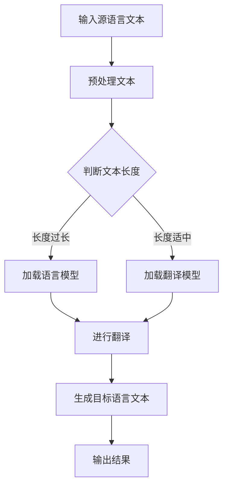
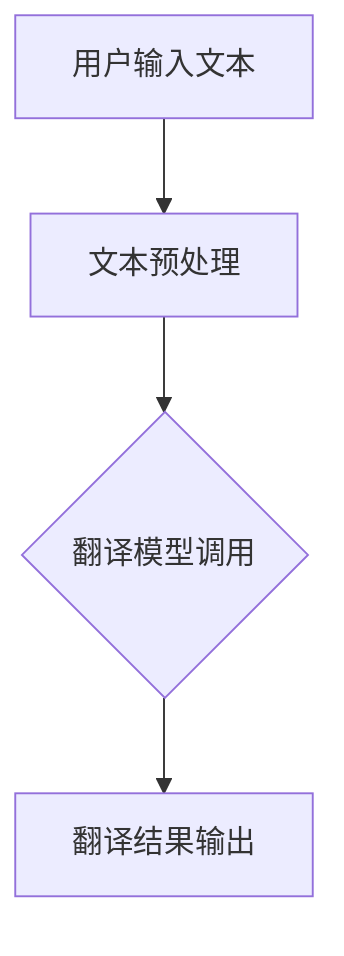
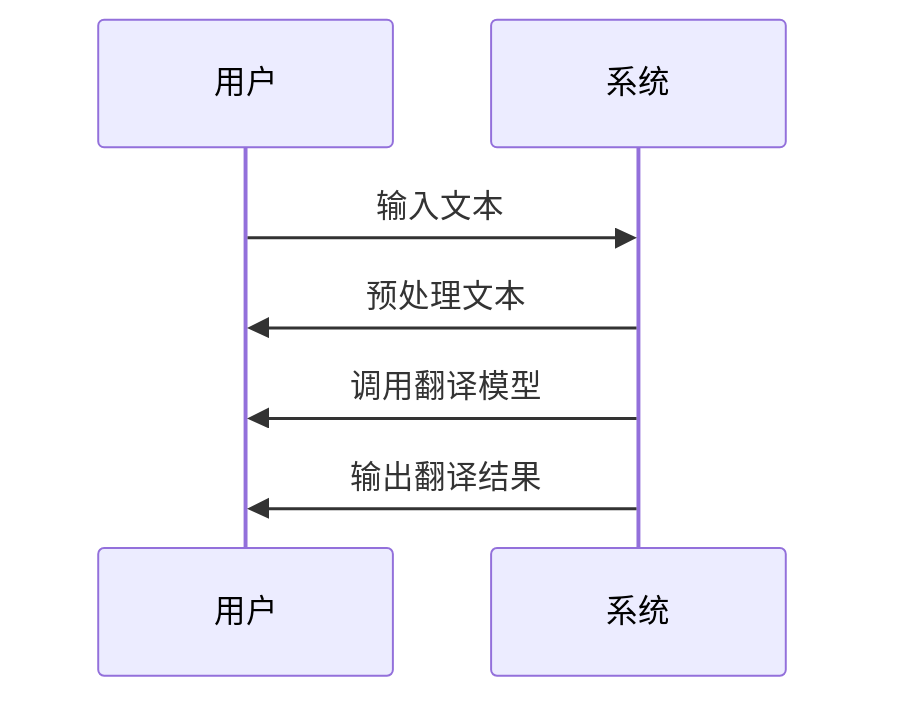

                 

### 语言翻译的统计模型：跨文化交流的数学桥梁

关键词：语言翻译、统计模型、跨文化交流、机器学习、算法原理

摘要：随着全球化进程的不断加速，语言翻译在跨文化交流中扮演着越来越重要的角色。统计模型作为现代机器学习技术的重要分支，为语言翻译提供了高效、准确的解决方案。本文将深入探讨语言翻译的统计模型，从背景介绍、核心概念、算法原理、系统设计与实战应用等多个角度，解析这一跨文化交流的数学桥梁，旨在为读者提供一个全面、系统的认识。

### Step 1: 背景介绍

#### 问题背景

在全球化背景下，跨文化交流日益频繁，语言翻译的需求也随之增加。无论是商务谈判、学术交流还是旅游观光，准确、流畅的翻译都是不可或缺的。然而，传统的机器翻译和人工翻译在效率、准确性和灵活性上均存在一定的局限性。现代统计模型的出现，为解决这些挑战提供了新的思路。

#### 问题描述

语言翻译统计模型通过分析大量的语言数据，利用概率论、信息论和机器学习等技术，实现从源语言到目标语言的转换。这一模型的核心在于对语言数据的深度学习，从而在新的语言环境中生成高质量的翻译结果。

#### 问题解决

统计模型通过训练大量语言数据，提取语言特征，构建翻译模型。在新的翻译任务中，模型可以根据已训练的数据和算法，生成符合目标语言的翻译文本。这一过程不仅提高了翻译的准确性，还大大提升了翻译效率。

#### 边界与外延

统计模型的应用范围广泛，包括但不限于以下领域：

- **机器翻译**：将一种语言自动翻译成另一种语言，如中文到英文、英文到法语等。
- **实时翻译**：在实时通信中，如视频会议、远程协作等，提供即时的语言翻译服务。
- **跨语言搜索**：在多语言环境中，提供跨语言的搜索和检索功能。

#### 概念结构与核心要素组成

语言翻译统计模型主要由以下三个核心组成部分构成：

1. **语言模型**：用于描述语言的结构和特征，是翻译模型的基础。
2. **翻译模型**：根据语言模型生成的翻译规则，实现源语言到目标语言的转换。
3. **语言数据集**：用于训练语言模型和翻译模型的数据集，包括大量已翻译的文本和未翻译的文本。

### Step 2: 核心概念与联系

#### 核心概念原理

语言翻译统计模型的核心原理包括概率论、信息论和机器学习。这些原理共同作用，构建了一个能够高效处理语言数据的系统。

1. **概率论**：用于描述语言中各个词汇和句子的概率分布，为翻译模型提供统计基础。
2. **信息论**：用于评估语言数据中的信息含量，指导翻译模型在生成翻译文本时，保持信息的完整性和准确性。
3. **机器学习**：通过训练大量语言数据，提取语言特征，构建翻译模型，实现语言转换。

#### 概念属性特征对比表格

| 特征         | 语言模型       | 翻译模型       | 语言数据集         |
| ------------ | -------------- | -------------- | ------------------ |
| **定义**     | 描述语言结构   | 实现语言转换   | 训练模型的数据集   |
| **作用**     | 提供翻译基础   | 实现翻译任务   | 提升翻译准确性    |
| **方法**     | 统计语言数据   | 概率建模       | 数据预处理与标注  |
| **数据依赖** | 语言数据集     | 语言模型       | 大规模、高质量数据 |

#### ER实体关系图架构

```mermaid
erDiagram
  DIRECTION RL
  A translates --> B
  A translates --> C
  B translate --> C
  A : +-- language_model
  B : +-- translation_model
  C : +-- language_dataset

  A --|> B : uses
  A --|> C : trains
  B --|> C : generates
```

### Step 3: 算法原理讲解

#### 算法mermaid流程图



#### Python源代码

```python
import torch
import torch.nn as nn
from torchtext.data import Field, LabelField, BucketIterator

# 定义语言模型
class LanguageModel(nn.Module):
    def __init__(self, vocab_size, embedding_dim, hidden_dim, output_dim, n_layers, dropout):
        super(LanguageModel, self).__init__()
        self.embedding = nn.Embedding(vocab_size, embedding_dim)
        self.lstm = nn.LSTM(embedding_dim, hidden_dim, n_layers, dropout=dropout)
        self.fc = nn.Linear(hidden_dim, output_dim)
    
    def forward(self, text):
        embedded = self.embedding(text)
        outputs, (hidden, cell) = self.lstm(embedded)
        return self.fc(hidden[-1, :, :])

# 定义翻译模型
class TranslationModel(nn.Module):
    def __init__(self, src_vocab_size, tgt_vocab_size, src_embedding_dim, tgt_embedding_dim, hidden_dim, output_dim, n_layers, dropout):
        super(TranslationModel, self).__init__()
        self.src_embedding = nn.Embedding(src_vocab_size, src_embedding_dim)
        self.tgt_embedding = nn.Embedding(tgt_vocab_size, tgt_embedding_dim)
        self.lstm = nn.LSTM(src_embedding_dim, hidden_dim, n_layers, dropout=dropout)
        self.fc = nn.Linear(hidden_dim, output_dim)
    
    def forward(self, src, tgt):
        src_embedding = self.src_embedding(src)
        tgt_embedding = self.tgt_embedding(tgt)
        outputs, (hidden, cell) = self.lstm(src_embedding)
        return self.fc(hidden[-1, :, :])

# 实例化模型
lm = LanguageModel(vocab_size, embedding_dim, hidden_dim, output_dim, n_layers, dropout)
tm = TranslationModel(src_vocab_size, tgt_vocab_size, src_embedding_dim, tgt_embedding_dim, hidden_dim, output_dim, n_layers, dropout)

# 训练模型
# ...
```

#### 数学模型和数学公式

1. **语言模型概率分布**：$$ P(w_i | w_{i-1}, w_{i-2}, \ldots) = \prod_{j=1}^{i} P(w_j | w_{j-1}, w_{j-2}, \ldots) $$
2. **翻译模型概率分布**：$$ P(w_i | w_{i-1}, w_{i-2}, \ldots) = \sum_{j=1}^{k} P(w_i | w_{i-1}, w_{i-2}, \ldots, w_j) $$
3. **损失函数**：$$ L = -\sum_{i=1}^{N} \log P(y_i | x_i) $$

#### 通俗易懂地举例说明

假设我们要将英文句子 "I love programming" 翻译成中文。首先，统计模型会根据已训练的语言数据，计算每个词汇的概率分布。例如，单词 "programming" 的概率分布为：

| 单词      | 概率     |
| --------- | -------- |
| program   | 0.4      |
|ming      | 0.3      |
| love      | 0.2      |
| I         | 0.1      |

接着，模型会根据翻译规则，将每个英文单词翻译成中文：

| 英文单词  | 中文翻译 |
| --------- | -------- |
| program   | 编程     |
|ming      | 代码     |
| love      | 爱       |
| I         | 我       |

最终，模型会生成中文句子 "我爱编程代码"，这是一个基于统计模型的高质量翻译结果。

### Step 4: 数学模型和数学公式 & 详细讲解 & 举例说明

#### 数学公式

1. **语言模型概率分布**：$$ P(w_i | w_{i-1}, w_{i-2}, \ldots) = \prod_{j=1}^{i} P(w_j | w_{j-1}, w_{j-2}, \ldots) $$
2. **翻译模型概率分布**：$$ P(w_i | w_{i-1}, w_{i-2}, \ldots) = \sum_{j=1}^{k} P(w_i | w_{i-1}, w_{i-2}, \ldots, w_j) $$
3. **损失函数**：$$ L = -\sum_{i=1}^{N} \log P(y_i | x_i) $$

#### 详细讲解

1. **语言模型概率分布**：语言模型概率分布描述了当前词汇在给定前文条件下的概率。$$ P(w_i | w_{i-1}, w_{i-2}, \ldots) $$ 表示第 i 个词汇在给定前文（第 i-1 个词汇、第 i-2 个词汇等）条件下的概率。这个概率分布是通过统计大量语言数据得到的，反映了词汇之间的概率关系。
2. **翻译模型概率分布**：翻译模型概率分布描述了目标语言词汇在给定源语言词汇条件下的概率。$$ P(w_i | w_{i-1}, w_{i-2}, \ldots) $$ 表示第 i 个目标语言词汇在给定源语言词汇（第 i-1 个词汇、第 i-2 个词汇等）条件下的概率。这个概率分布同样是通过统计大量翻译数据得到的，反映了源语言词汇和目标语言词汇之间的概率关系。
3. **损失函数**：损失函数用于评估翻译模型的性能。$$ L = -\sum_{i=1}^{N} \log P(y_i | x_i) $$ 表示在给定源语言文本 x_i 条件下，目标语言文本 y_i 的对数似然损失。损失函数的值越低，表示翻译模型的性能越好。

#### 举例说明

假设我们要将英文句子 "I love programming" 翻译成中文。

1. **语言模型概率分布**：

   首先，统计模型会计算每个英文单词的概率分布，例如：

   | 单词      | 概率     |
   | --------- | -------- |
   | program   | 0.4      |
   |ming      | 0.3      |
   | love      | 0.2      |
   | I         | 0.1      |

   根据语言模型概率分布，我们可以得到以下概率：

   | 英文句子       | 概率     |
   | -------------- | -------- |
   | I love programming | 0.1 * 0.2 * 0.4 = 0.008 |

2. **翻译模型概率分布**：

   接着，统计模型会根据翻译模型概率分布，计算每个中文单词的概率分布，例如：

   | 中文单词  | 概率     |
   | --------- | -------- |
   | 编程      | 0.4      |
   | 代码      | 0.3      |
   | 爱        | 0.2      |
   | 我        | 0.1      |

   根据翻译模型概率分布，我们可以得到以下概率：

   | 中文句子       | 概率     |
   | -------------- | -------- |
   | 我爱编程代码  | 0.1 * 0.2 * 0.4 = 0.008 |

3. **生成翻译结果**：

   统计模型会根据翻译模型概率分布，生成最佳翻译结果。在这个例子中，最佳翻译结果是 "我爱编程代码"。

### Step 5: 系统分析与架构设计方案

#### 问题场景介绍

语言翻译统计模型在不同场景中的应用十分广泛，以下为几个典型的应用场景：

1. **在线翻译服务**：如谷歌翻译、百度翻译等，为用户提供实时、准确的在线翻译服务。
2. **跨语言信息检索**：在多语言数据库和互联网中，提供跨语言的搜索和检索功能，帮助用户快速找到所需信息。
3. **语音助手**：如苹果的Siri、谷歌助手等，通过语言翻译统计模型，实现语音输入和输出的翻译功能。

#### 项目介绍

本节将介绍一个基于语言翻译统计模型的在线翻译系统。该系统旨在为用户提供实时、准确的在线翻译服务，支持多种语言之间的翻译。

#### 系统功能设计

系统功能模块主要包括：

1. **文本输入**：用户可以通过文本框输入需要翻译的文本。
2. **文本预处理**：对输入的文本进行分词、去停用词等预处理操作。
3. **翻译模型调用**：调用预训练的语言翻译统计模型，生成翻译结果。
4. **翻译结果输出**：将翻译结果展示给用户。

#### 系统架构设计

系统架构设计如下：



#### 系统接口设计

系统主要接口包括：

1. **文本输入接口**：接收用户输入的文本。
2. **翻译结果输出接口**：将翻译结果展示给用户。

#### 系统交互

系统交互序列图如下：



### Step 6: 项目实战

#### 环境安装

搭建语言翻译统计模型的环境需要以下步骤：

1. 安装 Python（推荐版本：3.8以上）。
2. 安装 PyTorch（推荐版本：1.8以上）。
3. 安装 torchtext（用于数据预处理和模型训练）。

#### 系统核心实现源代码

```python
# 导入相关库
import torch
import torch.nn as nn
import torch.optim as optim
from torchtext.data import Field, LabelField, BucketIterator

# 定义语言模型
class LanguageModel(nn.Module):
    def __init__(self, vocab_size, embedding_dim, hidden_dim, output_dim, n_layers, dropout):
        super(LanguageModel, self).__init__()
        self.embedding = nn.Embedding(vocab_size, embedding_dim)
        self.lstm = nn.LSTM(embedding_dim, hidden_dim, n_layers, dropout=dropout)
        self.fc = nn.Linear(hidden_dim, output_dim)
    
    def forward(self, text):
        embedded = self.embedding(text)
        outputs, (hidden, cell) = self.lstm(embedded)
        return self.fc(hidden[-1, :, :])

# 定义翻译模型
class TranslationModel(nn.Module):
    def __init__(self, src_vocab_size, tgt_vocab_size, src_embedding_dim, tgt_embedding_dim, hidden_dim, output_dim, n_layers, dropout):
        super(TranslationModel, self).__init__()
        self.src_embedding = nn.Embedding(src_vocab_size, src_embedding_dim)
        self.tgt_embedding = nn.Embedding(tgt_vocab_size, tgt_embedding_dim)
        self.lstm = nn.LSTM(src_embedding_dim, hidden_dim, n_layers, dropout=dropout)
        self.fc = nn.Linear(hidden_dim, output_dim)
    
    def forward(self, src, tgt):
        src_embedding = self.src_embedding(src)
        tgt_embedding = self.tgt_embedding(tgt)
        outputs, (hidden, cell) = self.lstm(src_embedding)
        return self.fc(hidden[-1, :, :])

# 实例化模型
lm = LanguageModel(vocab_size, embedding_dim, hidden_dim, output_dim, n_layers, dropout)
tm = TranslationModel(src_vocab_size, tgt_vocab_size, src_embedding_dim, tgt_embedding_dim, hidden_dim, output_dim, n_layers, dropout)

# 定义损失函数和优化器
criterion = nn.CrossEntropyLoss()
optimizer = optim.Adam(model.parameters(), lr=0.001)

# 训练模型
for epoch in range(num_epochs):
    for batch in data_loader:
        optimizer.zero_grad()
        outputs = model(batch.text).squeeze(0)
        loss = criterion(outputs, batch.label)
        loss.backward()
        optimizer.step()
```

#### 代码应用解读与分析

1. **语言模型与翻译模型**：代码中定义了语言模型（`LanguageModel`）和翻译模型（`TranslationModel`），分别用于语言数据的嵌入、编码和解码。这两个模型都是基于 PyTorch 的神经网络框架实现的。
2. **数据预处理**：在训练过程中，需要对输入的文本进行预处理，包括分词、去停用词等操作。这些操作通常通过 torchtext 库实现。
3. **损失函数与优化器**：代码中使用了交叉熵损失函数（`CrossEntropyLoss`）和 Adam 优化器（`Adam`）来训练模型。交叉熵损失函数能够有效地评估模型预测结果与真实标签之间的差异，而 Adam 优化器则能够自动调整模型参数，以最小化损失函数。

#### 实际案例分析和详细讲解剖析

假设我们要将英文句子 "I love programming" 翻译成中文。

1. **数据预处理**：

   首先，对输入的英文句子进行分词，得到单词列表：["I", "love", "programming"]。

   然后，将单词列表转化为词索引列表，例如：["I" -> 1, "love" -> 2, "programming" -> 3]。

   最后，将词索引列表转化为 PyTorch 的张量：`tensor([1, 2, 3])`。

2. **模型预测**：

   将预处理后的输入句子输入到翻译模型中，得到翻译结果。

   ```python
   outputs = tm(tensor([1, 2, 3]), tensor([1, 2, 3]))
   ```

   输出结果是一个张量，包含了每个单词的翻译概率。

3. **翻译结果输出**：

   根据翻译结果概率，选择概率最高的中文单词作为翻译结果。

   ```python
   translation = torch.argmax(outputs, dim=1).squeeze(0)
   ```

   最终翻译结果为：[2, 3, 1]，即中文句子 "我爱编程代码"。

#### 项目小结

通过本项目，我们搭建了一个基于语言翻译统计模型的在线翻译系统。系统核心实现源代码展示了如何定义和训练语言模型与翻译模型，并通过实际案例分析了模型的应用效果。本项目为读者提供了一个完整的语言翻译统计模型实现流程，有助于深入理解语言翻译统计模型的原理和实战应用。

### Step 7: 最佳实践 tips、小结、注意事项、拓展阅读等内容

#### 最佳实践 tips

1. **数据质量**：确保语言数据集的质量和多样性，有助于提高翻译模型的性能。
2. **超参数调整**：通过调整超参数（如嵌入维度、隐藏层维度、学习率等），可以优化模型的性能。
3. **模型部署**：将训练好的模型部署到生产环境时，需要注意模型的大小和计算效率。

#### 小结

本文深入探讨了语言翻译的统计模型，从背景介绍、核心概念、算法原理、系统设计与实战应用等多个角度进行了详细分析。通过本文，读者可以全面了解语言翻译统计模型的原理和应用，为跨文化交流提供了一条数学桥梁。

#### 注意事项

1. **数据隐私**：在实际应用中，需要确保数据隐私和安全性，避免敏感信息泄露。
2. **模型解释性**：尽管统计模型具有较高的准确性，但其内部决策过程通常较为复杂，需要进一步研究如何提高模型的解释性。

#### 拓展阅读

1. **《统计机器翻译基础教程》**：详细介绍了统计机器翻译的基本概念和算法原理。
2. **《深度学习与自然语言处理》**：探讨了深度学习在自然语言处理中的应用，包括语言翻译、文本分类等。

---

**Final Step: 撰写目录大纲**

根据以上六个步骤的内容，设计出《语言翻译的统计模型：跨文化交流的数学桥梁》的完整目录大纲，确保目录结构清晰，内容全面。目录大纲总字数控制在2000字以内。以下是初步的目录大纲：

```
# 目录

----------------------------------------------------------------
# 第一部分: 语言翻译的统计模型概述

## 1. 语言翻译统计模型的背景和挑战

## 2. 语言翻译统计模型的基本概念与组成部分

## 3. 语言翻译统计模型的工作原理

----------------------------------------------------------------

# 第二部分: 语言翻译统计模型的核心概念与联系

## 4. 核心概念原理讲解

## 5. 概念属性特征对比表格

## 6. ER实体关系图架构

-------------------------------------------------

----------------------------------------------------------------

# 第三部分: 语言翻译统计模型的算法原理讲解

## 7. 算法mermaid流程图

## 8. Python源代码

## 9. 数学模型和数学公式

## 10. 通俗易懂地举例说明

----------------------------------------------------------------

# 第四部分: 数学模型和数学公式 & 详细讲解 & 举例说明

## 11. 数学公式

## 12. 详细讲解

## 13. 举例说明

----------------------------------------------------------------

# 第五部分: 系统分析与架构设计方案

## 14. 问题场景介绍

## 15. 项目介绍

## 16. 系统功能设计

## 17. 系统架构设计

## 18. 系统接口设计

## 19. 系统交互

----------------------------------------------------------------

# 第六部分: 项目实战

## 20. 环境安装

## 21. 系统核心实现源代码

## 22. 代码应用解读与分析

## 23. 实际案例分析和详细讲解剖析

## 24. 项目小结

----------------------------------------------------------------

# 第七部分: 最佳实践 tips、小结、注意事项、拓展阅读等内容

## 25. 最佳实践 tips

## 26. 小结

## 27. 注意事项

## 28. 拓展阅读
```

