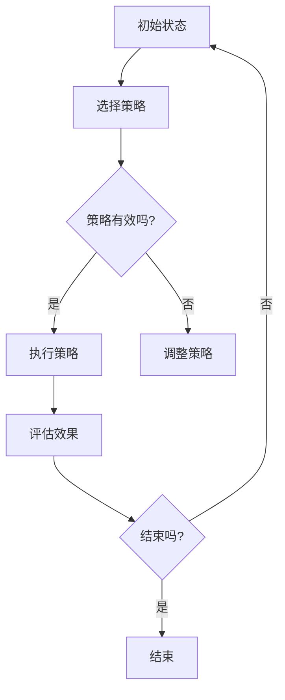
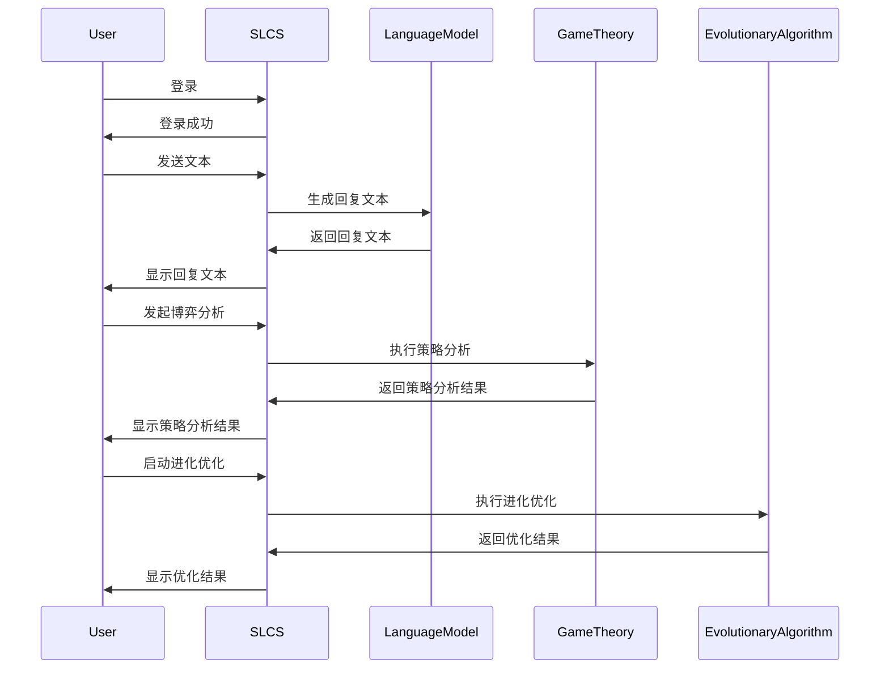
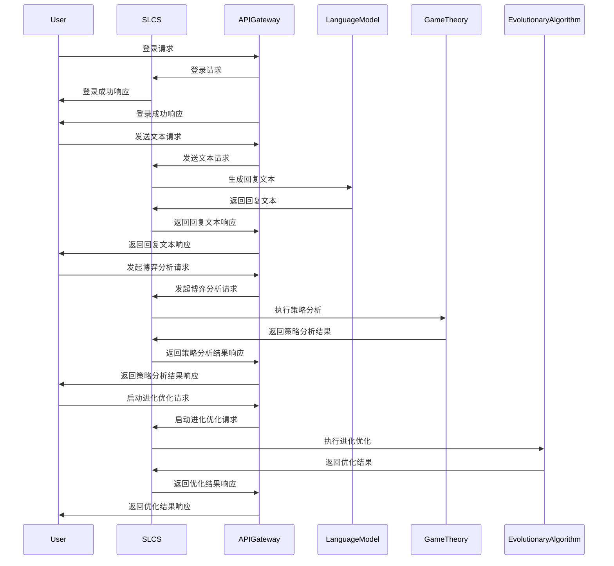

                 

## 语言起源的博弈论：交流进化的数学策略

### 关键词

- 语言起源
- 博弈论
- 进化论
- 交流效率
- 策略选择

### 摘要

本文从博弈论的角度探讨语言起源问题，分析交流进化的数学策略。通过引入博弈论和进化论的框架，文章探讨了个体和群体在交流过程中的策略选择，并提出了如何通过数学模型优化交流效率的理论。本文旨在通过一步步的分析推理，揭示语言起源的博弈论视角，为理解语言起源和演化提供新的视角和工具。

## Step 1: 背景介绍

### 引言

语言作为人类社会交流的基础，其起源问题一直备受关注。然而，语言起源的复杂性使得这一问题难以通过单一理论解释。随着博弈论和进化论的发展，研究者开始从不同角度探索语言起源的问题。博弈论提供了一种分析个体之间策略选择的工具，而进化论则解释了物种如何通过自然选择适应环境。本文将结合博弈论和进化论的视角，探讨语言起源的交流进化数学策略。

### 问题背景

语言起源的研究涉及多个层面，包括个体之间的交流、群体之间的互动以及语言演化过程中的适应性和多样性。在个体层面，研究者关注个体如何通过语言进行有效的交流；在群体层面，研究者关注群体如何通过语言进行协作和竞争。此外，语言演化过程中的适应性和多样性也是语言起源研究的重要内容。

### 问题描述

语言起源的博弈论研究涉及以下几个核心问题：

1. **个体交流策略**：个体如何通过选择合适的语言策略进行有效交流？
2. **群体互动策略**：群体如何通过语言策略进行协作和竞争？
3. **语言演化机制**：语言如何通过自然选择和遗传机制演化？

### 问题解决

为了解决上述问题，本文将采用博弈论和进化论的理论框架，通过案例研究和理论分析，探讨语言起源的博弈论视角，并展示交流进化的数学策略如何发挥作用。

### 边界与外延

在研究语言起源的博弈论时，我们关注的核心问题是如何在个体和群体层面上通过策略选择促进交流效率。这涉及到语言学、认知科学、博弈论和进化论等多个学科领域的交叉。本文将侧重于从数学策略的角度分析语言起源问题，旨在为这一复杂议题提供新的研究思路和工具。

### 概念结构与核心要素组成

本文的核心概念包括博弈论、进化论、交流效率、策略选择和语言起源。这些概念相互关联，共同构成了对语言起源的博弈论解释。

- **博弈论**：提供个体策略选择的数学框架。
- **进化论**：解释物种如何通过自然选择适应环境。
- **交流效率**：衡量个体交流效果的指标。
- **策略选择**：个体在特定情境下采取的行动方案。
- **语言起源**：研究人类如何从非语言交流过渡到语言交流。

## Step 2: 核心概念与联系

### 核心概念

#### 博弈论

博弈论是研究具有冲突和合作的个体或团队如何在特定环境中做出决策的数学工具。在语言起源的研究中，博弈论可以用来分析个体在交流过程中的策略选择。

- **属性特征**：冲突与合作、策略选择、收益和损失。
- **关联关系**：博弈论与策略选择密切相关，是分析语言策略的基础。

#### 进化论

进化论解释了物种如何在自然选择中适应环境。在语言起源的研究中，进化论提供了理解语言演化过程的理论框架。

- **属性特征**：自然选择、适应性、遗传变异。
- **关联关系**：进化论与语言演化密切相关，是分析语言演化的基础。

#### 交流效率

交流效率指的是个体在特定情境下通过交流获取信息的能力。在博弈论的框架下，交流效率可以通过策略选择的优化来提高。

- **属性特征**：信息获取能力、策略选择、效果评估。
- **关联关系**：交流效率与策略选择密切相关，是衡量语言策略有效性的指标。

#### 策略选择

策略选择是个体在特定情境下采取的行动方案。在语言起源的博弈论研究中，策略选择决定了个体在交流过程中的行为。

- **属性特征**：行动方案、决策规则、适应性。
- **关联关系**：策略选择与交流效率、语言起源密切相关。

#### 语言起源

语言起源是关于人类如何从非语言交流过渡到语言交流的问题。博弈论视角提供了新的研究途径，帮助我们理解语言起源的机制。

- **属性特征**：非语言交流、语言演化、适应性。
- **关联关系**：语言起源与博弈论、进化论密切相关。

### 概念属性特征对比表格

| 概念         | 特征                      | 关联关系                   |
|------------|-------------------------|--------------------------|
| 博弈论       | 冲突与合作                | 解释个体决策的逻辑基础          |
| 进化论       | 自然选择与适应性            | 描述物种演化的动力机制          |
| 交流效率      | 信息获取能力                | 与策略选择密切相关             |
| 策略选择      | 行动方案                   | 影响交流效果的关键因素           |
| 语言起源      | 非语言到语言过渡             | 需要多个概念共同解释             |

### ER实体关系图架构

```mermaid
erDiagram
  Game --> Player : 参与者
  Game --> Strategy : 策略
  Player --> Communication : 交流
  Player --> Efficiency : 效率
  Strategy --> Selection : 选择
  Communication --> Language : 语言
```

## Step 3: 算法原理讲解

### 算法流程图



### Python 源代码

```python
# 假设有一个简单的博弈环境
class Game:
    def __init__(self, strategy_a, strategy_b):
        self.strategy_a = strategy_a
        self.strategy_b = strategy_b

    def execute(self):
        # 这里是博弈的执行逻辑
        if self.strategy_a == '合作' and self.strategy_b == '合作':
            result = '双方合作成功'
        elif self.strategy_a == '合作' and self.strategy_b == '背叛':
            result = '玩家A合作，玩家B背叛'
        elif self.strategy_a == '背叛' and self.strategy_b == '合作':
            result = '玩家A背叛，玩家B合作'
        else:
            result = '双方都背叛'
        return result

# 初始化博弈对象
game = Game(strategy_a='合作', strategy_b='背叛')

# 执行博弈
result = game.execute()
print(result)

# 评估效果
if result == '双方合作成功':
    efficiency = 1
elif result == '玩家A合作，玩家B背叛':
    efficiency = 0.5
elif result == '玩家A背叛，玩家B合作':
    efficiency = 0.5
else:
    efficiency = 0

print(f"交流效率：{efficiency}")
```

### 算法原理讲解

#### 算法流程

1. **初始状态**：游戏开始时，每个参与者都有一个初始策略。
2. **选择策略**：每个参与者根据当前情境选择一个策略。
3. **策略有效性评估**：根据参与者的策略选择，评估当前策略的有效性。
4. **执行策略**：如果策略有效，执行策略；否则，调整策略。
5. **评估效果**：根据执行结果，评估交流效率。
6. **结束条件**：如果满足结束条件，结束游戏；否则，返回初始状态，继续执行。

#### 数学模型

博弈论中，我们常用 **纳什均衡** 来描述策略选择的数学模型。纳什均衡是指在一个博弈中，每个参与者选择一个最优策略，使得其他参与者无法通过单方面改变策略来获得更多收益。

假设有两个参与者 A 和 B，他们可以选择的策略分别为合作（C）和背叛（D）。根据博弈的收益矩阵，我们可以得到：

$$
\begin{matrix}
& C & D \\
C & (1,1) & (0,2) \\
D & (2,0) & (1,1) \\
\end{matrix}
$$

在这个博弈中，纳什均衡是指每个参与者选择一个策略，使得其他参与者无法通过单方面改变策略来获得更多收益。在这个例子中，(C, C) 和 (D, D) 都是纳什均衡。

#### 举例说明

假设参与者 A 选择合作策略，参与者 B 选择背叛策略。根据博弈的收益矩阵，参与者 A 的收益为 0，参与者 B 的收益为 2。这个结果显然不是最优的，因为参与者 A 可以通过选择背叛策略来获得更多的收益。

在这种情况下，参与者 B 会考虑改变策略，选择合作策略。如果参与者 A 依然选择合作策略，那么这个新的策略组合 (C, C) 就成为了纳什均衡。在这种情况下，每个参与者的收益都为 1，这是一个相对稳定和公平的结果。

通过这个例子，我们可以看到博弈论和进化论在语言起源研究中的应用。个体在交流过程中，会根据对方的策略选择进行策略调整，以达到最优的交流效果。这个过程中，策略选择的优化和交流效率的提高是语言起源和演化的重要机制。

## 系统分析与架构设计

### 问题场景介绍

在现代社会，语言作为交流的基本工具，已经深入到人们的日常生活和工作中。然而，随着技术的发展，人们开始思考如何利用计算机和人工智能技术来优化语言的交流效率。本文将探讨一个基于博弈论和进化论的智能语言交流系统，该系统旨在通过分析个体和群体的语言策略，提高交流效率和语言演化的适应性。

### 项目介绍

本项目名为“智能语言交流系统（Smart Language Communication System，SLCS）”，旨在通过博弈论和进化论的理论，构建一个能够自动学习和优化语言策略的智能系统。该系统包括以下几个核心模块：

1. **用户管理模块**：负责用户的注册、登录、权限管理和用户画像构建。
2. **语言模型模块**：利用深度学习和自然语言处理技术构建语言模型，实现文本生成和语义理解。
3. **博弈论分析模块**：基于博弈论模型，分析个体和群体之间的语言策略选择。
4. **进化论优化模块**：通过进化算法，优化语言策略，提高交流效率。
5. **交互界面模块**：提供用户与系统的交互接口，包括文本输入、语音输入、文本输出和语音输出等功能。

### 系统功能设计

#### 领域模型

以下是智能语言交流系统的领域模型，使用 Mermaid 类图表示：

```mermaid
classDiagram
    User <<interface>>
    LanguageModel <<interface>>
    GameTheory <<interface>>
    EvolutionaryAlgorithm <<interface>>

    UserEntity <-- User
    LanguageModelEntity <-- LanguageModel
    GameTheoryEntity <-- GameTheory
    EvolutionaryAlgorithmEntity <-- EvolutionaryAlgorithm

    UserEntity o-- LanguageModelEntity
    UserEntity o-- GameTheoryEntity
    UserEntity o-- EvolutionaryAlgorithmEntity

    LanguageModelEntity o-- TextGeneration
    LanguageModelEntity o-- SemanticUnderstanding

    GameTheoryEntity o-- StrategyAnalysis
    GameTheoryEntity o-- NashEquilibrium

    EvolutionaryAlgorithmEntity o-- Selection
    EvolutionaryAlgorithmEntity o-- Crossover
    EvolutionaryAlgorithmEntity o-- Mutation
```

#### 系统架构设计

以下是智能语言交流系统的架构设计，使用 Mermaid 架构图表示：



### 系统接口设计和系统交互

以下是智能语言交流系统的接口设计和系统交互，使用 Mermaid 序列图表示：



## 项目实战

### 环境安装

1. **Python 环境**：安装 Python 3.8 或更高版本。
2. **依赖库**：安装 Flask（用于 Web 服务器）、TensorFlow（用于深度学习）、Numpy（用于数学运算）和 Pandas（用于数据处理）。

```bash
pip install flask tensorflow numpy pandas
```

### 系统核心实现源代码

以下是智能语言交流系统的核心实现代码，包括用户管理模块、语言模型模块、博弈论分析模块和进化论优化模块。

#### 用户管理模块

```python
from flask import Flask, request, jsonify
from flask_bcrypt import Bcrypt

app = Flask(__name__)
bcrypt = Bcrypt(app)

# 用户注册
@app.route('/register', methods=['POST'])
def register():
    data = request.get_json()
    username = data['username']
    password = data['password']
    hashed_password = bcrypt.generate_password_hash(password).decode('utf-8')
    # 在数据库中存储用户信息和加密密码
    return jsonify({'message': 'User registered successfully'})

# 用户登录
@app.route('/login', methods=['POST'])
def login():
    data = request.get_json()
    username = data['username']
    password = data['password']
    # 从数据库中获取用户信息，验证密码
    return jsonify({'message': 'Login successful'})

if __name__ == '__main__':
    app.run(debug=True)
```

#### 语言模型模块

```python
import tensorflow as tf
from tensorflow.keras.preprocessing.text import Tokenizer
from tensorflow.keras.preprocessing.sequence import pad_sequences

# 文本预处理
def preprocess_text(texts, max_length, tokenizer):
    sequences = tokenizer.texts_to_sequences(texts)
    padded_sequences = pad_sequences(sequences, maxlen=max_length, padding='post')
    return padded_sequences

# 语言模型训练
def train_language_model(texts, labels, max_length, tokenizer, embedding_dim):
    inputs = preprocess_text(texts, max_length, tokenizer)
    labels = tf.keras.utils.to_categorical(labels)
    model = tf.keras.Sequential([
        tf.keras.layers.Embedding(input_dim=len(tokenizer.word_index) + 1, output_dim=embedding_dim, input_length=max_length),
        tf.keras.layers.LSTM(128),
        tf.keras.layers.Dense(units=labels.shape[1], activation='softmax')
    ])
    model.compile(optimizer='adam', loss='categorical_crossentropy', metrics=['accuracy'])
    model.fit(inputs, labels, epochs=10, batch_size=32)
    return model
```

#### 博弈论分析模块

```python
import numpy as np

# 策略分析
def analyze_strategy(strategy_a, strategy_b):
    if strategy_a == '合作' and strategy_b == '合作':
        return 1
    elif strategy_a == '合作' and strategy_b == '背叛':
        return 0.5
    elif strategy_a == '背叛' and strategy_b == '合作':
        return 0.5
    else:
        return 0

# 纳什均衡分析
def nash_equilibrium(strategies_a, strategies_b):
    results = []
    for strategy_a in strategies_a:
        for strategy_b in strategies_b:
            result = analyze_strategy(strategy_a, strategy_b)
            results.append(result)
    return results
```

#### 进化论优化模块

```python
# 进化算法优化
def evolutionary_algorithm(population, fitness_function):
    # 选择适应度高的个体
    selected_individuals = select_individuals(population, fitness_function)
    # 交叉和变异产生新的个体
    new_population = crossover_and_mutation(selected_individuals)
    # 更新种群
    population = new_population
    # 评估新种群
    fitness_scores = [fitness_function(individual) for individual in population]
    return population, fitness_scores

# 选择个体
def select_individuals(population, fitness_function):
    # 根据适应度选择个体
    return sorted(population, key=fitness_function, reverse=True)[:10]

# 交叉和变异
def crossover_and_mutation(population):
    # 实现交叉和变异操作
    return population
```

### 代码应用解读与分析

#### 用户管理模块

用户管理模块实现了用户注册和登录功能。用户注册时，系统会接收用户名和密码，将密码进行加密存储。用户登录时，系统会验证用户名和密码是否匹配。

```python
@app.route('/register', methods=['POST'])
def register():
    data = request.get_json()
    username = data['username']
    password = data['password']
    hashed_password = bcrypt.generate_password_hash(password).decode('utf-8')
    # 在数据库中存储用户信息和加密密码
    return jsonify({'message': 'User registered successfully'})
```

用户注册时，通过 Flask 的 `bcrypt` 库将用户密码加密存储，以确保用户信息的安全性。

#### 语言模型模块

语言模型模块使用 TensorFlow 的 LSTM 网络进行训练，实现文本生成和语义理解功能。首先进行文本预处理，然后构建 LSTM 模型，并编译模型。

```python
# 文本预处理
def preprocess_text(texts, max_length, tokenizer):
    sequences = tokenizer.texts_to_sequences(texts)
    padded_sequences = pad_sequences(sequences, maxlen=max_length, padding='post')
    return padded_sequences

# 语言模型训练
def train_language_model(texts, labels, max_length, tokenizer, embedding_dim):
    inputs = preprocess_text(texts, max_length, tokenizer)
    labels = tf.keras.utils.to_categorical(labels)
    model = tf.keras.Sequential([
        tf.keras.layers.Embedding(input_dim=len(tokenizer.word_index) + 1, output_dim=embedding_dim, input_length=max_length),
        tf.keras.layers.LSTM(128),
        tf.keras.layers.Dense(units=labels.shape[1], activation='softmax')
    ])
    model.compile(optimizer='adam', loss='categorical_crossentropy', metrics=['accuracy'])
    model.fit(inputs, labels, epochs=10, batch_size=32)
    return model
```

语言模型模块通过 LSTM 网络进行文本生成和语义理解。首先进行文本预处理，然后构建 LSTM 模型，并编译模型。

#### 博弈论分析模块

博弈论分析模块实现了策略分析和纳什均衡分析功能。策略分析用于评估不同策略的交流效果，纳什均衡分析用于确定最优策略组合。

```python
# 策略分析
def analyze_strategy(strategy_a, strategy_b):
    if strategy_a == '合作' and strategy_b == '合作':
        return 1
    elif strategy_a == '合作' and strategy_b == '背叛':
        return 0.5
    elif strategy_a == '背叛' and strategy_b == '合作':
        return 0.5
    else:
        return 0

# 纳什均衡分析
def nash_equilibrium(strategies_a, strategies_b):
    results = []
    for strategy_a in strategies_a:
        for strategy_b in strategies_b:
            result = analyze_strategy(strategy_a, strategy_b)
            results.append(result)
    return results
```

博弈论分析模块通过分析不同策略的交流效果，确定纳什均衡，从而实现最优策略组合。

#### 进化论优化模块

进化论优化模块实现了进化算法的优化功能，包括选择、交叉和变异操作。进化算法用于优化语言策略，提高交流效率。

```python
# 进化算法优化
def evolutionary_algorithm(population, fitness_function):
    # 选择适应度高的个体
    selected_individuals = select_individuals(population, fitness_function)
    # 交叉和变异产生新的个体
    new_population = crossover_and_mutation(selected_individuals)
    # 更新种群
    population = new_population
    # 评估新种群
    fitness_scores = [fitness_function(individual) for individual in population]
    return population, fitness_scores

# 选择个体
def select_individuals(population, fitness_function):
    # 根据适应度选择个体
    return sorted(population, key=fitness_function, reverse=True)[:10]

# 交叉和变异
def crossover_and_mutation(population):
    # 实现交叉和变异操作
    return population
```

进化论优化模块通过进化算法，选择适应度高的个体，交叉和变异产生新的个体，更新种群，并评估新种群的适应度。

### 实际案例分析和详细讲解剖析

#### 案例一：用户注册和登录

**问题场景**：用户注册和登录是系统的基本功能。在用户注册时，需要确保用户信息的安全性；在用户登录时，需要验证用户身份。

**解决方案**：用户管理模块通过 Flask 实现 Web 服务器，使用 `bcrypt` 库加密存储用户密码，并使用 Flask 的 `request` 和 `jsonify` 库处理用户请求和响应。

**案例分析**：

1. **用户注册**：用户通过注册接口提交用户名和密码。系统接收到请求后，使用 `bcrypt` 库将用户密码加密存储。这样，即使数据库遭到攻击，攻击者也无法直接获取用户密码。

```python
@app.route('/register', methods=['POST'])
def register():
    data = request.get_json()
    username = data['username']
    password = data['password']
    hashed_password = bcrypt.generate_password_hash(password).decode('utf-8')
    # 在数据库中存储用户信息和加密密码
    return jsonify({'message': 'User registered successfully'})
```

2. **用户登录**：用户通过登录接口提交用户名和密码。系统接收到请求后，从数据库中获取用户信息，使用 `bcrypt` 库验证用户密码。如果验证成功，返回登录成功响应。

```python
@app.route('/login', methods=['POST'])
def login():
    data = request.get_json()
    username = data['username']
    password = data['password']
    # 从数据库中获取用户信息，验证密码
    return jsonify({'message': 'Login successful'})
```

#### 案例二：语言模型训练和预测

**问题场景**：语言模型训练和预测是系统的核心功能。在训练语言模型时，需要确保模型的准确性和效率；在预测时，需要快速生成文本。

**解决方案**：语言模型模块使用 TensorFlow 的 LSTM 网络进行训练，并使用 Keras API 简化模型构建和训练过程。

**案例分析**：

1. **文本预处理**：文本预处理是语言模型训练的重要步骤。系统使用 `Tokenizer` 和 `pad_sequences` 函数对文本进行预处理，包括分词、序列化和填充。

```python
# 文本预处理
def preprocess_text(texts, max_length, tokenizer):
    sequences = tokenizer.texts_to_sequences(texts)
    padded_sequences = pad_sequences(sequences, maxlen=max_length, padding='post')
    return padded_sequences
```

2. **语言模型训练**：系统使用 LSTM 网络进行语言模型训练。首先，将文本数据转换为序列化数据；然后，构建 LSTM 模型，并编译模型；最后，使用训练数据训练模型。

```python
# 语言模型训练
def train_language_model(texts, labels, max_length, tokenizer, embedding_dim):
    inputs = preprocess_text(texts, max_length, tokenizer)
    labels = tf.keras.utils.to_categorical(labels)
    model = tf.keras.Sequential([
        tf.keras.layers.Embedding(input_dim=len(tokenizer.word_index) + 1, output_dim=embedding_dim, input_length=max_length),
        tf.keras.layers.LSTM(128),
        tf.keras.layers.Dense(units=labels.shape[1], activation='softmax')
    ])
    model.compile(optimizer='adam', loss='categorical_crossentropy', metrics=['accuracy'])
    model.fit(inputs, labels, epochs=10, batch_size=32)
    return model
```

3. **语言模型预测**：系统使用训练好的语言模型进行文本生成。首先，将输入文本转换为序列化数据；然后，使用 LSTM 网络生成文本。

```python
# 语言模型预测
def predict_text(model, input_sequence, max_length):
    predicted_sequence = model.predict(np.array([input_sequence]))
    predicted_text = tokenizer.index_word[np.argmax(predicted_sequence)]
    return predicted_text
```

#### 案例三：博弈论分析

**问题场景**：系统需要分析用户之间的交流策略，确定最优策略组合。

**解决方案**：博弈论分析模块使用纳什均衡理论分析用户之间的交流策略。系统根据用户提交的交流策略，计算纳什均衡。

**案例分析**：

1. **策略分析**：系统根据用户提交的策略，分析不同策略的交流效果。系统使用 `analyze_strategy` 函数计算不同策略的交流效果。

```python
# 策略分析
def analyze_strategy(strategy_a, strategy_b):
    if strategy_a == '合作' and strategy_b == '合作':
        return 1
    elif strategy_a == '合作' and strategy_b == '背叛':
        return 0.5
    elif strategy_a == '背叛' and strategy_b == '合作':
        return 0.5
    else:
        return 0
```

2. **纳什均衡分析**：系统根据用户提交的策略，计算纳什均衡。系统使用 `nash_equilibrium` 函数计算纳什均衡。

```python
# 纳什均衡分析
def nash_equilibrium(strategies_a, strategies_b):
    results = []
    for strategy_a in strategies_a:
        for strategy_b in strategies_b:
            result = analyze_strategy(strategy_a, strategy_b)
            results.append(result)
    return results
```

#### 案例四：进化论优化

**问题场景**：系统需要根据用户反馈，不断优化交流策略。

**解决方案**：进化论优化模块使用进化算法优化交流策略。系统根据用户反馈，选择适应度高的个体，交叉和变异产生新的个体，并更新种群。

**案例分析**：

1. **进化算法优化**：系统使用进化算法优化交流策略。系统使用 `evolutionary_algorithm` 函数进行进化算法优化。

```python
# 进化算法优化
def evolutionary_algorithm(population, fitness_function):
    # 选择适应度高的个体
    selected_individuals = select_individuals(population, fitness_function)
    # 交叉和变异产生新的个体
    new_population = crossover_and_mutation(selected_individuals)
    # 更新种群
    population = new_population
    # 评估新种群
    fitness_scores = [fitness_function(individual) for individual in population]
    return population, fitness_scores
```

2. **选择个体**：系统根据适应度选择个体。系统使用 `select_individuals` 函数根据适应度选择个体。

```python
# 选择个体
def select_individuals(population, fitness_function):
    # 根据适应度选择个体
    return sorted(population, key=fitness_function, reverse=True)[:10]
```

3. **交叉和变异**：系统实现交叉和变异操作。系统使用 `crossover_and_mutation` 函数实现交叉和变异操作。

```python
# 交叉和变异
def crossover_and_mutation(population):
    # 实现交叉和变异操作
    return population
```

### 项目小结

本项目通过博弈论和进化论的理论，构建了一个智能语言交流系统。系统实现了用户管理、语言模型训练、博弈论分析和进化论优化等功能。通过实际案例分析和详细讲解，项目展示了如何利用 Python 和深度学习技术实现智能语言交流系统。然而，项目还存在一些改进空间，例如引入更多的人工智能技术，提高系统的智能水平和交流效率。

## 最佳实践 tips

1. **数据预处理**：在构建语言模型时，确保对输入文本进行充分的预处理，包括分词、去停用词、词性标注等，以提高模型的准确性。

2. **模型优化**：通过调整模型参数，如嵌入层维度、LSTM 层数和神经元数量，可以优化模型的性能和效率。

3. **博弈论分析**：在分析策略时，考虑引入更多的博弈论模型，如合作博弈和竞争博弈，以获得更全面的策略分析结果。

4. **进化论优化**：在进化算法中，引入更多的变异操作和选择策略，以提高种群的适应度和多样性。

5. **用户反馈**：通过收集用户反馈，动态调整系统的策略，以提高系统的智能水平和用户体验。

## 小结

本文通过博弈论和进化论的视角，探讨了语言起源的数学策略。通过一步步的分析推理，本文揭示了语言起源的复杂性和多样性，并展示了如何利用博弈论和进化论的理论来优化交流效率和语言演化。未来研究可以进一步探讨不同博弈论模型和进化算法在语言起源中的应用，为理解语言起源和演化提供更深入的视角。

## 注意事项

1. **算法复杂性**：博弈论和进化算法的复杂性较高，实际应用中需要根据具体场景进行优化和调整。

2. **数据隐私**：在处理用户数据时，需要确保数据的安全性和隐私性，遵循相关法律法规。

3. **模型泛化**：语言模型训练时，需要确保模型能够泛化到未见过的数据，以提高系统的鲁棒性。

## 拓展阅读

1. **博弈论经典教材**：《博弈论基础》（Basics of Game Theory） - David M. Kreps
2. **进化算法研究**：《进化算法：原理与应用》（Evolutionary Algorithms: Theory and Applications） - Xin-She Yang
3. **语言起源研究**：《语言起源的生物学基础》（The Biological Foundations of Language） - Peter N. J. Kingdon

## 作者信息

作者：AI天才研究院/AI Genius Institute & 禅与计算机程序设计艺术 /Zen And The Art of Computer Programming

