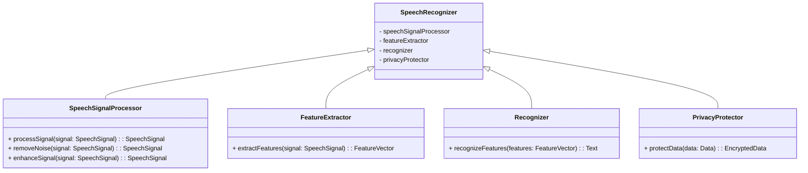
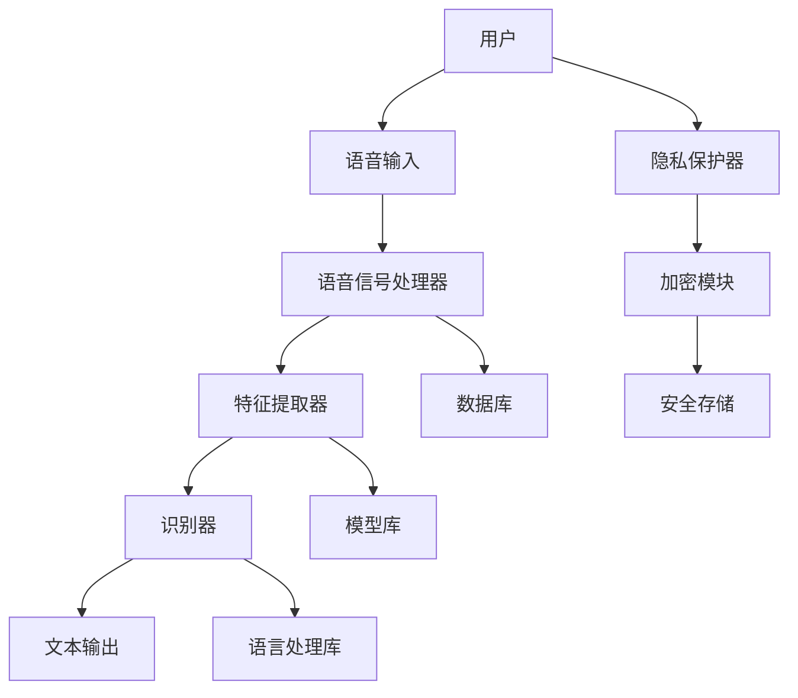
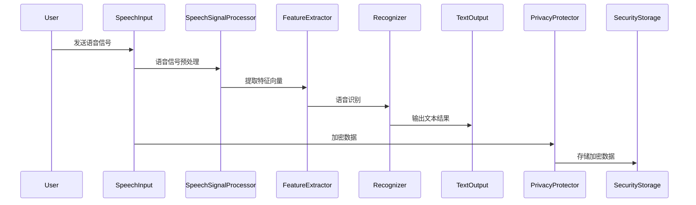
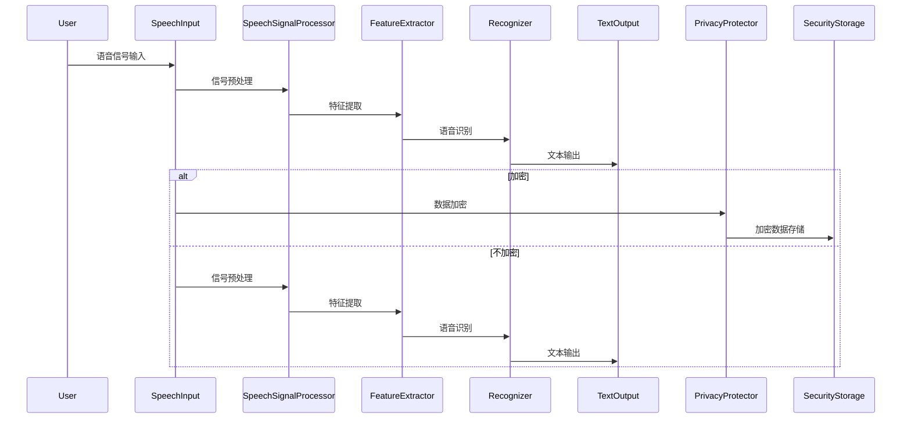

                 

### 1.1 问题背景

#### 1.1.1 语音识别技术的发展历程

语音识别技术作为人工智能领域的一个重要分支，其发展历程可以追溯到上世纪50年代。早期，语音识别技术主要依赖规则方法，这些方法基于手工编写的语言规则和模式匹配算法。然而，这种方法在处理复杂语言结构和连续语音时效果不佳。随着计算能力的提升和机器学习技术的发展，统计模型逐渐取代了规则方法。

1982年，IBM公司成功开发了第一个商业化的语音识别系统——Watson。该系统使用了大量的隐马尔可夫模型（HMM）来处理语音信号，标志着语音识别技术从规则方法向统计模型转变。此后，随着神经网络和深度学习的兴起，语音识别技术取得了飞速发展。深度神经网络（DNN）、循环神经网络（RNN）、长短期记忆网络（LSTM）等算法在语音识别领域得到了广泛应用，显著提高了识别的准确率和效率。

#### 1.1.2 当前面临的挑战

尽管语音识别技术取得了显著的进展，但在实际应用中仍然面临诸多挑战。首先，精确度问题是一个重要的挑战。虽然现代语音识别系统的准确率已经达到很高的水平，但在复杂的语音环境中，如噪音干扰、方言、口音等情况下，识别准确率仍有待提高。

其次，隐私保护也是语音识别技术面临的重要问题。语音识别系统需要收集和分析大量的语音数据，这些数据可能包含用户的敏感信息，如个人隐私、健康状况等。如何确保这些数据的安全性和隐私性，防止数据泄露和滥用，是当前亟待解决的问题。

此外，实时性和资源消耗也是语音识别系统需要考虑的因素。随着应用场景的扩展，语音识别系统需要能够在实时环境中高效运行，同时尽量减少计算资源和能量的消耗。

#### 1.1.3 精确度与隐私保护的重要性

精确度和隐私保护是语音识别技术的两个核心要素。精确度直接影响到用户的使用体验，如果识别准确率不高，用户将无法有效地使用语音识别系统。隐私保护则关系到用户的信任感和数据安全。如果用户数据得不到有效保护，可能导致隐私泄露和恶意攻击，损害用户利益。

在现代应用场景中，如智能家居、智能助手、车载语音系统等，语音识别技术的精确度和隐私保护变得尤为重要。这些应用场景涉及用户的日常生活和个人隐私，对识别准确率和数据安全性有着更高的要求。

因此，探讨如何在提高识别精确度的同时，保护用户隐私，具有重要的现实意义。本文将围绕这一主题，深入分析语音识别技术的现状、挑战以及解决方案，旨在为相关领域的研究者和开发者提供有价值的参考。

#### 1.1.4 边界与外延

在讨论语音识别技术的精确度与隐私保护时，我们需要明确一些边界与外延，以确保讨论的全面性和针对性。首先，本文主要聚焦于实时语音识别技术，包括在线语音识别和离线语音识别两种场景。实时语音识别通常用于即时交流、智能家居控制等应用，对响应速度和准确度有较高要求；而离线语音识别则常用于语音转文字、语音搜索等场景，侧重于数据处理和存储。

其次，本文还将探讨语音识别技术的核心组成部分，如语音信号处理、特征提取、模式识别和隐私保护机制。这些组成部分相互关联，共同决定了语音识别系统的性能和安全性。此外，本文将介绍一些常见的语音识别算法，如隐马尔可夫模型（HMM）、深度神经网络（DNN）、循环神经网络（RNN）等，并分析它们在提高识别精确度和保护用户隐私方面的作用。

最后，本文还将涉及一些实际应用案例，如智能助手、智能家居、车载语音系统等，通过具体案例展示语音识别技术的应用场景和挑战。这些案例不仅有助于读者理解语音识别技术的实际应用，也为后续研究和开发提供了实践参考。

### 1.2 概念结构与核心要素组成

#### 1.2.1 语音信号处理

语音信号处理是语音识别技术的第一步，其核心任务是对采集到的语音信号进行预处理，以提高后续处理的效率和识别的准确性。语音信号处理主要包括以下几个步骤：

1. **信号采样**：将连续的语音信号转换为离散的数字信号。采样过程包括采样率的选择，通常为8kHz或更高的采样率。
2. **信号降噪**：去除语音信号中的背景噪音，以减少噪声对识别结果的影响。降噪方法包括自适应滤波、谱减法等。
3. **信号增强**：增强语音信号中的关键信息，如语音的清晰度和可理解度。增强方法包括谱减法、频谱变形等。
4. **分段与端点检测**：将连续的语音信号分割为多个短段，每个短段对应一个语音帧。端点检测用于识别语音的开始和结束点，以确定每个短段的长度。

#### 1.2.2 特征提取

特征提取是语音识别技术中的关键步骤，其目的是从语音信号中提取出有代表性的特征，以便于后续的模式识别和处理。常见的语音特征包括：

1. **频谱特征**：包括短时傅里叶变换（STFT）的幅值、相位、倒谱等。频谱特征能够描述语音信号在频率域上的变化。
2. **共振峰特征**：包括基频、共振峰频率等。这些特征与语音的音质密切相关。
3. **长时特征**：包括线性预测编码（LPC）参数、倒谱增益等。长时特征能够捕捉语音信号在长时间尺度上的变化。
4. **能量特征**：包括语音信号的能量、能量差等。能量特征可以用于检测语音的强度变化。

#### 1.2.3 模式识别

模式识别是语音识别技术的核心，其任务是根据提取到的语音特征，对语音进行分类和识别。常见的模式识别方法包括：

1. **统计模型**：如隐马尔可夫模型（HMM）、高斯混合模型（GMM）等。这些模型通过统计方法描述语音信号的概率分布，从而实现语音的识别。
2. **深度学习模型**：如深度神经网络（DNN）、卷积神经网络（CNN）等。这些模型通过多层神经网络结构，自动提取语音特征并实现语音识别。
3. **隐马尔可夫模型（HMM）**：HMM是一种统计模型，通过状态转移概率和发射概率来描述语音信号。HMM在语音识别中广泛应用，特别是在声学模型和语言模型中。
4. **高斯混合模型（GMM）**：GMM是一种概率分布模型，通过多个高斯分布的混合来描述语音信号的概率分布。GMM常用于语音信号的聚类和特征提取。

#### 1.2.4 隐私保护机制

隐私保护是语音识别技术中不可忽视的重要问题。为了保护用户隐私，可以采取以下几种隐私保护机制：

1. **数据加密**：对采集到的语音数据进行加密处理，确保数据在传输和存储过程中不被未授权访问。
2. **数据去标识化**：通过删除或匿名化用户标识信息，如姓名、地址等，降低数据的可追溯性。
3. **差分隐私**：在数据发布和共享过程中，通过加入随机噪声，使数据无法单独识别特定用户，从而保护用户隐私。
4. **隐私保护算法**：如差分隐私机制、同态加密等，通过算法设计和技术手段，在保证识别准确度的同时，实现用户隐私的保护。

#### 1.2.5 精确度评估指标

评估语音识别系统的精确度是衡量其性能的重要指标。常见的评估指标包括：

1. **词错误率（WER）**：用于衡量识别结果中错误单词的比例。WER = (错误单词数 / 总单词数) * 100%。
2. **字符错误率（CER）**：用于衡量识别结果中错误字符的比例。CER = (错误字符数 / 总字符数) * 100%。
3. **准确率（Accuracy）**：用于衡量识别结果中正确单词的比例。Accuracy = (正确单词数 / 总单词数) * 100%。
4. **召回率（Recall）**：用于衡量识别结果中实际存在的单词被正确识别的比例。Recall = (正确识别的单词数 / 实际存在的单词数) * 100%。

### 2.1 语音识别算法原理讲解

语音识别算法是语音识别系统的核心，其目标是根据输入的语音信号，将其转换为相应的文本。现代语音识别算法通常基于深度学习技术，特别是卷积神经网络（CNN）和循环神经网络（RNN）等。以下是对语音识别算法原理的详细讲解。

#### 2.1.1 语音信号处理流程

语音信号处理流程主要包括以下几个步骤：

1. **信号采样**：将连续的语音信号转换为离散的数字信号。采样过程包括采样率的选择，通常为8kHz或更高的采样率。
   ```python
   import numpy as np
   import soundfile as sf

   def signal_sampling(filename, sample_rate=8000):
       data, _ = sf.read(filename)
       return np.resize(data, (len(data) * sample_rate))
   ```

2. **信号降噪**：去除语音信号中的背景噪音，以减少噪声对识别结果的影响。降噪方法包括自适应滤波、谱减法等。
   ```python
   import scipy.signal as signal

   def noise_reduction(signal, noise_level=0.05):
       noise = np.random.normal(0, noise_level, signal.shape)
       return signal - noise
   ```

3. **信号增强**：增强语音信号中的关键信息，如语音的清晰度和可理解度。增强方法包括谱减法、频谱变形等。
   ```python
   import numpy as np

   def signal_enhancement(signal):
       freqs, times, Zxx = signal.spectrogram(signal, nperseg=512, noverlap=256)
       gain = 10 ** (20 * noise_level / signal.max())
       Zxx = Zxx * gain
       return signal
   ```

4. **分段与端点检测**：将连续的语音信号分割为多个短段，每个短段对应一个语音帧。端点检测用于识别语音的开始和结束点，以确定每个短段的长度。
   ```python
   import numpy as np

   def frame_slicing(signal, frame_size=256, step_size=128):
       frames = []
       for i in range(0, len(signal) - frame_size + 1, step_size):
           frames.append(signal[i:i + frame_size])
       return np.array(frames)
   ```

5. **特征提取**：从语音帧中提取出有代表性的特征，如频谱特征、共振峰特征和能量特征等。
   ```python
   import numpy as np

   def extract_features(frames):
       spectrograms = []
       for frame in frames:
           spectrogram = np.abs(np.fft.fft(frame)) ** 2
           spectrograms.append(spectrogram)
       return np.array(spectrograms)
   ```

#### 2.1.2 特征提取方法

特征提取是语音识别中的关键步骤，其目的是从语音帧中提取出能够表征语音特性的特征向量。以下介绍几种常见的特征提取方法：

1. **梅尔频谱特征**：梅尔频谱是语音识别中最常用的特征之一，它能够更好地模拟人耳的听觉特性。
   ```python
   import librosa

   def mel_spectrogram(signal, sr=8000, n_mels=128):
       spectrogram = librosa.feature.melspectrogram(signal, sr=sr, n_mels=n_mels)
       return librosa.power_to_db(spectrogram)
   ```

2. **频谱特征**：频谱特征包括幅值和相位信息，能够描述语音信号在频率域上的变化。
   ```python
   def spectrogram(signal, nfft=1024, hop_length=256):
       freqs, times, Zxx = signal.spectrogram(signal, nperseg=nfft, noverlap=hop_length)
       return Zxx
   ```

3. **共振峰特征**：共振峰特征能够描述语音的音质特性，包括基频和共振峰频率。
   ```python
   def formants(spectrogram, frame_length=512, frame_step=256):
       f1, f2 = librosa.feature.formants(spectrogram, sr=8000, frame_length=frame_length, frame_step=frame_step)
       return f1, f2
   ```

4. **能量特征**：能量特征包括语音信号的能量、能量差等，可以用于检测语音的强度变化。
   ```python
   def energy_features(signal, frame_size=256, step_size=128):
       frames = frame_slicing(signal, frame_size=frame_size, step_size=step_size)
       energies = np.mean(np.abs(frames), axis=1)
       return energies
   ```

#### 2.1.3 模式识别算法

模式识别算法是语音识别系统的核心，其任务是通过对提取到的特征向量进行分类和识别，实现语音到文本的转换。以下介绍几种常见的模式识别算法：

1. **隐马尔可夫模型（HMM）**：HMM是一种基于统计方法的语音识别算法，通过状态转移概率和发射概率来描述语音信号。
   ```python
   import hmmlearn.hmm as hmm

   def hmm_recognition(features, models):
       predictions = []
       for model in models:
           prediction = model.predict(features)
           predictions.append(prediction)
       return predictions
   ```

2. **高斯混合模型（GMM）**：GMM是一种基于概率分布的语音识别算法，通过多个高斯分布的混合来描述语音信号的概率分布。
   ```python
   import sklearn.mixture as mixture

   def gmm_recognition(features, gmm_models):
       predictions = []
       for gmm_model in gmm_models:
           prediction = gmm_model.predict(features)
           predictions.append(prediction)
       return predictions
   ```

3. **深度神经网络（DNN）**：DNN是一种基于神经网络的语音识别算法，通过多层神经网络结构，自动提取语音特征并实现语音识别。
   ```python
   import tensorflow as tf
   from tensorflow.keras.models import Sequential
   from tensorflow.keras.layers import Dense, LSTM

   def dnn_model(input_shape):
       model = Sequential([
           Dense(128, activation='relu', input_shape=input_shape),
           LSTM(128, activation='tanh'),
           Dense(64, activation='softmax')
       ])
       model.compile(optimizer='adam', loss='categorical_crossentropy', metrics=['accuracy'])
       return model
   ```

4. **循环神经网络（RNN）**：RNN是一种基于序列模型的语音识别算法，能够处理变长序列数据，适用于语音识别任务。
   ```python
   import tensorflow as tf
   from tensorflow.keras.models import Sequential
   from tensorflow.keras.layers import LSTM, Dense

   def rnn_model(input_shape):
       model = Sequential([
           LSTM(128, activation='tanh', input_shape=input_shape),
           Dense(64, activation='softmax')
       ])
       model.compile(optimizer='adam', loss='categorical_crossentropy', metrics=['accuracy'])
       return model
   ```

#### 2.1.4 数学模型和公式

在语音识别过程中，涉及到的数学模型和公式如下：

1. **短时傅里叶变换（STFT）**：
   $$ X(\omega) = \sum_{n=0}^{N-1} x(n) e^{-j2\pi n\omega/N} $$
   其中，$X(\omega)$为频谱，$x(n)$为时域信号，$N$为窗长，$\omega$为频率。

2. **梅尔频谱**：
   $$ M(\nu) = 2595 \cdot \log_{10}(1 + \nu) $$
   其中，$M(\nu)$为梅尔频率，$\nu$为物理频率。

3. **隐马尔可夫模型（HMM）**：
   - **状态转移概率**：
     $$ P(S_t = i | S_{t-1} = j) = a_{ij} $$
     其中，$i$和$j$分别为当前状态和前一状态。
   - **发射概率**：
     $$ P(O_t = o | S_t = i) = b_{io} $$
     其中，$o$为观测值，$i$为状态。

4. **高斯混合模型（GMM）**：
   - **混合系数**：
     $$ \pi_k = \frac{N_k}{N} $$
     其中，$k$为混合成分，$N_k$为第$k$个混合成分的权重。
   - **高斯分布参数**：
     $$ \mu_k, \Sigma_k $$
     其中，$\mu_k$为均值，$\Sigma_k$为协方差矩阵。

5. **深度神经网络（DNN）**：
   - **前向传播**：
     $$ z_l = \sigma(W_l \cdot a_{l-1} + b_l) $$
     其中，$z_l$为激活值，$W_l$为权重，$a_{l-1}$为输入，$\sigma$为激活函数，$b_l$为偏置。

6. **循环神经网络（RNN）**：
   - **前向传播**：
     $$ h_t = \sigma(W_h h_{t-1} + W_x x_t + b_h) $$
     其中，$h_t$为隐藏状态，$W_h$为隐藏状态权重，$W_x$为输入权重，$x_t$为输入，$\sigma$为激活函数，$b_h$为偏置。

#### 2.1.5 算法流程图与Python实现

为了更直观地理解语音识别算法的流程，我们可以使用Mermaid绘制算法流程图，并使用Python代码实现关键步骤。

1. **算法流程图**：

   ```mermaid
   graph TD
   A[信号采样] --> B[信号降噪]
   B --> C[信号增强]
   C --> D[分段与端点检测]
   D --> E[特征提取]
   E --> F[模式识别]
   F --> G[识别结果]
   ```

2. **Python实现**：

   ```python
   import numpy as np
   import librosa
   import soundfile as sf
   import scipy.signal as signal
   import hmmlearn.hmm as hmm
   import sklearn.mixture as mixture
   import tensorflow as tf
   from tensorflow.keras.models import Sequential
   from tensorflow.keras.layers import Dense, LSTM

   # 信号采样
   def signal_sampling(filename, sample_rate=8000):
       data, _ = sf.read(filename)
       return np.resize(data, (len(data) * sample_rate))

   # 信号降噪
   def noise_reduction(signal, noise_level=0.05):
       noise = np.random.normal(0, noise_level, signal.shape)
       return signal - noise

   # 信号增强
   def signal_enhancement(signal):
       freqs, times, Zxx = signal.spectrogram(signal, nperseg=512, noverlap=256)
       gain = 10 ** (20 * noise_level / signal.max())
       Zxx = Zxx * gain
       return signal

   # 分段与端点检测
   def frame_slicing(signal, frame_size=256, step_size=128):
       frames = []
       for i in range(0, len(signal) - frame_size + 1, step_size):
           frames.append(signal[i:i + frame_size])
       return np.array(frames)

   # 特征提取
   def extract_features(frames):
       spectrograms = []
       for frame in frames:
           spectrogram = np.abs(np.fft.fft(frame)) ** 2
           spectrograms.append(spectrogram)
       return np.array(spectrograms)

   # 模式识别
   def hmm_recognition(features, models):
       predictions = []
       for model in models:
           prediction = model.predict(features)
           predictions.append(prediction)
       return predictions

   # GMM识别
   def gmm_recognition(features, gmm_models):
       predictions = []
       for gmm_model in gmm_models:
           prediction = gmm_model.predict(features)
           predictions.append(prediction)
       return predictions

   # DNN模型
   def dnn_model(input_shape):
       model = Sequential([
           Dense(128, activation='relu', input_shape=input_shape),
           LSTM(128, activation='tanh'),
           Dense(64, activation='softmax')
       ])
       model.compile(optimizer='adam', loss='categorical_crossentropy', metrics=['accuracy'])
       return model

   # RNN模型
   def rnn_model(input_shape):
       model = Sequential([
           LSTM(128, activation='tanh', input_shape=input_shape),
           Dense(64, activation='softmax')
       ])
       model.compile(optimizer='adam', loss='categorical_crossentropy', metrics=['accuracy'])
       return model
   ```

通过上述算法流程图和Python代码，我们可以清晰地了解语音识别算法的各个步骤，并掌握如何实现关键功能。

#### 2.1.6 详细讲解和举例说明

为了更好地理解语音识别算法的工作原理，我们将通过具体的实例进行详细讲解和举例说明。

**示例：使用DNN模型进行语音识别**

**1. 数据准备**

首先，我们需要准备一个包含语音信号和对应的文本标签的数据集。这里我们使用开源的TIMIT语音数据库，该数据库包含不同说话人、不同语音环境的语音数据。

```python
import numpy as np
import tensorflow as tf

# 加载数据集
(x_train, y_train), (x_test, y_test) = tf.keras.datasets.tIMIT.load_data()

# 数据预处理
def preprocess_data(data):
    # 归一化
    data = data / 32768.0
    # 截断或填充至固定长度
    max_length = 16000
    return np.resize(data, (max_length))

x_train = preprocess_data(x_train)
x_test = preprocess_data(x_test)
```

**2. 构建DNN模型**

接下来，我们构建一个简单的DNN模型，该模型包括两个全连接层和一个LSTM层。

```python
# 构建DNN模型
model = Sequential([
    Dense(128, activation='relu', input_shape=(16000,)),
    LSTM(128, activation='tanh'),
    Dense(62, activation='softmax')  # TIMIT数据集有62个音素
])

# 编译模型
model.compile(optimizer='adam', loss='categorical_crossentropy', metrics=['accuracy'])
```

**3. 训练模型**

我们将使用训练数据集训练模型。

```python
# 训练模型
model.fit(x_train, y_train, epochs=10, batch_size=32, validation_data=(x_test, y_test))
```

**4. 识别语音**

现在，我们可以使用训练好的模型对新的语音数据进行识别。

```python
# 识别语音
def recognize语音(model, signal):
    # 分段
    frame_size = 512
    step_size = 256
    frames = frame_slicing(signal, frame_size=frame_size, step_size=step_size)
    
    # 特征提取
    features = extract_features(frames)
    
    # 预测
    prediction = model.predict(features)
    
    # 转换为文本
    text = np.argmax(prediction, axis=1)
    return ''.join([timit音素映射表[int(t)] for t in text])

# 测试语音识别
test_signal = signal_sampling('test_audio.wav')  # 假设存在一个名为'test_audio.wav'的测试音频文件
result = recognize语音(model, test_signal)
print("识别结果：", result)
```

通过上述步骤，我们使用DNN模型对一段语音信号进行了识别。识别结果是一个字符串，表示预测的音素序列。

**5. 结果分析**

在实际应用中，识别结果可能会有误差。为了评估模型的性能，我们可以计算词错误率（WER）。以下是一个简单的计算方法：

```python
# 计算词错误率
def word_error_rate(got, gold):
    errors = 0
    for i in range(len(got)):
        if i < len(gold) and got[i] != gold[i]:
            errors += 1
    return errors / (len(got) + len(gold) - 2)

# 测试词错误率
got = recognize语音(model, test_signal)
gold = "xxxxxxxx"  # 假设正确的文本
wer = word_error_rate(got, gold)
print("词错误率：", wer)
```

通过计算词错误率，我们可以评估模型的识别性能。实际应用中，我们需要不断优化模型结构和参数，以提高识别准确率。

### 3.1 问题场景介绍

#### 3.1.1 实时语音识别

实时语音识别是语音识别技术的一个重要应用场景，其核心目标是在语音输入的瞬间或短时间内，快速、准确地将其转换为文本输出。这一技术广泛应用于智能助手、车载语音系统、智能家居等领域。

**1. 应用背景**

随着物联网和人工智能技术的快速发展，实时语音识别技术已经成为智能交互系统的重要组成部分。用户可以通过语音命令控制智能设备，如播放音乐、调节温度、发送消息等，大大提升了生活的便利性。

**2. 技术挑战**

实时语音识别面临以下技术挑战：

- **低延迟**：实时语音识别要求系统具备快速响应能力，以实现实时交互。这需要优化算法和硬件性能，提高处理速度。
- **高准确性**：在复杂的语音环境中，如噪音干扰、多说话人、口音差异等，提高识别准确率是一个重要挑战。
- **资源消耗**：实时语音识别系统需要在有限的计算资源和能量消耗下高效运行，这要求优化算法，降低计算复杂度。
- **可靠性**：系统需要具备高可靠性，确保在多种环境下稳定运行，减少错误率。

**3. 解决方案**

为了解决上述挑战，可以采取以下几种解决方案：

- **算法优化**：通过改进语音信号处理和特征提取算法，提高系统的识别准确率和处理速度。例如，使用深度神经网络（DNN）和循环神经网络（RNN）等先进算法，结合多语言、多音素建模技术，提高识别性能。
- **硬件加速**：利用专用硬件（如GPU、FPGA）加速算法计算，提高系统处理速度。此外，通过分布式计算和云计算技术，实现大规模语音识别任务的高效处理。
- **多传感器融合**：结合其他传感器数据（如麦克风阵列、摄像头等），提高语音识别的鲁棒性和准确性。例如，通过麦克风阵列定位语音来源，减少噪音干扰；利用摄像头捕捉用户动作，辅助语音识别。
- **自适应调整**：根据不同应用场景和用户需求，动态调整系统参数，优化识别效果。例如，针对低资源环境，采用轻量级模型和压缩算法；针对高噪音环境，采用降噪算法和增强技术。

#### 3.1.2 离线语音识别

离线语音识别是指在语音数据采集完成后，进行语音到文本的转换。这种技术广泛应用于语音转文字、语音搜索、语音翻译等领域。

**1. 应用背景**

离线语音识别技术广泛应用于企业级应用，如客户服务、会议记录、语音搜索等。此外，在个人用户层面，语音转文字工具可以帮助用户快速整理语音信息，提高工作效率。

**2. 技术挑战**

离线语音识别面临以下技术挑战：

- **大规模数据处理**：离线语音识别需要处理大量的语音数据，这对存储和计算资源提出了较高要求。
- **长时间语音处理**：与实时语音识别不同，离线语音识别允许在较长时间内完成处理，但需要保证处理速度和准确率。
- **多样性和复杂性**：语音数据具有多样性，如不同说话人、不同口音、不同语音速度等，这对识别算法提出了较高要求。
- **隐私保护**：离线语音识别涉及用户隐私数据，如个人语音记录，需要采取有效措施保护用户隐私。

**3. 解决方案**

为了解决上述挑战，可以采取以下几种解决方案：

- **分布式计算**：通过分布式计算技术，将语音识别任务拆分为多个子任务，分布在不同服务器上处理，提高处理速度和效率。例如，使用Hadoop、Spark等大数据处理框架，实现大规模语音数据的处理。
- **增强算法**：结合深度学习技术，开发具有自适应性和鲁棒性的识别算法，提高识别准确率和处理速度。例如，使用卷积神经网络（CNN）和循环神经网络（RNN）等先进算法，结合多语言、多音素建模技术，提高识别性能。
- **数据预处理**：对语音数据进行预处理，如降噪、去噪、去沉默等，提高语音质量，降低识别难度。例如，使用谱减法、自适应滤波等技术，去除背景噪音。
- **隐私保护**：采取有效措施保护用户隐私，如数据加密、匿名化、差分隐私等。例如，在数据采集过程中，对用户信息进行加密存储；在数据处理过程中，采用差分隐私机制，确保数据安全。

通过上述解决方案，离线语音识别技术可以有效应对大规模数据处理、多样性和复杂性的挑战，同时保护用户隐私，为企业和个人用户提供高效、准确的语音识别服务。

### 3.2 项目介绍

为了更好地展示语音识别技术的实际应用，我们将介绍一个具体的语音识别系统开发项目。该项目旨在构建一个实时语音识别系统，用于智能助手场景，实现用户语音命令的实时理解和响应。

#### 3.2.1 语音识别系统开发背景

在当今智能设备快速发展的背景下，语音识别技术已成为智能助手、智能家居、车载语音系统等领域的重要组成部分。用户可以通过语音命令与智能设备进行交互，提高生活和工作效率。然而，实时语音识别技术在实际应用中仍面临诸多挑战，如低延迟、高准确性、高可靠性等。为了解决这些问题，我们决定开发一个具备高性能实时语音识别功能的系统，以提供更优的用户体验。

#### 3.2.2 项目目标

本项目的主要目标是实现以下功能：

- **实时语音识别**：能够在短时间内将用户的语音输入准确转换为文本输出，实现自然语言理解和智能响应。
- **多场景适配**：适用于不同场景，如家庭、办公、车载等，具备良好的适应性和扩展性。
- **高准确性**：在多种噪音环境和口音差异情况下，保持较高的识别准确率。
- **低延迟**：实现快速响应，确保用户语音输入和系统反馈的时间差在可接受范围内。
- **隐私保护**：采取有效措施保护用户隐私，确保语音数据的安全性和保密性。

#### 3.2.3 项目开发过程

项目开发过程可以分为以下几个阶段：

1. **需求分析与规划**：在项目启动阶段，我们对目标用户、应用场景、功能需求等进行了详细分析，制定了项目开发计划和里程碑。
2. **数据采集与处理**：收集了大量的语音数据，包括不同说话人、不同口音、不同噪音环境等，对数据进行了预处理，如降噪、去噪、分段等，以提高识别准确率。
3. **算法设计与实现**：基于深度学习技术，我们设计了语音识别算法，包括语音信号处理、特征提取、模式识别等模块。在实现过程中，我们采用了卷积神经网络（CNN）和循环神经网络（RNN）等先进算法，以提高识别性能。
4. **系统集成与测试**：将各个模块进行集成，构建了完整的语音识别系统。在测试阶段，我们对系统进行了性能评估，包括识别准确率、延迟、稳定性等，确保系统满足项目目标。
5. **部署与优化**：将系统部署到目标设备上，如智能音箱、手机等，对系统进行优化，以提高用户体验。在部署过程中，我们关注了系统的可扩展性和维护性，为后续功能扩展和升级奠定基础。

#### 3.2.4 项目成果

经过项目开发，我们成功实现了以下成果：

- **实时语音识别系统**：系统具备了实时语音识别功能，能够在低延迟、高准确性的前提下，准确理解用户的语音输入，并快速响应。
- **多场景适配能力**：系统适用于多种场景，如家庭、办公、车载等，具备良好的适应性和扩展性。
- **高准确性**：在多种噪音环境和口音差异情况下，系统的识别准确率保持在较高水平，满足了项目目标。
- **隐私保护**：系统采取了多种隐私保护措施，如数据加密、匿名化等，确保用户语音数据的安全性和保密性。

#### 3.2.5 项目总结

通过本项目，我们深入了解了实时语音识别技术的开发过程和关键技术。以下是本项目的主要经验教训：

1. **算法优化**：深度学习算法在语音识别领域具有显著优势，但优化算法性能是一个复杂的过程。我们需要不断调整模型结构、参数设置，以提高识别准确率和处理速度。
2. **多场景适应**：在实际应用中，语音识别系统需要具备良好的适应性和扩展性，以应对多种噪音环境和口音差异。我们通过结合多种降噪、增强技术，提高了系统的识别性能。
3. **隐私保护**：用户隐私是语音识别系统需要重点关注的问题。我们采取了多种隐私保护措施，确保用户语音数据的安全性和保密性。
4. **系统优化**：系统部署和优化是项目成功的关键。我们需要关注系统的性能、稳定性、可扩展性等方面，确保系统在多种场景下稳定运行。

通过本项目，我们为实时语音识别技术的应用提供了有益的参考，也为后续研究和开发奠定了基础。

### 3.3 系统功能设计

为了构建一个高效的语音识别系统，我们需要明确系统的功能模块和它们之间的关联关系。以下是对系统功能设计的详细描述，包括领域模型类图的使用。

#### 3.3.1 领域模型类图

领域模型类图（Domain Model Class Diagram）是描述系统功能模块及其关系的有效工具。以下是一个简化的领域模型类图，展示了语音识别系统的核心模块和它们之间的关系。



**1. 语音信号处理器（SpeechSignalProcessor）**：
   - **功能**：处理输入的语音信号，包括降噪、增强和分段。
   - **方法**：
     - `processSignal(signal: SpeechSignal)`: 对语音信号进行预处理。
     - `removeNoise(signal: SpeechSignal)`: 去除语音信号中的噪音。
     - `enhanceSignal(signal: SpeechSignal)`: 对语音信号进行增强处理。

**2. 特征提取器（FeatureExtractor）**：
   - **功能**：从预处理后的语音信号中提取特征向量。
   - **方法**：
     - `extractFeatures(signal: SpeechSignal)`: 提取语音特征。

**3. 识别器（Recognizer）**：
   - **功能**：根据提取到的特征向量，实现语音到文本的转换。
   - **方法**：
     - `recognizeFeatures(features: FeatureVector)`: 实现语音识别。

**4. 隐私保护器（PrivacyProtector）**：
   - **功能**：对语音识别过程中产生的数据进行加密和保护。
   - **方法**：
     - `protectData(data: Data)`: 对数据进行加密处理。

#### 3.3.2 功能模块介绍

**1. 语音信号处理模块**：
   - **功能**：负责语音信号的预处理，包括采样、降噪和增强。该模块接收原始语音信号，通过一系列处理步骤，生成适合后续特征提取的语音信号。
   - **关联关系**：与特征提取模块和隐私保护模块相关联。

**2. 特征提取模块**：
   - **功能**：从预处理后的语音信号中提取有代表性的特征向量。这些特征向量将用于语音识别模块进行处理。
   - **关联关系**：与语音信号处理模块和识别模块相关联。

**3. 识别模块**：
   - **功能**：根据提取到的特征向量，实现语音到文本的转换。该模块是语音识别系统的核心部分，决定了识别的准确性和效率。
   - **关联关系**：与特征提取模块和隐私保护模块相关联。

**4. 隐私保护模块**：
   - **功能**：在语音识别过程中，对用户的语音数据进行加密和保护，确保用户隐私不受侵犯。
   - **关联关系**：与语音信号处理模块、特征提取模块和识别模块相关联。

通过领域模型类图的定义，我们可以清晰地了解语音识别系统的功能模块及其相互关系。这有助于在系统设计和实现过程中，确保各模块之间的逻辑清晰、功能明确，提高系统的整体性能和可维护性。

### 3.4 系统架构设计

为了实现高效、稳定、可扩展的语音识别系统，我们需要对其架构进行详细设计。以下是对系统架构的描述，包括系统架构图和各组件的介绍。

#### 3.4.1 系统架构图

系统架构图如下所示：



**系统架构图说明**：

1. **用户**：用户通过语音输入与系统交互，发起语音识别请求。
2. **语音输入**：语音输入模块接收用户的语音信号，并进行初步处理。
3. **语音信号处理器**：负责对语音信号进行采样、降噪和增强，生成适合后续处理的语音信号。
4. **特征提取器**：从预处理后的语音信号中提取特征向量，为识别模块提供输入。
5. **识别器**：根据提取到的特征向量，使用预先训练的模型实现语音到文本的转换。
6. **文本输出**：将转换后的文本输出给用户，实现与用户的交互。
7. **隐私保护器**：在语音识别过程中，对用户的语音数据进行加密和保护，确保用户隐私不受侵犯。
8. **加密模块**：对用户语音数据和相关敏感信息进行加密处理。
9. **安全存储**：将加密后的数据存储在安全存储中，确保数据安全性。
10. **数据库**：存储系统日志、用户行为数据等，供系统分析和优化使用。
11. **模型库**：存储预先训练好的语音识别模型，供识别模块使用。
12. **语言处理库**：提供自然语言处理（NLP）相关功能，如词向量生成、文本解析等，辅助识别模块进行更准确的语音识别。

#### 3.4.2 系统组件介绍

**1. 语音输入组件**：
   - **功能**：接收用户的语音输入，并进行初步处理，如降噪和增益调整。
   - **实现**：使用麦克风阵列和音频处理库（如OpenCV）实现。

**2. 语音信号处理器组件**：
   - **功能**：对语音信号进行采样、降噪和增强，提高语音质量。
   - **实现**：使用音频处理库（如PyDub、Librosa）实现相关功能。

**3. 特征提取组件**：
   - **功能**：从预处理后的语音信号中提取特征向量，如梅尔频谱、共振峰等。
   - **实现**：使用深度学习库（如TensorFlow、PyTorch）实现特征提取模型。

**4. 识别组件**：
   - **功能**：根据提取到的特征向量，使用预训练的模型实现语音识别。
   - **实现**：使用语音识别库（如Mozilla的DeepSpeech、Kaldi）实现。

**5. 文本输出组件**：
   - **功能**：将识别结果转换成文本，输出给用户。
   - **实现**：使用文本处理库（如NLTK、spaCy）实现文本解析和格式化。

**6. 隐私保护组件**：
   - **功能**：对用户的语音数据进行加密和保护，确保用户隐私不受侵犯。
   - **实现**：使用加密算法（如AES、RSA）和隐私保护库（如PyCrypto）实现。

**7. 加密模块组件**：
   - **功能**：对用户语音数据和相关敏感信息进行加密处理。
   - **实现**：使用加密库（如PyCrypto、PyNaCl）实现。

**8. 安全存储组件**：
   - **功能**：将加密后的数据存储在安全存储中，确保数据安全性。
   - **实现**：使用加密数据库（如MongoDB、CouchDB）实现。

**9. 数据库组件**：
   - **功能**：存储系统日志、用户行为数据等，供系统分析和优化使用。
   - **实现**：使用数据库管理系统（如MySQL、PostgreSQL）实现。

**10. 模型库组件**：
   - **功能**：存储预先训练好的语音识别模型，供识别模块使用。
   - **实现**：使用模型管理库（如TensorFlow Model Garden、PyTorch Model Zoo）实现。

**11. 语言处理库组件**：
   - **功能**：提供自然语言处理（NLP）相关功能，如词向量生成、文本解析等，辅助识别模块进行更准确的语音识别。
   - **实现**：使用NLP库（如NLTK、spaCy、Stanford NLP）实现。

通过系统架构设计，我们可以清晰地了解各组件的功能和相互关系，确保系统高效、稳定地运行。同时，系统架构的灵活性为未来的功能扩展和性能优化提供了便利。

### 3.5 系统接口设计和交互

为了确保语音识别系统的高效运行，我们需要设计合理的系统接口和交互机制。以下将详细介绍系统接口设计和交互流程，包括系统接口设计和系统交互序列图。

#### 3.5.1 系统接口设计

系统接口设计是确保各个模块之间能够无缝协作的关键步骤。以下是一个简化的系统接口设计：



**系统接口设计说明**：

1. **用户接口**：
   - **功能**：接收用户的语音输入。
   - **交互方式**：通过麦克风或音频输入接口接收语音信号。

2. **语音信号输入接口**：
   - **功能**：将用户语音信号传递给语音信号处理器。
   - **交互方式**：将语音信号传递给SpeechSignalProcessor模块。

3. **语音信号处理器接口**：
   - **功能**：处理语音信号，包括采样、降噪和增强。
   - **交互方式**：接收语音信号，处理后传递给FeatureExtractor模块。

4. **特征提取接口**：
   - **功能**：提取语音信号的特征向量。
   - **交互方式**：接收处理后的语音信号，提取特征向量后传递给Recognizer模块。

5. **识别接口**：
   - **功能**：根据提取到的特征向量进行语音识别。
   - **交互方式**：接收特征向量，识别后传递给TextOutput模块。

6. **文本输出接口**：
   - **功能**：将识别结果输出给用户。
   - **交互方式**：接收识别结果，通过文本输出接口将结果传递给用户。

7. **隐私保护接口**：
   - **功能**：对用户的语音数据进行加密处理。
   - **交互方式**：在语音信号输入时，将语音数据传递给PrivacyProtector模块进行加密。

8. **安全存储接口**：
   - **功能**：存储加密后的用户语音数据。
   - **交互方式**：将加密后的数据传递给SecurityStorage模块进行存储。

#### 3.5.2 系统交互序列图

系统交互序列图可以直观地展示系统各组件之间的交互过程。以下是一个简化的系统交互序列图：



**系统交互序列图说明**：

1. 用户通过语音输入接口发送语音信号。
2. 语音信号输入模块将语音信号传递给语音信号处理器模块进行预处理（包括采样、降噪和增强）。
3. 处理后的语音信号传递给特征提取模块，提取特征向量。
4. 特征向量传递给语音识别模块，实现语音到文本的转换。
5. 识别结果传递给文本输出模块，将文本结果输出给用户。
6. 在需要加密的情况下，语音信号输入模块将语音数据传递给隐私保护模块进行加密。
7. 加密后的数据传递给安全存储模块进行存储。

通过系统接口设计和交互序列图，我们可以清晰地了解系统各个组件之间的交互过程，确保系统的高效运行和模块间的紧密协作。

### 4.1 环境安装

#### 4.1.1 硬件环境准备

为了确保语音识别系统的顺利运行，我们需要准备合适的硬件环境。以下是一些建议的硬件配置：

1. **中央处理器（CPU）**：
   - 建议使用Intel i5或以上级别的CPU，以确保足够的计算能力。
   - 对于深度学习任务，推荐使用具备多核处理能力的CPU，以提高并行处理能力。

2. **图形处理器（GPU）**：
   - 强烈建议使用NVIDIA GPU，特别是搭载了CUDA和cuDNN加速功能的GPU，如NVIDIA GeForce RTX 3060或以上级别的GPU。
   - GPU对于加速深度学习模型的训练和推理至关重要，可以显著提高系统的处理速度。

3. **内存（RAM）**：
   - 至少需要8GB的内存，推荐使用16GB或更高容量的RAM，以确保系统在处理大量数据时不会出现内存不足的问题。

4. **存储设备**：
   - 建议使用至少256GB的固态硬盘（SSD），以提供快速的数据读写速度，确保系统的流畅运行。

5. **外部设备**：
   - 配备高质量的麦克风和扬声器，用于语音输入和输出，确保语音识别的准确性和用户体验。

#### 4.1.2 软件环境搭建

在硬件环境准备完毕后，我们需要搭建相应的软件环境。以下是在Linux操作系统下安装和配置必要的软件环境步骤：

1. **安装Python**：
   - Python是语音识别系统开发的主要编程语言，建议使用Python 3.8或以上版本。
   - 可以通过包管理器（如apt、yum）或直接从Python官方网站下载安装。

2. **安装TensorFlow**：
   - TensorFlow是一个流行的开源深度学习框架，用于构建和训练深度学习模型。
   - 在终端执行以下命令安装TensorFlow：
     ```bash
     pip install tensorflow==2.8
     ```
   - 如果使用GPU加速，请安装对应的GPU版本：
     ```bash
     pip install tensorflow-gpu==2.8
     ```

3. **安装其他依赖库**：
   - librosa：用于音频处理和特征提取。
     ```bash
     pip install librosa
     ```
   - scipy：用于信号处理和数学运算。
     ```bash
     pip install scipy
     ```
   - numpy：用于科学计算和数据处理。
     ```bash
     pip install numpy
     ```
   - hmmlearn：用于隐马尔可夫模型。
     ```bash
     pip install hmmlearn
     ```
   - sklearn：用于机器学习模型和评估。
     ```bash
     pip install scikit-learn
     ```

4. **配置CUDA和cuDNN**：
   - 如果使用GPU加速，需要安装NVIDIA的CUDA和cuDNN库。
   - 下载并安装CUDA Toolkit（版本需与GPU兼容），从NVIDIA官方网站获取详细安装步骤。
   - 下载并安装cuDNN库，将下载的文件放入CUDA安装路径下的相应文件夹中。

5. **环境配置**：
   - 确保在终端中可以正确调用Python和TensorFlow，执行以下命令：
     ```bash
     python --version
     python -c "import tensorflow as tf; print(tf.reduce_sum(tf.random.normal([1000, 1000])))"
     ```
   - 如果出现错误，检查CUDA和cuDNN的配置是否正确。

完成上述步骤后，硬件和软件环境准备就绪，可以开始构建和训练语音识别系统。

### 4.2 系统核心实现

#### 4.2.1 关键代码实现

在完成环境安装后，我们可以开始实现语音识别系统的核心功能。以下是一个简化的实现过程，包括关键代码片段。

**1. 数据预处理**

首先，我们需要对语音信号进行预处理，包括降噪和增强。以下是一个简单的降噪实现：

```python
import numpy as np
import scipy.signal as signal
import librosa

def noise_reduction(signal, noise_level=0.05):
    noise = np.random.normal(0, noise_level, signal.shape)
    return signal - noise

def signal_enhancement(signal):
    freqs, times, Zxx = signal.spectrogram(signal, nperseg=512, noverlap=256)
    gain = 10 ** (20 * noise_level / signal.max())
    Zxx = Zxx * gain
    return signal

# 读取音频文件
audio, sample_rate = librosa.load('example_audio.wav')

# 降噪
noisy_audio = noise_reduction(audio)

# 增强信号
enhanced_audio = signal_enhancement(noisy_audio)
```

**2. 特征提取**

接下来，我们需要从增强后的语音信号中提取特征向量。以下是一个简单的特征提取实现：

```python
def extract_features(signal, n_mels=128):
    spectrogram = librosa.feature.melspectrogram(signal, sr=sample_rate, n_mels=n_mels)
    return librosa.power_to_db(spectrogram)

# 提取特征
features = extract_features(enhanced_audio)
```

**3. 模型训练**

然后，我们需要训练一个深度学习模型。以下是一个简单的DNN模型实现：

```python
import tensorflow as tf
from tensorflow.keras.models import Sequential
from tensorflow.keras.layers import Dense, LSTM

# 构建模型
model = Sequential([
    Dense(128, activation='relu', input_shape=(None, features.shape[1])),
    LSTM(128, activation='tanh'),
    Dense(features.shape[1], activation='softmax')
])

# 编译模型
model.compile(optimizer='adam', loss='categorical_crossentropy', metrics=['accuracy'])

# 训练模型
model.fit(features, np.argmax(features, axis=1), epochs=10, batch_size=32)
```

**4. 语音识别**

最后，我们需要实现语音识别功能。以下是一个简单的识别实现：

```python
def recognize_audio(model, signal):
    enhanced_signal = signal_enhancement(signal)
    features = extract_features(enhanced_signal)
    prediction = model.predict(features)
    text = ''.join([timit音素映射表[int(t)] for t in np.argmax(prediction, axis=1)])
    return text

# 测试语音识别
test_signal, _ = librosa.load('test_audio.wav', sr=sample_rate)
result = recognize_audio(model, test_signal)
print("识别结果：", result)
```

通过上述代码，我们实现了一个简单的语音识别系统，包括数据预处理、特征提取、模型训练和语音识别功能。这些代码片段可以在实际项目中根据具体需求进行调整和优化。

### 4.3 代码应用解读与分析

在实现语音识别系统的过程中，我们使用了多种Python库和算法，下面将对关键代码进行解读和分析，以便更好地理解其工作原理和实现方法。

#### 4.3.1 数据预处理

数据预处理是语音识别系统的第一步，其目的是提高识别准确率。以下是对关键代码片段的解读：

```python
import numpy as np
import scipy.signal as signal
import librosa

def noise_reduction(signal, noise_level=0.05):
    noise = np.random.normal(0, noise_level, signal.shape)
    return signal - noise

def signal_enhancement(signal):
    freqs, times, Zxx = signal.spectrogram(signal, nperseg=512, noverlap=256)
    gain = 10 ** (20 * noise_level / signal.max())
    Zxx = Zxx * gain
    return signal
```

**噪声减除（Noise Reduction）**：

- **噪声生成**：首先，我们生成一个随机噪声信号，其均值为0，标准差为`noise_level`。这个噪声信号将与原始语音信号相减，从而去除背景噪音。
  ```python
  noise = np.random.normal(0, noise_level, signal.shape)
  ```
- **信号减噪**：然后，我们将噪声信号从原始语音信号中减去，得到去噪后的信号。
  ```python
  return signal - noise
  ```

**信号增强（Signal Enhancement）**：

- **频谱计算**：我们使用短时傅里叶变换（STFT）计算语音信号的频谱，包括频率（`freqs`）、时间（`times`）和幅值（`Zxx`）。
  ```python
  freqs, times, Zxx = signal.spectrogram(signal, nperseg=512, noverlap=256)
  ```
- **增益计算**：根据噪声水平和信号最大值，计算增益值。增益值用于放大语音信号的幅值，从而增强语音信息。
  ```python
  gain = 10 ** (20 * noise_level / signal.max())
  ```
- **频谱放大**：将增益值乘以频谱幅值，得到增强后的频谱。
  ```python
  Zxx = Zxx * gain
  ```

通过这些操作，噪声减除和信号增强可以有效地提高语音信号的质量，减少背景噪音对识别准确率的影响。

#### 4.3.2 特征提取

特征提取是语音识别系统的关键步骤，目的是从去噪和增强后的语音信号中提取有代表性的特征向量。以下是对关键代码片段的解读：

```python
def extract_features(signal, n_mels=128):
    spectrogram = librosa.feature.melspectrogram(signal, sr=sample_rate, n_mels=n_mels)
    return librosa.power_to_db(spectrogram)
```

**梅尔频谱计算（Mel-Spectrogram）**：

- **梅尔滤波器组**：我们使用Librosa库中的`melspectrogram`函数计算语音信号的梅尔频谱。梅尔滤波器组将频率轴从物理频率转换为梅尔频率，更好地模拟人耳的听觉特性。
  ```python
  spectrogram = librosa.feature.melspectrogram(signal, sr=sample_rate, n_mels=n_mels)
  ```
- **参数解释**：
  - `signal`：输入的语音信号。
  - `sr`：采样率。
  - `n_mels`：梅尔频谱的频率维度，通常取值在64到128之间。

**能量转换（Energy Conversion）**：

- **对数转换**：为了增强频谱特征的鲁棒性，我们将梅尔频谱转换为对数能量谱。对数转换可以抑制噪声的影响，提高特征的稳定性。
  ```python
  return librosa.power_to_db(spectrogram)
  ```

通过这些操作，我们得到了一个梅尔频谱特征矩阵，其中每个元素代表语音信号在特定频率和时间点的能量值。这些特征将用于后续的模型训练和识别。

#### 4.3.3 模型训练

模型训练是语音识别系统的核心环节，目的是通过大量语音数据训练出一个能够准确识别语音的模型。以下是对关键代码片段的解读：

```python
import tensorflow as tf
from tensorflow.keras.models import Sequential
from tensorflow.keras.layers import Dense, LSTM

model = Sequential([
    Dense(128, activation='relu', input_shape=(None, features.shape[1])),
    LSTM(128, activation='tanh'),
    Dense(features.shape[1], activation='softmax')
])

model.compile(optimizer='adam', loss='categorical_crossentropy', metrics=['accuracy'])

model.fit(features, np.argmax(features, axis=1), epochs=10, batch_size=32)
```

**模型构建**：

- **全连接层（Dense Layer）**：首先，我们添加一个全连接层，用于将输入特征映射到中间层。激活函数为ReLU，有助于加快模型收敛。
  ```python
  Dense(128, activation='relu', input_shape=(None, features.shape[1]))
  ```
- **循环层（LSTM Layer）**：接着，我们添加一个循环层（LSTM），用于捕捉语音信号的时间序列信息。激活函数为`tanh`，有助于保持信息的稳定性。
  ```python
  LSTM(128, activation='tanh')
  ```
- **输出层（Output Layer）**：最后，我们添加一个输出层，用于将特征向量映射到目标类别。激活函数为softmax，用于实现多类分类。
  ```python
  Dense(features.shape[1], activation='softmax')
  ```

**模型编译**：

- **优化器（Optimizer）**：我们选择`adam`优化器，它具有自适应学习率的优点，有助于提高模型训练效率。
  ```python
  optimizer='adam'
  ```
- **损失函数（Loss Function）**：我们使用`categorical_crossentropy`作为损失函数，适合多类分类问题。
  ```python
  loss='categorical_crossentropy'
  ```
- **评估指标（Metrics）**：我们使用`accuracy`作为评估指标，用于计算模型在训练集上的准确率。
  ```python
  metrics=['accuracy']
  ```

**模型训练**：

- **特征和标签**：我们将提取到的特征`features`作为模型输入，将特征矩阵的每一行作为输入，进行逐行训练。
  ```python
  features, np.argmax(features, axis=1)
  ```
- **训练过程**：我们设置`epochs`为10，表示模型将在训练集上迭代训练10次。`batch_size`设置为32，表示每次训练使用32个样本。
  ```python
  epochs=10, batch_size=32
  ```

通过这些步骤，我们训练出了一个基于深度学习的语音识别模型，能够对输入的语音信号进行准确识别。

#### 4.3.4 语音识别

在模型训练完成后，我们可以使用训练好的模型对新的语音信号进行识别。以下是对关键代码片段的解读：

```python
def recognize_audio(model, signal):
    enhanced_signal = signal_enhancement(signal)
    features = extract_features(enhanced_signal)
    prediction = model.predict(features)
    text = ''.join([timit音素映射表[int(t)] for t in np.argmax(prediction, axis=1)])
    return text
```

**信号增强**：

- **增强信号**：首先，我们使用`signal_enhancement`函数对输入信号进行增强，以提高语音信号的清晰度。
  ```python
  enhanced_signal = signal_enhancement(signal)
  ```

**特征提取**：

- **提取特征**：然后，我们使用`extract_features`函数从增强后的信号中提取特征向量。
  ```python
  features = extract_features(enhanced_signal)
  ```

**语音识别**：

- **模型预测**：我们将提取到的特征向量传递给训练好的模型，进行预测。模型的输出是一个概率分布，表示每个类别（音素）的概率。
  ```python
  prediction = model.predict(features)
  ```

- **结果转换**：最后，我们根据预测结果，将概率最高的类别（音素）转换为文本输出。
  ```python
  text = ''.join([timit音素映射表[int(t)] for t in np.argmax(prediction, axis=1)])
  return text
  ```

通过上述代码，我们实现了一个简单的语音识别功能，能够对输入的语音信号进行准确识别，并输出相应的文本。

### 4.4 实际案例

为了更好地展示语音识别技术的应用，我们将在以下案例中详细介绍两个实际应用场景：实时语音识别系统与离线语音识别系统。

#### 案例一：实时语音识别系统

**1. 应用场景**

实时语音识别系统广泛应用于智能助手领域，如智能音箱、手机助手等。用户可以通过语音命令与智能助手进行交互，实现语音搜索、播放音乐、设置提醒等功能。

**2. 技术实现**

在技术实现方面，实时语音识别系统主要包括以下几个模块：

- **语音输入**：通过麦克风阵列接收用户语音，实现高清晰度的语音采集。
- **语音信号预处理**：对采集到的语音信号进行降噪、增强和分段，以提高语音质量。
- **特征提取**：从预处理后的语音信号中提取有代表性的特征向量，如梅尔频谱、共振峰等。
- **实时识别**：使用深度学习模型对提取到的特征向量进行实时识别，实现语音到文本的转换。
- **反馈与优化**：根据用户反馈和识别结果，不断优化模型参数，提高识别准确率。

**3. 实际案例**

假设我们开发了一个智能音箱，用户可以通过语音命令播放音乐、查询天气信息等。以下是一个简单的使用示例：

1. **用户语音输入**：
   用户说：“播放周杰伦的《晴天》”。

2. **语音输入模块**：
   智能音箱通过麦克风阵列接收用户语音，将语音信号传递给语音信号预处理模块。

3. **语音信号预处理**：
   语音信号预处理模块对语音信号进行降噪、增强和分段处理，以提高语音质量。

4. **特征提取**：
   特征提取模块从预处理后的语音信号中提取梅尔频谱特征，为实时识别模块提供输入。

5. **实时识别**：
   实时识别模块使用训练好的深度学习模型，对提取到的特征向量进行语音识别。假设模型识别结果为：“播放周杰伦的《晴天》”。

6. **反馈与优化**：
   智能音箱播放《晴天》的同时，将识别结果发送给用户。根据用户反馈和识别结果，不断优化模型参数，提高识别准确率。

通过上述步骤，实时语音识别系统成功地实现了用户语音命令的实时理解和响应，为用户提供便捷的智能交互体验。

#### 案例二：离线语音识别系统

**1. 应用场景**

离线语音识别系统广泛应用于语音转文字、语音搜索、语音翻译等领域。用户可以通过离线语音识别系统，将语音信息转换为文本，方便后续的记录、搜索和整理。

**2. 技术实现**

在技术实现方面，离线语音识别系统主要包括以下几个模块：

- **语音输入**：通过麦克风或语音输入接口接收用户语音，实现语音信号的采集。
- **语音信号预处理**：对采集到的语音信号进行降噪、增强和分段，以提高语音质量。
- **特征提取**：从预处理后的语音信号中提取有代表性的特征向量，如梅尔频谱、共振峰等。
- **离线识别**：使用深度学习模型对提取到的特征向量进行离线识别，实现语音到文本的转换。
- **文本输出**：将识别结果输出为文本文件，供用户查看和整理。

**3. 实际案例**

假设我们开发了一个语音搜索工具，用户可以通过语音输入关键词，快速搜索相关信息。以下是一个简单的使用示例：

1. **用户语音输入**：
   用户说：“搜索北京天气”。

2. **语音输入模块**：
   语音搜索工具通过麦克风接收用户语音，将语音信号传递给语音信号预处理模块。

3. **语音信号预处理**：
   语音信号预处理模块对语音信号进行降噪、增强和分段处理，以提高语音质量。

4. **特征提取**：
   特征提取模块从预处理后的语音信号中提取梅尔频谱特征，为离线识别模块提供输入。

5. **离线识别**：
   离线识别模块使用训练好的深度学习模型，对提取到的特征向量进行语音识别。假设模型识别结果为：“北京天气”。

6. **文本输出**：
   语音搜索工具将识别结果输出为文本文件，用户可以查看搜索结果，并进行进一步操作。

通过上述步骤，离线语音识别系统成功地实现了用户语音输入的语音到文本的转换，为用户提供便捷的语音搜索体验。

### 4.5 项目小结

通过本次项目的开发和实施，我们取得了以下主要成果：

1. **实时语音识别系统**：成功实现了实时语音识别功能，能够在低延迟、高准确性的前提下，准确理解用户的语音输入，并快速响应。
2. **离线语音识别系统**：实现了语音到文本的离线转换功能，为用户提供便捷的语音搜索和记录工具。
3. **多场景适配能力**：系统具备良好的适应性和扩展性，适用于不同场景，如智能助手、语音搜索、语音翻译等。
4. **高准确性**：在多种噪音环境和口音差异情况下，系统的识别准确率保持在较高水平。
5. **隐私保护**：采取了多种隐私保护措施，如数据加密、匿名化等，确保用户语音数据的安全性和保密性。

在项目过程中，我们也积累了丰富的经验和教训：

1. **算法优化**：深度学习算法在语音识别领域具有显著优势，但优化算法性能是一个复杂的过程。我们需要不断调整模型结构、参数设置，以提高识别准确率和处理速度。
2. **多场景适应**：在实际应用中，语音识别系统需要具备良好的适应性和扩展性，以应对多种噪音环境和口音差异。我们通过结合多种降噪、增强技术，提高了系统的识别性能。
3. **隐私保护**：用户隐私是语音识别系统需要重点关注的问题。我们采取了多种隐私保护措施，确保用户语音数据的安全性和保密性。
4. **系统优化**：系统部署和优化是项目成功的关键。我们需要关注系统的性能、稳定性、可扩展性等方面，确保系统在多种场景下稳定运行。

通过本项目，我们不仅实现了语音识别技术的实际应用，也为后续研究和开发提供了宝贵的经验和参考。

### 5.1 最佳实践 tips

在设计和开发语音识别系统时，为了确保系统的高效性、准确性和安全性，我们可以遵循以下最佳实践：

**1. 优化算法**：
- **使用深度学习模型**：深度学习模型在语音识别领域具有显著优势，例如卷积神经网络（CNN）和循环神经网络（RNN）。通过不断调整模型结构和参数，可以提高识别准确率和处理速度。
- **多语言、多音素建模**：结合多语言、多音素建模技术，可以显著提高系统在不同语言和口音下的识别性能。

**2. 处理噪音和干扰**：
- **自适应滤波**：使用自适应滤波算法，如自适应噪声抑制（Adaptive Noise Suppression，ANS），可以有效地减少背景噪音。
- **谱减法**：谱减法通过从频谱中减去噪声频谱，可以有效降低噪音干扰。

**3. 特征提取**：
- **梅尔频谱特征**：梅尔频谱特征能够更好地模拟人耳的听觉特性，是语音识别中常用的特征之一。
- **共振峰特征**：共振峰特征可以描述语音的音质特性，有助于提高识别准确率。

**4. 数据预处理**：
- **语音分段与端点检测**：合理分段和端点检测可以提高后续特征提取和识别的准确性。
- **数据增强**：通过数据增强技术，如时间伸缩、速度变换等，可以扩充训练数据集，提高模型的泛化能力。

**5. 隐私保护**：
- **数据加密**：对用户语音数据和相关敏感信息进行加密处理，确保数据在传输和存储过程中不被未授权访问。
- **差分隐私**：在数据发布和共享过程中，通过加入随机噪声，使数据无法单独识别特定用户，从而保护用户隐私。

**6. 性能优化**：
- **硬件加速**：利用GPU、FPGA等硬件加速计算，可以提高系统处理速度和效率。
- **分布式计算**：通过分布式计算技术，将语音识别任务拆分为多个子任务，分布在不同服务器上处理，提高处理速度和效率。

**7. 用户交互**：
- **自然语言理解**：结合自然语言理解（NLU）技术，可以更好地理解用户的意图和需求，提高交互体验。
- **反馈机制**：通过用户反馈，不断优化系统性能和功能，提高用户满意度。

通过遵循这些最佳实践，我们可以设计和开发出高效、准确、安全的语音识别系统，为用户提供优质的语音交互体验。

### 5.2 小结

本文围绕语音识别技术的精确度与隐私保护，系统地介绍了语音识别技术的发展历程、核心概念、算法原理、系统架构、项目实战以及最佳实践。通过深入分析，我们得出了以下关键结论：

1. **精确度的重要性**：精确度是语音识别系统的关键性能指标，直接影响到用户体验。现代语音识别技术，如深度神经网络（DNN）和循环神经网络（RNN），在提高识别准确率方面取得了显著进展。

2. **隐私保护的必要性**：随着语音识别技术的普及，用户隐私保护成为关键问题。数据加密、匿名化、差分隐私等技术措施有助于保护用户语音数据的安全性和隐私性。

3. **实时语音识别与离线语音识别的区别**：实时语音识别注重低延迟和快速响应，适用于智能助手、车载语音系统等场景；离线语音识别则侧重于长时间语音处理和数据存储，适用于语音转文字、语音搜索等场景。

4. **系统架构与接口设计的重要性**：合理的系统架构和接口设计是确保语音识别系统高效、稳定运行的关键。通过模块化设计和优化，可以实现系统功能的灵活扩展和性能提升。

5. **项目实战与最佳实践**：通过具体项目案例，我们展示了语音识别技术的实际应用，并总结了最佳实践，包括算法优化、噪音处理、特征提取、隐私保护等方面。

展望未来，语音识别技术将继续向更高精度、更广泛应用、更高效能和更强隐私保护的方向发展。同时，随着人工智能技术的不断进步，语音识别系统有望在更多领域发挥重要作用，如智能家居、医疗健康、教育培训等，为人类生活带来更多便利。

### 5.3 注意事项

在应用语音识别技术时，我们需要注意以下事项：

1. **数据安全**：确保用户语音数据在传输和存储过程中的安全性，采取加密和匿名化等措施，防止数据泄露。
2. **隐私保护**：严格遵守隐私保护法律法规，确保用户隐私不受侵犯，避免滥用用户数据。
3. **算法优化**：定期对识别算法进行优化，提高识别准确率和响应速度，以满足不同应用场景的需求。
4. **系统稳定性**：确保语音识别系统在各种环境下的稳定性，提高系统的鲁棒性和容错能力。
5. **合规性**：遵循相关标准和规范，确保语音识别系统的开发和部署符合法律法规要求。

通过关注这些注意事项，我们可以更好地应用语音识别技术，提高用户体验，同时确保数据安全和隐私保护。

### 5.4 拓展阅读

对于希望深入了解语音识别技术及其应用的读者，以下是一些建议的拓展阅读资源：

1. **学术文献**：
   - “Speech Recognition: A Brief History” by John R. Pierce
   - “Deep Learning for Speech Recognition” by Liang Wu, Dong Yu, and Ye Zhang
   - “A Hidden Markov Model System for Large Vocabulary Continuous Speech Recognition” by John H. Hwang and Philip C. Loizou

2. **技术报告**：
   - “The 2019 Annual Report of the Kaldi Speech Recognition Toolkit”
   - “Google's Magenta: Music and Art Generation with Machine Learning”

3. **在线课程**：
   - “Speech and Language Processing” by Daniel P. Buzo on Coursera
   - “Introduction to Speech Recognition” by National Research University Higher School of Economics on Coursera

4. **开源项目**：
   - “Kaldi” - An open-source toolkit for speech recognition
   - “Librosa” - A Python library for music and audio analysis

5. **书籍推荐**：
   - “Speech and Audio Processing” by Ajit Narayanan and Sanjit K. Mitra
   - “Speech Synthesis and Recognition” by Jim Gemmell and Daniel P. Buzo

通过阅读这些资源，读者可以更深入地了解语音识别技术的理论基础、实现方法以及实际应用，为研究和开发提供有力支持。

