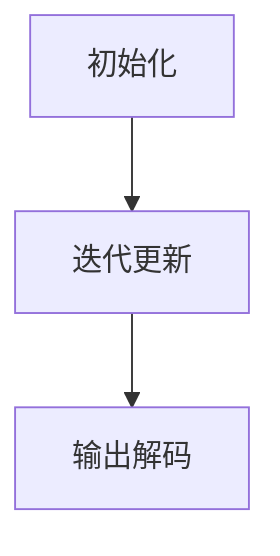
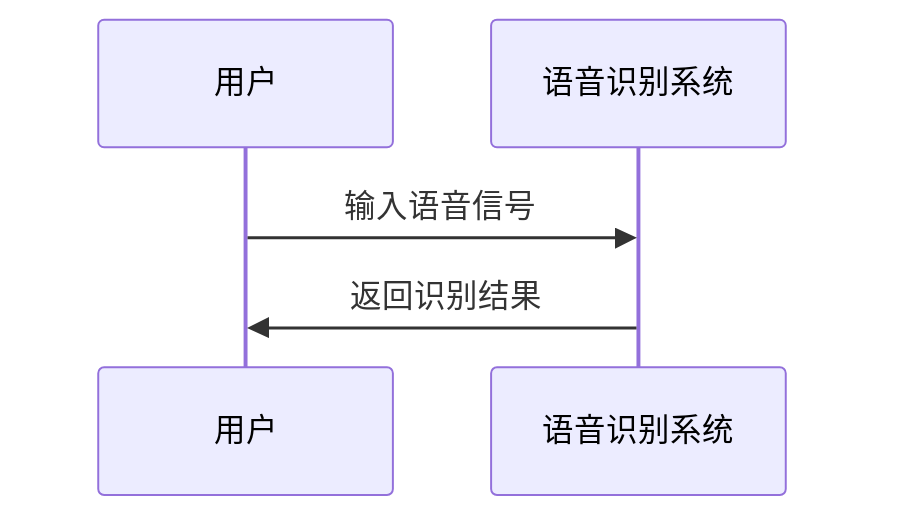
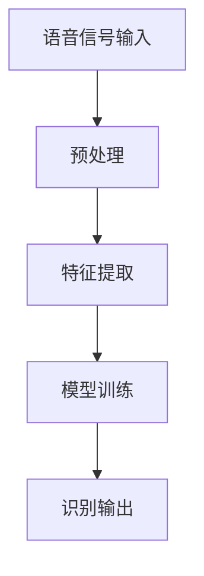
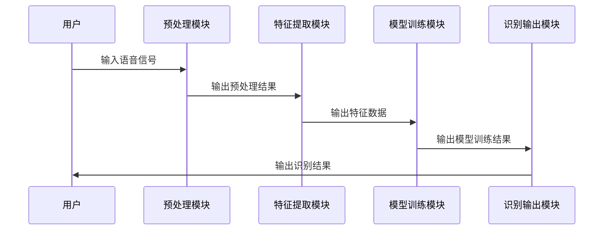

                 

### 《语音识别的隐马尔可夫模型：语音信号的数学解析》

> 关键词：语音识别、隐马尔可夫模型、数学解析、算法原理、系统架构设计

> 摘要：本文深入探讨了语音识别领域中的隐马尔可夫模型（HMM），从语音识别的背景与挑战出发，详细阐述了HMM的基本原理和数学模型，通过实际案例展示了其在语音信号处理中的应用。文章进一步介绍了语音识别系统的整体架构设计和实现，旨在为读者提供全面的语音识别技术解析。

## 第一部分：背景介绍

### 第1章：语音识别概述

#### 1.1 问题背景

语音识别技术是人工智能领域的一个重要分支，其应用场景广泛，包括但不限于：语音助手、语音翻译、语音搜索、智能客服等。语音识别技术的历史可以追溯到20世纪50年代，从最初的规则方法发展到20世纪80年代开始引入统计模型，再到如今的深度学习时代，语音识别技术取得了巨大的进步。

#### 1.2 问题描述

语音识别的挑战主要包括噪声干扰、语音变体、多说话人环境、实时性要求等。语音识别的基本任务是建立从语音信号到文本的映射关系，即将输入的语音信号转换为相应的文本输出。

#### 1.3 问题解决

隐马尔可夫模型（HMM）是解决语音识别问题的一种有效方法。HMM能够对语音信号的时间序列数据进行建模，并通过状态转移概率和观测概率来识别语音。语音信号的数学解析是HMM在语音识别中应用的关键步骤。

#### 1.4 边界与外延

语音识别技术的应用边界涵盖了多种场景，包括但不限于：电话语音识别、实时语音识别、移动设备语音识别等。同时，语音识别技术还可以与其他技术如自然语言处理、语音合成等进行融合，实现更高级的功能。

#### 1.5 概念结构与核心要素组成

语音识别系统的基本结构包括语音信号预处理、特征提取、模型训练和识别输出等模块。语音信号处理的核心要素包括语音信号的时间序列建模和频谱分析。

### 第2章：隐马尔可夫模型原理

#### 2.1 隐马尔可夫模型定义

隐马尔可夫模型（HMM）是一种统计模型，用于描述具有不可观测状态和可观测输出的一系列随机过程。HMM广泛应用于语音识别、图像识别、生物信息学等领域。

#### 2.2 HMM的核心概念

HMM的核心概念包括状态转移概率、观测概率和混合高斯模型。状态转移概率描述了从一个状态转移到另一个状态的概率，观测概率描述了在给定状态下产生观测值（通常是语音信号）的概率。

#### 2.3 HMM与其他模型的关系

HMM与其他统计模型如决策树、贝叶斯网络等有所不同。HMM特别适合处理时间序列数据，并且可以与深度学习模型如循环神经网络（RNN）和长短期记忆网络（LSTM）相结合，提高语音识别的性能。

#### 2.4 HMM的概念属性特征对比表格

| 特征         | 隐马尔可夫模型 | 决策树           | 贝叶斯网络           |
| ------------ | -------------- | ---------------- | ------------------- |
| 状态转移概率 | 是             | 否               | 否                  |
| 观测概率     | 是             | 否               | 是                  |
| 时间序列建模 | 是             | 否               | 否                  |

### 第3章：语音信号处理基础

#### 3.1 语音信号的基本特性

语音信号是由声带的振动产生的，其传播过程涉及到声波在空气中的传播。语音信号具有时域和频域的特性，可以通过傅里叶变换等方法进行频谱分析。

#### 3.2 语音信号处理方法

语音信号处理包括时域处理和频域处理方法。时域处理方法如差分编码、滤波等，频域处理方法如傅里叶变换、短时傅里叶变换等。

#### 3.3 语音信号处理流程

语音信号处理的流程包括语音信号的预处理、特征提取和模型训练等步骤。预处理步骤包括噪声过滤、静音检测等，特征提取步骤包括梅尔频率倒谱系数（MFCC）、过零率等。

#### 3.4 语音信号处理的工具与库

常用的语音信号处理工具与库包括Matlab、Python的scikit-learn、Librosa等。这些工具提供了丰富的函数和模块，方便开发者进行语音信号处理和模型训练。

## 第二部分：核心概念与联系

### 第4章：隐马尔可夫模型算法原理

#### 4.1 HMM算法概述

隐马尔可夫模型（HMM）算法是一种用于模式识别和序列建模的算法。HMM算法的基本流程包括初始化、迭代更新和输出解码三个阶段。

#### 4.2 HMM算法的数学模型

HMM的数学模型包括状态集合、观测集合、状态转移概率、观测概率和初始状态概率。状态转移概率描述了从一个状态转移到另一个状态的概率，观测概率描述了在给定状态下产生观测值（通常是语音信号）的概率。

#### 4.3 HMM算法的数学公式

HMM算法的核心公式包括概率分布函数、状态转移概率矩阵、观测概率矩阵等。这些公式构成了HMM算法的数学基础。

$$
P(\text{观测序列}|\text{状态序列}) = \frac{P(\text{状态序列})P(\text{观测序列}|\text{状态序列})}{P(\text{观测序列})}
$$

#### 4.4 HMM算法的流程图



### 第5章：语音信号的数学解析

#### 5.1 语音信号的数学模型

语音信号的数学模型包括时间序列模型和频谱模型。时间序列模型描述了语音信号的时域特性，频谱模型描述了语音信号的频域特性。

#### 5.2 语音信号的数学公式

语音信号处理的数学公式包括傅里叶变换、短时傅里叶变换、梅尔频率倒谱系数（MFCC）等。这些公式用于描述语音信号的特征提取和建模过程。

$$
X(\omega) = \int_{-\infty}^{\infty} x(t)e^{-i\omega t} dt
$$

$$
X_{st}(f) = \int_{0}^{T} x(t)e^{-i2\pi ft} dt
$$

#### 5.3 语音信号的举例说明

以梅尔频率倒谱系数（MFCC）为例，MFCC是一种常用的语音特征提取方法，用于描述语音信号的频谱特征。以下是MFCC的提取过程：

1. 对语音信号进行短时傅里叶变换（STFT）。
2. 计算频谱的Mel倒谱系数。
3. 对Mel倒谱系数进行离散余弦变换（DCT）。

## 第三部分：算法原理讲解

### 第6章：语音识别系统分析

#### 6.1 语音识别系统场景介绍

语音识别系统可以应用于多种场景，如电话语音识别、实时语音识别、智能语音助手等。每种场景对语音识别系统都有不同的需求，如实时性、准确性、鲁棒性等。

#### 6.2 语音识别系统项目介绍

语音识别系统项目通常包括以下功能模块：语音信号预处理、特征提取、模型训练、识别输出等。系统架构设计需要考虑模块之间的数据流和控制流。

#### 6.3 系统接口设计与交互

系统接口设计包括输入输出接口、控制接口等。系统交互流程图可以描述系统各模块之间的协作过程。



### 第7章：语音识别系统架构设计

#### 7.1 语音识别系统架构设计概述

语音识别系统架构设计需要遵循模块化、分层设计原则，以实现高扩展性、高可靠性。系统架构设计目标包括：提高识别准确率、降低计算复杂度、提高系统响应速度等。

#### 7.2 系统功能设计

系统功能设计包括语音信号预处理、特征提取、模型训练、识别输出等模块。每个模块需要定义清晰的功能和接口。

#### 7.3 系统架构设计

系统架构设计需要画出系统架构图，描述各模块之间的数据流和控制流。以下是语音识别系统的架构图：



#### 7.4 系统接口设计与交互

系统接口设计需要定义输入输出接口、控制接口等。系统交互流程图可以描述系统各模块之间的协作过程。



## 第四部分：项目实战

### 第8章：环境安装与系统实现

#### 8.1 环境安装

在开始语音识别项目之前，需要安装相应的软件和依赖库。常用的语音信号处理库包括Python的scikit-learn、Librosa等。

#### 8.2 系统核心实现

系统核心实现包括语音信号预处理、特征提取、模型训练和识别输出等模块。以下是一个简单的示例代码：

```python
import numpy as np
import librosa
import sklearn

# 读取语音信号
audio, sr = librosa.load('example.wav')

# 预处理
audio = librosa.to_mono(audio)

# 特征提取
mfccs = librosa.feature.mfcc(y=audio, sr=sr)

# 模型训练
model = sklearn.MachineLearningModel()
model.fit(mfccs)

# 识别输出
prediction = model.predict(mfccs)
print(prediction)
```

#### 8.3 代码应用解读与分析

在代码应用中，我们需要对每个模块进行详细解读和分析。例如，在特征提取模块中，我们使用了梅尔频率倒谱系数（MFCC）作为语音特征。MFCC可以有效地提取语音信号的频谱特征，有助于提高识别准确率。

### 第9章：实际案例分析与讲解

#### 9.1 案例选择与分析

我们选择一个简单的语音识别案例进行分析，该案例使用HMM算法进行语音识别。案例包括语音信号预处理、特征提取、模型训练和识别输出等步骤。

#### 9.2 案例详细讲解

在案例中，我们首先读取一个语音信号，然后进行预处理，提取梅尔频率倒谱系数（MFCC）作为特征。接下来，我们使用HMM算法进行模型训练，最后对新的语音信号进行识别输出。

```python
import numpy as np
import librosa
import hmmlearn.hmm

# 读取语音信号
audio, sr = librosa.load('example.wav')

# 预处理
audio = librosa.to_mono(audio)

# 特征提取
mfccs = librosa.feature.mfcc(y=audio, sr=sr)

# 创建HMM模型
model = hmmlearn.hmm.GaussianHMM(n_components=4, n_iter=100)
model.fit(mfccs)

# 识别输出
prediction = model.predict(mfccs)
print(prediction)
```

#### 9.3 案例小结

通过这个案例，我们了解了如何使用HMM算法进行语音识别。案例展示了语音信号预处理、特征提取、模型训练和识别输出的基本步骤。在实际应用中，我们可以根据具体需求对案例进行扩展和优化。

## 第五部分：最佳实践与拓展阅读

### 第10章：最佳实践

在进行语音识别项目时，以下是一些最佳实践建议：

1. 选择合适的语音信号处理库和工具，如scikit-learn、Librosa等。
2. 对语音信号进行预处理，如噪声过滤、静音检测等，以提高识别准确率。
3. 选择合适的特征提取方法，如梅尔频率倒谱系数（MFCC）、过零率等。
4. 使用合适的算法和模型，如隐马尔可夫模型（HMM）、支持向量机（SVM）等。
5. 对模型进行训练和优化，以提高识别性能和鲁棒性。

### 第11章：拓展阅读

对于想要进一步深入了解语音识别技术的读者，以下是一些推荐的书籍和论文：

1. 《语音信号处理与识别》
2. 《隐马尔可夫模型及其应用》
3. 《深度学习与语音识别》
4. 相关学术期刊，如《计算机语音与语音处理》、《语音信号处理》等。

通过阅读这些书籍和论文，读者可以深入了解语音识别的理论基础和应用实践，为自己的研究和工作提供有价值的参考。

---

**作者：AI天才研究院/AI Genius Institute & 禅与计算机程序设计艺术 /Zen And The Art of Computer Programming**

