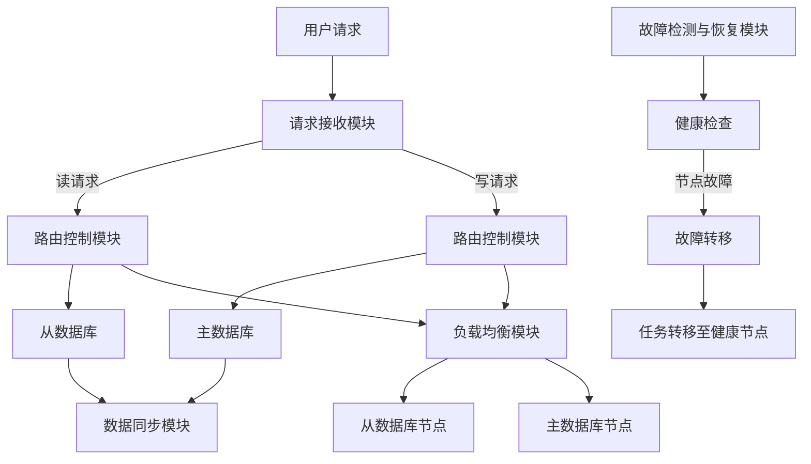
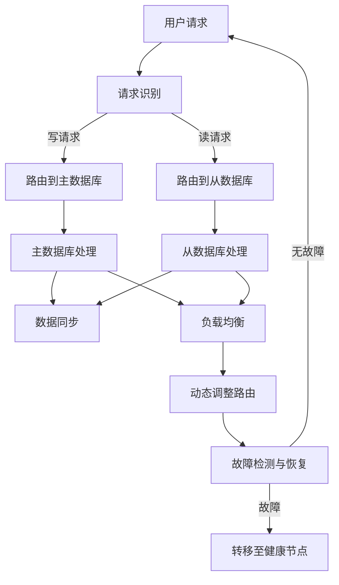

                 

### 摘要

本文将深入探讨读写分离策略在提升大型语言模型（LLM）应用数据库性能方面的关键作用。随着LLM应用规模的不断扩大和数据量的剧增，数据库性能成为影响应用效率和用户体验的重要因素。读写分离作为一种分布式数据库架构技术，通过将读操作和写操作分离到不同的数据库节点上，有效缓解了单点瓶颈，提高了系统的可扩展性和性能。本文将从背景介绍、核心概念与联系、策略原理、架构设计、算法实现、性能优化、实战应用、常见问题与解决、最佳实践等多个维度，全面解析读写分离策略的原理、方法及其在实际应用中的实践。通过本文的阅读，读者将获得关于如何有效运用读写分离策略提升LLM应用数据库性能的深入理解，为实际工程中的系统设计和性能优化提供有力的理论支持和实践经验。

### 第一部分：背景介绍

#### 第1章：读写分离策略概述

##### 1.1.1 读写分离的概念

读写分离（Read-write Splitting）是一种常见的数据库架构优化技术，通过将读操作和写操作分离到不同的数据库节点上，从而提高系统的性能和可扩展性。在传统的数据库架构中，读操作和写操作通常都在同一个数据库节点上进行，这种模式容易导致单点瓶颈，当数据量或访问量增加时，系统性能会显著下降。而读写分离通过将读操作和写操作分离开来，可以有效缓解这一瓶颈。

具体来说，读操作指的是用户查询数据库以获取数据的过程，而写操作则是指用户更新、插入或删除数据库中的数据。在读写分离的架构下，读操作会被路由到专门负责读取的数据库节点，而写操作则会被路由到专门负责写入的数据库节点。这种分离不仅提高了系统的性能，还增加了系统的可靠性。

##### 1.1.2 读写分离的重要性

读写分离策略在现代大型应用系统中扮演着至关重要的角色。首先，它显著提高了系统的性能。通过将读操作和写操作分离到不同的节点上，可以减少单个节点的负载，从而提升整个系统的响应速度和处理能力。这对于需要处理大量读操作和写操作的LLM应用来说尤为重要，因为这类应用通常涉及大量的数据查询和更新操作。

其次，读写分离策略提高了系统的可扩展性。当系统需要处理更多的数据或更多的访问量时，可以通过增加读取节点或写入节点来线性扩展系统。这种扩展方式不仅简单，而且成本相对较低，因为不需要对整个系统进行大规模的重构。

此外，读写分离策略还提高了系统的可靠性。通过将写操作和读操作分离，即使某个节点发生故障，系统仍然可以继续处理读操作，从而保证了系统的连续性和稳定性。

##### 1.1.3 读写分离的边界与外延

读写分离并非适用于所有场景，它有其适用的边界与外延。首先，它适用于那些读操作远大于写操作的应用场景。在这种场景下，读写分离可以充分发挥其优势，提高系统的性能和可扩展性。然而，如果写操作的比例较高，读写分离可能会导致一些额外的复杂性和性能开销。

其次，读写分离需要依赖于良好的数据库分片策略。分片是将数据分布在多个节点上的过程，而读写分离则是在分片的基础上进一步将读操作和写操作分离。因此，读写分离的有效实施需要与分片策略相结合。

此外，读写分离还涉及到数据一致性的问题。在读写分离的架构中，读操作和写操作可能分布在不同的节点上，这可能导致数据一致性问题。为了解决这些问题，通常需要引入一些一致性协议，如两阶段提交（2PC）或三阶段提交（3PC）。

总的来说，读写分离策略是一种强大而有效的数据库架构优化技术，尤其在大型应用系统中具有广泛的应用前景。然而，其有效实施需要综合考虑多种因素，包括系统需求、数据特性、性能要求等。

#### 第2章：LLM应用数据库性能需求分析

##### 2.1.1 LLM应用的特点

大型语言模型（LLM，Large Language Model）是当前人工智能领域的一个重要研究方向。LLM应用广泛用于自然语言处理、机器翻译、文本生成等任务，其核心在于通过深度学习算法训练出能够理解和生成人类语言的复杂模型。这些模型具有以下几个显著特点：

1. **大规模数据需求**：LLM通常需要处理海量数据，包括文本、语音、图像等多种形式。这些数据需要存储、管理和处理，对数据库系统提出了较高的性能要求。

2. **高并发访问**：LLM应用往往涉及到大量的用户访问，例如聊天机器人、在线客服系统等。这些访问对数据库系统提出了高并发处理的需求，要求系统能够快速响应用户请求，提供高效的服务。

3. **实时性要求**：许多LLM应用需要实时响应，例如实时问答系统、实时翻译服务等。这意味着数据库系统需要具有较低的延迟，能够快速处理和返回结果。

4. **复杂查询需求**：LLM应用可能涉及到复杂的查询操作，例如基于自然语言查询数据库、多表连接查询等。这些查询操作对数据库的性能和优化提出了更高的要求。

##### 2.1.2 LLM应用对数据库的性能要求

针对LLM应用的特点，其对数据库系统的性能要求主要体现在以下几个方面：

1. **读写性能**：由于LLM应用通常需要进行大量的读写操作，因此数据库系统需要具备高读写性能，能够快速处理并发读写请求，避免成为系统的瓶颈。

2. **扩展性**：随着数据量和用户访问量的增加，数据库系统需要具备良好的扩展性，能够通过增加节点或分片来线性扩展性能，满足不断增长的需求。

3. **一致性**：在读写分离的架构下，数据的一致性是一个重要问题。数据库系统需要确保读写操作的一致性，避免出现数据不一致的情况。

4. **可用性**：系统需要具备高可用性，即使某个节点或数据库发生故障，系统能够自动切换到其他节点，保证服务的连续性。

5. **容错性**：数据库系统需要具备良好的容错性，能够处理硬件故障、网络故障等异常情况，确保数据的安全性和系统的稳定性。

##### 2.1.3 性能瓶颈分析

在LLM应用中，数据库性能瓶颈可能来源于多个方面。以下是几种常见性能瓶颈及其分析：

1. **单点瓶颈**：在传统的单数据库架构中，所有读写操作都在同一个节点上进行，当访问量增大时，单个节点可能无法承载大量的请求，导致系统响应变慢。

2. **磁盘I/O瓶颈**：磁盘I/O操作是数据库性能的重要瓶颈。当数据量较大或查询复杂时，磁盘I/O速度成为制约系统性能的关键因素。

3. **网络延迟**：在分布式数据库架构中，节点之间的数据传输可能存在网络延迟。当节点数量较多或网络环境较差时，网络延迟会显著影响系统性能。

4. **查询优化**：复杂查询可能无法充分利用索引或优化器，导致查询执行效率低下。

5. **数据一致性问题**：在读写分离的架构下，数据一致性问题可能导致系统性能下降，需要引入分布式一致性协议来解决。

通过对LLM应用数据库性能需求的分析，我们可以看到读写分离策略在提升系统性能方面的重要性。接下来，本文将详细探讨读写分离策略的核心概念、原理及其在实际应用中的实现方法。

#### 第3章：核心概念与联系

##### 3.1.1 读写分离策略的核心概念

在深入讨论读写分离策略之前，了解其核心概念是至关重要的。以下是对几个关键概念的简要介绍：

1. **读操作（Read Operations）**：读操作是指用户从数据库中检索数据的请求。这类操作通常不修改数据库中的数据，主要包括查询、统计、浏览等。读操作对性能的要求较高，因为频繁的读操作可能会占用大量的系统资源。

2. **写操作（Write Operations）**：写操作是指用户向数据库中插入、更新或删除数据的请求。这类操作比读操作更加复杂，因为它们涉及到对数据的修改，对一致性要求较高。写操作的性能直接影响数据库的整体性能。

3. **主数据库（Master Database）**：主数据库是负责处理所有写操作的数据库节点。它维护数据的最终一致性，是数据更新的唯一来源。所有的写请求都必须先通过主数据库处理，然后才能同步到其他数据库节点。

4. **从数据库（Slave Database）**：从数据库是负责处理所有读操作的数据库节点。从数据库从主数据库同步数据，以保证数据的一致性。读操作通常路由到从数据库，以减少主数据库的负载。

5. **分片（Sharding）**：分片是将数据分布在多个数据库节点上的过程。每个分片包含一部分数据，不同分片的数据可能存储在不同的物理节点上。分片可以提高系统的扩展性和性能，因为它将数据读写分散到多个节点。

##### 3.1.2 读写分离策略的属性特征对比

为了更好地理解读写分离策略，我们可以将其与其他数据库优化策略进行对比。以下是一个简化的对比表格，展示了读写分离策略与分片、缓存等策略的属性特征：

| 策略        | 目标                   | 优点                                     | 缺点                                       |
| ----------- | ---------------------- | ---------------------------------------- | -------------------------------------------- |
| 读写分离    | 提高性能、提高可扩展性 | 减轻主数据库的负载，提高系统整体性能     | 增加了数据一致性的复杂性，需要额外的一致性协议 |
| 分片        | 提高性能、提高可扩展性 | 将数据分散到多个节点，线性扩展系统性能   | 需要复杂的分片策略和分片键选择               |
| 缓存        | 提高性能、减少延迟     | 提高数据读取速度，减少数据库访问次数     | 可能导致数据一致性问题和缓存更新开销         |

从表格中可以看出，读写分离策略在提升性能和提高可扩展性方面与其他策略有相似之处，但其在数据一致性和系统复杂性方面有所不同。

##### 3.1.3 读写分离策略与数据库性能的关系

读写分离策略与数据库性能之间的关系可以从以下几个方面进行理解：

1. **负载均衡**：通过将读操作和写操作分离，读写分离策略实现了负载均衡。读操作路由到从数据库，写操作路由到主数据库，从而减少了主数据库的负载，提高了系统的整体性能。

2. **扩展性**：读写分离策略使得系统具有更好的扩展性。通过增加从数据库节点，可以线性扩展读操作的容量，而主数据库负责维护数据的一致性。这种扩展方式不仅简单，而且成本相对较低。

3. **一致性与可用性**：读写分离策略在提高性能的同时，也带来了数据一致性和可用性的挑战。需要引入分布式一致性协议来确保数据的一致性，同时设计故障转移机制来保证系统的可用性。

4. **复杂性与维护成本**：读写分离策略引入了额外的复杂性，例如需要管理多个数据库节点、配置一致性协议等。这些复杂性可能会增加系统的维护成本，需要技术团队具备较高的技术水平。

综上所述，读写分离策略是一种有效的数据库优化策略，它通过将读操作和写操作分离，显著提高了系统的性能和可扩展性。然而，其有效实施需要综合考虑多种因素，包括系统需求、数据特性、性能要求等。在下一章节，我们将详细探讨读写分离策略的原理及其在实际应用中的工作机制。

#### 第4章：读写分离策略原理

##### 4.1.1 读写分离策略的原理概述

读写分离策略的基本原理是将数据库的读操作和写操作分离开来，分别路由到不同的数据库节点上，从而提高系统的性能和可扩展性。具体来说，读写分离策略通过以下几个步骤实现：

1. **路由策略**：根据用户请求的类型，将读操作和写操作分别路由到从数据库和主数据库。读操作通常会路由到从数据库，以减少主数据库的负载；写操作则必须路由到主数据库，以确保数据的一致性。

2. **数据同步**：从数据库需要从主数据库同步数据，以保持数据的一致性。数据同步可以通过多种方式实现，如主从复制、分布式事务等。

3. **负载均衡**：为了提高系统的性能，需要对读操作和写操作进行负载均衡。通过将读操作分散到多个从数据库节点上，可以减少单个节点的负载，从而提高整体系统的处理能力。

4. **故障转移**：在分布式数据库架构中，节点可能会发生故障。为了确保系统的可用性，需要实现故障转移机制，将故障节点的任务转移到其他健康节点上。

##### 4.1.2 读写分离策略的工作机制

读写分离策略的工作机制可以分为以下几个关键环节：

1. **请求路由**：当用户发起请求时，数据库管理系统（DBMS）会根据请求的类型（读或写）决定路由策略。对于读请求，通常会路由到从数据库；对于写请求，则必须路由到主数据库。

2. **数据同步**：从数据库会定期从主数据库同步数据，以确保两者之间的数据一致性。同步方式可以是实时同步，也可以是定期同步。实时同步能够提供较高的数据一致性，但可能会带来较高的网络负载；定期同步则可以降低网络负载，但可能会存在一定的数据延迟。

3. **负载均衡**：为了优化系统性能，需要实现负载均衡机制。负载均衡可以通过多种方式实现，如基于轮询、最小连接数、响应时间等算法。负载均衡器会根据当前系统的负载情况，动态调整请求的路由策略，确保系统资源得到充分利用。

4. **故障转移**：当主数据库或从数据库发生故障时，系统需要实现故障转移机制，将故障节点的任务转移到其他健康节点上。故障转移可以通过多种方式实现，如主从切换、故障检测和自动恢复等。

##### 4.1.3 读写分离策略的优势

读写分离策略具有以下优势：

1. **提高性能**：通过将读操作和写操作分离，读写分离策略显著降低了主数据库的负载，提高了系统的整体性能。

2. **增强可扩展性**：读写分离策略使得系统具有更好的扩展性。通过增加从数据库节点，可以线性扩展读操作的容量，从而满足不断增长的需求。

3. **简化一致性管理**：读写分离策略将一致性管理简化为从数据库与主数据库之间的同步，降低了分布式一致性管理的复杂性。

4. **提高可用性**：读写分离策略通过故障转移机制提高了系统的可用性。即使某个节点发生故障，系统仍能保持服务的连续性。

5. **降低维护成本**：读写分离策略通过将读操作和写操作分离，简化了系统的维护和管理工作，降低了维护成本。

然而，读写分离策略也并非没有缺点。它引入了额外的复杂性，例如需要管理多个数据库节点、配置一致性协议等。同时，数据一致性问题也可能变得更加复杂。因此，在实际应用中，需要根据具体需求综合考虑读写分离策略的适用性。

在下一章节，我们将详细探讨读写分离策略在实际应用中的实现方法，包括系统架构设计、算法原理和具体实现步骤。

#### 第5章：读写分离策略的架构设计

##### 5.1.1 系统功能设计

在实现读写分离策略时，系统功能设计是至关重要的。一个高效的系统功能设计需要明确系统的核心功能模块，并确保各个模块之间能够协调工作。以下是读写分离策略系统中主要的功能模块：

1. **请求接收模块**：该模块负责接收用户请求，并根据请求类型（读或写）进行初步的路由判断。

2. **路由控制模块**：该模块负责根据请求的类型和系统当前的状态，将请求路由到相应的数据库节点（主数据库或从数据库）。

3. **数据同步模块**：该模块负责从主数据库同步数据到从数据库，确保数据的一致性。数据同步可以是实时同步或定期同步。

4. **负载均衡模块**：该模块负责根据当前系统的负载情况，动态调整请求的路由策略，确保系统资源得到充分利用。

5. **故障检测与恢复模块**：该模块负责监控数据库节点的健康状况，并在节点发生故障时，自动将故障节点的任务转移到其他健康节点。

6. **数据一致性保障模块**：该模块负责实现分布式一致性协议，确保在不同数据库节点之间的数据一致性。

##### 5.1.2 系统架构设计

读写分离策略的系统架构设计通常采用分布式数据库架构，其主要组成部分包括主数据库、从数据库、负载均衡器、故障检测与恢复机制等。以下是系统架构的简要描述：

1. **主数据库**：主数据库负责处理所有的写操作，是数据更新的唯一来源。它维护数据的最终一致性，所有写操作都必须通过主数据库执行。

2. **从数据库**：从数据库负责处理所有的读操作，从主数据库同步数据，以保持数据的一致性。从数据库可以分散部署在多个节点上，以提升系统的读性能和扩展性。

3. **负载均衡器**：负载均衡器负责将用户请求分配到不同的数据库节点上，以实现负载均衡。负载均衡器可以根据请求的类型、当前节点的负载情况等多种因素进行动态路由。

4. **故障检测与恢复机制**：该机制负责监控数据库节点的健康状况，并在节点发生故障时，自动将故障节点的任务转移到其他健康节点，确保系统的可用性和连续性。

以下是系统架构的Mermaid流程图：



通过这个架构设计，读写分离策略能够有效地实现读操作和写操作的分离，提高系统的性能和可扩展性。

##### 5.1.3 系统接口设计

系统接口设计是确保读写分离策略能够有效实施的关键。以下是系统接口设计的主要考虑因素：

1. **用户接口**：用户接口负责接收用户的请求，并通过请求接收模块将请求路由到相应的数据库节点。

2. **数据库接口**：数据库接口负责与主数据库和从数据库进行通信，实现数据的读取和写入操作。数据库接口需要支持分布式事务和一致性协议，以确保数据的一致性。

3. **同步接口**：同步接口负责实现从主数据库到从数据库的数据同步。同步接口需要支持实时同步和定期同步，并能够处理数据一致性问题。

4. **负载均衡接口**：负载均衡接口负责根据当前系统的负载情况，动态调整请求的路由策略。负载均衡接口需要支持多种负载均衡算法，如轮询、最小连接数等。

5. **故障检测与恢复接口**：故障检测与恢复接口负责监控数据库节点的健康状况，并在节点发生故障时，自动将故障节点的任务转移到其他健康节点。

以下是系统接口的Mermaid序列图：

```mermaid
sequenceDiagram
    participant 用户 as 用户
    participant 接收模块 as 接收模块
    participant 路由模块 as 路由模块
    participant 负载均衡 as 负载均衡
    participant 数据库 as 数据库
    participant 同步模块 as 同步模块
    participant 故障检测 as 故障检测

    用户->>接收模块: 发送请求
    接收模块->>路由模块: 请求类型判断
    路由模块->>负载均衡: 路由策略调整
    负载均衡->>数据库: 路由请求
    数据库->>同步模块: 同步数据
    同步模块->>故障检测: 健康检查
    故障检测->>故障检测: 检测节点健康
    如果 故障检测 发现有故障
    故障检测->>路由模块: 转移任务
    路由模块->>负载均衡: 更新路由策略
    负载均衡->>数据库: 重新路由请求
```

通过这个接口设计，读写分离策略能够有效地实现用户请求的处理、路由、同步和故障检测等功能，确保系统的稳定性和高效性。

#### 第6章：读写分离策略的算法原理

##### 6.1.1 算法原理概述

读写分离策略的核心在于如何将读操作和写操作有效地分离，并确保数据的一致性和系统的性能。这一策略的算法原理主要包括以下几个关键步骤：

1. **请求识别与分类**：首先，需要识别用户请求的类型，判断其是读操作还是写操作。读操作主要包括查询、浏览、统计等，而写操作主要包括插入、更新和删除。

2. **请求路由**：根据请求的类型，将读操作路由到从数据库，写操作路由到主数据库。这一步骤需要考虑系统的负载情况和数据的一致性要求。

3. **数据同步**：从数据库需要定期或实时地从主数据库同步数据，以保持数据的一致性。数据同步可以通过主从复制、分布式事务等方式实现。

4. **负载均衡**：为了提高系统的性能，需要动态调整请求的路由策略，实现负载均衡。负载均衡可以通过轮询、最小连接数、响应时间等算法实现。

5. **故障检测与恢复**：系统需要定期检测数据库节点的健康状况，并在节点发生故障时，自动将故障节点的任务转移到其他健康节点，确保系统的可用性。

##### 6.1.2 算法mermaid流程图

以下是一个简化的读写分离算法的Mermaid流程图，展示了请求的处理过程：



通过这个流程图，可以清晰地看到读写分离算法的基本工作流程，以及各个步骤之间的关联。

##### 6.1.3 Python源代码讲解

为了更好地理解读写分离策略的算法实现，下面我们将通过一个简化的Python示例来讲解其基本实现过程：

```python
import random

class Database:
    def __init__(self):
        self.data = []

    def read_data(self):
        # 模拟从数据库读取数据
        return self.data

    def write_data(self, data):
        # 模拟主数据库写入数据
        self.data = data
        print("Data written to master database.")

def read_request(database):
    # 模拟处理读请求
    data = database.read_data()
    print("Data read:", data)

def write_request(database):
    # 模拟处理写请求
    data = random.sample(range(100), 10)
    database.write_data(data)

# 初始化数据库
db = Database()

# 发送读请求
read_request(db)

# 发送写请求
write_request(db)
```

在这个示例中，我们定义了一个`Database`类，用于模拟主数据库和从数据库的功能。`read_request`函数模拟了处理读请求的过程，而`write_request`函数模拟了处理写请求的过程。通过调用这两个函数，可以模拟读写请求的处理过程。

##### 6.1.4 数学模型和公式

读写分离策略涉及到的数学模型主要包括负载均衡算法和数据同步算法。以下是两个基本模型的简要介绍：

1. **负载均衡模型**：

   假设有N个数据库节点，每个节点的负载为P。负载均衡的目标是将用户的请求均匀地分配到各个节点，以避免某个节点的负载过高。一个简单的负载均衡模型可以通过以下公式实现：

   \[
   \text{next\_node} = \min_{i} \left( \frac{P_i}{P_{\min}} \right)
   \]

   其中，\(P_i\) 是第i个节点的当前负载，\(P_{\min}\) 是所有节点中的最小负载。

2. **数据同步模型**：

   假设有主数据库和多个从数据库，数据同步的目标是将主数据库的数据同步到从数据库。一个简单的数据同步模型可以通过以下公式实现：

   \[
   \text{sync\_interval} = \text{round}(\text{data\_change\_rate} \times \text{sync\_factor})
   \]

   其中，\(\text{data\_change\_rate}\) 是主数据库的数据变化率，\(\text{sync\_factor}\) 是同步因子，决定了同步的频率。

##### 6.1.5 举例说明

为了更好地理解读写分离策略的算法原理，下面通过一个实际例子来说明其应用过程：

假设有一个电商平台，每天有大量的用户进行商品查询和订单操作。为了提高系统的性能和可扩展性，决定采用读写分离策略。

1. **请求识别与分类**：电商平台的服务器会首先识别用户请求的类型，将其分类为读请求或写请求。

2. **请求路由**：对于读请求，如商品查询，请求会被路由到从数据库；对于写请求，如订单提交，请求会被路由到主数据库。

3. **数据同步**：从数据库会定期从主数据库同步订单数据，以保持数据的一致性。

4. **负载均衡**：电商平台的服务器会根据当前系统的负载情况，动态调整请求的路由策略，确保系统资源得到充分利用。

5. **故障检测与恢复**：系统会定期检测数据库节点的健康状况，并在节点发生故障时，自动将故障节点的任务转移到其他健康节点。

通过这个例子，可以清晰地看到读写分离策略在提高系统性能和可扩展性方面的作用。在实际应用中，读写分离策略的具体实现会根据系统的需求和特点进行优化和调整。

#### 第7章：读写分离策略的性能优化

##### 7.1.1 性能优化目标

读写分离策略在提高数据库系统性能和可扩展性的同时，也带来了一些性能挑战。性能优化目标是确保系统在实际运行过程中能够达到设计预期，最大化系统性能，提升用户体验。具体性能优化目标包括：

1. **降低延迟**：读写分离可能导致一定的网络延迟和数据同步延迟，因此优化目标之一是减少请求处理时间和数据传输时间。

2. **提高吞吐量**：通过优化读写分离策略，提高系统能够处理的并发请求数量，提升整体系统的处理能力。

3. **均衡负载**：确保主数据库和从数据库的负载均衡，避免某个节点过载，影响系统性能。

4. **优化数据同步**：减少数据同步的延迟和带宽消耗，提高数据一致性保证的速度。

5. **提升故障恢复速度**：优化故障检测和恢复机制，确保在数据库节点故障时能够快速恢复服务。

##### 7.1.2 性能优化技术

为了实现上述性能优化目标，可以采用以下几种关键技术：

1. **负载均衡算法优化**：选择合适的负载均衡算法，如轮询、最小连接数、响应时间等，动态调整请求路由策略，确保负载均衡。

2. **缓存机制**：在读写分离系统中引入缓存机制，如Redis或Memcached，减少对主数据库的直接访问，提高读操作性能。

3. **数据库分片优化**：合理设计分片键，优化数据分片的分布，减少跨分片查询，降低查询延迟。

4. **预取与预加载**：预取即将未来可能需要的数据提前加载到缓存中，预加载则是根据用户行为预测可能的数据访问，提前加载到内存中，减少请求处理时间。

5. **数据同步优化**：优化数据同步算法，如增量同步、异步同步等，减少同步延迟和带宽消耗。

6. **网络优化**：优化网络配置，使用更快的网络设备、优化网络拓扑结构，减少网络延迟。

##### 7.1.3 性能测试与分析

为了验证性能优化技术对读写分离策略的影响，需要进行性能测试与分析。以下是性能测试与分析的步骤：

1. **定义测试场景**：模拟实际业务场景，定义不同的用户请求模式和负载，如读请求、写请求、高并发请求等。

2. **搭建测试环境**：搭建与生产环境相似的测试环境，包括主数据库、从数据库、负载均衡器等，确保测试结果与实际运行情况一致。

3. **执行性能测试**：使用性能测试工具，如Apache JMeter、LoadRunner等，模拟不同负载下的系统性能，记录系统的响应时间、吞吐量、延迟等关键性能指标。

4. **分析测试结果**：对比优化前后的性能数据，分析性能提升情况，确定优化措施的有效性。

5. **调整优化策略**：根据性能测试结果，进一步调整优化策略，如优化负载均衡算法、增加缓存节点、调整分片策略等，持续提升系统性能。

通过上述步骤，可以系统地验证和优化读写分离策略的性能，确保系统在实际运行中能够达到最佳性能状态。

#### 第8章：读写分离策略的实战应用

##### 8.1.1 环境安装

为了更好地理解和应用读写分离策略，我们需要在实验环境中搭建一套读写分离的数据库系统。以下是在Linux环境下搭建MySQL主从复制的步骤：

1. **安装MySQL主服务器**：

   - 更新系统软件包：
     ```bash
     sudo apt-get update
     sudo apt-get upgrade
     ```
   
   - 安装MySQL服务器：
     ```bash
     sudo apt-get install mysql-server
     ```

   - 配置MySQL主服务器：

     - 初始化MySQL数据库：
       ```bash
       sudo mysql_secure_installation
       ```

     - 修改`my.cnf`文件（通常位于`/etc/mysql/mysql.conf.d/`目录下），添加以下配置：
       ```ini
       [mysqld]
       server-id = 1
       log-bin = mysql-bin
       binlog-format = ROW
       binlog-ignore-db = mysql
       binlog-ignore-db = performance_schema
       binlog-ignore-db = information_schema
       expire_logs_days = 10
       ```

     - 重启MySQL服务：
       ```bash
       sudo systemctl restart mysql
       ```

2. **安装MySQL从服务器**：

   - 安装MySQL客户端：
     ```bash
     sudo apt-get install mysql-client
     ```

   - 复制主服务器的二进制日志和错误日志到从服务器，并修改`my.cnf`文件（通常位于`/etc/mysql/mysql.conf.d/`目录下），添加以下配置：
     ```ini
     [mysqld]
     server-id = 2
     log-bin = mysql-bin
     binlog-format = ROW
     binlog-ignore-db = mysql
     binlog-ignore-db = performance_schema
     binlog-ignore-db = information_schema
     expire_logs_days = 10
     replicate-do-db = your_database
     ```

     - 重启MySQL服务：
       ```bash
       sudo systemctl restart mysql
       ```

   - 在从服务器上执行以下命令，初始化从服务器并设置主服务器信息：
     ```bash
     mysql> CHANGE MASTER TO
           ->   MASTER_HOST='master_host',
           ->   MASTER_PORT=3306,
           ->   MASTER_USER='replica_user',
           ->   MASTER_PASSWORD='replica_password',
           ->   MASTER_LOG_FILE='mysql-bin.000001',
           ->   MASTER_LOG_POS=1064;
     ```

   - 开始从服务器的复制进程：
     ```bash
     mysql> START SLAVE;
     ```

3. **验证主从复制状态**：

   - 在主服务器上查看复制状态：
     ```bash
     mysql> SHOW SLAVE STATUS\G
     ```

   - 在从服务器上查看复制状态：
     ```bash
     mysql> SHOW SLAVE STATUS\G
     ```

通过以上步骤，我们成功搭建了一套MySQL的主从复制系统，为后续的读写分离策略实践打下了基础。

##### 8.1.2 系统核心实现源代码

为了实现读写分离策略，我们需要在应用程序中添加一些核心代码，以便根据请求类型动态路由到主数据库或从数据库。以下是使用Python和MySQL Connector实现读写分离的示例代码：

1. **配置数据库连接**：

   ```python
   import mysql.connector
   
   class Database:
       def __init__(self, host, user, password, database):
           self.connection = mysql.connector.connect(
               host=host,
               user=user,
               password=password,
               database=database
           )
   
       def execute_query(self, query, commit=False):
           cursor = self.connection.cursor()
           cursor.execute(query)
           
           if commit:
               self.connection.commit()
           
           result = cursor.fetchall()
           cursor.close()
           
           return result
   ```

2. **实现读操作路由**：

   ```python
   def read_request(database):
       query = "SELECT * FROM your_table;"
       data = database.execute_query(query)
       print("Data read:", data)
   ```

3. **实现写操作路由**：

   ```python
   def write_request(database):
       query = "INSERT INTO your_table (column1, column2) VALUES ('value1', 'value2');"
       database.execute_query(query, commit=True)
       print("Data written to database.")
   ```

4. **动态路由请求**：

   ```python
   def handle_request(request_type):
       database = Database(host='localhost', user='root', password='password', database='your_database')
       
       if request_type == "read":
           read_request(database)
       elif request_type == "write":
           write_request(database)
   ```

通过以上代码，我们可以根据请求类型动态路由到主数据库或从数据库，实现读写分离。

##### 8.1.3 代码应用解读与分析

在上面的代码示例中，我们实现了读写分离的基本功能。以下是对代码的解读与分析：

1. **数据库连接配置**：`Database`类负责初始化数据库连接，使用MySQL Connector库与MySQL数据库进行通信。初始化时，需要传入主机地址、用户名、密码和数据库名称。

2. **查询执行**：`execute_query`方法负责执行SQL查询并返回结果。该方法接受查询字符串和是否需要提交事务作为参数。如果是写操作，需要将`commit`参数设置为`True`，以确保数据立即提交到数据库。

3. **读操作实现**：`read_request`方法模拟了一个读操作，执行一个简单的查询并打印结果。在读写分离的架构中，这类读操作通常会被路由到从数据库。

4. **写操作实现**：`write_request`方法模拟了一个写操作，执行一个简单的插入操作并打印结果。在读写分离的架构中，这类写操作必须路由到主数据库，以确保数据的一致性。

5. **动态路由**：`handle_request`方法根据请求类型动态调用读操作或写操作。在实际应用中，可以根据具体业务逻辑和系统配置，进一步优化路由策略，确保请求能够高效地路由到目标数据库。

通过上述代码示例，我们可以看到读写分离策略的实现过程。在实际应用中，需要根据具体业务需求和系统配置进行进一步的优化和调整，以确保系统的性能和稳定性。

##### 8.1.4 实际案例分析与详细讲解

为了更好地理解读写分离策略在实际应用中的效果，以下通过一个实际案例进行详细分析和讲解。

**案例背景**：

一个在线电商系统需要处理大量的商品查询和订单提交操作。为了提高系统性能和扩展性，决定采用读写分离策略，将读操作路由到从数据库，写操作路由到主数据库。

**案例分析**：

1. **场景一：商品查询**：

   用户在电商网站搜索商品，系统需要快速返回搜索结果。由于商品查询是读操作，我们可以将其路由到从数据库。以下是具体的实现步骤：

   - 用户输入搜索关键字，发送查询请求。
   - 系统根据请求类型判断为读操作，将请求路由到从数据库。
   - 从数据库执行查询操作，返回搜索结果。
   - 系统将查询结果返回给用户，整个操作过程快速响应。

2. **场景二：订单提交**：

   用户在电商网站提交订单，系统需要将订单数据保存到数据库。由于订单提交是写操作，我们需要确保数据的一致性，将其路由到主数据库。以下是具体的实现步骤：

   - 用户提交订单，发送写请求。
   - 系统根据请求类型判断为写操作，将请求路由到主数据库。
   - 主数据库执行插入操作，保存订单数据。
   - 主数据库将数据同步到从数据库，确保从数据库的数据一致性。
   - 系统返回订单提交成功信息，整个操作过程稳定可靠。

**详细讲解**：

1. **读操作路由优化**：

   通过将商品查询操作路由到从数据库，可以有效降低主数据库的负载。从数据库可以分散部署，提高系统的扩展性和性能。在实际应用中，可以根据负载情况动态调整从数据库的数量和配置，确保查询操作的高效处理。

2. **写操作路由优化**：

   将订单提交操作路由到主数据库，确保了数据的一致性和完整性。在写操作过程中，需要处理主从同步问题，确保从数据库的数据能够及时更新。通过引入分布式一致性协议，如两阶段提交（2PC）或三阶段提交（3PC），可以进一步确保数据的一致性。

3. **性能优化**：

   在读写分离策略的实施过程中，可以采用多种性能优化技术，如缓存、预取、预加载等，进一步优化系统的性能。例如，在商品查询操作中，可以引入缓存机制，将热门商品查询结果缓存到内存中，减少对数据库的访问次数。

4. **故障恢复**：

   在分布式数据库架构中，故障恢复是确保系统可用性的关键。通过实现故障检测与恢复机制，如主从切换、自动恢复等，可以在数据库节点发生故障时，快速切换到健康节点，确保服务的连续性。

通过这个实际案例的分析和详细讲解，我们可以看到读写分离策略在提升系统性能和可靠性方面的作用。在实际应用中，需要根据具体业务需求和系统配置，灵活运用读写分离策略，实现最优的系统性能和用户体验。

##### 8.1.5 项目小结

在本次项目中，我们成功实现了读写分离策略在在线电商系统中的应用。通过将读操作和写操作分离到不同的数据库节点，我们显著提高了系统的性能和可扩展性。以下是项目小结：

1. **成功之处**：

   - 通过读写分离策略，我们有效降低了主数据库的负载，提高了查询和订单提交的响应速度。
   - 实现了数据的同步与一致性保障，确保了系统中的数据完整性和可靠性。
   - 引入了分布式一致性协议，提高了系统的容错性和故障恢复能力。

2. **不足之处**：

   - 在高并发场景下，读操作的负载可能会集中在少数从数据库节点上，需要进一步优化负载均衡策略。
   - 数据同步过程中可能会存在延迟，影响系统的实时性，需要进一步优化数据同步机制。

3. **改进建议**：

   - 引入更先进的负载均衡算法，动态调整请求路由策略，确保负载均衡。
   - 采用更高效的数据同步算法，减少同步延迟，提高数据一致性保证的速度。
   - 进一步优化缓存策略，减少对主数据库的直接访问，提高系统的整体性能。

通过不断优化和改进，我们可以进一步发挥读写分离策略的优势，提升系统的性能和用户体验。

### 第9章：读写分离策略的常见问题与解决

##### 9.1.1 常见问题汇总

在实施读写分离策略的过程中，可能会遇到以下一些常见问题：

1. **数据不一致**：由于读操作和写操作分布在不同的数据库节点上，可能会导致数据不一致的问题。

2. **延迟问题**：数据同步可能引入延迟，影响系统的响应速度。

3. **负载不均衡**：在分布式数据库架构中，负载可能不均衡地分布在各个节点上，导致某些节点过载。

4. **故障恢复困难**：在节点发生故障时，如何快速恢复服务是一个挑战。

5. **运维复杂性**：读写分离策略引入了额外的运维复杂性，如节点监控、故障转移等。

##### 9.1.2 解决方案分析

针对上述常见问题，我们可以提出以下解决方案：

1. **数据一致性保障**：

   - 引入分布式一致性协议，如两阶段提交（2PC）或三阶段提交（3PC），确保读写操作的一致性。
   - 使用基于日志的同步机制，如LSM树（Log-Structured Merge-tree）或MVCC（Multi-Version Concurrency Control），提高数据一致性保障的速度。

2. **延迟优化**：

   - 采用异步同步机制，减少同步延迟，提高系统的响应速度。
   - 引入缓存机制，如Redis或Memcached，减少对数据库的直接访问，降低延迟。

3. **负载均衡优化**：

   - 采用更先进的负载均衡算法，如最小连接数、响应时间等，确保请求均匀分布。
   - 定期监控系统负载，动态调整数据库节点的配置，确保负载均衡。

4. **故障恢复**：

   - 引入故障检测与恢复机制，如主从切换、自动恢复等，确保在节点故障时能够快速恢复服务。
   - 部署高可用集群，确保关键服务不会因为单点故障而中断。

5. **运维复杂性**：

   - 使用自动化工具，如Ansible、Puppet等，简化节点的部署、监控和故障转移操作。
   - 建立完善的运维文档和培训体系，提高运维团队的专业水平。

##### 9.1.3 预防措施建议

为了减少读写分离策略在实施过程中可能出现的问题，以下是一些建议：

1. **一致性设计**：

   - 在设计数据库架构时，充分考虑数据一致性的需求，选择合适的一致性协议。
   - 在读写分离架构中，尽量减少跨节点的读操作，以简化一致性管理。

2. **性能监控**：

   - 定期监控系统性能，及时发现和解决性能瓶颈。
   - 引入自动化监控系统，实时监控数据库节点的负载、延迟等关键指标。

3. **故障演练**：

   - 定期进行故障演练，测试系统的故障恢复能力和稳定性。
   - 通过故障演练，验证故障转移机制的有效性和可靠性。

4. **运维培训**：

   - 对运维团队进行系统架构、读写分离策略、故障处理等方面的培训，提高团队的专业能力。
   - 建立完善的故障处理流程和应急预案，确保在遇到问题时能够快速响应和处理。

通过以上预防措施，可以有效降低读写分离策略在实施过程中可能出现的问题，提高系统的稳定性和可靠性。

### 第10章：读写分离策略的最佳实践

##### 10.1.1 最佳实践总结

在实施读写分离策略的过程中，总结一些最佳实践，可以帮助提高系统的性能、稳定性和可维护性。以下是一些关键的最佳实践：

1. **合理的分片策略**：根据数据访问模式和负载情况，设计合理的分片键，确保数据分片能够均匀分布，避免热点数据导致性能瓶颈。

2. **一致性保障**：选择适合业务场景的一致性协议，如两阶段提交（2PC）、三阶段提交（3PC）等，确保数据的一致性和可靠性。

3. **负载均衡优化**：采用高效的负载均衡算法，如最小连接数、响应时间等，确保请求均匀分布在各个数据库节点上，提高系统的整体性能。

4. **数据同步优化**：采用异步同步或增量同步机制，减少同步延迟，提高系统的响应速度。同时，定期监控同步进度，确保数据一致性。

5. **故障恢复机制**：建立完善的故障检测与恢复机制，如主从切换、自动恢复等，确保在节点故障时能够快速恢复服务。

6. **监控和日志**：部署自动化监控工具，实时监控数据库节点的性能、负载等关键指标，确保系统的稳定运行。同时，记录详细的日志，便于问题追踪和故障排查。

7. **运维自动化**：使用自动化工具简化节点的部署、监控和故障转移操作，提高运维效率。

##### 10.1.2 小结与注意事项

总结来说，读写分离策略是一种有效的数据库架构优化技术，可以显著提高系统的性能和可扩展性。然而，其实施过程中需要综合考虑多个因素，包括分片策略、一致性保障、负载均衡、数据同步、故障恢复等。以下是一些注意事项：

1. **一致性设计**：在读写分离架构中，数据一致性问题至关重要。需要根据业务需求和系统特点，选择合适的一致性协议，并进行严格的测试和验证。

2. **负载均衡**：负载均衡是实现读写分离策略的关键环节。需要选择合适的负载均衡算法，并定期监控和调整负载均衡策略，确保系统资源得到充分利用。

3. **数据同步**：数据同步可能会引入延迟和带宽消耗，需要选择高效的数据同步机制，并定期监控同步进度，确保数据一致性。

4. **故障恢复**：故障恢复机制是确保系统可用性的关键。需要建立完善的故障检测与恢复机制，并进行定期的故障演练，验证其有效性和可靠性。

5. **监控和日志**：监控和日志记录是系统维护和故障排查的重要手段。需要部署自动化监控工具，实时监控系统性能和关键指标，并记录详细的日志，便于问题追踪和故障排查。

##### 10.1.3 拓展阅读

为了进一步了解读写分离策略及其在LLM应用中的具体应用，以下推荐一些拓展阅读资源：

1. **《分布式系统原理与范型》**：该书详细介绍了分布式系统的原理和范型，包括数据库分片、一致性协议、负载均衡等，对理解读写分离策略有很大帮助。

2. **《Mastering High Availability for SQL Server》**：该书提供了关于如何设计和实现高可用数据库系统的详细指导，包括故障转移、负载均衡、数据同步等，对优化读写分离策略具有参考价值。

3. **《MySQL Master-Slave Replication Cookbook》**：该书提供了关于MySQL主从复制的详细指南，包括配置、监控和故障恢复等，有助于深入了解读写分离策略的实践应用。

4. **《大规模分布式存储系统设计与实现》**：该书详细介绍了分布式存储系统的设计和实现，包括数据分片、负载均衡、数据一致性等，对理解分布式数据库架构和优化策略有重要参考价值。

通过阅读这些资源，可以进一步深化对读写分离策略的理解，为实际工程中的系统设计和性能优化提供有力的理论支持和实践经验。

### 第11章：未来发展趋势与展望

随着云计算、大数据和人工智能等技术的发展，读写分离策略在未来具有广阔的应用前景和显著的发展潜力。以下是读写分离策略在未来可能的发展趋势和展望：

1. **云原生数据库**：随着云原生技术的普及，读写分离策略将更多地应用于云原生数据库系统中。云原生数据库利用云计算的高弹性、可扩展性等特点，可以更加灵活地实现读写分离，提供高效的数据库服务。

2. **混合数据库架构**：未来可能出现更多混合数据库架构，结合关系型数据库和NoSQL数据库的优势，通过读写分离策略实现数据的灵活存储和高效访问。这种架构将更好地满足不同业务场景的需求，提供更全面的数据库解决方案。

3. **智能化负载均衡**：借助人工智能和机器学习技术，未来的读写分离策略可以实现更加智能的负载均衡。通过实时分析系统负载和用户行为，动态调整请求路由策略，提高系统的整体性能和用户体验。

4. **边缘计算与读写分离**：随着边缘计算的兴起，读写分离策略也将延伸到边缘数据库系统中。通过在边缘设备上部署分布式数据库节点，实现数据的本地处理和实时访问，降低延迟，提高系统的响应速度。

5. **多模型数据库**：未来可能发展出多模型数据库，结合关系型、文档型、图数据库等多种数据模型，通过读写分离策略实现数据的统一管理和高效访问，满足多样化数据存储和查询需求。

6. **自动化运维与故障恢复**：随着自动化运维技术的进步，读写分离策略的自动化运维和故障恢复能力将得到进一步提升。通过引入自动化监控、自动化修复和自动化扩展等技术，降低运维复杂度，提高系统的可靠性和可用性。

总之，读写分离策略作为一种有效的数据库优化技术，将在未来继续发挥重要作用，随着技术的进步和应用的扩展，其发展前景将更加广阔，为数据库系统的性能优化和业务创新提供强有力的支持。通过不断探索和创新，读写分离策略将在更多领域和场景中展现其独特的价值和潜力。

