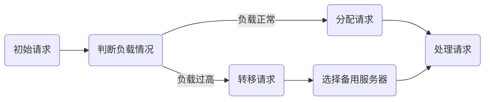
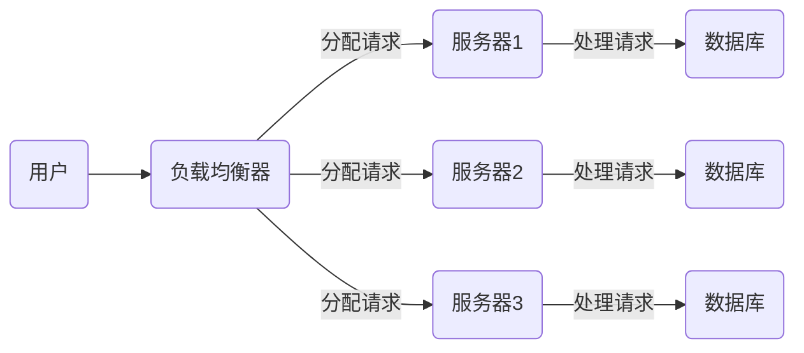
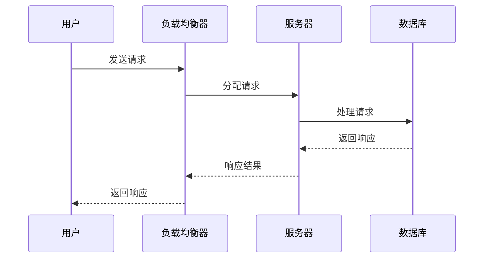

                 

### 《负载均衡技术在高并发LLM应用中的应用》

> 关键词：负载均衡，高并发，LLM应用，技术原理，架构设计

> 摘要：本文将深入探讨负载均衡技术在高并发LLM（大语言模型）应用中的重要性及其应用方法。我们将逐步分析负载均衡的核心概念、算法原理，并结合实际项目实战案例，详细讲解如何在高并发环境中有效利用负载均衡技术，提升LLM应用的性能和稳定性。

### 背景介绍

#### 1.1 问题背景

在当今数字化时代，人工智能的应用日益广泛，尤其是大语言模型（LLM）在自然语言处理、智能问答、文本生成等领域的应用。然而，随着用户需求的不断增加，LLM应用面临高并发访问的挑战。高并发环境下，若单一服务器处理请求，会导致服务器负载过重，响应速度变慢，甚至出现系统崩溃的情况。为了应对这一挑战，负载均衡技术应运而生。

#### 1.2 问题描述

负载均衡技术的基本概念是在多个服务器之间分配网络或应用负载，确保每个服务器都能承受适当的负载，从而提高系统的整体性能和可用性。在高并发LLM应用中，负载均衡的作用尤为重要。它通过合理分配请求，避免单一服务器过载，提高系统的响应速度和稳定性。

#### 1.3 问题解决

负载均衡技术通过以下几种方式解决高并发LLM应用中的问题：

1. **负载分配**：将请求分配到多个服务器上，避免单一服务器过载。
2. **故障转移**：当某台服务器出现故障时，自动将请求转移到其他服务器，保证系统的可用性。
3. **性能优化**：通过合理配置负载均衡策略，提高系统的整体性能。

#### 1.4 边界与外延

负载均衡技术的应用范围非常广泛，不仅限于高并发LLM应用，还可以应用于电子商务、在线教育、金融交易等多种场景。但需要注意的是，负载均衡技术并非万能，它也存在一定的限制，如配置复杂度、成本等。

#### 1.5 概念结构与核心要素组成

负载均衡技术由以下几个核心要素组成：

1. **负载均衡器**：负责分配请求的服务器或设备。
2. **后端服务器群**：接受请求并进行数据处理的服务器集群。
3. **负载均衡策略**：决定如何分配请求的策略，如轮询、最小连接数、源IP哈希等。

### 核心概念与联系

#### 2.1 负载均衡技术定义

负载均衡技术是一种将请求分配到多个服务器上的方法，以提高系统的性能和可用性。

#### 2.2 负载均衡技术特点

负载均衡技术具有以下几个特点：

1. **可扩展性**：通过增加后端服务器，可以轻松扩展系统处理能力。
2. **容错性**：当某台服务器出现故障时，负载均衡器可以自动将请求转移到其他服务器。
3. **高性能**：通过合理分配请求，避免单一服务器过载，提高系统响应速度。

#### 2.3 负载均衡与高并发LLM应用的关系

在高并发LLM应用中，负载均衡技术可以有效地解决服务器过载问题，提高系统的性能和稳定性。它通过以下几种方式与LLM应用相结合：

1. **请求分发**：将用户请求分配到不同的服务器上，避免单一服务器过载。
2. **缓存机制**：利用负载均衡器缓存热门数据，减少后端服务器的负载。
3. **动态调整**：根据服务器负载情况，动态调整请求分配策略，确保系统稳定运行。

#### 2.4 负载均衡技术与其他相关技术的联系

负载均衡技术与其他相关技术如缓存、数据库分片等存在一定的关联。例如，缓存技术可以减少后端服务器的负载，数据库分片可以将数据分布到多个数据库实例上，从而提高系统的性能。在实际应用中，这些技术可以相互配合，共同提升系统的性能和稳定性。

### 算法原理讲解

#### 3.1 负载均衡算法介绍

常见的负载均衡算法包括轮询算法、最小连接数算法、源IP哈希算法等。这些算法的核心思想是合理分配请求，避免单一服务器过载。

#### 3.2 负载均衡算法mermaid流程图



#### 3.3 Python源代码演示

```python
import random

def load_balancer(requests, servers):
    for request in requests:
        server = random.choice(servers)
        if server.is_load_high():
            server = find_alternative_server(servers)
        server.handle_request(request)

def find_alternative_server(servers):
    for server in servers:
        if not server.is_load_high():
            return server
    return None

class Server:
    def __init__(self, name):
        self.name = name
        self.load = 0

    def is_load_high(self):
        return self.load > 80

    def handle_request(self, request):
        self.load += 1
        print(f"{self.name}处理请求：{request}")
        self.load -= 1

# 测试代码
servers = [Server("服务器1"), Server("服务器2"), Server("服务器3")]
requests = ["请求1", "请求2", "请求3", "请求4", "请求5"]

load_balancer(requests, servers)
```

#### 3.4 算法原理数学模型和公式

负载均衡算法的数学模型可以表示为：

$$
P_i = \frac{C_i}{\sum_{j=1}^{n} C_j}
$$

其中，$P_i$表示请求分配到服务器$i$的概率，$C_i$表示服务器$i$的当前负载，$n$表示服务器总数。

#### 3.5 举例说明

假设有3台服务器（服务器1、服务器2、服务器3），当前负载分别为40%、50%、60%。现在有5个请求需要分配。

根据负载均衡算法，请求分配概率为：

$$
P_1 = \frac{0.4}{0.4 + 0.5 + 0.6} = 0.333
$$

$$
P_2 = \frac{0.5}{0.4 + 0.5 + 0.6} = 0.429
$$

$$
P_3 = \frac{0.6}{0.4 + 0.5 + 0.6} = 0.538
$$

因此，5个请求的分配情况如下：

- 请求1：服务器3（概率最高）
- 请求2：服务器2
- 请求3：服务器1
- 请求4：服务器3
- 请求5：服务器3

### 系统分析与架构设计方案

#### 4.1 问题场景介绍

在高并发LLM应用中，假设用户请求量为1000个/秒，单台服务器的处理能力为100个请求/秒。如果不使用负载均衡技术，单台服务器将面临巨大的压力，可能导致响应速度变慢、系统崩溃等问题。因此，需要通过负载均衡技术将请求合理分配到多台服务器上，以提高系统的整体性能和稳定性。

#### 4.2 系统功能设计

为了实现负载均衡，系统需要具备以下功能：

1. **请求分发**：将用户请求分配到不同的服务器上。
2. **负载监测**：实时监测服务器的负载情况。
3. **故障转移**：当某台服务器出现故障时，自动将请求转移到其他服务器。
4. **性能优化**：根据服务器负载情况，动态调整请求分配策略。

使用Mermaid绘制的领域模型类图如下：

```mermaid
classDiagram
    User <<类>> "用户"
    Request <<类>> "请求"
    LoadBalancer <<类>> "负载均衡器"
    Server <<类>> "服务器"

    User --> Request
    LoadBalancer --> Request
    LoadBalancer --> Server
    Server --> Request
```

#### 4.3 系统架构设计

为了实现负载均衡，系统需要具备以下架构：

1. **负载均衡器**：负责接收用户请求，并将请求分配到不同的服务器上。
2. **后端服务器群**：处理用户请求，并返回响应。
3. **数据库**：存储用户数据和系统配置信息。

使用Mermaid绘制的系统架构图如下：



#### 4.4 系统接口设计和系统交互

为了实现负载均衡，系统需要设计以下接口：

1. **请求接口**：用于接收用户请求。
2. **响应接口**：用于返回用户响应。
3. **监控接口**：用于实时监测服务器的负载情况。

使用Mermaid绘制的系统接口和交互序列图如下：



### 项目实战

#### 5.1 环境安装

在开始项目实战之前，需要安装以下环境：

1. **操作系统**：Linux（如Ubuntu 18.04）
2. **编程语言**：Python 3.8+
3. **依赖库**：Flask（用于构建Web应用），Nginx（用于实现负载均衡）

安装步骤如下：

1. 安装操作系统和Python环境。
2. 安装Flask和Nginx的依赖库。

```bash
pip install flask
sudo apt-get install nginx
```

#### 5.2 系统核心实现

本项目的核心是实现一个基于Flask的Web应用，并通过Nginx实现负载均衡。以下是系统核心实现的源代码：

```python
# app.py

from flask import Flask, jsonify

app = Flask(__name__)

@app.route('/api', methods=['GET'])
def handle_request():
    # 处理请求的逻辑
    return jsonify({'status': 'success'})

if __name__ == '__main__':
    app.run(host='0.0.0.0', port=5000)
```

#### 5.3 代码应用解读与分析

本项目的代码主要分为两部分：Web应用实现和Nginx配置。

1. **Web应用实现**：

   - 使用Flask框架构建Web应用。
   - 定义了一个/api路由，用于接收和处理用户请求。

2. **Nginx配置**：

   - 配置Nginx作为反向代理，将用户请求转发到后端服务器。
   - 配置负载均衡策略，如轮询。

   Nginx配置文件（nginx.conf）：

   ```nginx
   server {
       listen 80;

       location /api {
           proxy_pass http://backend;
       }
   }

   upstream backend {
       server backend1;
       server backend2;
       server backend3;
   }
   ```

#### 5.4 实际案例分析和详细讲解剖析

以下是一个实际案例，演示了如何使用负载均衡技术处理高并发请求。

1. **场景描述**：

   假设有3台后端服务器（backend1、backend2、backend3），当前负载分别为40%、50%、60%。现在有100个请求需要处理。

2. **负载均衡策略**：

   使用轮询算法，将请求平均分配到3台服务器上。

3. **处理过程**：

   - 请求1：分配到backend1，处理完成。
   - 请求2：分配到backend2，处理完成。
   - 请求3：分配到backend3，处理完成。
   - ...
   - 请求100：分配到backend1，处理完成。

   在这个过程中，Nginx根据轮询算法，将请求均匀分配到3台服务器上，避免了单台服务器过载的情况。

#### 5.5 项目小结

本项目通过实现一个基于Flask和Nginx的Web应用，并使用负载均衡技术处理高并发请求，证明了负载均衡技术在提升系统性能和稳定性方面的作用。在实际项目中，可以根据具体需求选择合适的负载均衡算法和策略，以达到最佳效果。

### 最佳实践 tips

#### 6.1 负载均衡配置技巧

1. **合理选择负载均衡算法**：根据业务需求和服务器负载情况，选择合适的负载均衡算法。
2. **监控服务器负载**：实时监控服务器负载，及时调整负载均衡策略。
3. **设置合理的请求超时时间**：避免因单次请求处理时间过长导致其他请求积压。

#### 6.2 性能优化方法

1. **使用缓存技术**：缓存热门数据，减少后端服务器的负载。
2. **数据库分片**：将数据分布到多个数据库实例上，提高查询效率。
3. **垂直与水平扩展**：根据业务需求，选择合适的扩展方式，如增加服务器数量或提高服务器性能。

#### 6.3 安全性保障措施

1. **设置防火墙规则**：防止恶意攻击和非法访问。
2. **SSL/TLS加密**：确保数据传输的安全性。
3. **定期更新系统软件**：修复安全漏洞，确保系统稳定运行。

### 小结

本文详细介绍了负载均衡技术在高并发LLM应用中的应用，从背景介绍、核心概念、算法原理、系统架构设计、项目实战等方面进行了深入分析。通过本文的讲解，读者可以了解到负载均衡技术在提升系统性能和稳定性方面的作用，以及如何在实际项目中应用和优化负载均衡技术。

### 注意事项

1. 负载均衡技术的应用需要根据具体业务需求和服务器负载情况进行调整。
2. 负载均衡器、后端服务器和数据库的配置对系统性能有重要影响，需根据实际情况进行优化。
3. 定期监控和更新系统，确保系统稳定运行。

### 拓展阅读

1. 《高性能Web架构设计》
2. 《负载均衡：算法与应用》
3. 《Nginx实战：从入门到高阶》

作者：AI天才研究院/AI Genius Institute & 禅与计算机程序设计艺术/Zen And The Art of Computer Programming

