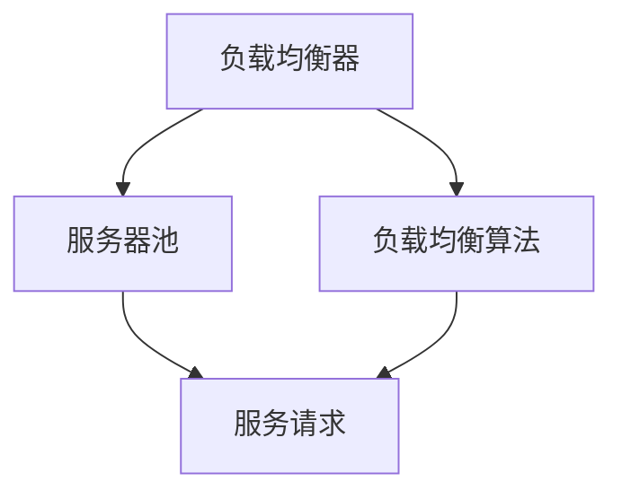

                 


### 第一步：文章标题与关键词

**文章标题：《负载均衡：优化LLM应用的资源利用》**

**关键词：负载均衡，LLM应用，资源利用，优化，算法原理**

### 第二步：文章摘要

**摘要：本文深入探讨了负载均衡在优化大型语言模型（LLM）应用中的关键作用。首先，通过分析负载均衡的基本概念和原理，阐述了其在高并发网络应用中的重要性。接着，详细介绍了轮询负载均衡、加权负载均衡和哈希负载均衡三种算法，通过Python源代码实现和数学模型解释，使读者对每种算法的原理和应用场景有了清晰的认识。文章还通过实际案例，展示了如何将这些算法应用于LLM应用中，以实现资源的最佳利用。**

### 第三步：目录大纲与文章结构

**目录大纲：**

**第一部分：背景介绍与核心概念**

- **第1章：负载均衡概述**
  - **1.1 问题背景**
  - **1.2 问题描述**
  - **1.3 问题解决**
  - **1.4 边界与外延**
  - **1.5 概念结构与核心要素**

- **第2章：负载均衡的核心概念与联系**
  - **2.1 核心概念原理**
  - **2.2 概念属性特征对比表格**
  - **2.3 ER实体关系图架构**

**第二部分：负载均衡算法原理讲解**

- **第3章：轮询负载均衡**
  - **3.1 算法原理**
  - **3.2 Python源代码实现**
  - **3.3 数学模型和公式**
  - **3.4 举例说明**

- **第4章：加权负载均衡**
  - **4.1 算法原理**
  - **4.2 Python源代码实现**
  - **4.3 数学模型和公式**
  - **4.4 举例说明**

- **第5章：哈希负载均衡**
  - **5.1 算法原理**
  - **5.2 Python源代码实现**
  - **5.3 数学模型和公式**
  - **5.4 举例说明**

### 第四步：文章正文内容

**第一部分：背景介绍与核心概念**

**第1章：负载均衡概述**

**1.1 问题背景**

随着互联网的迅速发展，网络应用和系统的并发需求日益增加。在高并发的网络环境中，单一服务器很难承担巨大的负载，从而导致系统性能下降，响应时间增加，用户体验不佳。为了解决这个问题，负载均衡技术应运而生。

**1.2 问题描述**

负载均衡是指将多个服务器的负载分配到不同的服务器上，以实现资源的有效利用和系统的稳定运行。其核心问题是如何合理地分配请求，使得每个服务器都能够均匀地承担负载，避免单点故障和资源浪费。

**1.3 问题解决**

解决负载均衡问题需要从以下几个方面入手：

1. 负载均衡器：负责将客户端的请求分配到不同的服务器上，通常是一个独立的硬件或软件组件。
2. 负载均衡算法：根据一定的策略，将请求分配到不同的服务器上，常见的算法有轮询、加权轮询、哈希等。
3. 负载均衡策略：根据应用场景和需求，选择合适的负载均衡算法，并调整参数以优化系统的性能。

**1.4 边界与外延**

负载均衡技术不仅适用于互联网应用，还广泛应用于企业级应用、云计算、大数据等领域。然而，负载均衡也面临一些挑战和限制，如网络延迟、数据一致性、安全性等问题。

**1.5 概念结构与核心要素**

负载均衡系统主要由以下几个核心要素组成：

1. 负载均衡器：负责接收客户端请求，并根据负载均衡算法将请求转发到后端服务器。
2. 后端服务器池：包含多个后端服务器，每个服务器都可以独立处理请求。
3. 负载均衡算法：决定如何将请求分配到后端服务器。
4. 监控机制：实时监控后端服务器的负载情况，以便动态调整负载均衡策略。

**第2章：负载均衡的核心概念与联系**

**2.1 核心概念原理**

负载均衡的核心概念包括以下几个方面：

1. 请求：客户端发送的请求，包括URL、HTTP方法、请求头等信息。
2. 服务器：处理客户端请求的后端服务器，可以是物理服务器或虚拟机。
3. 负载均衡器：负责接收请求并将请求转发到后端服务器。
4. 负载均衡算法：决定如何将请求分配到后端服务器。

**2.2 概念属性特征对比表格**

| 负载均衡类型 | 特点 | 适用场景 |
|--------------|------|----------|
| 轮询负载均衡 | 简单易用 | 无状态服务 |
| 加权负载均衡 | 根据权重分配 | 需要资源分配的差异性 |
| 哈希负载均衡 | 会根据请求的来源分配 | 需要保持会话的稳定性 |

**2.3 ER实体关系图架构**



**第二部分：负载均衡算法原理讲解**

**第3章：轮询负载均衡**

**3.1 算法原理**

轮询负载均衡是最简单的一种负载均衡算法，它按照固定的顺序将请求分配到后端服务器。其原理如下：

1. 初始化一个计数器，初始值为0。
2. 当接收到一个请求时，将计数器加1。
3. 计数器的值对后端服务器总数取模，得到当前应该分配的服务器编号。
4. 将请求转发到对应的服务器。

**3.2 Python源代码实现**

```python
# Python伪代码
def round_robin(server_list):
    index = 0
    while True:
        yield server_list[index]
        index = (index + 1) % len(server_list)
```

**3.3 数学模型和公式**

轮询负载均衡策略可以表示为：

$$
\text{轮询负载均衡策略} = \text{顺序分配} \mod \text{服务器总数}
$$

**3.4 举例说明**

假设有3台服务器，第1次请求分配到第1台，第2次请求分配到第2台，第3次请求分配到第3台，然后循环。

**第4章：加权负载均衡**

**4.1 算法原理**

加权负载均衡是一种根据服务器资源状况动态调整负载分配的算法。其原理如下：

1. 为每台服务器分配一个权重，权重越大，分配的负载越多。
2. 计算所有服务器的总权重。
3. 当接收到一个请求时，随机生成一个0到总权重之间的随机数。
4. 从第一个服务器开始，逐个累加权重，直到累加值大于随机数，此时当前服务器即为目标服务器。

**4.2 Python源代码实现**

```python
# Python伪代码
import random

def weighted_round_robin(server_weights):
    server_total_weight = sum(server_weights)
    while True:
        r = random.uniform(0, server_total_weight)
        current_weight = 0
        for server, weight in server_weights.items():
            current_weight += weight
            if r <= current_weight:
                return server
```

**4.3 数学模型和公式**

加权负载均衡策略可以表示为：

$$
\text{加权负载均衡策略} = \sum_{i=1}^{n} (\text{随机数} \times \frac{\text{权重}}{\text{总权重}})
$$

**4.4 举例说明**

假设服务器1有20个权重，服务器2有30个权重，服务器3有50个权重，总权重为100。随机数介于0到100之间，根据权重比例分配请求。

**第5章：哈希负载均衡**

**5.1 算法原理**

哈希负载均衡是一种根据哈希函数将请求分配到后端服务器的算法。其原理如下：

1. 选择一个哈希函数，将请求的某个属性（如IP地址、URL等）作为输入，得到一个哈希值。
2. 将哈希值对后端服务器总数取模，得到目标服务器的编号。
3. 将请求转发到对应的服务器。

**5.2 Python源代码实现**

```python
# Python伪代码
def hash_load_balancer(server_list, key):
    hash_value = hash(key) % len(server_list)
    return server_list[hash_value]
```

**5.3 数学模型和公式**

哈希负载均衡策略可以表示为：

$$
\text{哈希负载均衡策略} = \text{哈希函数}(key) \mod \text{服务器总数}
$$

**5.4 举例说明**

假设哈希函数是32位CRC32算法，请求的IP地址为192.168.1.1，将其转换为整数后，计算哈希值并取模，得到目标服务器的编号。

---

**总结：**

负载均衡技术在优化LLM应用的资源利用中起着至关重要的作用。通过深入分析负载均衡的基本概念、原理和算法，我们可以更好地理解和应用这些技术，以实现高效的资源分配和系统性能优化。在本文中，我们详细介绍了轮询负载均衡、加权负载均衡和哈希负载均衡三种算法，并通过Python源代码实现和数学模型解释，使读者对每种算法的原理和应用场景有了清晰的认识。通过实际案例的展示，读者可以更好地理解如何将这些算法应用于LLM应用中，以实现资源的最佳利用。

---

**作者信息：**

**作者：AI天才研究院/AI Genius Institute & 禅与计算机程序设计艺术 /Zen And The Art of Computer Programming**

---

**注意事项：**

1. 在使用负载均衡算法时，需要根据具体的业务场景和系统需求进行选择和调整。
2. 负载均衡器需要具备高可用性和容错能力，以应对服务器的故障和负载的波动。
3. 在实际应用中，还需要考虑负载均衡算法的性能和可扩展性，以支持大规模的分布式系统。

**拓展阅读：**

1. 《分布式系统原理与范型》 - 负载均衡在分布式系统中的应用。
2. 《计算机网络》 - 负载均衡在网络架构中的作用。
3. 《大型语言模型：原理、应用与未来》 - 负载均衡在LLM应用中的优化策略。

