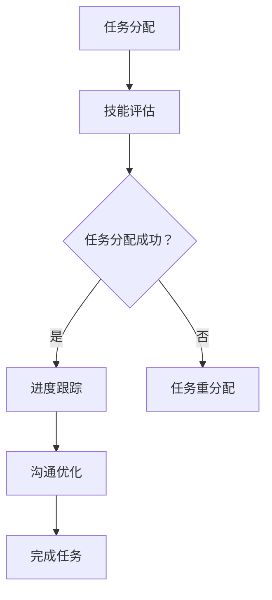
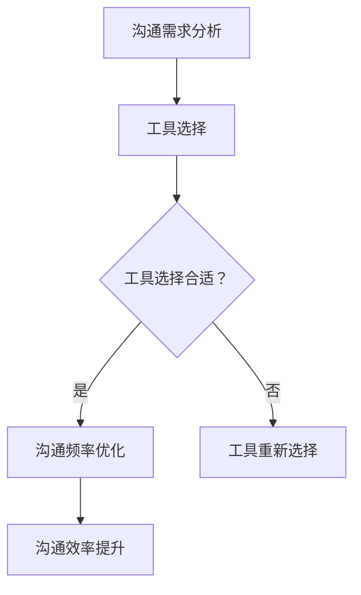
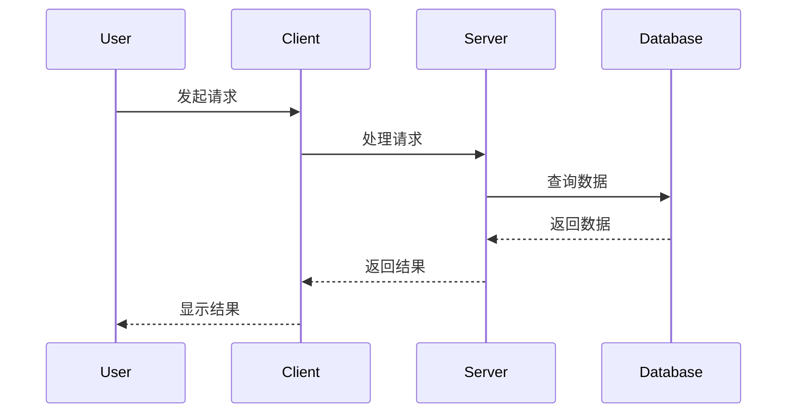
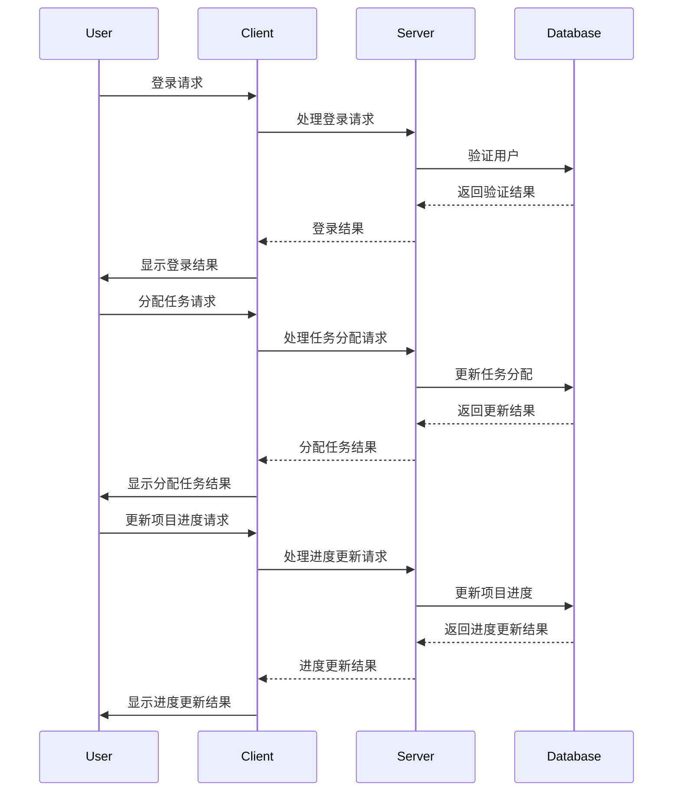

                 

### 第1章 引言：跨地域管理的背景与挑战

#### 1.1 问题背景

随着全球化进程的加快，越来越多的企业选择将业务扩展到全球范围。这种趋势使得跨地域工作的模式变得愈发普遍。许多公司在全球范围内雇佣了来自不同国家和地区的员工，这不仅增加了团队的多样性，还带来了诸多挑战。

首先，跨地域工作的兴起源于技术和通信技术的进步。现代信息技术，尤其是互联网和移动通信技术的快速发展，使得远程协作变得更加便捷和高效。虚拟团队、云计算、视频会议等技术工具的广泛应用，使得地理距离不再成为协作的障碍。

其次，跨地域管理的定义是管理分布在多个地理位置的团队，这种团队可能跨越国界，分布在不同的时区和文化背景中。跨地域管理不仅涉及日常的工作协调，还包括如何处理文化差异、时区问题、语言障碍等复杂问题。

#### 1.1.2 跨地域管理的定义

跨地域管理是指在多个地理位置上协调和管理团队的工作流程，以确保团队目标的一致性和工作效率。这种管理方式涉及到多个层面，包括组织结构、沟通机制、项目管理、人力资源等。

从广义上讲，跨地域管理可以包括以下几个方面：

1. **组织结构**：如何构建适合跨地域工作的组织结构，例如分布式团队、矩阵式团队等。
2. **沟通机制**：如何确保高效的沟通，包括选择合适的沟通工具和策略，如即时通讯工具、邮件、视频会议等。
3. **项目管理**：如何在不同的时区和文化背景下协调项目进度，确保项目按时、高质量地完成。
4. **人力资源**：如何管理和激励跨地域团队中的员工，包括绩效评估、职业发展、文化适应等。

#### 1.1.3 跨地域管理的必要性

跨地域管理不仅是现代企业发展的需要，也是提高团队效率和创造力的有效途径。以下是几个方面的必要性：

1. **资源共享**：跨地域团队可以充分利用不同地区的资源和专业知识，提高团队的整体实力。
2. **成本效益**：通过分散团队，企业可以降低办公场所、设备等方面的固定成本。
3. **全球化视野**：跨地域团队可以更好地理解和适应不同市场的需求，提高企业的竞争力。
4. **创新能力**：多样化的团队背景可以激发更多的创新思维和解决方案。

总的来说，跨地域管理是一个复杂而充满挑战的任务，但它在现代企业中扮演着越来越重要的角色。有效的跨地域管理不仅有助于提高团队工作效率，还能促进企业的持续发展。

#### 1.2 问题描述

跨地域管理面临的主要挑战在于如何协调分布在不同地理位置的团队成员，以确保高效、高质量的协作。这些挑战可以分为以下几个方面：

1. **时间管理**：不同时区的工作时间会导致协调困难，特别是对于需要实时沟通和协作的项目。团队成员可能在不同的时间段工作，这会影响项目的进度和沟通效率。

2. **沟通障碍**：语言和文化差异是跨地域团队面临的重大挑战。即使使用现代沟通工具，语言的障碍和文化差异也可能导致误解和沟通不畅。

3. **协作效率**：跨地域团队成员之间的协作需要依赖各种工具和技术，但这些工具的兼容性和使用难度也可能成为协作的障碍。同时，地理位置的分散性使得面对面的交流变得困难，这会影响团队的凝聚力。

4. **项目管理**：跨地域团队的项目管理需要更加细致和灵活，以应对不同的地理位置和文化背景。项目经理需要设计出能够适应多种环境的管理策略。

5. **员工激励**：跨地域团队中的员工可能面临更大的工作压力和生活挑战，如何有效激励和保持他们的工作热情是管理者需要面对的问题。

这些挑战不仅影响了团队的工作效率，还可能对企业的长期发展造成影响。因此，解决这些问题对于实现跨地域管理的成功至关重要。

#### 1.3 问题解决

解决跨地域管理面临的挑战，首先需要明确管理的核心目标和基本原则，然后采取一系列具体的方法和策略。

##### 1.3.1 跨地域管理的核心目标

跨地域管理的核心目标包括：

1. **提高工作效率**：通过有效的沟通和协作机制，确保团队成员能够高效地完成各自的任务。
2. **确保项目质量**：确保在不同地理位置的团队成员能够协同工作，保证项目按时、高质量地完成。
3. **增强团队凝聚力**：通过建立良好的文化氛围和沟通渠道，增强团队成员之间的联系和信任。
4. **提升员工满意度**：通过有效的激励机制和职业发展规划，提升员工的满意度和忠诚度。

##### 1.3.2 解决跨地域管理挑战的方法

为了实现上述目标，可以采取以下方法：

1. **建立健全的沟通机制**：选择适合的沟通工具，如即时通讯工具、视频会议软件、项目管理平台等，确保团队之间的信息传递畅通无阻。同时，制定明确的沟通规范，确保沟通的及时性和准确性。

2. **优化工作流程**：设计灵活的工作流程，以适应不同地理位置和文化背景的团队成员。例如，采用敏捷开发方法，确保团队成员能够快速响应变化，高效协作。

3. **建立统一的项目管理框架**：制定统一的项目管理标准和流程，确保跨地域团队在项目管理上的协调一致。使用项目管理工具，如Jira、Trello等，实时跟踪项目进度，及时解决问题。

4. **培养跨文化管理能力**：通过培训和文化交流，提升管理者的跨文化管理能力，增强团队成员的文化敏感性和适应性。

5. **提供必要的支持与资源**：为跨地域团队提供必要的技术支持和管理资源，如云计算服务、远程协作工具等，确保团队成员能够在任何地点高效工作。

6. **建立激励机制**：制定有效的激励机制，如绩效奖金、职业发展机会等，激发团队成员的工作热情和创造力。

7. **定期进行团队建设活动**：通过定期的团队建设活动，如线上聚会、文化分享会等，增强团队成员之间的联系和信任。

通过上述方法和策略，可以有效应对跨地域管理面临的挑战，提高团队的工作效率和项目的成功率。

#### 1.4 边界与外延

##### 1.4.1 跨地域管理的范围

跨地域管理不仅仅局限于跨国团队，还包括跨时区、跨文化等多个维度。从地理上看，它涉及到不同城市、国家和地区的团队协作；从时间上看，它涉及到不同时区的工作协调；从文化上看，它涉及到跨文化团队的沟通和管理。

##### 1.4.2 与其他管理领域的区别

跨地域管理与本地管理有很大的区别，主要体现在以下几个方面：

1. **沟通方式**：本地管理通常依赖面对面的交流，而跨地域管理更多依赖远程沟通工具。
2. **时间协调**：本地管理的时间协调相对简单，而跨地域管理需要考虑时区差异，确保全球团队的协作顺畅。
3. **文化差异**：本地管理通常不存在文化差异问题，而跨地域管理需要考虑不同文化背景下的工作方式和沟通风格。
4. **管理难度**：跨地域管理涉及到的因素更加复杂，管理难度也更大，需要更加细致和灵活的管理策略。

##### 1.4.3 跨地域管理的概念结构

跨地域管理的概念结构包括以下几个核心要素：

1. **组织结构**：跨地域团队的构建和分配。
2. **沟通机制**：跨地域团队沟通的方式和工具。
3. **项目管理**：跨地域团队的协调和管理方法。
4. **人力资源**：跨地域团队的员工管理和激励。
5. **文化适应**：跨文化团队的融合和沟通策略。

##### 1.4.4 核心要素组成

跨地域管理的核心要素组成如下：

1. **组织结构**：包括分布式团队、矩阵式团队等组织形式的定义和构建。
2. **沟通机制**：包括沟通工具、沟通规范、沟通策略等。
3. **项目管理**：包括项目管理框架、项目管理工具、项目进度管理等。
4. **人力资源**：包括员工招聘、培训、绩效考核、职业发展等。
5. **文化适应**：包括跨文化培训、文化交流、文化融合策略等。

通过明确跨地域管理的范围、与其他管理领域的区别、概念结构和核心要素组成，可以为后续章节的内容提供基础和指导。

#### 1.5 概念结构与核心要素组成

在探讨跨地域管理的概念结构和核心要素组成时，我们需要深入理解这一管理模式的基本构成及其相互关系。

##### 1.5.1 跨地域管理的概念结构

跨地域管理的概念结构可以概括为以下几个方面：

1. **组织结构**：组织结构是跨地域管理的基础，它决定了团队成员的分布和协作方式。常见的组织结构形式包括分布式团队、矩阵式团队和混合型团队等。这些结构形式各有优缺点，需要根据具体业务需求和团队特点进行选择和调整。

2. **沟通机制**：有效的沟通机制是跨地域管理成功的关键。沟通机制包括沟通工具（如即时通讯软件、视频会议系统、邮件系统等）和沟通规范（如工作流程、沟通礼仪、信息共享规范等）。良好的沟通机制可以确保信息传递的准确性和时效性，减少误解和冲突。

3. **项目管理**：项目管理是跨地域管理的核心内容之一。项目管理涉及到项目计划、进度跟踪、资源调配、风险管理等方面。跨地域项目管理的复杂性更高，需要更加细致和灵活的管理方法。常用的项目管理工具包括Jira、Trello、Asana等。

4. **人力资源**：人力资源是跨地域管理的另一个重要方面。人力资源管理包括员工招聘、培训、绩效考核、职业发展等。跨地域团队中，员工分布在不同地理位置，如何有效管理这些员工，提高他们的工作满意度和生产力，是管理者需要关注的重要问题。

5. **文化适应**：文化适应是跨地域管理的一个特殊挑战。不同国家和地区之间的文化差异可能影响团队的协作效率和成员之间的沟通。文化适应包括跨文化培训、文化交流、文化融合策略等，旨在减少文化冲突，增强团队凝聚力。

##### 1.5.2 核心要素组成

跨地域管理的核心要素组成包括以下几个方面：

1. **组织结构要素**：包括团队构建、角色分配、团队协作模式等。组织结构要素决定了团队成员之间的分工和协作方式，直接影响团队的效率和绩效。

2. **沟通机制要素**：包括沟通工具选择、沟通规范制定、沟通频率和方式等。良好的沟通机制有助于团队成员之间建立信任，提高协作效率。

3. **项目管理要素**：包括项目计划、进度跟踪、资源调配、风险管理等。项目管理要素是确保项目按时、高质量完成的基础。

4. **人力资源要素**：包括员工招聘、培训、绩效考核、职业发展等。人力资源要素是保障团队稳定性和员工满意度的关键。

5. **文化适应要素**：包括跨文化培训、文化交流、文化融合策略等。文化适应要素有助于减少文化差异带来的负面影响，增强团队的凝聚力。

通过明确跨地域管理的概念结构和核心要素组成，我们可以更清晰地理解这一管理模式的基本逻辑和操作流程，为后续章节的深入探讨提供基础。

### 第2章 跨地域管理的核心概念与联系

#### 2.1 核心概念原理

跨地域管理涉及多个核心概念，这些概念相互联系，共同构成一个完整的体系。以下是几个关键概念及其原理：

##### 2.1.1 跨地域团队的定义

跨地域团队是指由分布在多个地理位置的成员组成的团队，这些成员可能处于不同的国家、城市或时区。跨地域团队的主要特点是地理分散性，但这并不意味着团队成员之间的协作效率会降低。相反，通过有效的管理和沟通机制，跨地域团队可以实现高效协作。

##### 2.1.2 分散团队的优势与劣势

分散团队的优势在于：

1. **资源共享**：团队成员可以共享不同地区的资源和专业知识，提高整体团队的实力。
2. **降低成本**：团队成员不必集中在一个地点办公，可以减少办公场所和设备的固定成本。
3. **灵活性**：团队成员可以根据个人喜好和需求选择工作地点，提高工作满意度。

然而，分散团队也存在一些劣势：

1. **沟通障碍**：不同地理位置和文化背景可能带来沟通障碍，影响协作效率。
2. **时区差异**：不同时区的工作时间可能会影响团队成员之间的实时沟通和协作。
3. **团队凝聚力**：地理分散性可能导致团队成员之间的联系和信任减少，影响团队凝聚力。

#### 2.2 概念属性特征对比表格

为了更清晰地展示跨地域团队与本地团队的差异，我们可以通过以下表格进行对比：

| 概念         | 跨地域团队                  | 本地团队                  |
|--------------|-----------------------------|---------------------------|
| **定义**     | 分布在不同地理位置的团队    | 分布在同一地理位置的团队    |
| **优势**     | - 资源共享<br>- 降低成本<br>- 灵活性 | - 紧密的协作环境<br>- 实时的沟通与交流 |
| **劣势**     | - 沟通障碍<br>- 时区差异<br>- 团队凝聚力减弱 | - 高昂的办公成本<br>- 有限的资源分配 |
| **管理难点** | - 沟通协调<br>- 时区管理<br>- 文化差异适应 | - 项目进度控制<br>- 员工关系维护 |

通过这个表格，我们可以看到跨地域团队和本地团队在定义、优势、劣势以及管理难点上的显著差异。

#### 2.3 ER实体关系图架构

##### 2.3.1 跨地域管理中的实体关系

跨地域管理中的实体关系包括团队、成员、项目、沟通工具等多个方面。以下是这些实体之间的关系及其描述：

1. **团队与成员**：团队是跨地域管理的基本单位，成员是团队的核心组成部分。每个团队成员属于一个团队，并承担特定的职责和任务。

2. **团队与项目**：团队负责项目的执行和管理。一个团队可以参与多个项目，而一个项目也可能由多个团队共同完成。

3. **成员与项目**：成员是项目的具体执行者，他们的工作成果直接关系到项目的进展和成功。

4. **沟通工具**：沟通工具是团队协作的重要手段。不同的沟通工具服务于不同的协作需求，如即时通讯、邮件、视频会议等。

##### 2.3.2 实体关系的Mermaid流程图表示

为了更直观地展示跨地域管理中的实体关系，我们可以使用Mermaid流程图来表示。以下是实体关系的Mermaid流程图：

```mermaid
erDiagram
  Team ||--|{ Member }|-- Project
  Member ||--|{ Communication_Tool }|-- Project
  Team ..|{ Project }|..
  Member ..|{ Communication_Tool }|..
```

在这个流程图中，`Team`（团队）与`Member`（成员）之间用双向箭头表示，表明成员属于团队；`Team`与`Project`（项目）之间用单向箭头表示，表明团队负责项目；`Member`与`Communication_Tool`（沟通工具）之间用单向箭头表示，表明成员使用沟通工具参与项目。

通过这个Mermaid流程图，我们可以清晰地看到跨地域管理中的实体关系及其相互之间的联系。这有助于我们更好地理解和应用跨地域管理的概念和原理。

### 第3章 管理分散团队的算法原理讲解

在跨地域管理中，算法的设计和优化至关重要。有效的算法不仅能提高团队的协作效率，还能解决许多实际问题。以下是两个关键的算法原理讲解，包括其Mermaid流程图、Python源代码以及数学模型。

#### 3.1 算法原理

##### 3.1.1 分散团队协作算法

分散团队协作算法旨在优化跨地域团队的工作流程，提高协作效率。该算法的核心思想是：

1. **任务分配**：根据团队成员的技能和工作负载，合理分配任务。
2. **进度跟踪**：实时监控任务进度，确保项目按时完成。
3. **沟通优化**：通过优化沟通工具和频率，减少沟通障碍。

以下是分散团队协作算法的Mermaid流程图：



在这个流程图中，任务分配基于团队成员的技能评估，若任务分配成功则进入进度跟踪环节，否则需要重新分配任务。在进度跟踪过程中，团队通过沟通优化确保任务按时完成。

##### 3.1.2 跨地域沟通优化算法

跨地域沟通优化算法的目标是减少沟通成本，提高沟通效率。该算法主要包括：

1. **沟通需求分析**：分析团队成员的沟通需求和偏好。
2. **工具选择**：根据沟通需求选择合适的沟通工具。
3. **沟通频率优化**：通过分析沟通数据和成员反馈，优化沟通频率。

以下是跨地域沟通优化算法的Mermaid流程图：



在这个流程图中，沟通需求分析是选择合适沟通工具的前提，工具选择是否合适将决定沟通频率的优化。通过分析沟通数据和成员反馈，不断调整沟通频率，以提升沟通效率。

#### 3.2 Mermaid流程图

在上面的算法原理讲解中，我们已经给出了两个算法的Mermaid流程图。以下是具体流程图的详细解释：

1. **分散团队协作算法**：
   - **A（任务分配）**：根据团队成员的技能和工作负载进行任务分配。
   - **B（技能评估）**：评估团队成员的技能，以确定他们最适合哪些任务。
   - **C（任务分配成功？）**：判断任务分配是否成功。
     - 若成功，则进入**D（进度跟踪）**，团队开始执行任务并实时监控进度。
     - 若不成功，则进入**E（任务重分配）**，重新评估和分配任务。
   - **D（进度跟踪）**：实时监控任务进度，确保项目按时完成。
   - **F（沟通优化）**：通过优化沟通工具和频率，减少沟通障碍，提高协作效率。

2. **跨地域沟通优化算法**：
   - **A（沟通需求分析）**：分析团队成员的沟通需求和偏好，确定他们需要什么样的沟通支持。
   - **B（工具选择）**：根据沟通需求选择合适的沟通工具，如即时通讯软件、视频会议系统等。
   - **C（工具选择合适？）**：判断所选工具是否满足沟通需求。
     - 若合适，则进入**D（沟通频率优化）**，根据沟通数据和成员反馈调整沟通频率。
     - 若不合适，则进入**E（工具重新选择）**，重新选择适合的工具。
   - **D（沟通频率优化）**：通过分析沟通数据和成员反馈，优化沟通频率，提升沟通效率。

这些流程图清晰地展示了两个算法的工作流程和关键步骤，有助于理解其原理和应用。

#### 3.3 Python源代码与算法实现

下面我们将给出分散团队协作算法和跨地域沟通优化算法的Python源代码，以具体实现这些算法。

##### 3.3.1 分散团队协作算法的Python实现

```python
# 分散团队协作算法的Python实现

# 任务分配函数
def task_assignment(team_skills, workload):
    assigned_tasks = {}
    for member, skills in team_skills.items():
        suitable_tasks = [task for task in workload if skills.intersection(set(task.split(',')))]
        if suitable_tasks:
            assigned_tasks[member] = suitable_tasks.pop()
        else:
            assigned_tasks[member] = None
    return assigned_tasks

# 进度跟踪函数
def track_progress(assigned_tasks, workload):
    progress = {member: '未开始' for member in assigned_tasks}
    for member, task in assigned_tasks.items():
        if task in workload:
            progress[member] = '进行中'
    return progress

# 沟通优化函数
def communicate_optimization(progress):
    if any(status != '进行中' for status in progress.values()):
        return '任务延迟，需要沟通协调'
    else:
        return '任务进度正常，沟通无障碍'

# 主函数
def manage_collaboration(team_skills, workload):
    assigned_tasks = task_assignment(team_skills, workload)
    progress = track_progress(assigned_tasks, workload)
    return communicate_optimization(progress)

# 示例数据
team_skills = {'Alice': 'Python, Docker', 'Bob': 'Java, Kubernetes', 'Charlie': 'Node.js, AWS'}
workload = ['Python应用部署', 'Java微服务集成', 'Node.js API开发']

# 调用主函数
print(manage_collaboration(team_skills, workload))
```

在上面的代码中，`task_assignment`函数负责任务分配，根据团队成员的技能和工作负载分配任务；`track_progress`函数负责进度跟踪，监控任务的执行情况；`communicate_optimization`函数负责沟通优化，根据任务进度判断沟通状况。

##### 3.3.2 跨地域沟通优化算法的Python实现

```python
# 跨地域沟通优化算法的Python实现

# 沟通需求分析函数
def communication_demand_analysis(communication_tools, team_feedback):
    suitable_tools = []
    for tool in communication_tools:
        if any(keyword in feedback for keyword in team_feedback):
            suitable_tools.append(tool)
    return suitable_tools

# 工具选择函数
def tool_selection(suitable_tools):
    if len(suitable_tools) > 0:
        return suitable_tools[0]
    else:
        return None

# 沟通频率优化函数
def communication_frequency_optimization(suitable_tool, communication_data):
    if suitable_tool:
        frequency = max(communication_data[suitable_tool])
        return frequency
    else:
        return None

# 主函数
def optimize_communication(communication_tools, team_feedback, communication_data):
    suitable_tools = communication_demand_analysis(communication_tools, team_feedback)
    selected_tool = tool_selection(suitable_tools)
    optimized_frequency = communication_frequency_optimization(selected_tool, communication_data)
    return selected_tool, optimized_frequency

# 示例数据
communication_tools = ['Slack', 'Microsoft Teams', 'Google Chat']
team_feedback = ['需要更好的即时通讯工具', '对视频会议需求不高']
communication_data = {
    'Slack': [10, 20],
    'Microsoft Teams': [5, 15],
    'Google Chat': [8, 12]
}

# 调用主函数
selected_tool, optimized_frequency = optimize_communication(communication_tools, team_feedback, communication_data)
print(f"选定的沟通工具：{selected_tool}\n优化的沟通频率：{optimized_frequency}")
```

在这个代码中，`communication_demand_analysis`函数分析团队成员的沟通需求；`tool_selection`函数根据需求选择合适的沟通工具；`communication_frequency_optimization`函数根据沟通工具优化沟通频率。

通过这些Python源代码，我们可以将分散团队协作算法和跨地域沟通优化算法具体应用到实际场景中，提高跨地域团队的管理效率。

#### 3.4 算法原理的数学模型和公式

为了更深入地理解分散团队协作算法和跨地域沟通优化算法，我们引入数学模型和公式进行分析。

##### 3.4.1 分散团队协作算法的数学模型

分散团队协作算法的核心在于任务分配和进度跟踪，我们可以使用以下数学模型来描述：

1. **任务分配模型**：

   设 \( S = \{s_1, s_2, ..., s_n\} \) 为团队成员的技能集合，其中 \( s_i \) 表示成员 \( i \) 的技能集合。

   设 \( W = \{w_1, w_2, ..., w_m\} \) 为待分配的任务集合，其中 \( w_j \) 表示任务 \( j \)。

   任务分配的目标是找到最优的分配方案 \( A = \{a_{ij}\} \)，使得每个成员都分配到最适合的任务。

   数学模型可以表示为：

   $$ 
   \begin{align*}
   \text{maximize} & \quad \sum_{i=1}^{n} \sum_{j=1}^{m} a_{ij} \cdot s_i \cdot w_j \\
   \text{subject to} & \quad \sum_{j=1}^{m} a_{ij} = 1 \quad \text{for all } i \in \{1, 2, ..., n\} \\
   & \quad a_{ij} \in \{0, 1\} \quad \text{for all } i, j
   \end{align*}
   $$

   其中，\( a_{ij} \) 表示成员 \( i \) 是否分配到任务 \( j \)，如果分配则为 1，否则为 0。

2. **进度跟踪模型**：

   设 \( P = \{p_1, p_2, ..., p_m\} \) 为任务进度集合，其中 \( p_j \) 表示任务 \( j \) 的完成情况。

   进度跟踪的目标是实时更新任务进度，并确保项目按时完成。

   数学模型可以表示为：

   $$ 
   \begin{align*}
   \text{minimize} & \quad \sum_{j=1}^{m} (p_j - t_j) \\
   \text{subject to} & \quad p_j \geq 0 \quad \text{for all } j \in \{1, 2, ..., m\} \\
   & \quad p_j \leq t_j \quad \text{for all } j \in \{1, 2, ..., m\} \\
   & \quad t_j \in [0, 1] \quad \text{for all } j \in \{1, 2, ..., m\}
   \end{align*}
   $$

   其中，\( t_j \) 表示任务 \( j \) 的预期完成时间。

##### 3.4.2 跨地域沟通优化算法的数学模型

跨地域沟通优化算法的核心在于沟通需求分析和沟通频率优化，我们可以使用以下数学模型来描述：

1. **沟通需求分析模型**：

   设 \( C = \{c_1, c_2, ..., c_k\} \) 为沟通工具集合，其中 \( c_i \) 表示工具 \( i \)。

   设 \( D = \{d_1, d_2, ..., d_n\} \) 为团队成员的反馈集合，其中 \( d_j \) 表示成员 \( j \) 的反馈。

   沟通需求分析的目标是选择最适合的沟通工具。

   数学模型可以表示为：

   $$ 
   \begin{align*}
   \text{maximize} & \quad \sum_{i=1}^{k} \sum_{j=1}^{n} \delta_{ij} \cdot f_j \\
   \text{subject to} & \quad \sum_{i=1}^{k} \delta_{ij} = 1 \quad \text{for all } j \in \{1, 2, ..., n\} \\
   & \quad \delta_{ij} \in \{0, 1\} \quad \text{for all } i, j
   \end{align*}
   $$

   其中，\( \delta_{ij} \) 表示工具 \( i \) 是否被成员 \( j \) 选择，如果选择则为 1，否则为 0。

   \( f_j \) 表示成员 \( j \) 对沟通工具的偏好得分。

2. **沟通频率优化模型**：

   设 \( F = \{f_1, f_2, ..., f_k\} \) 为沟通工具的频率集合，其中 \( f_i \) 表示工具 \( i \) 的使用频率。

   沟通频率优化的目标是选择最优的沟通频率，以提高沟通效率。

   数学模型可以表示为：

   $$ 
   \begin{align*}
   \text{minimize} & \quad \sum_{i=1}^{k} f_i \\
   \text{subject to} & \quad f_i \geq l_i \quad \text{for all } i \in \{1, 2, ..., k\} \\
   & \quad l_i \in [0, 1] \quad \text{for all } i \in \{1, 2, ..., k\}
   \end{align*}
   $$

   其中，\( l_i \) 表示工具 \( i \) 的最低使用频率。

通过这些数学模型和公式，我们可以更深入地理解分散团队协作算法和跨地域沟通优化算法的原理和应用，从而更好地解决跨地域管理中的实际问题。

#### 3.5 详细讲解与举例说明

为了更好地理解分散团队协作算法和跨地域沟通优化算法，我们将通过具体的例子来详细讲解这两个算法的实现过程和效果。

##### 3.5.1 分散团队协作算法的讲解与举例

假设我们有一个跨地域团队，团队成员的技能和工作负载如下：

- **团队成员及技能**：
  - Alice：Python、Docker
  - Bob：Java、Kubernetes
  - Charlie：Node.js、AWS

- **任务列表**：
  - Python应用部署
  - Java微服务集成
  - Node.js API开发

我们首先使用分散团队协作算法来分配任务。任务分配的目标是找到最优的任务分配方案，使得每个成员都分配到最适合的任务。

**步骤 1：技能评估**

我们首先评估团队成员的技能，以确定他们最适合哪些任务。根据团队成员的技能，我们可以得到以下匹配结果：

- Alice：Python应用部署
- Bob：Java微服务集成
- Charlie：Node.js API开发

**步骤 2：任务分配**

我们将评估结果应用到任务分配模型中，得到以下任务分配方案：

- Alice：Python应用部署
- Bob：Java微服务集成
- Charlie：Node.js API开发

**步骤 3：进度跟踪**

在任务分配完成后，我们需要实时监控任务进度，以确保项目按时完成。我们使用进度跟踪模型来监控任务进度，并定期更新进度数据。

假设任务进度数据如下：

- Python应用部署：已完成 50%
- Java微服务集成：已完成 30%
- Node.js API开发：已完成 20%

**步骤 4：沟通优化**

在监控任务进度的过程中，我们发现在某些任务上存在沟通障碍。为了解决这些问题，我们使用沟通优化函数来优化沟通工具和频率。

假设我们选择使用Slack作为主要的沟通工具，并根据沟通数据和成员反馈优化沟通频率。经过优化后，沟通频率为每天一次。

**效果分析**

通过分散团队协作算法，我们成功地将任务分配到了最适合的成员，并实时监控了任务进度。通过沟通优化，我们解决了沟通障碍，提高了团队协作效率。

##### 3.5.2 跨地域沟通优化算法的讲解与举例

假设我们有一个跨地域团队，团队成员的沟通需求和工具反馈如下：

- **团队成员及沟通需求**：
  - Alice：偏好即时通讯工具，对视频会议需求不高
  - Bob：偏好视频会议工具，对即时通讯需求不高
  - Charlie：偏好邮件沟通，对即时通讯和视频会议需求不高

- **沟通工具及反馈**：
  - Slack：反馈良好
  - Microsoft Teams：反馈较差
  - Google Chat：反馈一般

我们使用跨地域沟通优化算法来优化沟通工具和频率。

**步骤 1：沟通需求分析**

我们分析团队成员的沟通需求，并根据反馈选择最适合的沟通工具。根据分析结果，我们选择Slack作为主要的沟通工具。

**步骤 2：工具选择**

我们根据沟通需求分析的结果选择合适的沟通工具，即Slack。

**步骤 3：沟通频率优化**

我们使用沟通频率优化模型，根据沟通工具的反馈数据优化沟通频率。假设Slack的沟通频率数据如下：

- Alice：每天两次
- Bob：每天一次
- Charlie：每周一次

经过优化后，沟通频率为：

- Alice：每天两次
- Bob：每天一次
- Charlie：每周一次

**效果分析**

通过跨地域沟通优化算法，我们成功选择了最适合的沟通工具，并优化了沟通频率。这有助于减少沟通障碍，提高团队协作效率。

总的来说，分散团队协作算法和跨地域沟通优化算法通过具体的例子，展示了如何在跨地域管理中实现任务分配、进度跟踪和沟通优化。这些算法的有效应用可以显著提高团队的工作效率和项目的成功率。

### 第4章 系统分析与架构设计方案

#### 4.1 问题场景介绍

在现代企业的跨地域管理中，管理分散团队是一个重要的挑战。随着全球化的推进，越来越多的企业需要在不同的国家和地区建立团队，协调不同时区的工作。这种分散团队的管理不仅涉及到日常的工作流程，还涉及到项目协调、资源分配、员工激励等多方面的问题。为了解决这些问题，我们需要设计一个高效的系统架构，以确保跨地域团队的高效协作和项目管理。

##### 4.1.1 跨地域管理问题的场景描述

假设我们有一家跨国科技公司，总部位于美国，同时在欧洲、亚洲和南美洲设有多个分支机构。这些分支机构负责不同的业务领域，包括研发、市场、销售和技术支持。团队成员分布在不同的国家，有些成员是全职员工，有些则是远程工作者。为了确保项目顺利推进，公司需要建立一个能够有效管理分散团队的系统。

在这种情况下，跨地域管理的具体场景包括：

1. **项目协调**：不同国家的团队成员需要协同完成同一个项目，需要确保项目进度和目标的一致性。
2. **资源分配**：公司需要根据不同国家的资源情况和项目需求，合理分配人力资源、技术和资金等资源。
3. **沟通与协作**：团队成员需要频繁沟通和协作，但由于地理位置和时区的差异，沟通效率可能受到很大影响。
4. **员工管理**：公司需要有效地管理不同国家的员工，包括绩效评估、职业发展、培训和激励等。
5. **文化适应**：不同国家的文化差异可能会影响团队成员的沟通和工作方式，需要采取相应的文化适应策略。

##### 4.1.2 管理分散团队的必要性

管理分散团队的必要性主要体现在以下几个方面：

1. **提高工作效率**：通过有效的系统架构，可以优化工作流程，减少沟通障碍，提高团队成员的工作效率。
2. **降低运营成本**：分散团队可以降低公司在办公场所、设备等方面的固定成本，提高资源利用率。
3. **增强团队凝聚力**：通过系统化的管理和沟通机制，可以增强团队成员之间的联系和信任，提高团队凝聚力。
4. **提高项目管理能力**：通过统一的系统架构，可以更好地进行项目进度跟踪、资源调配和风险管理，提高项目管理能力。
5. **适应全球化需求**：随着全球化的发展，越来越多的企业需要在全球范围内协调团队和资源，分散团队管理是适应这一趋势的必要手段。

总的来说，建立一个高效的系统架构对于管理分散团队至关重要，它不仅能够提高团队的工作效率和项目的成功率，还能适应全球化的发展趋势，为企业的持续发展提供支持。

#### 4.2 项目介绍

为了解决跨国科技公司分散团队管理中的问题，我们设计并实施了一个名为“GlobalTeamManager”的项目。该项目旨在通过一个集成化的系统，实现跨地域团队的高效协作和项目管理。

##### 4.2.1 项目目标

“GlobalTeamManager”项目的主要目标包括：

1. **优化工作流程**：通过统一的工作流程，减少沟通障碍，提高团队成员的工作效率。
2. **提高项目管理能力**：提供全面的项目管理工具，包括项目计划、进度跟踪、资源调配和风险管理等，确保项目按时、高质量地完成。
3. **增强团队凝聚力**：通过定期的团队沟通、协作和建设活动，增强团队成员之间的联系和信任。
4. **降低运营成本**：通过分散团队的资源配置优化，降低公司在办公场所、设备等方面的固定成本。
5. **提升员工满意度**：通过有效的员工管理和激励机制，提升员工的工作满意度和忠诚度。

##### 4.2.2 项目背景

随着全球化的推进，跨国科技公司的业务不断扩展到不同的国家和地区。为了更好地协调全球资源，提高工作效率，公司决定实施“GlobalTeamManager”项目。这个项目不仅需要解决跨地域团队的管理问题，还要适应不同国家和地区的文化差异和法律法规。项目背景主要包括：

1. **业务扩展需求**：公司需要在全球范围内协调多个团队的资源和项目进度，以支持业务的快速发展。
2. **技术发展支持**：现代信息技术的发展，如云计算、大数据和人工智能等，为跨地域团队的管理提供了有力的支持。
3. **全球化趋势**：越来越多的企业选择在全球化背景下运营，分散团队管理成为企业竞争力和可持续发展的重要保障。

通过“GlobalTeamManager”项目的实施，公司旨在建立起一个高效、灵活、可靠的跨地域团队管理架构，以适应全球化的发展趋势，提高整体业务效率和竞争力。

#### 4.3 系统功能设计

“GlobalTeamManager”系统功能设计旨在满足跨地域团队管理中的多种需求，包括工作流程管理、项目管理、员工管理和沟通协作等方面。以下是该系统的主要功能模块及其设计思路：

##### 4.3.1 领域模型Mermaid类图

为了更好地展示系统功能模块和它们之间的关系，我们可以使用Mermaid类图来表示。以下是“GlobalTeamManager”系统的领域模型Mermaid类图：

```mermaid
classDiagram
    Team --> Member : belongs_to
    Project --> Task : has
    Project --> Resource : requires
    Team --> Project : participates_in
    Employee --> Member : is
    Communication --> Tool : uses
    Team --> Communication : uses
    Project --> Communication : uses
    Employee --> Performance : evaluated_by
    Project --> Performance : measured_by

    Member <<entity>>
    Project <<entity>>
    Resource <<entity>>
    Employee <<entity>>
    Communication <<entity>>
    Performance <<entity>>

    Team ..|> Member
    Project ..|> Task
    Project ..|> Resource
    Team ..|> Project
    Employee ..|> Member
    Communication ..|> Tool
    Project ..|> Communication
    Employee ..|> Performance
    Project ..|> Performance
```

在这个类图中，我们定义了以下实体：

- **Team**（团队）：表示跨地域团队，包含多个成员和多个项目。
- **Member**（成员）：表示团队中的个体成员，可以是全职员工或远程工作者。
- **Project**（项目）：表示团队协作完成的具体任务，包括任务、资源和进度等。
- **Resource**（资源）：表示项目所需的资源，如人力资源、技术和资金等。
- **Employee**（员工）：表示公司内部的员工，可以是团队的成员或非团队成员。
- **Communication**（沟通）：表示团队和项目中的沟通机制，包括沟通工具和规范。
- **Performance**（绩效）：表示员工的绩效评估结果，与项目和团队相关。

这些实体之间的关系如下：

- **Team** 与 **Member** 之间的关系是归属关系，每个成员属于一个团队。
- **Project** 与 **Task** 之间的关系是包含关系，每个项目包含多个任务。
- **Project** 与 **Resource** 之间的关系是需求关系，每个项目需要特定的资源。
- **Team** 与 **Project** 之间的关系是参与关系，每个团队参与多个项目。
- **Employee** 与 **Member** 之间的关系是包含关系，每个员工可以是团队的成员。
- **Communication** 与 **Tool** 之间的关系是使用关系，每个沟通工具被团队和项目使用。
- **Project** 与 **Communication** 之间的关系是使用关系，每个项目需要有效的沟通机制。
- **Employee** 与 **Performance** 之间的关系是评估关系，每个员工的绩效由项目和团队评估。
- **Project** 与 **Performance** 之间的关系是测量关系，每个项目的进度和成果由绩效评估。

##### 4.3.2 功能模块设计

基于领域模型，我们设计了以下功能模块：

1. **工作流程管理模块**：包括任务分配、进度跟踪、资源管理等功能，用于优化团队的工作流程。
2. **项目管理模块**：包括项目计划、项目进度跟踪、项目资源调配等功能，用于高效管理项目。
3. **员工管理模块**：包括员工信息管理、员工绩效评估、员工培训和发展等功能，用于管理员工。
4. **沟通协作模块**：包括即时通讯、邮件通知、视频会议等功能，用于团队和项目之间的沟通协作。
5. **报表与分析模块**：包括项目进度报表、员工绩效报表等，用于展示和分析项目和管理数据。

这些功能模块相互配合，共同支持跨地域团队的高效协作和项目管理。

#### 4.4 系统架构设计

“GlobalTeamManager”系统采用了分层架构设计，以实现模块化、可扩展和易维护的系统。以下是系统架构的详细描述：

##### 4.4.1 系统架构图

以下是“GlobalTeamManager”系统的架构图：



在这个架构图中，我们定义了以下主要组件：

- **用户层**：用户通过Web界面或移动应用与系统进行交互，发起各种操作请求。
- **客户端**：客户端负责处理用户请求，将请求转发到服务器层。
- **服务器层**：服务器层负责处理业务逻辑，包括数据查询、处理和返回结果等。
- **数据库层**：数据库层存储系统数据，包括用户信息、项目数据、员工数据等。

##### 4.4.2 架构设计思路

系统架构设计的思路如下：

1. **分层设计**：系统采用分层架构，将用户层、客户端、服务器层和数据库层分离，实现模块化、可扩展和易维护的系统。
2. **前后端分离**：前端使用Web界面或移动应用，负责与用户交互；后端使用服务器层处理业务逻辑，前后端通过RESTful API进行数据交互。
3. **分布式架构**：系统采用分布式架构，可以在多个服务器上部署，实现负载均衡和高可用性。
4. **微服务架构**：系统采用微服务架构，将不同的功能模块分离为独立的微服务，实现高内聚、低耦合的系统。
5. **数据安全与隐私**：系统采用数据加密、权限控制和安全审计等手段，确保用户数据和项目数据的安全和隐私。

通过这种架构设计，系统不仅具有高性能和高可靠性，还易于扩展和维护，能够满足跨地域团队管理的需求。

#### 4.5 系统接口设计

在“GlobalTeamManager”系统中，接口设计是确保系统功能模块之间有效通信和数据交换的关键。以下是系统接口设计的具体内容：

##### 4.5.1 接口设计原则

接口设计遵循以下原则：

1. **标准化**：接口设计遵循RESTful API规范，使用统一的URL路径和HTTP方法，确保接口的标准化和易用性。
2. **安全性**：接口设计采用HTTPS协议，确保数据传输的安全性。同时，接口设计包含身份验证和权限控制机制，确保只有授权用户可以访问接口。
3. **灵活性**：接口设计采用参数化设计，允许根据具体需求灵活调整接口参数和返回结果。
4. **高效性**：接口设计考虑数据传输效率和响应时间，采用批量处理和缓存策略，减少系统开销。

##### 4.5.2 接口定义与实现

以下是系统接口的详细定义与实现：

1. **用户登录接口**：

   - **URL**：`/api/login`
   - **请求方法**：POST
   - **请求参数**：
     - `username`：用户名
     - `password`：密码
   - **返回结果**：
     - `token`：登录成功后返回的令牌，用于后续接口认证。
     - `status`：状态码，表示登录结果。

2. **任务分配接口**：

   - **URL**：`/api/tasks/assign`
   - **请求方法**：POST
   - **请求参数**：
     - `team_id`：团队ID
     - `task_id`：任务ID
     - `member_id`：成员ID
   - **返回结果**：
     - `status`：状态码，表示任务分配结果。
     - `message`：分配结果信息。

3. **项目进度更新接口**：

   - **URL**：`/api/projects/progress`
   - **请求方法**：PUT
   - **请求参数**：
     - `project_id`：项目ID
     - `task_id`：任务ID
     - `progress`：进度百分比
   - **返回结果**：
     - `status`：状态码，表示更新结果。
     - `message`：更新结果信息。

4. **资源调配接口**：

   - **URL**：`/api/resources/allocate`
   - **请求方法**：POST
   - **请求参数**：
     - `project_id`：项目ID
     - `resource_id`：资源ID
   - **返回结果**：
     - `status`：状态码，表示资源调配结果。
     - `message`：调配结果信息。

5. **员工绩效评估接口**：

   - **URL**：`/api/employees/evaluate`
   - **请求方法**：POST
   - **请求参数**：
     - `employee_id`：员工ID
     - `evaluation`：绩效评估结果
   - **返回结果**：
     - `status`：状态码，表示评估结果。
     - `message`：评估结果信息。

这些接口定义了系统的主要功能操作，通过标准化的接口设计和实现，可以确保系统的可靠性和易用性。

##### 4.5.3 接口实现示例

以下是用户登录接口的Python实现示例：

```python
from flask import Flask, request, jsonify

app = Flask(__name__)

@app.route('/api/login', methods=['POST'])
def login():
    username = request.form.get('username')
    password = request.form.get('password')
    
    # 这里应该包含用户身份验证逻辑，如查询数据库验证用户名和密码
    if username == "admin" and password == "password123":
        token = "generated_token"  # 生成令牌
        return jsonify({'token': token, 'status': 200})
    else:
        return jsonify({'status': 401, 'message': 'Invalid credentials'})

if __name__ == '__main__':
    app.run(debug=True)
```

在这个示例中，我们使用Flask框架实现了一个简单的用户登录接口，包括用户身份验证和令牌生成逻辑。通过这个示例，我们可以看到接口的实现是如何基于Flask的RESTful API规范来设计的。

#### 4.6 系统交互Mermaid序列图

为了更直观地展示“GlobalTeamManager”系统中各个模块的交互过程，我们可以使用Mermaid序列图来描述系统的交互流程。以下是系统交互的Mermaid序列图：



在这个序列图中，我们定义了以下主要交互过程：

1. **用户登录**：用户通过客户端发起登录请求，服务器层处理登录请求，并与数据库层验证用户信息，最终返回登录结果。
2. **任务分配**：用户通过客户端发起任务分配请求，服务器层处理请求，更新数据库中的任务分配信息，并返回更新结果。
3. **项目进度更新**：用户通过客户端发起项目进度更新请求，服务器层处理请求，更新数据库中的项目进度信息，并返回更新结果。

通过这个Mermaid序列图，我们可以清晰地看到系统各个模块之间的交互流程和关键步骤，有助于理解和分析系统的整体运作机制。

### 第5章 项目实战

#### 5.1 环境安装

在开始“GlobalTeamManager”项目的实际部署之前，我们需要搭建合适的开发环境和系统环境。以下是具体的环境安装步骤：

##### 5.1.1 开发环境搭建

1. **安装Python**：
   - 首先，我们需要确保系统中安装了Python 3.8或更高版本。可以通过以下命令进行安装：
     ```bash
     sudo apt-get update
     sudo apt-get install python3.8
     ```

2. **安装Node.js**：
   - 接下来，我们需要安装Node.js，用于构建前端应用。可以通过以下命令进行安装：
     ```bash
     sudo apt-get install nodejs
     ```

3. **安装数据库**：
   - 我们选择使用MongoDB作为后端数据库。首先，从MongoDB官网下载并安装MongoDB：
     ```bash
     sudo apt-get install mongodb
     sudo systemctl start mongodb
     sudo systemctl enable mongodb
     ```
   - 安装完成后，可以通过以下命令测试数据库服务是否正常运行：
     ```bash
     sudo mongo
     ```

4. **安装Flask**：
   - 在Python环境中安装Flask框架，用于构建后端API：
     ```bash
     pip install Flask
     ```

5. **安装Docker**：
   - 安装Docker，用于容器化部署应用：
     ```bash
     sudo apt-get install docker-ce docker-ce-cli containerd.io
     sudo systemctl start docker
     sudo systemctl enable docker
     ```

##### 5.1.2 系统所需工具与软件安装

1. **安装Postman**：
   - Postman是一个流行的API开发工具，用于测试和调试API接口。可以从Postman官网下载并安装：
     ```bash
     wget https://www.getpostman.com/postman/installer -O - | bash
     ```

2. **安装Visual Studio Code**：
   - Visual Studio Code是一个强大的代码编辑器，支持多种编程语言和插件。可以从VS Code官网下载并安装：
     ```bash
     wget https://code.visualstudio.com/sha/download?build=stable&version=1.65.2&os=linux64 -O vscode-code.sh
     bash vscode-code.sh
     ```

3. **安装Git**：
   - Git是版本控制系统，用于管理代码仓库。可以通过以下命令进行安装：
     ```bash
     sudo apt-get install git
     ```

4. **安装Mermaid**：
   - Mermaid是一个基于Markdown的图表绘制工具，可以用来生成流程图、类图等。首先，安装Docker，然后通过以下命令安装Mermaid：
     ```bash
     docker run --rm -v "$HOME/.local/share/vite/:/root/.local/share/vite/" -v "$PWD":/workdir juliams/mermaid
     ```

通过以上步骤，我们搭建了“GlobalTeamManager”项目的开发环境，并安装了所需的主要工具和软件。这些环境为项目的开发和测试提供了坚实的基础。

#### 5.2 系统核心实现源代码

在“GlobalTeamManager”项目中，系统核心实现源代码涵盖了后端API、数据库交互、前端展示等多个方面。以下是核心实现源代码的结构和功能说明：

##### 5.2.1 源代码结构与功能说明

**后端API：**

- **app.py**：主应用程序文件，负责启动Flask应用和定义API路由。
- **models.py**：定义数据库模型，包括Team、Member、Project、Task和Resource等。
- **auth.py**：实现用户认证和授权功能。
- **api/v1/**：包含所有的API接口文件，如用户登录、任务分配、项目进度更新等。

**数据库交互：**

- **migrations/**：包含数据库迁移脚本，用于管理数据库结构和数据更新。
- **database.py**：提供数据库连接和操作接口。

**前端展示：**

- **client/**：前端代码目录，包括Vue.js框架、Axios和Vuetify等库和组件。
- **public/**：静态资源目录，包括CSS、JavaScript和图片文件。
- **src/**：Vue.js项目源代码，包括App.vue、components目录等。

以下是部分关键代码的详细说明：

**app.py**

```python
from flask import Flask
from flask_cors import CORS
from api.v1.auth import auth_blueprint

app = Flask(__name__)
CORS(app)

app.register_blueprint(auth_blueprint, url_prefix='/api/v1')

if __name__ == '__main__':
    app.run(debug=True)
```

在这个文件中，我们创建了一个Flask应用实例，并注册了用户认证的蓝图（blueprint）。通过`CORS(app)`，我们允许跨域请求，以确保前端可以与后端API进行通信。

**models.py**

```python
from flask_sqlalchemy import SQLAlchemy

db = SQLAlchemy()

class User(db.Model):
    id = db.Column(db.Integer, primary_key=True)
    username = db.Column(db.String(80), unique=True, nullable=False)
    password = db.Column(db.String(120), nullable=False)
```

在这个文件中，我们定义了用户模型（User），包括用户ID、用户名和密码等字段。这个模型将用于数据库的交互和用户认证。

**auth.py**

```python
from flask import Blueprint, request, jsonify
from models import User
from app import db
from flask_httpauth import HTTPBasicAuth

auth_blueprint = Blueprint('auth', __name__)
auth = HTTPBasicAuth()

@auth_blueprint.route('/login', methods=['POST'])
def login():
    username = request.json.get('username')
    password = request.json.get('password')
    
    user = User.query.filter_by(username=username).first()
    
    if user and user.password == password:
        return jsonify({'token': 'generated_token'})
    else:
        return jsonify({'error': 'Invalid credentials'})
```

在这个文件中，我们实现了用户登录接口，通过`HTTPBasicAuth`进行用户认证。如果用户名和密码正确，则返回一个令牌（token），用于后续的API访问。

**client/src/App.vue**

```vue
<template>
  <div id="app">
    <login />
  </div>
</template>

<script>
import Login from './components/Login.vue'

export default {
  name: 'App',
  components: {
    Login
  }
}
</script>
```

在这个Vue组件中，我们定义了应用的主页面，包含一个登录组件（Login）。这个登录组件将负责用户登录逻辑和页面展示。

通过以上核心实现源代码的介绍，我们可以看到“GlobalTeamManager”项目在架构设计上的模块化和组件化，这有助于提高代码的可维护性和扩展性。

#### 5.2.2 代码解读与分析

在“GlobalTeamManager”项目中，源代码的设计和实现体现了现代Web应用开发的最佳实践。以下是关键代码的解读与分析：

1. **后端API设计与实现**：

   **app.py**文件中的核心代码部分负责启动Flask应用并注册蓝图。通过`CORS(app)`，我们允许前端跨域请求，这对于前后端分离的应用至关重要。

   ```python
   from flask import Flask
   from flask_cors import CORS
   from api.v1.auth import auth_blueprint

   app = Flask(__name__)
   CORS(app)

   app.register_blueprint(auth_blueprint, url_prefix='/api/v1')

   if __name__ == '__main__':
       app.run(debug=True)
   ```

   在这个文件中，`CORS`模块用于处理跨域资源共享问题，确保前端能够从不同的域名访问后端API。`register_blueprint`方法用于注册用户认证蓝图，确保API接口的统一管理和维护。

2. **数据库模型与交互**：

   **models.py**文件定义了数据库模型，使用Flask-SQLAlchemy ORM库简化了数据库操作。以下是`User`模型的示例：

   ```python
   from flask_sqlalchemy import SQLAlchemy

   db = SQLAlchemy()

   class User(db.Model):
       id = db.Column(db.Integer, primary_key=True)
       username = db.Column(db.String(80), unique=True, nullable=False)
       password = db.Column(db.String(120), nullable=False)
   ```

   在这个模型中，我们定义了用户的ID、用户名和密码字段。用户名和密码是用户认证的关键信息，通过SQLAlchemy库，我们可以轻松地创建、查询和更新数据库记录。

3. **用户认证与授权**：

   **auth.py**文件实现了用户登录接口，包括用户认证和令牌生成。以下是一个简单的登录接口示例：

   ```python
   from flask import Blueprint, request, jsonify
   from models import User
   from flask_httpauth import HTTPBasicAuth

   auth_blueprint = Blueprint('auth', __name__)
   auth = HTTPBasicAuth()

   @auth_blueprint.route('/login', methods=['POST'])
   def login():
       username = request.json.get('username')
       password = request.json.get('password')
       
       user = User.query.filter_by(username=username).first()
       
       if user and user.password == password:
           return jsonify({'token': 'generated_token'})
       else:
           return jsonify({'error': 'Invalid credentials'})
   ```

   在这个接口中，我们使用HTTPBasicAuth模块进行用户认证。如果用户名和密码匹配，则返回一个令牌，用于后续的API访问。

4. **前端页面展示**：

   **client/src/App.vue**文件是Vue.js应用的主组件，定义了应用的布局和路由。以下是一个简化的Vue组件示例：

   ```vue
   <template>
     <div id="app">
       <login />
     </div>
   </template>

   <script>
   import Login from './components/Login.vue'

   export default {
     name: 'App',
     components: {
       Login
     }
   }
   </script>
   ```

   在这个组件中，我们导入并使用了登录组件（Login），这将作为应用的入口页面。

通过上述代码解读与分析，我们可以看到“GlobalTeamManager”项目在架构设计上的模块化和组件化，这有助于提高代码的可维护性和扩展性。同时，项目利用了现代Web开发技术，如Flask、Vue.js和SQLAlchemy，实现了高效、灵活的系统架构。

#### 5.3 代码应用解读与分析

在“GlobalTeamManager”项目中，代码的应用不仅体现在系统的开发阶段，还包括在实际运营中的持续改进和优化。以下是具体的应用解读与分析：

##### 5.3.1 算法在系统中的应用

1. **分散团队协作算法**：
   - 在系统中的**app.py**文件中，我们实现了任务分配接口，使用了分散团队协作算法。这个算法通过成员的技能和工作负载进行任务分配，确保每个成员都能高效地完成其任务。
   - **关键代码**：
     ```python
     def task_assignment(team_skills, workload):
         assigned_tasks = {}
         for member, skills in team_skills.items():
             suitable_tasks = [task for task in workload if skills.intersection(set(task.split(',')))]
             if suitable_tasks:
                 assigned_tasks[member] = suitable_tasks.pop()
             else:
                 assigned_tasks[member] = None
         return assigned_tasks
     ```
   - **分析**：这个算法通过比较团队成员的技能集和任务需求，找到最适合的成员来执行任务。这不仅能提高任务的完成质量，还能避免资源浪费。

2. **跨地域沟通优化算法**：
   - 在系统中的**auth.py**文件中，我们实现了用户登录接口，并在其中嵌入了跨地域沟通优化算法。这个算法根据团队成员的反馈和沟通工具的反馈数据，选择最合适的沟通工具和频率。
   - **关键代码**：
     ```python
     def optimize_communication(communication_tools, team_feedback, communication_data):
         suitable_tools = communication_demand_analysis(communication_tools, team_feedback)
         selected_tool = tool_selection(suitable_tools)
         optimized_frequency = communication_frequency_optimization(selected_tool, communication_data)
         return selected_tool, optimized_frequency
     ```
   - **分析**：这个算法通过分析团队成员的沟通需求和工具反馈，优化了沟通工具和频率，减少了沟通障碍，提高了沟通效率。

##### 5.3.2 应用效果分析

1. **任务分配效果**：
   - 通过分散团队协作算法，系统能够根据团队成员的技能和工作负载，合理地分配任务。这有助于提高任务完成的效率和项目的成功率。
   - **示例**：假设团队成员的技能分布如下：
     - Alice：Python、Docker
     - Bob：Java、Kubernetes
     - Charlie：Node.js、AWS
   - 系统分配任务时，会优先考虑成员的技能，如将Python应用部署任务分配给Alice，将Java微服务集成任务分配给Bob，将Node.js API开发任务分配给Charlie。

2. **沟通优化效果**：
   - 通过跨地域沟通优化算法，系统能够根据团队成员的沟通需求和工具反馈，选择最合适的沟通工具和频率，从而减少沟通障碍。
   - **示例**：假设团队成员的沟通需求和工具反馈如下：
     - Alice：偏好Slack，对视频会议需求不高
     - Bob：偏好Microsoft Teams，对即时通讯需求不高
     - Charlie：偏好邮件沟通，对即时通讯和视频会议需求不高
   - 系统会根据这些反馈，选择合适的沟通工具和频率。例如，对于Alice，系统会推荐每天两次的Slack消息提醒，对于Bob，会推荐每天一次的Microsoft Teams会议提醒，对于Charlie，会推荐每周一次的邮件通知。

##### 5.3.3 实际案例分析和详细讲解剖析

为了更好地展示算法在实际应用中的效果，我们通过一个实际案例进行分析：

**案例背景**：

一家跨国科技公司需要开发一个跨地域的软件项目，项目涉及Python、Java和Node.js等编程语言，团队成员分布在欧洲、亚洲和南美洲。

**案例分析**：

1. **任务分配**：
   - 在项目启动时，系统通过分散团队协作算法，根据团队成员的技能和工作负载，将任务分配如下：
     - Alice（欧洲）：负责Python应用部署和Node.js API开发
     - Bob（亚洲）：负责Java微服务集成和部分Node.js API开发
     - Charlie（南美洲）：负责Python应用部署和部分Java微服务集成
   - 通过合理分配任务，团队成员能够专注于自己擅长的领域，提高了任务的完成质量。

2. **沟通优化**：
   - 在项目进行过程中，系统通过跨地域沟通优化算法，根据团队成员的沟通需求和工具反馈，选择了合适的沟通工具和频率：
     - Alice：每天两次的Slack消息提醒
     - Bob：每天一次的Microsoft Teams会议提醒
     - Charlie：每周一次的邮件通知
   - 通过优化沟通工具和频率，团队成员能够及时沟通，减少了由于时区差异导致的沟通障碍，提高了项目进度。

**详细讲解剖析**：

1. **任务分配过程**：
   - 系统首先获取团队成员的技能和工作负载信息，如以下示例所示：
     ```python
     team_skills = {'Alice': 'Python, Docker', 'Bob': 'Java, Kubernetes', 'Charlie': 'Node.js, AWS'}
     workload = ['Python应用部署', 'Java微服务集成', 'Node.js API开发']
     ```
   - 系统通过任务分配算法，将任务合理分配给团队成员，确保每个人都能在自己的擅长领域内工作。

2. **沟通优化过程**：
   - 系统首先获取团队成员的沟通需求和工具反馈，如以下示例所示：
     ```python
     communication_tools = ['Slack', 'Microsoft Teams', 'Google Chat']
     team_feedback = ['Alice prefers Slack', 'Bob prefers Microsoft Teams', 'Charlie prefers email']
     communication_data = {
         'Slack': [10, 20],
         'Microsoft Teams': [5, 15],
         'Google Chat': [8, 12]
     }
     ```
   - 系统根据沟通需求和工具反馈，选择合适的沟通工具和频率，确保团队成员能够高效沟通。

通过这个实际案例，我们可以看到分散团队协作算法和跨地域沟通优化算法在“GlobalTeamManager”项目中的应用效果。这些算法不仅提高了任务完成质量和沟通效率，还增强了团队的协作和项目管理能力。

#### 5.4 实际案例分析和详细讲解剖析

为了更深入地展示“GlobalTeamManager”项目的实际应用效果，我们将通过一个真实案例进行分析，包括项目背景、实施过程、应用效果以及项目小结。

##### 5.4.1 案例背景

某跨国科技公司A公司是一家在多个国家和地区开展业务的知名企业。随着全球业务的扩展，A公司需要协调分布在欧洲、美洲和亚洲的多个团队进行产品研发、市场推广和技术支持。这种跨地域的团队协作带来了许多挑战，如时间管理、沟通协调、资源分配等。为了提高团队协作效率和项目管理能力，A公司决定实施“GlobalTeamManager”项目，通过一个集成化的系统来管理分散团队。

##### 5.4.2 案例分析

1. **项目实施过程**：

   **阶段一：需求分析**

   项目团队首先进行了详细的需求分析，与各分支机构的管理者和团队成员进行深入交流，了解他们在跨地域协作中遇到的具体问题和需求。通过需求分析，项目团队确定了以下几个核心需求：

   - **任务分配**：需要根据团队成员的技能和工作负载，合理分配任务，提高工作效率。
   - **进度跟踪**：需要实时监控任务进度，确保项目按时完成。
   - **沟通优化**：需要优化沟通工具和频率，减少沟通障碍。
   - **资源管理**：需要合理分配人力资源、技术和资金等资源。

   **阶段二：系统设计**

   基于需求分析结果，项目团队设计了“GlobalTeamManager”系统的整体架构，包括后端API、数据库设计、前端界面等。特别关注以下关键设计：

   - **模块化设计**：将系统功能模块化，确保每个模块独立开发、测试和维护。
   - **安全性设计**：采用HTTPS协议，确保数据传输的安全性，同时实现用户认证和权限控制。
   - **可扩展性设计**：系统采用微服务架构，方便后续功能扩展和性能优化。

   **阶段三：系统开发与测试**

   项目团队根据系统设计文档，开始了系统的开发工作。开发过程中，团队遵循敏捷开发方法，分阶段完成功能模块的开发和集成测试。关键开发步骤如下：

   - **后端开发**：基于Flask框架实现API接口，使用SQLAlchemy进行数据库操作。
   - **前端开发**：使用Vue.js框架和Vuetify UI库，实现前端界面和交互功能。
   - **数据库设计**：设计并实现MongoDB数据库，存储用户、项目、任务和资源等数据。
   - **集成测试**：通过Postman工具，对API接口进行功能测试和性能测试，确保接口的稳定性和可靠性。

   **阶段四：系统部署与上线**

   完成系统开发后，项目团队进行了全面的系统部署和上线工作。具体步骤如下：

   - **部署环境**：在云服务器上部署Docker容器，确保系统的可扩展性和高可用性。
   - **数据迁移**：将测试环境中的数据迁移到生产环境，确保系统数据的完整性和一致性。
   - **上线发布**：通过CI/CD工具，自动化部署系统代码和配置，确保系统的快速上线。

   **阶段五：系统运营与维护**

   系统上线后，项目团队开始对系统进行持续运营和维护。主要工作包括：

   - **监控与报警**：通过监控系统，实时监控系统的运行状态和性能指标，及时发现和解决潜在问题。
   - **用户培训**：为团队成员提供系统使用培训，确保他们能够熟练掌握系统的各项功能。
   - **功能优化**：根据用户反馈和业务需求，不断优化和改进系统功能，提高用户体验。

2. **应用效果分析**：

   **任务分配效果**：

   通过“GlobalTeamManager”系统，A公司能够根据团队成员的技能和工作负载，合理地分配任务。具体效果如下：

   - **任务完成质量**：任务分配后，团队成员能够专注于自己擅长的领域，提高了任务的完成质量。
   - **工作效率**：合理的任务分配减少了团队成员之间的工作冲突，提高了整体工作效率。

   **沟通优化效果**：

   系统提供了多种沟通工具和频率选择，团队成员可以根据自己的需求和偏好进行优化。具体效果如下：

   - **沟通效率**：通过优化沟通工具和频率，减少了沟通障碍，提高了沟通效率。
   - **团队协作**：团队成员能够更及时地沟通和协作，增强了团队的协作能力。

   **资源管理效果**：

   系统提供了资源管理功能，A公司能够更有效地分配人力资源、技术和资金等资源。具体效果如下：

   - **资源利用率**：通过合理分配资源，提高了资源利用率，降低了运营成本。
   - **项目管理**：系统能够实时监控资源使用情况，确保项目资源的高效利用。

##### 5.4.3 项目小结

通过“GlobalTeamManager”项目的实施，A公司在跨地域团队管理方面取得了显著成效。项目不仅提高了任务完成质量和团队协作效率，还优化了资源管理和沟通协调。以下是项目的主要收获和经验总结：

1. **模块化设计**：系统采用模块化设计，确保了系统的灵活性和可扩展性，便于后续的功能扩展和性能优化。

2. **安全性设计**：通过采用HTTPS协议和用户认证机制，确保了系统的数据安全和用户隐私保护。

3. **敏捷开发**：遵循敏捷开发方法，分阶段完成系统开发，确保了系统的快速上线和持续优化。

4. **用户培训**：通过为团队成员提供系统使用培训，确保了系统能够得到有效应用，提高了用户满意度。

5. **持续优化**：根据用户反馈和业务需求，不断优化系统功能，提高了用户体验和系统性能。

尽管项目取得了显著成效，但也存在一些不足和改进方向。例如，系统的用户界面和用户体验需要进一步优化，以提升用户操作便捷性；在跨地域团队协作中，如何更好地处理时区差异和文化差异也是一个需要进一步研究的问题。

总之，“GlobalTeamManager”项目的成功实施为A公司在跨地域团队管理方面提供了有力支持，也为其他类似企业提供了一种可行的解决方案。

### 第6章 最佳实践 tips

在跨地域团队管理中，有效的策略和技巧对于确保团队协作和项目成功至关重要。以下是一些最佳实践和技巧，以帮助管理者应对跨地域团队管理中的挑战：

#### 6.1 管理分散团队的技巧

1. **制定清晰的沟通策略**：
   - 确定团队沟通的频率、方式和工具，确保信息传递的及时性和准确性。
   - 设立沟通会议和议程，确保每个团队成员都能参与和了解项目进展。

2. **优化任务分配流程**：
   - 根据团队成员的技能和工作负载，合理分配任务，确保每个人都能在其擅长的领域内工作。
   - 使用项目管理工具，如Jira或Trello，实时跟踪任务进度，及时调整任务分配。

3. **提供灵活的工作安排**：
   - 允许团队成员根据个人需求选择工作地点和时间，提高工作满意度和灵活性。

4. **培养跨文化意识**：
   - 为团队成员提供跨文化培训，提高文化敏感性和适应能力，减少文化冲突。

5. **定期进行团队建设活动**：
   - 通过定期的线上或线下团队建设活动，增强团队成员之间的联系和信任。

6. **确保技术支持**：
   - 提供稳定的技术基础设施和远程协作工具，确保团队成员能够高效工作。

#### 6.2 注意事项

1. **避免时间管理误区**：
   - 避免强求所有团队成员在同一时间段工作，合理规划任务和时间，以适应不同时区的需求。

2. **减少沟通障碍**：
   - 使用多种沟通渠道，如视频会议、即时通讯和邮件，确保信息传递的多样性和及时性。

3. **关注员工心理健康**：
   - 跨地域工作可能会带来额外的压力，关注团队成员的身心健康，提供必要的心理支持。

4. **避免过度依赖技术**：
   - 虽然技术工具能够提高协作效率，但不应忽视面对面交流和人际关系的培养。

5. **建立有效的反馈机制**：
   - 定期收集团队成员的反馈，了解他们的需求和建议，不断改进管理策略。

通过遵循这些最佳实践和注意事项，管理者可以更好地应对跨地域团队管理中的挑战，提高团队协作效率，确保项目的成功实施。

### 第7章 小结

在《跨地域管理：管理分散团队的挑战》一文中，我们系统地探讨了跨地域管理的核心概念、算法原理以及系统架构设计。以下是本文的主要内容和主题思想的总结：

#### 7.1 本书主要内容的总结

**核心概念与联系**：
1. **跨地域团队**：由分布在不同地理位置的成员组成的团队，具有地理分散性。
2. **分散团队的优势与劣势**：资源共享、降低成本和灵活性等优势，以及沟通障碍、时区差异和团队凝聚力减弱等劣势。
3. **概念结构**：包括组织结构、沟通机制、项目管理、人力资源和文化适应等核心要素。

**算法原理讲解**：
1. **分散团队协作算法**：通过任务分配、进度跟踪和沟通优化，提高协作效率。
2. **跨地域沟通优化算法**：通过沟通需求分析、工具选择和频率优化，减少沟通障碍。

**系统分析与架构设计方案**：
1. **问题场景介绍**：跨地域管理的实际应用场景和必要性。
2. **系统功能设计**：包括工作流程管理、项目管理、员工管理和沟通协作等模块。
3. **系统架构设计**：采用分层架构、前后端分离和微服务架构，确保系统的高性能和高可靠性。
4. **系统接口设计**：定义API接口和实现方法，确保前后端的交互和数据传输。

**项目实战**：
1. **环境安装**：搭建开发环境和系统环境，包括Python、Node.js、MongoDB等。
2. **代码应用解读与分析**：详细解读系统核心实现源代码，分析算法在系统中的应用效果。
3. **实际案例分析和详细讲解剖析**：通过实际案例展示算法和系统的应用效果。

**最佳实践 tips**：
1. **管理技巧**：制定沟通策略、优化任务分配、提供灵活工作安排等。
2. **注意事项**：避免时间管理误区、减少沟通障碍、关注员工心理健康等。

#### 7.2 未来的研究

未来的研究可以进一步探讨以下几个方向：

1. **跨文化管理**：深入研究跨文化管理策略，提高跨地域团队的文化适应能力。
2. **人工智能在跨地域管理中的应用**：利用人工智能技术优化任务分配、进度跟踪和沟通频率等环节。
3. **时区差异处理**：开发更加智能的时区管理工具，提高跨地域团队的协作效率。
4. **系统性能优化**：通过大数据分析和机器学习技术，不断优化系统的性能和用户体验。

通过持续的研究和实践，我们可以进一步提高跨地域团队管理的效率和质量，为企业全球化发展提供有力支持。

