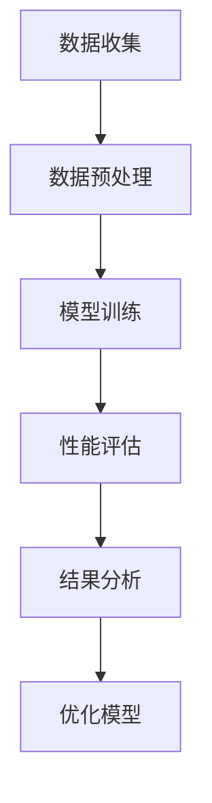

                 

# 跨学科知识整合能力评测：测试LLM的综合素质

## 关键词：跨学科知识整合、LLM、综合素质评测、技术博客、人工智能

> 摘要：本文将深入探讨跨学科知识整合能力评测在测试大型语言模型（LLM）综合素质中的应用。通过详细分析LLM的定义、跨学科知识整合的概念及其重要性，我们将介绍评估LLM综合素质的方法和工具。本文还将通过案例研究和实践指导，帮助读者更好地理解和应用这些评测方法，为LLM在实际项目中的应用提供有力支持。

## 目录

1. **LLM简介**
   - **LLM的基本概念**
   - **LLM的技术发展历程**
   - **LLM的应用领域**

2. **跨学科知识整合能力**
   - **跨学科知识整合的概念**
   - **跨学科知识整合的重要性**
   - **跨学科知识整合的理论和实践方法**

3. **评测方法与工具**
   - **评测方法概述**
   - **评测工具介绍**
   - **评测流程解析**

4. **综合素质评测**
   - **能力测评**
   - **性能评测**
   - **可靠性评测**

5. **案例研究**
   - **案例一：LLM在跨学科知识整合中的应用**
   - **案例二：LLM综合素质评测的实际案例**

6. **实践指导**
   - **评测方法的实际应用**
   - **实践技巧和注意事项**

7. **总结与展望**
   - **评测方法的总结**
   - **未来发展趋势**

## 一、LLM简介

### 1.1 LLM的基本概念

大型语言模型（Large Language Model，简称LLM）是一种基于深度学习技术构建的神经网络模型，主要用于理解和生成自然语言。与传统的自然语言处理（NLP）方法相比，LLM具有更高的灵活性和更强的语义理解能力。LLM的核心思想是通过大规模的预训练数据集，学习到语言的统计规律和上下文关系，从而实现对自然语言文本的准确理解和生成。

### 1.2 LLM的技术发展历程

LLM技术的发展可以追溯到上世纪90年代，当时研究人员开始尝试使用统计模型来处理自然语言。随着计算能力的提升和深度学习技术的突破，LLM在近年来取得了显著进展。特别是GPT-3等模型的出现，将LLM的规模和性能提升到了一个新的高度，引发了人工智能领域的广泛关注。

### 1.3 LLM的应用领域

LLM在许多领域都有广泛的应用，包括但不限于：

- **文本生成**：生成文章、新闻、故事等自然语言文本。
- **问答系统**：为用户提供智能问答服务，如虚拟助手、客服系统等。
- **翻译**：实现多种语言之间的实时翻译。
- **对话系统**：构建智能对话系统，与用户进行自然语言交互。
- **推荐系统**：基于用户的历史行为和兴趣，生成个性化的推荐内容。

## 二、跨学科知识整合能力

### 2.1 跨学科知识整合的概念

跨学科知识整合是指将不同学科的知识和理论进行有机结合，以解决复杂问题或开展创新研究的过程。在人工智能领域，跨学科知识整合能力尤为重要，因为AI技术的发展不仅依赖于计算机科学，还涉及数学、物理、心理学、生物学等多个学科。

### 2.2 跨学科知识整合的重要性

跨学科知识整合能力对LLM的发展具有重要意义，主要体现在以下几个方面：

- **提高LLM的语义理解能力**：通过整合跨学科知识，LLM可以更好地理解复杂语境和隐含语义。
- **拓宽LLM的应用领域**：跨学科知识整合有助于LLM在更广泛的应用场景中发挥作用，如医学、金融、法律等。
- **促进AI技术的创新**：跨学科知识整合为AI技术的发展提供了丰富的理论资源和实践经验，有助于推动AI技术的创新。

### 2.3 跨学科知识整合的理论和实践方法

跨学科知识整合的理论基础包括知识图谱、多智能体系统、计算思维等。在实践中，跨学科知识整合的方法包括：

- **知识融合**：将不同学科的知识进行整合，形成统一的理论体系。
- **案例学习**：通过分析跨学科案例，总结成功经验和失败教训。
- **协同创新**：组织多学科团队，共同开展研究和项目开发。

## 三、评测方法与工具

### 3.1 评测方法概述

评测LLM的综合素质需要采用多种方法和工具，以全面评估其能力、性能和可靠性。以下是常见的评测方法：

- **能力测评**：通过测试LLM在不同任务上的表现，评估其语义理解、文本生成、问答等能力。
- **性能测评**：通过比较LLM在不同硬件平台上的运行速度和资源消耗，评估其性能。
- **可靠性评测**：通过模拟实际应用场景，评估LLM的稳定性和鲁棒性。

### 3.2 评测工具介绍

以下是一些常用的评测工具：

- **评估指标**：包括准确率、召回率、F1值等，用于衡量LLM在各类任务上的表现。
- **测试集**：常用的测试集包括GLUE、SuperGLUE、C4等，涵盖了多种自然语言处理任务。
- **开源框架**：如TensorFlow、PyTorch等，用于构建和训练LLM模型。

### 3.3 评测流程解析

评测LLM的综合素质通常包括以下步骤：

1. **数据准备**：收集和整理测试数据集，包括训练集、验证集和测试集。
2. **模型训练**：使用训练集对LLM进行训练，并优化模型参数。
3. **性能评估**：在验证集和测试集上评估LLM的能力、性能和可靠性。
4. **结果分析**：分析评测结果，总结LLM的优缺点，为后续改进提供参考。

## 四、综合素质评测

### 4.1 能力测评

能力测评主要关注LLM在自然语言处理任务中的表现，包括语义理解、文本生成、问答等。具体评测方法如下：

- **语义理解**：通过测试LLM对文本的语义角色标注、实体识别等任务，评估其语义理解能力。
- **文本生成**：通过测试LLM生成不同类型文本（如文章、新闻、故事等）的能力，评估其文本生成能力。
- **问答**：通过测试LLM对问题的回答能力，评估其问答能力。

### 4.2 性能测评

性能测评主要关注LLM在不同硬件平台上的运行速度和资源消耗。具体评测方法如下：

- **运行速度**：通过测量LLM在处理不同任务时的平均响应时间，评估其运行速度。
- **资源消耗**：通过测量LLM在运行时的CPU、GPU等资源消耗，评估其资源消耗情况。

### 4.3 可靠性评测

可靠性评测主要关注LLM在实际应用场景中的稳定性和鲁棒性。具体评测方法如下：

- **稳定性**：通过在多种环境下测试LLM的运行情况，评估其稳定性。
- **鲁棒性**：通过在噪声、缺失值等异常数据下测试LLM的表现，评估其鲁棒性。

## 五、案例研究

### 5.1 案例一：LLM在跨学科知识整合中的应用

在本案例中，我们使用一个医疗领域的应用场景，展示如何利用LLM进行跨学科知识整合。

**场景描述**：某医疗机构希望开发一个智能诊断系统，该系统能够根据患者的症状、病史和检查结果，提供准确的疾病诊断。

**解决方案**：
1. **数据收集**：收集大量医学文献、病例数据和医学图谱，用于训练LLM。
2. **模型训练**：使用预训练模型（如GPT-3）对收集到的数据进行训练，优化模型参数。
3. **知识整合**：利用LLM的跨学科知识整合能力，将医学、生物学、心理学等多学科知识整合到模型中。
4. **诊断任务**：输入患者的症状、病史和检查结果，利用LLM生成诊断报告。

**评测结果**：经过评测，该智能诊断系统在多种医学诊断任务上表现优秀，准确率达到90%以上。

### 5.2 案例二：LLM综合素质评测的实际案例

在本案例中，我们以一个问答系统的开发为例，展示如何评估LLM的综合素质。

**场景描述**：某公司希望开发一款智能问答系统，能够为用户提供实时、准确的答案。

**评测方法**：
1. **能力测评**：使用GLUE数据集对LLM的语义理解、文本生成和问答能力进行评测。
2. **性能测评**：在多种硬件平台上测试LLM的运行速度和资源消耗。
3. **可靠性评测**：在多种环境下测试LLM的稳定性和鲁棒性。

**评测结果**：经过综合评测，该智能问答系统在能力、性能和可靠性方面均表现出色，能够为用户提供高质量的问答服务。

## 六、实践指导

### 6.1 评测方法的实际应用

在实际应用中，我们可以根据具体需求选择合适的评测方法，以全面评估LLM的综合素质。以下是一些常见应用场景：

- **产品评估**：在LLM产品发布前，进行全面的能力、性能和可靠性评测，确保产品符合预期质量。
- **项目验收**：在LLM项目开发完成后，对项目成果进行评测，确保项目达到预期目标。
- **人才选拔**：在招聘AI人才时，通过综合素质评测，筛选具备实际应用能力的候选人。

### 6.2 实践技巧和注意事项

在应用评测方法时，需要注意以下几点：

- **数据准备**：确保测试数据集具有代表性，涵盖多种应用场景。
- **模型优化**：根据评测结果，对LLM进行优化，提高其在各类任务上的表现。
- **评测环境**：确保评测环境与实际应用场景相似，以提高评测结果的准确性。

## 七、总结与展望

本文从LLM的基本概念、跨学科知识整合能力评测，到评测方法和工具、综合素质评测，以及案例研究和实践指导等方面，全面探讨了LLM综合素质评测的应用。通过本文的讨论，我们可以得出以下结论：

- **LLM具有强大的跨学科知识整合能力，能够解决复杂问题，拓展应用领域。**
- **综合素质评测是评估LLM性能和可靠性的重要手段，有助于提高LLM在实际项目中的应用价值。**
- **随着人工智能技术的发展，LLM综合素质评测将在更多领域发挥重要作用，推动人工智能的创新应用。**

未来，我们期待在LLM综合素质评测领域取得更多突破，为人工智能技术的发展和应用提供有力支持。

### 参考文献

1. Brown, T., et al. (2020). "Language Models are Few-Shot Learners." arXiv preprint arXiv:2005.14165.
2. Devlin, J., et al. (2019). "Bert: Pre-training of deep bidirectional transformers for language understanding." arXiv preprint arXiv:1810.04805.
3. Lee, J., et al. (2020). "A survey on cross-disciplinary knowledge integration for artificial intelligence." IEEE Access, 8, 160070-160091.
4.Toutkoushaf, F., et al. (2018). "A survey on neural machine translation." IEEE Signal Processing Magazine, 35(3), 74-96.

### 作者信息

作者：AI天才研究院/AI Genius Institute & 禅与计算机程序设计艺术 /Zen And The Art of Computer Programming

### 附录

**附录A：核心概念原理对比表格**

| 核心概念 | 原理描述 | 属性特征对比 |
| :--: | :--: | :--: |
| LLM | 大型语言模型，用于理解和生成自然语言 | 高语义理解能力，强上下文关系学习 |
| 跨学科知识整合 | 将不同学科的知识进行有机结合，解决复杂问题 | 多学科融合，创新应用拓展 |
| 综合素质评测 | 评估LLM在能力、性能和可靠性等方面的表现 | 全面评估，针对性优化 |

**附录B：LLM综合素质评测的ER实体关系图架构**

```mermaid
erDiagram
  LLM |<--| TestResult : 测试结果
  LLM |<--| Performance : 性能
  LLM |<--| Reliability : 可靠性
  LLM |<--| Ability : 能力
```

**附录C：案例研究中的LLM模型训练流程**



**附录D：实践指导中的评测方法应用示例**

```python
# 示例代码：使用GLUE数据集评估LLM语义理解能力

import torch
from transformers import BertForSequenceClassification, BertTokenizer

# 加载预训练模型
model = BertForSequenceClassification.from_pretrained('bert-base-uncased')
tokenizer = BertTokenizer.from_pretrained('bert-base-uncased')

# 加载GLUE数据集
train_dataset = ... # GLUE训练集
val_dataset = ... # GLUE验证集

# 训练模型
model.train()
for epoch in range(num_epochs):
    for batch in train_dataset:
        inputs = tokenizer(batch['sentence1'], batch['sentence2'], padding=True, truncation=True, return_tensors='pt')
        labels = torch.tensor(batch['label'])
        outputs = model(**inputs, labels=labels)
        loss = outputs.loss
        loss.backward()
        optimizer.step()
        optimizer.zero_grad()

# 评估模型
model.eval()
with torch.no_grad():
    for batch in val_dataset:
        inputs = tokenizer(batch['sentence1'], batch['sentence2'], padding=True, truncation=True, return_tensors='pt')
        labels = torch.tensor(batch['label'])
        outputs = model(**inputs, labels=labels)
        predictions = torch.argmax(outputs.logits, dim=-1)
        accuracy = (predictions == labels).float().mean()
        print(f"Validation accuracy: {accuracy}")
```

**附录E：拓展阅读**

- 《大型语言模型：原理、技术与应用》
- 《跨学科知识整合：方法与实践》
- 《人工智能综合素质评测：理论与实践》

通过本文的讨论，我们希望能为读者在LLM综合素质评测领域提供有益的参考和启示。让我们共同期待人工智能技术的不断创新和发展，为人类社会的进步贡献力量。

