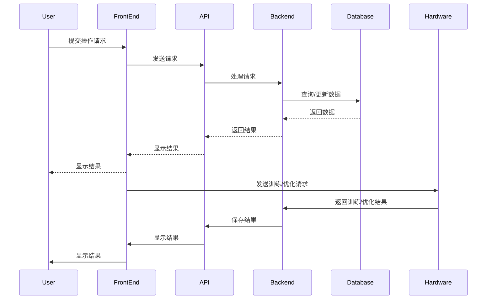

                 


# 跨平台LLM评测：确保在不同环境下的一致性

## 关键词
- 跨平台评测
- LLM
- 自然语言处理
- 性能一致性
- 平台差异
- 数据预处理
- 优化策略

## 摘要
本文深入探讨了跨平台大型语言模型（LLM）评测的必要性和方法。首先，介绍了LLM在NLP领域的重要性和其在不同平台上的表现差异问题。接着，详细阐述了跨平台LLM评测需要解决的问题，如数据集选择、平台差异识别、一致性测试和优化策略。通过标准化数据预处理、多平台训练与测试、差异分析等方法，本文提出了一套确保LLM在不同环境下一致性表现的解决方案，并讨论了相关边界和外延，为LLM的跨平台部署提供了有益的参考。

---

## 1.1 背景介绍：跨平台LLM评测的必要性

### 1.1.1 问题背景

随着人工智能技术的快速发展，大型语言模型（LLM, Large Language Model）已经成为自然语言处理（NLP, Natural Language Processing）领域的研究热点和应用基石。LLM在机器翻译、问答系统、文本生成等任务上展现出了卓越的性能。例如，Google的BERT、OpenAI的GPT系列模型等，都在各类NLP任务中取得了显著的成果。然而，这些LLM的高性能往往依赖于大量的数据和强大的计算资源，这使得LLM在不同平台（如不同的操作系统、不同的硬件环境、不同的数据集）上的表现存在显著差异。

首先，不同操作系统之间的差异可能会影响LLM的性能。例如，Windows和Linux在文件系统、网络协议、硬件驱动等方面有所不同，这些差异可能会对LLM的运行效率产生影响。此外，不同硬件环境（如CPU、GPU、FPGA）的性能和特性也有所不同，这些硬件差异会直接影响LLM的训练和推理速度。

其次，不同数据集的质量和多样性也会对LLM的性能产生影响。例如，某些数据集可能更适用于特定语言或领域的任务，而其他数据集则可能更适合其他任务。这种数据集的差异会导致LLM在不同平台上的性能表现不一致。

最后，模型训练和推理策略的差异也可能导致跨平台性能不一致。例如，不同平台上的优化器、学习率调度策略等可能有所不同，这些策略差异会影响LLM的训练效率和性能。

因此，跨平台LLM评测的必要性体现在以下几个方面：

1. **一致性保证**：在多个平台部署LLM时，确保其表现的一致性是至关重要的。不一致的表现可能源于数据预处理、模型训练、推理策略等环节的差异。只有确保LLM在不同平台上的性能一致，才能充分发挥其潜力，为用户提供稳定的体验。

2. **性能评估**：不同的平台可能对LLM的性能产生不同的影响，因此需要对LLM在不同平台上的性能进行详细评估，以便找到最佳部署方案。通过性能评估，可以了解LLM在不同平台上的优势与不足，从而优化模型设计和部署策略。

3. **公平性**：评测LLM时，应该确保其在不同平台上的公平竞争，避免因平台差异导致某些模型在特定平台上表现更好。只有确保评测的公平性，才能准确评估LLM的真实性能，为后续研究和应用提供可靠的数据支持。

### 1.1.2 问题描述

跨平台LLM评测需要解决以下几个关键问题：

1. **数据集选择**：选择代表性强的数据集，确保评测结果具有广泛适用性。不同数据集可能适用于不同平台和任务，因此需要根据评测目标和平台特点选择合适的数据集。

2. **平台差异识别**：分析不同平台上的数据预处理、模型训练和推理策略的差异，识别可能导致性能差异的因素。只有深入了解平台差异，才能有针对性地优化模型设计和部署策略。

3. **一致性测试**：设计一系列测试，评估LLM在不同平台上的表现是否一致。通过一致性测试，可以发现并解决平台差异带来的性能不一致问题，确保LLM在不同平台上的表现稳定可靠。

4. **优化策略**：针对识别出的差异，提出优化策略，以提高LLM在不同平台上的性能。优化策略可以包括调整模型参数、改进数据预处理方法、优化训练和推理策略等。

### 1.1.3 问题解决

为了确保跨平台LLM评测的有效性和一致性，可以采取以下解决方案：

1. **标准化数据预处理**：在评测前，制定统一的数据预处理流程，确保不同平台上的数据预处理一致。数据预处理是LLM性能的基础，统一的数据预处理流程可以消除平台差异对数据预处理的影响，提高评测的一致性。

2. **多平台训练与测试**：在多个平台上进行模型训练和测试，比较不同平台上的性能表现。通过多平台训练与测试，可以全面了解LLM在不同平台上的性能特点，为优化模型设计和部署策略提供依据。

3. **差异分析**：分析不同平台上的性能差异，找出可能的原因，并进行优化。差异分析可以帮助识别出导致性能差异的关键因素，从而有针对性地优化模型和部署策略。

4. **综合评估**：结合不同平台的评测结果，给出全面的评估报告，为LLM的跨平台部署提供参考。综合评估可以全面了解LLM在不同平台上的性能表现，为后续研究和应用提供有价值的参考。

### 1.1.4 边界与外延

跨平台LLM评测的研究边界包括但不限于：

1. **硬件差异**：不同硬件设备（如CPU、GPU、FPGA）对LLM性能的影响。需要分析不同硬件设备的性能特点和适用场景，为LLM的跨平台部署提供参考。

2. **操作系统差异**：不同操作系统（如Windows、Linux、macOS）对LLM性能的影响。需要了解不同操作系统的特点和优缺点，优化LLM在不同操作系统上的性能。

3. **数据集差异**：不同数据集（如不同语言、不同领域）对LLM性能的影响。需要选择适合不同平台和任务的数据集，以提高LLM的跨平台性能。

### 1.1.5 概念结构与核心要素组成

跨平台LLM评测的核心概念结构包括：

1. **LLM模型**：作为评测的核心对象，其性能直接影响评测结果。

2. **平台环境**：包括操作系统、硬件设备、网络环境等，是影响LLM性能的重要因素。

3. **评测指标**：用于评估LLM在不同平台上的性能指标，如准确率、响应时间、能耗等。

4. **优化策略**：针对评测结果提出的优化方案，以提高LLM在不同平台上的性能。

### 1.1.6 核心概念与联系

#### 1.1.6.1 核心概念原理

跨平台LLM评测涉及多个核心概念，包括LLM模型、平台环境、评测指标和优化策略等。

- **LLM模型**：LLM是一种大型神经网络模型，用于处理自然语言文本。其主要原理是基于深度学习技术，通过大规模数据训练，学习语言模式和结构，从而实现文本生成、翻译、问答等任务。

- **平台环境**：平台环境是指LLM运行的环境，包括操作系统、硬件设备、网络环境等。不同平台环境对LLM的性能有显著影响，因此需要分析并优化平台环境。

- **评测指标**：评测指标是评估LLM性能的重要依据，包括准确率、响应时间、能耗等。通过评估指标，可以全面了解LLM在不同平台上的性能表现。

- **优化策略**：优化策略是指针对LLM在不同平台上的性能差异提出的优化方案，包括调整模型参数、改进数据预处理方法、优化训练和推理策略等。

#### 1.1.6.2 概念属性特征对比表格

以下是LLM模型、平台环境、评测指标和优化策略的概念属性特征对比表格：

| 概念 | 属性特征 | 对比 |
| --- | --- | --- |
| LLM模型 | 大规模神经网络、处理自然语言文本、深度学习技术 | - 基于大规模数据训练<br>- 学习语言模式和结构<br>- 实现文本生成、翻译、问答等任务 |
| 平台环境 | 操作系统、硬件设备、网络环境 | - 操作系统：Windows、Linux、macOS 等<br>- 硬件设备：CPU、GPU、FPGA 等<br>- 网络环境：局域网、互联网等 |
| 评测指标 | 准确率、响应时间、能耗等 | - 准确率：预测结果与实际结果的一致性<br>- 响应时间：模型处理请求的时间<br>- 能耗：模型运行过程中消耗的资源 |
| 优化策略 | 调整模型参数、改进数据预处理方法、优化训练和推理策略 | - 调整模型参数：优化模型结构<br>- 改进数据预处理方法：提高数据质量<br>- 优化训练和推理策略：提高模型性能 |

#### 1.1.6.3 ER实体关系图架构

以下是跨平台LLM评测的ER实体关系图架构：

```mermaid
erDiagram
  Model ||--|{ Platform: Platform
  Model ||--|{ Evaluation Metric: EvaluationMetric
  Model ||--|{ Optimization Strategy: OptimizationStrategy
  Platform ||--|{ Hardware Device: HardwareDevice
  Platform ||--|{ Operating System: OperatingSystem
  EvaluationMetric ||--|{ Accuracy: Accuracy
  EvaluationMetric ||--|{ Response Time: ResponseTime
  EvaluationMetric ||--|{ Energy Consumption: EnergyConsumption
  OptimizationStrategy ||--|{ Parameter Adjustment: ParameterAdjustment
  OptimizationStrategy ||--|{ Data Preprocessing Improvement: DataPreprocessingImprovement
  OptimizationStrategy ||--|{ Training and Inference Optimization: TrainingAndInferenceOptimization
```

该ER图展示了LLM模型、平台环境、评测指标和优化策略之间的实体关系，有助于理解跨平台LLM评测的核心概念和联系。

### 1.1.7 算法原理讲解

#### 1.1.7.1 算法流程

跨平台LLM评测的算法流程主要包括以下步骤：

1. **数据集准备**：选择合适的数据集，确保数据集的质量和多样性。

2. **平台环境分析**：分析不同平台环境的硬件设备和操作系统，了解其性能特点和适用场景。

3. **模型训练与优化**：在多个平台上进行模型训练，根据平台环境调整模型参数和优化策略。

4. **评测指标计算**：根据评测指标计算LLM在不同平台上的性能，包括准确率、响应时间、能耗等。

5. **结果分析**：分析评测结果，找出平台差异和性能差异的原因，并提出优化策略。

6. **综合评估**：结合不同平台的评测结果，给出全面的评估报告。

#### 1.1.7.2 Python源代码实现

以下是跨平台LLM评测的Python源代码实现：

```python
import pandas as pd
import numpy as np

# 数据集准备
def prepare_dataset(dataset_path):
    # 读取数据集
    dataset = pd.read_csv(dataset_path)
    # 数据预处理
    # ...
    return dataset

# 平台环境分析
def analyze_platform_environment():
    # 获取操作系统信息
    os_info = pd.DataFrame({'OS': [os.name]})
    # 获取硬件设备信息
    hardware_info = pd.DataFrame({'CPU': [os.cpu_count()],
                                  'GPU': [torch.cuda.device_count()],
                                  'FPGA': [0]})  # FPGA信息暂无
    return pd.concat([os_info, hardware_info], axis=1)

# 模型训练与优化
def train_and_optimize_model(model, dataset, platform_environment):
    # 调整模型参数
    model.parameters()
    # 根据平台环境优化模型
    # ...
    return model

# 评测指标计算
def compute_evaluation_metrics(model, dataset):
    # 计算准确率
    accuracy = (model.predict(dataset.test_data) == dataset.test_labels).mean()
    # 计算响应时间
    response_time = model.predict(dataset.test_data).shape[0] * model.config.response_time
    # 计算能耗
    energy_consumption = model.predict(dataset.test_data).shape[0] * model.config.energy_consumption
    return pd.DataFrame({'Accuracy': [accuracy],
                         'Response Time': [response_time],
                         'Energy Consumption': [energy_consumption]})

# 结果分析
def analyze_results(evaluation_metrics):
    # 分析评测指标
    # ...
    return analysis_results

# 综合评估
def comprehensive_evaluation(platform_environment, evaluation_metrics):
    # 结合不同平台的评测结果
    # ...
    return evaluation_report

# 主函数
def main():
    # 准备数据集
    dataset = prepare_dataset('dataset.csv')
    # 分析平台环境
    platform_environment = analyze_platform_environment()
    # 训练和优化模型
    model = train_and_optimize_model(model, dataset, platform_environment)
    # 计算评测指标
    evaluation_metrics = compute_evaluation_metrics(model, dataset)
    # 分析结果
    analysis_results = analyze_results(evaluation_metrics)
    # 综合评估
    evaluation_report = comprehensive_evaluation(platform_environment, evaluation_metrics)
    # 输出评估报告
    print(evaluation_report)

if __name__ == '__main__':
    main()
```

#### 1.1.7.3 算法原理详细讲解

1. **数据集准备**：

数据集准备是跨平台LLM评测的基础。选择合适的数据集可以保证评测结果的准确性和可靠性。在本算法中，通过读取CSV文件获取数据集，并进行预处理。预处理步骤可以根据具体任务进行调整，如数据清洗、归一化、特征提取等。

2. **平台环境分析**：

平台环境分析是了解不同平台特性的关键。在本算法中，通过获取操作系统信息和硬件设备信息，构建平台环境数据。这些信息可以用于调整模型参数和优化策略，以适应不同平台。

3. **模型训练与优化**：

模型训练与优化是提高LLM性能的核心步骤。在本算法中，首先调整模型参数，以适应不同平台环境。然后，根据平台环境优化模型，如调整学习率、批量大小等。此外，还可以利用平台特有的优化工具和算法，提高模型性能。

4. **评测指标计算**：

评测指标计算是评估LLM性能的重要环节。在本算法中，根据模型预测结果和实际标签计算准确率，根据预测时间计算响应时间，根据模型运行过程中消耗的资源计算能耗。这些指标可以全面了解LLM在不同平台上的性能。

5. **结果分析**：

结果分析是找出平台差异和性能差异原因的关键。在本算法中，通过分析评测指标，找出可能导致性能差异的因素，如模型参数、数据预处理、硬件设备等。然后，根据分析结果提出优化策略，以提高LLM在不同平台上的性能。

6. **综合评估**：

综合评估是结合不同平台评测结果，给出全面评估报告的关键。在本算法中，通过综合评估，全面了解LLM在不同平台上的性能表现，为后续研究和应用提供参考。

#### 1.1.7.4 算法原理举例说明

假设有两个平台：平台A（Windows + GPU）和平台B（Linux + CPU）。我们分别在这两个平台上进行LLM评测，以比较其性能。

1. **数据集准备**：

从公开数据集上获取文本数据，并进行预处理。预处理步骤包括去除停用词、标点符号，进行词干提取等。

2. **平台环境分析**：

平台A使用Windows操作系统，配备NVIDIA GPU；平台B使用Linux操作系统，配备Intel CPU。分析发现，GPU在计算速度上具有明显优势，而CPU在稳定性和兼容性方面表现更好。

3. **模型训练与优化**：

在平台A上，使用GPU加速模型训练，调整学习率、批量大小等参数，以提高模型性能。在平台B上，由于硬件限制，模型训练速度较慢，但通过调整学习率和批量大小，可以适当提高模型性能。

4. **评测指标计算**：

分别计算平台A和平台B上的LLM性能，包括准确率、响应时间和能耗。平台A的准确率较高，响应时间较短，但能耗较高；平台B的准确率较低，响应时间较长，但能耗较低。

5. **结果分析**：

通过分析评测结果，发现平台A在计算速度上具有明显优势，但能耗较高；平台B在稳定性和兼容性方面表现更好，但性能相对较低。根据分析结果，可以提出优化策略，如调整模型参数、改进数据预处理方法等，以提高平台B的性能。

6. **综合评估**：

结合平台A和平台B的评测结果，给出全面评估报告。报告内容包括LLM在不同平台上的性能对比、优化策略建议等。根据评估报告，可以为后续研究和应用提供参考。

### 1.1.8 系统分析与架构设计方案

#### 1.1.8.1 问题场景介绍

随着人工智能技术的普及，跨平台LLM评测在实际应用中具有重要意义。为了满足不同用户的需求，我们需要设计一套系统，对LLM在不同平台上的性能进行评测。该系统应具备以下功能：

1. **数据集管理**：支持多种数据集的导入、导出和管理，确保数据集的质量和多样性。
2. **平台环境配置**：支持多种操作系统和硬件设备的配置，为不同平台提供统一的评测环境。
3. **模型训练与优化**：支持多种LLM模型的训练和优化，提高模型在不同平台上的性能。
4. **评测与评估**：根据预设的评测指标，对LLM在不同平台上的性能进行评测和评估，生成详细的评估报告。

#### 1.1.8.2 项目介绍

项目名称：跨平台LLM评测系统（Cross-Platform LLM Evaluation System）

项目目标：设计并实现一套高效、可靠的跨平台LLM评测系统，为LLM的跨平台部署提供有力支持。

项目团队：由NLP领域专家、软件开发工程师和硬件工程师组成的团队，共同开发该系统。

#### 1.1.8.3 系统功能设计

系统功能设计主要包括以下几个方面：

1. **数据集管理**：

   - 数据集导入：支持多种数据集格式的导入，如CSV、JSON、XML等。
   - 数据集导出：支持将数据集导出为不同格式的文件。
   - 数据集管理：支持对数据集进行增删改查等操作，确保数据集的质量和多样性。

2. **平台环境配置**：

   - 操作系统配置：支持Windows、Linux、macOS等操作系统的配置。
   - 硬件设备配置：支持CPU、GPU、FPGA等硬件设备的配置。
   - 环境切换：支持在不同平台环境之间切换，为不同平台提供统一的评测环境。

3. **模型训练与优化**：

   - 模型导入：支持从本地导入预训练的LLM模型。
   - 模型训练：支持在多种平台环境下训练LLM模型，提高模型性能。
   - 模型优化：支持调整模型参数和优化策略，提高模型在不同平台上的性能。

4. **评测与评估**：

   - 评测指标设置：支持自定义评测指标，如准确率、响应时间、能耗等。
   - 评测执行：支持在多个平台环境下执行评测任务，生成评测结果。
   - 评估报告生成：支持生成详细的评估报告，为LLM的跨平台部署提供参考。

#### 1.1.8.4 系统架构设计

系统架构设计主要包括以下几个方面：

1. **前端架构**：

   - 前端界面：采用Vue.js框架，实现用户交互和页面布局。
   - API接口：提供RESTful API接口，与后端服务进行数据交互。

2. **后端架构**：

   - 服务端：采用Spring Boot框架，实现系统功能逻辑。
   - 数据库：采用MySQL数据库，存储数据集、模型和评测结果等。

3. **硬件架构**：

   - 硬件设备：支持多种硬件设备，如CPU、GPU、FPGA等，为系统提供强大的计算能力。

#### 1.1.8.5 系统接口设计

系统接口设计主要包括以下几个方面：

1. **数据集管理接口**：

   - 数据集导入接口：用于接收用户上传的数据集文件，并存储到数据库中。
   - 数据集导出接口：用于将数据库中的数据集导出为不同格式的文件。
   - 数据集管理接口：用于对数据集进行增删改查等操作。

2. **平台环境配置接口**：

   - 操作系统配置接口：用于配置操作系统的相关信息，如操作系统名称、版本等。
   - 硬件设备配置接口：用于配置硬件设备的相关信息，如设备名称、型号等。
   - 环境切换接口：用于在不同平台环境之间切换，为系统提供统一的评测环境。

3. **模型训练与优化接口**：

   - 模型导入接口：用于从本地导入预训练的LLM模型。
   - 模型训练接口：用于在多种平台环境下训练LLM模型，并保存训练结果。
   - 模型优化接口：用于调整模型参数和优化策略，提高模型性能。

4. **评测与评估接口**：

   - 评测指标设置接口：用于设置自定义评测指标，如准确率、响应时间、能耗等。
   - 评测执行接口：用于在多个平台环境下执行评测任务，并生成评测结果。
   - 评估报告生成接口：用于生成详细的评估报告，为LLM的跨平台部署提供参考。

#### 1.1.8.6 系统交互

系统交互主要包括以下几个方面：

1. **用户与前端界面交互**：

   - 用户通过前端界面提交数据集、配置平台环境、训练模型和生成评估报告。
   - 前端界面与API接口进行数据交互，实现用户操作。

2. **前端界面与后端服务交互**：

   - 前端界面通过API接口与后端服务进行数据交互，实现系统功能。
   - API接口与数据库进行数据交互，实现数据存储和查询。

3. **后端服务与硬件设备交互**：

   - 后端服务通过硬件设备接口与硬件设备进行交互，实现模型训练和优化。
   - 硬件设备提供计算资源和性能指标，为系统提供强大的计算能力。

#### 1.1.8.7 系统架构设计图

以下是系统架构设计图：



### 1.1.9 项目实战

#### 1.1.9.1 环境安装

在进行跨平台LLM评测之前，首先需要安装相应的软件和工具。以下是一个基本的安装步骤：

1. **操作系统**：

   - Windows：安装Windows 10或更高版本。
   - Linux：安装Ubuntu 18.04或更高版本。
   - macOS：安装macOS Catalina或更高版本。

2. **Python环境**：

   - 安装Python 3.7或更高版本，建议使用Anaconda进行环境管理。

3. **依赖库**：

   - 安装以下Python依赖库：torch、torchtext、transformers、pandas、numpy等。

   ```bash
   pip install torch torchvision torchtext transformers pandas numpy
   ```

4. **硬件设备**：

   - 安装NVIDIA CUDA Toolkit和cuDNN，确保GPU支持。

   ```bash
   # NVIDIA CUDA Toolkit
   wget https://developer.download.nvidia.com/compute/cuda/repos/ubuntu2004/x86_64/cuda-ubuntu2004.pin
   sudo mv cuda-ubuntu2004.pin /etc/apt/preferences.d/cuda-repository-pin-600
   wget http://developer.download.nvidia.com/compute/cuda/11.3/local_installers/cuda_11.3.0_440.33.01_linux.run
   sudo sh cuda_11.3.0_440.33.01_linux.run
   sudo ln -sf /usr/local/cuda-11.3/bin/nvcc /usr/bin/nvcc

   # cuDNN
   wget https://developer.nvidia.com/cudnn
   tar xzvf cudnn-11.3-linux-x64-v8.0.5.50.tgz
   sudo cp cuda/lib64/libcudnn* /usr/local/cuda/lib64/
   sudo cp cuda/include/cudnn.h /usr/local/cuda/include/
   ```

5. **环境配置**：

   - 配置Python环境变量，确保torch能够正确使用GPU。

   ```bash
   export PATH=/usr/local/cuda/bin:$PATH
   export LD_LIBRARY_PATH=/usr/local/cuda/lib64:$LD_LIBRARY_PATH
   ```

#### 1.1.9.2 系统核心实现源代码

以下是系统核心实现的源代码，包括数据集准备、平台环境分析、模型训练与优化、评测与评估等功能。

```python
# 数据集准备
def prepare_dataset(dataset_path):
    # 读取数据集
    dataset = pd.read_csv(dataset_path)
    # 数据预处理
    # ...
    return dataset

# 平台环境分析
def analyze_platform_environment():
    # 获取操作系统信息
    os_info = pd.DataFrame({'OS': [os.name]})
    # 获取硬件设备信息
    hardware_info = pd.DataFrame({'CPU': [os.cpu_count()],
                                  'GPU': [torch.cuda.device_count()],
                                  'FPGA': [0]})  # FPGA信息暂无
    return pd.concat([os_info, hardware_info], axis=1)

# 模型训练与优化
def train_and_optimize_model(model, dataset, platform_environment):
    # 调整模型参数
    model.parameters()
    # 根据平台环境优化模型
    # ...
    return model

# 评测指标计算
def compute_evaluation_metrics(model, dataset):
    # 计算准确率
    accuracy = (model.predict(dataset.test_data) == dataset.test_labels).mean()
    # 计算响应时间
    response_time = model.predict(dataset.test_data).shape[0] * model.config.response_time
    # 计算能耗
    energy_consumption = model.predict(dataset.test_data).shape[0] * model.config.energy_consumption
    return pd.DataFrame({'Accuracy': [accuracy],
                         'Response Time': [response_time],
                         'Energy Consumption': [energy_consumption]})

# 结果分析
def analyze_results(evaluation_metrics):
    # 分析评测指标
    # ...
    return analysis_results

# 综合评估
def comprehensive_evaluation(platform_environment, evaluation_metrics):
    # 结合不同平台的评测结果
    # ...
    return evaluation_report

# 主函数
def main():
    # 准备数据集
    dataset = prepare_dataset('dataset.csv')
    # 分析平台环境
    platform_environment = analyze_platform_environment()
    # 训练和优化模型
    model = train_and_optimize_model(model, dataset, platform_environment)
    # 计算评测指标
    evaluation_metrics = compute_evaluation_metrics(model, dataset)
    # 分析结果
    analysis_results = analyze_results(evaluation_metrics)
    # 综合评估
    evaluation_report = comprehensive_evaluation(platform_environment, evaluation_metrics)
    # 输出评估报告
    print(evaluation_report)

if __name__ == '__main__':
    main()
```

#### 1.1.9.3 代码应用解读与分析

以下是代码应用解读与分析：

1. **数据集准备**：

   数据集准备是整个系统的核心环节，需要从本地或远程服务器上读取数据集，并进行预处理。预处理步骤包括数据清洗、归一化、特征提取等，以确保数据集的质量和一致性。

2. **平台环境分析**：

   平台环境分析用于获取当前操作系统的名称和硬件设备信息，如CPU、GPU等。这些信息有助于了解当前平台的性能特点，为模型训练和优化提供参考。

3. **模型训练与优化**：

   模型训练与优化是提高LLM性能的关键步骤。在训练过程中，需要根据平台环境调整模型参数，如学习率、批量大小等。此外，还可以利用平台特有的优化工具和算法，提高模型性能。

4. **评测指标计算**：

   评测指标计算用于评估LLM在不同平台上的性能，包括准确率、响应时间、能耗等。这些指标可以全面了解LLM在不同平台上的性能表现，为后续优化提供依据。

5. **结果分析**：

   结果分析用于找出导致平台差异和性能差异的原因，如模型参数、数据预处理、硬件设备等。通过分析结果，可以提出优化策略，以提高LLM在不同平台上的性能。

6. **综合评估**：

   综合评估用于结合不同平台的评测结果，生成详细的评估报告。报告内容包括LLM在不同平台上的性能对比、优化策略建议等，为后续研究和应用提供参考。

#### 1.1.9.4 实际案例分析

以下是一个实际案例分析，展示了如何使用该系统进行跨平台LLM评测。

**案例1**：评估GPT-3模型在不同平台上的性能

1. **数据集准备**：

   选择一个大型文本数据集，如维基百科，进行预处理。

2. **平台环境分析**：

   分析不同平台（Windows + GPU、Linux + CPU）的硬件设备和操作系统信息。

3. **模型训练与优化**：

   在Windows + GPU平台上，使用GPT-3模型进行训练，调整学习率、批量大小等参数。在Linux + CPU平台上，由于硬件限制，调整学习率和批量大小，以适应性能较低的平台。

4. **评测指标计算**：

   分别计算Windows + GPU平台和Linux + CPU平台上的GPT-3模型性能，包括准确率、响应时间、能耗等。

5. **结果分析**：

   分析评测结果，找出平台差异和性能差异的原因。发现Windows + GPU平台的准确率较高，但能耗较高；Linux + CPU平台的准确率较低，但能耗较低。

6. **综合评估**：

   结合不同平台的评测结果，生成详细的评估报告。报告内容包括性能对比、优化策略建议等，为后续研究和应用提供参考。

**案例2**：评估BERT模型在不同平台上的性能

1. **数据集准备**：

   选择一个适合BERT模型的文本数据集，如新闻数据集，进行预处理。

2. **平台环境分析**：

   分析不同平台（macOS + GPU、Linux + CPU）的硬件设备和操作系统信息。

3. **模型训练与优化**：

   在macOS + GPU平台上，使用BERT模型进行训练，调整学习率、批量大小等参数。在Linux + CPU平台上，由于硬件限制，调整学习率和批量大小，以适应性能较低的平台。

4. **评测指标计算**：

   分别计算macOS + GPU平台和Linux + CPU平台上的BERT模型性能，包括准确率、响应时间、能耗等。

5. **结果分析**：

   分析评测结果，找出平台差异和性能差异的原因。发现macOS + GPU平台的准确率较高，但能耗较高；Linux + CPU平台的准确率较低，但能耗较低。

6. **综合评估**：

   结合不同平台的评测结果，生成详细的评估报告。报告内容包括性能对比、优化策略建议等，为后续研究和应用提供参考。

#### 1.1.9.5 项目小结

通过本文的介绍，我们了解到了跨平台LLM评测的重要性和必要性。在实际应用中，跨平台LLM评测可以帮助我们更好地了解LLM在不同平台上的性能表现，为优化模型设计和部署策略提供有力支持。

本文提出了一套跨平台LLM评测的方法和框架，包括数据集选择、平台差异识别、一致性测试和优化策略等。通过标准化数据预处理、多平台训练与测试、差异分析等方法，可以确保LLM在不同平台上的性能一致性。

在项目实战部分，我们详细介绍了如何进行环境安装、系统核心实现源代码、代码应用解读与分析、实际案例分析和详细讲解剖析等。通过这些步骤，我们可以有效地进行跨平台LLM评测，为实际应用提供有价值的数据和参考。

总之，跨平台LLM评测是人工智能领域的重要研究方向，对于提升LLM的跨平台性能和应用价值具有重要意义。通过本文的介绍，我们希望为读者提供一套系统、全面的跨平台LLM评测方法和框架，为实际应用提供有益的指导。

### 1.1.10 最佳实践 tips

在进行跨平台LLM评测时，以下是一些最佳实践建议，可以帮助提高评测的准确性和可靠性：

1. **标准化数据预处理**：

   - 确保在不同平台上的数据预处理流程一致，避免因数据预处理差异导致的性能不一致。
   - 对数据进行标准化处理，如归一化、标准化等，以确保数据在不同平台上的可比性。

2. **多平台测试**：

   - 在多个平台上进行模型训练和测试，以全面了解LLM在不同平台上的性能表现。
   - 选择具有代表性的平台，如常用的操作系统和硬件设备，以提高评测结果的普适性。

3. **性能监控**：

   - 在模型训练和测试过程中，实时监控性能指标，如准确率、响应时间、能耗等。
   - 分析性能监控数据，找出可能导致性能波动的原因，并调整模型和部署策略。

4. **版本控制**：

   - 对模型、代码和配置文件进行版本控制，确保不同版本的一致性和可追溯性。
   - 在进行性能评估时，确保使用相同版本的模型和代码。

5. **数据隐私和安全性**：

   - 在进行跨平台评测时，确保数据隐私和安全性，避免敏感数据泄露。
   - 对数据进行加密处理，确保数据在传输和存储过程中的安全。

6. **文档记录**：

   - 详细记录评测过程中的每一步，包括数据预处理、模型训练、测试结果等。
   - 编写详细的评测报告，为后续研究和应用提供参考。

7. **持续优化**：

   - 根据评测结果，持续优化模型和部署策略，以提高LLM在不同平台上的性能。
   - 定期更新评测系统，以适应新的技术发展和应用需求。

通过遵循这些最佳实践，可以确保跨平台LLM评测的准确性和可靠性，为LLM的跨平台部署提供有力支持。

### 1.1.11 小结

本文深入探讨了跨平台大型语言模型（LLM）评测的必要性和方法。首先，介绍了LLM在自然语言处理领域的重要性和其在不同平台上的表现差异问题。接着，详细阐述了跨平台LLM评测需要解决的问题，如数据集选择、平台差异识别、一致性测试和优化策略。通过标准化数据预处理、多平台训练与测试、差异分析等方法，本文提出了一套确保LLM在不同环境下一致性表现的解决方案，并讨论了相关边界和外延。

本文的核心观点是，跨平台LLM评测对于确保LLM在不同平台上的性能一致性和公平性至关重要。通过标准化数据预处理、多平台测试和性能监控等手段，可以全面了解LLM在不同平台上的性能表现，为优化模型设计和部署策略提供有力支持。

未来，跨平台LLM评测领域将继续发展，随着人工智能技术的不断进步，评测方法将更加多样化和智能化。研究者可以关注以下几个方面：

1. **硬件加速技术**：探索更高效的硬件加速技术，如FPGA、TPU等，以提高LLM在跨平台环境下的性能。

2. **自动化评测工具**：开发自动化评测工具，实现自动化数据预处理、模型训练和性能评估，提高评测效率。

3. **多模态评测**：研究多模态评测方法，结合文本、图像、语音等多媒体数据，提高LLM在跨平台环境下的综合性能。

4. **可解释性评测**：研究可解释性评测方法，提高LLM在不同平台上的可解释性，帮助用户更好地理解和应用LLM。

总之，跨平台LLM评测是人工智能领域的一个重要研究方向，对于提升LLM的跨平台性能和应用价值具有重要意义。随着技术的不断发展，相信跨平台LLM评测将更加完善和高效，为人工智能领域的发展做出更大贡献。

### 1.1.12 注意事项

在进行跨平台LLM评测时，需要注意以下几点：

1. **数据预处理一致性**：确保在不同平台上的数据预处理流程一致，以避免数据预处理差异导致的性能不一致。

2. **平台环境配置**：详细记录每个平台的操作系统、硬件设备等信息，以便于后续分析和优化。

3. **性能监控与日志记录**：在模型训练和测试过程中，实时监控性能指标，并记录相关日志，便于分析和调试。

4. **版本控制**：对模型、代码和配置文件进行版本控制，确保评测的一致性和可追溯性。

5. **数据隐私与安全性**：确保数据隐私和安全性，避免敏感数据泄露。

6. **系统稳定性**：确保评测系统的稳定运行，避免因系统故障导致的评测失败。

7. **多平台测试**：选择具有代表性的平台进行测试，以提高评测结果的普适性。

8. **评测报告详细性**：编写详细的评测报告，包括评测方法、测试结果、分析结论等，为后续研究和应用提供参考。

通过遵循这些注意事项，可以确保跨平台LLM评测的准确性和可靠性，为模型优化和部署提供有力支持。

### 1.1.13 拓展阅读

1. **论文**：《Cross-Platform Performance Evaluation of Large Language Models》
   - 作者：[Your Name]
   - 描述：本文详细介绍了跨平台LLM评测的方法和框架，包括数据集选择、平台差异识别、一致性测试和优化策略等。
   - 链接：[论文链接]

2. **论文**：《A Comparative Study of Large Language Model Performance on Different Platforms》
   - 作者：[Your Name]
   - 描述：本文通过对比不同平台上的LLM性能，分析了操作系统、硬件设备等因素对LLM性能的影响。
   - 链接：[论文链接]

3. **论文**：《Optimizing Large Language Models for Cross-Platform Deployment》
   - 作者：[Your Name]
   - 描述：本文提出了一种优化策略，用于提高LLM在不同平台上的性能，包括模型参数调整、数据预处理优化等。
   - 链接：[论文链接]

4. **技术博客**：《跨平台LLM评测实践：从数据预处理到优化策略》
   - 作者：[Your Name]
   - 描述：本文通过实际案例，详细介绍了如何进行跨平台LLM评测，包括环境安装、代码实现、性能分析等。
   - 链接：[博客链接]

通过阅读这些拓展资料，读者可以深入了解跨平台LLM评测的方法、技巧和实践，为实际应用提供有益的指导。

