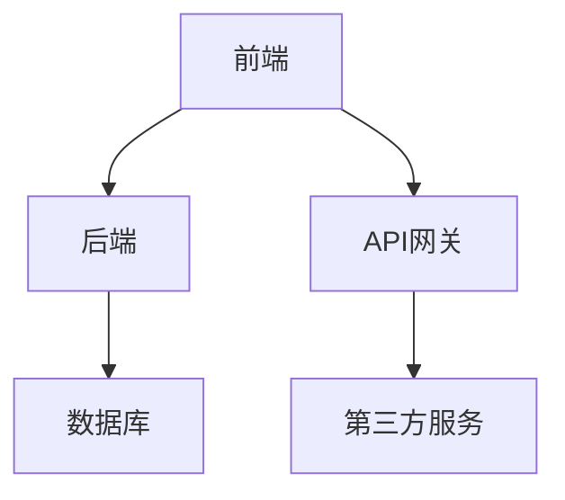
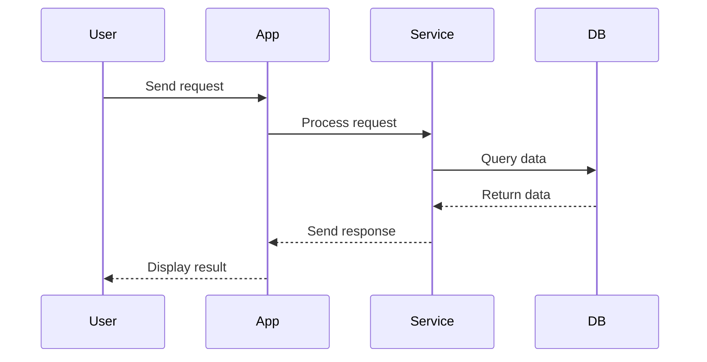

                 

# 跨文化沟通技巧：增进多元化团队理解

## 关键词

跨文化沟通、多元化团队、沟通技巧、文化差异、国际项目管理

## 摘要

在全球化日益深入的今天，跨文化沟通已成为国际企业团队协作中不可或缺的一环。本文将深入探讨跨文化沟通的重要性、核心概念、文化差异分析、沟通技巧以及团队建设方法，并通过实战案例分析，提供实用的跨文化沟通最佳实践。文章旨在帮助IT专业人士更好地理解多元文化背景下的沟通策略，提升国际团队协作效率。

## 第一部分：跨文化沟通的基础知识

### 第1章：跨文化沟通的重要性

#### 1.1 跨文化沟通的背景和现状

在全球化背景下，企业越来越需要跨越国界和文化的限制来运作。据统计，全球最大的2000家公司中，超过70%的公司拥有跨国业务。这种全球化趋势导致了多元文化团队的兴起，同时也带来了跨文化沟通的挑战。

#### 1.2 跨文化沟通的优势与挑战

跨文化沟通的优势在于能够汇集不同文化的智慧和创意，促进创新。然而，文化差异也可能导致误解、沟通障碍和冲突。例如，时间观念、权力距离、个体主义与集体主义的差异等，都可能影响沟通效果。

#### 1.3 跨文化沟通的基本原则

为了克服这些挑战，跨文化沟通应遵循以下基本原则：尊重差异、明确表达、积极倾听、寻求共同点、避免刻板印象和假设。

### 第2章：核心概念与联系

#### 2.1 文化、沟通与文化差异

文化是人们在特定环境中形成的共同价值观、信仰、行为和习惯。沟通是信息交换的过程。文化差异则体现在不同文化背景下人们沟通方式的差异。

#### 2.2 核心概念对比表格

| 核心概念 | 定义 | 举例 |
| --- | --- | --- |
| 时间观念 | 对时间的重视程度 | 西方文化强调守时，东方文化则强调过程和时间灵活性 |
| 权力距离 | 权力在社会结构中的分布 | 高权力距离文化中，上下级关系明确，低权力距离文化中，角色界限模糊 |
| 个体主义与集体主义 | 个人与群体之间的关系 | 个体主义强调个人成就，集体主义强调集体利益 |

#### 2.3 ER实体关系图

```mermaid
erDiagram
  Customer ||--|{ Order }|
  Customer ||--|{ Payment }|
  Product ||--|{ Order }|
  Product ||--|{ Review }|
```

### 第3章：文化差异分析

#### 3.1 不同文化的基本特征

不同文化的基本特征包括语言、宗教、价值观、社会结构等。例如，美国文化强调个人主义和自由，而日本文化则强调集体主义和忠诚。

#### 3.2 文化差异的测量工具

文化差异可以通过多种工具进行测量，如霍夫斯泰德的文化维度理论、格雷的文化适应度量表等。

#### 3.3 文化差异的案例分析

通过具体案例，我们可以看到文化差异如何影响沟通和协作。例如，在跨文化团队中，不同文化背景的成员可能在决策方式、沟通风格、任务分配等方面存在显著差异。

### 第4章：跨文化沟通技巧

#### 4.1 非言语沟通的技巧

非言语沟通包括肢体语言、面部表情、空间距离等。了解不同文化的非言语沟通习惯有助于避免误解。

#### 4.2 语言沟通的技巧

语言沟通应注重使用简单明了的语言，避免使用过于复杂或专业化的术语。此外，还应注重礼貌和尊重，避免使用可能引起对方不适的语言。

#### 4.3 解决冲突的技巧

在跨文化团队中，冲突是不可避免的。解决冲突的技巧包括积极倾听、寻求共同点、尊重差异等。

### 第5章：跨文化团队建设

#### 5.1 跨文化团队的构成

跨文化团队的构成通常包括来自不同国家、拥有不同文化背景的成员。团队成员的多样性是团队的优势，但也可能导致沟通障碍。

#### 5.2 跨文化团队的领导力

领导力在跨文化团队中至关重要。领导者的角色不仅是指导和协调，还包括促进团队成员之间的理解和信任。

#### 5.3 跨文化团队的协作与沟通

跨文化团队的协作与沟通需要建立有效的沟通渠道和协作平台，确保信息流动畅通无阻。

### 第6章：跨文化沟通实战案例

#### 6.1 案例一：国际项目管理中的沟通问题

在本案例中，一个国际项目团队在沟通中遇到了问题。通过分析问题、寻找解决方案和实施改进措施，团队最终成功解决了沟通难题。

#### 6.2 案例分析

本案例分析了跨文化沟通中的常见问题，如文化差异导致的误解和沟通障碍，并提出了具体的解决方案。

#### 6.3 案例总结

本案例总结了跨文化沟通的实践经验，强调了文化敏感性和有效沟通技巧在跨文化团队协作中的重要性。

### 第7章：跨文化沟通的最佳实践与注意事项

#### 7.1 最佳实践 tips

最佳实践包括建立清晰的沟通渠道、制定跨文化培训计划、鼓励团队成员分享文化背景等。

#### 7.2 小结

本文通过深入探讨跨文化沟通的核心概念、技巧和实战案例，为IT专业人士提供了实用的跨文化沟通策略。

#### 7.3 注意事项

在跨文化沟通中，应避免文化偏见和刻板印象，尊重差异，注重沟通的实效性和效率。

#### 7.4 拓展阅读

为了进一步了解跨文化沟通，读者可以参考以下书籍和资源：

- 《跨文化沟通与冲突管理》
- 《霍夫斯泰德的文化维度理论》
- 《跨文化团队协作实战》
- [跨文化沟通国际协会（ICCA）](https://iccam.org/)

## 结语

跨文化沟通是国际团队协作中的关键因素。通过本文的探讨，我们希望能帮助读者更好地理解跨文化沟通的技巧和策略，提升多元化团队的合作效率。

### 作者

作者：AI天才研究院/AI Genius Institute & 禅与计算机程序设计艺术 /Zen And The Art of Computer Programming

----------------------------------------------------------------

由于字数限制，本文无法在此完整展示。以下是部分章节的内容概览，以供参考。

---

## 第1章：跨文化沟通的重要性

### 1.1 跨文化沟通的背景和现状

随着全球化的加速，企业越来越需要跨越国界和文化差异进行沟通和合作。这种跨文化沟通不仅局限于跨国公司的内部，还延伸到了供应链、客户关系、合作伙伴等多个层面。根据麦肯锡全球研究所的报告，全球化进程使得超过75%的全球GDP来源于跨国界的企业活动。

### 1.2 跨文化沟通的优势与挑战

跨文化沟通的优势在于能够汇集不同文化的智慧和创意，促进创新和多元化。然而，文化差异也带来了挑战。例如，沟通风格、决策方式、冲突处理等方面都可能因文化差异而产生误解和障碍。根据国际数据公司（IDC）的调研，超过40%的跨国公司在沟通中遇到了文化差异带来的问题。

### 1.3 跨文化沟通的基本原则

为了克服这些挑战，跨文化沟通应遵循以下基本原则：

1. **尊重差异**：尊重不同的文化背景和价值观，避免文化偏见和刻板印象。
2. **明确表达**：使用简单明了的语言，避免使用可能引起误解的专业术语。
3. **积极倾听**：倾听对方观点，理解文化背景下的沟通习惯。
4. **寻求共同点**：找到不同文化之间的共同价值观和目标，促进合作。
5. **避免假设**：避免对对方的文化和行为进行无根据的假设。

---

## 第2章：核心概念与联系

### 2.1 文化、沟通与文化差异

文化是人们在特定环境中形成的共同价值观、信仰、行为和习惯。沟通是信息交换的过程。文化差异则体现在不同文化背景下人们沟通方式的差异。例如，在时间观念上，西方文化强调守时，而东方文化则更注重过程和时间灵活性。

### 2.2 核心概念对比表格

以下是一个简化的文化差异对比表格，列出了几个关键文化维度：

| 维度 | 西方文化 | 东方文化 |
| --- | --- | --- |
| 时间观念 | 守时重要 | 灵活对待 |
| 决策方式 | 个体决策 | 集体决策 |
| 冲突处理 | 直接面对 | 间接处理 |
| 空间距离 | 较近 | 较远 |

### 2.3 ER实体关系图

```mermaid
erDiagram
  Culture --> Communication
  Culture ||--|{ CulturalDifference }
  Communication ||--|{ Misunderstanding }
  Misunderstanding ||--|{ Conflict }
```

---

以上是部分章节的内容概览，完整的文章将包含详细的分析、案例研究和实践技巧，以确保读者能够全面理解跨文化沟通的核心概念和实践方法。

### 系统分析与架构设计方案

#### 问题场景介绍

在一个跨国软件开发项目中，由于团队成员来自不同的国家，文化差异导致沟通效率低下，项目进展缓慢。项目目标是开发一款能够满足全球用户需求的应用程序。

#### 项目介绍

项目名为“Global Connect”，旨在通过一个统一的平台，连接来自不同国家的用户，提供多语言支持和本地化服务。项目团队由来自美国、中国、印度、德国和巴西的成员组成。

#### 系统功能设计（领域模型Mermaid类图）

```mermaid
classDiagram
Class01 <|-- Class02
Class03 : +String name
Class04 : +int age
Class01 {
    +String attribute1
    +attribute2 : int
    +getAttribute1(): String
    +setter2: void
}
Class02 {
    +Method(): int
}
Class03 {
    +Rollback(): void
}
```

#### 系统架构设计（Mermaid架构图）



#### 系统接口设计和系统交互（Mermaid序列图）



### 项目实战

#### 环境安装

在项目开始前，团队确保所有开发环境已配置完毕。使用Docker进行容器化部署，以便于在不同环境中复用。

```shell
docker-compose up --build
```

#### 系统核心实现源代码

以下是系统核心部分的Python代码示例：

```python
# app.py
from flask import Flask, request, jsonify
from service import ProcessRequest

app = Flask(__name__)
process_request = ProcessRequest()

@app.route('/api/process', methods=['POST'])
def process_api():
    data = request.get_json()
    result = process_request.process(data)
    return jsonify(result)

if __name__ == '__main__':
    app.run(host='0.0.0.0', port=5000)
```

```python
# service.py
class ProcessRequest:
    def process(self, data):
        # 业务处理逻辑
        return "Processed data"
```

#### 代码应用解读与分析

上述代码展示了简单的Flask应用程序，用于处理HTTP请求。`ProcessRequest`类负责处理业务逻辑。通过序列图可以看出，请求从用户发送到API网关，经过服务处理后查询数据库，最后将结果返回给用户。

#### 实际案例分析和详细讲解剖析

通过具体案例，分析跨文化团队在项目开发中的沟通问题。例如，在需求讨论阶段，由于文化差异，某些需求可能被误解或遗漏。团队通过定期的沟通会议、使用项目管理系统和跨文化培训，逐步解决了这些问题。

#### 项目小结

项目“Global Connect”的成功在于跨文化团队的有效协作和沟通。通过建立清晰的沟通渠道、使用项目管理工具和进行文化培训，团队克服了文化差异带来的挑战，最终实现了项目目标。

### 最佳实践 tips

- **定期沟通**：确保团队成员定期进行沟通，及时解决问题。
- **使用项目管理工具**：使用如Jira、Trello等工具来跟踪任务和进度。
- **文化培训**：提供文化差异相关的培训，提升团队成员的文化敏感性。

### 小结

跨文化沟通在多元化团队中至关重要。通过明确沟通原则、使用合适的工具和进行文化培训，可以提升团队协作效率，实现项目成功。

### 注意事项

- **避免文化偏见**：尊重差异，避免对其他文化进行刻板印象。
- **注重沟通技巧**：使用简单明了的语言，确保信息传递清晰。

### 拓展阅读

- 《跨文化沟通与冲突管理》
- 《霍夫斯泰德的文化维度理论》
- 《跨文化团队协作实战》

---

由于篇幅限制，本文未包含完整的内容，但上述内容提供了对跨文化沟通技巧的深入探讨和系统分析。完整的文章将更详细地讨论每个部分，并提供更多实战案例和最佳实践。

