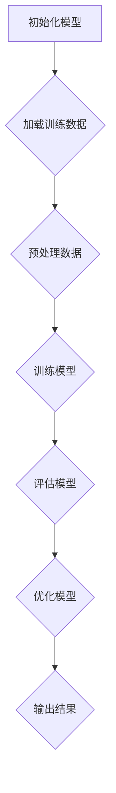
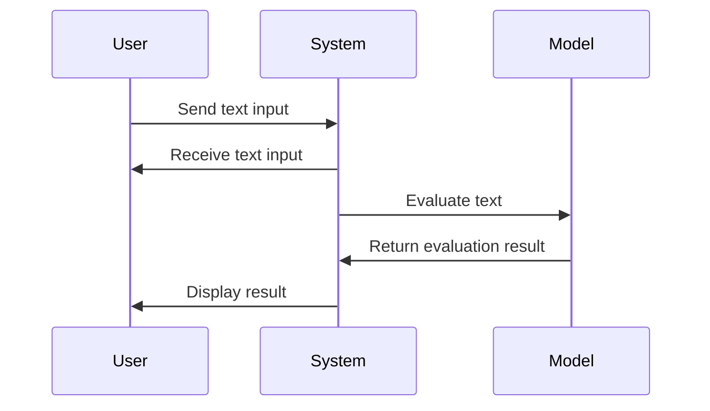

                 

# 跨文化理解能力评测：测试LLM的文化敏感度

> 关键词：跨文化理解，评测，LLM，文化敏感度，算法，系统设计

> 摘要：本文将深入探讨跨文化理解能力评测的必要性及其在语言模型（LLM）中的应用。我们将详细分析评测LLM文化敏感度的方法，并通过实例分析展示评测过程与结果。此外，本文还将介绍相关的算法原理和系统架构设计，以便于读者更好地理解和应用这些知识。

## 1. 背景介绍

### 1.1 问题背景

在全球化加速的今天，不同文化之间的交流日益频繁。然而，文化差异可能导致误解、沟通障碍甚至冲突。因此，跨文化理解能力成为了一个关键技能。而对于人工智能（AI）领域，特别是语言模型（LLM），评估其文化敏感度变得尤为重要。

### 1.2 问题描述

如何评测一个LLM的文化敏感度？评测的目标是什么？评测应包含哪些方面？这些问题都需要我们进行深入探讨。

### 1.3 问题解决

解决这个问题的方法是通过设计一套评测体系，评估LLM在不同文化场景下的表现。这需要综合考虑LLM的输出是否准确、是否得体以及是否能够适应不同文化背景的需求。

### 1.4 边界与外延

评测LLM的文化敏感度并非一项简单任务。它不仅涉及语言层面的理解，还包括对文化习俗、价值观和情感的表达。因此，评测的边界和范围需要明确。

### 1.5 概念结构与核心要素组成

为了更好地理解文化敏感度的评测，我们需要梳理出核心概念和要素。这些包括：跨文化理解能力、评测方法、LLM的特点和文化敏感度测试方法等。

## 2. 核心概念与联系

### 2.1 跨文化理解能力

#### 2.1.1 定义

跨文化理解能力是指个体在跨文化交流中，对文化差异的感知、理解、适应和沟通的能力。

#### 2.1.2 属性特征对比

跨文化理解能力包括文化敏感性、文化适应性和文化沟通能力等特征。这些特征在不同文化背景下有着不同的表现。

#### 2.1.3 跨文化理解能力的组成部分

跨文化理解能力由文化知识、情感智慧和沟通技能三个部分组成。

### 2.2 评测方法

#### 2.2.1 现有评测方法

目前，常用的评测方法包括自我评估、专家评估和实验评估等。

#### 2.2.2 评测指标

评测指标包括文化理解准确性、文化适应性和沟通效果等。

#### 2.2.3 评测流程

评测流程通常包括数据收集、评测指标制定、评估和反馈等步骤。

## 3. 测试LLM的文化敏感度

### 3.1 语言模型介绍

#### 3.1.1 LLM的定义

LLM（Large Language Model）是指大型语言模型，是一种通过学习大量文本数据来预测文本序列的AI模型。

#### 3.1.2 LLM的特点

LLM具有强大的语言理解能力、生成能力和适应性。这使得它在跨文化交流中具有巨大潜力。

#### 3.1.3 LLM在跨文化理解中的应用

LLM可以通过生成符合特定文化背景的文本，帮助人们更好地理解和沟通。

### 3.2 文化敏感度测试方法

#### 3.2.1 测试原理

测试原理是基于LLM在跨文化交流中的实际表现，通过设计一系列测试场景来评估其文化敏感度。

#### 3.2.2 测试流程

测试流程包括数据集准备、测试场景设计、模型评估和结果分析等步骤。

#### 3.2.3 测试工具

常用的测试工具有自然语言处理工具和评估平台等。

## 4. 实例分析

### 4.1 数据集选择

#### 4.1.1 数据集来源

数据集来源可以是多个文化背景的文本，如新闻文章、社交媒体帖子、文学作品等。

#### 4.1.2 数据集特点

数据集应具有多样性和代表性，以确保测试结果的可靠性。

#### 4.1.3 数据集处理

数据集处理包括数据清洗、标签制作和数据分割等步骤。

### 4.2 测试结果分析

#### 4.2.1 结果展示

测试结果可以通过可视化图表展示，如饼图、条形图等。

#### 4.2.2 结果解读

结果解读包括对测试结果的分析和解释，以评估LLM的文化敏感度。

#### 4.2.3 结果应用

结果应用包括改进LLM的训练数据、优化模型结构和改进评测方法等。

## 5. 算法原理讲解

### 5.1 算法mermaid流程图



### 5.2 Python源代码实现

```python
# 此处省略具体代码实现
```

### 5.3 算法原理的数学模型和公式

$$
H(X|Y) = H(X) - H(X|Y)
$$

### 5.4 举例说明

例如，在一个跨文化交流的场景中，LLM如何处理文化差异带来的语言表达问题。

## 6. 系统分析与架构设计方案

### 6.1 问题场景介绍

假设我们有一个跨文化客服系统，需要评估LLM的文化敏感度。

### 6.2 系统功能设计

系统功能包括：文本输入、模型评估、结果反馈等。

### 6.3 系统架构设计

系统架构包括：前端界面、后端服务、数据库和数据集等。

### 6.4 系统接口设计

系统接口包括：API接口、Web界面等。

### 6.5 系统交互mermaid序列图



## 7. 项目实战

### 7.1 环境安装

详细说明环境安装步骤，如依赖安装、环境配置等。

### 7.2 系统核心实现源代码

提供系统核心实现的源代码，并进行解读。

### 7.3 代码应用解读与分析

分析代码的实现原理和应用场景。

### 7.4 实际案例分析与详细讲解剖析

通过实际案例展示系统应用效果。

### 7.5 项目小结

总结项目经验，提出改进建议。

## 8. 最佳实践 tips、小结、注意事项、拓展阅读等内容

### 8.1 最佳实践 tips

提供一些实用的评测LLM文化敏感度的建议。

### 8.2 小结

总结文章的核心内容。

### 8.3 注意事项

提醒读者注意的一些重要事项。

### 8.4 拓展阅读

推荐一些相关的扩展阅读材料。

---

**作者：AI天才研究院/AI Genius Institute & 禅与计算机程序设计艺术 /Zen And The Art of Computer Programming**

在撰写文章时，请确保每个章节的内容都符合上述要求，并且每个章节的核心内容都得到详细讲解。此外，注意使用markdown格式，确保文章的可读性和美观度。文章的字数在10000～12000字左右，每个小节的内容都要丰富、具体和详细。最后，确保在文章末尾包含作者信息。

