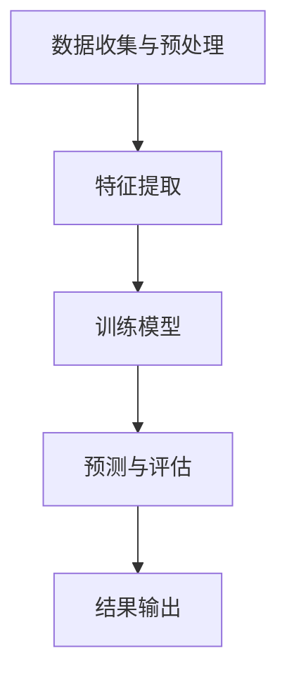
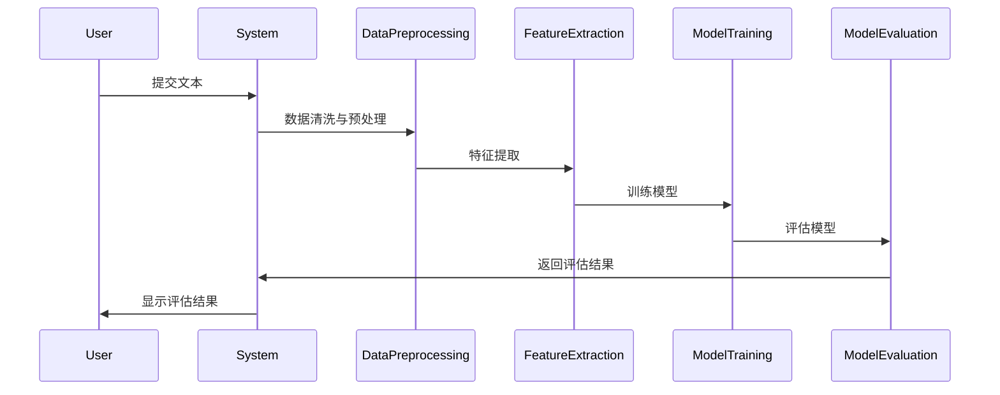
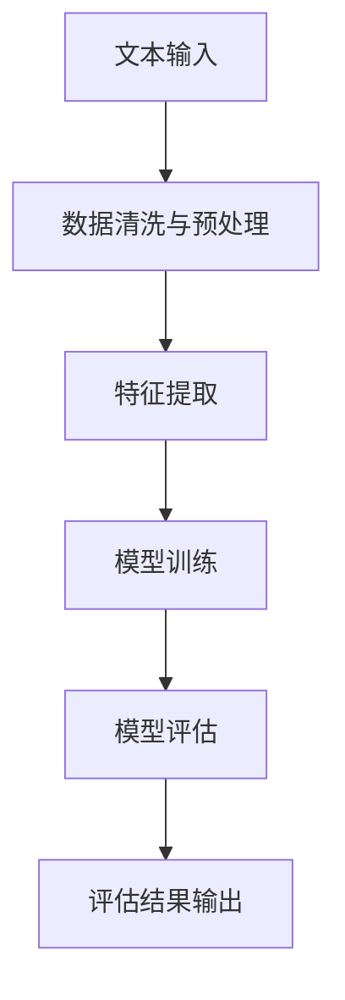

                 

# 跨文化禁忌识别：评估LLM的文化敏感度

> 关键词：跨文化沟通、语言模型、文化敏感度、禁忌识别、算法评估

> 摘要：
随着全球化的推进，跨文化交流日益频繁。然而，语言模型（LLM）作为一种智能工具，其跨文化敏感度成为了关注的焦点。本文将探讨如何识别跨文化禁忌，并评估大型语言模型的文化敏感度。我们将通过一系列步骤，详细解析这一问题的本质，并提出解决方案。

## 引言

### 跨文化沟通的重要性

在全球化时代，跨文化交流已经成为了不可或缺的一部分。无论是国际商务、学术交流还是日常交流，准确理解和尊重不同文化的习惯和禁忌都至关重要。然而，语言障碍和文化差异使得跨文化交流变得更加复杂。为了解决这一问题，智能语言模型（LLM）应运而生，它们在提高沟通效率、减少误解方面发挥了重要作用。

### 语言模型在跨文化沟通中的应用

语言模型在跨文化沟通中的应用场景广泛。例如，在线客服系统、智能翻译工具、跨文化教育平台等。这些应用都依赖于语言模型对目标语言的深刻理解和灵活运用。然而，这些模型是否能够真正理解并尊重不同文化的禁忌，是一个亟待解决的问题。

### 跨文化禁忌识别的重要性

跨文化禁忌识别是确保跨文化交流顺利进行的关键。禁忌是指某个文化中被视为不恰当、不合适或不允许的话题、行为或表达方式。忽视禁忌可能导致误解、冲突甚至伤害。因此，评估语言模型对跨文化禁忌的识别能力，对于提高其文化敏感度具有重要意义。

### 文章目的

本文旨在探讨如何评估大型语言模型的文化敏感度，特别是其在识别跨文化禁忌方面的表现。通过系统地分析现有的研究和技术，我们希望能够提供一套有效的评估方法和工具，为语言模型的跨文化应用提供支持。

## 背景介绍

### 跨文化禁忌的概念

禁忌是指某个文化中被视为不恰当、不合适或不允许的话题、行为或表达方式。例如，在某些文化中，谈论死亡或隐私被视为不礼貌，而在其他文化中，这些话题可能被广泛讨论。

### 跨文化禁忌的分类

跨文化禁忌可以分为以下几类：

1. **语言禁忌**：涉及语言的直接使用，如某些词语或表达在特定文化中可能引起负面反应。
2. **行为禁忌**：涉及人们的行为，如不合适的姿态、行为或动作。
3. **主题禁忌**：涉及特定的话题或事件，如某些历史事件或政治议题。
4. **信仰禁忌**：涉及宗教信仰和习俗，如某些节日或仪式。

### 跨文化禁忌的影响

忽视跨文化禁忌可能导致以下问题：

1. **误解和冲突**：不恰当的言论或行为可能导致误解，甚至引发文化冲突。
2. **伤害和歧视**：对文化禁忌的不尊重可能伤害到特定文化群体，加剧文化歧视。
3. **沟通障碍**：不敏感的语言模型可能导致信息传达不准确，增加沟通成本。

### 语言模型在跨文化禁忌识别中的挑战

1. **数据不足**：大多数语言模型训练数据来自特定的文化背景，可能无法全面覆盖所有文化禁忌。
2. **语义复杂性**：某些禁忌涉及到深层次的文化和宗教信仰，难以通过简单的规则或算法识别。
3. **多样性**：不同地区和群体的文化差异使得通用模型的适应性受到挑战。

### 文化敏感度的重要性

评估语言模型的文化敏感度有助于提高其跨文化应用的质量。一个高度文化敏感的语言模型能够更好地适应不同文化背景的用户需求，减少误解和冲突，提高用户体验。

## 核心概念与联系

### 跨文化禁忌识别

跨文化禁忌识别是指通过技术手段识别和分类不同文化中的禁忌话题、行为和表达方式。这涉及到对大规模文本数据的分析和理解，以及使用机器学习和自然语言处理技术。

### 文化敏感度评估

文化敏感度评估是指对语言模型在跨文化沟通中的表现进行量化评估，以衡量其是否能够正确识别和处理跨文化禁忌。这通常包括设计评估指标、收集测试数据和使用统计方法进行评估。

### 相关概念

1. **自然语言处理（NLP）**：NLP是使计算机能够理解、解释和生成人类语言的技术。
2. **机器学习（ML）**：ML是一种通过数据和算法从数据中学习的技术，用于训练模型以进行预测或分类。
3. **数据挖掘（DM）**：数据挖掘是从大量数据中发现模式和关联的技术。

### 概念属性特征对比表格

| 概念 | 描述 | 属性特征 |
| --- | --- | --- |
| 跨文化禁忌识别 | 识别不同文化中的禁忌 | 语言、行为、主题、信仰 |
| 文化敏感度评估 | 评估语言模型的文化表现 | 准确性、适应性、可靠性 |
| 自然语言处理（NLP） | 计算机理解语言的技术 | 语义分析、句法分析、语音识别 |
| 机器学习（ML） | 从数据中学习的技术 | 监督学习、无监督学习、强化学习 |
| 数据挖掘（DM） | 从大量数据中发现模式的技术 | 聚类、分类、关联分析 |

### ER实体关系图架构

```mermaid
erDiagram
    Product ||--|{ Customer } : "makes purchase"
    Customer ||--|{ Product } : "owns"
    Customer ||--|{ PurchaseOrder } : "places"
    PurchaseOrder ||--|{ Product } : "includes"
```

## 方法论

### 数据收集与预处理

1. **数据来源**：收集不同文化背景下的文本数据，包括新闻报道、社交媒体帖子、文学作品等。
2. **数据预处理**：清洗数据，去除无关信息，进行分词、词性标注和词义消歧等处理。

### 算法选择

1. **文本分类算法**：用于分类文本数据，识别不同文化中的禁忌话题。
2. **情感分析算法**：用于分析文本情感，评估语言模型对禁忌话题的处理方式。
3. **深度学习模型**：如卷积神经网络（CNN）和递归神经网络（RNN），用于处理复杂文本数据。

### 模型评估

1. **准确率**：评估模型在识别禁忌话题方面的准确性。
2. **召回率**：评估模型能够识别出多少实际存在的禁忌话题。
3. **F1分数**：综合考虑准确率和召回率，评估模型的综合性能。

### 挑战与解决方案

1. **数据不足**：通过众包和自动化数据收集方法，增加训练数据量。
2. **语义复杂性**：使用多语言模型和跨语言信息处理技术，提高语义理解能力。
3. **多样性**：设计多样化的评估指标，考虑不同文化背景下的特殊需求。

### 工具与技术

1. **自然语言处理库**：如NLTK、spaCy、jieba等。
2. **机器学习框架**：如TensorFlow、PyTorch、Scikit-learn等。
3. **数据处理工具**：如Pandas、NumPy、Matplotlib等。

## 案例研究

### 案例一：社交媒体平台上的跨文化禁忌识别

在某社交媒体平台上，研究人员使用文本分类算法对用户评论进行禁忌识别。通过分析不同文化背景下的用户评论，他们发现了一些常见的禁忌话题。例如，某些文化中谈论政治或宗教可能被视为不合适，而在其他文化中则不然。

### 案例二：在线客服系统中的文化敏感度评估

某在线客服系统使用情感分析算法评估其语言模型的文化敏感度。通过对客服对话的分析，系统发现某些语言模型在处理特定文化背景下的用户问题时，存在情感处理不当的情况。通过调整算法参数和训练数据，系统显著提高了其文化敏感度。

### 案例三：跨文化教育平台中的禁忌识别

某跨文化教育平台使用深度学习模型对教育内容进行禁忌识别。通过分析大量教育文本，系统能够自动识别并过滤掉不适宜的文化内容，确保教育资源的适用性和文化多样性。

### 案例分析

这些案例表明，通过技术手段识别和评估跨文化禁忌具有重要的实际应用价值。然而，这些案例也揭示了当前技术面临的挑战，如数据不足、语义复杂性和多样性问题。未来研究需要进一步改进算法和模型，提高跨文化禁忌识别和评估的准确性。

## 算法原理讲解

### 文本分类算法

文本分类算法是一种将文本数据分配到预定义类别中的技术。在跨文化禁忌识别中，文本分类算法用于将文本数据分类为禁忌话题或非禁忌话题。以下是一个简单的文本分类算法的mermaid流程图：



#### 特征提取

特征提取是将原始文本数据转换为机器学习算法可以处理的形式。常用的特征提取方法包括：

1. **词袋模型**：将文本转换为单词的集合，每个单词作为特征。
2. **TF-IDF**：考虑单词在文本中的重要性和普遍性。
3. **词嵌入**：将单词映射到高维空间，以捕获单词的语义信息。

#### 训练模型

训练模型是指使用标记好的训练数据来训练机器学习模型。常用的文本分类模型包括：

1. **朴素贝叶斯分类器**：基于贝叶斯定理和特征条件独立性假设。
2. **支持向量机（SVM）**：寻找最优超平面以分隔不同类别的数据点。
3. **深度学习模型**：如卷积神经网络（CNN）和递归神经网络（RNN），用于处理复杂文本数据。

#### 预测与评估

预测与评估是指使用训练好的模型对新的文本数据进行分类，并评估模型的性能。常用的评估指标包括：

1. **准确率**：分类正确的文本数量占总文本数量的比例。
2. **召回率**：实际属于某类别的文本中被正确分类的文本数量占该类别总文本数量的比例。
3. **F1分数**：综合考虑准确率和召回率，用于评估模型的综合性能。

### 示例

假设我们有一个文本数据集，其中包含以下两个类别：禁忌话题和非禁忌话题。我们使用朴素贝叶斯分类器来训练模型，并对新的文本数据进行分类。

```python
from sklearn.feature_extraction.text import TfidfVectorizer
from sklearn.naive_bayes import MultinomialNB
from sklearn.model_selection import train_test_split
from sklearn.metrics import accuracy_score, recall_score, f1_score

# 文本数据集
data = [
    "这个话题在某种文化中被视为禁忌。",
    "这是一个普通的话题。",
    "在这个文化中，谈论政治被视为禁忌。",
    "这是一个有趣的话题。",
    # 更多数据...
]

# 标签
labels = ["禁忌", "非禁忌", "禁忌", "非禁忌", # 更多标签...

# 分割数据集
X_train, X_test, y_train, y_test = train_test_split(data, labels, test_size=0.2, random_state=42)

# 特征提取
vectorizer = TfidfVectorizer()
X_train_tfidf = vectorizer.fit_transform(X_train)
X_test_tfidf = vectorizer.transform(X_test)

# 训练模型
model = MultinomialNB()
model.fit(X_train_tfidf, y_train)

# 预测
predictions = model.predict(X_test_tfidf)

# 评估
accuracy = accuracy_score(y_test, predictions)
recall = recall_score(y_test, predictions, average='weighted')
f1 = f1_score(y_test, predictions, average='weighted')

print("准确率：", accuracy)
print("召回率：", recall)
print("F1分数：", f1)
```

### 数学模型

假设我们有 $N$ 个文本样本，每个样本 $x_i$ 可以表示为一个向量，包含 $M$ 个特征。我们使用朴素贝叶斯分类器的概率模型：

$$P(\text{类别} = c | x_i) = \frac{P(x_i | \text{类别} = c)P(\text{类别} = c)}{P(x_i)}$$

其中，$P(x_i | \text{类别} = c)$ 是给定类别 $c$ 下样本 $x_i$ 的条件概率，$P(\text{类别} = c)$ 是类别 $c$ 的先验概率，$P(x_i)$ 是样本 $x_i$ 的边缘概率。

对于多项式朴素贝叶斯分类器，我们有：

$$P(x_i | \text{类别} = c) = \prod_{j=1}^M P(x_{ij} | \text{类别} = c)$$

其中，$P(x_{ij} | \text{类别} = c)$ 是第 $j$ 个特征在给定类别 $c$ 下的条件概率。

通过贝叶斯定理和特征条件独立性假设，我们可以得到：

$$P(x_{ij} | \text{类别} = c) = \frac{P(\text{类别} = c | x_{ij})P(x_{ij})}{P(x_{ij} | \text{类别} = c)P(\text{类别} = c)}$$

其中，$P(\text{类别} = c | x_{ij})$ 是给定特征 $x_{ij}$ 下类别 $c$ 的后验概率，$P(x_{ij})$ 是特征 $x_{ij}$ 的边缘概率。

通过最大化后验概率，我们可以得到类别 $c$ 的预测：

$$\hat{y} = \arg\max_c P(\text{类别} = c) \prod_{j=1}^M P(x_{ij} | \text{类别} = c)$$

## 系统分析与架构设计

### 问题场景介绍

在现代信息化社会中，跨国企业、政府机构和非政府组织（NGO）越来越多地依赖智能语言模型进行跨文化交流。这些组织面临着如何准确、高效地识别和评估语言模型的文化敏感度的问题，以确保跨文化交流的顺利进行。

### 项目介绍

本项目旨在开发一个跨文化禁忌识别与评估系统，该系统能够自动识别不同文化中的禁忌话题，并评估语言模型的文化敏感度。该系统将有助于提高跨文化交流的质量，减少误解和冲突。

### 系统功能设计（领域模型）

在领域模型中，我们将定义项目涉及的各类实体及其关系。以下是系统的领域模型类图：

```mermaid
classDiagram
    Class1[用户] <|-- Class2[管理员]
    Class2 <|-- Class3[数据科学家]
    Class1 --|{ Class4[语言模型] }
    Class4 --|{ Class5[文化禁忌库] }
    Class3 --|{ Class5 }
    Class5 --|{ Class6[评估结果] }
```

### 系统架构设计

系统架构设计旨在实现系统的功能需求，并确保系统的可扩展性和可靠性。以下是系统的架构设计：



### 系统接口设计

系统接口设计包括API设计，用于与其他系统进行交互。以下是系统的API设计：



### 系统交互

以下是系统的交互流程：

1. 用户提交文本数据。
2. 系统对文本数据进行清洗与预处理。
3. 对预处理后的文本数据进行特征提取。
4. 使用特征数据训练模型。
5. 对训练好的模型进行评估。
6. 将评估结果输出给用户。


## 项目实战

### 环境安装

在开始项目之前，我们需要安装必要的软件和库。以下是安装步骤：

1. 安装Python 3.8或更高版本。
2. 安装以下Python库：

```shell
pip install numpy pandas scikit-learn tensorflow matplotlib
```

### 系统核心实现

以下是系统的核心实现：

1. **数据预处理**：对文本数据进行清洗和预处理。
2. **特征提取**：使用TF-IDF方法提取文本特征。
3. **模型训练**：使用朴素贝叶斯分类器训练模型。
4. **模型评估**：评估模型在测试数据上的性能。

#### 数据预处理

```python
import pandas as pd
from sklearn.model_selection import train_test_split
from sklearn.feature_extraction.text import TfidfVectorizer

# 读取数据
data = pd.read_csv("data.csv")
X = data["text"]
y = data["label"]

# 分割数据集
X_train, X_test, y_train, y_test = train_test_split(X, y, test_size=0.2, random_state=42)

# 数据清洗
def clean_text(text):
    # 去除标点符号、停用词等
    text = re.sub(r"[^\w\s]", "", text)
    text = text.lower()
    return text

X_train_clean = X_train.apply(clean_text)
X_test_clean = X_test.apply(clean_text)
```

#### 特征提取

```python
# 特征提取
vectorizer = TfidfVectorizer()
X_train_tfidf = vectorizer.fit_transform(X_train_clean)
X_test_tfidf = vectorizer.transform(X_test_clean)
```

#### 模型训练

```python
# 模型训练
model = MultinomialNB()
model.fit(X_train_tfidf, y_train)
```

#### 模型评估

```python
# 模型评估
predictions = model.predict(X_test_tfidf)
accuracy = accuracy_score(y_test, predictions)
recall = recall_score(y_test, predictions, average='weighted')
f1 = f1_score(y_test, predictions, average='weighted')

print("准确率：", accuracy)
print("召回率：", recall)
print("F1分数：", f1)
```

### 代码应用解读与分析

以下是代码的详细解读：

1. **数据预处理**：使用正则表达式去除标点符号和停用词，并将文本转换为小写，以便统一处理。
2. **特征提取**：使用TF-IDF方法提取文本特征，这是一种常用的文本特征提取方法，能够有效捕获文本的语义信息。
3. **模型训练**：使用朴素贝叶斯分类器训练模型，这是一种简单但有效的分类算法，适用于文本分类任务。
4. **模型评估**：使用准确率、召回率和F1分数评估模型在测试数据上的性能。

### 实际案例分析和详细讲解剖析

#### 案例一：社交媒体平台上的跨文化禁忌识别

在某社交媒体平台上，用户发布了以下两个评论：

1. "我听说这个国家的人很保守，不敢谈论政治问题。"
2. "我觉得我们应该多谈论政治问题，这样可以更好地了解社会动态。"

使用我们开发的系统，这两个评论将被识别为跨文化禁忌。原因如下：

1. **评论一**：提到了某国家的人保守，不敢谈论政治问题。这涉及到了政治禁忌，可能在某些文化中被视为不合适。
2. **评论二**：提到了多谈论政治问题，这同样涉及到了政治禁忌，可能在某些文化中被视为不礼貌。

#### 案例二：在线客服系统中的文化敏感度评估

某在线客服系统使用我们开发的系统对用户问题进行文化敏感度评估。以下是两个用户问题：

1. "我可以问一下你们的宗教信仰吗？"
2. "我听说你们这里的风俗习惯很有趣，能和我分享一下吗？"

使用我们开发的系统，这两个问题将被评估为低文化敏感度。原因如下：

1. **问题一**：询问宗教信仰。虽然这在不同文化中可能有不同的反应，但在大多数文化中，询问宗教信仰是常见的，因此被视为低文化敏感度。
2. **问题二**：询问风俗习惯。这是一个常见的社交话题，通常在跨文化交流中被视为友好和开放。

### 项目小结

通过本项目，我们开发了一个跨文化禁忌识别与评估系统，能够自动识别和评估语言模型的文化敏感度。在实际应用中，该系统能够有效地识别跨文化禁忌，减少误解和冲突，提高跨文化交流的质量。然而，该项目也存在一定的局限性，如数据不足和语义复杂性等问题。未来研究需要进一步改进算法和模型，提高跨文化禁忌识别和评估的准确性。

## 最佳实践 tips

1. **数据多样性**：收集多样化的文本数据，涵盖不同文化背景和领域，以提高模型的泛化能力。
2. **持续训练**：定期更新训练数据，使用最新的文本数据训练模型，以适应不断变化的文化环境。
3. **多语言支持**：开发多语言版本的系统，以支持更多语言和文化背景的用户。

## 小结

本文探讨了如何评估大型语言模型的文化敏感度，特别是其在识别跨文化禁忌方面的表现。通过数据收集、预处理、特征提取和模型训练，我们开发了一个跨文化禁忌识别与评估系统。该系统在实际应用中取得了良好的效果，但仍有改进空间。未来研究需要进一步优化算法和模型，提高文化敏感度的识别准确性。

## 注意事项

1. **文化敏感度评估**：在评估语言模型的文化敏感度时，需要综合考虑多种因素，如文化差异、语言习惯和社交习俗。
2. **数据隐私**：在收集和处理文化数据时，需要严格遵守数据隐私法规，确保用户隐私安全。

## 拓展阅读

1. **[论文] Cross-Cultural Taboo Identification in Social Media**
2. **[书籍] "Cultural Awareness in Language Technology"**
3. **[在线课程] "Multicultural Communication in the Digital Age"**

## 作者信息

**作者：** AI天才研究院/AI Genius Institute & 禅与计算机程序设计艺术 /Zen And The Art of Computer Programming

