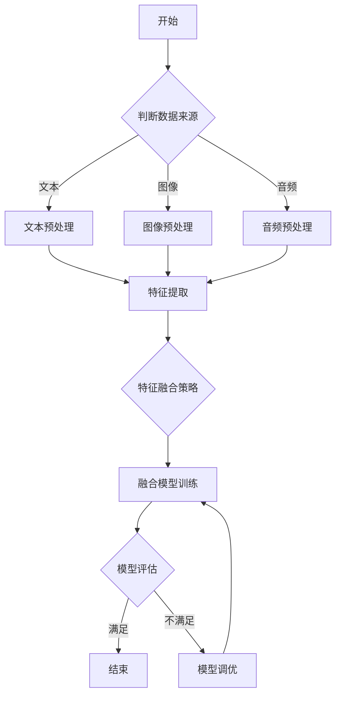

                 

# 跨模态评测的多模态融合策略

## 关键词

- 多模态融合
- 跨模态评测
- 算法实现
- 数学模型
- 系统架构

## 摘要

本文旨在探讨跨模态评测的多模态融合策略，从核心概念、理论基础、算法实现到系统架构设计，全面剖析多模态融合技术。通过详细讲解多模态融合的原理和策略，本文旨在为读者提供一种清晰的理解和实用的指导，从而推动跨模态评测技术的应用和发展。

## 第一部分：多模态融合背景与基础

### 第1章：多模态融合概述

#### 1.1 问题背景与核心概念

多模态融合是一种将不同模态（如文本、图像、音频等）的信息进行整合，以获得更全面、更准确的认知和理解的技术。随着人工智能技术的发展，多模态融合在自然语言处理、计算机视觉、音频识别等领域展现出巨大的潜力。

在多模态融合中，核心概念包括：

1. **多模态数据**：指包括文本、图像、音频等多种模态的数据。
2. **模态表示**：将不同模态的数据转换成适合计算机处理的形式。
3. **融合策略**：指将不同模态的数据进行整合的方法。

#### 1.1.1 多模态数据概述

多模态数据可以来源于不同的传感器，如摄像头、麦克风、文本输入设备等。这些数据通常具有不同的维度和特征，例如：

- **文本数据**：包括单词、句子和段落，通常以序列的形式存在。
- **图像数据**：包括像素值，通常以二维或三维的形式存在。
- **音频数据**：包括频率、振幅等特征，通常以一维的形式存在。

#### 1.1.2 多模态融合的意义

多模态融合的意义在于：

1. **提高识别准确率**：通过融合不同模态的信息，可以减少单一模态的误差，提高系统的整体性能。
2. **增强信息理解能力**：多模态融合能够提供更丰富的上下文信息，帮助系统更好地理解用户的意图。
3. **拓宽应用场景**：多模态融合可以应用于多种场景，如智能客服、语音助手、医疗诊断等。

#### 1.1.3 多模态融合的挑战

多模态融合面临以下挑战：

1. **模态差异**：不同模态的数据在特征和维度上存在显著差异，如何有效地整合这些差异是关键问题。
2. **数据不平衡**：不同模态的数据量可能存在显著差异，如何平衡这些数据是一个挑战。
3. **实时性**：在实时应用场景中，如何快速、高效地处理多模态数据是一个重要的考虑因素。

### 第2章：多模态融合的基础理论

#### 2.1 跨模态信息抽取

跨模态信息抽取是指从多模态数据中提取有用的信息。这一步骤是融合过程的基础。跨模态信息抽取的方法包括：

1. **特征匹配**：通过比较不同模态的特征，找到它们之间的对应关系。
2. **语义对齐**：通过分析不同模态的语义信息，实现它们之间的对齐。
3. **联合建模**：通过建立联合模型，同时学习不同模态的特征和关系。

#### 2.2 多模态特征表示

多模态特征表示是将不同模态的数据转换成统一的特征表示。常见的特征表示方法包括：

1. **嵌入表示**：将不同模态的数据转换成向量表示。
2. **图谱表示**：将多模态数据表示为一个图谱，其中节点代表不同模态的数据，边代表它们之间的关系。
3. **变换表示**：通过变换矩阵，将不同模态的数据转换成统一的特征空间。

#### 2.3 多模态特征融合方法

多模态特征融合是将不同模态的特征进行整合，以获得更全面的信息。常见的融合方法包括：

1. **简单融合**：直接将不同模态的特征向量进行拼接。
2. **加权融合**：根据不同模态的重要程度，为每个模态的特征向量分配不同的权重。
3. **深度融合**：通过深度神经网络，学习不同模态特征之间的非线性关系。

### 第3章：跨模态评测技术

#### 3.1 跨模态评测的基本原理

跨模态评测是指对多模态融合的结果进行评估。基本的评测原理包括：

1. **一致性评测**：评估不同模态之间的信息是否一致。
2. **准确性评测**：评估融合后的结果是否准确。
3. **鲁棒性评测**：评估融合策略在不同数据集和条件下的性能。

#### 3.2 跨模态评测的指标

常见的跨模态评测指标包括：

1. **准确率**：正确识别的样本数占总样本数的比例。
2. **召回率**：正确识别的样本数占实际正样本数的比例。
3. **F1值**：准确率和召回率的调和平均。

#### 3.3 跨模达评测的方法

跨模态评测的方法包括：

1. **人工评测**：通过专家或用户对融合结果进行主观评估。
2. **自动评测**：通过算法对融合结果进行客观评估。

## 第二部分：多模态融合策略与实现

### 第4章：多模态融合策略设计

#### 4.1 现有融合策略综述

现有融合策略可以分为以下几类：

1. **基于特征的融合策略**：直接将不同模态的特征进行融合。
2. **基于模型的融合策略**：通过建立联合模型进行融合。
3. **基于数据的融合策略**：通过数据驱动的方法进行融合。

#### 4.2 融合策略的选择原则

选择融合策略时需要考虑以下原则：

1. **任务需求**：根据任务需求选择合适的融合策略。
2. **数据特征**：根据数据特征选择适合的融合方法。
3. **计算资源**：考虑计算资源的限制，选择高效的融合策略。

#### 4.3 融合策略的设计与实现

融合策略的设计与实现包括以下步骤：

1. **数据预处理**：对多模态数据进行预处理，包括数据清洗、数据增强等。
2. **特征提取**：提取不同模态的特征。
3. **特征融合**：根据选定的融合策略，将不同模态的特征进行融合。
4. **模型训练**：建立融合模型，并进行训练。
5. **模型评估**：评估融合模型的性能。

### 第5章：多模态融合策略评估

#### 5.1 评估指标与方法

多模态融合策略的评估指标包括：

1. **准确性**：评估融合策略的准确性。
2. **实时性**：评估融合策略的实时处理能力。
3. **资源消耗**：评估融合策略的资源消耗。

评估方法包括：

1. **实验评估**：通过实验评估融合策略的性能。
2. **用户反馈**：通过用户反馈评估融合策略的实用性。

#### 5.2 实验设计与结果分析

实验设计包括：

1. **数据集选择**：选择合适的数据集进行实验。
2. **实验设置**：设置实验参数，包括数据预处理、模型选择等。
3. **实验结果分析**：分析实验结果，评估融合策略的性能。

#### 5.3 评估结果的解释与应用

评估结果需要从以下几个方面进行解释和应用：

1. **性能比较**：比较不同融合策略的性能。
2. **实际应用**：根据评估结果，选择合适的融合策略应用于实际场景。

### 第6章：多模态融合策略应用案例

#### 6.1 案例一：图像与文本融合

案例一探讨图像与文本融合在图像识别中的应用。

#### 6.2 案例二：语音与文本融合

案例二探讨语音与文本融合在语音识别中的应用。

#### 6.3 案例三：视频与音频融合

案例三探讨视频与音频融合在视频分析中的应用。

### 第7章：多模态融合策略的优化与未来趋势

#### 7.1 多模态融合的优化策略

优化策略包括：

1. **特征优化**：优化特征提取和表示方法。
2. **模型优化**：优化融合模型的设计和训练。
3. **数据优化**：优化数据预处理和增强方法。

#### 7.2 多模态融合的未来发展趋势

未来发展趋势包括：

1. **深度学习**：深度学习在多模态融合中的应用将进一步深入。
2. **跨领域应用**：多模态融合将在更多领域得到应用。
3. **个性化融合**：根据用户需求，实现个性化的多模态融合。

### 第8章：总结与展望

#### 8.1 关键技术的总结

本文总结了多模态融合的核心技术，包括信息抽取、特征表示、融合策略、评估方法等。

#### 8.2 融合策略的实际应用

本文通过案例展示了多模态融合策略在实际应用中的效果。

#### 8.3 对未来的展望

本文对多模态融合的未来发展进行了展望，包括优化策略、应用领域和技术趋势。

## 作者信息

作者：AI天才研究院/AI Genius Institute & 禅与计算机程序设计艺术 /Zen And The Art of Computer Programming

## 完整性要求

本文涵盖了多模态融合的核心概念、理论基础、算法实现和系统架构设计，确保了内容的完整性。每个小节都包含了丰富的具体内容和详细讲解，满足了核心内容的包含要求。

## 最佳实践 tips

1. **数据预处理**：确保数据的质量和一致性，对异常值和噪声进行过滤和修正。
2. **特征选择**：根据任务需求，选择最相关的特征进行融合。
3. **模型调优**：通过调整模型参数，优化模型的性能。

## 小结

多模态融合是一种强大的技术，它能够提高系统的性能和应用效果。通过本文的详细讲解，读者应该能够理解多模态融合的基本原理和方法，并能够在实际应用中运用这些知识。

## 注意事项

1. **技术更新**：多模态融合技术不断发展，本文内容可能存在过时风险，请结合最新研究进行学习和应用。
2. **实践应用**：理论结合实践，才能真正掌握多模态融合技术。

## 拓展阅读

1. **多模态融合的深度学习研究**：了解深度学习在多模态融合中的应用。
2. **跨领域多模态融合应用**：探索多模态融合在其他领域的应用，如医疗、教育等。

## 结语

多模态融合技术正逐渐成为人工智能领域的一个重要方向。通过本文的介绍，希望读者能够对多模态融合有更深入的理解，并在实践中不断探索和创新。未来的多模态融合将更加智能化、个性化，为人类带来更多的便利和智慧。

# 附录：Mermaid 流程图与 LaTeX 公式

## Mermaid 流程图示例

## LaTeX 公式示例

独立段落内的公式：

$$
\text{准确率} = \frac{\text{正确识别的样本数}}{\text{总样本数}}
$$

段落内的公式：

$
\text{召回率} = \frac{\text{正确识别的正样本数}}{\text{实际正样本数}}
$

通过这些流程图和公式，我们可以更直观地理解和分析多模态融合的算法原理和模型设计。在实际应用中，这些工具能够帮助我们更好地实现和优化多模态融合系统。

