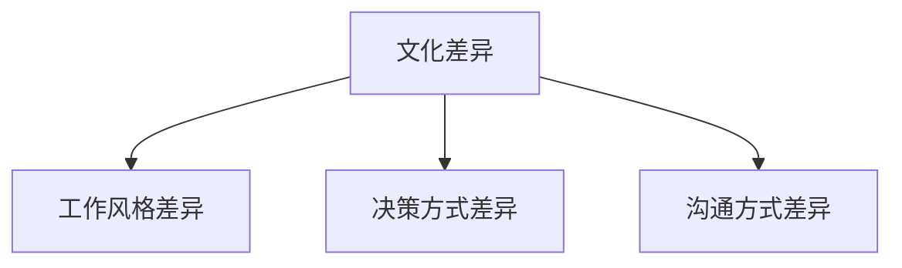
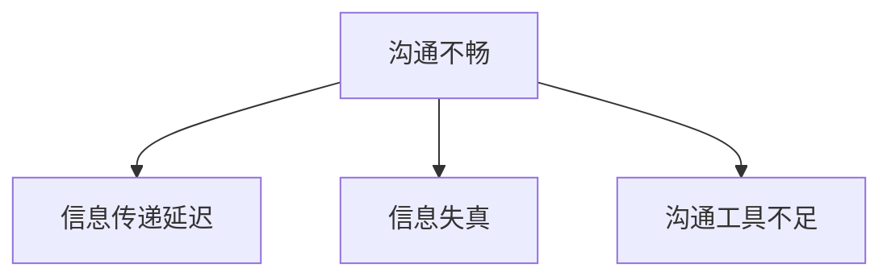
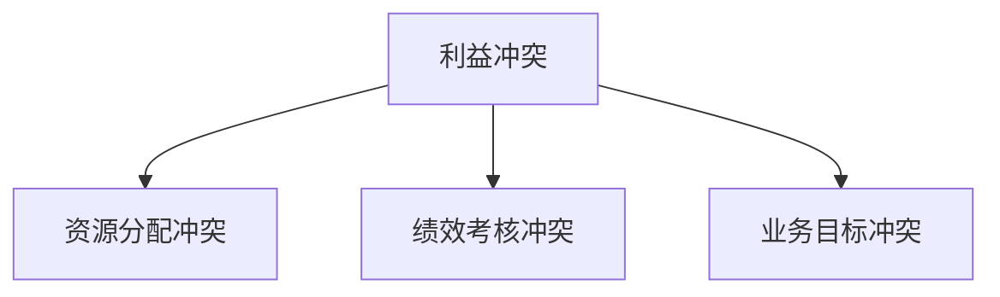

                 

### 文章标题

## 跨部门协作优化：打破信息孤岛的策略

### 关键词

- 跨部门协作
- 信息孤岛
- 管理策略
- 技术解决方案
- 成功案例

### 摘要

本文深入探讨了跨部门协作中的信息孤岛现象及其对工作效率的影响。通过分析跨部门协作的现状、障碍与挑战，本文提出了打破信息孤岛的具体策略，包括管理策略与技术解决方案。此外，通过剖析跨部门协作的最佳实践，本文旨在为企业在优化跨部门协作提供实际指导和借鉴，助力实现高效协作与信息共享。

### 背景介绍

在当今快速发展的企业环境中，跨部门协作已成为提升工作效率和业务成果的关键因素。然而，信息孤岛现象却在很多企业中普遍存在，阻碍了协作的顺利进行。信息孤岛指的是各部门之间由于沟通不畅、技术壁垒、组织文化差异等原因，导致信息无法有效共享和整合，形成信息壁垒的现象。

信息孤岛的存在对企业的负面影响是多方面的。首先，它降低了工作效率。由于信息不透明，员工无法及时获取到所需的信息，导致重复劳动和资源浪费。其次，它增加了决策难度。部门之间的信息不对称使得高层领导难以做出全面、准确的决策。最后，它影响了团队的凝聚力。信息孤岛加剧了部门间的隔阂，使得团队合作精神受到削弱。

优化跨部门协作，打破信息孤岛，已成为企业提升竞争力的迫切需求。本文将从问题背景、核心概念、障碍与挑战、策略与实施、最佳实践以及持续优化等方面，系统地探讨如何实现跨部门协作的优化。

### 核心概念与联系

在探讨跨部门协作优化之前，首先需要明确几个核心概念，并分析它们之间的联系。

#### 跨部门协作

跨部门协作是指企业内部不同部门之间，为了共同完成某项任务或达成某项目标，通过协调、沟通和合作所进行的工作。跨部门协作的核心在于信息的共享和资源的整合，以提高工作效率和业务成果。

#### 信息孤岛

信息孤岛是指由于技术、组织、文化等因素导致的企业内部部门之间信息交流不畅，形成的信息壁垒。信息孤岛的存在阻碍了信息的流动，使得各部门无法及时、准确地获取所需信息，从而影响了协作效果。

#### 信息共享平台

信息共享平台是一种技术解决方案，旨在实现企业内部各部门之间信息的透明化、实时化和自动化。通过建立统一的信息共享平台，企业可以实现数据的集中存储、共享和利用，打破信息孤岛，促进跨部门协作。

#### 沟通机制

沟通机制是企业内部信息传递的渠道和方式。有效的沟通机制可以增强部门之间的互动和信息流通，提高协作效率。沟通机制包括会议、邮件、即时通讯工具等多种形式。

#### 跨部门团队

跨部门团队是由来自不同部门的专业人员组成的临时或长期工作小组，旨在共同完成特定的项目或任务。跨部门团队的优势在于能够充分发挥各部门的专业优势，实现资源的优化配置和协同工作。

#### 管理策略

管理策略是企业为了实现跨部门协作优化所制定的一系列政策和措施。管理策略包括高层领导的支持、跨部门团队的构建、明确的协作目标设定等。

#### 技术解决方案

技术解决方案是指利用信息技术手段，实现跨部门协作优化的具体方法和工具。技术解决方案包括信息共享平台、通信工具优化、数据整合等。

#### 成功案例

成功案例是指在企业跨部门协作优化过程中取得显著成效的实际案例。成功案例可以为企业提供借鉴和参考，帮助其更好地实施跨部门协作优化。

这些核心概念之间的联系在于：跨部门协作的目标是通过有效沟通、资源共享和协作，打破信息孤岛，实现企业整体业务流程的高效运作。而实现这一目标，需要依靠信息共享平台、沟通机制、跨部门团队和管理策略等手段。通过这些手段的有机结合，企业可以实现跨部门协作的优化，提升整体运营效率。

### 跨部门协作的障碍与挑战

在实现跨部门协作优化的过程中，企业面临着多种障碍与挑战。这些障碍不仅阻碍了信息流通，也影响了跨部门协作的效率和质量。以下是几个主要的障碍与挑战：

#### 文化差异

文化差异是跨部门协作中最为显著的障碍之一。不同部门有着不同的工作习惯、价值观和行为规范，这些差异可能导致沟通不畅和协作困难。例如，技术部门可能更注重逻辑和效率，而市场部门则更关注客户需求和品牌形象。如果这些差异没有得到妥善处理，会导致误解和冲突，从而影响协作效果。

**核心概念原理：** 文化差异是指企业内部不同部门由于历史、价值观和工作方式不同，形成的不同行为规范和价值观念。

**属性特征对比表格：**

| 文化差异类型        | 特征描述                 | 影响因素                   |
|-------------------|------------------------|--------------------------|
| 工作风格差异       | 逻辑思维 vs. 客户导向       | 历史背景、部门定位          |
| 决策方式差异       | 分权决策 vs. 集权决策       | 组织结构、管理风格          |
| 沟通方式差异       | 技术术语 vs. 非技术术语      | 专业背景、语言习惯          |

**ER实体关系图架构：**

**解决方案：** 要解决文化差异问题，企业可以通过以下措施：

1. **建立跨部门沟通机制**：定期举行跨部门交流会，促进不同部门之间的沟通和理解。
2. **培养跨文化意识**：通过培训提高员工的跨文化沟通能力，增强团队协作意识。
3. **设立文化大使**：在每个部门中选派文化大使，作为部门之间的桥梁，促进文化交流。

#### 沟通不畅

沟通不畅是跨部门协作中的另一个主要障碍。企业内部部门众多，信息传递的路径复杂，可能导致信息失真或延迟。此外，缺乏有效的沟通工具和机制，也会使得沟通变得更加困难。例如，不同部门使用的通信工具不兼容，或者缺乏明确的沟通流程，都可能导致信息传递的滞后。

**核心概念原理：** 沟通不畅是指企业内部部门之间由于信息传递路径复杂、沟通工具不足或缺乏沟通机制，导致信息传递不畅的问题。

**属性特征对比表格：**

| 沟通不畅类型        | 特征描述                 | 影响因素                   |
|-------------------|------------------------|--------------------------|
| 信息传递延迟       | 信息传递时间过长         | 沟通路径复杂、工具不兼容    |
| 信息失真         | 信息在传递过程中发生偏差    | 缺乏有效的审核和反馈机制    |
| 沟通工具不足       | 没有合适的沟通工具支持     | 技术预算不足、未及时更新工具  |

**ER实体关系图架构：**

**解决方案：** 为了解决沟通不畅问题，企业可以采取以下措施：

1. **建立统一的沟通平台**：选择适合企业需求的沟通工具，确保各部门都能高效地使用。
2. **优化沟通流程**：明确信息传递的各个环节，确保信息能够及时、准确地传递。
3. **加强沟通培训**：定期组织沟通技巧培训，提高员工的沟通能力。

#### 利益冲突

利益冲突是跨部门协作中的另一个重要障碍。不同部门在业务目标、资源分配和绩效考核等方面可能存在差异，这些差异可能导致部门之间的利益冲突。例如，销售部门可能希望增加销售预算，而财务部门则可能更关注成本控制。利益冲突如果处理不当，会阻碍跨部门协作的顺利进行。

**核心概念原理：** 利益冲突是指企业内部不同部门由于在业务目标、资源分配和绩效考核等方面存在差异，导致部门之间的利益冲突。

**属性特征对比表格：**

| 利益冲突类型        | 特征描述                 | 影响因素                   |
|-------------------|------------------------|--------------------------|
| 资源分配冲突       | 资源分配不均             | 部门目标不一致、资源紧缺    |
| 绩效考核冲突       | 绩效指标不一致           | 评价标准不同、考核方式不一    |
| 业务目标冲突       | 部门目标冲突             | 战略规划差异、业务定位不一    |

**ER实体关系图架构：**

**解决方案：** 要解决利益冲突问题，企业可以采取以下措施：

1. **明确业务目标和资源分配**：通过制定明确的战略规划，确保各部门在资源分配和业务目标上保持一致。
2. **建立公平的绩效考核体系**：设计合理的绩效指标，确保各部门在考核中都能公平竞争。
3. **加强沟通与协调**：定期举行跨部门会议，协商解决利益冲突，促进部门之间的沟通和理解。

通过以上措施，企业可以有效克服跨部门协作中的障碍和挑战，实现跨部门协作的优化，提升整体运营效率。

### 跨部门协作优化策略

在明确了跨部门协作中的障碍与挑战后，我们需要进一步探讨如何制定和实施有效的优化策略，以打破信息孤岛，提升跨部门协作效率。以下是几个关键策略：

#### 管理策略

**高层领导支持**

高层领导的支持是跨部门协作优化的重要保障。只有高层领导高度重视并积极参与跨部门协作，才能推动相关策略的顺利实施。高层领导可以通过以下方式提供支持：

- **明确协作目标**：高层领导应明确跨部门协作的目标和重要性，将其纳入企业战略规划中。
- **制定政策和流程**：高层领导应制定跨部门协作的相关政策和流程，为各部门提供明确的指导。
- **提供资源**：高层领导应确保跨部门协作所需的人力、财力和技术资源得到充分保障。

**构建跨部门团队**

构建高效的跨部门团队是实现跨部门协作优化的关键。跨部门团队应由来自不同部门的核心成员组成，共同负责特定项目或任务的执行。构建跨部门团队的关键步骤包括：

- **确定团队成员**：根据项目需求，挑选具备相关技能和经验的团队成员。
- **明确职责和任务**：为团队成员分配明确的职责和任务，确保每个成员都清楚自己的工作内容和目标。
- **建立沟通机制**：定期举行团队会议，确保团队成员之间的信息流通和协同工作。

**设定明确的协作目标**

设定明确的协作目标是确保跨部门协作顺利进行的重要步骤。协作目标应具体、可衡量，并与企业的整体战略目标保持一致。设定协作目标的过程包括：

- **目标分解**：将企业战略目标分解为具体的跨部门协作目标。
- **目标确认**：与各部门负责人和团队成员共同确认协作目标，确保目标达成共识。
- **目标追踪**：建立目标追踪机制，定期评估目标达成情况，及时调整策略。

#### 技术策略

**信息共享平台**

信息共享平台是实现跨部门协作的重要技术手段。通过信息共享平台，企业可以实现数据的集中存储、共享和利用，打破信息孤岛。建立信息共享平台的关键步骤包括：

- **需求分析**：分析企业跨部门协作的需求，确定信息共享平台的功能和性能要求。
- **平台设计**：设计符合企业需求的信息共享平台架构，包括数据库设计、功能模块划分等。
- **平台实施**：根据设计方案，搭建信息共享平台，并进行测试和部署。
- **平台维护**：定期对信息共享平台进行维护和升级，确保其正常运行。

**通信工具优化**

优化通信工具是提升跨部门协作效率的重要措施。企业应根据实际需求选择合适的通信工具，如即时通讯软件、电子邮件、视频会议系统等。优化通信工具的关键步骤包括：

- **工具评估**：评估现有通信工具的优缺点，选择适合企业需求的通信工具。
- **工具培训**：对员工进行通信工具的使用培训，提高其使用效率。
- **工具整合**：将不同通信工具整合到一个平台上，实现信息的集中管理和协同工作。

**数据整合**

数据整合是跨部门协作优化的基础。通过数据整合，企业可以实现数据的标准化和统一化，提高数据分析的效率和准确性。数据整合的关键步骤包括：

- **数据收集**：收集企业内部各部门的数据，确保数据的全面性和准确性。
- **数据清洗**：对收集到的数据进行清洗，去除冗余和错误数据。
- **数据建模**：建立数据模型，对数据进行整合和分类，提高数据利用率。
- **数据存储**：将整合后的数据存储在统一的数据仓库中，便于各部门的查询和使用。

通过以上管理策略和技术策略的有机结合，企业可以打破信息孤岛，实现跨部门协作的优化，提升整体运营效率。

### 跨部门协作优化的最佳实践

为了更好地实现跨部门协作优化，企业可以借鉴以下成功案例和具体实施步骤，从而在实际操作中取得更好的效果。

#### 成功案例一：跨国公司的成功经验

某跨国公司在全球范围内拥有多个分支机构，为了提高跨部门协作效率，该公司采取了一系列优化措施。以下是其成功经验：

1. **高层领导支持**：公司高层领导高度重视跨部门协作，明确协作目标和重要性，并提供必要的资源支持。
2. **构建跨部门团队**：公司成立了多个跨部门团队，由来自不同地区、不同部门的成员组成，共同负责特定项目或任务的执行。
3. **信息共享平台**：公司搭建了统一的信息共享平台，实现了数据的集中存储和共享，打破了信息孤岛。
4. **沟通工具优化**：公司采用先进的沟通工具，如即时通讯软件、视频会议系统等，提高了沟通效率。
5. **数据整合**：公司对各部门的数据进行整合，建立了统一的数据模型和数据仓库，提高了数据分析的效率和准确性。

通过以上措施，该跨国公司显著提高了跨部门协作效率，实现了业务的快速响应和协同工作，从而提升了整体运营效率。

#### 成功案例二：中小企业的灵活策略

某中小企业由于资源有限，采取了更加灵活的跨部门协作策略，同样取得了显著效果。以下是其具体做法：

1. **明确协作目标**：企业明确了跨部门协作的目标，并将其纳入企业战略规划中，确保各部门在资源分配和业务目标上保持一致。
2. **利用社交媒体**：企业利用社交媒体平台进行跨部门沟通，降低了沟通成本，提高了信息传递的效率。
3. **内部竞赛**：企业通过内部竞赛和激励措施，激发员工的协作意识和积极性，提高了跨部门协作的积极性。
4. **定期会议**：企业定期举行跨部门会议，促进各部门之间的沟通和理解，解决协作中的问题。
5. **灵活调整**：企业根据业务需求和实际情况，灵活调整跨部门协作策略，确保协作始终与业务目标保持一致。

通过以上策略，该中小企业成功实现了跨部门协作优化，提高了工作效率和业务成果。

#### 具体实施步骤

为了实现跨部门协作优化，企业可以按照以下具体实施步骤进行：

1. **需求分析**：分析企业跨部门协作的需求，确定协作的目标、范围和关键问题。
2. **制定策略**：根据需求分析结果，制定跨部门协作的具体策略，包括管理策略和技术策略。
3. **资源准备**：准备实施跨部门协作优化所需的资源，包括人力、财力和技术资源。
4. **实施计划**：制定详细的实施计划，明确每个步骤的执行时间和责任人。
5. **培训与推广**：对员工进行培训，推广跨部门协作的理念和工具，提高员工的协作意识和能力。
6. **监控与调整**：对跨部门协作的实施过程进行监控，及时发现和解决问题，根据实际情况进行策略调整。
7. **评估与反馈**：对跨部门协作的效果进行评估，收集反馈意见，为后续优化提供依据。

通过以上具体实施步骤，企业可以逐步实现跨部门协作优化，提升整体运营效率。

### 持续优化与评估

跨部门协作优化是一个持续的过程，需要不断进行调整和改进，以确保其能够持续满足企业发展的需求。以下是如何进行持续优化与评估的具体方法：

#### 持续改进机制

1. **反馈机制**：建立有效的反馈机制，让员工能够自由地表达对跨部门协作的反馈和建议。这可以通过定期调查、员工会议、匿名反馈等方式实现。
   
2. **过程监控**：对跨部门协作的过程进行实时监控，包括协作效率、沟通质量、资源利用情况等。通过数据分析和报告，及时发现存在的问题。

3. **定期评估**：定期对跨部门协作的成效进行评估，包括设定关键绩效指标（KPIs），如协作时间、项目完成率、问题解决效率等。根据评估结果，制定改进计划。

#### 评估指标体系

1. **关键绩效指标（KPIs）**：制定合理的KPIs，如协作完成率、信息传递准确率、问题解决速度等，以便对跨部门协作的效果进行量化评估。

2. **数据分析与报告**：通过数据收集和分析，生成详细的报告，为管理层提供决策依据。报告内容可以包括协作效果、资源利用情况、问题分析等。

#### 改进建议

1. **优化流程**：根据反馈和评估结果，对跨部门协作的流程进行优化，简化不必要的环节，提高协作效率。

2. **提升培训**：根据员工的需求和反馈，定期组织培训，提升员工的协作技能和跨文化沟通能力。

3. **技术升级**：根据业务发展和协作需求，不断升级和更新协作工具，提高协作的智能化和自动化水平。

4. **激励机制**：建立激励机制，鼓励员工积极参与跨部门协作，提高协作的积极性和主动性。

通过以上持续优化与评估的方法，企业可以不断改进跨部门协作，提高协作效率，促进业务发展。

### 跨部门协作在其他行业的应用

跨部门协作不仅在企业内部发挥着重要作用，在其他行业中也得到了广泛应用，为行业发展和效率提升提供了有力支持。以下是跨部门协作在教育、医疗和公共管理等领域的一些具体应用案例。

#### 教育行业

在教育行业中，跨部门协作主要表现在学校内部各部门之间的协作以及不同学校之间的合作。例如，在课程开发中，教师、行政人员和技术人员需要紧密合作，确保课程内容的新颖性和技术支持。跨部门协作的具体应用包括：

- **课程开发**：通过跨部门协作，教师、技术人员和课程管理人员共同制定课程计划，设计课程内容，确保课程质量。
- **资源共享**：学校内部各部门共享教学资源，如教材、教学设备和在线课程，提高资源利用率。
- **科研合作**：教师和科研人员跨部门合作，共同进行教育研究项目，推动教育创新。

#### 医疗行业

在医疗行业中，跨部门协作对于提高医疗服务质量和效率至关重要。医疗行业的跨部门协作主要表现在医院内部各部门之间的协作以及医疗体系与政府、社区等外部组织的合作。具体应用包括：

- **医疗流程优化**：医院内部各部门，如临床科室、后勤保障、医疗质量管理等部门，通过跨部门协作，优化医疗流程，提高患者满意度。
- **医疗资源共享**：通过跨部门协作，实现医疗资源的优化配置，如设备共享、医护人员跨科室协作等，提高资源利用率。
- **公共卫生管理**：医疗机构与政府、社区等外部组织合作，共同开展公共卫生管理工作，如疾病预防控制、健康教育等。

#### 公共管理

在公共管理领域，跨部门协作对于提升政府工作效率和公共服务质量具有重要意义。公共管理的跨部门协作主要表现在政府部门之间以及政府与社会组织、企业之间的合作。具体应用包括：

- **政策制定与执行**：政府部门通过跨部门协作，共同制定和执行政策，如城市规划、环境保护等，提高政策的科学性和执行力。
- **应急响应**：在突发事件和紧急情况下，政府部门通过跨部门协作，快速响应和处理，如自然灾害救援、疫情防控等。
- **公共服务**：政府与社会组织、企业合作，提供多样化的公共服务，如社区服务、养老服务、城市管理等。

通过跨部门协作，教育、医疗和公共管理等领域实现了资源的共享和整合，提高了工作效率和服务质量，为行业发展和民生改善做出了积极贡献。

### 跨部门协作的未来趋势

随着技术的不断进步和全球化的深入发展，跨部门协作正在迎来新的机遇和挑战。未来，跨部门协作将呈现出以下趋势：

#### 新技术的引入

1. **人工智能（AI）**：人工智能技术将在跨部门协作中发挥重要作用，通过智能助手、自动化流程和智能分析，提升协作效率和决策质量。
2. **大数据分析**：大数据技术将助力企业实现数据驱动的决策，通过数据分析，优化跨部门协作流程，提高协作效果。
3. **区块链**：区块链技术将提供安全的协作环境，确保数据透明、可信，减少信息孤岛问题。

#### 数字化转型的推动

数字化转型将成为企业实现跨部门协作优化的关键推动力。企业将通过数字化转型，实现业务流程的数字化、自动化和智能化，提高协作效率和响应速度。

#### 全球化的影响

全球化将带来更广泛的跨部门协作需求。企业将面临跨文化、跨国界的协作挑战，需要建立全球协作网络，提升全球运营效率。

#### 持续优化的需求

随着企业环境和业务需求的不断变化，跨部门协作优化将成为企业持续关注的重要议题。企业需要通过持续优化，适应变化，保持竞争优势。

### 展望未来

未来，跨部门协作将更加智能、高效和全球化。企业需要积极拥抱新技术，推动数字化转型，加强跨文化沟通，实现跨部门协作的全面优化，从而提升整体运营效率，应对复杂的市场环境，实现持续发展。

### 总结

本文从跨部门协作的现状、核心概念、障碍与挑战、优化策略、最佳实践到持续优化与评估，全面探讨了如何打破信息孤岛，实现跨部门协作的优化。我们分析了文化差异、沟通不畅和利益冲突等障碍，提出了管理策略和技术策略，并分享了成功案例和具体实施步骤。

核心概念如跨部门协作、信息孤岛、信息共享平台、沟通机制等，对于理解跨部门协作至关重要。优化策略包括高层领导支持、构建跨部门团队、设定明确的协作目标、信息共享平台建设、通信工具优化和数据整合等。

未来，随着新技术的引入、数字化转型的推进和全球化的影响，跨部门协作将迎来更多机遇和挑战。企业需要持续优化跨部门协作，提升运营效率，以适应快速变化的市场环境。

### 展望未来

展望未来，跨部门协作将迎来更多的机遇与挑战。随着人工智能、大数据和区块链等新技术的不断成熟，企业将能够实现更加智能化、自动化和透明的协作流程。这些技术不仅能够提升协作效率，还能帮助企业在复杂环境中做出更准确的决策。

数字化转型将成为推动跨部门协作优化的重要力量。通过数字化手段，企业可以重构业务流程，实现信息的实时共享和高效处理，从而提升整体运营效率。此外，全球化的发展将使得企业面临更多的跨文化协作挑战，但同时也带来了更广阔的市场和合作机会。

在未来的跨部门协作中，企业需要更加注重团队建设，培养员工的跨文化沟通能力，建立灵活的协作机制。同时，持续优化与评估将成为企业保持竞争优势的关键。通过不断地反馈和调整，企业可以确保跨部门协作始终与业务需求保持一致，实现持续改进。

总之，跨部门协作优化是企业发展的重要课题。通过科学的管理策略和技术手段，企业可以打破信息孤岛，实现高效协作，从而在激烈的市场竞争中脱颖而出。展望未来，我们期待看到更多创新和突破，为跨部门协作注入新的活力。

### 作者信息

**作者：** AI天才研究院/AI Genius Institute & 禅与计算机程序设计艺术 /Zen And The Art of Computer Programming

