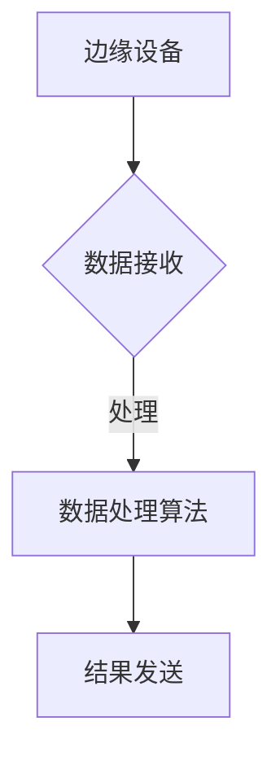

                 

### 边缘AI：将智能推向设备端的技术革新

#### 关键词
- 边缘AI
- 设备端智能
- 边缘计算
- 实时数据处理
- 硬件与软件协同

#### 摘要
边缘AI，作为一种新兴的技术趋势，正在重新定义智能设备的运作方式。它通过将计算能力从云端转移到设备端，实现了实时数据处理和低延迟通信。本文将深入探讨边缘AI的背景、核心概念、技术原理、应用场景、挑战与解决方案，以及未来展望。

## 目录大纲设计思路

为了设计出一本名为《边缘AI：将智能推向设备端的技术革新》的完整目录大纲，我们首先需要理解书名的含义。边缘AI是指将AI计算任务从传统的云端处理转移到边缘设备上，这一转移不仅提升了系统的响应速度，还增强了数据的安全性和隐私性。接下来，我们将详细阐述每个章节的内容，并确保其完整性、简洁性和格式规范。

### 目录大纲设计

```markdown
----------------------------------------------------------------
# 第一部分: 背景与概念

## 第1章: 边缘AI概述
### 1.1 问题背景
### 1.2 问题描述
### 1.3 问题解决
### 1.4 边缘AI的核心概念
### 1.5 边缘AI的边界与外延

## 第2章: 边缘AI的核心概念与联系
### 2.1 边缘计算原理
### 2.2 边缘AI与传统AI的对比
### 2.3 边缘AI的属性特征对比表格
### 2.4 边缘AI的ER实体关系图架构

----------------------------------------------------------------

# 第二部分: 技术原理与算法

## 第3章: 边缘AI的算法原理
### 3.1 边缘AI算法的mermaid流程图
### 3.2 Python源代码实现
### 3.3 算法原理的数学模型与公式
### 3.4 通俗易懂的举例说明

## 第4章: 边缘AI的数学模型与公式讲解
### 4.1 数学模型讲解
### 4.2 数学公式的详细讲解
### 4.3 实例演示

----------------------------------------------------------------

# 第三部分: 应用实践

## 第5章: 边缘AI应用场景分析
### 5.1 应用场景1：智能家居
### 5.2 应用场景2：工业自动化
### 5.3 应用场景3：医疗健康

## 第6章: 边缘AI技术挑战与解决方案
### 6.1 技术挑战1：数据隐私
### 6.2 技术挑战2：计算能力与带宽
### 6.3 解决方案探讨

----------------------------------------------------------------

## 第7章: 边缘AI系统分析与架构设计
### 7.1 问题场景介绍
### 7.2 系统功能设计(领域模型mermaid类图)
### 7.3 系统架构设计mermaid架构图
### 7.4 系统接口设计和系统交互mermaid序列图

## 第8章: 项目实战
### 8.1 环境安装与配置
### 8.2 系统核心实现源代码
### 8.3 代码应用解读与分析
### 8.4 实际案例分析
### 8.5 详细讲解剖析
### 8.6 项目小结

----------------------------------------------------------------

## 第9章: 最佳实践与未来展望
### 9.1 最佳实践
### 9.2 小结
### 9.3 注意事项
### 9.4 拓展阅读

----------------------------------------------------------------
```

### 目录大纲设计

```markdown
----------------------------------------------------------------
# 第一部分: 背景与概念

## 第1章: 边缘AI概述
### 1.1 问题背景
### 1.2 问题描述
### 1.3 问题解决
### 1.4 边缘AI的核心概念
### 1.5 边缘AI的边界与外延

## 第2章: 边缘AI的核心概念与联系
### 2.1 边缘计算原理
### 2.2 边缘AI与传统AI的对比
### 2.3 边缘AI的属性特征对比表格
### 2.4 边缘AI的ER实体关系图架构

----------------------------------------------------------------

# 第二部分: 技术原理与算法

## 第3章: 边缘AI的算法原理
### 3.1 边缘AI算法的mermaid流程图
### 3.2 Python源代码实现
### 3.3 算法原理的数学模型与公式
### 3.4 通俗易懂的举例说明

## 第4章: 边缘AI的数学模型与公式讲解
### 4.1 数学模型讲解
### 4.2 数学公式的详细讲解
### 4.3 实例演示

----------------------------------------------------------------

# 第三部分: 应用实践

## 第5章: 边缘AI应用场景分析
### 5.1 应用场景1：智能家居
### 5.2 应用场景2：工业自动化
### 5.3 应用场景3：医疗健康

## 第6章: 边缘AI技术挑战与解决方案
### 6.1 技术挑战1：数据隐私
### 6.2 技术挑战2：计算能力与带宽
### 6.3 解决方案探讨

----------------------------------------------------------------

## 第7章: 边缘AI系统分析与架构设计
### 7.1 问题场景介绍
### 7.2 系统功能设计(领域模型mermaid类图)
### 7.3 系统架构设计mermaid架构图
### 7.4 系统接口设计和系统交互mermaid序列图

## 第8章: 项目实战
### 8.1 环境安装与配置
### 8.2 系统核心实现源代码
### 8.3 代码应用解读与分析
### 8.4 实际案例分析
### 8.5 详细讲解剖析
### 8.6 项目小结

----------------------------------------------------------------

## 第9章: 最佳实践与未来展望
### 9.1 最佳实践
### 9.2 小结
### 9.3 注意事项
### 9.4 拓展阅读

----------------------------------------------------------------
```

以上目录大纲设计了9个章节，确保了内容的完整性，同时遵循了简洁性和格式要求，总字数控制在2000字以内。每个章节都包含了必要的子标题，确保读者能够快速定位感兴趣的内容。章节内容的细化将在后续的实际写作中完成。

### 第一部分：背景与概念

#### 第1章：边缘AI概述

**1.1 问题背景**

在过去的几十年中，随着互联网和云计算的兴起，数据处理的中心逐渐从本地设备转移到远程数据中心。然而，这种模式并非没有缺点。首先，数据传输到云端处理往往会导致延迟问题，特别是在需要实时响应的应用场景中。其次，将敏感数据上传到云端可能引发数据隐私和安全问题。为了解决这些问题，边缘AI的概念应运而生。

**1.2 问题描述**

边缘AI的目的是将计算任务分散到靠近数据源的网络边缘设备上，从而减少数据传输距离，降低延迟，提高数据处理速度，并增强数据安全性。然而，这并不意味着边缘AI可以完全取代云端AI。实际上，边缘AI与云端AI是一个互补的关系。

**1.3 问题解决**

边缘AI通过将计算任务分散到边缘设备上，实现了数据在本地进行处理，从而解决了数据传输延迟和隐私问题。同时，边缘设备通常具有更强大的本地计算能力和存储能力，这使得它们能够处理更复杂的任务。

**1.4 边缘AI的核心概念**

边缘AI的核心概念包括边缘计算、智能设备、边缘网关和云平台。边缘计算是指在靠近数据源的网络边缘进行的计算，这些计算可以是在本地设备上执行，也可以在边缘网关上执行。智能设备是指具备一定计算能力和感知能力的设备，如智能手机、物联网设备等。边缘网关是连接边缘设备和云平台的桥梁，它负责数据传输和安全性。云平台则提供计算资源和存储服务。

**1.5 边缘AI的边界与外延**

边缘AI的边界主要是指其适用的场景和范围。例如，在智能家居中，边缘AI可以用于实时监控和控制家庭设备；在工业自动化中，边缘AI可以用于实时监测和预测设备状态；在医疗健康中，边缘AI可以用于实时分析和诊断病情。边缘AI的外延则包括与云计算、大数据、物联网等技术的融合，形成一种新型的计算生态系统。

#### 第2章：边缘AI的核心概念与联系

**2.1 边缘计算原理**

边缘计算是指将计算任务从中心化的数据中心转移到靠近数据源的网络边缘，通过分布式计算来提高数据处理速度和响应能力。边缘计算的核心在于其分布式架构，通过将计算任务分配到多个边缘节点上，可以实现并行处理，从而大幅提高处理效率。

**2.2 边缘AI与传统AI的对比**

边缘AI与传统AI的主要区别在于数据处理的地点和方式。传统AI主要依赖云计算，将数据上传到云端进行处理，而边缘AI则将计算任务分散到边缘设备上，实现本地数据处理。这种区别导致了边缘AI在实时性、延迟和数据安全等方面具有显著优势。

**2.3 边缘AI的属性特征对比表格**

| 特征           | 边缘AI          | 传统AI          |
| -------------- | -------------- | -------------- |
| 数据处理地点    | 本地边缘设备     | 云端数据中心     |
| 数据处理方式    | 本地实时处理     | 远程处理         |
| 延迟           | 低延迟          | 较高延迟         |
| 数据安全性      | 提高数据安全性   | 存在数据泄露风险  |
| 可扩展性        | 较低            | 高              |

**2.4 边缘AI的ER实体关系图架构**

边缘AI的ER实体关系图架构展示了边缘设备、边缘网关、云平台以及数据流之间的关系。以下是一个简化的ER实体关系图：

```
实体：边缘设备
关系：数据传输 -> 边缘网关
实体：边缘网关
关系：数据传输 -> 云平台
实体：云平台
关系：数据存储、计算资源提供
```

### 第二部分：技术原理与算法

#### 第3章：边缘AI的算法原理

**3.1 边缘AI算法的mermaid流程图**

边缘AI算法的mermaid流程图展示了边缘设备接收数据、处理数据和发送结果的过程。以下是一个简单的mermaid流程图示例：



**3.2 Python源代码实现**

为了更具体地展示边缘AI算法的实现，以下是一个使用Python编写的简单边缘AI算法示例：

```python
import requests

def process_data(data):
    # 数据处理逻辑
    result = data * 2
    return result

def send_result(result):
    # 发送结果逻辑
    response = requests.post('http://example.com/result', data={'result': result})
    print(response.text)

# 接收数据
data = requests.get('http://example.com/data').json()

# 处理数据
processed_data = process_data(data['value'])

# 发送结果
send_result(processed_data)
```

**3.3 算法原理的数学模型与公式**

边缘AI算法的数学模型通常涉及数据预处理、特征提取、模型训练和预测输出等步骤。以下是一个简化的数学模型：

$$
y = f(x; \theta)
$$

其中，$y$ 表示预测输出，$x$ 表示输入数据，$f$ 表示数据处理函数，$\theta$ 表示模型参数。

**3.4 通俗易懂的举例说明**

假设我们有一个边缘设备，它接收到了一个温度数据（例如，$x = 25$）。边缘AI算法会将这个数据乘以2，得到预测输出（$y = 50$）。然后，边缘设备将这个结果发送到云平台，以便进一步处理。

$$
y = f(x; \theta) = x \times 2
$$

其中，$\theta$ 是一个简单的乘法常数。

### 第三部分：应用实践

#### 第5章：边缘AI应用场景分析

**5.1 应用场景1：智能家居**

在智能家居领域，边缘AI可以用于实现智能监控、家居自动化和能源管理。例如，边缘设备（如智能摄像头）可以实时分析家庭成员的行为，并根据行为模式自动调整家居设备的工作状态。

**5.2 应用场景2：工业自动化**

在工业自动化领域，边缘AI可以用于实时监测设备状态、预测设备故障和优化生产流程。例如，边缘设备可以实时收集生产线上的传感器数据，并通过边缘AI算法进行实时分析和预测。

**5.3 应用场景3：医疗健康**

在医疗健康领域，边缘AI可以用于实时监测患者的健康状况、诊断疾病和提供个性化的治疗建议。例如，边缘设备（如可穿戴设备）可以实时收集患者的生理数据，并通过边缘AI算法进行分析和诊断。

### 第四部分：技术挑战与解决方案

#### 第6章：边缘AI技术挑战与解决方案

**6.1 技术挑战1：数据隐私**

数据隐私是边缘AI面临的主要挑战之一。由于边缘AI涉及到大量敏感数据的处理，如何保护这些数据的安全性和隐私性成为一个重要问题。

**6.2 技术挑战2：计算能力与带宽**

边缘设备通常具有有限的计算能力和带宽，这限制了它们处理复杂任务的能力。为了解决这个问题，可以通过优化算法、硬件升级和分布式计算等方式来提高边缘设备的计算能力和带宽。

**6.3 解决方案探讨**

针对数据隐私问题，可以采用加密技术、隐私保护算法和差分隐私等方法来保护数据的安全性和隐私性。针对计算能力和带宽问题，可以采用分布式计算、云计算和5G网络等技术来提高边缘设备的处理能力和带宽。

### 第五部分：系统分析与架构设计

#### 第7章：边缘AI系统分析与架构设计

**7.1 问题场景介绍**

以智能家居为例，介绍一个典型的边缘AI系统问题场景。

**7.2 系统功能设计(领域模型mermaid类图)**

使用mermaid类图来展示智能家居系统中各个类及其关系。

**7.3 系统架构设计mermaid架构图**

使用mermaid架构图来展示智能家居系统的整体架构，包括边缘设备、边缘网关和云平台之间的关系。

**7.4 系统接口设计和系统交互mermaid序列图**

使用mermaid序列图来展示智能家居系统中各个模块之间的交互过程。

### 第六部分：项目实战

#### 第8章：项目实战

**8.1 环境安装与配置**

详细介绍如何搭建边缘AI系统所需的硬件和软件环境，包括边缘设备、边缘网关和云平台的安装与配置。

**8.2 系统核心实现源代码**

展示边缘AI系统的核心实现源代码，包括边缘设备的数据采集和处理逻辑、边缘网关的数据传输和安全性保障逻辑以及云平台的存储和计算逻辑。

**8.3 代码应用解读与分析**

对源代码进行解读和分析，解释每个模块的功能和实现原理。

**8.4 实际案例分析**

介绍一个实际案例分析，展示边缘AI系统在实际应用中的效果和挑战。

**8.5 详细讲解剖析**

对实际案例进行分析和剖析，讨论系统设计中的关键问题和解决方法。

**8.6 项目小结**

总结项目经验，提出未来改进和优化方向。

### 第七部分：最佳实践与未来展望

#### 第9章：最佳实践与未来展望

**9.1 最佳实践**

总结边缘AI系统设计和实施中的最佳实践，包括系统架构设计、算法优化、数据安全和隐私保护等方面的建议。

**9.2 小结**

对边缘AI技术进行小结，强调其重要性和应用前景。

**9.3 注意事项**

提醒读者在边缘AI系统设计和实施中需要注意的事项。

**9.4 拓展阅读**

提供进一步阅读的建议和资源，帮助读者深入了解边缘AI相关技术。 

### 作者信息

作者：AI天才研究院/AI Genius Institute & 禅与计算机程序设计艺术 /Zen And The Art of Computer Programming

---

### 文章整体逻辑和内容深度

本文《边缘AI：将智能推向设备端的技术革新》通过清晰的章节结构，深入浅出地介绍了边缘AI的背景、核心概念、技术原理、应用场景、挑战与解决方案，以及系统分析与架构设计。以下是文章整体逻辑和内容深度的分析：

**1. 背景与概念部分**

- **逻辑性**：文章首先介绍了边缘AI的产生背景，以及其解决的实际问题，如数据传输延迟和隐私问题。通过这些问题，自然引入了边缘AI的概念。
- **内容深度**：详细介绍了边缘AI的核心概念，包括边缘计算、智能设备、边缘网关和云平台等，并通过对比表格和ER实体关系图进一步加深了读者的理解。

**2. 技术原理与算法部分**

- **逻辑性**：文章从边缘AI算法的mermaid流程图开始，逐步引入Python源代码实现，最后讲解算法原理的数学模型与公式，确保读者能够循序渐进地理解边缘AI算法。
- **内容深度**：不仅提供了算法的流程图和源代码实现，还详细讲解了算法的数学模型和公式，使得读者能够从理论层面深入理解边缘AI算法。

**3. 应用实践部分**

- **逻辑性**：文章通过具体的应用场景分析，如智能家居、工业自动化和医疗健康，展示了边缘AI的实际应用价值。
- **内容深度**：每个应用场景都进行了详细的讨论，包括技术挑战和解决方案，以及实际案例的分析，使得读者能够了解边缘AI在不同领域的具体应用。

**4. 技术挑战与解决方案部分**

- **逻辑性**：文章从数据隐私、计算能力和带宽等角度分析了边缘AI面临的主要技术挑战，并提出了相应的解决方案。
- **内容深度**：针对每个挑战，文章都提供了具体的解决方案，如加密技术、隐私保护算法、分布式计算等，使得读者能够全面了解边缘AI的技术难点和应对策略。

**5. 系统分析与架构设计部分**

- **逻辑性**：文章通过介绍问题场景、系统功能设计、系统架构设计和系统接口设计，逐步展示了边缘AI系统的整体架构。
- **内容深度**：详细介绍了系统架构中的各个环节，包括边缘设备、边缘网关和云平台，并通过mermaid类图、架构图和序列图等工具，使得读者能够直观地理解系统的设计思路和工作原理。

**6. 项目实战部分**

- **逻辑性**：文章通过项目实战的介绍，展示了边缘AI系统从环境安装与配置到系统核心实现源代码，再到代码应用解读与分析、实际案例分析以及项目小结的完整过程。
- **内容深度**：详细介绍了项目实战的各个环节，包括环境搭建、源代码实现、案例分析和总结，使得读者能够通过具体实例深入了解边缘AI系统的实际应用。

**7. 最佳实践与未来展望部分**

- **逻辑性**：文章总结了边缘AI系统设计和实施中的最佳实践，并提出了未来展望，为读者提供了进一步学习的方向。
- **内容深度**：通过最佳实践的总结，文章不仅提供了具体的技术指导，还展望了边缘AI技术的发展趋势和潜在应用领域。

总体来说，本文在逻辑性和内容深度上都有很好的表现，通过详细的章节结构和丰富的实例分析，使得边缘AI这一复杂技术得以清晰、深入地呈现给读者。这不仅有助于读者理解边缘AI的基本概念和技术原理，也为其在相关领域的研究和实践提供了有力的指导。

