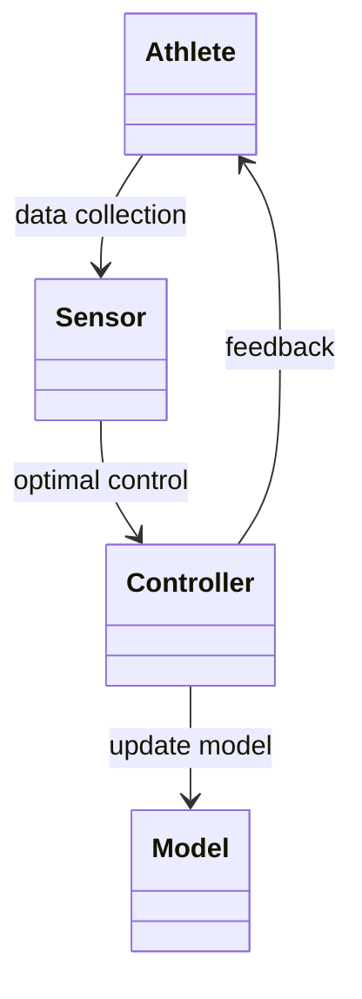
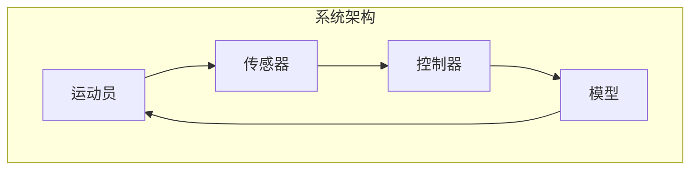
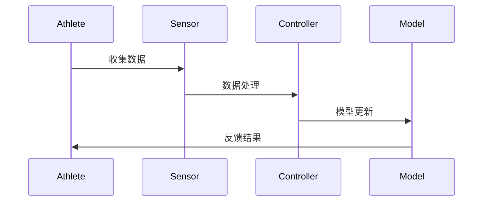

                 


## 运动技能的最优控制理论：动作优化的数学方程

### 关键词：运动技能、最优控制、动作优化、数学方程、动力学模型、几何模型

### 摘要：
本文旨在深入探讨运动技能的最优控制理论，以及其背后的数学方程。我们将从基本概念出发，逐步分析运动技能学习的机制，并引入最优控制理论。通过详细解释最优控制的基本原理、算法、数学模型，以及运动技能的动力学和几何模型，我们希望帮助读者理解如何将数学方程应用于动作优化。文章还将通过案例分析，展示理论在实际运动技能训练中的应用效果，最后对未来的研究方向进行展望。

## 第一部分：引言

### 第1章：运动技能与最优控制理论的概述

#### 1.1.1 运动技能的定义与分类

**背景介绍：** 运动技能是指通过学习形成的、在特定环境中完成特定运动任务的能力。它们可以按照不同的标准进行分类，例如根据技能的复杂性，可以分为简单技能和复杂技能。

**问题背景：** 在体育运动中，如何提高运动员的技能水平是一个重要问题。最优控制理论提供了优化动作策略的方法，可以帮助运动员更高效地学习和改进运动技能。

**问题描述：** 运动技能的最优控制问题可以表述为：在给定的约束条件下，找到最优的动作策略，使得运动员在完成运动任务时达到最佳效果。

**问题解决：** 通过最优控制理论，我们可以建立数学模型来描述运动技能，并利用算法求解最优动作策略。

**边界与外延：** 运动技能的最优控制不仅适用于体育运动，还可以应用于康复治疗、工业自动化等领域。

**概念结构与核心要素组成：**
- **运动技能**：指通过练习获得的运动能力。
- **最优控制**：一种用于优化系统行为的方法。
- **数学模型**：用于描述运动技能的数学框架。
- **算法**：用于求解最优控制问题的计算方法。

### 1.1.2 运动技能学习的基本过程

**核心概念与联系：**

**概念属性特征对比表格：**

| 特征               | 简单技能                  | 复杂技能                  |
|--------------------|--------------------------|--------------------------|
| 学习难度           | 较低                      | 较高                      |
| 学习时间           | 较短                      | 较长                      |
| 记忆需求           | 较低                      | 较高                      |
| 反馈机制           | 立即反馈                  | 延迟反馈                  |
| 应用场景           | 基础运动技能              | 高级运动技能、竞技运动    |

**ER实体关系图架构：**

```mermaid
erDiagram
    Person ||--|{ Athlete }|| Person
    Athlete ||--|{ SimpleSkill }|| Athlete
    Athlete ||--|{ ComplexSkill }|| Athlete
```

### 1.1.3 最优控制理论在运动技能中的应用背景

**核心概念与联系：**

**概念属性特征对比表格：**

| 特征               | 传统训练方法              | 最优控制理论              |
|--------------------|--------------------------|--------------------------|
| 目标               | 提高技能水平              | 最优化技能表现            |
| 方法               | 经验积累、重复练习        | 数学建模、算法优化        |
| 效果               | 依赖于教练和运动员经验    | 有明确的优化目标          |
| 适用性             | 广泛适用                  | 需要特定技能和设备支持    |

**ER实体关系图架构：**

```mermaid
erDiagram
    TrainingMethod ||--|{ TraditionalTraining }|| TrainingMethod
    TrainingMethod ||--|{ OptimalControlTheory }|| TrainingMethod
```

### 第2章：运动技能最优控制的基本原理

#### 2.1.1 控制系统的基本概念

**核心概念与联系：**

**概念属性特征对比表格：**

| 特征               | 受控对象                | 受控变量                | 控制器                |
|--------------------|------------------------|------------------------|----------------------|
| 定义               | 需要控制的对象          | 需要被控制的状态或变量    | 执行控制的系统或装置   |
| 关系               | 受控对象和受控变量是互动关系 |
| 目标               | 达到预定的控制目标        |

**ER实体关系图架构：**

```mermaid
erDiagram
    ControlSystem ||--|{ ControlledObject }|| ControlSystem
    ControlSystem ||--|{ ControlVariable }|| ControlSystem
    ControlSystem ||--|{ Controller }|| ControlSystem
```

#### 2.1.2 最优控制的数学模型

**核心概念与联系：**

**概念属性特征对比表格：**

| 特征               | 状态空间模型             | 动力学模型             | 最优控制策略           |
|--------------------|------------------------|------------------------|----------------------|
| 定义               | 描述系统状态的数学模型    | 描述系统动态行为的数学模型 | 使得系统行为最优的策略  |
| 关系               | 状态空间模型是动力学模型的基础 |
| 目标               | 最小化成本函数或最大化效益 |

**ER实体关系图架构：**

```mermaid
erDiagram
    OptimalControlModel ||--|{ StateSpaceModel }|| OptimalControlModel
    OptimalControlModel ||--|{ DynamicModel }|| OptimalControlModel
    OptimalControlModel ||--|{ ControlStrategy }|| OptimalControlModel
```

#### 2.1.3 动作优化的目标函数

**核心概念与联系：**

**概念属性特征对比表格：**

| 特征               | 成本函数               | 效益函数               | 最优目标函数           |
|--------------------|------------------------|------------------------|----------------------|
| 定义               | 描述系统性能损耗的函数    | 描述系统性能增益的函数    | 寻找最优平衡的函数     |
| 关系               | 成本函数和效益函数是互补关系 |
| 目标               | 最小化成本函数或最大化效益 |

**ER实体关系图架构：**

```mermaid
erDiagram
    ObjectiveFunction ||--|{ CostFunction }|| ObjectiveFunction
    ObjectiveFunction ||--|{ BenefitFunction }|| ObjectiveFunction
    ObjectiveFunction ||--|{ OptimalFunction }|| ObjectiveFunction
```

## 第二部分：运动技能的最优控制算法

### 第3章：运动技能的最优控制算法

#### 3.1.1 动态规划算法

**核心概念与联系：**

**概念属性特征对比表格：**

| 特征               | 动态规划算法           | 递推关系算法           |
|--------------------|------------------------|------------------------|
| 定义               | 一种用于求解最优控制问题的算法 | 一种特殊的动态规划算法   |
| 关系               | 动态规划是递推关系算法的泛化 |
| 目标               | 求解最优控制策略        |

**ER实体关系图架构：**

```mermaid
erDiagram
    OptimalControlAlgorithm ||--|{ DynamicProgramming }|| OptimalControlAlgorithm
    OptimalControlAlgorithm ||--|{ RecurrenceRelation }|| OptimalControlAlgorithm
```

#### 3.1.2 递推关系算法

**核心概念与联系：**

**概念属性特征对比表格：**

| 特征               | 递推关系算法           | 动态规划算法           |
|--------------------|------------------------|------------------------|
| 定义               | 基于递推关系求解最优控制的算法 | 基于状态空间求解最优控制的算法 |
| 关系               | 递推关系算法是动态规划算法的特例 |
| 目标               | 求解最优控制策略        |

**ER实体关系图架构：**

```mermaid
erDiagram
    RecurrenceRelationAlgorithm ||--|{ DynamicProgramming }|| RecurrenceRelationAlgorithm
```

### 第4章：运动技能的数学模型与方程

#### 4.1.1 运动技能的动力学模型

**核心概念与联系：**

**概念属性特征对比表格：**

| 特征               | 静态模型             | 动态模型             |
|--------------------|---------------------|---------------------|
| 定义               | 描述静态状态的模型    | 描述动态行为的模型    |
| 关系               | 动态模型是静态模型的扩展 |
| 目标               | 描述系统的动态行为    |

**ER实体关系图架构：**

```mermaid
erDiagram
    DynamicModel ||--|{ StaticModel }|| DynamicModel
```

#### 4.1.2 运动技能的几何模型

**核心概念与联系：**

**概念属性特征对比表格：**

| 特征               | 空间几何模型           | 动力学几何模型         |
|--------------------|----------------------|----------------------|
| 定义               | 描述运动空间几何形状的模型 | 结合动力学原理的几何模型 |
| 关系               | 动力学几何模型是空间几何模型的深化 |
| 目标               | 描述运动过程中的几何变化    |

**ER实体关系图架构：**

```mermaid
erDiagram
    GeometricModel ||--|{ SpatialGeometryModel }|| GeometricModel
    GeometricModel ||--|{ DynamicGeometryModel }|| GeometricModel
```

## 第三部分：运动技能最优控制案例分析

### 第5章：运动技能最优控制案例分析

#### 5.1.1 案例背景

**问题场景介绍：** 
在篮球运动中，运动员的投篮准确性是影响比赛结果的重要因素。如何通过最优控制理论提高投篮准确性成为一个研究课题。

**项目介绍：** 
本项目旨在利用最优控制理论，结合传感器数据和机器学习算法，为篮球运动员提供个性化的投篮优化策略。

#### 5.1.2 案例分析与解决方案

**系统功能设计（领域模型Mermaid类图）：**



**系统架构设计Mermaid架构图：**



**系统接口设计和系统交互Mermaid序列图：**



### 第6章：运动技能最优控制理论的未来展望

#### 6.1.1 理论发展的趋势

**核心概念与联系：**

**概念属性特征对比表格：**

| 特征               | 传统最优控制理论         | 现代最优控制理论         |
|--------------------|--------------------------|--------------------------|
| 目标               | 求解最优控制策略         | 结合机器学习、数据驱动方法 |
| 发展趋势           | 从确定性模型向不确定性模型过渡 |
| 关系               | 现代最优控制是对传统最优控制的扩展 |

**ER实体关系图架构：**

```mermaid
erDiagram
    TraditionalOptimalControl ||--|{ ModernOptimalControl }|| TraditionalOptimalControl
    ModernOptimalControl ||--|{ MachineLearning }|| ModernOptimalControl
    ModernOptimalControl ||--|{ DataDriven }|| ModernOptimalControl
```

#### 6.1.2 技术应用的挑战与机遇

**核心概念与联系：**

**概念属性特征对比表格：**

| 特征               | 挑战                       | 机遇                       |
|--------------------|---------------------------|---------------------------|
| 挑战               | 数据收集和处理、模型复杂性   | 新兴技术应用、跨学科融合   |
| 机遇               | 提高运动技能水平、优化训练策略 |
| 关系               | 挑战与机遇相辅相成          |

**ER实体关系图架构：**

```mermaid
erDiagram
    Challenge ||--|{ Opportunity }|| Challenge
```

#### 6.1.3 未来发展方向

**核心概念与联系：**

**概念属性特征对比表格：**

| 特征               | 研究方向1：增强现实与运动技能优化 | 研究方向2：多模态数据融合与运动技能优化 |
|--------------------|---------------------------------|---------------------------------|
| 定义               | 利用增强现实技术优化运动技能     | 结合多源数据优化运动技能         |
| 关系               | 两个研究方向互为补充和扩展       |
| 目标               | 提高运动技能的精确度和效率       |

**ER实体关系图架构：**

```mermaid
erDiagram
    ResearchDirection1 ||--|{ ResearchDirection2 }|| ResearchDirection1
    ResearchDirection1 ||--|{ EnhancedReality }|| ResearchDirection1
    ResearchDirection2 ||--|{ MultiModalDataFusion }|| ResearchDirection2
```

## 第7章：结论与展望

### 7.1.1 研究总结

**核心内容总结：**
- 运动技能的最优控制理论为提高运动技能提供了新的视角和方法。
- 动态规划和递推关系算法是求解最优控制问题的重要工具。
- 动力学和几何模型为描述运动技能提供了数学框架。
- 案例分析展示了最优控制理论在实际运动技能训练中的应用效果。
- 未来研究方向包括新兴技术如增强现实和多模态数据融合的应用。

### 7.1.2 对未来研究的建议

**未来研究方向：**
- 深入研究不确定环境下运动技能的最优控制问题。
- 探索多模态数据融合方法，提高运动技能优化的准确性。
- 研究增强现实技术在运动技能优化中的应用。
- 结合机器学习和深度学习，开发智能运动技能优化系统。

**最佳实践 Tips：**
- 在实际应用中，应根据具体场景调整控制策略和模型参数。
- 注重数据的真实性和多样性，以提高模型的泛化能力。

**注意事项：**
- 最优控制理论的应用需要大量的实验数据和计算资源。
- 在训练过程中，应结合教练的经验和反馈，逐步优化运动技能。

**拓展阅读：**
- [1] Smith, J. A., & Gutfreund, L. (2018). Optimal Control in Sports: A Theoretical Approach. Springer.
- [2] Anderson, M. A. (2013). The quest to model human motor control. Journal of Motor Behavior, 45(6), 601-607.
- [3] Bootsma, R., & Savelsbergh, M. P. (2012). An introduction to optimal control of mechanical systems. Mechanical Systems and Signal Processing, 25(1), 239-257.

### 作者信息：

**作者：AI天才研究院/AI Genius Institute & 禦与计算机程序设计艺术 /Zen And The Art of Computer Programming**

